ББК 32.973.2-018.1 

УДК 004.43 

Р55 

## **Рихтер Дж.** 

Р55 CLR via C#. Программирование на платформе Microsoft .NET Framework 4.5 на языке C#. 4-е изд. — СПб.: Питер, 2013. — 896 с.: ил. — (Серия «Мастер-класс»). 

## ISBN 978-5-496-00433-6 

Эта книга, выходящая в четвертом издании и уже ставшая классическим учебником по программированию, подробно описывает внутреннее устройство и функционирование общеязыковой исполняющей среды (CLR) Microsoft .NET Framework версии 4.5. Написанная признанным экспертом в области программирования Джеффри Рихтером, много лет являющимся консультантом команды разработчиков .NET Framework компании Microsoft, книга научит вас создавать по-настоящему надежные приложения любого вида, в том числе с использованием Microsoft Silverlight, ASP.NET, Windows Presentation Foundation и т. д. 

Четвертое издание полностью обновлено в соответствии со спецификацией платформы .NET Framework 4.5, а также среды Visual Studio 2012 и C# 5.0. 

12+ (Для детей старше 12 лет. В соответствии с Федеральным законом от 29 декабря 2010 г. № 436-ФЗ.) 

ББК 32.973.2-018.1 УДК 004.43 

Права на издание получены по соглашению с Microsoft Press. Все права защищены. Никакая часть данной книги не может быть воспроизведена в какой бы то ни было форме без письменного разрешения владельцев авторских прав. 

Информация, содержащаяся в данной книге, получена из источников, рассматриваемых издательством как надежные. Тем не менее, имея в виду возможные человеческие или технические ошибки, издательство не может гарантировать абсолютную точность и полноту приводимых сведений и не несет ответственности за возможные ошибки, связанные с использованием книги. 

ISBN 978-0735667457 англ. ©  Authorized Russian translation of the English edition of titled CLR via C#, 4 edition © 2012  Jeffrey Richter (ISBN 9780735667457). This translation is published and sold by permission of O’Reilly Media, Inc., which owns or controls all rights to publish and sell the same. 

ISBN 978-5-496-00433-6 © Перевод на русский язык ООО Издательство «Питер», 2013 

© Издание на русском языке, оформление ООО Издательство «Питер», 2013 

## **Краткое содержание** 

**Предисловие** .                                                                22 **Введение** 24 **Часть I. ОснОВы CLR Глава 1. Модель выполнения кода в среде CLR** .                    28 **Глава 2. Компоновка, упаковка, развертывание и администрирование приложений и типов** .                         58 **Глава 3. совместно используемые сборки и сборки со строгим именем** .  .  .  .  .  .  .  .  .  .  .  .  .  .  .  .  .  .  .  .  .  .  .  .  .  .  .  .  .94 **Часть II. ПрОеКтирОВание тиПОВ Глава 4. Основы типов** .                                                    122 **Глава 5. Примитивные, ссылочные и значимые типы** .           142 **Глава 6. Основные сведения о членах и типах** .                     186 **Глава 7. Константы и поля** 210 **Глава 8. Методы** .                                                           215 **Глава 9. Параметры** .                                                       245 **Глава 10. свойства** .                                                        263 **Глава 11. события** .                                                         286 **Глава 12. Обобщения** .                                                     302 **Глава 13. интерфейсы** .                                                   333 

**6** Краткое.содержание 

## **Часть III. ОснОВные тиПы данных** 

**Глава 14. символы, строки и обработка текста** .                   356 **Глава 15. Перечислимые типы и битовые флаги** .                  403 **Глава 16. Массивы** .                                                        416 **Глава 17. делегаты** .                                                       434 **Глава 18. настраиваемые атрибуты** .                                  464 **Глава 19. Null-совместимые значимые типы** 485 **Часть IV. КлюЧеВые МеханизМы Глава 20. исключения и управление состоянием** 496 **Глава 21. автоматическое управление памятью (уборка мусора)** .                                                            554 **Глава 22. хостинг CLR и домены приложений** .                     606 **Глава 23. загрузка сборок и отражение** .                             636 **Глава 24. сериализация** .                                                 666 **Глава 25. Взаимодействие с компонентами WinRT** 698 **Часть V. МнОГОПОтОЧнОсть Глава 26. Потоки исполнения** 724 **Глава 27. асинхронные вычислительные операции** .  .  .  .  .  .  . 747 **Глава 28. асинхронные операции ввода-вывода** .                 787 **Глава 29. Примитивные конструкции синхронизации потоков** .                                                 820 **Глава 30. Гибридные конструкции синхронизации потоков** .   854 **словарь соответствия русскоязычных и англоязычных терминов** 893 

## **содержание** 

**Предисловие** .                                                                22 **Введение** 24 От.издателя.перевода                                                      26 **Часть I. ОснОВы CLR** 

**Глава 1. Модель выполнения кода в среде CLR** .                    28 Компиляция.исходного.кода.в.управляемые.модули .                    28 Объединение.управляемых.модулей.в.сборку                            32 Загрузка.CLR                                                                34 Исполнение.кода.сборки .  .  .  .  .  .  .  .  .  .  .  .  .  .  .  .  .  .  .  .  .  .  .  .  .  .37 IL-код.и.верификация                                                    44 Небезопасный.код.                                                       45 IL.и.защита.интеллектуальной.собственности.                         46 NGen exe.                                                                    47 Библиотека.FCL .                                                            47 CTS.                                                                          49 CLS.                                                                          52 Взаимодействие.с.неуправляемым.кодом                                57 

**Глава 2. Компоновка, упаковка, развертывание и администрирование приложений и типов** .                         58 Задачи.развертывания.в. NET.Framework.                                 58 Компоновка.типов.в.модуль                                                60 Файл.параметров.                                                        61 Несколько.слов.о.метаданных.                                             64 

**8** Содержание 

Объединение.модулей.для.создания.сборки.                             71 Добавление.сборок.в.проект.в.среде.Visual.Studio .                    78 Использование.утилиты.Assembly.Linker.                               79 Включение.в.сборку.файлов.ресурсов                                  81 Ресурсы.со.сведениями.о.версии.сборки .                                82 Номера.версии.                                                           86 Региональные.стандарты.                                                  87 Развертывание.простых.приложений.(закрытое. развертывание.сборок).                                                  88 Простое.средство.администрирования.(конфигурационный.файл).    90 Алгоритм.поиска.файлов.сборки                                        92 

## **Глава 3. совместно используемые сборки и сборки** 

**со строгим именем** .  .  .  .  .  .  .  .  .  .  .  .  .  .  .  .  .  .  .  .  .  .  .  .  .  .  .  .  .94 Два.вида.сборок.—.два.вида.развертывания.                             95 Назначение.сборке.строгого.имени.                                       96 Глобальный.кэш.сборок.                                                   102 Построение.сборки,.ссылающейся.на.сборку.со.строгим.именем     104 Устойчивость.сборок.со.строгими.именами. к.несанкционированной.модификации.                                106 Отложенное.подписание.                                                  107 Закрытое.развертывание.сборок.со.строгими.именами .               110 Как.исполняющая.среда.разрешает.ссылки.на.типы .                   111 Дополнительные.административные.средства. (конфигурационные.файлы).                                            115 Управление.версиями.при.помощи.политики.издателя.              117 

## **Часть II. ПрОеКтирОВание тиПОВ** 

**Глава 4. Основы типов** .                                                    122 Все.типы.—.производные.от.System Object .                             122 Приведение.типов                                                          124 Приведение.типов.в.C#.с.помощью.операторов.is.и.as.              126 Пространства.имен.и.сборки.                                             128 Связь.между.сборками.и.пространством.имен.                       132 Как.разные.компоненты.взаимодействуют.во.время.выполнения.     133 

Содержание **9** 

**Глава 5. Примитивные, ссылочные и значимые типы** .           142 Примитивные.типы.в.языках.программирования .                       142 Проверяемые.и.непроверяемые.операции. для.примитивных.типов                                               146 Ссылочные.и.значимые.типы.                                             150 Как.CLR.управляет.размещением.полей.для.типа.                    155 Упаковка.и.распаковка.значимых.типов .  .  .  .  .  .  .  .  .  .  .  .  .  .  .  .  . 156 Изменение.полей.в.упакованных.значимых.типах.посредством. интерфейсов.(и.почему.этого.лучше.не.делать).                    169 Равенство.и.тождество.объектов.                                      172 Хеш-коды.объектов .                                                       175 Примитивный.тип.данных.dynamic .                                       177 **Глава 6. Основные сведения о членах и типах** .                     186 Члены.типа                                                                  186 Видимость.типа .                                                           189 Дружественные.сборки                                                 189 Доступ.к.членам.типов.                                                    191 Статические.классы.                                                       193 Частичные.классы,.структуры.и.интерфейсы.                            194 Компоненты,.полиморфизм.и.версии.                                    196 Вызов.виртуальных.методов,.свойств.и.событий.в.CLR.              198 Разумное.использование.видимости.типов. и.модификаторов.доступа.к.членам.                                 202 Работа.с.виртуальными.методами.при.управлении. версиями.типов.                                                       205 **Глава 7. Константы и поля** 210 Константы.                                                                  210 Поля.                                                                        212 **Глава 8. Методы** .                                                           215 Конструкторы.экземпляров.и.классы.(ссылочные.типы) .               215 Конструкторы.экземпляров.и.структуры.(значимые.типы) .             219 Конструкторы.типов                                                        222 Методы.перегруженных.операторов.                                     226 Операторы.и.взаимодействие.языков.программирования.          229 

**10** Содержание 

Особое.мнение.автора.о.правилах.Microsoft,. связанных.с.именами.методов.операторов                          229 Методы.операторов.преобразования.                                    230 Методы.расширения.                                                      234 Правила.и.рекомендации                                               237 Расширение.разных.типов.методами.расширения                    238 Атрибут.расширения .                                                   240 Частичные.методы                                                         241 Правила.и.рекомендации                                               244 **Глава 9. Параметры** .                                                       245 Необязательные.и.именованные.параметры.                            245 Правила.использования.параметров.                                  246 Атрибут.DefaultParameterValue.и.необязательные.атрибуты          248 Неявно.типизированные.локальные.переменные                        248 Передача.параметров.в.метод.по.ссылке .                               251 Передача.переменного.количества.аргументов                         257 Типы.параметров.и.возвращаемых.значений .                           259 Константность.                                                             261 **Глава 10. свойства** .                                                        263 Свойства.без.параметров                                                 263 Автоматически.реализуемые.свойства .                               267 Осторожный.подход.к.определению.свойств.                         268 Свойства.и.отладчик.Visual.Studio .                                     270 Инициализаторы.объектов.и.коллекций                               271 Анонимные.типы.                                                        273 Тип.System Tuple.                                                        276 Свойства.с.параметрами .                                                 279 Выбор.главного.свойства.с.параметрами                              283 Производительность.при.вызове.методов.доступа.                     284 Доступность.методов.доступа.свойств.                                  285 Обобщенные.методы.доступа.свойств                                   285 **Глава 11. события** .                                                         286 Разработка.типа,.поддерживающего.событие.                          287 

Содержание. 

**11** 

Этап.1 .Определение.типа.для.хранения.всей.дополнительной. информации,.передаваемой.получателям.уведомления. о.событии .                                                             288 Этап.2 .Определение.члена-события.                                  289 Этап.3 .Определение.метода,.ответственного.за.уведомление. зарегистрированных.объектов.о.событии                           290 Этап.4 .Определение.метода,.преобразующего. входную.информацию.в.желаемое.событие.                        292 Реализация.событий.компилятором.                                     293 Создание.типа,.отслеживающего.событие.                              295 Явное.управление.регистрацией.событий                               298 **Глава 12. Обобщения** .                                                     302 Обобщения.в.библиотеке.FCL.                                            307 Инфраструктура.обобщений .                                             308 Открытые.и.закрытые.типы                                             309 Обобщенные.типы.и.наследование .  .  .  .  .  .  .  .  .  .  .  .  .  .  .  .  .  . 311 Идентификация.обобщенных.типов.                                   313 Разрастание.кода                                                        314 Обобщенные.интерфейсы.                                                315 Обобщенные.делегаты.                                                    316 Контравариантные.и.ковариантные.аргументы-типы. в.делегатах.и.интерфейсах                                           317 Обобщенные.методы .  .  .  .  .  .  .  .  .  .  .  .  .  .  .  .  .  .  .  .  .  .  .  .  .  .  . 319 Обобщенные.методы.и.выведение.типов.                             320 Обобщения.и.другие.члены                                                322 Верификация.и.ограничения .                                             322 Основные.ограничения                                                  325 Дополнительные.ограничения.                                         327 Ограничения.конструктора                                             328 Другие.проблемы.верификации.                                       329 **Глава 13. интерфейсы** .                                                   333 Наследование.в.классах.и.интерфейсах.                                 333 Определение.интерфейсов                                                334 Наследование.интерфейсов.                                              335 

**12** Содержание 

Подробнее.о.вызовах.интерфейсных.методов.                          338 Явные.и.неявные.реализации.интерфейсных.методов. (что.происходит.за.кулисами).                                          339 Обобщенные.интерфейсы.                                                341 Обобщения.и.ограничения.интерфейса .                                 344 Реализация.нескольких.интерфейсов.с.одинаковыми.сигнатурами. и.именами.методов .                                                     345 Совершенствование.безопасности.типов.за.счет.явной. реализации.интерфейсных.методов.                                   346 Опасности.явной.реализации.интерфейсных.методов.                 348 Дилемма.разработчика:.базовый.класс.или.интерфейс?               351 

## **Часть III. ОснОВные тиПы данных** 

**Глава 14. символы, строки и обработка текста** .                   356 Символы .                                                                   356 Тип.System String.                                                          359 Создание.строк.                                                         359 Неизменяемые.строки .                                                 362 Сравнение.строк.                                                        362 Интернирование.строк.                                                 369 Создание.пулов.строк.                                                  372 Работа.с.символами.и.текстовыми.элементами.в.строке.            372 Прочие.операции.со.строками                                          375 Эффективное.создание.строк.                                            375 Создание.объекта.StringBuilder.                                        376 Члены.типа.StringBuilder .                                               377 Получение.строкового.представления.объекта.                         379 Форматы.и.региональные.стандарты .                                 380 Форматирование.нескольких.объектов.в.одну.строку .               384 Создание.собственного.средства.форматирования.                 386 Получение.объекта.посредством.разбора.строки                       389 Кодировки:.преобразования.между.символами.и.байтами             391 Кодирование.и.декодирование.потоков.символов.и.байтов          397 Кодирование.и.декодирование.строк.в.кодировке.Base-64 .         398 Защищенные.строки.                                                      399 


**----- Start of picture text -----**<br>
|||
|---|---|
|Содержание.|13|
|Глава 15. Перечислимые типы и битовые флаги|.                  403|
|Перечислимые.типы                                                       403|
|Битовые.флаги                                                             409|
|Добавление.методов.к.перечислимым.типам.                           413|
|Глава 16. Массивы|.                                                        416|
|Инициализация.элементов.массива.                                     418|
|Приведение.типов.в.массивах.                                            421|
|Базовый.класс.System Array.                                              423|
|Реализация.интерфейсов.IEnumerable,.ICollection.и.IList .               424|
|Передача.и.возврат.массивов.                                            425|
|Массивы.с.ненулевой.нижней.границей.                                 426|
|Внутренняя.реализация.массивов .                                       427|
|Небезопасный.доступ.к.массивам.и.массивы.|
|фиксированного.размера                                               432|
|Глава 17. делегаты|.                                                       434|
|Знакомство.с.делегатами                                                 434|
|Обратный.вызов.статических.методов                                    437|
|Обратный.вызов.экземплярных.методов.                                438|
|Тонкости.использования.делегатов.                                      439|
|Обратный.вызов.нескольких.методов.(цепочки.делегатов).            443|
|Поддержка.цепочек.делегатов.в.C#.                                   448|
|Дополнительные.средства.управления.цепочками.делегатов       448|
|Обобщенные.делегаты.                                                    451|
|Упрощенный.синтаксис.работы.с.делегатами                            452|
|Упрощение.1:.не.создаем.объект.делегата .                           452|
|Упрощение.2:.не.определяем.метод.обратного.вызова.              453|
|Упрощение.3:.не.создаем.обертку.для.локальных.переменных.|
|для.передачи.их.методу.обратного.вызова .                         457|
|Делегаты.и.отражение.                                                    460|
|Глава 18. настраиваемые атрибуты|.                                  464|
|Сфера.применения.настраиваемых.атрибутов.                          464|
|Определение.класса.атрибутов.                                          468|

**----- End of picture text -----**<br>


**14** Содержание 

Конструктор.атрибута.и.типы.данных.полей.и.свойств .                 471 Выявление.настраиваемых.атрибутов.                                   473 Сравнение.экземпляров.атрибута .                                       477 Выявление.настраиваемых.атрибутов.без.создания.объектов,. производных.от.Attribute.                                                480 Условные.атрибуты.                                                        484 **Глава 19. Null-совместимые значимые типы** 485 Поддержка.в.C#.null-совместимых.значимых.типов.                    487 Оператор.объединения.null-совместимых.значений..                   490 Поддержка.в.CLR.null-совместимых.значимых.типов.                   491 Упаковка.null-совместимых.значимых.типов.                          491 Распаковка.null-совместимых.значимых.типов.                       492 Вызов.метода.GetType.через.null-совместимый.значимый.тип.      492 Вызов.интерфейсных.методов.через.null-совместимый. значимый.тип .                                                         493 

## **Часть IV. КлюЧеВые МеханизМы** 

## **Глава 20. исключения и управление состоянием** 496 

Определение.«исключения».                                              496 Механика.обработки.исключений.                                        498 Блок.try.                                                                  499 Блок.catch.                                                               499 Блок.finally.                                                               501 CLS-совместимые.и.CLS-несовместимые.исключения.              503 Класс.System Exception.                                                   505 Классы.исключений,.определенные.в.FCL                                509 Генерирование.исключений                                               511 Создание.классов.исключений.                                           513 Продуктивность.вместо.надежности                                      515 Приемы.работы.с.исключениями                                          524 Активно.используйте.блоки.finally .                                     525 Не.надо.перехватывать.все.исключения                               526 Корректное.восстановление.после.исключения.                      528 

Содержание. **15** 

Отмена.незавершенных.операций.при.невосстановимых. исключениях                                                           529 Сокрытие.деталей.реализации.для.сохранения.контракта           530 Необработанные.исключения                                             533 Отладка.исключений.                                                      537 Скорость.обработки.исключений                                         540 Области.ограниченного.выполнения                                     543 Контракты.кода.                                                            546 

## **Глава 21. автоматическое управление памятью** 

**(уборка мусора)** .                                                            554 Управляемая.куча .                                                         554 Выделение.ресурсов.из.управляемой.кучи .                           555 Алгоритм.уборки.мусора.                                               557 Уборка.мусора.и.отладка.                                               560 Поколения .                                                                 562 Запуск.уборки.мусора.                                                  568 Большие.объекты.                                                       569 Режимы.уборки.мусора                                                 570 Программное.управление.уборщиком.мусора .                       573 Мониторинг.использования.памяти.приложением                    574 Освобождение.ресурсов.при.помощи.механизма.финализации       576 Типы,.использующие.системные.ресурсы.                            583 Интересные.аспекты.зависимостей.                                   588 Другие.возможности.уборщика.мусора.для.работы. с.системными.ресурсами.                                            590 Внутренняя.реализация.финализации.                                594 Мониторинг.и.контроль.времени.жизни.объектов                       597 **Глава 22. хостинг CLR и домены приложений** .                     606 Хостинг.CLR.                                                                606 Домены.приложений.                                                      609 Доступ.к.объектам.из.других.доменов                                 612 Выгрузка.доменов                                                          624 Мониторинг.доменов .                                                     626 

**16** Содержание 

Уведомление.о.первом.управляемом.исключении.домена              627 Использование.хостами.доменов.приложений .  .  .  .  .  .  .  .  .  .  .  .  . 628 Исполняемые.приложения.                                             628 Полнофункциональные.интернет-приложения.Silverlight.            629 Microsoft.ASP NET.и.веб-службы.XML.                                  629 Microsoft.SQL.Server.                                                    630 Будущее.и.мечты .                                                       630 Нетривиальное.управление.хостингом.                                  631 Применение.управляемого.кода                                       631 Разработка.надежных.хост-приложений.                              631 Возвращение.потока.в.хост.                                            633 **Глава 23. загрузка сборок и отражение** .                             636 Загрузка.сборок.                                                           637 Использование.отражения.для.создания. динамически.расширяемых.приложений.                              641 Производительность.отражения .                                         642 Нахождение.типов,.определенных.в.сборке.                          644 Объект.Type .                                                             644 Создание.иерархии.типов,.производных.от.Exception .               646 Создание.экземпляра.типа                                             648 Создание.приложений.с.поддержкой.подключаемых.компонентов .   650 Нахождение.членов.типа.путем.отражения.                              653 Нахождение.членов.типа.                                               654 Обращение.к.членам.типов                                             658 Использование.дескрипторов.привязки.для.снижения. потребления.памяти.процессом                                      663 **Глава 24. сериализация** .                                                 666 Практический.пример.сериализации/десериализации                 667 Сериализуемые.типы .                                                     672 Управление.сериализацией.и.десериализацией.                        673 Сериализация.экземпляров.типа                                         677 Управление.сериализованными.и.десериализованными.данными.    679 Определение.типа,.реализующего.интерфейс.ISerializable,. не.реализуемый.базовым.классом.                                  684 

Содержание. **17** 

Контексты.потока.ввода-вывода .                                         686 Сериализация.в.другой.тип.и.десериализация.в.другой.объект .       688 Суррогаты.сериализации.                                                 691 Цепочка.селекторов.суррогатов.                                       694 Переопределение.сборки.и/или.типа.при.десериализации.объекта.  695 **Глава 25. Взаимодействие с компонентами WinRT** 698 Проекции.уровня.CLR.и.правила.системы.типов. компонентов.WinRT.                                                      700 Основные.концепции.системы.типов.WinRT                           700 Проекции.уровня. NET.Framework.                                        705 Асинхронные.вызовы.WinRT.API.из.кода. NET.                         705 Взаимодействия.между.потоками.WinRT.и.потоками. NET           710 Передача.блоков.данных.между.CLR.и.WinRT.                         712 Определение.компонентов.WinRT.в.коде.C#                             715 

## **Часть V. МнОГОПОтОЧнОсть** 

**Глава 26. Потоки исполнения** 724 Для.чего.Windows.поддерживает.потоки? .                               724 Ресурсоемкость.потоков.                                                  725 Так.дальше.не.пойдет!                                                     729 Тенденции.развития.процессоров .                                       732 CLR-.и.Windows-потоки .                                                   733 Потоки.для.асинхронных.вычислительных.операций .                   734 Причины.использования.потоков                                         736 Планирование.и.приоритеты.потоков.                                    739 Фоновые.и.активные.потоки.                                              744 Что.дальше? .                                                               746 **Глава 27. асинхронные вычислительные операции** .  .  .  .  .  .  . 747 Пул.потоков.в.CLR.                                                         747 Простые.вычислительные.операции.                                     748 Контексты.исполнения.                                                    750 Скоординированная.отмена.                                              752 

**18** Содержание 

Задания.                                                                    757 Завершение.задания.и.получение.результата.                        758 Отмена.задания                                                          760 Автоматический.запуск.задания.по.завершении.предыдущего.     762 Дочерние.задания.                                                      764 Структура.задания.                                                      765 Фабрики.заданий.                                                       767 Планировщики.заданий.                                                769 Методы.For,.ForEach.и.Invoke.класса.Parallel                              771 Встроенный.язык.параллельных.запросов                               775 Периодические.вычислительные.операции.                             779 Разновидности.таймеров                                               782 Как.пул.управляет.потоками.                                              783 Ограничение.количества.потоков.в.пуле.                              783 Управление.рабочими.потоками                                       784 **Глава 28. асинхронные операции ввода-вывода** .                 787 Операции.ввода-вывода.в.Windows.                                      787 Асинхронные.функции.C#                                                 792 Преобразование.асинхронной.функции.в.конечный.автомат           795 Расширяемость.асинхронных.функций.                                  799 Асинхронные.функции.и.обработчики.событий .                         803 Асинхронные.функции.в.FCL.                                              804 Асинхронные.функции.и.исключения                                     806 Другие.возможности.асинхронных.функций                             807 Потоковые.модели.приложений.                                          810 Асинхронная.реализация.сервера .                                       813 Отмена.операций.ввода-вывода.                                         814 Некоторые.операции.ввода-вывода. должны.выполняться.синхронно                                      815 Проблемы.FileStream.                                                   816 Приоритеты.запросов.ввода-вывода                                     817 

Содержание. **19** 

**Глава 29. Примитивные конструкции синхронизации потоков** .                                                                       820 Библиотеки.классов.и.безопасность.потоков .                           822 Примитивные.конструкции.пользовательского.режима. и.режима.ядра.                                                           824 Конструкции.пользовательского.режима.                                825 Volatile-конструкции.                                                    826 Interlocked-конструкции.                                                832 Реализация.простой.циклической.блокировки.                       837 Универсальный.Interlocked-паттерн.                                   841 Конструкции.режима.ядра.                                                843 События.                                                                 847 Семафоры                                                               850 Мьютексы .                                                               851 **Глава 30. Гибридные конструкции синхронизации потоков** .   854 Простая.гибридная.блокировка.                                          854 Зацикливание,.владение.потоком.и.рекурсия                            857 Гибридные.конструкции.в.FCL.                                            859 Классы.ManualResetEventSlim.и.SemaphoreSlim.                      859 Класс.Monitor.и.блоки.синхронизации                                 860 Класс.ReaderWriterLockSlim.                                            866 Класс.OneManyLock                                                     868 Класс.CountdownEvent .                                                 871 Класс.Barrier                                                             872 Выводы.по.гибридным.конструкциям.                                 873 Блокировка.с.двойной.проверкой.                                        875 Паттерн.условной.переменной.                                           880 Асинхронная.синхронизация .                                             882 Классы.коллекций.для.параллельного.доступа .                         888 **словарь соответствия русскоязычных и англоязычных терминов** 893 

## **Посвящение** 

**Кристин.** Словами не выразить то, что я думаю о нашей совместной жизни. Я с нежностью отношусь к нашей семье и ко всем нашим семейным радостям. Каждый день моей жизни наполнен любовью к тебе. 

**Адэн (9 лет) и Грант (5 лет).** Вы оба вдохновляли меня, учили меня играть и весело проводить время. Наблюдения за тем, как вы росли, доставляли мне радость. Мне повезло стать частью вашей жизни. Я люблю и ценю вас больше всех на свете. 

## **Предисловие** 

Вот мы и снова встретились. Кто бы мог подумать? Ага, знаю — я _должна_ была это предвидеть! 

Жизнь в браке — один сплошной _«День сурка»_ . Если вы не видели этот фильм, посмотрите; вы внезапно поймете, почему одни и те же ошибки приходится повторять снова и снова. Когда Джефф сказал мне, что он не будет писать следующую книгу, я сразу поняла, что это пустое обещание. Джефф _не может_ не написать следующую книгу.  Только сегодня мы с ним обсуждали еще одну книгу, которую он тоже совершенно не собирается писать (только почему-то уже написал целую главу). Это у него в крови. Породистая лошадь рождается для скачек, а Джефф рожден для того, чтобы писать книги. 

Джефф предсказуем, как смена времен года. Он не может держаться подальше от ноликов и единичек на своем жестком диске. И когда нормальные люди мирно спят в своих постелях, внутренний будильник Джеффа начинает звонить где-то в 3 часа ночи (когда наш 5-летний сын залезает в нашу постель — еще одно явление, с которым, похоже, ничего не поделаешь). Какая-то таинственная сила направляет Джеффа в кабинет и заставляет его мозг решать всевозможные маленькие и большие проблемы. Другим остается лишь перевернуться на другой бок и снова заснуть — зная, что Джефф где-то рядом решает эти проблемы за нас — словно некий киберсупергерой, спасающий программные потоки от преждевременной гибели. 

Однако Джеффу недостаточно копить всю эту информацию в своем личном уголке Вселенной. Его начинают терзать угрызения совести — он должен поделиться своими мыслями с другими; записать их на бумаге. Они словно радиоволны, которые передаются в пространстве, чтобы их кто-то где-то принял. И все это делается для вас, дорогой читатель; перед вами свидетельство его страсти к технологиям Microsoft. 

В этой книге добавилось авторской мудрости. Валяясь на солнышке, Джефф становится старше, и с течением лет он начинает оглядываться назад. Размышляя о вещах с более зрелых позиций, он переписал главу, посвященную отражению (reflection). Возможно, вы оцените его поэтический подход к теме. В этой главе рассказано о том, как заставить программный код задавать вопросы о другом коде, а также приводятся более глубокие рассуждения о том, почему отражение работает именно так, а не иначе. Наденьте халат, сядьте в кожаное кресло и предайтесь высоким размышлениям о своем коде и смысле жизни. 

Также в книге добавился материал о async/await. Очевидно, это развитие темы `AsyncEnumerator` , о которой мой любимый говорил какое-то время назад. Тогда мне порой казалось, что он ни о чем другом говорить уже не способен! Правда, после всех разговоров я так толком и не запомнила, что это такое. Джефф работал с группой 

Предисловие 

**23** 

в «большом M», доводя до ума механизм async/await, и теперь этот материал вошел в книгу, чтобы порадовать читателя. 

Еще одно крупное дополнение к книге вызывает у меня больше всего эмоций. Надеюсь, все читатели ознакомятся с главой о WinRT и возьмут этот материал на вооружение. WinRT — такой термин для технарей, которое каким-то образом означает: «Сделайте Мне Крутое Приложение Для Моего Планшета — ПРЯМО СЕЙЧАС!» Да, все верно; это новая исполнительная среда Windows для сенсорных экранов. Мои дети обожают кидаться птичками в свиней. Мне нравятся приложения с цветочками, и определенно планшеты полезны для образовательных целей. Дайте волю фантазии! И пожалуйста, сделайте так, чтобы эта глава принесла мне какую-нибудь пользу. Иначе мое терпение с Джеффом и его вечной работой над книгами иссякнет, и я запру его в комнате с вязальными спицами и без электричества. Выбирайте, программисты: либо пишем классные приложения с WinRT, либо новых книг от Джеффа уже не будет! 

Короче говоря, Джефф (при вашем неустанном содействии) выдал очередной шедевр, и наша семья может вернуться к своему нормальному состоянию. Хотя что считать нормой? Возможно, состояние работы над очередной книгой уже стало нормальным. 

_В терпеливом ожидании следующей книги, Кристин Трейс (жена Джеффа) октябрь 2012 г._ 


На.помощь!.Спасите.Джеффа.от.вязания! 

## **Введение** 

В октябре 1999 года люди из Microsoft впервые продемонстрировали мне платформу .NET Framework, общеязыковую среду выполнения (Common Language Runtime, CLR) и язык программирования С#. Все это произвело на меня сильное впечатление: я сразу понял, что мой подход к написанию программного обеспечения претерпит существенные изменения. Меня попросили проконсультировать команду разработчиков, и я немедленно согласился. Поначалу я думал, что платформа .NET Framework представляет собой абстрактную прослойку между Win32 API (Application Program Interface, интерфейс прикладного программирования) и моделью COM (Component Object Model, объектная модель компонентов). Но чем больше я изучал платформу .NET Framework, тем яснее видел, насколько я ее недооценивал. В некотором смысле это операционная система. У нее собственные диспетчер виртуальной памяти, система безопасности, файловый загрузчик, механизм обработки ошибок, модель изоляции приложений (домены приложений), модель многопоточности и многое другое. В этой книге все эти (и многие другие) темы освещаются таким образом, чтобы вы могли эффективно проектировать и реализовывать программное обеспечение на этой платформе. 

Я написал текст этой книги в октябре 2012 года, и уже прошло 13 лет с тех пор, как я работаю с платформой .NET Framework и языком программирования C#. За эти 13 лет я создал разнообразные приложения и как консультант компании Microsoft внес значительный вклад в разработку платформы .NET Framework. В качестве сотрудника своей компании Wintellect (http://Wintellect com) я работал со многими заказчиками, помогая им проектировать программное обеспечение, отлаживать и оптимизировать программы, решать их проблемы, связанные с .NET Framework. Весь этот опыт помог мне реально узнать, какие именно проблемы возникают у людей при работе с платформой .NET Framework и как эти проблемы решать. Я попытался сопроводить этими знаниями все темы, представленные в этой книге. 

## **для кого эта книга** 

Цель этой книги — объяснить, как разрабатывать приложения и многократно используемые классы для .NET Framework. В частности, это означает, что я собираюсь рассказать, как работает среда CLR и какие возможности она предоставляет разработчику. В этой книге также описываются различные классы стандартной библиотеки классов (Framework Class Library, FCL). Ни в одной книге невозможно описать FCL полностью — она содержит тысячи типов, и их число продолжает расти ударными темпами. Так что я остановлюсь на основных типах, с которыми 

Благодарности **25** 

должен быть знаком каждый разработчик. И хотя в этой книге не рассматриваются отдельно подсистема графического интерфейса пользователя Windows Forms, система для построения клиентских приложений Windows Presentation Foundation (WPF), Microsoft Silverlight, веб-службы XML, веб-формы, Microsoft ASP.NET MVC, Windows Store Apps и т. д., технологии, описанные в ней, применимы ко _всем_ этим видам приложений. 

В книге используются системы Microsoft Visual Studio 2012, .NET Framework 4.5 и компилятор С# версии 5.0. Компания Microsoft старается по возможности обеспечивать обратную совместимость при выпуске новой версии этих программных продуктов, поэтому многое из того, что обсуждается в данной книге, применимо и к ранним версиям. Все примеры в книге написаны на языке С#, но так как в среде CLR можно использовать различные языки программирования, книга пригодится также и тем, кто пишет на других языках программирования. 

## **ПриМеЧание** 

Примеры.кода,.приведенные.в.книге,.можно.загрузить.с.сайта.компании.Wintellect. (http://Wintellect com/Books) 

Я и мои редакторы усердно потрудились, чтобы дать вам наиболее точную, свежую, исчерпывающую, удобную, понятную и безошибочную информацию. Однако даже такая фантастическая команда не может предусмотреть все. Если вы обнаружите в этой книге ошибки (особенно ошибки в программном коде) или же у вас появится конструктивное предложение, то я буду вам очень признателен за сообщение об этом по моему адресу _JeffreyR@Wintellect.com_ . 

## **Благодарности** 

Я бы не написал эту книгу без помощи и технической поддержки многих людей. В частности, я хотел бы поблагодарить мою семью. Очень сложно измерить время и усилия, которые требуются для написания хорошей книги, но я знаю точно, что без поддержки моей жены Кристин и двух сыновей, Адэна и Гранта, я бы не смог написать эту книгу. Очень часто наши планы совместного времяпровождения срывались из-за жесткого графика работы. Теперь, по завершении работы над книгой, я наконец предвкушаю радость общения с семьей. 

В написании книги мне помогали многие замечательные люди. Участники группы .NET Framework (многих из которых я считаю своими друзьями) занимались рецензированием материалов книги и беседовали со мной, давая информацию для размышлений. Кристоф Насарр (Christophe Nasarre), с которым я работал уже в нескольких проектах, выполнил титанический труд по проверке моей работы и позаботился о точности и корректности формулировок. Он внес очень большой вклад в повышение качества книги. Как всегда, было очень приятно работать с ре- 

**26** Введение 

дакторской командой Microsoft Press. Отдельную благодарность я хочу выразить Бену Райану (Ben Ryan), Дэвону Масгрейву (Devon Musgrave) и Кэрол Диллингем (Carol Dillingham). Спасибо также Сьюзи Карр (Susie Carr) и Кандейс Синклер (Candace Sinclair) за редактуру и помощь при выпуске книги. 

## **Поддержка** 

Мы приложили максимум усилий, чтобы эта книга и сопроводительные материалы содержали как можно более точную информацию. Все исправления и изменения публикуются в нашем разделе Microsoft Press на сайте oreilly.com по адресу http:// go microsoft com/FWLink/?Linkid=266601. 

При обнаружении ошибки, отсутствующей в списке, вы сможете сообщить о ней на той же странице. 

Если вам понадобится дополнительная поддержка, обращайтесь в службу поддержки Microsoft Press Book Support по адресу mspinput@microsoft com. 

Пожалуйста, обратите внимание, что по указанным адресам техническая поддержка программных продуктов Microsoft не предоставляется. 

## **Мы хотим знать ваше мнение** 

Мы приветствуем любые отзывы на эту книгу. Пожалуйста, сообщите свое мнение о книге в опросе, который находится по адресу http://microsoft com/learning/booksurvey. 

Опрос займет совсем немного времени, а мы внимательно прислушиваемся ко всем замечаниям и предложениям. Заранее спасибо за ваше участие! 

## **Будьте в курсе** 

Общение продолжается! Мы в Твиттере: http://twitter com/MicrosoftPress. 

## **От издателя перевода** 

Для удобства читателей мы добавили в книгу краткий словарь соответствия русскоязычных и англоязычных терминов. Ваши замечания, предложения и вопросы отправляйте по адресу электронной почты comp@piter com (издательство «Питер», компьютерная редакция). 

Мы будем рады узнать ваше мнение! 

Подробную информацию о наших книгах вы найдете на веб-сайте издательства http://www piter com. 

## **Часть I Основы CLR** 

**Глава 1. Модель выполнения кода в среде CLR** .       28 **Глава 2. Компоновка, упаковка, развертывание и администрирование приложений и типов** 58 **Глава 3. совместно используемые сборки и сборки со строгим именем** .                               94 

## **Глава 1. Модель выполнения кода в среде CLR** 

В Microsoft .NET Framework появилось много новых концепций, технологий и терминов. Цель этой главы — дать обзор архитектуры .NET Framework, познакомить с новыми технологиями этой платформы и определить термины, с которыми вы столкнетесь при работе с ней. Также в этой главе изложен процесс построения приложения или набора распространяемых компонентов (файлов), которые содержат типы (классы, структуры и т. п.), и затем объяснено, как выполняется приложение. 

## **Компиляция исходного кода в управляемые модули** 

Итак, вы решили использовать .NET Framework как платформу разработки. Отлично! Ваш первый шаг — определить вид создаваемого приложения или компонента. Предположим, что этот вопрос уже решен, все спроектировано, спецификации написаны и все готово для начала разработки. 

Теперь надо выбрать язык программирования. И это непростая задача — ведь у разных языков имеются разные возможности. Например, с одной стороны, «неуправляемый код» C/C++ дает доступ к системе на низком уровне. Вы вправе распоряжаться памятью по своему усмотрению, при необходимости создавать программные потоки и т. д. С другой стороны, Microsoft Visual Basic 6.0 позволяет очень быстро строить пользовательские интерфейсы и легко управлять COM-объектами и базами данных. 

Название среды — _общеязыковая среда выполнения_ (Common Language Runtime, CLR) — говорит само за себя: это среда выполнения, которая подходит для разных языков программирования. Основные возможности CLR (управление памятью, загрузка сборок, безопасность, обработка исключений, синхронизация) доступны в любых языках программирования, использующих эту среду. Например, при обработке ошибок среда выполнения опирается на исключения, а значит, во всех языках программирования, использующих эту среду выполнения, сообщения об ошибках передаются при помощи механизма исключений. Или, например, среда выполнения позволяет создавать программные потоки, а значит, во всех языках программирования, использующих эту среду, тоже могут создаваться потоки. 

**29** 

Компиляция.исходного.кода.в.управляемые.модули 

Фактически во время выполнения программы в среде CLR неизвестно, на каком языке программирования разработчик написал исходный код. А это значит, что можно выбрать любой язык программирования, который позволяет проще всего решить конкретную задачу. Разрабатывать программное обеспечение можно на любом языке программирования, если только используемый компилятор этого языка поддерживает CLR. 

Так в чем же тогда преимущество одного языка программирования перед другим? Я рассматриваю компиляторы как средства контроля синтаксиса и анализа «правильности кода». Компиляторы проверяют исходный код, убеждаются, что все написанное имеет некий смысл, и затем генерируют код, описывающий решение данной задачи. Разные языки программирования позволяют разрабатывать программное обеспечение, используя различный синтаксис. Не стоит недооценивать значение выбора синтаксиса языка программирования. Например, для математических или финансовых приложений выражение мысли программиста на языке APL может сохранить много дней работы по сравнению с применением в данной ситуации языка Perl. 

Компания Microsoft разработала компиляторы для следующих языков программирования, используемых на этой платформе: C++/CLI, C# (произносится «си шарп»), Visual Basic, F# (произносится «эф шарп»), Iron Python, Iron Ruby и ассемблер Intermediate Language (IL). Кроме Microsoft, еще несколько компаний и университетов создали компиляторы, предназначенные для среды выполнения CLR. Мне известны компиляторы для Ada, APL, Caml, COBOL, Eiffel, Forth, Fortran, Haskell, Lexico, LISP, LOGO, Lua, Mercury, ML, Mondrian, Oberon, Pascal, Perl, Php, Prolog, RPG, Scheme, Smalltalk и Tcl/Tk. 

Рисунок 1.1 иллюстрирует процесс компиляции файлов с исходным кодом. Как видно из рисунка, исходный код программы может быть написан на любом языке, поддерживающем среду выполнения CLR. Затем соответствующий компилятор проверяет синтаксис и анализирует исходный код программы. Вне зависимости от типа используемого компилятора результатом компиляции будет являться _управляемый модуль_ (managed module) — стандартный переносимый исполняемый (portable executable, PE) файл 32-разрядной (PE32) или 64-разрядной Windows (PE32+), который требует для своего выполнения CLR. Кстати, управляемые сборки всегда используют преимущества функции безопасности «предотвращения выполнения данных» (DEP, Data Execution Prevention) и технологию ASLR (Address Space Layout Optimization), применение этих технологий повышает информационную безопасность всей системы. 

Компиляторы машинного кода производят код, ориентированный на конкретную процессорную архитектуру, например x86, х64 или ARM. В отличие от этого, все CLR-совместимые компиляторы генерируют IL-код. (Подробнее об IL-коде рассказано далее в этой главе.) IL-код иногда называют _управляемым_ (managed code), потому что CLR управляет его выполнением. 

**30** Глава.1 .Модель.выполнения.кода.в.среде.CLR 


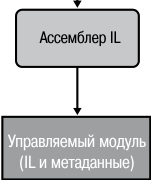


**----- Start of picture text -----**<br>
Ассемблер IL<br>Управляемый модуль<br>(IL и метаданные)<br>**----- End of picture text -----**<br>


**рис. 1.1.** .Компиляция.исходного.кода.в.управляемые.модули 

В табл. 1.1 описаны составные части управляемого модуля. 

**таблица 1.1.** .Части.управляемого.модуля. 

|**таблица 1.1.**Частиупр|авляемогомодуля|
|---|---|
|**Часть**|**Описание**|
|Заголовок PE32 или<br>PE32+|Стандартный заголовок PE-файла Windows, аналогичный за-<br>головку Common Object File Format (COFF). Файл с заголов-<br>ком в формате PE32 может выполняться в 32- и 64-разрядной<br>версиях Windows, а с заголовком PE32+ — только в 64-раз-<br>рядной. Заголовок обозначает тип файла: GUI, CUI или DLL,<br>он также имеет временную метку, показывающую, когда файл<br>был собран. Для модулей, содержащих только IL-код, основ-<br>ной объем информации в заголовке PE32(+) игнорируется.<br>В модулях, содержащих машинный код, этот заголовок содер-<br>жит сведения о машинном коде|
|Заголовок CLR|Содержит информацию (интерпретируемую CLR и утилита-<br>ми), которая превращает этот модуль в управляемый. Заголо-<br>вок включает нужную версию CLR, некоторые флаги, метку<br>метаданных`MethodDef`точки входа в управляемый модуль<br>(метод`Main`), а также месторасположение/размер метаданных<br>модуля, ресурсов, строгого имени, некоторых флагов и пр.|
|Метаданные|Каждый управляемый модуль содержит таблицы метаданных.<br>Есть два основных вида таблиц — это таблицы, описывающие<br>типы данных и их члены, определенные в исходном коде, и та-<br>блицы, описывающие типы данных и их члены, на которые<br>имеются ссылки в исходном коде|
|Код Intermediate<br>Language (IL)|Код, создаваемый компилятором при компиляции исходно-<br>го кода. Впоследствии CLR компилирует IL в машинные<br>команды|


**31** 

Компиляция.исходного.кода.в.управляемые.модули 

Каждый компилятор, предназначенный для CLR, помимо генерирования IL-кода, должен также создавать полные _метаданные_ (metadata) для каждого управляемого модуля. Проще говоря, метаданные — это набор таблиц данных, описывающих то, что определено в модуле, например типы и их члены. В метаданных также есть таблицы, указывающие, на что ссылается управляемый модуль, например на импортируемые типы и их члены. Метаданные расширяют возможности таких старых технологий, как библиотеки типов COM и файлы IDL (Interface Definition Language, язык описания интерфейсов). Важно отметить, что метаданные CLR содержат куда более полную информацию. И, в отличие от библиотек типов и IDL-файлов, они всегда связаны с файлом, содержащим IL-код. Фактически метаданные всегда встроены в тот же EXE- или DLL-файл, что и код, так что их нельзя разделить. А поскольку компилятор генерирует метаданные и код одновременно и привязывает их к конечному управляемому модулю, возможность рассинхронизации метаданных и описываемого ими IL-кода исключена. 

Метаданные находят много применений. Перечислим лишь некоторые из них. 

- Метаданные устраняют необходимость в заголовочных и библиотечных файлах при компиляции, так как все сведения об упоминаемых типах/членах содержатся в файле с реализующим их IL-кодом. Компиляторы могут читать метаданные прямо из управляемых модулей. 

- Среда Microsoft Visual Studio использует метаданные для облегчения написания кода. Ее функция IntelliSense анализирует метаданные и сообщает, какие методы, свойства, события и поля предпочтительны в данном случае и какие именно параметры требуются конкретным методам. 

- В процессе верификации кода CLR использует метаданные, чтобы убедиться, что код совершает только «безопасные по отношению к типам» операции. (Проверка кода обсуждается далее.) 

- Метаданные позволяют сериализовать поля объекта, а затем передать эти данные по сети на удаленный компьютер и там провести процесс десериализации, восстановив объект и его состояние на удаленном компьютере. 

- Метаданные позволяют сборщику мусора отслеживать жизненный цикл объектов. При помощи метаданных сборщик мусора может определить тип объектов и узнать, какие именно поля в них ссылаются на другие объекты. 

В главе 2 метаданные описаны более подробно. 

Языки программирования C#, Visual Basic, F# и IL-ассемблер всегда создают модули, содержащие управляемый код (IL) и управляемые данные (данные, поддерживающие сборку мусора). Для выполнения любого управляемого модуля на машине конечного пользователя должна быть установлена среда CLR (в составе .NET Framework) — так же, как для выполнения приложений MFC или Visual Basic 6.0 должны быть установлены библиотека классов Microsoft Foundation Class (MFC) или DLL-библиотеки Visual Basic. 

**32** Глава.1 .Модель.выполнения.кода.в.среде.CLR 

По умолчанию компилятор Microsoft C++ создает EXE- и DLL-файлы, которые содержат неуправляемый код и неуправляемые данные. Для их выполнения CLR не требуется. Однако если вызвать компилятор C++ с параметром `/CLR` в командной строке, он создаст управляемые модули (и конечно, для работы этих модулей должна быть установлена среда CLR). Компилятор C++ стоит особняком среди всех упомянутых компиляторов производства Microsoft — только он позволяет разработчикам писать как управляемый, так и неуправляемый код и встраивать его в единый модуль. Это также единственный компилятор Microsoft, разрешающий программистам определять в исходном коде как управляемые, так и неуправляемые типы данных. Компилятор Microsoft предоставляет разработчику непревзойденную гибкость, позволяя использовать существующий неуправляемый код на C/ C++ из управляемого кода и постепенно, по мере необходимости, переходить на управляемые типы. 

## **Объединение управляемых модулей в сборку** 

На самом деле среда CLR работает не с модулями, а со сборками. _Сборка_ (assembly) — это абстрактное понятие, понять смысл которого на первых порах бывает нелегко. Во-первых, сборка обеспечивает логическую группировку одного или нескольких управляемых модулей или файлов ресурсов. Во-вторых, это наименьшая единица многократного использования, безопасности и управления версиями. Сборка может состоять из одного или нескольких файлов — все зависит от выбранных средств и компиляторов. В контексте среды CLR сборкой называется то, что мы обычно называем _компонентом_ . 

О сборках довольно подробно рассказано в главе 2, а здесь достаточно подчеркнуть, что это концептуальное понятие обозначает способ объединения группы файлов в единую сущность. 

Рисунок 1.2 поможет понять суть сборки. На этом рисунке изображены некоторые управляемые модули и файлы ресурсов (или данных), с которыми работает некоторая программа. Эта программа создает единственный файл PE32(+), который обеспечивает логическую группировку файлов. При этом в файл PE32(+) включаетсяч блок данных, называемый _манифестом_ (manifest). Манифест представляет собой обычный набор таблиц метаданных. Эти таблицы описывают файлы, которые входят в сборку, общедоступные экспортируемые типы, реализованные в файлах сборки, а также относящиеся к сборке файлы ресурсов или данных. 

По умолчанию компиляторы сами выполняют работу по преобразованию созданного управляемого модуля в сборку, то есть компилятор C# создает управляемый модуль с манифестом, указывающим, что сборка состоит только из одного файла. Таким образом, в проектах, где есть только один управляемый модуль и нет файлов 

Объединение.управляемых.модулей.в.сборку 

**33** 

ресурсов (или файлов данных), сборка и является управляемым модулем, поэтому выполнять дополнительные действия по компоновке приложения не нужно. В случае если необходимо сгруппировать несколько файлов в сборку, потребуются дополнительные инструменты (например, компоновщик сборок AL exe) со своими параметрами командной строки. О них подробно рассказано в главе 2. 


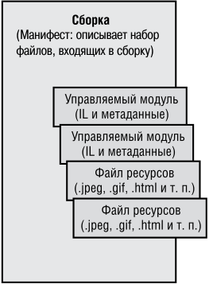


**----- Start of picture text -----**<br>
(Манифест: описывает набор<br>файлов, входящих в сборку)<br>**----- End of picture text -----**<br>


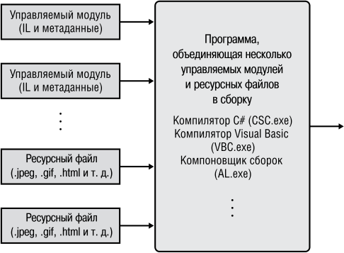


**рис. 1.2.** .Объединение.управляемых.модулей.в.сборку 

Сборка позволяет разделить логическое и физическое представления компонента, поддерживающего многократное использование, безопасность и управление версиями. Разбиение программного кода и ресурсов на разные файлы полностью определяется желаниями разработчика. Например, редко используемые типы и ресурсы можно вынести в отдельные файлы сборки. Отдельные файлы могут загружаться по запросу из Интернета по мере необходимости в процессе выполнения программы. Если некоторые файлы не потребуются, то они не будут загружаться, что сохранит место на жестком диске и сократит время установки программы. Сборки позволяют разбить на части процесс развертывания файлов, при этом все файлы будут рассматриваться как единый набор. 

Модули сборки также содержат сведения о других сборках, на которые они ссылаются (в том числе номера их версий). Эти данные делают сборку _самоописываемой_ (self-describing). Другими словами, среда CLR может определить все прямые зависимости данной сборки, необходимые для ее выполнения. Не нужно размещать никакой дополнительной информации ни в системном реестре, ни в доменной службе AD DS (Active Directory Domain Services). Вследствие этого развертывать сборки гораздо проще, чем неуправляемые компоненты. 

**34** Глава.1 .Модель.выполнения.кода.в.среде.CLR 

## **загрузка CLR** 

Каждая создаваемая сборка представляет собой либо исполняемое приложение, либо библиотеку DLL, содержащую набор типов для использования в исполняемом приложении. Разумеется, среда CLR отвечает за управление исполнением кода. Это значит, что на компьютере, выполняющем данное приложение, должна быть установлена платформа .NET Framework. В компании Microsoft был создан дистрибутивный пакет .NET Framework для свободного распространения, который вы можете бесплатно поставлять своим клиентам. Некоторые версии операционной системы семейства Windows поставляются с уже установленной платформой .NET Framework. 

Для того чтобы понять, установлена ли платформа .NET Framework на компьютере, попробуйте найти файл MSCorEE dll в каталоге %SystemRoot%\system32. Если он есть, то платформа .NET Framework установлена. Однако на одном компьютере может быть установлено одновременно несколько версий .NET Framework. Чтобы определить, какие именно версии установлены, проверьте содержимое следующих подкаталогов: 

```
%SystemRoot%\Microsoft.NET\Framework
```

```
%SystemRoot%\Microsoft.NET\Framework64
```

Компания Microsoft включила в .NET Framework SDK утилиту командной строки CLRVer exe, которая выводит список всех версий CLR, установленных на машине, а также сообщает, какая именно версия среды CLR используется текущими процессами. Для этого нужно указать параметр `–all` или идентификатор интересующего процесса. 

Прежде чем переходить к загрузке среды CLR, поговорим поподробнее об особенностях 32- и 64-разрядных версий операционной системы Windows. Если сборка содержит только управляемый код с контролем типов, она должна одинаково хорошо работать на обеих версиях системы. Дополнительной модификации исходного кода не требуется. Более того, созданный компилятором готовый EXE- или DLL-файл будет правильно выполняться в Windows версий x86 и x64, а библиотеки классов и приложения Windows Store будут работать на машинах с Windows RT (использующих процессор ARM). Другими словами, один и тот же файл будет работать на любом компьютере с установленной платформой .NET Framework. 

В исключительно редких случаях разработчикам приходится писать код, совместимый только с какой-то конкретной версией Windows. Обычно это требуется при работе с небезопасным кодом (unsafe code) или для взаимодействия с неуправляемым кодом, ориентированным на конкретную процессорную архитектуру. Для таких случаев у компилятора C# предусмотрен параметр командной строки `/platform` . Этот параметр позволяет указать конкретную версию целевой платформы, на которой планируется работа данной сборки: архитектуру х86, использующую только 32-разрядную систему Windows, архитектуру х64, использующую только 64-разрядную операционную систему Windows, или архитектуру ARM, на которой работает только 

Загрузка.CLR **35** 

32-разрядная Windows RT. Если платформа не указана, компилятор задействует значение по умолчанию `anycpu` , которое означает, что сборка может выполняться в любой версии Windows. Пользователи Visual Studio могут указать целевую платформу в списке Platform Target на вкладке Build окна свойств проекта (рис. 1.3). 


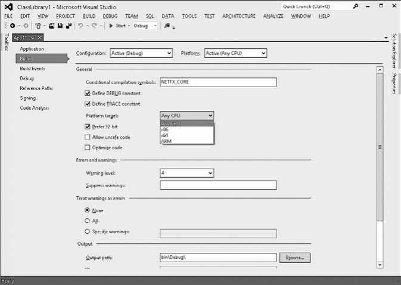


**рис. 1.3.** .Определение.целевой.платформы.средствами.Visual.Studio 

На рис. 1.3 обратите внимание на флажок Prefer.32-Bit. Он доступен только в том случае, когда в списке Platform.Target выбрана строка Any.CPU, а для выбранного типа проекта создается исполняемый файл. Если установить флажок Prefer.32-Bit, то Visual Studio запускает компилятор C# с параметром командной строки `/platform: anycpu 32bitpreferred` . Этот параметр указывает, что исполняемый файл должен выполняться как 32-разрядный даже на 64-разрядных машинах. Если вашему приложению не нужна дополнительная память, доступная для 64-разрядных процессов, обычно стоит выбрать именно этот режим, потому что Visual Studio не поддерживает функцию «Изменить и продолжить» (Edit-and-Continue) для приложений x64. Кроме того, 32-разрядные приложения могут взаимодействовать с 32-разрядными библиотеками DLL и компонентами COM, если этого потребует ваше приложение. 

В зависимости от указанной целевой платформы C# генерирует заголовок — PE32 или PE32+, а также включает в него требуемую процессорную архитектуру (или признак независимости от архитектуры). Для анализа заголовочной информации, вставленной компилятором в управляемый модуль, Microsoft предоставляет две утилиты — DumpBin exe и CorFlags exe. 

**36** Глава.1 .Модель.выполнения.кода.в.среде.CLR 

При запуске исполняемого файла Windows анализирует заголовок EXE-файла для определения того, какое именно адресное пространство необходимо для его работы — 32- или 64-разрядное. Файл с заголовком PE32 может выполняться в адресном пространстве любого из указанных двух типов, а файлу с заголовком PE32+ требуется 64-разрядное пространство. Windows также проверяет информацию о процессорной архитектуре на совместимость с заданной конфигурацией. Наконец, 64-разрядные версии Windows поддерживают технологию выполнения 32-разрядных приложений в 64-разрядной среде, которая называется _WoW64_ (Windows on Windows64). 

Таблица 1.2 иллюстрирует две важные вещи. Во-первых, в ней показан тип получаемого управляемого модуля для разных значений параметра `/platform` командной строки компилятора C#. Во-вторых, в ней представлены режимы выполнения приложений в различных версиях Windows. 

**таблица 1.2.** .Влияние.значения./platform.на.получаемый.модуль. и.режим.выполнения. 

|**значение**<br>**параметра /**<br>**platform**|**тип выходного**<br>**управляемого**<br>**модуля**|**x86 Windows**|**x64 Windows**|**ARM Windows**<br>**RT**|
|---|---|---|---|---|
|anycpu (по<br>умолчанию)|PE32/неза-<br>висимый от<br>платформы|Выполняется<br>как 32-раз-<br>рядное прило-<br>жение|Выполняется<br>как 64-разряд-<br>ное приложение|Выполняется<br>как 32-раз-<br>рядное прило-<br>жение|
|anycpu32bit-<br>preferred|PE32/неза-<br>висимый от<br>платформы|Выполняется<br>как 32-раз-<br>рядное прило-<br>жение|Выполняется<br>как WoW64-<br>приложение|Выполняется<br>как 32-раз-<br>рядное прило-<br>жение|
|х86|PE32/x86|Выполняется<br>как 32-раз-<br>рядное прило-<br>жение|Выполняется<br>как WoW64-<br>приложение|Не выполня-<br>ется|
|х64|PE32+/x64|Не выполня-<br>ется|Выполняется<br>как 64-разряд-<br>ное приложение|Не выполня-<br>ется|
|ARM|PE32+/Itanium|Не выполня-<br>ется|Не выполняется|Выполняется<br>как 32-раз-<br>рядное прило-<br>жение|


После анализа заголовка EXE-файла для выяснения того, какой процесс необходимо запустить — 32- или 64-разрядный, — Windows загружает в адресное 

Исполнение.кода.сборки 

**37** 

пространство процесса соответствующую версию библиотеки MSCorEE dll.(x86, x64 или ARM). В системах Windows семейств x86 и ARM 32-разрядная версия MSCorEE dll хранится в каталоге %SystemRoot%\System32. В системах x64 версия x86 библиотеки находится в каталоге %SystemRoot%\SysWow64, а 64-разрядная версия MSCorEE dll размещается в каталоге %SystemRoot%\System32 (это сделано из соображений обратной совместимости). Далее основной поток вызывает определенный в библиотеке MSCorEE dll метод, который инициализирует CLR, загружает сборку EXE, а затем вызывает ее метод `Main` , в котором содержится точка входа. На этом процедура запуска управляемого приложения считается завершенной[1] . 

## **ПриМеЧание** 

Сборки,.созданные.при.помощи.версий.7 0.и.7 1.компилятора.C#.от.Microsoft,.содержат.заголовок.PE32.и.не.зависят.от.архитектуры.процессора .Тем.не.менее.во. время.выполнения.среда.CLR.считает.их.совместимыми.только.с.архитектурой.x86 . Это.повышает.вероятность.максимально.корректной.работы.в.64-разрядной.среде,. так.как.исполняемый.файл.загружается.в.режиме.WoW64,.который.обеспечивает. процессу.среду,.максимально.приближенную.к.существующей.в.32-разрядной. версии.x86.Windows 

Когда неуправляемое приложение вызывает функцию Win32 `LoadLibrary` для загрузки управляемой сборки, Windows автоматически загружает и инициализирует CLR (если это еще не сделано) для обработки содержащегося в сборке кода. Ясно, что в такой ситуации предполагается, что процесс запущен и работает, и это сокращает область применимости сборки. В частности, управляемая сборка, скомпилированная с параметром `/platform:x86` , не сможет загрузиться в 64-разрядном процессе, а исполняемый файл с таким же параметром загрузится в режиме WoW64 на компьютере с 64-разрядной Windows. 

## **исполнение кода сборки** 

Как говорилось ранее, управляемые модули содержат метаданные и программный код IL. Это не зависящий от процессора машинный язык, разработанный компанией Microsoft после консультаций с несколькими коммерческими и академическими организациями, специализирующимися на разработке языков и компиляторов. IL — язык более высокого уровня по сравнению с большинством других машинных языков. Он позволяет работать с объектами и имеет команды для создания 

> 1 Программный код может запросить переменную окружения Is64BitOperatingSystem для того, чтобы определить, выполняется ли данная программа в 64-разрядной системе Windows, а также запросить переменную окружения Is64BitProcess, чтобы определить, выполняется ли данная программа в  64-разрядном адресном пространстве. 

**38** Глава.1 .Модель.выполнения.кода.в.среде.CLR 

и инициализации объектов, вызова виртуальных методов и непосредственного манипулирования элементами массивов. В нем даже есть команды инициирования и перехвата исключений для обработки ошибок. IL можно рассматривать как объектно-ориентированный машинный язык. 

Обычно разработчики программируют на высокоуровневых языках, таких как C#, Visual Basic или F#. Компиляторы этих языков генерируют IL-код. Однако такой код может быть написан и на языке ассемблера, так, Microsoft предоставляет ассемблер IL (ILAsm exe), а также дизассемблер IL (ILDasm exe). 

Имейте в виду, что любой язык высокого уровня, скорее всего, использует лишь часть возможностей, предоставляемых CLR. При этом язык ассемблера IL открывает доступ ко всем возможностям CLR. Если выбранный вами язык программирования не дает доступа именно к тем функциям CLR, которые необходимы, можно написать часть программного кода на ассемблере IL или на другом языке программирования, позволяющем их задействовать. 

Узнать о возможностях CLR, доступных при использовании конкретного языка, можно только при изучении соответствующей документации. В этой книге сделан акцент на возможностях среды CLR и на том, какие из этих возможностей доступны при программировании на C#. Подозреваю, что в других книгах и статьях среда CLR рассматривается с точки зрения других языков и разработчики получают представление лишь о тех ее функциях, которые доступны при использовании описанных там языков. Впрочем, если выбранный язык решает поставленные задачи, такой подход не так уж плох. 

## **ВниМание** 

Я.думаю,.что.возможность.легко.переключаться.между.языками.при.их.тесной.интеграции.—.чудесное.качество.CLR .К.сожалению,.я.также.практически.уверен,.что. разработчики.часто.будут.проходить.мимо.нее .Такие.языки,.как.C#.и.Visual.Basic,. прекрасно.подходят.для.программирования.ввода-вывода .Язык.APL.(A.Programming. Language).—.замечательный.язык.для.инженерных.и.финансовых.расчетов .Среда. CLR.позволяет.написать.на.C#.часть.приложения,.отвечающую.за.ввод-вывод,. а.инженерные.расчеты.—.на.языке.APL .Среда.CLR.предлагает.беспрецедентный. уровень.интеграции.этих.языков,.и.во.многих.проектах.стоит.серьезно.задуматься. об.использовании.одновременно.нескольких.языков 

Для выполнения какого-либо метода его IL-код должен быть преобразован в машинные команды. Этим занимается JIT-компилятор ( Just-In-Time) среды CLR. На рис. 1.4 показано, что происходит при первом вызове метода. 

Непосредственно перед исполнением метода `Main` среда CLR находит все типы данных, на которые ссылается программный код метода `Main` . При этом CLR выделяет внутренние структуры данных, используемые для управления доступом к типам, на которые есть ссылки. На рис. 1.4 метод `Main` ссылается на единственный тип — `Console` , и среда CLR выделяет единственную внутреннюю структуру. Эта внутренняя структура данных содержит по одной записи для каждого метода, 

Исполнение.кода.сборки 

**39** 

определенного в типе `Console` . Каждая запись содержит адрес, по которому можно найти реализацию метода. При инициализации этой структуры CLR заносит в каждую запись адрес внутренней недокументированной функции, содержащейся в самой среде CLR. Я обозначаю эту функцию `JITCompiler` . 


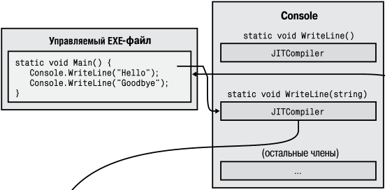


**----- Start of picture text -----**<br>
-ôàéë<br>(остальные члены)<br>**----- End of picture text -----**<br>


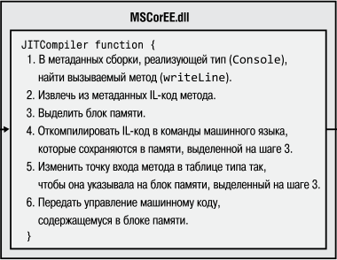


**рис. 1.4.** .Первый.вызов.метода 

Когда метод `Main` первый раз обращается к методу `WriteLine` , вызывается функция `JITCompiler` . Она отвечает за компиляцию IL-кода вызываемого метода в собственные команды процессора. Поскольку IL-код компилируется непосредственно перед выполнением («just in time»), этот компонент CLR часто называют _JIT-компилятором_ . 

## **ПриМеЧание** 

Если.приложение.исполняется.в.х86.версии.Windows.или.в.режиме.WoW64,.JITкомпилятор.генерирует.команды.для.архитектуры.x86 .Для.приложений,.выполняемых. как.64-разрядные.в.версии.x64.Windows,.JIT-компилятор.генерирует.команды.x64 . Наконец,.если.приложение.выполняется.в.ARM-версии.Windows,.JIT-компилятор. генерирует.инструкции.ARM 

**40** Глава.1 .Модель.выполнения.кода.в.среде.CLR 

Функции `JITCompiler` известен вызываемый метод и тип, в котором он определен. `JITCompiler` ищет в метаданных соответствующей сборки IL-код вызываемого метода. Затем `JITCompiler` проверяет и компилирует IL-код в машинные команды, которые сохраняются в динамически выделенном блоке памяти. После этого `JITCompiler` возвращается к структуре внутренних данных типа, созданной средой CLR, и заменяет адрес вызываемого метода адресом блока памяти, содержащего готовые машинные команды. В завершение `JITCompiler` передает управление коду в этом блоке памяти. Этот программный код является реализацией метода `WriteLine` (вариант этого метода с параметром `String` ). Из этого метода управление возвращается в метод `Main` , который продолжает выполнение в обычном порядке. 

Рассмотрим повторное обращение метода `Main` к методу `WriteLine` . К этому моменту код метода `WriteLine` уже проверен и скомпилирован, так что обращение к блоку памяти производится напрямую, без вызова `JITCompiler` . Отработав, метод `WriteLine` возвращает управление методу `Main` . На рис. 1.5 показано, как выглядит ситуация при повторном обращении к методу `WriteLine` . 


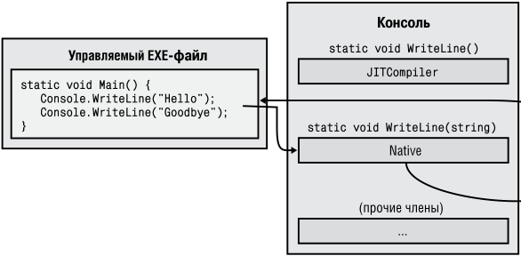


**----- Start of picture text -----**<br>
Êîíñîëü<br>-ôàéë<br>**----- End of picture text -----**<br>


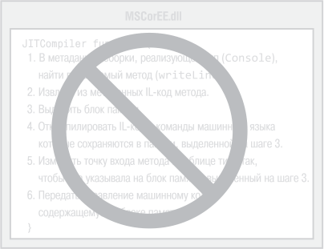


**рис. 1.5.** .Повторный.вызов.метода 

Исполнение.кода.сборки 

**41** 

Снижение производительности наблюдается только при первом вызове метода. Все последующие обращения выполняются «на максимальной скорости», потому что повторная верификация и компиляция не производятся. 

JIT-компилятор хранит машинные команды в динамической памяти. Это значит, что скомпилированный код уничтожается по завершении работы приложения. Для повторного вызова приложения или для параллельного запуска его второго экземпляра (в другом процессе операционной системы) JIT-компилятору придется заново скомпилировать IL-код в машинные команды. В зависимости от приложения это может привести к существенному повышению затрат памяти по сравнению с низкоуровневыми приложением, у которых находящийся в памяти код доступен только для чтения и совместно используется всеми экземплярами приложения. 

Для большинства приложений снижение производительности, связанное с работой JIT-компилятора, незначительно. Большинство приложений раз за разом обращается к одним и тем же методам. На производительности это сказывается только один раз во время выполнения приложения. К тому же выполнение самого метода обычно занимает больше времени, чем обращение к нему. 

Также следует учесть, что JIT-компилятор среды CLR оптимизирует машинный код аналогично компилятору неуправляемого кода C++. И опять же: создание оптимизированного кода занимает больше времени, но при выполнении он гораздо производительнее, чем неоптимизированный. 

Есть два параметра компилятора C#, влияющих на оптимизацию кода, — `/optimize` и `/debug` . В следующей таблице показано их влияние на качество IL-кода, созданного компилятором C#, и машинного кода, сгенерированного JITкомпилятором. 

|<br>компилятором.|||
|---|---|---|
|**Параметры компилятора**|**Качество IL-кода**<br>**компилятора**|**Качество машинного**<br>**JIT-кода**|
|`/optimize-` `/debug-`<br>(по умолчанию)|Неоптимизированный|Оптимизированный|
|`/optimize-` `/debug(+/full/`<br>`pdbonly)`|Неоптимизированный|Неоптимизированный|
|`/optimize+` `/debug(-/+/full/`<br>`pbdonly)`|Оптимизированный|Оптимизированный|


C параметром `/optimize-` компилятор С# генерирует неоптимизированный ILкод, содержащий множество пустых команд (no-operation, NOP). Эти команды предназначены для поддержки функции «Изменить и продолжить» (edit-and-continue) в Visual Studio во время процесса отладки. Они также упрощают процесс отладки, позволяя расставлять точки останова (breakpoints) на управляющих командах, таких как `for` , `while` , `do` , `if` , `else` , а также блоках `try` , `catch` и `finally` . Во время оптимизации IL-кода компилятор С# удаляет эти посторонние команды, усложняя 

**42** Глава.1 .Модель.выполнения.кода.в.среде.CLR 

процесс отладки кода, но зато оптимизируя поток управления программой. Кроме того, возможно, некоторые оценочные функции не выполняются во время отладки. Однако IL-код меньше по размерам, и это уменьшает результирующий размер EXEили DLL-файлов; кроме того, IL-код легче читать тем, кто обожает исследовать IL-код, пытаясь понять, что именно породил компилятор (например, мне). 

Кроме того, компилятор строит файл PDB (Program Database) только при задании параметра `/debug(+/full/pdbonly)` . Файл PDB помогает отладчику находить локальные переменные и связывать команды IL с исходным кодом. Параметр `/debug:full` сообщает JIT-компилятору о том, что вы намерены заняться отладкой сборки; JIT-компилятор сохраняет информацию о том, какой машинный код был сгенерирован для каждой команды IL. Это позволяет использовать функцию JIT-отладки Visual Studio для связывания отладчика с уже работающим процессом и упрощения отладки кода. Без параметра `/debug:full` компилятор по умолчанию не сохраняет информацию о соответствии между IL и машинным кодом; это несколько ускоряет компиляцию и сокращает затраты памяти. Если запустить процесс в отладчике Visual Studio, то JIT-компилятор будет отслеживать информацию о соответствии IL и машинного кода (независимо от состояния параметра `/ debug` ), если только вы не снимете флажок Suppress.JIT.Optimization.On.Module.Load. (Managed.Only) в Visual Studio. 

При создании нового проекта C# в Visual Studio в отладочной конфигурации проекта устанавливаются параметры `/optimize` и `/debug:full` , а в конфигурации выпуска – параметры `/optimize+` и `/debug:pdbonly` . 

Разработчиков с опытом написания неуправляемого кода C или C++ обычно беспокоит, как все это сказывается на быстродействии. Ведь неуправляемый код компилируется для конкретного процессора и при вызове может просто выполняться. В управляемой среде компиляция кода состоит из двух фаз. Сначала компилятор проходит по исходному коду, выполняя максимально возможную работу по генерированию IL-кода. Но для выполенния кода сам IL-код должен быть откомпилирован в машинные команды во время выполнения, что требует выделения дополнительной памяти, которая не может использоваться совместно, и дополнительных затрат процессорного времени. 

Я и сам пришел к CLR с опытом программирования на C/C++ и меня сильно беспокоили дополнительные затраты. Действительно, вторая стадия компиляции, происходящая во время выполнения, замедляет выполнение и требует выделения динамической памяти. Однако компания Microsoft основательно потрудилась над оптимизацией, чтобы свести эти дополнительные затраты к минимуму. 

Если вы тоже скептически относитесь к двухфазной компиляции, обязательно попробуйте построить приложения и измерьте их быстродействие. Затем проделайте то же самое с какими-нибудь нетривиальными управляемыми приложениями, созданными Microsoft или другими компаниями. Вас удивит, насколько эффективно они выполняются. 

Трудно поверить, но многие специалисты (включая меня) считают, что управляемые приложения способны даже превзойти по производительности неуправляемые 

Исполнение.кода.сборки **43** 

приложения. Это объясняется многими причинами. Например, в тот момент, когда JIT-компилятор компилирует IL-код в машинный код во время выполнения, он знает о среде выполнения больше, чем может знать неуправляемый компилятор. Перечислим некоторые возможности повышения производительности управляемого кода по сравнению с неуправляемым: 

- JIT-компилятор может определить, что приложение выполняется на процессоре Intel Pentium 4, и сгенерировать машинный код со специальными командами, поддерживаемыми Pentium 4. Обычно неуправляемые приложения компилируются с самым общим набором команд и не используют специальные команды, способные повысить эффективность приложения. 

- JIT-компилятор может определить, что некоторое условие на том компьютере, на котором он выполняется, всегда оказывается ложным. Допустим, метод содержит следующий фрагмент: 

```
if (numberOfCPUs > 1) {
```

```
 ...
```

```
}
```

Если компьютер оснащен всего одним процессором, то JIT-компилятор не будет генерировать машинные команды для указанного фрагмента. В этом случае машинный код оптимизируется для конкретной машины, а следовательно, занимает меньше места и быстрее выполняется. 

- CLR может профилировать выполняемую программу и перекомпилировать IL в машинный код в процессе выполнения. Перекомпилированный код реорганизуется для сокращения ошибочного прогнозирования переходов на основании наблюдаемых закономерностей выполнения. Текущие версии CLR такую возможность не поддерживают, но возможно, она появится в будущих версиях. 

Это лишь некоторые из причин, по которым в будущем управляемый код может превзойти по производительности неуправляемый код. Как я уже сказал, в большинстве приложений достигается вполне неплохая производительность и в будущем стоит ожидать ее улучшения. 

Если ваши эксперименты показывают, что JIT-компилятор не обеспечивает вашему приложению необходимого уровня производительности, возможно, вам стоит воспользоваться утилитой NGen exe из пакета .NET Framework SDK. Эта утилита компилирует весь IL-код сборки в машинный код и сохраняет его в файле на диске. В момент выполнения при загрузке сборки CLR автоматически проверяет, существует ли заранее откомпилированная версия сборки, и если существует — загружает ее, так что компиляция во время выполнения уже не требуется. Учтите, что NGen exe приходится осторожно строить предположения относительно фактической среды выполнения, поэтому код, генерируемый NGen exe, будет менее оптимизированным, чем код JIT-компилятора. 

Также при анализе производительности может пригодиться класс `System. Runtime.ProfileOptimization` . Он заставляет CLR сохранить (в файле) инфор- 

**44** Глава.1 .Модель.выполнения.кода.в.среде.CLR 

мацию о том, какие методы проходят JIT-компиляцию во время выполнения приложения. Если машина, на которой работает приложение, оснащена несколькими процессорами, при будущих запусках приложения JIT-компилятор параллельно компилирует эти методы в других программных потоках. В результате приложение работает быстрее, потому что несколько методов компилируются параллельно, причем это происходит во время инициализации приложения (вместо JIT-компиляции). 

## **IL-код и верификация** 

IL является стековым языком; это означает, что все его инструкции заносят операнды в исполнительный стек и извлекают результаты из стека. IL не содержит инструкций для работы с регистрами, и это упрощает создание новых языков и компиляторов, генерирующих код для CLR. 

Инструкции IL также являются нетипизованными. Например, в IL имеется инструкция для сложения двух последних операндов, занесенных в стек. У инструкции сложения нет двух раздельных версий (32-разрядной и 64-разрядной). При выполнении инструкция сложения определяет типы операндов, хранящихся в стеке, и выполняет соответствующую операцию. 

Однако, на мой взгляд, самое большое преимущество IL-кода состоит даже не в том, что он абстрагирует разработчика от конкретного процессора. IL-код обеспечивает безопасность приложения и его устойчивость перед ошибками. В процессе компиляции IL в машинные инструкции CLR выполняется процедура, называемая _верификацией_ — анализ высокоуровневого кода IL и проверка безопасности всех операций. Например, верификация убеждается в том, что каждый метод вызывается с правильным количеством параметров, что все передаваемые параметры имеют правильный тип, что возвращаемое значение каждого метода используется правильно, что каждый метод содержит инструкцию `return` и т. д. Вся информация о методах и типах, используемая в процессе верификации, хранится в метаданных управляемого модуля. 

В системе Windows каждый процесс обладает собственным виртуальным адресным пространством. Необходимость разделения адресных пространств объясняется тем, что код приложения в принципе ненадежен. Ничто не мешает приложению выполнить операцию чтения или записи по недопустимому адресу памяти (и к сожалению, это часто происходит на практике). Размещение процессов Windows в изолированных адресных пространствах обеспечивает защищенность и стабильность системы; один процесс не может повредить другому процессу. 

Однако верификация управляемого кода гарантирует, что код не будет некорректно обращаться к памяти и не сможет повредить выполнению кода другого приложения. Это означает, что вы можете запустить несколько управляемых приложений в одном виртуальном адресном пространстве Windows. 

Так как процессы Windows требуют значительных затрат ресурсов операционной системы, избыток их в системе снижает производительность и ограничивает 

Исполнение.кода.сборки **45** 

доступные ресурсы. Сокращение количества процессов за счет запуска нескольких приложений в одном процессе операционной системы улучшает производительность, снижает затраты ресурсов и обеспечивает такой же уровень защиты, как если бы каждое приложение располагало собственным процессом. Это еще одно преимущество управляемого кода по сравнению с неуправляемым. 

Итак, CLR предоставляет возможность выполнения нескольких управляемых приложений в одном процессе операционной системы. Каждое управляемое приложение выполняется в домене приложений (AppDomain). По умолчанию каждый управляемый EXE-файл работает в отдельном адресном пространстве, состоящем из одного домена. Тем не менее процесс, обеспечивающий размещение (хостинг) CLR — например, IIS (Internet Information Services) или Microsoft SQL Server, — может запустить несколько доменов приложений в одном процессе операционной системы. Обсуждению доменов приложений посвящена одна из частей главы 22. 

## **небезопасный код** 

По умолчанию компилятор C# компании Microsoft генерирует безопасный код. Под этим термином понимается код, безопасность которого подтверждается в процессе верификации. Тем не менее компилятор Microsoft C# также позволяет разработчикам писать небезопасный код, способный напрямую работать с адресами памяти и манипулировать с байтами по этим адресам. Как правило, эти чрезвычайно мощные средства применяются для взаимодействия с неуправляемым кодом или для оптимизации алгоритмов, критичных по времени. 

Однако использование небезопасного кода создает значительный риск: небезопасный код может повредить структуры данных и использовать (или даже создавать) уязвимости в системе безопасности. По этой причине компилятор C# требует, чтобы все методы, содержащие небезопасный код, помечались ключевым словом `unsafe` , а при компиляции исходного кода использовался параметр компилятора /unsafe. 

Когда JIT-компилятор пытается откомпилировать небезопасный метод, он сначала убеждается в том, что сборке, содержащей метод, были предоставлены разрешения `System.Security.Permissions.SecurityPermission` с установленным флагом `SkipVerification` из перечисления `System.Security.Permissions. SecurityPermissionFlag` . Если флаг установлен, JIT-компилятор компилирует небезопасный код и разрешает его выполнение. CLR доверяет этому коду и надеется, что прямой доступ к памяти и манипуляции с байтами не причинят вреда. Если флаг не установлен, JIT-компилятор выдает исключение `System. InvalidProgramException` или `System.Security.VerificationException` , предотвращая выполнение метода. Скорее всего, в этот момент приложение аварийно завершится, но по крайней мере без причинения вреда. 

Компания Microsoft предоставляет утилиту PEVerify.exe, которая проверяет все методы сборки и сообщает обо всех методах, содержащих небезопасный код. Возможно, вам стоит запустить PEVerify.exe для всех сборок, на которые вы ссылаетесь; это позволит узнать о возможных проблемах с запуском ваших приложений по интрасети или Интернету. 

- **46** Глава.1 .Модель.выполнения.кода.в.среде.CLR 

## **ПриМеЧание** 

По.умолчанию.сборки,.загружаемые.с.локальной.машины.или.по.сети,.обладают. полным.доверием;.это.значит,.что.им.разрешено.выполнение.чего.угодно,.включая. небезопасный.код .Однако.по.умолчанию.сборки,.выполняемые.по.Интернету,.не. получают.разрешений.на.выполнение.небезопасного.кода .Если.они.содержат.небезопасный.код,.выдается.одно.из.упомянутых.исключений .Администратор.или. конечный.пользователь.может.изменить.эти.настройки.по.умолчанию,.однако.в.этом. случае.он.несет.полную.ответственность.за.поведение.этого.кода 

Следует учитывать, что верификация требует доступа к метаданным, содержащимся во всех зависимых сборках. Таким образом, когда вы используете PEVerify для проверки сборки, программа должна быть способна найти и загрузить все упоминаемые сборки. Так как PEVerify использует CLR для поиска зависимых сборок, при этом используются те же правила привязки и поиска, которые обычно применяются при исполнении сборок. Эти правила будут рассмотрены в главах 2 и 3. 

## **IL и защита интеллектуальной собственности** 

Некоторых разработчиков беспокоит, что IL не обеспечивает достаточного уровня защиты интеллектуальной собственности для их алгоритмов. Иначе говоря, они полагают, что кто-то другой может воспользоваться дизассемблером IL, взять построенный ими управляемый модуль и легко восстановить логику кода приложения. 

Да, IL-код работает на более высоком уровне, чем большинство других ассемблеров, и в общем случае дизассемблирование IL-кода выполняется относительно просто. Однако при реализации кода, работающего на стороне сервера (веб-служба, веб-форма или хранимая процедура), сборка находится на сервере. Поскольку посторонний не сможет обратиться к сборке, он не сможет и воспользоваться любыми программами для просмотра IL — ваша интеллектуальная собственность в полной безопасности. 

Если вас беспокоят распространяемые сборки, используйте «маскировочные» утилиты от независимых разработчиков. Такие программы шифруют все закрытые символические имена в метаданных сборки. Постороннему будет трудно расшифровать такое имя и понять назначение каждого метода. Учтите, что маскировка предоставляет лишь относительную защиту, потому что среда CLR должна в какойто момент получить доступ к IL-коду для его JIT-компиляции. 

Если вы не считаете, что маскировка обеспечивает желаемый уровень защиты интеллектуальной собственности, рассмотрите возможность реализации более секретных алгоритмов в неуправляемом модуле, содержащем машинные команды вместо IL и метаданных. После этого вы сможете использовать средства взаимодействия CLR (при наличии достаточных разрешений) для работы с неуправляемыми частями ваших приложений. Конечно, такое решение предполагает, что вас не беспокоит возможность дизассемблирования машинных команд неуправляемого кода. 

Библиотека.FCL 

**47** 

## **NGen.exe** 

Программа NGen exe, входящая в поставку .NET Framework, может использоваться для компиляции IL-кода в машинный код при установке приложения на машине пользователя. Так как код компилируется на стадии установки, JIT-компилятору CLR не приходится компилировать его во время выполнения, что может улучшить быстродействие приложения. Программа NGen.exe полезна в двух ситуациях. 

**Ускорение запуска приложения.** Запуск NGen.exe ускоряет запуск, потому что код уже откомпилирован в машинную форму, и компиляцию не нужно выполнять на стадии выполнения. 

**Сокращение рабочего набора приложения.** Если вы ожидаете, что сборка будет загружаться в нескольких процессах одновременно, обработка ее программой NGen exe может сократить рабочий набор приложения. Дело в том, что NGen exe преобразует IL в машинный код и сохраняет результат в отдельном файле. Этот файл может отображаться на память в нескольких адресных пространствах одновременно, а код будет использоваться совместно, без использования каждым процессом собственного экземпляра кода. 

## **Библиотека FCL** 

Одним из компонентов .NET Framework является _FCL_ (Framework Class Library) — набор сборок в формате DLL, содержащих несколько тысяч определений типов, каждый из которых предоставляет некоторую функциональность. Компания Microsoft разрабатывает дополнительные библиотеки — такие, как Windows Azure SDK и DirectX SDK. Эти библиотеки содержат еще больше типов, предоставляя в ваше распоряжение еще больше функциональности. Сейчас, когда Microsoft с феноменальной скоростью выпускает огромное количество библиотек, разработчикам стало как никогда легко использовать технологии Microsoft. 

Ниже перечислены некоторые разновидности приложений, которые могут создаваться разработчиками при помощи этих сборок: 

**Веб-службы.** Технологии Microsoft ASP.NET XML Web Service и Windows Communication Foundation (WCF) позволяют очень легко создавать методы для обработки сообщений, передаваемых по Интернету. 

**Приложения Web Forms/приложения MVC на базе HTML.** Как правило, приложения ASP.NET обращаются с запросами к базам данных и вызовами к вебслужбам, объединяют и фильтруют полученную информацию, а затем представляют ее в браузере с использованием расширенного пользовательского интерфейса на базе HTML. 

**Приложения Windows с расширенным графическим интерфейсом.** Вместо реализации пользовательского интерфейса приложений в виде веб-страниц можно использовать более мощную и высокопроизводительную функциональность, 

**48** Глава.1 .Модель.выполнения.кода.в.среде.CLR 

предоставляемую технологиями Windows Store, WPF (Windows Presentation Foundation) и Windows Forms. Такие приложения могут использовать события элементов управления, меню, сенсорного экрана, мыши, пера и клавиатуры, а также могут обмениваться информацией с операционной системой, выдавать запросы к базам данных и пользоваться веб-службами. 

**Консольные приложения Windows.** Консольные приложения — простой и быстрый вариант для создания приложений с минимальными потребностями в пользовательском интерфейсе. Компиляторы, утилиты и вспомогательные инструменты часто реализуются в виде консольных приложений. 

**Службы Windows.** Да, теперь стало возможным построение служб (services), управляемых через Windows SCM (Service Control Manager) с использованием .NET Framework. 

**Хранимые процедуры баз данных.** Серверы баз данных Microsoft SQL Server, IBM DB2 и Oracle дают возможность разработчикам писать свои хранимые процедуры с использованием .NET Framework. 

**Библиотеки компонентов.** .NET Framework позволяет создавать автономные сборки (компоненты) с типами, легко встраиваемыми в приложения всех упоминавшихся разновидностей. 

## **ВниМание** 

В.Visual.Studio.также.предусмотрен.тип.проекта.Portable.Class.Librarу.для.создания. сборок.библиотек.классов,.работающих.с.разными.видами.приложений,.включая. классические.приложения. NET.Framework,.приложений.Silverlight,.Windows.Phone,. Windows.Store.и.Xbox.360 

Так как FCL содержит буквально тысячи типов, взаимосвязанные типы объединяются в одно пространство имен. Например, пространство имен `System` (которое вам стоит изучить как можно лучше) содержит базовый тип `Object` — «предок» всех остальных типов в системе. Кроме того, пространство имен `System` содержит типы для целых чисел, символов, строк, обработки исключений и консольного ввода-вывода, а также набор вспомогательных типов, осуществляющих безопасные преобразования между типами данных, форматирование, генерирование случайных чисел и выполняющих математические функции. Все приложения используют типы из пространства имен `System` . 

Чтобы использовать возможности FCL, необходимо знать, какое пространство имен содержит типы, предоставляющие нужную функциональность. Многие типы поддерживают настройку своего поведения; для этого тип просто объявляется производным от нужного типа FCL. Объектно-ориентированная природа платформы проявляется в том, как .NET Framework предоставляет разработчикам единую парадигму программирования. Кроме того, разработчик может легко создавать собственные пространства имен, содержащие его типы. Эти пространства и типы легко интегрируются в парадигму программирования. По сравнению с парадигмой программирования Win32 новый подход значительно упрощает процесс разработки. 

CTS **49** 

Большинство пространств имен в FCL содержит типы, которые могут использоваться в приложениях любых видов. В табл. 1.3 перечислены некоторые общие пространства имен и основные области применения типов этих пространств. Это очень маленькая выборка доступных пространств — чтобы больше узнать о постоянно расширяющемся множестве пространств имен, создаваемых компанией Microsoft, обращайтесь к документации различных пакетов Microsoft SDK. 

**таблица 1.3.** .Некоторые.пространства.имен.FCL 

|**таблица 1.3.**Некото|рыепространстваименFCL|
|---|---|
|**Пространство имен**|**Описание содержимого**|
|System|Все базовые типы, используемые в приложениях|
|System.Data|Типы для взаимодействия с базами данных и обработки данных|
|System.IO|Типы потокового ввода-вывода, обхода дерева каталогов и файлов|
|System.Net|Типы для низкоуровневых сетевых коммуникаций и использова-<br>ния распространенных протоколов Интернета|
|System.Runtime.<br>InteropServices|Типы, позволяющие управляемому коду работать с неуправляе-<br>мыми платформенными средствами (компонентами COM, функ-<br>циями Win32 и DLL-библиотек)|
|System.Security|Типы защиты данных и ресурсов|
|System.Text|Типы для работы с разными кодировками (такими, как ANSI<br>и Юникод)|
|System.Threading|Типы асинхронных операций и синхронизации доступа<br>к ресурсам|
|System.Xml|Типы для обработки схем и данных XML|


Эта книга посвящена CLR и типам общего назначения, тесно взаимодействующим с CLR. Таким образом, ее содержимое актуально для всех программистов, занимающихся разработкой приложений и компонентов для CLR. О конкретных разновидностях приложений — веб-служб, приложений Web Forms/MVC, WPF и т. д. — написано много замечательных книг, которые станут хорошей отправной точкой для разработки ваших собственных приложений. В этой книге я предоставляю информацию, которая относится не к конкретному типу приложений, а к платформе разработки. Прочитав эту книгу вместе с другой книгой, посвященной конкретным приложениям, вы сможете легко и эффективно создать приложение нужного типа. 

## **CTS** 

Вероятно, вы уже поняли, что самое важное в CLR — типы, предоставляющие функциональность вашим приложениям и другим типам. Механизм типов позволяет 

**50** Глава.1 .Модель.выполнения.кода.в.среде.CLR 

коду, написанному на одном языке программирования, взаимодействовать с кодом, написанным на другом языке. Поскольку типы занимают центральное место в CLR, компания Microsoft разработала формальную спецификацию _CTS_ (Common Type System), которая описывает способ определения и поведение типов. 

## **ПриМеЧание** 

Компания.Microsoft.предоставляет.CTS.вместе.с.другими.частями. NET.Framework. (форматы.файлов,.метаданные,.IL,.механизм.вызова.P/Invoke.и.т .д ).в.органкомитет.ECMA.с.целью.стандартизации .Стандарт.называется.CLI.(Common.Language. Infrastructure).и.определяется.спецификацией.ECMA-335 .Кроме.того,.компания. Microsoft.предоставила.отдельные.части.FCL,.язык.программирования.C#.(ECMA334).и.язык.программирования.C++/CLI .Информация.об.этих.отраслевых.стандартах.доступна.на.сайте.ECMA.по.адресу.http://www ecma-international org .Вы.также. можете.обратиться.на.сайт.Microsoft:.http://msdn microsoft com/en-us/netframework/ aa569283 aspx 

Согласно спецификации CTS, тип может содержать нуль и более членов. Подробные описания всех возможных членов типов приведены в части II книги, а пока я ограничусь краткими вводными описаниями: 

- **Поле** — переменная, являющаяся частью состояния объекта. Поля идентифицируются именем и типом. 

- **Метод** — функция, выполняющая операцию с объектом, часто с изменением его состояния. Метод обладает именем, сигнатурой и модификаторами. Сигнатура определяет количество параметров (и порядок их следования), типы параметров, наличие возвращаемого значения, и если оно имеется — тип значения, возвращаемого методом. 

- **Свойство** — с точки зрения вызывающей стороны выглядит как поле, но в реализации типа представляет собой метод (или два). Свойства позволяют организовать проверку параметров или состояния объекта перед обращением к значению и/или вычислять его значение только при необходимости. Кроме того, они упрощают синтаксис работы с данными и позволяют создавать «поля», доступные только для чтения или записи. 

- **Событие** — используется для создания механизма оповещения между объектом и другими заинтересованными объектами. Например, кнопка может поддерживать событие, оповещающее другие объекты о щелчке на ней. 

CTS также задает правила видимости типов и доступа к членам типа. Например, помечая тип как открытый (ключевое слово `public` ), вы тем самым экспортируете этот тип, делая его видимым и доступным для любой сборки. С другой стороны, пометка типа на уровне сборки (ключевое слово `internal` в C#) делает его видимым и доступным для кода той же сборки. Таким образом, CTS устанавливает правила, по которым сборки формируют границу видимости типа, а CLR обеспечивает выполнение правил видимости. 

CTS **51** 

Тип, видимый для вызывающей стороны, может установить дополнительные ограничения на возможность обращения к своим членам. Ниже перечислены варианты ограничения доступа к членам типа: 

- **Закрытый (приватный) доступ** — член типа доступен только для других членов того же типа. 

- **Доступ в семействе** — член типа доступен для производных типов независимо от того, принадлежат ли они той же сборке или нет. Обратите внимание: во многих языках (таких, как C# и C++) доступ в семействе обозначается ключевым словом `protected` . 

- **Доступ в семействе и сборке** — член типа доступен для производных типов, но только в том случае, если они определяются в той же сборке. Многие языки (например, C# и Visual Basic) не поддерживают этот уровень доступа. Разумеется, в IL-коде он поддерживается. 

- **Доступ в сборке** — член типа доступен для любого кода, входящего в ту же сборку. Во многих языках доступ в сборке обозначается ключевым словом `internal` . 

- **Доступ в семействе или сборке** — член типа доступен для производных типов из любой сборки, а также для любых типов в той же сборке. В C# этот вариант доступа обозначается ключевыми словами `protected internal` . 

- **Открытый доступ** — член типа доступен для любого кода в любой сборке. 

Кроме того, CTS определяет правила, управляющие наследованием, работой виртуальных методов, сроком жизни объектов и т. д. Эти правила разрабатывались для выражения семантики, выражаемой средствами современных языков программирования. Собственно, вам вообще не придется изучать правила CTS как таковые, потому что выбранный вами язык предоставляет собственный синтаксис и правила работы с типами. Синтаксис конкретного языка преобразуется в IL, «язык» CLR, в процессе генерирования сборки на стадии компиляции. 

Когда я только начал работать с CLR, довольно быстро выяснилось, что язык и поведение кода лучше рассматривать как две разные сущности. Используя C++/ CLI, вы можете определять собственные типы с нужным набором членов. Конечно, для определения того же типа с теми же членами можно также использовать C# или Visual Basic. Конечно, синтаксис определения типа зависит от выбранного языка, но поведение типа остается неизменным, потому что оно определяется спецификацией CTS. 

Чтобы сказанное стало более понятным, я приведу пример. CTS позволяет типу быть производным только от одного базового класса. И хотя язык C++ поддерживает возможность наследования от нескольких базовых типов, CTS не примет такие классы и не будет работать с ними. Обнаружив попытку создания управляемого кода с типом, производным от нескольких базовых типов, компилятор Microsoft C++/CLI выдает сообщение об ошибке. 

**52** Глава.1 .Модель.выполнения.кода.в.среде.CLR 

А вот еще одно правило CTS: все типы должны быть производными (прямо или опосредованно) от предопределенного типа `System.Object` (то есть от типа `Object` из пространства имен `System` ). Тип `Object` является корнем иерархии типов, а следовательно, гарантирует, что каждый экземпляр типа обладает минимальным набором аспектов поведения. А если говорить конкретнее, тип `System.Object` позволяет сделать следующее: 

- сравнить два экземпляра на равенство; 

- получить хеш-код экземпляра; 

- запросить фактический тип экземпляра; 

- выполнить поверхностное (поразрядное) копирование экземпляра; 

- получить строковое представление текущего состояния экземпляра. 

## **CLS** 

Модель COM позволяет объектам, написанным на разных языках, взаимодействовать друг с другом. С другой стороны, среда CLR интегрирует все языки и обеспечивает возможность равноправного использования объектов, написанных на одном языке, в коде на совершенно другом языке. Такая интеграция стала возможной благодаря стандартному набору типов CLR, метаданным (самодокументирующей информацией о типах) и общей исполнительной среде. 

Хотя языковая интеграция — совершенно замечательная цель, по правде говоря, языки программирования очень сильно отличаются друг от друга. Например, некоторые языки не учитывают регистр символов в именах, другие не поддерживают целые числа без знака, перегрузку операторов или методы с  поддержкой переменного количества аргументов. 

Если вы намереваетесь создавать типы, с которыми можно легко работать из других языков программирования, вам придется использовать только те возможности вашего языка, которые заведомо доступны во всех остальных языках. Для упрощения этой задачи компания Microsoft определила спецификацию CLS (Common Language Speciication); в ней перечислен минимальный набор возможностей, которые должны поддерживаться компилятором для генерирования типов, совместимых с другими компонентами, написанными на других CLS-совместимых языках на базе CLR. 

Возможности CLR/CTS выходят далеко за рамки подмножества, определяемого CLS. Если вас не беспокоит межъязыковая совместимость, вы можете разрабатывать типы с широкой функциональностью, ограничиваемой только возможностями языка. А если говорить конкретнее, CLS определяет правила, которым должны соответствовать типы и методы с внешней видимостью, для того чтобы они могли использоваться в любом CLS-совместимом языке программирования. Обратите внимание: правила CLS не распространяются на код, доступный только в опре- 

CLS **53** 

деляющей сборке. На рис. 1.6 наглядно представлены концепции, выраженные в этом абзаце. 


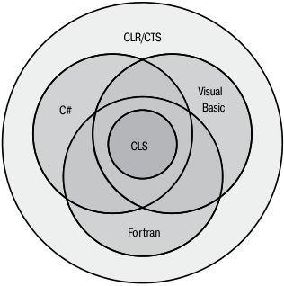


**----- Start of picture text -----**<br>
CLR/CTS<br>Visual<br>C#    Basic<br>CLS<br>Fortran<br>**----- End of picture text -----**<br>


**рис. 1.6.** .Разные.языки.поддерживают.подмножество.CLR/CTS.и.надмножество.CLS. (возможно,.разные.подмножества) 

Как видно из рис. 1.6, CLR/CTS определяет набор функциональных возможностей. Некоторые языки реализуют более широкое подмножество CLR/CTS. Например, программист, пожелавший работать на языке ассемблера IL, сможет использовать все возможности CLR/CTS. Большинство других языков (C#, Visual Basic, Fortran и т. д.) предоставляют в распоряжение программиста подмножество возможностей CLR/CTS. CLS определяет минимальный набор возможностей, которые должны поддерживаться всеми языками. Если вы проектируете тип на одном языке и собираетесь использовать его в другом языке, не размещайте никакие возможности, выходящие за пределы CLS, в его открытых и защищенных членах. В этом случае члены вашего типа могут стать недоступными для программистов, пишущих код на других языках программирования. 

В следующем коде CLS-совместимый тип определяется в коде C#. Однако при этом тип содержит несколько CLS-несовместимых конструкций, из-за которых компилятор C# выдает предупреждения. 

## `using System;` 

// Приказываем компилятору проверять код 

// на совместимость с CLS 

```
[assembly: CLSCompliant(true)]
```

## `namespace SomeLibrary {` 

// Предупреждения выводятся, потому что класс является открытым `public sealed class SomeLibraryType {` 

> // Предупреждение: возвращаемый тип 'SomeLibrary.SomeLibraryType.Abc()' // не является CLS-совместимым 

```
      public UInt32 Abc() { return 0; }
```

_продолжение_  

**54** Глава.1 .Модель.выполнения.кода.в.среде.CLR 

// Предупреждение: идентификаторы 'SomeLibrary.SomeLibraryType.abc()', // отличающиеся только регистром символов, не являются // CLS-совместимыми `public void abc() { }` 

// Предупреждения нет: закрытый метод `private UInt32 ABC() { return 0; } } }` 

В этом коде атрибут `[assembly:CLSCompliant(true)]` применяется к сборке. Этот атрибут приказывает компилятору следить за тем, чтобы тип с открытым уровнем доступа не содержал конструкций, препятствующих его использованию в другом языке программирования. При компиляции этого кода компилятор C# выдает два предупреждения. Первое выдается из-за того, что метод `Abc` возвращает целое без знака; некоторые языки программирования не умеют работать с беззнаковыми целыми числами. Второе предупреждение выдается из-за того, что тип содержит два открытых метода, различающихся только регистром и типом возвращаемого значения: `Abc` и `abc` . В Visual Basic и некоторых других языках вызов обоих методов невозможен. 

Если удалить ключевое слово `public` перед `sealed class SomeLibraryType` и перекомпилировать код, оба предупреждения пропадают. Дело в том, что тип `SomeLibraryType` по умолчанию рассматривается как `internal` , а следовательно, становится недоступным за пределами сборки. Полный список правил CLS приведен в разделе «Cross-Language Interoperability» документации .NET Framework SDK (http://msdn microsoft com/en-us/library/730f1wy3 aspx). 

Позвольте мне изложить правила CLS в предельно упрощенном виде. В CLR каждый член типа является либо полем (данные), либо методом (поведение). Это означает, что каждый язык программирования должен уметь обращаться к полям и вызывать методы. Некоторые поля и некоторые методы используются специальным образом. Для упрощения программирования языки обычно предоставляют дополнительные абстракции, упрощающие реализацию этих стандартных паттернов — перечисления, массивы, свойства, индексаторы, делегаты, события, конструкторы, финализаторы, перегрузки операторов, операторы преобразования и т. д. Когда компилятор встречает эти абстракции в исходном коде, он должен преобразовать их в поля и методы, чтобы сделать их доступными для CLR и любых других языков программирования. 

Следующее определение типа содержит конструктор, финализатор, перегруженные операторы, свойство, индексатор и событие. Учтите, что приведенный код написан всего лишь для того, чтобы он компилировался, и не демонстрирует правильного способа реализации типа. 

```
using System;
```

```
internal sealed class Test {
```

CLS **55** 

// Конструктор `public Test() {}` // Финализатор `~Test() {}` // Перегрузка оператора public static Boolean operator == (Test t1, Test t2) { `return true; }` public static Boolean operator != (Test t1, Test t2) { `return false; }` // Перегрузка оператора public static Test operator + (Test t1, Test t2) { return null; } // Свойство `public String AProperty { get { return null; } set { } }` // Индексатор `public String this[Int32 x] { get { return null; } set { } }` // Событие `public event EventHandler AnEvent; }` 

Результатом компиляции этого кода является тип, содержащий набор полей и методов. В этом можно легко убедиться, просмотрев полученный управляемый модуль в программе IL Disassembler (ILDasm exe), входящей в пакет .NET Framework SDK (рис. 1.7). 

В табл. 1.4 продемонстрировано соответствие между конструкциями языка программирования и эквивалентными полями/методами CLR. 

Дополнительные узлы типа `Test` , не упомянутые в табл. 1.4 — `.class` , `.custom` , `AnEvent` , `AProperty` и `Item` , — содержат дополнительные метаданные типа. Они не отображаются на поля или методы, а только предоставляют дополнительную информацию о типе, которая может использоваться CLR, языками программирования или инструментами. Например, программа может узнать, что тип `Test` поддерживает событие `AnEvent` , для работы с которым используются два метода ( `add_AnEvent` и `remove_AnEvent` ). 

**56** Глава.1 .Модель.выполнения.кода.в.среде.CLR 


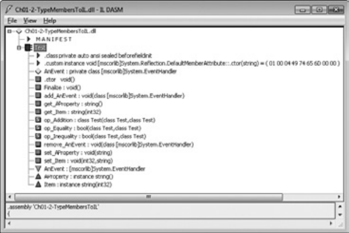


**рис. 1.7.** .Программа.ILDasm.с.полями.и.методами.типа.Test. (информация.получена.из.метаданных) 

**таблица 1.4.** .Поля.и.методы.типа.Test. 

|**Член типа**|**разновидность**|**Эквивалентная конструкция**<br>**языка программирования**|
|---|---|---|
|AnEvent|Поле|Событие; имя поля – AnEvent, тип – System.<br>EventHandler|
|.ctor|Метод|Конструктор|
|Finalize|Метод|Финализатор|
|add_AnEvent|Метод|Метод добавления обработчика события|
|get_AProperty|Метод|Get-метод доступа свойства|
|get_Item|Метод|Get-метод индексатора|
|op_Addition|Метод|Оператор +|
|op_Equality|Метод|Оператор ==|
|op_Inequality|Метод|Оператор !=|
|remove_AnEvent|Метод|Метод удаления обработчика события|
|set_AProperty|Метод|Set-метод доступа свойства|
|set_Item|Метод|Set-метод индексатора|


**57** 

Взаимодействие.с.неуправляемым.кодом 

## **Взаимодействие с неуправляемым кодом** 

.NET Framework обладает множеством преимуществ перед другими платформами разработки. Впрочем, лишь немногие компании могут позволить себе заново спроектировать и реализовать весь существующий код. Компания Microsoft понимает это, поэтому среда CLR была спроектирована так, чтобы приложения могли состоять как из управляемых, так и из неуправляемых компонентов. А если говорить конкретнее, CLR поддерживает три сценария взаимодействий: 

**Управляемый код может вызывать неуправляемые функции из DLL** с использованием механизма P/Invoke (сокращение от «Platform Invoke»). В конце концов, многие типы, определяемые в FCL, во внутренней реализации вызывают функции, экспортируемые из Kernel32 dll, User32 dll и т. д. Многие языки программирования  предоставляют средства, упрощающие вызов неуправляемых функций из DLL в управляемом коде. Например, приложение C# может вызвать функцию `CreateSemaphore` , экспортируемую библиотекой Kernel32 dll. 

**Управляемый код может использовать готовые компоненты COM.** Многие компании уже реализовали большое количество неуправляемых компонентов COM. На основе библиотек типов из этих компонентов можно создать управляемую сборку с описанием компонента COM. Управляемый код обращается к типу из управляемой сборки точно так же, как к любому другому управляемому типу. За дополнительной информацией обращайтесь к описанию программы TlbImp exe, входящей в поставку .NET Framework SDK. 

**Неуправляемый код может использовать управляемый тип.** Большая часть существующего неуправляемого кода требует наличия компонента COM. Такие компоненты гораздо проще реализуются с управляемым кодом, что позволяет избежать служебного кода, связанного с подсчетом ссылок и интерфейсами. Например, на C# можно написать элемент управления ActiveX или расширение командного процессора. За дополнительной информацией обращайтесь к описанию программ TlbExp exe и RegAsm exe, входящих в поставку .NET Framework SDK. 

## **ПриМеЧание** 

Чтобы.помочь.разработчикам.в.написании.программ,.взаимодействующих.с.машинным.кодом,.компания.Microsoft.опубликовала.исходный.код.программ.Type.Library. Importer.и.P/Invoke.Interop.Assistant .Эти.программы.и.их.исходный.код.можно.загрузить.по.адресу.http://CLRInterop CodePlex com/ 

В Windows 8 компания Microsoft ввела новый интерфейс прикладного программирования, называемый Windows Runtime (WinRT). Его внутренняя реализация базируется на компонентах COM, но вместо библиотеки типов компоненты COM описывают свой API в стандарте метаданных ECMA, созданном рабочей группой .NET Framework. Элегантность решения заключается в том, что код, написанный на языке .NET, может (в основном) легко взаимодействовать с WinRT API. CLR обеспечивает все взаимодействие с COM во внутренней реализации, вам вообще не придется использовать дополнительные средства — все просто работает! За подробностями обращайтесь к главе 25. 

## **Глава 2. Компоновка, упаковка, развертывание и администрирование приложений и типов** 

Прежде чем перейти к главам, описывающим разработку программ для Microsoft .NET Framework, давайте обсудим вопросы создания, упаковки и развертывания приложений и их типов. В этой главе акцент сделан на основах создания компонентов, предназначенных исключительно для ваших приложений. В главе 3 рассказано о ряде более сложных, но очень важных концепций, в том числе способах создания и применения сборок, содержащих компоненты, предназначенные для использования совместно с другими приложениями. В этой и следующей главах также показано, как администратор может влиять на исполнение приложения и его типов. 

Современные приложения состоят из типов, которые создаются самими разработчиками или компанией Microsoft. Помимо этого, процветает целая отрасль поставщиков компонентов, которые используются другими компаниями для ускорения разработки проектов. Типы, реализованные при помощи языка, ориентированного на общеязыковую исполняющую среду (CLR), способны легко работать друг с другом; при этом базовый класс такого типа может быть написан на другом языке программирования. 

В этой главе объясняется, как эти типы создаются и упаковываются в файлы, предназначенные для развертывания. В процессе изложения дается краткий исторический обзор некоторых проблем, решенных с приходом .NET Framework. 

## **задачи развертывания в .NET Framework** 

Все годы своего существования операционная система Windows «славилась» нестабильностью и чрезмерной сложностью. Такая репутация, заслуженная или нет, сложилась по ряду причин. Во-первых, все приложения используют динамически подключаемые библиотеки (Dynamic Link Library, DLL), созданные Microsoft и другими производителями. Поскольку приложение исполняет код, написанный разными производителями, ни один разработчик какой-либо части программы не может быть на 100 % уверен в том, что точно знает, как другие собираются применять созданный им код. В теории такая ситуация чревата любыми неполадками, но на 

Задачи.развертывания.в. NET.Framework **59** 

практике взаимодействие кодов от разных производителей редко создает проблемы, так как перед развертыванием приложения тестируют и отлаживают. 

Однако пользователи часто сталкиваются с проблемами, когда производитель решает обновить поставленную им программу и предоставляет новые файлы. Предполагается, что новые файлы обеспечивают «обратную совместимость» с прежним программным обеспечением, но кто за это поручится? Одному производителю, выпускающему обновление своей программы, фактически не под силу заново протестировать и отладить все существующие приложения, чтобы убедиться, что изменения при обновлении не влекут за собой нежелательных последствий. 

Уверен, что каждый читающий эту книгу сталкивался с той или иной разновидностью проблемы, когда после установки нового приложения нарушалась работа одной (или нескольких) из установленных ранее программ. Эта проблема, наводящая ужас на рядовых пользователей компьютеров, получила название «кошмар DLL». В конечном итоге пользователи должны как следует обдумать, стоит ли устанавливать новое программное обеспечение на их компьютеры. Лично я вообще отказался от установки некоторых приложений из опасения, что они нанесут вред наиболее важным для меня программам. 

Второй фактор, повлиявший на репутацию Windows, — сложности при установке приложений. Большинство приложений при установке умудряются «просочиться» во все части операционной системы. Например, при установке приложения происходит копирование файлов в разные каталоги, модификация параметров реестра, установка ярлыков и ссылок на рабочий стол (Desktop), в меню Пуск (Start) и на панель быстрого запуска. Проблема в том, что приложение — это не одиночная изолированная сущность. Нельзя легко и просто создать резервную копию приложения, поскольку, кроме файлов приложения, придется скопировать соответствующие части реестра. Вдобавок, нельзя просто взять и переместить приложение с одной машины на другую — для этого нужно запустить программу установки еще раз, чтобы корректно скопировать все файлы и параметры реестра. Наконец, приложение не всегда просто удалить — нередко выясняется, что какая-то его часть притаилась где-то внутри компьютера. 

Третий фактор — безопасность. При установке приложений записывается множество файлов, созданных самыми разными компаниями. Вдобавок, многие веб-приложения (например, ActiveX) зачастую содержат программный код, который сам загружается из Интернета, о чем пользователи даже не подозревают. На современном уровне технологий такой код может выполнять любые действия, включая удаление файлов и рассылку электронной почты. Пользователи справедливо опасаются устанавливать новые приложения из-за угрозы потенциального вреда, который может быть нанесен их компьютерам. Для того чтобы пользователи чувствовали себя спокойнее, в системе должны быть встроенные функции защиты, позволяющие явно разрешать или запрещать доступ к системным ресурсам коду, созданному теми или иными компаниями. 

Как показано в этой и следующей главах, платформа .NET Framework в значительной мере устраняет «кошмар DLL» и делает существенный шаг вперед 

**60** Глава.2 .Компоновка,.упаковка,.развертывание.и.администрирование.приложений 

к решению проблемы, связанной с распределением данных приложения по всей операционной системе. Например, в отличие от модели COM информацию о компонентах уже не нужно сохранять в реестре. К сожалению, приложениям пока еще требуются ссылки и ярлыки. Совершенствование системы защиты связано с новой моделью безопасности платформы .NET Framework — _безопасностью доступа на уровне кода_ (code access security). Если безопасность системы Windows основана на идентификации пользователя, то безопасность доступа на уровне кода основана на правах, которые контролируются хостом приложений, загружающим компоненты. Сетевое приложение (такое, как Microsoft SQL Server) может предоставить коду минимальные полномочия, в то время как локально установленное приложение во время своего выполнения может иметь уровень полного доверия (со всеми полномочиями). Как видите, платформа .NET Framework предоставляет пользователям намного больше возможностей по контролю над тем, что устанавливается и выполняется на их машинах, чем когда-либо давала им система Windows. 

## **Компоновка типов в модуль** 

В этом разделе рассказывается, как превратить файл, содержащий исходный код с разными типами, в файл, пригодный для развертывания. Для начала рассмотрим следующее простое приложение: 

```
public sealed class Program {
  public static void Main() {
    System.Console.WriteLine("Hi");
  }
}
```

Здесь определен тип `Program` с единственным статическим открытым методом `Main` . Внутри метода `Main` находится ссылка на другой тип — `System.Console` . Этот тип разработан в компании Microsoft, и его программный код на языке IL, реализующий его методы, находится в файле MSCorLib dll. Таким образом, данное приложение определяет собственный тип, а также использует тип, созданный другой компанией. 

Для того чтобы построить это приложение, сохраните этот код в файле (допустим, Program cs, а затем наберите в командной строке следующее: 

```
csc.exe /out:Program.exe /t:exe /r:MSCorLib.dll Program.cs
```

Эта команда приказывает компилятору C# создать исполняемый файл Program exe (имя задано параметром `/out:Program.exe` ). Тип создаваемого файла — консольное приложение Win32 (тип задан параметром `/t[arget]:exe` ). 

При обработке файла с исходным кодом компилятор C# обнаруживает ссылку на метод `WriteLine` типа `System.Console` . На этом этапе компилятор должен убедиться, что этот тип существует и у него есть метод `WriteLine` . Компилятор 

**61** 

Компоновка.типов.в.модуль 

также проверяет, чтобы типы аргументов, предоставляемых программой, совпадали с ожидаемыми типами метода `WriteLine` . Поскольку тип не определен в исходном коде на C#, компилятору C# необходимо передать набор сборок, которые позволят ему разрешить все ссылки на внешние типы. В показанной команде параметр `/r[eference]:MSCorLib.dll` приказывает компилятору вести поиск внешних типов в сборке, идентифицируемой файлом MSCorLib dll. 

MSCorLib dll — специальный файл, в котором находятся все основные типы: `Byte` , `Char` , `String` , `Int32` и т. д. В действительности, эти типы используются так часто, что компилятор C# обращается к этой сборке (MSCorLib dll) автоматически. Другими словами, следующая команда (в ней опущен параметр `/r` ) даст тот же результат, что и предыдущая: 

```
csc.exe /out:Program.exe /t:exe Program.cs
```

Более того, поскольку значения, заданные параметрами командной строки `/out:Program.exe` и `/t:exe` , совпадают со значениями по умолчанию, следующая команда даст аналогичный результат: 

```
csc.exe Program.cs
```

Если по какой-то причине вы не хотите, чтобы компилятор C# обращался к сборке MSCorLib dll, используйте параметр `/nostdlib` . В компании Microsoft этот параметр используется при построении сборки MSCorLib dll. Например, во время исполнения следующей команды при компиляции файла Program cs генерируется ошибка, поскольку тип `System.Console` определен в сборке MSCorLib dll: 

```
csc.exe /out:Program.exe /t:exe /nostdlib Program.cs
```

А теперь присмотримся поближе к файлу Program exe, созданному компилятором C#. Что он из себя представляет? Для начала это стандартный файл в формате PE (portable executable). Это значит, что машина, работающая под управлением 32- или 64-разрядной версии Windows, способна загрузить этот файл и что-нибудь с ним сделать. Система Windows поддерживает два типа приложений: с консольными (Console User Interface, CUI) и графическими пользовательскими интерфейсами (Graphical User Interface, GUI). Параметр `/t:exe` указывает компилятору C# создать консольное приложение. Для создания приложения с графическим интерфейсом необходимо указать параметр `/t:winexe` , а для создания приложения Windows Store – параметр `/t:appcontainerexe` . 

## **Файл параметров** 

В завершение рассказа о параметрах компилятора хотелось бы сказать несколько слов о _файлах параметров_ (response files) — текстовых файлах, содержащих набор параметров командной строки для компилятора. При выполнении компилятора CSC exe открывается файл параметров и используются все указанные в нем параметры, как если бы они были переданы в составе командной строки. Файл параметров 

**62** Глава.2 .Компоновка,.упаковка,.развертывание.и.администрирование.приложений 

передается компилятору путем указания его в командной строке с префиксом `@` . Например, пусть есть файл параметров MyProject rsp со следующим текстом: 

```
/out:MyProject.exe
/target:winexe
```

Для того чтобы компилятор (CSC exe) использовал эти параметры, необходимо вызвать файл следующим образом: 

```
csc.exe @MyProject.rsp CodeFile1.cs CodeFile2.cs
```

Эта строка сообщает компилятору C# имя выходного файла и тип скомпилированной программы. Очевидно, что файлы параметров исключительно полезны, так как избавляют от необходимости вручную вводить все аргументы командной строки каждый раз при компиляции проекта. 

Компилятор C# допускает использование нескольких файлов параметров. Помимо явно указанных в командной строке файлов, компилятор автоматически ищет файл с именем CSC rsp в текущем каталоге. Компилятор также проверяет каталог с файлом CSC exe на наличие глобального файла параметров CSC rsp, в котором следует указывать параметры, относящиеся ко всем проектам. В процессе своей работы компилятор объединяет параметры из всех файлов и использует их. В случае конфликта параметров в глобальных и локальных файлах предпочтение отдается последним. Кроме того, любые явно заданные в командной строке параметры имеют более высокий приоритет, чем указанные в локальных файлах параметров. 

При установке платформы .NET Framework по умолчанию глобальный файл CSC rsp устанавливается в каталог `%SystemRoot%\Microsoft.NET\Framework(64)\ v` _X_ `.` _X_ `.` _X_ (где _X_ `.` _X_ `.` _X_ — версия устанавливаемой платформы .NET Framework). Новейшая версия этого файла содержит следующие параметры: 

# Этот файл содержит параметры командной строки, 

# которые компилятор C# командной строки (CSC) # будет обрабатывать в каждом сеансе компиляции, # если только не задан параметр "/noconfig". 

# Ссылки на стандартные библиотеки Framework `/r:Accessibility.dll /r:Microsoft.CSharp.dll /r:System.Configuration.dll /r:System.Configuration.Install.dll /r:System.Core.dll /r:System.Data.dll /r:System.Data.DataSetExtensions.dll /r:System.Data.Linq.dll /r:System.Data.OracleClient.dll /r:System.Deployment.dll /r:System.Design.dll /r:System.DirectoryServices.dll /r:System.dll /r:System.Drawing.Design.dll` 

**63** 

Компоновка.типов.в.модуль 

```
/r:System.Drawing.dll
/r:System.EnterpriseServices.dll
/r:System.Management.dll
/r:System.Messaging.dll
/r:System.Runtime.Remoting.dll
/r:System.Runtime.Serialization.dll
/r:System.Runtime.Serialization.Formatters.Soap.dll
/r:System.Security.dll
/r:System.ServiceModel.dll
/r:System.ServiceModel.Web.dll
/r:System.ServiceProcess.dll
/r:System.Transactions.dll
/r:System.Web.dll
/r:System.Web.Extensions.Design.dll
/r:System.Web.Extensions.dll
/r:System.Web.Mobile.dll
/r:System.Web.RegularExpressions.dll
/r:System.Web.Services.dll
/r:System.Windows.Forms.Dll
/r:System.Workflow.Activities.dll
/r:System.Workflow.ComponentModel.dll
/r:System.Workflow.Runtime.dll
/r:System.Xml.dll
/r:System.Xml.Linq.dll
```

В глобальном файле CSC rsp есть ссылки на все перечисленные сборки, поэтому нет необходимости указывать их явно с помощью параметра `/reference` . Этот файл параметров исключительно удобен для разработчиков, так как позволяет использовать все типы и пространства имен, определенные в различных опубликованных компанией Microsoft сборках, не указывая их все явно с применением параметра `/reference` . 

Ссылки на все эти сборки могут немного замедлить работу компилятора, но если в исходном коде нет ссылок на типы или члены этих сборок, это никак не сказывается ни на результирующем файле сборки, ни на производительности его выполнения. 

## **ПриМеЧание** 

При.использовании.параметра./reference.для.ссылки.на.какую-либо.сборку.можно.указать.полный.путь.к.конкретному.файлу .Однако.если.такой.путь.не.указать,. компилятор.будет.искать.нужный.файл.в.следующих.местах.(в.указанном.порядке) 

## **рабочий каталог.** 

Каталог,.содержащий.файл.самого.компилятора.(CSC exe) .Библиотека.MSCorLib dll.всегда.извлекается.из.этого.каталога .Путь.к.нему.имеет.примерно.следующий. вид:. 

- -.%SystemRoot%\Microsoft NET\Framework\v4 0 ##### 

- -.Все.каталоги,.указанные.с.использованием.параметра./lib.компилятора 

- -.Все.каталоги,.указанные.в.переменной.окружения.LIB 

**64** Глава.2 .Компоновка,.упаковка,.развертывание.и.администрирование.приложений 

Конечно, вы вправе добавлять собственные параметры в глобальный файл CSC rsp, но это сильно усложняет репликацию среды компоновки на разных машинах — приходится помнить про обновление файла CSC rsp на всех машинах, используемых для сборки приложений. Можно также дать компилятору команду игнорировать как локальный, так и глобальный файлы CSC rsp, указав в командной строке параметр `/noconfig` . 

## **несколько слов о метаданных** 

Что же именно находится в файле Program exe? Управляемый PE-файл состоит из 4-х частей: заголовка PE32(+), заголовка CLR, метаданных и кода на промежуточном языке (intermediate language, IL). Заголовок PE32(+) хранит стандартную информацию, ожидаемую Windows. Заголовок CLR — это небольшой блок информации, специфичной для модулей, требующих CLR (управляемых модулей). В него входит старший и младший номера версии CLR, для которой скомпонован модуль, ряд флагов и маркер `MethodDef` (о нем — чуть позже), указывающий метод точки входа в модуль, если это исполняемый файл CUI, GUI или Windows Store, а также необязательную сигнатуру строгого имени (она рассмотрена в главе 3). Наконец, заголовок содержит размер и смещение некоторых таблиц метаданных, расположенных в модуле. Для того чтобы узнать точный формат заголовка CLR, изучите структуру `IMAGE_COR20_HEADER` , определенную в файле CorHdr h. 

Метаданные — это блок двоичных данных, состоящий из нескольких таблиц. Существуют три категории таблиц: определений, ссылок и манифестов. В табл. 2.1 приводится описание некоторых наиболее распространенных таблиц определений, существующих в блоке метаданных модуля. 

**таблица 2.1.** .Основные.таблицы.определений.в.метаданных 

|**таблица 2.1.**О|сновныетаблицыопределенийвметаданных|
|---|---|
|**имя таблицы**<br>**определений**|**Описание**|
|ModuleDef|Всегда содержит одну запись, идентифицирующую модуль. Запись<br>включает имя файла модуля с расширением (без указания пути к фай-<br>лу) и идентификатор версии модуля (в виде сгенерированного компи-<br>лятором кода GUID). Это позволяет переименовывать файл, не теряя<br>сведений о его исходном имени. Однако настоятельно рекомендуется<br>не переименовывать файл, иначе среда CLR может не найти сборку во<br>время выполнения|
|TypeDef|Содержит по одной записи для каждого типа, определенного в модуле.<br>Каждая запись включает имя типа, базовый тип, флаги сборки (public,<br>private и т. д.) и указывает на записи таблиц MethodDef, PropertyDef<br>и EventDef, содержащие соответственно сведения о методах, свойствах<br>и событиях этого типа|


**65** 

Несколько.слов.о.метаданных 

|**имя таблицы**<br>**определений**|**Описание**|
|---|---|
|MethodDef|Содержит по одной записи для каждого метода, определенного в моду-<br>ле. Каждая строка включает имя метода, флаги (private, public, virtual,<br>abstract, static, final и т. д.), сигнатуру и смещение в модуле, по которо-<br>му находится соответствующий IL-код. Каждая запись также может<br>ссылаться на запись в таблице ParamDef, где хранятся дополнитель-<br>ные сведения о параметрах метода|
|FieldDef|Содержит по одной записи для каждого поля, определенного в моду-<br>ле. Каждая запись состоит из флагов (например, private, public и т. д.)<br>и типа поля|
|ParamDef|Содержит по одной записи для каждого параметра, определенного<br>в модуле. Каждая запись состоит из флагов (in, out, retval и т. д.),<br>типа и имени|
|PropertyDef|Содержит по одной записи для каждого свойства, определенного в мо-<br>дуле. Каждая запись включает имя, флаги, тип и вспомогательное поле<br>(оно может быть пустым)|
|EventDef|Содержит по одной записи для каждого события, определенного в мо-<br>дуле. Каждая запись включает имя и флаги|


Для каждой сущности, определяемой в компилируемом исходном тексте, компилятор генерирует строку в одной из таблиц, перечисленных в табл. 2.1. В ходе компиляции исходного текста компилятор также обнаруживает типы, поля, методы, свойства и события, на которые имеются ссылки в исходном тексте. Все сведения о найденных сущностях регистрируются в нескольких таблицах ссылок, составляющих метаданные. В табл. 2.2 показаны некоторые наиболее распространенные таблицы ссылок, которые входят в состав метаданных. 

**таблица 2.2.** .Общие.таблицы.ссылок,.входящие.в.метаданные 

|**таблица 2.2.**О|бщиетаблицыссылок,входящиевметаданные|
|---|---|
|**имя таблицы**<br>**ссылок**|**Описание**|
|AssemblyRef|Содержит по одной записи для каждой сборки, на которую ссыла-<br>ется модуль. Каждая запись включает сведения, необходимые для<br>привязки к сборке: ее имя (без указания расширения и пути), номер<br>версии, региональные стандарты и маркер открытого ключа (обычно<br>это небольшой хеш-код, созданный на основе открытого ключа из-<br>дателя и идентифицирующий издателя сборки, на которую ссылается<br>модуль). Каждая запись также содержит несколько флагов и хеш-код,<br>который должен служить контрольной суммой битов сборки. Среда<br>CLR полностью игнорирует этот хеш-код и, вероятно, будет игнориро-<br>вать его в будущем|


_продолжение_  

**66** Глава.2 .Компоновка,.упаковка,.развертывание.и.администрирование.приложений 

**таблица 2.2** .( _продолжение_ ) 

|**таблица 2.2**(_п_|_родолжение_)|
|---|---|
|**имя таблицы**<br>**ссылок**|**Описание**|
|ModuleRef|Содержит по одной записи для каждого PE-модуля, реализующего<br>типы, на которые он ссылается. Каждая запись включает имя файла<br>сборки и его расширение (без указания пути). Эта таблица служит<br>для привязки модуля вызывающей сборки к типам, реализованным<br>в других модулях|
|TypeRef|Содержит по одной записи для каждого типа, на который ссылается<br>модуль. Каждая запись включает имя типа и ссылку, по которой можно<br>его найти. Если этот тип реализован внутри другого типа, запись со-<br>держит ссылку на соответствующую запись таблицы TypeRef. Если<br>тип реализован в том же модуле, приводится ссылка на запись табли-<br>цы ModuleDef. Если тип реализован в другом модуле вызывающей<br>сборки, приводится ссылка на запись таблицы ModuleRef. Если тип<br>реализован в другой сборке, приводится ссылка на запись в таблице<br>AssemblyRef|
|MemberRef|Содержит по одной записи для каждого члена типа (поля, метода,<br>а также свойства или метода события), на который ссылается модуль.<br>Каждая запись включает имя и сигнатуру члена и указывает на запись<br>таблицы TypeRef, содержащую сведения о типе, определяющим этот<br>член|


На самом деле таблиц метаданных намного больше, чем показано в табл. 2.1 и 2.2; я просто хотел дать общее представление об информации, используемой компилятором для создания метаданных. Ранее уже упоминалось о том, что в состав метаданных входят также таблицы манифестов. О них мы поговорим чуть позже. 

Метаданные управляемого PE-файла можно изучать при помощи различных инструментов. Лично я предпочитаю ILDasm exe — дизассемблер языка IL. Для того чтобы увидеть содержимое таблиц метаданных, выполните следующую команду: 

## `ILDasm Program.exe` 

Запустится файл ILDasm exe и загрузится сборка Program exe. Для того чтобы вывести метаданные в удобочитаемом виде, выберите в меню команду View  MetaInfo  Show! (или нажмите клавиши Ctrl+M). В результате появится следующая информация: 

```
===========================================================
ScopeName : Program.exe
MVID      : {CA73FFE8 0D42 4610 A8D3 9276195C35AA}
===========================================================
Global functions
```

**67** 

Несколько.слов.о.метаданных 

```
Global fields
```

```
Global MemberRefs
```

```
TypeDef #1 (02000002)
   TypDefName: Program  (02000002)
   Flags     : [Public] [AutoLayout] [Class] [Sealed] [AnsiClass]
               [BeforeFieldInit]  (00100101)
   Extends   : 01000001 [TypeRef] System.Object
   Method #1 (06000001) [ENTRYPOINT]
      MethodName: Main (06000001)
      Flags     : [Public] [Static] [HideBySig] [ReuseSlot]  (00000096)
      RVA       : 0x00002050
      ImplFlags : [IL] [Managed]  (00000000)
      CallCnvntn: [DEFAULT]
      ReturnType: Void
      No arguments.
   Method #2 (06000002)
      MethodName: .ctor (06000002)
      Flags     : [Public] [HideBySig] [ReuseSlot] [SpecialName]
                  [RTSpecialName] [.ctor]  (00001886)
      RVA       : 0x0000205c
      ImplFlags : [IL] [Managed]  (00000000)
      CallCnvntn: [DEFAULT]
      hasThis
      ReturnType: Void
      No arguments.
TypeRef #1 (01000001)
Token:             0x01000001
ResolutionScope:   0x23000001
TypeRefName:       System.Object
   MemberRef #1 (0a000004)
      Member: (0a000004) .ctor:
      CallCnvntn: [DEFAULT]
      hasThis
      ReturnType: Void
      No arguments.
TypeRef #2 (01000002)
Token:             0x01000002
ResolutionScope:   0x23000001
```

_продолжение_  

**68** Глава.2 .Компоновка,.упаковка,.развертывание.и.администрирование.приложений 

```
TypeRefName:       System.Runtime.CompilerServices.CompilationRelaxationsAttribute
   MemberRef #1 (0a000001)
```

```
      Member: (0a000001) .ctor:
      CallCnvntn: [DEFAULT]
      hasThis
      ReturnType: Void
      1 Arguments
         Argument #1:  I4
```

```
TypeRef #3 (01000003)
Token:             0x01000003
ResolutionScope:   0x23000001
```

```
TypeRefName:       System.Runtime.CompilerServices.RuntimeCompatibilityAttribute
   MemberRef #1 (0a000002)
```

```
      Member: (0a000002) .ctor:
      CallCnvntn: [DEFAULT]
      hasThis
      ReturnType: Void
      No arguments.
TypeRef #4 (01000004)
Token:             0x01000004
ResolutionScope:   0x23000001
TypeRefName:       System.Console
   MemberRef #1 (0a000003)
      Member: (0a000003) WriteLine:
      CallCnvntn: [DEFAULT]
      ReturnType: Void
      1 Arguments
         Argument #1:  String
Assembly
   Token: 0x20000001
   Name : Program
   Public Key    :
   Hash Algorithm : 0x00008004
   Version: 0.0.0.0
   Major Version: 0x00000000
   Minor Version: 0x00000000
   Build Number: 0x00000000
   Revision Number: 0x00000000
   Locale: <null>
   Flags : [none] (00000000)
   CustomAttribute #1 (0c000001)
```

```
      CustomAttribute Type: 0a000001
      CustomAttributeName:
```

**69** 

Несколько.слов.о.метаданных 

```
        System.Runtime.CompilerServices.CompilationRelaxationsAttribute ::
          instance void .ctor(int32)
      Length: 8
      Value : 01 00 08 00 00 00 00 00                          >                <
      ctor args: (8)
   CustomAttribute #2 (0c000002)
```

```
      CustomAttribute Type: 0a000002
      CustomAttributeName:
          System.Runtime.CompilerServices.RuntimeCompatibilityAttribute ::
          instance void .ctor()
      Length: 30
      Value : 01 00 01 00 54 02 16 57  72 61 70 4e 6f 6e 45 78 >    T  WrapNonEx<
            : 63 65 70 74 69 6f 6e 54  68 72 6f 77 73 01       >ceptionThrows   <
      ctor args: ()
AssemblyRef #1 (23000001)
   Token: 0x23000001
   Public Key or Token: b7 7a 5c 56 19 34 e0 89
   Name: mscorlib
   Version: 4.0.0.0
   Major Version: 0x00000004
   Minor Version: 0x00000000
   Build Number: 0x00000000
   Revision Number: 0x00000000
   Locale: <null>
   HashValue Blob:
   Flags: [none] (00000000)
```

```
User Strings
70000001 : ( 2) L"Hi"
Coff symbol name overhead:  0
===========================================================
===========================================================
===========================================================
```

К счастью, ILDasm самостоятельно обрабатывает таблицы метаданных и комбинирует информацию, поэтому пользователю не приходится заниматься синтаксическим разбором низкоуровневых табличных данных. Например, в приведенном фрагменте видно, что, показывая строку таблицы `TypeDef` , ILDasm выводит перед первой записью таблицы `TypeRef` определение соответствующего члена. 

Не обязательно понимать, что означает каждая строка этого дампа — важно запомнить, что Program exe содержит в таблице `TypeDef` описание типа `Program` . Этот тип идентифицирует открытый запечатанный (sealed) класс, производный от `System.Object` (то есть это ссылка на тип из другой сборки). Тип `Program` также определяет два метода: `Main` и `.ctor` (конструктор). 

**70** Глава.2 .Компоновка,.упаковка,.развертывание.и.администрирование.приложений 

Метод `Main` — это статический открытый метод, чей программный код представлен на языке IL (а не в машинных кодах процессора, например x86). `Main` возвращает `void` и не получает аргументов. Метод-конструктор (всегда отображаемый под именем `.ctor` ) является открытым, его код также записан на языке IL. Тип возвращаемого значения конструктора — `void` , у него нет аргументов, но есть указатель `this` , ссылающийся на область памяти, в которой должен создаваться экземпляр объекта при вызове конструктора. 

Я настоятельно рекомендую вам поэкспериментировать с дизассемблером ILDasm. Он предоставляет массу полезных сведений, и чем лучше вы в них разберетесь, тем быстрее изучите общеязыковую исполняющую среду CLR и ее возможности. В этой книге еще не раз будет использоваться дизассемблер ILDasm. Просто для интереса посмотрим на некоторую статистику сборки Program exe. Выбрав в меню программы ILDasm команду View  Statistics, увидим следующее: 

```
File size             : 3584
 PE header size       : 512 (496 used)    (14.29%)
 PE additional info   : 1411              (39.37%)
 Num.of PE sections   : 3
 CLR header size      : 72                ( 2.01%)
 CLR meta data size    : 612               (17.08%)
 CLR additional info  : 0                 ( 0.00%)
 CLR method headers   : 2                 ( 0.06%)
 Managed code         : 20                ( 0.56%)
 Data                 : 2048              (57.14%)
 Unaccounted          :  1093              ( 30.50%)
```

```
 Num.of PE sections   : 3
   .text     1024
   .rsrc     1536
   .reloc    512
```

`CLR meta data size  : 612 Module            1 (10 bytes)` TypeDef           2 (28 bytes)      0 interfaces, 0 explicit layout `TypeRef           4 (24 bytes)` MethodDef         2 (28 bytes)      0 abstract, 0 native, 2 bodies `MemberRef         4 (24 bytes) CustomAttribute   2 (12 bytes) Assembly          1 (22 bytes) AssemblyRef       1 (20 bytes) Strings          184 bytes Blobs             68 bytes UserStrings        8 bytes Guids             16 bytes Uncategorized    168 bytes CLR method headers : 2 Num.of method bodies   2 Num.of fat headers     0` 

Объединение.модулей.для.создания.сборки 

**71** 

```
   Num.of tiny headers    2
```

```
 Managed code : 20
   Ave method size  10
```

Здесь приводятся как размеры самого файла (в байтах), так и размеры его составляющих частей (в байтах и процентах от размера файла). Приложение Program cs очень маленькое, поэтому большая часть его файла занята заголовком PE и метаданными. Фактически IL-код занимает всего 20 байт. Конечно, чем больше размер приложения, тем чаще типы и ссылки на другие типы и сборки используются повторно, поэтому размеры метаданных и данных заголовка существенно уменьшаются по отношению к общему размеру файла. 

## **ПриМеЧание** 

В.ILDasm exe.есть.ошибка,.искажающая.отображаемую.информацию.о.размере. файла .В.частности,.нельзя.доверять.сведениям.в.строке.Unaccounted 

## **Объединение модулей для создания сборки** 

Файл Program exe — это не просто PE-файл с метаданными, а еще и _сборка_ (assembly), то есть совокупность одного или нескольких файлов с определениями типов и файлов ресурсов. Один из файлов сборки выбирается для хранения ее манифеста. _Манифест_ (manifest) — это еще один набор таблиц метаданных, которые в основном содержат имена файлов, составляющих сборку. Кроме того, эти таблицы описывают версию и региональные стандарты сборки, ее издателя, общедоступные экспортируемые типы, а также все составляющие сборку файлы. 

CLR работает со сборками, то есть сначала CLR всегда загружает файл с таблицами метаданных манифеста, а затем получает из манифеста имена остальных файлов сборки. Некоторые характеристики сборки стоит запомнить: 

- в сборке определены многократно используемые типы; 

- сборке назначается номер версии; 

- со сборкой может быть связана информация безопасности. 

У отдельных файлов сборки, кроме файла с таблицами метаданных манифеста, таких атрибутов нет. 

Чтобы упаковать типы, а также обеспечить безопасность типов и управление их версиями, нужно поместить типы в модули, объединенные в сборку. Чаще всего сборка состоит из одного файла, как приложение Program exe в рассмотренном примере, но могут быть и сборки из нескольких файлов: PE-файлов с метаданными 

**72** Глава.2 .Компоновка,.упаковка,.развертывание.и.администрирование.приложений 

и файлов ресурсов, например GIF- или JPG-файлов. Наверное, проще представлять себе сборку как «логический» EXE- или DLL-файл. 

Уверен, многим читателям интересно, зачем компании Microsoft понадобилось вводить новое понятие — «сборка». Дело в том, что сборка позволяет разграничить логическое и физическое понятия многократно используемых типов. Допустим, сборка состоит из нескольких типов. При этом типы, применяемые чаще всех, можно поместить в один файл, а применяемые реже — в другой. Если сборка развертывается путем загрузки через Интернет, клиент может вовсе не загружать файл с редко используемыми типами, если он никогда их не задействует. Например, независимый поставщик ПО (independent software vendor, ISV), специализирующийся на разработке элементов управления пользовательского интерфейса, может реализовать в отдельном модуле типы Active Accessibility (необходимые для соответствия требованиям логотипа Microsoft). Загружать этот модуль достаточно лишь тем, кому нужны специальные возможности. 

Можно настроить приложение так, чтобы оно загружало файлы сборки, определив в его конфигурационном файле элемент `codeBase` (см. подробнее главу 3). Этот элемент идентифицирует URL-адрес, по которому можно найти все файлы сборки. При попытке загрузить файл сборки CLR получает URL из элемента `codeBase` и проверяет наличие нужного файла в локальном кэше загруженных файлов. Если файл там присутствует, то он загружается, если нет — CLR использует для загрузки файла в кэш URL-адрес. Если найти нужный файл не удается, CLR генерирует исключение `FileNotFoundException` . 

У меня есть три аргумента в пользу применения многофайловых сборок. 

- Можно распределять типы по нескольким файлам, допуская избирательную загрузку необходимых файлов из Интернета, а также частично упаковывать и развертывать типы, варьируя функциональность приложения. 

- Можно добавлять к сборке файлы с ресурсами и данными. Допустим, имеется тип для расчета некоторой страховой суммы. Ему может потребоваться доступ к актуарным таблицам. Вместо встраивания актуарных таблиц в исходный код можно включить соответствующий файл с данными в состав сборки (например, с помощью компоновщика сборок AL exe, который рассмотрен далее). В сборки можно включать данные в любом формате: в текстовом, в виде таблиц Microsoft Excel или Microsoft Word, а также в любом другом при условии, что приложение способно разобрать данные в этом формате. 

- Сборки могут состоять из типов, написанных на разных языках программирования. Одна часть типов может быть написана на C#, другая — на Visual Basic, остальные — на других языках программирования. При компиляции исходного текста на языке C# компилятор создает один модуль, а при компиляции исходного текста на Visual Basic — другой. Затем при помощи соответствующего инструмента все эти модули объединяются в одну сборку. Использующие такую сборку разработчики увидят в ней лишь набор типов. Разработчики даже не за- 

Объединение.модулей.для.создания.сборки 

**73** 

метят, что применялись разные языки программирования. Кстати, при желании с помощью ILDasm exe можно получить файлы с исходным текстом всех модулей на языке IL. После этого можно запустить утилиту ILAsm exe и передать ей полученные файлы, и утилита выдаст файл, содержащий все типы. Для этого компилятор исходного текста должен генерировать только IL-код. 

## **ВниМание** 

Подводя.итог,.можно.сказать,.что.сборка.—.это.единица.многократного.использования,.управления.версиями.и.безопасности.типов .Она.позволяет.распределять. типы.и.ресурсы.по.отдельным.файлам,.чтобы.ее.пользователи.могли.решить,.какие. файлы.упаковывать.и.развертывать.вместе .Загрузив.файл.с.манифестом,.среда. CLR.может.определить,.какие.файлы.сборки.содержат.типы.и.ресурсы,.на.которые. ссылается.приложение .Любому.потребителю.сборки.достаточно.знать.лишь.имя. файла,.содержащего.манифест,.после.чего.он.сможет,.не.нарушая.работы.приложения,.абстрагироваться.от.особенностей.распределения.содержимого.сборки.по. файлам,.которое.со.временем.может.меняться 

При.работе.со.многими.типами,.совместно.использующими.одну.версию.и.набор. параметров.безопасности,.по.соображениям.производительности.рекомендуется. размещать.все.типы.в.одном.файле,.не.распределяя.их.по.нескольким.файлам,.не. говоря.уже.о.разных.сборках .На.загрузку.каждого.файла.или.сборки.CLR.и.Windows. тратят.значительное.время:.на.поиск.сборки,.ее.загрузку.и.инициализацию .Чем. меньше.файлов.и.сборок,.тем.быстрее.загрузка,.потому.уменьшение.числа.сборок. способствует.сокращению.рабочего.пространства.и.степени.фрагментации.адресного.пространства.процесса .Ну,.и.наконец,.nGen exe.лучше.оптимизирует.код,.если. обрабатываемые.файлы.больше.по.размеру 

Чтобы скомпоновать сборку, нужно выбрать один из PE-файлов, который станет хранителем манифеста. Можно также создать отдельный PE-файл, в котором не будет ничего, кроме манифеста. В табл. 2.3 перечислены таблицы метаданных манифеста, наличие которых превращает управляемый модуль в сборку. 

**таблица 2.3.** .Таблица.метаданных.манифеста 

|**имя таблицы**<br>**метаданных**<br>**манифеста**|**Описание**|
|---|---|
|AssemblyDef|Состоит из единственной записи, если модуль идентифицирует<br>сборку. Запись включает имя сборки (без расширения и пути),<br>сведения о версии (старший и младший номера версии, номер<br>компоновки и редакции), региональные стандарты, флаги,<br>алгоритм хеширования и открытый ключ издателя (это поле<br>может быть пустым — null)|


_продолжение_  

**74** Глава.2 .Компоновка,.упаковка,.развертывание.и.администрирование.приложений 

**таблица 2.3** .( _продолжение_ ) 

|**таблица 2.3**(_продолж_|_ение_)|
|---|---|
|**имя таблицы**<br>**метаданных**<br>**манифеста**|**Описание**|
|FileDef|Содержит по одной записи для каждого PE-файла и файла ре-<br>сурсов, входящих в состав сборки (кроме файла, содержащего<br>манифест). В каждой записи содержится имя и расширение<br>файла (без указания пути), хеш-код и флаги. Если сборка со-<br>стоит из одного файла, таблица FileDef пуста|
|ManifestResourceDef|Содержит по одной записи для каждого ресурса, включенного<br>в сборку. Каждая запись включает имя ресурса, флаги (public<br>или private), а также индекс для таблицы FileDef, указываю-<br>щий файл или поток с ресурсом. Если ресурс не является от-<br>дельным файлом (например, JPEG- или GIF-файлом), он хра-<br>нится в виде потока в составе PE-файла. В случае встроенного<br>ресурса запись также содержит смещение, указывающее начало<br>потока ресурса в PE-файле|
|ExportedTypesDef|Содержит записи для всех открытых типов, экспортируемых<br>всеми PE-модулями сборки. В каждой записи указано имя<br>типа, индекс для таблицы FileDef (указывающий файл сборки,<br>в котором реализован этот тип), а также индекс для таблицы<br>TypeDef. Примечание: для экономии файлового пространства<br>типы, экспортируемые из файла, содержащего манифест, не<br>повторяются в этой таблице, потому что информация типов до-<br>ступна через таблицы TypeDef метаданных|


Манифест позволяет потребителям сборки абстрагироваться от особенностей распределения ее содержимого и делает сборку самоописываемой. Обратите внимание, что в файле, который содержит манифест, находится также информация о том, какие файлы составляют сборку, но отдельные файлы «не знают», что они включены в сборку. 

## **ПриМеЧание** 

Файл.сборки,.содержащий.манифест,.содержит.также.таблицу.AssemblyRef .В.ней. хранятся.записи.с.описанием.всех.сборок,.на.которые.ссылаются.файлы.данной. сборки .Это.позволяет.инструментам,.открыв.манифест.сборки,.сразу.увидеть. весь.набор.сборок,.на.которые.ссылается.эта.сборка,.не.открывая.другие.файлы. сборки .И.в.этом.случае.данные.AssemblyRef.призваны.сделать.сборку.самоописываемой 

Компилятор C# создает сборку, если указан любой из параметров командной строки — `/t[arget]:exe` , `/t[arget]:winexe` , `/t[arget]: appcontainerexe` , 

Объединение.модулей.для.создания.сборки 

**75** 

`/t[arget]:library` или `/t[arget]:winmdobj`[1] . Каждый из этих параметров заставляет компилятор генерировать единый PE-файл с таблицами метаданных манифеста. В итоге генерируется соответственно консольное приложение, приложение с графическим интерфейсом, исполняемый файл Windows Store, библиотека классов или библиотека WINMD. 

Кроме этих параметров компилятор C# поддерживает параметр `/t[arget]:module` , который заставляет компилятор создать PE-файл без таблиц метаданных манифеста. При использовании этого параметра всегда получается DLL-файл в формате PE. Для того чтобы получить доступ к типам такого файла, его необходимо поместить в сборку. При указании параметра `/t:module` компилятор C# по умолчанию присваивает выходному файлу расширение  netmodule. 

## **ВниМание** 

К.сожалению,.в.интегрированной.среде.разработки.(Integrated.Development.Environment,. IDE).Microsoft.Visual.Studio.нет.встроенной.поддержки.создания.многофайловых.сборок.—.для.этого.приходится.использовать.инструменты.командной.строки 

Существует несколько способов добавления модуля в сборку. Если PE-файл с манифестом строится при помощи компилятора C#, можно применить параметр `/addmodule` . Для того чтобы понять, как создают многофайловые сборки, рассмотрим пример. Допустим, есть два файла с исходным текстом: 

- файл RUT cs содержит редко используемые типы; 

- файл FUT cs содержит часто используемые типы. 

Скомпилируем редко используемые типы в отдельный модуль, чтобы пользователи сборки могли отказаться от развертывания этого модуля, если содержащиеся в нем типы им не нужны: 

```
csc /t:module RUT.cs
```

Команда заставляет компилятор C# создать файл RUT netmodule, который представляет собой стандартную PE-библиотеку DLL, но среда CLR не сможет просто загрузить ее. 

Теперь скомпилируем в отдельном модуле часто используемые типы и сделаем его хранителем манифеста сборки, так как к расположенным в нем типам обращаются довольно часто. Фактически теперь этот модуль представляет собой целую сборку, поэтому я изменил имя выходного файла с FUT dll на MultiFileLibrary dll: 

```
csc /out:MultiFileLibrary.dll /t:library /addmodule:RUT.netmodule FUT.cs
```

> 1 При использовании параметра /t[arget]:winmdobj полученный файл .winmdobj должен быть передан  программе WinMDExp.exe, который немного обрабатывает метаданные для представления открытых типов CLR сборки как типов Windows Runtime. Программа WinMDExp.exe никак не затрагивает код IL. 

**76** Глава.2 .Компоновка,.упаковка,.развертывание.и.администрирование.приложений 

Эта команда приказывает компилятору C# при компиляции файла FUT cs создать файл MultiFileLibrary dll. Поскольку указан параметр `/t:library` , результирующий PE-файл DLL с таблицами метаданных манифеста называется MultiFileLibrary dll. Параметр `/addmodule:RUT.netmodule` указывает компилятору, что файл `RUT.netmodule` должен быть частью сборки. В частности, параметр `/addmodule` заставляет компилятор добавить к таблице `FileDef` в метаданных манифеста сведения об этом файле, а также занести в таблицу `ExportedTypesDef` сведения об открытых экспортируемых типах этого файла. 

Завершив работу, компилятор создаст несколько файлов (рис. 2.1). Модуль справа содержит манифест. 

Файл RUT netmodule содержит IL-код, сгенерированный при компиляции RUT cs. Кроме того, этот файл содержит таблицы метаданных, описывающие типы, методы, поля, свойства, события и т. п., определенные в RUT cs, а также типы, методы и др., на которые ссылается RUT cs. MultiFileLibrary dll — это отдельный файл. Подобно RUT netmodule, он включает IL-код, сгенерированный при компиляции FUT cs, а также аналогичные метаданные в виде таблиц определений и ссылок. Однако MultiFileLibrary dll также содержит дополнительные таблицы метаданных, которые и делают его сборкой. Эти дополнительные таблицы описывают все файлы, составляющие сборку (сам файл MultiFileLibrary dll и RUT netmodule). Таблицы метаданных манифеста также включают описание всех открытых типов, экспортируемых файлами MultiFileLibrary dll и RUT netmodule. 

## **ПриМеЧание** 

На.самом.деле.в.таблицах.метаданных.манифеста.не.описаны.типы,.экспортируемые. PE-файлом,.в.котором.находится.манифест .Цель.этой.оптимизации.—.уменьшить. число.байт,.необходимое.для.хранения.данных.манифеста.в.PE-файле .Таким.образом,. утверждения.вроде.«таблицы.метаданных.манифеста.включают.все.открытые.типы,. экспортируемые.MultiFileLibrary dll.и.RUT netmodule»,.верны.лишь.отчасти .Однако. это.утверждение.вполне.точно.отражает.логический.набор.экспортируемых.типов 

Построив сборку MultiFileLibrary dll, можно изучить ее таблицы метаданных манифеста при помощи ILDasm exe, чтобы убедиться, что файл сборки действительно содержит ссылки на типы из файла RUT netmodule. Таблицы метаданных `FileDef` и `ExportedTypesDef` выглядят следующим образом: 

```
File #1 (26000001)
```

```
   Token: 0x26000001
   Name : RUT.netmodule
   HashValue Blob : e6 e6 df 62 2c a1 2c 59  97 65 0f 21 44 10 15 96  f2 7e db c2
   Flags : [ContainsMetaData]  (00000000)
ExportedType #1 (27000001)
```

```
   Token: 0x27000001
   Name: ARarelyUsedType
```

Объединение.модулей.для.создания.сборки 

**77** 

```
   Implementation token: 0x26000001
   TypeDef token: 0x02000002
   Flags     : [Public] [AutoLayout] [Class] [Sealed] [AnsiClass]
               [BeforeFieldInit](00100101)
```

Из этих сведений видно, что RUT netmodule — это файл, который считается частью сборки с маркером `0x26000001` . Таблица `ExportedType` показывает наличие открытого экспортируемого типа `ARarelyUsedType` . Этот тип помечен _маркером реализации_ (implementation token) `0x26000001` , означающим, что IL-код этого типа находится в файле RUT netmodule. 


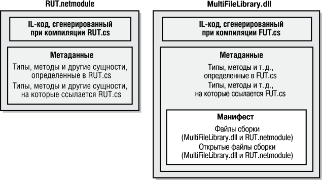


**рис. 2.1.** .Многофайловая.сборка.из.двух.управляемых.модулей.и.манифеста 

## **ПриМеЧание** 

Для.любопытных:.размер.маркеров.метаданных.—.4.байта .Старший.байт.указывает. тип.маркера.(0x01=TypeRef,.0x02=TypeDef,.0x26=FileRef,.0x27=ExportedType) .Полный.список.типов.маркеров.см .в.перечислимом.типе.CorTokenType.в.заголовочном. файле.CorHdr h.из. NET.Framework.SDK .Три.младших.байта.маркера.просто.идентифицируют.запись.в.соответствующей.таблице.метаданных .Например,.маркер. реализации.0x26000001.ссылается.на.первую.строку.таблицы.FileRef.(в.большинстве. таблиц.нумерация.строк.начинается.с.1,.а.не.с.0) .Кстати,.в.TypeDef.нумерация.строк. начинается.с.2 

Любой клиентский код, использующий типы сборки MultiFileLibrary dll, должен компоноваться с указанием параметра компилятора `/r[eference]:MultiFileLibrary. dll` , который заставляет компилятор загрузить сборку MultiFileLibrary dll и все файлы, перечисленные в ее таблице `FileDef` . Компилятору необходимо, чтобы все файлы сборки были установлены и доступны. Если удалить файл RUT netmodule, компилятор C# выдаст следующее сообщение об ошибке: 

**78** Глава.2 .Компоновка,.упаковка,.развертывание.и.администрирование.приложений 

fatal error CS0009: Metadata file 'C:\MultiFileLibrary.dll' could not be opened—'Error importing module 'rut.netmodule' of assembly 

- 'C:\MultiFileLibrary.dll'— The system cannot find the file specified 

Это означает, что при построении новой сборки _должны_ присутствовать все файлы, на которые она ссылается. 

Во время исполнения клиентский код вызывает разные методы. При первом вызове некоторого метода среда CLR определяет, на какие типы он ссылается как на параметр, возвращаемое значение или локальную переменную. Далее CLR пытается загрузить из сборки, на которую ссылается код, файл с манифестом. Если этот файл описывает типы, к которым обращается вызванный метод, срабатывают внутренние механизмы CLR, и нужные типы становятся доступными. Если в манифесте указано, что нужный тип находится в другом файле, CLR загружает этот файл, и внутренние механизмы CLR обеспечивают доступ к данному типу. CLR загружает файл сборки только при вызове метода, ссылающегося на расположенный в этом файле тип. Это значит, что наличие всех файлов сборки, на которую ссылается приложение, для его работы _не обязательно_ . 

## **добавление сборок в проект в среде Visual Studio** 

Если проект создается в среде Visual Studio, необходимо добавить в проект все сборки, на которые он ссылается. Для этого откройте окно Solution Explorer, щелкните правой кнопкой мыши на проекте, на который нужно добавить ссылку, и выберите команду Add Reference. Откроется диалоговое окно Reference.Manager (рис. 2.2). 


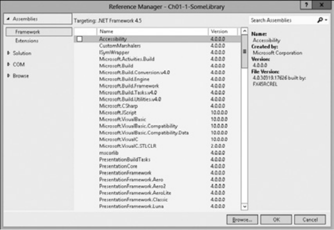


**рис. 2.2.** .Диалоговое.окно.Reference.Manager.в.Visual.Studio 

Объединение.модулей.для.создания.сборки 

**79** 

Для того чтобы добавить в проект ссылку на сборку, выберите ее в списке. Если в списке нет нужной сборки, то для того чтобы ее найти (файл с манифестом), щелкните на кнопке Browse. Вкладка Solution служит для добавления в текущий проект ссылки на сборки, созданные в другом проекте этого же решения. Раздел COM в диалоговом окне Reference.Manager позволяет получить доступ к неуправляемому COM-серверу из управляемого кода через класс-представитель, автоматически генерируемый Visual Studio. Вкладка Browse позволяет выбрать сборку, недавно добавленную в другой проект. 

Чтобы сборки отображались в списке на вкладке  NET, выполните инструкции по адресу: 

```
http://msdn.microsoft.com/en-us/library/wkze6zky(v=vs.110).aspx
```

## **использование утилиты Assembly Linker** 

Вместо компилятора C# для создания сборки можно задействовать компоновщик сборок (assembly linker) AL exe. Эта утилита оказывается кстати, если нужно создавать сборки из модулей, скомпонованных разными компиляторами (если компилятор языка не поддерживает параметр, эквивалентный параметру `/addmodule` из C#), а также в случае, когда требования к упаковке сборки на момент компоновки просто не известны. Утилита AL exe пригодна и для компоновки сборок, состоящих исключительно из ресурсов (или сопутствующих сборок — к ним мы еще вернемся), которые обычно используются для локализации ПО. 

Утилита AL exe может генерировать файлы формата EXE или DLL PE, которые не содержат ничего, кроме манифеста, описывающего типы из других модулей. Чтобы понять, как работает AL exe, скомпонуем сборку MultiFileLibrary dll по-другому: 

```
csc /t:module RUT.cs
csc /t:module FUT.cs
al /out: MultiFileLibrary.dll /t:library FUT.netmodule RUT.netmodule
```

Файлы, генерируемые в результате исполнения этих команд, показаны на рис. 2.3. В этом примере создаются два отдельных модуля, RUT netmodule и FUT netmodule. Оба модуля не являются сборками, так как не содержат таблиц метаданных манифеста. Третий же — MultiFileLibrary dll — это небольшая библиотека PE DLL (поскольку она скомпонована с параметром `/t[arget]:library` ), в которой нет IL-кода, а только таблицы метаданных манифеста, указывающие, что файлы RUT netmodule и FUT netmodule входят в состав сборки. Результирующая сборка состоит из трех файлов: MultiFileLibrary dll, RUT netmodule и FUT netmodule, так как компоновщик сборок не «умеет» объединять несколько файлов в один. 

Утилита AL exe может генерировать PE-файлы с консольным и графическим интерфейсом, а также файлы приложений Windows Store с помощью параметров `/t[arget]:exe` , `/t[arget]:winexe` или `/t[arget]:appcontainerexe` ). Однако это довольно необычно, поскольку означает, что будет сгенерирован исполняемый PE-файл, содержащий не больше IL-кода, чем нужно для вызова метода из другого 

**80** Глава.2 .Компоновка,.упаковка,.развертывание.и.администрирование.приложений 

модуля. Чтобы указать, какой метод должен использоваться в качестве входной точки, задайте при вызове компоновщика сборок параметр командной строки `/main` . Приведем пример вызова AL exe с этим параметром: 

```
csc /t:module /r:MultiFileLibrary.dll Program.cs
al /out:Program.exe /t:exe /main:Program.Main Program.netmodule
```


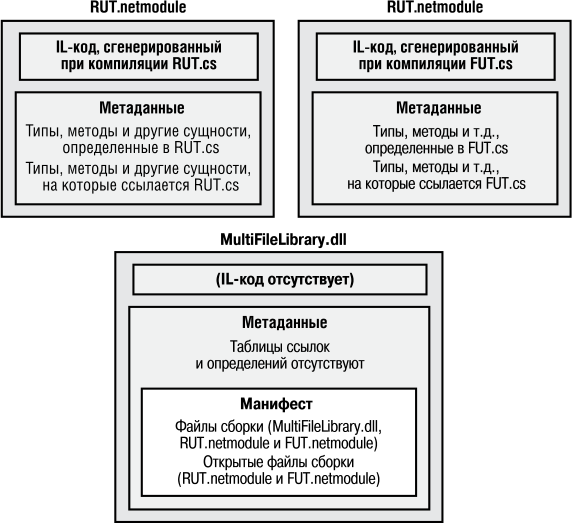


**рис. 2.3.** .Многофайловая.сборка.из.трех.управляемых.модулей.и.манифеста 

Первая строка компонует Program cs в модуль, а вторая генерирует небольшой PE-файл Program exe с таблицами метаданных манифеста. В нем также находится небольшая глобальная функция, сгенерированная AL exe благодаря параметру `/main` : `Program.Main` . Эта функция, `__EntryPoint` , содержит следующий IL-код: 

`.method privatescope static void __EntryPoint$PST06000001() cil managed { .entrypoint // Code size      8 (0x8) .maxstack 8 IL_0000: tail.` IL_0002: call     void [.module 'Program.netmodule']Program::Main() `IL_0007: ret` } // end of method 'Global Functions'::__EntryPoint 

Объединение.модулей.для.создания.сборки 

**81** 

Как видите, этот код просто вызывает метод `Main` , содержащийся в типе `Program` , который определен в файле Program netmodule. Параметр `/main` , указанный при вызове AL exe, здесь не слишком полезен, так как вряд ли вы когда-либо будете создавать приложение, у которого точка входа расположена не в PE-файле с таблицами метаданных манифеста. Здесь этот параметр упомянут лишь для того, чтобы вы знали о его существовании. 

В программном коде для данной книги имеется файл Ch02-3-BuildMultiFileLibrary bat, в котором инкапсулированы последовательно все шаги построения многофайловой сборки. Проект Ch02-4-AppUsingMultiFileLibrary в Visual Studio выполняет данный файл на этапе предварительного построения. Изучение этого примера поможет вам понять, как интегрировать многофайловую сборку из Visual Studio. 

## **Включение в сборку файлов ресурсов** 

Если сборка создается с AL exe, параметр `/embed[resource]` позволяет добавить в сборку файлы ресурсов (файлы в формате, отличном от PE). Параметр принимает любой файл и включает его содержимое в результирующий PE-файл. Таблица `ManifestResourceDef` в манифесте обновляется, отражая наличие нового ресурса. 

Утилита AL exe поддерживает также параметр `/link[resource]` , который принимает файл с ресурсами. Однако параметр только обновляет таблицы манифеста `ManifestResourceDef` и `FileDef` сведениями о ресурсе и о том, в каком файле сборки он находится. Сам файл с ресурсами не внедряется в PE-файл сборки, а хранится отдельно и подлежит упаковке и развертыванию вместе с остальными файлами сборки. 

## **ПриМеЧание** 

В.файлах.управляемой.сборки.содержится.также.файл.манифеста.Win32 .По.умолчанию. компилятор.С#.автоматически.создает.файл.манифеста,.однако.ему.можно.запретить. это.делать.при.помощи.параметра./nowin32manifest .Программный.код.манифеста,. генерируемого.компилятором.C#.по.умолчанию,.выглядит.следующим.образом: 

```
<?xml version="1.0" encoding="UTF 8" standalone="yes"?>
<assembly xmlns="urn:schemas microsoft com:asm.v1" manifestVersion="1.0">
   <assemblyIdentity version="1.0.0.0" name="MyApplication.app" />
      <trustInfo xmlns="urn:schemas microsoft com:asm.v2">
```

```
         <security>
```

```
            <requestedPrivileges xmlns="urn:schemas microsoft com:asm.v3">
               <requestedExecutionLevel level="asInvoker" uiAccess="false"/>
            </requestedPrivileges>
```

- `</security>` 

- `</trustInfo>` 

```
</assembly>
```

Подобно AL exe, CSC exe позволяет объединять ресурсы со сборкой, генерируемой компилятором C#. Параметр `/resource` компилятора C# включает указан- 

## **82** Глава.2 .Компоновка,.упаковка,.развертывание.и.администрирование.приложений 

ный файл с ресурсами в результирующий PE-файл сборки и обновляет таблицу `ManifestResourceDef` . Параметр компилятора `/linkresource` добавляет в таблицы `ManifestResourceDef` и `FileDef` записи со ссылкой на отдельный файл с ресурсами. И последнее: в сборку можно включить стандартные ресурсы Win32. Это легко сделать, указав при вызове AL exe или CSC exe путь к RES-файлу и параметр `/win32res` . Кроме того, можно легко включить стандартный ресурс значка Win32 в файл сборки, указав при вызове AL exe или CSC exe путь к ICO-файлу и параметр `/win32icon` . В Visual Studio файл ресурсов добавляют в сборку на вкладке Application в диалоговом окне свойств проекта. Обычно значки включают, чтобы Проводник Windows (Windows Explorer) мог отображать значок для управляемого исполняемого файла. 

## **ресурсы со сведениями о версии сборки** 

Когда утилита AL exe или CSC exe генерирует сборку в виде PE-файла, она также включает в этот файл стандартный ресурс версии Win32. Пользователи могут увидеть версию, просматривая свойства файла. Для получения этой информации из программы служит статический метод `GetVersionInfo` типа `System.Diagnostics. FileVersionInfo` . На рис. 2.4 показана вкладка Details диалогового окна свойств файла Ch02-3-MultiFileLibrary dll. 


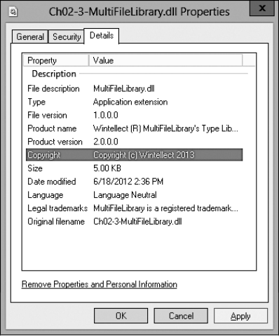


**рис. 2.4.** .Вкладка.Details.диалогового.окна.свойств.файла.Ch02-3-MultiFileLibrary dll 

Ресурсы.со.сведениями.о.версии.сборки 

**83** 

При построении сборки следует задавать значения полей версии в исходном тексте программы с помощью специализированных атрибутов, применяемых на уровне сборки. Вот как выглядит код, генерирующий информацию о версии, показанную на рис. 2.4. 

```
using System.Reflection;
```

// Информация версии поля FileDescription: `[assembly: AssemblyTitle("MultiFileLibrary.dll")]` 

// Информация версии поля Comments: [assembly: AssemblyDescription("This assembly contains MultiFileLibrary's types")] 

// Информация версии поля CompanyName: `[assembly: AssemblyCompany("Wintellect")]` 

// Информация версии поля ProductName: [assembly: AssemblyProduct("Wintellect (R) MultiFileLibrary's Type Library")] 

// Информация версии поля LegalCopyright: `[assembly: AssemblyCopyright("Copyright (c) Wintellect 2013")]` 

// Информация версии поля LegalTrademarks: `[assembly:AssemblyTrademark("MultiFileLibrary is a registered trademark of Wintellect")]` 

// Информация версии поля AssemblyVersion: `[assembly: AssemblyVersion("3.0.0.0")]` 

// Информация версии поля FILEVERSION/FileVersion: `[assembly: AssemblyFileVersion("1.0.0.0")]` 

// Информация версии поля PRODUCTVERSION/ProductVersion: `[assembly: AssemblyInformationalVersion("2.0.0.0")]` 

// Задать поле Language (см. далее раздел "Региональные стандарты") `[assembly:AssemblyCulture("")]` 

## **ВниМание** 

К.сожалению,.в.диалоговом.окне.свойств.Проводника.Windows.отсутствуют.поля.для. некоторых.атрибутов .В.частности,.было.бы.очень.удобно,.если.бы.в.нем.отображался. атрибут.AssemblyVersion,.потому.что.среда.CLR.использует.значение.этого.атрибута. при.загрузке.сборки.(об.этом.рассказано.в.главе.3) 

В табл. 2.4 перечислены поля ресурса со сведениями о версии и соответствующие им атрибуты, определяемые пользователем. Если сборка компонуется утилитой AL exe, сведения о версии можно задать параметрами командной строки вместо атрибутов. Во втором столбце табл. 2.4 показаны параметры командной строки для каждого поля ресурса со сведениями о версии. Обратите внимание на отсутствие аналогичных параметров у компилятора C#; поэтому сведения о версии обычно задают, применяя специализированные атрибуты. 

**84** Глава.2 .Компоновка,.упаковка,.развертывание.и.администрирование.приложений 

**таблица 2.4.** .Поля.ресурса.со.сведениями.о.версии.и.соответствующие. им.параметры.AL exe.и.пользовательские.атрибуты 

|**Поле ресурса**<br>**со сведениями**<br>**о версии**|**Параметр AL.exe**|**атрибут/комментарий**|
|---|---|---|
|FILEVERSION|/fileversion|System.Reflection.<br>AssemblyFileVersionAttribute|
|PRODUCTVERSION|/productversion|System.Reflection.AssemblyInformational-<br>VersionAttribute|
|FILEFLAGSMASK|Нет|Всегда задается равным VS_FFI_<br>FILEFLAGSMASK (определяется<br>в WinVer.h как 0x0000003F)|
|FILEFLAGS|Нет|Всегда равен 0|
|FILEOS|Нет|В настоящее время всегда равен VOS__<br>WINDOWS32|
|FILETYPE|/target|Задается равным VFT_APP, если задан<br>параметр /target:exe или /target:winexe.<br>При наличии параметра /target:library<br>приравнивается VFT_DLL|
|FILESUBTYPE|Нет|Всегда задается равным VFT2_<br>UNKNOWN (это поле не имеет значения<br>для VFT_APP и VFT_DLL)|
|AssemblyVersion|/version|System.Reflection.<br>AssemblyVersionAttribute|
|Comments|/description|System.Reflection.<br>AssemblyDescriptionAttribute|
|CompanyName|/company|System.Reflection.<br>AssemblyCompanyAttribute|
|FileDescription|/title|System.Reflection.AssemblyTitleAttribute|
|FileVersion|/version|System.Reflection.<br>AssemblyVersionAttribute|
|InternalName|/out|Задается равным заданному имени выход-<br>ного файла (без расширения)|
|LegalCopyright|/copyright|System.Reflection.<br>AssemblyCopyrightAttribute|
|LegalTrademarks|/trademark|System.Reflection.<br>AssemblyTrademarkAttribute|


Ресурсы.со.сведениями.о.версии.сборки 

**85** 

|**Поле ресурса**<br>**со сведениями**<br>**о версии**|**Параметр AL.exe**|**атрибут/комментарий**|
|---|---|---|
|OriginalFilename|/out|Задается равным заданному имени выход-<br>ного файла (без пути)|
|PrivateBuild|Нет|Всегда остается пустым|
|ProductName|/product|System.Reflection.<br>AssemblyProductAttribute|
|ProductVersion|/productversion|System.Reflection.AssemblyInformational-<br>VersionAttribute|
|SpecialBuild|Нет|Всегда остается пустым|


## **ВниМание** 

При.создании.нового.проекта.C#.в.Visual.Studio.файл.AssemblyInfo cs.генерируется. автоматически .Он.содержит.все.атрибуты.сборки,.описанные.в.этом.разделе,.а.также. несколько.дополнительных.—.о.них.речь.идет.в.главе.3 .Можно.просто.открыть.файл. AssemblyInfo cs.и.изменить.относящиеся.к.конкретной.сборке.сведения .Visual.Studio. также.предоставляет.диалоговое.окно.для.редактирования.информации.о.версии. сборки,.которое.изображено.на.рис .2 5 


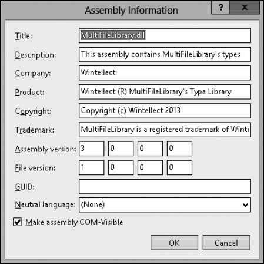


**рис. 2.5.** .Диалоговое.окно.с.информацией.о.сборке.в.Visual.Studio 

**86** Глава.2 .Компоновка,.упаковка,.развертывание.и.администрирование.приложений 

## **номера версии** 

Ранее было показано, что сборка может идентифицироваться по номеру версии. У частей этого номера одинаковый формат: каждая состоит из 4 частей, разделенных точками (табл. 2.5). 

**таблица 2.5.** .Формат.номеров.версии 

||**старший**<br>**номер**|**Младший**<br>**номер**|**номер**<br>**компоновки**|**номер**<br>**редакции**|
|---|---|---|---|---|
|Пример|2|5|719|2|


В табл. 2.5 показан пример номера версии 2.5.719.2. Первые две цифры составляют то, что обычно понимают под номером версии: пользователи будут считать номером версии 2.5. Третье число, 719, указывает номер построения. Если в вашей компании сборка строится каждый день, увеличивать этот номер надо ежедневно. Последнее число 2 — номер редакции сборки. Если в компании сборка строится дважды в день (скажем, после исправления критической и обязательной к немедленному исправлению ошибки, тормозившей всю работу над проектом), надо увеличивать номер редакции. Такая схема нумерации версий принята в компании Microsoft, и я настоятельно рекомендую ей следовать. 

Обратите внимание: со сборкой связаны три номера версии. Это очень неудачное решение стало источником серьезной путаницы. Попробую объяснить, для чего нужен каждый из этих номеров и как его правильно использовать. 

- **AssemblyFileVersion** — этот номер версии хранится в ресурсе версии Win32 и предназначен лишь для информации, CLR его полностью игнорирует. Обычно устанавливают старший и младший номера версии, определяющие отображаемый номер версии. Далее при каждой компоновке увеличивают номер компоновки и редакции. Теоретически инструмент от компании Microsoft (например, CSC exe или AL exe) должен автоматически обновлять номера компоновки и редакции (в зависимости от даты и времени на момент компоновки), но этого не происходит. Этот номер версии отображается Проводником Windows и служит для определения точного времени компоновки сборки. 

- **AssemblyInformationalVersion** — этот номер версии также хранится в ресурсе версии Win32 и, как и предыдущий, предназначен лишь для информации; CLR его игнорирует. Этот номер служит для указания версии продукта, в который входит сборка. Например, продукт версии 2.0 может состоять из нескольких сборок. Одна из них может отмечаться как версия 1.0, если это новая сборка, не входившая в комплект поставки продукта версии 1.0. Обычно отображаемый номер версии формируется из старшего и младшего номеров версии. Затем номера компоновки и редакции увеличивают при каждой упаковке всех сборок готового продукта. 

**87** 

Региональные.стандарты 

- **AssemblyVersion** — этот номер версии хранится в манифесте, в таблице метаданных `AssemblyDef` . CLR использует этот номер версии для привязки к сборкам, имеющим строгие имена (о них рассказано в главе 3). Этот номер версии чрезвычайно важен, так как он однозначно идентифицирует сборку. Начиная разработку сборки, следует задать старший и младший номера версии, а также номера компоновки и редакции; не меняйте их, пока не будете готовы начать работу над следующей версией сборки, пригодной для развертывания. При создании сборки, ссылающейся на другую, этот номер версии включается в нее в виде записи таблицы `AssemblyRef` . Это значит, что сборка знает, с какой версией она была построена и протестирована. CLR может загрузить другую версию, используя механизм перенаправления привязки, описанный в главе 3. 

## **региональные стандарты** 

Помимо номера версии, сборки идентифицируют _региональными стандартами_ (culture). Например, одна сборка может быть исключительно на немецком языке, другая — на швейцарском варианте немецкого, третья — на американском английском и т. д. Региональные стандарты идентифицируются строкой, содержащей основной и вспомогательный теги (как описано в RFC1766). Несколько примеров приведено в табл. 2.6. 

**таблица 2.6.** .Примеры.тегов,.определяющих.региональные.стандарты.сборки 

|**таблица 2.6.**Примеры|тегов,определяющихрегиона|льныестандартысборки|
|---|---|---|
|**Основной тег**|**Вспомогательный тег**|**региональные стандарты**|
|De|Нет|Немецкий|
|De|AT|Австрийский немецкий|
|De|CH|Швейцарский немецкий|
|En|Нет|Английский|
|En|GB|Английский|
|En|US|Английский|


В общем случае сборкам с кодом не назначают региональные стандарты, так как код обычно не содержит зависящих от них встроенных параметров. Сборку, для которой не определен региональный стандарт, называют сборкой с _нейтральными региональными стандартами_ (culture neutral). 

При создании приложения, ресурсы которого привязаны к региональным стандартам, компания Microsoft настоятельно рекомендует объединять программный ресурс и ресурсы приложения по умолчанию в одной сборке и не назначать ей 

**88** Глава.2 .Компоновка,.упаковка,.развертывание.и.администрирование.приложений 

региональных стандартов при построении. Другие сборки будут ссылаться на нее при создании и работе с типами, которые она предоставляет для общего доступа. 

После этого можно создать одну или несколько отдельных сборок, содержащих только ресурсы, зависящие от региональных стандартов, и никакого программного кода. Сборки, помеченные для применения в определенных региональных стандартах, называют _сопутствующими_ (satellite assemblies). Региональные стандарты, назначенные такой сборке, в точности отражают региональные стандарты размещенного в ней ресурса. Рекомендуется создавать отдельную сопутствующую сборку для каждого регионального стандарта, который вы намерены поддерживать. 

Обычно сопутствующие сборки строятся при помощи утилиты AL exe. Не стоит использовать для этого компилятор — ведь в сопутствующей сборке не должно быть программного кода. Применяя утилиту AL exe, можно задать желаемые региональные стандарты параметром `/c[ulture]:` _text_ , где _text_ — это строка (например, `en-US` , представляющая американский вариант английского языка). При развертывании сопутствующие сборки следует помещать в подкаталог, имя которого совпадает с текстовой строкой, идентифицирующей региональные стандарты. Например, если базовым каталогом приложения является C:\MyApp, сопутствующая сборка для американского варианта английского языка должна быть в каталоге C:\MyApp\en-US. Во время выполнения доступ к ресурсам сопутствующей сборки осуществляют через класс `System.Resources.ResourceManager` . 

## **ПриМеЧание** 

Хотя.это.и.не.рекомендуется,.можно.создавать.сопутствующие.сборки.с.программным.кодом .При.желании.вместо.параметра./culture.утилиты.AL exe.региональный. стандарт.можно.указать.в.атрибуте.System Reflection AssemblyCulture,.определяемом. пользователем,.например,.следующим.образом: 

// Назначить для сборки региональный стандарт Swiss German `[assembly:AssemblyCulture("de-CH")]` 

В общем случае не стоит создавать сборки, ссылающиеся на сопутствующие сборки. Другими словами, все записи таблицы `AssemblyRef` должны ссылаться на сборки с нейтральными региональными стандартами. Если необходимо получить доступ к типам или членам, расположенным в сопутствующей сборке, следует воспользоваться механизмом отражения (см. главу 23). 

## **развертывание простых приложений (закрытое развертывание сборок)** 

Ранее в этой главе было показано, как строить модули и объединять их в сборки. Пора заняться упаковкой и развертыванием сборок, чтобы пользователь мог работать с приложением. 

Развертывание.простых.приложений.(закрытое.развертывание.сборок) 

**89** 

Для приложений Windows Store устанавливаются исключительно жесткие правила упаковки сборок. Visual Studio упаковывает все сборки, необходимые приложению, в один файл _.appx_ , который либо отправляется в Windows Store, либо загружается на машину. Когда пользователь устанавливает файл  appx, все содержащиеся в нем сборки помещаются в каталог, из которого CLR загружает их, а Windows добавляет плитку приложения на начальный экран пользователя. Если другие пользователи установят тот же файл  appx, будут использованы ранее установленные сборки, а у нового пользователя на начальном экране просто добавится плитка. Когда пользователь удаляет приложение Windows Store, система удаляет плитку с начального экрана пользователя. Если приложение не установлено у других пользователей, Windows уничтожает каталог вместе со всеми сборками. Не забывайте, что разные пользователи могут устанавливать разные версии одного приложения Windows Store. Учитывая такую возможность, Windows устанавливает сборки в разные каталоги, чтобы несколько версий одного приложения могли одновременно существовать на одной машине. 

Для настольных приложений (не относящихся к Windows Store) особых средств для упаковки сборки не требуется. Легче всего упаковать набор сборок, просто скопировав все их файлы. Например, можно поместить все файлы сборки на компактдиск и передать их пользователю вместе с программой установки, написанной в виде пакетного файла. Такая программа просто копирует файлы с компакт-диска в каталог на жестком диске пользователя. Поскольку сборка включает все ссылки и типы, определяющие ее работу, ему достаточно запустить приложение, а CLR найдет в каталоге приложения все сборки, на которые ссылается данная сборка. Так что для запуска приложения не нужно модифицировать реестр, а чтобы удалить приложение, достаточно просто удалить его файлы — и все! 

Конечно, можно применять для упаковки и установки сборок другие механизмы, например CAB-файлы (они обычно используются в сценариях с загрузкой из Интернета для сжатия файлов и сокращения времени загрузки). Можно также упаковать файлы сборки в MSI-файл, предназначенный для службы установщика Windows (Windows Installer), MSIExec exe. MSI позволяет установить сборку по требованию при первой попытке CLR ее загрузить. Эта функция не нова для службы MSI, она также поддерживает аналогичную функцию для неуправляемых EXE- и DLL-файлов. 

## **ПриМеЧание** 

Пакетный.файл.или.подобная.простая.«установочная.программа».скопирует.приложение.на.машину.пользователя,.однако.для.создания.ярлыков.на.рабочем.столе,. в.меню.Пуск.(Start).и.на.панели.быстрого.запуска.понадобится.программа.посложнее . Кроме.того,.скопировать,.восстановить.или.переместить.приложение.с.одной.машины. на.другую.легко,.но.ссылки.и.ярлыки.потребуют.специального.обращения 

Естественно, в Visual Studio есть встроенные механизмы, которые можно задействовать для публикации приложений, — это делается на вкладке Publish страницы 

**90** Глава.2 .Компоновка,.упаковка,.развертывание.и.администрирование.приложений 

свойств проекта. Можно использовать ее, чтобы заставить Visual Studio создать MSI-файл и скопировать его на веб-сайт, FTP-сайт или в заданную папку на диске. MSI-файл также может установить все необходимые компоненты, такие как .NET Framework или Microsoft SQL Server Express Edition. Наконец, приложение может автоматически проверять наличие обновлений и устанавливать их на пользовательской машине посредством технологии ClickOnce. 

Сборки, развертываемые в том же каталоге, что и приложение, называют _сборками с закрытым развертыванием_ (privately deployed assemblies), так как файлы сборки не используются совместно другими приложениями (если только другие приложения не развертывают в том же каталоге). Сборки с закрытым развертыванием — серьезное преимущество для разработчиков, конечных пользователей и администраторов, поскольку достаточно скопировать такие сборки в базовый каталог приложения, и CLR сможет загрузить и исполнить содержащийся в них код. Приложение легко удаляется; для этого достаточно удалить сборки из его каталога. Также упрощаются процедуры резервного копирования и восстановления подобных сборок. 

Несложный сценарий установки/перемещения/удаления приложения стал возможным благодаря наличию в каждой сборке метаданных. Метаданные указывают, какую сборку, на которую они ссылаются, нужно загрузить — для этого не нужны параметры реестра. Кроме того, область видимости сборки охватывает все типы. Это значит, что приложение всегда привязывается именно к тому типу, с которым оно было скомпоновано и протестировано. CLR не станет загружать другую сборку просто потому, что она предоставляет тип с тем же именем. Этим CLR отличается от COM, где типы регистрируются в системном реестре, что делает их доступными любому приложению, работающему на машине. 

В главе 3 рассказано о развертывании совместно используемых сборок, доступных нескольким приложениям. 

## **Простое средство администрирования (конфигурационный файл)** 

Пользователи и администраторы лучше всех могут определять разные аспекты работы приложения. Например, администратор может решить переместить файлы сборки на жесткий диск пользователя или заменить данные в манифесте сборки. Есть и другие сценарии управления версиями и удаленного администрирования, о некоторых из них рассказано в главе 3. 

Для того чтобы предоставить администратору контроль над приложением, можно разместить в каталоге приложения конфигурационный файл. Его может создать и упаковать издатель приложения, после чего программа установки запишет конфигурационный файл в базовый каталог приложения. Кроме того, администратор 

**91** 

Простое.средство.администрирования.(конфигурационный.файл) 

или конечный пользователь машины может сам создать или модифицировать этот файл. CLR интерпретирует его содержимое для изменения политики поиска и загрузки файлов сборки. 

Конфигурационные файлы содержат XML-теги и могут ассоциироваться с приложением или с компьютером. Использование отдельного файла (вместо параметров, хранимых в реестре) позволяет легко создать резервную копию файла, а администратору — без труда копировать файлы с машины на машину: достаточно скопировать нужные файлы — в результате будет также скопирована административная политика. 

В главе 3 такой конфигурационный файл рассматривается подробно, а пока вкратце обсудим его. Допустим, издатель хочет развернуть приложение вместе с файлами сборки `MultiFileLibrary` , но в отдельном каталоге. Желаемая структура каталогов с файлами выглядит следующим образом: 

Каталог AppDir (содержит файлы сборки приложения) `Program.exe` Program.exe.config (обсуждается ниже) 

Подкаталог AuxFiles (содержит файлы сборки MultiFileLibrary) `MultiFileLibrary.dll FUT.netmodule RUT.netmodule` 

Поскольку файлы сборки `MultiFileLibrary` более не находятся в базовом каталоге приложения, CLR не сможет найти и загрузить их, и при запуске приложения будет сгенерировано исключение `System.IO.FileNotFoundException` . Чтобы избежать этого, издатель создает конфигурационный файл в формате XML и размещает его в базовом каталоге приложения. Имя этого файла должно совпадать с именем главного файла сборки и иметь расширение config, в данном случае — Program exe config. Содержимое этого конфигурационного файла должно выглядеть примерно следующим образом: 

```
<configuration>
  <runtime>
```

```
    <assemblyBinding xmlns="urn:schemas-microsoft-com:asm.v1">
      <probing privatePath="AuxFiles" />
```

```
    </assemblyBinding>
```

```
  </runtime>
```

```
</configuration>
```

Пытаясь найти файл сборки, CLR всегда сначала ищет в каталоге приложения, и если поиск заканчивается неудачей, продолжает искать в подкаталоге AuxFiles. В атрибуте `privatePath` элемента, направляющего поиск, можно указать несколько путей, разделенных точкой с запятой. Считается, что все пути заданы относительно базового каталога приложения. Идея заключается в том, что приложение может управлять своим каталогом и его подкаталогами, но не может управлять другими каталогами. 

**92** Глава.2 .Компоновка,.упаковка,.развертывание.и.администрирование.приложений 

## **алгоритм поиска файлов сборки** 

В поиске сборки среда CLR просматривает несколько подкаталогов. Порядок при поиске сборки с нейтральными региональными стандартами таков (при условии, что параметры `firstPrivatePath` и `secondPrivatePath` определены в атрибуте `privatePath` конфигурационного файла): 

```
AppDir\AsmName.dll
AppDir\AsmName\AsmName.dll
AppDir\firstPrivatePath\AsmName.dll
AppDir\firstPrivatePath\AsmName\AsmName.dll
AppDir\secondPrivatePath\AsmName.dll
AppDir\secondPrivatePath\AsmName\AsmName.dll
...
```

В этом примере конфигурационный файл не понадобится, если файлы сборки `MultiFileLibrary` развернуты в подкаталоге MultiFileLibrary, так как CLR автоматически проверяет подкаталог, имя которого совпадает с именем искомой сборки. 

Если ни в одном из упомянутых каталогов сборка не найдена, CLR начинает поиск заново, но теперь ищет файл с расширением EXE вместо DLL. Если и на этот раз поиск оканчивается неудачей, генерируется исключение `FileNotFoundException` . 

В отношении сопутствующих сборок действуют те же правила поиска за одним исключением: ожидается, что сборка находится в подкаталоге базового каталога приложения, имя которого совпадает с названием регионального стандарта. Например, если для файла AsmName dll назначен региональный стандарт «en-US», порядок просмотра каталогов таков: 

```
C:\AppDir\en US\AsmName.dll
```

- `C:\AppDir\en US\AsmName\AsmName.dll` 

- `C:\AppDir\firstPrivatePath\en US\AsmName.dll` 

- `C:\AppDir\firstPrivatePath\en US\AsmName\AsmName.dll` 

- `C:\AppDir\secondPrivatePath\en US\AsmName.dll` 

- `C:\AppDir\secondPrivatePath\en US\AsmName\AsmName.dll` 

- `C:\AppDir\en US\AsmName.exe` 

- `C:\AppDir\en US\AsmName\AsmName.exe` 

- `C:\AppDir\firstPrivatePath\en US\AsmName.exe` 

- `C:\AppDir\firstPrivatePath\en US\AsmName\AsmName.exe` 

- `C:\AppDir\secondPrivatePath\en US\AsmName.exe` 

- `C:\AppDir\secondPrivatePath\en US\AsmName\AsmName.exe` 

- `C:\AppDir\en\AsmName.dll` 

- `C:\AppDir\en\AsmName\AsmName.dll` 

- `C:\AppDir\firstPrivatePath\en\AsmName.dll` 

- `C:\AppDir\firstPrivatePath\en\AsmName\AsmName.dll` 

- `C:\AppDir\secondPrivatePath\en\AsmName.dll` 

- `C:\AppDir\secondPrivatePath\en\AsmName\AsmName.dll` 

- `C:\AppDir\en\AsmName.exe` 

- `C:\AppDir\en\AsmName\AsmName.exe` 

**93** 

Простое.средство.администрирования.(конфигурационный.файл) 

- `C:\AppDir\firstPrivatePath\en\AsmName.exe` 

- `C:\AppDir\firstPrivatePath\en\AsmName\AsmName.exe` 

- `C:\AppDir\secondPrivatePath\en\AsmName.exe` 

- `C:\AppDir\secondPrivatePath\en\AsmName\AsmName.exe` 

Как видите, CLR ищет файлы с расширением EXE или DLL. Поскольку поиск может занимать значительное время (особенно когда CLR пытается найти файлы в сети), в конфигурационном XML-файле можно указать один или несколько элементов региональных стандартов `culture` , чтобы ограничить круг проверяемых каталогов при поиске сопутствующих сборок. Microsoft предоставляет программу FusLogVw exe, при помощи которой можно увидеть, как CLR осуществляет привязку сборок во время выполнения. Дополнительная информация доступна по адресу http://msdn microsoft com/en-us/library/e74a18c4(v=vs 110) aspx. 

Имя и расположение конфигурационного XML-файла может различаться в зависимости от типа приложения. 

- Для исполняемых приложений (EXE) конфигурационный файл должен располагаться в базовом каталоге приложения. У него должно быть то же имя, что и у EXE-файла, но с расширением config. 

- Для приложений Microsoft ASP.NET Web Form конфигурационный файл всегда должен находиться в виртуальном корневом каталоге веб-приложения и называться Web config. Кроме того, в каждом вложенном каталоге может быть собственный файл Web config с унаследованными параметрами конфигурации. Например, веб-приложение, расположенное по адресу http://www Wintellect com/ Training, будет использовать параметры из файлов Web config, расположенных в виртуальном корневом каталоге и в подкаталоге Training. 

Как уже было сказано, параметры конфигурации применяются к конкретному приложению и конкретному компьютеру. При установке платформа .NET Framework создает файл Machine config. Существует по одному файлу Machine config на каждую версию среды CLR, установленную на данной машине. Файл Machine config расположен в следующем каталоге: 

`%SystemRoot%\Microsoft.NET\Framework\` _версия_ `\CONFIG` 

Естественно, `%SystemRoot%` — это каталог, в котором установлена система Windows (обычно C:\Windows), а _версия_ — номер версии, идентифицирующий определенную версию платформы .NET Framework (например, v4.0.#####). 

Параметры файла Machine config заменяют параметры конфигурационного файла конкретного приложения. Администраторам и пользователям следует избегать модификации файла Machine config, поскольку в нем хранятся многие параметры, связанные с самыми разными аспектами работы системы, что серьезно затрудняет ориентацию в его содержимом. Кроме того, конфигурационные файлы, специфичные для приложения, упрощают организацию резервного копирования и восстановления конфигурации приложения. 

## **Глава 3. совместно используемые сборки и сборки со строгим именем** 

В главе 2 говорилось о построении, упаковке и развертывании сборок. При этом основное внимание уделялось _закрытому развертыванию_ (private deployment), при котором сборки, предназначенные исключительно для одного приложения, помещают в базовый каталог приложения или в его подкаталог. Закрытое развертывание сборок позволяет в значительной мере управлять именами, версиями и поведением сборок. 

В этой главе мы займемся созданием сборок, которые могут совместно использоваться несколькими приложениями. Замечательный пример глобально развертываемых сборок — это сборки, поставляемые вместе с Microsoft .NET Framework, поскольку почти все управляемые приложения используют типы, определенные Microsoft в библиотеке классов .NET Framework Class Library (FCL). 

Как уже было отмечено в главе 2, операционная система Windows получила репутацию нестабильной главным образом из-за того, что для создания и тестирования приложений приходится использовать чужой код. В конце концов, любое приложение для Windows, которое вы пишете, вызывает код, созданный разработчиками Microsoft. Более того, самые разные компании производят элементы управления, которые разработчики затем встраивают в свои приложения. Фактически такой подход стимулирует сама платформа .NET Framework, а со временем, вероятно, число производителей элементов управления возрастет. 

Время не стоит на месте, как и разработчики из Microsoft, как и сторонние производители элементов управления: они устраняют ошибки, добавляют в свой код новые возможности и т. п. В конечном счете, на жесткий диск пользовательского компьютера попадает новый код. В результате в давно установленном и прекрасно работавшем пользовательском приложении начинает использоваться уже не тот код, с которым оно создавалось и тестировалось. Поведение такого приложения становится непредсказуемым, что, в свою очередь, негативно влияет на стабильность Windows. 

Решить проблему управления версиями файлов чрезвычайно трудно. На самом деле, я готов спорить, что если взять любой файл и изменить в нем значение одногоединственного бита с 0 на 1 или наоборот, то никто не сможет гарантировать, что программы, использовавшие исходную версию этого файла, будут работать с новой версией файла, как ни в чем не бывало. Это утверждение верно хотя бы потому, что многие программы случайно или преднамеренно эксплуатируют ошибки других 

Два.вида.сборок.—.два.вида.развертывания **95** 

программ. Если в более поздней версии кода какая-либо ошибка будет исправлена, то использующее его приложение начинает работать непредсказуемо. 

Итак, вопрос в следующем: как, устраняя ошибки и добавляя к программам новые функции, гарантировать, что эти изменения не нарушат работу других приложений? Я долго думал над этим и пришел к выводу — это просто невозможно. Но, очевидно, такой ответ не устроит никого, поскольку в поставляемых файлах всегда будут ошибки, а разработчики всегда будут одержимы желанием добавлять новые функции. Должен все же быть способ распространения новых файлов, позволяющий надеяться, что любое приложение после обновления продолжит замечательно работать, а если нет, то _легко_ вернуть приложение в последнее состояние, в котором оно прекрасно работало. 

В этой главе описана инфраструктура .NET Framework, призванная решить проблемы управления версиями. Позвольте сразу предупредить: речь идет о сложных материях. Нам придется рассмотреть массу алгоритмов, правил и политик, встроенных в общеязыковую исполняющую среду (CLR). Помимо этого, упомянуты многие инструменты и утилиты, которыми приходится пользоваться разработчику. Все это достаточно сложно, поскольку, как я уже сказал, проблема управления версиями непроста сама по себе и то же можно сказать о подходах к ее решению. 

## **два вида сборок — два вида развертывания** 

Среда CLR поддерживает два вида сборок: с _нестрогими именами_ (weakly named assemblies) и со _строгими именами_ (strongly named assemblies). 

## **ВниМание** 

Вы.никогда.не.встретите.термин.«сборка.с.нестрогим.именем».в.документации.по. NET.Framework .Почему?.А.потому,.что.я.сам.его.придумал .В.действительности. в.документации.нет.термина.для.обозначения.сборки,.у.которой.отсутствует.строгое. имя .Я.решил.обозначить.такие.сборки.специальным.термином,.чтобы.по.тексту.было. однозначно.понятно,.о.каких.сборках.идет.речь 

Сборки со строгими и нестрогими именами имеют идентичную структуру, то есть в них используется файловый формат PE (portable executable), заголовок PE32(+), CLR-заголовок, метаданные, таблицы манифеста, а также IL-код, рассмотренный в главах 1 и 2. Оба типа сборок компонуются при помощи одних и тех же инструментов, например компилятора C# или AL exe. В действительности сборки со строгими и нестрогими именами отличаются тем, что первые подписаны при помощи пары ключей, уникально идентифицирующей издателя сборки. Эта пара ключей позволяет уникально идентифицировать сборку, обеспечивать ее безопасность, управлять ее версиями, а также развертывать в любом месте пользовательского жесткого диска или даже в Интернете. Возможность уникальной идентификации 

**96** Глава.3 .Совместно.используемые.сборки.и.сборки.со.строгим.именем 

сборки позволяет CLR при попытке привязки приложения к сборке со строгим именем применить определенные политики, которые гарантируют безопасность. Эта глава посвящена разъяснению сущности сборок со строгим именем и политик, применяемых к ним со стороны CLR. 

Развертывание сборки может быть закрытым или глобальным. Сборки первого типа развертываются в базовом каталоге приложения или в одном из его подкаталогов. Для сборки с нестрогим именем возможно лишь закрытое развертывание. О сборках с закрытым развертыванием речь шла в главе 2. Сборку с глобальным развертыванием устанавливают в каком-либо общеизвестном каталоге, который CLR проверяет при поиске сборок. Такие сборки можно развертывать как закрыто, так и глобально. В этой главе объяснено, как создают и развертывают сборки со строгим именем. Сведения о типах сборок и способах их развертывания представлены в табл. 3.1. 

**таблица 3.1.** .Возможные.способы.развертывания.сборок. со.строгими.и.нестрогими.именами 

|**тип сборки**|**закрытое**<br>**развертывание**|**Глобальное**<br>**развертывание**|
|---|---|---|
|Сборка с нестрогим именем|Да|Нет|
|Сборка со строгим именем|Да|Да|


## **назначение сборке строгого имени** 

Если сборка должна использоваться несколькими приложениями, ее следует поместить в общеизвестный каталог, который среда CLR должна автоматически проверять, обнаружив ссылку на сборку. Однако при этом возникает проблема — две (или больше) компании могут выпустить сборки с одинаковыми именами. Тогда, если обе эти сборки будут скопированы в один общеизвестный каталог, «победит» последняя из них, а работа приложений, использовавших первую, нарушится — ведь первая при копировании заменяется второй (это и является причиной «кошмара DLL» в современных системах Windows — все библиотеки DLL копируются в папку System32). 

Очевидно, одного имени файла мало, чтобы различать две сборки. Среда CLR должна поддерживать некий механизм, позволяющий уникально идентифицировать сборку. Именно для этого и служат _строгие имена_ . У сборки со строгим именем четыре атрибута, уникально ее идентифицирующих: имя файла (без расширения), номер версии, идентификатор регионального стандарта и открытый ключ. Поскольку открытые ключи представляют собой очень большие числа, вместо последнего атрибута используется небольшой хеш-код открытого ключа, который называют 

Назначение.сборке.строгого.имени 

**97** 

_маркером открытого ключа_ (public key token). Следующие четыре строки, которые иногда называют отображаемым именем сборки (assembly display name), идентифицируют совершенно разные файлы сборки: 

"MyTypes, Version=1.0.8123.0, Culture=neutral, PublicKeyToken=b77a5c561934e089" "MyTypes, Version=1.0.8123.0, Culture="en-US", PublicKeyToken=b77a5c561934e089" "MyTypes, Version=2.0.1234.0, Culture=neutral, PublicKeyToken=b77a5c561934e089" "MyTypes, Version=1.0.8123.0, Culture=neutral, PublicKeyToken=b03f5f7f11d50a3a" 

Первая строка идентифицирует файл сборки MyTypes exe или MyTypes dll (на самом деле, по строке идентификации нельзя узнать расширение файла сборки). Компания-производитель назначила сборке номер версии 1.0.8123.0, в ней нет компонентов, зависимых от региональных стандартов, так как атрибут `Culture` определен как `neutral` . Но сделать сборку MyTypes dll (или MyTypes exe) с номером версии 1.0.8123.0 и нейтральными региональными стандартами может любая компания. 

Должен быть способ отличить сборку, созданную этой компанией, от сборок других компаний, которым случайно были назначены те же атрибуты. В силу ряда причин компания Microsoft предпочла другим способам идентификации (при помощи GUID, URL и URN) стандартные криптографические технологии, основанные на паре из закрытого и открытого ключей. В частности, криптографические технологии позволяют проверять целостность данных сборки при установке ее на жесткий диск, а также назначать разрешения доступа к сборке в зависимости от ее издателя. Все эти механизмы обсуждаются далее в этой главе. Итак, компания, желающая снабдить свои сборки уникальной меткой, должна получить пару ключей — открытый и закрытый, после чего открытый ключ можно будет связать со сборкой. У всех компаний будут разные пары ключей, поэтому они смогут создавать сборки с одинаковыми именами, версиями и региональными стандартами, не опасаясь возникновения конфликтов. 

## **ПриМеЧание** 

Вспомогательный.класс.System Reflection AssemblyName.позволяет.легко.генерировать.имя.для.сборки,.а.также.получать.отдельные.части.имени.сборки .Он.поддерживает.ряд.открытых.экземплярных.свойств:.CultureInfo,.FullName,.KeyPair,.Name.и. Version.—.и.предоставляет.открытые.методы.экземпляров,.такие.как.GetPublicKey,. GetPublicKeyToken,.SetPublicKey.и.SetPublicKeyToken 

В главе 2 я показал, как назначить имя файлу сборки, как задать номера версии и идентификатор регионального стандарта. У сборки с нестрогим именем атрибуты номера версии и региональных стандартов могут быть включены в метаданные манифеста. Однако в этом случае CLR всегда игнорирует номер версии, а при поиске сопутствующих сборок использует лишь идентификатор региональных стандартов. Поскольку сборки с нестрогими именами всегда развертываются в закрытом режиме, для поиска файла сборки в базовом каталоге приложения или в одном из 

**98** Глава.3 .Совместно.используемые.сборки.и.сборки.со.строгим.именем 

его подкаталогов, указанном атрибутом `privatePath` конфигурационного XMLфайла, CLR просто берет имя сборки (добавляя к нему расширение DLL или EXE). 

Кроме имени файла, у сборки со строгим именем есть номер версии и идентификатор региональных стандартов. Кроме того, она подписана при помощи закрытого ключа издателя. 

Первый этап создания такой сборки — получение ключа при помощи утилиты Strong Name (SN exe), поставляемой в составе .NET Framework SDK и Microsoft Visual Studio. Эта утилита поддерживает множество функций, которыми пользуются, задавая в командной строке соответствующие параметры. Заметьте: все параметры командной строки SN exe чувствительны к регистру. Чтобы сгенерировать пару ключей, выполните следующую команду: 

```
SN –k MyCompany.snk
```

Эта команда заставит SN exe создать файл MyCompany snk, содержащий открытый и закрытый ключи в двоичном формате. 

Числа, образующие открытый ключ, очень велики. При необходимости после создания этого файла можно использовать SN exe, чтобы увидеть открытый ключ. Для этого нужно выполнить SN exe дважды: сначала с параметром `–p` , чтобы создать файл, содержащий только открытый ключ ( `MyCompany.PublicKey` )[1] : 

```
SN –p MyCompany.keys MyCompany.PublicKey
```

Затем SN exe выполняется с параметром `–tp` с указанием файла, содержащего открытый ключ: 

```
SN –tp MyCompany.PublicKey
```

На своем компьютере я получил следующий результат: 

```
Microsoft (R) .NET Framework Strong Name Utility  Version 4.0.30319.17929
Copyright (c) Microsoft Corporation.  All rights reserved.
```

```
Public key (hash algorithm: sha256):
00240000048000009400000006020000002400005253413100040000010001003f9d621b702111
850be453b92bd6a58c020eb7b804f75d67ab302047fc786ffa3797b669215afb4d814a6f294010
b233bac0b8c8098ba809855da256d964c0d07f16463d918d651a4846a62317328cac893626a550
69f21a125bc03193261176dd629eace6c90d36858de3fcb781bfc8b817936a567cad608ae672b6
1fb80eb0
```

```
Public key token is 3db32f38c8b42c9a
```

При этом невозможно заставить SN exe аналогичным образом отобразить закрытый ключ. 

> 1 В этом примере используется механизм Enhanced Strong Naming, появившийся в .NET Framework 4.5. Чтобы создать сборку, совместимую с предыдущими версиями .NET Framework, вам также придется создать подпись другой стороны (counter-signature) с использованием атрибута AssemblySignatureKey. За подробностями обращайтесь по адресу http://msdn. microsoft.com/en-us/library/hh415055(v=vs.110).aspx. 

Назначение.сборке.строгого.имени 

**99** 

Большой размер открытых ключей затрудняет работу с ними. Чтобы облегчить жизнь разработчику (и конечному пользователю), были созданы _маркеры открытого ключа_ . Маркер открытого ключа — это 64-разрядный хеш-код открытого ключа. Если вызвать утилиту SN exe с параметром `–tp` , то после значения ключа она выводит соответствующий маркер открытого ключа. 

Теперь мы знаем, как создать криптографическую пару ключей, и получение сборки со строгим именем не должно вызывать затруднений. При компиляции сборки необходимо задать компилятору параметр `/keyfile:` _имя_файла_ : 

```
csc /keyfile:MyCompany.snk Program.cs
```

Обнаружив в исходном тексте этот параметр, компилятор C# открывает заданный файл (MyCompany snk), подписывает сборку закрытым ключом и встраивает открытый ключ в манифест сборки. Заметьте: подписывается лишь файл сборки, содержащий манифест, другие файлы сборки нельзя подписать явно. 

В Visual Studio новая пара ключей создается в окне свойств проекта. Для этого перейдите на вкладку Signing, установите флажок Sign the assembly, а затем в поле со списком Choose a strong name key file выберите вариант <New…>. 

Слова «подписание файла» означают здесь следующее: при компоновке сборки со строгим именем в таблицу метаданных манифеста `FileDef` заносится список всех файлов, составляющих эту сборку. Каждый раз, когда к манифесту добавляется имя файла, рассчитывается хеш-код содержимого этого файла, и полученное значение сохраняется вместе с именем файла в таблице `FileDef` . Можно заменить алгоритм хеширования, используемый по умолчанию, вызвав AL exe с параметром `/algid` или задав на уровне сборки следующий атрибут, определяемый пользователем, — `System.Reflection.AssemblyAlgorithmIdAttribute` . По умолчанию хеш-код вычисляется по алгоритму SHA-1. 

После компоновки PE-файла с манифестом рассчитывается хеш-код всего содержимого этого файла (за исключением подписи Authenticode Signature, строгого имени сборки и контрольной суммы заголовка PE), как показано на рис. 3.1. Для этой операции применяется алгоритм SHA-1, здесь его нельзя заменить никаким другим. Значение хеш-кода подписывается закрытым ключом издателя, а полученная в результате цифровая подпись RSA заносится в зарезервированный раздел PE-файла (при хешировании PE-файла этот раздел исключается), и в CLR-заголовок PE-файла записывается адрес, по которому встроенная цифровая подпись находится в файле. 

В этот PE-файл также встраивается открытый ключ издателя (он записывается в таблицу `AssemblyDef` метаданных манифеста). Комбинация имени файла, версии сборки, региональных стандартов и значения открытого ключа составляет строгое имя сборки, которое гарантированно является уникальным. Две разных компании ни при каких обстоятельствах не смогут создать две одинаковые сборки, скажем, с именем Calculus, с той же парой ключей (без явной передачи ключей). 

Теперь сборка и все ее файлы готовы к упаковке и распространению. 

**100** Глава.3 .Совместно.используемые.сборки.и.сборки.со.строгим.именем 


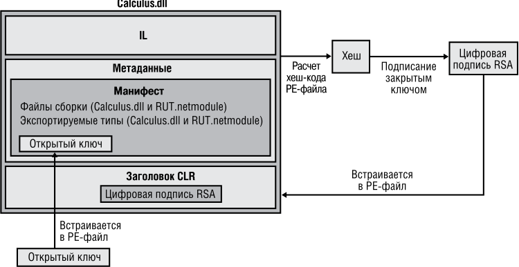


**рис. 3.1.** .Подписание.сборки 

Как отмечено в главе 2, при компиляции исходного текста компилятор обнаруживает все типы и члены, на которые ссылается исходный текст. Также компилятору необходимо указать все сборки, на которые ссылается данная сборка. В случае компилятора C# для этого применяется параметр `/reference` . В задачу компилятора входит внедрение таблицы метаданных `AssemblyRef` в результирующий управляемый модуль. Каждая запись таблицы метаданных `AssemblyRef` описывает файл сборки, на которую ссылается данная сборка, и состоит из имени файла сборки (без расширения), номера версии, регионального стандарта и значения открытого ключа. 

## **ВниМание** 

Поскольку.значение.открытого.ключа.велико,.в.том.случае,.когда.сборка.ссылается.на. множество.других.сборок,.значения.открытых.ключей.могут.занять.значительную.часть. результирующего.файла .Для.экономии.места.в.компании.Microsoft.хешируют.открытый.ключ.и.берут.последние.8.байт.полученного.хеш-кода .В.таблице.AssemblyRef.на. самом.деле.хранятся.именно.такие.усеченные.значения.открытого.ключа.—.маркеры. отрытого.ключа .В.общем.случае.разработчики.и.конечные.пользователи.намного. чаще.встречаются.с.маркерами,.чем.с.полными.значениями.ключа 

Вместе.с.тем.нужно.иметь.в.виду,.что.среда.CLR.никогда.не.использует.маркеры.открытого.ключа.в.процессе.принятия.решений,.касающихся.безопасности.или.доверия,. потому.что.одному.маркеру.может.соответствовать.несколько.открытых.ключей 

Далее приведены метаданные таблицы `AssemblyRef` (полученные средствами ILDasm exe) для файла MultiFileLibrary dll, обсуждавшегося в главе 2: 

Назначение.сборке.строгого.имени **101** 

```
AssemblyRef #1 (23000001)
```

```
Token: 0x23000001
Public Key or Token: b7 7a 5c 56 19 34 e0 89
Name: mscorlib
Version: 4.0.0.0
Major Version: 0x00000004
Minor Version: 0x00000000
Build Number: 0x00000000
Revision Number: 0x00000000
Locale: <null>
HashValue Blob:
Flags: [none] (00000000)
```

Из этих сведений видно, что файл MultiFileLibrary dll ссылается на тип, расположенный в сборке со следующими атрибутами: 

"MSCorLib, Version=4.0.0.0, Culture=neutral, PublicKeyToken=b77a5c561934e089" 

К сожалению, в утилите ILDasm exe используется термин `Locale` , хотя на самом деле там должно быть слово `Culture` . 

Взглянув на содержимое таблицы метаданных `AssemblyDef` файла MultiFileLibrary dll, мы увидим следующее: 

```
Assembly
------------------------------------
Token: 0x20000001
Name : MultiFileLibrary
Public Key     :
Hash Algorithm : 0x00008004
Version: 3.0.0.0
Major Version: 0x00000003
Minor Version: 0x00000000
Build Number: 0x00000000
Revision Number: 0x00000000
Locale: <null>
Flags : [none] (00000000)
```

Это эквивалентно следующей строке: 

"MultiFileLibrary, Version=3.0.0.0, Culture=neutral, PublicKeyToken=null" 

Здесь открытый ключ не определен, поскольку сборка MultiFileLibrary dll, созданная в главе 2, не была подписана открытым ключом и, следовательно, является сборкой с нестрогим именем. Если бы я создал файл с ключами при помощи утилиты SN exe, а затем скомпилировал сборку с параметром `/keyfile` , то получилась бы подписанная сборка. Если просмотреть метаданные полученной таким образом сборки при помощи утилиты ILDasm exe, в соответствующей записи таблицы `AssemblyDef` обнаружится заполненное поле `Public Key` , говорящее о том, что это сборка со строгим именем. Кстати, запись таблицы `AssemblyDef` всегда хранит полное значение открытого ключа, а не его маркер. Полный открытый ключ гарантирует 

**102** Глава.3 .Совместно.используемые.сборки.и.сборки.со.строгим.именем 

целостность файла. Позже я объясню принцип, лежащий в основе устойчивости к несанкционированной модификации сборок со строгими именами. 

## **Глобальный кэш сборок** 

Теперь вы знаете, как создаются сборки со строгим именем — пора научиться развертывать такие сборки и узнать, как CLR использует метаданные для поиска и загрузки сборки. 

Если сборка предназначена для совместного использования несколькими приложениями, ее нужно поместить в общеизвестный каталог, который среда CLR должна автоматически проверять при обнаружении ссылки на сборку. Место, где располагаются совместно используемые сборки, называют _глобальным кэшем сборок_ (global assembly cache, GAC). Точное местонахождение GAC – подробность реализации, которая может изменяться в будущих версиях .NET Framework. Тем не менее обычно GAC находится в каталоге 

```
%SystemRoot%\Microsoft.NET\Assembly
```

GAC имеет иерархическое строение и содержит множество вложенных каталогов, имена которых генерируются по определенному алгоритму. Ни в коем случае не следует копировать файлы сборок в GAC вручную — вместо этого надо использовать инструменты, созданные специально для этой цели. Эти инструменты «знают» внутреннюю структуру GAC и умеют генерировать надлежащие имена подкаталогов. 

В период разработки и тестирования сборок со строгими именами для установки их в каталог GAC чаще всего применяют инструмент GACUtil exe. Запущенный без параметров, он отобразит следующие сведения: 

```
Microsoft (R) .NET Global Assembly Cache Utility.  Version 4.0.30319.17929
Copyright (c) Microsoft Corporation.  All rights reserved.
```

```
Usage: Gacutil <command> [ <options> ]
Commands:
```

- `/i <assembly_path> [ /r <...> ] [ /f ] Installs an assembly to the global assembly cache.` 

- `/il <assembly_path_list_file> [ /r <...> ] [ /f ] Installs one or more assemblies to the global assembly cache.` 

- `/u <assembly_display_name> [ /r <...> ] Uninstalls an assembly from the global assembly cache.` 

- `/ul <assembly_display_name_list_file> [ /r <...> ] Uninstalls one or more assemblies from the global assembly cache.` 

- `/l [ <assembly_name> ] List the global assembly cache filtered by <assembly_name>` 

Глобальный.кэш.сборок **103** 

`/lr [ <assembly_name> ] List the global assembly cache with all traced references. /cdl Deletes the contents of the download cache /ldl Lists the contents of the download cache /? Displays a detailed help screen Options: /r <reference_scheme> <reference_id> <description>` Specifies a traced reference to install (/i, /il) or uninstall (/u, /ul). `/f Forces reinstall of an assembly. /nologo Suppresses display of the logo banner /silent Suppresses display of all output` 

Вызвав утилиту GACUtil exe с параметром `/i` , можно установить сборку в каталог GAC, а с параметром `/u` сборка будет удалена из GAC. Обратите внимание, что сборку с нестрогим именем нельзя поместить в GAC. Если передать GACUtil exe файл сборки с нестрогим именем, утилита выдаст следующее сообщение об ошибке (ошибка добавления сборки в кэш: попытка установить сборку без строгого имени): 

```
Failure adding assembly to the cache: Attempt to install an assembly
    without a strong name
```

## **ПриМеЧание** 

По.умолчанию.манипуляции.с.каталогом.GAC.могут.осуществлять.лишь.члены.группы. Windows.Administrators .GACUtil exe.не.сможет.установить.или.удалить.сборку,.если. вызвавший.утилиту.пользователь.не.входит.в.эту.группу 

Параметр `/i` утилиты GACUtil exe очень удобен для разработчика во время тестирования. Однако при использовании GACUtil exe для развертывания сборки в рабочей среде рекомендуется применять параметр `/r` в дополнение к `/i` — при установке и `/u` — при удалении сборки. Параметр `/r` обеспечивает интеграцию сборки с механизмом установки и удаления программ Windows. По сути вызов утилиты с этим параметром сообщает системе, для какого приложения требуется эта сборка, и связывает их между собой. 

- **104** Глава.3 .Совместно.используемые.сборки.и.сборки.со.строгим.именем 

## **ПриМеЧание** 

Если.сборка.со.строгим.именем.упакована.в.CAB-файл.или.сжата.иным.способом,. то,.прежде.чем.устанавливать.файл.сборки.в.каталог.GAC.при.помощи.утилиты. GACUtil exe,.следует.распаковать.его.во.временный.файл,.который.нужно.удалить. после.установки.сборки 

Утилита GACUtil exe не входит в состав свободно распространяемого пакета .NET Framework, предназначенного для конечного пользователя. Если в приложении есть сборки, которые должны развертываться в каталоге GAC, используйте программу Windows Installer (MSI), так как это единственный инструмент, способный установить сборки в GAC и гарантированно присутствующий на машине конечного пользователя. 

## **ВниМание** 

Глобальное.развертывание.сборки.путем.размещения.ее.в.каталог.GAC.—.это.один.из. видов.регистрации.сборки.в.системе,.хотя.это.никак.не.затрагивает.реестр.Windows . Установка.сборок.в.GAC.делает.невозможными.простые.установку,.копирование,. восстановление,.перенос.и.удаление.приложения .По.этой.причине.рекомендуется. избегать.глобального.развертывания.и.использовать.закрытое.развертывание.сборок. всюду,.где.это.только.возможно 

Зачем «регистрировать» сборку в каталоге GAC? Представьте себе, что две компании сделали каждая свою сборку OurLibrary, состоящую из единственного файла: OurLibrary dll. Очевидно, эти файлы нельзя записывать в один каталог, поскольку файл, копируемый последним, перезапишет первый и тем самым нарушит работу какого-нибудь приложения. Если для установки в GAC использовать специальный инструмент, он создаст в каталоге %SystemRoot%\Microsoft NET\Assembly отдельные папки для каждой из этих сборок и скопирует каждую сборку в свою папку. 

Обычно пользователи не просматривают структуру каталогов GAC, поэтому для вас она не имеет реального значения. Довольно того, что структура каталогов GAC известна CLR и инструментам, работающим с GAC. 

## **Построение сборки, ссылающейся на сборку со строгим именем** 

Какую бы сборку вы ни строили, в результате всегда получается сборка, ссылающаяся на другие сборки со строгими именами. Это утверждение верно хотя бы потому, что класс `System.Object` определен в MSCorLib dll, сборке со строгим именем. Однако велика вероятность того, что сборка также будет ссылаться на типы из других сборок со строгими именами, изданными Microsoft, сторонними 

Построение.сборки,.ссылающейся.на.сборку.со.строгим.именем 

**105** 

разработчиками либо созданными в вашей организации. В главе 2 показано, как использовать компилятор CSC exe с параметром `/reference` для определения сборки, на которую должна ссылаться создаваемая сборка. Если вместе с именем файла задать полный путь к нему, CSC exe загрузит указанный файл и использует его метаданные для построения сборки. Как отмечено в главе 2, если задано имя файла без указания пути, CSC exe пытается найти нужную сборку в следующих каталогах (просматривая их в порядке перечисления). 

1. Рабочий каталог. 

2. Каталог, где находится файл CSC exe. Этот каталог также содержит DLLбиблиотеки CLR. 

3. Каталоги, заданные параметром `/lib` командной строки компилятора. 

4. Каталоги, указанные в переменной окружения `LIB` . 

Таким образом, чтобы скомпоновать сборку, ссылающуюся на файл System Drawing dll разработки Microsoft, при вызове CSC exe можно задать параметр `/reference:System.Drawing.dll` . Компилятор проверит перечисленные каталоги и обнаружит файл System Drawing dll в одном каталоге с файлом CSC exe.— том же, который содержит библиотеки DLL версии CLR, которую сам использует для создания сборки. Однако несмотря на то, что при компиляции сборка находится в этом каталоге, во время выполнения эта сборка загружается из другого каталога. 

Дело в том, что во время установки .NET Framework все файлы сборок, созданных Microsoft, устанавливаются в двух экземплярах. Один набор файлов заносится в один каталог с CLR, а другой — в каталог GAC. Файлы в каталоге CLR облегчают построение пользовательских сборок, а их копии в GAC предназначены для загрузки во время выполнения. 

CSC exe не ищет нужные для компоновки сборки в GAC, потому что для этого вам пришлось бы задавать путь к файлу сборки, а структура GAC не документирована. Также можно было бы задавать сборки при помощи не менее длинной, но чуть более изящной строки вида: 

System.Drawing, Version=4.0.0.0, Culture=neutral, PublicKeyToken= b03f5f7f11d50a3a 

Оба способа были настолько неуклюжими, что было решено предпочесть им установку на пользовательский жесткий диск двух копий файлов сборок. 

Кроме того, сборки в каталоге CLR не привязаны к машине. Иначе говоря, эти сборки содержат только метаданные. Так как код IL не нужен на стадии построения, в этом каталоге не нужно хранить версии сборки для x86, x64 и ARM. Сборки в GAC содержат метаданные и IL, потому что код нужен только во время выполнения. А поскольку код может оптимизироваться для конкретной архитектуры процессора, в GAC могут храниться несколько версий одной сборки; они находятся в разных подкаталогах, соответствующих разным архитектурам процессоров. 

**106** Глава.3 .Совместно.используемые.сборки.и.сборки.со.строгим.именем 

## **Устойчивость сборок со строгими именами к несанкционированной модификации** 

Подписание файла закрытым ключом и внедрение подписи и открытого ключа в сборку позволяет CLR убедиться в том, что сборка не была модифицирована или повреждена. При установке сборки в GAC система хеширует содержимое файла с манифестом и сравнивает полученное значение с цифровой подписью RSA, встроенной в PE-файл (после извлечения подписи с помощью открытого ключа). Идентичность значений означает, что содержимое файла не было модифицировано. Кроме того, система хеширует содержимое других файлов сборки и сравнивает полученные значения с таковыми из таблицы манифеста `FileDef` . Если хоть одно из значений не совпадает, значит хотя бы один из файлов сборки был модифицирован и попытка установки сборки в каталог GAC окончится неудачей. 

Когда приложению требуется привязка к сборке, на которую оно ссылается, CLR использует для поиска этой сборки в GAC ее свойства (имя, версию, региональные стандарты и открытый ключ). Если нужная сборка обнаруживается, возвращается путь к каталогу, в котором она находится, и загружается файл с ее манифестом. Такой механизм поиска сборок гарантирует вызывающей стороне, что во время выполнения будет загружена сборка издателя, создавшего ту сборку, с которой компилировалась программа. Такая гарантия возможна благодаря соответствию маркера открытого ключа, хранящегося в таблице `AssemblyRef` ссылающейся сборки, открытому ключу из таблицы `AssemblyDef` сборки, на которую ссылаются. Если вызываемой сборки нет в GAC, CLR сначала ищет ее в базовом каталоге приложения, затем проверяет все закрытые пути, указанные в конфигурационном файле приложения; потом, если приложение установлено при помощи MSI, CLR просит MSI найти нужную сборку. Если ни в одном из этих вариантов сборка не находится, привязка заканчивается неудачей и выдается исключение `System. IO.FileNotFoundException` . 

## **ПриМеЧание** 

Когда.сборка.со.строгим.именем.загружается.из.каталога.GAC,.система.гарантирует,. что.файлы,.содержащие.манифест,.не.подверглись.несанкционированной.модификации .Эта.проверка.происходит.только.один.раз.на.этапе.установки .Для.улучшения. производительности.среда.CLR.не.проверяет,.были.ли.файлы.несанкционированно. модифицированы,.и.загружает.их.в.домен.приложений.с.полными.правами .В.то.же. время,.когда.сборка.со.строгим.именем.загружается.не.из.каталога.GAC,.среда.CLR. проверяет.файл.манифеста.сборки.дабы.удостовериться.в.том,.что.он.устойчив.к. несанкционированной.модификации,.занимая.дополнительное.время.для.проверки. каждый.раз.во.время.загрузки.этого.файла 

При загрузке сборки со строгим именем не из GAC, а из другого каталога (базового каталога приложения или каталога, заданного элементом `codeBase` 

Отложенное.подписание **107** 

в конфигурационном файле) CLR проверяет ее хеш-коды. Иначе говоря, в данном случае хеширование файла выполняется при каждом запуске приложения. При этом быстродействие несколько снижается, но можно гарантировать, что содержимое сборки не подверглось несанкционированной модификации. Обнаружив во время выполнения несоответствие хеш-кодов, CLR выдает исключение `System. IO.FileLoadException` . 

## **Отложенное подписание** 

Ранее в этой главе обсуждался способ получения криптографической пары ключей при помощи утилиты SN exe. Эта утилита генерирует ключи, вызывая функции предоставленного Microsoft криптографического API-интерфейса под названием Crypto. Полученные в результате ключи могут сохраняться в файлах на любых запоминающих устройствах. Например, в крупных организациях (вроде Microsoft) генерируемые закрытые ключи хранятся на аппаратных устройствах в сейфах, и лишь несколько человек из штата компании имеют доступ к закрытым ключам. Эти меры предосторожности предотвращают компрометацию закрытого ключа и обеспечивают его целостность. Ну, а открытый ключ, естественно, общедоступен и распространяется свободно. 

Подготовившись к компоновке сборки со строгим именем, надо подписать ее закрытым ключом. Однако при разработке и тестировании сборки очень неудобно то и дело доставать закрытый ключ, который хранится «за семью печатями», поэтому .NET Framework поддерживает _отложенное подписание_ (delayed signing), также иногда называемое _частичным_ (partial signing). Отложенное подписание позволяет построить сборку с открытым ключом компании, не требуя закрытого ключа. Открытый ключ дает возможность встраивать в записи таблицы `AssemblyRef` сборки, ссылающиеся на вашу сборку, получать правильное значение открытого ключа, а также корректно размещать эти сборки во внутренней структуре GAC. Не подписывая файл закрытым ключом, вы полностью лишаетесь защиты от несанкционированной модификации, так как при этом не хешируются файлы сборки, а цифровая подпись не включается в файл. Однако на данном этапе это не проблема, поскольку подписание сборки откладывается лишь на время ее разработки, а готовая к упаковке и развертыванию сборка подписывается закрытым ключом. 

Обычно открытый ключ компании получают в виде файла и передают его утилитам, компонующим сборку. (Как уже отмечалось в этой главе, для извлечения открытого ключа из файла, содержащего пару ключей, можно вызвать утилиту SN exe с параметром `–p` .) Следует также указать программе построения сборку, подписание которой будет отложено, то есть ту, что будет скомпонована без закрытого ключа. В компиляторе C# для этого служит параметр `/delaysign` . В Visual Studio в окне свойств проекта нужно перейти на вкладку Signing и установить флажок Delay sign only. При использовании утилиты AL exe необходимо задать параметр `/delay[sign]` . 

**108** Глава.3 .Совместно.используемые.сборки.и.сборки.со.строгим.именем 

Обнаружив, что подписание сборки откладывается, компилятор или утилита AL exe генерирует в таблице метаданных сборки `AssemblyDef` запись с открытым ключом сборки. Как было сказано ранее, наличие открытого ключа позволяет разместить эту сборку в GAC, а также создавать другие сборки, ссылающиеся на нее, при этом у них в записях таблицы метаданных `AssembyRef` будет верное значение открытого ключа. При построении сборки в результирующем PE-файле остается место для цифровой подписи RSA. (Программа построения определяет размер необходимого свободного места, исходя из размера открытого ключа.) Кстати, и на этот раз хеширование содержимого файлов не производится. 

На этом этапе результирующая сборка не имеет действительной цифровой подписи. Попытка установки такой сборки в GAС окончится неудачей, так как хеш-код содержимого файла не был рассчитан, что создает видимость повреждения файла. Для того чтобы установить такую сборку в GAC, нужно запретить системе проверку целостности файлов сборки, вызвав утилиту SN exe с параметром командной строки `–Vr` . Вызов SN exe с таким параметром также вынуждает CLR пропустить проверку хеш-кода для всех файлов сборки при ее загрузке во время выполнения. С точки зрения внутренней реализации системы параметр `–Vr` утилиты SN exe обеспечивает размещение идентификационной информации сборки в разделе реестра `HKEY_LOCAL_MACHINE\SOFTWARE\Microsoft\StrongName\Verification` . 

## **ВниМание** 

При.использовании.любой.утилиты,.имеющей.доступ.к.реестру,.необходимо.убедиться.в.том,.что.для.64-разрядной.платформы.используется.соответствующая. 64-разрядная.утилита .По.умолчанию.утилита.под.32-разрядную.платформу.x86. установлена.в.каталоге.C:\Program.Files.(x86)\Microsoft.SDKs\Windows\v8 0A\bin\ NETFX.4 0.Tools,.а.утилита.под.64-разрядную.платформу.x64.—.в.каталоге.C:\Program. Files.(x86)\Microsoft.SDKs\Windows\v8 0A\bin\NETFX.4 0.Tools\x64 

Окончательно протестированную сборку надо официально подписать, чтобы сделать возможными ее упаковку и развертывание. Чтобы подписать сборку, снова вызовите утилиту SN exe, но на этот раз с параметром `–R` , указав имя файла, содержащего настоящий закрытый ключ. Параметр `–R` заставляет SN exe хешировать содержимое файла, подписать его закрытым ключом и встроить цифровую подпись RSA в зарезервированное свободное место. После этого подписанная по всем правилам сборка готова к развертыванию. Не забудьте снова включить верификацию этой сборки на машинах разработки и тестирования, вызвав SN exe с параметром `–Vu` или `–Vx` . 

Полная последовательность действий по созданию сборки с отложенным подписанием выглядит следующим образом. 

1. Во время разработки сборки следует получить файл, содержащий лишь открытый ключ компании, и добавить в строку компиляции сборки параметры `/keyfile` и `/delaysign` : 

```
    csc /keyfile:MyCompany.PublicKey /delaysign MyAssembly.cs
```

**109** 

Отложенное.подписание 

2. После построения сборки надо выполнить показанную далее команду, чтобы получить возможность тестирования этой сборки, установки ее в каталог GAC и компоновки других сборок, ссылающихся на нее. Эту команду достаточно исполнить лишь раз, не нужно делать это при каждой компоновке сборки. 

```
    SN.exe -Vr MyAssembly.dll
```

3. Подготовившись к упаковке и развертыванию сборки, надо получить закрытый ключ компании и выполнить приведенную далее команду. При желании можно установить новую версию в GAC, но не пытайтесь это сделать до выполнения шага 4. 

```
    SN.exe -R MyAssembly.dll MyCompany.PrivateKey
```

4. Для тестирования сборки в реальных условиях снова включите проверку следующей командой: 

```
    SN -Vu MyAssembly.dll
```

В начале раздела говорилось о хранении ключей организации на аппаратных носителях, например на смарт-картах. Для того чтобы обеспечить безопасность ключей, необходимо следить, чтобы они никогда не записывались на диск в виде файлов. Криптографические провайдеры (Cryptographic Service Providers, CSP) операционной системы предоставляют _контейнеры_ , позволяющие абстрагироваться от физического места хранения ключей. Например, Microsoft использует CSP-провайдера, который при обращении к контейнеру считывает закрытый ключ с устройства. 

Если пара ключей хранится в CSP-контейнере, необходимо использовать другие параметры при обращении к утилитам CSC exe, AL exe и SN exe. При компиляции (CSC exe) вместо `/keyfile` нужно задействовать параметр `/keycontainer` , при компоновке (AL exe) — параметр `/keyname` вместо `/keyfile` , а при вызове SN exe для добавления закрытого ключа к сборке, подписание которой было отложено, — параметр `-Rc` вместо `-R` . SN exe поддерживает дополнительные параметры для работы с CSP. 

## **ВниМание** 

Отложенное.подписание.удобно,.когда.необходимо.выполнить.какие-либо.действия. над.сборкой.до.ее.развертывания .Например,.может.понадобиться.применить.к.сборке.защитные.утилиты,.модифицирующие.до.неузнаваемости.код .После.подписания. сборки.это.сделать.уже.не.удастся,.так.как.хеш-код.станет.недействительным .Так. что.если.после.компоновки.сборки.нужно.ее.защитить.от.декомпиляции.или.выполнить.над.ней.другие.действия,.надо.применить.операцию.отложенного.подписания . В.конце.нужно.запустить.утилиту.SN exe.с.параметром.-R.или.-Rc,.чтобы.завершить. подписание.сборки.и.рассчитать.все.необходимые.хеш-коды 

**110** Глава.3 .Совместно.используемые.сборки.и.сборки.со.строгим.именем 

## **закрытое развертывание сборок со строгими именами** 

Установка сборок в каталог GAC дает несколько преимуществ. GAC позволяет нескольким приложениям совместно использовать сборки, сокращая в целом количество обращений к физической памяти. Кроме того, при помощи GAC легче развертывать новую версию сборки и заставить все приложения использовать новую версию сборки посредством реализации политики издателя (см. далее). GAC также обеспечивает совместное управление несколькими версиями сборки. Однако GAC обычно находится под защитой механизмов безопасности, поэтому устанавливать сборки в GAC может только администратор. Кроме того, установка сборки в GAC делает невозможным развертывание сборки простым копированием. 

Хотя сборки со строгими именами могут устанавливаться в GAC, это вовсе не обязательно. В действительности рекомендуется развертывать сборки в GAC, только если они предназначены для совместного использования несколькими приложениями. Если сборка не предназначена для этого, следует развертывать ее закрыто. Это позволяет сохранить возможность установки путем «простого» копирования и лучше изолирует приложение с его сборками. Кроме того, GAC не задуман как замена каталогу C:\Windows\System32 в качестве «общей помойки» для хранения общих файлов. Это позволяет избежать затирания одних сборок другими путем установки их в разные каталоги, но «отъедает» дополнительное место на диске. 

## **ПриМеЧание** 

На.самом.деле.элемент.codeBase.конфигурационного.файла.задает.URL-адрес,. который.может.ссылаться.на.любой.каталог.пользовательского.жесткого.диска.или. на.адрес.в.Web .В.случае.веб-адреса.CLR.автоматически.загрузит.указанный.файл. и.сохранит.его.в.кэше.загрузки.на.пользовательском.жестком.диске.(в.подкаталоге. C:\Documents.and.Settings\<UserName>\Local.Settings\ApplicationData\Assembly,.где. <UserName>.—.имя.учетной.записи.пользователя,.вошедшего.в.систему) .В.дальнейшем.при.ссылке.на.эту.сборку.CLR.сверит.метку.времени.локального.файла.и.файла. по.указанному.URL-адресу .Если.последний.новее,.CLR.загрузит.файл.только.раз.(это. сделано.для.повышения.производительности) .Пример.конфигурационного.файла. с.элементом.codeBase.будет.продемонстрирован.позже 

Помимо развертывания в GAC или закрытого развертывания, сборки со строгими именами можно развертывать в произвольном каталоге, известном лишь небольшой группе приложений. Допустим, вы создали три приложения, совместно использующие одну и ту же сборку со строгим именем. После установки можно создать по одному каталогу для каждого приложения и дополнительный каталог для совместно используемой сборки. При установке приложений в их каталоги также записывается конфигурационный XML-файл, а в элемент `codeBase` для совместно используемой сборки заносится путь к ней. В результате при выполнении 

Как.исполняющая.среда.разрешает.ссылки.на.типы **111** 

CLR будет знать, что совместно используемую сборку надо искать в каталоге, содержащем сборку со строгим именем. Учтите, что этот способ применяется довольно редко и в силу ряда причин не рекомендуется. Дело в том, что в таком сценарии ни одно отдельно взятое приложение не в состоянии определить, когда именно нужно удалить файлы совместно используемой сборки. 

## **Как исполняющая среда разрешает ссылки на типы** 

В начале главы 2 вы видели следующий исходный текст: 

```
public sealed class Program {
  public static void Main() {
    System.Console.WriteLine("Hi");
  }
}
```

Допустим, в результате компиляции и построения этого кода получилась сборка Program exe. При запуске приложения происходит загрузка и инициализация CLR. Затем CLR сканирует CLR-заголовок сборки в поисках атрибута `MethodDefToken` , идентифицирующего метод `Main` , представляющий точку входа в приложение. CLR находит в таблице метаданных `MethodDef` смещение, по которому в файле находится IL-код этого метода, и компилирует его в машинный код процессора при помощи JIT-компилятора. Этот процесс включает в себя проверку безопасности типов в компилируемом коде, после чего начинается исполнение полученного машинного кода. Далее показан IL-код метода `Main` . Чтобы получить его, я запустил ILDasm exe, выбрал в меню View команду Show Bytes и дважды щелкнул на методе `Main` в дереве просмотра. 

```
.method public hidebysig static void Main() cil managed
// SIG: 00 00 01
{
  .entrypoint
  // Method begins at RVA 0x2050
  // Code size      11 (0xb)
  .maxstack 8
  IL_0000: /* 72 | (70)000001  */
           ldstr      "Hi"
  IL_0005: /* 28 | (0A)000003  */
           call     void [mscorlib]System.Console::WriteLine(string)
  IL_000a: /* 2A |                            */
           ret
} // end of method Program::Main
```

Во время JIT-компиляции этого кода CLR обнаруживает все ссылки на типы и члены и загружает сборки, в которых они определены (если они еще не загру- 

**112** Глава.3 .Совместно.используемые.сборки.и.сборки.со.строгим.именем 

жены). Как видите, показанный код содержит ссылку на метод `System.Console. Write-Line` : команда `Call` ссылается на маркер метаданных `0A000003` . Этот маркер идентифицирует запись 3 таблицы метаданных `MemberRef` (таблица `0A` ). Просматривая эту запись, CLR видит, что одно из ее полей ссылается на элемент таблицы `TypeRef` (описывающий тип `System.Console` ). Запись таблицы `TypeRef` направляет CLR к следующей записи в таблице `AssemblyRef` : 

MSCorLib, Version=4.0.0.0, Culture=neutral, PublicKeyToken=b77a5c561934e089 

На этом этапе CLR уже знает, какая сборка нужна, и ей остается лишь найти и загрузить эту сборку. 

При разрешении ссылки на тип CLR может найти нужный тип в одном из трех мест. 

- **В том же файле.** Обращение к типу, расположенному в том же файле, определяется при компиляции (данный процесс иногда называют _ранним связыванием_ ). Тип загружается прямо из этого файла, и исполнение продолжается. 

- **В другом файле той же сборки.** Исполняющая среда проверяет, что файл, на который ссылаются, описан в таблице `FileRef` в манифесте текущей сборки. При этом исполняющая среда ищет его в каталоге, откуда был загружен файл, содержащий манифест сборки. Файл загружается, проверяется его хеш-код, чтобы гарантировать его целостность, затем CLR находит в нем нужный член типа, и исполнение продолжается. 

- **В файле другой сборки.** Когда тип, на который ссылаются, находится в файле другой сборки, исполняющая среда загружает файл с манифестом этой сборки. Если в файле с манифестом необходимого типа нет, загружается соответствующий файл, CLR находит в нем нужный член типа, и исполнение продолжается. 

## **ПриМеЧание** 

Таблицы.метаданных.ModuleDef,.ModuleRef.и.FileDef.ссылаются.на.файлы.по.имени. и.расширению .Однако.таблица.метаданных.AssemblyRef.ссылается.на.сборки.только. по.имени,.без.расширения .Во.время.привязки.к.сборке.система.автоматически.добавляет.к.имени.файла.расширение.DLL.или.EXE,.пытаясь.найти.файл.путем.проверки. каталогов.по.алгоритму,.описанному.в.главе.2 

Если во время разрешения ссылки на тип возникают ошибки (не удается найти или загрузить файл, не совпадает значение хеш-кода и т. п.), выдается соответствующее исключение. 

## **ПриМеЧание** 

При.желании.можно.зарегистрировать.в.вашем.коде.методы.обратного.вызова.с.событиями.из.System AppDomain AssemblyResolve,.System AppDomain ReflectionOnlyAssemblyRessolve.и.System AppDomain .TypeResolve .В.методах.обратного.вызова.вы.можете.выполнить.программный.код,.который.решает.эту.проблему. и.позволяет.приложению.выполняться.без.выбрасывания.исключения 

**113** 

Как.исполняющая.среда.разрешает.ссылки.на.типы 

В предыдущем примере среда CLR обнаруживала, что тип `System.Console` реализован в файле другой сборки. CLR должна найти эту сборку и загрузить PE-файл, содержащий ее манифест. После этого манифест сканируется в поисках сведений о PE-файле, в котором реализован искомый тип. Если необходимый тип содержится в том же файле, что и манифест, все замечательно, а если в другом файле, то CLR загружает этот файл и просматривает его метаданные в поисках нужного типа. После этого CLR создает свою внутреннюю структуру данных для представления типа и JIT-компилятор завершает компиляцию метода `Main` . В завершение процесса начинается исполнение метода `Main` . 

Рисунок 3.2 иллюстрирует процесс привязки к типам. 


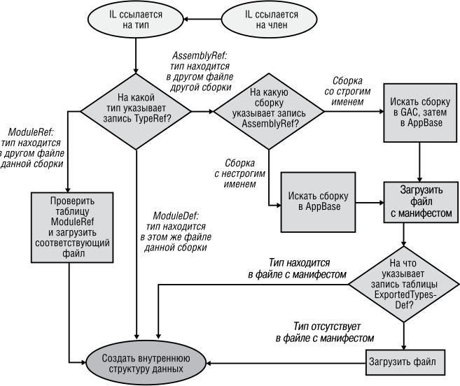


**рис. 3.2.** .Блок-схема.алгоритма.поиска.метаданных,.используемых.CLR,.файла.сборки,. где.определен.тип.или.метод,.на.который.ссылается.IL-код 

Если какая-либо операция заканчивается неудачей, то выдается соответствующее исключение. 

Есть еще один нюанс: CLR идентифицирует все сборки по имени, версии, региональному стандарту и открытому ключу. Однако GAC различает сборки по имени, версии, региональному стандарту, открытому ключу и процессорной архитектуре. При поиске сборки в GAC среда CLR выясняет, в каком процессе выполняется при- 

**114** Глава.3 .Совместно.используемые.сборки.и.сборки.со.строгим.именем 

ложение — 32-разрядном x86 (возможно, с использованием технологии WoW64), 64-разрядном x64 или 64-разрядном ARM. Сначала выполняется поиск сборки в GAC с учетом процессорной архитектуры. В случае неудачи происходит поиск сборки без учета процессорной архитектуры. 

## **ВниМание** 

Строго.говоря,.приведенный.пример.не.является.стопроцентно.верным .Для.ссылок. на.методы.и.типы,.определенные.в.сборке,.не.поставляемой.в.составе. NET.Framework,. все.сказанное.верно .Однако.сборки. NET.Framework.(в.том.числе.MSCorLib dll).тесно. связаны.с.работающей.версией.CLR .Любая.сборка,.ссылающаяся.на.сборки. NET. Framework,.всегда.привязывается.к.соответствующей.версии.CLR .Этот.процесс.называют.унификацией.(unification),.и.Microsoft.его.поддерживает,.потому.что.в.этой. компании.все.сборки. NET.Framework.тестируются.с.конкретной.версией.CLR .Поэтому. унификация.стека.кода.гарантирует.корректную.работу.приложений 

В.предыдущем.примере.ссылка.на.метод.WriteLine.объекта.System Console.привязывается.к.версии.MSCorLib dll,.соответствующей.версии.CLR,.независимо.от.того,. на.какую.версию.MSCorLib dll.ссылается.таблица.AssemblyRef.в.метаданных.сборки 

Из этого раздела мы узнали, как CLR ищет сборки, когда действует политика, предлагаемая по умолчанию. Однако администратор или издатель сборки может заменить эту политику. Способу изменения политики привязки CLR по умолчанию посвящены следующие два раздела. 

## **ПриМеЧание** 

CLR.поддерживает.возможность.перемещения.типа.(класса,.структуры,.перечислимого.типа,.интерфейса.или.делегата).из.одной.сборки.в.другую .Например,. в. NET.3 5.класс.System TimeZoneInfo.определен.в.сборке.System Core dll .Но.в. NET. 4 0.компания.Microsoft.переместила.этот.класс.в.сборку.MsCorLib dll .В.стандартной. ситуации.перемещение.типа.из.одной.сборки.в.другую.нарушает.работу.приложения . Однако.CLR.предлагает.воспользоваться.атрибутом.System Runtime CompilerServices TypeForwardedToAttribute,.который.применяется.в.оригинальной.сборке.(например,.System Core dll) .Конструктору.атрибута.передается.параметр.типа.System Type .Он.обозначает.новый.тип.(который.теперь.определенный.в.MSCorLib dll),.который.теперь.должно.использовать.приложение .С.того.момента,.как.конструктор. TypeForwardedToAttribute.принимает.этот.тип,.содержащая.его.сборка.будет.зависеть. от.сборки,.в.которой.он.определен 

Если.вы.воспользуетесь.этим.преимуществом,.нужно.также.применить.атрибут. System Runtime CompilerServices TypeForwardedToAttribute.в.новой.сборке.и.указать. конструктору.атрибута.полное.имя.сборки,.которая.служит.для.определения.типа . Этот.атрибут.обычно.используется.для.инструментальных.средств,.утилит.и.сериализации .Как.только.конструктор.TypeForwardedToAttribute.получает.строку.с.этим. именем,.сборка,.содержащая.этот.атрибут,.становится.независимой.от.сборки,. определяющей.тип 

**115** 

Дополнительные.административные.средства.(конфигурационные.файлы) 

## **дополнительные административные средства (конфигурационные файлы)** 

В разделе «Простое средство администрирования (конфигурационный файл)» главы 2 мы кратко познакомились со способами изменения администратором алгоритма поиска и привязки к сборкам, используемого CLR. В том же разделе я показал, как перемещать файлы сборки, на которую ссылаются, в подкаталог базового каталога приложения и как CLR использует конфигурационный XML-файл приложения для поиска перемещенных файлов. 

Поскольку в главе 2 обсуждался лишь атрибут `privatePath` элемента `probing` здесь мы рассмотрим остальные элементы конфигурационного XML-файла: 

```
<?xml version="1.0"?>
```

```
<configuration>
```

```
   <runtime>
      <assemblyBinding xmlns="urn:schemas microsoft com:asm.v1">
         <probing privatePath="AuxFiles;bin\subdir" />
```

```
         <dependentAssembly>
```

```
            <assemblyIdentity name="SomeClassLibrary"
              publicKeyToken="32ab4ba45e0a69a1" culture="neutral"/>
```

```
            <bindingRedirect
```

```
            <codeBase version="2.0.0.0"
              href="http://www.Wintellect.com/SomeClassLibrary.dll" />
```

```
         </dependentAssembly>
```

```
         <dependentAssembly>
```

```
            <assemblyIdentity name="TypeLib"
              publicKeyToken="1f2e74e897abbcfe" culture="neutral"/>
```

```
            <bindingRedirect
              oldVersion="3.0.0.0 3.5.0.0" newVersion="4.0.0.0" />
```

```
            <publisherPolicy apply="no" />
```

```
         </dependentAssembly>
```

```
      </assemblyBinding>
```

```
   </runtime>
```

```
</configuration>
```

XML-файл предоставляет CLR обширную информацию. 

- **Элемент probing.** Определяет поиск в подкаталогах AuxFiles и bin\subdir, расположенных в базовом каталоге приложения, при попытке найти сборку с нестрогим 

## **116** Глава.3 .Совместно.используемые.сборки.и.сборки.со.строгим.именем 

именем. Сборки со строгим именем ищутся в GAC или по URL-адресу, указанному элементом `codeBase` . CLR ищет сборки со строгим именем в закрытых каталогах приложения только в том случае, если элемент `codeBase` не указан. 

- **Первый набор элементов dependentAssembly, assemblyIdentity и bindingRedirect.** При попытке найти сборки `SomeClassLibrary` с номером версии 1.0.0.0 и нейтральными региональными стандартами, изданные организацией, владеющей открытым ключом с маркером `32ab4ba45e0a69a1` , система вместо этого будет искать аналогичную сборку, но с номером версии 2.0.0.0. 

- **Элемент codebase.** При попытке найти сборку `SomeClassLibrary` с номером версии 2.0.0.0 и нейтральными региональными стандартами, изданную организацией, владеющей открытым ключом с маркером `32ab4ba45e0a69a1` , система будет пытаться выполнить привязку по адресу, заданному в URL: http://wwwWintellect com/SomeClassLibrary dll. Хотя я и не говорил об этом в главе 2, элемент `codeBase` можно применять и к сборкам с нестрогими именами. При этом номер версии сборки игнорируется и его следует опустить при определении элемента `codeBase` URL-адрес, заданный элементом `codeBase` , должен ссылаться на подкаталог базового каталога приложения. 

- **Второй набор элементов dependentAssembly, assemblyIdentity и bindingRedirect.** При попытке найти сборку `TypeLib` с номерами версии от 3.0.0.0 до 3.5.0.0 включительно и нейтральными региональными стандартами, изданную организацией, владеющей открытым ключом с маркером `1f2e74e897abbcfe` система будет искать версию 4.0.0.0 той же сборки. 

- **Элемент publisherPolicy.** Если организация, производитель сборки `TypeLib` развернула файл политики издателя (описание этого файла см. в следующем разделе), среда CLR должна игнорировать этот файл. 

При компиляции метода CLR определяет типы и члены, на которые он ссылается. Используя эти данные, исполняющая среда определяет (путем просмотра таблицы `AssemblyRef` вызывающей сборки), на какую сборку исходно ссылалась вызывающая сборка во время компоновки. Затем CLR ищет сведения о сборке в конфигурационном файле приложения и следует любым изменениям номера версии, заданным в этом файле. 

Если значение атрибута `apply` элемента `publisherPolicy` равно `yes` или отсутствует, CLR проверяет наличие в GAC новой сборки/версии и применяет все перенаправления, которые счел необходимым указать издатель сборки (о политике издателя рассказывается в следующем разделе); далее CLR ищет именно эту сборку/версию. Наконец CLR просматривает сборку/версию в файле Machine config и применяет все указанные в нем перенаправления к другим версиям. 

На этом этапе среда CLR знает номер версии сборки, которую она должна загрузить, и пытается загрузить соответствующую сборку из GAC. Если сборки в GAC нет, а элемент `codeBase` не определен, CLR пытается найти сборку, как описано 

Дополнительные.административные.средства.(конфигурационные.файлы) **117** 

в главе 2. Если конфигурационный файл, задающий последнее изменение номера версии, содержит элемент `codeBase` , CLR пытается загрузить сборку с URL-адреса, заданного этим элементом. 

Эти конфигурационные файлы обеспечивают администратору настоящий контроль над решением, принимаемым CLR относительно загрузки той или иной сборки. Если в приложении обнаруживается ошибка, администратор может связаться с издателем сборки, содержащей ошибку, после чего издатель пришлет новую сборку. По умолчанию среда CLR не может загрузить новую сборку, потому что уже существующая сборка не содержит ссылки на новую версию. Однако администратор может заставить CLR загрузить новую сборку, модифицировав конфигурационный XML-файл приложения. 

Если администратор хочет, чтобы все сборки, установленные на компьютере, использовали новую версию, то вместо конфигурационного файла приложения он может модифицировать файл Machine config для данного компьютера, и CLR будет загружать новую версию сборки при каждой ссылке из приложений на старую версию. 

Если в новой версии старая ошибка не исправлена, администратор может удалить из конфигурационного файла строки, определяющие использование этой сборки, и приложение станет работать, как раньше. Важно, что система позволяет использовать сборку с версией, отличной от указанной в метаданных. Такая дополнительная гибкость очень удобна. 

## **Управление версиями при помощи политики издателя** 

В ситуации, описанной в предыдущем разделе, издатель сборки просто присылал новую версию сборки администратору, который устанавливал сборку и вручную редактировал конфигурационные XML-файлы машины или приложения. Вообще говоря, после исправления ошибки в сборке издателю понадобится простой механизм упаковки и распространения новой сборки по всем пользователям. Кроме того, нужно как-то заставить среду CLR каждого пользователя задействовать новую версию сборки вместо старой. Естественно, каждый пользователь может сам изменить конфигурационные XML-файлы на своих машинах, но этот способ крайне неудобен и ненадежен. Издателю нужен механизм, который позволил бы ему определить свою «политику» и установить ее на пользовательский компьютер с новой сборкой. В этом разделе показано, как издатель сборки может создать подобную политику. 

Допустим, вы — издатель, только что создавший новую версию своей сборки, в которой исправлено несколько ошибок. Упаковывая новую сборку для рассылки пользователям, надо создать конфигурационный XML-файл. Он очень похож на те, что мы обсуждали раньше. Вот пример конфигурационного файла SomeClassLibrary config для сборки SomeClassLibrary dll: 

> `<configuration> <runtime>` 

_продолжение_  

**118** Глава.3 .Совместно.используемые.сборки.и.сборки.со.строгим.именем 

```
      <assemblyBinding xmlns="urn:schemas microsoft com:asm.v1">
```

```
         <dependentAssembly>
```

```
            <assemblyIdentity name="SomeClassLibrary"
              publicKeyToken="32ab4ba45e0a69a1" culture="neutral"/>
```

```
            <bindingRedirect
```

```
              oldVersion="1.0.0.0" newVersion="2.0.0.0" />
```

```
            <codeBase version="2.0.0.0"
```

```
              href="http://www.Wintellect.com/SomeClassLibrary.dll"/>
```

```
         </dependentAssembly>
```

```
      </assemblyBinding>
```

```
   </runtime>
```

```
</configuration>
```

Конечно, издатель может определять политику только для своих сборок. Кроме того, показанные здесь элементы — единственные, которые можно задать в конфигурационном файле политики издателя. Например, в конфигурационном файле политики нельзя задавать элементы `probing` и `publisherPolicy` . 

Этот конфигурационный файл заставляет CLR при каждой ссылке на версию 1.0.0.0 сборки `SomeClassLibrary` загружать вместо нее версию 2.0.0.0. Теперь вы, как издатель, можете создать сборку, содержащую конфигурационный файл политики издателя. Для создания сборки с политикой издателя вызывается утилита AL exe со следующими параметрами: 

```
AL.exe /out:Policy.1.0.SomeClassLibrary.dll
       /version:1.0.0.0
```

```
       /keyfile:MyCompany.snk
```

- `/linkresource:SomeClassLibrary.config` 

Ниже приведены краткие описания параметров командной строки AL exe. 

- Параметр `/out` приказывает AL exe создать новый PE-файл с именем Policy 1 0 SomeClassLibrary dll, в котором нет ничего, кроме манифеста. Имя этой сборки имеет очень большое значение. Первая часть имени, Policy, сообщает CLR, что сборка содержит информацию политики издателя. Вторая и третья части имени, 1 0, сообщают CLR, что эта политика издателя предназначена для любой версии сборки `SomeClassLibrary` , у которой старший и младший номера версии равны 1.0. Политики издателя применяются только к старшему и младшему номерам версии сборки; нельзя создать политику издателя для отдельных построений или редакций сборки. Четвертая часть имени, SomeClassLibrary, указывает имя сборки, которой соответствует политика издателя. Пятая и последняя часть имени, dll, — это просто расширение, данное результирующему файлу сборки. 

- Параметр `/version` идентифицирует версию сборки с политикой издателя, которая не имеет ничего общего с версией самой сборки. Как видите, версиями 

**119** 

Дополнительные.административные.средства.(конфигурационные.файлы) 

сборок, содержащих политику издателя, тоже можно управлять. Сейчас издателю нужно создать политику, перенаправляющую CLR от версии 1.0.0.0 сборки `SomeClassLibrary` к версии 2.0.0.0, а в будущем может потребоваться политика, перенаправляющая от версии 1.0.0.0 сборки `SomeClassLibrary` к версии 2.5.0.0. CLR использует номер версии, заданный этим параметром, чтобы выбрать самую последнюю версию сборки с политикой издателя. 

- Параметр `/keyfile` заставляет AL exe подписать сборку с политикой издателя при помощи пары ключей, принадлежащей издателю. Эта пара ключей также должна совпадать с парой, использованной для подписания всех версий сборки `SomeClassLibrary` . В конце концов, именно это совпадение позволяет CLR установить, что сборка `SomeClassLibrary` и файл с политикой издателя для этой сборки созданы одним издателем. 

- Параметр `/linkresource` заставляет AL exe считать конфигурационный XML-файл отдельным файлом сборки. При этом в результате компоновки получается сборка из двух файлов. Оба следует упаковывать и развертывать на пользовательских компьютерах с новой версией сборки `SomeClassLibrary` . Между прочим, конфигурационный XML-файл нельзя встраивать в сборку, вызывая AL exe с параметром `/embedresource` , и создавать таким образом сборку из одного файла — CLR требует, чтобы сведения о конфигурации в формате XML размещались в отдельном файле. 

Сборку, скомпонованную с политикой издателя, можно упаковать с файлом новой версии сборки SomeClassLibrary dll и передать пользователям. Сборка с политикой издателя должна устанавливаться в GAC. Саму сборку `SomeClassLibrary` можно установить в GAC, но это не обязательно. Ее можно развернуть в базовом каталоге приложения или в другом каталоге, заданном в URL-адресе из элемента `codeBase` . 

## **ВниМание** 

Издатель.должен.создавать.сборку.со.своей.политикой.лишь.для.развертывания. исправленной.версии.сборки.или.пакетов.исправлений.для.нее .Установка.нового. приложения.не.должна.требовать.сборки.с.политикой.издателя 

И последнее о политике издателя. Допустим, издатель распространил сборку с политикой издателя, но в новой сборке почему-либо оказалось больше новых ошибок, чем исправлено старых. В этом случае администратору необходимо, чтобы CLR игнорировала сборку с политикой издателя. Для этого он может отредактировать конфигурационный файл приложения, добавив в него элемент `publisherPolicy` : `<publisherPolicy apply="no"/>` 

Этот элемент можно разместить в конфигурационном файле приложения как дочерний по отношению к элементу `<assemblyBinding>` — в этом случае он при- 

**120** Глава.3 .Совместно.используемые.сборки.и.сборки.со.строгим.именем 

меняется ко всем его сборкам. Если элемент размещается как дочерний по отношению к `<dependantAssembly>` , он применяется к отдельной сборке. Обрабатывая конфигурационный файл приложения, CLR «видит», что не следует искать в GAC сборку с политикой издателя, и продолжает работать с более старой версией сборки. Однако замечу, что CLR все равно проверяет и применяет любую политику, заданную в файле Machine config. 

## **ВниМание** 

Использование.сборки.с.политикой.издателя.фактически.является.заявлением.издателя.о.совместимости.разных.версий.сборки .Если.новая.версия.несовместима. с.более.ранней.версией,.издатель.не.должен.создавать.сборку.с.политикой.издателя .Вообще,.следует.использовать.сборки.с.политикой.издателя,.если.компонуется. новая.версия.с.исправлениями.ошибок .Новую.версию.сборки.нужно.протестировать.на.обратную.совместимость .В.то.же.время,.если.к.сборке.добавляются.новые. функции,.следует.подумать.о.том,.чтобы.отказаться.от.связи.с.прежними.сборками. и.от.применения.сборки.с.политикой.издателя .Кроме.того,.в.этом.случае.отпадет. необходимость.тестирования.на.обратную.совместимость 

## **Часть II** 

## **Проектирование типов** 

**Глава 4. Основы типов** 122 **Глава 5. Примитивные, ссылочные и значимые типы** .                                             142 **Глава 6. Основные сведения о членах и типах** .        186 **Глава 7. Константы и поля** .                                 210 **Глава 8. Методы** .                                              215 **Глава 9. Параметры** .                                          245 **Глава 10. свойства** 263 **Глава 11. события** .                                            286 **Глава 12. Обобщения** .                                        302 **Глава 13. интерфейсы** .                                      333 

## **Глава 4. Основы типов** 

В этой главе представлены основные принципы использования типов и общеязыковой исполняющей среды (Common Language Runtime, CLR). В частности, мы рассмотрим минимальную функциональность, присущую всем типам, и такие вопросы, как контроль типов, пространства имен, сборки и различные способы приведения типов объектов. В конце главы я объясняю, как во время выполнения взаимодействуют друг с другом типы, объекты, стеки потоков и управляемая куча. 

## **Все типы — производные от System.Object** 

В CLR каждый объект прямо или косвенно является производным от `System. Object` . Это значит, что следующие определения типов идентичны: 

// Тип, неявно производный от Object `class Employee {` 

`... }` // Тип, явно производный от Object `class Employee : System.Object {` 

```
...
}
```

Благодаря тому, что все типы, в конечном счете, являются производными от `System.Object` , любой объект любого типа гарантированно имеет минимальный набор методов. Открытые экземплярные методы класса `System.Object` перечислены в табл. 4.1. 

**таблица 4.1.** .Открытые.методы.System Object 

|**таблица 4.1.**Откр|ытыеметодыSystem Object|
|---|---|
|**Открытый метод**|**Описание**|
|Equals|Возвращает true, если два объекта имеют одинаковые значения.<br>Подробнее об этом методе рассказывается в разделе «Равенство<br>и тождество объектов» главы 5|
|GetHashCode|Возвращает хеш-код для значения данного объекта. Этот метод<br>следует переопределить, если объекты типа используются в каче-<br>стве ключа хеш-таблиц. Вообще говоря, класс Object выбран для<br>размещения этого метода неудачно, потому что большинство типов<br>не используется в качестве ключей хеш-таблиц; этот метод умест-<br>нее было бы определить в интерфейсе. Подробнее об этом методе<br>рассказывается в разделе «Хеш-коды объектов» главы 5|


**123** 

Все.типы.—.производные.от.System Object 

|**Открытый метод**|**Описание**|
|---|---|
|ToString|По умолчанию возвращает полное имя типа (this.GetType().<br>FullName). На практике этот метод переопределяют, чтобы он<br>возвращал объект String, содержащий состояние объекта в виде<br>строки. Например, переопределенные методы для таких фунда-<br>ментальных типов, как Boolean и Int32, возвращают значения<br>объектов в строковом виде. Кроме того, к переопределению мето-<br>да часто прибегают при отладке: вызов такого метода возвращает<br>строку, содержащую значения полей объекта. Предполагается,<br>что ToString учитывает информацию CultureInfo, связанную с вы-<br>зывающим потоком. Подробнее о методе ToString рассказывается<br>в главе 14|
|GetType|Возвращает экземпляр объекта, производного от Type, который<br>идентифицирует тип объекта, вызвавшего GetType. Возвращаемый<br>объект Type может использоваться с классами, реализующими от-<br>ражение для получения информации о типе в виде метаданных.<br>Отражение рассматривается в главе 23. Метод GetType невирту-<br>альный, его нельзя переопределить, поэтому классу не удастся<br>исказить сведения о своем типе; таким образом обеспечивается<br>безопасность типов|


Кроме того, типам, производным от `System.Object` , доступны некоторые защищенные методы (табл. 4.2). 

**таблица 4.2.** .Защищенные.методы.System Object 

|**таблица 4.2.**Защ|ищенныеметодыSystem Object|
|---|---|
|**защищенный**<br>**метод**|**Описание**|
|Memberwise-<br>Clone|Этот невиртуальный метод создает новый экземпляр типа и при-<br>сваивает полям нового объекта соответствующие значения объекта<br>this. Возвращается ссылка на созданный экземпляр|
|Finalize|Этот виртуальный метод вызывается, когда уборщик мусора опре-<br>деляет, что объект является мусором, но до возвращения занятой<br>объектом памяти в кучу. В типах, требующих очистки при сборке<br>мусора, следует переопределить этот метод. Подробнее о нем см.<br>главу 21|


CLR требует, чтобы все объекты создавались оператором `new` . Например, объект `Employee` создается следующим образом: 

```
Employee e = new Employee("ConstructorParam1");
```

Оператор `new` выполняет следующие действия: 

**124** Глава.4 .Основы.типов 

1. Вычисление количества байтов, необходимых для хранения всех экземплярных полей типа и всех его базовых типов, включая `System.Object` (в котором отсутствуют собственные экземплярные поля). Кроме того, в каждом объекте кучи должны присутствовать дополнительные члены, называемые _указателем на объект-тип_ (type object pointer) и _индексом блока синхронизации_ (sync block index); они необходимы CLR для управления объектом. Байты этих дополнительных членов добавляются к байтам, необходимым для размещения самого объекта. 

2. Выделение памяти для объекта с резервированием необходимого для данного типа количества байтов в управляемой куче. Выделенные байты инициализируются нулями (0). 

3. Инициализация указателя на объект-тип и индекса блока синхронизации. 

4. Вызов конструктора экземпляра типа с параметрами, указанными при вызове `new` (в предыдущем примере это строка `ConstructorParam1` ). Большинство компиляторов автоматически включает в конструктор код вызова конструктора базового класса. Каждый конструктор выполняет инициализацию определенных в соответствующем типе полей. В частности, вызывается конструктор `System. Object` , но он ничего не делает и просто возвращает управление. 

Выполнив все эти операции, `new` возвращает ссылку (или указатель) на вновь созданный объект. В предыдущем примере кода эта ссылка сохраняется в переменной `e` типа `Employee` . 

Кстати, у оператора `new` нет пары — оператора `delete` , то есть нет явного способа освобождения памяти, занятой объектом. Уборкой мусора занимается среда CLR (см. главу 21), которая автоматически находит объекты, ставшие ненужными или недоступными, и освобождает занимаемую ими память. 

## **Приведение типов** 

Одна из важнейших особенностей CLR — _безопасность типов_ (type safety). Во время выполнения программы среде CLR всегда известен тип объекта. Программист всегда может точно определить тип объекта при помощи метода `GetType` . Поскольку это невиртуальный метод, никакой тип не сможет сообщить о себе ложные сведения. Например, тип `Employee` не может переопределить метод `GetType` , чтобы тот вернул тип `SuperHero` . 

При разработке программ часто прибегают к приведению объекта к другим типам. CLR разрешает привести тип объекта к его собственному типу или любому из его базовых типов. В каждом языке программирования приведение типов реализовано по-своему. Например, в C# нет специального синтаксиса для приведения типа объекта к его базовому типу, поскольку такое приведение считается безопасным 

Приведение.типов **125** 

неявным преобразованием. Однако для приведения типа к производному от него типу разработчик на C# должен ввести операцию явного приведения типов — неявное преобразование приведет к ошибке. Следующий пример демонстрирует приведение к базовому и производному типам: 

// Этот тип неявно наследует от типа System.Object `internal class Employee {` 

```
  ...
```

## `}` 

```
public sealed class Program {
  public static void Main() {
```

// Приведение типа не требуется, т. к. new возвращает объект Employee, 

// а Object — это базовый тип для Employee. 

```
    Object o = new Employee();
```

// Приведение типа обязательно, т. к. Employee — производный от Object 

// В других языках (таких как Visual Basic) компилятор не потребует 

// явного приведения `Employee e = (Employee) o; }` 

```
}
```

Этот пример показывает, что необходимо компилятору для компиляции кода. Теперь посмотрим, что произойдет во время выполнения программы. CLR проверит операции приведения, чтобы приведение типов осуществлялось либо к фактическому типу объекта, либо к одному из его базовых типов. Например, следующий код успешно компилируется, но в период выполнения выдает исключение `InvalidCastException` : 

```
internal class Employee {
```

```
  ...
}
internal class Manager : Employee {
```

```
  ...
```

```
}
```

```
public sealed class Program {
  public static void Main() {
```

// Создаем объект Manager и передаем его в PromoteEmployee 

// Manager ЯВЛЯЕТСЯ производным от Employee, 

// поэтому PromoteEmployee работает `Manager m = new Manager(); PromoteEmployee(m);` 

// Создаем объект DateTime и передаем его в PromoteEmployee 

// DateTime НЕ ЯВЛЯЕТСЯ производным от Employee, 

// поэтому PromoteEmployee выбрасывает 

// исключение System.InvalidCastException DateTime newYears = new DateTime(2013, 1, 1); `PromoteEmployee(newYears); }` 

_продолжение_  

**126** Глава.4 .Основы.типов 

```
  public static void PromoteEmployee(Object o) {
```

// В этом месте компилятор не знает точно, на какой тип объекта 

// ссылается o, поэтому скомпилирует этот код 

// Однако в период выполнения CLR знает, на какой тип 

// ссылается объект o (приведение типа выполняется каждый раз), 

// и проверяет, соответствует ли тип объекта типу Employee // или другому типу, производному от Employee `Employee e = (Employee) o;` 

```
    ...
```

```
  }
}
```

Метод `Main` создает объект `Manager` и передает его в `PromoteEmployee` . Этот код компилируется и выполняется, так как тип `Manager` является производным от `Object` , на который рассчитан `PromoteEmployee` . Внутри `PromoteEmployee` CLR проверяет, на что ссылается `o` — на объект `Employee` или на объект типа, производного от `Employee` . Поскольку `Manager` — производный от `Employee` тип, CLR выполняет преобразование, и `PromoteEmployee` продолжает работу. 

После того как `PromoteEmployee` возвращает управление, `Main` создает объект `DateTime` , который передает в `PromoteEmployee` . Объект `DateTime` тоже является производным от `Object` , поэтому код, вызывающий `PromoteEmployee` , компилируется без проблем. Но при выполнении `PromoteEmployee` CLR выясняет, что `o` ссылается на объект `DateTime` , не являющийся ни типом `Employee` , ни другим типом, производным от `Employee` . В этот момент CLR не в состоянии выполнить приведение типов и генерирует исключение `System.InvalidCastException` . 

Если разрешить подобное преобразование, работа с типами станет небезопасной. Последствия могут быть непредсказуемы: возможное аварийное завершение приложения, возникновение уязвимостей в системе защиты, обусловленных возможностью типов выдавать себя за другие типы. Фальсификация типов подвергает серьезному риску устойчивость работы приложений, поэтому столь пристальное внимание в CLR уделяется безопасности типов. 

В данном примере было бы правильнее выбрать для метода `Promote Employee` в качестве типа параметра не `Object` , а `Employee` , чтобы ошибка проявилась на стадии компиляции, а разработчику не пришлось бы ждать исключения, чтобы узнать о существовании проблемы. А объект `Object` я использовал только для того, чтобы показать, как обрабатывают операции приведения типов компилятор C# и среда CLR. 

## **Приведение типов в C# с помощью операторов is и as** 

В C# существуют другие механизмы приведения типов. Например, оператор `is` проверяет совместимость объекта с данным типом, а в качестве результата выдает значение типа `Boolean` ( `true` или `false` ). Оператор `is` никогда не генерирует исключение. Взгляните на следующий код: 

`Object o = new Object();` Boolean b1 = (o is Object);   // b1 равно true Boolean b2 = (o is Employee); // b2 равно false 

Приведение.типов **127** 

Для `null` -ссылок оператор `is` всегда возвращает `false` , так как объекта, тип которого нужно проверить, не существует. 

Обычно оператор `is` используется следующим образом: 

```
if (o is Employee) {
  Employee e = (Employee) o;
```

// Используем e внутри инструкции if 

```
}
```

В этом коде CLR по сути проверяет тип объекта дважды: сначала в операторе `is` определяется совместимость `o` с типом `Employee` , а затем в теле оператора `if` анализируется, является ли `o` ссылкой на `Employee` . Контроль типов в CLR укрепляет безопасность, но при этом приходится жертвовать производительностью, так как среда CLR должна выяснять фактический тип объекта, на который ссылается переменная ( `o` ), а затем проверять всю иерархию наследования на предмет наличия среди базовых типов заданного типа ( `Employee` ). Поскольку такая схема встречается в программировании часто, в C# предложен механизм, повышающий эффективность кода с помощью оператора `as` : 

```
Employee e = o as Employee;
if (e != null) {
```

// Используем e внутри инструкции if 

```
}
```

В этом коде CLR проверяет совместимость `o` с типом `Employee` . Если `o` и `Employee` совместимы, `as` возвращает ненулевой указатель на этот объект, а если нет — оператор `as` возвращает `null` . Заметьте: оператор `as` заставляет CLR верифицировать тип объекта только один раз, а `if` лишь сравнивает `e` с `null` — такая проверка намного эффективнее, чем определение типа объекта. 

По сути, оператор `as` отличается от оператора приведения типа только тем, что никогда не генерирует исключение. Если приведение типа невозможно, результатом является `null` . Если не сравнить полученный оператором результат с `null` и попытаться работать с пустой ссылкой, возникнет исключение `System. NullReferenceException` . Например: 

System.Object o = new Object(); // Создание объекта Object Employee e = o as Employee;     // Приведение o к типу Employee // Преобразование невыполнимо: исключение не возникло, но e равно null e.ToString(); // Обращение к e вызывает исключение NullReferenceException 

Давайте проверим, как вы усвоили материал. Допустим, существуют описания следующих классов: 

internal class B {     // Базовый класс `}` internal class D : B { // Производный класс `}` 

В первом столбце табл. 4.3 приведен код на C#. Попробуйте определить результат обработки этих строк компилятором и CLR. Если код компилируется и выполняется 

**128** Глава.4 .Основы.типов 

без ошибок, сделайте пометку в графе OK, если произойдет ошибка компиляции — в графе CTE (compile-time error), а если ошибка времени выполнения — в графе RTE (run-time error). 

**таблица 4.3.** .Тест.на.знание.контроля.типов 

|**таблица 4.3.**Тестназнаниеко|нтролятипов|||
|---|---|---|---|
|**Оператор**|**OK**|**CTE**|**RTE**|
|Object o1 = new Object();|Да|||
|Object o2 = new B();|Да|||
|Object o3 = new D();|Да|||
|Object o4 = o3;|Да|||
|B b1 = new B();|Да|||
|B b2 = new D();|Да|||
|D d1 = new D();|Да|||
|B b3 = new Object();||Да||
|D d2 = new Object();||Да||
|B b4 = d1;|Да|||
|D d3 = b2;||Да||
|D d4 = (D) d1;|Да|||
|D d5 = (D) b2;|Да|||
|D d6 = (D) b1;|||Да|
|B b5 = (B) o1;|||Да|
|B b6 = (D) b2;|Да|||


## **ПриМеЧание** 

В.C#.разрешено.определять.методы.операторов.преобразования.при.помощи.типов,. об.этом.речь.идет.в.разделе.«Методы.операторов.преобразования».главы.8 .Эти.методы.вызываются.только.в.случаях,.когда.имеет.место.приведение.типов,.и.никогда. не.вызываются.при.использовании.операторов.is.и.as.в.C# 

## **Пространства имен и сборки** 

Пространства имен используются для логической группировки родственных типов, чтобы разработчику было проще найти нужный тип. Например, в пространстве имен `System.Text` описаны типы для обработки строк, а в пространстве имен `System.` 

Пространства.имен.и.сборки **129** 

`IO` — типы для выполнения операций ввода-вывода. В следующем коде создаются объекты `System.IO.FileStream` и `System.Text.StringBuilder` : 

```
public sealed class Program {
  public static void Main() {
    System.IO.FileStream fs = new System.IO.FileStream(...);
    System.Text.StringBuilder sb = new System.Text.StringBuilder();
  }
}
```

Этому коду не хватает лаконичности — обращения к типам `FileStream` и `StringBuilder` выглядят слишком громоздко. К счастью, многие компиляторы предоставляют программистам механизмы, позволяющие сократить объем набираемого текста. Например, в компиляторе C# предусмотрена директива `using` . Следующий код аналогичен предыдущему: 

`using System.IO;` // Подставлять префикс "System.IO" using System.Text; // Подставлять префикс "System.Text" 

```
public sealed class Program {
  public static void Main() {
    FileStream fs = new FileStream(...);
    StringBuilder sb = new StringBuilder();
  }
}
```

Для компилятора пространство имен — простое средство, позволяющее удлинить имя типа и сделать его уникальным за счет добавления к началу имени групп символов, разделенных точками. Например, в данном примере компилятор интерпретирует `FileStream` как `System.IO.FileStream` , а `StringBuilder` — как `System. Text.StringBuilder` . 

Применять директиву `using` в C# не обязательно, при необходимости достаточно ввести полное имя типа. Директива `using` заставляет компилятор C# добавлять к имени указанный префикс, пока не будет найдено совпадение. 

## **ВниМание** 

CLR.ничего.не.знает.о.пространствах.имен .При.обращении.к.какому-либо.типу.среде. CLR.надо.предоставить.полное.имя.типа.(а.это.может.быть.действительно.длинная. строка.с.точками).и.сборку,.содержащую.описание.типа,.чтобы.во.время.выполнения. загрузить.эту.сборку,.найти.в.ней.нужный.тип.и.оперировать.им 

В предыдущем примере компилятор должен гарантировать, что каждый упомянутый в коде тип существует и корректно обрабатывается: вызываемые методы существуют, число и типы передаваемых аргументов указаны правильно, значения, возвращаемые методами, обрабатываются надлежащим образом и т. д. Не найдя тип с заданным именем в исходных файлах и перечисленных сборках, компилятор попытается добавить к имени типа префикс `System.IO` и проверит, совпадает ли полученное имя с существующим типом. Если имя типа опять не обнаружится, 

**130** Глава.4 .Основы.типов 

поиск повторяется с префиксом `System.Text` . Благодаря двум директивам `using` , показанным ранее, я смог ограничиться именами `FileStream` и `StringBuilder` — компилятор автоматически расширяет ссылки до `System.IO.FileStream` и `System. Collections.StringBuilder` . Конечно, такой код намного проще вводится, чем исходный, да и читается проще. 

Компилятору надо сообщить при помощи параметра `/reference` (см. главы 2 и 3), в каких сборках искать описание типа. В поисках нужного типа компилятор просмотрит все известные ему сборки. Если подходящая сборка обнаруживается, сведения о ней и типе помещаются в метаданные результирующего управляемого модуля. Для того чтобы информация из сборки была доступна компилятору, надо указать ему сборку, в которой описаны упоминаемые типы. По умолчанию компилятор C# автоматически просматривает сборку MSCorLib dll, даже если она явно не указана. В ней содержатся описания всех фундаментальных FCL-типов, таких как `Object` , `Int32` , `String` и др. 

Легко догадаться, что такой способ обработки пространства имен чреват проблемами, если два (и более) типа с одинаковыми именами находятся в разных сборках. Microsoft настоятельно рекомендует при описании типов применять уникальные имена. Но порой это невозможно. В CLR поощряется повторное использование компонентов. Допустим, в приложении имеются компоненты, созданные в Microsoft и Wintellect, в которых есть типы с одним названием, например `Widget` . Версия `Widget` от Microsoft делает одно, а версия от Wintellect – совершенно другое. В этом случае процесс формирования имен типов становится неуправляемым, и чтобы различать эти типы, придется указывать в коде их полные имена. При обращении к `Widget` от Microsoft надо использовать запись `Microsoft.Widget` , а при ссылке на `Widget` от Wintellect — запись `Wintellect.Widget` . В следующем коде ссылка на `Widget` неоднозначна, и компилятор C# выдаст сообщение `error CS0104` : 'Widget' `is an ambiguous reference` (ошибка CS0104: 'Widget' — неоднозначная ссылка): 

`using Microsoft;` // Определяем префикс "Microsoft." using Wintellect; // Определяем префикс "Wintellect." 

`public sealed class Program { public static void Main() {` Widget w = new Widget(); // Неоднозначная ссылка `} }` 

Для того чтобы избавиться от неоднозначности, надо явно указать компилятору, какой экземпляр `Widget` требуется создать: 

`using Microsoft;` // Определяем приставку "Microsoft." using Wintellect; // Определяем приставку "Wintellect." 

`public sealed class Program { public static void Main() {` Wintellect.Widget w = new Wintellect.Widget(); // Неоднозначности нет `} }` 

Пространства.имен.и.сборки **131** 

В C# есть еще одна форма директивы `using` , позволяющая создать псевдоним для отдельного типа или пространства имен. Она удобна, если вы намерены использовать несколько типов из пространства имен, но не хочется «захламлять» глобальное пространство имен всеми используемыми типами. Альтернативный способ преодоления неоднозначности следующий: 

using Microsoft;  // Определяем приставку "Microsoft." using Wintellect; // Определяем приставку "Wintellect." // Имя WintellectWidget определяется как псевдоним для Wintellect.Widget `using WintellectWidget = Wintellect.Widget;` 

`public sealed class Program { public static void Main() {` WintellectWidget w = new WintellectWidget(); // Ошибки нет `} }` 

Эти методы устранения неоднозначности хороши, но иногда их недостаточно. Представьте, что компании Australian Boomerang Company (ABC) и Alaskan Boat Corporation (ABC) создали каждая свой тип с именем `BuyProduct` и собираются поместить его в соответствующие сборки. Не исключено, что обе компании создадут пространства имен `ABC` , в которые и включат тип `BuyProduct` . Для разработки приложения, оперирующего обоими типами, необходим механизм, позволяющий различать программными средствами не только пространства имен, но и сборки. К счастью, в компиляторе C# поддерживаются _внешние псевдонимы_ (extern aliases), позволяющие справиться с проблемой. Внешние псевдонимы дают также возможность обращаться к одному типу двух (или более) версий одной сборки. Подробнее о внешних псевдонимах см. спецификацию языка C#. 

При проектировании типов, применяемых в библиотеках, которые могут использоваться третьими лицами, старайтесь описывать эти типы в пространстве имен так, чтобы компиляторы могли без труда преодолеть неоднозначность типов. Вероятность конфликта заметно снизится, если в пространстве имен верхнего уровня указывается полное, а не сокращенное название компании. В документации .NET Framework SDK Microsoft использует для своих типов пространство имен `Microsoft` (например: `Microsoft.CSharp` , `Microsoft.VisualBasic` и `Microsoft.Win32` ). 

Создавая пространство имен, включите в код его объявление (на C#): 

```
namespace CompanyName {
```

```
  public sealed class A {       // TypeDef: CompanyName.A
  }
```

```
namespace X {
  public sealed class B { ... } // TypeDef: CompanyName.X.B
  }
}
```

В комментарии справа от объявления класса указано реальное имя типа, которое компилятор поместит в таблицу метаданных определения типов — с точки зрения CLR это «настоящее» имя типа. 

**132** Глава.4 .Основы.типов 

Одни компиляторы вовсе не поддерживают пространства имен, другие понимают под этим термином нечто иное. В C# директива `namespace` заставляет компилятор добавлять к каждому имени типа определенную приставку — это избавляет программиста от необходимости писать массу лишнего кода. 

## **связь между сборками и пространством имен** 

Пространство имен и сборка (файл, в котором реализован тип) не обязательно связаны друг с другом. В частности, различные типы, принадлежащие одному пространству имен, могут быть реализованы в разных сборках. Например, тип `System.IO.FileStream` реализован в сборке MSCorLib dll, а тип `System. IO.FileSystemWatcher` — в сборке System dll. На самом деле, сборка System IO dll в .NET Framework даже не поставляется. 

Одна сборка может содержать типы из разных пространств имен. Например, типы `System.Int32` и `System.Text.StringBuilder` находятся в сборке MSCorLib dll. 

Заглянув в документацию .NET Framework SDK, вы обнаружите, что там четко обозначено пространство имен, к которому принадлежит тип, и сборка, в которой этот тип реализован. Из рис. 4.1 видно, что тип `ResXFileRef` является частью пространства имен `System.Resources` и реализован в сборке `System.Windows.Forms. dll` . Для того чтобы скомпилировать код, ссылающийся на тип `ResXFileRef` , необходимо добавить директиву `using System.Resources` и использовать параметр компилятора `/r:System.Windows.forms.dll` . 


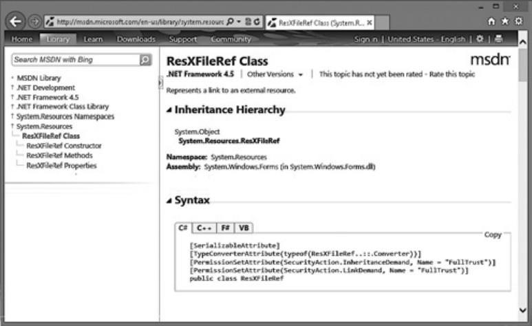


**рис. 4.1.** .Документация.SDK.с.пространством.имен.и.информацией.сборки.для.типа 

**133** 

Как.разные.компоненты.взаимодействуют.во.время.выполнения 

## **Как разные компоненты взаимодействуют во время выполнения** 

В этом разделе рассказано, как во время выполнения взаимодействуют типы, объекты, стек потока и управляемая куча. Кроме того, объяснено, в чем различие между вызовом статических, экземплярных и виртуальных методов. А начнем мы с некоторых базовых сведений о работе компьютера. То, о чем я собираюсь рассказать, вообще говоря, не относится к специфике CLR, но я начну с общих понятий, а затем перейду к обсуждению информации, относящейся исключительно к CLR. 

На рис. 4.2 представлен один процесс Microsoft Windows с загруженной в него исполняющей средой CLR. У процесса может быть много потоков. После создания потоку выделяется стек размером в 1 Мбайт. Выделенная память используется для передачи параметров в методы и хранения определенных в пределах методов локальных переменных. На рис. 4.2 справа показана память стека одного потока. Стеки заполняются от области верхней памяти к области нижней памяти (то есть от старших к младшим адресам). На рисунке поток уже выполняет какой-то код, и в его стеке уже есть какие-то данные (отмечены областью более темного оттенка вверху стека). А теперь представим, что поток выполняет код, вызывающий метод `M1` . 


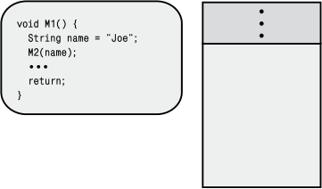


**рис. 4.2.** .Стек.потока.перед.вызовом.метода.M1 

Все методы, кроме самых простых, содержат некоторый _входной код_ (prologue code), инициализирующий метод до начала его работы. Кроме того, эти методы содержат _выходной код_ (epilogue code), выполняющий очистку после того, как метод завершит свою основную работу, чтобы возвратить управление вызывающей программе. В начале выполнения метода `M1` его входной код выделяет в стеке потока память для локальной переменной `name` (рис. 4.3). 

Далее `M1` вызывает метод `M2` , передавая в качестве аргумента локальную переменную `name` . При этом адрес локальной переменной `name` заталкивается в стек (рис. 4.4). Внутри метода `M2` местоположение стека хранится в переменной-параметре `s` . (Кстати, в некоторых процессорных архитектурах для повышения производительности аргументы передаются через регистры, но это различие для нашего обсуждения 

**134** Глава.4 .Основы.типов 

несущественно.) При вызове метода адрес возврата в вызывающий метод также заталкивается в стек (показано на рис. 4.4). 


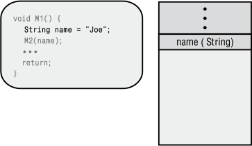


**рис. 4.3.** .Размещение.локальной.переменной.метода.M1.в.стеке.потока 


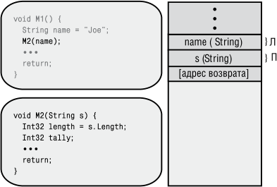


**рис. 4.4.** .При.вызове.M2.метод.M1.заталкивает.аргументы. и.адрес.возврата.в.стек.потока 

В начале выполнения метода `M2` его входной код выделяет в стеке потока память для локальных переменных `length` и `tally` (рис. 4.5). Затем выполняется код метода `M2` . В конце концов, выполнение `M2` доходит до команды возврата, которая записывает в указатель команд процессора адрес возврата из стека, и стековый кадр `M2` возвращается в состояние, показанное на рис. 4.3. С этого момента продолжается выполнение кода `M1` , который следует сразу за вызовом `M2` , а стековый кадр метода находится в состоянии, необходимом для работы `M1` . 

В конечном счете, метод `M1` возвращает управление вызывающей программе, устанавливая указатель команд процессора на адрес возврата (на рисунках не показан, но в стеке он находится прямо над аргументом `name` ), и стековый кадр `M1` возвращается в состояние, показанное на рис. 4.2. С этого момента продолжается выполнение кода вызвавшего метода, причем начинает выполняться код, непосредственно следующий за вызовом `M1` , а стековый кадр вызвавшего метода находится в состоянии, необходимом для его работы. 

**135** 

Как.разные.компоненты.взаимодействуют.во.время.выполнения 


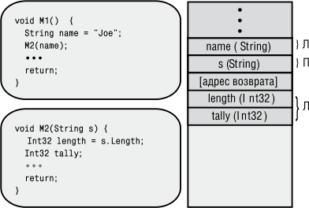


**рис. 4.5.** .Выделение.в.стеке.потока.памяти.для.локальных.переменных.метода.M2 

А сейчас давайте переключимся на исполняющую среду CLR. Допустим, есть следующие два определения классов: 

```
internal class Employee {
  public Int32 GetYearsEmployed () { ... }
  public virtual String GetProgressReport () { ... }
  public static Employee Lookup(String name) { ... }
}
internal sealed class Manager : Employee {
  public override String GenProgressReport() { ... }
}
```

Процесс Windows запустился, в него загружена среда CLR, инициализирована управляемая куча, и создан поток (с его 1 Мбайт памяти в стеке). Поток уже выполняет какой-то код, из которого вызывается метод `M3` (рис. 4.6). Метод `M3` содержит код, продемонстрирующий, как работает CLR; вряд ли вы будете включать такой код в свои приложения, потому что он, в сущности, не делает ничего полезного. 

В процессе преобразования IL-кода метода М3 в машинные команды JIT-компилятор выявляет все типы, на которые есть ссылки в `M3` , — это типы `Employee` , `Int32` , `Manager` и `String` (из-за наличия строки `"Joe"` ). На данном этапе CLR обеспечивает загрузку в домен приложений всех сборок, в которых определены все эти типы. Затем, используя метаданные сборки, CLR получает информацию о типах и создает структуры данных, собственно и представляющие эти типы. Структуры данных для объектов-типов `Employee` и `Manager` показаны на рис. 4.7. Поскольку до вызова `M3` поток уже выполнил какой-то код, для простоты допустим, что объекты-типы `Int32` и `String` уже созданы (что вполне возможно, так как это часто используемые типы), поэтому они не показаны на рисунке. 

На минуту отвлечемся на обсуждение объектов-типов. Как говорилось ранее в этой главе, все объекты в куче содержат два дополнительных члена: указатель на объект-тип и индекс блока синхронизации. В объектах типа `Employee` и `Manager` оба эти члена присутствуют. При определении типа можно включить 

**136** Глава.4 .Основы.типов 

в него статические поля данных. Байты для этих статических полей выделяются в составе самих объектов-типов. Наконец, у каждого объекта-типа есть таблица методов с входными точками всех методов, определенных в типе. Эта таблица методов уже обсуждалась в главе 1. Так как в типе `Employee` определены три метода ( `GetYearsEmployed` , `GenProgressReport` и `Lookup` ), в соответствующей таблице методов есть три записи. В типе `Manager` определен один метод (переопределенный метод `GenProgressReport` ), который и представлен в таблице методов этого типа. 


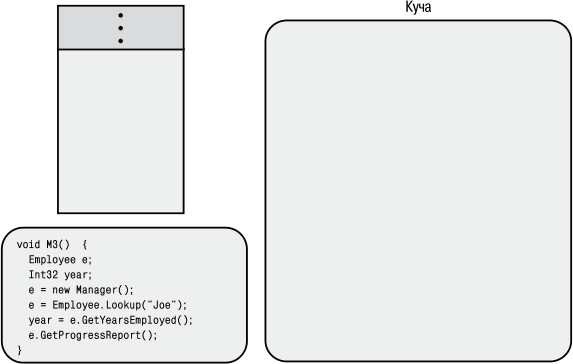


**рис. 4.6.** .Среда.CLR.загружена.в.процесс,.куча.инициализирована,.готовится.вызов. стека.потока,.в.который.загружен.метод.M3 


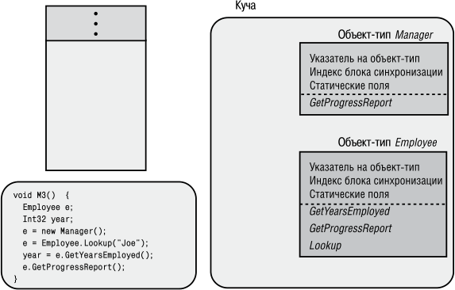


**рис. 4.7.** .При.вызове.M3.создаются.объекты.типа.Employee.и.Manager 

**137** 

Как.разные.компоненты.взаимодействуют.во.время.выполнения 

После того как среда CLR создаст все необходимые для метода объекты-типы и откомпилирует код метода `M3` , она приступает к выполнению машинного кода `M3` . При выполнении входного кода `M3` в стеке потока выделяется память для локальных переменных (рис. 4.8). В частности, CLR автоматически инициализирует все локальные переменные значением `null` или `0` (нулем) — это делается в рамках выполнения входного кода метода. Однако при попытке обращения к локальной переменной, неявно инициализированной в вашем коде, компилятор С# выдаст сообщение об ошибке `Use of unassigned local variable` (использование неинициализированной локальной переменной). 


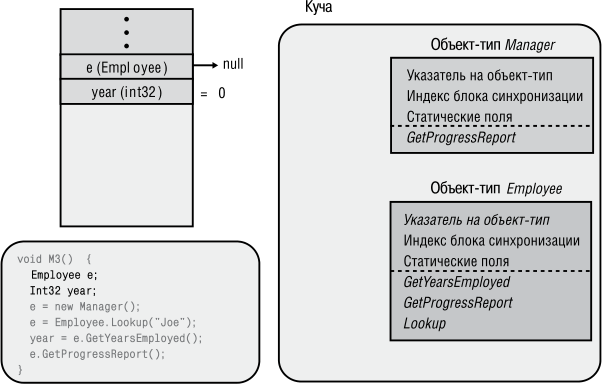


**рис. 4.8.** .Выделение.памяти.в.стеке.потока.для.локальных.переменных.метода.M3 

Далее `M3` выполняет код создания объекта `Manager` . При этом в управляемой куче создается экземпляр типа `Manager` , то есть объект `Manager` (рис. 4.9). У объекта `Manager` — так же как и у всех остальных объектов — есть указатель на объект-тип и индекс блока синхронизации. У этого объекта тоже есть байты, необходимые для размещения всех экземплярных полей данных, определенные в типе `Manager` , а также всех экземплярных полей, определенных во всех базовых классах типа `Manager` (в  данном случае — `Employee` и `Object` ). Всякий раз при создании нового объекта в куче CLR автоматически инициализирует внутренний указатель на объект-тип так, чтобы он указывал на соответствующий объект-тип (в данном случае — на объект-тип `Manager` ). Кроме того, CLR инициализирует индекс блока синхронизации и присваивает всем экземплярным полям объекта значение `null` или `0` (нуль) перед вызовом конструктора типа — метода, который, скорее всего, изменит значения некоторых экземплярных полей. Оператор `new` возвращает адрес в памяти объекта `Manager` , который хранится в переменной `e` (в стеке потока). 

**138** Глава.4 .Основы.типов 


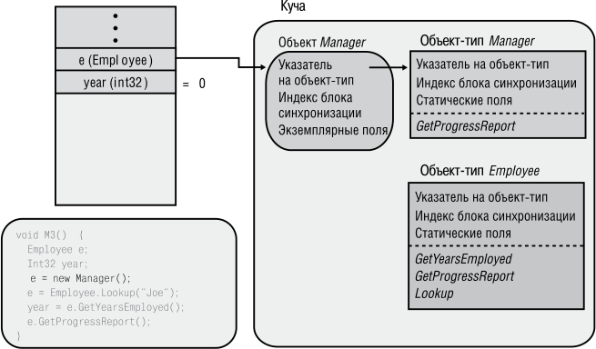


**рис. 4.9.** .Создание.и.инициализация.объекта.Manager 

Следующая строка метода `M3` вызывает статический метод `Lookup` объекта `Employee` . При вызове этого метода CLR определяет местонахождение объекта-типа, соответствующего типу, в котором определен статический метод. Затем на основании таблицы методов объекта-типа среда CLR находит точку входа в вызываемый метод, обрабатывает код JIT-компилятором (при необходимости) и передает управление полученному машинному коду. Для нашего обсуждения достаточно предположить, что метод `Lookup` объекта `Employee` выполняет запрос к базе данных, чтобы найти сведения о `Joe` . Допустим также, что в базе данных указано, что `Joe` занимает должность менеджера, поэтому код метода `Lookup` создает в куче новый объект `Manager` , инициализирует его данными `Joe` и возвращает адрес готового объекта. Адрес размещается в локальной переменной `e` . Результат этой операции показан на рис. 4.10. 

Следующая строка метода `M3` вызывает виртуальный экземплярный метод `GenProgressReport` в `Employee` . При вызове виртуального экземплярного метода CLR приходится выполнять некоторую дополнительную работу. Во-первых, CLR обращается к переменной, используемой для вызова, и затем следует по адресу вызывающего объекта. В данном случае переменная `e` указывает на объект `Joe` типа `Manager` . Во-вторых, CLR проверяет у объекта внутренний указатель на объект-тип. Затем CLR находит в таблице методов объекта-типа запись вызываемого метода, обрабатывает код JIT-компилятором (при необходимости) и вызывает полученный машинный код. В нашем случае вызывается реализация метода `GenProgressReport` в `Manager` , потому что `e` ссылается на объект `Manager` . Результат этой операции показан на рис. 4.12. 

Заметьте, если метод `Lookup` в `Employee` обнаружит, что `Joe` — это всего лишь `Employee` , а не `Manager` , то `Lookup` создаст объект `Employee` , в котором указатель на 

**139** 

Как.разные.компоненты.взаимодействуют.во.время.выполнения 

объект-тип ссылается на объект-тип `Employee` ; это приведет к тому, что выполнится реализация `GenProgressReport` из `Employee` , а не из `Manager` . 


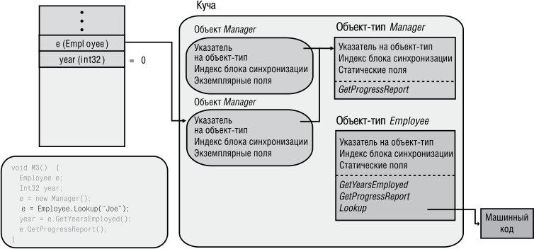


**рис. 4.10.** .Статический.метод.Lookup.в.Employee.выделяет.память. и.инициализирует.объект.Manager.для.Joe 


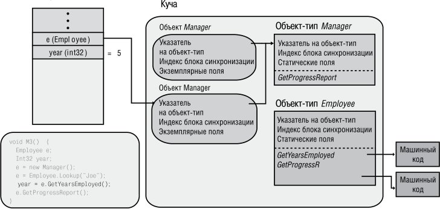


**рис. 4.11.** .Невиртуальный.экземплярный.метод.GetYarsEmployeed.в.Employee. возвращает.значение.5 

Итак, мы обсудили взаимоотношения между исходным текстом, IL и машинным JIT-кодом, поговорили о стеке потока, аргументах и локальных переменных, а также о том, как эти аргументы и переменные ссылаются на объекты в управляемой куче. Мы также узнали, что объекты хранят указатель на свой объект-тип (содержащий 

**140** Глава.4 .Основы.типов 

статические поля и таблицу методов). Мы обсудили, как CLR вызывает статические методы, невиртуальные и виртуальные экземплярные методы. Все сказанное призвано дать вам более полную картину работы CLR и помочь при создании архитектуры, проектировании и реализации типов, компонентов и приложений. Заканчивая главу, я хотел бы сказать еще несколько слов о происходящем внутри CLR. 


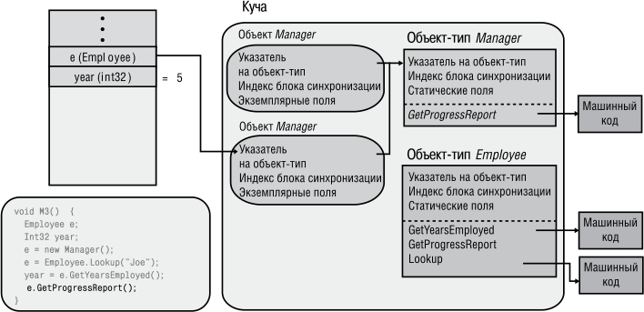


**рис. 4.12.** .При.вызове.виртуального.метода.GenProgressReport.экземпляра.Employee. будет.вызвана.переопределенная.реализация.этого.метода.в.Manager 


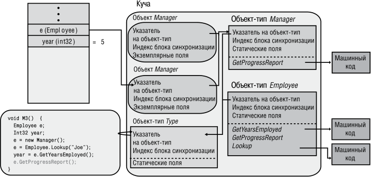


**рис. 4.13.** .Объекты.типа.Manager.и.Employee.как.экземпляры.типа.System Type 

Наверняка вы обратите внимание, что объекты типа `Employee` и `Manager` содержат указатели на объекты-типы. По сути объекты-типы тоже являются объектами. 

**141** 

Как.разные.компоненты.взаимодействуют.во.время.выполнения 

Создавая объект-тип, среда CLR должна его как-то инициализировать. Резонно спросить: «Какие значения будут присвоены при инициализации?» В общем, при своем запуске в процессе CLR сразу же создает специальный объект-тип для типа `System.Type` (он определен в MSCorLib dll). Объекты типа `Employee` и `Manager` являются «экземплярами» этого типа, и по этой причине их указатели на объекты-типы инициализируются ссылкой на объект-тип `System.Type` (рис. 4.13). 

Конечно, объект-тип `System.Type` сам является объектом и поэтому также содержит указатель на объект-тип; значит, закономерно поинтересоваться, на что ссылается этот указатель. А ссылается он на самого себя, так как объект-тип `System. Type` сам по себе является «экземпляром» объекта-типа. Теперь становится понятно, как устроена и работает вся система типов в CLR. Кстати, метод `GetType` типа `System.Object` просто возвращает адрес, хранящийся в указателе на объект-тип заданного объекта. Иначе говоря, метод `GetType` возвращает указатель на объекттип указанного объекта и именно поэтому можно определить истинный тип любого объекта в системе (включая объекты-типы). 

## **Глава 5. Примитивные, ссылочные и значимые типы** 

В этой главе речь идет о разновидностях типов, с которыми вы будете иметь дело при программировании для платформы Microsoft .NET Framework. Важно, чтобы все разработчики четко осознавали разницу в поведении типов. Приступая к изучению .NET Framework, я толком не понимал, в чем разница между примитивными, ссылочными и значимыми типами, в результате мой код получался не слишком эффективным и содержал много коварных ошибок. Надеюсь, мой опыт и мои объяснения различий между этими типами помогут вам избавиться от лишних проблем и повысить производительность своей работы. 

## **Примитивные типы в языках программирования** 

Некоторые типы данных применяются так часто, что для работы с ними во многих компиляторах предусмотрен упрощенный синтаксис. Например, целую переменную можно создать следующим образом: 

```
System.Int32 a = new System.Int32();
```

Конечно, подобный синтаксис для объявления и инициализации целой переменной кажется громоздким. К счастью, многие компиляторы (включая C#) позволяют использовать вместо этого более простые выражения, например: 

```
int a = 0;
```

Подобный код читается намного лучше, да и компилятор в обоих случаях генерирует идентичный IL-код для `System.Int32` . Типы данных, которые поддерживаются компилятором напрямую, называются _примитивными_ (primitive types); у них существуют прямые аналоги в библиотеке классов .NET Framework Class Library (FCL). Например, типу `int` языка C# соответствует `System.Int32` , поэтому весь следующий код компилируется без ошибок и преобразуется в одинаковые IL-команды: 

int a = 0;          // Самый удобный синтаксис System.Int32 a = 0; // Удобный синтаксис int a = new int();  // Неудобный синтаксис System.Int32 a = new System.Int32(); // Самый неудобный синтаксис 

**143** 

Примитивные.типы.в.языках.программирования 

В табл. 5.1 представлены типы FCL и соответствующие им примитивные типы C#. В других языках типам, удовлетворяющим общеязыковой спецификации (Common Language Specification, CLS), соответствуют аналогичные примитивные типы. Однако поддержка языком типов, не удовлетворяющих требованиям CLS, не обязательна. 

**таблица 5.1.** .Примитивные.типы.С#.и.соответствующие.типы.FCL 

|**Прими-**<br>**тивный**<br>**тип**|**FCL-тип**|**совме-**<br>**стимость**<br>**с CLS**|**Описание**|
|---|---|---|---|
|sbyte|System.Sbyte|Нет|8-разрядное значение со знаком|
|byte|System.Byte|Да|8-разрядное значение без знака|
|short|System.Int16|Да|16-разрядное значение со знаком|
|ushort|System.Uint16|Нет|16-разрядное значение без знака|
|int|System.Int32|Да|32-разрядное значение со знаком|
|uint|System.Uint32|Нет|32-разрядное значение без знака|
|long|System.Int64|Да|64-разрядное значение со знаком|
|ulong|System.Uint64|Нет|64-разрядное значение без знака|
|char|System.Char|Да|16-разрядный символ Unicode (char ни-<br>когда не представляет 8-разрядное значе-<br>ние, как в неуправляемом коде на С++)|
|float|System.Single|Да|32-разрядное значение с плавающей точ-<br>кой в стандарте IEEE|
|double|System.Double|Да|64-разрядное значение с плавающей точ-<br>кой в стандарте IEEE|
|bool|System.Boolean|Да|Булево значение (true или false)|
|decimal|System.Decimal|Да|128-разрядное значение с плавающей<br>точкой повышенной точности, часто<br>используемое для финансовых рас-<br>четов, где недопустимы ошибки округ-<br>ления. Один разряд числа — это знак,<br>в следующих 96 разрядах помещается<br>само значение, следующие 8 разрядов —<br>степень числа 10, на которое делится<br>96-разрядное число (может быть в диа-<br>пазоне от 0 до 28). Остальные разряды<br>не используются|


_продолжение_  

**144** Глава.5 .Примитивные,.ссылочные.и.значимые.типы 

**таблица 5.1** .( _продолжение_ ) 

|**Прими-**<br>**тивный**<br>**тип**|**FCL-тип**|**совме-**<br>**стимость**<br>**с CLS**|**Описание**|
|---|---|---|---|
|string|System.String|Да|Массив символов|
|object|System.Object|Да|Базовый тип для всех типов|
|dynamic|System.Object|Да|Для CLR тип dynamic идентичен типу<br>object. Однако компилятор С# позволяет<br>переменным типа dynamic участвовать<br>в динамическом разрешении типа с упро-<br>щенным синтаксисом. Подробнее об<br>этом читайте в разделе «Примитивный<br>тип данных dynamic» в конце этой главы|


Иначе говоря, можно считать, что компилятор C# автоматически предполагает, что во всех файлах исходного кода есть следующие директивы `using` (как говорилось в главе 4): 

```
using sbyte = System.SByte;
using byte = System.Byte;
using short = System.Int16;
using ushort = System.UInt16;
using int = System.Int32;
using uint = System.UInt32;
...
```

Я не могу согласиться со следующим утверждением из спецификации языка C#: «С точки зрения стиля программирования предпочтительней использовать ключевое слово, а не полное системное имя типа», поэтому стараюсь задействовать имена FCL-типов и избегать имен примитивных типов. На самом деле, мне бы хотелось, чтобы имен примитивных типов не было совсем, а разработчики употребляли только имена FCL-типов. И вот по каким причинам. 

- Мне попадались разработчики, не знавшие, какое ключевое слово использовать им в коде: `string` или `String` . В C# это не важно, так как ключевое слово `string` в точности преобразуется в FCL-тип `System.String` . Я также слышал, что некоторые разработчики говорили о том, что в 32-разрядных операционных системах тип `int` представлялся 32-разрядным типом, а в 64-разрядных — 64разрядным типом. Это утверждение совершенно неверно: в C# тип `int` всегда преобразуется в `System.Int32` , поэтому он всегда представляется 32-разрядным типом безотносительно запущенной операционной системы. Использование ключевого слова `Int32` в своем коде позволит избежать путаницы. 

- В C# `long` соответствует тип `System.Int64` , но в другом языке это может быть `Int16` или `Int32` . Как известно, в С++/CLI тип `long` трактуется как `Int32` . Если 

Примитивные.типы.в.языках.программирования **145** 

кто-то возьмется читать код, написанный на новом для себя языке, то назначение кода может быть неверно им истолковано. Многим языкам незнакомо ключевое слово `long` , и их компиляторы не пропустят код, где оно встречается. 

- У многих FCL-типов есть методы, в имена которых включены имена типов. Например, у типа `BinaryReader` есть методы `ReadBoolean` , `ReadInt32` , `ReadSingle` и т. д., а у типа `System.Convert` — методы `ToBoolean` , `ToInt32` , `ToSingle` и т. д. Вот вполне приемлемый код, в котором строка, содержащая `float` , выглядит неестественно; даже возникает впечатление, что код ошибочен: 

## `BinaryReader br = new BinaryReader(...);` 

float val = br.ReadSingle();  // Код правильный, но выглядит странно Single val = br.ReadSingle(); // Код правильный и выглядит нормально 

- Многие программисты, пишущие исключительно на С#, часто забывают, что в CLR могут применяться и другие языки программирования. Например, среда FCL практически полностью написана на С#, а разработчики из команды FCL ввели в библиотеку такие методы, как метод `GetLongLength` класса `Array` , возвращающий значение `Int64` , которое имеет тип `long` в С#, но не в других языках программирования (например, C++/CLI). Другой пример — метод `LongCount` класса `System.Linq.Enumerable` . 

По этим причинам я буду использовать в этой книге только имена FCL-типов. Во многих языках программирования следующий код благополучно скомпилируется и выполнится: 

Int32 i = 5; // 32-разрядное число 

Int64 l = i; // Неявное приведение типа к 64-разрядному значению 

Однако если вспомнить, что говорилось о приведении типов в главе 4, можно решить, что он компилироваться не будет. Все-таки `System.Int32` и `System.Int64` , не являются производными друг от друга. Могу вас обнадежить: код успешно компилируется и делает все, что ему положено. Дело в том, что компилятор C# неплохо разбирается в примитивных типах и применяет свои правила при компиляции кода. Иначе говоря, он распознает наиболее распространенные шаблоны программирования и генерирует такие IL-команды, благодаря которым исходный код работает так, как требуется. В первую очередь, это относится к приведению типов, литералам и операторам, примеры которых мы рассмотрим позже. 

Начнем с того, что компилятор выполняет явное и неявное приведение между примитивными типами, например: 

Int32 i = 5;         // Неявное приведение Int32 к Int32 Int64 l = i;         // Неявное приведение Int32 к Int64 Single s = i;        // Неявное приведение Int32 к Single Byte b = (Byte) i;   // Явное приведение Int32 к Byte Int16 v = (Int16) s; // Явное приведение Single к Int16 

C# разрешает неявное приведение типа, если это преобразование «безопасно», то есть не сопряжено с потерей данных; пример — преобразование из `Int32` в `Int64` . 

**146** Глава.5 .Примитивные,.ссылочные.и.значимые.типы 

Однако для преобразования с риском потери данных C# требует явного приведения типа. Для числовых типов «небезопасное» преобразование означает «связанное с потерей точности или величины числа». Например, преобразование из `Int32` в `Byte` требует явного приведения к типу, так как при больших величинах `Int32` теряется точность; требует приведения и преобразование из `Single` в `Int16` , поскольку число `Single` может оказаться больше, чем допустимо для `Int16` . 

Для реализации приведения разные компиляторы могут порождать разный код. Например, в случае приведения числа 6,8 типа `Single` к типу `Int32` одни компиляторы сгенерируют код, который поместит в `Int32` число 6, а другие округлят результат до 7. Между прочим, в C# дробная часть всегда отбрасывается. Точные правила приведения для примитивных типов вы найдете в разделе спецификаций языка C#, посвященном преобразованиям («Conversions»). 

Помимо приведения, компилятор «знает» и о другой особенности примитивных типов: к ним применима литеральная форма записи. Литералы сами по себе считаются экземплярами типа, поэтому можно вызывать экземплярные методы, например, следующим образом: 

```
Console.WriteLine(123.ToString() + 456.ToString()); // "123456"
```

Кроме того, благодаря тому, что выражения, состоящие из литералов, вычисляются на этапе компиляции, возрастает скорость выполнения приложения. 

Boolean found = false;  // В готовом коде found присваивается 0 Int32 x = 100 + 20 + 3; // В готовом коде x присваивается 123 String s = "a " + "bc"; // В готовом коде s присваивается "a bc" 

И наконец, компилятор «знает», как и в каком порядке интерпретировать встретившиеся в коде операторы (в том числе `+` , `-` , `*` , `/` , `%` , `&` , `^` , `|` , `==` , `!=` , `>` , `<` , `>=` , `<=` , `<<` , `>>` , `~` , `!` , `++` , `--` и т. п.): 

Int32 x = 100;    // Оператор присваивания Int32 y = x + 23; // Операторы суммирования и присваивания Boolean lessThanFifty = (y < 50); // Операторы "меньше чем" и присваивания 

## **Проверяемые и непроверяемые операции для примитивных типов** 

Программистам должно быть хорошо известно, что многие арифметические операции над примитивными типами могут привести к переполнению: 

`Byte b = 100;` b = (Byte) (b + 200);// После этого b равно 44 (2C в шестнадцатеричной записи) 

Такое «незаметное» переполнение обычно в программировании не приветствуется, и если его не выявить, приложение поведет себя непредсказуемо. Изредка, правда (например, при вычислении хеш-кодов или контрольных сумм), такое переполнение не только приемлемо, но и желательно. 

**147** 

Примитивные.типы.в.языках.программирования 

## **ВниМание** 

При.выполнении.этой.арифметической.операции.CLR.на.первом.шаге.все.значения. операндов.расширяются.до.32.разрядов.(или.64.разрядов,.если.для.представления. операнда.32.разрядов.недостаточно) .Поэтому.b.и.200.(для.которых.32.разрядов. достаточно).сначала.преобразуются.в.32-разрядные.значения,.а.затем.уже.суммируются .Полученное.32-разрядное.число.(300.в.десятичной.системе,.12C.в.шестнадцатеричной),.прежде.чем.поместить.его.обратно.в.переменную.b,.нужно.привести. к.типу.Byte .Так.как.в.данном.случае.C#.не.выполняет.неявного.приведения.типа,.во. вторую.строку.введена.операция.приведения.к.типу.Byte 

В каждом языке существуют свои способы обработки переполнения. В C и C++ переполнение ошибкой не считается, а при усечении значений приложение не прервет свою работу. А вот в Visual Basic переполнение всегда рассматривается как ошибка, и при его обнаружении генерируется исключение. 

В CLR есть IL-команды, позволяющие компилятору по-разному реагировать на переполнение. Например, суммирование двух чисел выполняет команда `add` , не реагирующая на переполнение, а также команда `add.ovf` , которая при переполнении генерирует исключение `System.OverflowException` . Кроме того, в CLR есть аналогичные IL-команды для вычитания ( `sub/sub.ovf` ), умножения ( `mul/mul.ovf` ) и преобразования данных ( `conv/conv.ovf` ). 

Пишущий на C# программист может сам решать, как обрабатывать переполнение; по умолчанию проверка переполнения отключена. Это значит, что компилятор генерирует для операций сложения, вычитания, умножения и преобразования ILкоманды без проверки переполнения. В результате код выполняется быстро, но разработчик должен быть либо уверен в отсутствии переполнения, либо предусмотреть возможность его возникновения в своем коде. 

Чтобы включить механизм управления процессом обработки переполнения на этапе компиляции, добавьте в командную строку компилятора параметр `/checked+` . Он сообщает компилятору, что для выполнения сложения, вычитания, умножения и преобразования должны быть сгенерированы IL-команды с проверкой переполнения. Такой код медленнее, так как CLR тратит время на проверку этих операций, ожидая переполнение. Когда оно возникает, CLR генерирует исключение `OverflowException` . Код приложения должен предусматривать корректную обработку этого исключения. 

Однако программистам вряд ли понравится необходимость включения или отключения режима проверки переполнения во всем коде. Им лучше самим решать, как реагировать на переполнение в каждом конкретном случае. И C# предлагает такой механизм гибкого управления проверкой в виде операторов `checked` и `unchecked` . Например (предполагается, что компилятор по умолчанию создает код без проверки): 

```
UInt32 invalid = unchecked((UInt32) -1); // OK
```

А вот пример с использованием оператора `checked` : 

Byte b = 100;                   // Выдается исключение `b = checked((Byte) (b + 200));  // OverflowException` 

**148** Глава.5 .Примитивные,.ссылочные.и.значимые.типы 

Здесь `b` и 200 преобразуются в 32-разрядные числа и суммируются; результат равен 300. Затем при преобразовании 300 в `Byte` генерируется исключение `OverflowException` . Если приведение к типу `Byte` вывести из оператора `checked` исключения не будет: 

b = (Byte) checked(b + 200); // b содержит 44; нет OverflowException 

Наряду с операторами `checked` и `unchecked` в C# есть одноименные инструкции, позволяющие включить проверяемые или непроверяемые выражения внутрь блока: 

checked {               // Начало проверяемого блока `Byte b = 100;` b = (Byte) (b + 200); // Это выражение проверяется на переполнение }                       // Конец проверяемого блока 

Кстати, внутри такого блока можно задействовать оператор `+=` с `Byte` , который немного упростит код: 

checked {            // Начало проверяемого блока `Byte b = 100;` b += 200;          // Это выражение проверяется на переполнение }                    // Конец проверяемого блока 

## **ВниМание** 

Установка.режима.контроля.переполнения.не.влияет.на.работу.метода,.вызываемого. внутри.оператора.или.инструкции.checked,.так.как.действие.оператора.(и.инструкции).checked.распространяется.только.на.выбор.IL-команд.сложения,.вычитания,. умножения.и.преобразования.данных .Например: 

```
checked {
```

// Предположим, SomeMethod пытается поместить 400 в Byte `SomeMethod(400);` 

- // Возникновение OverflowException в SomeMethod 

- // зависит от наличия в нем операторов проверки 

```
}
```

Я видел немало вычислений, генерирующих непредсказуемые результаты. Обычно это случается из-за неправильного ввода данных пользователем или же из-за возвращения неожиданных значений переменных. Итак, я рекомендую программистам соблюдать следующие правила при использовании операторов `checked` и `unchecked` . 

- Используйте типы со знаком ( `Int32` и `Int64` ) вместо числовых типов без знака ( `UInt32` и `UInt64` ) везде, где это возможно. Это позволит компилятору выявлять ошибку переполнения. Кроме того, некоторые компоненты библиотеки классов (например, свойства `Length` классов `Array` и `String` ) жестко запрограммированы на возвращение значений со знаком, и передача этих значений в коде потребует меньшего количества преобразований типа (а следовательно, 

Примитивные.типы.в.языках.программирования **149** 

упростит структуру кода и его сопровождение). Кроме того,  числовые типы без знака несовместимы с CLS. 

- Включайте в блок `checked` ту часть кода, в которой возможно переполнение изза неверных входных данных, например при обработке запросов, содержащих данные, предоставленные конечным пользователем или клиентской машиной. Возможно, также стоит перехватывать исключение `OverflowException` , чтобы ваше приложение могло корректно продолжить работу после таких сбоев. 

- Включайте в блок `unchecked` те фрагменты кода, в которых переполнение не создает проблем (например, при вычислении контрольной суммы). 

- В коде, где нет операторов и блоков `checked` и `unchecked` , предполагается, что при переполнении _должно_ происходить исключение. Например, при вычислении простых чисел входные данные известны, а переполнение является признаком ошибки. 

В процессе отладки кода установите параметр компилятора `/checked+` . Выполнение приложения замедлится, так как система будет контролировать переполнение во всем коде, не помеченном ключевыми словами `checked` или `unchecked` . Обнаружив исключение, вы сможете легко обнаружить его и исправить ошибку. В окончательной сборке приложения установите параметр `/checked-` , что ускорит выполнение приложения; исключения при этом генерироваться не будут. Для того чтобы изменить значение параметра `checked` в Microsoft Visual Studio, откройте окно свойств вашего проекта, перейдите на вкладку Build, щелкните на кнопке Advanced и установите флажок Check for arithmetic overflow/underflow, как это показано на рис. 5.1. 


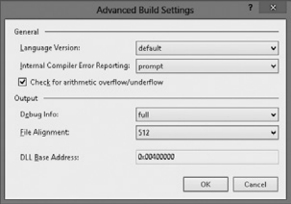


**рис. 5.1.** .Изменение.применяемых.по.умолчанию.параметров.компилятора. Visual.Studio.в.окне.Advanced.Build.Settings 

В случае если для вашего приложения производительность не критична, я рекомендую оставлять параметр `/checked` включенным даже в окончательной версии. 

**150** Глава.5 .Примитивные,.ссылочные.и.значимые.типы 

Это позволит защитить приложение от некорректных данных и брешей в системе безопасности. Например, если при вычислении индекса массива используется исключение, лучше получить исключение `OverflowException` , чем обратиться к неверному элементу массива из-за переполнения. 

## **ВниМание** 

Тип.System Decimal.стоит.особняком .В.отличие.от.многих.языков.программирования. (включая.C#.и.Visual.Basic),.в.CLR.тип.Decimal.не.относится.к.примитивным.типам . В.CLR.нет.IL-команд.для.работы.со.значениями.типа.Decimal .В.документации.по. NET. Framework.сказано,.что.тип.Decimal.имеет.открытые.статические.методы-члены.Add,. Subtract,.Multiply,.Divide.и.прочие,.а.также.перегруженные.операторы.+,.-,.*,./.и.т .д 

При.компиляции.кода.с.типом.Decimal.компилятор.генерирует.вызовы.членов. Decimal,.которые.и.выполняют.реальную.работу .Поэтому.значения.типа.Decimal. обрабатываются.медленнее.примитивных.CLR-типов .Кроме.того,.раз.нет.IL-команд. для.манипуляции.числами.типа.Decimal,.то.не.будут.иметь.эффекта.ни.операторы. checked.и.unchecked,.ни.соответствующие.параметры.командной.строки.компилятора,.а.неосторожность.в.операциях.над.типом.Decimal.может.привести.к.исключению. OverflowException 

Аналогично,.тип.System Numerics BigInteger.используется.в.массивах.UInt32.для. представления.большого.целочисленного.значения,.не.имеющего.верхней.или. нижней.границы .Следовательно,.операции.с.типом.BigInteger.никогда.не.вызовут. исключения.OverflowException .Однако.они.могут.привести.к.выдаче.исключения. OutOfMemoryException,.если.значение.переменной.окажется.слишком.большим 

## **ссылочные и значимые типы** 

CLR поддерживает две разновидности типов: _ссылочные_ (reference types) и _значимые_ (value types). Большинство типов в FCL — ссылочные, но программисты чаще всего используют значимые. Память для ссылочных типов всегда выделяется из управляемой кучи, а оператор C# `new` возвращает адрес в памяти, где размещается сам объект. При работе со ссылочными типами необходимо учитывать следующие обстоятельства, относящиеся к производительности приложения: 

- память для ссылочных типов всегда выделяется из управляемой кучи; 

- каждый объект, размещаемый в куче, содержит дополнительные члены, подлежащие инициализации; 

- незанятые полезной информацией байты объекта обнуляются (это касается полей); 

- размещение объекта в управляемой куче со временем инициирует сборку мусора. 

Если бы все типы были ссылочными, эффективность приложения резко упала бы. Представьте, насколько замедлилось бы выполнение приложения, если бы при 

Ссылочные.и.значимые.типы **151** 

каждом обращении к значению типа `Int32` выделялась память! Поэтому, чтобы ускорить обработку простых, часто используемых типов CLR предлагает «облегченные» типы — _значимые_ . Экземпляры этих типов обычно размещаются в стеке потока (хотя они могут быть встроены и в объект ссылочного типа). В представляющей экземпляр переменной нет указателя на экземпляр; поля экземпляра размещаются в самой переменной. Поскольку переменная содержит поля экземпляра, то для работы с экземпляром не нужно выполнять разыменование (dereference) экземпляра. Благодаря тому, что экземпляры значимых типов не обрабатываются уборщиком мусора, уменьшается интенсивность работы с управляемой кучей и сокращается количество сеансов уборки мусора, необходимых приложению на протяжении его существования. 

В документации на .NET Framework можно сразу увидеть, какие типы относят к ссылочным, а какие — к значимым. Если тип называют _классом_ (class), речь идет о ссылочном типе. Например, классы `System.Object` , `System.Exception` , `System.IO.FileStream` и `System.Random` — это ссылочные типы. В свою очередь, значимые типы в документации называются _структурами_ (structure) и _перечислениями_ (enumeration). Например, структуры `System.Int32` , `System.Boolean` , `System.Decimal` , `System.TimeSpan` и перечисления `System.DayOfWeek` , `System. IO.FileAttributes` и `System.Drawing.FontStyle` являются значимыми типами. 

Все структуры являются прямыми потомками абстрактного типа `System. ValueType` , который, в свою очередь, является производным от типа `System. Object` . По умолчанию все значимые типы должны быть производными от `System. ValueType` . Все перечисления являются производными от типа `System.Enum` , производного от `System.ValueType` . CLR и языки программирования по-разному работают с перечислениями. О перечислимых типах см. главу 15. 

При определении собственного значимого типа нельзя выбрать произвольный базовый тип, однако значимый тип может реализовать один или несколько выбранных вами интерфейсов. Кроме того, в CLR значимый тип является изолированным, то есть он не может служить базовым типом для какого-либо другого ссылочного или значимого типа. Поэтому, например, нельзя в описании нового типа указывать в качестве базовых типы `Boolean` , `Char` , `Int32` , `Uint64` , `Single` , `Double` , `Decimal` и т. д. 

## **ВниМание** 

Многим.разработчикам.(в.частности,.тем,.кто.пишет.неуправляемый.код.на.C/C++). деление.на.ссылочные.и.значимые.типы.поначалу.кажется.странным .В.неуправляемом.коде.C/C++.вы.объявляете.тип,.и.уже.код.решает,.куда.поместить.экземпляр. типа:.в.стек.потока.или.в.кучу.приложения .В.управляемом.коде.иначе:.разработчик,. описывающий.тип,.указывает,.где.должны.размещаться.экземпляры.данного.типа,. а.разработчик,.использующий.тип.в.своем.коде,.управлять.этим.не.может 

В следующем коде (и на рис. 5.2) продемонстрировано различие между ссылочными и значимыми типами: 

**152** Глава.5 .Примитивные,.ссылочные.и.значимые.типы 

// Ссылочный тип (поскольку 'class') `class SomeRef { public Int32 x; }` 

// Значимый тип (поскольку 'struct') `struct SomeVal { public Int32 x; }` 

```
static void ValueTypeDemo() {
```

SomeRef r1 = new SomeRef(); // Размещается в куче SomeVal v1 = new SomeVal(); // Размещается в стеке r1.x = 5; // Разыменовывание указателя v1.x = 5; // Изменение в стеке Console.WriteLine(r1.x); // Отображается "5" Console.WriteLine(v1.x); // Также отображается "5" // В левой части рис. 5.2 показан результат // выполнения предыдущих строк 

SomeRef r2 = r1; // Копируется только ссылка (указатель) SomeVal v2 = v1; // Помещаем в стек и копируем члены r1.x = 8; // Изменяются r1.x и r2.x v1.x = 9; // Изменяется v1.x, но не v2.x Console.WriteLine(r1.x); // Отображается "8" Console.WriteLine(r2.x); // Отображается "8" Console.WriteLine(v1.x); // Отображается "9" Console.WriteLine(v2.x); // Отображается "5" // В правой части рис. 5.2 показан результат // выполнения ВСЕХ предыдущих строк 

## `}` 


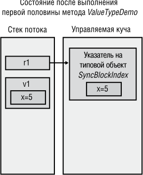


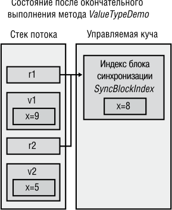


**рис. 5.2.** .Разница.между.размещением.в.памяти.значимых.и.ссылочных.типов 

В этом примере тип `SomeVal` объявлен с ключевым словом `struct` , а не более распространенным ключевым словом `class` . В C# типы, объявленные как `struct` , являются значимыми, а объявленные как `class` , — ссылочными. Между поведением 

Ссылочные.и.значимые.типы **153** 

ссылочных и значимых типов существуют существенные различия. Поэтому так важно представлять, к какому семейству относится тот или иной тип — к ссылочному или значимому: ведь это может существенно повлиять на то, как вы выражаете свои намерения в коде. 

В предыдущем примере есть следующая строка: 

SomeVal v1 = new SomeVal(); // Размещается в стеке 

Может показаться, что экземпляр `SomeVal` будет помещен в управляемую кучу. Однако поскольку компилятор C# «знает», что `SomeVal` является значимым типом, в сгенерированном им коде экземпляр `SomeVal` будет помещен в стек потока. C# также обеспечивает обнуление всех полей экземпляра значимого типа. 

Ту же строку можно записать иначе: 

SomeVal v1; // Размещается в стеке 

Здесь тоже создается IL-код, который помещает экземпляр `SomeVal` в стек потока и обнуляет все его поля. Единственное отличие в том, что экземпляр, созданный оператором `new` , C# «считает» инициализированным. Поясню эту мысль на следующем примере: 

// Две следующие строки компилируются, так как C# считает, // что поля в v1 инициализируются нулем `SomeVal v1 = new SomeVal(); Int32 a = v1.x;` 

// Следующие строки вызовут ошибку компиляции, поскольку C# не считает, // что поля в v1 инициализируются нулем `SomeVal v1; Int32 a = v1.x;` // error CS0170: Use of possibly unassigned field 'x' 

// (ошибка CS0170: Используется поле 'x', которому не присвоено значение) 

Проектируя свой тип, проверьте, не использовать ли вместо ссылочного типа значимый. Иногда это позволяет повысить эффективность кода. Сказанное особенно справедливо для типа, удовлетворяющего _всем_ перечисленным далее условиям. 

- Тип ведет себя подобно примитивному типу. В частности, это означает, что тип достаточно простой и у него нет членов, способных изменить экземплярные поля типа, в этом случае говорят, что тип _неизменяемый_ (immutable). На самом деле, многие значимые типы рекомендуется помечать спецификатором `readonly` (см. главу 7). 

- Тип не обязан иметь любой другой тип в качестве базового. 

- Тип не имеет производных от него типов. 

Также необходимо учитывать размер экземпляров типа, потому что по умолчанию аргументы передаются по значению; при этом поля экземпляров значимого типа копируются, что отрицательно сказывается на производительности. Повторюсь: для метода, возвращающего значимый тип, поля экземпляра копируются в память, 

**154** Глава.5 .Примитивные,.ссылочные.и.значимые.типы 

выделенную вызывающим кодом в месте возврата из метода, что снижает эффективность работы программы. Поэтому в дополнение к перечисленным условиям следует объявлять тип как значимый, если верно хотя бы одно из следующих условий: 

- Размер экземпляров типа мал (примерно 16 байт или меньше). 

- Размер экземпляров типа велик (более 16 байт), но экземпляры не передаются в качестве параметров метода или не являются возвращаемыми из метода значениями. 

Основное достоинство значимых типов в том, что они не размещаются в управляемой куче. Конечно, в сравнении со ссылочными типами у значимых типов есть недостатки. Важнейшие отличия между значимыми и ссылочными типы: 

- Объекты значимого типа существуют в двух формах (см. следующий раздел): _неупакованной_ (unboxed) и _упакованной_ (boxed). Ссылочные типы бывают только в упакованной форме. 

- Значимые типы являются производными от `System.ValueType` . Этот тип имеет те же методы, что и `System.Object` . Однако `System.ValueType` переопределяет метод `Equals` , который возвращает `true` , если значения полей в обоих объектах совпадают. Кроме того, в `System.ValueType` переопределен метод `GetHashCode` который создает хеш-код по алгоритму, учитывающему значения полей экземпляра объекта. Из-за проблем с производительностью в реализации по умолчанию, определяя собственные значимые типы значений, надо переопределить и написать свою реализацию методов `Equals` и `GetHashCode` . О методах `Equals` и `GetHashCode` рассказано в конце этой главы. 

- Поскольку в объявлении нового значимого или ссылочного типа нельзя указывать значимый тип в качестве базового класса, создавать в значимом типе новые виртуальные методы нельзя. Методы не могут быть абстрактными и неявно являются запечатанными (то есть их нельзя переопределить). 

- Переменные ссылочного типа содержат адреса объектов в куче. Когда переменная ссылочного типа создается, ей по умолчанию присваивается `null` , то есть в этот момент она не указывает на действительный объект. Попытка задействовать переменную с таким значением приведет к генерации исключения `NullReferenceException` . В то же время в переменной значимого типа всегда содержится некое значение соответствующего типа, а при инициализации всем членам этого типа присваивается 0. Поскольку переменная значимого типа не является указателем, при обращении к значимому типу исключение `NullReferenceException` возникнуть не может. CLR поддерживает понятие значимого типа особого вида, допускающего присваивание `null` (nullable types). Этот тип обсуждается в главе 19. 

- Когда переменной значимого типа присваивается другая переменная значимого типа, выполняется копирование всех ее полей. Когда переменной ссылочно- 

Ссылочные.и.значимые.типы **155** 

го типа присваивается переменная ссылочного типа, копируется только ее адрес. 

- Вследствие сказанного в предыдущем пункте несколько переменных ссылочного типа могут ссылаться на один объект в куче, благодаря чему, работая с одной переменной, можно изменить объект, на который ссылается другая переменная. В то же время каждая переменная значимого типа имеет собственную копию данных «объекта», поэтому операции с одной переменной значимого типа не влияют на другую переменную. 

- Так как неупакованные значимые типы не размещаются в куче, отведенная для них память освобождается сразу при возвращении управления методом, в котором описан экземпляр этого типа (в отличие от ожидания уборки мусора). 

## **Как CLR управляет размещением полей для типа** 

Для повышения производительности CLR дано право устанавливать порядок размещения полей типа. Например, CLR может выстроить поля таким образом, что ссылки на объекты окажутся в одной группе, а поля данных и свойства — выровненные и упакованные — в другой. Однако при описании типа можно указать, сохранить ли порядок полей данного типа, определенный программистом, или разрешить CLR выполнить эту работу. 

Для того чтобы сообщить CLR способ управления полями, укажите в описании класса или структуры атрибут `System.Runtime.InteropServices.StructLayoutAttribute` . Чтобы порядок полей устанавливался CLR, нужно передать конструктору атрибута параметр `LayoutKind.Auto` , чтобы сохранить установленный программистом порядок — параметр `LayoutKind.Sequential` , а параметр `LayoutKind. Explicit` позволяет разместить поля в памяти, явно задав смещения. Если в описании типа не применен атрибут `StructLayoutAttribute` , порядок полей выберет компилятор. 

Для ссылочных типов (классов) компилятор C# выбирает вариант `LayoutKind. Auto` , а для значимых типов (структур) — `LayoutKind.Sequential` . Очевидно, разработчики компилятора считают, что структуры обычно используются для взаимодействия с неуправляемым кодом, а значит, поля нужно расположить так, как определено разработчиком. Однако при создании значимого типа, не работающего совместно с неуправляемым кодом, скорее всего, поведение компилятора, предлагаемое по умолчанию, потребуется изменить, например: 

```
using System;
```

```
using System.Runtime.InteropServices;
```

> // Для повышения производительности разрешим CLR 

> // установить порядок полей для этого типа `[StructLayout(LayoutKind.Auto)] internal struct SomeValType { private readonly Byte m_b;` 

_продолжение_  

**156** Глава.5 .Примитивные,.ссылочные.и.значимые.типы 

```
   private readonly Int16 m_x;
```

```
   ...
```

```
}
```

Атрибут `StructLayoutAttribute` также позволяет явно задать смещение для всех полей, передав в конструктор `LayoutKind.Explicit` . Затем можно применить атрибут `System.Runtime.InteropServices.FieldOffsetAttribute` ко всем полям путем передачи конструктору этого атрибута значения типа `Int32` , определяющего смещение (в байтах) первого байта поля от начала экземпляра. Явное размещение обычно используется для имитации того, что в неуправляемом коде на C/C++ называлось _объединением_ (union), то есть размещения нескольких полей с одного смещения в памяти, например: 

```
using System;
using System.Runtime.InteropServices;
```

// Разработчик явно задает порядок полей в значимом типе `[StructLayout(LayoutKind.Explicit)] internal struct SomeValType { [FieldOffset(0)]` private readonly Byte m_b; // Поля m_b и m_x перекрываются 

`[FieldOffset(0)]` private readonly Int16 m_x; // в экземплярах этого класса `}` 

Не допускается определение типа, в котором перекрываются ссылочный и значимый типы. Можно определить тип, в котором перекрываются несколько значимых типов, однако все перекрывающиеся байты должны быть доступны через открытые поля, чтобы обеспечить верификацию типа. 

## **Упаковка и распаковка значимых типов** 

Значимые типы «легче» ссылочных: для них не нужно выделять память в управляемой куче, их не затрагивает сборка мусора, к ним нельзя обратиться через указатель. Однако часто требуется получать ссылку на экземпляр значимого типа, например если вы хотите сохранить структуры `Point` в объекте типа `ArrayList` (определен в пространстве имен `System.Collections` ). В коде это выглядит примерно следующим образом: 

// Объявляем значимый тип `struct Point {` public Int32 x, y; `}` 

```
public sealed class Program {
  public static void Main() {
```

Упаковка.и.распаковка.значимых.типов **157** 

`ArrayList a = new ArrayList();` Point p;         // Выделяется память для Point (не в куче) `for (Int32 i = 0; i < 10; i++) {` p.x = p.y = i; // Инициализация членов в нашем значимом типе a.Add(p);      // Упаковка значимого типа и добавление // ссылки в ArrayList `} ... } }` 

В каждой итерации цикла инициализируются поля значимого типа `Point` , после чего `Point` помещается в `ArrayList` . Задумаемся, что же помещается в `ArrayList` : сама структура `Point` , адрес структуры `Point` или что-то иное? За ответом обратимся к методу `Add` типа `ArrayList` и посмотрим описание его параметра. В данном случае прототип метода `Add` выглядит следующим образом: 

```
public virtual Int32 Add(Object value);
```

Отсюда видно, что в параметре `Add` должен передаваться тип `Object` , то есть ссылка (или указатель) на объект в управляемой куче. Однако в примере я передаю переменную `p` , имеющую значимый тип `Point` . Чтобы код работал, нужно преобразовать значимый тип `Point` в объект из управляемой кучи и получить на него ссылку. 

Для преобразования значимого типа в ссылочный служит _упаковка_ (boxing). При упаковке экземпляра значимого типа происходит следующее. 

1. В управляемой куче выделяется память. Ее объем определяется длиной значимого типа и двумя дополнительными членами — указателем на типовой объект и индексом блока синхронизации. Эти члены необходимы для всех объектов в управляемой куче. 

2. Поля значимого типа копируются в память, только что выделенную в куче. 

3. Возвращается адрес объекта. Этот адрес является ссылкой на объект, то есть значимый тип превращается в ссылочный. 

Компилятор C# создает IL-код, необходимый для упаковки экземпляра значимого типа, автоматически, но вы должны понимать, что происходит «за кулисами» и помнить об опасности «распухания» кода и снижения производительности. 

В предыдущем примере компилятор C# обнаружил, что методу, требующему ссылочный тип, в параметре передается значимый тип, и автоматически создал код для упаковки объекта. Вследствие этого поля экземпляра `p` значимого типа `Point` в период выполнения копируются во вновь созданный в куче объект `Point` . Полученный адрес упакованного объекта `Point` (теперь это ссылочный тип) передается методу `Add` . Объект `Point` остается в куче до очередной уборки мусора. Переменную `p` значимого типа `Point` можно использовать повторно, так как `ArrayList` ничего о ней не знает. Заметьте: время жизни упакованного значимого типа превышает время жизни неупакованного значимого типа. 

**158** Глава.5 .Примитивные,.ссылочные.и.значимые.типы 

## **ПриМеЧание** 

В.состав.FCL.входит.новое.множество.обобщенных.классов.коллекций,.из-за.которых. необобщенные.классы.коллекций.считаются.устаревшими .Так,.вместо.класса.System Collections ArrayList.следует.использовать.класс.System Collections Generic List<T> . Обобщенные.классы.коллекций.во.многих.отношениях.совершеннее.своих.необобщенных.аналогов .В.частности,.API-интерфейс.стал.яснее.и.совершеннее,.кроме.того,. повышена.производительность.классов.коллекций .Но.одно.из.самых.ценных.улучшений.заключается.в.предоставляемой.обобщенными.классами.коллекций.возможности. работать.с.коллекциями.значимых.типов,.не.прибегая.к.их.упаковке/распаковке .Одна. эта.особенность.позволяет.значительно.повысить.производительность,.так.как.радикально.сокращается.число.создаваемых.в.управляемой.куче.объектов,.что,.в.свою. очередь,.сокращает.число.проходов.сборщика.мусора.в.приложении .В.результате. обеспечивается.безопасность.типов.на.этапе.компиляции,.а.код.становится.понятнее. за.счет.сокращения.числа.приведений.типов.(см .главу.12) 

Познакомившись с упаковкой, перейдем к распаковке. Допустим, в другом месте кода нужно извлечь первый элемент массива `ArrayList` : 

```
Point p = (Point) a[0];
```

Здесь ссылка (или указатель), содержащаяся в элементе с номером 0 массива `ArrayList` , помещается в переменную `p` значимого типа `Point` . Для этого все поля, содержащиеся в упакованном объекте `Point` , надо скопировать в переменную `p` значимого типа, находящуюся в стеке потока. CLR выполняет эту процедуру в два этапа. Сначала извлекается адрес полей `Point` из упакованного объекта `Point` . Этот процесс называют _распаковкой_ (unboxing). Затем значения полей копируются из кучи в экземпляр значимого типа, находящийся в стеке. 

Распаковка _не_ является точной противоположностью упаковки. Она гораздо менее ресурсозатратна, чем упаковка, и состоит только в получении указателя на исходный значимый тип (поля данных), содержащийся в объекте. В сущности, указатель ссылается на неупакованную часть упакованного экземпляра, и никакого копирования при распаковке (в отличие от упаковки) не требуется. Однако вслед за распаковкой обычно выполняется копирование полей. 

Понятно, что упаковка и распаковка/копирование снижают производительность приложения (в плане как замедления, так и расходования дополнительной памяти), поэтому нужно знать, когда компилятор сам создает код для выполнения этих операций, и стараться свести их к минимуму. 

При распаковке упакованного значимого типа происходит следующее. 

1. Если переменная, содержащая ссылку на упакованный значимый тип, равна `null` , генерируется исключение `NullReferenceException` . 

2. Если ссылка указывает на объект, не являющийся упакованным значением требуемого значимого типа, генерируется исключение `Invalid CastException`[1] . 

> 1 CLR также позволяет распаковывать значимые типы в версию этого же типа, поддерживающую присвоение значений null (см. главу 19). 

Упаковка.и.распаковка.значимых.типов **159** 

Из второго пункта следует, что приведенный ниже код _не_ работает так, как хотелось бы: 

`public static void Main() { Int32 x = 5;` Object o = x;        // Упаковка x; o указывает на упакованный объект Int16 y = (Int16) o; // Генерируется InvalidCastException `}` 

Казалось бы, можно взять упакованный экземпляр `Int32` , на который указывает `o` , и привести к типу `Int16` . Однако при распаковке объекта должно быть выполнено приведение к неупакованному типу (в нашем случае — к `Int32` ). Вот как выглядит правильный вариант: 

`public static void Main() { Int32 x = 5;` Object o = x; // Упаковка x; o указывает на упакованный объект Int16 y = (Int16)(Int32) o; // Распаковка, а затем приведение типа `}` 

Как я уже отмечал, распаковка часто сопровождается копированием полей. Следующий код на C# демонстрирует, что операции распаковки и копирования часто работают совместно: 

`public static void Main() { Point p; p.x = p.y = 1;` Object o = p;  // Упаковка p; o указывает на упакованный объект p = (Point) o; // Распаковка o и копирование полей из экземпляра в стек `}` 

В последней строке компилятор C# генерирует IL-команду для распаковки `o` (получение адреса полей в упакованном экземпляре) и еще одну IL-команду для копирования полей из кучи в переменную `p` , располагающуюся в стеке. Теперь посмотрите на следующий пример: 

`public static void Main() { Point p; p.x = p.y = 1;` Object o = p; // Упаковка p; o указывает на упакованный экземпляр 

// Изменение поля x структуры Point (присвоение числа 2). p = (Point) o;  // Распаковка o и копирование полей из экземпляра // в переменную в стеке p.x = 2; // Изменение состояния переменной в стеке o = p;   // Упаковка p; o ссылается на новый упакованный экземпляр `}` 

Во второй части примера нужно изменить поле `x` структуры `Point` с 1 на 2. Для этого выполняют распаковку, копирование полей, изменение поля (в стеке) и упаковку (создающую новый объект в управляемой куче). Вероятно, вы понимаете, что все эти операции обязательно сказываются на производительности приложения. 

**160** Глава.5 .Примитивные,.ссылочные.и.значимые.типы 

В некоторых языках, например в C++/CLI, разрешается распаковать упакованный значимый тип, не копируя поля. Распаковка возвращает адрес неупакованной части упакованного объекта (дополнительные члены — указатель на типовой объект и индекс блока синхронизации — игнорируются). Затем, используя полученный указатель, можно манипулировать полями неупакованного экземпляра (который находится в упакованном объекте в куче). Например, реализация приведенного выше кода на C++/CLI существенно повысит его производительность, потому что вы можете изменить значение поля `x` структуры `Point` в уже упакованном экземпляре `Point` . Это позволит избежать как выделения памяти для нового объекта, так и повторного копирования всех полей! 

## **ВниМание** 

Если.вы.хотя.бы.в.малейшей.степени.заботитесь.о.производительности.своего. приложения,.вам.необходимо.знать,.когда.компилятор.создает.код,.выполняющий. эти.операции .К.сожалению,.многие.компиляторы.неявно.генерируют.код.упаковки,. поэтому.иногда.бывает.сложно.узнать.о.происходящей.упаковке .Если.меня.действительно.волнует.производительность.приложения,.я.прибегаю.к.такому.инструменту,. как.ILDasm exe,.просматриваю.IL-код.готовых.методов.и.смотрю,.присутствуют.ли. в.нем.команды.упаковки 

Рассмотрим еще несколько примеров, демонстрирующих упаковку и распаковку: 

`public static void Main() {` Int32 v = 5;  // Создание неупакованной переменной значимого типа o Object o = v; // указывает на упакованное Int32, содержащее 5 v = 123;      // Изменяем неупакованное значение на 123 

Console.WriteLine(v + ", " + (Int32) o); // Отображается "123, 5" `}` 

Сколько в этом коде операций упаковки и распаковки? Вы не поверите — целых три! Разобраться в том, что здесь происходит, нам поможет IL-код метода `Main` . Чтобы быстрее найти отдельные операции, я снабдил распечатку комментариями. 

`.method public hidebysig static void  Main() cil managed { .entrypoint` // Размер кода       45 (0x2d) `.maxstack  3` .locals init ([0]int32 v, `[1] object o)` // Загружаем 5 в v. `IL_0000:  ldc.i4.5 IL_0001:  stloc.0` // Упакуем v и сохраняем указатель в o. `IL_0002:  ldloc.0` 

**161** 

Упаковка.и.распаковка.значимых.типов 

`IL_0003:  box        [mscorlib]System.Int32 IL_0008:  stloc.1` // Загружаем 123 в v. `IL_0009:  ldc.i4.s   123 IL_000b:  stloc.0` // Упакуем v и сохраняем в стеке указатель для Concat `IL_000c:  ldloc.0 IL_000d:  box        [mscorlib]System.Int32` // Загружаем строку в стек для Concat IL_0012:  ldstr      ", " // Распакуем o: берем указатель в поле Int32 в стеке `IL_0017:  ldloc.1 IL_0018:  unbox.any  [mscorlib]System.Int32` // Упакуем Int32 и сохраняем в стеке указатель для Concat `IL_001d:  box        [mscorlib]System.Int32` // Вызываем Concat IL_0022:  call       string [mscorlib]System.String::Concat(object, object, `object)` // Строку, возвращенную из Concat, передаем в WriteLine `IL_0027:  call       void [mscorlib]System.Console::WriteLine(string)` 

// Метод Main возвращает управление, и приложение завершается `IL_002c:  ret` 

} // Конец метода App::Main 

Вначале в стеке создается экземпляр `v` неупакованного значимого типа `Int32` , которому присваивается число 5. Затем создается переменная `o` типа `Object` , которая инициализируется указателем на `v` . Однако поскольку ссылочные типы всегда должны указывать на объекты в куче, C# генерирует соответствующий IL-код для упаковки `v` и заносит адрес упакованной «копии» `v` в `o` . Теперь величина 123 помещается в неупакованный значимый тип `v` , но это не влияет на упакованное значение типа `Int32` , которое остается равным 5. 

Дальше вызывается метод `WriteLine` , которому нужно передать объект `String` , но такого объекта нет. Вместо строкового объекта мы имеем неупакованный экземпляр значимого типа `Int32` ( `v` ), объект `String` (ссылочного типа) и ссылку на упакованный экземпляр значимого типа `Int32` ( `o` ), который приводится к неупакованному типу `Int32` . Эти элементы нужно как-то объединить, чтобы получился объект `String` . 

Чтобы создать `String` , компилятор C# формирует код, в котором вызывается статический метод `Concat` объекта `String` . Есть несколько перегруженных версий этого метода, различающихся лишь количеством параметров. Поскольку строка 

**162** Глава.5 .Примитивные,.ссылочные.и.значимые.типы 

формируется путем конкатенации трех элементов, компилятор выбирает следующую версию метода `Concat` : 

public static String Concat(Object arg0, Object arg1, Object arg2); 

В качестве первого параметра, `arg0` , передается `v` . Но `v` — это неупакованное значение, а `arg0` — это значение `Object` , поэтому экземпляр `v` нужно упаковать, а его адрес передать в качестве `arg0` . Параметром `arg1` является строка "," в виде ссылки на объект `String` . И наконец, чтобы передать параметр `arg2` , `o` (ссылка на `Object` ) приводится к типу `Int32` . Для этого нужна распаковка (но без копирования), при которой извлекается адрес неупакованного экземпляра `Int32` внутри упакованного экземпляра `Int32` . Этот неупакованный экземпляр `Int32` надо опять упаковать, а его адрес в памяти передать в качестве параметра `arg2` методу `Concat` . 

Метод `Concat` вызывает методы `ToString` для каждого указанного объекта и выполняет конкатенацию строковых представлений этих объектов. Возвращаемый из `Concat` объект `String` передается затем методу `WriteLine` , который отображает окончательный результат. 

Полученный IL-код станет эффективнее, если обращение к `WriteLine` переписать: 

Console.WriteLine(v + ", " + o); // Отображается "123, 5" 

Этот вариант строки отличается от предыдущего только отсутствием для переменной `o` операции приведения типа `(Int32)` . Этот код выполняется быстрее, так как `o` уже является ссылочным типом `Object` и его адрес можно сразу передать методу `Concat` . Отказавшись от приведения типа, я избавился от двух операций: распаковки и упаковки. В этом легко убедиться, если заново собрать приложение и посмотреть на сгенерированный IL-код: 

`.method public hidebysig static void  Main() cil managed { .entrypoint` // Размер кода 35 (0x23) `.maxstack  3` .locals init ([0] int32 v, `[1] object o)` // Загружаем 5 в v `IL_0000:  ldc.i4.5 IL_0001:  stloc.0` // Упакуем v и сохраняем указатель в o `IL_0002:  ldloc.0 IL_0003:  box        [mscorlib]System.Int32 IL_0008:  stloc.1` // Загружаем 123 в v `IL_0009:  ldc.i4.s   123 IL_000b:  stloc.0` 

Упаковка.и.распаковка.значимых.типов **163** 

// Упакуем v и сохраняем в стеке указатель для Concat `IL_000c:  ldloc.0` 

```
  IL_000d:  box        [mscorlib]System.Int32
```

// Загружаем строку в стек для Concat IL_0012:  ldstr      ", " 

// Загружаем в стек адрес упакованного Int32 для Concat `IL_0017:  ldloc.1` 

// Вызываем Concat IL_0018:  call       string [mscorlib]System.String::Concat(object, object, `object)` 

// Строку, возвращенную из Concat, передаем в WriteLine `IL_001d:  call       void [mscorlib]System.Console::WriteLine(string)` 

// Main возвращает управление, чем завершается работа приложения `IL_0022:  ret` 

} // Конец метода App::Main 

Беглое сравнение двух версий IL-кода метода `Main` показывает, что вариант без приведения типа `Int32` на 10 байт меньше, чем вариант с приведением типа. Дополнительные операции распаковки/упаковки, безусловно, приводят к разрастанию кода. Если мы пойдем дальше, то увидим, что эти операции потребуют выделения памяти в управляемой куче для дополнительного объекта, которую в будущем должен освободить уборщик мусора. Конечно, обе версии приводят к одному результату и разница в скорости незаметна, однако лишние операции упаковки, выполняемые многократно (например, в цикле), могут заметно повлиять на производительность приложения и расходование памяти. 

Предыдущий код можно улучшить, изменив вызов метода `WriteLine` : 

Console.WriteLine(v.ToString() + ", " + o); // Отображается "123, 5" 

Для неупакованного значимого типа `v` теперь вызывается метод `ToString` , возвращающий `String` . Строковые объекты являются ссылочными типами и могут легко передаваться в метод `Concat` без упаковки. 

Вот еще один пример, демонстрирующий упаковку и распаковку: 

`public static void Main() {` Int32 v = 5;          // Создаем неупакованную переменную значимого типа Object o = v;         // o указывает на упакованную версию v 

v = 123;              // Изменяет неупакованный значимый тип на 123 Console.WriteLine(v); // Отображает "123" 

v = (Int32) o;        // Распаковывает и копирует o в v Console.WriteLine(v); // Отображает "5" `}` 

**164** Глава.5 .Примитивные,.ссылочные.и.значимые.типы 

Сколько операций упаковки вы насчитали в этом коде? Правильно — одну. Дело в том, что в классе `System.Console` описан метод `WriteLine` , принимающий в качестве параметра тип `Int32` : 

```
public static void WriteLine(Int32 value);
```

В показанных ранее вызовах `WriteLine` переменная `v` , имеющая неупакованный значимый тип `Int32` , передается по значению. Возможно, где-то у себя `WriteLine` упакует это значение `Int32` , но тут уж ничего не поделаешь. Главное — мы сделали то, что от нас зависело: убрали упаковку из своего кода. 

Пристально взглянув на FCL, можно заметить, что многие перегруженные методы используют в качестве параметров значимые типы. Так, тип `System.Console` предлагает несколько перегруженных вариантов метода `WriteLine` : 

```
public static void WriteLine(Boolean);
public static void WriteLine(Char);
public static void WriteLine(Char[]);
public static void WriteLine(Int32);
public static void WriteLine(UInt32);
public static void WriteLine(Int64);
public static void WriteLine(UInt64);
public static void WriteLine(Single);
public static void WriteLine(Double);
public static void WriteLine(Decimal);
public static void WriteLine(Object);
public static void WriteLine(String);
```

Аналогичный набор перегруженных версий есть у метода `Write` типа `System. Console` , у метода `Write` типа `System.IO.BinaryWriter` , у методов `Write` и `WriteLine` типа `System.IO.TextWriter` , у метода `AddValue` типа `System.Runtime.Serialization.SerializationInfo` , у методов `Append` и `Insert` типа `System.Text. StringBuilder` и т. д. Большинство этих методов имеет перегруженные версии только затем, чтобы уменьшить количество операций упаковки для наиболее часто используемых значимых типов. 

Если вы определите собственный значимый тип, у этих FCL-классов не будет соответствующей перегруженной версии для вашего типа. Более того, для ряда значимых типов, уже существующих в FCL, нет перегруженных версий указанных методов. Если вызывать метод, у которого нет перегруженной версии для передаваемого значимого типа, результат в конечном итоге будет один — вызов перегруженного метода, принимающего `Object` . Передача значимого типа как `Object` приведет к упаковке, что отрицательно скажется на производительности. Определяя собственный класс, можно задать в нем обобщенные методы (возможно, содержащие параметры типа, которые являются значимыми типами). Обобщения позволяют определить метод, принимающий любой значимый тип, не требуя при этом упаковки (см. главу 12). 

И последнее, что касается упаковки: если вы знаете, что ваш код будет периодически заставлять компилятор упаковывать какой-то значимый тип, можно умень- 

Упаковка.и.распаковка.значимых.типов **165** 

шить объем и повысить быстродействие своего кода, выполнив упаковку этого типа вручную. Взгляните на следующий пример. 

```
using System;
```

`public sealed class Program { public static void Main() {` Int32 v = 5; // Создаем переменную упакованного значимого типа 

## `#if INEFFICIENT` 

// При компиляции следующей строки v упакуется // три раза, расходуя и время, и память Console.WriteLine("{0}, {1}, {2}", v, v, v); `#else` 

// Следующие строки дают тот же результат, // но выполняются намного быстрее и расходуют меньше памяти Object o = v; // Упакуем вручную v (только единожды) 

// При компиляции следующей строки код упаковки не создается Console.WriteLine("{0}, {1}, {2}", o, o, o); `#endif` 

```
  }
}
```

Если компилировать этот код с определенным символическим именем `INEFFICIENT` , компилятор создаст код, трижды выполняющий упаковку `v` и выделяющий память в куче для трех объектов! Это особенно расточительно, так как каждый объект будет содержать одно значение — 5. Если же компилировать код без определения символа `INEFFICIENT` , значение `v` будет упаковано только раз и только один объект будет размещен в куче. Затем при обращении к `Console.WriteLine` трижды передается ссылка на один и тот же упакованный объект. Второй вариант выполняется _намного_ быстрее и расходует меньше памяти в куче. 

В этих примерах довольно легко определить, где нужно упаковать экземпляр значимого типа. Простое правило: если нужна ссылка на экземпляр значимого типа, этот экземпляр должен быть упакован. Обычно упаковка выполняется, когда надо передать значимый тип методу, требующему ссылочный тип. Однако могут быть и другие ситуации, когда требуется упаковать экземпляр значимого типа. 

Помните, мы говорили, что неупакованные значимые типы «легче» ссылочных, поскольку: 

- память в управляемой куче им не выделяется; 

- у них нет дополнительных членов, присущих каждому объекту в куче: указателя на типовой объект и индекса блока синхронизации. 

Поскольку неупакованные значимые типы не имеют индекса блока синхронизации, то не может быть и нескольких потоков, синхронизирующих свой доступ к экземпляру через методы типа `System.Threading.Monitor` (или инструкция `lock` языка C#). 

**166** Глава.5 .Примитивные,.ссылочные.и.значимые.типы 

Хотя неупакованные значимые типы не имеют указателя на типовой объект, вы все равно можете вызывать виртуальные методы (такие, как `Equals` , `GetHashCode` или `ToString` ), унаследованные или прееопределенные этим типом. Если ваш значимый тип переопределяет один из этих виртуальных методов, CLR может вызвать метод невиртуально, потому что значимые типы неявно запечатываются и поэтому не могут выступать базовыми классами других типов. Кроме того, экземпляр значимого типа, используемый для вызова виртуального метода, не упаковывается. Но если ваше переопределение виртуального метода вызывает реализацию этого метода из базового типа, экземпляр значимого типа упаковывается при вызове реализации базового типа, чтобы в указателе `this` базового метода передавалась ссылка на объект в куче. 

Вместе с тем вызов невиртуального унаследованного метода (такого, как `GetType` или `MemberwiseClone` ) всегда требует упаковки значимого типа, так как эти методы определены в `System.Object` , поэтому методы ожидают, что в аргументе `this` передается указатель на объект в куче. 

Кроме того, приведение неупакованного экземпляра значимого типа к одному из интерфейсов этого типа требует, чтобы экземпляр был упакован, так как интерфейсные переменные всегда должны содержать ссылку на объект в куче. (Об интерфейсах см. главу 13.) Сказанное иллюстрирует следующий код: 

```
using System;
```

`internal struct Point : IComparable {` private Int32 m_x, m_y; 

// Конструктор, просто инициализирующий поля public Point(Int32 x, Int32 y) { `m_x = x; m_y = y; }` 

// Переопределяем метод ToString, унаследованный от System.ValueType `public override String ToString() {` // Возвращаем Point как строку (вызов ToString предотвращает упаковку) return String.Format("({0}, {1})", m_x.ToString(), m_y.ToString()); `}` 

// Безопасная в отношении типов реализация метода CompareTo `public Int32 CompareTo(Point other) {` // Используем теорему Пифагора для определения точки, // наиболее удаленной от начала координат (0, 0) `return Math.Sign(Math.Sqrt(m_x * m_x + m_y * m_y) - Math.Sqrt(other.m_x * other.m_x + other.m_y * other.m_y)); }` 

// Реализация метода CompareTo интерфейса IComparable `public Int32 CompareTo(Object o) { if (GetType() != o.GetType()) {` 

**167** 

Упаковка.и.распаковка.значимых.типов 

```
      throw new ArgumentException("o is not a Point");
```

`}` // Вызов безопасного в отношении типов метода CompareTo `return CompareTo((Point) o); } }` 

`public static class Program { public static void Main() {` // Создаем в стеке два экземпляра Point Point p1 = new Point(10, 10); Point p2 = new Point(20, 20); 

// p1 НЕ пакуется для вызова ToString (виртуальный метод) Console.WriteLine(p1.ToString()); // "(10, 10)" 

// p1 ПАКУЕТСЯ для вызова GetType (невиртуальный метод) `Console.WriteLine(p1.GetType()); // "Point"` 

// p1 НЕ пакуется для вызова CompareTo // p2 НЕ пакуется, потому что вызван CompareTo(Point) `Console.WriteLine(p1.CompareTo(p2)); // "-1"` 

`// p1` ПАКУЕТСЯ, а ссылка размещается в c `IComparable c = p1; Console.WriteLine(c.GetType()); // "Point"` 

// p1 НЕ пакуется для вызова CompareTo 

// Поскольку в CompareTo не передается переменная Point, 

// вызывается CompareTo(Object), которому нужна ссылка 

// на упакованный Point // c НЕ пакуется, потому что уже ссылается на упакованный Point `Console.WriteLine(p1.CompareTo(c)); // "0"` 

// c НЕ пакуется, потому что уже ссылается на упакованный Point // p2 ПАКУЕТСЯ, потому что вызывается CompareTo(Object) `Console.WriteLine(c.CompareTo(p2));// "-1"` 

// c пакуется, а поля копируются в p2 `p2 = (Point) c;` 

// Убеждаемся, что поля скопированы в p2 Console.WriteLine(p2.ToString());// "(10, 10)" `} }` 

В этом примере демонстрируется сразу несколько сценариев поведения кода, связанного с упаковкой/распаковкой. 

� **Вызов ToString.** При вызове `ToString` упаковка `p1` не требуется. Казалось бы, тип `p1` должен быть упакован, так как `ToString` — метод, унаследованный от базового типа, `System.ValueType` . Обычно для вызова виртуального метода нужен 

**168** Глава.5 .Примитивные,.ссылочные.и.значимые.типы 

указатель на типовой объект, а поскольку `p1` является неупакованным значимым типом, то нет ссылки на типовой объект `Point` . Однако JIT-компилятор видит, что метод `ToString` переопределен в `Point` , и создает код, который напрямую (невиртуально) вызывает `ToString` . Компилятор знает, что полиморфизм здесь невозможен, коль скоро `Point` является значимым типом, а значимые типы не могут применяться для другого типа в качестве базового и по-другому реализовывать виртуальный метод. Ели бы метод `ToString` из `Point` во внутренней реализации вызывал `base.ToString()` , то экземпляр значимого типа был бы упакован при вызове метода `ToString` типа `System.ValueType` . 

- **Вызов GetType.** При вызове невиртуального метода `GetType` упаковка `p1` необходима, поскольку тип `Point` не реализует `GetType` , а наследует его от `System. Object` . Поэтому для вызова `GetType` нужен указатель на типовой объект `Point` , который можно получить только путем упаковки `p1` . 

- **Первый вызов CompareTo.** При первом вызове `CompareTo` упаковка `p1` не нужна, так как `Point` реализует метод `CompareTo` , и компилятор может просто вызвать его напрямую. Заметьте: в `CompareTo` передается переменная `p2` типа `Point` , поэтому компилятор вызывает перегруженную версию `CompareTo` , которая принимает параметр типа `Point` . Это означает, что `p2` передается в `CompareTo` по значению, и никакой упаковки не требуется. 

- **Приведение типа к IComparable.** Когда выполняется приведение типа `p1` к переменной интерфейсного типа ( с ), упаковка `p1` необходима, так как интерфейсы по определению имеют ссылочный тип. Поэтому выполняется упаковка `p1` , а указатель на этот упакованный объект сохраняется в переменной `c` . Следующий вызов `GetType` подтверждает, что `c` действительно ссылается на упакованный объект `Point` в куче. 

- **Второй вызов CompareTo.** При втором вызове `CompareTo` упаковка `p1` не производится, потому что `Point` реализует метод `CompareTo` , и компилятор может вызывать его напрямую. Заметьте, что в `CompareTo` передается переменная с интерфейса `IComparable` , поэтому компилятор вызывает перегруженную версию `CompareTo` , которая принимает параметр типа `Object` . Это означает, что передаваемый параметр должен являться указателем, ссылающимся на объект в куче. К счастью, с уже ссылается на упакованный объект `Point` , по этой причине адрес памяти из `c` может передаваться в `CompareTo` и никакой дополнительной упаковки не требуется. 

- **Третий вызов CompareTo.** При третьем вызове `CompareTo` переменная `c` уже ссылается на упакованный объект `Point` в куче. Поскольку переменная `c` сама по себе имеет интерфейсный тип `IComparable` , можно вызывать только метод `CompareTo` интерфейса, а ему требуется параметр `Object` . Это означает, что передаваемый аргумент должен быть указателем, ссылающимся на объект в куче. Поэтому выполняется упаковка `p2` и указатель на этот упакованный объект передается в `CompareTo` . 

Упаковка.и.распаковка.значимых.типов **169** 

- **Приведение типа к Point.** Когда выполняется приведение `c` к типу `Point` , объект в куче, на который указывает `c` , распаковывается, и его поля копируются из кучи в `p2` , экземпляр типа `Point` , находящийся в стеке. 

Понимаю, что вся эта информация о ссылочных и значимых типах, упаковке и распаковке поначалу выглядит устрашающе. И все же любой разработчик, стремящийся к долгосрочному успеху на ниве .NET Framework, должен хорошо усвоить эти понятия — только так можно научиться быстро и легко создавать эффективные приложения. 

## **изменение полей в упакованных значимых типах посредством интерфейсов (и почему этого лучше не делать)** 

Посмотрим, насколько хорошо вы усвоили тему значимых типов, упаковки и распаковки. Взгляните на следующий пример: можете ли вы сказать, что будет выведено на консоль в следующем случае. 

`using System;` // Point - значимый тип. `internal struct Point {` private Int32 m_x, m_y; public Point(Int32 x, Int32 y) { `m_x = x; m_y = y; }` public void Change(Int32 x, Int32 y) { `m_x = x; m_y = y; } public override String ToString() {` return String.Format("({0}, {1})", m_x.ToString(), m_y.ToString()); `} } public sealed class Program { public static void Main() {` Point p = new Point(1, 1); `Console.WriteLine(p);` p.Change(2, 2); `Console.WriteLine(p); Object o = p;` 

_продолжение_  

## **170** Глава.5 .Примитивные,.ссылочные.и.значимые.типы 

```
      Console.WriteLine(o);
```

`((P` oint) o).Change(3, 3); `Console.WriteLine(o);` 

```
   }
}
```

Все просто: `Main` создает в стеке экземпляр `p` типа `Point` и устанавливает его поля `m_x` и `m_y` равными 1. Затем `p` пакуется до первого обращения к методу `WriteLine` , который вызывает `ToString` для упакованного типа `Point` , в результате выводится, как и ожидалось, `(1` , `1)` . Затем `p` применяется для вызова метода `Change` , который изменяет значения полей `m_x` и `m_y` объекта `p` в стеке на 2. При втором обращении к `WriteLine` ,  как и предполагалось, выводится `(2` , `2)` . 

Далее `p` упаковывается в третий раз — `o` ссылается на упакованный объект типа `Point` . При третьем обращении к `WriteLine` снова выводится `(2` , `2)` , что опять вполне ожидаемо. И наконец, я обращаюсь к методу `Change` для изменения полей в упакованном объекте типа `Point` . Между тем `Object` (тип переменной `o` ) ничего не «знает» о методе `Change` , так что сначала нужно привести `o` к `Point` . При таком приведении типа `o` распаковывается, и поля упакованного объекта типа `Point` копируются во временный объект типа `Point` в стеке потока. Поля `m_x` и `m_y` этого временного объекта устанавливаются равными 3, но это обращение к `Change` не влияет на упакованный объект `Point` . При обращении к `WriteLine` снова выводится `(2` , `2)` . Для многих разработчиков это оказывается неожиданным. 

Некоторые языки, например C++/CLI, позволяют изменять поля в упакованном значимом типе, но только не C#. Однако и C# можно обмануть, применив интерфейс. Вот модифицированная версия предыдущего кода: 

`using System;` // Интерфейс, определяющий метод Change `internal interface IChangeBoxedPoint {` void Change(Int32 x, Int32 y); `}` // Point - значимый тип `internal struct Point : IChangeBoxedPoint {` private Int32 m_x, m_y; public Point(Int32 x, Int32 y) { `m_x = x; m_y = y; }` public void Change(Int32 x, Int32 y) { `m_x = x; m_y = y; } public override String ToString() {` return String.Format("({0}, {1})", m_x.To_String(), m_y.ToString()); 

Упаковка.и.распаковка.значимых.типов **171** 

`} } public sealed class Program { public static void Main() {` Point p = new Point(1, 1); 

`Console.WriteLine(p);` p.Change(2, 2); `Console.WriteLine(p); Object o = p; Console.WriteLine(o);` ((Point) o).Change(3, 3); `Console.WriteLine(o);` 

// p упаковывается, упакованный объект изменяется и освобождается ((IChangeBoxedPoint) p).Change(4, 4); `Console.WriteLine(p);` // Упакованный объект изменяется и выводится ((IChangeBoxedPoint) o).Change(5, 5); `Console.WriteLine(o); } }` 

Этот код практически совпадает с предыдущим. Основное отличие заключается в том, что метод `Change` определяется интерфейсом `IChangeBoxedPoint` и теперь тип `Point` реализует этот интерфейс. Внутри `Main` первые четыре вызова `WriteLine` те же самые и выводят те же результаты (что и следовало ожидать). Однако в конец `Main` я добавил пару примеров. 

В первом примере `p` — неупакованный объект типа `Point` — приводится к типу `IChangeBoxedPoint` . Такое приведение типа вызывает упаковку `p` . Метод `Change` вызывается для упакованного значения, и его поля `m_x` и `m_y` становятся равными 4, но при возврате из `Change` упакованный объект немедленно становится доступным для уборки мусора. Так что при пятом обращении к `WriteLine` на экран выводится `(2` , `2)` , что для многих неожиданно. 

В последнем примере упакованный тип `Point` , на который ссылается `o` , приводится к типу `IChangeBoxedPoint` . Упаковка здесь не производится, поскольку тип `o` уже упакован. Затем вызывается метод `Change` , который изменяет поля `m_x` и `m_y` упакованного типа `Point` . Интерфейсный метод `Change` позволил мне изменить поля упакованного объекта типа `Point` ! Теперь при обращении к `WriteLine` выводится `(5` , `5)` . Я привел эти примеры, чтобы продемонстрировать, как метод интерфейса может изменить поля в упакованном значимом типе. В C# сделать это без интерфейсов нельзя. 

- **172** Глава.5 .Примитивные,.ссылочные.и.значимые.типы 

## **ВниМание** 

Ранее.в.этой.главе.я.отмечал,.что.значимые.типы.должны.быть.неизменяемыми,.то. есть.в.значимых.типах.нельзя.определять.члены,.которые.изменяют.какие-либо.поля. экземпляра .Фактически.я.рекомендовал,.чтобы.такие.поля.в.значимых.типах.помечались.спецификатором.readonly,.чтобы.компилятор.сообщил.об.ошибке,.если.вы.вдруг. случайно.напишите.метод,.пытающийся.модифицировать.такое.поле .Предыдущий. пример.как.нельзя.лучше.иллюстрирует.это .Показанное.в.примере.неожиданное. поведение.программы.проявляется.при.попытке.вызвать.методы,.изменяющие.поля. экземпляра.значимого.типа .Если.после.создания.значимого.типа.не.вызывать.методы,.изменяющие.его.состояние,.не.возникнет.недоразумений.при.копировании.поля. в.процессе.упаковки.и.распаковки .Если.значимый.тип.неизменяемый,.результатом. будет.простое.многократное.копирование.одного.и.того.же.состояния,.поэтому.не. возникнет.непонимания.наблюдаемого.поведения 

Некоторые.главы.этой.книги.я.показал.разработчикам .Познакомившись.с.примерами. программ.(например,.из.этого.раздела),.они.сказали,.что.решили.держаться.подальше.от.значимых.типов .Должен.сказать,.что.эти.незначительные.нюансы.значимых. типов.стоили.мне.многодневной.отладки,.поэтому.я.и.описываю.их.в.этой.книге . Надеюсь,.вы.не.забудете.об.этих.нюансах,.тогда.они.не.застигнут.вас.врасплох .Не. бойтесь.значимых.типов.—.они.полезны.и.занимают.свою.нишу .Просто.не.забывайте,. что.ссылочные.и.значимые.типы.ведут.себя.по-разному.в.зависимости.от.того,.как. применяются .Возьмите.предыдущий.код.и.объявите.Point.как.class,.а.не.struct.—. увидите,.что.все.получится .И.наконец,.радостная.новость.заключается.в.том,.что. значимые.типы,.содержащиеся.в.библиотеке.FCL.—.Byte,.Int32,.UInt32,.Int64,.UInt64,. Single,.Double,.Decimal,.BigInteger,.Complex.и.все.перечислимые.типы,.—.являются. неизменяемыми.и.не.преподносят.никаких.сюрпризов 

## **равенство и тождество объектов** 

Часто разработчикам приходится создавать код сравнения объектов. В частности, это необходимо, когда объекты размещаются в коллекциях и требуется писать код для сортировки, поиска и сравнения отдельных элементов в коллекции. В этом разделе рассказывается о равенстве и тождестве объектов, а также о том, как определять тип, который правильно реализует равенство объектов. 

У типа `System.Object` есть виртуальный метод `Equals` , который возвращает `true` для двух «равных» объектов. Вот как выглядит реализация метода `Equals` для `Object` : 

```
public class Object {
  public virtual Boolean Equals(Object obj) {
```

// Если обе ссылки указывают на один и тот же объект, 

// значит, эти объекты равны `if (this == obj)  return true;` 

// Предполагаем, что объекты не равны `return false;` 

```
  }
```

```
}
```

Упаковка.и.распаковка.значимых.типов **173** 

На первый взгляд эта реализация выглядит вполне разумно: сравниваются две ссылки, переданные в аргументах `this` и `obj` , и если они указывают на один объект, возвращается `true` , в противном случае возвращается `false` . Это кажется логичным, так как `Equals` «понимает», что объект равен самому себе. Однако если аргументы ссылаются на разные объекты, `Equals` сложнее определить, содержат ли объекты одинаковые значения, поэтому возвращается `false` . Иначе говоря, оказывается, что стандартная реализация метода `Equals` типа `Object` реализует проверку на тождество, а не на равенство значений. 

Как видите, приведенная здесь стандартная реализация никуда не годится. Проблема немедленно становится очевидной, стоит вам подумать об иерархиях наследования классов и правильном переопределении `Equals` . Вот как должна действовать правильная реализация метода `Equals` : 

1. Если аргумент `obj` равен `null` , вернуть `false` , так как ясно, что текущий объект, указанный в `this` , не равен `null` при вызове нестатического метода `Equals` . 

2. Если аргументы `obj` и `this` ссылаются на объекты одного типа, вернуть `true` . Этот шаг поможет повысить производительность в случае сравнения объектов с многочисленными полями. 

3. Если аргументы `obj` и `this` ссылаются на объекты разного типа, вернуть `false` . Понятно, что результат сравнения объектов `String` и `FileStream` равен `false` . 

4. Сравнить все определенные в типе экземплярные поля объектов `obj` и `this` . Если хотя бы одна пара полей не равна, вернуть `false` . 

5. Вызвать метод `Equals` базового класса, чтобы сравнить определенные в нем поля. Если метод `Equals` базового класса вернул `false` , тоже вернуть `false` , в противном случае вернуть `true` . 

Учитывая это, компания Microsoft должна была бы реализовать метод `Equals` типа `Object` примерно так: 

```
public class Object {
```

```
  public virtual Boolean Equals(Object obj) {
```

- // Сравниваемый объект не может быть равным null `if (obj == null) return false;` 

- // Объекты разных типов не могут быть равны 

- `if (this.GetType() != obj.GetType()) return false;` 

- // Если типы объектов совпадают, возвращаем true при условии, 

- // что все их поля попарно равны. 

- // Так как в System.Object не определены поля, 

- // следует считать, что поля равны 

```
    return true;
```

- `} }` 

Однако, поскольку в Microsoft метод `Equals` реализован иначе, правила собственной реализации `Equals` намного сложнее, чем кажется. Если ваш тип пере- 

**174** Глава.5 .Примитивные,.ссылочные.и.значимые.типы 

определяет `Equals` , переопределенная версия метода должна вызывать реализацию `Equals` базового класса, если только не планируется вызывать реализацию в типе `Object` . Это означает еще и то, что поскольку тип может переопределять метод `Equals` типа `Object` , этот метод больше не может использоваться для проверки на тождественность. Для исправления ситуации в `Object` предусмотрен статический метод `ReferenceEquals` со следующим прототипом: 

`public class Object {` public static Boolean ReferenceEquals(Object objA, Object objB) { `return (objA == objB); } }` 

Для проверки на тождественность нужно всегда вызывать `ReferenceEquals` (то есть проверять на предмет того, относятся ли две ссылки к одному объекту). Не нужно использовать оператор `==` языка C# (если только перед этим оба операнда не приводятся к типу `Object` ), так как тип одного из операндов может перегружать этот оператор, в результате чего его семантика перестает соответствовать понятию «тождественность». 

Как видите, в области равенства и тождественности в .NET Framework дела обстоят довольно сложно. Кстати, в `System.ValueType` (базовом классе всех значимых типов) метод `Equals` типа `Object` переопределен и корректно реализован для проверки на равенство (но не тождественность). Внутреняя реализация переопределенного метода работает по следующей схеме: 

1. Если аргумент `obj` равен `null` , вернуть `false` . 

2. Если аргументы `obj` и `this` ссылаются на объекты разного типа, вернуть `false` . 

3. Для каждого экземплярного поля, определенного типом, сравнить значение из объекта `obj` со значением из объекта `this` вызовом метода `Equals` поля. Если хотя бы одна пара полей не равна, вернуть `false` . 

4. Вернуть `true` . Метод `Equals` типа `ValueType` не вызывает одноименный метод типа `Object` . 

Для выполнения шага 3 в методе `Equals` типа `ValueType` используется отражение (см. главу 23). Так как отражение в CLR работает медленно, при создании собственного значимого типа нужно переопределить `Equals` и создать свою реализацию, чтобы повысить производительность сравнения значений на предмет равенства экземпляров созданного типа. И, конечно же, не стоит вызывать из этой реализации метод `Equals` базового класса. 

Определяя собственный тип и приняв решение переопределить `Equals` , обеспечьте поддержку четырех характеристик, присущих равенству: 

- **Рефлексивность** : `x.Equals(x)` должно возвращать `true` . 

- **Симметричность** : `x.Equals(y)` и `y.Equals(x)` должны возвращать одно и то же значение. 

Хеш-коды.объектов **175** 

- **Транзитивность** : если `x.Equals(y)` возвращает `true` и `y.Equals(z)` возвращает `true` , то `x.Equals(z)` также должно возвращать `true` . 

- **Постоянство** : если в двух сравниваемых значениях не произошло изменений, результат сравнения тоже не должен измениться. 

Отступление от этих правил при создании собственной реализации `Equals` грозит непредсказуемым поведением приложения. 

При переопределении метода `Equals` может потребоваться выполнить несколько дополнительных операций. 

- **Реализовать в типе метод Equals интерфейса System.IEquatable<T>.** Этот обобщенный интерфейс позволяет определить безопасный в отношении типов метод `Equals` . Обычно `Equals` реализуют так, что, принимая параметр типа `Object` , код метода вызывает безопасный в отношении типов метод `Equals` . 

- **Перегрузить методы операторов == и !=.** Обычно код реализации этих операторных методов вызывает безопасный в отношении типов метод `Equals` . 

Если предполагается сравнивать экземпляры собственного типа для целей сортировки, рекомендуется также реализовать метод `CompareTo` типа `System.Icomparable` и безопасный в отношении типов метод `CompareTo` типа `System.IComparable<T>` . Реализовав эти методы, можно реализовать метод `Equals` так, чтобы он вызывал `CompareTo` типа `System.IComparable<T>` и возвращал `true` , если `CompareTo` возвратит 0. После реализации методов `CompareTo` также часто требуется перегрузить методы различных операторов сравнения ( `<` , `<=` , `>` , `>=` ) и реализовать код этих методов так, чтобы он вызывал безопасный в отношении типов метод `CompareTo` . 

## **хеш-коды объектов** 

Разработчики FCL решили, что было бы чрезвычайно полезно иметь возможность добавления в хеш-таблицы любых экземпляров любых типов. С этой целью в `System.Object` включен виртуальный метод `GetHashCode` , позволяющий вычислить для любого объекта целочисленный ( `Int32` ) хеш-код. 

Если вы определяете тип и переопределяете метод `Equals` , вы должны переопределить и метод `GetHashCode` . Если при определении типа переопределить только один из этих методов, компилятор C# выдаст предупреждение. Например, при компиляции представленного далее кода появится предупреждение: `warning CS0659` : 'Program' `overrides Object.Equals(Object o) but does not override Object.GetHashCode()` ( 'Program' переопределяет `Object.Equals(Object o)` , но не переопределяет `Object.GetHashCode()` ). 

```
public sealed class Program {
  public override Boolean Equals(Object obj) { ... }
}
```

**176** Глава.5 .Примитивные,.ссылочные.и.значимые.типы 

Причина, по которой в типе должны быть определены оба метода — `Equals` и `GetHashCode` , — состоит в том, что реализация типов `System.Collections. Hashtable` , `System.Collections.Generic.Dictionary` и любых других коллекций требует, чтобы два равных объекта имели одинаковые значения хеш-кодов. Поэтому, переопределяя `Equals` , нужно переопределить `GetHashCode` и обеспечить соответствие алгоритма, применяемого для вычисления равенства, алгоритму, используемому для вычисления хеш-кода объекта. 

По сути, когда вы добавляете пару «ключ-значение» в коллекцию, первым вычисляется хеш-код ключа. Он указывает, в каком «сегменте» будет храниться пара «ключ-значение». Когда коллекции требуется найти некий ключ, она вычисляет для него хеш-код. Хеш-код определяет «сегмент» поиска имеющегося в таблице ключа, равного заданному. Применение этого алгоритма хранения и поиска ключей означает, что если вы измените хранящийся в коллекции ключ объекта, коллекция больше не сможет найти этот объект. Если вы намерены изменить ключ объекта в хеш-таблице, то сначала удалите имеющуюся пару «ключ-значение», модифицируйте ключ, а затем добавьте в хеш-таблицу новую пару «ключ-значение». 

В определении метода `GetHashCode` нет особых хитростей. Однако для некоторых типов данных и их распределения в памяти бывает непросто подобрать алгоритм хеширования, который выдавал бы хорошо распределенный диапазон значений. Вот простой алгоритм, неплохо подходящий для объектов `Point` : 

`internal sealed class Point {` private readonly Int32 m_x, m_y; `public override Int32 GetHashCode() {` return m_x ^ m_y; // Исключающее ИЛИ для m_x и m_y `}` 

```
  ...
```

```
}
```

Выбирая алгоритм вычисления хеш-кодов для экземпляров своего типа, старайтесь следовать определенным правилам: 

- Используйте алгоритм, который дает случайное распределение, повышающее производительность хеш-таблицы. 

- Алгоритм может вызывать метод `GetHashCode` базового типа и использовать возвращаемое им значение, однако в общем случае лучше отказаться от вызова встроенного метода `GetHashCode` для типа `Object` или `ValueType` , так как эти реализации обладают низкой производительностью алгоритмов хеширования. 

- В алгоритме должно использоваться как минимум одно экземплярное поле. 

- Поля, используемые в алгоритме, в идеале не должны изменяться, то есть они должны инициализироваться при создании объекта и сохранять значение в течение всей его жизни. 

- Алгоритм должен быть максимально быстрым. 

Примитивный.тип.данных.dynamic **177** 

- Объекты с одинаковым значением должны возвращать одинаковые коды. Например, два объекта `String` , содержащие одинаковый текст, должны возвращать одно значение хеш-кода. 

Реализация `GetHashCode` в `System.Object` ничего «не знает» о производных типах и их полях. Поэтому этот метод возвращает число, однозначно идентифицирующее объект в пределах домена приложений; при этом гарантируется, что это число не изменится на протяжении всей жизни объекта. 

## **ВниМание** 

Если.вы.взялись.за.собственную.реализацию.хеш-таблиц.или.пишете.код,.в.котором. будет.вызываться.метод.GetHashCode,.никогда.не.сохраняйте.значения.хеш-кодов . Они.подвержены.изменениям.в.силу.своей.природы .Например,.при.переходе. к.следующей.версии.типа.алгоритм.вычисления.хеш-кода.объекта.может.просто. измениться 

Я.знаю.компанию,.которая.проигнорировала.это.предупреждение .Посетители.ее. веб-сайта.создавали.новые.учетные.записи,.выбирая.имя.пользователя.и.пароль . Строка.( `String` ).пароля.передавалась.методу. `GetHashCode` ,.а.полученный.хешкод.сохранялся.в.базе.данных .В.дальнейшем.при.входе.на.веб-сайт.посетители. указывали.свой.пароль,.который.снова.обрабатывался.методом. `GetHashCode` ,. и.полученный.хеш-код.сравнивался.с.сохраненным.в.базе.данных .При.совпадении. пользователю.предоставлялся.доступ .К.несчастью,.после.обновления.версии.CLR. метод. `GetHashCode` .типа. `String` .изменился.и.стал.возвращать.другой.хеш-код . Результат.оказался.плачевным.—.все.пользователи.потеряли.доступ.к.веб-сайту! 

## **Примитивный тип данных dynamic** 

Язык C# обеспечивает безопасность типов данных. Это означает, что все выражения разрешаются в экземпляр типа и компилятор генерирует только тот код, который старается представить операции, правомерные для данного типа данных. Преимущество от использования языка, обеспечивающего безопасность типов данных, заключается в том, что еще на этапе компиляции обнаруживается множество ошибок программирования, что помогает программисту скорректировать код перед его выполнением. К тому же при помощи подобных языков программирования можно получать более быстрые приложения, потому что они разрешают больше допущений еще на этапе компиляции и затем переводят эти допущения в язык IL или метаданные. 

Однако возможны неприятные ситуации, возникающие из-за того, что программа должна выполняться на основе информации, недоступной до ее выполнения. Если вы используете языки программирования, обеспечивающие безопасность данных (например, C#) для взаимодействия с этой информацией, синтаксис становится громоздким, особенно в случае, если вы работаете с множеством строк, в резуль- 

**178** Глава.5 .Примитивные,.ссылочные.и.значимые.типы 

тате производительность приложения падает. Если вы пишете приложение на «чистом» языке C#, неприятная ситуация может подстерегать вас только во время работы с информацией, определяемой на этапе выполнения, когда вы используете отражения (см. главу 23). Однако многие разработчики используют также С# для связи с компонентами, не реализованными на С#. Некоторые из этих компонентов могут быть написаны на динамических языках, например Python или Ruby, или быть COM-объектами, которые поддерживают интерфейс `IDispatch` (возможно, реализованный на С или C++), или объектами модели DOM (Document Object Model), реализованными при помощи разных языков и технологий. Взаимодействие с DOM-объектами особенно полезно для построения Silverlight-приложений. 

Для того чтобы облегчить разработку при помощи отражений или коммуникаций с другими компонентами, компилятор С# предлагает помечать типы как _динамические_ ( `dynamic` ). Вы также можете записывать результаты вычисления выражений в переменную и пометить ее тип как динамический. Затем динамическое выражение (переменная) может быть использовано для вызовов членов класса, например поля, свойства/индексатора, метода, делегата, или унарных/бинарных операторов. Когда ваш код вызывает член класса при помощи динамического выражения (переменной), компилятор создает специальный IL-код, который описывает желаемую операцию. Этот код называется _полезной нагрузкой_ (payload). Во время выполнения программы он определяет существующую операцию для выполнения на основе действительного типа объекта, на который ссылается динамическое выражение (переменная). 

Следующий код поясняет, о чем идет речь: 

```
internal static class DynamicDemo {
   public static void Main() {
      dynamic value;
      for (Int32 demo = 0; demo < 2; demo++) {
         value = (demo == 0) ? (dynamic) 5 : (dynamic) "A";
         value = value + value;
         M(value);
      }
   }
   private static void M(Int32 n)  { Console.WriteLine("M(Int32): " + n); }
   private static void M(String s) { Console.WriteLine("M(String): " + s); }
}
```

После выполнения метода `Main` получается следующий результат: 

```
M(Int32): 10
M(String): AA
```

Для того чтобы понять, что здесь происходит, обратимся к оператору `+` . У этого оператора имеются операнды типа с пометкой `dynamic` . По этой причине компилятор С# генерирует код полезной нагрузки, который проверяет действительный тип переменной `value` во время выполнения и определяет, что должен делать оператор `+` . 

**179** 

Примитивный.тип.данных.dynamic 

Во время первого вызова оператора `+` значение его аргумента равно 5 (тип `Int32` ), поэтому результат равен 10 (тоже тип `Int32` ). Результат присваивается переменной `value` . Затем вызывается метод `M` , которому передается `value` . Для вызова метода `M` компилятор создает код полезной нагрузки, который на этапе выполнения будет проверять действительный тип значения переменной, переданной методу `M` . Когда `value` содержит тип `Int32` , вызывается перегрузка метода `M` , получающая параметр `Int32` . 

Во время второго вызова `+` значение его аргумента равно `A` (тип `String` ), а результат представляет собой строку `AA` (результат конкатенации А с собой). Затем снова вызывается метод `M` , которому передается `value` . На этот раз код полезной нагрузки определяет, что действительный тип, переданный в `M` , является строковым, и вызывает перегруженную версию `M` со строковым параметром. 

Когда тип поля, параметр метода, возвращаемый тип метода или локальная переменная снабжаются пометкой `dynamic` , компилятор конвертирует этот тип в тип `System.Object` и применяет экземпляр `System.Runtime.CompilerServices. DynamicAttribute` к полю, параметру или возвращаемому типу в метаданных. Если локальная переменная определена как динамическая, то тип переменной также будет типом `Object` , но атрибут `DynamicAttribute` неприменим к локальным переменным из-за того, что они используются только внутри метода. Из-за того, что типы `dynamic` и `Object` одинаковы, вы не сможете создавать методы с сигнатурами, отличающимися только типами `dynamic` и `Object` . 

Тип `dynamic` можно использовать для определения аргументов типов обобщенных классов (ссылочный тип), структур (значимый тип), интерфейсов, делегатов или методов. Когда вы это делаете, компилятор конвертирует тип `dynamic` в `Object` и применяет `DynamicAttribute` к различным частям метаданных, где это необходимо. Обратите внимание, что обобщенный код, который вы используете, уже скомпилирован в соответствии с типом `Object` , и динамическая отправка не осуществляется, поскольку компилятор не производит код полезной нагрузки в обобщенном коде. 

Любое выражение может быть явно приведено к `dynamic` , поскольку все выражения дают в результате тип, производный от `Object`[1] . В общем случае компилятор не позволит вам написать код с неявным приведением выражения от типа `Object` к другому типу, вы должны использовать явное приведение типов. Однако компилятор разрешит выполнить приведение типа `dynamic` к другому типу с использованием синтаксиса неявного приведения. 

Object o1 = 123;       // OK: Неявное приведение Int32 к Object (упаковка) Int32 n1 = o1;         // Ошибка: Нет неявного приведения Object к Int32 Int32 n2 = (Int32) o1; // OK: Явное приведение Object к Int32 (распаковка) 

dynamic d1 = 123;      // OK: Неявное приведение Int32 к dynamic (упаковка) Int32 n3 = d;          // OK: Неявное приведение dynamic к Int32 (распаковка) 

> 1 И как обычно, значимый тип будет упакован. 

**180** Глава.5 .Примитивные,.ссылочные.и.значимые.типы 

Пока компилятор позволяет пренебрегать явным приведением динамического типа к другому типу данных, среда CLR на этапе выполнения проверяет правильность приведения с целью обеспечения безопасности типов. Если тип объекта несовместим с приведением, CLR выдает исключение `InvalidCastException` . Обратите внимание на следующий код: 

```
dynamic d = 123;
```

var result = M(d); // 'var result' - то же, что 'dynamic result' 

Здесь компилятор позволяет коду компилироваться, потому что на этапе компиляции он не знает, какой из методов `M` будет вызван. Следовательно, он также не знает, какой тип будет возвращен методом `M` . Компилятор предполагает, что переменная `result` имеет динамический тип. Вы можете убедиться в этом, когда наведете указатель мыши на переменную `var` в редакторе Visual Studio — во всплывающем IntelliSense-окне вы увидите следующее. 

```
dynamic: Represents an object whose operations will be resolved at runtime.
```

Если метод `M` , вызванный на этапе выполнения, возвращает `void` , выдается исключение `Microsoft.CSharp.RuntimeBinder.RuntimeBinderException` . 

## **ВниМание** 

Не.путайте.типы.dynamic.и.var .Объявление.локальной.переменной.как.var.является. синтаксическим.указанием.компилятору.подставлять.специальные.данные.из.соответствующего.выражения .Ключевое.слово.var.может.использоваться.только.для. объявления.локальных.переменных.внутри.метода,.тогда.как.ключевое.слово.dynamic. может.указываться.с.локальными.переменными,.полями.и.аргументами .Вы.не.можете. привести.выражение.к.типу.var,.но.вы.можете.привести.его.к.типу.dynamic .Вы.должны. явно.инициализировать.переменную,.объявленную.как.var,.тогда.как.переменную,. объявленную.как.dynamic,.инициализировать.нельзя .Больше.подробно.о.типе.var. рассказывается.в.главе.9 

При преобразовании типа `dynamic` в другой статический тип результатом будет, очевидно, тоже статический тип. Аналогичным образом при создании типа с передачей конструктору одного и более аргументов `dynamic` результатом будет объект того типа, который вы создаете: 

`dynamic d = 123;` var x = (Int32) d;        // Конвертация: 'var x' одинаково с 'Int32 x' var dt = new DateTime(d); // Создание: 'var dt' одинаково с 'DateTime dt' 

Если выражение `dynamic` задается как коллекция в инструкции `foreach` или как ресурс в директиве `using` , то компилятор генерирует код, который попытается привести выражение к необобщенному интерфейсу `System.IEnumerable` или интерфейсу `System.IDisposable` соответственно. Если приведение типов выполняется успешно, то выражение используется, а код выполняется нормально. В противном случае будет выдано исключение `Microsoft.CSharp.RuntimeBinder. RuntimeBinderException` . 

**181** 

Примитивный.тип.данных.dynamic 

## **ВниМание** 

Выражение.dynamic.реально.имеет.тот.же.тип,.что.и.System Object .Компилятор.принимает.операции.с.выражением.как.допустимые.и.не.генерирует.ни.предупреждений,. ни.ошибок .Однако.исключения.могут.быть.выданы.на.этапе.выполнения.программы,. если.программа.попытается.выполнить.недопустимую.операцию .К.тому.же.Visual. Studio.не.предоставляет.какой-либо.IntelliSense-поддержки.для.написания.кода. с.динамическими.выражениями .Вы.не.можете.определить.метод.расширения.для. dynamic.(об.этом.рассказывается.в.главе.8),.хотя.можете.его.определить.для.Object . И.вы.можете.использовать.лямбда-выражение.или.анонимный.метод.(они.оба.обсуждаются.в.главе.17).в.качестве.аргумента.при.вызове.динамического.метода,.потому. что.компилятор.не.может.вычислить.фактически.используемые.типы 

Рассмотрим пример кода на C# с использованием COM-объекта `IDispatch` для создания книги Microsoft Office Excel и размещения строки в ячейке `A1` . 

`using Microsoft.Office.Interop.Excel; ... public static void Main() { Application excel = new Application(); excel.Visible = true; excel.Workbooks.Add(Type.Missing);` ((Range)excel.Cells[1, 1]).Value = "Text in cell A1"; // Помещаем эту строку в ячейку A1. `}` 

Без типа `dynamic` значение, возвращаемое `excel.Cells[1` , `1]` , имеет тип `Object` , который должен быть приведен к типу `Range` перед обращением к его свойству `Value` . Однако во время генерации выполняемой «обертки» для COM-объекта любое использование типа `VARIANT` в COM-методе будет преобразовано в `dynamic` . Следовательно, поскольку выражение excel.Cells[1, 1] относится к типу `dynamic` , вам не обязательно явно приводить его к типу `Range` для обращения к свойству `Value` . Преобразование к `dynamic` значительно упрощает код, взаимодействующий с COM-объектами. Пример более простого кода: 

`using Microsoft.Office.Interop.Excel; ... public static void Main() { Application excel = new Application(); excel.Visible = true; excel.Workbooks.Add(Type.Missing);` excel.Cells[1, 1].Value = "Text in cell A1"; // Помещаем эту строку в ячейку A1 `}` 

Следующий фрагмент показывает, как использовать отражение для вызова метода ( `Contains` ) с аргументом типа `String` ( `"ff"` ) для строки ( `"Jeffrey Richter"` ) и поместить результат с типом `Int32` в локальную переменную `result` . 

```
Object target = "Jeffrey Richter";
Object arg = "ff";
```

_продолжение_  

**182** Глава.5 .Примитивные,.ссылочные.и.значимые.типы 

// Находим метод, который подходит по типам аргументов `Type[] argTypes = newType[] { arg.GetType() };` MethodInfo method = target.GetType().GetMethod("Contains", argTypes); 

// Вызываем метод с желаемым аргументом `Object[] arguments = newObject[] { arg };` Boolean result = Convert.ToBoolean(method.Invoke(target, arguments)); 

Если использовать тип C# `dynamic` , этот код можно значительно улучшить с точки зрения синтаксиса. 

```
dynamic target = "Jeffrey Richter";
dynamic arg = "ff";
Boolean result = target.Contains(arg);
```

Ранее я уже говорил о том, что компилятор C# на этапе выполнения программы генерирует код полезной нагрузки, основываясь на действительных типах объекта. Этот код полезной нагрузки использует класс, известный как _компоновщик_ (runtime binder). Различные языки программирования определяют собственных компоновщиков, инкапсулируя в них правила языка. Код для компоновщика C# находится в сборке `Microsoft.CSharp.dll` , поэтому ссылка на эту сборку должна включаться в любой проект, использующий ключевое слово `dynamic` . Эта сборка ссылается на файл параметров по умолчанию, CSC rsp. Код из этой сборки знает, что при применении оператора `+` применяется к двум объектам типа `Int32` следует генерировать код сложения, а для двух объектов типа `String` — код конкатенации. 

Во время выполнения сборка Microsoft CSharp dll должна быть загружена в домен приложений, что снизит производительность приложения и повысит расход памяти. Кроме того, сборка Microsoft SCharp dll загружает библиотеки.System dll и System Core dll. А если вы используете тип `dynamic` для связи с COM-объектами, загружается и библиотека System Dynamic dll. И когда будет выполнен код полезной нагрузки, генерирующий динамический код во время выполнения, этот код окажется в сборке, названной _анонимной сборкой динамических методов_ (Anonymously Hosted Dynamic Methods Assembly). Назначение этого кода заключается в повышении производительности динамических ссылок в ситуациях, в которых конкретное место вызова (call site) выдает много вызовов с динамическими аргументами, соответствующих одному типу на этапе выполнения. 

Из-за всех издержек, связанных с особенностями встроенных динамических вычислений в C#, вы должны осознанно решить, что именно вы желаете добиться от динамического кода: превосходной производительности приложения при загрузке всех этих сборок или оптимального расходования памяти. Если динамический код используется только в паре мест вашего программного кода, разумнее придерживаться старого подхода: либо вызывать методы отражения (для управляемых объектов), либо «вручную» приводить типы (для COM-объектов). 

Во время выполнения компоновщик С# разрешает динамические операции в соответствии с типом объекта. Сначала компоновщик проверяет, реализуется 

Примитивный.тип.данных.dynamic **183** 

ли типом интерфейс `IDynamicMetObjectProvider` . И если интерфейс реализован, вызывается метод `GetMetaObject` , который возвращает тип, производный от `DynamicMetaObject` . Этот тип может обработать все привязки членов, методов и операторов, связанные с объектом. Интерфейс `IDynamicMetaObjectProvider` и основной класс `DynamicMetaObject` определены в пространстве имен `System. Dynamic` и находятся в сборке System Core dll. 

Динамические языки, такие как Python и Ruby, используют типы, производные от `DynamicMetaObject` , что позволяет взаимодействовать с ними из других языков (например, C#). Аналогичным образом компоновщик C# при связи с COMкомпонентами будет использовать порожденный тип `DynamicMetaObject` , умеющий взаимодействовать с COM-компонентами. Порожденный тип `DynamicMetaObject` определен в сборке System Dynamic dll. 

Если тип объекта, используемый в динамическом выражении, не реализует интерфейс `IDynamicMetaObjectProvider` , тогда компилятор C# воспринимает его как обычный объект типа языка C# и все связанные с ним действия осуществляет через отражение. 

Одно из ограничений динамических типов заключается в том, что они могут использоваться только для обращения к членам экземпляров, потому что динамическая переменная должна ссылаться на объект. Однако в некоторых случаях бывает полезно динамически вызывать статические методы типа, определяемого во время выполнения. Для этого я создал класс `StaticMemberDynamicWrapper` , производный от класса `System.Dynamic.DynamicObject` , реализующего интерфейс `IDynamicMetaObjectProvider` . Во внутренней реализации этого класса активно используется отражение (см. главу 23). Ниже приведен код моего класса `StaticMemberDynamicWrapper` . 

```
internal sealed class StaticMemberDynamicWrapper : DynamicObject {
   private readonly TypeInfo m_type;
   public StaticMemberDynamicWrapper(Type type) { m_type = type.GetTypeInfo(); }
```

```
   public override IEnumerable<String> GetDynamicMemberNames() {
      return m_type.DeclaredMembers.Select(mi => mi.Name);
   }
```

public override Boolean TryGetMember(GetMemberBinder binder, out object result) `{ result = null; var field = FindField(binder.Name); if (field != null) { result = field.GetValue(null); return true; }` 

var prop = FindProperty(binder.Name, true); if (prop != null) { result = prop.GetValue(null, null); return true; } `return false; }` 

public override Boolean TrySetMember(SetMemberBinder binder, object value) { `var field = FindField(binder.Name);` 

_продолжение_  

## **184** Глава.5 .Примитивные,.ссылочные.и.значимые.типы 

`if (field != null` ) { field.SetValue(null, value); return true; } 

var prop = FindProperty(binder.Name, false); if (prop != null) { prop.SetValue(null, value, null); return true; } `return false; }` public override Boolean TryInvokeMember(InvokeMemberBinder binder, Object[] args, `out Object result) { MethodInfo method = FindMethod(binder.Name); if (method == null) { result = null; return false; }` result = method.Invoke(null, args); `return true; }` private MethodInfo FindMethod(String name, Type[] paramTypes) { `return m_type.DeclaredMethods.FirstOrDefault(mi => mi.IsPublic && mi.IsStatic && mi.Name == name` && ParametersMatch(mi.GetParameters(), paramTypes)); `}` private Boolean ParametersMatch(ParameterInfo[] parameters, Type[] `paramTypes) { if (parameters.Length != paramTypes.Length) return false; for (Int32 i = 0; i < parameters.Length; i++) if (parameters[i].ParameterType != paramTypes[i]) return false; return true; } private FieldInfo FindField(String name) { return m_type.DeclaredFields.FirstOrDefault(fi => fi.IsPublic && fi.IsStatic && fi.Name == name); }` private PropertyInfo FindProperty(String name, Boolean get) { `if (get) return m_type.DeclaredProperties.FirstOrDefault( pi => pi.Name == name && pi.GetMethod != null && pi.GetMethod.IsPublic && pi.GetMethod.IsStatic); return m_type.DeclaredProperties.FirstOrDefault( pi => pi.Name == name && pi.SetMethod != null && pi.SetMethod.IsPublic && pi.SetMethod.IsStatic); } }` 

Чтобы вызвать статический метод динамически, сконструируйте экземпляр класса с передачей `Type` и сохраните ссылку на него в динамическую переменную. Затем вызовите нужный статический метод с использованием синтаксиса вы- 

Примитивный.тип.данных.dynamic **185** 

зова экземплярного метода. Пример вызова статического метода Concat(String, `String)` класса `String` : 

`dynamic stringType = new StaticMemberDynamicWrapper(typeof(String));` var r = stringType.Concat("A", "B");  // Динамический вызов статического // метода Concat класса String Console.WriteLine(r);                 // выводится "AB" 

## **Глава 6. Основные сведения о членах и типах** 

В главах 4 и 5 были рассмотрены типы и операции, применимые ко всем экземплярам любого типа. Кроме того, объяснялось, почему все типы делятся на две категории — ссылочные и значимые. В этой и последующих главах я показываю, как проектировать типы с использованием различных членов, которые можно определить в типах. В главах с 7 по 11 эти члены рассматриваются подробнее. 

## **Члены типа** 

В типе можно определить следующие члены. 

- **Константа** — идентификатор, определяющий некую постоянную величину. Эти идентификаторы обычно используют, чтобы упростить чтение кода, а также для удобства сопровождения и поддержки. Константы всегда связаны с типом, а не с экземпляром типа, а на логическом уровне константы всегда являются статическими членами. Подробнее о константах см. главу 7. 

- **Поле** представляет собой значение данных, доступное только для чтения или для чтения/записи. Поле может быть статическим — тогда оно является частью состояния типа. Поле может быть экземплярным (нестатическим) — тогда оно является частью состояния конкретного объекта. Я настоятельно рекомендую ограничивать доступ к полям, чтобы внешний код не мог нарушить состояние типа или объекта. Подробнее о полях см. главу 7. 

- **Конструктор экземпляров** — метод, служащий для инициализации полей экземпляра при его создании. Подробнее о конструкторах экземпляров см. главу 8. 

- **Конструктор типа** — метод, используемый для инициализации статических полей типа. Подробнее о конструкторах типа см. главу 8. 

- **Метод** представляет собой функцию, выполняющую операции, которые изменяют или запрашивают состояние типа (статический метод) или объекта (экземплярный метод). Методы обычно осуществляют чтение и запись полей типов или объектов. Подробнее о методах см. главу 8. 

- **Перегруженный оператор** определяет, что нужно проделать с объектом при применении к нему конкретного оператора. Перегрузка операторов не входит 

Члены.типа **187** 

в общеязыковую спецификацию CLS, поскольку не все языки программирования ее поддерживают. Подробнее о перегруженных операторах см. главу 8. 

- **Оператор преобразования** — метод, задающий порядок явного или неявного преобразования объекта из одного типа в другой. Операторы преобразования не входят в спецификацию CLS по той же причине, что и перегруженные операторы. Подробнее об операторах преобразования см. главу 8. 

- **Свойство** представляет собой механизм, позволяющий применить простой синтаксис (напоминающий обращение к полям) для установки или получения части логического состояния типа или объекта с контролем логической целостности этого состояния. Свойства бывают необобщенными (распространенный случай) и обобщенными (встречаются редко, в основном в классах коллекций). Подробнее о свойствах см. главу 10. 

- **Событие** — механизм статических событий позволяет типу отправлять уведомления статическим или экземплярным методам. Механизм экземплярных (нестатических) событий позволяет объекту посылать уведомление статическому или экземплярному методу. События обычно инициируются в ответ на изменение состояния типа или объекта, порождающего событие. Событие состоит из двух методов, позволяющих статическим или экземплярным методам регистрировать и отменять регистрацию (подписку) на событие. Помимо этих двух методов, в событиях обычно используется поле-делегат для управления набором зарегистрированных методов. Подробнее о событиях см. главу 11. 

- **Тип** позволяет определять другие вложенные в него типы. Обычно этот подход применяется для разбиения большого, сложного типа на небольшие блоки с целью упростить его реализацию. 

Еще раз подчеркну, что цель данной главы состоит не в подробном описании различных членов, а в изложении общих принципов и объяснении сходных аспектов этих членов. 

Независимо от используемого языка программирования, компилятор должен обработать исходный код и создать метаданные и IL-код для всех членов типа. Формат метаданных един и не зависит от выбранного языка программирования — именно поэтому CLR называют _общеязыковой_ исполняющей средой. Метаданные — это стандартная информация, которую предоставляют и используют все языки, позволяя коду на одном языке программирования без проблем обращаться к коду на совершенно другом языке. 

Стандартный формат метаданных также используется средой CLR для определения порядка поведения констант, полей, конструкторов, методов, свойств и событий во время выполнения. Короче говоря, метаданные — это ключ ко всей платформе разработки Microsoft .NET Framework; они обеспечивают интеграцию языков, типов и объектов. 

В следующем примере на C# показано определение типа со всеми возможными членами. Этот код успешно компилируется (не без предупреждений), но пользы от 

**188** Глава.6 .Основные.сведения.о.членах.и.типах 

него немного — он всего лишь демонстрирует, как компилятор транслирует такой тип и его члены в метаданные. Еще раз напомню, что каждый из членов в отдельности детально рассмотрен в следующих главах. 

## `using System;` 

`public sealed class SomeType {                                 // 1` // Вложенный класс `private class SomeNestedType { }                             // 2` // Константа, неизменяемое и статическое изменяемое поле // Constant, read only, and static read/write field `private const    Int32  c_SomeConstant = 1     ;            // 3 private readonly String m_SomeReadOnlyField = "2";          // 4 private static   Int32  s_SomeReadWriteField = 3;           // 5` // Конструктор типа `static SomeType() { }                                        // 6` // Конструкторы экземпляров `public SomeType(Int32 x) { }                                 // 7 public SomeType() { }                                        // 8` // Экземплярный и статический методы `private String InstanceMethod() { return null; }             // 9 public static void Main() {}                                 // 10` // Необобщенное экземплярное свойство `public Int32 SomeProp {                                      // 11 get { return 0; }                                          // 12 set { }                                                    // 13 }` // Обобщенное экземплярное свойство `public Int32 this[String s] {                                // 14 get { return 0; }                                          // 15 set { }                                                    // 16 }` // Экземплярное событие `public event EventHandler SomeEvent;                         // 17 }` 

После компиляции типа можно просмотреть метаданные с помощью утилиты ILDasm exe (рис. 6.1). 

Заметьте, что компилятор генерирует метаданные для всех членов типа. На самом деле, для некоторых членов, например для события (17), компилятор создает дополнительные члены (поле и два метода) и метаданные. На данном этапе не требуется точно понимать, что изображено на рисунке, но по мере чтения следующих глав я рекомендую возвращаться к этому примеру и смотреть, как определяется тот или иной член и как это влияет на метаданные, генерируемые компилятором. 

Видимость.типа **189** 


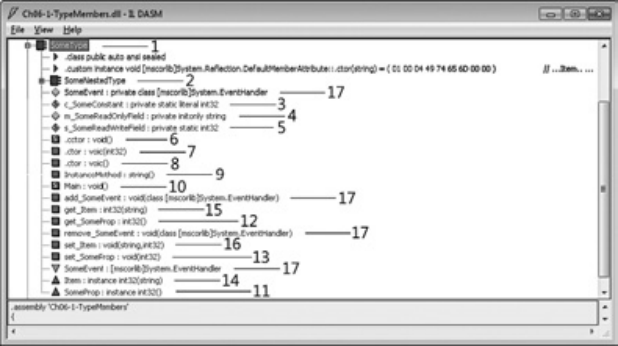


**рис. 6.1.** .Метаданные,.полученные.с.помощью.утилиты.ILDasm exe. для.приведенного.примера. 

## **Видимость типа** 

При определении типа с видимостью в рамках файла, а не другого типа его можно сделать _открытым_ ( `public` ) или _внутренним_ ( `internal` ). Открытый тип доступен любому коду любой сборки. Внутренний тип доступен только в той сборке, где он определен. По умолчанию компилятор C# делает тип внутренним (с более ограниченной видимостью). Вот несколько примеров. 

```
using System;
```

// Открытый тип доступен из любой сборки `public class ThisIsAPublicType { ... }` 

// Внутренний тип доступен только из собственной сборки `internal class ThisIsAnInternalType { ... }` 

// Это внутренний тип, так как модификатор доступа не указан явно `class ThisIsAlsoAnInternalType { ... }` 

## **дружественные сборки** 

Представьте себе следующую ситуацию: в компании есть группа _А_ , определяющая набор полезных типов в одной сборке, и группа _Б_ , использующая эти типы. По разным причинам, таким как индивидуальные графики работы, географическая разобщенность, различные источники финансирования или структуры подотчетности, эти группы не могут разместить все свои типы в единой сборке; вместо этого в каждой группе создается собственный файл сборки. 

**190** Глава.6 .Основные.сведения.о.членах.и.типах 

Чтобы сборка группы _Б_ могла использовать типы группы _А_ , группа _А_ должна определить все нужные второй группе типы как открытые. Однако это означает, что эти типы будут доступны абсолютно всем сборкам. В результате разработчики другой компании смогут написать код, использующий общедоступные типы, а это нежелательно. Вполне возможно, в полезных типах действуют определенные условия, которым должна соблюдать группа _Б_ при написании кода, использующего типы группы _А_ . То есть нам необходим способ, который бы позволил группе _А_ определить свои типы как внутренние, но в то же время предоставить группе _Б_ доступ к этим типам. Для таких ситуаций в CLR и C# предусмотрен механизм _дружественных сборок_ (friend assemblies). Кстати говоря, он пригодится еще и в ситуации со сборкой, содержащей код, который выполняет модульные тесты с внутренними типами другой сборки. 

В процессе создания сборки можно указать другие сборки, которые она будет считать «друзьями», — для этого служит атрибут `InternalsVisibleTo` , определенный в пространстве имен `System.Runtime.CompilerServices` . У атрибута есть строковый параметр, определяющий имя дружественной сборки и ее открытый ключ (передаваемая атрибуту строка не должна содержать информацию о версии, региональных стандартах или архитектуре процессора). Заметьте, что дружественные сборки получают доступ _ко всем_ внутренним типам сборки, а также к внутренним членам этих типов. Приведем пример сборки, которая объявляет дружественными две другие сборки со строгими именами `Wintellect` и `Microsoft` : 

## `using System;` 

using System.Runtime.CompilerServices; // Для атрибута InternalsVisibleTo 

// Внутренние типы этой сборки доступны из кода двух следующих сборок // (независимо от версии или региональных стандартов) [assembly:InternalsVisibleTo("Wintellect, PublicKey=12345678...90abcdef")] [assembly:InternalsVisibleTo("Microsoft, PublicKey=b77a5c56...1934e089")] 

```
internal sealed class SomeInternalType { ... }
internal sealed class AnotherInternalType { ... }
```

Обратиться из дружественной сборки к внутренним типам представленной здесь сборки очень просто. Например, дружественная сборка `Wintellect` с открытым ключом `12345678…90abcdef` может обратиться к внутреннему типу `SomeInternalType` представленной сборки следующим образом: 

```
using System;
```

```
internal sealed class Foo {
  private static Object SomeMethod() {
```

// Эта сборка Wintellect получает доступ к внутреннему типу 

// другой сборки, как если бы он был открытым `SomeInternalType sit = new SomeInternalType(); return sit; }` 

```
}
```

Доступ.к.членам.типов **191** 

Поскольку внутренние члены принадлежащих сборке типов становятся доступными для дружественных сборок, следует очень осторожно подходить к определению уровня доступа, предоставляемого членам своего типа, и объявлению дружественных сборок. Заметьте, что при компиляции дружественной (то есть не содержащей атрибута `InternalsVisibleTo` ) сборки компилятору C# требуется задавать параметр `/out:` _файл_ . Он нужен компилятору, чтобы узнать имя компилируемой сборки и определить, должна ли результирующая сборка быть дружественной. Можно подумать, что компилятор C# в состоянии самостоятельно выяснить это имя, так как он обычно самостоятельно определяет имя выходного файла; однако компилятор «узнает» имя выходного файла только после завершения компиляции. Поэтому требование указывать этот параметр позволяет значительно повысить производительность компиляции. 

Аналогично, при компиляции модуля (в противоположность сборке) с параметром `/t:module` , который должен стать частью дружественной сборки, необходимо также использовать параметр `/moduleassemblyname:` _строка_ компилятора C#. Последний параметр говорит компилятору, к какой сборке будет относиться модуль, чтобы тот разрешил коду этого модуля обращаться к внутренним типам другой сборки. 

## **доступ к членам типов** 

При определении члена типа (в том числе вложенного) можно указать модификатор доступа к члену. Модификаторы определяют, на какие члены можно ссылаться из кода. В CLR имеется собственный набор возможных модификаторов доступа, но в каждом языке программирования существуют свои синтаксис и термины. Например, термин `Assembly` в CLR указывает, что член доступен изнутри сборки, тогда как в C# для этого используется ключевое слово `internal` . 

В табл. 6.1 представлено шесть модификаторов доступа, определяющих уровень ограничения — от максимального ( `Private` ) до минимального ( `Public` ). 

**таблица 6.1.** .Модификаторы.доступа.к.членам 

|**таблица 6.1.**Модиф|икаторыдоступ|акчленам|
|---|---|---|
|**CLR**|**C#**|**Описание**|
|Private (закрытый)|private|Доступен только методам в определяющем типе<br>и вложенных в него типах|
|Family (родовой)|protected|Доступен только методам в определяющем типе<br>(и вложенных в него типах) или в одном из его<br>производных типов независимо от сборки|
|Family and<br>Assembly (родовой<br>и сборочный)|(не поддер-<br>живается)|Доступен только методам в определяющем типе<br>(и вложенных в него типах) и производных ти-<br>пах в определяющей сборке|


_продолжение_  

**192** Глава.6 .Основные.сведения.о.членах.и.типах 

**таблица 6.1** .( _продолжение_ ) 

|**таблица 6.1**(_продол_|_жение_)||
|---|---|---|
|**CLR**|**C#**|**Описание**|
|Assembly (сбороч-<br>ный)|internal|Доступен только методам в определяющей<br>сборке|
|Assembly or Family<br>(сборочный или<br>родовой)|protected<br>internal|Доступен только методам вложенного типа, про-<br>изводного типа (независимо от сборки) и лю-<br>бым методам определяющей сборки|
|Public (открытый)|public|Доступен всем методам во всех сборках|


Разумеется, для получения доступа к члену типа он должен быть определен в видимом типе. Например, если в сборке _А_ определен внутренний тип, имеющий открытый метод, то код сборки _B_ не сможет вызвать открытый метод, поскольку внутренний тип сборки _А_ недоступен из _B_ . 

В процессе компиляции кода компилятор языка проверяет корректность обращения кода к типам и членам. Обнаружив некорректную ссылку на какие-либо типы или члены, компилятор информирует об ошибке. Помимо этого, во время выполнения JIT-компилятор тоже проверяет корректность обращения к полям и методам при компиляции IL-кода в процессорные команды. Например, обнаружив код, неправильно пытающийся обратиться к закрытому полю или методу, JIT-компилятор генерирует исключение `FieldAccessException` или `MethodAccessException` соответственно. 

Верификация IL-кода гарантирует правильность обработки модификаторов доступа к членам в период выполнения, даже если компилятор языка проигнорировал проверку доступа. Другая, более вероятная возможность заключается в компиляции кода, обращающегося к открытому члену другого типа (другой сборки); если в период выполнения загрузится другая версия сборки, где модификатор доступа открытого члена заменен _защищенным_ (protected) или _закрытым_ (private), верификация обеспечит корректное управление доступом. 

Если модификатор доступа явно не указан, компилятор C# обычно (но не всегда) выберет по умолчанию закрытый — наиболее строгий из всех. CLR требует, чтобы все члены интерфейсного типа были открытыми. Компилятор C# знает об этом и запрещает программисту явно указывать модификаторы доступа к членам интерфейса, просто делая все члены открытыми. 

## **ПриМеЧание** 

Подробнее.о.правилах.применения.в.C#.модификаторов.доступа.к.типам.и.членам,. а.также.о.том,.какие.модификаторы.C#.выбирает.по.умолчанию.в.зависимости.от. контекста.объявления,.рассказывается.в.разделе.«Declared.Accessibility».спецификации.языка.C# 

Статические.классы **193** 

Более того, как видно из табл. 6.1, в CLR есть модификатор доступа _родовой и сборочный_ . Но разработчики C# сочли этот атрибут лишним и не включили в язык C#. 

Если в производном типе переопределяется член базового типа, компилятор C# требует, чтобы у членов базового и производного типов были одинаковые модификаторы доступа. То есть если член базового класса является _защищенным_ , то и член производного класса должен быть _защищенным_ . Однако это ограничение языка C#, а не CLR. При наследовании от базового класса CLR позволяет снижать, но не повышать ограничения доступа к члену. Например, _защищенный_ метод базового класса можно переопределить в производном классе в _открытый_ , но не в _закрытый_ . Дело в том, что пользователь производного класса всегда может получить доступ к методу базового класса путем приведения к базовому типу. Если бы среда CLR разрешала устанавливать более жесткие ограничения на доступ к методу в производном типе, то эти ограничения бы элементарно обходились. 

## **статические классы** 

Существуют классы, не предназначенные для создания экземпляров, например `Console` , `Math` , `Environment` и `ThreadPool` . У этих классов есть только статические методы. В сущности, такие классы существуют лишь для группировки логически связанных членов. Например, класс `Math` объединяет методы, выполняющие математические операции. В C# такие классы определяются с ключевым словом `static` . Его разрешается применять только к классам, но не к структурам (значимым типам), поскольку CLR всегда разрешает создавать экземпляры значимых типов, и нет способа обойти это ограничение. 

Компилятор налагает на статический класс ряд ограничений. 

- Класс должен быть прямым потомком `System.Object` — наследование любому другому базовому классу лишено смысла, поскольку наследование применимо только к объектам, а создать экземпляр статического класса невозможно. 

- Класс не должен реализовывать никаких интерфейсов, поскольку методы интерфейса можно вызывать только через экземпляры класса. 

- В классе можно определять только статические члены (поля, методы, свойства и события). Любые экземплярные члены вызовут ошибку компиляции. 

- Класс нельзя использовать в качестве поля, параметра метода или локальной переменной, поскольку это подразумевает существование переменной, ссылающейся на экземпляр, что запрещено. Обнаружив подобное обращение со статическим классом, компилятор вернет сообщение об ошибке. 

Приведем пример статического класса, в котором определены статические члены; сам по себе класс не представляет практического интереса. 

**194** Глава.6 .Основные.сведения.о.членах.и.типах 

```
using System;
```

```
public static class AStaticClass {
  public static void AStaticMethodQ { }
```

```
  public static String AStaticProperty {
    get { return s_AStaticField; }
    set { s_AStaticField = value; }
  }
```

```
  private static String s_AStaticField;
```

```
  public static event EventHandler AStaticEvent;
}
```

На рис. 6.2 приведен результат дизассемблирования с помощью утилиты ILDasm exe библиотечной (DLL) сборки, полученной при компиляции приведенного фрагмента кода. Как видите, определение класса с ключевым словом `static` заставляет компилятор C# сделать этот класс абстрактным ( `abstract` ) и запечатанным ( `sealed` ). Более того, компилятор не создает в классе метод конструктора экземпляров ( `.ctor` ). 


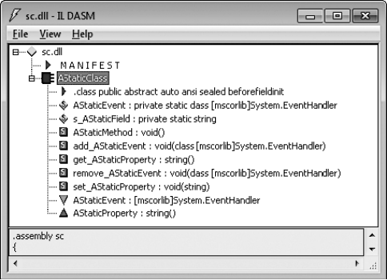


**рис. 6.2.** .Статический.класс.в.ILDasm exe 

## **Частичные классы, структуры и интерфейсы** 

Ключевое слово `partial` говорит компилятору C#, что исходный код класса, структуры или интерфейса может располагаться в нескольких файлах. Компилятор 

Частичные.классы,.структуры.и.интерфейсы **195** 

объединяет все частичные файлы класса во время компиляции; CLR всегда работает с полными определениями типов. Есть три основные причины, по которым исходный код разбивается на несколько файлов. 

- **Управление версиями.** Представьте, что определение типа содержит большой объем исходного кода. Если этот тип будут одновременно редактировать два программиста, по завершении работы им придется каким-то образом объединять свои результаты, что весьма неудобно. Ключевое слово `partial` позволяет разбить исходный код типа на несколько файлов, чтобы один и тот же тип могли одновременно редактировать несколько программистов. 

- **Разделение файла или структуры на логические модули внутри файла.** Иногда требуется создать один тип для решения разных задач. Для упрощения реализации я иногда объявляю одинаковые типы повторно внутри одного файла. Затем в каждой части такого типа я реализую по одному функциональному аспекту типа со всеми его полями, методами, свойствами, событиями и т. д. Это позволяет мне упростить наблюдение за членами, обеспечивающими единую функциональность и объединенными в группу. Я также могу легко закомментировать частичный тип с целью удаления всей функциональности из класса или замены ее другой (путем использования новой части частичного типа). 

- **Разделители кода.** При создании в Microsoft Visual Studio нового проекта Windows.Forms или Web.Forms некоторые файлы с исходным кодом создаются автоматически. Они называются шаблонными. При использовании конструкторов форм Visual Studio в процессе создания и редактирования элементов управления формы автоматически генерирует весь необходимый код и помещает его в отдельные файлы. Это значительно повышает продуктивность работы. Раньше автоматически генерируемый код попадал в тот же файл, где программист писал свой исходный код. Однако при случайном изменении сгенерированного кода конструктор форм переставал корректно работать. Начиная с Visual Studio 2005, при создании нового проекта Visual Studio создает два исходных файла: один предназначен для программиста, а в другой помещается код, создаваемый редактором форм. В результате вероятность случайного изменения генерируемого кода существенно снижается. 

Ключевое слово `partial` применяется к типам во всех файлах с определением типа. При компиляции компилятор объединяет эти файлы, и готовый тип помещается в результирующий файл сборки с расширением exe или dll (или в файл модуля с расширением netmodule). Как уже отмечалось, частичные типы реализуются только компилятором C#; поэтому все файлы с исходным кодом таких типов необходимо писать на одном языке и компилировать их вместе как единый блок компиляции. 

**196** Глава.6 .Основные.сведения.о.членах.и.типах 

## **Компоненты, полиморфизм и версии** 

Объектно-ориентированное программирование (ООП) существует уже много лет. В поздние 70-е и ранние 80-е годы объектно-ориентированные приложения были намного меньше по размеру, и весь код приложения разрабатывался в одной компании. Разумеется, в то время уже были операционные системы, позволяющие приложениям по максимуму использовать их возможности, но современные ОС предлагают намного больше функций. 

Сложность программного обеспечения существенно возросла, к тому же пользователи требуют от приложений богатых функциональных возможностей — графического интерфейса, меню, различных устройств ввода-вывода (мышь, принтер, планшет), сетевых функций и т. п. Все это привело к существенному расширению функциональности операционных систем и платформ разработки в последние годы. Более того, сейчас уже не представляется возможным или эффективным писать приложение «с нуля» и разрабатывать все необходимые компоненты самостоятельно. Современные приложения состоят из компонентов, разработанных многими компаниями. Эти компоненты объединяются в единое приложение в рамках парадигмы ООП. 

При компонентной разработке приложений (Component Software Programming, CSP) идеи ООП используются на уровне компонентов. Ниже перечислены некоторые свойства компонента. 

- Компонент (сборка в .NET) можно публиковать. 

- Компоненты уникальны и идентифицируются по имени, версии, региональным стандартам и открытому ключу. 

- Компонент сохраняет свою уникальность (код одной сборки никогда статически не связывается с другой сборкой — в .NET применяется только динамическое связывание). 

- В компоненте всегда четко указана зависимость от других компонентов (ссылочные таблицы метаданных). 

- В компоненте документированы его классы и члены. В C# даже разрешается включать в код компонента XML-документацию — для этого служит параметр `/doc` командной строки компилятора. 

- В компоненте определяются требуемые разрешения на доступ. Для этого в CLR существует механизм защиты доступа к коду (Code Access Security, CAS). 

- Опубликованный компонентом интерфейс (объектная модель) не изменяется во всех его служебных версиях. _Служебной версией_ (servicing) называют новую версию компонента, обратно совместимую с оригинальной. Обычно служебная версия содержит исправления ошибок, исправления системы безопасности 

Компоненты,.полиморфизм.и.версии **197** 

и небольшие корректировки функциональности. Однако в нее нельзя добавлять новые зависимости или разрешения безопасности. 

Как видно из последнего пункта, в компонентном программировании большое внимание уделяют управлению версиями. В компоненты вносятся изменения, к тому же они поставляются в разное время. Необходимость управления версиями существенно усложняет компонентное программирование по сравнению с ООП, где все приложение пишет, тестирует и поставляет одна компания. 

В .NET номер версии состоит из четырех частей: _основного_ (major) и _дополнительного_ (minor) номеров версии, номера _построения_ (build) и номера _редакции_ (revision). Например, у сборки с номером 1.2.3.4 основной номер версии — 1, дополнительный номер версии — 2, номер построения — 3 и номер редакции — 4. Основной и дополнительный номера обычно определяют уникальность сборки, а номера построения и редакции указывают на служебную версию. 

Допустим, компания поставила сборку версии 2.7.0.0. Если впоследствии потребуется выпустить сборку с исправленными ошибками, выпускают новую сборку, в которой изменяют только номера построения и редакции, например 2.7.1.34. То есть сборка является служебной версией и обратно совместима с оригинальной (2.7.0.0). 

В то же время, если компания выпустит новую версию сборки, в которую внесены значительные изменения, а обратная совместимость не гарантируется, нужно изменить основной и/или дополнительный номер версии (например, 3.0.0.0). 

## **ПриМеЧание** 

Я.описал.то,.как.вам.следует.относиться.к.номерам.версий .К.сожалению,.CLR.не. работает.с.номерами.версий.по.этим.правилам .Если.сборка.зависит.от.версии.1 2 3 4. другой.сборки,.CLR.будет.пытаться.загрузить.только.версию.1 2 3 4.(если.только.не. задействовать.механизм.перенаправления.связывания) 

После ознакомления с порядком присвоения номера версии новому компоненту самое время узнать о возможностях CLR и языков программирования (таких как C#), позволяющих разработчикам писать код, устойчивый к изменениям компонентов. 

Проблемы управления версиями возникают, когда тип, определенный в одном компоненте (сборке), используется в качестве базового класса для типа другого компонента (сборки). Ясно, что изменения в базовом классе могут повлиять на поведение производного класса. Эти проблемы особенно характерны для полиморфизма, когда в производном типе переопределяются виртуальные методы базового типа. 

В C# для типов и/или их членов есть пять ключевых слов, влияющих на управление версиями, причем они напрямую связаны с соответствующими возможностями CLR. В табл. 6.2 перечислены ключевые слова C#, относящиеся к управлению версиями, и описано их влияние на определение типа или члена типа. 

**198** Глава.6 .Основные.сведения.о.членах.и.типах 

**таблица 6.2.** .Ключевые.слова.C#.и.их.влияние.на.управление. версиями.компонентов 

|**Ключевое**<br>**слово C#**|**тип**|**Метод/свойство/событие**|**Константа/Поле**|
|---|---|---|---|
|abstract|Экземпляры такого<br>типа создавать нельзя|Член необходимо переопре-<br>делить и реализовать в произ-<br>водном типе — только после<br>этого можно создавать экзем-<br>пляры производного типа|(запрещено)|
|virtual|(запрещено)|Член может переопределять-<br>ся в производном типе|(запрещено)|
|override|(запрещено)|Член переопределяется в про-<br>изводном типе|(запрещено)|
|sealed|Тип нельзя исполь-<br>зовать в качестве<br>базового при насле-<br>довании|Член нельзя переопределить<br>в производном типе. Это<br>ключевое слово может при-<br>меняться только к методу,<br>переопределяющему вирту-<br>альный метод|(запрещено)|
|new|Применительно к вложенному типу, методу, свойству, событию, константе<br>или полю означает, что член никак не связан с похожим членом, который<br>может существовать в базовом класс|||


О назначении и использовании этих ключевых слов рассказывается в разделе «Работа с виртуальными методами при управлении версиями типов», но прежде необходимо рассмотреть механизм вызова виртуальных методов в CLR. 

## **Вызов виртуальных методов, свойств и событий в CLR** 

В этом разделе речь идет только о методах, но все сказанное относится и к виртуальным свойствам и событиям, поскольку они, как показано далее, на самом деле реализуются методами. 

Методы содержат код, выполняющий некоторые действия над типом (статические методы) или экземпляром типа (нестатические). У каждого метода есть имя, сигнатура и возвращаемый тип, который может быть пустым ( `void` ). У типа может быть несколько методов с одним именем, но с разным числом параметров или разными возвращаемыми значениями. Можно также определить два метода с одним и тем же именем и параметрами, но с разными типами возвращаемого значения. Однако эта «возможность» большинством языков не используется (за исключением IL) — все они требуют, чтобы методы с одинаковым именем различались параметрами, а возвращаемое значение при определении уникальности метода 

Компоненты,.полиморфизм.и.версии **199** 

игнорируется. Впрочем, благодаря операторам преобразования типов в языке C# это ограничение смягчается (см. главу 8). 

Определим класс `Employee` с тремя различными вариантами методов. 

`internal class Employee {` // Невиртуальный экземплярный метод `public Int32 GetYearsEmployed { ... }` 

// Виртуальный метод (виртуальный - значит, экземплярный) `public virtual String GetProgressReport { ... }` 

// Статический метод 

```
  public static Employee Lookup(String name) { ... }
}
```

При компиляции этого кода компилятор помещает три записи в таблицу определений методов сборки. Каждая запись содержит флаги, указывающие, является ли метод экземплярным, виртуальным или статическим. 

При компиляции кода, ссылающегося на эти методы, компилятор проверяет флаги в определении методов, чтобы выяснить, какой IL-код нужно вставить для корректного вызова методов. В CLR есть две инструкции для вызова метода: 

- Инструкция `call` используется для вызова статических, экземплярных и виртуальных методов. Если с помощью этой инструкции вызывается статический метод, необходимо указать тип, в котором определяется метод. При вызове экземплярного или виртуального метода необходимо указать переменную, ссылающуюся на объект, причем в `call` подразумевается, что эта переменная не равна `null` . Иначе говоря, сам тип переменной указывает, в каком типе определен необходимый метод. Если в типе переменной метод не определен, проверяются базовые типы. Инструкция `call` часто служит для невиртуального вызова виртуального метода. 

- Инструкция `callvirt` используется только для вызова экземплярных и виртуальных (но не статических) методов. При вызове необходимо указать переменную, ссылающуюся на объект. Если с помощью этой инструкции вызывается невиртуальный экземплярный метод, тип переменной показывает, где определен необходимый метод. При использовании `callvirt` для вызова виртуального экземплярного метода CLR определяет настоящий тип объекта, на который ссылается переменная, и вызывает метод полиморфно. При компиляции такого вызова JIT-компилятор генерирует код для проверки значения переменной — если оно равно `null` , CLR сгенерирует исключение `NullReferenceException` . Из-за этой дополнительной проверки инструкция `callvirt` выполняется немного медленнее, чем `call` . Проверка на `null` выполняется даже при вызове невиртуального экземплярного метода. 

Давайте посмотрим, как эти инструкции используются в C#. 

**200** Глава.6 .Основные.сведения.о.членах.и.типах 

`using System; public sealed class Program { public static void Main() {` Console.WriteLine(); // Вызов статического метода `Object o = new Object();` o.GetHashCode();     // Вызов виртуального экземплярного метода o.GetType();         // Вызов невиртуального экземплярного метода `} }` 

После компиляции результирующий IL-код выглядит следующим образом. 

```
.method public hidebysig static void Main() cil managed {
 .entrypoint
 // Code size 26 (0x1a)
 .maxstack 1
 .locals init (object o)
 IL_0000: call  void System.Console::WriteLine()
 IL_0005: newobj instance void System.Object::.ctor()
 IL_000a: stloc.0
 IL_000b: ldloc.0
 IL_000c: callvirt  instance int32 System.Object::GetHashCode()
 IL_0011: pop
 IL_0012: ldloc.0
 IL_0013: callvirt  instance class System.Type System.Object::GetType()
 IL_0018: pop
 IL_0019: ret
} // end of method Program::Main
```

Поскольку метод `WriteLine` является статическим, компилятор C# использует для его вызова инструкцию `call` . Для вызова виртуального метода `GetHashCode` применяется инструкция `callvirt` . Наконец, метод `GetType` также вызывается с помощью инструкции `callvirt` . Это выглядит странно, поскольку метод `GetType` невиртуальный. Тем не менее код работает, потому что во время JIT-компиляции CLR знает, что `GetType` — это невиртуальный метод, и вызывает его невиртуально. 

Разумеется, возникает вопрос: почему компилятор C# не использует инструкцию `call` ? Разработчики C# решили, что JIT-компилятор должен генерировать код, который проверяет, не равен ли `null` вызывающий объект. Поэтому вызовы невиртуальных экземплярных методов выполняются чуть медленнее, чем могли бы – а также то, что следующий код в C# вызовет исключение `NullReferenceException` , хотя в некоторых языках все работает отлично. 

`using System; public sealed class Program { public Int32 GetFive() { return 5; } public static void Main() { Program p = null;` Int32 x = p.GetFive(); // В C# выдается NullReferenceException `} }` 

Компоненты,.полиморфизм.и.версии **201** 

Теоретически с этим кодом все в порядке. Хотя переменная `p` равна `null` , для вызова невиртуального метода `GetFive` среде CLR необходимо узнать только тип `p` , а это `Program` . При вызове `GetFive` аргумент `this` равен `null` , но в методе `GetFive` он не используется, поэтому исключения нет. Однако компилятор C# вместо инструкции `call` вставляет `callvirt` , поэтому выполнение кода приведет к выдаче исключения `NullReferenceException` . 

## **ВниМание** 

Если.метод.определен.как.невиртуальный,.не.рекомендуется.в.дальнейшем.делать.его. виртуальным .Причина.в.том,.что.некоторые.компиляторы.для.вызова.невиртуального. метода.используют.инструкцию.call.вместо.callvirt .Если.метод.сделать.виртуальным. и.не.перекомпилировать.ссылающийся.на.него.код,.виртуальный.метод.будет.вызван. невиртуально,.в.результате.приложение.может.повести.себя.непредсказуемо .Если. код,.содержащий.вызов,.написан.на.C#,.все.пройдет.нормально,.поскольку.в.C#. все.экземплярные.методы.вызываются.с.помощью.инструкции.callvirt .Но.если.код. написан.на.другом.языке,.возможны.проблемы 

Иногда компилятор вместо `callvirt` использует для вызова виртуального метода команду `call` . Такое поведение выглядит странно, но следующий пример показывает, почему это действительно бывает необходимо. 

## `internal class SomeClass {` 

// ToString - виртуальный метод базового класса Object `public override String ToString() {` 

// Компилятор использует команду call для невиртуального вызова 

// метода ToString класса Object 

// Если бы компилятор вместо call использовал callvirt, этот 

// метод продолжал бы рекурсивно вызывать сам себя до переполнения стека `return base.ToString();` 

```
  }
```

## `}` 

При вызове виртуального метода `base.ToString` компилятор C# вставляет команду `call` , чтобы метод `ToString` базового типа вызывался невиртуально. Это необходимо, ведь если `ToString` вызвать виртуально, вызов будет выполняться рекурсивно до переполнения стека потока — что, разумеется, нежелательно. 

Компиляторы стремятся использовать команду `call` при вызове методов, определенных значимыми типами, поскольку они запечатаны. В этом случае полиморфизм невозможен даже для виртуальных методов, и вызов выполняется быстрее. Кроме того, сама природа экземпляра значимого типа гарантирует, что он никогда не будет равен `null` , поэтому исключение `NullReferenceException` не возникнет. Наконец, для виртуального вызова виртуального метода значимого типа CLR необходимо получить ссылку на объект значимого типа, чтобы воспользоваться его таблицей методов, а это требует упаковки значимого типа. Упаковка повышает нагрузку на кучу, увеличивая частоту сборки мусора и снижая производительность. 

**202** Глава.6 .Основные.сведения.о.членах.и.типах 

Независимо от используемой для вызова экземплярного или виртуального метода инструкции — `call` или `callvirt` — эти методы всегда в первом параметре получают скрытый аргумент `this` , ссылающийся на объект, с которым производятся действия. 

При проектировании типа следует стремиться свести к минимуму количество виртуальных методов. Во-первых, виртуальный метод вызывается медленнее невиртуального. Во-вторых, JIT-компилятор не может подставлять (inline) виртуальные методы, что также ухудшает производительность. В-третьих, как показано далее, виртуальные методы затрудняют управление версиями компонентов. В-четвертых, при определении базового типа часто создается набор перегруженных методов. Чтобы сделать их полиморфными, лучше всего сделать наиболее сложный метод виртуальным, оставив другие методы невиртуальными. Кстати, соблюдение этого правила поможет управлять версиями компонентов, не нарушая работу производных типов. Приведем пример: 

```
public class Set {
  private Int32 m_length = 0;
```

// Этот перегруженный метод — невиртуальный `public Int32 Find(Object value) {` return Find(value, 0, m_length); `}` 

// Этот перегруженный метод — невиртуальный public Int32 Find(Object value, Int32 startIndex) { return Find(value, startIndex, m_length  startIndex); `}` 

// Наиболее функциональный метод сделан виртуальным // и может быть переопределен public virtual Int32 Find(Object value, Int32 startIndex, Int32 endIndex) { // Здесь находится настоящая реализация, которую можно переопределить... `}` 

// Другие методы `}` 

## **разумное использование видимости типов и модификаторов доступа к членам** 

В .NET Framework приложения состоят из типов, определенных в многочисленных сборках, созданных различными компаниями. Это означает практически полное отсутствие контроля над используемыми компонентами и типами. Разработчику обычно недоступен исходный код компонентов (он может даже не знать, на каком языке они написаны), к тому же версии компонентов обновляются в разное время. Более того, из-за полиморфизма и наличия защищенных членов разработчик базового класса должен доверять коду разработчика производного класса. В свою очередь, разработчик производного класса должен доверять коду, наследуемому от 

Компоненты,.полиморфизм.и.версии **203** 

базового класса. Это лишь часть ограничений, с которыми приходится сталкиваться при разработке компонентов и типов. 

В этом разделе я расскажу о том, как проектировать типы с учетом этих факторов. А если говорить конкретно, речь пойдет о том, как правильно задавать видимость типов и модификаторы доступа к членам. 

В первую очередь при определении нового типа компиляторам следовало бы по умолчанию делать его запечатанным. Вместо этого большинство компиляторов (в том числе C#) поступают как раз наоборот, считая, что программист при необходимости сам может запечатать класс с помощью ключевого слова `sealed` . Было бы неплохо, если бы неправильное, на мой взгляд, поведение, предлагаемое по умолчанию, в следующих версиях компиляторов изменилось. Есть три веские причины в пользу использования запечатанных классов. 

- **Управление версиями.** Если класс изначально запечатан, его впоследствии можно сделать незапечатанным, не нарушая совместимости. Однако обратное невозможно, поскольку это нарушило бы работу всех производных классов. Кроме того, если в незапечатанном классе определены незапечатанные виртуальные методы, необходимо сохранять порядок вызова виртуальных методов в новых версиях, иначе в будущем возникнут проблемы с производными типами. 

- **Производительность.** Как уже отмечалось, невиртуальные методы вызываются быстрее виртуальных, поскольку для последних CLR во время выполнения проверяет тип объекта, чтобы выяснить, где находится метод. Однако, встретив вызов виртуального метода в запечатанном типе, JIT-компилятор может сгенерировать более эффективный код, задействовав невиртуальный вызов. Это возможно потому, что у запечатанного класса не может быть производных классов. Например, в следующем коде JIT-компилятор может вызвать виртуальный метод `ToString` невиртуально: 

`using System; public sealed class Point {` private Int32 m_x, m_y; 

public Point(Int32 x, Int32 y) { m_x = x; m_y = y; } 

`public override String ToStringO {` return String.Format("({0}, {1})", m_x, m_y); `}` 

`public static void Main() {` Point p = new Point(3, 4); 

// Компилятор C# вставит здесь инструкцию callvirt, 

- // но JIT-компилятор оптимизирует этот вызов и сгенерирует код 

- // для невиртуального вызова ToString, 

- // поскольку p имеет тип Point, являющийся запечатанным `Console.WriteLine(p.ToString());` 

- `}` 

- `}` 

**204** Глава.6 .Основные.сведения.о.членах.и.типах 

- **Безопасность и предсказуемость.** Состояние класса должно быть надежно защищено. Если класс не запечатан, производный класс может изменить его состояние, воспользовавшись незащищенными полями или методами базового класса, изменяющими его доступные незакрытые поля. Кроме того, в производном классе можно переопределить виртуальные методы и не вызывать реализацию соответствующих методов базового класса. Назначая метод, свойство и событие виртуальным, базовый класс уступает некоторую степень контроля над его поведением и состоянием производному классу, что при неумелом обращении может вызвать непредсказуемое поведение и проблемы с безопасностью. 

Беда в том, что запечатанные классы могут создать изрядные неудобства для пользователей типа. Разработчику приложения может понадобиться производный тип, в котором будут добавлены дополнительные поля или другая информация о состоянии. Они даже могут попытаться добавить в производном типе дополнительные методы для работы с этими полями. Хотя CLR не предоставляет механизма расширения уже построенных типов вспомогательными методами или полями, вспомогательные методы можно имитировать при помощи методов расширения C# (см. главу 8), а для расширения состояния объекта может использоваться класс `ConditionalWeakTable` (см. главу 21). 

Вот несколько правил, которым я следую при проектировании классов: 

- Если класс не предназначен для наследования, я всегда явно объявляю его запечатанным. Как уже отмечалось, C# и многие современные компиляторы поступают иначе. Если нет необходимости в предоставлении другим сборкам доступа к классу, он объявляется внутренним. К счастью, именно так ведет себя по умолчанию компилятор C#. Если я хочу определить класс, предназначенный для создания производных классов, одновременно запретив его специализацию, я должен переопределить и запечатать все виртуальные методы, которые наследует мой класс. 

- Все поля данных класса всегда объявляются закрытыми, и в этом я никогда не уступлю. К счастью, по умолчанию C# поступает именно так. Вообще говоря, я бы предпочел, чтобы в C# остались только закрытые поля, а объявлять их со спецификаторами `protected` , `internal` , `public` и т. д. было бы запрещено. Доступ к состоянию объекта — верный путь к непредсказуемому поведению и проблемам с безопасностью. При объявлении полей внутренними ( `internal` ) также могут возникнуть проблемы, поскольку даже внутри одной сборки очень трудно отследить все обращения к полям, особенно когда над ней работает несколько разработчиков. 

- Методы, свойства и события класса я всегда объявляю закрытыми и невиртуальными. К счастью, C# по умолчанию делает именно так. Разумеется, чтобы типом можно было воспользоваться, некоторые методы, свойства и события должны быть открытыми, но лучше не делать их защищенными или внутренними, поскольку это может сделать тип уязвимым. Впрочем, защищенный или 

**205** 

Компоненты,.полиморфизм.и.версии 

внутренний член все-таки лучше виртуального, поскольку последний предоставляет производному классу большие возможности и всецело зависит от корректности его поведения. 

- В ООП есть проверенный временем принцип: «лучший метод борьбы со сложностью — добавление новых типов». Если реализация алгоритма чрезмерно усложняется, следует определить вспомогательные типы, инкапсулирующие часть функциональности. Если вспомогательные типы используются в единственном супертипе, следует сделать их вложенными. Это позволит ссылаться на них через супертип и позволит им обращаться к защищенным членам супертипа. Однако существует правило проектирования, примененное в утилите FxCopCmd exe.Visual Studio и рекомендующее определять общедоступные вложенные типы в области видимости файла или сборки (за пределами супертипа), поскольку некоторые разработчики считают синтаксис обращения к вложенным типам громоздким. Я соблюдаю это правило, и никогда не определяю открытые вложенные типы. 

## **работа с виртуальными методами при управлении версиями типов** 

Как уже отмечалось, управление версиями — важный аспект компонентного программирования. Некоторых проблем я коснулся в главе 3 (там речь шла о сборках со строгими именами и обсуждались меры, позволяющие администраторам гарантировать привязку приложения именно к тем сборкам, с которыми оно было построено и протестировано). Однако при управлении версиями возникают и другие сложности с совместимостью на уровне исходного кода. В частности, следует быть очень осторожными при добавлении и изменении членов базового типа. Рассмотрим несколько примеров. 

Пусть разработчиками компании CompanyА спроектирован тип `Phone` : 

```
namespace CompanyA {
  public class Phone {
    public void Dial() {
      Console.WriteLine("Phone.Dial");
```

// Выполнить действия по набору телефонного номера `} } }` 

А теперь представьте, что в компании `CompanyB` спроектировали другой тип, `BetterPhone` , использующий тип `Phone` в качестве базового: 

## `namespace CompanyB {` 

```
  public class BetterPhone : CompanyA.Phone {
    public void Dial() {
      Console.WriteLine("BetterPhone.Dial");
      EstablishConnection();
```

_продолжение_  

**206** Глава.6 .Основные.сведения.о.членах.и.типах 

`base.Dial(); } protected virtual void EstablishConnection() { Console.WriteLine("BetterPhone.EstablishConnection");` // Выполнить действия по набору телефонного номера `} } }` 

При попытке скомпилировать свой код разработчики компании `CompanyB` получают от компилятора C# предупреждение: 

warning CS0108: 'CompanyB.BetterPhone.Dial()' hides inherited member 'CompanyA.Phone.Dial()'. Use the new keyword if hiding `was intended.` 

Смысл в том, что метод `Dial` , определяемый в типе `BetterPhone` , скроет одноименный метод в `Phone` . В новой версии метода `Dial` его семантика может стать совсем иной, нежели та, что определена программистами компании CompanyА в исходной версии метода. 

Предупреждение о таких потенциальных семантических несоответствиях — очень полезная функция компилятора. Компилятор также подсказывает, как избавиться от этого предупреждения: нужно поставить ключевое слово `new` перед определением метода `Dial` в классе `BetterPhone` . Вот как выглядит исправленный класс `BetterPhone` : 

`namespace CompanyB { public class BetterPhone : CompanyA.Phone {` // Этот метод Dial никак не связан с одноименным методом класса Phone `public new void Dial() { Console.WriteLine("BetterPhone.Dial"); EstablishConnection(); base.Dial(); } protected virtual void EstablishConnection() { Console.WriteLine("BetterPhone.EstablishConnection");` // Выполнить действия по установлению соединения `} } }` 

Теперь компания `CompanyB` может использовать в своем приложении тип `BetterPhone` следующим образом: 

```
public sealed class Program {
  public static void Main() {
    CompanyB.BetterPhone phone = new CompanyB.BetterPhone();
    phone.Dial();
  }
}
```

**207** 

Компоненты,.полиморфизм.и.версии 

При выполнении этого кода выводится следующая информация: 

```
BetterPhone.Dial
BetterPhone.EstablishConnection
Phone.Dial
```

Результат свидетельствует о том, что код выполняет именно те действия, которые нужны компании `CompanyB` . При вызове `Dial` вызывается новая версия этого метода, определенная в типе `BetterPhone` . Она сначала вызывает виртуальный метод `EstablishConnection` , а затем — исходную версию метода `Dial` из базового типа `Phone` . 

А теперь представим, что несколько компаний решили использовать тип `Phone` , созданный в компании CompanyА . Допустим также, что все они сочли полезным установление соединения в самом методе `Dial` . Эти отзывы заставили разработчиков компании CompanyА усовершенствовать класс `Phone` : 

`namespace CompanyA { public class Phone { public void Dial() { Console.WriteLine("Phone.Dial"); EstablishConnection();` // Выполнить действия по набору телефонного номера `}` 

`protected virtual void EstablishConnection() { Console.WriteLine("Phone.EstablishConnection");` // Выполнить действия по установлению соединения `} } }` 

В результате теперь разработчики компании `CompanyB` при компиляции своего типа `BetterPhone` (производного от новой версии `Phone` ) получают следующее предупреждение: 

warning CS0114: 'BetterPhone.EstablishConnection()' hi `des inherited member` 'Phone.EstablishConnection()'. To make the current member override that implementation, add the override keyword. Otherwise, `add the new keyword` 

В нем говорится о том, что 'BetterPhone. EstablishConnection()' скрывает унаследованный член 'Phone.EstablishConnection()' , и чтобы текущий член переопределил реализацию, нужно вставить ключевое слово `override` ; в противном случае нужно вставить ключевое слово `new` . 

То есть компилятор предупреждает, что как `Phone` , так и `BetterPhone` предлагают метод `EstablishConnection` , семантика которого может отличаться в разных классах. В этом случае простая перекомпиляция `BetterPhone` больше не может гарантировать, что новая версия метода будет работать так же, как прежняя, определенная в типе `Phone` . 

**208** Глава.6 .Основные.сведения.о.членах.и.типах 

Если в компании `CompanyB` решат, что семантика метода `EstablishConnection` в этих двух типах отличается, компилятору будет указано, что «правильными» являются методы `Dial` и `EstablishConnection` , определенные в `BetterPhone` , и они не связаны с одноименными методами из базового типа `Phone` . Для этого разработчики компании `CompanyB` добавляют ключевое слово `new` в определение `EstablishConnection` : 

```
namespace CompanyB {
  public class BetterPhone : CompanyA.Phone {
```

// Ключевое слово 'new' оставлено, чтобы указать, // что этот метод не связан с методом Dial базового типа `public new void Dial() { Console.WriteLine("BetterPhone.Dial"); EstablishConnection(); base.Dial(); }` 

// Ключевое слово 'new' указывает, что этот метод // не связан с методом EstablishConnection базового типа `protected new virtual void EstablishConnection() { Console.WriteLine("BetterPhone.EstablishConnection");` // Выполнить действия для установления соединения `} } }` 

Здесь ключевое слово `new` заставляет компилятор сгенерировать метаданные, информирующие CLR, что определенные в `BetterPhone` методы `Dial` и `EstablishConnection` следует рассматривать как новые функции, введенные в этом типе. При этом CLR будет известно, что одноименные методы типов `Phone` и `BetterPhone` никак не связаны. 

При выполнении того же приложения (метода `Main` ) выводится информация: 

```
BetterPhone.Dial
BetterPhone.EstablishConnection
Phone.Dial
Phone.EstablishConnection
```

Отсюда видно, что, когда `Main` обращается к методу `Dial` , вызывается версия, определенная в `BetterPhone` . Далее `Dial` вызывает виртуальный метод `EstablishConnection` , также определенный в `BetterPhone` . Когда метод `EstablishConnection` типа `BetterPhone` возвращает управление, вызывается метод `Dial` типа `Phone` , вызывающий метод `EstablishConnection` этого типа. Но поскольку метод `EstablishConnection` в типе `BetterPhone` помечен ключевым словом `new` , вызов этого метода не считается переопределением виртуального метода `EstablishConnection` , исходно определенного в типе `Phone` . В результате метод `Dial` типа `Phone` вызывает метод `EstablishConnection` , определенный в типе `Phone` , что и требовалось от программы. 

Компоненты,.полиморфизм.и.версии **209** 

## **ПриМеЧание** 

Если.бы.компилятор.по.умолчанию.считал.методы.переопределениями.(как.С++),. разработчики.типа.BetterPhone.не.смогли.бы.использовать.в.нем.имена.методов.Dial. и.EstablishConnection .Вероятно,.при.изменении.имен.этих.методов.негативный.эффект.затронет.всю.кодовую.базу,.нарушая.совместимость.на.уровне.исходного.текста. и.двоичного.кода .Обычно.такого.рода.изменения.с.далеко.идущими.последствиями. нежелательны,.особенно.в.средних.и.крупных.проектах .Однако.если.изменение.имени. метода.коснется.лишь.необходимости.обновления.исходного.текста,.следует.пойти. на.это,.чтобы.одинаковые.имена.методов.Dial.и.EstablishConnection,.обладающие. разной.семантикой.в.разных.типах,.не.вводили.в.заблуждение.других.разработчиков 

Альтернативное решение: `CompanyB` , получив от CompanyА новую версию типа `Phone` , решает, что текущая семантика методов `Dial` и `EstablishConnection` типа `Phone` — это именно то, что нужно. В этом случае в `CompanyB` полностью удаляют метод `Dial` из типа `BetterPhone` . Поскольку теперь разработчикам `CompanyB` нужно указать компилятору, что метод `EstablishConnection` типа `BetterPhone` связан с одноименным методом типа `Phone` , нужно удалить из его определения ключевое слово `new` . Удаления ключевого слова недостаточно, так как компилятор не поймет предназначения метода `EstablishConnection` типа `BetterPhone` . Чтобы выразить намерения явно, разработчик из `CompanyB` должен изменить модификатор определенного в типе `BetterPhone` метода `EstablishConnection` с `virtual` на `override` . Код новой версии `BetterPhone` выглядит так: 

## `namespace CompanyB {` 

```
  public class BetterPhone : CompanyA.Phone {
```

// Метод Dial удален (так как он наследуется от базового типа) 

- // Здесь ключевое слово new удалено, а модификатор virtual заменен 

- // на override, чтобы указать, что этот метод связан с методом 

- // EstablishConnection из базового типа 

```
    protected override void EstablishConnection() {
```

```
      Console.WriteLine("BetterPhone.EstablishConnection");
```

// Выполнить действия по установлению соединения 

```
    }
  }
}
```

Теперь то же приложение (метод `Main` ) выводит следующий результат: 

## `Phone.Dial` 

```
BetterPhone.EstablishConnection
```

Видно, что когда `Main` вызывает метод `Dial` , вызывается версия этого метода, определенная в типе `Phone` и унаследованная от него типом `BetterPhone` . Далее, когда метод `Dial` , определенный в типе `Phone` , вызывает виртуальный метод `EstablishConnection` , вызывается одноименный метод типа `BetterPhone` , так как он переопределяет виртуальный метод `EstablishConnection` , определяемый типом `Phone` . 

## **Глава 7. Константы и поля** 

В этой главе показано, как добавить к типу члены, содержащие данные. В частности, мы рассмотрим константы и поля. 

## **Константы** 

_Константа_ (constant) — это идентификатор, значение которого никогда не меняется. Значение, связанное с именем константы, должно определяться во время компиляции. Затем компилятор сохраняет значение константы в метаданных модуля. Это значит, что константы можно определять только для таких типов, которые компилятор считает примитивными. В C# следующие типы считаются примитивными и могут использоваться для определения констант: `Boolean` , `Char` , `Byte` , `SByte` , `Int16` , `UInt16` , `Int32` , `UInt32` , `Int64` , `UInt64` , `Single` , `Double` , `Decimal` и `String` . Тем не менее C# позволяет определить константную переменную, не относящуюся к элементарному типу, если присвоить ей значение `null` : 

```
using System;
```

```
public sealed class SomeType {
```

// Некоторые типы не являются элементарными, но С# допускает существование // константных переменных этих типов после присваивания значения null `public const SomeType Empty = null;` 

```
}
```

Так как значение констант никогда не меняется, константы всегда считаются частью типа. Иначе говоря, константы считаются статическими, а не экземплярными членами. Определение константы приводит в конечном итоге к созданию метаданных. 

Встретив в исходном тексте имя константы, компилятор просматривает метаданные модуля, в котором она определена, извлекает значение константы и внедряет его в генерируемый им IL-код. Поскольку значение константы внедряется прямо в код, в период выполнения память для констант не выделяется. Кроме того, нельзя получать адрес константы и передавать ее по ссылке. Эти ограничения также означают, что изменять значения константы в разных версиях модуля нельзя, поэтому константу надо использовать, только когда точно известно, что ее значение никогда не изменится (хороший пример — определение константы `MaxInt16` со значением 32767). Поясню на примере, что я имею в виду. Возьмем код и скомпилируем его в DLL-сборку: 

Константы **211** 

```
using System;
```

`public sealed class SomeLibraryType {` // ПРИМЕЧАНИЕ: C# не позволяет использовать для констант модификатор 

// static, поскольку всегда подразумевается, что константы являются // статическими `public const Int32 MaxEntriesInList = 50; }` 

Затем построим сборку приложения из следующего кода: 

```
using System;
```

```
public sealed class Program {
  public static void Main() {
    Console.WriteLine("Max entries supported in list: "
       + SomeLibraryType.MaxEntriesInList);
  }
}
```

Нетрудно заметить, что код приложения содержит ссылку на константу `MaxEntriesInList` . При компоновке этого кода компилятор, обнаружив, что `MaxEntriesInList` — это литерал константы со значением 50, внедрит значение 50 типа `Int32` прямо в IL-код приложения. Фактически после построения кода приложения DLL-сборка даже не будет загружаться в период выполнения, поэтому ее можно просто удалить с диска. 

```
.method public hidebysig static void Main() cil managed
{
  .entrypoint
  // Code size 25 (0x19)
```

`.maxstack 8 IL_0000: nop IL_0001: ldstr "Max entries supported in list: " IL_0006: ldc.i4.s 50 IL_0008: box [mscorlib]System.Int32` IL_000d: call string [mscorlib]System.String::Concat(object, object) `IL_0012: call void [mscorlib]System.Console::WriteLine(string) IL_0017: nop IL_0018: ret` } // Закрываем метод Program::Main 

Теперь проблема управления версиями при использовании констант должна стать очевидной. Если разработчик изменит значение константы `MaxEntriesInList` на 1000 и перестроит только DLL-сборку, это не повлияет на код самого приложения. Для того чтобы в приложении использовалось новое значение константы, его тоже необходимо перекомпилировать. Нельзя применять константы во время выполнения (а не во время компиляции), если модуль должен задействовать значение, определенное в другом модуле. В этом случае вместо констант следует использовать предназначенные только для чтения поля, о которых речь идет в следующем разделе. 

**212** Глава.7 .Константы.и.поля 

## **Поля** 

_Поле_ (field) — это член данных, который хранит экземпляр значимого типа или ссылку на ссылочный тип. В табл. 7.1 приведены модификаторы, применяемые по отношению к полям. 

**таблица 7.1.** .Модификаторы.полей 

|**таблица 7.1.**|Модификато|рыполей|
|---|---|---|
|**термин CLR**|**термин C#**|**Описание**|
|Static|static|Поле является частью состояния типа, а не объекта|
|Instance|(по умол-<br>чанию)|Поле связано с экземпляром типа, а не самим типом|
|InitOnly|readonly|Запись в поле разрешается только из кода конструктора|
|Volatile|volatile|Код, обращающийся к полю, не должен оптимизироваться<br>компилятором, CLR или оборудованием с целью обеспе-<br>чения безопасности потоков. Неустойчивыми (volatile)<br>могут объявляться только следующие типы: все ссылоч-<br>ные типы, Single, Boolean, Byte, SByte, Int16, UInt16,<br>Int32, UInt32, Char, а также все перечислимые типы,<br>основанные на типе Byte, SByte, Int16, UInt16, Int32 или<br>UInt32. Неустойчивые поля рассматриваются в главе 2|


Как видно из таблицы, общеязыковая среда (CLR) поддерживает поля как типов (статические), так и экземпляров (нестатические). Динамическая память для хранения поля типа выделяется в пределах объекта типа, который создается при загрузке типа в домен приложений (см. главу 22), что обычно происходит при JIT-компиляции любого метода, ссылающегося на этот тип. Динамическая память для хранения экземплярных полей выделяется при создании экземпляра данного типа. 

Поскольку поля хранятся в динамической памяти, их значения можно получить лишь в период выполнения. Поля также решают проблему управления версиями, возникающую при использовании констант. Кроме того, полю можно назначить любой тип данных, поэтому при определении полей можно не ограничиваться встроенными элементарными типами компилятора (что приходится делать при определении констант). 

CLR поддерживает поля, предназначенные для чтения и записи (изменяемые), а также поля, предназначенные только для чтения (неизменяемые). Большинство полей изменяемые. Это значит, что во время исполнения кода значение таких полей может многократно меняться. Данные же в неизменяемые поля можно записывать только при исполнении конструктора (который вызывается лишь раз — при создании объекта). Компилятор и механизм верификации гарантируют, что ни один 

Поля **213** 

метод, кроме конструктора, не сможет записать данные в поле, предназначенное только для чтения. Замечу, что для изменения такого поля можно задействовать отражение. 

Попробуем решить проблему управления версиями в примере из раздела «Константы», используя статические неизменяемые поля. Вот новая версия кода DLL-сборки: 

```
using System;
```

```
public sealed class SomeLibraryType {
```

// Модификатор static необходим, чтобы поле 

// ассоциировалось с типом, а не экземпляром `public static readonly Int32 MaxEntriesInList = 50; }` 

Это единственное изменение, которое придется внести в исходный текст, при этом код приложения можно вовсе не менять, но чтобы увидеть его новые свойства, его придется перекомпилировать. Теперь при исполнении метода `Main` этого приложения CLR загружает DLL-сборку (так как она требуется во время выполнения) и извлекает значение поля `MaxEntriesInList` из динамической памяти, выделенной для его хранения. Естественно, это значение равно 50. 

Допустим, разработчик сборки изменил значение поля с 50 на 1000 и скомпоновал сборку заново. При повторном исполнении код приложения автоматически задействует новое значение — 1000. В этом случае не обязательно компоновать код приложения заново, оно просто работает в том виде, в котором было (хотя и чуть медленнее). Однако этот сценарий предполагает, что у новой сборки нет строгого имени, а политика управления версиями приложения заставляет CLR загружать именно эту новую версию сборки. 

В следующем примере показано, как определять изменяемые статические поля, а также изменяемые и неизменяемые экземплярные поля: 

```
public sealed class SomeType {
```

// Статическое неизменяемое поле. Его значение рассчитывается 

// и сохраняется в памяти при инициализации класса во время выполнения `public static readonly Random s_random = new Random();` 

// Статическое изменяемое поле `private static Int32 s_numberOfWrites = 0;` 

// Неизменяемое экземплярное поле `public readonly String Pathname = "Untitled";` 

// Изменяемое экземплярное поле `private System.IO.FileStream m_fs;` 

```
  public SomeType(String pathname) {
```

// Эта строка изменяет значение неизменяемого поля 

// В данном случае это возможно, так как показанный далее код 

// расположен в конструкторе 

_продолжение_  

**214** Глава.7 .Константы.и.поля 

```
    this.Pathname = pathname;
  }
```

```
  public String DoSomething() {
```

// Эта строка читает и записывает значение статического изменяемого поля `s_numberOfWrites = s_numberOfWrites + 1;` 

// Эта строка читает значение неизменяемого экземплярного поля `return Pathname; } }` 

Многие поля в нашем примере инициализируются на месте (inline). C# позволяет использовать этот удобный синтаксис для инициализации констант, а также изменяемых и неизменяемых полей. Как продемонстрировано в главе 8, C# рассматривает инициализацию поля на месте как синтаксис сокращенной записи, позволяющий инициализировать поле во время исполнения конструктора. Вместе с тем, в C# возможны проблемы производительности, которые нужно учитывать при использовании синтаксиса инициализации поля на месте, а не присвоения в конструкторе. Они также обсуждаются в главе 8. 

## **ВниМание** 

Неизменность.поля.ссылочного.типа.означает.неизменность.ссылки,.которую.этот. тип.содержит,.а.вовсе.не.объекта,.на.которую.указывает.ссылка,.например: 

public sealed class АТуре { // InvalidChars всегда ссылается на один объект массива public static readonly Char[] InvalidChars = new Char[] { 'А', 'В', 'C'}; `} public sealed class AnotherType { public static void M() {` // Следующие строки кода вполне корректны, компилируются // и успешно изменяют символы в массиве InvalidChars АТуре.InvalidChars[0] = 'X'; АТуре.InvalidChars[1] = 'Y'; АТуре.InvalidChars[2] = 'Z'; // Следующая строка некорректна и не скомпилируется, // так как ссылка InvalidChars изменяться не может АТуре.InvalidChars = new Char[] { 'X', 'Y', 'Z' }; `} }` 

## **Глава 8. Методы** 

В этой главе обсуждаются разновидности методов, которые могут определяться в типе, и разбирается ряд вопросов, касающихся методов. В частности, показано, как определяются методы-конструкторы (создающие экземпляры типов и сами типы), методы перегрузки операторов и методы преобразования (выполняющие явное и неявное приведение типов). Также речь пойдет о методах расширения, позволяющих добавлять собственные методы к уже существующим типам, и частичных методах, позволяющих разделить реализацию типа на несколько частей. 

## **Конструкторы экземпляров и классы (ссылочные типы)** 

Конструкторы — это специальные методы, позволяющие корректно инициализировать новый экземпляр типа. В таблице определений, входящих в метаданные, методы-конструкторы всегда отмечают сочетанием `.ctor` (от _constructor_ ). При создании экземпляра объекта ссылочного типа выделяется память для полей данных экземпляра и инициализируются служебные поля (указатель на объект-тип и индекс блока синхронизации), после чего вызывается конструктор экземпляра, устанавливающий исходное состояние нового объекта. 

При конструировании объекта ссылочного типа выделяемая для него память всегда обнуляется до вызова конструктора экземпляра типа. Любые поля, не задаваемые конструктором явно, гарантированно содержат 0 или `null` . 

В отличие от других методов конструкторы экземпляров не наследуются. Иначе говоря, у класса есть только те конструкторы экземпляров, которые определены в этом классе. Невозможность наследования означает, что к конструктору экземпляров нельзя применять модификаторы `virtual` , `new` , `override` , `sealed` и `abstract` . Если определить класс без явно заданных конструкторов, многие компиляторы (в том числе компилятор C#) создадут конструктор по умолчанию (без параметров), реализация которого просто вызывает конструктор без параметров базового класса. 

Например, рассмотрим следующее определение класса: 

```
public class SomeType { }
```

Это определение идентично определению: 

```
public class SomeType {
  public SomeType() : base() { }
}
```

**216** Глава.8 .Методы 

Для абстрактных классов компилятор создает конструктор по умолчанию с модификатором `protected` , в противном случае область действия будет открытой ( `public` ). Если в базовом классе нет конструктора без параметров, производный класс должен явно вызвать конструктор базового класса, иначе компилятор вернет ошибку. Для статических классов (запечатанных и абстрактных) компилятор не создает конструктор по умолчанию. 

В типе может определяться несколько конструкторов, при этом сигнатуры и уровни доступа к конструкторам обязательно должны отличаться. В случае верифицируемого кода конструктор экземпляров должен вызывать конструктор базового класса до обращения к какому-либо из унаследованных от него полей. Многие компиляторы, включая C#, генерируют вызов конструктора базового класса автоматически, поэтому вам, как правило, об этом можно не беспокоиться. В конечном счете всегда вызывается открытый конструктор объекта `System.Object` без параметров. Этот конструктор ничего не делает — просто возвращает управление по той простой причине, что в `System.Object` не определено никаких экземплярных полей данных, поэтому конструктору просто нечего делать. 

В редких ситуациях экземпляр типа может создаваться без вызова конструктора экземпляров. В частности, метод `MemberwiseClone` объекта `Object` выделяет память, инициализирует служебные поля объекта, а затем копирует байты исходного объекта в область памяти, выделенную для нового объекта. Кроме того, конструктор обычно не вызывается при десериализации объекта. Код десериализации выделяет память для объекта без вызова конструктора, используя метод `GetUninitializedObject` или `GetSafeUninitializedObject` типа `System.Runtime. Serialization.FormatterServices` (см. главу 24). 

## **ВниМание** 

Нельзя.вызывать.какие-либо.виртуальные.методы.конструктора,.которые.могут. повлиять.на.создаваемый.объект .Причина.проста:.если.вызываемый.виртуальный. метод.переопределен.в.типе,.экземпляр.которого.создается,.происходит.реализация.производного.типа,.но.к.этому.моменту.еще.не.завершилась.инициализация. всех.полей.в.иерархии .В.таких.обстоятельствах.последствия.вызова.виртуального. метода.непредсказуемы 

C# предлагает простой синтаксис, позволяющий инициализировать поля во время создания объекта ссылочного типа: 

```
internal sealed class SomeType {
  private Int32 m_x = 5;
}
```

При создании объекта `SomeType` его поле `m_x` инициализируется значением 5. Вы можете спросить: как это происходит? Изучив IL-код метода-конструктора этого объекта (этот метод также фигурирует под именем `.ctor` ), вы увидите следующий код: 

**217** 

Конструкторы.экземпляров.и.классы.(ссылочные.типы) 

```
.method public hidebysig specialname rtspecialname
        instance void .ctor() cil managed
{
  // Code size 14 (0xe)
  .maxstack 8
  IL_0000: ldarg.0
  IL_0001: ldc.i4.5
  IL_0002: stfld int32 SomeType::m_x
  IL_0007: ldarg.0
  IL_0008: call instance void [mscorlib]System.Object::.ctor()
  IL_000d: ret
} // end of method SomeType::.ctor
```

Как видите, конструктор объекта `SomeType` содержит код, записывающий в поле `m_x` значение 5 и вызывающий конструктор базового класса. Иначе говоря, компилятор C# предлагает удобный синтаксис, позволяющий инициализировать поля экземпляра при их объявлении. Компилятор транслирует этот синтаксис в методконструктор, выполняющий инициализацию. Это значит, что нужно быть готовым к разрастанию кода, как это показано на следующем примере: 

```
internal sealed class SomeType {
  private Int32 m_x = 5;
  private String m_s = "Hi there";
  private Double m_d = 3.14159;
  private Byte m_b;
```

// Это конструкторы `public SomeType()        { ... } public SomeType(Int32 x)  { ... } public SomeType(String s)  { ...; m_d = 10; } }` 

Генерируя IL-код для трех методов-конструкторов из этого примера, компилятор помещает в начало каждого из методов код, инициализирующий поля `m_x` , `m_s` и `m_d` . После кода инициализации вставляется вызов конструктора базового класса, а затем добавляется код, расположенный внутри методов-конструкторов. Например, IL-код, сгенерированный для конструктора с параметром типа `String` , состоит из кода, инициализирующего поля `m_x` , `m_s` и `m_d` , и кода, перезаписывающего поле `m_d` значением 10. Заметьте: поле `m_b` гарантированно инициализируется значением 0, даже если нет кода, инициализирующего это поле явно. 

## **ПриМеЧание** 

Компилятор.инициализирует.все.поля.при.помощи.соответствующего.синтаксиса. перед.вызовом.конструктора.базового.класса.для.поддержания.представления. о.том,.что.все.поля.имеют.корректные.значения,.обозначенные.в.исходном.коде .Потенциальная.проблема.может.возникнуть.в.тех.случаях,.когда.конструктор.базового. класса.вызывает.виртуальный.метод,.осуществляющий.обратный.вызов.в.метод,. определенный.в.производном.классе .В.этом.случае.поля.инициализируются.при. помощи.соответствующего.синтаксиса.перед.вызовом.виртуального.метода 

**218** Глава.8 .Методы 

Поскольку в показанном ранее классе определены три конструктора, компилятор трижды генерирует код, инициализирующий поля `m_x` , `m_s` и `m_d` : по одному разу для каждого из конструкторов. Если имеется несколько инициализируемых экземплярных полей и множество перегруженных методов-конструкторов, стоит подумать о том, чтобы определить поля без инициализации; создать единственный конструктор, выполняющий общую инициализацию, и заставить каждый методконструктор явно вызывать конструктор, выполняющий общую инициализацию. Этот подход позволит уменьшить размер генерируемого кода. Следующий пример иллюстрирует использование способности C# явно заставлять один конструктор вызывать другой конструктор посредством зарезервированного слова `this` : 

`internal sealed class SomeType {` // Здесь нет кода, явно инициализирующего поля `private Int32 m_x; private String m_s; private Double m_d; private Byte m_b;` 

// Код этого конструктора инициализирует поля значениями по умолчанию // Этот конструктор должен вызываться всеми остальными конструкторами `public SomeType() { m_x = 5; m_s = "Hi there"; m_d = 3.14159; m_b = 0xff; }` 

// Этот конструктор инициализирует поля значениями по умолчанию, // а затем изменяет значение m_x `public SomeType(Int32 x) : this() { m_x = x; }` 

// Этот конструктор инициализирует поля значениями по умолчанию, // а затем изменяет значение m_s `public SomeType(String s) : this() { m_s = s; }` // Этот конструктор инициализирует поля значениями по умолчанию, // а затем изменяет значения m_x и m_s public SomeType(Int32 x, String s) : this() { `m_x = x; m_s = s; } }` 

**219** 

Конструкторы.экземпляров.и.структуры.(значимые.типы) 

## **Конструкторы экземпляров и структуры (значимые типы)** 

Конструкторы значимых типов ( `struct` ) работают иначе, чем ссылочных ( `class` ). CLR всегда разрешает создание экземпляров значимых типов и этому ничто не может помешать. Поэтому, по большому счету, конструкторы у значимого типа можно не определять. Фактически многие компиляторы (включая C#) не определяют для значимых типов конструкторы по умолчанию, не имеющие параметров. Разберем следующий код: 

`internal struct Point {` public Int32 m_x, m_y; `} internal sealed class Rectangle {` public Point m_topLeft, m_bottomRight; `}` 

Для того чтобы создать объект `Rectangle` , надо использовать оператор `new` с указанием конструктора. В этом случае вызывается конструктор, автоматически сгенерированный компилятором C#. Память, выделенная для объекта `Rectangle` , включает место для двух экземпляров значимого типа `Point` . Из соображений повышения производительности CLR не пытается вызвать конструктор для каждого экземпляра значимого типа, содержащегося в объекте ссылочного типа. Однако, как отмечалось ранее, поля значимого типа инициализируются нулями/ `null` . 

Вообще говоря, CLR позволяет программистам определять конструкторы для значимых типов, но эти конструкторы выполняются лишь при наличии кода, явно вызывающего один из них, например, как в конструкторе объекта `Rectangle` : 

`internal struct Point {` public Int32 m_x, m_y; 

public Point(Int32 x, Int32 y) { `m_x = x; m_y = y; } } internal sealed class Rectangle {` public Point m_topLeft, m_bottomRight; 

```
  public Rectangle() {
```

// В C# оператор new, использованный для создания экземпляра значимого 

// типа, вызывает конструктор для инициализации полей значимого типа m_topLeft = new Point(1, 2); m_bottomRight = new Point(100, 200); `} }` 

**220** Глава.8 .Методы 

Конструктор экземпляра значимого типа выполняется только при явном вызове. Так что если конструктор объекта `Rectangle` не инициализировал его поля `m_topLeft` и `m_bottomRight` вызовом с помощью оператора `new` конструктора `Point` , поля `m_x` и `m_y` у обеих структур `Point` будут содержать 0. 

Если значимый тип `Point` уже определен, то определяется конструктор, по умолчанию не имеющий параметров. Однако давайте перепишем наш код: 

`internal struct Point {` public Int32 m_x, m_y; 

`public Point() { m_x = m_y = 5; } } internal sealed class Rectangle {` public Point m_topLeft, m_bottomRight; 

`public Rectangle() { } }` А теперь ответьте, какими значениями — 0 или 5 — будут инициализированы поля `m_x` и `m_y` , принадлежащие структурам `Point` ( `m_topLeft` и `m_bottomRight` )? Предупреждаю, вопрос с подвохом. 

Многие разработчики (особенно с опытом программирования на С++) решат, что компилятор C# поместит в конструктор `Rectangle` код, автоматически вызывающий конструктор структуры `Point` по умолчанию, не имеющий параметров, для двух полей `Rectangle` . Однако, чтобы повысить быстродействие приложения во время выполнения, компилятор C# не сгенерирует такой код автоматически. Фактически большинство компиляторов никогда не генерирует автоматически код для вызова конструктора по умолчанию для значимого типа даже при наличии конструктора без параметров. Чтобы принудительно исполнить конструктор значимого типа без параметров, разработчик должен добавить код его явного вызова. 

С учетом сказанного можно ожидать, что поля `m_x` и `m_y` обеих структур `Point` из объекта `Rectangle` в показанном коде будут инициализированы нулевыми значениями, так как в этой программе нет явного вызова конструктора `Point` . 

Но я же предупредил, что мой первый вопрос был с подвохом. Подвох в том, что C# не позволяет определять для значимого типа конструкторы без параметров. Поэтому показанный код на самом деле даже не компилируется. При попытке скомпилировать его компилятор C# генерирует сообщение об ошибке (ошибка CS0568: структура не может содержать явные конструкторы без параметров): 

```
error CS0568: Structs cannot contain explicit parameterless constructors
```

C# преднамеренно запрещает определять конструкторы без параметров у значимых типов, чтобы не вводить разработчиков в заблуждение относительно того, какой конструктор вызывается. Если конструктор определить нельзя, компилятор 

Конструкторы.экземпляров.и.структуры.(значимые.типы) **221** 

никогда не будет автоматически генерировать код, вызывающий такой конструктор. В отсутствие конструктора без параметров поля значимого типа всегда инициализируются нулями/ `null` . 

## **ПриМеЧание** 

В.поля.значимого.типа.обязательно.заносятся.значения.0.или.null,.если.значимый. тип.вложен.в.объект.ссылочного.типа .Однако.гарантии,.что.поля.значимых.типов,. работающие.со.стеком,.будут.инициализированы.значениями.0.или.null,.нет .Чтобы. код.был.верифицируемым,.перед.чтением.любого.поля.значимого.типа,.работающего. со.стеком,.нужно.записать.в.него.значение .Если.код.сможет.прочитать.значение. поля.значимого.типа.до.того,.как.туда.будет.записано.какое-то.значение,.может.нарушиться.безопасность .C#.и.другие.компиляторы,.генерирующие.верифицируемый. код,.гарантируют,.что.поля.любых.значимых.типов,.работающие.со.стеком,.перед. чтением.обнуляются.или.хотя.бы.в.них.записываются.некоторые.значения .Поэтому. при.верификации.во.время.выполнения.исключение.выдано.не.будет .Однако.обычно. можно.предполагать,.что.поля.значимых.типов.инициализируются.нулевыми.значениями,.а.все.сказанное.в.этом.примечании.можно.полностью.игнорировать 

Хотя C# не допускает использования значимых типов с конструкторами без параметров, это допускает CLR. Так что если вас не беспокоят упомянутые скрытые особенности работы системы, можно на другом языке (например, на IL) определить собственный значимый тип с конструктором без параметров. 

Поскольку C# не допускает использования значимых типов с конструкторами без параметров, при компиляции следующего типа компилятор сообщает об ошибке: (ошибка CS0573: 'SomeValType.m_x' : нельзя создавать инициализаторы экземплярных полей в структурах): 

error CS0573: 'SomeValType.m_x': cannot have instance field initializers in structs 

А вот как выглядит код, вызвавший эту ошибку: 

```
internal struct SomeValType {
```

// В значимый тип нельзя подставлять инициализацию экземплярных полей `private Int32 m_x = 5;` 

```
}
```

Кроме того, поскольку верифицируемый код перед чтением любого поля значимого типа требует записывать в него какое-либо значение, любой конструктор, определенный для значимого типа, должен инициализировать все поля этого типа. Следующий тип определяет конструктор для значимого типа, но не может инициализировать все его поля: 

`internal struct SomeValType {` private Int32 m_x, m_y; 

> // C# допускает наличие у значимых типов конструкторов с параметрами `public SomeValType(Int32 x) { m_x = x;` 

_продолжение_  

**222** Глава.8 .Методы 

// Обратите внимание: поле m_y здесь не инициализируется 

```
  }
}
```

При компиляции этого типа компилятор C# генерирует сообщение об ошибке: (ошибка CS0171: поле 'SomeValType.m_y' должно быть полностью определено до возвращения управления конструктором): 

error CS0171: Field 'SomeValType.m_y' must be fully assigned before control leaves `the constructor` 

Чтобы разрешить проблему, конструктор должен ввести в поле `y` какое-нибудь значение (обычно 0). 

В качестве альтернативного варианта можно инициализировать все поля значимого типа, как это сделано здесь: 

`// C#` позволяет значимым типам иметь конструкторы с параметрами `public SomeValType(Int32 x) {` 

// Выглядит необычно, но компилируется прекрасно, 

// и все поля инициализируются значениями 0 или null `this = new SomeValType();` 

m_x = x; // Присваивает m_x значение x // Обратите внимание, что поле m_y было инициализировано нулем `}` 

В конструкторе значимого типа `this` представляет экземпляр значимого типа и ему можно приписать значение нового экземпляра значимого типа, у которого все поля инициализированы нулями. В конструкторах ссылочного типа указатель `this` считается доступным только для чтения и присваивать ему значение нельзя. 

## **Конструкторы типов** 

Помимо конструкторов экземпляров, CLR поддерживает конструкторы типов (также известные как _статические конструкторы_ , _конструкторы классов_ и _инициализаторы типов_ ). Конструкторы типов можно применять и к интерфейсам (хотя C# этого не допускает), ссылочным и значимым типам. Подобно тому, как конструкторы экземпляров используются для установки первоначального состояния экземпляра типа, конструкторы типов служат для установки первоначального состояния типа. По умолчанию у типа не определено конструктора. У типа не может быть более одного конструктора; кроме того, у конструкторов типов никогда не бывает параметров. Вот как определяются ссылочные и значимые типы с конструкторами в программах на C#: 

```
internal sealed class SomeRefType {
  static SomeRefType() {
```

> // Исполняется при первом обращении к ссылочному типу SomeRefType `}` 

Конструкторы.типов **223** 

```
}
```

```
internal struct SomeValType {
```

// C# на самом деле допускает определять для значимых типов // конструкторы без параметров `static SomeValType() {` // Исполняется при первом обращении к значимому типу SomeValType `} }` 

Обратите внимание, что конструкторы типов определяют так же, как конструкторы экземпляров без параметров за исключением того, что их помечают как статические. Кроме того, конструкторы типов всегда должны быть закрытыми (C# делает их закрытыми автоматически). Однако если явно пометить в исходном тексте программы конструктор типа как закрытый (или как-то иначе), компилятор C# выведет сообщение об ошибке: (ошибка CS0515: 'SomeValType.Some-ValType()' : в статических конструкторах нельзя использовать модификаторы доступа): 

error CS0515: 'SomeValType.SomeValType()': access modifiers are not allowed on `static constructors` 

Конструкторы типов всегда должны быть закрытыми, чтобы код разработчика не смог их вызвать, напротив, в то же время среда CLR всегда способна вызвать конструктор типа. 

## **ВниМание** 

Хотя.конструктор.типа.можно.определить.в.значимом.типе,.этого.никогда.не.следует. делать,.так.как.иногда.CLR.не.вызывает.статический.конструктор.значимого.типа . Например: `internal struct SomeValType { static SomeValTypeQ { Console.WriteLine("This never gets displayed"); } public Int32 m_x; } public sealed class Program { public static void Main() { SomeValType[] a = new SomeValType[10]; a[0].m_x = 123;` Console.WriteLine(a[0].m_x); // Выводится 123 `} }` 

У вызова конструктора типа есть некоторые особенности. При компиляции метода JIT-компилятор обнаруживает типы, на которые есть ссылки из кода. Если в каком-либо из типов определен конструктор, JIT-компилятор проверяет, был ли исполнен конструктор типа в данном домене приложений. Если нет, JIT- 

**224** Глава.8 .Методы 

компилятор создает в IL-коде вызов конструктора типа. Если же код уже исполнялся, JIT-компилятор вызова конструктора типа не создает, так как «знает», что тип уже инициализирован. 

Затем, после JIT-компиляции метода, начинается выполнение потока, и в конечном итоге очередь доходит до кода вызова конструктора типа. В реальности может оказаться, что несколько потоков одновременно начнут выполнять метод. CLR старается гарантировать, чтобы конструктор типа выполнялся только раз в каждом домене приложений. Для этого при вызове конструктора типа вызывающий поток в рамках синхронизации потоков получает исключающую блокировку. Это означает, что если несколько потоков одновременно попытаются вызывать конструктор типа, только один получит такую возможность, а остальные блокируются. Первый поток выполнит код статического конструктора. После выхода из конструктора первого потока «проснутся» простаивающие потоки и проверят, был ли выполнен конструктор. Они не станут снова выполнять код, а просто вернут управление из метода конструктора. Кроме того, при последующем вызове какого-либо из этих методов CLR будет «в курсе», что конструктор типа уже выполнялся, и не будет вызывать его снова. 

## **ПриМеЧание** 

Поскольку.CLR.гарантирует,.что.конструктор.типа.выполняется.только.однажды. в.каждом.домене.приложений,.а.также.обеспечивает.его.безопасность.по.отношению.к.потокам,.конструктор.типа.лучше.всего.подходит.для.инициализации.всех. объектов-одиночек.(singleton),.необходимых.для.существования.типа 

В рамках одного потока возможна неприятная ситуация, когда существует два конструктора типа, содержащих перекрестно ссылающийся код. Например, конструктор типа `ClassA` содержит код, ссылающийся на `ClassB` , а последний содержит конструктор типа, ссылающийся на `ClassA` . Даже в таких условиях CLR заботится, чтобы код конструкторов типов выполнился лишь однажды, но исполняющая среда не в состоянии обеспечить завершение исполнения конструктора типа `ClassA` до начала исполнения конструктора типа `ClassB` . При написании кода следует избегать подобных ситуаций. В действительности, поскольку за вызов конструкторов типов отвечает CLR, не нужно писать код, который требует вызова конструкторов типов в определенном порядке. 

Наконец, если конструктор типа генерирует необрабатываемое исключение, CLR считает такой тип непригодным. При попытке обращения к любому полю или методу такого типа возникает исключение `System.TypeInitializationException` . 

Код конструктора типа может обращаться только к статическим полям типа; обычно это делается, чтобы их инициализировать. Как и в случае экземплярных полей, C# предлагает простой синтаксис: 

```
internal sealed class SomeType {
  private static Int32 s_x = 5;
}
```

Конструкторы.типов **225** 

## **ПриМеЧание** 

C#.не.позволяет.в.значимых.типах.использовать.синтаксис.инициализации.полей. на.месте,.но.разрешает.это.в.статических.полях .Иначе.говоря,.если.в.приведенном. ранее.коде.заменить.class.на.struct,.код.откомпилируется.и.будет.работать,.как.задумано 

При компоновке этого кода компилятор автоматически генерирует конструктор типа `SomeType` . Иначе говоря, получается тот же эффект, как если бы этот код был написан следующим образом: 

```
internal sealed class SomeType {
  private static Int32 s_x;
  static SomeType() { s_x = 5; }
}
```

При помощи утилиты ILDasm exe нетрудно проверить, какой код на самом деле сгенерировал компилятор. Для этого нужно изучить IL-код конструктора типа. В таблице определений методов, составляющей метаданные модуля, метод-конструктор типа всегда называется `.cctor` (от _class constructor_ ). 

Из представленного далее IL-кода видно, что метод `.cctor` является закрытым и статическим. Заметьте также, что код этого метода действительно записывает в статическое поле `s_x` значение 5. 

```
.method private hidebysig specialname rtspecialname static
void .cctor() cil managed
{
  // Code size 7 (0x7)
  .maxstack 8
  IL_0000: ldc.i4.5
  IL_0001: stsfld int32 SomeType::s_x
  IL_0006: ret
} // end of method SomeType::.cctor
```

Конструктор типа не должен вызывать конструктор базового класса. Этот вызов не обязателен, так как ни одно статическое поле типа не используется совместно с базовым типом и не наследуется от него. 

## **ПриМеЧание** 

В.ряде.языков,.таких.как.Java,.предполагается,.что.при.обращении.к.типу.будет.вызван. его.конструктор,.а.также.конструкторы.всех.его.базовых.типов .Кроме.того,.интерфейсы,.реализованные.этими.типами,.тоже.должны.вызывать.свои.конструкторы . CLR.не.поддерживает.такую.семантику,.но.позволяет.компиляторам.и.разработчикам. предоставлять.поддержку.подобной.семантики.через.метод.RunClassConstructor,. предоставляемый.типом.System Runtime CompilerServices RuntimeHelpers .Компилятор.любого.языка,.требующего.подобную.семантику,.генерирует.в.конструкторе. типа.код,.вызывающий.этот.метод.для.всех.базовых.типов .При.использовании. метода.RunClassConstructor.для.вызова.конструктора.типа.CLR.определяет,.был.ли. он.исполнен.ранее,.и.если.да,.то.не.вызывает.его.снова 

**226** Глава.8 .Методы 

В завершение этого раздела рассмотрим следующий код: 

```
internal sealed class SomeType {
  private static Int32 s_x = 5;
  static SomeTypeQ {
    s_x = 10;
  }
}
```

Здесь компилятор C# генерирует единственный метод-конструктор типа, который сначала инициализирует поле `s_x` значением 5, затем — значением 10. Иначе говоря, при генерации IL-кода конструктора типа компилятор C# сначала генерирует код, инициализирующий статические поля, затем обрабатывает явный код, содержащийся внутри метода-конструктора типа. 

## **ВниМание** 

Иногда.разработчики.спрашивают.меня:.можно.ли.исполнить.код.во.время.выгрузки. типа?.Во-первых,.следует.знать,.что.типы.выгружаются.только.при.закрытии.домена. приложений .Когда.домен.приложений.закрывается,.объект,.идентифицирующий.тип,. становится.недоступным,.и.уборщик.мусора.освобождает.занятую.им.память .Многим. разработчикам.такой.сценарий.дает.основание.полагать,.что.можно.добавить.к.типу. статический.метод.Finalize,.автоматически.вызываемый.при.выгрузке.типа .Увы,.CLR. не.поддерживает.статические.методы.Finalize .Однако.не.все.потеряно:.если.при.закрытии.домена.приложений.нужно.исполнить.некоторый.код,.можно.зарегистрировать. метод.обратного.вызова.для.события.DomainUnload.типа.System AppDomain 

## **Методы перегруженных операторов** 

В некоторых языках тип может определять, как операторы должны манипулировать его экземплярами. В частности, многие типы (например, `System.String` , `System. Decimal` и `System.DateTime` ) используют перегрузку операторов равенства ( `==` ) и неравенства ( `!=` ). CLR ничего не известно о перегрузке операторов — ведь среда даже не знает, что такое оператор. Смысл операторов и код, который должен быть сгенерирован, когда тот или иной оператор встретится в исходном тексте, определяется языком программирования. 

Например, если в программе на C# поставить между обычными числами оператор `+` , компилятор генерирует код, выполняющий сложение двух чисел. Когда оператор `+` применяют к строкам, компилятор C# генерирует код, выполняющий конкатенацию этих строк. Для обозначения неравенства в C# используется оператор `!=` , а в Visual Basic — оператор `<>` . Наконец, оператор `^` в C# задает операцию «исключающее или» (XOR), тогда как в Visual Basic это возведение в степень. 

Хотя CLR ничего не знает об операторах, среда указывает, как языки программирования должны предоставлять доступ к перегруженным операторам, чтобы 

Методы.перегруженных.операторов **227** 

последние могли легко использоваться в коде на разных языках программирования. Для каждого конкретного языка проектировщики решают, будет ли этот язык поддерживать перегрузку операторов и, если да, какой синтаксис задействовать для представления и использования перегруженных операторов. С точки зрения CLR перегруженные операторы представляют собой просто методы. 

От выбора языка зависит наличие поддержки перегруженных операторов и их синтаксис, а при компиляции исходного текста компилятор генерирует метод, определяющий работу оператора. Спецификация CLR требует, чтобы перегруженные операторные методы были открытыми и статическими. Дополнительно C# (и многие другие языки) требует, чтобы у операторного метода тип, по крайней мере, одного из параметров или возвращаемого значения совпадал с типом, в котором определен операторный метод. Причина этого ограничения в том, что оно позволяет компилятору C# в разумное время находить кандидатуры операторных методов для привязки. 

Пример метода перегруженного оператора, заданного в определении класса C#: 

```
public sealed class Complex {
```

public static Complex operator+(Complex c1, Complex c2) { ... } `}` 

Компилятор генерирует определение метода `op_Addition` и устанавливает в записи с определением этого метода флаг `specialname` , свидетельствующий о том, что это «особый» метод. Когда компилятор языка (в том числе компилятор C#) видит в исходном тексте оператор `+` , он исследует типы его операндов. При этом компилятор пытается выяснить, не определен ли для одного из них метод `op_Addition` с флагом `specialname` , параметры которого совместимы с типами операндов. Если такой метод существует, компилятор генерирует код, вызывающий этот метод, иначе возникает ошибка компиляции. 

В табл. 8.1 и 8.2 приведен набор унарных и бинарных операторов, которые C# позволяет перегружать, их обозначения и рекомендованные имена соответствующих методов, которые должен генерировать компилятор. Третий столбец я прокомментирую в следующем разделе. 

**таблица 8.1.** .Унарные.операторы.С#.и.CLS-совместимые.имена. соответствующих.методов 

|**Оператор C#**|**имя специального метода**|**рекомендуемое CLS-совместимое**<br>**имя метода**|
|---|---|---|
|+|op_UnaryPlus|Plus|
|–|op_UnaryNegation|Negate|
|!|op_LogicalNot|Not|
|~|op_OnesComplement|OnesComplement|


_продолжение_  

**228** Глава.8 .Методы 

**таблица 8.1** .( _продолжение_ ) 

|**таблица 8.1**(_п_|_родолжение_)||
|---|---|---|
|**Оператор C#**|**имя специального метода**|**рекомендуемое CLS-совместимое**<br>**имя метода**|
|++|op_Increment|Increment|
|--|op_Decrement|Decrement|
|Нет|op_True|IsTrue { get; }|
|Нет|op_False|IsFalse { get; }|


**таблица 8.2.** .Бинарные.операторы.и.их.CLS-совместимые.имена.методов 

|**таблица 8.2.**Б|инарныеоператорыиихCL|S-совместимыеименаметодов|
|---|---|---|
|**Оператор C#**|**имя специального метода**|**рекомендуемое CLS-совместимое**<br>**имя метода**|
|+|op_Addition|Add|
|–|op_Subtraction|Subtract|
|*|op_Multiply|Multiply|
|/|op_Division|Divide|
|%|op_Modulus|Mod|
|&|op_BitwiseAnd|BitwiseAnd|
|||op_BitwiseOr|BitwiseOr|
|^|op_ExclusiveOr|Xor|
|<<|op_LeftShift|LeftShift|
|>>|op_RightShift|RightShift|
|==|op_Equality|Equals|
|!=|op_Inequality|Equals|
|<|op_LessThan|Compare|
|>|op_GreaterThan|Compare|
|<=|op_LessThanOrEqual|Compare|
|>=|op_GreaterThanOrEqual|Compare|


В спецификации CLR определены многие другие операторы, поддающиеся перегрузке, но C# их не поддерживает. Они не очень распространены, поэтому я их здесь не указал. Полный список есть в спецификации ECMA (www ecma-international org/ publications/standards/Ecma-335 htm) общеязыковой инфраструктуры CLI, разделы 10.3.1 (унарные операторы) и 10.3.2 (бинарные операторы). 

Методы.перегруженных.операторов **229** 

## **ПриМеЧание** 

Если.изучить.фундаментальные.типы.библиотеки.классов. NET.Framework.(FCL).—. Int32,.Int64,.UInt32.и.т .д ,.—.можно.заметить,.что.они.не.определяют.методы.перегруженных.операторов .Дело.в.том,.что.компиляторы.целенаправленно.ищут.операции.с.этими.примитивными.типами.и.генерируют.IL-команды,.манипулирующие. экземплярами.этих.типов .Если.бы.эти.типы.поддерживали.соответствующие.методы,. а.компиляторы.генерировали.вызывающий.их.код,.то.каждый.такой.вызов.снижал.бы. быстродействие.во.время.выполнения .Кроме.того,.чтобы.реализовать.ожидаемое. действие,.такой.метод.в.конечном.итоге.все.равно.исполнял.бы.те.же.инструкции. языка.IL .Для.вас.это.означает.следующее:.если.язык,.на.котором.вы.пишете,.не. поддерживает.какой-либо.из.фундаментальных.типов.FCL,.вы.не.сможете.выполнять. действия.над.экземплярами.этого.типа 

## **Операторы и взаимодействие языков программирования** 

Перегрузка операторов очень полезна, поскольку позволяет разработчикам лаконично выражать свои мысли в компактном коде. Однако не все языки поддерживают перегрузку операторов; например, при использовании языка, не поддерживающего перегрузку, он не будет знать, как интерпретировать оператор `+` (если только соответствующий тип не является элементарным в этом языке), и компилятор сгенерирует ошибку. При использовании языков, не поддерживающих перегрузку, язык должен позволять вызывать методы с приставкой `op_` (например, `op_Addition` ) напрямую. 

Если вы пишете на языке, не поддерживающем перегрузку оператора `+` путем определения в типе, ничто не мешает типу предоставить метод `op_Addition` . Логично ожидать, что в C# можно вызвать этот метод `op_Addition` , указав оператор `+` , но это не так. Обнаружив оператор `+` , компилятор C# ищет метод `op_Addition` с флагом метаданных `specialname` , который информирует компилятор, что `op_Addition` — это перегруженный операторный метод. А поскольку метод `op_Addition` создан на языке, не поддерживающем перегрузку, в методе флага `specialname` не будет, и компилятор C# вернет ошибку. Ясно, что код любого языка может явно вызывать метод по имени `op_Addition` , но компиляторы не преобразуют оператор `+` в вызов этого метода. 

## **Особое мнение автора о правилах Microsoft, связанных с именами методов операторов** 

Я уверен, что все эти правила, касающиеся случаев, когда можно или нельзя вызвать метод перегруженного оператора, излишне сложны. Если бы компиляторы, поддерживающие перегрузку операторов, просто не генерировали флаг метаданных `specialname` , можно было бы заметно упростить эти правила, и программистам стало бы намного легче работать с типами, поддерживающими методы перегруженных операторов. Если бы языки, поддерживающие перегрузку операторов, поддерживали бы и синтаксис операторов, все языки также поддерживали бы явный вызов методов 

**230** Глава.8 .Методы 

с приставкой `op_` . Я не могу назвать ни одной причины, заставившей Microsoft так усложнить эти правила, и надеюсь, что в следующих версиях своих компиляторов Microsoft упростит их. 

Для типа с методами перегруженных операторов Microsoft также рекомендует определять открытые экземплярные методы с дружественными именами, вызывающие методы перегруженных операторов в своей внутренней реализации. Например, тип с перегруженными методами `op_Addition` или `op_AdditionAssignment` должен также определять открытый метод с дружественным именем `Add` . Список рекомендованных дружественных имен для всех методов операторов приводится в третьем столбце табл. 8.1 и 8.2. Таким образом, показанный ранее тип `Complex` можно было бы определить и так: 

## `public sealed class Complex {` 

public static Complex operator+(Complex c1, Complex c2) { ... } public static Complex Add(Complex c1, Complex c2) { return(c1 + c2); } `}` 

Ясно, что код, написанный на любом языке, способен вызывать любой из операторных методов по его дружественному имени, скажем `Add` . Правила же Microsoft, предписывающие дополнительно определять методы с дружественными именами, лишь осложняют ситуацию. Думаю, это излишняя сложность, к тому же вызов методов с дружественными именами вызовет снижение быстродействия, если только JIT-компилятор не будет способен подставлять код в метод с дружественным именем. Подстановка кода позволит JIT-компилятору оптимизировать весь код путем удаления дополнительного вызова метода и тем самым повысить скорость выполнения. 

## **ПриМеЧание** 

Примером.типа,.в.котором.перегружаются.операторы.и.используются.дружественные. имена.методов.в.соответствии.с.правилами.Microsoft,.может.служить.класс.System Decimal.библиотеки.FCL 

## **Методы операторов преобразования** 

Время от времени возникает необходимость в преобразовании объекта одного типа в объект другого типа. Уверен, что вам приходилось преобразовывать значение `Byte` в `Int32` . Когда исходный и целевой типы являются примитивными, компилятор способен без посторонней помощи генерировать код, необходимый для преобразования объекта. 

Если ни один из типов не является примитивным, компилятор генерирует код, заставляющий CLR выполнить преобразование (приведение типов). В этом случае CLR просто проверяет, совпадает ли тип исходного объекта с целевым типом (или является производным от целевого). Однако иногда требуется преобразовать 

Методы.операторов.преобразования **231** 

объект одного типа в совершенно другой тип. Например, класс `System.Xml.Linq. XElement` позволяет преобразовать элемент XML в `Boolean` , ( `U` ) `Int32` , ( `U` ) `Int64` , `Single` , `Double` , `Decimal` , `String` , `DateTime` , `DateTimeOffset` , `TimeSpan` , `Guid` или эквивалент любого из этих типов, допускающий присваивание `null` (кроме `String` ). Также можно представить, что в FCL есть тип данных `Rational` , в который удобно преобразовывать объекты типа `Int32` или `Single` . Более того, было бы полезно иметь возможность выполнить обратное преобразование объекта `Rational` в `Int32` или `Single` . 

Для выполнения этих преобразований в типе `Rational` должны определяться открытые конструкторы, принимающие в качестве единственного параметра экземпляр преобразуемого типа. Кроме того, нужно определить открытый экземплярный метод `ToXxx` , не принимающий параметров (как популярный метод `ToString` ). Каждый такой метод преобразует экземпляр типа, в котором определен этот метод, в экземпляр типа `Xxx` . Вот как правильно определить соответствующие конструкторы и методы для типа `Rational` : 

`public sealed class Rational {` // Создает Rational из Int32 `public Rational(Int32 num) { ... }` 

// Создает Rational из Single `public Rational(Single num) { ... }` 

// Преобразует Rational в Int32 `public Int32 ToInt32() { ... }` 

// Преобразует Rational в Single `public Single ToSingle() { ... } }` 

Вызывая эти конструкторы и методы, разработчик, используя любой язык, может преобразовать объект типа `Int32` или `Single` в `Rational` и обратно. Подобные преобразования могут быть весьма удобны, и при проектировании типа стоит подумать, какие конструкторы и методы преобразования имело бы смысл включить в него. 

Ранее мы обсуждали способы поддержки перегрузки операторов в разных языках. Некоторые (например, C#) наряду с этим поддерживают перегрузку _операторов преобразования_ — методы, преобразующие объекты одного типа в объекты другого типа. Методы операторов преобразования определяются при помощи специального синтаксиса. Спецификация CLR требует, чтобы перегруженные методы преобразования были открытыми и статическими. Кроме того, C# (и многие другие языки) требуют, чтобы у метода преобразования тип, по крайней мере, одного из параметров или возвращаемого значения совпадал с типом, в котором определен операторный метод. Причина этого ограничения в том, что оно позволяет компилятору C# в разумное время находить кандидатуры операторных методов для привязки. Следующий код добавляет в тип `Rational` четыре метода операторов преобразования: 

**232** Глава.8 .Методы 

`public sealed class Rational {` // Создает Rational из Int32 `public Rational(Int32 num) { ... }` // Создает Rational из Single `public Rational(Single num) { ... }` // Преобразует Rational в Int32 `public Int32 ToInt32() { ... }` // Преобразует Rational в Single `public Single ToSingle() { ... }` 

// Неявно создает Rational из Int32 и возвращает полученный объект `public static implicit operator Rational(Int32 num) { return new Rational(num); }` 

// Неявно создает Rational из Single и возвращает полученный объект `public static implicit operator Rational(Single num) { return new Rational(num); }` 

// Явно возвращает объект типа Int32, полученный из Rational `public static explicit operator Int32(Rational r) { return r.ToInt32(); }` 

// Явно возвращает объект типа Single, полученный из Rational `public static explicit operator Single(Rational r) { return r.ToSingle(); } }` 

При определении методов для операторов преобразования следует указать, должен ли компилятор генерировать код для их неявного вызова автоматически или лишь при наличии явного указания в исходном тексте. Ключевое слово `implicit` указывает компилятору C#, что наличие в исходном тексте явного приведения типов не обязательно для генерации кода, вызывающего метод оператора преобразования. Ключевое слово `explicit` позволяет компилятору вызывать метод только тогда, когда в исходном тексте происходит явное приведение типов. 

После ключевого слова `implicit` или `explicit` вы сообщаете компилятору, что данный метод представляет собой оператор преобразования (ключевое слово `operator` ). После ключевого слова `operator` указывается целевой тип, в который преобразуется объект, а в скобках — исходный тип объекта. 

Определив в показанном ранее типе `Rational` операторы преобразования, можно написать (на C#): 

`public sealed class Program { public static void Main() {` Rational r1 = 5;        // Неявное приведение Int32 к Rational Rational r2 = 2.5F;     // Неявное приведение Single к Rational Int32 x = (Int32) r1;   // Явное приведение Rational к Int32 Single s = (Single) r2; // Явное приведение Rational к Single `} }` 

Методы.операторов.преобразования **233** 

При исполнении этого кода «за кулисами» происходит следующее. Компилятор C# обнаруживает в исходном тексте операции приведения (преобразования типов) и при помощи внутренних механизмов генерирует IL-код, который вызывает методы операторов преобразования, определенные в типе `Rational` . Но каковы имена этих методов? На этот вопрос можно ответить, скомпилировав тип `Rational` и изучив его метаданные. Оказывается, компилятор генерирует по одному методу для каждого из определенных операторов преобразования. Метаданные четырех методов операторов преобразования, определенных в типе `Rational` , выглядят примерно так: 

```
public static Rational op_Implicit(Int32 num)
public static Rational op_Implicit(Single num)
public static Int32 op_Explicit(Rational r)
public static Single op_Explicit(Rational r)
```

Как видите, методы, выполняющие преобразование объектов одного типа в объекты другого типа, всегда называются `op_Implicit` или `op_Explicit` . Определять оператор неявного преобразования следует, только когда точность или величина значения не теряется в результате преобразования, например при преобразовании `Int32` в `Rational` . Если же точность или величина значения в результате преобразования теряется (например, при преобразовании объекта типа `Rational` в `Int32` ), следует определять оператор явного преобразования. Если попытка явного преобразования завершится неудачей, следует сообщить об этом, выдав в методе исключение `OverflowException` или `InvalidOperationException` . 

## **ПриМеЧание** 

Два.метода.с.именем.op_Explicit.принимают.одинаковый.параметр.—.объект.типа. Rational .Но.эти.методы.возвращают.значения.разных.типов:.Int32.и.Single.соответственно .Это.пример.пары.методов,.отличающихся.лишь.типом.возвращаемого. значения .CLR.в.полном.объеме.поддерживает.возможность.определения.нескольких. методов,.отличающихся.только.типами.возвращаемых.значений .Однако.эта.возможность.используется.лишь.очень.немногими.языками .Как.вы,.вероятно,.знаете,. C++,.C#,.Visual.Basic.и.Java.не.позволяют.определять.методы,.различающиеся.только. типом.возвращаемого.значения .Лишь.несколько.языков.(например,.IL).позволяют. разработчику.явно.выбирать,.какой.метод.вызвать .Конечно,.IL-программистам.не. следует.использовать.эту.возможность,.так.как.определенные.таким.образом.методы. будут.недоступны.для.вызова.из.программ,.написанных.на.других.языках.программирования .И.хотя.C#.не.предоставляет.эту.возможность.программисту,.внутренние. механизмы.компилятора.все.равно.используют.ее,.если.в.типе.определены.методы. операторов.преобразования 

Компилятор C# полностью поддерживает операторы преобразования. Обнаружив код, в котором вместо ожидаемого типа используется объект совсем другого типа, компилятор ищет метод оператора неявного преобразования, способный выполнить нужное преобразование, и генерирует код, вызывающий этот метод. Если подходящий метод оператора неявного преобразования обнаруживается, компилятор вставляет в результирующий IL-код вызов этого метода. Найдя в исходном тексте 

**234** Глава.8 .Методы 

явное приведение типов, компилятор ищет метод оператора явного или неявного преобразования. Если он существует, компилятор генерирует вызывающий его код. Если компилятор не может найти подходящий метод оператора преобразования, он выдает ошибку, и код не компилируется. 

## **ПриМеЧание** 

С#.генерирует.код.вызова.операторов.неявного.преобразования.в.случае,.когда. используется.выражение.приведения.типов .Однако.операторы.неявного.преобразования.никогда.не.вызываются,.если.используется.оператор.as.или.is 

Чтобы по-настоящему разобраться в методах перегруженных операторов и операторов преобразования, я настоятельно рекомендую использовать тип `System. Decimal` как образец. В типе `Decimal` определено несколько конструкторов, позволяющих преобразовывать в `Decimal` объекты различных типов. Он также поддерживает несколько методов `ToXxx` для преобразования объектов типа `Decimal` в объекты других типов. Наконец, в этом типе определен ряд методов операторов преобразования и перегруженных операторов. 

## **Методы расширения** 

Механизм методов расширения лучше всего рассматривать на конкретном примере. В главе 14 я упоминаю о том, что для управления строками класс `StringBuilder` предлагает меньше методов, чем класс `String` , и это довольно странно, потому что класс `StringBuilder` является предпочтительнее для управления строками, так как он изменяем. Допустим, вы хотите определить некоторые отсутствующие в классе `StringBuilder` методы самостоятельно. Возможно, вы решите определить собственный метод `IndexOf` : 

`public static class StringBuilderExtensions {` public static Int32 IndexOf(StringBuilder sb, Char value) { `for (Int32 index = 0; index < sb.Length; index++) if (sb[index] == value) return index; return -1; } }` 

После того как метод будет определен, его можно использовать в программах: 

// Инициализирующая строка `StringBuilder sb = new StringBuilder("Hello. My name is Jeff.");` 

> // Замена точки восклицательным знаком 

// и получение номера символа в первом предложении (5) Int32 index = StringBuilderExtensions.IndexOf(sb.Replace('.', '!'), '!'); 

Методы.расширения **235** 

Этот программный код работает, но в перспективе он не идеален. Во-первых, программист, желающий получить индекс символа при помощи класса `StringBuilder` , должен знать о существовании класса `StringBuilderExtensions` . Во-вторых, программный код не отражает последовательность операторов, представленных в объекте `StringBuilder` , что усложняет понимание, чтение и сопровождение кода. Программистам удобнее было бы вызывать сначала метод `Replace` , а затем метод `IndexOf` , но когда вы прочитаете последнюю строчку кода слева направо, первым в строке окажется `IndexOf` , а затем — `Replace` . Вы можете исправить ситуацию и сделать поведение программного кода более понятным, написав следующий код: 

// Замена точки восклицательным знаком sb.Replace('.', '!'); 

// Получение номера символа в первом предложении (5) Int32 index = StringBuilderExtensions.IndexOf(sb, '!'); 

Однако здесь возникает третья проблема, затрудняющая понимание логики кода. Использование класса `StringBuilderExtensions` отвлекает программиста от выполняемой операции: `IndexOf` . Если бы класс `StringBuilder` определял собственный метод `IndexOf` , то представленный код можно было бы переписать следующим образом: 

// Замена точки восклицательным знаком // и получение номера символа в первом предложении (5) Int32 index = sb.Replace('.', '!').IndexOf('!'); 

В контексте сопровождения программного кода это выглядит великолепно! В объекте `StringBuilder` мы заменяем точку восклицательным знаком, а затем находим индекс этого знака. 

А сейчас я попробую объяснить, что именно делают методы расширения. Они позволяют вам определить статический метод, который вызывается посредством синтаксиса экземплярного метода. Иначе говоря, мы можем определить собственный метод `IndexOf` — и три проблемы, упомянутые выше, исчезнут. Для того чтобы превратить метод `IndexOf` в метод расширения, мы просто добавим ключевое слово `this` перед первым аргументом: 

`public static class StringBuilderExtensions {` public static Int32 IndexOf(this StringBuilder sb, Char value) { `for (Int32 index = 0; index < sb.Length; index++) if (sb[index] == value) return index; return -1; } }` 

Компилятор увидит следующий код: 

Int32 index = sb.IndexOf('X'); 

Сначала он проверит класс `StringBuilder` или все его базовые классы, предоставляющие экземплярные методы с именем `IndexOf` и единственным параметром 

**236** Глава.8 .Методы 

`Char` . Если они не существуют, тогда компилятор будет искать любой статический класс с определенным методом `IndexOf` , у которого первый параметр соответствует типу выражения, используемого при вызове метода. Этот тип должен быть отмечен при помощи ключевого слова `this` . В данном примере выражением является `sb` типа `StringBuilder` . В этом случае компилятор ищет метод `IndexOf` с двумя параметрами: `StringBuilder` (отмеченное словом `this` ) и `Char` . Компилятор найдет наш метод `IndexOf` и сгенерирует IL-код для вызова нашего статического метода. 

Теперь понятно, как компилятор решает две последние упомянутые мной проблемы, относящиеся к читабельности кода. Однако до сих пор непонятно, как решается первая проблема, то есть как программисты узнают о том, что метод `IndexOf` существует и может использоваться в объекте `StringBuilder` ? Ответ на этот вопрос в Microsoft Visual Studio дает механизм IntelliSense. В редакторе, когда вы напечатаете точку, появится IntelliSense-окно со списком доступных методов. Кроме того, в IntelliSense-окне будут представлены все методы расширения, существующие для типа выражения, написанного слева от точки. IntelliSense-окно показано на рис. 8.1. Как видите, рядом с методами расширения имеется стрелочка, а контекстная подсказка показывает, что метод действительно является методом расширения. Это очень удобно, потому что теперь при помощи этого инструмента вы можете легко определять собственные методы для управления различными типами объектов, а другие программисты естественным образом узнают о них при использовании объектов этих типов. 


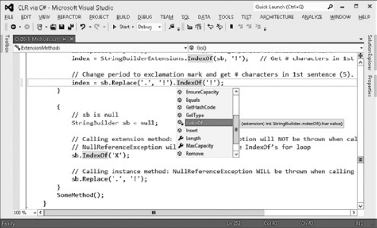


**рис. 8.1.** .Метод.расширения.в.окне.IntelliSense.в.Visual.Studio 

Методы.расширения **237** 

## **Правила и рекомендации** 

Приведу несколько правил и фактов, которые необходимо знать о методах расширения. 

- Язык С# поддерживает только методы расширения, он не поддерживает свойств расширения, событий расширения, операторов расширения и т. д. 

- Методы расширения (методы со словом `this` перед первым аргументом) должны быть объявлены в статическом необобщенном классе. Однако нет ограничения на имя этого класса, вы можете назвать его как вам угодно. Конечно, метод расширения должен иметь, по крайней мере, один параметр, и только первый параметр может быть отмечен ключевым словом `this` . 

- Компилятор C# ищет методы расширения, заданные только в статических классах, определенных в области видимости файла. Другими словами, если вы определили статический класс, унаследованный от другого класса, компилятор C# выдаст следующее сообщение (ошибка CS1109: метод расширения должен быть определен в статическом классе первого уровня, `StringBuilderExtensions` является вложенным классом): 

```
    error CS1109: Extension method must be defined in a top-level static
       class; StringBuilderExtensions is a nested class
```

- Так как статическим классам можно давать любые имена по вашему желанию, компилятору С# необходимо какое-то время для того, чтобы найти методы расширения; он просматривает все статические классы, определенные в области файла, и сканирует их статические методы. Для повышения производительности и для того, чтобы не рассматривать лишние в данных обстоятельствах методы расширения, компилятор C# требует «импортирования» методов расширения. Например, пусть кто-нибудь определил класс `StringBuilderExtensions` в пространстве имен `Wintellect` , тогда другой программист, которому нужно иметь доступ к методу расширения данного класса, в начале файла программного кода должен указать команду `using Wintellect` . 

- Существует возможность определения в нескольких статических классах одинаковых методов расширения. Если компилятор выяснит, что существуют два и более методов расширения, то тогда он выдает следующее сообщение (ошибка CS0121: неоднозначный вызов следующих методов или свойств ' StringBuilderExtensions.IndexOf(string, char)' и 'AnotherStringBuild erExtensions.IndexOf(string, char) ): 

```
    error CS0121: The call is ambiguous between the following methods
```

- or properties: 'StringBuilderExtensions.IndexOf(string, char)' and 'AnotherStringBuilderExtensions.IndexOf(string, char)'. 

Для того чтобы исправить эту ошибку, вы должны модифицировать программный код. Нельзя использовать синтаксис экземплярного метода для вызова 

**238** Глава.8 .Методы 

статического метода, вместо этого должен применяться синтаксис статического метода с указанием имени статического класса, чтобы точно сообщить компилятору, какой именно метод нужно вызвать. 

- Прибегать к этому механизму следует не слишком часто, так как он известен не всем разработчикам. Например, когда вы расширяете тип с методом расширения, вы действительно расширяете унаследованные типы с этим методом. Следовательно, вы не должны определять метод выражения, чей первый параметр — `System.Object` , так как этот метод будет вызываться для всех типов выражений, и соответствующие ссылки только будут загромождать окно IntelliSense. 

- Существует потенциальная проблема с версиями. Если в будущем разработчики Microsoft добавят экземплярный метод `IndexOf` к классу `StringBuilder` с тем же прототипом, что и в моем примере, то когда я перекомпилирую свой программный код, компилятор свяжет с программой экземплярный метод `IndexOf` компании Microsoft вместо моего статического метода `IndexOf` . Из-за этого моя программа начнет себя по-другому. Эта проблема версий — еще одна причина, по которой этот механизм следует использовать осмотрительно. 

## **расширение разных типов методами расширения** 

В этой главе я продемонстрировал, как определять методы расширения для класса `StringBuilder` . Я хотел бы отметить, что так как метод расширения на самом деле является вызовом статического метода, то среда CLR не генерирует код для проверки значения выражения, используемого для вызова метода (равно ли оно `null` ). 

// sb равно null `StringBuilder sb = null;` 

- // Вызов метода выражения: исключение NullReferenceException НЕ БУДЕТ 

- // выдано при вызове IndexOf 

- // Исключение NullReferenceException будет вброшено внутри цикла IndexOf sb.IndexOf('X'); 

// Вызов экземплярного метода: исключение NullReferenceException БУДЕТ // вброшено при вызове Replace sb.Replace('.', '!'); 

Я также хотел бы отметить, что вы можете определять методы расширения для интерфейсных типов, как в следующем программном коде: 

```
public static void ShowItems<T>(this IEnumerable<T> collection) {
foreach (var item in collection)
Console.WriteLine(item);
}
```

Представленный здесь метод расширения может быть вызван с использованием любого выражения, результат выполнения которого относится к типу, реализующему интерфейс `IEnumerable<T>` : 

Методы.расширения **239** 

```
public static void Main() {
```

// Показывает каждый символ в каждой строке консоли `"Grant".ShowItems();` 

// Показывает каждую строку в каждой строке консоли new[] { "Jeff", "Kristin" }.ShowItems(); 

// Показывает каждый Int32 в каждой строчке консоли. new List<Int32>() { 1, 2, 3 }.ShowItems(); 

## `}` 

## **ВниМание** 

Методы.расширения.являются.краеугольным.камнем.предлагаемой.Microsoft.технологии.Language.Integrated.Query.(LINQ) .В.качестве.хорошего.примера.класса.с.большим.количеством.методов.расширения.обратите.внимание.на.статический.класс. System Linq Enumerable.и.все.его.статические.методы.расширения.в.документации. Microsoft. NET.Framework.SDK .Каждый.метод.расширения.в.этом.классе.расширяет. либо.интерфейс.IEnumerable,.либо.интерфейс.IEnumerable<T> 

Методы расширения также можно определять и для типов-делегатов, напри- 

## мер: 

public static void InvokeAndCatch<TException>(this Action<Object> d, Object o) `where TException : Exception { try { d(o); } catch (TException) { } }` 

Пример вызова: 

`Action<Object> action = o => Console.WriteLine(o.GetType());` // Выдает NullReferenceException `action.InvokeAndCatch<NullReferenceException>(null);` // Поглощает NullReferenceException 

Кроме того, можно добавлять методы расширения к перечислимым типам (примеры см. в главе 15). 

Наконец, компилятор С# позволяет создавать делегатов, ссылающихся на метод расширения через объект (см. главу 17): 

```
public static void Main () {
```

// Cоздание делегата Action, ссылающегося на статический метод расширения // ShowItems; первый аргумент инициализируется ссылкой на строку "Jeff" `Action a = "Jeff".ShowItems;` 

```
  .
```

```
  .
```

```
  .
```

// Вызов делегата, вызывающего ShowItems и передающего 

// ссылку на строку "Jeff" `a();` 

```
}
```

**240** Глава.8 .Методы 

В представленном программном коде компилятор С# генерирует IL-код для того, чтобы создать делегата `Action` . После создания делегата конструктор передается в вызываемый метод, также передается ссылка на объект, который должен быть передан в этот метод в качестве скрытого параметра. Обычно, когда вы создаете делегата, ссылающегося на статический метод, объектная ссылка равна `null` , потому что статический метод не имеет этого параметра. Однако в данном примере компилятор C# сгенерирует специальный код, создающий делегата, ссылающегося на статический метод `ShowItems` , а целевым объектом статического метода будет ссылка на строку `"Jeff"` . Позднее, при вызове делегата, CLR вызовет статический метод и передаст ему ссылку на строку `"Jeff"` . Все это напоминает какие-то фокусы, но хорошо работает и выглядит естественно, если не думать, что при этом происходит внутри. 

## **атрибут расширения** 

Конечно, было бы лучше, чтобы концепция методов расширения относилась бы не только к С#. Хотелось бы, чтобы программисты определяли набор методов расширения на разных языках программирования и, таким образом, способствовали развитию других языков программирования. Для того чтобы этот механизм работал, компилятор должен поддерживать поиск статичных типов и методов для сопоставления с методами расширения. И компиляторы должны это проделывать быстро, чтобы время компиляции оставалось минимальным. 

В языке С#, когда вы помечаете первый параметр статичного метода ключевым словом `this` , компилятор применяет соответствующий атрибут к методу, и данный атрибут сохраняется в метаданных результирующего файла. Этот атрибут определен в сборке System Core dll и выглядит следующим образом: 

// Определен в пространстве имен System.Runtime.CompilerServices `[AttributeUsage(AttributeTargets.Method | AttributeTargets.Class | AttributeTargets.` 

## `Assembly)]` 

```
public sealed class ExtensionAttribute : Attribute {
}
```

К тому же этот атрибут применяется к метаданным любого статического класса, содержащего, по крайней мере, один метод расширения. Итак, когда скомпилированный код вызывает несуществующий экземплярный метод, компилятор может быстро просканировать все ссылающиеся сборки, чтобы определить, какая из них содержит методы расширения. В дальнейшем он может сканировать только те сборки статических классов, которые содержат методы расширения, выполняя поиск потенциальных соответствий компилируемому коду настолько быстро, насколько это возможно. 

Частичные.методы **241** 

## **ПриМеЧание** 

Класс.ExtensionAttribute.определен.в.сборке.System Core dll .Это.означает,.что.результирующая.сборка,.сгенерированная.компилятором,.будет.иметь.ссылку.на.встроенную.в.нее.библиотеку.System Core dll,.даже.если.не.использовать.какой-либо.тип.из. System Core dll.и.даже.если.не.ссылаться.на.него.во.время.компиляции.программного. кода .Однако.это.не.такая.уже.большая.проблема,.потому.что.ExtensionAttribute.используется.только.один.раз.во.время.компиляции,.и.во.время.выполнения.System Core dll.не.загрузится,.пока.приложение.занято.чем-либо.другим.в.этой.сборке 

## **Частичные методы** 

Представьте, что вы используете служебную программу, которая генерирует исходный код на C# с определением типа. Этой программе известно, что внутри программного кода есть места, в которых вы хотели бы настроить поведение типа. Обычно такая настройка производится при помощи виртуальных методов, вызываемых сгенерированным кодом. Сгенерированный код также должен содержать определения этих виртуальных методов, где их реализация ничего не делает, а просто возвращает управление. Чтобы настроить поведение класса, нужно определить собственный класс, унаследованный от базового, и затем переопределить все его виртуальные методы, реализующие желаемое поведение. Вот пример: 

// Сгенерированный код в некотором файле с исходным кодом: `internal class Base {` 

```
  private String m_name;
```

// Вызывается перед изменением поля m_name `protected virtual void OnNameChanging(String value) { }` 

`public String Name { get { return m_name; } set {` // Информирует класс о возможных изменениях `OnNameChanging(value.ToUpper());` m_name = value; // Изменение поля `} } }` 

// Написанный программистом код из другого файла `internal class Derived : Base { protected override void OnNameChanging(string value) { if (String.IsNullOrEmpty(value)) throw new ArgumentNullException("value"); } }` 

**242** Глава.8 .Методы 

К сожалению, у представленного кода имеются два недостатка. 

- Тип не должен быть запечатанным (sealed) классом. Нельзя использовать этот подход для запечатанных классов или для значимых типов (потому что значимые типы неявно запечатаны). К тому же нельзя использовать этот подход для статических методов, потому что они не могут переопределяться. 

- Существует проблема эффективности. Тип, определяемый только для переопределения метода, понапрасну расходует некоторое количество системных ресурсов. И даже если вы не хотите переопределять поведение типа `OnNameChanging` , код базового класса по-прежнему вызовет виртуальный метод, который помимо возврата управления ничего больше не делает. Метод `ToUpper` вызывается и тогда, когда `OnNameChanging` получает доступ к переданным аргументам, и тогда, когда не получает. 

Для решения проблемы переопределения поведения можно задействовать частичные методы языка C#. В следующем коде для достижения той же семантики, что и в предыдущем коде, используются частичные методы: 

// Сгенерированный при помощи инструмента программный код `internal sealed partial class Base { private String m_name;` 

// Это объявление с определением частичного метода вызывается // перед изменением поля m_name `partial void OnNameChanging(String value);` 

```
  public String Name {
    get { return m_name; }
    set {
```

// Информирование класса о потенциальном изменении `OnNameChanging(value.ToUpper());` m_name = value; // Изменение поля 

```
    }
```

```
  }
```

## `}` 

// Написанный программистом код, содержащийся в другом файле `internal sealed partial class Base {` 

// Это объявление с реализацией частичного метода вызывается перед тем, 

// как будет изменено поле m_name `partial void OnNameChanging(String value) { if (String.IsNullOrEmpty(value)) throw new ArgumentNullException("value"); }` 

```
}
```

В этом коде есть несколько мест, на которые необходимо обратить внимание. 

- Теперь класс запечатан (хотя это и не обязательно). В действительности, класс мог бы быть статическим классом или даже значимым типом. 

Частичные.методы **243** 

- Код, сгенерированный программой, и код, написанный программистом, на самом деле являются двумя частичными определениями, которые в конце концов образуют одно определение типа (подробности см. в главе 6). 

- Код, сгенерированный программой, представляет собой объявление частичного метода. Этот метод помечен ключевым словом `partial` и не имеет тела. 

- Код, написанный программистом, реализует объявление частичного метода. Этот метод также помечен ключевым словом `partial` и тоже не имеет тела. 

Когда вы скомпилируете этот код, вы увидите то же самое, что и в представленном ранее коде. Большое преимущество такого решения заключается в том, что вы можете перезапустить программу и сгенерировать новый код в новом файле, а ваш программный код по-прежнему останется нетронутым в отдельном файле. Кроме того, этот подход работает для изолированных классов, статических классов и значимых типов. 

## **ПриМеЧание** 

В.редакторе.Visual.Studio,.если.ввести.partial.и.нажать.пробел,.в.окне.IntelliSense. появятся.объявления.всех.частичных.методов.вложенного.типа,.которые.пока.не. имеют.соответствия.объявлениям.выполняемого.частичного.метода .Вы.легко.можете. выбрать.частичный.метод.в.IntelliSense-окне,.и.Visual.Studio.сгенерирует.прототип. метода.автоматически .Это.очень.удобная.функция,.повышающая.производительность.программирования 

У частичных методов имеется еще одно серьезное преимущество. Скажем, у вас теперь нет нужны модифицировать поведение типа, сгенерированного инструментом, и менять файл исходного кода. Если просто скомпилировать такой код, компилятор создаст IL-код и метаданные, как если бы сгенерированный программой код выглядел следующим образом: 

// Логический эквивалент сгенерированного инструментом кода в случае, 

// когда нет объявления выполняемого частичного метода `internal sealed class Base { private String m_name;` 

`public String Name { get { return m_name; } set {` m_name = value; // Измените поле `} } }` 

При отсутствии объявления выполняемого частичного метода компилятор не будет генерировать метаданные, представляющие частичный метод. К тому же компилятор не сгенерирует IL-команды вызова частичного метода, он не сгенерирует код, вычисляющий аргументы, которые необходимо передать частичному методу. 

**244** Глава.8 .Методы 

В приведенном примере компилятор не сгенерирует код для вызова метода `ToUpper` . В результате будет меньше метаданных и IL-кода и производительность во время выполнения повысится! 

## **ПриМеЧание** 

Подобным.образом.частичные.методы.работают.с.атрибутом.System Diagnostics ConditionalAttribute .Однако.они.работают.только.с.одним.типом,.тогда.как.атрибут. ConditionalAttribute.может.быть.использован.для.необязательного.вызова.методов,. определенных.в.другом.типе 

## **Правила и рекомендации** 

Несколько дополнительных правил и рекомендаций, касающихся частичных методов. 

- Частичные методы могут объявляться только внутри частичного класса или структуры. 

- Частичные методы должны всегда иметь возвращаемый тип `void` и не могут иметь параметров, помеченных ключевым словом `out` . Эти ограничения связаны с тем, что во время выполнения программы метода не существует, и вы не можете инициализировать переменную, возвращаемую методом, потому что этого метода не существует. По той же причине нельзя использовать параметр, помеченный словом `out` , потому что иначе метод должен будет инициализировать этот параметр, но этого метода не существует. Частичный метод может иметь параметры, помеченные ключевым словом `ref` , а также универсальные параметры, экземплярные или статические, или даже параметры, помеченные как `unsafe` . 

- Естественно, определяющее объявление частичного метода и его реализующее объявление должны иметь идентичные сигнатуры. И оба должны иметь настраивающиеся атрибуты, применяющиеся к ним, когда компилятор объединяет атрибуты обоих методов вместе. Все атрибуты, применяемые к параметрам, тоже объединяются. 

- Если не существует реализующего объявления частичного метода, в вашем коде не может быть попыток создания делегата, ссылающегося на частичный метод. Это причина, по которой метод не существует во время выполнения программы. Компилятор выдаст следующее сообщение (ошибка CS0762: не могу создать делегата из метода 'Base.OnNameChanging(string)' , потому что это частичный метод без реализующего объявления): 

- `"error CS0762: Cannot create delegate from method` 

- 'Base.OnNameChanging(string)' because it is a partial method `without an implementing declaration` 

- Хотя частичные методы всегда считаются закрытыми, компилятор C# запрещает писать ключевое слово `private` перед объявлением частичного метода. 

## **Глава 9. Параметры** 

В этой главе рассмотрены различные способы передачи параметров в метод. В числе прочего вы узнаете, как определить необязательный параметр, задать параметр по имени и передать его по ссылке. Также рассмотрена процедура определения методов, принимающих различное количество аргументов. 

## **необязательные и именованные параметры**[1] 

При выборе параметров метода некоторым из них (и даже всем) можно присваивать значения по умолчанию. В результате в вызывающем такой метод коде можно не указывать эти аргументы, а принимать уже имеющиеся значения. Кроме того, при вызове метода существует возможность указать аргументы, воспользовавшись именами их параметров. Следующий код демонстрирует применение как необязательных, так и именованных параметров: 

`public static class Program { private static Int32 s_n = 0;` private static void M(Int32 x = 9, String s = "A", DateTime dt = default(DateTime), Guidguid = new Guid()) { Console.WriteLine("x={0}, s={1}, dt={2}, guid={3}", x, s, dt, guid); `} public static void Main() {` // 1. Аналогично: M(9, "A", default(DateTime), new Guid()); `M();` // 2. Аналогично: M(8, "X", default(DateTime), new Guid()); M(8, "X"); // 3. Аналогично: M(5, "A", DateTime.Now, Guid.NewGuid()); M(5, guid: Guid.NewGuid(), dt: DateTime.Now); // 4. Аналогично: M(0, "1", default(DateTime), new Guid()); M(s_n++, s_n++.ToString()); // 5. Аналогично: String t1 = "2"; Int32 t2 = 3; // M(t2, t1, default(DateTime), new Guid()); M(s: (s_n++).ToString(), x: s_n++); `} }` 

При выполнении этого кода выводится следующий результат: 

x=9, s=A, dt=1/1/0001 12:00:00 AM, guid=00000000-0000-0000-0000-000000000000 x=8, s=X, dt=1/1/0001 12:00:00 AM, guid=00000000-0000-0000-0000-000000000000 _продолжение_  

> 1 В настоящий момент в msdn.microsoft.com используется термин «необязательные и именованные аргументы», но автор в данной книге называет их «параметрами». Мы решили сохранить авторскую терминологию. — _Примеч. ред._ 

**246** Глава.9 .Параметры 

x=5, s=A, dt=8/16/2012 10:14:25 PM, guid=d24a59da-6009-4aae-9295-839155811309 x=0, s=1, dt=1/1/0001 12:00:00 AM, guid=00000000-0000-0000-0000-000000000000 x=3, s=2, dt=1/1/0001 12:00:00 AM, guid=00000000-0000-0000-0000-000000000000 

Как видите, в случае если при вызове метода аргументы отсутствуют, компилятор берет их значения, предлагаемые по умолчанию. В третьем и пятом вызовах метода `M` заданы _именованные параметры_ (named parameter). Я в явном виде передал значение переменной `x` и указал, что хочу передать аргумент для параметров `guid` и `dt` . 

Передаваемые в метод аргументы компилятор рассматривает слева направо. В четвертом вызове метода `M` значение аргумента `s_n (0)` передается в переменную `x` , затем `s_n` увеличивается на единицу и аргумент `s_n (1)` передается как строка в параметр `s` . После чего `s_n` увеличивается до 2. Передача аргументов с помощью именованных параметров опять же осуществляется компилятором слева направо. В пятом вызове метода `M` значение параметра `s_n (2)` преобразуется в строку и сохраняется в созданной компилятором временной переменной ( `t1` ). Затем `s_n` увеличивается до 3, и это значение сохраняется в еще одной созданной компилятором временной переменной ( `t2` ). После этого `s_n` увеличивается до 4. В конце концов, вызывается метод `M` , в который передаются переменные `t2` , `t1` , переменная `DateTime` со значением по умолчанию и новое значение `Guid` . 

## **Правила использования параметров** 

Определяя метод, задающий для части своих параметров значения по умолчанию, следует руководствоваться следующими правилами: 

- Значения по умолчанию указываются для параметров методов, конструкторов методов и параметрических свойств (индексаторов C#). Также их можно указывать для параметров, являющихся частью определения делегатов. В результате при вызове этого типа делегата аргументы можно опускать, используя их значения по умолчанию. 

- Параметры со значениями по умолчанию должны следовать за всеми остальными параметрами. Другими словами, если указан параметр со значением по умолчанию, значения по умолчанию должны иметь и все параметры, расположенные справа от него. Например, если при определении метода `M` удалить значение по умолчанию ( `"A"` ) для параметра `s` , компилятор выдаст сообщение об ошибке. Существует только одно исключение из правил — параметр массива, помеченный ключевым словом `params` (о котором мы подробно поговорим чуть позже). Он должен располагаться после всех прочих параметров, в том числе имеющих значение по умолчанию. При этом сам массив значения по умолчанию иметь не может. 

- Во время компиляции значения по умолчанию должны оставаться неизменными. То есть задавать значения по умолчанию можно для параметров примитивных типов, перечисленных в табл. 5.1 главы 5. Сюда относятся также перечислимые типы и ссылочные типы, допускающие присвоение значения `null` . Для параметров произвольного значимого типа значение по умолчанию задается как экземпляр этого типа с полями, содержащими нули. Можно использовать как ключевое слово `default` , так и ключевое слово `new` , в обоих случаях генери- 

Необязательные.и.именованные.параметры **247** 

руется одинаковый IL-код. С примерами обоих вариантов синтаксиса мы уже встречались в методе `M` при задании значений по умолчанию для параметров `dt` и `guid` соответственно. 

- Запрещается переименовывать параметрические переменные, так как это влечет за собой необходимость редактирования вызывающего кода, который передает аргументы по имени параметра. Скажем, если в объявлении метода `M` переименовать переменную `dt` в `dateTime` , то третий вызов метода станет причиной появления следующего сообщения компилятора (ошибка CS1739: в подходящей перегруженной версии 'M' отсутствует параметр с именем 'dt' ): 

- "error CS1739: The best overload for 'M' does not have a parameter named 'dt' 

- При вызове метода извне модуля изменение значения параметров по умолчанию является потенциально опасным. Вызывающая сторона использует значение по умолчанию в процессе работы. Если изменить его и не перекомпилировать код, содержащий вызов, в вызываемый метод будет передано прежнее значение. В качестве индикатора поведения можно использовать значение по умолчанию 0 или `null` . В результате исчезает необходимость повторной компиляции кода вызывающей стороны. Вот пример: 

// Не делайте так: `private static String MakePath(String filename = "Untitled") {` return String.Format(@"C:\{0}.txt", filename); 

```
    }
```

// Используйте следующее решение: 

```
    private static String MakePath(String filename = null) {
```

// Здесь применяется оператор, поддерживающий 

// значение null (??); см. главу 19 

return String.Format(@"C:\{0}.txt", filename ?? "Untitled"); `}` 

- Для параметров, помеченных ключевыми словами `ref` или `out` , значения по умолчанию не задаются. 

Существуют также дополнительные правила вызова методов с использованием необязательных или именованных параметров: 

- Аргументы можно передавать в произвольном порядке; но именованные аргументы должны находиться в конце списка. 

- Передача аргумента по имени возможна для параметров, не имеющих значения по умолчанию, но при этом компилятору должны быть переданы все аргументы, необходимые для компиляции (c указанием их позиции или имени). 

- В C# между запятыми не могут отсутствовать аргументы. Иначе говоря, запись M(1, ,DateTime.Now) недопустима, так как ведет к нечитабельному коду. Чтобы опустить аргумент для параметра со значением по умолчанию, передавайте аргументы по именам параметров. 

- Вот как передать аргумент по имени параметра, требующего ключевого слова `ref` / `out` : 

**248** Глава.9 .Параметры 

// Объявление метода: `private static void M(ref Int32 x) { ... }` // Вызов метода: `Int32 a = 5; M(x: ref a);` 

## **ПриМеЧание** 

Синтаксис.необязательных.и.именованных.параметров.в.C#.весьма.удобен.при. написании.кода,.поддерживающего.объектную.модель.COM.из.Microsoft.Office . При.вызове.COM-компонентов.C#.позволяет.опускать.ключевые.слова.ref/out. в.процессе.передачи.аргументов.по.ссылке .Это.еще.больше.упрощает.код .Если. же.COM-компонент.не.вызывается,.наличие.рядом.с.аргументом.ключевого.слова. ref/out.обязательно 

## **атрибут DefaultParameterValue и необязательные атрибуты** 

Хотелось бы, чтобы концепция заданных по умолчанию и необязательных аргументов выходила за пределы C#. Особенно здорово было бы, если бы программисты могли определять методы, указывающие, какие параметры являются необязательными и каковы должны быть заданные по умолчанию значения параметров в разных языках программирования, дав попутно возможность вызывать их из разных языковых сред. Но такое возможно только при условии, что выбранный компилятор позволяет при вызове опускать некоторые аргументы, а также умеет определять заданные по умолчанию значения этих аргументов. 

В C# параметрам со значением по умолчанию назначается настраиваемый атрибут `System.Runtime.InteropServices.OptionalAttribute` , сохраняющийся в метаданных итогового файла. Кроме того, компилятор применяет к параметру атрибут `System.Runtime.InteropServices.DefaultParameterValueAttribute` , опять же сохраняя его в метаданных итогового файла. После чего конструктору `DefaultParameterValueAttribute` передаются постоянные значения, указанные в первоначальном коде. 

В итоге встречая код, вызывающий метод, в котором не хватает аргументов, компилятор проверяет, являются ли эти аргументы необязательными, берет их значения из метаданных и автоматически вставляет в вызов метода. 

## **неявно типизированные локальные переменные** 

В C# поддерживается возможность определения типа используемых в методе локальных переменных по типу используемого при их инициализации выражения: 

**249** 

Неявно.типизированные.локальные.переменные 

`private static void ImplicitlyTypedLocalVariables() { var name = "Jeff";` ShowVariableType(name);    // Вывод: System.String // var n = null; // Ошибка var x = (String)null;      // Допустимо, хотя и бесполезно ShowVariableType(x);       // Вывод: System.String var numbers = new Int32[] { 1, 2, 3, 4 }; ShowVariableType(numbers); // Вывод: System.Int32[] // Меньше символов при вводе сложных типов var collection = new Dictionary<String, Single>() { { "Grant", 4.0f } }; // Вывод: System.Collections.Generic.Dictionary`2[System.String,System.Single] `ShowVariableType(collection); foreach (var item in collection) {` // Вывод: System.Collections.Generic.KeyValuePair`2 [System.String,System.Single] `ShowVariableType(item); } } private static void ShowVariableType<T>(T t) { Console.WriteLine(typeof(T)); }` 

Первая строка кода метода `ImplicitlyTypedLocalVariables` вводит новую локальную переменную при помощи ключевого слова `var` . Чтобы определить ее тип, компилятор смотрит на тип выражения с правой стороны от оператора присваивания ( `=` ). Так как `"Jeff"` — это строка, компилятор присваивает переменной `name` тип `String` . Чтобы доказать, что компилятор правильно определяет тип, я написал универсальный метод `ShowVariableType` . Он определяет тип своего аргумента и выводит его на консоль. Для простоты чтения выводимые методом `ShowVariableType` значения я добавил в виде комментариев внутрь метода `ImplicitlyTypedLocalVariables` . 

Вторая операция присваивания (закомментированная) в методе `ImplicitlyTypedLocalVariables` во время компиляции привела бы к ошибке (ошибка CS0815: невозможно присвоить значение `null` локальной переменной с неявно заданным типом): 

```
error CS0815: Cannot assign <null> to an implicitly-typed local variable
```

Дело в том, что значение `null` неявно приводится к любому ссылочному типу или значимому типу, допускающему значение `null` . Соответственно, компилятор не в состоянии однозначно определить его тип. Однако в третьей операции присваивания я показал, что инициализировать локальную переменную с неявно заданным типом значением `null` все-таки можно, если в явном виде указать тип (в моем примере это тип `String` ). Впрочем, это не самая полезная возможность, так как, написав `String x = null;` , вы получите тот же самый результат. 

**250** Глава.9 .Параметры 

В четвертом примере в полной мере демонстрируется полезность локальных переменных неявно заданного типа. Ведь без этой возможности вам бы потребовалось с обеих сторон от оператора присваивания писать `Dictionary<String` , `Single>` . Это не просто увеличивает объем набираемого текста, но и заставляет редактировать код с обеих сторон от оператора присваивания в случае, если вы решите поменять тип коллекции или любой из типов обобщенных параметров. 

В цикле `foreach` я также воспользовался ключевым словом `var` , заставив компилятор автоматически определить тип элементов коллекции. Этот пример демонстрирует пользу ключевого слова `var` внутри инструкций `foreach` , `using` и `for` . Кроме того, оно полезно в процессе экспериментов с кодом. К примеру, вы инициализируете локальную переменную с неявно заданным типом, взяв за основу тип возвращаемого методом значения. Но в будущем может появиться необходимость поменять тип возвращаемого значения. В этом случае компилятор автоматически определит, что тип возвращаемого методом значения изменился, и изменит тип локальной переменной! К сожалению, остальной код внутри метода, работающий с этой переменной, может перестать компилироваться — если этот код обращается к членам в предположении, что переменная принадлежит к старому типу. 

В Microsoft Visual Studio при наведении указателя мыши на ключевое слово `var` появляется всплывающая подсказка с названием типа, определяемого компилятором. Функцию неявного задания типа локальных переменных в C# следует задействовать при работе с методами, использующими анонимные типы. Они подробно рассматривают в главе 10. 

Тип параметра метода при помощи ключевого слова `var` объявлять нельзя. Ведь компилятор будет определять его, исходя из типа аргументов, передаваемых при вызове метода. Вызова же может вообще не быть или же, наоборот, их может быть несколько. Аналогично, нельзя объявлять при помощи этого ключевого слова тип поля. Для такого ограничения в C# существует множество причин. Одна из них — возможность обращения к полю из нескольких методов. Группа проектирования C# считает, что контракт (тип переменной) должен быть указан явно. Второй причиной является тот факт, что в данном случае анонимные типы (обсуждаемые в главе 10) начнут выходить за границы одного метода. 

## **ВниМание** 

Не.путайте.ключевые.слова.dynamic.и.var .Объявление.локальной.переменной.с.ключевым.слово.var.является.не.более.чем.синтаксическим.сокращением,.заставляющим. компилятор.определить.тип.данных.по.выражению .Данное.ключевое.слово.служит. только.для.объявления.локальных.переменных.внутри.метода,.в.то.время.как.ключевое.слово.dynamic.используется.для.локальных.переменных,.полей.и.аргументов . Невозможно.привести.выражение.к.типу.var,.но.такая.операция.вполне.допустима. для.типа.dynamic .Переменные,.объявленные.с.ключевым.словом.var,.должны.инициализироваться.явно,.что.не.обязательно.для.переменных.типа.dynamic .Более. подробную.информацию.о.динамическом.типе.вы.найдете.в.главе.5 

Передача.параметров.в.метод.по.ссылке **251** 

## **Передача параметров в метод по ссылке** 

По умолчанию CLR предполагает, что все параметры методов передаются по значению. При передаче объекта ссылочного типа методу передается ссылка (или указатель) на этот объект. То есть метод может изменить переданный объект, влияя на состояние вызывающего кода. Если параметром является экземпляр значимого типа, методу передается его копия. В этом случае метод получает собственную копию объекта, а исходный экземпляр сохраняется неизменным. 

## **ВниМание** 

Следует.знать.тип.каждого.объекта,.передаваемого.методу.в.качестве.параметра,. поскольку.манипулирующий.параметрами.код.может.существенно.различаться.в.зависимости.от.типа.параметров 

CLR также позволяет передавать параметры по ссылке, а не по значению. В C# это делается с помощью ключевых слов `out` и `ref` . Оба заставляют компилятор генерировать метаданные, описывающие параметр как переданный по ссылке. Компилятор использует эти метаданные для генерирования кода, передающего вместо самого параметра его адрес. 

С точки зрения CLR, ключевые слова `out` и `ref` не различаются, то есть для них генерируются одинаковый IL-код, а метаданные отличаются всего одним битом, указывающим, какое ключевое слово было использовано при объявлении метода. Однако компилятор C# различает эти ключевые слова при выборе метода, используемого для инициализации объекта, на который указывает переданная ссылка. Если параметр метода помечен ключевым словом `out` , вызывающий код может не инициализировать его, пока не вызван сам метод. В этом случае вызванный метод не может прочитать значение параметра и должен записать его, прежде чем вернуть управление. Если же параметр помечен ключевым словом `ref` , вызывающий код должен инициализировать его перед вызовом метода, а вызванный метод может как читать, так и записывать значение параметра. 

Поведение ссылочных и значимых типов при использовании ключевых слов `out` и `ref` различается значительно. Вот как это выглядит в случае значимого типа: 

`public sealed class Program { public static void Main() {` Int32 x;              // Инициализация x GetVal(out x);        // Инициализация x не обязательна Console.WriteLine(x); // Выводится 10 `} private static void GetVal(out Int32 v) {` v = 10; // Этот метод должен инициализировать переменную V `} }` 

**252** Глава.9 .Параметры 

Здесь переменная `x` объявлена в стеке `Main` , а ее адрес передается методу `GetVal` . Параметр этого метода `v` представляет собой указатель на значимый тип `Int32` . Внутри метода `GetVal` значение типа `Int32` , на которое указывает `v` , изменяется на 10. Именно это значение выводится на консоль, когда метод `GetVal` возвращает управление. Использование ключевого слова `out` со значимыми типами повышает эффективность кода, так как предотвращает копирование экземплярных полей значимого типа при вызовах методов. 

А теперь рассмотрим аналогичный пример с ключевым словом `ref` : 

`public sealed class Program { public static void Main() {` Int32 x = 5;          // Инициализация x AddVal(ref x);        // x требуется инициализировать Console.WriteLine(x); // Выводится 15 `} private static void AddVal(ref Int32 v) {` v += 10; // Этот метод может использовать инициализированный параметр v `} }` 

Здесь объявленной в стеке `Main` переменной `x` присваивается начальное значение 5. Затем ее адрес передается методу `AddVal` , параметр `v` которого представляет собой указатель на значимый тип `Int32` в стеке `Main` . Внутри метода `AddVal` должно быть уже инициализированное значение типа `Int32` , на которое указывает параметр `v` . Таким образом, метод `AddVal` может использовать первоначальное значение `v` в любом выражении. Он может менять это значение, возвращая вызывающему коду новый вариант. В рассматриваемом примере метод `AddVal` прибавляет к исходному значению 10. Соответственно, когда он возвращает управление, переменная `x` метода `Main` содержит значение 15, которое и выводится на консоль. 

В завершение отметим, что с точки зрения IL или CLR ключевые слова `out` и `ref` ничем не различаются: оба заставляют передать указатель на экземпляр объекта. Разница в том, что они помогают компилятору гарантировать корректность кода. В следующем коде попытка передать методу, ожидающему параметр `ref` , неинициализированное значение приводит к ошибке компиляции (ошибка CS0165: использование локальной переменной `x` , у которой не задано значение): 

error CS0165: Use of unassigned local variable 'x' 

А вот сам фрагмент кода, вызывающий это сообщение: 

`public sealed class Program { public static void Main() {` Int32 x; // x не инициализируется // Следующая строка не компилируется, а выводится сообщение: 

// error CS0165: Use of unassigned local variable 'x' `AddVal(ref x); Console.WriteLine(x); } private static void AddVal(ref Int32 v) {` 

**253** 

Передача.параметров.в.метод.по.ссылке 

```
}
```

v += 10; // Этот метод может использовать инициализированный параметр v 

```
  }
```

## **ВниМание** 

Меня.часто.спрашивают,.почему.при.вызовах.методов.в.программах.на.C#.надо.в.явном. виде.указывать.ключевые.слова.out.или.ref .В.конце.концов,.компилятор.в.состоянии. самостоятельно.определить,.какое.из.ключевых.слов.ему.требуется,.а.значит,.должен. корректно.компилировать.код .Однако.разработчики.C#.сочли,.что.вызывающий.код. должен.явно.указывать.свои.намерения,.чтобы.при.вызове.метода.сразу.было.ясно,. что.этот.метод.должен.менять.значение.передаваемой.переменной 

Кроме.того,.CLR.позволяет.по-разному.перегружать.методы.в.зависимости.от. выбора.параметра.out.или.ref .Например,.следующий.код.на.C#.вполне.допустим. и.прекрасно.компилируется: 

```
public sealed class Point {
  static void Add(Point p) { ... }
  static void Add(ref Point p) { ... }
}
```

Не.допускается.перегружать.методы,.отличающиеся.только.типом.параметров.(out. или.ref),.так.как.результатом.их.JIT-компиляции.становится.идентичный.код.метаданных,.представляющих.сигнатуру.методов .Поэтому.в.показанном.ранее.типе.Point. я.не.могу.определить.вот.такой.метод: 

```
static void Add(out Point p) { ... }
```

При.попытке.включить.такой.метод.в.тип.Point.компилятор.C#.вернет.ошибку.(ошибка. CS0663:.в.'Add'.нельзя.определять.перегруженных.методов,.отличных.от.ref.и.out): 

error CS0663: 'Add' cannot define overloaded methods that differ only `on ref and out` 

Со значимыми типами ключевые слова `out` и `ref` дают тот же результат, что и передача ссылочного типа по значению. Они позволяют методу управлять единственным экземпляром значимого типа. Вызывающий код должен выделить память для этого экземпляра, а вызванный метод управляет выделенной памятью. В случае ссылочных типов вызывающий код выделяет память для указателя на передаваемый объект, а вызванный код управляет этим указателем. В силу этих особенностей использование ключевых слов `out` и `ref` со ссылочными типами полезно, лишь когда метод собирается «вернуть» ссылку на известный ему объект. Рассмотрим это на примере: 

```
using System;
using System.IO;
```

`public sealed class Program { public static void Main() {` FileStream fs; // Объект fs не инициализирован 

> // Первый файл открывается для обработки 

_продолжение_  

**254** Глава.9 .Параметры 

```
    StartProcessingFiles(out fs);
```

// Продолжаем, пока остаются файлы для обработки `for (; fs != null; ContinueProcessingFiles(ref fs)) {` // Обработка файла `fs.Read(...); } } private static void StartProcessingFiles(out FileStream fs) {` fs = new FileStream(...); // в этом методе объект fs // должен инициализироваться `} private static void ContinueProcessingFiles(ref FileStream fs) {` fs.Close(); // Закрытие последнего обрабатываемого файла 

// Открыть следующий файл или вернуть null, если файлов больше нет `if (noMoreFilesToProcess) fs = null; else fs = new FileStream (...); } }` 

Как видите, главная особенность этого кода в том, что методы с параметрами ссылочного типа, помеченными ключевыми словами `out` или `ref` , создают объект и возвращают вызывающему коду указатель на него. Обратите внимание, что метод `ContinueProcessingFiles` может управлять передаваемым ему объектом, прежде чем вернет новый объект. Это возможно благодаря тому, что его параметр помечен ключевым словом `ref` . Показанный здесь код можно немного упростить: 

`using System; using System.IO; public sealed class Program { public static void Main() {` FileStream fs = null; // Обязательное присвоение // начального значения null 

// Открытие первого файла для обработки `ProcessFiles(ref fs);` 

// Продолжаем, пока остаются необработанные файлы `for (; fs != null; ProcessFiles(ref fs)) {` // Обработка файла `fs.Read(...); } } private static void ProcessFiles(ref FileStream fs) {` // Если предыдущий файл открыт, закрываем его 

Передача.параметров.в.метод.по.ссылке **255** 

if (fs != null) fs.Close(); // Закрыть последний обрабатываемый файл 

// Открыть следующий файл или вернуть null, если файлов больше нет `if (noMoreFilesToProcess) fs = null; else fs = new FileStream (...); } }` 

Еще один пример, демонстрирующий использование ключевого слова `ref` для реализации метода, меняющего местами два ссылочных типа: 

public static void Swap(ref Object a, ref Object b) { `Object t = b; b = a; a = t; }` 

Кажется, что код, меняющий местами ссылки на два объекта типа `String` , должен выглядеть так: 

`public static void SomeMethod() { String s1 = "Jeffrey"; String s2 = "Richter";` Swap(ref s1, ref s2); Console.WriteLine(s1); // Выводит "Richter" Console.WriteLine(s2); // Выводит "Jeffrey" `}` 

Однако компилироваться этот код не будет: ведь переменные, передаваемые методу по ссылке, должны быть одного типа, объявленного в сигнатуре метода. Иначе говоря, метод `Swap` ожидает получить ссылки на тип `Object` , а не на тип `String` . Решение же нашей задачи выглядит следующим образом: 

`public static void SomeMethod() { String s1 = "Jeffrey"; String s2 = "Richter";` // Тип передаваемых по ссылке переменных должен // соответствовать ожидаемому Object o1 = s1, o2 = s2; Swap(ref o1, ref o2); // Приведение объектов к строковому типу `s1 = (String) o1; s2 = (String) o2;` Console.WriteLine(s1); // Выводит "Richter" Console.WriteLine(s2); // Выводит "Jeffrey" `}` 

Такая версия метода `SomeMethod` будет компилироваться и работать нужным нам образом. Причиной ограничения, которое нам пришлось обходить, является 

**256** Глава.9 .Параметры 

обеспечение безопасности типов. Вот пример кода, нарушающего безопасность типов (к счастью, он не компилируется): 

`internal sealed class SomeType { public Int32 m_val; } public sealed class Program { public static void Main() { SomeType st;` // Следующая строка выдает ошибку CS1503: Argument '1': // cannot convert from 'ref SomeType' to 'ref object'. `GetAnObject(out st); Console.WriteLine(st.m_val); } private static void GetAnObject(out Object o) {` o = new String('X', 100); `} }` 

Совершенно ясно, что здесь метод `Main` ожидает от метода `GetAnObject` объект `SomeType` . Однако поскольку в сигнатуре `GetAnObject` задана ссылка на `Object` , метод `GetAnObject` может инициализировать параметр `o` объектом произвольного типа. В этом примере параметр `st` в момент, когда метод `GetAnObject` возвращает управление методу `Main` , ссылается на объект типа `String` , в то время как ожидается тип `SomeType` . Соответственно, вызов метода `Console.WriteLine` закончится неудачей. Впрочем, компилятор C# откажется компилировать этот код, так как `st` представляет собой ссылку на объект типа `SomeType` , тогда как метод `GetAnObject` требует ссылку на `Object` . 

Однако, как оказалось, эти методы можно заставить работать при помощи обобщений. Вот так следует исправить показанный ранее метод `Swap` : 

public static void Swap<T>(ref T a, ref T b) { `T t = b; b = a; a = t; }` 

После этого следующий код (идентичный ранее показанному) будет без проблем компилироваться и выполняться: 

`public static void SomeMethod() { String s1 = "Jeffrey"; String s2 = "Richter";` Swap(ref s1, ref s2); Console.WriteLine(s1); // Выводит "Richter" Console.WriteLine(s2); // Выводит "Jeffrey" `}` 

**257** 

Передача.переменного.количества.аргументов 

За другими примерами решения, использующими обобщения, обращайтесь к классу `System.Threading.Interlocked` с его методами `CompareExchange` и `Exchange` . 

## **Передача переменного количества аргументов** 

Иногда разработчику удобно определить метод, способный принимать переменное число параметров. Например, тип `System.String` предлагает методы, выполняющие объединение произвольного числа строк, а также методы, при вызове которых можно задать набор единообразно форматируемых строк. 

Метод, принимающий переменное число аргументов, объявляют так: 

`static Int32 Add(params Int32[] values) {` // ПРИМЕЧАНИЕ: при необходимости этот массив 

// можно передать другим методам 

```
  Int32 sum = 0;
  if (values != null) {
    for (Int32 x = 0; x < values.Length; x++)
    sum += values[x];
  }
  return sum;
}
```

Незнакомым в этом методе является только ключевое слово `params` , примененное к последнему параметру в сигнатуре метода. Если не обращать на него внимания, станет ясно, что метод принимает массив значений типа `Int32` , складывает все элементы этого массива и возвращает полученную сумму. 

Очевидно, этот метод можно вызвать так: 

`public static void Main() {` // Выводит "15" Console.WriteLine(Add(new Int32[] { 1, 2, 3, 4, 5 } )); `}` 

Не вызывает сомнений утверждение, что этот массив легко инициализировать произвольным числом элементов и передать для обработки методу `Add` . Показанный здесь код немного неуклюж, хотя он корректно компилируется и работает. Разработчики, конечно, предпочли бы вызывать метод `Add` так: 

`public static void Main() {` // Выводит "15" Console.WriteLine(Add(1, 2, 3, 4, 5)); `}` 

Такая форма вызова возможна благодаря ключевому слову `params` . Именно оно заставляет компилятор рассматривать параметр как экземпляр настраиваемого атрибута `System.ParamArrayAttribute` . 

**258** Глава.9 .Параметры 

Обнаружив такой вызов, компилятор C# проверяет все методы с заданным именем, у которых ни один из параметров не помечен атрибутом `ParamArray` . Найдя метод, способный принять вызов, компилятор генерирует вызывающий его код. В противном случае ищутся методы с атрибутом `ParamArray` и проверяется, могут ли они принять вызов. Если компилятор находит подходящий метод, то прежде чем сгенерировать код его вызова, он генерирует код, создающий и заполняющий массив. 

В предыдущем примере не определен метод `Add` , принимающий пять совместимых с типом `Int32` аргументов. Компилятор же видит в тексте исходного кода вызов метода `Add` , которому передается список значений `Int32` , и метод `Add` , у которого массив типа `Int32` помечен атрибутом `ParamArray` . Компилятор считает данный метод подходящим для вызова и генерирует код, собирающий все параметры в массив типа `Int32` и вызывающий метод `Add` . В конечном итоге получается, что можно написать вызов, без труда передающий методу `Add` набор параметров, и компилятор сгенерирует тот же код, что и для первой версии вызова метода `Add` , в которой массив создается и инициализируется явно. 

Ключевым словом `params` может быть помечен только последний параметр метода ( `ParamArrayAttribute` ). Он должен указывать на одномерный массив произвольного типа. В последнем параметре метода допустимо передавать значение `null` или ссылку на массив, состоящий из нуля элементов. Следующий вызов метода `Add` прекрасно компилируется, отлично работает и дает в результате сумму, равную 0 (как и ожидалось): 

`public static void Main() {` // Обе строчки выводят "0" Console.WriteLine(Add());     // передает новый элемент Int32[0] методу Add Console.WriteLine(Add(null)); // передает методу Add значение null, // что более эффективно (не выделяется `}` // память под массив) 

Все показанные до сих пор примеры демонстрировали методы, принимающие произвольное количество параметров типа `Int32` . А как написать метод, принимающий произвольное количество параметров любого типа? Ответ прост: достаточно отредактировать прототип метода, заставив его вместо `Int32[]` принимать `Object[]` . Следующий метод выводит значения `Type` всех переданных ему объектов: 

`public sealed class Program { public static void Main() {` DisplayTypes(new Object(), new Random(), "Jeff", 5); `}` 

```
  private static void DisplayTypes(params Object[] objects) {
    if (objects != null) {
      foreach (Object o in objects)
      Console.WriteLine(o.GetType());
    }
  }
}
```

Типы.параметров.и.возвращаемых.значений **259** 

При выполнении этого кода будет выведен следующий результат: 

```
System.Object
System.Random
System.String
System.Int32
```

## **ВниМание** 

Вызов.метода,.принимающего.переменное.число.аргументов,.снижает.производительность,.если,.конечно,.не.передавать.в.явном.виде.значение.null .В.любом.случае. всем.объектам.массива.нужно.выделить.место.в.куче.и.инициализировать.элементы. массива,.а.по.завершении.работы.занятая.массивом.память.должна.быть.очищена. сборщиком.мусора .Чтобы.уменьшить.негативное.влияние.этих.операций.на.производительность,.можно.определить.несколько.перегруженных.методов,.в.которых. не.используется.ключевое.слово.params .За.примерами.обратитесь.к.методу.Concat. класса.System String,.который.перегружен.следующим.образом: 

public sealed class String : Object, ... { `public static string Concat(object arg0);` public static string Concat(object arg0, object arg1); public static string Concat(object arg0, object arg1, object arg2); `public static string Concat(params object[] args);` 

public static string Concat(string str0, string str1); public static string Concat(string str0, string str1, string str2); public static string Concat(string str0, string str1, string str2, string `str3);` 

```
  public static string Concat(params string[] values);
}
```

Как.видите,.для.метода.Concat.определены.несколько.вариантов.перегрузки,.в.которых.ключевое.слово.params.не.используется .Здесь.представлены.наиболее.распространенные.варианты.перегрузки,.которые,.собственно,.и.предназначены.для. повышения.эффективности.работы.в.стандартных.ситуациях .Варианты.перегрузки. с.ключевым.словом.params.предназначены.для.более.редких.ситуаций,.поскольку. при.этом.страдает.производительность .К.счастью,.такие.ситуации.возникают.не. так.уж.часто 

## **типы параметров и возвращаемых значений** 

Объявляя тип параметров метода, нужно по возможности указывать «минимальные» типы, предпочитая интерфейсы базовым классам. Например, при написании метода, работающего с набором элементов, лучше всего объявить параметр метода, используя интерфейс `IEnumerable<T>` вместо сильного типа данных, например `List<T>` , или еще более сильного интерфейсного типа `ICollection<T>` или `IList<T>` : 

**260** Глава.9 .Параметры 

// Рекомендуется в этом методе использовать параметр слабого типа `public void ManipulateItems<T>(IEnumerable<T> collection) { ... }` 

// Не рекомендуется в этом методе использовать параметр сильного типа `public void ManipulateItems<T>(List<T> collection) { ... }` 

Причина, конечно же, в том, что первый метод можно вызывать, передав в него массив, объект `List<T>` , объект `String` и т. п., то есть любой объект, тип которого реализует интерфейс `IEnumerable<T>` . Второй метод принимает только объекты `List<T>` , с массивами или объектами `String` он работать уже не может. Ясно, что первый метод предпочтительнее, так как он гибче и может использоваться в более разнообразных ситуациях. 

Естественно, при создании метода, получающего список (а не просто любой перечислимый объект), нужно объявлять тип параметра как `IList<T>` , в то время как типа `List<T>` лучше избегать. Именно такой подход позволит вызывающему коду передавать массивы и другие объекты, тип которых реализует `IList<T>` . 

Обратите внимание, что в приводимых примерах речь идет о коллекциях, созданных с использованием архитектуры интерфейсов. Этот же подход применим к классам, опирающимся на архитектуру базовых классов. Потому, к примеру, при реализации метода, обрабатывающего байты из потока, пишем следующее: 

// Рекомендуется в этом методе использовать параметр мягкого типа `public void ProcessBytes(Stream someStream) { ... }` // Не рекомендуется в этом методе использовать параметр сильного типа `public void ProcessBytes(FileStream fileStream) { ... }` 

Первый метод может обрабатывать байты из потока любого вида: `FileStream` , `NetworkStream` , `MemoryStream` и т. п. Второй поддерживает только `FileStream` , то есть область его применения ограничена. 

В то же время, объявляя тип возвращаемого методом объекта, желательно выбирать самый сильный из доступных вариантов (пытаясь не ограничиваться конкретным типом). Например, лучше объявлять метод, возвращающий объект `FileStream` , а не `Stream` : 

// Рекомендуется в этом методе использовать // сильный тип возвращаемого объекта `public FileStream OpenFile() { ... }` // Не рекомендуется в этом методе использовать // слабый тип возвращаемого объекта `public Stream OpenFile() { ... }` 

Здесь предпочтительнее первый метод, так как он позволяет вызывающему коду обращаться с возвращаемым объектом как с объектом `FileStream` или `Stream` . А вот второму методу требуется, чтобы вызывающий код рассчитывал только на объект `Stream` , то есть область его применения более ограничена. 

Иногда требуется сохранить возможность изменять внутреннюю реализацию метода, не влияя на вызывающий код. В приведенном ранее примере изменение реализации метода `OpenFile` в будущем маловероятно, он вряд ли будет возвра- 

Константность **261** 

щать что-либо отличное от объекта типа `FileStream` (или типа, производного от `FileStream` ). Однако для метода, возвращающего объект `List<String>` , вполне возможно изменение реализации, после которого он начнет возвращать тип `String[]` . В подобных случаях следует выбирать более слабый тип возвращаемого объекта. Например: 

// Гибкий вариант: в этом методе используется // мягкий тип возвращаемого объекта `public IList<String> GetStringCollection() { ... }` // Негибкий вариант: в этом методе используется // сильный тип возвращаемого объекта `public List<String> GetStringCollection() { ... }` 

Хотя в коде метода `GetStringCollection` используется и возвращается объект `List<String>` , в прототипе метода лучше указать в качестве возвращаемого объекта `IList<String>` . Даже если в будущем указанная в коде метода коллекция изменит свой тип на `String[]` , вызывающий код не потребуется ни редактировать, ни даже перекомпилировать. Обратите внимание, что в этом примере я выбрал самый «сильный» из самых «слабых» типов. К примеру, я не воспользовался типом `IEnumerable<String>` или `ICollection<String>` . 

## **Константность** 

В некоторых языках, в том числе в неуправляемом языке C++, методы и параметры можно объявлять как константы. Этим вы запрещаете коду в экземплярном методе изменять поля объекта или объекты, передаваемые в метод. В CLR эта возможность не поддерживается, а многим программистам ее не хватает. Так как сама исполняющая среда не поддерживает такой функции, естественно, что она не поддерживается ни в одном языке (в том числе в C#). 

В первую очередь следует заметить, что в неуправляемом коде C++ пометка экземплярного метода или параметра ключевым словом `const` гарантировала неизменность этого метода или параметра стандартными средствами кода. При этом внутри метода всегда можно было написать код, изменяющий объект или параметр путем игнорирования их «константной» природы или путем получения адреса объекта с последующей записью. В определенном смысле неуправляемый код C++ «врал» программистам, утверждая, что константные объекты или константные параметры вообще нельзя менять. 

Создавая реализацию типа, разработчик может просто избегать написания кода, меняющего объекты и параметры. Например, неизменяемыми являются строки, так как класс `String` не предоставляет нужных для этого методов. 

Кроме того, специалисты Microsoft не предусмотрели в CLR возможность проверки неизменности константных объектов или константных параметров. CLR пришлось бы при каждой операции записи проверять, не выполняется ли запись 

**262** Глава.9 .Параметры 

в константный объект, что сильно снизило бы эффективность работы программы. Естественно, обнаружение нарушения должно приводить к выдаче исключения. Кроме того, поддержка констант создает дополнительные сложности для разработчиков. В частности, при наследовании неизменяемого типа производные типы должны соблюдать это ограничение. Кроме того, неизменяемый тип, скорее всего, должен состоять из полей, которые тоже представляют собой неизменяемые типы. 

Это лишь несколько причин, по которым CLR не поддерживает константные объекты/аргументы. 

## **Глава 10. свойства** 

Эта глава посвящена свойствам. Свойства позволяют обратиться к методу в исходном тексте программы с использованием упрощенного синтаксиса. CLR поддерживает два вида свойств: без параметров, их называют просто — _свойства_ , и с параметрами — у них в разных языках разное название. Например, в C# свойства с параметрами называют _индексаторами_ , а в Visual Basic — _свойствами по умолчанию_ . Кроме того, в этой главе рассказывается об инициализации свойств при помощи инициализаторов объектов и коллекций, а также о механизме объединения свойств посредством анонимных типов и типа `System.Tuple` . 

## **свойства без параметров** 

Во многих типах определяется информация состояния, которую можно прочитать или изменить. Часто эта информация состояния реализуется полями типа. Вот, например, определение типа с двумя полями: 

`public sealed class Employee {` public String Name; // Имя сотрудника public Int32 Age;   // Возраст сотрудника `}` 

Создавая экземпляр этого типа, можно получить или задать любые сведения о его состоянии при помощи примерно такого кода: 

`Employee e = new Employee();` e.Name = "Jeffrey Richter"; // Задаем имя сотрудника e.Age = 48;                 // Задаем возраст сотрудника 

Console.WriteLine(e.Name);  // Выводим на экран "Jeffrey Richter" 

Этот способ чтения и записи информации состояния объекта очень распространен. Однако я считаю, что реализация такого вида совершенно недопустима. Одним из краеугольных камней объектно-ориентированного программирования и разработки является _инкапсуляция данных_ . Инкапсуляция данных означает, что поля типа ни в коем случае не следует открывать для общего доступа, так как в этом случае слишком просто написать код, способный испортить сведения о состоянии объекта путем ненадлежащего использования полей. Например, следующим кодом разработчик может легко повредить объект `Employee` : 

e.Age = -5; // Можете вообразить человека, которому минус 5 лет? 

**264** Глава.10 .Свойства 

Есть и другие причины для инкапсуляции доступа к полям данных типа. Допустим, вам нужен доступ к полю, чтобы что-то сделать, разместить в кэше некоторое значение или создать какой-то внутренний объект, создание которого было отложено, причем обращение к полю не должно нарушать безопасность потоков. Или, скажем, поле является логическим и его значение представлено не байтами в памяти, а вычисляется по некоторому алгоритму. 

Каждая из этих причин заставляет при разработке типов, во-первых, помечать все поля как закрытые ( `private` ), во-вторых, давать пользователю вашего типа возможность получения и задания сведений о состоянии через специальные методы, предназначенные исключительно для этого. Методы, выполняющие функции оболочки для доступа к полю, обычно называют _методами доступа_ (accessor). Методы доступа могут выполнять дополнительные проверки, гарантируя, что сведения о состоянии объекта никогда не будут искажены. Я переписал класс из предыдущего примера следующим образом: 

`public sealed class Employee {` private String m_Name; // Поле стало закрытым private Int32 m_Age;   // Поле стало закрытым `public String GetName() { return(m_Name); } public void SetName(String value) { m_Name = value; } public Int32 GetAge() { return(m_Age); } public void SetAge(Int32 value) { if (value < 0)` throw new ArgumentOutOfRangeException("value", value.ToString(), `"The value must be greater than or equal to 0"); m_Age = value; } }` 

Несмотря на всю простоту, этот пример демонстрирует огромное преимущество инкапсуляции полей данных. Он также показывает, как просто создаются свойства, доступные только для чтения или только для записи — достаточно опустить один из методов доступа. В качестве альтернативы можно позволить изменять значения только в производных типах — для этого метод `SetXxx` помечается как защищенный ( `protected` ). 

Как видите, у инкапсуляции данных есть два недостатка: во-первых, из-за реализации дополнительных методов приходится писать более длинный код, во-вторых, вместо простой ссылки на имя поля пользователям типа приходится вызывать соответствующие методы: 

Свойства.без.параметров **265** 

e.SetName("Jeffrey Richter");      // Обновление имени сотрудника String EmployeeName = e.GetName(); // Получение возраста сотрудника e.SetAge(41);                      // Обновление возраста сотрудника e.SetAge(-5);                      // Выдача исключения `// ArgumentOutOfRangeException` Int32 EmployeeAge = e.GetAge();    // Получение возраста сотрудника 

Лично я считаю эти недостатки незначительными. Тем не менее CLR поддерживает механизм свойств, частично компенсирующий первый недостаток и полностью устраняющий второй. 

Следующий класс функционально идентичен предыдущему, но в нем используются свойства: 

`public sealed class Employee { private String m_Name; private Int32 m_Age; public String Name { get { return(m_Name); }` set { m_Name = value; } // Ключевое слово value }                         // идентифицирует новое значение `public Int32 Age { get { return(m_Age); } set {` if (value < 0)    // Ключевое слово value всегда // идентифицирует новое значение throw new ArgumentOutOfRangeException("value", value.ToString(), `"The value must be greater than or equal to 0"); m_Age = value; } } }` 

Как видите, хотя свойства немного усложняют определение типа, дополнительная работа более чем оправдана, потому что она позволяет писать код следующего вида: 

e.Name = "Jeffrey Richter";    // "Задать" имя сотрудника String EmployeeName = e.Name;  // "Получить" имя сотрудника e.Age = 41;                    // "Задать" возраст сотрудника e.Age = -5;                    //  Вброс исключения `//  ArgumentOutOfRangeException` Int32 EmployeeAge = e.Age;     // "Получить" возраст сотрудника 

Можно считать свойства «умными» полями, то есть полями с дополнительной логикой. CLR поддерживает статические, экземплярные, абстрактные и виртуальные свойства. Кроме того, свойства могут помечаться модификатором доступа (см. главу 6) и определяться в интерфейсах (см. главу 13). 

У каждого свойства есть имя и тип (но не `void` ). Нельзя перегружать свойства (то есть определять несколько свойств с одинаковыми именами, но разным типом). 

**266** Глава.10 .Свойства 

Определяя свойство, обычно описывают пару методов: `get` и `set` . Однако опустив метод `set` , можно определить свойство, доступное только для чтения, а опуская только метод `get` , мы получим свойство, доступное только для записи. 

Методы `get` и `set` свойства довольно часто манипулируют закрытым полем, определенным в типе. Это поле обычно называют _резервным_ (backing field). Однако методам `get` и `set` не приходится обращаться к резервному полю. Например, тип `System` . `Threading` . `Thread` поддерживает свойство `Priority` , взаимодействующее непосредственно с ОС, а объект `Thread` не поддерживает поле, хранящее приоритет потока. Другой пример свойств, не имеющих резервных полей, — это неизменяемые свойства, вычисляемые при выполнении: длина массива, заканчивающегося нулем, или область прямоугольника, заданного шириной и высотой и т. д. 

При определении свойства компилятор генерирует и помещает в результирующий управляемый модуль следующее: 

- метод `get` свойства генерируется, только если для свойства определен метод доступа `get` ; 

- метод `set` свойства генерируется, только если для свойства определен метод доступа `set` ; 

- определение свойства в метаданных управляемого модуля генерируется всегда. 

Вернемся к показанному ранее типу `Employee` . При его компиляции компилятор обнаруживает свойства `Name` и `Age` . Поскольку у обоих есть методы доступа `get` и `set` , компилятор генерирует в типе `Employee` четыре определения методов. Результат получается такой, как если бы тип был исходно написан следующим образом: 

`public sealed class Employee { private String m_Name; private Int32 m_Age; public String get_Name(){ return m_Name; } public void set_Name(String value) {` m_Name = value; // Аргумент value всегда идентифицирует новое значение `} public Int32 get_Age() { return m_Age; } public void set_Age(Int32 value) {` if (value < 0) { // value всегда идентифицирует новое значение throw new ArgumentOutOfRangeException("value", value.ToString(), `"The value must be greater than or equal to 0"); } m_Age = value; } }` 

Свойства.без.параметров **267** 

Компилятор автоматически генерирует имена этих методов, прибавляя приставку `get` _ или `set` _ к имени свойства, заданному разработчиком. 

Поддержка свойств встроена в C#. Обнаружив код, пытающийся получить или задать свойство, компилятор генерирует вызов соответствующего метода. Если используемый язык не поддерживает свойства напрямую, к ним все равно можно обратиться посредством вызова нужного метода доступа. Эффект тот же, только исходный текст выглядит менее элегантно. 

Помимо методов доступа, для каждого из свойств, определенных в исходном тексте, компиляторы генерируют в метаданных управляемого модуля запись с определением свойства. Такая запись содержит несколько флагов и тип свойства, а также ссылки на методы доступа `get` и `set` . Эта информация существует лишь затем, чтобы связать абстрактное понятие «свойства» с его методами доступа. Компиляторы и другие инструменты могут использовать эти метаданные через класс `System.Reflection.PropertyInfo` . И все же CLR не использует эти метаданные, требуя при выполнении только методы доступа. 

## **автоматически реализуемые свойства** 

Если необходимо создать свойства для инкапсуляции резервных полей, то в С# есть упрощенный синтаксис, называемый _автоматически реализуемыми свойствами_ (Automatically Implemented Properties, AIP). Приведу пример для свойства `Name` : 

```
public sealed class Employee {
```

// Это свойство является автоматически реализуемым `public String Name { get; set; } private Int32 m_Age; public Int32 Age { get { return(m_Age); } set {` if (value < 0) // value всегда идентифицирует новое значение throw new ArgumentOutOfRangeException("value", value.ToString(), `"The value must be greater than or equal to 0"); m_Age = value; } } }` 

Если вы объявите свойства и не обеспечите реализацию методов `set` и `get` , то компилятор C# автоматически объявит их закрытыми полями. В данном примере поле будет иметь тип `String` — тип свойства. И компилятор автоматически реализует методы `get_Name` и `set_Name` для правильного возвращения значения из поля и назначения значения полю. 

Вы спросите, зачем это нужно, особенно в сравнении с обычным объявлением строкового поля `Name` ? Между ними есть большая разница. Использование AIPсинтаксиса означает, что вы создаете свойство. Любой программный код, имеющий доступ к этому свойству, вызывает методы `get` и `set` . Если вы позднее решите реализовать эти методы самостоятельно, заменив их реализацию, предложенную 

**268** Глава.10 .Свойства 

компилятором по умолчанию, то код, имеющий доступ к свойству, не нужно будет перекомпилировать. Однако если объявить `Name` как поле и позднее заменить его свойством, то весь программный код, имеющий доступ к полю, придется перекомпилировать, поскольку он будет обращаться к методам свойства. 

Лично мне не нравятся автоматически реализуемые свойства, обычно я стараюсь их избегать по нескольким причинам. 

- Синтаксис объявления поля может включать инициализацию, таким образом, вы объявляете и инициализируете поле в одной строке кода. Однако нет подходящего синтаксиса для установки при помощи AIP начального значения. Следовательно, необходимо неявно инициализировать все автоматически реализуемые свойства во всех конструкторах. 

- Механизм сериализации на этапе выполнения сохраняет имя поля в сериализованном потоке. Имя резервного поля для AIP определяется компилятором, и он может менять это имя каждый раз, когда компилирует код, сводя на нет возможность десериализации экземпляров всех типов, содержащих автоматически реализуемые свойства. Не используйте этот механизм для типов, подлежащих сериализации и десериализации. 

- Во время отладки нельзя установить точку останова в AIP-методах `set` и `get` , поэтому вы не сможете легко узнать, когда приложение получает и задает значение автоматически реализуемого свойства. Точки останова можно устанавливать только в тех свойствах, которые программист пишет самостоятельно. 

Также следует знать, что при использовании AIP свойства должны иметь уровень доступа для чтения и записи, так как компилятор генерирует методы `set` и `get` . Это разумно, поскольку поля для чтения и записи бесполезны без возможности чтения их значения, более того, поля для чтения бесполезны, если в них будет храниться только значение по умолчанию. К тому же из-за того, что вы не знаете имени автоматически генерируемого резервного поля, ваш программный код должен всегда обращаться к свойству по имени. И если вы решите явно реализовать один из методов доступа, то вам придется явно реализовать оба метода доступа и при этом отказаться от использования AIP. Механизм AIP работает слишком бескомпромиссно. 

## **Осторожный подход к определению свойств** 

Лично мне свойства не нравятся и я был бы рад, если бы в Microsoft решили убрать их поддержку из .NET Framework и сопутствующих языков программирования. Причина в том, что свойства выглядят как поля, являясь по сути методами. Это порождает немыслимую путаницу. Столкнувшись с кодом, который вроде бы обращается к полю, разработчик привычно предполагает наличие множества условий, которые далеко не всегда соблюдаются, если речь идет о свойстве. 

- Свойства могут быть доступны только для чтения или только для записи, в то время как поля всегда доступны и для чтения, и для записи. Определяя свойство, лучше всего создавать для него оба метода доступа ( `get` и `set` ). 

Свойства.без.параметров **269** 

- Свойство, являясь по сути методом, может выдавать исключения, а при обращениям к полям исключений не бывает. 

- Свойства нельзя передавать в метод в качестве параметров с ключевым словом `out` или `ref` , в частности, следующий код не компилируется: 

```
    using System;
```

```
    public sealed class SomeType {
      private static String Name {
        get { return null; }
        set {}
      }
```

```
      static void MethodWithOutParam(out String n) { n = null; }
```

```
      public static void Main() {
```

- // При попытке скомпилировать следующую строку 

- // компилятор вернет сообщение об ошибке: 

- `// error CS0206: A property or indexer may not` 

- `// be passed as an out or ref parameter.` 

```
      }
    }
```

- Свойство-метод может выполняться довольно долго, в то время как обращения к полям выполняются моментально. Часто свойства применяют для синхронизации потоков, но это может привести к приостановке потока на неопределенное время, поэтому свойства не следует использовать для этих целей — в такой ситуации лучше задействовать метод. Кроме того, если предусмотрен удаленный доступ к классу (например, если он наследует от `System.MarshalByRefObject` вызов свойства-метода выполняется очень медленно, поэтому предпочтение следует отдать методу. Я считаю, что в классах, производных от `MarshalByRefObject` никогда не следует использовать свойства. 

- При нескольких вызовах подряд свойство-метод может возвращать разные значения, а поле возвращает одно и то же значение. В классе `System.DateTime` есть неизменяемое свойство `Now` , которое возвращает текущие дату и время. При каждом последующем вызове свойство возвращает новое значение. Это ошибка, и в компании Microsoft охотно исправили бы этот класс, превратив `Now` в метод. Другой пример подобной ошибки — свойство `Environment.TickCount` . 

- Свойство-метод может порождать видимые побочные эффекты, невозможные при доступе к полю. Иначе говоря, порядок определения значений различных свойств типа никак не должен влиять на поведение типа, однако в действительности часто бывает не так. 

- Свойству-методу может требоваться дополнительная память или ссылка на объект, не являющийся частью состояния объекта, поэтому изменение возвра- 

**270** Глава.10 .Свойства 

щаемого объекта никак не сказывается на исходном объекте; при запросе поля всегда возвращается ссылка на объект, который гарантированно относится к состоянию исходного объекта. Свойство, возвращающее копию, — источник путаницы для разработчиков, причем об этом часто забывают упомянуть в документации. 

Я считаю, что разработчики используют свойства намного чаще, чем следовало бы. Достаточно внимательно изучить список различий между свойствами и полями, чтобы понять: есть очень немного ситуаций, в которых определение свойства действительно полезно, удобно и не запутывает разработчика. Единственная привлекательная черта свойств — упрощенный синтаксис, все остальное — недостатки, в числе которых потеря в производительности и читабельности кода. Если бы я участвовал в разработке .NET Framework и компиляторов, я бы вообще отказался от свойств, вместо этого я предоставил бы разработчикам полную свободу реализации методов `GetXxx` и `SetXxx` . Позже создатели компиляторов могли бы предоставить особый упрощенный синтаксис вызова этих методов, но только при условии его отличия от синтаксиса обращения к полям, чтобы программист четко понимал, что выполняется вызов метода! 

## **свойства и отладчик Visual Studio** 

Microsoft Visual Studio позволяет указывать свойства объектов в окне просмотра отладчика. В результате при задании точки останова отладчик будет вызывать метод `get` и показывать возвращаемое значение. Это может быть полезно при поиске ошибок, но также может сказаться на точности и производительности приложения. Например, пусть вы создали поток `FileStream` для файла, передаваемого по сети, и затем добавили свойство `FileStream.Length` в окно просмотра отладчика. Каждый раз при переходе к точке останова отладчик вызовет метод доступа `get` , который во внутренней реализации выполнит сетевой запрос к серверу для получения текущей длины файла! 

Аналогичным образом, если метод доступа `get` производит какой-то побочный эффект, то этот эффект всегда будет выполняться при достижении точки останова. Например, если метод доступа `get` увеличивает счетчик каждый раз во время вызова, то этот счетчик будет каждый раз увеличиваться на точке останова. Из-за этих потенциальных проблем Visual Studio позволяет отключить режим вычислений для свойств, указанных в окне просмотра отладчика. Для этого выберите команду Tools  Options, в списке открывшегося окна Options раскройте ветвь Debugging  General и сбросьте флажок Enable Property Evaluation And Other Implicit Function Calls (рис. 10.1). Обратите внимание, что даже отключив таким образом вычисления для свойства, все равно можно будет добавить свойство в окно просмотра отладчика и вручную запустить вычисления, щелкнув мышью на значке вычислений в колонке Value окна просмотра отладчика Visual Studio. 

Свойства.без.параметров **271** 


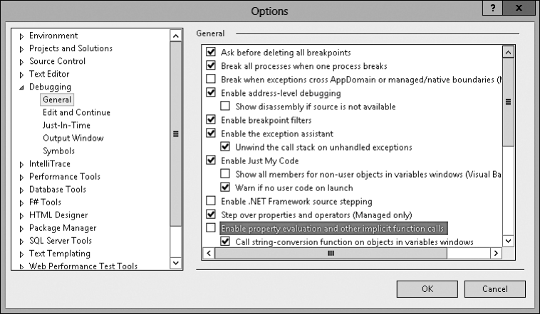


**рис. 10.1.** .Настройки.отладчика.Visual.Studio 

## **инициализаторы объектов и коллекций** 

Создание объекта с заданием некоторых открытых свойств (или полей) — чрезвычайно распространенная операция. Для ее упрощения в C# предусмотрен специальный синтаксис инициализации объекта, например: 

Employee e = new Employee() { Name = "Jeff", Age = 45 }; 

В этом выражении я создаю объект `Employee` , вызывая его конструктор без параметров, и затем назначаю открытому свойству `Name` значение `Jeff` , а открытому свойству `Age` — значение 45. Этот код идентичен следующему коду (в этом нетрудно убедиться, просмотрев IL-код обоих фрагментов): 

```
Employee e = new Employee();
e.Name = "Jeff";
e.Age = 45;
```

Реальная выгода от синтаксиса инициализатора объекта состоит в том, что он позволяет программировать в контексте выражения, строя функции, которые улучшают читабельность кода. Например, можно написать: 

String s = new Employee() { Name = "Jeff", Age = 45 }.ToString().ToUpper(); 

В одном выражении я сконструировал объект `Employee` , вызвал его конструктор, инициализировал два открытых свойства, вызвал метод `ToString` , а затем метод 

**272** Глава.10 .Свойства 

`ToUpper` . С# также позволяет опустить круглые скобки перед открывающей фигурной скобкой, если вы хотите вызвать конструктор без параметров. Для следующего фрагмента генерируется программный код, идентичный предыдущему: 

String s = new Employee { Name = "Jeff", Age = 45 }.ToString().ToUpper(); 

Если тип свойства реализует интерфейс `IEnumerable` или `IEnumerable<T>` , то свойство является коллекцией, а инициализация коллекции является дополняющей операцией (а не заменяющей). Например, пусть имеется следующее определение класса: 

```
public sealed class Classroom {
  private List<String> m_students = new List<String>();
  public List<String> Students { get { return m_students; } }
```

```
  public Classroom() {}
}
```

Следующий код создает объект `Classroom` и инициализирует коллекцию `Students` : 

`public static void M() { Classroom classroom = new Classroom {` Students = { "Jeff", "Kristin", "Aidan", "Grant" } `};` // Вывести имена 4 студентов, находящихся в классе `foreach (var student in classroom.Students) Console.WriteLine(student); }` 

Во время компиляции этого кода компилятор увидит, что свойство `Students` имеет тип `List<String>` и что этот тип реализует интерфейс `IEnumerable<String>` . Компилятор предполагает, что тип `List<String>` предоставляет метод с именем `Add` (потому что большинство классов коллекций предоставляет метод `Add` для добавления элементов в коллекцию). Затем компилятор сгенерирует код для вызова метода `Add` коллекции. В результате представленный код будет преобразован компилятором в следующий: 

```
public static void M() {
  Classroom classroom = new Classroom();
  classroom.Students.Add("Jeff");
  classroom.Students.Add("Kristin");
  classroom.Students.Add("Aidan");
  classroom.Students.Add("Grant");
```

> // Вывести имена 4 студентов, находящихся в классе `foreach (var student in classroom.Students) Console.WriteLine(student);` 

```
}
```

Свойства.без.параметров **273** 

Если тип свойства реализует интерфейс `IEnumerable` или `IEnumerable<T>` , но не предлагает метод `Add` , тогда компилятор не разрешит использовать синтаксис инициализации коллекции для добавления элемента в коллекцию, вместо этого компилятор выведет такое сообщение (ошибка CS0117: `System.Collections. Generic.IEnumerable<string>` не содержит определения для `Add` ): 

error CS0117: 'System.Collections.Generic.IEnumerable<string>' does not contain a definition for 'Add' 

Некоторые методы `Add` принимают различные аргументы. Например, вот метод `Add` класса `Dictionary` : 

public void Add(TKey key, TValue value); 

При инициализации коллекции методу `Add` можно передать несколько аргументов, для чего используется синтаксис с фигурными скобками: 

var table = new Dictionary<String, Int32> { { "Jeffrey", 1 }, { "Kristin", 2 }, { "Aidan", 3 }, { "Grant", 4 } `};` 

Это равносильно следующему коду: 

var table = new Dictionary<String, Int32>(); table.Add("Jeffrey", 1); table.Add("Kristin", 2); table.Add("Aidan", 3); table.Add("Grant", 4); 

## **анонимные типы** 

Механизм анонимных типов в С# позволяет автоматически объявить кортежный тип при помощи простого синтаксиса. _Кортежный тип_ (tuple type)[1] — это тип, который содержит коллекцию свойств, каким-то образом связанных друг с другом. В первой строке следующего программного кода я определяю класс с двумя свойствами ( `Name` типа `String` и `Year` типа `Int32` ), создаю экземпляр этого типа и назначаю свойству `Name` значение `Jeff` , а свойству `Year` — значение 1964. 

// Определение типа, создание сущности и инициализация свойств var o1 = new { Name = "Jeff", Year = 1964 }; 

// Вывод свойств на консоль Console.WriteLine("Name={0}, Year={1}", o1.Name, o1.Year); // Выводит: // Name=Jeff, Year=1964 

Здесь создается анонимный тип, потому что не был определен тип имени после слова `new` , таким образом, компилятор автоматически создает имя типа, но не со- 

> 1 Термин «tuple» возник как «обобщение» последовательности: single, double, triple, quadruple, quintuple, n-tuple. 

**274** Глава.10 .Свойства 

общает какое оно (поэтому тип и назван анонимным). Использование синтаксиса инициализации объекта обсуждалось в предыдущем разделе. Итак, я, как разработчик, не имею понятия об имени типа на этапе компиляции и не знаю, с каким типом была объявлена переменная `o1` . Однако проблемы здесь нет — я могу использовать механизм неявной типизации локальной переменной, о котором говорится в главе 9, чтобы компилятор определил тип по выражению в правой части оператора `=` присваивания ( ). 

Итак, посмотрим, что же действительно делает компилятор. Обратите внимание на следующий код: 

var o = new { property1 = expression1, ..., propertyN = expressionN }; 

Когда вы пишете этот код, компилятор определяет тип каждого выражения, создает закрытые поля этих типов, для каждого типа поля создает открытые свойства только для чтения и для всех этих выражений создает конструктор. Код конструктора инициализирует закрытые поля только для чтения путем вычисления результирующих значений. В дополнение к этому, компилятор переопределяет методы `Equals` , `GetHashCode` и `ToString` объекта и генерирует код внутри всех этих методов. Класс, создаваемый компилятором, выглядит следующим образом: 

`[CompilerGenerated] internal sealed class <>f__AnonymousType0<...>: Object { private readonly t1 f1; public t1 p1 { get { return f1; } } ... private readonly tn fn; public tn pn { get { return fn; } }` public <>f__AnonymousType0<...>(t1 a1, ..., tn an) { f1 = a1; ...; fn = an; // Назначает все поля `} public override Boolean Equals(Object value) {` // Возвращает false, если какие-либо поля не совпадают; // иначе возвращается true `} public override Int32 GetHashCode() {` // Возвращает хеш-код, сгенерированный из хеш-кодов полей `} public override String ToString() {` // Возвращает пары "name = value", разделенные точками `} }` 

Компилятор генерирует методы `Equals` и `GetHashCode` , чтобы экземпляры анонимного типа моги размещаться в хеш-таблицах. Неизменяемые свойства, в отличие 

Свойства.без.параметров **275** 

от свойств для чтения и записи, помогают защитить хеш-код объекта от изменений. Изменение хеш-кода объекта, используемого в качестве ключа в хеш-таблице, может помешать нахождению объекта. Компилятор генерирует метод `ToString` для упрощения отладки. В отладчике Visual Studio можно навести указатель мыши на переменную, связанную с экземпляром анонимного типа, и Visual Studio вызовет метод `ToString` и покажет результирующую строку в окне подсказки. Кстати, IntelliSense-окно в Visual Studio будет предлагать имена свойств в процессе написания кода в редакторе — очень полезная функция. 

Компилятор поддерживает два дополнительных варианта синтаксиса объявления свойства внутри анонимного типа, где на основании переменных определяются имена и типы свойств: 

```
String Name = "Grant";
DateTime dt = DateTime.Now;
```

// Анонимный тип с двумя свойствами 

// 1. Строковому свойству Name назначено значение Grant // 2. Свойству Year типа Int32 Year назначен год из dt var o2 = new { Name, dt.Year }; 

В данном примере компилятор определяет, что первое свойство должно называться `Name` . Так как `Name` — это имя локальной переменной, то компилятор устанавливает значение типа свойства аналогичного типу локальной переменной, то есть `String` . Для второго свойства компилятор использует имя поля/свойства: `Year` . `Year` — свойство класса `DateTime` с типом `Int32` , а следовательно, свойство `Year` в анонимном типе будет относиться к типу `Int32` . Когда компилятор создает экземпляр анонимного типа, он назначает экземпляру `Name` свойство с тем же значением, что и у локальной переменной `Name` , так что свойство `Name` будет связано со строкой `Grant` . Компилятор назначит свойству экземпляра `Year` то же значение, что и возвращаемое значение из `dt` свойства `Year` . 

Компилятор очень разумно выясняет анонимный тип. Если компилятор видит, что вы определили множество анонимных типов с идентичными структурами, то он создает одно определение для анонимного типа и множество экземпляров этого типа. Под одинаковой структурой я подразумеваю, что анонимные типы имеют одинаковые тип и имя для каждого свойства и что эти свойства определены в одинаковом порядке. В коде из приведенного примера тип переменной `o1` и тип переменной `o2` одинаков, так как в двух строках кода определен анонимный тип со свойством `Name/String` и `Year/Int32` , и `Name` стоит перед `Year` . 

Раз две переменные относятся к одному типу, открывается масса полезных возможностей — например, проверить, содержат ли два объекта одинаковые значения, и присвоить ссылку на один объект переменной другого объекта: 

// Совпадение типов позволяет осуществлять операции сравнения и присваивания `Console.WriteLine("Objects are equal: " + o1.Equals(o2));` o1 = o2; // Присваивание 

**276** Глава.10 .Свойства 

Раз эти типы идентичны, то можно создать массив явных типов из анонимных типов (о массивах см. главу 16): 

// Это работает, так как все объекты имею один анонимный тип `var people = new[] {` o1, // См. ранее в этом разделе new { Name = "Kristin", Year = 1970 }, new { Name = "Aidan", Year = 2003 }, new { Name = "Grant", Year = 2008 } `};` // Организация перебора массива анонимных типов // (ключевое слово var обязательно). `foreach (var person in people)` Console.WriteLine("Person={0}, Year={1}", person.Name, person.Year); 

Анонимные типы обычно используются с технологией языка интегрированных запросов (Language Integrated Query, LINQ), когда в результате выполнения запроса создается коллекция объектов, относящихся к одному анонимному типу, после чего производится обработка объектов в полученной коллекции. Все это делается в одном методе. В следующем примере все файлы из папки с моими документами, которые были изменены в последние семь дней: 

`String myDocuments = Environment.GetFolderPath(Environment.SpecialFolder.MyDocuments); var query = from pathname in Directory.GetFiles(myDocuments) let LastWriteTime = File.GetLastWriteTime(pathname) where LastWriteTime > (DateTime.Now - TimeSpan.FromDays(7)) orderby LastWriteTime` select new { Path = pathname, LastWriteTime }; 

`foreach (var file in query)` Console.WriteLine("LastWriteTime={0}, Path={1}", file.LastWriteTime, file.Path); 

Экземпляры анонимного типа не должны выходить за пределы метода. В прототипе метода не может содержаться параметр анонимного типа, так как задать анонимный тип невозможно. По тому же принципу метод не может возвращать ссылку на анонимный тип. Хотя экземпляр анонимного типа может интерпретироваться как `Object` (все анонимные типы являются производными от `Object` ), преобразовать переменную типа `Object` обратно к анонимному типу невозможно, потому что имя анонимного типа на этапе компиляции неизвестно. Для передачи кортежного типа следует использовать тип `System.Tuple` , о котором речь идет в следующем разделе. 

## **тип System.Tuple** 

В пространстве имен `System` определено несколько обобщенных кортежных типов (все они наследуются от класса `Object` ), которые отличаются количеством обобщенных параметров. Приведу наиболее простую и наиболее сложную формы записи. 

Свойства.без.параметров **277** 

//  Простая форма: `[Serializable] public class Tuple<T1> { private T1 m_Item1; public Tuple(T1 item1) { m_Item1 = item1; } public T1 Item1 { get { return m_Item1; } } }` // Сложная форма: `[Serializable]` public class Tuple<T1, T2, T3, T4, T5, T6, T7, TRest> { `private T1 m_Item1; private T2 m_Item2; private T3 m_Item3; private T4 m_Item4; private T5 m_Item5; private T6 m_Item6; private T7 m_Item7; private TRestm_Rest;` public Tuple(T1 item1, T2 item2, T3 item3, T4 item4, T5 item5, T6 item6, T7 item7, TRest t) { `m_Item1 = item1; m_Item2 = item2; m_Item3 = item3; m_Item4 = item4; m_Item5 = item5; m_Item6 = item6; m_Item7 = item7; m_Rest = rest; }` 

```
  public T1 Item1 { get { return m_Item1; } }
  public T2 Item2 { get { return m_Item2; } }
  public T3 Item3 { get { return m_Item3; } }
  public T4 Item4 { get { return m_Item4; } }
  public T5 Item5 { get { return m_Item5; } }
  public T6 Item6 { get { return m_Item6; } }
  public T7 Item7 { get { return m_Item7; } }
  public TRest Rest { get { return m_Rest; } }
}
```

Как и объекты анонимного типа, объект `Tuple` создается один раз и остается неименным (все свойства доступны только для чтения). Я не привожу соответствующих примеров, но классы `Tuple` также позволяют использовать методы `CompareTo` , `Equals` , `GetHashCode` и `ToString` , как и свойство `Size` . К тому же все типы `Tuple` реализуют интерфейсы `IStructuralEquatable` , `IStructuralComparable` и `IComparable` , поэтому вы можете сравнивать два объекта типа `Tuple` друг с другом и смотреть, как их поля сравниваются. Для детального изучения этих методов и интерфейсов посмотрите документацию SDK. 

Приведу пример метода, использующего тип `Tuple` для возвращения двух частей информации в вызывающий метод. 

// Возвращает минимум в Item1 и максимум в Item2 private static Tuple<Int32, Int32>MinMax(Int32 a, Int32 b) { return new Tuple<Int32, Int32>(Math.Min(a, b), Math.Max(a, b)); `}` 

// Пример вызова метода и использования Tuple `private static void TupleTypes() {` varminmax = MinMax(6, 2); 

_продолжение_  

**278** Глава.10 .Свойства 

Console.WriteLine("Min={0}, Max={1}", minmax.Item1, minmax.Item2);         // Min=2, Max=6 

```
}
```

Конечно, очень важно, чтобы и производитель, и потребитель типа `Tuple` имели четкое представление о том, что будет возвращаться в свойствах `Item#` . С анонимными типами свойства получают действительные имена на основе программного кода, определяющего анонимный тип. С типами `Tuple` свойства получают их имена автоматически, и вы не можете их изменить. К несчастью, эти имена не имеют настоящего значения и смысла, а зависят от производителя и потребителя. Это также ухудшает читабельность кода и удобство его сопровождения, так что вы должны добавлять комментарии к коду, чтобы объяснить, что именно производитель/потребитель имеет в виду. 

Компилятор может только подразумевать обобщенный тип во время вызова обобщенного метода, а не тогда, когда вы вызываете конструктор. В силу этой причины пространство имен `System` содержит статический необобщенный класс `Tuple` с набором статических методов `Create` , которые могут определять обобщенные типы по аргументам. Этот класс действует как фабрика по производству объектов типа `Tuple` и существует просто для упрощения вашего кода. Вот переписанная с использованием статического класса `Tuple` версия метода `MinMax` : 

// Возвращает минимум в Item1 и максимум в Item2 private static Tuple<Int32, Int32>MinMax(Int32 a, Int32 b) { return Tuple.Create(Math.Min(a, b), Math.Max(a, b)); // Упрощенный // синтаксис 

## `}` 

Чтобы создать тип `Tuple` с более, чем восьмью элементами, передайте другой объект `Tuple` в параметре `Rest` : 

var t = Tuple.Create(0, 1, 2, 3, 4, 5, 6, Tuple.Create(7, 8)); Console.WriteLine("{0}, {1}, {2}, {3}, {4}, {5}, {6}, {7}, {8}", t.Item1, t.Item2, t.Item3, t.Item4, t.Item5, t.Item6, t.Item7, t.Rest.Item1.Item1, t.Rest.Item1.Item2); 

## **ПриМеЧание** 

Кроме.анонимных.и.кортежных.типов,.стоит.присмотреться.к.классу.System Dynamic ExpandoObject.(определенному.в.сборке.System Core dll.assembly) .При.использовании.этого.класса.с.динамическим.типом.C#.(о.котором.говорится.в.главе.5).появляется. другой.способ.группировки.наборов.свойств.(пар.ключ-значение).вместе .Полученный.в.результате.тип.не.обладает.безопасностью.типов.на.стадии.компиляции,.зато. синтаксис.выглядит.отлично.(хотя.вы.лишаетесь.поддержки.IntelliSense),.а.объекты. ExpandoObject.могут.передаваться.между.C#.и.такими.динамическими.языками,.как. Python .Пример.кода.с.использованием.объекта.ExpandoObject: 

`dynamic e = new System.Dynamic.ExpandoObject();` e.x = 6;       // Добавление свойства 'x' типа Int32 // со значением 6 

Свойства.с.параметрами **279** 

e.y = "Jeff";  // Добавление свойства 'y' строкового типа // со значением "Jeff" e.z = null;    // Добавление свойста 'z' объекта // со значением null // Просмотр всех свойств и других значений foreach (var v in (IDictionary<String, Object>)e) Console.WriteLine("Key={0}, V={1}", v.Key, v.Value); // Удаление свойства 'x' и его значения var d = (IDictionary<String, Object>)e; `d.Remove("x");` 

## **свойства с параметрами** 

У свойств, рассмотренных в предыдущем разделе, методы доступа `get` не принимали параметры. Поэтому я называю их _свойствами без параметров_ (parameterless properties). Они проще, так как их использование напоминает обращение к полю. Помимо таких «полеобразных» свойств, языки программирования поддерживают то, что я называю _свойствами с параметрами_ (parameterful properties). У таких свойств методы доступа `get` получают один или несколько параметров. Разные языки поддерживают свойства с параметрами по-разному. Кроме того, в разных языках свойства с параметрами называют по-разному: в C# — индексаторы, в Visual Basic — _свойства по умолчанию_ . Здесь я остановлюсь на поддержке _индексаторов_ в C# на основе свойств с параметрами. 

В C# синтаксис свойств с параметрами (индексаторов) напоминает синтаксис массивов. Иначе говоря, индексатор можно представить как средство, позволяющее разработчику на C# перегружать оператор `[]` . В следующем примере класс `BitArray` позволяет индексировать набор битов, поддерживаемый экземпляром типа, с использованием синтаксиса массива: 

```
using System;
```

`public sealed class BitArray {` // Закрытый байтовый массив, хранящий биты `private Byte[] m_byteArray; private Int32  m_numBits;` 

// Конструктор, выделяющий память для байтового массива 

// и устанавливающий все биты в 0 `public BitArray(Int32 numBits) {` 

// Начинаем с проверки аргументов `if (numBits <= 0) throw new ArgumentOutOfRangeException("numBits must be > 0");` 

// Сохранить число битов 

```
    m_numBits = numBits;
```

> // Выделить байты для массива битов 

_продолжение_  

**280** Глава.10 .Свойства 

`m_byteArray = new Byte[(numBits + 7) / 8]; }` // Индексатор (свойство с параметрами) `public Boolean this[Int32 bitPos] {` // Метод доступа get индексатора `get {` // Сначала нужно проверить аргументы `if ((bitPos < 0) || (bitPos >= m_numBits)) throw new ArgumentOutOfRangeException("bitPos");` // Вернуть состояние индексируемого бита `return (m_byteArray[bitPos / 8] & (1 << (bitPos % 8))) != 0; }` // Метод доступа set индексатора `set { if ((bitPos < 0) || (bitPos >= m_numBits)) throw new ArgumentOutOfRangeException(` "bitPos", bitPos.ToString()); `if (value) {` // Установить индексируемый бит `m_byteArray[bitPos / 8] = (Byte) (m_byteArray[bitPos / 8] | (1 << (bitPos % 8))); } else {` // Сбросить индексируемый бит `m_byteArray[bitPos / 8] = (Byte) (m_byteArray[bitPos / 8] & ~(1 << (bitPos % 8))); } } } }` 

Использовать индексатор типа `BitArray` невероятно просто: 

// Выделить массив BitArray, который может хранить 14 бит `BitArray ba = new BitArray(14);` // Установить все четные биты вызовом метода доступа set `for (Int32 x = 0; x < 14; x++) { ba[x] = (x % 2 == 0); }` // Вывести состояние всех битов вызовом метода доступа get `for (Int32 x = 0; x < 14; x++) { Console.WriteLine("Bit " + x + " is " + (ba[x] ? "On" : "Off")); }` 

В типе `BitArray` индексатор принимает один параметр `bitPos` типа `Int32` . У каждого индексатора должен быть хотя бы один параметр, но параметров может быть и больше. Тип параметров (как и тип возвращаемого значения) может быть любым. Пример индексатора с несколькими параметрами можно найти в классе `System.Drawing.Imaging.ColorMatrix` из сборки `System.Drawing.dll` . 

Свойства.с.параметрами **281** 

Индексаторы довольно часто создаются для поиска значений в ассоциативном массиве. Тип `System.Collections.Generic.Dictionary` предлагает индексатор, который принимает ключ и возвращает связанное с ключом значение. В отличие от свойств без параметров, тип может поддерживать множество перегруженных индексаторов при условии, что их сигнатуры различны. 

Подобно методу доступа `set` свойства без параметров, метод доступа `set` индексатора содержит скрытый параметр (в C# его называют `value` ), который указывает новое значение «индексируемого элемента». 

CLR не различает свойства без параметров и с параметрами. Для среды любое свойство — это всего лишь пара методов, определенных внутри типа. Как уже отмечалось, в различных языках синтаксис создания и использования свойств с параметрами разный. Использование для индексатора в C# конструкции `this[...]` — всего лишь решение, принятое создателями языка, означающее, что в C# индексаторы могут определяться только для экземпляров объектов. В C# нет синтаксиса, позволяющего разработчику определять статистическое свойство-индексатор напрямую, хотя на самом деле CLR поддерживает статические свойства с параметрами. 

Поскольку CLR обрабатывает свойства с параметрами и без них одинаково, компилятор генерирует в итоговой управляемой сборке два или три элемента из следующего списка: 

- метод `get` свойства с параметрами генерируется только в том случае, если у свойства определен метод доступа `get` ; 

- метод `set` свойства с параметрами генерируется только в том случае, если у свойства определен метод доступа `set` ; 

- определение свойства в метаданных управляемого модуля генерируется всегда; в метаданных нет отдельной таблицы для хранения определений свойств с параметрами: ведь для CLR свойства с параметрами — просто свойства. 

Компиляция показанного ранее индексатора типа `BitArray` происходит так, как если бы он исходно был написан следующим образом: 

```
public sealed class BitArray {
```

// Метод доступа get индексатора `public Boolean get_Item(Int32 bitPos) { /* ... */ }` 

// Метод доступа set индексатора public void set_Item(Int32 bitPos, Boolean value) { /* ... */ } `}` 

Компилятор автоматически генерирует имена этих методов, добавляя к _имени индексатора_ префикс `get_` или `set_` . Поскольку синтаксис индексаторов в C# не позволяет разработчику задавать имя индексатора, создателям компилятора C# пришлось самостоятельно выбрать имя для методов доступа, и они выбрали `Item` . Поэтому имена созданных компилятором методов — `get_Item` и `set_Item` . 

**282** Глава.10 .Свойства 

Если в справочной документации .NET Framework указано, что тип поддерживает свойство `Item` , значит, данный тип поддерживает индексатор. Так, тип `System. Collections.Generic.List` предлагает открытое экземплярное свойство `Item` , которое является индексатором объекта `List` . 

Программируя на C#, вы никогда не увидите имя `Item` , поэтому выбор его компилятором обычно не должен вызывать беспокойства. Однако если вы разрабатываете индексатор для типа, который будет использоваться в программах, написанных на других языках, возможно, придется изменить имена методов доступа индексатора ( `get` и `set` ). C# позволяет переименовать эти методы, применив к индексатору пользовательский атрибут `System.Runtime.CompilerServices. IndexerNameAttribute` . Пример: 

```
using System;
using System.Runtime.CompilerServices;
```

```
public sealed class BitArray {
```

`[IndexerName("Bit")] public Boolean this[Int32 bitPos] {` // Здесь определен по крайней мере один метод доступа `} }` 

Теперь компилятор сгенерирует вместо методов `get_Item` и `set_Item` методы `get_Bit` и `set_Bit` . Во время компиляции компилятор C# обнаруживает атрибут `IndexerName` , который сообщает ему, какие имена следует присвоить методам и метаданным свойств; сам по себе атрибут не включается в метаданные сборки[1] . 

Приведу фрагмент кода на языке Visual Basic, демонстрирующий обращение к индексатору, написанному на C#: 

' Создать экземпляр типа BitArray `Dim ba as New BitArray(10)` 

' В Visual Basic индекс элемента массива задается в круглых скобках (), ' а не в квадратных []. Console.WriteLine(ba(2)) " Выводит True или False 

' Visual Basic также позволяет обращаться к индексатору по имени Console.WriteLine(ba.Bit(2)) ' Выводит то же, что предыдущая строка 

В C# в одном типе можно определять несколько индексаторов при условии, что они получают разные наборы параметров. В других языках программирования атрибут `IndexerName` позволяет задать несколько индексаторов с одинаковой сигнатурой, поскольку их имена могут отличаться. Однако C# не допускает этого, так как принятый в C# синтаксис не позволяет ссылаться на индексатор по имени, 

> 1 По этой причине класс IndexerNameAttribute не входит в описанные в ECMA стандарты CLI и языка C#. 

Свойства.с.параметрами **283** 

а значит, компилятор не будет знать, на какой индексатор ссылаются. При попытке компиляции следующего исходного текста на C# компилятор выдает сообщение об ошибке (ошибка CS0111: в классе `SomeType` уже определен член `this` с таким же типом параметра): 

error CS0111: Class 'SomeType' already defines a member called 'this' with the same `parameter types` 

Фрагмент кода, приводящий к выдаче этого сообщения: 

```
using System;
using System.Runtime.CompilerServices;
public sealed class SomeType {
```

// Определяем метод доступа get_Item `public Int32 this[Boolean b] { get { return 0; } }` // Определяем метод доступа get_Jeff `[IndexerName("Jeff")] public String this[Boolean b] { get { return null; } } }` 

Как видите, C# рассматривает индексаторы как механизм перегрузки оператора `[]` , и этот оператор не позволяет различать свойства с одинаковыми наборами параметров и разными именами методов доступа. 

Кстати, в качестве примера типа с измененным именем индексатора можно привести тип `System.String` , в котором индексатор `String` именуется `Chars` , а не `Item` . Это свойство позволяет получать отдельные символы из строки. Было решено, что для языков программирования, не использующих синтаксис с оператором `[]` для вызова этого свойства, имя `Chars` будет более информативно. 

Обнаружив попытку чтения или записи индексатора, компилятор C# генерирует вызов соответствующего метода доступа. Некоторые языки программирования могут не поддерживать свойства с параметрами. Чтобы получить доступ к свойству с параметрами из программы на таком языке, нужно явно вызвать желаемый метод доступа. CLR не различает свойства с параметрами и без параметров, поэтому для поиска связи между свойством с параметрами и его методами доступа используется все тот же класс `System.Reflection.PropertyInfo` . 

## **Выбор главного свойства с параметрами** 

При анализе ограничений, которые C# налагает на индексаторы, возникает два вопроса: 

**284** Глава.10 .Свойства 

- Что если язык, на котором написан тип, позволяет разработчику определить несколько свойств с параметрами? 

- Как использовать этот тип в программе на C#? 

Ответ: в этом типе надо выбрать один из методов среди свойств с параметрами и сделать его свойством по умолчанию, применив к самому классу экземпляр `System.Reflection.DefaultMemberAttribute` . Кстати, `DefaultMemberAttribute` можно применять к классам, структурам или интерфейсам. В С# при компиляции типа, определяющего свойства с параметрами, компилятор автоматически применяет к определяющему типу экземпляр атрибута `DefaultMember` и учитывает его при использовании атрибута `IndexerName` . Конструктор этого атрибута задает имя, которое будет назначено свойству с параметрами, выбранному как свойство по умолчанию для этого типа. 

Итак, в C# при определении типа, у которого есть свойство с параметрами, но нет атрибута `IndexerName` , атрибут `DefaultMember` , задающий определяющий тип, будет указывать имя `Item` . Если применить к свойству с параметрами атрибут `IndexerName` , то атрибут `DefaultMember` определяющего типа будет указывать на строку, заданную атрибутом `IndexerName` . Помните: C# не будет компилировать код, содержащий разноименные свойства с параметрами. 

В программах на языке, поддерживающем несколько свойств с параметрами, нужно выбрать один метод свойства и пометить его атрибутом `DefaultMember` . Это будет единственное свойство с параметрами, доступное программам на C#. 

## **Производительность при вызове методов доступа** 

В случае простых методов доступа `get` и `set` JIT-компилятор _подставляет_ (inlines) код метода доступа внутрь кода вызываемого метода, поэтому характерного снижения производительности работы программы, проявляющегося при использовании свойств вместо полей, не наблюдается. Подстановка подразумевает компиляцию кода метода (или, в данном случае, метода доступа) непосредственно вместе с кодом вызывающего метода. Это избавляет от дополнительной нагрузки, связанной с вызовом во время выполнения, но за счет увеличения объема кода откомпилированного метода. Поскольку методы доступа свойств обычно содержат мало кода, их подстановка может приводить к сокращению общего объема машинного кода, а значит, к повышению скорости выполнения. 

Заметьте, что при отладке JIT-компилятор не подставляет методы свойств, потому что подставленный код сложнее отлаживать. Это означает, что эффективность доступа к свойству в готовой версии программы выше, чем в отладочной. Что же касается полей, то скорость доступа к ним одинакова в обеих версиях. 

Обобщенные.методы.доступа.свойств **285** 

## **доступность методов доступа свойств** 

Иногда при проектировании типа требуется назначить методам доступа `get` и `set` разный уровень доступа. Чаще всего применяют открытый метод доступа `get` и закрытый метод доступа `set` : 

```
public class SomeType {
  private String m_name;
  public String Name {
    get { return m_name; }
    protected set {m_name = value; }
  }
}
```

Как видно из кода, свойство `Name` объявлено как `public` , а это означает, что метод доступа `get` будет открытым и доступным для вызова из любого кода. Однако следует учесть, что метод доступа `set` объявлен как `protected` , то есть он доступен для вызова только из кода `SomeType` или кода класса, производного от `SomeType` . 

При определении для свойства методов доступа с различными уровнями доступа синтаксис C# требует, чтобы само свойство было объявлено с наименее строгим уровнем доступа, а более жесткое ограничение было наложено только на один из методов доступа. В этом примере свойство является открытым, а метод доступа `set` — защищенным (более ограниченным по сравнению с `public` ). 

## **Обобщенные методы доступа свойств** 

Поскольку свойства фактически представляют собой методы, а C# и CLR поддерживают параметризацию методов, некоторые разработчики пытаются определить свойства с собственными параметрами-типами (вместо использования таких параметров из внешнего типа). Однако C# не позволяет этого делать. Главная причина в том, что обобщения свойств лишены смысла с концептуальной точки зрения. Предполагается, что свойство представляет характеристику объекта, которую можно прочитать или задать. Введение обобщенного параметра типа означало бы, что поведение операции чтения/записи может меняться, но на концептуальном уровне от свойства не ожидается никакого поведения. Для задания какого-либо поведения объекта (обобщенного или нет) следует создать метод, а не свойство. 

## **Глава 11. события** 

В этой главе рассматривается последняя разновидность членов, которые можно определить в типе, — события. Тип, в котором определено событие (или экземпляры этого типа), может уведомлять другие объекты о некоторых особых ситуациях, которые могут случиться. Например, если в классе `Button` (кнопка) определить событие `Click` (щелчок), то в приложение можно использовать объекты, которые будут получать уведомление о щелчке объекта `Button` , а получив такое уведомление — исполнять некоторые действия. События — это члены типа, обеспечивающие такого рода взаимодействие. А именно определения события в типе означает, что тип поддерживает следующие возможности: 

- регистрация своей заинтересованности в событии; 

- отмена регистрации своей заинтересованности в событии; 

- оповещение зарегистрированных методов о произошедшем событии. 

Типы могут предоставлять эту функциональность при определении событий, так как они поддерживают список зарегистрированных методов. Когда событие происходит, тип уведомляет об этом все зарегистрированные методы. 

Модель событий CLR основана на _делегатах_ (delegate). Делегаты обеспечивают реализацию механизма обратного вызова, безопасную по отношению к типам. Методы обратного вызова (callback methods) позволяют объекту получать уведомления, на которые он подписался. В этой главе мы будем постоянно пользоваться делегатами, но их детальный разбор отложим до главы 17. 

Чтобы помочь вам в полной мере разобраться в работе событий в CLR, я начну с примера ситуации, в которой могут пригодиться события. Допустим, мы проектируем почтовое приложение. Получив сообщение по электронной почте, пользователь может захотеть переслать его на факс или пейджер. Допустим, вы начали проектирование приложения с разработки типа `MailManager` , получающего входящие сообщения. Тип `MailManager` будет поддерживать событие `NewMail` . Другие типы (например, `Fax` или `Pager` ) могут регистрироваться для получения уведомлений об этом событии. Когда тип `MailManager` получит новое сообщение, он инициирует событие, в результате чего сообщение будет получено всеми зарегистрированными объектами. Далее каждый объект обрабатывает сообщение так, как считает нужным. 

Пусть во время инициализации приложения создается только один экземпляр `MailManager` и любое число объектов `Fax` и `Pager` . На рис. 11.1 показано, как инициализируется приложение и что происходит при получении сообщения. 

Разработка.типа,.поддерживающего.событие 

**287** 


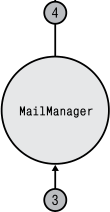


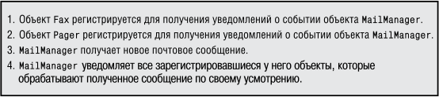


**рис. 11.1.** .Архитектура.приложения,.в.котором.используются.события 

При инициализации приложения создается экземпляр объекта `MailManager` , поддерживающего событие `NewMail` . Во время создания объекты `Fax` и `Pager` регистрируются в качестве получателей уведомлений о событии `NewMail` (приход нового сообщения) объекта `MailManager` , в результате `MailManager` «знает», что эти объекты следует уведомить о появлении нового сообщения. Если в дальнейшем `MailManager` получит новое сообщение, это приведет к вызову события `NewMail` , позволяющего всем зарегистрировавшимся объектам выполнить требуемую обработку нового сообщения. 

## **разработка типа, поддерживающего событие** 

Для создания типа, поддерживающего одно или более событий, разработчик должен выполнить ряд действий. Все эти действия будут описаны ниже. Наше приложение `MailManager` (его можно загрузить в разделе Books сайта http://wintellect com) содержит весь необходимый код типов `MailManager` , `Fax` и `Pager` . Как вы заметите, типы `Fax` и `Pager` практически идентичны. 

**288** Глава.11 .События 

## **Этап 1. Определение типа для хранения всей дополнительной информации, передаваемой получателям уведомления о событии** 

При возникновении события объект, в котором оно возникло, должен передать дополнительную информацию объектам-получателям уведомления о событии. Для предоставления получателям эту информацию нужно инкапсулировать в собственный класс, содержащий набор закрытых полей и набор открытых неизменяемых (только для чтения) свойств. В соответствии с соглашением, классы, содержащие информацию о событиях, передаваемую обработчику события, должны наследовать от типа `System.EventArgs` , а имя типа должно заканчиваться словом `EventArgs` . В этом примере у типа `NewMailEventArgs` есть поля, идентифицирующие отправителя сообщения ( `m_from` ), его получателя ( `m_to` ) и тему ( `m_subject` ). 

// Этап 1. Определение типа для хранения информации, // которая передается получателям уведомления о событии `internal class NewMailEventArgs : EventArgs {` 

private readonly String m_from, m_to, m_subject; 

public NewMailEventArgs(String from, String to, String subject) { `m_from = from; m_to = to; m_subject = subject; }` 

```
  public String From { get { return m_from; } }
  public String To { get { return m_to; } }
  public String Subject { get { return m_subject; } }
}
```

## **ПриМеЧание** 

Тип.EventArgs.определяется.в.библиотеке.классов. NET.Framework.Class.Library.(FCL). и.выглядит.примерно.следующим.образом: 

[ComVisible(true), Serializable] `public class EventArgs { public static readonly EventArgs Empty = new EventArgs(); public EventArgs() { } }` 

Как.видите,.в.этом.классе.нет.ничего.особенного .Он.просто.служит.базовым.типом,. от.которого.можно.порождать.другие.типы .С.большинством.событий.не.передается. дополнительной.информации .Например,.в.случае.уведомления.объектом.Button. о.щелчке.на.кнопке,.само.обращение.к.методу.обратного.вызова.—.и.есть.вся.нужная.информация .Определяя.событие,.не.передающее.дополнительные.данные,. можно.не.создавать.новый.объект.Event-Args,.достаточно.просто.воспользоваться. свойством.EventArgs Empty 

Разработка.типа,.поддерживающего.событие 

**289** 

## **Этап 2. Определение члена-события** 

В C# событие объявляется с ключевым словом `event` . Каждому члену-событию назначаются область действия (практически всегда он открытый, поэтому доступен из любого кода), тип делегата, указывающий на прототип вызываемого метода (или методов), и имя (любой допустимый идентификатор). Вот как выглядит членсобытие нашего класса `NewMail` : 

```
internal class MailManager {
```

// Этап 2. Определение члена-события `public event EventHandler<NewMailEventArgs> NewMail;` 

```
  ...
```

```
}
```

Здесь `NewMail` — имя события, а типом события является `EventHandler <NewMailEventArgs>` . Это означает, что получатели уведомления о событии должны предоставлять метод обратного вызова, прототип которого соответствует типуделегату `EventHandler<NewMailEventArgs>` . Так как обобщенный делегат `System. EventHandler` определен следующим образом: 

```
public delegate void EventHandler<TEventArgs>
```

(Object sender, TEventArgs e) where TEventArgs: EventArgs; 

Поэтому прототип метода должен выглядеть так: 

void MethodName(Object sender, NewMailEventArgs e); 

## **ПриМеЧание** 

Многих.удивляет,.почему.механизм.событий.требует,.чтобы.параметр.sender.имел. тип.Object .Вообще-то,.поскольку.MailManager.—.единственный.тип,.реализующий. события.с.объектом.NewMailEventArgs,.было.бы.разумнее.использовать.следующий. прототип.метода.обратного.вызова: 

void MethodName(MailManager sender, NewMailEventArgs e); 

Причиной.того,.что.параметр.sender.имеет.тип.Object,.является.наследование . Что.произойдет,.если.MailManager.задействовать.в.качестве.базового.класса.для. создания.класса.SmtpMailManager?.В.методе.обратного.вызова.придется.в.прототипе.задать.параметр.sender.как.SmtpMailManager,.а.не.MailManager,.но.этого. делать.нельзя,.так.как.тип.SmtpMailManager.просто.наследует.событие.NewMail . Поэтому.код,.ожидающий.от.SmtpMailManager.информацию.о.событии,.все.равно. будет.вынужден.приводить.аргумент.sender.к.типу.SmtpMailManager .Иначе.говоря,. приведение.все.равно.необходимо,.поэтому.параметр.sender.с.таким.же.успехом. можно.объявить.с.типом.Object 

Еще.одна.причина.для.объявления.sender.с.типом.Object.—.гибкость,.поскольку. делегат.может.применяться.несколькими.типами,.которые.поддерживают.событие,. передающее.объект.NewMailEventArgs .В.частности,.класс.PopMailManager.мог.бы. использовать.делегат,.даже.если.бы.не.наследовал.от.класса.MailManager 

**290** Глава.11 .События 

И.еще.одно:.механизм.событий.требует,.чтобы.в.имени.делегата.и.методе.обратного. вызова.параметр,.производный.от.EventArgs,.назывался.«e» .Такое.требование.устанавливается.по.единственной.причине:.для.обеспечения.единообразия,.облегчающего.и.упрощающего.изучение.и.реализацию.событий.разработчиками .Инструменты. создания.кода.(например,.такой.как.Microsoft.Visual.Studio).также.«знают»,.что.нужно. вызывать.параметр.e 

И.последнее:.механизм.событий.требует,.чтобы.все.обработчики.возвращали.void . Это.обязательно,.потому.что.при.возникновении.события.могут.выполняться.несколько.методов.обратного.вызова.и.невозможно.получить.у.них.все.возвращаемое. значение .Тип.void.просто.запрещает.методам.возвращать.какое.бы.то.ни.было. значение .К.сожалению,.в.библиотеке.FCL.есть.обработчики.событий,.в.частности. ResolveEventHandler,.в.которых.Microsoft.не.следует.собственным.правилам.и.возвращает.объект.типа.Assembly 

## **Этап 3. Определение метода, ответственного за уведомление зарегистрированных объектов о событии** 

В соответствии с соглашением в классе должен быть виртуальный защищенный метод, вызываемый из кода класса и его потомков при возникновении события. Этот метод принимает один параметр, объект `MailMsgEventArgs` , содержащий дополнительные сведения о событии. Реализация по умолчанию этого метода просто проверяет, есть ли объекты, зарегистрировавшиеся для получения уведомления о событии, и при положительном результате проверки сообщает зарегистрированным методам о возникновении события. Вот как выглядит этот метод в нашем классе `MailManager` : 

```
internal class MailManager {
```

```
  ...
```

> // Этап 3. Определение метода, ответственного за уведомление 

> // зарегистрированных объектов о событии 

> // Если этот класс изолированный, нужно сделать метод закрытым // или невиртуальным 

```
  protected virtual void OnNewMail(NewMailEventArgs e) {
```

> // Сохранить ссылку на делегата во временной переменной 

// для обеспечения безопасности потоков `EventHandler<NewMailEventArgs> temp = Volatile.Read (ref NewMail);` 

> // Если есть объекты, зарегистрированные для получения 

// уведомления о событии, уведомляем их if (temp != null) temp(this, e); `}` 

```
  ...
```

```
}
```

Разработка.типа,.поддерживающего.событие **291** 

## **Уведомление о событии, безопасное в отношении потоков** 

В первом выпуске .NET Framework рекомендовалось уведомлять о событиях следующим образом: 

// Версия 1 `protected virtual void OnNewMail(NewMailEventArgs e) {` if (NewMail != null) NewMail(this, e); `}` 

Однако в методе `OnNewMail` кроется одна потенциальная проблема.  Программный поток видит, что значение `NewMail` не равно `null` , однако перед вызовом `NewMail` другой поток может удалить делегата из цепочки, присвоив `NewMail` значение `null` . В результате будет выдано исключение `NullReferenceException` . Для предотвращения состояния гонки многие разработчики пишут следующий код: 

// Версия 2 

`protected void OnNewMail(NewMailEventArgs e) { EventHandler<NewMailEventArgs> temp = NewMail;` if (temp != null) temp(this, e); 

```
}
```

Идея заключается в том, что ссылка на `NewMail` копируется во временную переменную `temp` , которая ссылается на цепочку делегатов в момент назначения. Этот метод сравнивает `temp` с `null` и вызывает `temp` , поэтому уже не имеет значения, поменял ли другой поток `NewMail` после назначения `temp` . Вспомните, что делегаты неизменяемы, поэтому теоретически этот способ работает. Однако многие разработчики не осознают, что компилятор может оптимизировать этот программный код, удалив переменную `temp` . В этом случае обе представленные версии кода окажутся идентичными, в результате опять-таки возможно исключение `NullReferenceException` . 

Для реального решения этой проблемы необходимо переписать `OnNewMail` так: 

## // Версия 3 

`protected void OnNewMail(NewMailEventArgs e) { EventHandler<NewMailEventArgs> temp = Thread.VolatileRead(ref NewMail);` if (temp != null) temp(this, e); 

## `}` 

Вызов `VolatileRead` заставляет считывать `NewMail` в точке вызова и именно в этот момент копировать ссылку в переменную `temp` . Затем вызов `temp` осуществляется лишь в том случае, если переменная не равна `null` . За дополнительной информацией о методе `Volatile.Read` обращайтесь к главе 28. 

И хотя последняя версия этого программного кода является наилучшей и технически корректной, вы также можете использовать версию 2 с JIT-компилятором, не опасаясь за последствия, так как он не будет оптимизировать программный код. Все JIT-компиляторы Microsoft соблюдают принцип отказа от лишних операций чтения из кучи, а следовательно, кэширование ссылки в локальной переменной гарантирует, что обращение по ссылке будет производиться всего один раз. Такое поведение официально не документировано и теоретически может измениться, 

**292** Глава.11 .События 

поэтому лучше все же использовать последнюю версию представленного программного кода. На практике Microsoft никогда не станет вводить в JIT-компилятор изменения, которые нарушат работу слишком многих приложений[1] . Кроме того, события в основном используются в однопоточных сценариях (приложения Windows Presentation Foundation и Windows Store), так что безопасность потоков вообще не создает особых проблем. 

Для удобства можно определить метод расширения (см. главу 8), инкапсулирующий логику, безопасную в отношении потоков. Определите расширенный метод следующим образом: 

`public static class EventArgExtensions {` public static void Raise<TEventArgs>(this TEventArgs e, Object sender, ref EventHandler<TEventArgs> eventDelegate) { 

// Копирование ссылки на поле делегата во временное поле // для безопасности в отношении потоков `EventHandler<TEventArgs> temp = Volatile.Read(ref eventDelegate);` 

// Если зарегистрированный метод заинтересован в событии, уведомите его if (temp != null) temp(sender, e); 

```
  }
}
```

Теперь можно переписать метод `OnNewMail` следующим образом: 

`protected virtual void OnNewMail(NewMailEventArgs e) {` e.Raise(this, ref m_NewMail); `}` 

Тип, производный от `MailManager` , может свободно переопределять метод `OnNewMail` , что позволяет производному типу контролировать срабатывание события. Таким образом, производный тип может обрабатывать новые сообщения любым способом по собственному усмотрению. Обычно производный тип вызывает метод `OnNewMail` базового типа, в результате зарегистрированный объект получает уведомление. Однако производный тип может и отказаться от пересылки уведомления о событии. 

## **Этап 4. Определение метода, преобразующего входную информацию в желаемое событие** 

У класса должен быть метод, принимающий некоторую входную информацию и в ответ генерирующий событие. В примере с типом `MailManager` метод `SimulateNewMail` вызывается для оповещения о получении нового сообщения в `MailManager` : 

```
internal class MailManager {
```

> // Этап 4. Определение метода, преобразующего входную 

> 1 Меня в этом заверил участник группы разработки JIT-компилятора. 

Реализация.событий.компилятором **293** 

// информацию в желаемое событие public void SimulateNewMail(String from, String to, String subject) { 

// Создать объект для хранения информации, которую 

// нужно передать получателям уведомления NewMailEventArgs e = new NewMailEventArgs(from, to, subject); 

// Вызвать виртуальный метод, уведомляющий объект о событии 

// Если ни один из производных типов не переопределяет этот метод, 

// объект уведомит всех зарегистрированных получателей уведомления `OnNewMail(e);` 

```
  }
```

## `}` 

Метод `SimulateNewMail` принимает информацию о сообщении и создает новый объект `NewMailEventArgs` , передавая его конструктору данные сообщения. Затем вызывается `OnNewMail` — собственный виртуальный метод объекта `MailManager` , чтобы формально уведомить объект `MailManager` о новом почтовом сообщении. Обычно это вызывает инициирование события, в результате уведомляются все зарегистрированные объекты. (Как уже отмечалось, тип, производный от `MailManager` , может переопределять это действие.) 

## **реализация событий компилятором** 

Теперь, когда вы умеете определять классы с событиями, можно поближе познакомиться с самим событием и узнать, как оно работает. В классе `MailManager` есть строчка кода, определяющая сам член-событие: 

```
public event EventHandler<NewMailEventArgs> NewMail;
```

При компиляции этой строки компилятор превращает ее в следующие три конструкции: 

// 1. ЗАКРЫТОЕ поле делегата, инициализированное значением null `private EventHandler<NewMailEventArgs> NewMail = null;` 

// 2. ОТКРЫТЫЙ метод add_Xxx (где Xxx – это имя события) 

// Позволяет объектам регистрироваться для получения уведомлений о событии `public void add_NewMail(EventHandler<NewMailEventArgs> value) {` 

// Цикл и вызов CompareExchange – хитроумный способ добавления 

// делегата способом, безопасным в отношении потоков 

```
  EventHandler<NewMailEventArgs>prevHandler;
  EventHandler<NewMailEventArgs> newMail = this.NewMail;
```

```
  do {
    prevHandler = newMail;
    EventHandler<NewMailEventArgs> newHandler =
```

(EventHandler<NewMailEventArgs>) Delegate.Combine(prevHandler, value); 

`newMail = Interlocked.CompareExchange<EventHandler<NewMailEventArgs>>(` ref this.NewMail, newHandler, prevHandler); 

_продолжение_  

**294** Глава.11 .События 

## `} while (newMail != prevHandler);` 

```
}
```

// 3. ОТКРЫТЫЙ метод remove_Xxx (где Xxx – это имя события) 

// Позволяет объектам отменять регистрацию в качестве 

// получателей уведомлений о cобытии 

```
public void remove_NewMail(EventHandler<NewMailEventArgs> value) {
```

// Цикл и вызов CompareExchange – хитроумный способ 

// удаления делегата способом, безопасным в отношении потоков `EventHandler<NewMailEventArgs> prevHandler; EventHandler<NewMailEventArgs> newMail = this.NewMail; do { prevHandler = newMail; EventHandler<NewMailEventArgs> newHandler =` (EventHandler<NewMailEventArgs>) Delegate.Remove(prevHandler, value); `newMail = Interlocked.CompareExchange<EventHandler<NewMailEventArgs>>(` ref this.NewMail, newHandler, prevHandler); 

```
    } while (newMail != prevHandler);
}
```

Первая конструкция — просто поле соответствующего типа делегата. Оно содержит ссылку на заголовок списка делегатов, которые будут уведомляться о возникновении события. Поле инициализируется значением `null` ; это означает, что нет получателей, зарегистрировавшихся на уведомления о событии. Когда метод регистрирует получателя уведомления, в это поле заносится ссылка на экземпляр делегата `EventHandler<NewMailEventArgs>` , который может, в свою очередь, ссылаться на дополнительные делегаты `EventHandler<NewMailEventArgs>` . Когда получатель регистрируется для получения уведомления о событии, он просто добавляет в список экземпляр типа делегата. Конечно, отказ от регистрации реализуется удалением соответствующего делегата. 

Обратите внимание: поле делегата ( `NewMail` в нашем примере) всегда закрытое, несмотря на то что исходная строка кода определяет событие как открытое. Это делается для предотвращения некорректных операций из кода, не относящегося к определяющему классу. Если бы поле было открытым, любой код мог бы изменить значение поля, в том числе удалить все делегаты, подписавшиеся на событие. 

Вторая конструкция, генерируемая компилятором C#, — метод, позволяющий другим объектам регистрироваться в качестве получателей уведомления о событии. Компилятор C# автоматически присваивает этой функции имя, добавляя приставку `add_` к имени события ( `NewMail` ). Компилятор C# также автоматически генерирует код метода, который всегда вызывает статический метод `Combine` типа `System.Delegate` . Метод `Combine` добавляет в список делегатов новый экземпляр и возвращает новый заголовок списка, который снова сохраняется в поле. 

Третья и последняя конструкция, генерируемая компилятором C#, — метод, позволяющий объекту отказаться от подписки на событие. И этой функции компилятор C# присваивает имя автоматически, добавляя приставку `remove_` к имени события ( `NewMail` ). Код метода всегда вызывает метод `Remove` типа `System.Delegate` . 

Создание.типа,.отслеживающего.событие **295** 

Последний метод удаляет делегата из списка и возвращает новый заголовок списка, который сохраняется в поле. 

## **ВниМание** 

При.попытке.удаления.метода,.который.не.был.добавлен,.метод.Delegate Remove. не.делает.ничего .Вы.не.получите.ни.исключения,.ни.предупреждения,.а.коллекция. методов.событий.останется.без.изменений 

## **ПриМеЧание** 

Оба.метода.—.add.и.remove.—.используют.хорошо.известный.паттерн.обновления. значения.способом,.безопасным.в.отношении.потоков .Этот.паттерн.описывается. в.главе.28 

В приведенном примере методы `add` и `remove` объявлены открытыми, поскольку в соответствующей строке исходного кода событие изначально объявлено как открытое. Если бы оно было объявлено как защищенное, то методы `add` и `remove` , сгенерированные компилятором, тоже были бы объявлены как защищенные. Так что когда в типе определяется событие, модификатор доступа события указывает, какой код способен регистрироваться и отменять регистрацию для уведомления о событии, но прямым доступом к полю делегата обладает только сам тип. Членысобытия также могут объявляться статическими и виртуальными; в этом случае сгенерированные компилятором методы `add` и `remove` также будут статическими или виртуальными соответственно. 

Помимо генерирования этих трех конструкций, компиляторы генерируют запись с определением события и помещают ее в метаданные управляемого модуля. Эта запись содержит ряд флагов и базовый тип-делегат, а также ссылки на методы доступа `add` и `remove` . Эта информация нужна просто для того, чтобы очертить связь между абстрактным понятием «событие» и его методами доступа. Эти метаданные могут использовать компиляторы и другие инструменты, и, конечно же, эти сведения можно получить при помощи класса `System.Reflection.EventInfo` . Однако сама среда CLR эти метаданные не использует и во время выполнения требует лишь наличия методов доступа. 

## **создание типа, отслеживающего событие** 

Самое трудное позади. В этом разделе я покажу, как определить тип, использующий событие, поддерживаемое другим типом. Начнем с изучения исходного кода типа `Fax` : 

```
internal sealed class Fax {
```

> // Передаем конструктору объект MailManager 

_продолжение_  

**296** Глава.11 .События 

```
  public Fax(MailManager mm) {
```

// Создаем экземпляр делегата EventHandler<NewMailEventArgs>, 

// ссылающийся на метод обратного вызова FaxMsg 

// Регистрируем обратный вызов для события NewMail объекта MailManager `mm.NewMail += FaxMsg;` 

```
  }
```

// MailManager вызывает этот метод для уведомления // объекта Fax о прибытии нового почтового сообщения private void FaxMsg(Object sender, NewMailEventArgs e) { 

// 'sender' используется для взаимодействия с объектом MailManager, 

// если потребуется передать ему какую-то информацию 

// 'e' определяет дополнительную информацию о событии, 

// которую пожелает предоставить MailManager 

// Обычно расположенный здесь код отправляет сообщение по факсу // Тестовая реализация выводит информацию на консоль `Console.WriteLine("Faxing mail message:");` Console.WriteLine(" From={0}, To={1}, Subject={2}", e.From, e.To, e.Subject); 

```
  }
```

// Этот метод может выполняться для отмены регистрации объекта Fax // в качестве получтеля уведомлений о событии NewMail `public void Unregister(MailManager mm) {` 

// Отменить регистрацию на уведомление о событии NewMail объекта `MailManager. mm.NewMail -= FaxMsg; } }` 

При инициализации почтовое приложение сначала создает объект `MailManager` и сохраняет ссылку на него в переменной. Затем оно создает объект `Fax` , передавая ссылку на `MailManager` как параметр. В конструкторе `Fax` объект `Fax` регистрируется на уведомления о событии `NewMail` объекта `MailManager` при помощи оператора `+=` языка C#: 

```
mm.NewMail += FaxMsg;
```

Обладая встроенной поддержкой событий, компилятор C# транслирует оператор `+=` в код, регистрирующий объект для получения уведомлений о событии: `mm.add_NewMail(new EventHandler<NewMailEventArgs>(this.FaxMsg));` 

Как видите, компилятор C# генерирует код, конструирующий делегата `EventHandler<NewMailEventArgs>` , который инкапсулирует метод `FaxMsg` класса `Fax` . Затем компилятор C# вызывает метод `add_NewMail` объекта `MailManager` , передавая ему нового делегата. Конечно, вы можете убедиться в этом, скомпилировав код и затем изучив IL-код с помощью такого инструмента, как утилита ILDasm exe. 

Создание.типа,.отслеживающего.событие **297** 

Даже используя язык, не поддерживающий события напрямую, можно зарегистрировать делегат для уведомления о событии, явно вызвав метод доступа `add` . Результат не изменяется, только исходный текст получается не столь элегантным. Именно метод `add` регистрирует делегата для уведомления о событии, добавляя его в список делегатов данного события. 

Когда срабатывает событие объекта `MailManager` , вызывается метод `FaxMsg` объекта `Fax` . Этому методу в первом параметре `sender` передается ссылка на объект `MailManager` . Чаще всего этот параметр игнорируется, но он может и использоваться, если в ответ на уведомление о событии объект `Fax` пожелает получить доступ к полям или методам объекта `MailManager` . Второй параметр — ссылка на объект `NewMailEventArgs` . Этот объект содержит всю дополнительную информацию, которая, по мнению `NewMailEventArgs` , может быть полезной для получателей события. 

При помощи объекта `NewMailEventArgs` метод `FaxMsg` может без труда получить доступ к сведениям об отправителе и получателе сообщения, его теме и собственно тексту. Реальный объект `Fax` отправлял бы эти сведения адресату, но в данном примере они просто выводятся на консоль. 

Когда объекту больше не нужны уведомления о событиях, он должен отменить свою регистрацию. Например, объект `Fax` отменит свою регистрацию в качестве получателя уведомления о событии `NewMail` , если пользователю больше не нужно пересылать сообщения электронной почты по факсу. Пока объект зарегистрирован в качестве получателя уведомления о событии другого объекта, он не будет уничтожен уборщиком мусора. Если в вашем типе реализован метод `Dispose` объекта `IDisposable` , уничтожение объекта должно вызвать отмену его регистрации в качестве получателя уведомлений обо всех событиях (об объекте `IDisposable` см. также главу 21). 

Код, иллюстрирующий отмену регистрации, показан в исходном тексте метода `Unregister` объекта `Fax` . Код этого метода фактически идентичен конструктору типа `Fax` . Единственное отличие в том, что здесь вместо `+=` использован оператор `–=` . Обнаружив код, отменяющий регистрацию делегата при помощи оператора `–=` , компилятор C# генерирует вызов метода `remove` этого события: 

```
mm.remove_NewMail(new EventHandler<NewMailEventArgs>(FaxMsg));
```

Как и в случае оператора `+=` , даже при использовании языка, не поддерживающего события напрямую, можно отменить регистрацию делегата явным вызовом метода доступа `remove` , который отменяет регистрацию делегата путем сканирования списка в поисках делегата-оболочки метода, соответствующего переданному. Если совпадение обнаружено, делегат удаляется из списка делегатов события. Если нет, то список делегатов события остается, а ошибка не происходит. 

Кстати, C# требует, чтобы для добавления и удаления делегатов из списка в ваших программах использовались операторы `+=` и `–=` . Если попытаться напрямую обратиться к методам `add` или `remove` , компилятор C# сгенерирует сообщение об ошибке (CS0571: оператор или метод доступа нельзя вызывать явно): 

```
CS0571: cannot explicitly call operator or accessor
```

**298** Глава.11 .События 

## **Явное управление регистрацией событий** 

В типе `System.Windows.Forms.Control` определено около 70 событий. Если тип `Control` реализует события, позволяя компилятору явно генерировать методы доступа `add` и `remove` и поля-делегаты, то каждый объект `Control` будет иметь 70 полей-делегатов для каждого события! Так как многих программистов интересует относительно небольшое подмножество событий, для каждого объекта, созданного из производного от `Control` типа, огромный объем памяти будет расходоваться напрасно. Кстати, типы `System.Web.UI.Control` (из ASP.NET) и `System.Windows. UIElement` (из Windows Presentation Foundation, WPF) также предлагают множество событий, которые большинство программистов не использует. 

В этом разделе рассказано о том, каким образом компилятор C# позволяет разработчикам реализовывать события, управляя тем, как методы `add` и `remove` манипулируют делегатами обратных вызовов. Я покажу, как явная реализация события помогает эффективно реализовать класс с поддержкой множества событий. Впрочем, явная реализация событий типа может оказаться полезной и в других ситуациях. 

Для эффективного хранения делегатов событий каждый объект, применяющий события, поддерживает коллекцию (обычно это словарь), в которой идентификатор события является ключом, а список делегатов — значением. При создании нового объекта коллекция пуста. При регистрации события идентификатор события ищется в коллекции. Если идентификатор события будет найден, то новый делегат добавляется в список делегатов для этого события. Если идентификатор события не найден, то он добавляется к делегатам. 

При инициировании события идентификатор события ищется в коллекции. Если в коллекции нет соответствующего элемента, то событие не регистрируется, а делегаты не вызываются. Если же идентификатор события находится в коллекции, то вызываются делегаты из списка, ассоциированного с этим идентификатором события. За реализацию этого паттерна отвечает разработчик, который проектирует тип, определяющий события. Разработчик, использующий тип, обычно не имеет представления о внутренней реализации событий. 

Приведу пример возможной реализации этого паттерна. Я реализовал класс `EventSet` , представляющий коллекцию событий и список делегатов каждого события следующим образом: 

`using System; using System.Collections.Generic; using System.Threading;` // Этот класс нужен для поддержания безопасности типа // и кода при использовании EventSet `public sealed class EventKey : Object { }` 

```
public sealed class EventSet {
```

// Закрытый словарь служит для отображения EventKey -> Delegate 

Явное.управление.регистрацией.событий 

**299** 

private readonly Dictionary<EventKey, Delegate> m_events = 

newDictionary<EventKey, Delegate>(); 

// Добавление отображения EventKey -> Delegate, если его не существует 

// И компоновка делегата с существующим ключом EventKey public void Add(EventKey eventKey, Delegate handler) { 

```
    Monitor.Enter(m_events);
```

```
    Delegate d;
```

m_events.TryGetValue(eventKey, out d); 

m_events[eventKey] = Delegate.Combine(d, handler); 

```
    Monitor.Exit(m_events);
```

## `}` 

// Удаление делегата из EventKey (если он существует) 

// и разрыв связи EventKey -> Delegate при удалении 

// последнего делегата 

public void Remove(EventKey eventKey, Delegate handler) { 

```
  Monitor.Enter(m_events);
```

// Вызов TryGetValue предотвращает выдачу исключения 

// при попытке удаления делегата с отсутствующим ключом EventKey. 

```
  Delegate d;
```

if (m_events.TryGetValue(eventKey, out d)) { 

d = Delegate.Remove(d, handler); 

- // Если делегат остается, то установить новый ключ EventKey, 

- // иначе – удалить EventKey 

```
    if (d != null) m_events[eventKey] = d;
```

```
    else m_events.Remove(eventKey);
```

## `}` 

## `Monitor.Exit(m_events);` 

```
}
```

- // Информирование о событии для обозначенного ключа EventKey public void Raise(EventKey eventKey, Object sender, EventArgs e) { 

- // Не выдавать исключение при отсутствии ключа EventKey 

```
  Delegate d;
```

```
  Monitor.Enter(m_events);
```

m_events.TryGetValue(eventKey, out d); `Monitor.Exit(m_events);` 

```
  if (d != null) {
```

- // Из-за того что словарь может содержать несколько разных типов 

- // делегатов, невозможно создать вызов делегата, безопасный по 

- // отношению к типу, во время компиляции. Я вызываю метод 

- // DynamicInvoke типа System.Delegate, передавая ему параметры метода 

- // обратного вызова в виде массива объектов. DynamicInvoke будет 

- // контролировать безопасность типов параметров для вызываемого 

- // метода обратного вызова. Если будет найдено несоответствие типов, // выдается исключение. 

- d.DynamicInvoke(newObject[] { sender, e }); 

```
  }
```

```
}
```

**300** Глава.11 .События 

Далее приведен пример класса, использующего класс `EventSet` . Этот класс имеет поле, ссылающееся на объект `EventSet` , и каждое событие из этого класса реализуется явно таким образом, что каждый метод `add` сохраняет заданного делегата обратного вызова в объекте `EventSet` , а каждый метод `remove` уничтожает заданного делегата обратного вызова (если найдет его). 

```
using System;
```

// Определение типа, унаследованного от EventArgs для этого события `public class FooEventArgs : EventArgs { }` 

```
public class TypeWithLotsOfEvents {
```

// Определение закрытого экземплярного поля, ссылающегося на коллекцию. // Коллекция управляет множеством пар "Event/Delegate" 

// Примечание: Тип EventSet не входит в FCL, 

// это мой собственный тип `private readonly EventSet m_eventSet = newEventSet();` 

// Защищенное свойство позволяет производным типам работать с коллекцией `protected EventSet EventSet { get { return m_eventSet; } }` 

`#region Code to support the Foo event (repeat this pattern for additional events)` // Определение членов, необходимых для события Foo. // 2a. Создайте статический, доступный только для чтения объект // для идентификации события. 

// Каждый объект имеет свой хеш-код для нахождения связанного списка // делегатов события в коллекции. `protected static readonly EventKey s_fooEventKey = newEventKey();` 

// 2b. Определение для события методов доступа для добавления // или удаления делегата из коллекции. `public event EventHandler<FooEventArgs> Foo {` add { m_eventSet.Add(s_fooEventKey, value); } remove { m_eventSet.Remove(s_fooEventKey, value); } `}` 

// 2c. Определение защищенного виртуального метода On для этого события. `protected virtual void OnFoo(FooEventArgs e) {` m_eventSet.Raise(s_fooEventKey, this, e); `}` 

// 2d. Определение метода, преобразующего входные данные этого события `public void SimulateFoo() {OnFoo(newFooEventArgs());} #endregion` 

```
}
```

Программный код, использующий тип `TypeWithLotsOfEvents` , не может сказать, было ли событие реализовано неявно компилятором или явно разработчиком. Он просто регистрирует события с использованием обычного синтаксиса. Пример программного кода: 

Явное.управление.регистрацией.событий 

**301** 

```
public sealed class Program {
  public static void Main() {
    TypeWithLotsOfEvents twle = new TypeWithLotsOfEvents();
```

// Добавление обратного вызова `twle.Foo += HandleFooEvent;` 

// Проверяем работоспособность `twle.SimulateFoo(); }` 

private static void HandleFooEvent(object sender, FooEventArgs e) { `Console.WriteLine("Handling Foo Event here..."); }` 

```
}
```

## **Глава 12. Обобщения** 

Разработчикам хорошо известны достоинства объектно-ориентированного программирования. Одно из ключевых преимуществ — возможность многократного использования кода за счет создания производных классов, наследующих все возможности базового класса. В производном классе можно просто переопределить виртуальные методы или добавить новые методы, чтобы изменить унаследованные от базового класса характеристики для решения новых задач. _Обобщения_ (generics) — еще один механизм, поддерживаемый средой CLR и языками программирования для другой разновидности многократного использования кода — а именно многократного использования алгоритмов. 

По сути, разработчик описывает алгоритм, например, сортировки, поиска, замены, сравнения или преобразования, но не указывает типы данных, с которыми тот работает, что позволяет применять алгоритм к объектам разных типов. Применяя готовый алгоритм, другой разработчик должен указать конкретные типы данных, например для алгоритма сортировки — `Int32` , `String` и т. д., а для алгоритма сравнения — `DateTime` , `Version` и т. д. 

Большинство алгоритмов инкапсулировано в типе. CLR поддерживает создание как обобщенных ссылочных, так и обобщенных значимых типов, однако обобщенные перечислимые типы не поддерживаются. Кроме того, CLR позволяет создавать обобщенные интерфейсы и делегатов. Иногда полезный алгоритм инкапсулирован в одном методе, поэтому CLR поддерживает создание обобщенных методов, определенных в ссылочном типе, в значимом типе или в интерфейсе. 

В частности, в библиотеке FCL определен обобщенный алгоритм управления списками, работающий с набором объектов. Тип объектов в обобщенном алгоритме не указан. Разработчик, который хочет использовать такой алгоритм, должен указать конкретный тип данных. 

FCL-класс, инкапсулирующий обобщенный алгоритм управления списками, называется `List<T>` и определен в пространстве имен `System.Collections.Generic` . Исходный текст определения этого класса выглядит следующим образом (приводится с сокращениями): 

`[Serializable]` public class List<T> : IList<T>, ICollection<T>, IEnumerable<T>, IList, ICollection, IEnumerable { 

```
  public List();
  public void Add(T item);
  public Int32 BinarySearch(T item);
  public void Clear();
```

Обобщения **303** 

```
  public Boolean Contains(T item);
  public Int32 IndexOf(T item);
  public Boolean Remove(T item);
  public void Sort();
  public void Sort(IComparer<T> comparer);
  public void Sort(Comparison<T> comparison);
  public T[] ToArray();
```

```
  public Int32 Count { get; }
  public T this[Int32 index] { get; set; }
}
```

Символами `<T>` сразу после имени класса автор обобщенного класса `List` указал, что класс работает с неопределенным типом данных. При определении обобщенного типа или метода переменные, указанные вместо типа (например, `T` ), называются _параметрами типа_ (type parameters). `T` — это имя переменной, которое применяется в исходном тексте во всех местах, где используется соответствующий тип данных. Например, в определении класса `List` переменная `T` служит параметром (метод `Add` принимает параметр типа `T)` и возвращаемым значением (метод `ToArray` возвращает одномерный массив типа `T` ) метода. Другой пример — метод-индексатор (в C# он называется `this` ). У индексатора есть метод доступа `get` , возвращающий значение типа `T` , и метод доступа `set` , получающий параметр типа `T` . Переменную `T` можно использовать в любом месте, где должен указываться тип данных — а значит, и при определении локальных переменных внутри метода или полей внутри типа. 

## **ПриМеЧание** 

В.рекомендациях.Microsoft.для.проектировщиков.указано,.что.переменные.параметров.должны.называться.T.или,.в.крайнем.случае,.начинаться.с.T.(как,.например,.TKey.или.TValue) .T.означает.тип.(type),.а.I.означает.интерфейс.(например,. IComparable) 

Итак, после определения обобщенного типа `List<T>` готовый обобщенный алгоритм могут использовать другие разработчики; для этого они просто указывают конкретный тип данных, с которым должен работать этот алгоритм. В случае обобщенного типа или метода указанные типы данных называют _аргументами-типами_ (type arguments). Например, разработчик может использовать алгоритм `List` , указав тип `DateTime` в качестве аргумента-типа: 

```
private static void SomeMethod() {
```

// Создание списка (List), работающего с объектами DateTime `List<DateTime> dtList = new List<DateTime>();` 

// Добавление объекта DateTime в список dtList.Add(DateTime.Now); // Без упаковки 

> // Добавление еще одного объекта DateTime в список 

_продолжение_  

**304** Глава.12 .Обобщения 

dtList.Add(DateTime.MinValue); // Без упаковки 

// Попытка добавить объект типа String в список dtList.Add("1/1/2004"); // Ошибка компиляции 

// Извлечение объекта DateTime из списка DateTime dt = dtList[0]; // Приведение типов не требуется `}` 

На примере этого кода видны главные преимущества обобщений для разработчиков. 

- **Защита исходного кода.** Разработчику, использующему обобщенный алгоритм, не нужен доступ к исходному тексту алгоритма (при работе с шаблонами C++ разработчику, использующему алгоритм, необходим его исходный текст). 

- **Безопасность типов.** Когда обобщенный алгоритм применяется с конкретным типом, компилятор и CLR понимают это и следят за тем, чтобы в алгоритме использовались лишь объекты, совместимые с этим типом данных. Попытка использования несовместимого объекта приведет к ошибке на этапе компиляции или исключению во время выполнения. В нашем примере попытка передачи объекта `String` методу `Add` вызывает ошибку компиляции. 

- **Более простой и понятный код.** Поскольку компилятор обеспечивает безопасность типов, в исходном тексте требуется меньше операция приведения типов, а такой код проще писать и сопровождать. В последней строке `SomeMethod` разработчику не нужно использовать приведение ( `DateTime` ), чтобы присвоить переменной `dt` результат вызова индексатора (при запросе элемента с индексом 0). 

- **Повышение производительности.** До появления обобщений один из способов определения обобщенного алгоритма заключался в таком определении всех его членов, чтобы они «умели» работать с типом данных `Object` . Чтобы алгоритм работал с экземплярами значимого типа, перед вызовом членов алгоритма среда CLR должна была упаковать этот экземпляр. Как показано в главе 5, упаковка требует выделения памяти в управляемой куче, что приводит к более частым процедурам уборки мусора, а это, в свою очередь, снижает производительность приложения. Поскольку обобщенный алгоритм можно создать для работы с конкретным значимым типом, экземпляры значимого типа могут передаваться по значению и CLR не нужно выполнять упаковку. Операции приведения типа также не нужны (см. предыдущий пункт), поэтому CLR не нужно контролировать безопасность типов при их преобразовании, что также ускоряет работу кода. 

Чтобы убедить вас в том, что обобщения повышают производительность, я написал программу для сравнения производительности необобщенного алгоритма `ArrayList` из библиотеки классов FCL и обобщенного алгоритма `List` . В ходе тестирования измерялась производительность алгоритмов с объектами как значимых, так и ссылочных типов: 

Обобщения **305** 

`using System; using System.Collections; using System.Collections.Generic; using System.Diagnostics; public static class Program { public static void Main() { ValueTypePerfTest(); ReferenceTypePerfTest(); } private static void ValueTypePerfTest() { const Int32 count = 10000000; using (new OperationTimer("List<Int32>")) { List<Int32> l = new List<Int32>(); for (Int32 n = 0; n < count; n++) {` l.Add(n);                 // Без упаковки Int32 x = l[n];           // Без распаковки `}` l = null; // Для удаления в процессе уборки мусора `} using (new OperationTimer("ArrayList of Int32")) { ArrayList a = new ArrayList(); for (Int32 n = 0; n < count; n++) {` a.Add(n);                  // Упаковка Int32 x = (Int32) a[n];    // Распаковка `}` a = null; // Для удаления в процессе уборки мусора `} } private static void ReferenceTypePerfTest() { const Int32 count = 10000000; using (new OperationTimer("List<String>")) { List<String> l = new List<String>(); for (Int32 n = 0; n < count; n++) {` l.Add("X");                   // Копирование ссылки String x = l[n];              // Копирование ссылки `}` l = null; // Для удаления в процессе уборки мусора `} using (new OperationTimer("ArrayList of String")) { ArrayList a = new ArrayList(); for (Int32 n = 0; n < count; n++) {` a.Add("X");                 // Копирование ссылки String x = (String) a[n];   // Проверка преобразования }                             // и копирование ссылки a = null; // Для удаления в процессе уборки мусора 

_продолжение_  

**306** Глава.12 .Обобщения 

`} } }` // Класс для оценки времени выполнения операций `internal sealed class OperationTimer : IDisposable { private Int64 m_startTime; private String m_text; private Int32 m_collectionCount; public OperationTimer(String text) { PrepareForOperation(); m_text = text; m_collectionCount = GC.CollectionCount(0);` // Эта команда должна быть последней в этом методе // для максимально точной оценки быстродействия `m_startTime = Stopwatch.StartNew(); } public void Dispose() {` Console.WriteLine("{0} (GCs={1,3}) {2}", (m_stopwatch.Elapsed), GC.CollectionCount(0)  m_collectionCount, m_text); `} private static void PrepareForOperation() { GC.Collect(); GC.WaitForPendingFinalizers(); GC.Collect(); } }` 

Скомпилировав эту программу в окончательной версии (с включенной оптимизацией) и выполнив ее на своем компьютере, я получил следующий результат: 

```
00:00:01.6246959 (GCs=  6) List<Int32>
00:00:10.8555008 (GCs=390) ArrayList of Int32
00:00:02.5427847 (GCs=  4) List<String>
00:00:02.7944831 (GCs=  7) ArrayList of String
```

Как видите, с типом `Int32` обобщенный алгоритм `List` работает гораздо быстрее, чем необобщенный алгоритм `ArrayList` . Более того, разница огромная: 1,6 секунды против 11 секунд, то есть в 7 раз быстрее! Кроме того, использование значимого типа ( `Int32` ) с алгоритмом `ArrayList` требует множества операций упаковки, и, как результат, 390 процедур уборки мусора, а в алгоритме `List` их всего 6. 

Результаты тестирования для ссылочного типа не столь впечатляющие: временные показатели и число операций уборки мусора здесь примерно одинаковы. Поэтому в данном случае у обобщенного алгоритма `List` реальных преимуществ нет. Тем не менее помните, что применение обобщенного алгоритма значительно упрощает код и контроль типов при компиляции. Таким образом, хотя выигрыша 

Обобщения.в.библиотеке.FCL **307** 

в производительности практически нет, обобщенный алгоритм обычно имеет и другие преимущества. 

## **ПриМеЧание** 

Необходимо.понимать,.что.CLR.генерирует.машинный.код.для.любого.метода.при. первом.его.вызове.в.применении.к.конкретному.типу.данных .Это.увеличивает.размер. рабочего.набора.приложения.и.снижает.производительность .Подробнее.об.этом. мы.поговорим.чуть.позже.в.разделе.«Инфраструктура.обобщений» 

## **Обобщения в библиотеке FCL** 

Разумеется, обобщения применяются с классами коллекций, и в FCL определено несколько таких обобщенных классов. Большинство этих классов можно найти в пространствах имен `System.Collections.Generic` и `System.Collections.ObjectModel` . Также имеются безопасные в отношении потоков классы коллекций в пространстве имен `System.Collections.Concurrent` . Microsoft рекомендует программистам отказаться от необобщенных классов коллекций в пользу их обобщенных аналогов по нескольким причинам. Во-первых, необобщенные классы коллекций, в отличие от обобщенных, не обеспечивают безопасность типов, простоту и понятность кода и повышение производительности. Во-вторых, объектная модель у обобщенных классов лучше, чем у необобщенных. Например, у них меньше виртуальных методов, что повышает производительность, а новые члены, добавленные в обобщенные коллекции, добавляют новую функциональность. 

Классы коллекций реализуют множество интерфейсов, а объекты, добавляемые в коллекции, могут реализовывать интерфейсы, используемые классами коллекций для таких операций, как сортировка и поиск. В составе FCL поставляется множество определений обобщенных интерфейсов, поэтому при работе с интерфейсами также доступны преимущества обобщений. Большинство используемых интерфейсов содержится в пространстве имен `System.Collections.Generic` . 

Новые обобщенные интерфейсы не заменяют необобщенные: во многих ситуациях приходится задействовать оба вида интерфейсов. Причина — необходимость сохранения обратной совместимости. Например, если бы класс `List<T>` реализовывал только интерфейс `IList<T>` , в коде нельзя было бы рассматривать объект `List< DateTime>` как `IList` . 

Также отмечу, что класс `System.Array` , базовый для всех типов массивов, поддерживает множество статических обобщенных методов, в том числе `AsReadOnly` , `BinarySearch` , `ConvertAll` , `Exists` , `Find` , `FindAll` , `FindIndex` , `FindLast` , `FindLastIndex` , `ForEach` , `IndexOf` , `LastIndexOf` , `Resize` , `Sort` и `TrueForAll` . Вот как выглядят некоторые из них: 

public abstract class Array : ICloneable, IList, ICollection, IEnumerable, IStructuralComparable, IStructuralEquatable { 

_продолжение_  

**308** Глава.12 .Обобщения 

`public static void  Sort<T>(T[] array);` public static void  Sort<T>(T[] array, IComparer<T> comparer); public static Int32 BinarySearch<T>(T[] array, T value); public static Int32 BinarySearch<T>(T[] array, T value, `IComparer<T> comparer); ... }` 

Следующий код демонстрирует применение нескольких из этих методов: 

`public static void Main() {` // Создание и инициализация массива байтов Byte[] byteArray = new Byte[] { 5, 1, 4, 2, 3 }; // Вызов алгоритма сортировки Byte[] `Array.Sort<Byte>(byteArray);` // Вызов алгоритма двоичного поиска Byte[] Int32 i = Array.BinarySearch<Byte>(byteArray, 1); Console.WriteLine(i); // Выводит "0" `}` 

## **инфраструктура обобщений** 

Поддержка обобщений была добавлена в версию 2.0 CLR, над ее реализацией долго трудилось множество специалистов. Для поддержания работы обобщений Microsoft нужно было сделать следующее: 

- Создать новые IL-команды, работающие с аргументами типа. 

- Изменить формат существующих таблиц метаданных для выражения имен типов и методов с обобщенными параметрами. 

- Обновить многие языки программирования (в том числе C#, Microsoft Visual Basic .NET и др.), чтобы обеспечить поддержку нового синтаксиса и позволить разработчикам определять и ссылаться на новые обобщенные типы и методы. 

- Изменить компиляторы для генерации новых IL-команд и измененного формата метаданных. 

- Изменить JIT-компилятор, чтобы он обрабатывал новые IL-команды, работающие с аргументами типа, и создавал корректный машинный код. 

- Создать новые члены отражения, чтобы разработчики могли запрашивать информацию о типах и членах, проверяя у них наличие параметров. 

- Определить новые члены, предоставляющие информацию отражения, чтобы разработчики могли создавать определения обобщенных типов и методов во время исполнения. 

Инфраструктура.обобщений **309** 

- Изменить отладчик, чтобы он поддерживал обобщенные типы, члены, поля и локальные переменные. 

- Изменить функцию IntelliSense в Microsoft Visual Studio для отображения конкретных прототипов членов при использовании обобщенного типа или метода с указанием типа данных. 

А теперь разберемся, как обобщения реализуются во внутренних механизмах CLR. Эта информация пригодится вам как при проектировании и создании, так и при выборе готовых обобщенных алгоритмов. 

## **Открытые и закрытые типы** 

Я уже рассказывал, как CLR создает внутреннюю структуру данных для каждого типа, применяемого в приложении. Эти структуры данных называют _объектамитипами_ (type objects). Обобщенный тип также считается типом, и для него CLR тоже создает внутренний объект-тип. Это справедливо для ссылочных типов (классов), значимых типов (структур), интерфейсов и делегатов. Тем не менее тип с обобщенными параметрами-типами называют _открытым типом_ (open type), а в CLR запрещено конструирование экземпляров открытых типов (как и экземпляров интерфейсных типов). 

При ссылке на обобщенный тип в коде можно определить набор обобщенных аргументов типа. Если всем аргументам определенного типа передаются действительные типы данных, то он становится _закрытым типом_ (closed type). CLR разрешает создание экземпляров закрытых типов. Тем не менее в коде, ссылающемся на обобщенный тип, можно не определять все обобщенные аргументы типа. Таким образом, в CLR создается новый объект открытого типа, экземпляры которого создавать нельзя. Следующий код проясняет ситуацию: 

```
using System;
using System.Collections.Generic;
```

// Частично определенный открытый тип `internal sealed class DictionaryStringKey<TValue> :` Dictionary<String, TValue> { `} public static class Program { public static void Main() { Object o = null;` 

// Dictionary<,> — открытый тип с двумя параметрами типа Type t = typeof(Dictionary<,>); 

// Попытка создания экземпляра этого типа (неудачная) `o = CreateInstance(t); Console.WriteLine();` 

`// DictionaryStringKey<>` — открытый тип с одним параметром типа 

_продолжение_  

**310** Глава.12 .Обобщения 

```
    t = typeof(DictionaryStringKey<>);
```

// Попытка создания экземпляра этого типа (неудачная) `o = CreateInstance(t); Console.WriteLine();` // DictionaryStringKey<Guid> — это закрытый тип `t = typeof(DictionaryStringKey<Guid>);` 

// Попытка создания экземпляра этого типа (удачная) `o = CreateInstance(t);` // Проверка успешности попытки `Console.WriteLine("Object type=" + o.GetType()); } private static Object CreateInstance(Type t) { Object o = null; try { o = Activator.CreateInstance(t);` Console.Write("Created instance of {0}", t.ToString()); `} catch (ArgumentException e) { Console.WriteLine(e.Message); } return o; } }` 

Если откомпилировать и выполнить этот код, вы увидите следующее: 

`Cannot create an instance of System.Collections.Generic. Dictionary` **```** 2[TKey,TValue] because Type.ContainsGenericParameters is true. 

```
Cannot create an instance of DictionaryStringKey`1[TValue] because
Type.ContainsGenericParameters is true.
```

```
Created instance of DictionaryStringKey`1[System.Guid]
Object type=DictionaryStringKey`1[System.Guid]
```

Итак, при попытке создания экземпляра открытого типа метод `CreateInstance` объекта `Activator` выдает исключение `ArgumentException` . На самом деле сообщение об исключении означает, что тип все еще содержит обобщенные параметры типа. 

В выводимой программой информации видно, что имена типов заканчиваются левой одиночной кавычкой ( ` ), за которой следует число, означающее _арность_ (arity) типа, то есть число необходимых для него параметров типа. Например, арность класса `Dictionary` равна 2, потому что для него требуется определить типы `TKey` и `TValue` . Арность класса `DictionaryStringKey` равна 1, так как требуется указать лишь один тип — `TValue` . 

Инфраструктура.обобщений **311** 

Необходимо отметить, что CLR размещает статические поля типа в самом объекте-типе (см. главу 4). Следовательно, каждый закрытый тип имеет свои статические поля. Иначе говоря, статические поля, определенные в объекте `List<T>` , не будут совместно использоваться объектами `List<DateTime>` и `List<String>` , потому что у каждого объекта закрытого типа есть свои статические поля. Если же в обобщенном типе определен статический конструктор (см. главу 8), то последний выполняется для закрытого типа лишь раз. Иногда разработчики определяют статический конструктор для обобщенного типа, чтобы аргументы типа соответствовали определенным критериям. Например, обобщенный тип, используемый только с перечислимыми типами, определяется следующим образом: 

```
internal sealed class GenericTypeThatRequiresAnEnum<T> {
  static GenericTypeThatRequiresAnEnum() {
```

```
    if (!typeof(T).IsEnum) {
```

```
      throw new ArgumentException("T must be an enumerated type");
    }
```

```
  }
}
```

В CLR существует механизм _ограничений_ (constraints), предлагающий более удачный инструмент определения обобщенного типа с указанием допустимых для него аргументов типа. Но об ограничениях — чуть позже. К сожалению, этот механизм не позволяет ограничить аргументы типа только перечислимыми типами, поэтому в предыдущем примере необходим статический конструктор для проверки того, что используемый тип является перечислимым. 

## **Обобщенные типы и наследование** 

Обобщенный тип, как и всякий другой, может быть производным от других типов. При использовании обобщенного типа с указанием аргументов типа в CLR определяется новый объект-тип, производный от того же типа, что и обобщенный тип. Например, тип `List<T>` является производным от `Object` , поэтому типы `List<String>` и `List<Guid>` тоже будут производными от `Object` . Аналогично, тип `DictionaryStringKey<TValue>` — производный от `Dictionary<String` , `TValue>` , поэтому тип `DictionaryStringKey<Guid>` также производный от `Dictionary<String` , `Guid>` . Понимание того, что определение аргументов типа не имеет ничего общего с иерархиями наследования, позволяет разобраться, какие приведения типов допустимы, а какие нет. 

Например, пусть класс `Node` связанного списка определяется следующим образом. 

`internal sealed class Node<T> { public T m_data; public Node<T> m_next;` public Node(T data) : this(data, null) { `}` 

_продолжение_  

**312** Глава.12 .Обобщения 

public Node(T data, Node<T> next) { `m_data = data; m_next = next; } public override String ToString() { return m_data.ToString() + ((m_next != null) ? m_next.ToString() : null); } }` Тогда код создания связного списка будет выглядеть примерно так: `private static void SameDataLinkedList() {` Node<Char> head = new Node<Char>('C'); head = new Node<Char>('B', head); head = new Node<Char>('A', head); Console.WriteLine(head.ToString());  // Выводится "ABC" `}` 

В приведенном классе `Node` поле `m_next` должно ссылаться на другой узел, поле `m_data` которого содержит тот же тип данных. Это значит, что узлы связного списка должны иметь одинаковый (или производный) тип данных. Например, нельзя использовать класс `Node` для создания связного списка, в котором тип данных одного элемента — `Char` , другого — `DateTime` , а третьего — `String` … Вернее, можно, если использовать везде `Node<Object>` , но тогда мы лишаемся безопасности типов на стадии компиляции, а значимые типы будут упаковываться. 

Следовательно, будет лучше начать с определения необобщенного базового класса `Node` , а затем определить обобщенный класс `TypedNode` (используя класс `Node` как базовый). Такое решение позволяет создать связный список с произвольным типом данных у каждого узла, пользоваться преимуществами безопасности типов и избежать упаковки значимых типов. Вот определения новых классов: 

`internal class Node { protected Node m_next; public Node(Node next) { m_next = next; } } internal sealed class TypedNode<T> : Node { public T m_data;` public TypedNode(T data) : this(data, null) { `}` public TypedNode(T data, Node next) : base(next) { `m_data = data; } public override String ToString() {` 

Инфраструктура.обобщений 

**313** 

```
    return m_data.ToString() +
       ((m_next != null) ? m_next.ToString() : String.Empty);
  }
}
```

Теперь можно написать код для создания связного списка с разными типами данных у разных узлов. Код будет выглядеть примерно так: 

`private static void DifferentDataLinkedList() {` Node head = new TypedNode<Char>('.'); head = new TypedNode<DateTime>(DateTime.Now, head); head = new TypedNode<String>("Today is ", head); `Console.WriteLine(head.ToString()); }` 

## **идентификация обобщенных типов** 

Синтаксис обобщенных типов часто приводит разработчиков в замешательство. В исходном коде появляется слишком много знаков «меньше» ( `<` ) и «больше» ( `>` ), и это сильно затрудняет его чтение. Для упрощения синтаксиса некоторые разработчики определяют новый необобщенный тип класса, производный от обобщенного типа и определяющий все необходимые аргументы типа. Например, пусть нужно упростить следующий код: 

```
List<DateTime> dt = new List<DateTime>();
```

Некоторые разработчики сначала определят класс: 

`internal sealed class DateTimeList : List<DateTime> {` // Здесь никакой код добавлять не нужно! `}` 

Теперь код создания списка можно написать проще (без знаков `<` и `>` ): 

```
DateTimeList dt = new DateTimeList();
```

Этот вариант удобен при использовании нового типа для параметров, локальных переменных и полей. И все же ни в коем случае нельзя явно определять новый класс лишь затем, чтобы упростить чтение исходного текста. Причина проста: пропадает тождественность и эквивалентность типов, как видно из следующего кода: 

```
Boolean sameType = (typeof(List<DateTime>) == typeof(DateTimeList));
```

При выполнении этого кода `sameType` инициализируется значением `false` , потому что сравниваются два объекта разных типов. Это также значит, что методу, в прототипе которого определено, что он принимает значение типа `DateTimeList` , нельзя передать `List<DateTime>` . Тем не менее методу, который должен принимать `List<DateTime>` , можно передать `DateTimeList` , потому что тип `DateTimeList` является производным от `List<DateTime>` . Запутаться в этом очень просто. 

К счастью, C# позволяет использовать упрощенный синтаксис для ссылки на обобщенный закрытый тип, не влияющий на эквивалентность типов. Для этого 

**314** Глава.12 .Обобщения 

в начало файла с исходным текстом нужно добавить старую добрую директиву `using` : 

```
using DateTimeList = System.Collections.Generic.List<System.DateTime>;
```

Здесь директива `using` просто определяет символическое имя `DateTimeList` . При компиляции кода компилятор заменяет все вхождения `DateTimeList` типом `System.Collections.Generic.List<System.DateTime>` . Таким образом, разработчики могут использовать упрощенный синтаксис, не меняя смысл кода и тем самым сохраняя идентификацию и тождество типов. Теперь при выполнении следующей строки кода `sameType` инициализируется значением `true` : 

```
Boolean sameType = (typeof(List<DateTime>) == typeof(DateTimeList));
```

Для удобства вы можете использовать свойство локальной переменной неявного типа языка C#, для которой компилятор обозначает тип локальной переменной метода из типа вашего выражения: 

```
using System;
using System.Collections.Generic;
```

```
...
internal sealed class SomeType {
  private static void SomeMethod () {
```

// Компилятор определяет, что dtl имеет тип `// System.Collections.Generic.List<System.DateTime> var dtl = List<DateTime>(); ... } }` 

## **разрастание кода** 

При JIT-компиляции обобщенного метода CLR подставляет в IL-код метода указанные аргументы-типы, а затем создает машинный код для данного метода, работающего с конкретными типами данных. Это именно то, что нужно, и это одна из основных функций обобщений. Но в таком подходе есть один недостаток: CLR генерирует машинный код для каждого сочетания «метод + тип», что приводит к _разрастанию кода_ (code explosion); в итоге существенно увеличивается рабочий набор приложения, снижая производительность. 

К счастью, в CLR есть несколько механизмов оптимизации, призванных предотвратить разрастание кода. Во-первых, если метод вызывается для конкретного аргумента типа и позже он вызывается опять с тем же аргументом типа, CLR компилирует код для такого сочетания «метод + тип» только один раз. Поэтому, если `List<DateTime>` используется в двух совершенно разных сборках (загруженных в один домен приложений), CLR компилирует методы для `List<DateTime>` всего один раз. Это существенно сокращает степень разрастания кода. 

Обобщенные.интерфейсы 

**315** 

Кроме того, CLR считает все аргументы ссылочного типа тождественными, что опять же обеспечивает совместное использование кода. Например, код, скомпилированный в CLR для методов `List<String>` , может применяться для методов `List<Stream>` , потому что `String` и `Stream` — ссылочные типы. По сути, для всех ссылочных типов используется одинаковый код. CLR выполняет эту оптимизацию, потому что все аргументы и переменные ссылочного типа — это просто указатели на объекты в куче (32-разрядное значение в 32-разрядной и 64-разрядное значение в 64-разрядной версии Windows), а все операции с указателями на объекты выполняются одинаково. 

Но если аргументы типа относятся к значимому типу, среда CLR должна сгенерировать машинный код именно для этого значимого типа. Это объясняется тем, что у значимых типов может быть разный размер. И даже если два значимых типа имеют одинаковый размер (например, `Int32` и `UInt32` — это 32-разрядные значения), CLR все равно не может использовать для них единый код, потому что для обработки этих значений могут применяться разные машинные команды. 

## **Обобщенные интерфейсы** 

Конечно же, основное преимущество обобщений — это способность определять обобщенные ссылочные и значимые типы. Но для CLR также исключительно важна поддержка обобщенных интерфейсов. Без них любая попытка работы со значимым типом через необобщенный интерфейс (например, `IComparable` ) всякий раз будет приводить к необходимости упаковки и потере безопасности типов в процессе компиляции, что сильно сузило бы область применения обобщенных типов. Вот почему CLR поддерживает обобщенные интерфейсы. Ссылочный и значимый типы реализуют обобщенный интерфейс путем задания аргументов-типов, или же любой тип реализует обобщенный интерфейс, не задавая аргументы-типы. Рассмотрим несколько примеров. 

Определение обобщенного интерфейса из библиотеки FCL (из пространства имен `System.Collections.Generic` ) выглядит следующим образом: 

public interface IEnumerator<T> : IDisposable, IEnumerator { `T Current { get; }` 

```
}
```

Следующий тип реализует данный обобщенный интерфейс и задает аргументы типа. 

Обратите внимание, что объект `Triangle` может перечислять набор объектов `Point` , а свойство `Current` имеет тип `Point` : 

```
internal sealed class Triangle : IEnumerator<Point> {
  private Point[] m_vertices;
```

> // Тип свойства Current в IEnumerator<Point> - это Point 

_продолжение_  

**316** Глава.12 .Обобщения 

```
  public Point Current { get { ... } }
  ...
}
```

Теперь рассмотрим пример типа, реализующего тот же обобщенный интерфейс, но без задания аргументов-типов: 

```
internal sealed class ArrayEnumerator<T> : IEnumerator<T> {
  private T[] m_array;
```

// Тип свойства Current в IEnumerator<T> — T `public T Current { get { ... } } ... }` 

Обратите внимание: объект `ArrayEnumerator` перечисляет набор объектов `T` (где `T` не задано, поэтому код, использующий обобщенный тип `ArrayEnumerator` , может задать тип `T` позже). Также отмечу, что в этом примере свойство `Current` имеет неопределенный тип данных `T` . Подробнее обобщенные интерфейсы обсуждаются в главе 13. 

## **Обобщенные делегаты** 

Поддержка обобщенных делегатов в CLR позволяет передавать методам обратного вызова любые типы объектов, обеспечивая при этом безопасность типов. Более того, благодаря обобщенным делегатам экземпляры значимого типа могут передаваться методам обратного вызова без упаковки. Как уже отмечалось в главе 17, делегат — это просто определение класса с помощью четырех методов: конструктора и методов `Invoke` , `BeginInvoke` и `EndInvoke` . При определении типа делегата с параметрами типа компилятор задает методы класса делегата, а параметры типа применяются ко всем методам, параметры и возвращаемые значения которых относятся к указанному параметру типа. 

Например, обобщенный делегат определяется следующим образом: 

public delegate TReturn CallMe<TReturn, TKey, TValue>( TKey key, TValue value); 

Компилятор превращает его в класс, который на логическом уровне выглядит так: 

public sealed class CallMe<TReturn, TKey, TValue> : MulticastDelegate { public CallMe(Object object, IntPtr method); public virtual TReturn Invoke(TKey key, TValue value); public virtual IAsyncResult BeginInvoke(TKey key, TValue value, AsyncCallback callback, Object object); `public virtual TReturn EndInvoke(IAsyncResult result); }` 

Обобщенные.делегаты 

**317** 

## **ПриМеЧание** 

Там,.где.это.возможно,.рекомендуется.использовать.обобщенных.делегатов.Action. и.Func.из.библиотеки.FCL .Я.описал.эти.типы.делегатов.в.главе.17 

## **Контравариантные и ковариантные аргументы-типы в делегатах и интерфейсах** 

Каждый из параметров-типов обобщенного делегата должен быть помечен как ковариантный или контравариантный. Это позволяет вам осуществлять приведение типа переменной обобщенного делегата к _тому же типу делегата_ с другим параметром-типом. Параметры-типы могут быть: 

- **Инвариантными.** Параметр-тип не может изменяться. Пока в этой главе приводились только инвариантные параметры-типы. 

- **Контравариантными.** Параметр-тип может быть преобразован от класса к классу, производному от него. В языке C# контравариантный тип обозначается ключевым словом `in` . Контравариантный параметр-тип может появляться только во входной позиции, например, в качестве аргументов метода. 

- **Ковариантными.** Аргумент-тип может быть преобразован от класса к одному из его базовых классов. В языке С# ковариантный тип обозначается ключевым словом `out` . Ковариантный параметр обобщенного типа может появляться только в выходной позиции, например, в качестве возвращаемого значения метода. 

Предположим, что существует следующий тип делегата: 

public delegate TResult Func<in T, out TResult>(T arg); 

Здесь параметр-тип `T` помечен словом `in` , делающим его контравариантным, а параметр-тип `TResult` помечен словом `out` , делающим его ковариантным. Пусть объявлена следующая переменная: 

Func<Object, ArgumentException> fn1 = null; 

Ее можно привести к типу `Func` с другими параметрами-типами: 

Func<String, Exception> fn2 = fn1; // Явного приведения типа не требуется `Exception e = fn2("");` 

Это говорит о том, что `fn1` ссылается на функцию, которая получает `Object` и возвращает `ArgumentException` . Переменная `fn2` пытается сослаться на метод, который получает `String` и возвращает `Exception` . Так как мы можем передать `String` методу, которому требуется тип `Object` (тип `String` является производным от `Object` ), а результат метода, возвращающего `ArgumentException` , может интерпретироваться как `Exception` (тип `ArgumentException` является производным от `Exception` ), представленный здесь программный код откомпилируется, а на этапе компиляции будет сохранена безопасность типов. 

**318** Глава.12 .Обобщения 

## **ПриМеЧание** 

Вариантность.действует.только.в.том.случае,.если.компилятор.сможет.установить. возможность.преобразования.ссылок.между.типами .Другими.словами,.вариантность.неприменима.для.значимых.типов.из-за.необходимости.упаковки.(boxing) . Я.считаю,.что.из-за.этого.ограничения.вариантность.существенно.теряет.свою.полезность .Например: 

```
void ProcessCollection(IEnumerable<Object> collection) { ... }
```

Я.не.смогу.вызвать.этот.метод,.передавая.ссылку.на.объект.List<DateTime>.из-за. невозможности.ссылочного.преобразования.между.значимым.типом.DateTime.и.объектом.Object,.даже.если.DateTime.унаследован.от.объекта.Object .Можно.решить.эту. проблему.следующим.образом: 

```
void ProcessCollection<T>(IEnumerable<T> collection) { ... }
```

Большое.преимущество.записи.ProcessCollection(IEnumerable<Object>.collection). заключается.в.том,.что.здесь.используется.только.одна.версия.JIT-кода .Однако. для.ProcessCollection<T>.(IEnumerable<T>.collection).тоже.существует.только.одна. версия.JIT-кода,.совместно.используемая.всеми.T,.являющимися.ссылочными.типами .Для.T,.являющихся.значимыми.типами,.будут.генерироваться.другие.версии. JIT-кода,.но.по.крайней.мере.теперь.можно.вызвать.метод.с.передачей.ему.коллекции. значимого.типа 

Вариантность.также.недопустима.для.параметра-типа,.если.при.передаче.аргумента. этого.типа.используются.ключевые.слова.out.и.ref .Например,.для.строки: 

```
delegate void SomeDelegate<in T>(ref T t);
```

компилятор.выдает.следующее.сообщение.об.ошибке.(недействительная.вариантность:.параметр-тип.'T'.должен.быть.инвариантно.действительным.для. 'SomeDelegate<T> Invoke(ref.T)' .Параметр-тип.'T'.контравариантен): 

Invalid variance: The type parameter 'T' must be invariantly valid on 'SomeDelegate<T>.Invoke(ref T)'. 'T' is contravariant 

При использовании делегатов с обобщенными аргументами и возвращаемыми значениями рекомендуется всегда использовать ключевые слова `in` и `out` для обозначения контравариантности и ковариантности везде, где это возможно. Это не приводит ни к каким нежелательным последствиям, но позволит применять ваших делегатов в большем количестве сценариев. 

Как и в случае с делегатами, параметры-типы интерфейсов могут быть либо контравариантными, либо ковариантными. Приведу пример интерфейса с контравариантным параметром обобщенного типа: 

```
public interface IEnumerator<out T> : IEnumerator {
  Boolean MoveNext();
  T Current { get; }
}
```

Контравариантность `T` позволяет успешно скомпилировать и выполнить следующий программный код: 

Обобщенные.методы **319** 

// Этот метод допускает интерфейс IEnumerable любого ссылочного типа `Int32 Count(IEnumerable<Object> collection) { ... }` 

```
...
```

// Этот вызов передает IEnumerable<String> в Count `Int32 c = Count(new[] { "Grant" });` 

## **ВниМание** 

Иногда.разработчики.спрашивают,.почему.они.должны.явно.указывать.слово.in.или. out.в.параметрах.обобщенного.типа .Они.полагают,.что.компилятор.может.самостоятельно.проверить.объявление.делегатов.или.интерфейсов.и.автоматически. определить,.являются.ли.параметры.обобщенного.типа.контравариантными.или. ковариантными .Несмотря.на.то.что.компилятор.действительно.может.это.определять.автоматически,.разработчики.языка.C#.считают,.что.при.определении.контракта. следует.указывать.эти.слова.в.явном.виде .Представьте,.что.компилятор.определил,. что.параметр.обобщенного.типа.контравариантен,.а.затем.в.будущем.в.интерфейс. будет.добавлен.член.с.параметром-типом.в.выходной.позиции .В.следующий.раз. при.компиляции.компилятор.определит,.что.этот.параметр-тип.инвариантен,.но.в.тех. местах.кода,.где.используется.факт.контравариантности.параметра-типа,.могут. возникнуть.ошибки 

По.этой.причине.разработчики.компилятора.требуют.точно.определять.параметртип .При.попытке.использования.этого.параметра-типа.в.контексте,.не.соответствующем.объявлению,.компилятор.выдаст.ошибку.с.сообщением.о.нарушении. контракта .Если.потом.вы.решите.исправить.код.путем.добавления.in.или.out.для. параметров-типов,.вам.придется.внести.изменения.в.программный.код,.использующий.старый.контракт 

## **Обобщенные методы** 

При определении обобщенного ссылочного и значимого типа или интерфейса все методы, определенные в этих типах, могут использовать их параметр-тип. Параметр-тип может использоваться для параметров метода, возвращаемого значения метода или типа заданной внутри него локальной переменной. Но CLR также позволяет методу иметь собственные параметры-типы, которые могут применяться для параметров, возвращаемых значений или локальных переменных. Вот немного искусственный пример типа, в котором определяются параметр-тип и метод с собственным параметром-типом: 

```
internal sealed class GenericType<T> {
  private T m_value;
```

```
  public GenericType(T value) { m_value = value; }
```

```
  public TOutput Converter<TOutput>() {
```

TOutput result = (TOutput) Convert.ChangeType(m_value, typeof(TOutput)); 

_продолжение_  

**320** Глава.12 .Обобщения 

```
    return result;
  }
}
```

Здесь в классе `GenericType` определяется свой параметр-тип ( `T` ), а в методе `Converter` — свой ( `TOutput` ). Благодаря этому можно создать класс `GenericType` , работающий с любым типом. Метод `Converter` преобразует объект, на который ссылается поле `m_value` , в другие типы в зависимости от аргумента типа, переданного ему при его вызове. Возможность определения независимых параметров-типов и параметров метода дает небывалую гибкость. 

Удачный пример обобщенного метода — метод `Swap` : 

private static void Swap<T>(ref T o1, ref T o2) { `T temp = o1; o1 = o2; o2 = temp; }` 

Теперь вызывать `Swap` из кода можно следующим образом: 

`private static void CallingSwap() {` Int32 n1 = 1, n2 = 2; Console.WriteLine("n1={0}, n2={1}", n1, n2); Swap<Int32>(ref n1, ref n2); Console.WriteLine("n1={0}, n2={1}", n1, n2); String s1 = "Aidan", s2 = "Grant"; Console.WriteLine("s1={0}, s2={1}", s1, s2); Swap<String>(ref s1, ref s2); Console.WriteLine("s1={0}, s2={1}", s1, s2); `}` 

Использование обобщенных типов с методами, получающими параметры `out` и `ref` , особенно интересно тем, что переменные, передаваемые в качестве аргумента `out/ref` , должны быть того же типа, что и параметр метода, чтобы избежать возможного нарушения безопасности типов. Эта особенность параметров `out/ref` обсуждается в главе 9. В сущности, именно поэтому методы `Exchange` и `CompareExchange` класса `Interlocked` поддерживают обобщенную перегрузку[1] : 

`public static class Interlocked {` public static T Exchange<T>(ref T location1, T value) where T: class; `public static T CompareExchange<T>(` ref T location1, T value, T comparand) where T: class; `}` 

## **Обобщенные методы и выведение типов** 

Синтаксис обобщений в C# со всеми его знаками «меньше» и «больше» приводит в замешательство многих разработчиков. С целью упростить создание, чтение и ра- 

> 1 Ключевое слово where описано в разделе «Верификация и ограничения» этой главы. 

Обобщенные.методы **321** 

боту с кодом компилятор С# предлагает _логическое выведение типов_ (type inference) при вызове обобщенных методов. Это значит, что компилятор пытается определить (или логически вывести) тип, который будет автоматически использоваться при вызове обобщенного метода. Логический вывод типов продемонстрирован в следующем фрагменте кода: 

`private static void CallingSwapUsingInference() {` Int32 n1 = 1, n2 = 2; Swap(ref n1, ref n2); // Вызывает Swap<Int32> 

`String s1 = "Aidan"; Object s2 = "Grant";` Swap(ref s1, ref s2); // Ошибка, невозможно вывести тип `}` 

Обратите внимание, что в этом коде при вызове `Swap` аргументы типа не задаются с помощью знаков `<` и `>` . В первом вызове `Swap` компилятор C# сумел установить, что переменные `n1` и `n2` относятся к типу `Int32` , поэтому он вызвал `Swap` , используя аргумент-тип `Int32` . 

При выполнении логического выведения типа в C# используется тип данных переменной, а не фактический тип объекта, на который ссылается эта переменная. Поэтому во втором вызове `Swap` компилятор C# «видит», что `s1` имеет тип `String` , а `s2` — `Object` (хотя `s2` ссылается на `String` ). Поскольку у переменных `s1` и `s2` разный тип данных, компилятор не может с точностью вывести тип для аргумента типа метода `Swap` и выдает ошибку (ошибка CS0411: аргументы типа для метода Program.Swap<T>(ref T, ref T) не могут быть выведены. Попробуйте явно задать аргументы типа): 

error CS0411: The type arguments for method 'Program.Swap<T>(ref T, ref T)' cannot `be inferred from the usage. Try specifying the type arguments explicitly` 

Тип может определять несколько методов таким образом, что один из них будет принимать конкретный тип данных, а другой — обобщенный параметр-тип, как в этом примере: 

```
private static void Display(String s) {
  Console.WriteLine(s);
}
```

`private static void Display<T>(T o) {` Display(o.ToString()); // Вызывает Display(String) `}` 

Метод `Display` можно вызвать несколькими способами: 

Display("Jeff");          // Вызывает Display(String) Display(123);             // Вызывает Display<T>(T) Display<String>("Aidan"); // Вызывает Display<T>(T) 

В первом случае компилятор может вызвать либо метод `Display` , принимающий `String` , либо обобщенный метод `Display` (заменяя `T` типом `String` ). Но компилятор C# всегда выбирает явное, а не обобщенное соответствие, поэтому генерирует вызов 

**322** Глава.12 .Обобщения 

необобщенного метода `Display` , получающего `String` . Во втором случае компилятор не может вызвать необобщенный метод `Display` , получающий `String` , поэтому он вызывает обобщенный метод `Display` . Кстати, очень удачно, что компилятор всегда выбирает более явное соответствие. Ведь если бы компилятор выбрал обобщенный метод `Display` , тот вызвал бы метод `ToString` , возвращающий `String` , что привело бы к бесконечной рекурсии. 

В третьем вызове метода `Display` задается обобщенный аргумент типа `String` . Для компилятора это означает, что не нужно пытаться логически вывести аргументы типа, а нужно использовать указанные аргументы типа. В данном случае компилятор также считает, что непременно нужно вызвать обобщенный метод `Display` , поэтому он его и вызывает. Внутренний код обобщенного метода `Display` вызывает `ToString` для переданной ему строки, а полученная в результате строка затем передается необобщенному методу `Display` . 

## **Обобщения и другие члены** 

В языке C# у свойств, индексаторов, событий, операторных методов, конструкторов и деструкторов не может быть параметров-типов. Однако их можно определить в обобщенном типе с тем, чтобы в их коде использовать параметры-типы этого типа. 

C# не поддерживает задание собственных обобщенных параметров типа у этих членов, поскольку создатели языка С# из компании Microsoft считают, что разработчикам вряд ли потребуется задействовать эти члены в качестве обобщенных. К тому же для поддержки обобщенного использования этих членов в С# пришлось бы разработать специальный синтаксис, что довольно затратно. Например, при использовании в коде оператора `+` компилятор может вызвать перегруженный операторный метод. Невозможно указать в коде, где есть оператор `+` , какие бы то ни было аргументы типа. 

## **Верификация и ограничения** 

В процессе компиляции обобщенного кода компилятор C# анализирует его, убеждаясь, что он сможет работать с любыми типами данных — существующими и теми, которые будут определены в будущем. Рассмотрим следующий метод: 

```
private static Boolean MethodTakingAnyType<T>(T o) {
  T temp = o;
  Console.WriteLine(o.ToString());
  Boolean b = temp.Equals(o);
  return b;
}
```

Верификация.и.ограничения **323** 

Здесь объявляется временная переменная ( `temp` ) типа `T` , а затем выполняется несколько операций присваивания переменных и несколько вызовов методов. Представленный метод работает с любым типом Т — ссылочным, значимым, перечислимым, типом интерфейса или типом делегата, существующим типом или типом, который будет определен в будущем, потому что любой тип поддерживает присваивание и вызовы методов, определенных в `Object` (например, `ToString` и `Equals` ). 

Вот еще метод: 

private static T Min<T>(T o1, T o2) { `if (o1.CompareTo(o2) < 0) return o1; return o2; }` 

Метод `Min` пытается через переменную `o1` вызвать метод `CompareTo` . Но многие типы не поддерживают метод `CompareTo` , поэтому компилятор С# не в состоянии скомпилировать этот код и обеспечить, чтобы после компиляции метод смог работать со всеми типами. При попытке скомпилировать приведенный код появится сообщение об ошибке (ошибка CS0117: `T` не содержит определение метода `CompareTo` ): 

error CS0117: 'T' does not contain a definition for 'CompareTo' 

Получается, что при использовании обобщений можно лишь объявлять переменные обобщенного типа, выполнять присваивание, вызывать методы, определенные в `Object` , — и все! Но ведь в таком случае от обобщений пользы мало. К счастью, компиляторы и CLR поддерживают уже упоминавшийся механизм _ограничений_ (constraints), благодаря которому обобщения снова начинают приносить практическую пользу. 

Ограничение сужает перечень типов, которые можно передать в обобщенном аргументе, и расширяет возможности по работе с этими типами. Вот новый вариант метода `Min` , который задает ограничение (выделено полужирным шрифтом): 

public static T Min<T>(T o1, T o2) **`where T`** `:` **`IComparable<T>`** `{ if (o1.CompareTo(o2) < 0) return o1; return o2; }` 

Маркер `where` в C# сообщает компилятору, что указанный в `T` тип должен реализовывать обобщенный интерфейс `IComparable` того же типа ( `T` ). Благодаря этому ограничению компилятор разрешает методу вызвать метод `CompareTo` , потому что последний определен в интерфейсе `IComparable<T>` . 

Теперь, когда код ссылается на обобщенный тип или метод, компилятор должен убедиться, что в коде указан аргумент типа, удовлетворяющий этим ограничениям. Пример: 

`private static void CallMin() {` Object o1 = "Jeff", o2 = "Richter"; Object oMin = Min<Object>(o1, o2); // Ошибка CS0311 `}` 

**324** Глава.12 .Обобщения 

При компиляции этого кода появляется сообщение (ошибка CS0311: тип `object` не может использоваться в качестве параметра-типа 'T' в обобщенном типе или методе 'SomeType.Min<T>(T,T)' . Не существует неявного преобразования ссылки из 'Object' в 'System.IComparable<object>' . 

Error CS0311: The type 'object' cannot be used as type parameter 'T' in the generic type or method 'SomeType.Min<T>(T, T)'. There is no implicit reference conversion from 'object' to 'System.IComparable<object>'. 

Компилятор выдает эту ошибку, потому что `System.Object` не реализует интерфейс `IComparable<Object>` . На самом деле `System.Object` вообще не реализует никаких интерфейсов. 

Итак, вы примерно представляете, что такое ограничения и как они работают. Ограничения можно применять к параметрам типа как обобщенных типов, так и обобщенных методов (как показано в методе `Min` ). Среда CLR не поддерживает перегрузку по именам параметров типа или по именам ограничений. Перегрузка типов и методов выполняется только по арности. Покажу это на примере: 

// Можно определить следующие типы: `internal sealed class AType {} internal sealed class AType<T> {}` internal sealed class AType<T1, T2> {} 

// Ошибка: конфликт с типом AType<T>, у которого нет ограничений. `internal sealed class AType<T> where T : IComparable<T> {}` 

// Ошибка: конфликт с типом AType<T1, T2> internal sealed class AType<T3, T4> {} 

`internal sealed class AnotherType {` // Можно определить следующие методы: `private static void M() {} private static void M<T>() {}` private static void M<T1, T2>() {} 

// Ошибка: конфликт с типом M<T>, у которого нет ограничений `private static void M<T>() where T : IComparable<T> {}` 

// Ошибка: конфликт с типом M<T1, T2>. private static void M<T3, T4>() {} `}` 

При переопределении виртуального обобщенного метода в переопределяющем методе должно быть задано то же число параметров-типов, а они, в свою очередь, наследуют ограничения, заданные для них методом базового класса. Собственно, переопределяемый метод вообще не вправе задавать ограничения для своих параметров-типов, но может переименовывать параметры-типы. Аналогично, при реализации интерфейсного метода в нем должно задаваться то же число параметров-типов, что и в интерфейсном методе, причем эти параметры-типы наследуют ограничения, заданные для них методом интерфейса. Следующий пример демонстрирует это правило с помощью виртуальных методов: 

Верификация.и.ограничения **325** 

`internal class Base {` public virtual void M<T1, T2>() `where T1 : struct where T2 : class { } } internal sealed class Derived : Base {` public override void M<T3, T4>() where T3 : EventArgs // Ошибка where T4 : class     // Ошибка `{ } }` 

При компиляции этого кода появится сообщение об ошибке (ошибка CS0460: ограничения для методов интерфейсов с переопределением и явной реализацией наследуются от базового метода и поэтому не могут быть заданы явно): 

`Error CS0460: Constraints for override and explicit interface implementation` methods are inherited from the base method, so they cannot be `specified directly` 

Если из метода `M<T3` , `T4>` класса `Derived` убрать две строки `where` , код успешно компилируется. Заметьте: разрешается переименовывать параметры типа (в этом примере имя `T1` изменено на `T3` , а Т2 — на Т4 ), но изменять (и даже задавать) ограничения нельзя. 

Теперь поговорим о различных типах ограничений, которые компилятор и CLR позволяют применять к параметрам типа. К параметру-типу могут применяться следующие ограничения: _основное_ (primary), _дополнительное_ (secondary) и/или _ограничение конструктора_ (constructor constraint). Речь о них идет в следующих трех разделах. 

## **Основные ограничения** 

В параметре-типе можно задать не более одного основного ограничения. Основным ограничением может быть ссылочный тип, указывающий на незапечатанный класс. Нельзя использовать для этой цели следующие ссылочные типы: `System.Object` , `System.Array` , `System.Delegate` , `System.MulticastDelegate` , `System.ValueType` , `System.Enum` и `System.Void` . 

При задании ограничения ссылочного типа вы гарантируете компилятору, что заданный аргумент-тип будет относиться либо к типу, указанному в ограничении, либо к производному от него типу. Для примера возьмем следующий обобщенный класс: 

```
internal sealed class PrimaryConstraintOfStream<T> where T : Stream {
  public void M(T stream) {
  stream.Close();// OK
  }
}
```

**326** Глава.12 .Обобщения 

В этом определении класса для параметра-типа `T` установлено основное ограничение `Stream` (из пространства имен `System.IO` ), сообщающее компилятору, что код, использующий `PrimaryConstraintOfStream` , должен задавать аргумент типа `Stream` или производного от него типа (например, `FileStream` ). Если параметр-тип не задает основное ограничение, автоматически задается тип `System.Object` . Однако если в исходном тексте явно указать `System.Object` , компилятор C# выдаст ошибку (ошибка CS0702: в ограничении не может использоваться специальный класс `object` ): 

error CS0702: Constraint cannot be special class 'object' 

Есть два особых основных ограничения: `class` и `struct` . Ограничение `class` гарантирует компилятору, что указанный аргумент-тип будет иметь ссылочный тип. Этому ограничению удовлетворяют все типы-классы, типы-интерфейсы, типыделегаты и типы-массивы, как в следующем обобщенном классе: 

```
internal sealed class PrimaryConstraintOfClass<T> where T : class {
  public void M() {
```

T temp = null;// Допустимо, потому что тип T должен быть ссылочным `} }` 

В этом примере присваивание `temp` значения `null` допустимо, потому что известно, что `T` имеет ссылочный тип, а любая переменная ссылочного типа может быть равна `null` . При отсутствии у `T` ограничений этот код бы не скомпилировался, потому что тип Т мог бы быть значимым, а переменные значимого типа нельзя приравнять к `null` . 

Ограничение `struct` гарантирует компилятору, что указанный аргумент типа будет иметь значимый тип. Этому ограничению удовлетворяют все значимые типы, а также перечисления. Однако компилятор и CLR рассматривают любой значимый тип `System.Nullable<T>` как особый, и значимые типы с поддержкой `null` не подходят под это ограничение. Это объясняется тем, что для параметра типа `Nullable<T>` действует ограничение `struct` , а среда CLR запрещает такие рекурсивные типы, как `Nullable<Nullable<T>>` . Значимые типы с поддержкой `null` обсуждаются в главе 19. 

Пример класса, в котором параметр-тип ограничивается ключевым словом `struct` : 

```
internal sealed class PrimaryConstraintOfStruct<T> where T : struct {
  public static T Factory() {
```

// Допускается, потому что у каждого значимого типа неявно // есть открытый конструктор без параметров `return new T(); } }` 

В этом примере применение к `T` оператора `new` правомерно, потому что известно, что `T` имеет значимый тип, а у всех значимых типов неявно есть открытый конструктор без параметров. Если бы тип `T` был неограниченным, ограниченным ссылочным 

Верификация.и.ограничения **327** 

типом или ограниченным классом, этот код не скомпилировался бы, потому что у некоторых ссылочных типов нет открытых конструкторов без параметров. 

## **дополнительные ограничения** 

Для параметра-типа могут быть заданы нуль или более дополнительных ограничений. При задании ограничения интерфейсного типа вы гарантируете компилятору, что указанный аргумент-тип будет определять тип, реализующий этот интерфейс. А так как можно задать несколько интерфейсных ограничений, в аргументе типа должен указываться тип, реализующий все интерфейсные ограничения (и все основные ограничения, если они заданы). Подробнее об интерфейсных ограничениях см. главу 13. 

Другой тип дополнительных ограничений называют _ограничением параметратипа_ (type parameter constraint). Оно используется гораздо реже, чем интерфейсные ограничения интерфейса, и позволяет обобщенному типу или методу указать, что аргументы-типы должны быть связаны определенными отношениями. К параметрутипу может быть применено нуль и более ограничений. В следующем обобщенном методе продемонстрировано использование ограничения параметра-типа: 

private static List<TBase> ConvertIList<T, TBase>(IList<T> list) `where T : TBase {` 

```
  List<TBase> baseList = new List<TBase>(list.Count);
  for (Int32 index = 0; index < list.Count; index++) {
    baseList.Add(list[index]);
  }
  return baseList;
}
```

В методе `ConvertIList` определены два параметра-типа, из которых параметр `T` ограничен параметром типа `TBase` . Это значит, что какой бы аргумент-тип ни был задан для `T` , он должен быть совместим с аргументом-типом, заданным для `TBase` . В следующем методе показаны допустимые и недопустимые вызовы `ConvertIList` : 

```
private static void CallingConvertIList() {
```

// Создает и инициализирует тип List<String> (реализующий IList<String>) `IList<String> ls = new List<String>(); ls.Add("A String");` 

// Преобразует IList<String> в IList<Object> IList<Object> lo = ConvertIList<String, Object>(ls); 

// Преобразует IList<String> в IList<IComparable> IList<IComparable> lc = ConvertIList<String, IComparable>(ls); 

// Преобразует IList<String> в IList<IComparable<String>> `IList<IComparable<String>> lcs =` ConvertIList<String, IComparable<String>>(ls); // Преобразует IList<String> в IList<String> IList<String> ls2 = ConvertIList<String, String>(ls); 

_продолжение_  

**328** Глава.12 .Обобщения 

// Преобразует IList<String> в IList<Exception> IList<Exception> le = ConvertIList<String, Exception>(ls); // Ошибка `}` 

В первом вызове `ConvertIList` компилятор проверяет, чтобы тип `String` был совместим с `Object` . Поскольку тип `String` является производным от `Object` , первый вызов удовлетворяет ограничению параметра-типа. Во втором вызове `ConvertIList` компилятор проверяет, чтобы тип `String` был совместим с `IComparable` . Поскольку `String` реализует интерфейс `IComparable` , второй вызов соответствует ограничению параметра-типа. В третьем вызове `ConvertIList` компилятор проверяет, чтобы тип `String` был совместим с `IComparable<String>` . Так как `String` реализует интерфейс `IComparable<String>` , третий вызов соответствует ограничению параметра-типа. В четвертом вызове `ConvertIList` компилятор знает, что тип `String` совместим сам с собой. В пятом вызове `ConvertIList` компилятор проверяет, чтобы тип `String` был совместим с `Exception` . Однако так как тип `String` несовместим с `Exception` , пятый вызов не соответствует ограничению параметра типа, и компилятор возвращает ошибку (ошибка CS0311: тип `string` не может использоваться в качестве параметратипа 'T' в обобщенном типе или методе Program.ConvertIList<T,TBase>(System. `Collectons.Generic.IList<T>)` . Не существует неявного преобразования ссылки из 'string' в 'System.Exception' : 

error CS0311: The type 'string' cannot be used as type parameter 'T' in the generic type or method Program.ConvertIList<T,TBase>(System.Collections.Ge neric.IList<T>)'. There is no implicit reference conversion from 'string' to 'System.Exception'. 

## **Ограничения конструктора** 

Для параметра-типа можно задать не более одного ограничения конструктора. Ограничение конструктора гарантирует компилятору, что указанный аргумент-тип будет иметь неабстрактный тип, имеющий открытый конструктор без параметров. Учтите, что компилятор С# считает ошибкой одновременное задание ограничения конструктора и ограничения `struct` , потому что это избыточно. У всех значимых типов неявно присутствует открытый конструктор без параметров. В следующем классе для параметра-типа использовано ограничение конструктора: 

```
internal sealed class ConstructorConstraint<T> where T : new() {
  public static T Factory() {
```

- // Допустимо, потому что у всех значимых типов неявно 

- // есть открытый конструктор без параметров, и потому что 

// это ограничение требует, чтобы у всех указанных ссылочных типов // также был открытый конструктор без параметров `return new T();` 

```
  }
}
```

В этом примере применение оператора `new` к `T` допустимо, потому что известно, что `T` — это тип с открытым конструктором без параметров. Разумеется, 

Верификация.и.ограничения **329** 

это справедливо для всех значимых типов, а ограничение конструктора требует, чтобы это условие выполнялось и для всех ссылочных типов, заданных в аргументе-типе. 

Иногда разработчики предпочитают объявлять параметр типа через ограничение конструктора, при котором сам конструктор принимает различные параметры. На сегодняшний день CLR (и, как следствие, компилятор C#) поддерживает только конструкторы без параметров. По мнению специалистов Microsoft, в большинстве случаев этого вполне достаточно, и я с ними полностью согласен. 

## **другие проблемы верификации** 

В оставшейся части этой главы я представлю несколько конструкций, которые из-за проблем с верификацией при использовании обобщений ведут себя непредсказуемо, и покажу, как с помощью ограничений сделать их верифицируемыми. 

## **Приведение переменной обобщенного типа** 

Приведение переменной обобщенного типа к другому типу допускается только в том случае, если она приводится к типу, совместимому с ограничением: 

`private static void CastingAGenericTypeVariable1<T>(T obj) {` Int32 x = (Int32) obj ;  // Ошибка String s = (String) obj; // Ошибка `}` 

Компилятор вернет ошибку для обеих строк, потому что Т может иметь любой тип и успех приведения типа не гарантирован. Чтобы этот код скомпилировался, его нужно изменить, добавив в начале приведение к `Object` : 

`private static void CastingAGenericTypeVariable2<T>(T obj) {` Int32 x = (Int32) (Object) obj ;  // Ошибки нет String s = (String) (Object) obj; // Ошибки нет `}` 

Теперь этот код скомпилируется, но во время выполнения CLR все равно может сгенерировать исключение `InvalidCastException` . 

Для приведения к ссылочному типу также применяют оператор `as` языка C#. В следующем коде он используется с типом `String` (поскольку `Int32` — значимый тип): 

`private static void CastingAGenericTypeVariable3<T>(T obj) {` String s = obj as String; // Ошибки нет `}` 

## **Присваивание переменной обобщенного типа значения по умолчанию** 

Приравнивание переменной обобщенного типа к `null` допустимо, только если обобщенный тип ограничен ссылочным типом: 

**330** Глава.12 .Обобщения 

```
private static void SettingAGenericTypeVariableToNull<T>() {
```

T temp = null; // CS0403: нельзя привести null к параметру типа T 

- `// because it could be a value type...` 

- // (Ошибка CS0403: нельзя привести null к параметру типа Т, 

- // поскольку T может иметь значимый тип...) 

```
}
```

Так как параметр типа `T` не ограничен, он может иметь значимый тип, а приравнять переменную значимого типа к `null` нельзя. Если бы параметр типа Т был ограничен ссылочным типом, `temp` можно было бы приравнять к `null` , и код скомпилировался бы и работал. При создании C# в Microsoft посчитали, что разработчикам может понадобиться присвоить переменной значение по умолчанию. Для этого в компиляторе С# предусмотрено ключевое слово `default` : 

`private static void SettingAGenericTypeVariableToDefaultValue<T>() {` T temp = default(T); // Работает `}` 

В этом примере ключевое слово `default` приказывает компилятору C# и JITкомпилятору CLR создать код, приравнивающий `temp` к `null` , если `T` имеет ссылочный тип, и обнуляющий все биты переменной `temp` , если Т имеет значимый тип. 

## **сравнение переменной обобщенного типа с null** 

Сравнение переменной обобщенного типа с `null` с помощью операторов `==` и `!=` допустимо независимо от того, ограничен обобщенный тип или нет: 

```
private static void ComparingAGenericTypeVariableWithNull<T>(T obj) {
  if (obj == null)
```

- { /* Этот код никогда не исполняется для значимого типа */ } 

```
}
```

Так как тип `T` не ограничен, он может быть ссылочным или значимым. Во втором случае `obj` нельзя приравнять `null` . Обычно в этом случае компилятор C# должен выдать ошибку, но этого не происходит — код успешно компилируется. При вызове этого метода с аргументом значимого типа JIT-компилятор, обнаружив, что результат выполнения инструкции `if` никогда не равен `true` , просто не сгенерирует машинный код для инструкции `if` и кода в фигурных скобках. Если бы я использовал оператор `!=` , JIT-компилятор также не сгенерировал бы код для инструкции `if` (поскольку условие всегда истинно), но сгенерировал бы код в фигурных скобках после `if` . 

Кстати, если к Т применить ограничение `struct` , компилятор С# выдаст ошибку, потому что код, сравнивающий значимый тип с `null` , не имеет смысла — результат всегда один. 

## **сравнение двух переменных обобщенного типа** 

Сравнение двух переменных одинакового обобщенного типа допустимо только в том случае, если обобщенный параметр типа имеет ссылочный тип: 

**331** 

Верификация.и.ограничения 

private static void ComparingTwoGenericTypeVariables<T>(T o1, T o2) { if (o1 == o2) { } // Ошибка 

```
}
```

В этом примере у `T` нет ограничений, и хотя можно сравнивать две переменные ссылочного типа, сравнивать две переменные значимого типа допустимо лишь в том случае, когда значимый тип перегружает оператор `==` . Если у `T` есть ограничение `class` , этот код скомпилируется, а оператор `==` вернет значение `true` , если переменные ссылаются на один объект и полностью тождественны. Если параметр `T` ограничен ссылочным типом, перегружающим метод `operator==` , компилятор сгенерирует вызовы этого метода в тех местах, где он встречает оператор `==` . Естественно, это относится и к оператору `!=` . 

При написании кода для сравнения элементарных значимых типов ( `Byte` , `Int32` , `Single` , `Decimal` и т. д.) компилятор С# сгенерирует код правильно, но для непримитивных значимых типов генерировать код сравнения он не умеет. Поэтому если у параметра Т метода `ComparingTwoGenericTypeVariables` есть ограничение `struct` , компилятор выдаст ошибку. А ограничивать параметр-тип значимым типом нельзя, потому что они неявно являются запечатанными, а следовательно, не существует типов, производных от значимого типа. Если бы это было разрешено, обобщенный метод будет ограничен конкретным типом; компилятор C# не позволяет это делать, поскольку эффективнее было бы использовать необобщенный метод. 

## **использование переменных обобщенного типа в качестве операндов** 

Следует заметить, что использование операторов с операндами обобщенного типа создает немало проблем. В главе 5 я показал, как C# обрабатывает примитивные типы — `Byte` , `Int16` , `Int32` , `Int64` , `Decimal` и др. В частности, я отметил, что C# умеет интерпретировать операторы, применяемые к элементарным типам (например `+` , `–` , `*` и `/` ). Однако эти операторы нельзя использовать с переменными обобщенного типа, потому что во время компиляции компилятор не знает их тип. Получается, что нельзя спроектировать математический алгоритм для произвольных числовых типов данных. Допустим, я попытаюсь написать следующий обобщенный метод: 

```
private static T Sum<T>(T num) where T : struct {
  T sum = default(T) ;
  for (T n = default(T) ; n < num ; n++)
    sum += n;
  return sum;
}
```

Я сделал все возможное, чтобы он скомпилировался: определил ограничение `struct` для Т и использовал конструкцию `default(T)` , чтобы `sum` и `n` инициализировались нулем. Но при компиляции кода выдаются три сообщения об ошибках: 

� ошибка CS0019: оператор `<` нельзя применять к операндам типа `T` и Т : 

error CS0019: Operator '<' cannot be applied to operands of type 'T' and 'T' 

**332** Глава.12 .Обобщения 

- ошибка CS0023: оператор `++` нельзя применять к операнду типа Т : 

error CS0023: Operator '++' cannot be applied to operand of type 'T' 

- ошибка CS0019: оператор `+=` нельзя применять к операндам типа `T` и Т : 

error CS0019: Operator '+=' cannot be applied to operands of type 'T' and 'T' 

Это существенно ограничивает поддержку обобщений в среде CLR, и многие разработчики (особенно из научных, финансовых и математических областей) испытали глубокое разочарование. Многие пытались создать методы, призванные обойти это ограничение, прибегая к отражению (см. главу 23), примитивному типу `dynamic` (см. главу 5), перегрузке операторов и т. п. Однако все эти решения сильно снижают производительность или ухудшают читабельность кода. Остается надеяться, что в следующих версиях CLR и компиляторов компания Microsoft устранит этот недостаток. 

## **Глава 13. интерфейсы** 

Многие программисты знакомы с концепцией _множественного наследования_ (multiple inheritance) — возможности определения класса, производного от двух или более базовых классов. Допустим, имеется класс `TransmitData` , предназначенный для передачи данных, и класс `ReceiveData` , обеспечивающий получение данных. Допустим, нужно создать класс `SocketPort` , который может и получать, и передавать данные. Для этого класс `SocketPort` должен наследовать одновременно от обоих классов: `TransmitData` и `ReceiveData` . 

Некоторые языки программирования разрешают множественное наследование, позволяя создать класс `SocketPort` , производный от двух базовых классов. Однако CLR (а значит, и все основанные на этой среде языки программирования) множественное наследование не поддерживает. Вместе с тем CLR позволяет реализовать ограниченное множественное наследование через _интерфейсы_ (interfaces). В этой главе рассказывается об определении и применении интерфейсов, а также приводятся основные правила, позволяющие понять, когда уместно использовать интерфейсы, а не базовые классы. 

## **наследование в классах и интерфейсах** 

В .NET Framework есть класс `System.Object` , в котором определено 4 открытых экземплярных метода: `ToString` , `Equals` , `GetHashCode` и `GetType` . Этот класс является корневым базовым классом для всех остальных классов, поэтому все классы наследуют эти четыре метода класса `Object` . Это также означает, что код, оперирующий экземпляром класса `Object` , в действительности может выполнять операции с экземпляром любого класса. 

Любой производный от `Object` класс наследует: 

- **Сигнатуры методов.** Это позволяет коду считать, что он оперирует экземпляром класса `Object` , тогда как на самом деле он работает с экземпляром какого-либо другого класса. 

- **Реализацию этих методов.** Разработчик может определить класс, производный от `Object` , не реализуя методы класса `Object` вручную. 

В CLR у класса может быть один и только один прямой «родитель» (который прямо или опосредованно наследует от класса `Object` ). Базовый класс предоставляет набор сигнатур и реализации этих методов. При этом новый класс может стать базовым для другого класса, который будет определен другим разработчиком, и при этом новый производный класс унаследует все сигнатуры методов и их реализации. 

**334** Глава.13 .Интерфейсы 

CLR также позволяет определить _интерфейс_ , который, в сущности, представляет собой средство назначения имени набору сигнатур методов. Интерфейс не содержит реализаций методов. Класс наследует интерфейс через указание имени последнего, причем этот класс должен явно содержать реализации интерфейсных методов — иначе CLR посчитает определение типа недействительным. Конечно, реализация интерфейсных методов — обычно довольно утомительное занятие, поэтому я и назвал наследование интерфейсов ограниченным механизмом реализации множественного наследования. Компилятор C# и CLR позволяют классу наследовать от нескольких интерфейсов, и, конечно же, класс при этом должен реализовать все унаследованные методы интерфейсов. 

Одна из замечательных особенностей наследования классов — возможность подстановки экземпляров производного типа в любые контексты, в которых выступают экземпляры базового типа. Аналогичным образом наследование от интерфейсов позволяет подставлять экземпляры типа, реализующего интерфейс, во все контексты, где требуются экземпляры указанного интерфейсного типа. Чтобы наше обсуждение стало более конкретным, давайте посмотрим, как определяются интерфейсы. 

## **Определение интерфейсов** 

Как упоминалось ранее, интерфейс представляет собой именованный набор сигнатур методов. Обратите внимание, что в интерфейсах можно также определять события, свойства — без параметров или с ними (последние в C# называют индексаторами), поскольку все это просто упрощенные средства синтаксиса, которые в конечном итоге все равно соответствуют методам. Однако в интерфейсе нельзя определять ни конструкторы, ни экземплярные поля. 

Хотя CLR допускает наличие в интерфейсах статических методов, статических полей и конструкторов, а также констант, CLS-совместимый интерфейс не может иметь подобных статических членов, поскольку некоторые языки не поддерживают их определение или обращение к ним. C# не позволяет определять в интерфейсе статические члены. 

В C# для определения интерфейса, назначения ему имени и набора сигнатур экземплярных методов используется ключевое слово `interface` . Вот определения некоторых интерфейсов из библиотеки классов Framework Class Library: 

```
public interface IDisposable {
  void Dispose();
}
public interface IEnumerable {
  IEnumerator GetEnumerator();
}
```

```
public interface IEnumerable<T> : IEnumerable {
```

Наследование.интерфейсов **335** 

```
  IEnumerator<T> GetEnumerator();
}
```

public interface ICollection<T> : IEnumerable<T>, IEnumerable { `void Add(T item); void Clear(); Boolean Contains(T item);` void CopyTo(T[] array, Int32 arrayIndex); `Boolean Remove(T item);` Int32 Count { get; }        // Свойство только для чтения Boolean IsReadOnly { get; } // Свойство только для чтения `}` 

С точки зрения CLR, определение интерфейса — почти то же, что и определение типа. То есть CLR определяет внутреннюю структуру данных для объекта интерфейсного типа, а для обращения к различным членам интерфейса может использовать отражение. Как и типы, интерфейс может определяться на уровне файлов или быть вложенным в другой тип. При определении интерфейсного типа можно указать требуемую область видимости и доступа ( `public` , `protected` , `internal` и т. п.). 

В соответствии с соглашением имена интерфейсных типов начинаются с прописной буквы `I` , что облегчает их поиск в исходном коде. CLR поддерживает обобщенные интерфейсы (как показано в некоторых предыдущих примерах) и интерфейсные методы. В этой главе я лишь слегка касаюсь некоторых возможностей обобщенных интерфейсов, детали см. в главе 12. 

Определение интерфейса может «наследовать» другие интерфейсы. Однако слово «наследовать» не совсем точное, поскольку в интерфейсах наследование работает иначе, чем в классах. Я предпочитаю рассматривать наследование интерфейсов как включение контрактов других интерфейсов. Например, определение интерфейса `TCollection<T>` включает контракт интерфейсов `TEnumerable<T>` и `IEnumerable` . Это означает следующее: 

- любой класс, наследующий интерфейс `ICollection<T>` , должен реализовать все методы, определенные в интерфейсах `ICollection<T>` , `IEnumerable<T>` и `IEnumerable` ; 

- любой код, ожидающий объект, тип которого реализует интерфейс `ICollection<T>` , может быть уверен в том, что тип объекта также реализует методы интерфейсов `IEnumerable<T>` и `IEnumerable` . 

## **наследование интерфейсов** 

Сейчас я покажу, как определить тип, реализующий интерфейс, создать экземпляр этого типа и использовать полученный объект для вызова интерфейсных методов. В C# это делается очень просто, внутренняя реализация чуть сложнее, но об этом — немного позже. 

**336** Глава.13 .Интерфейсы 

Интерфейс `System.IComparable<T>` определяется так (в MSCorLib dll): 

```
public interface IComparable<T> {
  Int32 CompareTo(T other);
}
```

Следующий код демонстрирует, как определить тип, реализующий этот интерфейс, и код, сравнивающий два объекта `Point` : 

`using System;` // Объект Point является производным от System.Object // и реализует IComparable<T> в Point `public sealed class Point : IComparable<Point> {` private Int32 m_x, m_y; public Point(Int32 x, Int32 y) { `m_x = x; m_y = y; }` // Этот метод реализует IComparable<T> в Point `public Int32 CompareTo(Point other) { return Math.Sign(Math.Sqrt(m_x * m_x + m_y * m_y) - Math.Sqrt(other.m_x * other.m_x + other.m_y * other.m_y)); } public override String ToString() {` return String.Format("({0}, {1})", m_x, m_y); `} } public static class Program { public static void Main() { Point[] points = new Point[] {` new Point(3, 3), new Point(1, 2), `};` // Вызов метода CompareTo интерфейса IComparable<T> объекта Point `if (points[0].CompareTo(points[1]) > 0) { Point tempPoint = points[0]; points[0] = points[1]; points[1] = tempPoint; }` Console.WriteLine("Points from closest to (0, 0) to farthest:"); `foreach (Point p in points) Console.WriteLine(p); } }` 

Компилятор C# требует, чтобы метод, реализующий интерфейс, отмечался модификатором `public` . CLR требует, чтобы интерфейсные методы были виртуаль- 

Наследование.интерфейсов **337** 

ными. Если метод явно не определен в коде как виртуальный, компилятор сделает его таковым и, вдобавок, запечатанным. Это не позволяет производному классу переопределять интерфейсные методы. Если явно задать метод как виртуальный, компилятор сделает его таковым и оставит незапечатанным, что предоставит производному классу возможность переопределять интерфейсные методы. 

Производный класс не в состоянии переопределять интерфейсные методы, объявленные запечатанными, но может повторно унаследовать тот же интерфейс и предоставить собственную реализацию его методов. При вызове интерфейсного метода объекта вызывается реализация, связанная с типом самого объекта. Следующий пример демонстрирует это: 

```
using System;
```

`public static class Program { public static void Main() {` /************************* Первый пример *************************/ `Base b = new Base();` 

// Вызов реализации Dispose в типе b: "Dispose класса Base" `b.Dispose();` 

// Вызов реализации Dispose в типе объекта b: "Dispose класса Base" `((IDisposable)b).Dispose();` 

/************************* Второй пример ************************/ `Derived d = new Derived();` 

// Вызов реализации Dispose в типе d: "Dispose класса Derived" `d.Dispose();` 

// Вызов реализации Dispose в типе объекта d: "Dispose класса Derived" `((IDisposable)d).Dispose();` 

/************************* Третий пример *************************/ `b = new Derived();` 

// Вызов реализации Dispose в типе b: "Dispose класса Base" `b.Dispose();` 

// Вызов реализации Dispose в типе объекта b: "Dispose класса Derived" `((IDisposable)b).Dispose(); } }` 

// Этот класс является производным от Object и реализует IDisposable `internal class Base : IDisposable {` 

// Этот метод неявно запечатан и его нельзя переопределить `public void Dispose() {` 

Console.WriteLine("Base's Dispose"); `}` 

```
}
```

_продолжение_  

**338** Глава.13 .Интерфейсы 

// Этот класс наследует от Base и повторно реализует IDisposable internal class Derived : Base, IDisposable { 

// Этот метод не может переопределить Dispose из Base. 

- // Ключевое слово 'new' указывает на то, что этот метод 

- // повторно реализует метод Dispose интерфейса IDisposable 

```
  new public void Dispose() {
```

Console.WriteLine("Derived's Dispose"); 

- // ПРИМЕЧАНИЕ: следующая строка кода показывает, 

- // как вызвать реализацию базового класса (если нужно) 

```
    // base.Dispose();
  }
}
```

## **Подробнее о вызовах интерфейсных методов** 

Тип `System.String` из библиотеки FCL наследует сигнатуры и реализации методов `System.Object` . Кроме того, тип `String` реализует несколько интерфейсов: `IComparable` , `ICloneable` , `IConvertible` , `IEnumerable` , `IComparable<String>` , `IEnumerable<Char>` и `IEquatable<String>` . Это значит, что типу `String` не требуется реализовывать (или переопределять) методы, имеющиеся в его базовом типе `Object` . Однако тип `String` должен реализовывать методы, объявленные во всех интерфейсах. 

CLR допускает определение полей, параметров или локальных переменных, имеющих интерфейсный тип. Используя переменную интерфейсного типа, можно вызывать методы, определенные этим интерфейсом. К тому же CLR позволяет вызывать методы, определенные в типе `Object` , поскольку все классы наследуют его методы, как продемонстрировано в следующем коде: 

- // Переменная s ссылается на объект String 

```
String s = "Jeffrey";
```

- // Используя переменную s, можно вызывать любой метод, 

- // определенный в String, Object, IComparable, ICloneable, 

- // IConvertible, IEnumerable и т. д. 

// Переменная cloneable ссылается на тот же объект String 

```
ICloneable cloneable = s;
```

> // Используя переменную cloneable, я могу вызвать любой метод, 

> // объявленный только в интерфейсе ICloneable (или любой метод, 

> // определенный в типе Object) 

- // Переменная comparable ссылается на тот же объект String `IComparable comparable = s;` 

> // Используя переменную comparable, я могу вызвать любой метод, 

> // объявленный только в интерфейсе IComparable (или любой метод, 

> // определенный в типе Object) 

**339** 

Явные.и.неявные.реализации.интерфейсных.методов.(что.происходит.за.кулисами) 

- // Переменная enumerable ссылается на тот же объект String 

- // Во время выполнения можно приводить интерфейсную переменную 

- // к интерфейсу другого типа, если тип объекта реализует оба интерфейса `IEnumerable enumerable = (IEnumerable) comparable;` 

- // Используя переменную enumerable, я могу вызывать любой метод, 

- // объявленный только в интерфейсе IEnumerable (или любой метод, 

- // определенный только в типе Object) 

Все переменные в этом коде ссылаются на один объект `String` в управляемой куче, а значит, любой метод, который я вызываю с использованием любой из этих переменных, задействует один объект `String` , хранящий строку `"Jeffrey"` . Но тип переменной определяет действие, которое я могу выполнить с объектом. Переменная `s` имеет тип `String` , значит, она позволяет вызвать любой член, определенный в типе `String` (например, свойство `Length` ). Переменную `s` можно также использовать для вызова любых методов, унаследованных от типа `Object` (например, `GetType` ). 

Переменная `cloneable` имеет тип интерфейса `ICloneable` , а значит, позволяет вызывать метод `Clone` , определенный в этом интерфейсе. Кроме того, можно вызвать любой метод, определенный в типе `Object` (например, `GetType` ), поскольку CLR «знает», что все типы являются производными от `Object` . Однако переменная `cloneable` не позволяет вызывать открытые методы, определенные в любом другом интерфейсе, реализованном типом `String` . Аналогичным образом через переменную `comparable` можно вызвать `CompareTo` или любой метод, определенный в типе `Object` , но не другие методы. 

## **ВниМание** 

Как.и.ссылочный.тип,.значимый.тип.может.реализовать.несколько.(или.нуль).интерфейсов .Но.при.приведении.экземпляра.значимого.типа.к.интерфейсному.типу.этот. экземпляр.надо.упаковать,.потому.что.интерфейсная.переменная.является.ссылкой,. которая.должна.указывать.на.объект.в.куче,.чтобы.среда.CLR.могла.проверить.указатель.и.точно.выяснить.тип.объекта .Затем.при.вызове.метода.интерфейса.с.упакованным.значимым.типом.CLR.использует.указатель,.чтобы.найти.таблицу.методов. типа.объекта.и.вызвать.нужный.метод 

## **Явные и неявные реализации интерфейсных методов (что происходит за кулисами)** 

Когда тип загружается в CLR, для него создается и инициализируется таблица методов (см. главу 1). Она содержит по одной записи для каждого нового, представляемого только этим типом метода, а также записи для всех виртуальных методов, унаследованных типом. Унаследованные виртуальные методы включают методы, определенные в базовых типах иерархии наследования, а также все методы, определенные интерфейсными типами. Допустим, имеется простое определение типа: 

**340** Глава.13 .Интерфейсы 

```
internal sealed class SimpleType : IDisposable {
  public void Dispose() { Console.WriteLine("Dispose"); }
}
```

Тогда таблица методов типа содержит записи, в которых представлены: 

- все экземплярные методы, определенные в типе `Object` и неявно унаследованные от этого базового класса; 

- все интерфейсные методы, определенные в явно унаследованном интерфейсе `IDisposable` (в нашем примере в интерфейсе `IDisposable` определен только один метод — `Dispose` ); 

- новый метод, `Dispose` , появившийся в типе `SimpleType` . 

Чтобы упростить жизнь программиста, компилятор C# считает, что появившийся в типе `SimpleType` метод `Dispose` является реализацией метода `Dispose` из интерфейса `IDisposable` . Компилятор C# вправе сделать такое предположение, потому что метод открытый, а сигнатуры интерфейсного метода и нового метода совпадают. Значит, методы принимают и возвращают одинаковые типы. Кстати, если бы новый метод `Dispose` был помечен как виртуальный, компилятор C# все равно сопоставил бы этот метод с одноименным интерфейсным методом. 

Сопоставляя новый метод с интерфейсным методом, компилятор C# генерирует метаданные, указывающие на то, что обе записи в таблице методов типа `SimpleType` должны ссылаться на одну реализацию. Чтобы вам стало понятнее, следующий код демонстрирует вызов открытого метода `Dispose` класса, а также вызов реализации класса для метода `Dispose` интерфейса `IDisposable` . 

```
public sealed class Program {
  public static void Main() {
    SimpleType st = new SimpleType();
```

// Вызов реализации открытого метода Dispose `st.Dispose();` 

// Вызов реализации метода Dispose интерфейса IDisposable `IDisposable d = st; d.Dispose(); } }` 

В первом вызове выполняется обращение к методу `Dispose` , определенному в типе `SimpleType` . Затем я определяю переменную `d` интерфейсного типа `IDisposable` . Я инициализирую переменную `d` ссылкой на объект `SimpleType` . Теперь при вызове `d.Dispose()` выполняется обращение к методу `Dispose` интерфейса `IDisposable` . Так как C# требует, чтобы открытый метод `Dispose` тоже был реализацией для метода `Dispose` интерфейса `IDisposable` , будет выполнен тот же код, и в этом примере вы не заметите какой-либо разницы. На выходе получим следующее: 

Обобщенные.интерфейсы **341** 

```
Dispose
Dispose
```

Теперь мы перепишем `SimpleType` , чтобы можно было увидеть разницу: 

```
internal sealed class SimpleType : IDisposable {
  public void Dispose() { Console.WriteLine("public Dispose"); }
  void IDisposable.Dispose() { Console.WriteLine("IDisposable Dispose"); }
}
```

Не вызывая метод `Main` , мы можем просто перекомпилировать и запустить заново программу, и на выходе получим следующее: 

```
public Dispose
IDisposable Dispose
```

Если в C# перед именем метода указано имя интерфейса, в котором определен этот метод (в нашем примере — `IDisposable.Dispose` ), то вы создаете _явную реализацию интерфейсного метода_ (Explicit Interface Method Implementation, EIMI). Заметьте: при явной реализации интерфейсного метода в C# нельзя указывать уровень доступа (открытый или закрытый). Однако когда компилятор создает метаданные для метода, он назначает ему закрытый уровень доступа ( `private` ), что запрещает любому коду использовать экземпляр класса простым вызовом интерфейсного метода. Единственный способ вызвать интерфейсный метод — обратиться через переменную этого интерфейсного типа. 

Обратите внимание на то, что EIMI-метод не может быть виртуальным, а значит, его нельзя переопределить. Это происходит потому, что EIMI-метод в действительности не является частью объектной модели типа; это всего лишь средство связывания интерфейса (набора вариантов поведения, или методов) с типом. Если такой подход кажется вам немного неуклюжим, значит, вы все поняли _правильно_ . Далее в этой главе я опишу некоторые действенные причины для использования EIMI. 

## **Обобщенные интерфейсы** 

Поддержка обобщенных интерфейсов в C# и CLR открывает перед разработчиками много интересных возможностей. В этом разделе рассказывается о преимуществах обобщенных интерфейсов. 

Во-первых, обобщенные интерфейсы обеспечивают безопасность типов на стадии компиляции. Некоторые интерфейсы (такие, как необобщенный `IComparable` ) определяют методы, которые принимают или возвращают параметры типа `Object` . При вызове в коде методов таких интерфейсов можно передать ссылку на экземпляр любого типа, однако обычно это нежелательно. Приведем пример: 

`private void SomeMethod1() {` Int32 x = 1, y = 2; `IComparable c = x;` 

_продолжение_  

**342** Глава.13 .Интерфейсы 

// CompareTo ожидает Object, 

// но вполне допустимо передать переменную y типа Int32 

c.CompareTo(y); // Выполняется упаковка 

## // CompareTo ожидает Object, 

// при передаче "2" (тип String) компиляция выполняется нормально, // но во время выполнения генерируется исключение ArgumentException `c.CompareTo("2");` 

```
}
```

Ясно, что желательно обеспечить более строгий контроль типов в интерфейсном методе, поэтому в FCL включен обобщенный интерфейс `IComparable<T>` . Вот новая версия кода, измененная с учетом использования обобщенного интерфейса: 

`private void SomeMethod2() {` Int32 x = 1, y = 2; `IComparable<Int32> c = x;` 

## // CompareTo ожидает Object, 

// но вполне допустимо передать переменную y типа Int32 

c.CompareTo(y); // Выполняется упаковка 

## // CompareTo ожидает Int32, 

// передача "2" (тип String) приводит к ошибке компиляции // с сообщением о невозможности привести тип String к Int32 c.CompareTo("2"); // Ошибка 

```
}
```

Второе преимущество обобщенных интерфейсов заключается в том, что при работе со значимыми типами требуется меньше операций упаковки. Заметьте: в `SomeMethod1` необобщенный метод `CompareTo` интерфейса `IComparable` ожидает переменную типа `Object` ; передача переменной `y` (значимый тип `Int32` ) приводит к упаковке значения `y` . В `SomeMethod2` метод `CompareTo` обобщенного интерфейса `IComparable<T>` ожидает `Int32` ; передача `y` выполняется по значению, поэтому упаковка не требуется. 

## **ПриМеЧание** 

В.FCL.определены.необобщенные.и.обобщенные.версии.интерфейсов.IComparable,. ICollection,.IList,.IDictionary.и.некоторых.других .Если.вы.определяете.тип.и.хотите. реализовать.любой.из.этих.интерфейсов,.обычно.лучше.выбирать.обобщенные. версии .Необобщенные.версии.оставлены.в.FCL.для.обратной.совместимости.с.кодом,.написанным.до.того,.как.в. NET.Framework.появилась.поддержка.обобщений . Необобщенные.версии.также.предоставляют.пользователям.механизм.работы. с.данными.более.универсальным,.но.и.менее.безопасным.образом 

Некоторые.обобщенные.интерфейсы.происходят.от.необобщенных.версий,.так.что. в.классе.приходится.реализовывать.как.обобщенную,.так.и.необобщенную.версии . Например,.обобщенный.интерфейс.IEnumerable<T>.наследует.от.необобщенного. интерфейса.IEnumerable .Так.что.если.класс.реализует.IEnumerable<T>,.он.должен. также.реализовать.IEnumerable 

Обобщенные.интерфейсы 

**343** 

Иногда,.при.необходимости.интеграции.с.другим.кодом,.приходится.реализовывать. необобщенный.интерфейс.просто.потому,.что.необобщенной.версии.не.существует . В.этом.случае,.если.любой.из.интерфейсных.методов.принимает.или.возвращает. тип.Object,.теряется.безопасность.типов.при.компиляции,.и.значимые.типы.должны. упаковываться .Можно.в.некоторой.степени.исправить.эту.ситуацию,.действуя.так,. как.описано.далее.в.разделе.«Совершенствование.безопасности.типов.за.счет.явной. реализации.интерфейсных.методов» 

Третье преимущество обобщенных интерфейсов заключается в том, что класс может реализовать один интерфейс многократно, просто используя параметры различного типа. Следующий пример показывает, как это бывает удобно: 

```
using System;
```

// Этот класс реализует обобщенный интерфейс IComparable<T> дважды public sealed class Number: IComparable<Int32>, IComparable<String> { `private Int32 m_val = 5;` 

// Этот метод реализует метод CompareTo интерфейса IComparable<Int32> `public Int32 CompareTo(Int32 n) { return m_val.CompareTo(n); }` // Этот метод реализует метод CompareTo интерфейса IComparable<String> `public Int32 CompareTo(String s) { return m_val.CompareTo(Int32.Parse(s)); } } public static class Program { public static void Main() { Number n = new Number();` 

// Значение n сравнивается со значением 5 типа Int32 `IComparable<Int32> cInt32 = n; Int32 result = cInt32.CompareTo(5);` // Значение n сравнивается со значением "5" типа String `IComparable<String> cString = n; result = cString.CompareTo("5"); } }` 

Параметры интерфейса обобщенного типа могут быть также помечены как контравариантые или ковариантные, что позволяет более гибко использовать интерфейсы. Подробнее о контравариантности и ковариантности рассказывается в главе 12. 

**344** Глава.13 .Интерфейсы 

## **Обобщения и ограничения интерфейса** 

В предыдущем разделе были описаны преимущества обобщенных интерфейсов. В этом разделе речь пойдет о пользе ограничения параметров-типов таких интерфейсов. 

Первое преимущество состоит в том, что параметр-тип можно ограничить несколькими интерфейсами. В этом случае тип передаваемого параметра должен реализовывать _все_ ограничения. Вот пример: 

```
public static class SomeType {
  private static void Test() {
    Int32 x = 5;
    Guid g = new Guid();
```

// Компиляция этого вызова M выполняется без проблем, // поскольку Int32 реализует и IComparable, и IConvertible `M(x);` 

// Компиляция этого вызова M приводит к ошибке, поскольку // Guid реализует IComparable, но не реализует IConvertible `M(g); }` 

// Параметр T типа M ограничивается только теми типами, // которые реализуют оба интерфейса: IComparable И IConvertible private static Int32 M<T>(T t) where T : IComparable, IConvertible { `... } }` 

Замечательно! При определении параметров метода каждый тип параметра указывает, что передаваемый аргумент должен иметь заданный тип или быть производным от него. Если типом параметра является интерфейс, аргумент может относиться к любому типу класса, реализующему заданный интерфейс. Использование нескольких ограничений интерфейса позволяет методу указывать, что передаваемый аргумент должен реализовывать несколько интерфейсов. 

На самом деле, ограничивая Т классом и двумя интерфейсами, мы говорим, что типом передаваемого аргумента должен быть указанный базовый класс (или производный от него), а также что он должен реализовывать оба интерфейса. Такая гибкость позволяет методу диктовать условия вызывающему коду, а при невыполнении установленных ограничений возникают ошибки компиляции. 

Второе преимущество ограничений интерфейса — избавление от упаковки при передаче экземпляров значимых типов. В предыдущем фрагменте кода методу `M` передавался аргумент `x` (экземпляр типа `Int32` , то есть значимого типа). При передаче `x` в `M` упаковка не выполнялась. Если код метода `M` вызовет `t.CompareTo(...)` , то упаковка при вызове также не будет выполняться (упаковка может выполняться для аргументов, передаваемых `CompareTo` ). 

**345** 

Реализация.нескольких.интерфейсов.с.одинаковыми.сигнатурами.методов 

В то же время если `M` объявляется следующим образом, то для передачи `x` в `M` придется выполнять упаковку: 

```
private static Int32 M(IComparable t) {
```

```
  ...
```

```
}
```

Для ограничений интерфейсов компилятор C# генерирует определенные ILинструкции, которые вызывают интерфейсный метод для значимого типа напрямую, без упаковки. Кроме использования ограничений интерфейса нет другого способа заставить компилятор C# генерировать такие IL-инструкции; следовательно, во всех других случаях вызов интерфейсного метода для значимого типа всегда приводит к упаковке. 

## **реализация нескольких интерфейсов с одинаковыми сигнатурами и именами методов** 

Иногда нужно определить тип, реализующий несколько интерфейсов с методами, у которых совпадают имена и сигнатуры. Допустим, два интерфейса определены следующим образом: 

```
public interface IWindow {
  Object GetMenu();
}
```

```
public interface IRestaurant {
  Object GetMenu();
}
```

Требуется определить тип, реализующий оба этих интерфейса. В этом случае нужно реализовать члены типа путем явной реализации методов: 

`/` / Этот тип является производным от System.Object // и реализует интерфейсы IWindow и IRestaurant public sealed class MarioPizzeria : IWindow, IRestaurant { // Реализация метода GetMenu интерфейса IWindow `Object IWindow.GetMenu() { ... }` 

// Реализация метода GetMenu интерфейса IRestaurant `Object IRestaurant.GetMenu() { ... }` 

// Метод GetMenu (необязательный), // не имеющий отношения к интерфейсу `public Object GetMenu() { ... }` 

```
}
```

**346** Глава.13 .Интерфейсы 

Так как этот тип должен реализовывать несколько различных методов `GetMenu` нужно сообщить компилятору C#, какой из методов `GetMenu` реализацию для конкретного интерфейса. 

Код, в котором используется объект `MarioPizzeria` , должен выполнять приведение типа к определенному интерфейсу для вызова нужного метода: 

```
MarioPizzeria mp = new MarioPizzeria();
```

// Эта строка вызывает открытый метод GetMenu класса MarioPizzeria `mp.GetMenu();` 

// Эти строки вызывают метод IWindow.GetMenu `IWindow window = mp; window.GetMenu();` 

// Эти строки вызывают метод IRestaurant.GetMenu `IRestaurant restaurant = mp; restaurant.GetMenu();` 

## **совершенствование безопасности типов за счет явной реализации интерфейсных методов** 

Интерфейсы очень удобны, так как они определяют стандартный механизм взаимодействия между типами. Ранее я говорил об обобщенных интерфейсах и о том, как они повышают безопасность типов при компиляции и позволяют избавиться от упаковки. К сожалению, иногда приходится реализовывать необобщенные интерфейсы, поскольку обобщенной версии попросту не существует. Если какой-либо из интерфейсных методов принимает параметры типа `System.Object` или возвращает значение типа `System.Object` , безопасность типов при компиляции нарушается и выполняется упаковка. В этом разделе я показываю, как за счет явной реализации интерфейсных методов (EIMI) можно несколько улучшить ситуацию. 

Вот очень часто используемый интерфейс `IComparable` : 

```
public interface IComparable {
  Int32 CompareTo(Object other);
}
```

В этом интерфейсе определяется единственный метод, который принимает параметр типа `System.Object` . Если я определю собственный тип, реализующий этот интерфейс, определение типа будет выглядеть примерно так: 

```
internal struct SomeValueType : IComparable {
  private Int32 m_x;
  public SomeValueType(Int32 x) { m_x = x; }
  public Int32 CompareTo(Object other) {
```

Совершенствование.безопасности.типов.за.счет.явной.реализации.методов 

**347** 

```
   return(m_x _ ((SomeValueType) other).m_x);
  }
}
```

Используя `SomeValueType` , я могу написать следующий код: 

`public static void Main() { SomeValueType v = new SomeValueType(0); Object o = new Object();` Int32 n = v.CompareTo(v); // Нежелательная упаковка n = v.CompareTo(o);       // Исключение InvalidCastException `}` 

Этот код нельзя назвать идеальным по двум причинам: 

- **нежелательная упаковка** — когда переменная `v` передается в качестве аргумента методу `CompareTo` , она должна упаковываться, поскольку `CompareTo` ожидает параметр типа `Object` ; 

- **отсутствие безопасности типов** — компиляция кода выполняется без проблем, но когда метод `CompareTo` пытается привести `other` к типу `SomeValueType` , возникает исключение `InvalidCastException` . 

Оба недостатка можно исправить средствами EIMI. Вот модифицированная версия типа `SomeValueType` , в которой имеет место явная реализация интерфейсных методов: 

```
internal struct SomeValueType : IComparable {
  private Int32 m_x;
  public SomeValueType(Int32 x) { m_x = x; }
  public Int32 CompareTo(SomeValueType other) {
    return(m_x _ other.m_x);
  }
```

// ПРИМЕЧАНИЕ: в следующей строке не используется public/private `Int32 IComparable.CompareTo(Object other) { return CompareTo((SomeValueType) other); } }` 

Обратите внимание на некоторые изменения в новой версии. Во-первых, здесь два метода `CompareTo` . Первый больше не принимает параметр типа `Object` , а принимает параметр типа `SomeValueType` . Поскольку параметр изменился, код, выполняющий приведение `other` к типу `SomeValueType` , стал ненужным и был удален. Во-вторых, изменение первого метода `CompareTo` для обеспечения безопасности типов приводит к тому, что `SomeValueType` больше не придерживается контракта, обусловленного реализацией интерфейса `IComparable` . Поэтому в `SomeValueType` нужно реализовать метод `CompareTo` , удовлетворяющий контракту `IComparable` . Этим занимается второй метод `CompareTo` , который использует механизм явной реализации интерфейсных методов. 

**348** Глава.13 .Интерфейсы 

Эти два изменения обеспечили безопасность типов при компиляции и избавили от упаковки: 

`public static void Main() { SomeValueType v = new SomeValueType(0); Object o = new Object();` Int32 n = v.CompareTo(v); // Без упаковки n = v.CompareTo(o);       // Ошибка компиляции `}` 

Однако если определить переменную интерфейсного типа, то мы потеряем безопасность типов при компиляции и опять вернемся к упаковке: 

`public static void Main() { SomeValueType v = new SomeValueType(0);` IComparable c = v; // Упаковка! 

`Object o = new Object();` Int32 n = c.CompareTo(v); // Нежелательная упаковка n = c.CompareTo(o);       // Исключение InvalidCastException `}` 

Как уже отмечалось, при приведении экземплярного типа к интерфейсному среда CLR должна упаковывать экземпляр значимого типа. Поэтому в приведенном методе `Main` выполняются две упаковки. 

К EIMI часто прибегают при реализации таких интерфейсов, как `IConvertible` , `ICollection` , `IList` и `IDictionary` . Это позволяет обеспечить в интерфейсных методах безопасность типов при компиляции и избавиться от упаковки значимых типов. 

## **Опасности явной реализации интерфейсных методов** 

Очень важно понимать некоторые особенности EIMI, из-за которых следует избегать явной реализации интерфейсных методов везде, где это возможно. К счастью, в некоторых случаях вместо EIMI можно обойтись обобщенными интерфейсами. Но все равно остаются ситуации, когда без EIMI не обойтись (например, при реализации двух интерфейсных методов с одинаковыми именами и сигнатурами). С явной реализацией интерфейсных методов связаны некоторые серьезные проблемы (далее я расскажу о них подробнее): 

- отсутствие документации, объясняющей, как именно тип реализует EIMI-метод, а также отсутствие IntelliSense-поддержки в Microsoft Visual Studio; 

- при приведении к интерфейсному типу экземпляры значимого типа упаковываются; 

- EIMI нельзя вызвать из производного типа. 

**349** 

Опасности.явной.реализации.интерфейсных.методов 

В описаниях методов типа в справочной документации .NET Framework можно найти сведения о явной реализации методов интерфейсов, но справка по конкретным типам отсутствует — доступна только общая информация об интерфейсных методах. Например, о типе `Int32` говорится, что он реализует все методы интерфейса `IConvertible` . И это хорошо, потому что разработчик знает, что такие методы существуют; с другой стороны, эта информация может создать проблемы, потому что вызвать метод интерфейса `IConvertible` для `Int32` напрямую нельзя. Например, следующий метод не скомпилируется. 

`public static void Main() { Int32 x = 5;` Single s = x.ToSingle(null); // Попытка вызвать метод // интерфейса IConvertible 

## `}` 

При компиляции этого метода компилятор C# вернет следующую ошибку (ошибка CS0117: `int` не содержит определения для `ToSingle` ): 

error CS0117: 'int' does not contain a definition for 'ToSingle' 

Это сообщение об ошибке лишь запутывает разработчика; в нем утверждается, что в типе `Int32` метод `ToSingle` не определен, хотя на самом деле это неправда. Чтобы вызвать метод `ToSingle` типа `Int32` , сначала следует привести его к типу `IConvertible` : 

```
public static void Main() {
  Int32 x = 5;
  Single s = ((IConvertible) x).ToSingle(null);
}
```

Требование приведения типа далеко не очевидно, многие разработчики не могут самостоятельно до этого додуматься. Но на этом проблемы не заканчиваются — при приведении значимого типа `Int32` к интерфейсному типу `IConvertible` значимый тип упаковывается, что приводит к лишним затратам памяти и снижению производительности. Это вторая серьезная проблема. 

Третья и, наверное, самая серьезная проблема с EIMI состоит в том, что явная реализация интерфейсного метода не может вызываться из производного класса. Вот пример: 

`internal class Base : IComparable {` // Явная реализация интерфейсного метода (EIMI) `Int32 IComparable.CompareTo(Object o) {` Console.WriteLine("Base's CompareTo"); `return 0; } }` 

internal sealed class Derived : Base, IComparable { 

// Открытый метод, также являющийся реализацией интерфейса `public Int32 CompareTo(Object o) {` 

_продолжение_  

**350** Глава.13 .Интерфейсы 

Console.WriteLine("Derived's CompareTo"); 

// Эта попытка вызвать EIMI базового класса приводит к ошибке: // "error CS0117: 'Base' does not contain a definition for 'CompareTo'" `base.CompareTo(o); return 0; } }` 

В методе `CompareTo` типа `Derived` я попытался вызвать `base.CompareTo` , но это привело к ошибке компилятора C#. Проблема заключается в том, что в классе `Base` нет открытого или защищенного метода `CompcareTo` , который он мог бы вызвать. Есть метод `CompareTo` , который можно вызвать только через переменную типа `IComparable` . Я мог бы изменить метод `CompareTo` класса `Derived` следующим образом: 

// Открытый метод, который также является реализацией интерфейса `public Int32 CompareTo(Object o) {` 

Console.WriteLine("Derived's CompareTo"); 

// Эта попытка вызова EIMI базового класса приводит // к бесконечной рекурсии `IComparable c = this; c.CompareTo(o);` 

```
  return 0;
}
```

В этой версии я привожу `this` к типу переменной `c` (типу `IComparable` ), а затем использую `c` для вызова `CompareTo` . Однако открытый метод `CompareTo` класса `Derived` является реализацией метода `CompareTo` интерфейса `IComparable` класса `Derived` , поэтому возникает бесконечная рекурсия. Ситуацию можно исправить, объявив класс `Derived` без интерфейса `IComparable` : 

internal sealed class Derived : Base /*, IComparable */ { ... } 

Теперь предыдущий метод `CompareTo` вызовет метод `CompareTo` класса `Base` . Однако не всегда можно просто удалить интерфейс из типа, поскольку производный тип должен реализовывать интерфейсный метод. Лучший способ исправить ситуацию — в дополнение к явно реализованному интерфейсному методу создать в базовом классе виртуальный метод, который будет реализовываться явно. Затем в классе `Derived` можно переопределить виртуальный метод. Вот как правильно определять классы `Base` и `Derived` : 

```
internal class Base : IComparable {
```

// Явная реализация интерфейсного метода (EIMI) `Int32 IComparable.CompareTo(Object o) {` Console.WriteLine("Base's IComparable CompareTo"); return CompareTo(o); // Теперь здесь вызывается виртуальный метод `}` 

Дилемма.разработчика:.базовый.класс.или.интерфейс? **351** 

// Виртуальный метод для производных классов // (этот метод может иметь любое имя) `public virtual Int32 CompareTo(Object o) {` Console.WriteLine("Base's virtual CompareTo"); `return 0; } }` 

internal sealed class Derived : Base, IComparable { // Открытый метод, который также является реализацией интерфейса `public override Int32 CompareTo(Object o) {` Console.WriteLine("Derived's CompareTo"); 

// Теперь можно вызвать виртуальный метод класса Base `return base.CompareTo(o); } }` 

Заметьте: я определил виртуальный метод как открытый, но в некоторых случаях лучше сделать его защищенным. Это вполне возможно, хотя и потребует небольших изменений. 

Как видите, к явной реализации интерфейсных методов нужно прибегать с осторожностью. Когда разработчики впервые узнали о EIMI, многие посчитали это отличной новостью и стали пытаться выполнять явную реализацию интерфейсных методов везде, где только можно. Не попадайтесь на эту удочку! Явная реализация интерфейсных методов полезна в лишь некоторых случаях, но ее следует избегать везде, где можно обойтись другими средствами. 

## **дилемма разработчика: базовый класс или интерфейс?** 

Меня часто спрашивают, что лучше выбирать для проектировании типа — базовый тип или интерфейс? Ответ не всегда очевиден. Вот несколько правил, которые могут помочь вам сделать выбор. 

- **Связь потомка с предком.** Любой тип может наследовать только одну реализацию. Если производный тип не может ограничиваться отношением типа «является частным случаем» с базовым типом, нужно применять интерфейс, а не базовый тип. Интерфейс подразумевает отношение «поддерживает функциональность». Например, тип может преобразовывать экземпляры самого себя в другой тип ( `IConvertible` ), может создать набор экземпляров самого себя ( `ISerializable` ) и т. д. Заметьте, что значимые типы должны наследовать от типа `System.ValueType` и поэтому не могут наследовать от произвольного базового класса. В этом случае нужно определять интерфейс. 

**352** Глава.13 .Интерфейсы 

- **Простота использования.** Разработчику проще определить новый тип, производный от базового, чем создать интерфейс. Базовый тип может предоставлять массу функций, и в производном типе потребуется внести лишь незначительные изменения, чтобы изменить его поведение. При создании интерфейса в новом типе придется реализовывать все члены. 

- **Четкая реализация.** Как бы хорошо ни был документирован контракт, вряд ли будет реализован абсолютно корректно. По сути, проблемы COM связаны именно с этим — вот почему некоторые COM-объекты нормально работают только с Microsoft Word или Microsoft Internet Explorer. Базовый тип с хорошей реализацией основных функций — прекрасная отправная точка, вам останется изменить лишь отдельные части. 

- **Управление версиями.** Когда вы добавляете метод к базовому типу, производный тип наследует стандартную реализацию этого метода без всяких затрат. Пользовательский исходный код даже не нужно перекомпилировать. Добавление нового члена к интерфейсу требует изменения пользовательского исходного кода и его перекомпиляции. 

В FCL классы, связанные с потоками данных, построены по принципу наследования реализации. `System.IO.Stream` — это абстрактный базовый класс, предоставляющий множество методов, в том числе `Read` и `Write` . Другие классы ( `System. IO.FileStream` , `System.IO.MemoryStream` и `System.Net.Sockets.NetworkStream` ) являются производными от `Stream` . В Microsoft выбрали такой вид отношений между этими тремя классами и `Stream` по той причине, что так проще реализовывать конкретные классы. Так, производные классы должны самостоятельно реализовать только операции синхронного ввода-вывода, а способность выполнять асинхронные операции наследуется от базового класса `Stream` . 

Возможно, выбор наследования реализации для классов, работающих с потоками, не совсем очевиден: ведь базовый класс `Stream` на самом деле предоставляет лишь ограниченную готовую функциональность. Однако если взглянуть на классы элементов управления Windows Forms, где `Button` , `CheckBox` , `ListBox` и все прочие элементы управления порождаются от `System.Windows.Forms.Control` , легко представить объем кода, реализованного в `Control` ; весь этот код просто наследуется классами элементов управления, позволяя им правильно функционировать. 

Что касается _коллекций_ (collections), то их специалисты Microsoft реализовали в FCL на основе интерфейсов. В пространстве имен `System.Collections.Generic` определено несколько интерфейсов для работы с коллекциями: `IEnumerable<T>` , `ICollection<T>` , `IList<T>` и `IDictionary<TKey` , `TValue>` . Кроме того, Microsoft предлагает несколько конкретных классов (таких, как `List<T>` , `Dictionary<TKey` , `TValue>` , `Queue<T>` , `Stack<T>` и пр.), которые реализуют комбинации этих интерфейсов. Такой подход объясняется тем, что реализация всех классов-коллекций существенно различается. Иначе говоря, у `List<T>` , `Dictionary<TKey` , `TValue>` и `Queue<T>` найдется не так много общего кода. 

Дилемма.разработчика:.базовый.класс.или.интерфейс? 

**353** 

И все же операции, предлагаемые всеми этими классами, вполне согласованы. Например, все они поддерживают подмножество элементов с возможностью перебора, все они позволяют добавлять и удалять элементы. Если есть ссылка на объект, тип которого реализует интерфейс `IList<T>` , можно написать код, способный добавлять, удалять и искать элементы, не зная конкретный тип коллекции. Это очень мощный механизм. 

Наконец, нужно сказать, что на самом деле можно определить интерфейс _и_ создать базовый класс, который реализует интерфейс. Например, в FCL определен интерфейс `IComparer<T>` , и любой тип может реализовать этот интерфейс. Кроме того, FCL предоставляет абстрактный базовый класс `Comparer<T>` , который реализует этот интерфейс (абстрактно) и предлагает реализацию по умолчанию для необобщенного метода `Compare` интерфейса `IComparer` . Применение обеих возможностей дает большую гибкость, поскольку разработчики теперь могут выбрать из двух вариантов наиболее предпочтительный. 

## **Часть III** 

## **Основные типы данных** 

**Глава 14. символы, строки и обработка текста** .      356 **Глава 15. Перечислимые типы и битовые флаги** 403 **Глава 16. Массивы** .                                           416 **Глава 17. делегаты** 434 **Глава 18. настраиваемые атрибуты** 464 **Глава 19. Null-совместимые значимые типы** .         485 

## **Глава 14. символы, строки и обработка текста** 

Эта глава посвящена приемам обработки отдельных символов, а также целых строк в Microsoft .NET Framework. Вначале рассматриваются структура `System.Char` и способы работы с символами. Потом мы перейдем к весьма полезному классу `System.String` , предназначенному для работы с неизменяемыми строками (такую строку можно создать, но не изменить). Затем рассказывается о динамическом построении строк с помощью класса `System.Text.StringBuilder` . Разобравшись с основами работы со строками, мы обсудим вопросы форматирования объектов в строки и эффективного сохранения и передачи строк в различных кодировках. В конце главы рассказывается о классе `System.Security.SecureString` , который может использоваться для защиты конфиденциальных строк данных, таких как пароли и номера кредитных карт. 

## **символы** 

Символы в .NET Framework всегда представлены 16-разрядными кодами стандарта Юникод, что облегчает разработку многоязыковых приложений. Символ представляется экземпляром структуры `System.Char` (значимый тип). Тип `System.Char` довольно прост, у него лишь два открытых неизменяемых поля: константа `MinValue` , определенная как '\0' , и константа `MaxValue` , определенная как '\uffff' . 

Для экземпляра `Char` можно вызывать статический метод `GetUnicodeCategory` , который возвращает значение перечислимого типа `System.Globalization. UnicodeCategory` , показывающее категорию символа: управляющий символ, символ валюты, буква в нижнем или верхнем регистре, знак препинания, математический символ и т. д. (в соответствии со стандартом Юникод). 

Для облегчения работы с типом `Char` имеется несколько статических методов, например: `IsDigit` , `IsLetter` , `IsWhiteSpace` , `IsUpper` , `IsLower` , `IsPunctuation` , `IsLetterOrDigit` , `IsControl` , `IsNumber` , `IsSeparator` , `IsSurrogate` , `IsLowSurrogate` , `IsHighSurrogate` и `IsSymbol` . Большинство этих методов обращается к `GetUnicodeCategory` и возвращает `true` или `false` . В параметрах этих методов передается либо одиночный символ, либо экземпляр `String` и индекс символа в строке. 

Кроме того, статические методы `ToLowerInvariant` и `ToUpperInvariant` позволяют преобразовать символ в его эквивалент в нижнем или верхнем регистре 

Символы **357** 

без учета региональных стандартов. Для преобразования символа с учетом региональных стандартов (culture), относящихся к вызывающему потоку (эти сведения методы получают, запрашивая статическое свойство `CurrentCulture` типа `System. Globalization.CultureInfo` ), служат методы `ToLower` и `ToUpper` . Чтобы задать конкретный набор региональных стандартов, передайте этим методам экземпляр класса `CultureInfo` . Данные о региональных стандартах необходимы методам `ToLower` и `ToUpper` , поскольку от них зависит результат операции изменения регистра буквы. Например, в турецком языке символ U+0069 (латинская строчная буква i) при переводе в верхний регистр становится символом U+0130 (латинская прописная буква I с надстрочной точкой), тогда как в других языках — это символ U+0049 (латинская прописная буква I). 

Помимо перечисленных статических методов, у типа `Char` есть также несколько собственных экземплярных методов. Метод `Equals` возвращает `true` , если два экземпляра `Char` представляют один и тот же 16-разрядный символ Юникода. Метод `CompareTo` (определенный в интерфейсах `IComparable` и `IComparable<Char>` ) сравнивает два кодовых значения без учета региональных стандартов. Метод `ConvertFromUtf32` создает строку, состоящую из одного или двух символов UTF-16, для одного символа UTF-32. Метод `ConvertToUtf32` создает символ UTF-32 для суррогатной пары или строки.  Метод `ToString` возвращает строку, состоящую из одного символа, тогда как `Parse` и `TryParse` получают односимвольную строку `String` и возвращают соответствующую кодовую позицию UTF-16. 

Наконец, метод `GetNumericValue` возвращает числовой эквивалент символа. Это можно продемонстрировать на следующем примере: 

```
using System;
```

`public static class Program { public static void Main() {` Double d;                           // '\u0033' – это "цифра 3" d = Char.GetNumericValue('\u0033'); // Параметр '3' // даст тот же результат Console.WriteLine(d.ToString());    // Выводится "3" 

// '\u00bc' — это "простая дробь одна четвертая ('1/4')" d = Char.GetNumericValue('\u00bc'); Console.WriteLine(d.ToString());    // Выводится "0.25" 

// 'A' — это "Латинская прописная буква A" d = Char.GetNumericValue('A'); Console.WriteLine(d.ToString());    // Выводится "-1" `} }` 

А теперь представлю в порядке предпочтения три способа преобразования различных числовых типов в экземпляры типа `Char` , и наоборот. 

- **Приведение типа.** Самый эффективный способ, так как компилятор генерирует IL-команды преобразования без вызовов каких-либо методов. Для преобразо- 

**358** Глава.14 .Символы,.строки.и.обработка.текста 

вания типа `Char` в числовое значение, такое как `Int32` , приведение подходит лучше всего. Кроме того, в некоторых языках (например, в C#) допускается указывать, какой код должен использоваться при выполеннии преобразования: проверяемый или непроверяемый (см. главу 5). 

- **Использование типа Convert.** У типа `System.Convert` есть несколько статических методов, корректно преобразующих `Char` в числовой тип и обратно. Все эти методы выполняют преобразование как проверяемую операцию, чтобы в случае потери данных при преобразовании возникало исключение `OverflowException` . 

- **Использование интерфейса IConvertible.** В типе `Char` и во всех числовых типах библиотеки .NET Framework Class Library (FCL) реализован интерфейс `IConvertible` , в котором определены такие методы, как `ToUInt16` и `ToChar` . Этот способ наименее эффективен, так как вызов интерфейсных методов для числовых типов приводит к упаковке экземпляра: `Char` и все числовые типы являются значимыми типами. Методы `IConvertible` генерируют исключение `System. InvalidCastException` , если преобразование невозможно (например, преобразование типа `Char` в `Boolean` ) или грозит потерей данных. Во многих типах (в том числе `Char` и числовых типах FCL) используются EIMI-реализации методов `IConvertible` (см. главу 13), а значит, перед вызовом какого-либо метода этого интерфейса нужно выполнить явное приведение экземпляра к `IConvertible` . Все методы `IConvertible` за исключением `GetTypeCode` принимают ссылку на объект, реализующий интерфейс `IFormatProvider` . Этот параметр полезен, когда по какой-либо причине при преобразовании требуется учитывать региональные стандарты. В большинстве операций преобразования в этом параметре передается `null` , потому что он все равно игнорируется. 

Применение всех трех способов продемонстрировано в следующем примере: 

```
using System;
```

```
public static class Program {
  public static void Main() {
    Char c;
    Int32 n;
```

// Преобразование "число - символ" посредством приведения типов C# `c = (Char) 65;` 

Console.WriteLine(c); // Выводится "A" 

`n = (Int32) c;` Console.WriteLine(n); // Выводится "65" 

`c = unchecked((Char) (65536 + 65));` Console.WriteLine(c); // Выводится "A" 

// Преобразование "число - символ" с помощью типа Convert 

Тип.System String **359** 

`c = Convert.ToChar(65);` Console.WriteLine(c); // Выводится "A" `n = Convert.ToInt32(c);` Console.WriteLine(n); // Выводится "65" // Демонстрация проверки диапазона для Convert `try {` c = Convert.ToChar(70000); // Слишком много для 16 разрядов Console.WriteLine(c);      // Этот вызов выполняться НЕ будет `} catch (OverflowException) {` Console.WriteLine("Can't convert 70000 to a Char."); `}` // Преобразование "число - символ" с помощью интерфейса IConvertible `c = ((IConvertible) 65).ToChar(null);` Console.WriteLine(c); // Выводится "A" `n = ((IConvertible) c).ToInt32(null);` Console.WriteLine(n); // Выводится "65" `} }` 

## **тип System.String** 

Один из самых полезных типов, встречающихся в любом приложении — `System. String` , — представляет неизменяемый упорядоченный набор символов. Будучи прямым потомком `Object` , он является ссылочным типом, по этой причине строки всегда размещаются в куче и никогда — в стеке потока. Тип `String` реализует также несколько интерфейсов ( `IComparable/IComparable<String>` , `ICloneable` , `IConvertible` , `IEnumerable` / `IEnumerable<Char>` и `IEquatable<String>` ). 

## **создание строк** 

Во многих языках (включая C#) `String` относится к примитивным типам, то есть компилятор разрешает вставлять литеральные строки непосредственно в исходный код. Компилятор помещает эти литеральные строки в метаданные модуля, откуда они загружаются и используются во время выполнения. 

В C# оператор `new` не может использоваться для создания объектов `String` из литеральных строк: 

```
using System;
```

```
public static class Program {
  public static void Main() {
```

_продолжение_  

**360** Глава.14 .Символы,.строки.и.обработка.текста 

String s = new String("Hi there."); // Ошибка `Console.WriteLine(s); } }` 

Вместо этого используется более простой синтаксис: 

```
using System;
public static class Program {
  public static void Main() {
    String s = "Hi there.";
    Console.WriteLine(s);
  }
}
```

Результат компиляции этого кода можно посмотреть с помощью утилиты ILDasm exe: 

```
.method public hidebysig static void Main() cil managed
{
  .entrypoint
  // Code size 13 (0xd)
  .maxstack 1
  .locals init (string V_0)
  IL_0000: ldstr "Hi there."
  IL_0005: stloc.0
  IL_0006: ldloc.0
  IL_0007: call void [mscorlib]System.Console::WriteLine(string)
  IL_000c: ret
} // end of method Program::Main
```

За создание нового экземпляра объекта отвечает IL-команда `newobj` . Однако здесь этой команды нет. Вместо нее вы видите специальную IL-команду `ldstr` (загрузка строки), которая создает объект `String` на основе литеральной строки, полученной из метаданных. Отсюда следует, что объекты `String` в CLR создаются по специальной схеме. 

Используя небезопасный код, можно создать объект `String` с помощью `Char*` и `SByte*` . Для этого следует применить оператор `new` и вызвать один из конструкторов типа `String` , получающих параметры `Char*` и `SByte*` . Эти конструкторы создают объект `String` и заполняют его строкой, состоящей из указанного массива экземпляров `Char` или байтов со знаком. У других конструкторов нет параметровуказателей, их можно вызвать из любого языка, создающего управляемый код. 

В C# имеется специальный синтаксис для включения литеральных строк в исходный код. Для вставки специальных символов, таких как конец строки, возврат каретки, забой, в C# используются управляющие последовательности, знакомые разработчикам на C/C++: 

// String содержит символы конца строки и перевода каретки `String s = "Hi\r\nthere.";` 

Тип.System String **361** 

## **ВниМание** 

Задавать.в.коде.последовательность.символов.конца.строки.и.перевода.каретки. напрямую,.как.это.сделано.в.представленном.примере,.не.рекомендуется .У.типа. System Environment.определено.неизменяемое.свойство.NewLine,.которое.при.выполнении.приложения.в.Windows.возвращает.строку,.состоящую.из.этих.символов . Однако.свойство.NewLine.зависит.от.платформы.и.возвращает.ту.строку,.которая. обеспечивает.создание.разрыва.строк.на.конкретной.платформе .Скажем,.при.переносе.CLI.в.UNIX.свойство.NewLine.должно.возвращать.строку,.состоящую.только.из. символа.«\n» .Чтобы.приведенный.код.работал.на.любой.платформе,.перепишите. его.следующим.образом: 

```
String s = "Hi" + Environment.NewLine + "there.";
```

Чтобы объединить несколько строк в одну строку, используйте оператор `+` языка C#: 

// Конкатенация трех литеральных строк образует одну литеральную строку `String s = "Hi" + " " + "there.";` 

Поскольку все строки в этом коде литеральные, компилятор выполняет их конкатенацию на этапе компиляции, в результате в метаданных модуля оказывается лишь строка `"Hi there."` . Конкатенация нелитеральных строк с помощью оператора `+` происходит на этапе выполнения. Для конкатенации нескольких строк на этапе выполнения оператор `+` применять нежелательно, так как он создает в куче несколько строковых объектов. Вместо него рекомендуется использовать тип `System.Text. StringBuilder` (о нем рассказано далее). 

И наконец, в C# есть особый вариант объявления строки, в которой все символы между кавычками трактуются как часть строки. Эти специальные объявления — _буквальные строки_ (verbatim strings) — обычно используют при задании пути к файлу или каталогу и при работе с регулярными выражениями. Следующий пример показывает, как объявить одну и ту же строку с использованием признака буквальных строк ( `@` ) и без него: 

// Задание пути к приложению `String file = "C:\\Windows\\System32\\Notepad.exe";` 

// Задание пути к приложению с помощью буквальной строки `String file = @"C:\Windows\System32\Notepad.exe";` 

Оба фрагмента кода дают одинаковый результат. Однако символ `@` перед строкой во втором случае сообщает компилятору, что перед ним буквальная строка и он должен рассматривать символ обратной косой черты ( `\` ) буквально, а не как префикс управляющей последовательности, благодаря чему путь в коде выглядит более привычно. 

Теперь, познакомившись с формированием строк, рассмотрим операции, выполняемые над объектами типа `String` . 

**362** Глава.14 .Символы,.строки.и.обработка.текста 

## **неизменяемые строки** 

Самое важное, что нужно помнить об объекте `String` — то, что он неизменяем; то есть созданную однажды строку нельзя сделать длиннее или короче, в ней нельзя изменить ни одного символа. Неизменность строк дает определенные преимущества. Для начала можно выполнять операции над строками, не изменяя их: 

if (s.ToUpperInvariant().Substring(10, 21).EndsWith("EXE")) { `...` 

## `}` 

Здесь `ToUpperInvariant` возвращает новую строку; символы в строке `s` не изменяются. `SubString` обрабатывает строку, возвращенную `ToUpperInvariant` , и тоже возвращает новую строку, которая затем передается методу `EndsWith` . В программном коде приложения нет ссылок на две временные строки, созданные `ToUpperInvariant` и `SubString` , поэтому занятая ими память освободится при очередной уборке мусора. Если выполняется много операций со строками, в куче создается много объектов `String` — это заставляет чаще прибегать к помощи уборщика мусора, что отрицательно сказывается на производительности приложения. 

Благодаря неизменности строк отпадает проблема синхронизации потоков при работе со строками. Кроме того, в CLR несколько ссылок `String` могут указывать на один, а не на несколько разных строковых объектов, если строки идентичны. А значит, можно сократить количество строк в системе и уменьшить расход памяти — это именно то, что непосредственно относится к _интернированию строк_ (string interning), о котором речь пойдет дальше. 

По соображениям производительности тип `String` тесно интегрирован с CLR. В частности, CLR «знает» точное расположение полей в этом типе и обращается к ним напрямую. За повышение производительности и прямой доступ приходится платить небольшую цену: класс `String` является запечатанным. Иначе, имея возможность описать собственный тип, производный от `String` , можно было бы добавлять свои поля, противоречащие структуре `String` и нарушающие работу CLR. Кроме того, ваши действия могли бы нарушить предположения CLR об объекте `String` , которые вытекают из его неизменности. 

## **сравнение строк** 

Сравнение — пожалуй, наиболее часто выполняемая со строками операция. Есть две причины, по которым приходится сравнивать строки. Мы сравниваем две строки для выяснения, равны ли они, и для сортировки (прежде всего, для представления их пользователю программы). 

Для проверки равенства строк и для их сравнения при сортировке я настоятельно рекомендую использовать один из перечисленных далее методов, реализованных в классе `String` : 

Boolean Equals(String value, StringComparison comparisonType) static Boolean Equals(String a, String b, StringComparison comparisonType) 

Тип.System String **363** 

`sta` tic Int32 Compare(String strA, String strB, `StringComparison comparisonType)` static Int32 Compare(string strA, string strB, Boolean ignoreCase, CultureInfo culture) static Int32 Compare(String strA, String strB, CultureInfo culture, CompareOptions options) 

static Int32 Compare(String strA, Int32 indexA, String strB, Int32 indexB, Int32 length, StringComparison comparisonType) static Int32 Compare(String strA, Int32 indexA, String strB, Int32 indexB, Int32 length, CultureInfo culture, CompareOptions options) static Int32 Compare(String strA, Int32 indexA, String strB, Int32 indexB, Int32 length, Boolean ignoreCase, CultureInfo culture) 

Boolean StartsWith(String value, StringComparison comparisonType) Boolean StartsWith(String value, Boolean ignoreCase, CultureInfo culture) 

Boolean EndsWith(String value, StringComparison comparisonType) `Boole` an EndsWith(String value, Boolean ignoreCase, CultureInfo culture) 

При сортировке всегда нужно учитывать регистр символов. Дело в том, что две строки, отличающиеся лишь регистром символов, будут считаться одинаковыми и поэтому при каждой сортировке они могут упорядочиваться в произвольном порядке, что может приводить пользователя в замешательство. 

В аргументе `comparisonType` (он есть в большинстве перечисленных методов) передается одно из значений, определенных в перечислимом типе `StringComparison` , который определен следующим образом: 

`public enum StringComparison {` CurrentCulture = 0, CurrentCultureIgnoreCase = 1, InvariantCulture = 2, InvariantCultureIgnoreCase = 3, Ordinal = 4, `OrdinalIgnoreCase = 5 }` 

Аргумент `options` является одним из значений, определенных перечислимым типом `CompareOptions` : 

`[Flags] public enum CompareOptions {` None = 0, IgnoreCase = 1, IgnoreNonSpace = 2, IgnoreSymbols = 4, IgnoreKanaType = 8, IgnoreWidth = 0x00000010, Ordinal = 0x40000000, OrdinalIgnoreCase = 0x10000000, `StringSort = 0x20000000 }` 

**364** Глава.14 .Символы,.строки.и.обработка.текста 

Методы, работающие с аргументом `CompareOptions` , также поддерживают явную передачу информации о языке и региональных стандартах. Если установлен флаг `Ordinal` или `OrdinalIgnoreCase` , тогда методы `Compare` игнорируют определенный язык и региональные стандарты. 

Во многих программах строки используются для решения внутренних задач: представления имен путей и файлов, URL-адресов, параметров и разделов реестра, переменных окружения, отражения, XML-тегов, XML-атрибутов и т. п. Часто такие строки вообще не выводятся, а используются только внутри программы. Для сравнения внутренних строк следует всегда использовать флаг `StringComparison. Ordinal` или `StringComparison.OrdinalIgnoreCase` . Это самый быстрый способ сравнения, так как он игнорирует лингвистические особенности и региональные стандарты. 

С другой стороны, если требуется корректно сравнить строки с точки зрения лингвистических особенностей (обычно перед выводом их на экран для пользователя), следует использовать флаг `StringComparison.CurrentCulture` или `StringComparison.CurrentCultureIgnoreCase` . 

## **ВниМание** 

Обычно.следует.избегать.использования.флагов.StringComparison InvariantCulture. и.StringComparison InvariantCultureIgnoreCase .Хотя.эти.значения.и.позволяют.выполнить.лингвистически.корректное.сравнение,.применение.их.для.сравнения.строк. в.программе.занимает.больше.времени,.чем.с.флагом.StringComparison Ordinal. или.StringComparison OrdinalIgnoreCase .Кроме.того,.игнорирование.региональных. стандартов.—.совсем.неудачный.выбор.для.сортировки.строк,.которые.планируется. показывать.пользователю 

## **ВниМание** 

Если.вы.хотите.изменить.регистр.символов.строки.перед.выполнением.простого. сравнения,.следует.использовать.предоставляемый.String.метод.ToUpperInvariant. или.ToLowerInvariant .При.нормализации.строк.настоятельно.рекомендуется.использовать.метод.ToUpperInvariant,.а.не.ToLowerInvariant.из-за.того,.что.в.Microsoft. сравнение.строк.в.верхнем.регистре.оптимизировано .На.самом.деле,.в.FCL.перед. не.зависящим.от.регистра.сравнением.строки.нормализуют.путем.приведения.их. к.верхнему.регистру 

Иногда для лингвистически корректного сравнения строк используют региональные стандарты, отличные от региональных стандартов вызывающего потока. В таком случае можно задействовать перегруженные версии показанных ранее методов `StartsWith` , `EndsWith` и `Compare` — все они принимают аргументы `Boolean` и `CultureInfo` . 

А теперь поговорим о лингвистически корректных сравнениях. Для представления пары «язык-страна» (как описано в спецификации RFC 1766) в .NET Framework используется тип `System.Globalization.CultureInfo` . В частности, `en-US` озна- 

Тип.System String **365** 

чает американскую (США) версию английского языка, `en-AU` — австралийскую версию английского языка, а `de-DE` германскую версию немецкого языка. В CLR у каждого потока есть два свойства, относящиеся к этой паре и ссылающиеся на объект `CultureInfo` . 

- `CurrentUICulture` служит для получения ресурсов, видимых конечному пользователю. Это свойство наиболее полезно для графического интерфейса пользователя или приложений Web Forms, так как оно обозначает язык, который следует выбрать для вывода элементов пользовательского интерфейса, таких как надписи и кнопки. По умолчанию при создании потока это свойство потока задается Win32-функцией `GetUserDefaultUILanguage` на основании объекта `CultureInfo` , который указывает на язык текущей версии Windows. При использовании MUI-версии (Multilingual User Interface) Windows это свойство можно задать с помощью утилиты Regional and Language Options (Язык и региональные стандарты) панели управления. 

## **ВниМание** 

В.типе.String.определено.несколько.вариантов.перегрузки.методов.Equals,.StartsWith,. EndsWith.и.Compare.помимо.тех,.что.приведены.ранее .Microsoft.рекомендует.избегать. других.версий.(не.представленных.в.этой.книге) .Кроме.того,.нежелательно.использовать.и.другие.имеющиеся.в.String.методы.сравнения.—.CompareTo.(необходимый. для.интерфейса.IComparable),.CompareOrdinal.и.операторы.==.и.!= .Причина.в.том,.что. вызывающий.код.не.определяет.явно,.как.должно.выполняться.сравнение.строк,.а.на. основании.метода.нельзя.узнать,.какой.способ.сравнения.выбран.по.умолчанию .Например,.по.умолчанию.метод.CompareTo.выполняет.сравнение.с.учетом.региональных. стандартов,.а.Equals.—.без.учета .Если.вы.явно.указываете,.как.должно.выполняться. сравнение.строк,.ваш.код.будет.проще.читать.и.сопровождать 

- `CurrentCulture` используется во всех случаях, в которых не используется свойство `CurrentUICulture` , в том числе для форматирования чисел и дат, приведения и сравнения строк. При форматировании требуются обе части объекта `CultureInfo` — информация о языке и стране. По умолчанию при создании потока это свойство потока задается Win32-функцией `GetUserDefaultLCID` на основании объекта `CultureInfo` . Его можно задать на вкладке Regional Options (Региональные параметры) утилиты Regional and Language Options (Язык и региональные стандарты) панели управления. 

Значения по умолчанию для этих двух свойств потоков, используемые при создании потока, можно переопределить — для этого следует задать статические свойства `DefaultThreadCurrentCulture` и `DefaultThreadCurrentUICulture` объекта `CultureInfo` . 

Во многих приложениях свойствам `CurrentUICulture` и `CurrentCulture` задается один объект `CultureInfo` , то есть в них содержится одинаковая информация о языке и стране. Однако она может различаться. Например, в приложении, работающем 

**366** Глава.14 .Символы,.строки.и.обработка.текста 

в США, все элементы интерфейса могут представляться на испанском языке, а валюта и формат дата — в соответствии с принятыми в США стандартами. Для этого свойству `CurrentUICulture` потока задается объект `CultureInfo` , инициализированный с языком `es` (испанский), а свойству `CurrentCulture` — объект `CultureInfo` , инициализированный парой `en-US` . 

Внутренняя реализация объекта `CultureInfo` ссылается на объект `System. Globalization.CompareInfo` , инкапсулирующий принятые в данных региональных стандартах таблицы сортировки в соответствии с правилами Юникода. Использование региональных стандартов при сортировке строк демонстрирует пример: 

`using System; using System.Globalization; public static class Program { public static void Main() { String s1 = "Strasse"; String s2 = "Stra` **`ß`** `e"; Boolean eq;` // CompareOrdinal возвращает ненулевое значение eq = String.Compare(s1, s2, StringComparison.Ordinal) == 0; Console.WriteLine("Ordinal comparison: '{0}' {2} '{1}'", s1, s2, `eq ? "==" : "!=");` // Сортировка строк для немецкого языка (de) в Германии (DE) `CultureInfo ci = new CultureInfo("de-DE");` // Compare возвращает нуль eq = String.Compare(s1, s2, true, ci) == 0; Console.WriteLine("Cultural comparison: '{0}' {2} '{1}'", s1, s2, `eq ? "==" : "!="); } }` 

В результате компоновки и выполнения кода получим следующее: 

Ordinal comparison: 'Strasse' != 'Stra **`ß`** e' Cultural comparison: 'Strasse' == 'Stra **`ß`** e' 

## **ПриМеЧание** 

Если.метод.Compare.не.выполняет.простое.сравнение,.то.он.производит.расширение. символов.(character.expansions),.то.есть.разбивает.сложные.символы.на.несколько. символов,.игнорируя.региональные.стандарты .В.предыдущем.случае.немецкий. символ. **ß** .всегда.расширяется.до.ss .Аналогично.лигатурный.символ.Æ.всегда.расширяется.до.AE .Поэтому.в.приведенном.примере.вызов.Compare.будет.всегда. возвращать.0.независимо.от.выбранных.региональных.стандартов 

В некоторых редких случаях требуется более тонкий контроль при сравнении строк для проверки на равенство и для сортировки. Например, это может 

Тип.System String **367** 

потребоваться при сравнении строк с японскими иероглифами. Для этого используется свойство `CompareInfo` объекта `CultureInfo` . Как отмечалось ранее, объект `CompareInfo` инкапсулирует таблицы сравнения символов для различных региональных стандартов, причем для каждого регионального стандарта существует только один объект `CompareInfo` . 

При вызове метода `Compare` класса `String` используются указанные вызывающим потоком региональные стандарты. Если региональные стандарты не указаны, используются значения свойства `CurrentCulture` вызывающего потока. Код, реализующий метод `Compare` , получает ссылку на объект `CompareInfo` соответствующего регионального стандарта и вызывает метод `Compare` объекта `CompareInfo` , передавая соответствующие параметры (например, признак игнорирования регистра символов). Естественно, если требуется дополнительный контроль, вы должны самостоятельно вызывать метод `Compare` конкретного объекта `CompareInfo` . 

Метод `Compare` класса `CompareInfo` принимает в качестве параметра значение перечислимого типа `CompareOptions` . Битовые флаги можно объединять посредством оператора «или» для большего контроля над сравнением строк. За полным описанием флагов обращайтесь к документации .NET Framework. 

Следующий пример демонстрирует значение региональных стандартов при сортировке строк и различные варианты сравнения строк: 

```
using System;
using System.Text;
using System.Windows.Forms;
using System.Globalization;
using System.Threading;
```

`public sealed class Program { public static void Main() { String output = String.Empty;` String[] symbol = new String[] { "<", "=", ">" }; `Int32 x; CultureInfo ci;` 

// Следующий код демонстрирует, насколько отличается результат // сравнения строк для различных региональных стандартов `String s1 = "cot` **`é`** `"; String s2 = "c` **`ô`** `te";` 

// Сортировка строк для французского языка (Франция) `ci = new CultureInfo("fr-FR");` x = Math.Sign(ci.CompareInfo.Compare(s1, s2)); output += String.Format("{0} Compare: {1} {3} {2}", ci.Name, s1, s2, symbol[x + 1]); `output += Environment.NewLine;` 

// Сортировка строк для японского языка (Япония) `ci = new CultureInfo("ja-JP");` x = Math.Sign(ci.CompareInfo.Compare(s1, s2)); 

_продолжение_  

**368** Глава.14 .Символы,.строки.и.обработка.текста 

`output += St` ring.Format("{0} Compare: {1} {3} {2}", ci.Name, s1, s2, symbol[x + 1]); `output += Environment.NewLine;` 

// Сортировка строк по региональным стандартам потока `ci = Thread.CurrentThread.CurrentCulture;` x = Math.Sign(ci.CompareInfo.Compare(s1, s2)); output += String.Format("{0} Compare: {1} {3} {2}", ci.Name, s1, s2, symbol[x + 1]); `output += Environment.NewLine + Environment.NewLine;` 

// Следующий код демонстрирует использование дополнительных возможностей // метода CompareInfo.Compare при работе с двумя строками // на японском языке // Эти строки представляют слово "shinkansen" (название // высокоскоростного поезда) в разных вариантах письма: // хирагане и катакане `s1 = " "; // ("\u3057\u3093\u304b\u3093\u305b\u3093") s2 = " "; // ("\u30b7\u30f3\u30ab\u30f3\u30bb\u30f3")` 

// Результат сравнения по умолчанию `ci = new CultureInfo("ja-JP");` x = Math.Sign(String.Compare(s1, s2, true, ci)); output += String.Format("Simple {0} Compare: {1} {3} {2}", ci.Name, s1, s2, symbol[x + 1]); `output += Environment.NewLine;` // Результат сравнения, который игнорирует тип каны `CompareInfo compareInfo = CompareInfo.GetCompareInfo("ja-JP");` x = Math.Sign(compareInfo.Compare(s1, s2, `CompareOptions.IgnoreKanaType));` output += String.Format("Advanced {0} Compare: {1} {3} {2}", ci.Name, s1, s2, symbol[x + 1]); 

MessageBox.Show(output, "Comparing Strings For Sorting"); `} }` 

## **ПриМеЧание** 

Подобные.файлы.с.исходным.кодом.нельзя.сохранить.в.кодировке.ANSI,.поскольку. иначе.японские.символы.будут.потеряны .Для.того.чтобы.сохранить.этот.файл.при. помощи.Microsoft.Visual.Studio,.откройте.диалоговое.окно.Save.File.As,.раскройте.список.форматов.сохранения.и.выберите.вариант.Save.With.Encoding .Я.выбрал.Юникод. (UTF-8.with.signature).—.Codepage.65001 .Компилятор.C#.успешно.разбирает.файлы. программного.кода,.использующие.эту.кодовую.страницу 

После построения и выполнения кода получим результат, показанный на рис. 14.1. 

Тип.System String **369** 


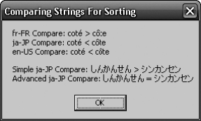


**рис. 14.1.** .Результат.сортировки.строк 

Помимо `Compare` , класс `CompareInfo` предлагает методы `IndexOf` , `IsLastIndexOf` , `IsPrefix` и `IsSuffix` . Благодаря имеющейся у каждого из этих методов перегруженной версии, которой в качестве параметра передается значение перечислимого типа `CompareOptions` , вы получаете дополнительные возможности по сравнению с методами `Compare` , `IndexOf` , `LastIndexOf` , `StartsWith` и `EndsWith` класса `String` . Кроме того, следует иметь в виду, что в FCL есть класс `System.StringComparer` , который также можно использовать для сравнения строк. Он оказывается кстати в тех случаях, когда необходимо многократно выполнять однотипные сравнения множества строк. 

## **интернирование строк** 

Как я уже отмечал, сравнение строк используется во многих приложениях, однако эта операция может ощутимо сказаться на производительности. При _порядковом сравнении_ (ordinal comparison) CLR быстро проверяет, равно ли количество символов в строках. При отрицательном результате строки точно не равны, но если длина одинакова, приходится сравнивать их символ за символом. При сравнении с учетом региональных стандартов среде CLR тоже приходится посимвольно сравнить строки, потому что две строки разной длины могут оказаться равными. 

К тому же хранение в памяти нескольких экземпляров одной строки приводит к непроизводительным затратам памяти — ведь строки неизменяемы. Эффективного использования памяти можно добиться, если держать в ней одну строку, на которую будут указывать соответствующие ссылки. 

Если в приложении строки сравниваются часто методом порядкового сравнения с учетом регистра или если в приложении ожидается появление множества одинаковых строковых объектов, то для повышения производительности надо применить поддерживаемый CLR механизм _интернирования строк_ (string interning). При инициализации CLR создает внутреннюю хеш-таблицу, в которой ключами являются строки, а значениями — ссылки на строковые объекты в управляемой куче. Вначале таблица, разумеется, пуста. В классе `String` есть два метода, предоставляющие доступ к внутренней хеш-таблице: 

```
public static String Intern(String str);
public static String IsInterned(String str);
```

**370** Глава.14 .Символы,.строки.и.обработка.текста 

Первый из них, `Intern` , ищет `String` во внутренней хеш-таблице. Если строка обнаруживается, возвращается ссылка на соответствующий объект `String` . Иначе создается копия строки, она добавляется во внутреннюю хеш-таблицу, и возвращается ссылка на копию. Если приложение больше не удерживает ссылку на исходный объект `String` , уборщик мусора вправе освободить память, занимаемую этой строкой. Обратите внимание, что уборщик мусора не вправе освободить строки, на которые ссылается внутренняя хеш-таблица, поскольку в ней самой есть ссылки на эти `String` . Объекты `String` , на которые ссылается внутренняя хеш-таблица, нельзя освободить, пока не выгружен соответствующий домен приложения или не закрыт поток. 

Как и `Intern` , метод `IsInterned` получает параметр `String` и ищет его во внутренней хеш-таблице. Если поиск удачен, `IsInterned` возвращает ссылку на интернированную строку. В противном случае он возвращает `null` , а саму строку не вставляет в хеш-таблицу. 

По умолчанию при загрузке сборки CLR интернирует все литеральные строки, описанные в метаданных сборки. Выяснилось, что это отрицательно сказывается на производительности из-за необходимости дополнительного поиска в хеш-таблицах, поэтому Microsoft теперь позволяет отключить эту «функцию». Если сборка отмечена атрибутом `System.Runtime.CompilerServices.CompilationRelaxations Attribute` , определяющим значение флага `System.Runtime.CompilerServices. CompilationRelaxations.NoStringInterning` , то в соответствии со спецификацией ECMA среда CLR _может_ отказаться от интернирования  строк, определенных в метаданных сборки. Обратите внимание, что в целях повышения производительности работы приложения компилятор C# всегда при компиляции сборки определяет этот атрибут/флаг. 

Даже если в сборке определен этот атрибут/флаг, CLR может предпочесть интернировать строки, но на это не стоит рассчитывать. Никогда не стоит писать код, рассчитанный на интернирование строк, если только вы сами в своем коде явно не вызываете метод `Intern` типа `String` . Следующий код демонстрирует интернирование строк: 

`String s1 = "Hello"; String s2 = "Hello";` Console.WriteLine(Object.ReferenceEquals(s1, s2)); // Должно быть 'False' 

`s1 = String.Intern(s1); s2 = String.Intern(s2);` Console.WriteLine(Object.ReferenceEquals(s1, s2)); // 'True' 

При первом вызове метода `ReferenceEquals` переменная `s1` ссылается на объект-строку `"Hello"` в куче, а `s2` — на другую объект-строку `"Hello"` . Поскольку ссылки разные, выводится значение `False` . Однако если выполнить этот код в CLR версии 4.5, будет выведено значение `True` . Дело в том, что эта версия CLR игнорирует атрибут/флаг, созданный компилятором C#, и интернирует литеральную строку `"Hello"` при загрузке сборки в домен приложений. Это означает, что `s1` и `s2` 

Тип.System String **371** 

ссылаются на одну строку в куче. Однако, как уже отмечалось, никогда не стоит писать код с расчетом на такое поведение, потому что в последующих версиях этот атрибут/флаг может приниматься во внимание, и строка `"Hello"` интернироваться не будет. В действительности, CLR версии 4.5 учитывает этот атрибут/флаг, но только если код сборки создан с  помощью утилиты NGen exe. 

Перед вторым вызовом метода `ReferenceEquals` строка `"Hello"` явно интернируется, в результате `s1` ссылается на интернированную строку `"Hello"` . Затем при повторном вызове `Intern` переменной `s2` присваивается ссылка на ту же самую строку `"Hello"` , на которую ссылается `s1` . Теперь при втором вызове `ReferenceEquals` мы гарантировано получаем результат `True` независимо от того, была ли сборка скомпилирована с этим атрибутом/флагом. 

Теперь на примере посмотрим, как использовать интернирование строки для повышения производительности и снижения нагрузки на память. Показанный далее метод `NumTimesWordAppearsEquals` принимает два аргумента: слово и массив строк, в котором каждый элемент массива ссылается на одно слово. Метод определяет, сколько раз указанное слово содержится в списке слов, и возвращает число: 

private static Int32 NumTimesWordAppearsEquals(String word, String[] `wordlist) {` 

`Int32 count = 0; for (Int32 wordnum = 0; wordnum < wordlist.Length; wordnum++) {` if (word.Equals(wordlist[wordnum], StringComparison.Ordinal)) `count++; } return count; }` 

Как видите, этот метод вызывает метод `Equals` типа `String` , который сравнивает отдельные символы строк и проверяет, все ли символы совпадают. Это сравнение может выполняться медленно. Кроме того, массив `wordlist` может иметь много элементов, которые ссылаются на многие объекты `String` , содержащие тот же набор символов. Это означает, что в куче может существовать множество идентичных строк, которые не должны уничтожаться в процессе уборки мусора. 

А теперь посмотрим на версию этого метода, которая написана с интернированием строк: 

private static Int32 NumTimesWordAppearsIntern(String word, String[] `wordlist) {` 

// В этом методе предполагается, что все элементы в wordlist 

// ссылаются на интернированные строки `word = String.Intern(word); Int32 count = 0; for (Int32 wordnum = 0; wordnum < wordlist.Length; wordnum++) {` if (Object.ReferenceEquals(word, wordlist[wordnum])) `count++; } return count; }` 

**372** Глава.14 .Символы,.строки.и.обработка.текста 

Этот метод интернирует слово и предполагает, что `wordlist` содержит ссылки на интернированные строки. Во-первых, в этой версии экономится память, если слово повторяется в списке слов, потому что теперь `wordlist` содержит многочисленные ссылки на единственный объект `String` в куче. Во-вторых, эта версия работает быстрее, потому что для выяснения, есть ли указанное слово в массиве, достаточно простого сравнения указателей. 

Хотя метод `NumTimesWordAppearsIntern` работает быстрее, чем `NumTimesWord AppearsEquals` , общая производительность приложения может оказаться ниже, чем при использовании метода `NumTimesWordAppearsIntern` из-за времени, которое требуется на интернирование всех строк по мере добавления их в массив `wordlist` (соответствующий код не показан). Преимущества метода `NumTimesWordAppearsIntern` — ускорение работы и снижение потребления памяти — будут заметны, если приложению нужно множество раз вызывать метод, передавая один и тот же массив `wordlist` . Этим обсуждением я хотел донести до вас, что интернирование строк полезно, но использовать его нужно с осторожностью. Собственно, именно по этой причине компилятор C# указывает, что не следует разрешать интернирование строк. 

## **создание пулов строк** 

При обработке исходного кода компилятор должен каждую литеральную строку поместить в метаданные управляемого модуля. Если одна строка встречается в исходном коде много раз, размещение всех таких строк в метаданных приведет к увеличению размера результирующего файла. 

Чтобы не допустить роста объема кода, многие компиляторы (в том числе C#) хранят литеральную строку в метаданных модуля только в одном экземпляре. Все упоминания этой строки в исходном коде компилятор заменяет ссылками на ее экземпляр в метаданных. Благодаря этому заметно уменьшается размер модуля. Способ не нов — в компиляторах Microsoft C/C++ этот механизм реализован уже давно и называется _созданием пула строк_ (string pooling). Это еще одно средство, позволяющее ускорить обработку строк. Полагаю, вам будет полезно знать о нем. 

## **работа с символами и текстовыми элементами в строке** 

Сравнение строк полезно при сортировке и поиске одинаковых строк, однако иногда требуется проверять отдельные символы в пределах строки. С подобными задачами призваны справляться несколько методов и свойств типа `String` , в числе которых `Length` , `Chars` (индексатор в C#), `GetEnumerator` , `ToCharArray` , `Contains` , `IndexOf` , `LastIndexOf` , `IndexOfAny` и `LastIndexOfAny` . 

На самом деле `System.Char` представляет одно 16-разрядное кодовое значение в кодировке Юникод, которое необязательно соответствует абстрактному Юникодсимволу. Так, некоторые абстрактные Unicode-символы являются комбинацией двух кодовых значений. Например, сочетание символов U+0625 (арабская буква 

Тип.System String **373** 

«алеф» с подстрочной «хамза») и U+0650 (арабская «казра») образует один арабский символ, или _текстовый элемент_ . 

Кроме того, представление некоторых текстовых элементов требует не одного, а двух 16-разрядных кодовых значений. Первое называют _старшим_ (high surrogate), а второе — _младшим заменителем_ (low surrogate). Значения старшего находятся в диапазоне от U+D800 до U+DBFF, младшего — от U+DC00 до U+DFFF. Такой способ кодировки позволяет представить в Unicode более миллиона различных символов. 

Символы-заменители востребованы в основном в странах Восточной Азии и гораздо меньше в США и Европе. Для корректной работы с текстовыми элементами предназначен тип `System.Globalization.StringInfo` . Самый простой способ воспользоваться этим типом — создать его экземпляр, передав его конструктору строку. Чтобы затем узнать, сколько текстовых элементов содержит строка, достаточно прочитать свойство `LengthInTextElements` объекта `StringInfo` . Позже можно вызвать метод `SubstringByTextElements` объекта `StringInfo` , чтобы извлечь один или несколько последовательных текстовых элементов. 

Кроме того, в классе `StringInfo` есть статический метод `GetTextElementEnumerator` , возвращающий объект `System.Globalization.TextElementEnumerator` , который, в свою очередь, позволяет просмотреть в строке все абстрактные символы Юникода. Наконец, можно воспользоваться статическим методом `ParseCombiningCharacters` типа `StringInfo` , чтобы получить массив значений типа `Int32` , по длине которого можно судить о количестве текстовых элементов в строке. Каждый элемент массива содержит индекс первого кодового значения соответствующего текстового элемента. 

Очередной пример демонстрирует различные способы использования класса `StringInfo` для управления текстовыми элементами строки: 

```
using System;
using System.Text;
using System.Globalization;
using System.Windows.Forms;
```

`public sealed class Program { public static void Main() {` // Следующая строка содержит комбинированные символы `String s = "a\u0304\u0308bc\u0327"; SubstringByTextElements(s); EnumTextElements(s); EnumTextElementIndexes(s); }` 

```
  private static void SubstringByTextElements(String s) {
    String output = String.Empty;
```

```
    StringInfo si = new StringInfo(s);
    for (Int32 element = 0; element < si.LengthInTextElements; element++) {
      output += String.Format(
```

_продолжение_  

**374** Глава.14 .Символы,.строки.и.обработка.текста 

"Text element {0} is '{1}'{2}", element, si.SubstringByTextElements(element, 1), `Environment.NewLine); }` MessageBox.Show(output, "Result of SubstringByTextElements"); `} private static void EnumTextElements(String s) { String output = String.Empty; TextElementEnumerator charEnum = StringInfo.GetTextElementEnumerator(s); while (charEnum.MoveNext()) { output += String.Format(` "Character at index {0} is '{1}'{2}", charEnum.ElementIndex, charEnum.GetTextElement(), `Environment.NewLine); }` MessageBox.Show(output, "Result of GetTextElementEnumerator"); `}` 

`private static void EnumTextElementIndexes(String s) { String output = String.Empty; Int32[] textElemIndex = StringInfo.ParseCombiningCharacters(s); for (Int32 i = 0; i < textElemIndex.Length; i++) { output += String.Format(` "Character {0} starts at index {1}{2}", i, textElemIndex[i], Environment.NewLine); `}` MessageBox.Show(output, "Result of ParseCombiningCharacters"); `} }` 

После компоновки и последующего запуска этого кода на экране появятся информационные окна (рис. 14.2–14.4). 


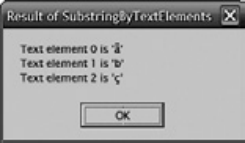


**рис. 14.2.** .Результат. работы.метода. SubstringByTextElements 


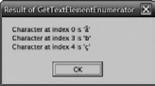


**рис. 14.3.** .Результат. работы.метода. GetTextElementEnumerator 


**рис. 14.4.** .Результат. работы.метода. ParseCombiningCharacters 

Эффективное.создание.строк **375** 

## **Прочие операции со строками** 

В табл. 14.1 представлены методы типа `String` , предназначенные для полного или частичного копирования строк. 

**таблица 14.1.** .Методы.копирования.строк 

|**Член**|**тип метода**|**Описание**|
|---|---|---|
|Clone|Экземплярный|Возвращает ссылку на тот же самый объект (this). Это<br>нормально, так как объекты String неизменяемы. Этот<br>метод реализует интерфейс ICloneable класса String|
|Copy|Статический|Возвращает новую строку — дубликат заданной стро-<br>ки. Используется редко и нужен только для приложе-<br>ний, обрабатывающих строки как лексемы. Обычно<br>строки с одинаковым набором символов интерни-<br>руются в одну строку. Этот метод, напротив, создает<br>новый строковый объект и возвращает иной указатель<br>(ссылку), хотя в строках содержатся одинаковые сим-<br>волы|
|CopyTo|Экземплярный|Копирует группу символов строки в массив символов|
|Substring|Экземплярный|Возвращает новую строку, представляющую часть<br>исходной строки|
|ToString|Экземплярный|Возвращает ссылку на тот же объект (this)|


Помимо этих методов, у типа `String` есть много статических и экземплярных методов для различных операций со строками: `Insert` , `Remove` , `PadLeft` , `Replace` , `Split` , `Join` , `ToLower` , `ToUpper` , `Trim` , `Concat` , `Format` и пр. Еще раз повторю, что все эти методы возвращают новые строковые объекты; создать строку можно, но изменить ее нельзя (при условии использования безопасного кода). 

## **Эффективное создание строк** 

Тип `String` представляет собой неизменяемую строку, а для динамических операций со строками и символами при создании объектов `String` в FCL имеется тип `System. Text.StringBuilder` . Его можно рассматривать как некий общедоступный конструктор для `String` . В общем случае нужно создавать методы, у которых в качестве параметров выступают объекты `String` , а не `StringBuilder` , хотя можно написать метод, возвращающий строку, создаваемую динамически внутри метода. 

У объекта `StringBuilder` предусмотрено поле со ссылкой на массив структур `Char` . Используя члены `StringBuilder` , можно эффективно манипулировать этим 

**376** Глава.14 .Символы,.строки.и.обработка.текста 

массивом, сокращая строку и изменяя символы строки. При увеличении строки, представляющей ранее выделенный массив символов, `StringBuilder` автоматически выделит память для нового, большего по размеру массива, скопирует символы и приступит к работе с новым массивом. А прежний массив попадет в сферу действия уборщика мусора. 

Сформировав свою строку с помощью объекта `StringBuilder` , «преобразуйте» массив символов `StringBuilder` в объект `String` , вызвав метод `ToString` типа `StringBuilder` . Этот метод просто возвращает ссылку на поле-строку, управляемую объектом `StringBuilder` . Поскольку массив символов здесь не копируется, метод выполняется очень быстро. Объект `String` , возвращаемый методом `ToString` , не может быть изменен. Поэтому, если вы вызовете метод, который попытается изменить строковое поле, управляемое объектом `StringBuilder` , методы этого объекта, зная, что для него был вызван метод `ToString` , создадут новый массив символов, манипуляции с которым не повлияют на строку, возвращенную предыдущим вызовом `ToString` . 

## **создание объекта StringBuilder** 

В отличие от класса `String` , класс `StringBuilder` в CLR не представляет собой ничего особенного. Кроме того, большинство языков (включая C#) не считают `StringBuilder` примитивным типом. Объект `StringBuilder` создается так же, как любой объект непримитивного типа: 

```
StringBuilder sb = new StringBuilder();
```

У типа `StringBuilder` несколько конструкторов. Задача каждого из них — выделять память и инициализировать три внутренних поля, управляемых любым объектом `StringBuilder` . 

- **Максимальная емкость** (maximum capacity) — поле типа `Int32` , которое задает максимальное число символов, размещаемых в строке. По умолчанию оно равно `Int32.MaxValue` (около двух миллиардов). Это значение обычно не изменяется, хотя можно задать и меньшее значение, ограничивающее размер создаваемой строки. Для уже созданного объекта `StringBuilder` это поле изменить нельзя. 

- **Емкость** (capacity) — поле типа `Int32` , показывающее размер массива символов `StringBuilder` . По умолчанию оно равно 16. Если известно, сколько символов предполагается разместить в `StringBuilder` , укажите это число при создании объекта `StringBuilder` . При добавлении символов `StringBuilder` определяет, не выходит ли новый размер массива за установленный предел. Если да, то `StringBuilder` автоматически удваивает емкость, и исходя из этого значения, выделяет память под новый массив, а затем копирует символы из исходного массива в новый. Исходный массив в дальнейшем утилизируется сборщиком мусора. Динамическое увеличение массива снижает производительность, поэтому его следует избегать, задавая подходящую емкость в начале работы с объектом. 

**377** 

Эффективное.создание.строк 

- **Массив символов** (character array) — массив структур `Char` , содержащий набор символов «строки». Число символов всегда меньше (или равно) емкости и максимальной емкости. Количество символов в строке можно получить через свойство `Length` типа `StringBuilder` . Значение `Length` всегда меньше или равно емкости `StringBuilder` . При создании `StringBuilder` можно инициализировать массив символов, передавая ему `String` как параметр. Если строка не задана, массив первоначально не содержит символов и свойство `Length` возвращает 0. 

## **Члены типа StringBuilder** 

Тип `StringBuilder` в отличие от `String` представляет изменяемую строку. Это значит, что многие члены `StringBuilder` изменяют содержимое в массиве символов, не создавая новых объектов, размещаемых в управляемой куче. `StringBuilder` выделяет память для новых объектов только в двух случаях: 

- при динамическом построении строки, размер которой превышает установленную емкость; 

- при вызове метода `ToString` типа `StringBuilder` . 

В табл. 14.2 представлены методы класса `StringBuilder` . 

**таблица 14.2.** .Члены.класса.StringBuilder 

|**таблица 14.2.**Ч|леныклассаStrin|gBuilder|
|---|---|---|
|**Член**|**тип члена**|**Описание**|
|MaxCapacity|Неизменяемое<br>свойство|Возвращает наибольшее количество символов,<br>которое может быть размещено в строке|
|Capacity|Изменяемое<br>свойство|Получает/устанавливает размер массива<br>символов. При попытке установить емкость<br>меньшую, чем длина строки, или больше,<br>чем MaxCapacity, генерируется исключение<br>ArgumentOutOfRangeException|
|EnsureCapacity|Метод|Гарантирует, что размер массива символов будет<br>не меньше, чем значение параметра, передаваемого<br>этому методу. Если значение превышает текущую<br>емкость объекта StringBuilder, размер массива<br>увеличивается. Если текущая емкость больше, чем<br>значение, передаваемое этому свойству, размер мас-<br>сива не изменяется|
|Length|Изменяемое<br>свойство|Возвращает количество символов в «строке». Эта<br>величина может быть меньше текущей емкости<br>массива символов. Присвоение этому свойству зна-<br>чения 0 сбрасывает содержимое и очищает строку<br>StringBuilder|


_продолжение_  

**378** Глава.14 .Символы,.строки.и.обработка.текста 

**таблица 14.2** .( _продолжение_ ) 

|**таблица 14.2**(_п_|_родолжение_)||
|---|---|---|
|**Член**|**тип члена**|**Описание**|
|ToString|Метод|Версия без параметров возвращает объект String,<br>представляющий массив символов объекта<br>StringBuilder|
|Chars|Изменяемое<br>свойство-<br>индексатор|Возвращает из массива или устанавливает в масси-<br>ве символ с заданным индексом. В C# это свойство-<br>индексатор (свойство с параметром), доступ к ко-<br>торому осуществляется как к элементам массива<br>(с использованием квадратных скобок [])|
|Clear|Метод|Очищает содержимое объекта StringBuilder, анало-<br>гично назначению свойству Length значения 0|
|Append|Метод|Добавляет единичный объект в массив символов,<br>увеличивая его при необходимости. Объект преоб-<br>разуется в строку с использованием общего форма-<br>та и с учетом региональных стандартов, связанных<br>с вызывающим потоком|
|Insert|Метод|Вставляет единичный объект в массив символов,<br>увеличивая его при необходимости. Объект преоб-<br>разуется в строку с использованием общего форма-<br>та и с учетом региональных стандартов, связанных<br>с вызывающим потоком|
|AppendFormat|Метод|Добавляет заданные объекты в массив символов,<br>увеличивая его при необходимости. Объекты пре-<br>образуются в строку указанного формата и с учетом<br>заданных региональных стандартов. Это один из<br>наиболее часто используемых методов при работе<br>с объектами StringBuilder|
|AppendLine|Метод|Присоединяет пустую строку в конец символьного<br>массива, увеличивая его емкость при необходимости|
|Replace|Метод|Заменяет один символ или строку символов в мас-<br>сиве символов|
|Remove|Метод|Удаляет диапазон символов из массива символов|
|Equals|Метод|Возвращает true, только если объекты StringBuilder<br>имеют одну и ту же максимальную емкость,<br>емкость и одинаковые символы в массиве|
|CopyTo|Метод|Копирует подмножество символов StringBuilder<br>в массив Char|


Отмечу одно важное обстоятельство: большинство методов `StringBuilder` возвращают ссылку на тот же объект `StringBuilder` . Это позволяет выстроить в цепочку сразу несколько операций: 

Получение.строкового.представления.объекта 

**379** 

## `StringBuilder sb = new StringBuilder();` 

String s = sb.AppendFormat("{0} {1}", "Jeffrey", "Richter"). Replace(' ', '-').Remove(4, 3).ToString(); `Console.WriteLine(s); // "Jeff-Richter"` 

У класса `StringBuilder` нет некоторых аналогов для методов класса `String` . Например, у класса `String` есть методы `ToLower` , `ToUpper` , `EndsWith` , `PadLeft` , `Trim` и т. д., отсутствующие у класса `StringBuilder` . В то же время у класса `StringBuilder` есть расширенный метод `Replace` , выполняющий замену символов и строк лишь в части строки (а не во всей строке). Из-за отсутствия полного соответствия между методами иногда приходится прибегать к преобразованиям между `String` и `StringBuilder` . Например, сформировать строку, сделать все буквы прописными, а затем вставить в нее другую строку позволяет следующий код: 

// Создаем StringBuilder для операций со строками `StringBuilder sb = new StringBuilder();` 

// Выполняем ряд действий со строками, используя StringBuilder sb.AppendFormat("{0} {1}" "Jeffrey", "Richter").Replace(" ", "-"); 

// Преобразуем StringBuilder в String, 

// чтобы сделать все символы прописными `String s = sb.ToString().ToUpper();` 

// Очищаем StringBuilder (выделяется память под новый массив Char) `sb.Length = 0;` 

// Загружаем строку с прописными String в StringBuilder 

// и выполняем остальные операции sb.Append(s).Insert(8, "Marc-"); 

// Преобразуем StringBuilder обратно в String `s = sb.ToString();` 

// Выводим String на экран для пользователя `Console.WriteLine(s); // "JEFFREY-Marc-RICHTER"` 

Этот код неудобен и неэффективен — и все из-за того, что `StringBuilder` не поддерживает все операции, которые может выполнить `String` . Надеюсь, в будущем Microsoft улучшит класс `StringBuilder` , дополнив его необходимыми методами для работы со строками. 

## **Получение строкового представления объекта** 

Часто нужно получить строковое представление объекта, например, для отображения числового типа (такого, как `Byte` , `Int32` , `Single` и т. д.) и объекта `DateTime` . 

**380** Глава.14 .Символы,.строки.и.обработка.текста 

Поскольку .NET Framework является объектно-ориентированной платформой, то каждый тип должен сам предоставить код, преобразующий «значение» экземпляра в некий строковый эквивалент. Выбирая способы решения этой задачи, разработчики FCL придумали паттерн программирования, предназначенный для повсеместного использования. Рассмотрим этот паттерн. 

Для получения представления любого объекта в виде строки надо вызвать метод `ToString` . Поскольку этот открытый виртуальный метод без параметров определен в классе `System.Object` , его можно вызывать для экземпляра любого типа. Семантически `ToString` возвращает строку, которая представляет текущее значение объекта в формате, учитывающем текущие региональные стандарты вызвавшего потока. Строковое представление числа, к примеру, должно правильно отображать разделитель дробной части, разделитель групп разрядов и тому подобные параметры, устанавливаемые региональными стандартами вызывающего потока. 

Реализация `ToString` в типе `System.Object` просто возвращает полное имя типа объекта. В этом значении мало пользы, хотя для многих типов такое решение по умолчанию может оказаться единственно разумным. Например, как иначе представить в виде строки такие объекты, как `FileStream` или `Hashtable` ? 

Типы, которые хотят представить текущее значение объекта в более содержательном виде, должны переопределить метод `ToString` . Все базовые типы, встроенные в FCL ( `Byte` , `Int32` , `UInt64` , `Double` и т. д.), имеют переопределенный метод `ToString` , реализация которого возвращает строку с учетом региональных стандартов. В отладчике Visual Studio при наведении указателя мыши на соответствующую переменную появляется всплывающая подсказка. Текст этой подсказки формируется путем вызова метода `ToString` этого объекта. Таким образом, при определении класса вы должны всегда переопределять метод `ToString` , чтобы иметь качественную поддержку при отладке программного кода. 

## **Форматы и региональные стандарты** 

У метода `ToString` без параметров есть два недостатка. Во-первых, вызывающая программа не управляет форматированием строки, как, например, в случае, когда приложению нужно представить число в денежном или десятичном формате, в процентном или шестнадцатеричном виде. Во-вторых, вызывающая программа не может выбрать формат, учитывающий конкретные региональные стандарты. Второй недостаток создает проблемы скорее для серверных приложений, нежели для кода на стороне клиента. Изредка приложению требуется форматировать строку с учетом региональных стандартов, отличных от таковых у вызывающего потока. Для управления форматированием строки нужна версия метода `ToString` , позволяющая задавать специальное форматирование и сведения о региональных стандартах. 

Тип может предложить вызывающей программе выбор форматирования и региональных стандартов, если он реализует интерфейс `System.IFormattable` : 

`public interface IFormattable {` String ToString(String format, IFormatProvider formatProvider); `}` 

Получение.строкового.представления.объекта **381** 

В FCL у всех базовых типов ( `Byte` , `SByte` , `Int16` / `UInt16` , `Int32` / `UInt32` , `Int64` / `UInt64` , `Single` , `Double` , `Decimal` и `DateTime` ) есть реализации этого интерфейса. Кроме того, есть такие реализации и у некоторых других типов, например `GUID` . К тому же каждый перечислимый тип автоматически реализует интерфейс `IFormattable` , позволяющий получить строковое выражение для числового значения, содержащегося в экземпляре перечислимого типа. 

Метод `ToString` интерфейса `IFormattable` получает два параметра. Первый, `format` , — это строка, сообщающая методу способ форматирования объекта. Второй, `formatProvider` , — это экземпляр типа, который реализует интерфейс `System. IFormatProvider` . Этот тип предоставляет методу `ToString` информацию о региональных стандартах. Как — скоро узнаете. 

Тип, реализующий метод `ToString` интерфейса `IFormattable` , определяет допустимые варианты форматирования. Если переданная строка форматирования неприемлема, тип должен генерировать исключение `System.FormatException` . 

Многие типы FCL поддерживают несколько форматов. Например, тип `DateTime` поддерживает следующие форматы: `"d"` — даты в кратком формате, `"D"` — даты в полном формате, `"g"` — даты в общем формате, `"M"` — формат «месяц/день», `"s"` — сортируемые даты, `"T"` — время, `"u"` — универсальное время в стандарте ISO 8601, `"U"` — универсальное время в полном формате, `"Y"` — формат «год/месяц» и т. д. Все перечислимые типы поддерживают строки: `"G"` — общий формат, `"F"` — формат флагов, `"D"` — десятичный формат и `"X"` — шестнадцатеричный формат. Подробнее о форматировании перечислимых типов см. главу 15. 

Кроме того, все встроенные числовые типы поддерживают следующие строки: `"C"` — формат валют, `"D"` — десятичный формат, `"E"` — научный (экспоненциальный) формат, `"F"` — формат чисел с фиксированной точкой, `"G"` — общий формат, `"N"` — формат чисел, `"P"` — формат процентов, `"R"` — обратимый (round-trip) формат и `"X"` — шестнадцатеричный формат. Числовые типы поддерживают также шаблоны форматирования для случаев, когда обычных строк форматирования недостаточно. Шаблоны форматирования содержат специальные символы, позволяющие методу `ToString` данного типа отобразить нужное количество цифр, место разделителя дробной части, количество знаков в дробной части и т. д. Полную информацию о строках форматирования см. в разделе .NET Framework SDK, посвященном форматированию строк. 

Если вместо строки форматирования передается `null` , это равносильно вызову метода `ToString` с параметром `"G"` . Иначе говоря, объекты форматируют себя сами, применяя по умолчанию «общий формат». Разрабатывая реализацию типа, выберите формат, который, по вашему мнению, будет использоваться чаще всего; это и будет «общий формат». Кстати, вызов метода `ToString` без параметров означает представление объекта в общем формате. 

Закончив со строками форматирования, перейдем к региональным стандартам. По умолчанию форматирование выполняется с учетом региональных стандартов, связанных с вызывающим потоком. Это свойственно методу `ToString` без параметров и методу `ToString` интерфейса `IFormattable` со значением `null` в качестве `formatProvider` . 

**382** Глава.14 .Символы,.строки.и.обработка.текста 

Региональные стандарты влияют на форматирование чисел (включая денежные суммы, целые числа, числа с плавающей точкой и проценты), дат и времени. Метод `ToString` для типа `Guid` , представляющего код GUID, возвращает строку, отображающую только значение GUID. Региональные стандарты вряд ли нужно учитывать при создании такой строки, так как она используется только самой программой. 

При форматировании числа метод `ToString` «анализирует» параметр `formatProvider` . Если это `null` , метод `ToString` определяет региональные стандарты, связанные с вызывающим потоком, считывая свойство `System.Threading. Thread.CurrentThread.CurrentCulture` . Оно возвращает экземпляр типа `System. Globalization.CultureInfo` . 

Получив объект, `ToString` считывает его свойства `NumberFormat` для форматирования числа или `DateTimeFormat` для форматирования даты. Эти свойства возвращают экземпляры `System.Globalization.NumberFormatInfo` и `System. Globalization.DateTimeFormatInfo` соответственно. Тип `NumberFormatInfo` описывает группу свойств, таких как `CurrencyDecimalSeparator` , `CurrencySymbol` , `NegativeSign` , `NumberGroupSeparator` и `PercentSymbol` . Аналогично, у типа `DateTimeFormatInfo` описаны такие свойства, как `Calendar` , `DateSeparator` , `DayNames` , `LongDatePattern` , `ShortTimePattern` и `TimeSeparator` . Метод `ToString` считывает эти свойства при создании и форматировании строки. 

При вызове метода `ToString` интерфейса `IFormattable` вместо `null` можно передать ссылку на объект, тип которого реализует интерфейс `IFormatProvider` : 

```
public interface IFormatProvider {
  Object GetFormat(Type formatType);
}
```

Основная идея применения интерфейса `IFormatProvider` такова: реализация этого интерфейса означает, что экземпляр типа «знает», как обеспечить учет региональных стандартов при форматировании, а региональные стандарты, связанные с вызывающим потоком, игнорируются. 

Тип `System.Globalization.CultureInfo` — один из немногих определенных в FCL типов, в которых реализован интерфейс `IFormatProvider` . Если нужно форматировать строку, скажем, для Вьетнама, следует создать объект `CultureInfo` и передать его `ToString` как параметр `formatProvider` . Вот как формируют строковое представление числа `Decimal` во вьетнамском формате денежной величины: 

`Decimal price = 123.54M;` String s = price.ToString("C", new CultureInfo("vi-VN")); `MessageBox.Show(s);` 

Если собрать и запустить этот код, появится информационное окно (рис. 14.5). Метод `ToString` типа `Decimal` , исходя из того, что аргумент `formatProvider` отличен от `null` , вызывает метод `GetFormat` объекта: 

```
NumberFormatInfo nfi = (NumberFormatInfo)
   formatProvider.GetFormat(typeof(NumberFormatInfo));
```

Получение.строкового.представления.объекта **383** 


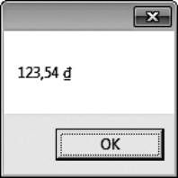


**рис. 14.5.** .Числовое.значение.во.вьетнамском.формате.денежной.величины 

Так `ToString` запрашивает у объекта ( `CultureInfo` ) данные о надлежащем форматировании чисел. Числовым типам (вроде `Decimal` ) достаточно получить лишь сведения о форматировании чисел. Однако другие типы (вроде `DateTime` ) могут вызывать `GetFormat` иначе: 

```
DateTimeFormatInfo dtfi = (DateTimeFormatInfo)
   formatProvider.GetFormat(typeof(DateTimeFormatInfo));
```

Раз параметр `GetFormat` может идентифицировать любой тип, метод достаточно гибок, чтобы запрашивать любую форматную информацию. Сейчас типы .NET Framework с помощью `GetFormat` запрашивают информацию только о числах и дате/времени; в будущем появится возможность запрашивать другие сведения. 

Кстати, чтобы получить строку для объекта, который не отформатирован в соответствии с определенными региональными стандартами, вызовите статическое свойство `InvariantCulture` класса `System.Globalization.CultureInfo` и передайте возвращенный объект как параметр `formatProvider` методу `ToString` : 

`Decimal price = 123.54M;` String s = price.ToString("C", CultureInfo.InvariantCulture); `MessageBox.Show(s);` 

После компоновки и запуска этого кода появится информационное окно (рис. 14.6). Обратите внимание на первый символ в выходной строке: ¤ . Он представляет международное обозначение денежного знака (U+00A4). 


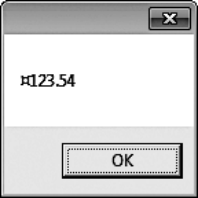


**рис. 14.6.** .Числовое.значение.в.формате,.представляющем. абстрактную.денежную.единицу 

**384** Глава.14 .Символы,.строки.и.обработка.текста 

Обычно нет необходимости выводить строку в формате инвариантных региональных стандартов. В типовом случае нужно просто сохранить строку в файле, отложив ее разбор на будущее. 

В FCL интерфейс `IFormatProvider` реализуется только тремя типами: уже упоминавшимся типом `CultureInfo` , а также типами `NumberFormatInfo` и `DateTimeFormatInfo` . Когда `GetFormat` вызывается для объекта `NumberFormatInfo` , метод проверяет, является ли запрашиваемый тип `NumberFormatInfo` . Если да, возвращается `this` , нет — `null` . Аналогичным образом вызов `GetFormat` для объекта `DateTimeFormatInfo` возвращает `this` , если запрашиваемый тип `DateTimeFormatInfo` , и `null` — если нет. Реализация этого интерфейса для этих двух типов упрощает программирование. Чаще всего при получении строкового представления объекта вызывающая программа задает только формат, довольствуясь региональными стандартами, связанными с вызывающим потоком. Поэтому обычно мы вызываем `ToString` , передавая строку форматирования и `null` как параметр `formatProvider` . Для упрощения работы с `ToString` во многие типы включены перегруженные версии метода `ToString` . Например, тип `Decimal` предоставляет четыре перегруженных метода `ToString` : 

// Эта версия вызывает ToString(null, null) // Смысл: общий формат, региональные стандарты потока `public override String ToString();` 

// В этой версии выполняется полная реализация ToString 

// Здесь реализован метод ToString интерфейса IFormattable 

// Смысл: и формат, и региональные стандарты задаются вызывающей программой public String ToString(String format, IFormatProvider formatProvider); 

// Эта версия просто вызывает ToString(format, null) 

// Смысл: формат, заданный вызывающей программой, 

// и региональные стандарты потока `public String ToString(String format);` 

// Эта версия просто вызывает ToString(null, formatProvider) 

- // Здесь реализуется метод ToString интерфейса IConvertible 

// Смысл: общий формат и региональные стандарты, 

- // заданные вызывающей программой `public String ToString(IFormatProvider formatProvider);` 

## **Форматирование нескольких объектов в одну строку** 

До сих пор речь шла о том, как конкретный тип форматирует свои объекты. Однако иногда требуется сформировать строку из множества отформатированных объектов. В следующем примере в строку включаются дата, имя человека и его возраст: 

String s = String.Format("On {0}, {1} is {2} years old.", new DateTime(2012, 4, 22, 14, 35, 5), "Aidan", 9); `Console.WriteLine(s);` 

Получение.строкового.представления.объекта **385** 

Если собрать и запустить этот код в потоке с региональным стандартом `en-US` , на выходе получится строка: 

On 4/22/2012 2:35:05 PM, Aidan is 9 years old. 

Статический метод `Format` типа `String` получает строку форматирования, в которой подставляемые параметры обозначены своими номерами в фигурных скобках. В этом примере строка форматирования указывает методу `Format` подставить вместо `{0}` первый после строки форматирования параметр (текущие дату и время), вместо `{1}` — следующий параметр ( `Aidan` ) и вместо `{2}` — третий, последний параметр ( `9` ). 

Внутри метода `Format` для каждого объекта вызывается метод `ToString` , получающий его строковое представление. Все возвращенные строки затем объединяются, а полученный результат возвращается методом. Все было бы замечательно, однако нужно иметь в виду, что ко всем объектам применяется общий формат и региональные стандарты вызывающего потока. 

Чтобы расширить стандартное форматирование объекта, нужно добавить внутрь фигурных скобок строку форматирования. В частности, следующий код отличается от предыдущего только наличием строк форматирования для подставляемых параметров 0 и 2: 

String s = String.Format("On {0:D}, {1} is {2:E} years old.", new DateTime(2012, 4, 22, 14, 35, 5), "Aidan", 9); `Console.WriteLine(s);` 

Если собрать и запустить этот код в потоке с региональным стандартом `en-US` , на выходе вы увидите строку: 

On Sunday, April 22, 2012, Aidan is 9.000000E+000 years old. 

Разбирая строку форматирования, метод `Format` «видит», что для подставляемого параметра 0 нужно вызывать описанный в его интерфейсе `IFormattable` метод `ToString` , которому передаются в качестве параметров `D` и `null` . Аналогично, `Format` вызывает метод `ToString` для интерфейса `IFormattable` параметра 2, передавая ему `E` и `null` . Если у типа нет реализации интерфейса `IFormattable` , то `Format` вызывает его метод `ToString` без параметров, а в результирующую строку добавляется формат по умолчанию. 

У класса `String` есть несколько перегруженных версий статического метода `Format` . В одну из них передается объект, реализующий интерфейс `IFormatProvider` , в этом случае при форматировании всех подставляемых параметров можно применять региональные стандарты, задаваемые вызывающей программой. Очевидно, `Format` вызывает метод `ToString` для каждого объекта, передавая ему полученный объект `IFormatProvider` . 

Если вместо `String` для формирования строки применяется `StringBuilder` , можно вызывать метод `AppendFormat` класса `StringBuilder` . Этот метод работает так же, как `Format` класса `String` , за исключением того, что результат форматирования добавляется к массиву символов `StringBuilder` . Точно так же 

**386** Глава.14 .Символы,.строки.и.обработка.текста 

в `AppendFormat` передается строка форматирования и имеется версия, которой передается `IFormatProvider` . 

У типа `System.Console` тоже есть методы `Write` и `WriteLine` , которым передаются строка форматирования и замещаемые параметры. Однако у `Console` нет перегруженных методов `Write` и `WriteLine` , позволяющих передавать `IFormatProvider` . Если при форматировании строки нужно применить определенные региональные стандарты, вызовите метод `Format` класса `String` , передав ему нужный объект `IFormatProvider` , а затем подставьте результирующую строку в метод `Write` или `WriteLine` класса `Console` . Это не намного усложнит задачу, поскольку, как я уже отмечал, код на стороне клиента редко при форматировании применяет региональные стандарты, отличные от тех, что связаны с вызывающим потоком. 

## **создание собственного средства форматирования** 

Уже на этом этапе понятно, что платформа .NET Framework обладает весьма гибкими средствами форматирования. Но это не все — вы можете написать метод, который будет вызываться в `AppendFormat` типа `StringBuilder` независимо от того, для какого объекта выполняется форматирование. Иначе говоря, для каждого объекта вместо метода `ToString` метод `AppendFormat` вызовет вашу функцию, которая будет форматировать один или несколько объектов так, как вам нужно. Следующее описание относится также к методу `Format` типа `String` . 

Попробую пояснить работу этого механизма на примере. Допустим, вам нужен форматированный HTML-текст, который пользователь будет просматривать в браузере, причем все значения `Int32` должны выводиться полужирным шрифтом. Для этого всякий раз, когда значение типа `Int32` форматируется в `String` , нужно обрамлять строку тегами полужирного шрифта: `<B>` и `</B>` . Следующий фрагмент показывает, как легко это делается: 

```
using System;
using System.Text;
using System.Threading;
```

`public static class Program { public static void Main() { StringBuilder sb = new StringBuilder();` sb.AppendFormat(new BoldInt32s(), "{0} {1} {2:M}", "Jeff", 123, `DateTime.Now); Console.WriteLine(sb); } }` internal sealed class BoldInt32s : IFormatProvider, ICustomFormatter { `public Object GetFormat(Type formatType) { if (formatType == typeof(ICustomFormatter)) return this; return Thread.CurrentThread.CurrentCulture.GetFormat(formatType); }` 

`public String Format(Str` ing format, Object arg, IFormatProvider 

Получение.строкового.представления.объекта 

**387** 

```
      formatProvider) {
    String s;
```

```
    IFormattable formattable = arg as IFormattable;
```

`if (formattable == null) s = arg.ToString();` else s = formattable.ToString(format, formatProvider); `if (arg.GetType() == typeof(Int32)) return "<B>" + s + "</B>"; return s; } }` 

После компиляции и запуска кода в потоке с региональным стандартом `en-US` появится строка (дата может отличаться): 

```
Jeff <B>123</B> September 1
```

Метод `Main` конструирует пустой объект `StringBuilder` , к которому затем добавляется форматированная строка. При вызове `AppendFormat` в качестве первого параметра подставляется экземпляр класса `BoldInt32s` . В нем, помимо рассмотренного ранее интерфейса `IFormatProvider` , реализован также интерфейс `ICustomFormatter` : 

`public interface ICustomFormatter {` String Format(String format, Object arg, `IFormatProvider formatProvider); }` 

Метод `Format` этого интерфейса вызывается всякий раз, когда методу `AppendFormat` класса `StringBuilder` нужно получить строку для объекта. Внутри этого метода у нас появляется возможность гибкого управления процессом форматирования строки. Заглянем внутрь метода `AppendFormat` , чтобы узнать поподробнее, как он работает. Следующий псевдокод демонстрирует работу метода `AppendFormat` : 

public StringBuilder AppendFormat(IFormatProvider formatProvider, String format, params Object[] args) { 

// Если параметр IFormatProvider передан, выясним, // предоставляет ли он объект ICustomFormatter `ICustomFormatter cf = null;` 

```
  if (formatProvider != null)
    cf = (ICustomFormatter)
      formatProvider.GetFormat(typeof(ICustomFormatter));
```

// Продолжаем добавлять литеральные символы (не показанные 

// в этом псевдокоде) и замещаемые параметры в массив символов 

// объекта StringBuilder. `Boolean MoreReplaceableArgumentsToAppend = true; while (MoreReplaceableArgumentsToAppend) {` 

_продолжение_  

**388** Глава.14 .Символы,.строки.и.обработка.текста 

// argFormat ссылается на замещаемую строку форматирования, // полученную из параметра format `String argFormat = /* ... */;` 

// argObj ссылается на соответствующий элемент // параметра-массива args `Object argObj = /* ... */;` 

// argStr будет указывать на отформатированную строку, // которая добавляется к результирующей строке `String argStr = null;` 

// Если есть специальный объект форматирования, // используем его для форматирования аргумента `if (cf != null)` argStr = cf.Format(argFormat, argObj, formatProvider); 

// Если специального объекта форматирования нет или он не выполнял // форматирование аргумента, попробуем еще что-нибудь `if (argStr == null) {` // Выясняем, поддерживает ли тип аргумента // дополнительное форматирование `IFormattable formattable = argObj as IFormattable; if (formattable != null) {` // Да; передаем методу интерфейса для этого типа // строку форматирования и класс-поставщик argStr = formattable.ToString(argFormat, formatProvider); `} else {` // Нет; используем общий формат с учетом // региональных стандартов потока `if (argObj != null) argStr = argObj.ToString(); else argStr = String.Empty; } }` // Добавляем символы из argStr в массив символов (поле - член класса) `/* ... */` 

// Проверяем, есть ли еще параметры, нуждающиеся в форматировании `MoreReplaceableArgumentsToAppend = /* ... */; } return this; }` 

Когда `Main` обращается к методу `AppendFormat` , тот вызывает метод `GetFormat` моего поставщика формата, передавая ему тип `ICustomFormatter` . Метод `GetFormat` , описанный в моем типе `BoldInt32s` , «видит», что запрашивается `ICustomFormatter` , и возвращает ссылку на собственный объект, потому что он реализует этот интерфейс. Если из `GetFormat` запрашивается какой-то другой тип, я вызываю метод `GetFormat` для объекта `CultureInfo` , связанного с вызывающим потоком. 

При необходимости форматировать замещаемый параметр `AppendFormat` вызывается метод `Format` класса `ICustomFormatter` . В моем примере вызывается 

Получение.объекта.посредством.разбора.строки **389** 

метод `Format` , описанный моим типом `BoldInt32s` . В своем методе `Format` я проверяю, поддерживает ли форматируемый объект расширенное форматирование посредством интерфейса `IFormattable` . Если нет, то для форматирования объекта я вызываю простой метод `ToString` без параметров (унаследованный от `Object` ); если да — вызываю расширенный метод `ToString` , передавая ему строку форматирования и поставщика формата. 

Теперь, имея форматированную строку, я проверяю, имеет ли объект тип `Int32` , и если да, заключаю строку в HTML-теги `<B>` и `</B>` , после чего возвращаю полученную строку. Если тип объекта отличается от `Int32` , просто возвращаю форматированную строку без дополнительной обработки. 

## **Получение объекта посредством разбора строки** 

В предыдущем разделе я рассказал о получении представления определенного объекта в виде строки. Здесь мы пойдем в обратном направлении: рассмотрим, как получить представление конкретной строки в виде объекта. Получать объект из строки требуется не часто, однако иногда это может оказаться полезным. В компании Microsoft осознали важность формализации механизма, посредством которого строки можно разобрать на объекты. 

Любой тип, способный разобрать строку, имеет открытый, статический метод `Parse` . Он получает `String` , а на выходе возвращает экземпляр данного типа; в какомто смысле `Parse` ведет себя как фабрика. В FCL метод `Parse` поддерживается всеми числовыми типами, а также типами `DateTime` , `TimeSpan` и некоторыми другими (например, типами данных SQL). 

Посмотрим, как получить из строки целочисленный тип. Все числовые типы ( `Byte` , `SByte` , `Int16` / `UInt16` , `Int32` / `UInt32` , `Int64` / `UInt64` , `Single` , `Double` , `Decimal` и `BigInteger` ) имеют минимум один метод `Parse` . Вот как выглядит метод `Parse` для типа `Int32` (для других числовых типов методы `Parse` выглядят аналогично). 

public static Int32 Parse(String s, NumberStyles style, IFormatProvider `provider);` 

Взглянув на прототип, вы сразу поймете суть работы этого метода. Параметр `s` типа `String` идентифицирует строковое представление числа, которое необходимо разобрать для получения объекта `Int32` . Параметр `style` типа `System. Globalization.NumberStyles` — это набор двоичных флагов для идентификации символов, которые метод `Parse` должен найти в строке. А параметр `provider` типа `IFormatProvider` идентифицирует объект, используя который метод `Parse` может получить информацию о региональных стандартах, о чем речь шла ранее. 

Так, в следующем фрагменте при обращении к `Parse` генерируется исключение `System.FormatException` , так как в начале разбираемой строки находится пробел: 

Int32 x = Int32.Parse(" 123", NumberStyles.None, null); 

**390** Глава.14 .Символы,.строки.и.обработка.текста 

Чтобы «пропустить» пробел, надо вызвать `Parse` с другим параметром `style` : 

Int32 x = Int32.Parse(" 123", NumberStyles.AllowLeadingWhite, null); 

Подробнее о флагах и стандартных комбинациях, определенных в типе `NumberStyles` , см. документацию на .NET Framework SDK. 

Вот пример синтаксического разбора строки шестнадцатеричного числа: 

Int32 x = Int32.Parse("1A", NumberStyles.HexNumber, null); Console.WriteLine(x); // Отображает "26". 

Этому методу `Parse` передаются три параметра. Для удобства у многих типов есть перегруженные версии `Parse` с меньшим числом параметров. Например, у типа `Int32` четыре перегруженные версии метода `Parse` : 

// Передает NumberStyles.Integer в качестве параметра стиля // и информации о региональных стандартах потока `public static Int32 Parse(String s);` 

// Передает информацию о региональных стандартах потока public static Int32 Parse(String s, NumberStyles style); 

// Передает NumberStyles.Integer в качестве параметра стиля public static Int32 Parse(String s, IFormatProvider provider) 

// Тот метод, о котором я уже рассказал в этом разделе public static int Parse(String s, NumberStyles style, `IFormatProvider provider);` 

У типа `DateTime` также есть метод `Parse` : 

public static DateTime Parse(String s, IFormatProvider provider, DateTimeStyles styles); 

Этот метод действует подобно методу `Parse` для числовых типов за исключением того, что методу `Parse` типа `DateTime` передается набор двоичных флагов, описанных в перечислимом типе `System.Globalization.DateTimeStyles` , а не в типе `NumberStyles` . Подробнее о флагах и стандартных комбинациях, определенных в типе `DateTimeStyles` , см. документацию на .NET Framework SDK. 

Для удобства тип `DateTime` содержит три перегруженных метода `Parse` : 

// Передается информация о региональных стандартах потока, // а также DateTimeStyles.None в качестве стиля `public static DateTime Parse(String s);` 

// DateTimeStyles.None передается в качестве стиля public static DateTime Parse(String s, IFormatProvider provider); 

// Этот метод рассмотрен мной в этом разделе public static DateTime Parse(String s, IFormatProvider provider, DateTimeStyles styles); 

Кодировки:.преобразования.между.символами.и.байтами 

**391** 

Даты и время плохо поддаются синтаксическому разбору. Многие разработчики столкнулись с тем, что метод `Parse` типа `DateTime` ухитряется получить дату и время из строки, в которой нет ни того, ни другого. Поэтому в тип `DateTime` введен метод `ParseExact` , который анализирует строку согласно некоему шаблону, показывающему, как должна выглядеть строка, содержащая дату или время, и как выполнять ее разбор. О шаблонах форматирования см. раздел, посвященный `DateTimeFormatInfo` , в документации на .NET Framework SDK. 

## **ПриМеЧание** 

Некоторые.разработчики.сообщили.в.Microsoft.о.следующем.факте:.если.при.многократном.вызове.Parse.этот.метод.генерирует.исключения.(из-за.неверных.данных,. вводимых.пользователями),.это.отрицательно.сказывается.на.производительности. приложения .Для.таких.требующих.высокой.производительности.случаев.в.Microsoft. создали.методы.TryParse.для.всех.числовых.типов.данных,.для.DateTime,.TimeSpan.и. даже.для.IPAddress .Вот.как.выглядит.один.из.двух.перегруженных.методов.TryParse. типа.Int32: 

public static Boolean TryParse(String s, NumberStyles style, IFormatProvider provider, out Int32 result); 

Как.видите,.метод.возвращает.true.или.false,.информируя,.удастся.ли.разобрать. строку.в.объект.Int32 .Если.метод.возвращает.true,.переменная,.переданная.по.ссылке. в.результирующем.параметре,.будет.содержать.полученное.в.результате.разбора. числовое.значение .Паттерн.TryXxx.обсуждается.в.главе.20 

## **Кодировки: преобразования между символами и байтами** 

Win32-программистам часто приходится писать код, преобразующий символы и строки из Unicode в Multi-Byte Character Set (MBCS). Поскольку я тоже этим занимался, могу авторитетно утверждать, что дело это очень нудное и чреватое ошибками. В CLR все символы представлены 16-разрядными кодами Юникода, а строки состоят только из 16-разрядных символов Юникода. Это намного упрощает работу с символами и строками в период выполнения. 

Однако порой текст требуется записать в файл или передать его по сети. Когда текст состоит главным образом из символов английского языка, запись и передача 16-разрядных значений становится неэффективной, поскольку половина байтов содержит нули. Поэтому разумнее сначала _закодировать_ (encode) 16-разрядные символы в более компактный массив байтов, чтобы потом _декодировать_ (decode) его в массив 16-разрядных значений. 

Кодирование текста помогает также управляемым приложениям работать со строками, созданными в системах, не поддерживающих Юникод. Так, чтобы создать 

**392** Глава.14 .Символы,.строки.и.обработка.текста 

текстовый файл, предназначенный для японской версии Windows 95, нужно сохранить текст в Юникоде, используя код Shift-JIS (кодовая страница 932). Аналогично с помощью кода Shift-JIS можно прочитать в CLR текстовый файл, созданный в японской версии Windows 95. 

Кодирование обычно выполняется перед отправкой строки в файл или сетевой поток с помощью типов `System.IO.BinaryWriter` и `System.IO.StreamWriter` . Декодирование обычно выполняется при чтении из файла или сетевого потока с помощью типов `System.IO.BinaryReader` и `System.IO.StreamReader` . Если кодировка явно не указана, все эти типы по умолчанию используют код UTF-8 (UTF означает Unicode Transformation Format). В этом разделе операции чтения и записи строк в потоки рассмотрены более подробно. 

К счастью, в FCL есть типы, упрощающие операции кодирования и декодирования. К наиболее часто используемым кодировкам относят UTF-16 и UTF-8. 

- UTF-16 кодирует каждый 16-разрядный символ в 2 байта. При этом символы остаются, как были, и сжатия данных не происходит — скорость процесса отличная. Часто код UTF-16 называют еще Юникод-кодировкой (Unicode encoding). Заметьте также, что, используя UTF-16, можно выполнить преобразование из прямого порядка байтов (big endian) в обратный (little endian), и наоборот. 

- UTF-8 кодирует некоторые символы одним байтом, другие — двумя байтами, третьи — тремя, а некоторые — четырьмя. Символы со значениями ниже 0x0080, которые в основном используются в англоязычных странах, сжимаются в один байт. Символы между 0x0080 и 0x07FF, хорошо подходящие для европейских и среднеазиатских языков, преобразуются в 2 байта. Символы, начиная с 0x0800 и выше, предназначенные для языков Восточной Азии, преобразуются в 3 байта. И наконец, пары символов-заместителей (surrogate character pairs) записываются в 4 байта. UTF-8 — весьма популярная система кодирования, однако она уступает UTF-16, если нужно кодировать много символов со значениями от 0x0800 и выше. 

Хотя для большинства случаев подходят кодировки UTF-16 и UTF-8, FCL поддерживает и менее популярные кодировки. 

- UTF-32 кодирует все символы в 4 байта. Эта кодировка используется для создания простого алгоритма прохода символов, в котором не требуется разбираться с символами, состоящими из переменного числа байтов. В частности, UTF-32 упрощает работу с символами-заместителями, так как каждый символ состоит ровно из 4 байт. Ясно, что UTF-32 неэффективна с точки зрения экономии памяти, поэтому она редко используется для сохранения или передачи строк в файл или по сети, а обычно применяется внутри программ. Стоит также заметить, что UTF-32 можно задействовать для преобразования прямого порядка следования байтов в обратный, и наоборот. 

- UTF-7 обычно используется в старых системах, где под символ отводится 7 разрядов. Этой кодировки следует избегать, поскольку обычно она приводит не 

Кодировки:.преобразования.между.символами.и.байтами 

**393** 

к сжатию, а к раздуванию данных. Комитет Unicode Consortium настоятельно рекомендует отказаться от применения UTF-7. 

- ASCII кодирует 16-разрядные символы в ASCII-символы; то есть любой 16разрядный символ со значением меньше 0x0080 переводится в одиночный байт. Символы со значением больше 0x007F не поддаются этому преобразованию, и значение символа теряется. Для строк, состоящих из символов в ASCII-диапазоне (от 0x00 до 0x7F), эта кодировка сжимает данные наполовину, причем очень быстро (поскольку старший байт просто отбрасывается). Данный код не годится для символов вне ASCII-диапазона, так как теряются значения символов. 

Наконец, FCL позволяет кодировать 16-разрядные символы в произвольную кодовую страницу. Как и в случае с ASCII, это преобразование может привести к потере значений символов, не отображаемых в заданной кодовой странице. Используйте кодировки UTF-16 и UTF-8 во всех случаях, когда не имеете дело со старыми файлами и приложениями, в которых применена какая-либо иная кодировка. 

Чтобы выполнить кодирование или декодирование набора символов, сначала надо получить экземпляр класса, производного от `System.Text.Encoding` . Абстрактный базовый класс `Encoding` имеет несколько статических свойств, каждое из которых возвращает экземпляр класса, производного от `Encoding` . 

Пример кодирования и декодирования символов с использованием кодировки UTF-8: 

```
using System;
using System.Text;
```

`public static class Program { public static void Main() {` // Кодируемая строка `String s = "Hi there.";` 

// Получаем объект, производный от Encoding, который "умеет" выполнять // кодирование и декодирование с использованием UTF-8 `Encoding encodingUTF8 = Encoding.UTF8;` 

// Выполняем кодирование строки в массив байтов `Byte[] encodedBytes = encodingUTF8.GetBytes(s);` 

// Показываем значение закодированных байтов `Console.WriteLine("Encoded bytes: " + BitConverter.ToString(encodedBytes));` 

// Выполняем декодирование массива байтов обратно в строку `String decodedString = encodingUTF8.GetString(encodedBytes);` 

// Показываем декодированную строку `Console.WriteLine("Decoded string: " + decodedString); } }` 

**394** Глава.14 .Символы,.строки.и.обработка.текста 

Вот результат выполнения этой программы: 

```
Encoded bytes: 48-69-20-74-68-65-72-65-2E
Decoded string: Hi there.
```

Помимо `UTF8` , у класса `Encoding` есть и другие статические свойства: `Unicode` , `BigEndianUnicode` , `UTF32` , `UTF7` , `ASCII` и `Default` . Последнее возвращает объект, который выполняет кодирование и декодирование с учетом кодовой страницы пользователя, заданной с помощью утилиты Regional and Language Options (Язык и региональные стандарты) панели управления (см. описание Win32-функции `GetACP` ). Однако свойство `Default` применять не рекомендуется, потому что поведение приложения будет зависеть от настройки машины, то есть при изменении кодовой таблицы, предлагаемой по умолчанию, или выполнении приложения на другой машине приложение поведет себя иначе. 

Наряду с перечисленными свойствами, у `Encoding` есть статический метод `GetEncoding` , позволяющий указать кодовую страницу (в виде числа или строки). Метод `GetEncoding` возвращает объект, выполняющий кодирование/декодирование, используя заданную кодовую страницу. Например, можно вызвать `GetEncoding` с параметром `"Shift-JIS"` или 932. 

При первом запросе объекта кодирования свойство класса `Encoding` (или его метод `GetEncoding` ) создает и возвращает объект для требуемой кодировки. При последующих запросах такого же объекта будет возвращаться уже имеющийся объект; то есть при очередном запросе новый объект не создается. Благодаря этому сокращается число объектов и снижается нагрузка на кучу. 

Кроме статических свойств и метода `GetEncoding` класса `Encoding` , для создания экземпляра класса кодирования можно задействовать классы `System.Text. UnicodeEncoding` , `System.Text.UTF8Encoding` , `System.Text.UTF32Encoding` , `System. Text.UTF7Encoding` или `System.Text.ASCIIEncoding` . Только помните, что в этих случаях в управляемой куче появятся новые объекты, что неминуемо отрицательно скажется на производительности. 

У классов `UnicodeEncoding` , `UTF8Encoding` , `UTF32Encoding` и `UTF7Encoding` есть несколько конструкторов, дающих дополнительные возможность в плане управления процессом кодирования и _маркерами последовательности байтов_ (Byte Order Mark, BOM). Первые три класса также имеют конструкторы, которые позволяют заставить класс генерировать исключение при декодировании некорректной последовательности байтов; эти конструкторы нужно использовать для обеспечения безопасности приложения и защиты от приема некорректных входных данных. 

Возможно, при работе с `BinaryWriter` или `StreamWriter` вам придется явно создавать экземпляры этих классов. У класса `ASCIIEncoding` лишь один конструктор, и поэтому возможности управления кодированием здесь невелики. Получать объект `ASCIIEncoding` (точнее, ссылку на него) всегда следует путем запроса свойства `ASCII` класса `Encoding` . Никогда не создавайте самостоятельно экземпляр класса `ASCIIEncoding` — при этом создаются дополнительные объекты в куче, что отрицательно сказывается на производительности. 

Кодировки:.преобразования.между.символами.и.байтами 

**395** 

Вызвав для объекта, производного от `Encoding` , метод `GetBytes` , можно преобразовать массив символов в массив байтов. (У этого метода есть несколько перегруженных версий.) Для обратного преобразования вызовите метод `GetChars` или более удобный `GetString` . (Эти методы также имеют несколько перегруженных версий.) Работа методов `GetBytes` и `GetString` продемонстрирована в приведенном ранее примере. 

У всех типов, производных от `Encoding` , есть метод `GetByteCount` , который, не выполняя реального кодирования, подсчитывает количество байтов, необходимых для кодирования данного набора символов. Он может пригодиться для выделения памяти под массив байтов. Имеется также аналогичный метод `GetCharCount` , который возвращает число подлежащих декодированию символов, не выполняя реального декодирования. Эти методы полезны, когда требуется сэкономить память и многократно использовать массив. 

Методы `GetByteCount` и `GetCharCount` работают не так быстро, поскольку для получения точного результата они должны анализировать массив символов/байтов. Если скорость важнее точности, вызывайте `GetMaxByteCount` или `GetMaxCharCount` — оба метода принимают целое число, в котором задается число символов или байтов соответственно, и возвращают максимально возможный размер массива. 

Каждый объект, производный от `Encoding` , имеет набор открытых неизменяемых свойств, дающих более подробную информацию о кодировании. Подробнее см. описание этих свойств в документации на .NET Framework SDK. 

Чтобы продемонстрировать свойства и их назначение, я написал программу, в которой эти свойства вызываются для разных вариантов кодирования: 

```
using System;
using System.Text;
```

`public static class Program { public static void Main() { foreach (EncodingInfo ei in Encoding.GetEncodings()) { Encoding e = ei.GetEncoding(); Console.WriteLine("{1}{0}" +` "\tCodePage={2}, WindowsCodePage={3}{0}" + 

"\tWebName={4}, HeaderName={5}, BodyName={6}{0}" + 

"\tIsBrowserDisplay={7}, IsBrowserSave={8}{0}" + 

"\tIsMailNewsDisplay={9}, IsMailNewsSave={10}{0}", 

Environment.NewLine, 

e.EncodingName, e.CodePage, e.WindowsCodePage, 

e.WebName, e.HeaderName, e.BodyName, 

e.IsBrowserDisplay, e.IsBrowserSave, e.IsMailNewsDisplay, e.IsMailNewsSave); `} } }` 

Вот результат работы этой программы (текст сокращен для экономии бумаги): 

**396** Глава.14 .Символы,.строки.и.обработка.текста 

`IBM EBCDIC (US-Canada)` CodePage=37, WindowsCodePage=1252 WebName=IBM037, HeaderName=IBM037, BodyName=IBM037 IsBrowserDisplay=False, IsBrowserSave=False IsMailNewsDisplay=False, IsMailNewsSave=False 

`OEM United States` CodePage=437, WindowsCodePage=1252 WebName=IBM437, HeaderName=IBM437, BodyName=IBM437 IsBrowserDisplay=False, IsBrowserSave=False IsMailNewsDisplay=False, IsMailNewsSave=False 

`IBM EBCDIC (International)` CodePage=500, WindowsCodePage=1252 WebName=IBM500, HeaderName=IBM500, BodyName=IBM500 IsBrowserDisplay=False, IsBrowserSave=False IsMailNewsDisplay=False, IsMailNewsSave=False 

## `Arabic (ASMO 708)` 

CodePage=708, WindowsCodePage=1256 WebName=ASMO-708, HeaderName=ASMO-708, BodyName=ASMO-708 IsBrowserDisplay=True, IsBrowserSave=True IsMailNewsDisplay=False, IsMailNewsSave=False 

`Unicode` CodePage=1200, WindowsCodePage=1200 WebName=utf-16, HeaderName=utf-16, BodyName=utf-16 IsBrowserDisplay=False, IsBrowserSave=True IsMailNewsDisplay=False, IsMailNewsSave=False `Unicode (Big-Endian)` CodePage=1201, WindowsCodePage=1200 WebName=unicodeFFFE, HeaderName=unicodeFFFE, BodyName=unicodeFFFE IsBrowserDisplay=False, IsBrowserSave=False IsMailNewsDisplay=False, IsMailNewsSave=False 

`Western European (DOS)` CodePage=850, WindowsCodePage=1252 WebName=ibm850, HeaderName=ibm850, BodyName=ibm850 IsBrowserDisplay=False, IsBrowserSave=False IsMailNewsDisplay=False, IsMailNewsSave=False `Unicode (UTF-8)` CodePage=65001, WindowsCodePage=1200 WebName=utf-8, HeaderName=utf-8, BodyName=utf-8 IsBrowserDisplay=True, IsBrowserSave=True `IsMail` NewsDisplay=True, IsMailNewsSave=True 

Обзор наиболее популярных методов классов, производных от `Encoding` , завершает табл. 14.3. 

Кодировки:.преобразования.между.символами.и.байтами 

**397** 

**таблица 14.3.** .Методы.классов,.производных.от.Encoding 

|**таблица 14.3.**|Методыклассов,производныхотEncoding|
|---|---|
|**Метод**|**Описание**|
|GetPreamble|Возвращает массив байтов, показывающих, что нужно записать в по-<br>ток перед записью кодированных байтов. Часто такие байты называют<br>BOM-байтами (byte order mark) или преамбулой (preamble). Когда вы<br>приступаете к чтению из потока, BOM-байты помогают автоматиче-<br>ски определить кодировку потока, чтобы правильно выбрать надлежа-<br>щий декодировщик. В некоторых классах, производных от Encoding,<br>этот метод возвращает массив из 0 байт, что означает отсутствие пре-<br>амбулы. Объект UTF8Encoding может быть создан явно, так чтобы<br>этот метод возвращал массив из 3 байт: 0xEF, 0xBB, 0xBF. Объект<br>UnicodeEncoding может быть создан явно, так чтобы этот метод воз-<br>вращал массив из двух байт: 0xFE, 0xFF для прямого порядка следова-<br>ния байтов (big endian) или 0xFF, 0xFE — для обратного (little endian).<br>По умолчанию используется обратный порядок.|
|Convert|Преобразует массив байтов из одной кодировки в другую. Внутренняя<br>реализация этого статического метода вызывает метод GetChars для<br>объекта в исходной кодировке и передает результат методу GetBytes<br>для объекта в целевой кодировке. Полученный массив байтов возвра-<br>щается вызывающей программе|
|Equals|Возвращает true, если два производных от Encoding объекта представ-<br>ляют одну кодовую страницу и одинаковую преамбулу|
|GetHashCode|Возвращает кодовую страницу объекта кодирования|


## **Кодирование и декодирование потоков символов и байтов** 

Представьте, что вы читаете закодированную в UTF-16 строку с помощью объекта `System.Net.Sockets.NetworkStream` . Весьма вероятно, что байты из потока поступают группами разного размера, например сначала придут 5 байт, а затем 7. В UTF-16 каждый символ состоит из двух байт. Поэтому в результате вызова метода `GetString` класса `Encoding` с передачей первого массива из 5 байт будет возвращена строка, содержащая только два символа. При следующем вызове `GetString` из потока поступят следующие 7 байт, и `GetString` вернет строку, содержащую три символа, причем все неверные! 

Причина искажения данных состоит в том, что ни один из производных от `Encoding` классов не отслеживает состояние потока между двумя вызовами своих методов. Если вы выполняете кодирование или декодирование символов и байтов, поступающих порциями, то вам придется приложить дополнительные усилия для отслеживания состояния между вызовами, чтобы избежать потери данных. 

**398** Глава.14 .Символы,.строки.и.обработка.текста 

Чтобы выполнить декодирование порции данных, следует получить ссылку на производный от `Encoding` объект (как описано в предыдущем разделе) и вызвать его метод `GetDecoder` . Этот метод возвращает ссылку на вновь созданный объект типа, производного от класса `System.Text.Decoder` . Класс `Decoder` , подобно классу `Encoding` , является абстрактным базовым классом. В документации .NET Framework SDK вы не найдете классов, которые представляют собой конкретные реализации класса `Decoder` , хотя FCL определяет группу производных от `Decoder` классов. Все эти классы являются внутренними для FCL, однако метод `GetDecoder` может создать экземпляры этих классов и вернуть их коду вашего приложения. 

У всех производных от `Decoder` классов существует два метода: `GetChars` и `GetCharCount` . Естественно, они служат для декодирования массивов байтов и работают аналогично рассмотренным ранее методам `GetChars` и `GetCharCount` класса `Encoding` . Когда вы вызываете один из них, он декодирует массив байтов, насколько это возможно. Если в массиве не хватает байтов для формирования символа, то оставшиеся байты сохраняются внутри объекта декодирования. При следующем вызове одного из этих методов объект декодирования берет оставшиеся байты и складывает их с вновь полученным массивом байтов — благодаря этому декодирование данных, поступающих порциями, выполняется корректно. Объекты `Decoder` весьма удобны для чтения байтов из потока. 

Тип, производный от `Encoding` , может служить для кодирования/декодирования без отслеживания состояния. Однако тип, производный от `Decoder` , можно использовать только для декодирования. Чтобы выполнить кодирование строки порциями, вместо метода `GetDecoder` класса `Encoding` применяется метод `GetEncoder` . Он возвращает вновь созданный объект, производный от абстрактного базового класса `System.Text.Encoder` . И опять, в документации на .NET Framework SDK нет описания классов, представляющих собой конкретную реализацию класса `Encoder` , хотя в FCL определена группа производных от `Encoder` классов. Подобно классам, производным от `Decoder` , они являются внутренними для FCL, однако метод `GetEncoder` может создавать экземпляры этих классов и возвращать их коду приложения. 

Все классы, производные от `Encoder` , имеют два метода: `GetBytes` и `GetByteCount` . При каждом вызове объект, производный от `Encoder` , отслеживает оставшуюся необработанной информацию, так что данные могут кодироваться по фрагментам. 

## **Кодирование и декодирование строк в кодировке Base-64** 

В настоящее время кодировки UTF-16 и UTF-8 весьма популярны. Также весьма часто применяется кодирование последовательностей байтов в строки в кодировке base-64. В FCL есть методы для кодирования и декодирования в кодировке base-64. Было бы логично предположить, что для этой цели используется тип, производ ный от `Encoding` , но по какой-то причине кодирование и декодирование base-64 выполняется с помощью статических методов, предоставляемых типом `System.Convert` . 

Защищенные.строки **399** 

Чтобы декодировать строку в кодировке base-64 в массив байтов, вызовите статический метод `FromBase64String` или `FromBase64CharArray` класса `Convert` . Для декодирования массива байтов в строку base-64 служит статический метод `ToBase64String` или `ToBase64CharArray` класса `Convert` . Пример использования этих методов: 

```
using System;
```

`public static class Program { public static void Main() {` // Получаем набор из 10 байт, сгенерированных случайным образом `Byte[] bytes = new Byte[10]; new Random().NextBytes(bytes);` 

// Отображаем байты `Console.WriteLine(BitConverter.ToString(bytes));` 

// Декодируем байты в строку в кодировке base-64 и выводим эту строку `String s = Convert.ToBase64String(bytes); Console.WriteLine(s);` 

// Кодируем строку в кодировке base-64 обратно в байты и выводим их `bytes = Convert.FromBase64String(s); Console.WriteLine(BitConverter.ToString(bytes)); } }` 

После компиляции этого кода и запуска выполняемого модуля получим следующие строки (ваш результат может отличаться от моего, поскольку байты получены случайным образом): 

```
3B-B9-27-40-59-35-86-54-5F-F1
O7knQFk1hlRf8Q==
3B-B9-27-40-59-35-86-54-5F-F1
```

## **защищенные строки** 

Часто объекты `String` применяют для хранения конфиденциальных данных, таких как пароли или информация кредитной карты. К сожалению, объекты `String` хранят массив символов в памяти, и если разрешить выполнение небезопасного или неуправляемого кода, он может просмотреть адресное пространство кода, найти строку с конфиденциальной информацией и использовать ее в своих неблаговидных целях. Даже если объект `String` существует недолго и становится добычей уборщика мусора, CLR может не сразу задействовать ранее занятую этим объектом память (особенно если речь идет об объектах `String` предыдущих версий), оставляя символы объекта в памяти, где они могут стать добычей злоумышленника. Кроме того, поскольку строки являются неизменяемыми, при манипуляции ими старые 

**400** Глава.14 .Символы,.строки.и.обработка.текста 

версии «висят» в памяти, в результате разные версии строки остаются в различных областях памяти. 

В некоторых государственных учреждениях действуют строгие требования безопасности, гарантирующие определенный уровень защиты. Для решения таких задач специалисты Microsoft добавили в FCL безопасный строковый класс `System. Security.SecureString` . При создании объекта `SecureString` его код выделяет блок неуправляемой памяти, которая содержит массив символов. Уборщику мусора об этой неуправляемой памяти ничего не известно. 

Символы строки шифруются для защиты конфиденциальной информации от любого потенциально опасного или неуправляемого кода. Для дописывания в конец строки, вставки, удаления или замены отдельных символов в защищенной строке служат соответственно методы `AppendChar` , `InsertAt` , `RemoveAt` и `SetAt` . При вызове любого из этих методов код метода расшифровывает символы, выполняет операцию и затем обратно шифрует строку. Это означает, что символы находятся в незашифрованном состоянии в течение очень короткого периода времени. Это также означает, что символы строки модифицируются в том же месте, где хранятся, но скорость операций все равно конечна, так что прибегать к ним желательно пореже. 

Класс `SecureString` реализует интерфейс `IDisposable` , служащий для надежного уничтожения конфиденциальной информации, хранимой в строке. Когда приложению больше не нужно хранить конфиденциальную строковую информацию, достаточно вызвать метод `Dispose` типа `SecureString` или использовать экземпляр `SecureString` в конструкции `using` . Внутренняя реализация `Dispose` обнуляет содержимое буфера памяти, чтобы предотвратить доступ постороннего кода, и только после этого буфер освобождается. Объект `SecureString` содержит внутренний объект класса, производного от `SafeBuffer` , в котором хранится сама строка. Класс `SafeBuffer` наследует от класса `CriticalFinalizerObject` (см. главу 21), что гарантирует вызов метода `Finalize` попавшего в распоряжение уборщика мусора объекта `SecureString` , обнуление строки и последующее освобождение буфера. В отличие от объекта `String` , при уничтожении объекта `SecureString` символы зашифрованной строки в памяти не остаются. 

Теперь, когда вы знаете, как создавать и изменять объект `SecureString` , можно поговорить о его использовании. К сожалению, в последней версии FCL поддержка класса `SecureString` ограничена — вернее, методов, принимающих параметр `SecureString` , очень немного. В версии 4 инфраструктуры .NET Framework передать `SecureString` в качестве пароля можно: 

- при работе с криптографическим провайдером (Cryptographic Service Provider, CSP) см. класс `System.Security.Cryptography.CspParameters` ; 

- при создании, импорте или экспорте сертификата в формате X.509 см. классы `System.Security.Cryptography.X509Certificates.X509Certificate` и `System. Security.Cryptography.X509Certificates.X509Certificate2` ; 

- при запуске нового процесса под определенной учетной записью пользователя см. классы `System.Diagnostics.Process` и `System.Diagnostics.ProcessStartInfo` ; 

Защищенные.строки **401** 

- при организации нового сеанса записи журнала событий см. класс `System. Diagnostics.Eventing.Reader.EventLogSession` ; 

- при использовании элемента управления `System.Windows.Controls.PasswordBox` см. класс свойства `SecurePassword` . 

Наконец, вы можете создавать собственные методы, принимающие в качестве аргумента объект `SecureString` . В методе надо задействовать объект `SecureString` для создания буфера неуправляемой памяти, хранящего расшифрованные символы, до использования этого буфера в методе. Чтобы сократить до минимума временное «окно» доступа к конфиденциальным данным, ваш код должен обращаться к расшифрованной строке минимально возможное время. После использования строки следует как можно скорее обнулить буфер и освободить его. Никогда не размещайте содержимое `SecureString` в типе `String` — в этом случае незашифрованная строка находится в куче и не обнуляется, пока память не будет задействована повторно после уборки мусора. Класс `SecureString` не переопределяет метод `ToString` специально — это нужно для предотвращения раскрытия конфиденциальных данных (что может произойти при преобразовании их в `String` ). 

Следующий пример демонстрирует инициализацию и использование `SecureString` (при компиляции нужно указать параметр `/unsafe` компилятора C#): 

```
using System;
using System.Security;
using System.Runtime.InteropServices;
```

```
public static class Program {
  public static void Main() {
    using (SecureString ss = new SecureString()) {
      Console.Write("Please enter password: ");
      while (true) {
        ConsoleKeyInfo cki = Console.ReadKey(true);
        if (cki.Key == ConsoleKey.Enter) break;
```

// Присоединить символы пароля в конец SecureString 

```
        ss.AppendChar(cki.KeyChar);
        Console.Write("*");
      }
      Console.WriteLine();
```

// Пароль введен, отобразим его для демонстрационных целей `DisplaySecureString(ss); }` 

// После 'using' SecureString обрабатывается методом Disposed, 

// поэтому никаких конфиденциальных данных в памяти нет 

```
  }
```

// Этот метод небезопасен, потому что обращается к неуправляемой памяти `private unsafe static void DisplaySecureString(SecureString ss) { Char* pc = null; try {` 

> // Дешифрование SecureString в буфер неуправляемой памяти 

_продолжение_  

**402** Глава.14 .Символы,.строки.и.обработка.текста 

```
      pc = (Char*) Marshal.SecureStringToCoTaskMemUnicode(ss);
```

// Доступ к буферу неуправляемой памяти, 

// который хранит дешифрованную версию SecureString `for (Int32 index = 0; pc[index] != 0; index++) Console.Write(pc[index]); } finally {` 

// Обеспечиваем обнуление и освобождение буфера неуправляемой памяти, 

// который хранит расшифрованные символы SecureString `if (pc != null)` Marshal.ZeroFreeCoTaskMemUnicode((IntPtr) pc); `}` 

```
  }
}
```

Класс `System.Runtime.InteropServices.Marshal` предоставляет 5 методов, которые служат для расшифровки символов `SecureString` в буфер неуправляемой памяти. Все методы, за исключением аргумента `SecureString` , статические и возвращают `IntPtr` . У каждого метода есть связанный метод, который нужно обязательно вызывать для обнуления и освобождения внутреннего буфера. В табл. 14.4 приведены методы класса `System.Runtime.InteropServices.Marshal` , используемые для расшифровки `SecureString` в буфер неуправляемой памяти, а также связанные методы для обнуления и освобождения буфера. 

**таблица 14.4.** .Методы.класса.Marshal.для.работы.с.защищенными.строками 

|**таблица 14.4.**МетодыклассаMarshalдл|яработысзащищеннымистроками|
|---|---|
|**Метод расшифровки SecureString**<br>**в буфер**|**Метод обнуления и освобождения буфера**|
|SecureStringToBSTR|ZeroFreeBSTR|
|SecureStringToCoTaskMemAnsi|ZeroFreeCoTaskMemAnsi|
|SecureStringToCoTaskMemUnicode|ZeroFreeCoTaskMemUnicode|
|SecureStringToGlobalAllocAnsi|ZeroFreeGlobalAllocAnsi|
|SecureStringToGlobalAllocUnicode|ZeroFreeGlobalAllocUnicode|


## **Глава 15. Перечислимые типы и битовые флаги** 

Перечислимые типы и битовые флаги поддерживаются в Windows долгие годы, поэтому я уверен, что многие из вас уже знакомы с их применением. Но понастоящему объектно-ориентированными перечислимые типы и битовые флаги становятся в общеязыковой исполняющей среде (CLR) и библиотеке классов .NET Framework (FCL). Здесь у них появляются интересные возможности, которые, полагаю, многим разработчикам пока неизвестны. Меня приятно удивило, насколько благодаря этим новшествам, о которых, собственно, и идет разговор в этой главе, можно облегчить разработку приложений. 

## **Перечислимые типы** 

_Перечислимым_ (enumerated type) называют тип, в котором описан набор пар, состоящих из символьных имен и значений. Далее приведен тип `Color` , определяющий совокупность идентификаторов, каждый из которых обозначает определенный цвет: 

```
internal enum Color {
```

White, // Присваивается значение 0 Red,   // Присваивается значение 1 Green, // Присваивается значение 2 Blue,  // Присваивается значение 3 Orange // Присваивается значение 4 `}` 

Конечно, в программе можно вместо `White` написать 0, вместо `Green` — 1 и т. д. Однако перечислимый тип все-таки лучше жестко заданных в исходном коде числовых значений по крайней мере по двум причинам. 

- Программу, где используются перечислимые типы, проще написать и понять, а у разработчиков возникает меньше проблем с ее сопровождением. Символьное имя перечислимого типа проходит через весь код, и занимаясь то одной, то другой частью программы, программист не обязан помнить значение каждого «зашитого» в коде значения (что `White` равен 0, а 0 означает `White` ). Если же числовое значение символа почему-либо изменилось, то нужно только перекомпилировать исходный код, не изменяя в нем ни буквы. Кроме того, работая с инструментами документирования и другими утилитами, такими как отладчик, программист видит осмысленные символьные имена, а не цифры. 

**404** Глава.15 .Перечислимые.типы.и.битовые.флаги 

- Перечислимые типы подвергаются строгой проверке типов. Например, компилятор сообщит об ошибке, если в качестве значения я попытаюсь передать методу тип `Color.Orange` (оранжевый цвет), когда метод ожидает перечислимый тип `Fruit` (фрукт). 

В CLR перечислимые типы — это не просто идентификаторы, с которыми имеет дело компилятор. Перечислимые типы играют важную роль в системе типов, на них возлагается решение очень серьезных задач, просто немыслимых для перечислимых типов в других средах (например, в неуправляемом языке C++). 

Каждый перечислимый тип напрямую наследует от типа `System.Enum` , производного от `System.ValueType` , а тот, в свою очередь, — от `System.Object` . Из этого следует, что перечислимые типы относятся к значимым типам (см. главу 5) и могут выступать как в неупакованной, так и в упакованной формах. Однако в отличие от других значимых типов, у перечислимого типа не может быть методов, свойств и событий. Впрочем, как вы увидите в конце данной главы, наличие метода у перечислимого типа можно имитировать при помощи механизма _методов расширения_ (extension methods). 

При компиляции перечислимого типа компилятор C# превращает каждый идентификатор в константное поле типа. Например, предыдущее перечисление `Color` компилятор видит примерно так: 

```
internal struct Color : System.Enum {
```

// Далее перечислены открытые константы, // определяющие символьные имена и значения `public const Color White = (Color) 0; public const Color Red = (Color) 1; public const Color Green = (Color) 2; public const Color Blue = (Color) 3; public const Color Orange = (Color) 4;` 

// Далее находится открытое поле экземпляра со значением переменной Color // Код с прямой ссылкой на этот экземпляр невозможен `public Int32 value__;` 

```
}
```

Однако компилятор C# не будет обрабатывать такой код, потому что он не разрешает определять типы, производные от специального типа `System.Enum` . Это псевдоопределение всего лишь демонстрирует внутреннюю суть происходящего. В общем-то, перечислимый тип — это обычная структура, внутри которой описан набор константных полей и одно экземплярное поле. Константные поля попадают в метаданные сборки, откуда их можно извлечь с помощью механизма отражения. Это означает, что в период выполнения можно получить все идентификаторы и их значения, связанные перечислимым типом, а также преобразовать строковый идентификатор в эквивалентное ему числовое значение. Эти операции предоставлены базовым типом `System.Enum` , который предлагает статические и экземплярные методы, выполняющие специальные операции над экземплярами перечислимых 

Перечислимые.типы **405** 

типов, избавляя вас от необходимости использовать отражение. Мы поговорим о них подробно чуть позже. 

## **ВниМание** 

Описанные.перечислимым.типом.символы.являются.константами .Встречая.в.коде. символическое.имя.перечислимого.типа,.компилятор.заменяет.его.числовым.значением .В.результате.определяющая.перечислимый.тип.сборка.может.оказаться.ненужной.во.время.выполнения .Но.если.в.коде.присутствует.ссылка.не.на.определенные. перечислимым.типом.символические.имена,.а.на.сам.тип,.присутствие.сборки.на. стадии.выполнения.будет.обязательным .То.есть.возникает.проблема.версий,.связанная.с.тем,.что.символы.перечислимого.типа.являются.константами,.а.не.значениями,. предназначенными.только.для.чтения .Эта.тема.подробно.освещена.в.главе.7 

К примеру, для типа `System.Enum` существует статический метод `GetUnderlyingType` , а для типа `System.Type` — экземплярный метод `GetEnumUnderlyingType` : 

public static Type GetUnderlyingType(Type enumType); // Определен // в типе System.Enum 

public Type GetEnumUnderlyingType(); // Определен в типе System.Type 

Оба этих метода возвращают базовый тип, используемый для хранения значения перечислимого типа. В основе любого перечисления лежит один из основных типов, например `byte` , `sbyte` , `short` , `ushort` , `int` (именно он используется в C# по умолчанию), `uint` , `long` и `ulong` . Все эти примитивные типы C# имеют аналоги в FCL. Однако компилятор C# пропустит только примитивный тип; задание базового класса FCL (например, `Int32` ) приведет к сообщению об ошибке (ошибка CS1008: ожидается тип `byte` , `sbyte` , `short` , `ushort` , `int` , `uint` , `long` или `ulong` ): 

error CS1008: Type byte, sbyte, short, ushort, int, uint, long, or ulong expected 

Вот как должно выглядеть на C# объявление перечисления, в основе которого лежит тип `byte` ( `System.Byte` ): 

`internal enum Color : byte {` White, Red, Green, Blue, `Orange }` 

Если перечисление `C o l o r` определено подобным образом, метод `GetUnderlyingType` вернет следующий результат: 

// Эта строка выводит "System.Byte" `Console.WriteLine(Enum.GetUnderlyingType(typeof(Color)));` 

Компилятор C# считает перечислимые типы примитивными, поэтому для операций с их экземплярами применяются уже знакомые нам операторы ( `==` , `!=` , 

**406** Глава.15 .Перечислимые.типы.и.битовые.флаги 

`<` , `>` , `<=` , `>=` , `+` , `–` , `^` , `&` , `|` , `~` , `++` и `––` ). Все они применяются к полю `value__` экземпляра перечисления, а компилятор C# допускает приведение экземпляров одного перечислимого типа к другому. Также поддерживается явное и неявное приведение к числовому типу. 

Имеющийся экземпляр перечислимого типа можно связать со строковым представлением — для этого следует вызвать `ToString` , унаследованный от `System.Enum` : 

`Color c = Color.Blue;` Console.WriteLine(c);               // "Blue" (Общий формат) Console.WriteLine(c.ToString());    // "Blue" (Общий формат) Console.WriteLine(c.ToString("G")); // "Blue" (Общий формат) Console.WriteLine(c.ToString("D")); // "3" (Десятичный формат) `Console.WriteLine(c.ToString` ("X")); // "03" (Шестнадцатеричный формат) 

## **ПриМеЧание** 

При.работе.с.шестнадцатеричным.форматом.метод.ToString.всегда.возвращает. прописные.буквы .Количество.возвращенных.цифр.зависит.от.типа,.лежащего. в.основе.перечисления .Для.типов.byte/sbyte.—.это.две.цифры,.для.типов.short/ ushort.—.четыре,.для.типов.int/uint.—.восемь,.а.для.типов.long/ulong.—.снова.две . При.необходимости.добавляются.ведущие.нули 

Помимо метода `ToString` тип `System.Enum` предлагает статический метод `Format` , служащий для форматирования значения перечислимого типа: 

public static String Format(Type enumType, Object value, String format); 

В общем случае метод `ToString` требует меньшего объема кода и проще в вызове. С другой стороны, методу `Format` можно передать числовое значение в качестве параметра `value` , даже если у вас отсутствует экземпляр перечисления. Например, этот код выведет строку `"Blue"` : 

// В результате выводится строка "Blue" Console.WriteLine(Enum.Format(typeof(Color), 3, "G")); 

## **ПриМеЧание** 

Можно.объявить.перечисление,.различные.идентификаторы.которого.имеют.одинаковое.числовое.значение .В.процессе.преобразования.числового.значения.в.символ.посредством.общего.форматирования.методы.типа.вернут.один.из.символов,. правда,.неизвестно.какой .Если.соответствия.не.обнаруживается,.возвращается. строка.с.числовым.значением 

Статический метод `GetValues` типа `System.Enum` и метод `GetEnumValues` экземпляра `System.Type` создают массив, элементами которого становятся символьные имена перечисления. И каждый элемент содержит соответствующее числовое значение: 

**407** 

Перечислимые.типы 

public static Array GetValues(Type enumType); // Определен в System.Enum public        Array GetEnumValues();          // Определен в System.Type 

Этот метод вместе с методом `ToString` позволяет вывести все идентификаторы и числовые значения перечисления: 

`Color[] colors = (Color[]) Enum.GetValues(typeof(Color)); Console.WriteLine("Number of symbols defined: " + colors.Length); Console.WriteLine("Value\tSymbol\n-----\t------"); foreach (Color c in colors) {` // Выводим каждый идентификатор в десятичном и общем форматах Console.WriteLine("{0,5:D}\t{0:G}", c); 

```
}
```

Результат выполнения этого кода выглядит так: 

```
Number of symbols defined: 5
Value   Symbol
-----   ------
```

```
    0   White
```

```
    1   Red
```

```
    2   Green
```

```
    3   Blue
    4   Orange
```

Лично мне методы `GetValues` и `GetEnumVal` не нравятся, потому что они возвращают объект `Array` , который приходится преобразовывать к соответствующему типу массива. Я всегда определяю собственный метод: 

```
public static TEnum[] GetEnumValues<TEnum>() where TEnum : struct {
   return (TEnum[])Enum.GetValues(typeof(TEnum));
}
```

Обобщенный метод `GetEnumValues` улучшает безопасность типов на стадии компиляции и упрощает первую строку кода в предыдущем примере до следующего вида: 

```
Color[] colors = GetEnumValues<Color>();
```

Мы рассмотрели некоторые интересные операции, применимые к перечислимым типам. Полагаю, что показывать символьные имена элементов пользовательского интерфейса (раскрывающихся списков, полей со списком и т. п.) чаще всего вы будете с помощью метода `ToString` с использованием общего формата (если выводимые строки не требуют локализации, которая не поддерживается перечислимыми типами). Помимо метода `GetValues` , типы `System.Enum` и `System.Type` предоставляют еще два метода для получения символических имен перечислимых типов: 

// Возвращает строковое представление числового значения public static String GetName(Type enumType, Object value); // Определен 

// в System.Enum public String GetEnumName(Object value); // Определен в System.Type 

// Возвращает массив строк: по одной на каждое 

_продолжение_  

**408** Глава.15 .Перечислимые.типы.и.битовые.флаги 

// символьное имя из перечисления public static String[] GetNames(Type enumType); // Определен в System.Enum `public String[] GetEn` umNames(); // Определен в System.Type 

Мы рассмотрели несколько методов, позволяющих найти символическое имя (или идентификатор) перечислимого типа. Однако нужен еще и метод определения значения, соответствующего идентификатору, например, вводимому пользователем в текстовое поле. Преобразование идентификатора в экземпляр перечислимого типа легко реализуется статическими методами `Parse` и `TryParse` типа `Enum` : 

`public static Object Parse(Type enum` Type, String value); public static Object Parse(Type enumType, String value, Boolean ignoreCase); public static Boolean TryParse<TEnum>(String value, `out TEnum result) where TEnum: struct;` public static Boolean TryParse<TEnum>(String value, Boolean ignoreCase, out TEnum result) `where TEnum : struct;` 

Пример использования данных методов: 

// Так как Orange определен как 4, 'c' присваивается значение 4 Color c = (Color) Enum.Parse(typeof(Color), "orange", true); // Так как Brown не определен, генерируется исключение ArgumentException c = (Color) Enum.Parse(typeof(Color), "Brown", false); // Создается экземпляр перечисления Color со значением 1 Enum.TryParse<Color>("1", false, out c); // Создается экземпляр перечисления Color со значение 23 Enum.TryParse<Color>("23", false, out c); 

Наконец, рассмотрим статический метод `IsDefined` типа `Enum` и метод `IsEnumDefined` типа `Type` : 

`public static Boole` an IsDefined(Type enumType, Object value); // Определен // в System.Enum `public Boolean IsE` numDefined(Object value); // Определен в System.Type 

С их помощью определяется допустимость числового значения для данного перечисления: 

// Выводит "True", так как в перечислении Color // идентификатор Red определен как 1 Console.WriteLine(Enum.IsDefined(typeof(Color), 1)); // Выводит "True", так как в перечислении Color // идентификатор White определен как 0 Console.WriteLine(Enum.IsDefined(typeof(Color), "White")); // Выводит "False", так как выполняется проверка с учетом регистра Console.WriteLine(Enum.IsDefined(typeof(Color), "white")); // Выводит "False", так как в перечислении Color // отсутствует идентификатор со значением 10 `Console.WriteLine(Enum.IsDefin` ed(typeof(Color), (Byte)10)); 

Метод `IsDefined` часто используется для проверки параметров. Например: 

`public void SetColor(Color c) {` if (!Enum.IsDefined(typeof(Color), c)) { 

Битовые.флаги **409** 

throw(new ArgumentOutOfRangeException("c", c, "Invalid Color value.")); `}` // Задать цвет, как White, Red, Green, Blue или Orange `...` 

```
}
```

Без подобной проверки не обойтись, потому что пользователь вполне может вызвать метод `SetColor` вот таким способом: 

```
SetColor((Color) 547);
```

Так как соответствие числу 547 в перечислении отсутствует, метод `SetColor` генерирует исключение `ArgumentOutOfRangeException` с информацией о том, какой параметр недопустим и почему. 

## **ВниМание** 

При.всем.удобстве.метода.IsDefined.применять.его.следует.с.осторожностью .Вопервых,.он.всегда.выполняет.поиск.с.учетом.регистра,.во-вторых,.работает.крайне. медленно,.так.как.в.нем.используется.отражение .Самостоятельно.написав.код.проверки.возможных.значений,.вы.повысите.производительность.своего.приложения . Кроме.того,.метод.работает.только.для.перечислимых.типов,.определенных.в.той. сборке,.из.которой.он.вызывается .Например,.пусть.перечисление.Color.определено. в.одной.сборке,.а.метод.SetColor.—.в.другой .При.вызове.методом.SetColor.метода. IsDefined.все.будет.работать,.если.цвет.имеет.значение.White,.Red,.Green,.Blue.или. Orange .Однако.если.в.будущем.мы.добавим.в.перечисление.Color.цвет.Purple,.метод. SetColor.начнет.использовать.неизвестное.ему.значение,.а.результат.его.работы. станет.непредсказуемым 

Напоследок упомянем набор статических методов `ToObject` типа `System.Enum` , преобразующих экземпляры типа `Byte` , `SByte` , `Int16` , `UInt16` , `Int32` , `UInt32` , `Int64` или `UInt64` в экземпляры перечислимого типа. 

Перечислимые типы всегда применяют в сочетании с другим типом. Обычно их используют в качестве параметров методов или возвращаемых типов, свойств или полей. Часто возникает вопрос, где лучше определять перечислимый тип: внутри или на уровне того типа, которому он требуется. В FCL вы увидите, что обычно перечислимый тип определяется на уровне класса, которым он используется. Это делается просто для того, чтобы сократить объем набираемого разработчиком кода. Поэтому при отсутствии возможных конфликтов имен лучше определять перечислимые типы на одном уровне с основным классом. 

## **Битовые флаги** 

Программисты часто работают с наборами битовых флагов. Метод `GetAttributes` типа `System.IO.File` возвращает экземпляр типа `FileAttributes` . Тип `FileAttri-` 

**410** Глава.15 .Перечислимые.типы.и.битовые.флаги 

`butes` является экземпляром перечислимого типа, основанного на типе `Int32` , где каждый разряд соответствует какому-то атрибуту файла. В FCL тип `FileAttributes` описан следующим образом: 

[Flags, Serializable] `public enum FileAttributes {` ReadOnly = 0x0001, Hidden = 0x0002, System = 0x0004, Directory = 0x0010, Archive = 0x0020, Device = 0x0040, Normal = 0x0080, Temporary = 0x0100, SparseFile = 0x0200, ReparsePoint = 0x0400, Compressed = 0x0800, Offline = 0x1000, NotContentIndexed = 0x2000, `Encrypted = 0x4000 }` 

Следующий фрагмент проверяет, является ли файл скрытым: 

`String file = Assembly.GetEntryAssembly().Location; FileAttributes attributes = File.GetAttributes(file);` Console.WriteLine("Is {0} hidden? {1}", file, ( `attributes & FileAttributes.Hidden) != 0);` 

## **ПриМеЧание** 

В.классе.Enum.имеется.метод.HasFlag,.определяемый.следующим.образом: 

```
public Boolean HasFlag(Enum flag);
```

С.его.помощью.можно.переписать.вызов.метода.ConsoleWriteLine: 

Console.WriteLine("Is {0} hidden? {1}", file, `attributes.HasFlag(FileAttributes.Hidden));` 

Однако.я.не.рекомендую.использовать.метод.HasFlag .Дело.в.том,.что.он.принимает. параметры.типа.Enum,.а.значит,.передаваемые.ему.значения.должны.быть.упакованы,. что.требует.дополнительных.затрат.памяти 

А этот пример демонстрирует, как изменить файлу атрибуты «только для чтения» и «скрытый»: 

File.SetAttributes(file, FileAttributes.ReadOnly | FileAttributes.Hidden); 

Из описания типа `FileAttributes` видно, что, как правило, при создании набора комбинируемых друг с другом битовых флагов используют перечислимые типы. Однако несмотря на внешнюю схожесть, перечислимые типы семантически отличаются от битовых флагов. Если в первом случае мы имеем отдельные числовые 

Битовые.флаги **411** 

значения, то во втором приходится иметь дело с набором флагов, одни из которых установлены, а другие нет. 

Определяя перечислимый тип, предназначенный для идентификации битовых флагов, каждому идентификатору следует явно присвоить числовое значение. Обычно в соответствующем идентификатору значении установлен лишь один бит. Также часто приходится видеть идентификатор `None` , значение которого определено как 0. Еще можно определить идентификаторы, представляющие часто используемые комбинации (см. приведенный далее символ `ReadWrite` ). Настоятельно рекомендуется применять к перечислимому типу специализированный атрибут типа `System.FlagsAttribute` : 

[Flags] // Компилятор C# допускает значение "Flags" или "FlagsAttribute" `internal enum Actions {` 

`None = 0` Read = 0x0001, Write = 0x0002, ReadWrite = Actions.Read | Actions.Write, Delete = 0x0004, Query = 0x0008, `Sync = 0x0010 }` 

Для работы с перечислимым типом `Actions` можно использовать все методы, описанные в предыдущем разделе. Хотя иногда возникает необходимость изменить поведение ряда функций. К примеру, рассмотрим код: 

`Actions actions = Actions.Read | Actions.Delete; // 0x0005` Console.WriteLine(actions.ToString());           // "Read, Delete" 

Метод `ToString` пытается преобразовать числовое значение в его символьный эквивалент. Но у числового значения `0x0005` нет символьного эквивалента. Однако обнаружив у типа `Actions` атрибут `[Flags]` , метод `ToString` рассматривает числовое значение уже как набор битовых флагов. Так как биты `0x0001` и `0x0005` установлены, метод `ToString` формирует строку "Read, Delete" . Если в описании типа `Actions` убрать атрибут `[Flags]` , метод вернет строку `"5"` . 

В предыдущем разделе мы рассмотрели метод `ToString` и привели три способа форматирования выходной строки: `"G"` (общий), `"D"` (десятичный) и `"X"` (шестнадцатеричный). Форматируя экземпляр перечислимого типа с использованием общего формата, метод сначала определяет наличие атрибута `[Flags]` . Если атрибут не указан, отыскивается и возвращается идентификатор, соответствующий данному числовому значению. Обнаружив же данный атрибут, `ToString` действует по следующему алгоритму: 

1. Получает набор числовых значений, определенных в перечислении, и сортирует их в нисходящем порядке. 

2. Для каждого значения выполняется операция конъюнкции ( `AND` ) с экземпляром перечисления. В случае равенства результата числовому значению связанная 

**412** Глава.15 .Перечислимые.типы.и.битовые.флаги 

с ним строка добавляется в итоговую строку, соответствующие же биты считаются учтенными и сбрасываются. Операция повторяется до завершения проверки всех числовых значений или до сброса все битов экземпляров перечисления. 

3. Если после проверки всех числовых значений экземпляр перечисления все еще не равен нулю, это означает наличие несброшенных битов, которым не сопоставлены идентификаторы. В этом случае метод возвращает исходное число экземпляра перечисления в виде строки. 

4. Если исходное значение экземпляра перечисления не равно нулю, метод возвращает набор символов, разделенных запятой. 

5. Если исходным значением экземпляра перечисления был ноль, а в перечислимом типе есть идентификатор с таким значением, метод возвращает этот идентификатор. 

6. Если алгоритм доходит до данного шага, возвращается 0. 

Чтобы получить правильную результирующую строку, тип `Actions` можно определить и без атрибута `[Flags]` . Для этого достаточно указать формат `"F"` : 

// [Flags] // Теперь это просто комментарий `internal enum Actions { None = 0` Read = 0x0001, Write = 0x0002, ReadWrite = Actions.Read | Actions.Write, Delete = 0x0004, Query = 0x0008, `Sync = 0x0010 } Actions actions = Actions.Read | Actions.Delete; // 0x0005` Console.WriteLine(actions.ToString("F"));        // "Read, Delete" 

Если числовое значение содержит бит, которому не соответствует какой-либо идентификатор, в возвращаемой строке окажется только десятичное число, равное исходному значению, и ни одного идентификатора. 

Заметьте: идентификаторы, которые вы определяете в перечислимом типе, не обязаны быть степенью двойки. Например, в типе `Actions` можно описать идентификатор с именем `All` , имеющий значение `0x001F` . Результатом форматирования экземпляра типа `Actions` со значением `0x001F` станет строка `"All"` . Других идентификаторов в строке не будет. 

Пока мы говорили лишь о преобразовании числовых значений в строку флагов. Однако вы можете также получить числовое значение строки, содержащей разделенные запятой идентификаторы, воспользовавшись статическим методом `Parse` типа `Enum` или методом `TryParse` . Рассмотрим это на примере: 

// Так как Query определяется как 8, 'a' получает начальное значение 8 Actions a = (Actions) Enum.Parse(typeof(Actions), "Query", true); 

Добавление.методов.к.перечислимым.типам 

**413** 

```
Console.WriteLine(a.ToString()); // "Query"
```

// Так как у нас определены и Query, и Read, 'a' получает // начальное значение 9 Enum.TryParse<Actions>("Query, Read", false, out a); Console.WriteLine(a.ToString()); // "Read, Query" 

// Создаем экземпляр перечисления Actions enum со значением 28 a = (Actions) Enum.Parse(typeof(Actions), "28", false); Console.WriteLine(a.ToString()); // "Delete, Query, Sync" 

При вызове методов `Parse` и `TryParse` выполняются следующие действия: 

1. Удаляются все пробелы в начале и конце строки. 

2. Если первым символом в строке является цифра, знак «плюс» (+) или знак «минус» (–), строка считается числом и возвращается экземпляр перечисления, числовое значение которого совпадает с числом, полученным в результате преобразования строки. 

3. Переданная строка разбивается на разделенные запятыми лексемы, и у каждой лексемы удаляются все пробелы в начале и конце. 

4. Выполняется поиск каждой строки лексемы среди идентификаторов перечисления. Если символ найти не удается, метод `Parse` генерирует исключение `System. ArgumentException` , а метод `TryParse` возвращает значение `false` . При обнаружении символа его числовое значение путем дизъюнкции ( `OR` ) присоединяется к результирующему значению, и метод переходит к анализу следующего символа. 

5. После обнаружения и проверки всех лексем результат возвращается программе. Никогда не следует применять метод `IsDefined` с перечислимыми типами би- 

товых флагов. Это не будет работать по двум причинам: 

- Переданную ему строку метод не разбивает на отдельные лексемы, а ищет целиком, вместе с запятыми. Однако в перечислении не может присутствовать идентификатор, содержащий запятые, а значит, результат поиска всегда будет нулевым. 

- После передачи ему числового значения метод ищет всего один символ перечислимого типа, значение которого совпадает с переданным числом. Для битовых флагов вероятность получения положительного результата при таком сравнении ничтожно мала, и обычно метод возвращает значение `false` . 

## **добавление методов к перечислимым типам** 

В начале главы уже упоминалось, что определить метод как часть перечислимого типа невозможно. Это ограничение удручало меня в течение многих лет, так как 

**414** Глава.15 .Перечислимые.типы.и.битовые.флаги 

то и дело возникали ситуации, когда требовалось снабдить перечислимые типы методами. К счастью, теперь его можно обойти при помощи относительно нового для C# механизма _методов расширения_ (extension method), который подробно рассматривается в главе 8. 

Для добавления методов к перечислимому типу `FileAttributes` нужно определить статический класс с методами расширения. Делается это следующим образом: 

`internal static class FileAttributesExtensionMethods { public static Boolean IsSet(` this FileAttributes flags, FileAttributes flagToTest) { `if (flagToTest == 0) throw new ArgumentOutOfRangeException(` "flagToTest", "Value must not be 0"); `return (flags & flagToTest) == flagToTest; } public static Boolean IsClear(` this FileAttributes flags, FileAttributes flagToTest) { `if (flagToTest == 0) throw new ArgumentOutOfRangeException(` "flagToTest", "Value must not be 0"); return !IsSet(flags, flagToTest); `} public static Boolean AnyFlagsSet(` this FileAttributes flags, FileAttributes testFlags) { `return ((flags & testFlags) != 0); } public static FileAttributes Set(` this FileAttributes flags, FileAttributes setFlags) { `return flags | setFlags; } public static FileAttributes Clear(` this FileAttributes flags, FileAttributes clearFlags) { `return flags & ~clearFlags; }` public static void ForEach(this FileAttributes flags, `Action<FileAttributes> processFlag) { if (processFlag == null) throw new ArgumentNullException("processFlag"); for (UInt32 bit = 1; bit != 0; bit <<= 1) { UInt32 temp = ((UInt32)flags) & bit; if (temp != 0) processFlag((FileAttributes)temp); } } }` 

Добавление.методов.к.перечислимым.типам **415** 

Следующий фрагмент демонстрирует вызов одного из таких методов. Как легко заметить, он выглядит так, как выглядел бы вызов методов перечислимого типа: 

```
FileAttributes fa = FileAttributes.System;
fa = fa.Set(FileAttributes.ReadOnly);
fa = fa.Clear(FileAttributes.System);
fa.ForEach(f => Console.WriteLine(f));
```

## **Глава 16. Массивы** 

Массив представляет собой механизм, позволяющий рассматривать набор элементов как единую коллекцию. Общеязыковая исполняющая среда Microsoft .NET (CLR) поддерживает _одномерные_ (single-dimension), _многомерные_ (multidimension) и _нерегулярные_ (jagged) массивы. Базовым для всех массивов является абстрактный класс `System.Array` , производный от `System.Object` . Значит, массивы всегда относятся к ссылочному типу и размещаются в управляемой куче, а переменная в приложении содержит не элементы массива, а ссылку на массив. Рассмотрим пример: 

Int32[] myIntegers;          // Объявление ссылки на массив myIntegers = new Int32[100]; // Создание массива типа Int32 из 100 элементов 

В первой строке объявляется переменная `myIntegers` , которая будет ссылаться на одномерный массив элементов типа `Int32` . Вначале ей присваивается значение `null` , так как память под массив пока не выделена. Во второй строке выделяется память под 100 значений типа `Int32` ; и всем им присваивается начальное значение 0. Поскольку массивы относятся к ссылочным типам, блок памяти для хранения 100 неупакованных экземпляров типа `Int32` выделяется в управляемой куче. Вообще говоря, помимо элементов массива в этом блоке размещается указатель на объекттип, индекс блока синхронизации, а также некоторые дополнительные члены. Адрес этого блока памяти заносится в переменную `myIntegers` . 

Можно также создать массивы с элементами ссылочного типа: 

Control[] myControls;         // Объявление ссылки на массив myControls = new Control[50]; // Создание массива из 50 ссылок // на переменную Control 

Переменная `myControls` из первой строки может указывать на одномерный массив ссылок на элементы `Control` . Вначале ей присваивается значение `null` , ведь память под массив пока не выделена. Во второй строке выделяется память под 50 ссылок на `Control` , и все они инициализируются значением `null` . Поскольку `Control` относится к ссылочным типам, массив формируется путем создания ссылок, а не каких-либо реальных объектов. Возвращенный адрес блока памяти заносится в переменную `myControls` . 

На рис. 16.1 показано, как выглядят массивы значимого и ссылочного типов в управляемой куче. 

На этом рисунке показан массив `Controls` после выполнения следующих инструкций: 

`myControls[1] = new Button(); myControls[2] = new TextBox();` myControls[3] = myControls[2]; // Два элемента ссылаются на один объект 

Массивы **417** 

```
myControls[46] = new DataGrid();
myControls[48] = new ComboBox();
myControls[49] = new Button();
```


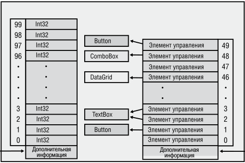


**----- Start of picture text -----**<br>
Äîïîëíèòåëüíàÿ  Äîïîëíèòåëüíàÿ<br>èíôîðìàöèÿ èíôîðìàöèÿ<br>**----- End of picture text -----**<br>


**рис. 16.1.** .Массивы.значимого.и.ссылочного.типов.в.управляемой.куче 

Согласно общеязыковой спецификации (CLS), нумерация элементов в массиве должна начинаться с нуля. Только в этом случае методы, написанные на C#, смогут передать ссылку на созданный массив коду, написанному на другом языке, скажем, на Microsoft Visual Basic .NET. Кроме того, поскольку массивы с начальным нулевым индексом получили очень большое распространение, специалисты Microsoft постарались оптимизировать их работу. Тем не менее иные варианты индексации массивов в CLR допускаются, хотя их использование не рекомендуется. В случаях когда производительность и межъязыковая совместимость программ не имеют большого значения, можно использовать массивы, начальный индекс которых отличен от 0. Мы подробно рассмотрим их чуть позже. 

На рисунке видно, что в массиве присутствует некая дополнительная информация. Это сведения о размерности массива, нижних границах всех его измерений (почти всегда 0) и количестве элементов в каждом измерении. Здесь же указывается тип элементов массива. Методы для получения этих данных будут рассмотрены далее в этой главе. 

Пока что нам известен только процесс создания одномерных массивов. По возможности нужно ограничиваться одномерными массивами с нулевым начальным индексом, которые называют иногда _SZ-массивами_ , или _векторами_ . Векторы обеспечивают наилучшую производительность, поскольку для операций с ними используются команды промежуточного языка (Intermediate Language, IL), например `newarr` , `ldelem` , `ldelema` , `ldlen` и `stelem` . Впрочем, если у вас есть такое желание, можно применять и многомерные массивы. Вот как они создаются: 

// Создание двухмерного массива типа Doubles Double[,] myDoubles = new Double[10, 20]; 

_продолжение_  

**418** Глава.16 .Массивы 

// Создание трехмерного массива ссылок на строки String[,,] myStrings = new String[5, 3, 10]; 

CLR поддерживает также _нерегулярные_ (jagged) массивы — то есть «массивы массивов». Производительность одномерных нерегулярных массивов с нулевым начальным индексом такая же, как у обычных векторов. Однако обращение к элементу нерегулярного массива означает обращение к двум или больше массивам одновременно. Вот пример массива многоугольников, где каждый многоугольник состоит из массива экземпляров типа `Point` : 

// Создание одномерного массива из массивов типа Point `Point[][] myPolygons = new Point[3][];` 

// myPolygons[0] ссылается на массив из 10 экземпляров типа Point `myPolygons[0] = new Point[10];` 

// myPolygons[1] ссылается на массив из 20 экземпляров типа Point `myPolygons[1] = new Point[20];` 

// myPolygons[2] ссылается на массив из 30 экземпляров типа Point `myPolygons[2] = new Point[30];` 

// вывод точек первого многоугольника `for (Int32 x = 0; x < myPolygons[0].Length; x++) Console.WriteLine(myPolygons[0][x]);` 

## **ПриМеЧание** 

CLR.проверяет.корректность.индексов .То.есть.если.у.вас.имеется.массив,.состоящий.из.100.элементов.с.индексами.от.0.до.99,.попытка.обратиться.к.его.элементу.по. индексу.–5.или.100.породит.исключение.System Index OutOfRange .Доступ.к.памяти. за.пределами.массива.нарушает.безопасность.типов.и.создает.брешь.в.защите,.недопустимую.для.верифицированного.CLR-кода .Проверка.индекса.обычно.не.влияет. на.производительность,.так.как.компилятор.выполняет.ее.всего.один.раз.перед. началом.цикла,.а.не.на.каждой.итерации .Впрочем,.если.вы.считаете,.что.проверка. индексов.критична.для.скорости.выполнения.вашей.программы,.используйте.для. доступа.к.массиву.небезопасный.код .Эта.процедура.рассмотрена.в.разделе.«Производительность.доступа.к.массиву».данной.главы 

## **инициализация элементов массива** 

В предыдущем разделе рассмотрена процедура создания элементов массива и присвоения им начальных значений. Синтаксис C# позволяет совместить эти операции: 

String[] names = new String[] { "Aidan", "Grant" }; 

Набор разделенных запятой символов в фигурных скобках называется _инициализатором массива_ (array initializer). Сложность каждого символа может быть 

Инициализация.элементов.массива **419** 

произвольной, а в случае многомерного массива инициализатор может оказаться вложенным. В показанном примере фигурируют всего два простых выражения типа `String` . 

Если в методе объявляется локальная переменная для работы с инициализированным массивом, для упрощения кода можно воспользоваться переменной неявного типа `var` : 

// Использование локальной переменной неявного типа: var names = new String[] { "Aidan", "Grant" }; 

В результате компилятор делает вывод о том, что локальная переменная `names` относится к типу `String[]` , так как именно к этому типу принадлежит выражение, `=` расположенное справа от оператора присваивания ( ). Используя неявную типизацию массивов C#, вы поручаете компилятору определить тип элементов массива. Обратите внимание на отсутствие спецификации типа между операторами `new` и `[]` в следующем фрагменте кода: 

// Задание типа массива с помощью локальной переменной неявного типа: var names = new[] { "Aidan", "Grant", null }; 

Компилятор определяет тип выражений, используемых для инициализации элементов массива, и по результатам выбирает базовый класс, который лучше всего описывает все элементы. В показанном примере компилятор обнаруживает два элемента типа `String` и значение `null` . Но так как последнее может быть неявно преобразовано в любой ссылочный тип, выбор делается в пользу создания и инициализации массива ссылок типа `String` . 

Еще пример: 

// Ошибочное задание типа массива с помощью локальной // переменной неявного типа 

var names = new[] { "Aidan", "Grant", 123 }; 

На такой код компилятор реагирует сообщением (ошибка CS0826: подходящего типа для неявно заданного массива не обнаружено): 

```
error CS0826: No best type found for implicitly-typed array
```

Дело в том, что общим базовым типом для двух строк и значения типа `Int32` является тип `Object` . Для компилятора это означает необходимость создать массив ссылок типа `Object` , а затем упаковать значение типа `Int32` и заставить последний элемент массива ссылаться на результат упаковки, имеющий значение 123. Разработчики сочли, что задача упаковки элементов массива приводит к слишком высоким затратам, чтобы компилятор мог выполнять ее неявно, поэтому в такой ситуации просто выводится сообщение об ошибке. 

В качестве синтаксического бонуса можно указать возможность вот такой инициализации массива: 

String[] names = { "Aidan", "Grant" }; 

Обратите внимание, что справа от оператора присваивания располагаются только начальные значения элементов массива. Ни оператора `new` , ни типа, ни квадратных 

**420** Глава.16 .Массивы 

скобок там нет. Этот синтаксис удобен, но к сожалению, в этом случае компилятор не разрешает использовать локальные переменные неявного типа: 

// Ошибочное использование локальной переменной var names = { "Aidan", "Grant" }; 

Попытка компиляции такой строчки приведет к появлению двух сообщений: 

```
error CS0820: Cannot initialize an implicitly-typed local variable with
              an array initializer
error CS0622: Can only use array initializer expressions to assign array types.
              Try using a new expression instead
```

Первое говорит о том, что локальной переменной неявного типа невозможно присвоить начальное значение при помощи инициализатора массива, а второе информирует, что данный инициализатор применяется только для назначения типов массивам и рекомендует вам воспользоваться оператором `new` . В принципе, компилятор вполне способен выполнить все эти действия самостоятельно, но разработчики решили, что это — слишком сложная задача. Ведь пришлось бы определять тип массива, создавать его при помощи оператора `new` , присваивать элементам начальные значения, а кроме того, определять тип локальной переменной. 

Напоследок хотелось бы рассмотреть процедуру неявного задания типа массива в случае анонимных типов и локальных переменных неявного типа. (Об анонимных типах см. главу 10.) 

Рассмотрим следующий код: 

// Применение переменных и массивов неявно заданного типа, // а также анонимного типа: var kids = new[] {new { Name="Aidan" }, new { Name="Grant" }}; 

// Пример применения (с другой локальной переменной неявно заданного типа): `foreach (var kid in kids)` 

```
  Console.WriteLine(kid.Name);
```

В этом примере для присваивания начальных значений элементам массива используются два выражения, каждое из которых представляет собой анонимный тип (ведь после оператора `new` ни в одном из случаев не фигурирует имя типа). Благодаря идентичной структуре этих выражений (поле `Name` типа `String` ) компилятор относит оба объекта к одному типу. Теперь мы можем воспользоваться возможностью неявного задания типа массива (когда между оператором `new` и квадратными скобками отсутствует имя типа). В результате компилятор самостоятельно определит тип, сконструирует массив и инициализирует его элементы как ссылки на два экземпляра одного и того же анонимного типа. В итоге ссылка на этот объект присваивается локальной переменной `kids` , тип которой определит компилятор. 

Затем только что созданный и инициализированный массив используется в цикле `foreach` , в котором фигурирует и переменная `kid` неявного типа. Вот результат выполнения такого кода: 

```
Aidan
Grant
```

Приведение.типов.в.массивах **421** 

## **Приведение типов в массивах** 

В CLR для массивов с элементами ссылочного типа допустимо приведение. В рамках решения этой задачи оба типа массивов должны иметь одинаковую размерность; кроме того, должно иметь место неявное или явное преобразование из типа элементов исходного массива в целевой тип. CLR не поддерживает преобразование массивов с элементами значимых типов в другие типы. Впрочем, данное ограничение можно обойти при помощи метода `Array.Copy` , который создает новый массив и заполняет его элементами. Вот пример приведения типа в массиве: 

// Создание двухмерного массива FileStream FileStream[,] fs2dim = new FileStream[5, 10]; 

// Неявное приведение к массиву типа Object Object[,] o2dim = fs2dim; 

// Невозможно приведение двухмерного массива к одномерному 

// Ошибка компиляции CS0030: невозможно преобразовать тип 'object[*,*]' // в 'System.IO.Stream[]' `Stream[] s1dim = (Stream[]) o2dim;` 

// Явное приведение к двухмерному массиву Stream Stream[,] s2dim = (Stream[,]) o2dim; 

// Явное приведение к двухмерному массиву String 

// Компилируется, но во время выполнения // возникает исключение InvalidCastException String[,] st2dim = (String[,]) o2dim; 

// Создание одномерного массива Int32 (значимый тип) `Int32[] i1dim = new Int32[5];` 

// Невозможно приведение массива значимого типа 

// Ошибка компиляции CS0030: невозможно преобразовать // тип 'int[]' в 'object[]' `Object[] o1dim = (Object[]) i1dim;` 

// Создание нового массива и приведение элементов к нужному типу 

// при помощи метода Array.Copy 

// Создаем массив ссылок на упакованные элементы типа Int32 `Object[] ob1dim = new Object[i1dim.Length]; Array.Copy(i1dim` , ob1dim, i1dim.Length); 

Метод `Array.Copy` не просто копирует элементы одного массива в другой. Он действует как функция `memmove` языка C, но при этом правильно обрабатывает перекрывающиеся области памяти. Он также способен при необходимости преобразовывать элементы массива в процессе их копирования. Метод `Copy` выполняет следующие действия: 

- Упаковка элементов значимого типа в элементы ссылочного типа, например копирование `Int32[]` в `Object[]` . 

**422** Глава.16 .Массивы 

- Распаковка элементов ссылочного типа в элементы значимого типа, например копирование `Object[]` в `Int32[]` . 

- Расширение (widening) примитивных значимых типов, например копирование `Int32[]` в `Double[]` . 

- Понижающее приведение в случаях, когда совместимость массивов невозможно определить по их типам. Сюда относится, к примеру, приведение массива типа `Object[]` в массив типа `IFormattable[]` . Если все объекты в массиве `Object[]` реализуют интерфейс `IFormattable[]` , приведение пройдет успешно. 

Вот еще один пример применения метода `Copy` : 

// Определение значимого типа, реализующего интерфейс `internal struct MyValueType : IComparable { public Int32 CompareTo(Object obj) { ... } } public static class Program { public static void Main() {` // Создание массива из 100 элементов значимого типа `MyValueType[] src = new MyValueType[100];` 

// Создание массива ссылок IComparable `IComparable[] dest = new IComparable[src.Length];` 

// Присваивание элементам массива IComparable ссылок на упакованные // версии элементов исходного массива Array.Copy(src, dest, src.Length); `} }` 

Нетрудно догадаться, что FCL достаточно часто использует достоинства метода `Array.Copy` . 

Бывают ситуации, когда полезно изменить тип массива, то есть выполнить его _ковариацию_ (array covariance). Однако следует помнить, что эта операция сказывается на производительности. Допустим, вы написали такой код: 

`String[] sa = new String[100];` Object[] oa = sa; // oa ссылается на массив элементов типа String oa[5] = "Jeff";   // CLR проверяет принадлежность oa к типу String; // Проверка проходит успешно oa[3] = 5;        // CLR проверяет принадлежность oa к типу Int32; // Генерируется исключение ArrayTypeMismatchException 

В этом коде переменная `oa` , тип которой определен как `Object[]` , ссылается на массив типа `String[]` . Затем вы пытаетесь присвоить одному из элементов этого массива значение 5, относящееся к типу `Int32` , производному от типа `Object` . Естественно, CLR проверяет корректность такого присваивания, то есть в про- 

Базовый.класс.System Array **423** 

цессе выполнения контролирует наличие в массиве элементов типа `Int32` . В данном случае такие элементы отсутствуют, что и становится причиной исключения `ArrayTypeMismatchException` . 

## **ПриМеЧание** 

Для.простого.копирования.части.элементов.из.одного.массива.в.другой.имеет.смысл. использовать.метод.BlockCopy.класса.System Buffer,.который.работает.быстрее.метода.Array Copy .К.сожалению,.этот.метод.поддерживает.только.примитивные.типы. и.не.имеет.таких.же.широких.возможностей.приведения,.как.Array Copy .Параметры. типа.Int32.выражаются.путем.смещения.байтов.внутри.массива,.а.не.при.помощи. индексов .То.есть.метод.BlockCopy.подходит.для.поразрядного.копирования.совместимых.данных.из.массива.одного.типа.в.другой .К.примеру,.таким.способом. можно.скопировать.массив.типа.Byte[],.содержащий.символы.Юникода,.в.массив. типа.Char[] .Этот.метод.частично.компенсирует.отсутствие.возможности.считать. массив.просто.блоком.памяти.произвольного.типа 

Для.надежного.копирования.набора.элементов.из.одного.массива.в.другой.используйте.метод.ConstrainedCopy.класса.System Array .Он.гарантирует,.что.в.случае. неудачного.копирования.будет.выдано.исключение,.но.данные.в.целевом.массиве. останутся.неповрежденными .Это.позволяет.использовать.метод.ConstrainedCopy. в.области.ограниченного.выполнения.(Constrained.Execution.Region,.CER) .Гарантии,. которые.он.дает,.обусловлены.требованием,.чтобы.тип.элементов.исходного.массива. совпадал.с.типом.элементов.целевого.или.был.производным.от.него .Кроме.того,. метод.не.поддерживает.упаковку,.распаковку.или.нисходящее.приведение 

## **Базовый класс System.Array** 

Рассмотрим объявление переменной массива: 

```
FileStream[] fsArray;
```

Объявление переменной массива подобным образом приводит к автоматическому созданию типа `FileStream[]` для домена приложений. Тип `FileStream[]` является производным от `System.Array` и соответственно наследует оттуда все методы и свойства. Для их вызова служит переменная `fsArray` . Это упрощает работу с массивами, ведь в классе `System.Array` есть множество полезных методов и свойств, в том числе `Clone` , `CopyTo` , `GetLength` , `GetLongLength` , `GetLowerBound` , `GetUpperBound` , `Length` и `Rank` . 

Класс `System.Array` содержит также статические методы для работы с массивами, в том числе `AsReadOnly` , `BinarySearch` , `Clear` , `ConstrainedCopy` , `ConvertAll` , `Copy` , `Exists` , `Find` , `FindAll` , `FindIndex` , `FindLast` , `FindLastIndex` , `ForEach` , `IndexOf` , `LastIndexOf` , `Resize` , `Reverse` , `Sort` и `TrueForAll` . В качестве параметра они принимают ссылку на массив. У каждого из этих методов существует множество перегруженных версий. Более того, для многих из них имеются обобщенные перегруженные версии, обеспечивающие контроль типов во время компиляции и высокую 

**424** Глава.16 .Массивы 

производительность. Я настоятельно рекомендую самостоятельно почитать о них в документации на SDK. 

## **реализация интерфейсов IEnumerable, ICollection и IList** 

Многие методы работают с коллекциями, поскольку они объявлены с такими параметрами, как интерфейсы `IEnumerable` , `ICollection` и `IList` . Им можно передавать и массивы, так как эти три необобщенных интерфейса реализованы в классе `System.Array` . Данная реализация обусловлена тем, что эти интерфейсы интерпретируют любой элемент как экземпляр `System.Object` . Однако хотелось бы также, чтобы класс `System.Array` реализовывал обобщенные эквиваленты этих интерфейсов, обеспечивая лучший контроль типов во время компиляции и повышенную производительность. 

Команда разработчиков CLR решила, что не стоит осуществлять реализацию интерфейсов `IEnumerable<T>` , `ICollection<T>` и `IList<T>` классом `System.Array` , так как в этом случае возникают проблемы с многомерными массивами, а также с массивами, в которых нумерация не начинается с нуля. Ведь определение этих интерфейсов в указанном классе означает необходимость поддержки массивов всех типов. Вместо этого разработчики пошли на хитрость: при создании одномерного массива с начинающейся с нуля индексацией CLR автоматически реализует интерфейсы `IEnumerable<T>` , `ICollection<T>` и `IList<T>` (здесь `T` — тип элементов массива), а также три интерфейса для всех базовых типов массива при условии, что эти типы являются ссылочными. Ситуацию иллюстрирует следующая иерархия. 

`Object` Array (необобщенные IEnumerable, ICollection, IList) Object[] (IEnumerable, ICollection, IList of Object) String[] (IEnumerable, ICollection, IList of String) Stream[] (IEnumerable, ICollection, IList of Stream) FileStream[] (IEnumerable, ICollection, IList of FileStream) `.` .          (другие массивы ссылочных типов) `.` 

Пример: 

```
FileStream[] fsArray;
```

В этом случае при создании типа `FileStream[]` CLR автоматически реализует в нем интерфейсы `IEnumerable<FileStream>` , `ICollection<FileStream>` и `IList<FileStream>` . Более того, тип `FileStream[]` будет реализовывать интерфейсы базовых классов `IEnumerable<Stream>` , `IEnumerable<Object>` , `ICollection<Stream>` , `ICollection<Object>` , `IList<Stream>` и `IList<Object>` . 

Передача.и.возврат.массивов **425** 

Так как все эти интерфейсы реализуются средой CLR автоматически, переменная `fsArray` может применяться во всех случаях использования этих интерфейсов. Например, ее можно передавать в методы с такими прототипами: 

```
void M1(IList<FileStream> fsList) { ... }
void M2(ICollection<Stream> sCollection) { ... }
void M3(IEnumerable<Object> oEnumerable) { ... }
```

Обратите внимание, что если массив содержит элементы значимого типа, класс, которому он принадлежит, не будет реализовывать интерфейсы базовых классов элемента. Например: 

DateTime[] dtArray; // Массив элементов значимого типа 

В данном случае тип `DateTime[]` будет реализовывать только интерфейсы `IEnumerable<DateTime>` , `ICollection<DateTime>` и `IList<DateTime>` ; версии этих интерфейсов, общие для классов `System.ValueType` или `System.Object` , реализованы не будут. А это значит, что переменную `dtArray` нельзя передать показанному ранее методу `M3` в качестве аргумента. Ведь массивы значимых и ссылочных типов располагаются в памяти по-разному (об этом рассказывалось в начале данной главы). 

## **Передача и возврат массивов** 

Передавая массив в метод в качестве аргумента, вы на самом деле передаете ссылку на него. А значит, метод может модифицировать элементы массива. Этого можно избежать, передав в качестве аргумента копию массива. Имейте в виду, что метод `Array.Copy` выполняет поверхностное (shallow) копирование, и если элементы массива относятся к ссылочному типу, в новом массиве окажутся ссылки на существующие объекты. 

Аналогично, отдельные методы возвращают ссылку на массив. Если метод создает и инициализирует массив, возвращение такой ссылки не вызывает проблем; если же вы хотите, чтобы метод возвращал ссылку на внутренний массив, ассоциированный с полем, то сначала решите, вправе ли вызывающая программа иметь доступ к этому массиву. Как правило, делать этого не стоит. Поэтому лучше пусть метод создаст массив, вызовет метод `Array.Copy` , а затем вернет ссылку на новый массив. Еще раз напомню, что данный метод выполняет поверхностное копирование исходного массива. 

Результатом вызова метода, возвращающего ссылку на массив, не содержащий элементов, является либо значение `null` , либо ссылка на массив с нулевым числом элементов. В такой ситуации Microsoft настоятельно рекомендует второй вариант, поскольку подобная реализация упрощает код. К примеру, данный код выполняется правильно даже при отсутствии элементов, подлежащих обработке: 

// Пример простого для понимания кода `Appointment[] appointments = GetAppointmentsForToday();` 

_продолжение_  

**426** Глава.16 .Массивы 

```
for (Int32 a = 0; a < appointments.Length; a++) {
  ...
}
```

Следующий фрагмент кода также корректно выполняется при отсутствии элементов, но он уже сложнее: 

// Пример более сложного кода `Appointment[] appointments = GetAppointmentsForToday(); if (appointments != null) {` for (Int32 a = 0, a < appointments.Length; a++) { // Выполняем действия с элементом appointments[a] `} }` 

Если вы пишете свои методы так, чтобы они вместо `null` возвращали массивы с нулевым числом элементов, пользователям будет проще работать с ними. То же относится к полям. Если у вашего типа есть поле, являющееся ссылкой на массив, то в него следует помещать ссылку на массив, даже если в массиве нет ни одного элемента. 

## **Массивы с ненулевой нижней границей** 

Как уже упоминалось, массивы с ненулевой нижней границей вполне допустимы. Создавать их можно при помощи статического метода `CreateInstance` типа `Array` . Существует несколько перегруженных версий этого метода, позволяющих задать тип элементов, размерность, нижнюю границу массива, а также количество элементов в каждом измерении. Метод выделяет память, записывает заданные параметры в служебную область выделенного блока и возвращает ссылку на массив. При наличии двух и более измерений ссылку, возвращенную методом `CreateInstance` , можно привести к типу переменной `ElementType[]` (здесь `ElementType` — имя типа), чтобы упростить доступ к элементам массива. Для доступа к элементам одномерных массивов пользуйтесь методами `GetValue` и `SetValue` класса `Array` . 

Рассмотрим процесс динамического создания двухмерного массива значений типа `System.Decimal` . Первое измерение составят годы с 2005 по 2009 включительно, а второе — кварталы с 1 по 4 включительно. Все элементы обрабатываются в цикле. Прописав в коде границы массива в явном виде, мы получили бы выигрыш в производительности, но вместо этого воспользуемся методами `GetLowerBound` и `GetUpperBound` класса `System.Array` : 

```
using System;
```

`public static class DynamicArrays { public static void Main() {` // Требуется двухмерный массив [2005..2009][1..4] Int32[] lowerBounds = { 2005, 1 }; 

**427** 

Внутренняя.реализация.массивов 

Int32[] lengths = { 5, 4 }; Decimal[,] quarterlyRevenue = (Decimal[,]) Array.CreateInstance(typeof(Decimal), lengths, lowerBounds); 

Console.WriteLine("{0,4} {1,9} {2,9} {3,9} {4,9}", "Year", "Q1", "Q2", "Q3", "Q4"); `Int32 firstYear = quarterlyRevenue.GetLowerBound(0); Int32 lastYear = quarterlyRevenue.GetUpperBound(0); Int32 firstQuarter = quarterlyRevenue.GetLowerBound(1); Int32 lastQuarter = quarterlyRevenue.GetUpperBound(1);` 

`for (Int32 year = firstYear; year <= lastYear; year++) { Console.Write(year + " "); for (Int32 quarter = firstQuarter; quarter <= lastQuarter; quarter++) {` Console.Write("{0,9:C} ", quarterlyRevenue[year, quarter]); `} Console.WriteLine(); } } }` 

После компиляции и выполнения этого кода получаем: 

```
Year     Q1     Q2     Q3     Q4
2005  $0.00  $0.00  $0.00  $0.00
2006  $0.00  $0.00  $0.00  $0.00
2007  $0.00  $0.00  $0.00  $0.00
2008  $0.00  $0.00  $0.00  $0.00
2009  $0.00  $0.00  $0.00  $0.00
```

## **Внутренняя реализация массивов** 

В CLR поддерживаются массивы двух типов: 

- Одномерные массивы с нулевым начальным индексом. Иногда их называют _SZ-массивами_ (от английского single-dimensional, zero-based), или _векторами_ . 

- Одномерные и многомерные массивы с неизвестным начальным индексом. 

Рассмотрим их на примере следующего кода (результат его выполнения приводится в комментариях): 

```
using System;
public sealed class Program {
  public static void Main() {
    Array a;
```

> // Создание одномерного массива с нулевым 

> // начальным индексом и без элементов 

_продолжение_  

## **428** Глава.16 .Массивы 

`a = new String[0]; Console.WriteLine(a.GetType()); // "System.String[]"` // Создание одномерного массива с нулевым // начальным индексом и без элементов a = Array.CreateInstance(typeof(String), new Int32[] { 0 }, new Int32[] { 0 }); `Console.WriteLine(a.GetType()); // "System.String[]"` // Создание одномерного массива с начальным индексом 1 и без элементов a = Array.CreateInstance(typeof(String), new Int32[] { 0 }, new Int32[] { 1 }); Console.WriteLine(a.GetType()); // "System.String[*]" <-- ВНИМАНИЕ! `Console.WriteLine();` // Создание двухмерного массива с нулевым // начальным индексом и без элементов a = new String[0, 0]; Console.WriteLine(a.GetType()); // "System.String[,]" // Создание двухмерного массива с нулевым // начальным индексом и без элементов a = Array.CreateInstance(typeof(String), new Int32[] { 0, 0 }, new Int32[] { 0, 0 }); Console.WriteLine(a.GetType()); // "System.String[,]" // Создание двухмерного массива с начальным индексом 1 и без элементов a = Array.CreateInstance(typeof(String), new Int32[] { 0, 0 }, new Int32[] { 1, 1 }); Console.WriteLine(a.GetType()); // "System.String[,]" `} }` 

Рядом с каждой инструкцией `Console.WriteLine` в виде комментария показан результат действия. Для одномерных массивов с нулевой нижней границей это `System.String[]` , если же индексация начинается с единицы, выводится уже `System.String[*]` . Знак `*` свидетельствует о том, что CLR знает о ненулевой нижней границе. Так как в C# объявить переменную типа `String[*]` невозможно, синтаксис этого языка запрещает обращение к одномерным массивам с ненулевой нижней границей. Впрочем, обойти это ограничение можно с помощью методов `GetValue` и `SetValue` класса `Array` , но дополнительные затраты на вызов метода снижают эффективность работы программы. 

Для многомерных массивов, независимо от нижней границы, отображается один и тот же тип: System.String[,] . Во время выполнения CLR рассматривает их как массивы с ненулевой нижней границей. Логично было бы предположить, что имя типа будет представлено как System.String[*,*] , но в CLR для многомерных массивов не используется знак `*` . Ведь иначе он выводился бы во всех случаях, создавая путаницу. 

Внутренняя.реализация.массивов **429** 

Доступ к элементам одномерного массива с нулевой нижней границей осуществляется немного быстрее, чем доступ к элементам многомерных массивов или массивов с ненулевой нижней границей. Есть несколько причин такому поведению. Во-первых, специальные команды для работы с одномерными массивами с нулевой нижней границей ( `newarr` , `ldelem` , `ldelema` , `ldlen` и `stelem` ) позволяют JIT-компилятору генерировать оптимизированный код. При этом предполагается, что первый индекс равен нулю, то есть при доступе к элементам отсутствует необходимость вычислять смещение. Кроме того, в общем случае компилятор умеет выносить код проверки границ за пределы цикла. К примеру, рассмотрим следующий код: 

```
using System;
```

`public static class Program { public static void Main() { Int32[] a = new Int32[5]; for(Int32 index = 0; index < a.Length; index++) {` // Какие-то действия с элементом a[index] `} } }` 

Обратите внимание на вызов свойства `Length` в проверочном выражении цикла `for` . Фактически при этом вызывается метод, но JIT-компилятор «знает», что `Length` является свойством класса `Array` , поэтому создает код, в котором метод вызывается всего один раз, а полученный результат сохраняется в промежуточной переменной. Именно ее значение проверяется на каждой итерации цикла. В результате такой код работает очень быстро. Некоторые разработчики недооценивают возможности JIT-компилятора и пишут «умный код», пытаясь помочь его работе. Однако такие попытки практически всегда приводят к снижению производительности, а также делают готовую программу непонятной и неудобной для редактирования. Поэтому пусть свойство `Length` вызывается автоматически. 

Кроме того, JIT-компилятор «знает», что цикл обращается к элементам массива с нулевой нижней границей, указывая `Length - 1` . Поэтому он в процессе выполнения генерирует код, проверяющий, все ли элементы находятся в границах массива. А именно, проверяется условие: 

```
(0 >= a.GetLowerBound(0)) && ((Length – 1) <= a.GetUpperBound(0))
```

Проверка осуществляется до начала цикла. В случае положительного результата компилятор не создает в теле цикла кода, проверяющего, не вышел ли индекс элемента за границы диапазона. Именно за счет этого обеспечивается высокая производительность доступа к массиву. 

К сожалению, обращение к элементам многомерного массива или массива с ненулевой нижней границей происходит намного медленней. Ведь в этих случаях код проверки индекса не выносится за пределы цикла и проверка осуществляется на каждой итерации. Кроме того, компилятор добавляет код, вычитающий из текущего 

**430** Глава.16 .Массивы 

индекса нижнюю границу массива. Это также замедляет работу программы даже в случае многомерных массивов с нулевой нижней границей. Если вы серьезно озабочены проблемой производительности, имеет смысл использовать нерегулярные массивы (массивы массивов). 

Кроме того, в C# и CLR возможен доступ к элементам массива при помощи небезопасного (неверифицируемого) кода. В этом случае процедура проверки индексов массива просто отключается. Данная техника применима только к массивам типа `SByte` , `Byte` , `Int16` , `UInt16` , `Int32` , `UInt32` , `Int64` , `UInt64` , `Char` , `Single` , `Double` , `Decimal` , `Boolean` , а также к массивам перечислимого типа или структуры значимого типа с полями одного из вышеуказанных типов. 

Эту мощную возможность следует использовать крайне осторожно, так как она дает прямой доступ к памяти. При этом выход за границы массива не сопровождается появлением исключения; вместо этого происходит повреждение памяти, нарушение безопасности типов и, скорее всего, в системы безопасности программы появляется дефект. Поэтому сборке, содержащей небезопасный код, следует обеспечить полное доверие или же предоставить разрешение `Security Permission` , включив свойство `Skip Verification` . 

Следующий код демонстрирует три варианта доступа к двухмерному массиву, включая безопасный доступ, доступ через нерегулярный массив и небезопасный доступ: 

```
using System;
using System.Diagnostics;
```

```
public static class Program {
  private const Int32 c_numElements = 10000;
```

`public static void Main() {` // Объявление двухмерного массива Int32[,] a2Dim = new Int32[c_numElements, c_numElements]; 

// Объявление нерегулярного двухмерного массива (вектор векторов) `Int32[][] aJagged = new Int32[c_numElements][]; for (Int32 x = 0; x < c_numElements; x++) aJagged[x] = new Int32[c_numElements];` 

// 1: Обращение к элементам стандартным, безопасным способом `Safe2DimArrayAccess(a2Dim);` 

// 2: Обращение к элементам с использованием нерегулярного массива `SafeJaggedArrayAccess(aJagged);` 

// 3: Обращение к элементам небезопасным методом `Unsafe2DimArrayAccess(a2Dim); }` 

private static Int32 Safe2DimArrayAccess(Int32[,] a) { 

**431** 

Внутренняя.реализация.массивов 

`Int32 sum = 0; for (Int32 x = 0; x < c_numElements; x++) { for (Int32 y = 0; y < c_numElements; y++) {` sum += a[x, y]; `} } return sum; } private static Int32 SafeJaggedArrayAccess(Int32[][] a) { Int32 sum = 0; for (Int32 x = 0; x < c_numElements; x++) { for (Int32 y = 0; y < c_numElements; y++) { sum += a[x][y]; } } return sum; }` private static unsafe Int32 Unsafe2DimArrayAccess(Int32[,] a) { `Int32 sum = 0; fixed (Int32* pi = a) { for (Int32 x = 0; x < c_numElements; x++) { Int32 baseOfDim = x * c_numElements; for (Int32 y = 0; y < c_numElements; y++) { sum += pi[baseOfDim + y]; } } } return sum; } }` 

Метод `Unsafe2DimArrayAccess` имеет модификатор `unsafe` , который необходим для инструкции `fixed` языка C#. При вызове компилятора следует установить переключатель `/unsafe` или флажок Allow.Unsafe.Code на вкладке Build окна свойств проекта в программе Microsoft Visual Studio. 

Существуют ситуации, в которых «небезопасный» доступ оказывается оптимальным, но у него есть три серьезных недостатка: 

- код обращения к элементам массива менее читабелен и более сложен в написании из-за присутствия инструкции `fixed` и вычисления адресов памяти; 

- ошибка в расчетах может привести к перезаписи памяти, не принадлежащей массиву, в результате возможны разрушение памяти, нарушение безопасности типов и потенциальные бреши в системе безопасности; 

- из-за высокой вероятности проблем CLR запрещает работу небезопасного кода в средах с пониженным уровнем безопасности (таких, как Microsoft Silverlight). 

**432** Глава.16 .Массивы 

## **небезопасный доступ к массивам и массивы фиксированного размера** 

Небезопасный доступ к массиву является крайне мощным средством, так как именно такой доступ дает возможность работать: 

- с элементами управляемого массива, расположенными в куче (как показано в предыдущем разделе); 

- с элементами массива, расположенными в неуправляемой куче (пример `SecureString` из главы 14 демонстрирует небезопасный метод доступа к массиву, возвращаемому методом `SecureStringToCoTaskMemUnicode` класса `System. Runtime.InteropServices.Marshal` ); 

- с элементами массива, расположенными в стеке потока. 

Если производительность для вас критична, управляемый массив можно вместо кучи разместить в стеке потока. Для этого вам потребуется инструкция `stackalloc` языка C# (ее принцип действия напоминает функцию `alloca` языка C). Она позволяет создавать одномерные массивы элементов значимого типа с нулевой нижней границей. При этом значимый тип не должен содержать никаких полей ссылочного типа. По сути, вы выделяете блок памяти, с которым можно работать при помощи небезопасных указателей, поэтому адрес этого буфера нельзя передавать большинству FCL-методов. Выделенная в стеке память (массив) автоматически освобождается после завершения метода. Именно за счет этого и достигается выигрыш в производительности. При этом для компилятора C# должен быть задан параметр `/unsafe` . 

Метод `StackallocDemo` демонстрирует пример использования инструкции `stackalloc` : 

`using System; public static class Program { public static void Main() { StackallocDemo(); InlineArrayDemo(); } private static void StackallocDemo() { unsafe { const Int32 width = 20;` Char* pc = stackalloc Char[width]; // В стеке выделяется // память под массив String s = "Jeffrey Richter";      // 15 символов `for (Int32 index = 0; index < width; index++) { pc[width - index - 1] =` (index < s.Length) ? s[index] : '.'; `}` 

**433** 

Небезопасный.доступ.к.массивам.и.массивы.фиксированного.размера 

// Следующая инструкция выводит на экран ".....rethciR yerffeJ" Console.WriteLine(new String(pc, 0, width)); `} } private static void InlineArrayDemo() { unsafe {` CharArray ca; // Память под массив выделяется в стеке `Int32 widthInBytes = sizeof(CharArray); Int32 width = widthInBytes / 2;` String s = "Jeffrey Richter";      // 15 символов `for (Int32 index = 0; index < width; index++) { ca.Characters[width - index - 1] =` (index < s.Length) ? s[index] : '.'; `}` // Следующая инструкция выводит на экран ".....rethciR yerffeJ" Console.WriteLine(new String(ca.Characters, 0, width)); `} } } internal unsafe struct CharArray {` // Этот массив встраивается в структуру `public fixed Char Characters[20]; }` 

Так как массивы относятся к ссылочным типам, поле массива, определенное в структуре, содержит указатель или ссылку на этот массив; при этом сам он располагается вне памяти структуры. Впрочем, существует возможность встроить массив непосредственно в структуру. Вы это видели в показанном коде на примере структуры `CharArray` . При этом должны соблюдаться следующие условия: 

- тип должен быть структурой (значимым типом), встраивать массивы в класс (ссылочный тип) нельзя; 

- поле или структура, в которой оно определено, должно быть помечено модификатором `unsafe` ; 

- поле массива должен быть помечено модификатором `fixed` ; 

- массив должен быть одномерным и с нулевой нижней границей; 

- элементы массива могут принадлежать только к типам: `Boolean` , `Char` , `SByte` , `Byte` , `Int32` , `UInt32` , `Int64` , `UInt64` , `Single` и `Double` . 

Встроенные массивы обычно применяются в сценариях, работающих с небезопасным кодом, в котором неуправляемая структура данных также содержит встроенный массив. Впрочем, никто не запрещает использовать их и в других случаях, например, как показано ранее в методе `InlineArrayDemo` , который по-своему решает ту же задачу, что и метод `StackallocDemo` . 

## **Глава 17. делегаты** 

В этой главе рассказывается о чрезвычайно полезном механизме, который используется уже много лет и называется функциями обратного вызова. В Microsoft .NET Framework этот механизм поддерживается при помощи _делегатов_ (delegates). В отличие от других платформ, например неуправляемого языка C++, делегаты обладают более широкой функциональностью. Например, они обеспечивают безопасность типов при выполнении обратного вызова (способствуя решению одной из важнейших задач CLR). Кроме того, они обеспечивают возможность последовательного вызова нескольких методов, а также вызова как статических, так и экземплярных методов. 

## **знакомство с делегатами** 

Функция `qsort` исполняющей среды C получает указатель на функцию обратного вызова для сортировки элементов массивов. В Windows механизм обратного вызова используется оконными процедурами, процедурами перехвата, асинхронным вызовом процедур и др. В .NET Framework методы обратного вызова также имеют многочисленные применения. К примеру, можно зарегистрировать такой метод для получения различных уведомлений: о необработанных исключениях, изменении состояния окон, выборе пунктов меню, изменениях файловой системы и завершении асинхронных операций. 

В неуправляемом языке C/C++ адрес функции — не более чем адрес в памяти, не несущий дополнительной информации. В нем не содержится информация ни о количестве ожидаемых функцией параметров, ни об их типе, ни о типе возвращаемого функцией значения, ни о правилах вызова. Другими словами, функции обратного вызова C/C++ не обеспечивают безопасность типов (хотя их и отличает высокая скорость выполнения). 

В .NET Framework функции обратного вызова играют не менее важную роль, чем при неуправляемом программировании для Windows. Однако данная платформа предоставляет в распоряжение разработчика _делегатов_ — механизм, безопасный по отношению к типам. Рассмотрим пример объявления, создания и использования делегатов: 

```
using System;
using System.Windows.Forms;
using System.IO;
```

// Объявление делегата; экземпляр ссылается на метод 

Знакомство.с.делегатами **435** 

// с параметром типа Int32, возвращающий значение void `internal delegate void Feedback(Int32 value); public sealed class Program { public static void Main() { StaticDelegateDemo(); InstanceDelegateDemo(); ChainDelegateDemo1(new Program()); ChainDelegateDemo2(new Program()); } private static void StaticDelegateDemo() { Console.WriteLine("----- Static Delegate Demo -----");` Counter(1, 3, null); Counter(1, 3, new Feedback(Program.FeedbackToConsole)); Counter(1, 3, new Feedback(FeedbackToMsgBox)); // Префикс "Program." // не обязателен `Console.WriteLine(); } private static void InstanceDelegateDemo() { Console.WriteLine("----- Instance Delegate Demo -----"); Program p = new Program();` Counter(1, 3, new Feedback(p.FeedbackToFile)); `Console.WriteLine(); } private static void ChainDelegateDemo1(Program p) { Console.WriteLine("----- Chain Delegate Demo 1 -----"); Feedback fb1 = new Feedback(FeedbackToConsole); Feedback fb2 = new Feedback(FeedbackToMsgBox); Feedback fb3 = new Feedback(p.FeedbackToFile); Feedback fbChain = null;` fbChain = (Feedback) Delegate.Combine(fbChain, fb1); fbChain = (Feedback) Delegate.Combine(fbChain, fb2); fbChain = (Feedback) Delegate.Combine(fbChain, fb3); Counter(1, 2, fbChain); `Console.WriteLine(); fbChain = (Feedback)` Delegate.Remove(fbChain, new Feedback(FeedbackToMsgBox)); Counter(1, 2, fbChain); `} private static void ChainDelegateDemo2(Program p) { Console.WriteLine("----- Chain Delegate Demo 2 -----"); Feedback fb1 = new Feedback(FeedbackToConsole); Feedback fb2 = new Feedback(FeedbackToMsgBox); Feedback fb3 = new Feedback(p.FeedbackToFile); Feedback fbChain = null;` 

_продолжение_  

**436** Глава.17 .Делегаты 

`fbChain += fb1; fbChain += fb2; fbChain += fb3;` Counter(1, 2, fbChain); `Console.WriteLine(); fbChain -= new Feedback(FeedbackToMsgBox);` Counter(1, 2, fbChain); `}` private static void Counter(Int32 from, Int32 to, Feedback fb) { `for (Int32 val = from; val <= to; val++) {` // Если указаны методы обратного вызова, вызываем их `if (fb != null) fb(val); } } private static void FeedbackToConsole(Int32 value) { Console.WriteLine("Item=" + value); } private static void FeedbackToMsgBox(Int32 value) { MessageBox.Show("Item=" + value); } private void FeedbackToFile(Int32 value) {` using (StreamWriter sw = new StreamWriter("Status", true)) { `sw.WriteLine("Item=" + value); } }` 

Рассмотрим этот код более подробно. Прежде всего следует обратить внимание на объявление внутреннего делегата `Feedback` . Он задает сигнатуру метода обратного вызова. Данный делегат определяет метод, принимающий один параметр типа `Int32` и возвращающий значение `void` . Он напоминает ключевое слово `typedef` из C/C++, которое предоставляет адрес функции. 

Класс `Program` определяет закрытый статический метод `Counter` . Он перебирает целые числа в диапазоне, заданном аргументами `from` и `to` . Также он принимает параметр `fb` , который является ссылкой на делегат `Feedback` . Метод `Counter` перебирает числа в цикле и для каждого из них при условии, что переменная `fb` не равна `null` , выполняет метод обратного вызова (определенный переменной `fb` ). При этом методу обратного вызова передается значение обрабатываемого элемента и его номер. Реализация данного метода может обрабатывать элементы так, как считает нужным. 

Обратный.вызов.статических.методов **437** 

## **Обратный вызов статических методов** 

Теперь, когда мы разобрали принцип работы метода `Counter` , рассмотрим процедуру использования делегатов для вызова статических методов. Для примера возьмем метод `StaticDelegateDemo` из представленного в предыдущем разделе кода. 

Метод `StaticDelegateDemo` вызывает метод `Counter` , передавая в третьем параметре `fb` значение `null` . В результате при обработке элементов не задействуется метод обратного вызова. 

При втором вызове метода `Counter` методом `StaticDelegateDemo` третьему параметру передается только что созданный делегат `Feedback` . Этот делегат служит оболочкой для другого метода, позволяя выполнить обратный вызов последнего косвенно, через оболочку. В рассматриваемом примере имя статического метода `Program.FeedbackToConsole` передается конструктору `Feedback` , указывая, что именно для него требуется создать оболочку. Возвращенная оператором `new` ссылка передается третьему параметру метода `Counter` , который в процессе выполнения будет вызывать статический метод `FeedbackToConsole` . Последний же просто выводит на консоль строку с названием обрабатываемого элемента. 

## **ПриМеЧание** 

Метод.FeedbackToConsole.определен.в.типе.Program.как.закрытый,.но.при.этом.может.быть.вызван.методом.Counter .Так.как.оба.метода.определены.в.пределах.одного. типа,.проблем.с.безопасностью.не.возникает .Но.даже.если.бы.метод.Counter.был. определен.в.другом.типе,.это.не.сказалось.бы.на.работе.коде .Другими.словами,. если.код.одного.типа.вызывает.посредством.делегата.закрытый.член.другого.типа,. проблем.с.безопасностью.или.уровнем.доступа.не.возникает,.если.делегат.создан. в.коде,.имеющем.нужный.уровень.доступа 

Третий вызов метода `Counter` внутри метода `StaticDelegateDemo` отличается от второго тем, что делегат `Feedback` является оболочкой для статического метода `Program.FeedbackToMsgBox` . Именно метод `FeedbackToMsgBox` создает строку, указывающую на обрабатываемый элемент, которая затем выводится в окне в виде сообщения. 

В этом примере ничто не нарушает безопасность типов. К примеру, при создании делегата `Feedback` компилятор убеждается в том, что сигнатуры методов `FeedbackToConsole` и `FeedbackToMsgBox` типа `Program` совместимы с сигнатурой делегата. Это означает, что оба метода будут принимать один и тот же аргумент (типа `Int32` ) и возвращать значение одного и того же типа ( `void` ). Однако попробуем определить метод `FeedbackToConsole` вот так: 

```
private static Boolean FeedbackToConsole(String value) {
...
```

## `}` 

В этом случае компилятор выдаст сообщение об ошибке (сигнатура метода `FeedbackToConsole` не соответствует типу делегата): 

error CS0123: No overload for 'FeedbackToConsole' matches delegate 'Feedback' 

**438** Глава.17 .Делегаты 

Как C#, так и CLR поддерживают ковариантность и контравариантность ссылочных типов при привязке метода к делегату. _Ковариантность_ (covariance) означает, что метод может возвратить тип, производный от типа, возвращаемого делегатом. _Контравариантность_ (contra-variance) означает, что метод может принимать параметр, который является базовым для типа параметра делегата. Например: 

```
delegate Object MyCallback(FileStream s);
```

Определив делегат таким образом, можно получить экземпляр этого делегата, связанный с методом, прототип которого выглядит примерно так: 

```
String SomeMethod(Stream s);
```

Здесь тип значения, возвращаемого методом `SomeMethod` (тип `String` ), является производным от типа, возвращаемого делегатом ( `Object` ); такая ковариантность разрешена. Тип параметра метода `SomeMethod` (тип `Stream` ) является базовым классом для типа параметра делегата ( `FileStream` ); такая контравариантность тоже разрешена. 

Обратите внимание, что ковариантность и контравариантность поддерживаются только для ссылочных типов, но не для значимых типов или значения `void` . К примеру, связать следующий метод с делегатом `MyCallback` невозможно: `Int32 SomeOtherMethod(Stream s);` 

Несмотря на то что тип значения, возвращаемого методом `SomeOtherMethod` (то есть `Int32` ), является производным от типа значения, возвращаемого методом `MyCallback` (то есть `Object` ), такая форма ковариантности невозможна, потому что `Int32` — это значимый тип. Значимые типы и `void` не могут использоваться ковариантно и контравариантно, потому что их структура памяти меняется, в то время как для ссылочных типов структурой памяти в любом случае остается указатель. К счастью, при попытке выполнить запрещенные действия компилятор возвращает сообщение об ошибке. 

## **Обратный вызов экземплярных методов** 

Мы рассмотрели процедуру вызова при помощи делегатов статических методов, но они позволяют вызывать также экземплярные методы заданного объекта. Рассмотрим механизм этого вызова на примере метода `InstanceDelegateDemo` из показанного ранее кода. 

Обратите внимание, что объект `p` типа `Program` создается внутри метода `InstanceDelegateDemo` . При этом у него отсутствуют экземплярные поля и свойства, поскольку он сконструирован с демонстрационными целями. Когда при вызове метода `Counter` создается делегат `Feedback` , его конструктору передается объект `p.FeedbackToFile` . В результате делегат превращается в оболочку для ссылки на метод `FeedbackToFile` , который является не статическим, а экземплярным мето- 

Тонкости.использования.делегатов **439** 

дом. Когда метод `Counter` обращается к методу обратного вызова, который задан аргументом `fb` , вызывается экземплярный метод `FeedbackToFile` , а адрес только что созданного объекта `p` передается этому методу в качестве неявного аргумента `this` . 

Метод `FeedbackToFile` отличается от методов `FeedbackToConsole` и `FeedbackToMsgBox` тем, что открывает файл и дописывает в его конец строку (созданный им файл `Status` находится в папке AppBase приложения). 

Как видите, делегаты могут служить оболочкой как для статических, так и для экземплярных методов. В последнем случае делегат должен знать, какой экземпляр объекта будет обрабатывать вызываемый им метод. Создавая оболочку для экземплярного метода, вы предоставляете коду внутри объекта доступ к различным членам экземпляра объекта. Это означает наличие у объекта состояния, которое может использоваться во время выполнения метода обратного вызова. 

## **тонкости использования делегатов** 

На первый взгляд работать с делегатами легко. Они определяются при помощи ключевого слова C# `delegate` , оператор `new` создает экземпляры делегатов, а для обратного вызова служит уже знакомый синтаксис. В последнем случае вместо имени метода указывается ссылающаяся на делегат переменная. 

На самом деле все обстоит несколько сложнее, чем демонстрируют приведенные примеры. Пользователи просто не осознают всей сложности процесса благодаря работе компиляторов и CLR. Однако в этом разделе рассматриваются все тонкости реализации делегатов, так как это поможет нам понять принцип их работы и научиться применять их эффективно и рационально. Также будут рассмотрены некоторые дополнительные возможности делегатов. 

Внимательно посмотрите на следующую строку: 

```
internal delegate void Feedback(Int32 value);
```

Она заставляет компилятор создать полное определение класса, которое выглядит примерно так: 

`internal class Feedback : System.MulticastDelegate {` // Конструктор public Feedback(Object object, IntPtr method); 

// Метод, прототип которого задан в исходном тексте `public virtual void Invoke(Int32 value);` 

// Методы, обеспечивающие асинхронный обратный вызов public virtual IAsyncResult BeginInvoke(Int32 value, AsyncCallback callback, Object object); `public virtual void EndInvoke(IAsyncResult result); }` 

**440** Глава.17 .Делегаты 

Класс, определенный компилятором, содержит четыре метода: конструктор, а также методы `Invoke` , `BeginInvoke` и `EndInvoke` . В этой главы мы в основном будем рассматривать конструктор и метод `Invoke` . Методы `BeginInvoke` и `EndInvoke` относятся к модели асинхронного программирования .NET Framework, которая сейчас считается устаревшей. Она была заменена асинхронными операциями, которые рассматриваются в главе 27. 

Исследовав итоговую сборку при помощи утилиты ILDasm exe, можно убедиться, что компилятор действительно автоматически сгенерировал этот класс (рис 17.1). 


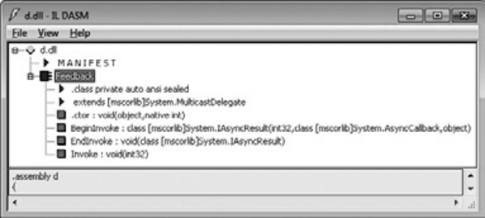


**рис. 17.1.** .Сгенерированные.компилятором.метаданные.делегата 

В этом примере компилятор определил класс `Feedback` , производный от типа `System.MulticastDelegate` из библиотеки классов Framework Class Library (все типы делегатов являются потомками `MulticastDelegate` ). 

## **ВниМание** 

Класс.System MulticastDelegate.является.производным.от.класса.System Delegate,. который,.в.свою.очередь,.наследует.от.класса.System Object .Два.класса.делегатов. появились.исторически,.в.то.время.как.в.FCL.предполагался.только.один .Вам.следует.помнить.об.обоих.классах,.так.как.даже.если.выбрать.в.качестве.базового.класс. MulticastDelegate,.все.равно.иногда.приходится.работать.с.делегатами,.использующими.методы.класса.Delegate .Скажем,.именно.этому.классу.принадлежат.статические.методы.Combine.и.Remove.(о.том,.зачем.они.нужны,.мы.поговорим.чуть.позже) . Сигнатуры.этих.методов.указывают,.что.они.принимают.параметры.класса.Delegate . Так.как.тип.вашего.делегата.является.производным.от.класса.MulticastDelegate,.для. которого.базовым.является.класс.Delegate,.методам.можно.передавать.экземпляры. типа.делегата 

Это закрытый класс, так как делегат объявляется в исходном коде с модификатором `internal` . Если объявить его с модификатором `public` , сгенерированный компилятором класс `Feedback` будет открытым. Следует помнить, что делегаты можно определять как внутри класса (вложенные в другой класс), так и в глобаль- 

Тонкости.использования.делегатов **441** 

ной области видимости. По сути, так как делегаты являются классами, их можно определить в любом месте, где может быть определен класс. 

Любые типы делегатов — это потомки класса `MulticastDelegate` , от которого они наследуют все поля, свойства и методы. Три самых важных поля описаны в табл. 17.1. 

**таблица 17.1.** .Важнейшие.закрытые.поля.класса.MulticastDelegate 

|**таблица 17.1.**В|ажнейшиезакры|тыеполяклассаMulticastDelegate|
|---|---|---|
|**Поле**|**тип**|**Описание**|
|_target|System.Object|Если делегат является оболочкой статического<br>метода, это поле содержит значение null. Если де-<br>легат является оболочкой экземплярного метода,<br>поле ссылается на объект, с которым будет работать<br>метод обратного вызова. Другими словами, поле<br>указывает на значение, которое следует передать<br>параметру this экземплярного метода|
|_methodPtr|System.IntPtr|Внутреннее целочисленное значение, используемое<br>CLR для идентификации метода обратного вызова|
|_invocationList|System.Object|Это поле обычно имеет значение null. Оно может<br>ссылаться на массив делегатов при построении из<br>них цепочки (об этом мы поговорим чуть позже)|


Обратите внимание, что конструктор всех делегатов принимает два параметра: ссылку на объект и целое число, ссылающееся на метод обратного вызова. Но в тексте исходного кода туда передаются такие значения, как `Program.FeedbackToConsole` или `p.FeedbackToFile` . Вероятно, весь ваш опыт программирования подсказывает, что этот код компилироваться не будет! 

Однако компилятор знает о том, что создается делегат, и, проанализировав код, определяет объект и метод, на которые мы ссылаемся. Ссылка на объект передается в параметре `object` конструктора. Специальное значение `IntPtr` (получаемое из маркеров метаданных `MethodDef` или `MemberRef` ), идентифицирующее метод, передается в параметре `method` . В случае статических методов параметр `object` передает значение `null` . Внутри конструктора значения этих двух аргументов сохранятся в закрытых полях `_target` и `_methodPtr` соответственно. Кроме того, конструктор присваивает значение `null` полю `_invocationList` . О назначении этого поля мы подробно поговорим в разделе, посвященном цепочкам делегатов. 

Таким образом, любой делегат — это всего лишь обертка для метода и обрабатываемого этим методом объекта. Поэтому в следующих строчках кода переменные `fbStatic` и `fbInstance` ссылаются на два разных объекта `Feedback` , инициализированных, как показано на рис. 17.2: 

```
Feedback fbStatic = new Feedback(Program.FeedbackToConsole);
Feedback fbInstance = new Feedback(new Program().FeedbackToFile);
```

**442** Глава.17 .Делегаты 


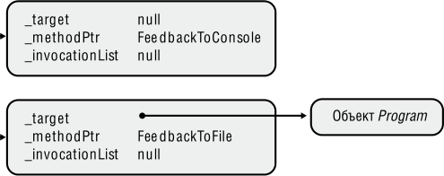


**рис. 17.2.** .Верхняя.переменная.ссылается.на.делегата.статического.метода,. нижняя.—.на.делегата.экземплярного.метода 

Теперь, когда вы познакомились с процессом создания делегатов и их внутренней структурой, поговорим о методах обратного вызова. Рассмотрим еще раз код метода `Counter` : 

private static void Counter(Int32 from, Int32 to, Feedback fb) { `for (Int32 val = from; val <= to; val++) {` // Если указаны методы обратного вызова, вызываем их `if (fb != null) fb(val); } }` 

Обратите внимание на строку под комментарием. Инструкция `if` сначала проверяет, не содержит ли переменная `fb` значения `null` . Если проверка пройдена, обращаемся к методу обратного вызова. Такая проверка необходима потому, что `fb` — это всего лишь переменная, ссылающаяся на делегат `Feedback` ; она может иметь, в том числе, значение `null` . Может показаться, что происходит вызов функции `fb` , которой передается один параметр ( `val` ). Но у нас нет функции с таким именем. И компилятор генерирует код вызова метода `Invoke` делегата, так как он знает, что переменная `fb` ссылается на объект делегата. Другими словами, при обнаружении строки 

```
fb(val);
```

компилятор генерирует такой же код, как и для строки: 

```
fb.Invoke(val);
```

Воспользовавшись утилитой ILDasm exe для исследования кода метода `Counter` , можно убедиться, что компилятор генерирует код, вызывающий метод `Invoke` . Далее показан IL-код метода `Counter` . Команда в строке `IL_0009` является вызовом метода `Invoke` объекта `Feedback` . 

.method private hidebysig static void Counter(int32 from, int32 'to', 

```
                                              class Feedback fb) cil managed
{
  // Code size 23 (0x17)
  .maxstack 2
  .locals init (int32 V_0)
```

Обратный.вызов.нескольких.методов.(цепочки.делегатов) 

**443** 

```
  IL_0000: ldarg.0
  IL_0001: stloc.0
  IL_0002: br.s IL_0012
  IL_0004: ldarg.2
  IL_0005: brfalse.s IL_000e
  IL_0007: ldarg.2
  IL_0008: ldloc.0
  IL_0009: callvirt instance void Feedback::Invoke(int32)
  IL_000e: ldloc.0
  IL_000f: ldc.i4.1
  IL_0010: add
  IL_0011: stloc.0
  IL_0012: ldloc.0
  IL_0013: ldarg.1
  IL_0014: ble.s IL_0004
  IL_0016: ret
  } // end of method Program::Counter
```

В принципе метод `Counter` можно изменить, включив в него явный вызов `Invoke` : 

private static void Counter(Int32 from, Int32 to, Feedback fb) { `for (Int32 val = from; val <= to; val++) {` // Если указаны методы обратного вызова, вызываем их `if (fb != null) fb.Invoke(val); } }` 

Надеюсь, вы помните, что компилятор определяет метод `Invoke` при определении класса `Feedback` . Вызывая этот метод, он использует закрытые поля `_target` и `_methodPtr` для вызова желаемого метода на заданном объекте. Обратите внимание, что сигнатура метода `Invoke` совпадает с сигнатурой делегата, ведь и делегат `Feedback` , и метод `Invoke` принимают один параметр типа `Int32` и возвращают значение `void` . 

## **Обратный вызов нескольких методов (цепочки делегатов)** 

Делегаты полезны сами по себе, но еще более полезными их делает механизм цепочек. _Цепочкой_ (chaining) называется коллекция делегатов, дающая возможность вызывать все методы, представленные этими делегатами. Чтобы понять, как работает цепочка, вернитесь к коду в начале этой главы и найдите там метод `ChainDelegateDemo1` . В этом методе после инструкции `Console.WriteLine` создаются три делегата, на которые ссылаются переменные `fb1` , `fb2` и `fb3` соответственно (рис. 17.3). 

**444** Глава.17 .Делегаты 


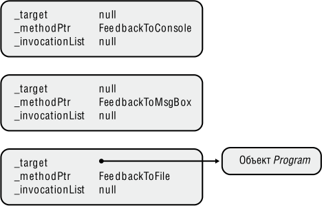


**рис. 17.3.** .Начальное.состояние.делегатов,.на.которые.ссылаются. переменные.fb1,.fb2.и.fb3 

Ссылочная переменная на делегат `Feedback` , которая называется `fbChain` , должна ссылаться на цепочку, или набор делегатов, служащих оболочками для методов обратного вызова. Инициализация переменной `fbChain` значением `null` указывает на отсутствие методов обратного вызова. Открытый статический метод `Combine` класса `Delegate` добавляет в цепочку делегатов: 

fbChain = (Feedback) Delegate.Combine(fbChain, fb1); 

При выполнении этой строки метод `Combine` видит, что мы пытаемся объединить значение `null` с переменной `fb1` . В итоге он возвращает значение в переменную `fb1` , а затем заставляет переменную `fbChain` сослаться на делегата, на которого уже ссылается переменная `fb1` . Эта схема демонстрируется на рис. 17.4. 


**----- Start of picture text -----**<br>
fb Chain<br>**----- End of picture text -----**<br>


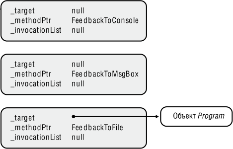


**рис. 17.4.** .Состояние.делегатов.после.добавления.в.цепочку.нового.члена 

Обратный.вызов.нескольких.методов.(цепочки.делегатов) 

**445** 

Чтобы добавить в цепочку еще одного делегата, снова воспользуемся методом `Combine` : 

fbChain = (Feedback) Delegate.Combine(fbChain, fb2); 

Метод `Combine` видит, что переменная `fbChain` уже ссылается на делегата, поэтому он создает нового делегата, который присваивает своим закрытым полям `_target` и `_methodPtr` некоторые значения. В данном случае они не важны, но важно, что поле `_invocationList` инициализируется ссылкой на массив делегатов. Первому элементу массива (с индексом 0) присваивается ссылка на делегат, служащий оболочкой метода `FeedbackToConsole` (именно на этот делегат ссылается переменная `fbChain` ). Второму элементу массива (с индексом 1) присваивается ссылка на делегат, служащий оболочкой метода `FeedbackToMsgBox` (на этот делегат ссылается переменная `fb2` ). Напоследок переменной `fbChain` присваивается ссылка на вновь созданный делегат (рис. 17.5). 


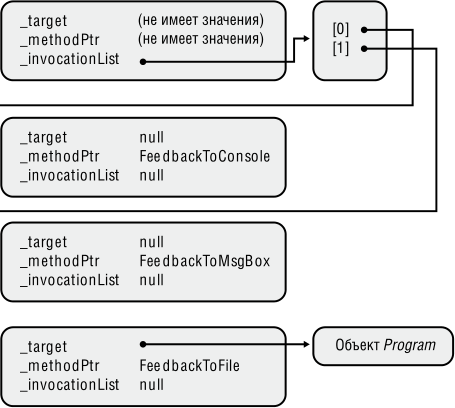


**рис. 17.5.** .Делегаты.после.вставки.в.цепочку.второго.члена 

Для добавления в цепочку третьего делегата снова вызывается метод `Combine` : 

fbChain = (Feedback) Delegate.Combine(fbChain, fb3); 

И снова, видя, что переменная `fbChain` уже ссылается на делегата, метод создает очередного делегата, как показано на рис. 17.6. Как и в предыдущих случаях, новый делегат присваивает начальные значения своим закрытым полям `_target` и `_methodPtr` , в то время как поле `_invocationList` инициализируется ссылкой на массив делегатов. Первому и второму элементам массива (с индексами 0 и 1) присваиваются ссылки на те же делегаты, на которые ссылался предыдущий делегат. Третий элемент массива (с индексом 2) становится ссылкой на делегата, служащего 

**446** Глава.17 .Делегаты 

оболочкой метода `FeedbackToFile` (именно на этого делегата ссылается переменная `fb3` ). Наконец, переменной `fbChain` присваивается ссылка на вновь созданного делегата. При этом ранее созданный делегат и массив, на который ссылается его поле `_invocationList` , теперь подлежат обработке механизмом уборки мусора. 


**рис. 17.6.** .Окончательный.вид.цепочки.делегатов 

После выполнения кода, создающего цепочку, переменная `fbChain` передается методу `Counter` : 

Counter(1, 2, fbChain); 

Метод `Counter` содержит код неявного вызова метода `Invoke` для делегата `Feedback` . Впрочем, об этом мы уже говорили. Когда метод `Invoke` вызывается для делегата, ссылающегося на переменную `fbChain` , этот делегат обнаруживает, что значение поля `_invocationList` отлично от `null` . Это приводит к выполнению цикла, перебирающего все элементы массива, вызывая для них метод, оболочкой которого служит указанный делегат. В нашем примере методы вызываются в следующей последовательности: `FeedbackToConsole` , `FeedbackToMsgBox` и, наконец, `FeedbackToFile` . 

Реализация метода `Invoke` класса `Feedback` выглядит примерно так (в псевдокоде): 

Обратный.вызов.нескольких.методов.(цепочки.делегатов) 

**447** 

```
public void Invoke(Int32 value) {
```

```
  Delegate[] delegateSet = _invocationList as Delegate[];
```

```
  if (delegateSet != null) {
```

- // Этот массив указывает на делегаты, которые следует вызвать 

```
    foreach (Feedback d in delegateSet)
```

d(value); // Вызов каждого делегата 

- `} else {` 

- // Этот делегат определяет используемый метод обратного вызова. 

- // Этот метод вызывается для указанного объекта. 

_methodPtr.Invoke(_target, value); 

- // Строка выше — имитация реального кода. 

- // То, что происходит в действительности, не выражается средствами C#. 

```
  }
```

- `}` 

Для удаления делегатов из цепочки применяется статический метод `Re move` объекта `Delegate` . Эта процедура демонстрируется в конце кода метода `ChainDelegateDemo1` : 

```
fbChain = (Feedback) Delegate.Remove(
```

fbChain, new Feedback(FeedbackToMsgBox)); 

Метод `Remove` сканирует массив делегатов (с конца и до члена с нулевым индексом), управляемый делегатом, на который ссылается первый параметр (в нашем примере это `fbChain` ). Он ищет делегат, поля `_target` и `_methodPtr` которого совпадают с соответствующими полями второго аргумента (в нашем примере это новый делегат `Feedback` ). При обнаружении совпадения, если в массиве осталось более одного элемента, создается новый делегат — создается массив `_invocationList` , который инициализируется ссылкой на все элементы исходного массива за исключением удаляемого, — после чего возвращается ссылка на нового делегата. При удалении последнего элемента цепочки метод `Remove` возвращает значение `null` . Следует помнить, что метод `Remove` за один раз удаляет лишь одного делегата, а не все элементы с указанными значениями полей `_target` и `_methodPtr` . 

Ранее мы также рассматривали делегат `Feedback` , возвращающий значение типа `void` . Однако этот делегат можно было определить и так: 

```
public delegate Int32 Feedback(Int32 value);
```

В этом случае псевдокод метода `Invoke` выглядел бы следующим образом: 

```
public Int32 Invoke(Int32 value) {
  Int32 result;
  Delegate[] delegateSet = _invocationList as Delegate[];
```

```
  if (delegateSet != null) {
```

- // Массив указывает на делегаты, которые нужно вызвать `foreach (Feedback d in delegateSet)` 

result = d(value); // Вызов делегата 

```
  } else {
```

- // Этот делегат определяет используемый метод обратного вызова. 

- // Этот метод вызывается для указанного объекта. result = _methodPtr.Invoke(_target, value); 

_продолжение_  

**448** Глава.17 .Делегаты 

// Строка выше — имитация реального кода. 

// То, что происходит в действительности, не выражается средствами C#. `} return result; }` 

По мере вызова отдельных делегатов возвращаемое значение сохраняется в переменной `result` . После завершения цикла в этой переменной оказывается только результат вызова последнего делегата (предыдущие возвращаемые значения отбрасываются); именно это значение возвращается коду, вызвавшему метод `Invoke` . 

## **Поддержка цепочек делегатов в C#** 

Чтобы упростить задачу разработчиков, компилятор C# автоматически предоставляет перегруженные версии операторов `+=` и `-=` для экземпляров делегатов. Эти операторы вызывают методы `Delegate.Combine` и `Delegate.Remove` соответственно. Они упрощают построение цепочек делегатов. В результате компиляции методов `ChainDelegateDemo1` и `ChainDelegateDemo2` (см. пример в начале главы) получается идентичный IL-code. Единственная разница в том, что благодаря операторам `+=` и `-=` исходный код метода `ChainDelegateDemo2` получается проще. 

Для доказательства идентичности сгенерируйте IL-код обоих методов и изучите его при помощи утилиты ILDasm exe. Вы убедитесь, что компилятор C# действительно заменяет все операторы `+=` и `-=` вызовами статических методов `Combine` и `Remove` типа `Delegate` соответственно. 

## **дополнительные средства управления цепочками делегатов** 

Итак, вы научились создавать цепочки делегатов и вызывать все их компоненты. Последняя возможность реализуется благодаря наличию в методе `Invoke` кода, просматривающего все элементы массива делегатов. И хотя этого простого алгоритма хватает для большинства сценариев, у него есть ряд ограничений. К примеру, сохраняется только последнее из значений, возвращаемых методами обратного вызова. Получить все остальные значения нельзя. И это не единственное ограничение. Скажем, в ситуации, когда один из делегатов в цепочке становится причиной исключения или блокируется на очень долгое время, выполнение цепочки останавливается. Понятно, что данный алгоритм не отличается надежностью. 

В качестве альтернативы можно воспользоваться экземплярным методом `GetInvocationList` класса `MulticastDelegate` . Этот метод позволяет в явном виде вызвать любой из делегатов в цепочке: 

> `public abstract class MulticastDelegate : Delegate {` 

> // Создает массив, каждый элемент которого ссылается 

> // на делегата в цепочке `public sealed override Delegate[] GetInvocationList();` 

> `}` 

Обратный.вызов.нескольких.методов.(цепочки.делегатов) 

**449** 

Метод `GetInvocationList` работает с объектами классов, производных от `MulticastDelegate` . Он возвращает массив ссылок, каждая из которых указывает на какой-то делегат в цепочке. По сути, этот метод создает массив и инициализирует его элементы ссылками на соответствующие делегаты; в конце возвращается ссылка на этот массив. Если поле `_invocationList` содержит `null` , возвращаемый массив будет содержать всего один элемент, ссылающийся на единственного делегата в цепочке — экземпляр самого делегата. 

Написать алгоритм, в явном виде вызывающий каждый элемент массива, несложно: 

```
using System;
using System.Reflection;
using System.Text;
```

// Определение компонента Light `internal sealed class Light {` // Метод возвращает состояние объекта Light `public String SwitchPosition() { return "The light is off"; } }` // Определение компонента Fan `internal sealed class Fan {` // Метод возвращает состояние объекта Fan `public String Speed() { throw new InvalidOperationException("The fan broke due to overheating"); } }` // Определение компонента Speaker `internal sealed class Speaker {` // Метод возвращает состояние объекта Speaker `public String Volume() { return "The volume is loud"; } } public sealed class Program {` 

// Определение делегатов, позволяющих запрашивать состояние компонентов `private delegate String GetStatus(); public static void Main() {` // Объявление пустой цепочки делегатов `GetStatus getStatus = null;` 

// Создание трех компонентов и добавление в цепочку // методов проверки их состояния `getStatus += new GetStatus(new Light().SwitchPosition); getStatus += new GetStatus(new Fan().Speed);` 

_продолжение_  

**450** Глава.17 .Делегаты 

```
    getStatus += new GetStatus(new Speaker().Volume);
```

// Сводный отчет о состоянии трех компонентов `Console.WriteLine(GetComponentStatusReport(getStatus)); }` 

// Метод запрашивает состояние компонентов и возвращает информацию `private static String GetComponentStatusReport(GetStatus status) {` 

// Если цепочка пуста, ничего делать не нужно `if (status == null) return null;` 

// Построение отчета о состоянии `StringBuilder report = new StringBuilder();` 

// Создание массива из делегатов цепочки `Delegate[] arrayOfDelegates = status.GetInvocationList();` 

// Циклическая обработка делегатов массива `foreach (GetStatus getStatus in arrayOfDelegates) {` 

```
      try {
```

// Получение строки состояния компонента и добавление ее в отчет report.AppendFormat("{0}{1}{1}", getStatus(), Environment.NewLine); `} catch (InvalidOperationException e) {` // В отчете генерируется запись об ошибке для этого компонента `Object component = getStatus.Target; report.AppendFormat(` "Failed to get status from {1}{2}{0} Error: {3}{0}{0}", Environment.NewLine, ((component == null) ? "" : component.GetType() + "."), getStatus.Method.Name, `e.Message); } }` // Возвращение сводного отчета вызывающему коду `return report.ToString(); } }` 

Результат выполнения этого кода выглядит так: 

```
The light is off
```

```
Failed to get status from Fan.Speed
  Error: The fan broke due to overheating
```

```
The volume is loud
```

Обобщенные.делегаты **451** 

## **Обобщенные делегаты** 

Много лет назад, когда среда .NET Framework только начинала разрабатываться, в Microsoft ввели понятие делегатов. По мере добавления в FCL классов появлялись и новые типы делегатов. Со временем их накопилось изрядное количество. Только в библиотеке MSCorLib dll их около 50. Вот некоторые из них: 

```
public delegate void TryCode(Object userData);
public delegate void WaitCallback(Object state);
public delegate void TimerCallback(Object state);
public delegate void ContextCallback(Object state);
public delegate void SendOrPostCallback(Object state);
public delegate void ParameterizedThreadStart(Object obj);
```

Вы не заметили определенное сходство в отобранных мной делегатах? На самом деле они одинаковы: переменная любого из этих делегатов должна ссылаться на метод, получающий `Object` и возвращающий `void` . Соответственно весь этот набор делегатов  не нужен — вполне можно обойтись одним. 

Так как современная версия .NET Framework поддерживает обобщения, нам на самом деле нужно всего лишь несколько обобщенных делегатов (определенных в пространстве имен `System` ), представляющих методы, которые могут принимать до 16 аргументов: 

public delegate void Action(); // Этот делегат не обобщенный `public delegate void Action<T>(T obj);` public delegate void Action<T1, T2>(T1 arg1, T2 arg2); public delegate void Action<T1, T2, T3>(T1 arg1, T2 arg2, T3 arg3); `...` public delegate void Action<T1, ..., T16>(T1 arg1, ..., T16 arg16); 

В .NET Framework имеются 17 делегатов `Action` , от не имеющих аргументов вообще до имеющих 16 аргументов. Чтобы вызвать метод с большим количеством аргументов, придется определить собственного делегата, но это уже маловероятно. 

Кроме делегатов `Action` в .NET Framework имеется 17 делегатов `Func` , которые позволяют методу обратного вызова вернуть значение: 

`public delegate TResult Func<TResult>();` public delegate TResult Func<T, TResult>(T arg); public delegate TResult Func<T1, T2, TResult>(T1 arg1, T2 arg2); public delegate TResult Func<T1, T2, T3, TResult>(T1 arg1, T2 arg2, T3 arg3); `...` public delegate TResult Func<T1,..., T16, TResult>(T1 arg1, ..., T16 arg16); 

Вместо определения собственных типов делегатов рекомендуется по мере возможности использовать обобщенных делегатов;  ведь это уменьшает количество типов в системе и упрощает код. Однако, если нужно передать аргумент по ссылке, используя ключевые слова `ref` или `out` , может потребоваться определение собственного делегата: 

```
delegate void Bar(ref Int32 z);
```

**452** Глава.17 .Делегаты 

Аналогично нужно действовать в ситуациях, когда требуется передать делегату переменное число параметров при помощи ключевого слова `params` , если вы хотите задать значения по умолчанию для аргументов делегата или если потребуется установить ограничение для аргумента-типа. 

При работе с делегатами, использующими обобщенные аргументы и возвращающими значения, не следует забывать про ковариантность и контравариантность, так как это расширяет область применения делегатов. Дополнительная информация по этой теме приведена в главе 12. 

## **Упрощенный синтаксис работы с делегатами** 

Многие программисты не любят делегатов из-за сложного синтаксиса. К примеру, рассмотрим строку: 

```
button1.Click += new EventHandler(button1_Click);
```

Здесь `button1_Click` — метод, который выглядит примерно так: 

void button1_Click(Object sender, EventArgs e) { // Действия после щелчка на кнопке... `}` 

Первая строка кода как бы регистрирует адрес метода `button1_Click` в кнопке, чтобы при щелчке на ней вызывался метод. Программистам обычно кажется неразумным создавать делегат `EventHandler` всего лишь для того, чтобы указать на адрес метода `button1_Click` . Однако данный делегат нужен среде CLR, так как он служит оберткой, гарантирующей безопасность типов при вызове метода. Обертка также поддерживает вызов экземплярных методов и создание цепочек. Тем не менее программисты не хотят вникать во все эти детали и предпочли бы записать код следующим образом: 

```
button1.Click += button1_Click;
```

К счастью, компилятор C# поддерживает упрощенный синтаксис при работе с делегатами. Однако перед тем как перейти к рассмотрению соответствующих возможностей, следует заметить, что это — не более чем упрощенные пути создания ILкода, необходимого CLR для нормальной работы с делегатами. Кроме того, следует учитывать, что описание упрощенного синтаксиса работы с делегатами относится исключительно к C#; другими компиляторами он может и не поддерживаться. 

## **Упрощение 1: не создаем объект делегата** 

Как вы уже видели, C# позволяет указывать имя метода обратного вызова без создания делегата, служащего для него оберткой. Вот еще один пример: 

Упрощенный.синтаксис.работы.с.делегатами 

**453** 

`internal sealed class AClass { public static void CallbackWithoutNewingADelegateObject() {` ThreadPool.QueueUserWorkItem(SomeAsyncTask, 5); `}` 

```
  private static void SomeAsyncTask(Object o) {
    Console.WriteLine(o);
  }
}
```

Статический метод `QueueUserWorkItem` класса `ThreadPool` ожидает ссылку на делегата `WaitCallback` , который, в свою очередь, ссылается на метод `SomeAsyncTask` . Так как компилятор в состоянии догадаться, что именно имеется в виду, можно опустить строки, относящиеся к созданию делегата `WaitCallback` , чтобы упростить чтение и понимание кода. В процессе компиляции IL-код, генерирующий нового делегата `WaitCallback` , создается автоматически, а запись является всего лишь упрощенной формой синтаксиса. 

## **Упрощение 2: не определяем метод обратного вызова** 

В приведенном фрагменте кода метод обратного вызова `SomeAsyncTask` передается методу `QueueUserWorkItem` класса `ThreadPool` . C# позволяет подставить реализацию метода обратного вызова непосредственно в код, а не в отдельный метод. Скажем, наш код можно записать так: 

`internal sealed class AClass { public static void CallbackWithoutNewingADelegateObject() { ThreadPool.QueueUserWorkItem(` **`obj => Console.WriteLine(obj`** ), 5); `} }` 

Обратите внимание, что первый «аргумент» метода `QueueUserWorkItem` (он выделен полужирным шрифтом) представляет собой фрагмент кода! Формально в C# он называется _лямбда-выражением_ (lambda expression) и распознается по наличию оператора `=>` . Лямбда-выражения используются в тех местах, где компилятор ожидает присутствия делегата. Обнаружив лямбда-выражение, компилятор автоматически определяет в классе новый закрытый метод (в нашем примере — `AClass` ). Этот метод называется _анонимной функцией_ (anonymous function), так как вы обычно не знаете его имени, которое автоматически создается компилятором. Впрочем, никто не мешает исследовать полученный код при помощи утилиты ILDasm exe. Именно она помогла узнать после компиляции написанного фрагмента кода, что методу было присвоено имя `<CallbackWithoutNewingADelegateObject >b__0` , а также, что метод принимает всего один аргумент типа `Object` , возвращая значение типа `void` . 

Компилятор выбирает для метода имя, начинающееся с символа `<` , потому что в C# идентификаторы не могут содержать этот символ. Такой подход гарантирует, что программист не сможет случайно выбрать для какого-нибудь из своих методов 

**454** Глава.17 .Делегаты 

имя, совпадающее с автоматически созданным компилятором. При этом, если в C# идентификаторы не могут содержать символа `<` , в CLR это разрешено. Несмотря на возможность обращения к методу через механизм отражения путем передачи его имени в виде строки, следует помнить, что компилятор может по-разному генерировать это имя при каждом следующем проходе. 

Утилита ILDasm exe позволяет также заметить, что компилятор C# применяет к методу атрибут `System.Runtime.CompilerServices.CompilerGeneratedAttribute` . Это дает инструментам и утилитам возможность понять, что метод создан автоматически, а не написан программистом. В этот сгенерированный компилятором метод и помещается код, находящийся справа от оператора `=>` . 

## **ПриМеЧание** 

При.написании.лямбда-выражений.невозможно.применить.к.сгенерированному. компилятором.методу.пользовательские.атрибуты.или.модификаторы.(например,. unsafe) .Впрочем,.обычно.это.не.является.проблемой,.так.как.созданные.компилятором.анонимные.методы.всегда.закрыты .Каждый.такой.метод.является.статическим. или.нестатическим.в.зависимости.от.того,.будет.ли.он.иметь.доступ.к.каким-либо. экземплярным.членам .Соответственно,.применять.к.этим.методам.модификаторы. public,.protected,.internal,.virtual,.sealed,.override.или.abstract.просто.не.требуется 

Написанный код компилятор C# переписывает примерно таким образом (комментарии вставлены мною): 

```
internal sealed class AClass {
```

// Это закрытое поле создано для кэширования делегата 

// Преимущество: CallbackWithoutNewingADelegateObject не будет 

// создавать новый объект при каждом вызове 

// Недостатки: кэшированные объекты недоступны для сборщика мусора `[CompilerGenerated] private static WaitCallback <>9__CachedAnonymousMethodDelegate1;` 

```
  public static void CallbackWithoutNewingADelegateObject() {
    if (<>9__CachedAnonymousMethodDelegate1 == null) {
```

// При первом вызове делегат создается и кэшируется 

`<>9__CachedAnonymousMethodDelegate1 = new WaitCallback(<CallbackWithoutNewingADelegateObject>b__0); }` ThreadPool.QueueUserWorkItem(<>9__CachedAnonymousMethodDelegate1, 5); `}` 

```
  [CompilerGenerated]
  private static void <CallbackWithoutNewingADelegateObject>b__0(
    Object obj) {
    Console.WriteLine(obj);
  }
}
```

Лямбда-выражение должно соответствовать сигнатуре делегата `WaitCallback` : возвращать `void` и принимать параметр типа `Object` . Впрочем, я указал имя пара- 

Упрощенный.синтаксис.работы.с.делегатами **455** 

метра, просто поместив переменную `obj` слева от оператора `=>` . Расположенный справа от этого оператора метод `Console.WriteLine` действительно возвращает `void` . Если бы расположенное справа выражение не возвращало `void` , сгенерированный компилятором код просто проигнорировал бы возвращенное значение, ведь в противном случае не удалось бы соблюсти требования делегата `WaitCallback` . 

Также следует отметить, что анонимная функция помечается как `private` ; в итоге доступ к методу остается только у кода, определенного внутри этого же типа (хотя отражение позволит узнать о существовании метода). Обратите внимание, что анонимный метод определен как статический. Это связано с отсутствием у кода доступа к каким-либо членам экземпляра (ведь метод `CallbackWithoutNewingADe legateObject` сам по себе статический). Впрочем, код может обращаться к любым определенным в классе статическим полям или методам. Например: 

## `internal sealed class AClass {` 

private static String sm_name; // Статическое поле 

```
  public static void CallbackWithoutNewingADelegateObject() {
    ThreadPool.QueueUserWorkItem(
```

// Код обратного вызова может обращаться к статическим членам obj =>Console.WriteLine(sm_name+ ": " + obj), 

```
      5);
```

```
  }
}
```

Не будь метод `CallbackWithoutNewingADelegateObject` статическим, код анонимного метода мог бы содержать ссылки на члены экземпляра. Но даже при отсутствии таких ссылок компилятор все равно генерирует статический анонимный метод, так как он эффективнее экземплярного метода, потому что ему не нужен дополнительный параметр `this` . Если же в коде анонимного метода наличествуют ссылки на члены экземпляра, компилятор создает нестатический анонимный метод: 

## `internal sealed class AClass {` 

private String m_name; // Поле экземпляра 

// Метод экземпляра `public void CallbackWithoutNewingADelegateObject() { ThreadPool.QueueUserWorkItem(` 

// Код обратного вызова может ссылаться на члены экземпляра obj => Console.WriteLine(m_name+ ": " + obj), 

```
      5);
```

```
  }
```

```
}
```

Имена аргументов, которые следует передать лямбда-выражению, указываются слева от оператора `=>` . При этом следует придерживаться правил, которые мы рассмотрим на примерах: 

// Если делегат не содержит аргументов, используйте круглые скобки `Func<String> f = () => "Jeff";` 

// Для делегатов с одним и более аргументами 

_продолжение_  

**456** Глава.17 .Делегаты 

// можно в явном виде указать типы Func<Int32, String> f2 = (Int32 n) => n.ToString(); Func<Int32, Int32, String> f3 = (Int32 n1, Int32 n2) => (n1 + n2).ToString(); // Компилятор может самостоятельно определить типы для делегатов // с одним и более аргументами Func<Int32, String> f4 = (n) => n.ToString(); Func<Int32, Int32, String> f5 = (n1, n2) => (n1 + n2).ToString(); 

// Если аргумент у делегата всего один, круглые скобки можно опустить Func<Int32, String> f6 = n => n.ToString(); 

// Для аргументов ref/out нужно в явном виде указывать ref/out и тип `Bar b = (out Int32 n) => n = 5;` 

Предположим, что в последнем случае делегат `Bar` определен следующим образом: 

```
delegate void Bar(out Int32 z);
```

Тело анонимной функции записывается справа от оператора `=>` . Оно обычно представляет собой простое или сложное выражение, возвращающее некое значение. В рассмотренном примере это было лямбда-выражение, возвращающее строки всем переменным делегата `Func` . Чаще всего тело анонимной функции состоит из одной инструкции. К примеру, вызванному методу `ThreadPool.QueueUserWorkItem` было передано лямбда-выражение, что привело к вызову метода `Console.WriteLine` (возвращающего значение типа `void` ). 

Чтобы вставить в тело функции несколько инструкций, заключите их в фигурные скобки. Если делегат ожидает получить возвращаемое значение, не забудьте инструкцию `return` , как показано в следующем примере: 

Func<Int32, Int32, String> f7 = (n1, n2) => { `Int32 sum = n1 + n2; return sum.ToString(); };` 

## **ВниМание** 

Хотя.это.и.не.кажется.очевидным,.основная.выгода.от.использования.лямбдавыражений.состоит.в.том,.что.они.снижают.уровень.неопределенности.вашего.кода . Обычно.приходится.писать.отдельный.метод,.присваивать.ему.имя.и.передавать. это.имя.методу,.в.котором.требуется.делегат .Именно.имя.позволяет.ссылаться.на. фрагмент.кода .И.если.ссылка.на.один.и.тот.же.фрагмент.требуется.в.различных. местах.программы,.создание.метода.—.это.самое.правильное.решение .Если.же. обращение.к.фрагменту.кода.предполагается.всего.одно,.на.помощь.приходят. лямбда-выражения .Именно.они.позволяют.встраивать.фрагменты.кода.в.нужное. место,.избавляя.от.необходимости.их.именования.и.повышая.тем.самым.продуктивность.работы.программиста 

Упрощенный.синтаксис.работы.с.делегатами 

**457** 

## **ПриМеЧание** 

Механизм.анонимных.методов.впервые.появился.в.C#.2 0 .Подобно.лямбдавыражениям.(появившимся.в.C#.3 0),.анонимные.методы.описывают.синтаксис. создания.анонимных.функций .Рекомендуется.использовать.лямбда-выражения. вместо.анонимных.методов,.так.как.их.синтаксис.более.компактен,.что.упрощает. чтение.кода .Разумеется,.компилятор.до.сих.пор.поддерживает.анонимные.функции,. так.что.необходимости.вносить.исправления.в.код,.написанный.на.C#.2 0,.нет .Тем. не.менее.в.этой.книге.рассматривается.только.синтаксис.лямбда-выражений 

## **Упрощение 3: не создаем обертку для локальных переменных для передачи их методу обратного вызова** 

Вы уже видели, что код обратного вызова может ссылаться на другие члены класса. Но иногда бывает нужно обратиться из этого кода к локальному параметру или переменной внутри определяемого метода. Вот интересный пример: 

`internal sealed class AClass { public static void UsingLocalVariablesInTheCallbackCode(Int32 numToDo) {` // Локальные переменные `Int32[] squares = new Int32[numToDo]; AutoResetEvent done = new AutoResetEvent(false);` 

// Выполнение задач в других потоках `for (Int32 n = 0; n < squares.Length; n++) { ThreadPool.QueueUserWorkItem( obj => { Int32 num = (Int32) obj;` 

// Обычно решение этой задачи требует больше времени `squares[num] = num * num;` 

// Если это последняя задача, продолжаем выполнять главный поток `if (Interlocked.Decrement(ref numToDo) == 0) done.Set();` }, `n); }` 

// Ожидаем завершения остальных потоков `done.WaitOne();` 

// Вывод результатов `for (Int32 n = 0; n < squares.Length; n++)` Console.WriteLine("Index {0}, Square={1}", n, squares[n]); `} }` 

Этот пример демонстрирует, насколько легко в C# реализуются задачи, считавшиеся достаточно сложными. В представленном здесь методе определен един- 

**458** Глава.17 .Делегаты 

ственный параметр `numToDo` и две локальные переменные `squares` и `done` . Ссылки на эти переменные присутствуют в теле лямбда-выражения. 

А теперь представим, что код из лямбда-выражения помещен в отдельный метод (как того требует CLR). Каким образом передать туда значения переменных? Для этого потребуется вспомогательный класс, определяющий поле для каждого значения, которое требуется передать в код обратного вызова. Кроме того, этот код следует определить во вспомогательном классе как экземплярный метод. Тогда метод `UsingLocalVariablesInTheCallbackCode` создаст экземпляр вспомогательного класса, присвоит полям значения локальных переменных и, наконец, создаст объект делегата, связанный с вспомогательным классом и экземплярным методом. 

## **ПриМеЧание** 

Когда.лямбда-выражение.заставляет.компилятор.генерировать.класс.с.превращенными.в.поля.параметрами/локальными.переменными,.увеличивается.время.жизни. объекта,.на.который.ссылаются.эти.переменные .Обычно.параметры/локальные. переменные.уничтожаются.после.завершения.метода,.в.котором.они.используются . В.данном.же.случае.они.остаются,.пока.не.будет.уничтожен.объект,.содержащий. поле .В.большинстве.приложений.это.не.имеет.особого.значения,.тем.не.менее.этот. факт.следует.знать 

Это нудная и чреватая ошибками работа, и разумеется, компилятор лучше выполнит ее за вас. Приведенный код он перепишет примерно так (комментарии мои): 

```
internal sealed class AClass {
  public static void UsingLocalVariablesInTheCallbackCode(Int32 numToDo) {
```

// Локальные переменные `WaitCallback callback1 = null;` 

// Создание экземпляра вспомогательного класса `<>c__DisplayClass2 class1 = new <>c__DisplayClass2();` // Инициализация полей вспомогательного класса `class1.numToDo = numToDo; class1.squares = new Int32[class1.numToDo]; class1.done = new AutoResetEvent(false);` // Выполнение задач в других потоках `for (Int32 n = 0; n < class1.squares.Length; n++) { if (callback1 == null) {` // Новый делегат привязывается к объекту вспомогательного класса // и его анонимному экземплярному методу `callback1 = new WaitCallback( class1.<UsingLocalVariablesInTheCallbackCode>b__0); }` 

ThreadPool.QueueUserWorkItem(callback1, n); `}` 

Упрощенный.синтаксис.работы.с.делегатами 

**459** 

// Ожидание завершения остальных потоков `class1.done.WaitOne();` 

// Вывод результатов `for (Int32 n = 0; n < class1.squares.Length; n++)` Console.WriteLine("Index {0}, Square={1}", n, class1.squares[n]); `}` 

// Вспомогательному классу присваивается необычное имя, чтобы // избежать конфликтов и предотвратить доступ из класса AClass `[CompilerGenerated] private sealed class <>c__DisplayClass2 : Object {` 

// В коде обратного вызова для каждой локальной переменной // используется одно открытое поле `public Int32[] squares; public Int32 numToDo; public AutoResetEvent done;` 

// Открытый конструктор без параметров `public <>c__DisplayClass2 { }` 

// Открытый экземплярный метод с кодом обратного вызова `public void <UsingLocalVariablesInTheCallbackCode>b__0(Object obj) { Int32 num = (Int32) obj; squares[num] = num * num; if (Interlocked.Decrement(ref numToDo) == 0) done.Set();` 

```
    }
```

```
  }
}
```

## **ВниМание** 

Без.сомнения,.у.любого.программиста.возникает.соблазн.использовать.лямбдавыражения.там,.где.это.уместно.и.не.уместно .Лично.я.привык..к.ним.не.сразу .Ведь. код,.который.вы.пишете.внутри.метода,.на.самом.деле.этому.методу.не.принадлежит,. что.затрудняет.отладку.и.пошаговое.выполнение .Хотя.я.был.откровенно.поражен. тем,.что.отладчик.Visual.Studio.позволял.выполнять.лямбда-выражения.в.моем.исходном.коде.в.пошаговом.режиме 

Я.установил.для.себя.правило:.если.в.методе.обратного.вызова.предполагается.более. трех.строк.кода,.не.использовать.лямбда-выражения .Вместо.этого.я.пишу.метод. вручную.и.присваиваю.ему.имя .Впрочем,.при.разумном.подходе.лямбда-выражения. способны.серьезно.повысить.продуктивность.работы.программиста.и.упростить.поддержку.кода .В.следующем.примере.кода.лямбда-выражения.смотрятся.естественно,. и.без.них.написание,.чтение.и.редактирование.кода.было.бы.намного.сложнее: 

// Создание и инициализация массива String String[] names = { "Jeff", "Kristin", "Aidan", "Grant" }; 

// Извлечение имен со строчной буквой 'a' Char charToFind = 'a'; 

_продолжение_  

**460** Глава.17 .Делегаты 

names = Array.FindAll(names, name => name.IndexOf(charToFind) >= 0); 

// Преобразование всех символов строки в верхний регистр names = Array.ConvertAll(names, name => name.ToUpper()); 

// Вывод результатов Array.ForEach(names, Console.WriteLine); 

## **делегаты и отражение** 

Все показанные в этой главе примеры использования делегатов требовали, чтобы разработчик заранее знал прототип метода обратного вызова. Скажем, если переменная `fb` ссылается на делегата `Feedback` (см. листинг первого примера в этой главе), код обращения к делегату мог бы выглядеть примерно так: 

fb(item); // параметр item определен как Int32 

Как видите, разработчик должен знать количество и тип параметров метода обратного вызова. К счастью, эта информация почти всегда доступна разработчику, так что написать подобный этому код — не проблема. 

Впрочем, в отдельных редких ситуациях на момент компиляции эти сведения отсутствуют. В главе 11 при обсуждении типа `EventSet` приводился соответствующий пример со словарем, хранящим набор разных типов делегатов. Для вызова события во время выполнения производился поиск и вызов делегата из словаря. Однако при этом было невозможно узнать во время компиляции, какой делегат будет вызван и какие параметры следует передать его методу обратного вызова. 

К счастью, в классе `System.Reflection.MethodInfo` имеется метод `CreateDelegate` , позволяющий создавать и вызывать делегаты даже при отсутствии сведений о них на момент компиляции. Вот как выглядят перегруженные версии этого метода: 

`public abstract class MethodInfo : MethodBase {` // Создание делегата, служащего оберткой статического метода. `public virtual Delegate CreateDelegate(Type delegateType);` 

// Создание делегата, служащего оберткой экземплярного метода; // target ссылается на аргумент 'this'. public virtual Delegate CreateDelegate(Type delegateType, Object target); `}` 

После того как делегат будет создан, его можно вызвать методом `DynamicInvoke` класса `Delegate` , который  выглядит примерно так: 

`public abstract class Delegate {` // Вызов делегата с передачей параметров `public Object DynamicInvoke(params Object[] args);` 

```
}
```

Делегаты.и.отражение **461** 

При использовании API отражения (см. главу 23) необходимо сначала получить объект `MethodInfo` для метода, для которого требуется создать делегата. Затем вызов метода `CreateDelegate` создает новый объект типа, производного от `Delegate` и определяемого первым параметром `delegateType` . Если делегат представляет экземплярный метод, также следует передать `CreateDelegate` параметр `target` , обозначающий объект, который должен передаваться экземплярному методу как параметр `this` . 

Метод `DynamicInvoke` класса `System.Delegate` позволяет задействовать метод обратного вызова делегата, передавая набор параметров, определяемых во время выполнения. При вызове метода `DynamicInvoke` проверяется совместимость переданных параметров с параметрами, ожидаемыми методом обратного вызова. Если параметры совместимы, выполняется обратный вызов; в противном случае генерируется исключение `ArgumentException` . Данный метод возвращает объект, который был возвращен методом обратного вызова. 

Рассмотрим пример применения методов `CreateDelegate` и `DynamicInvoke` : 

```
using System;
using System.Reflection;
using System.IO;
```

// Несколько разных определений делегатов internal delegate Object TwoInt32s(Int32 n1, Int32 n2); `internal delegate Object OneString(String s1);` 

`public static class DelegateReflection { public static void Main(String[] args) { if (args.Length < 2) { String usage = @"Usage:" + "{0} delType methodName [Arg1] [Arg2]" + "{0}   where delType must be TwoInt32s or OneString" +` "{0}   if delType is TwoInt32s, methodName must be Add or Subtract" + "{0}   if delType is OneString, methodName must be NumChars or Reverse" `+ "{0}" + "{0}Examples:" + "{0}   TwoInt32s Add 123 321" + "{0}   TwoInt32s Subtract 123 321" + "{0}   OneString NumChars \"Hello there\"" + "{0}   OneString Reverse  \"Hello there\"";` Console.WriteLine(usage, Environment.NewLine); `return; }` // Преобразование аргумента delType в тип делегата `Type delType = Type.GetType(args[0]); if (delType == null) { Console.WriteLine("Invalid delType argument: " + args[0]);` 

_продолжение_  

**462** Глава.17 .Делегаты 

```
         return;
      }
```

`Delegate d; try {` // Преобразование аргумента Arg1 в метод `MethodInfo mi = typeof(DelegateReflection).GetTypeInfo().GetDeclaredMethod(args[1]);` 

// Создание делегата, служащего оберткой статического метода `d = mi.CreateDelegate(delType); } catch (ArgumentException) { Console.WriteLine("Invalid methodName argument: " + args[1]); return; }` 

// Создание массива, содержащего аргументы, 

// передаваемые методу через делегат `Object[] callbackArgs = new Object[args.Length  2];` 

`if (d.GetType() == typeof(TwoInt32s)) { try {` // Преобразование аргументов типа String в тип Int32 `for (Int32 a = 2; a < args.Length; a++) callbackArgs[a  2] = Int32.Parse(args[a]); } catch (FormatException) { Console.WriteLine("Parameters must be integers."); return; } }` 

```
      if (d.GetType() == typeof(OneString)) {
```

// Простое копирование аргумента типа String Array.Copy(args, 2, callbackArgs, 0, callbackArgs.Length); `}` 

`try {` // Вызов делегата и вывод результата `Object result = d.DynamicInvoke(callbackArgs); Console.WriteLine("Result = " + result); } catch (TargetParameterCountException) { Console.WriteLine("Incorrect number of parameters specified."); }` 

```
   }
```

// Метод обратного вызова, принимающий два аргумента типа Int32 private static Object Add(Int32 n1, Int32 n2) { `return n1 + n2;` 

```
   }
```

**463** 

Делегаты.и.отражение 

// Метод обратного вызова, принимающий два аргумента типа Int32 private static Object Subtract(Int32 n1, Int32 n2) { `return n1  n2; }` 

// Метод обратного вызова, принимающий один аргумент типа String `private static Object NumChars(String s1) { return s1.Length; }` 

// Метод обратного вызова, принимающий один аргумент типа String `private static Object Reverse(String s1) { return new String(s1.Reverse().ToArray());` 

```
   }
```

```
}
```

## **Глава 18. настраиваемые атрибуты** 

В этой главе описывается один из самых новаторских механизмов Microsoft .NET Framework — механизм _настраиваемых атрибутов_ (custom attributes). Именно настраиваемые атрибуты позволяют снабжать кодовые конструкции декларативными аннотациями, наделяя код особыми возможностями. Настраиваемые атрибуты дают возможность задать информацию, применимую практически к любой записи таблицы метаданных. Информацию об этих расширяемых метаданных можно запрашивать во время выполнения с целью динамического изменения хода выполнения программы. Настраиваемые атрибуты применяются в различных технологиях .NET Framework (Windows Forms, WPF, WCF и т. п.), что позволяет разработчикам легко выражать свои намерения в коде. Таким образом, умение работать с настраиваемыми атрибутами необходимо всем разработчикам .NET Framework. 

## **сфера применения настраиваемых атрибутов** 

Атрибуты `public` , `private` , `static` и им подобные применяются как к типам, так и к членам типов. Никто не станет спорить с тем, что атрибуты полезны — но как насчет возможности задания собственных атрибутов? Предположим, нужно не просто определить тип, но и каким-либо образом указать на возможность его удаленного использования посредством сериализации. Или, к примеру, назначить методу атрибут, который означает, что для выполнения метода должны быть получены некоторые разрешения безопасности. 

Разумеется, создавать настраиваемые атрибуты и применять их к типам и методам очень удобно, однако для этого компилятор должен распознавать эти атрибуты и заносить соответствующую информацию в метаданные. Фирмы-разработчики предпочитают не публиковать исходный код своих компиляторов, поэтому специалисты Microsoft предложили альтернативный способ работы с настраиваемыми атрибутами, которые представляют собой мощный механизм, полезный как при разработке, так и при выполнении приложений. Определять и задействовать настраиваемые атрибуты может кто угодно, а все CLR-совместимые компиляторы должны их распознавать и генерировать соответствующие метаданные. 

Следует понимать, что настраиваемые атрибуты представляют собой лишь средство передачи некой дополнительной информации. Компилятор помещает 

Сфера.применения.настраиваемых.атрибутов 

**465** 

эту информацию в метаданные управляемого модуля. Большая часть атрибутов для компилятора просто не имеет значения; он обнаруживает их в исходном коде и создает для них соответствующие метаданные. 

Библиотека классов .NET Framework (FCL) включает определения сотен настраиваемых атрибутов, которые вы можете использовать в своем коде. Вот несколько примеров: 

- Атрибут `DllImport` при применении к методу информирует CLR о том, что метод реализован в неуправляемом коде указанной DLL-библиотеки. 

- Атрибут `Serializable` при применении к типу информирует механизмы сериализации о том, что экземплярные поля доступны для сериализации и десериализации. 

- Атрибут `AssemblyVersion` при применении к сборке задает версию сборки. 

- Атрибут `Flags` при применении к перечислимому типу превращает перечислимый тип в набор битовых флагов. 

Рассмотрим код с множеством примененных к нему атрибутов. В C# имена настраиваемых атрибутов помещаются в квадратные скобки непосредственно перед именем класса, объекта и т. п. Не пытайтесь понять, что именно делает код; я всего лишь хочу показать, как выглядят атрибуты: 

```
using System;
using System.Runtime.InteropServices;
```

[StructLayout(LayoutKind.Sequential, CharSet = CharSet.Auto)] `internal sealed class OSVERSIONINFO { public OSVERSIONINFO() { OSVersionInfoSize = (UInt32) Marshal.SizeOf(this); }` 

```
  public UInt32 OSVersionInfoSize = 0;
  public UInt32 MajorVersion = 0;
  public UInt32 MinorVersion = 0;
  public UInt32 BuildNumber = 0;
  public UInt32 PlatformId = 0;
```

[MarshalAs(UnmanagedType.ByValTStr, SizeConst = 128)] `public String CSDVersion = null; } internal sealed class MyClass {` [DllImport("Kernel32", CharSet = CharSet.Auto, SetLastError = true)] public static extern Boolean GetVersionEx([In, Out] OSVERSIONINFO ver); `}` 

В данном случае атрибут `StructLayout` применяется к классу `OSVERSIONINFO` , атрибут `MarshalAs` — к полю `CSDVersion` , атрибут `DllImport` — к методу `GetVersionEx` , а атрибуты `In` и `Out` — к параметру `ver` метода `GetVersionEx` . В каждом языке опре- 

**466** Глава.18 .Настраиваемые.атрибуты 

деляется свой синтаксис применения настраиваемых атрибутов. Например, в Visual Basic .NET вместо квадратных скобок используются угловые ( `< >` ). 

CLR позволяет применять атрибуты ко всему, что может быть представлено метаданными. Чаще всего они применяются к записям в следующих таблицах определений: `TypeDef` (классы, структуры, перечисления, интерфейсы и делегаты), `MethodDef` (конструкторы), `ParamDef` , `FieldDef` , `PropertyDef` , `EventDef` , `AssemblyDef` и `ModuleDef` . В частности, C# позволяет применять настраиваемые атрибуты только к исходному коду, определяющему такие элементы, как сборки, модули, типы (класс, структура, перечисление, интерфейс, делегат), поля, методы (в том числе конструкторы), параметры методов, возвращаемые значения методов, свойства, события, параметры обобщенного типа. 

Вы можете задать префикс, указывающий, к чему будет применен атрибут. Возможные варианты префиксов представлены в показанном далее фрагменте кода. Впрочем, как понятно из предыдущего примера, компилятор часто способен определить назначение атрибута даже при отсутствии префикса. Обязательные префиксы выделены полужирным шрифтом: 

`using System; [` **`assembly`** : SomeAttr]     // Применяется к сборке `[` **`module`** : SomeAttr]       // Применяется к модулю [type: SomeAttr]         // Применяется к типу internal sealed class SomeType<[typevar: SomeAttr] T> { // Применяется // к переменной обобщенного типа 

[field: SomeAttr]      // Применяется к полю `public Int32 SomeField = 0;` 

`[` **`return`** : SomeAttr]     // Применяется к возвращаемому значению [method: SomeAttr]     // Применяется к методу `public Int32 SomeMethod(` [param: SomeAttr]    // Применяется к параметру `Int32 SomeParam) { return SomeParam; }` 

[property: SomeAttr]   // Применяется к свойству `public String SomeProp {` [method: SomeAttr]   // Применяется к механизму доступа get `get { return null; } }` 

[event: SomeAttr]      // Применяется к событиям `[` **`field`** : SomeAttr]      // Применяется к полям, созданным компилятором `[` **`method`** : SomeAttr]     // Применяется к созданным // компилятором методам add и remove `public event EventHandler SomeEvent; }` 

Теперь, когда вы знаете, как применять настраиваемые атрибуты, давайте разберемся, что они собой представляют. Настраиваемый атрибут — это всего лишь 

Сфера.применения.настраиваемых.атрибутов **467** 

экземпляр типа. Для соответствия общеязыковой спецификации (CLS) он должен прямо или косвенно наследовать от абстрактного класса `System.Attribute` . В C# допустимы только CLS-совместимые атрибуты. В документации на .NET Framework SDK можно обнаружить определения следующих классов из предыдущего примера: `StructLayoutAttribute` , `MarshalAsAttribute` , `DllImportAttribute` , `InAttribute` и `OutAttribute` . Все они находятся в пространстве имен `System. Runtime.InteropServices` , при этом классы атрибутов могут определяться в любом пространстве имен. Можно заметить, что все перечисленные классы являются производными от класса `System.Attribute` , как и положено CLS-совместимым атрибутам. 

## **ПриМеЧание** 

При.определении.атрибута.компилятор.позволяет.опускать.суффикс.Attribute,.что. упрощает.ввод.кода.и.делает.его.более.читабельным .Я.активно.использую.эту.возможность.в.приводимых.в.книге.примерах.—.например,.пишу.[DllImport(   )].вместо. [DllImportAttribute(   )] 

Как уже упоминалось, атрибуты являются экземплярами класса. И этот класс должен иметь открытый конструктор для создания экземпляров. А значит, синтаксис применения атрибутов аналогичен вызову конструктора. Кроме того, используемый язык может поддерживать специальный синтаксис определения открытых полей или свойств класса атрибутов. Рассмотрим это на примере. Вернемся к приложению, в котором атрибут `DllImport` применяется к методу `GetVersionEx` : 

[DllImport("Kernel32", CharSet = CharSet.Auto, SetLastError = true)] 

Выглядит довольно странно, но вряд ли вы будете когда-нибудь использовать подобный синтаксис для вызова конструктора. Согласно описанию класса `DllImportAttribute` в документации, его конструктор требует единственного параметра типа `String` . В рассматриваемом примере в качестве параметра передается строка `"Kernel32"` . Параметры конструктора называются _позиционными_ (positional parameters); при применении атрибута следует обязательно их указывать. 

А что с еще двумя «параметрами»? Показанный особый синтаксис позволяет задавать любые открытые поля или свойства объекта `DllImportAttribute` после его создания. В рассматриваемом примере при создании этого объекта его конструктору передается строка `"Kernel32"` , а открытым экземплярным полям `CharSet` и `SetLastError` присваиваются значения `CharSet.Auto` и `true` соответственно. «Параметры», задающие поля или свойства, называются _именованными_ (named parameters); они являются необязательными. Чуть позже мы рассмотрим, как инициировать конструирование экземпляра класса `DllImportAttribute` . 

Следует заметить, что к одному элементу можно применить несколько атрибутов. Скажем, в приведенном в начале главы фрагменте кода к параметру `ver` метода `GetVersionEx` применяются атрибуты `In` и `Out` . Учтите, что порядок следования атрибутов в такой ситуации не имеет значения. В C# отдельные атрибуты могут заключаться в квадратные скобки; также возможно перечисление наборов 

**468** Глава.18 .Настраиваемые.атрибуты 

атрибутов в этих скобках через запятую. Если конструктор класса атрибута не имеет параметров, круглые скобки можно опустить. Ну и, как уже упоминалось, суффикс `Attribute` также является необязательным. Показанные далее строки приводят к одному и тому же результату и демонстрируют все возможные способы применения набора атрибутов: 

`[Serializable][Flags]` [Serializable, Flags] [FlagsAttribute, SerializableAttribute] `[FlagsAttribute()][Serializable()]` 

## **Определение класса атрибутов** 

Вы уже знаете, что любой атрибут представляет собой экземпляр класса, производного от `System.Attribute` , и умеете применять атрибуты. Пришло время рассмотреть процесс их создания. Представьте, что вы работаете в Microsoft и получили задание реализовать поддержку битовых флагов в перечислимых типах. Для начала нужно определить класс `FlagsAttribute` : 

```
namespace System {
  public class FlagsAttribute : System.Attribute {
    public FlagsAttribute() {
    }
  }
}
```

Обратите внимание, что класс `FlagsAttribute` наследует от класса `Attribute` ; именно это делает его CLS-совместимым. Вдобавок в имени класса присутствует суффикс `Attribute` . Это соответствует стандарту именования, хотя и не является обязательным. Наконец, все неабстрактные атрибуты должны содержать хотя бы один открытый конструктор. Простейший конструктор `FlagsAttribute` не имеет параметров и не выполняет никаких действий. 

## **ВниМание** 

Атрибут.следует.рассматривать.как.логический.контейнер.состояния .Иначе.говоря,.хотя.атрибут.и.является.классом,.этот.класс.должен.быть.крайне.простым .Он. должен.содержать.всего.один.открытый.конструктор,.принимающий.обязательную. (или.позиционную).информацию.о.состоянии.атрибута .Также.класс.может.содержать.открытые.поля/свойства,.принимающие.дополнительную.(или.именованную). информацию.о.состоянии.атрибута .В.классе.не.должно.быть.открытых.методов,. событий.или.других.членов 

В.общем.случае.я.не.одобряю.использование.открытых.полей .Атрибутов.это.тоже. касается .Лучше.воспользоваться.свойствами,.так.как.они.обеспечивают.большую. гибкость.в.случаях,.когда.требуется.внести.изменения.в.реализацию.класса.атрибутов 

Определение.класса.атрибутов **469** 

Получается, что экземпляры класса `FlagsAttribute` можно применять к чему угодно, хотя реально этот атрибут следует применять только к перечислимым типам. Нет смысла применять его к свойству или методу. Чтобы указать компилятору область действия атрибута, применим к классу атрибута экземпляр класса `System. AttributeUsageAttribute` : 

## `namespace System {` 

[AttributeUsage(AttributeTargets.Enum, Inherited = false)] `public class FlagsAttribute : System.Attribute { public FlagsAttribute() { } } }` 

В этой новой версии экземпляр `AttributeUsageAttribute` применяется к атрибуту. В конце концов, атрибуты — это всего лишь классы, а значит, к ним, в свою очередь, можно применять другие атрибуты. Атрибут `AttributeUsage` является простым классом, указывающим компилятору область действия настраиваемого атрибута. Все компиляторы имеют встроенную поддержку этого атрибута и при попытке применить его к недопустимому элементу выдают сообщение об ошибке. В рассматриваемом примере атрибут `AttributeUsage` указывает, что экземпляры атрибута `Flags` работают только с перечислимыми типами. 

Так как все атрибуты являются типами, понять, как устроен класс `AttributeUsageAttribute` , несложно. Вот исходный код этого класса в FCL: 

## `[Serializable]` 

[AttributeUsage(AttributeTargets.Class, Inherited=true)] `public sealed class AttributeUsageAttribute : Attribute { internal static AttributeUsageAttribute Default = new AttributeUsageAttribute(AttributeTargets.All);` 

```
  internal Boolean m_allowMultiple = false;
  internal AttributeTargets m_attributeTarget = AttributeTargets.All;
  internal Boolean m_inherited = true;
```

// Единственный открытый конструктор `public AttributeUsageAttribute(AttributeTargets validOn) { m_attributeTarget = validOn; }` 

internal AttributeUsageAttribute(AttributeTargets validOn, Boolean allowMultiple, Boolean inherited) { `m_attributeTarget = validOn; m_allowMultiple = allowMultiple; m_inherited = inherited; }` 

```
  public Boolean AllowMultiple {
    get { return m_allowMultiple; }
    set { m_allowMultiple = value; }
  }
```

_продолжение_  

**470** Глава.18 .Настраиваемые.атрибуты 

```
  public Boolean Inherited {
    get { return m_inherited; }
    set { m_inherited = value; }
  }
```

```
  public AttributeTargets ValidOn {
    get { return m_attributeTarget; }
  }
}
```

Как видите, класс `AttributeUsageAttribute` имеет открытый конструктор, который позволяет передавать битовые флаги, обозначающие область применения атрибута. Перечислимый тип `System.AttributeTargets` определяется в FCL так: 

[Flags, S `erializable] public enum AttributeTargets {` Assembly = 0x0001, Module = 0x0002, Class = 0x0004, Struct = 0x0008, Enum = 0x0010, Constructor = 0x0020, Method = 0x0040, Property = 0x0080, Field = 0x0100, Event = 0x0200, Interface = 0x0400, Parameter = 0x0800, Delegate = 0x1000, ReturnValue = 0x2000, GenericParameter = 0x4000, `All = Assembly | Module | Class | Struct | Enum | Constructor | Method | Property | Field | Event | Interface | Parameter | Delegate | ReturnValue | GenericParameter }` 

У класса `AttributeUsageAttribute` есть два дополнительных открытых свойства, которым при применении атрибута к классу могут быть присвоены значения `AllowMultiple` и `Inherited` . 

Большинство атрибутов не имеет смысла применять к одному элементу более одного раза. Например, вам ничего не даст последовательное применение атрибута `Flags` или `Serializable` : 

```
[Flags][Flags]
internal enum Color {
  Red
}
```

Более того, при попытке компиляции такого кода появится сообщение об ошибке (ошибка CS0579: дублирование атрибута `Flags` ): 

error CS0579: Duplicate 'Flags' attribute 

Конструктор.атрибута.и.типы.данных.полей.и.свойств 

**471** 

Однако есть и атрибуты, многократное применение которых оправдано — в FCL это класс атрибутов `ConditionalAttribute` . Для этого параметру `AllowMultiple` должно быть присвоено значение `true` . В противном случае многократное применение атрибута невозможно. 

Свойство `Inherited` класса `AttributeUsageAttribute` указывает, будет ли атрибут, применяемый к базовому классу, применяться также к производным классам и переопределенным методам. Суть наследования атрибута демонстрирует следующий код: 

[AttributeUsage(AttributeTargets.Class | AttributeTargets.Method, `Inherited=true)] internal class TastyAttribute : Attribute { }` 

```
[Tasty][Serializable]
internal class BaseType {
  [Tasty] protected virtual void DoSomething() { }
}
```

```
internal class DerivedType : BaseType {
  protected override void DoSomething() { }
}
```

В этом коде класс `DerivedType` и его метод `DoSomething` снабжены атрибутом `Tasty` , так как класс `TastyAttribute` помечен как наследуемый. При этом класс `DerivedType` несериализуемый, потому что класс `SerializableAttribute` в FCL помечен как ненаследуемый атрибут. 

Следует помнить, что в .NET Framework наследование атрибутов допустимо только для классов, методов, свойств, событий, полей, возвращаемых значений и параметров. Не забывайте об этом, присваивая параметру `Inherited` значение `true` . Кстати, при наличии наследуемых атрибутов дополнительные метаданные в управляемый модуль для производных типов не добавляются. Более подробно мы поговорим об этом чуть позже. 

## **ПриМеЧание** 

Если.при.определении.собственного.класса.атрибутов.вы.забудете.применить.атрибут. AttributeUsage,.компилятор.и.CLR.будут.рассматривать.полученный.результат.как.применимый.к.любым.элементам,.но.только.один.раз .Кроме.того,.он.будет.наследуемым . Именно.такие.значения.по.умолчанию.имеют.поля.класса.AttributeUsageAttribute 

## **Конструктор атрибута и типы данных полей и свойств** 

Определяя класс настраиваемых атрибутов, можно указать конструктор с параметрами, которые должен задавать разработчик, использующий экземпляр атрибута. 

**472** Глава.18 .Настраиваемые.атрибуты 

Кроме того, вы можете определить нестатические открытые поля и свойства своего типа, которые разработчик может задавать по желанию. 

Определяя конструктор экземпляров класса атрибутов, а также поля и свойства, следует ограничиться небольшим набором типов данных. Допустимы типы: `Boolean` , `Char` , `Byte` , `SByte` , `Int16` , `UInt16` , `Int32` , `UInt32` , `Int64` , `UInt64` , `Single` , `Double` , `String` , `Type` , `Object` и перечислимые типы. Можно использовать также одномерные массивы этих типов с нулевой нижней границей, но это не рекомендуется, так как класс настраиваемых атрибутов, конструктор которого умеет работать с массивами, не относится к CLS-совместимым. 

Применяя атрибут, следует указывать определенное при компиляции постоянное выражение, совпадающее с типом, заданным классом атрибута. Каждый раз, когда класс атрибута определяет параметр, поле или свойство типа `Type` , следует использовать оператор `typeof` языка C#, как показано в следующем фрагменте кода. А для параметров, полей и свойств типа `Object` можно передавать значения типа `Int32` , `String` и другие постоянные выражения (в том числе `null` ). Если постоянное выражение принадлежит к значимому типу, этот тип будет упакован при создании экземпляра атрибута. 

Пример применения атрибута: 

```
using System;
```

```
internal enum Color { Red }
```

`[AttributeUsage(AttributeTargets.All)] internal sealed class SomeAttribute : Attribute {` public SomeAttribute(String name, Object o, Type[] types) { 

// 'name' ссылается на String 

// 'o' ссылается на один из легальных типов (упаковка при необходимости) 

// 'types' ссылается на одномерный массив Types 

// с нулевой нижней границей 

```
  }
}
```

[Some("Jeff", Color.Red, new Type[] { typeof(Math), typeof(Console) })] `internal sealed class SomeType { }` 

Обнаружив настраиваемый атрибут, компилятор создает экземпляр класса этого атрибута, передавая его конструктору все указанные параметры. Затем он присваивает значения открытым полям и свойствам, используя для этого усовершенствованный синтаксис конструктора. Инициализировав объект настраиваемого атрибута, компилятор сериализует его и сохраняет в таблице метаданных. 

## **ВниМание** 

Настраиваемый.атрибут.лучше.всего.представлять.себе.как.экземпляр.класса,.сериализованный.в.байтовый.поток,.находящийся.в.метаданных .В.период.выполнения. байты.из.метаданных.десериализуются.для.конструирования.экземпляра.класса 

Выявление.настраиваемых.атрибутов **473** 

На.самом.деле.компилятор.генерирует.информацию,.необходимую.для.создания. экземпляра.класса.атрибутов,.и.размещает.ее.в.метаданных .Каждый.параметр.конструктора.записывается.с.однобайтным.идентификатором,.за.которым.следует.его. значение .Завершив.«сериализацию».параметров,.компилятор.генерирует.значения. для.каждого.указанного.поля.и.свойства,.записывая.его.имя,.за.которым.следует. однобайтный.идентификатор.типа.и.значение .Для.массивов.сначала.указывается. количество.элементов 

## **Выявление настраиваемых атрибутов** 

Само по себе определение атрибутов бесполезно. Вы можете определить любой класс атрибута и применить его в произвольном месте, но это приведет только к появлению в вашей сборке дополнительных метаданных, никак не влияя на работу приложения. 

Как показано в главе 15, применение к перечислимому типу `System.Enum` атрибута `Flags` меняет поведение его методов `ToString` и `Format` . Причиной этому является происходящая во время выполнения проверка, не связан ли атрибут `Flags` с перечислимым типом, с которым работают данные методы. Код может анализироваться на наличие атрибутов при помощи технологии, называемой _отражением_ (reflection). Подробно она рассматривается в главе 23, здесь же я только продемонстрирую ее применение. 

Если бы вы были разработчиком из Microsoft, которому поручено реализовать метод `Format` типа `Enum` , вы бы сделали это примерно так: 

```
public override String ToString() {
```

- // Применяется ли к перечислимому типу экземпляр типа FlagsAttribute? if (this.GetType().IsDefined(typeof(FlagsAttribute), false)) { 

- // Да; выполняем код, интерпретирующий значение как 

- // перечислимый тип с битовыми флагами 

- `} else {` 

   - // Нет; выполняем код, интерпретирующий значение как 

   - // обычный перечислимый тип 

- `}` 

- `}` 

Этот код обращается к методу `IsDefined` типа `Type` , заставляя систему посмотреть метаданные этого перечислимого типа и определить, связан ли с ним экземпляр класса `FlagsAttribute` . Если метод `IsDefined` возвращает значение `true` , значит, экземпляр `FlagsAttribute` связан с перечислимым типом, и метод `Format` будет считать, что переданное значение содержит набор битовых флагов. В противном случае переданное значение будет восприниматься как обычный перечислимый тип. 

**474** Глава.18 .Настраиваемые.атрибуты 

То есть после определения собственных классов атрибутов нужно также написать код, проверяющий, существует ли экземпляр класса атрибута (для указанных элементов), и в зависимости от результата меняющий порядок выполнения программы. Только в этом случае настраиваемый атрибут принесет пользу! 

Проверить наличие атрибута в FCL можно разными способами. Для объектов класса `System.Type` можно использовать метод `IsDefined` , как показано ранее. Но иногда требуется проверить наличие атрибута не для типа, а для сборки, модуля или метода. Остановимся на методах класса `System.Reflection.CustomAttributeExtensions` . Именно он является базовым для CLS-совместимых атрибутов. В этом классе для получения атрибутов имеются три статических метода: `IsDefined` , `GetCustomAttributes` и `GetCustomAttribute` . Каждый из них имеет несколько перегруженных версий. К примеру, одна версия каждого из методов работает с членами типа (классами, структурами, перечислениями, интерфейсами, делегатами, конструкторами, методами, свойствами, полями, событиями и возвращаемыми типами), параметрами и сборками. Также существуют версии, позволяющие просматривать иерархию наследования и включать в результат наследуемые атрибуты. Краткое описание методов дано в табл. 18.1. 

**таблица 18.1.** Методы.класса.System Reflection CustomAttributeExtensions,. определяющие.наличие.в.метаданных.CLS-совместимых. настраиваемых.атрибутов 

|**Метод**|**Описание**|
|---|---|
|IsDefined|Возвращает значение true при наличии хотя бы одного экзем-<br>пляра указанного класса, производного от Attribute, связанного<br>с целью. Работает быстро, так как не создает (не десериализует)<br>никаких экземпляров класса атрибута|
|GetCustomAttributes|Возвращает массив, каждый элемент которого является эк-<br>земпляром указанного класса атрибута. Каждый экземпляр<br>создается (десериализуется) с использованием указанных при<br>компиляции параметров, полей и свойств. Если цель не имеет<br>экземпляров указанного класса атрибута, метод возвращает<br>пустую коллекцию. Обычно метод используется с атрибутами,<br>параметр AllowMultiple которых имеет значение true, или со<br>списком всех примененных атрибутов|
|GetCustom Attribute|Возвращает экземпляр указанного класса атрибута. Каждый<br>экземпляр создается (десериализуется) с использованием<br>указанных при компиляции параметров, полей и свойств.<br>Если цель не имеет экземпляров указанного класса атри-<br>бута, метод возвращает null. При наличии более чем одного<br>экземпляра генерируется исключение System.Reflection.<br>AmbiguousMatchException. Обычно метод работает с атрибута-<br>ми, параметр AllowMultiple которых имеет значение false|


Выявление.настраиваемых.атрибутов **475** 

Если нужно установить только сам факт применения атрибута, используйте метод `IsDefined` как самый быстрый из перечисленных. Однако при применении атрибута, как известно, можно задавать параметры его конструктору и при необходимости определять свойства и поля, а этого метод `IsDefined` делать не умеет. 

Для создания объектов атрибутов используйте метод `GetCustomAttributes` или `GetCustomAttribute` . При каждом вызове этих методов создаются экземпляры указанных классов атрибутов, и на основе указанных в исходном коде значений задаются поля и свойства каждого экземпляра. Эти методы возвращают ссылки на сконструированные экземпляры классов атрибутов. 

Эти методы просматривают данные управляемого модуля и сравнивают строки в поиске указанного класса настраиваемого атрибута. Эти операции требуют времени, поэтому если вас волнует быстродействие, подумайте о кэшировании результатов работы методов. В этом случае вам не придется вызывать их раз за разом, запрашивая одну и ту же информацию. 

В пространстве имен `System.Reflection` находятся классы, позволяющие анализировать содержимое метаданных модуля: `Assembly` , `Module` , `ParameterInfo` , `MemberInfo` , `Type` , `MethodInfo` , `ConstructorInfo` , `FieldInfo` , `EventInfo` , `PropertyInfo` и соответствующие им классы `*Builder` . Все эти классы содержат методы `IsDefined` и `GetCustomAttributes` . 

Версия метода `GetCustomAttributes` , определенная в классах, связанных с отражением, возвращает массив экземпляров `Object` ( `Object[]` ) вместо массива экземпляров типа `Attribute` ( `Attribute[]` ). Дело в том, что классы, связанные с отражением, могут возвращать объекты из классов атрибута, не соответствующих спецификации CLS. К счастью, такие атрибуты встречаются крайне редко. За все время моей работы с .NET Framework я не сталкивался с ними ни разу. 

## **ПриМеЧание** 

Имейте.в.виду,.что.методы.отражения,.поддерживающие.логический.параметр.inherit,. реализуют.только.классы.Attribute,.Type.и.MethodInfo .Все.прочие.методы.отражения. этот.параметр.игнорируют.и.иерархию.наследования.не.проверяют .Для.проверки. наличия.унаследованного.атрибута.в.событиях,.свойствах,.полях,.конструкторах.или. параметрах.используйте.один.из.методов.класса.Attribute 

Есть еще один аспект, о котором следует помнить. После передачи класса методам `IsDefined` , `GetCustomAttribute` или `GetCustomAttributes` они начинают искать этот класс атрибута или производные от него. Для поиска конкретного класса атрибута требуется дополнительная проверка возвращенного значения, которая гарантирует, что возвращен именно тот класс, который вам нужен. Чтобы избежать недоразумений и дополнительных проверок, можно определить класс с модификатором `sealed` . 

Вот пример рассмотрения методов внутри типа и отображения применяемых к каждому их методов атрибутов. Это демонстрационный код; обычно никто не применяет указанные настраиваемые атрибуты подобным образом: 

**476** Глава.18 .Настраиваемые.атрибуты 

```
using System;
using System.Diagnostics;
using System.Reflection;
```

```
[assembly: CLSCompliant(true)]
```

`[Serializable] [DefaultMemberAttribute("Main")]` [DebuggerDisplayAttribute("Richter", Name = "Jeff", `Target = typeof(Program))] public sealed class Program { [Conditional("Debug")] [Conditional("Release")] public void DoSomething() { } public Program() { } [CLSCompliant(true)] [STAThread] public static void Main() {` // Вывод набора атрибутов, примененных к типу `ShowAttributes(typeof(Program));` 

// Получение и задание методов, связанных с типом `var members = from m in typeof(Program).GetTypeInfo().DeclaredMembers.OfType<MethodBase>() where m.IsPublic select m;` 

`foreach (MemberInfo member in members) {` // Вывод набора атрибутов, примененных к члену `ShowAttributes(member); } }` 

```
  private static void ShowAttributes(MemberInfo attributeTarget) {
    var attributes = attributeTarget.GetCustomAttributes<Attribute>();
```

Console.WriteLine("Attributes applied to {0}: {1}", attributeTarget.Name, (attributes.Count() == 0 ? "None" : String.Empty)); 

`foreach (Attribute attribute in attributes) {` // Вывод типа всех примененных атрибутов Console.WriteLine(" {0}", attribute.GetType().ToString()); 

`if (attribute is DefaultMemberAttribute)` Console.WriteLine(" MemberName={0}", `((DefaultMemberAttribute) attribute).MemberName);` 

```
      if (attribute is ConditionalAttribute)
```

Сравнение.экземпляров.атрибута 

**477** 

Console.WriteLine(" ConditionString={0}", `((ConditionalAttribute) attribute).ConditionString); if (attribute is CLSCompliantAttribute)` Console.WriteLine(" IsCompliant={0}", `((CLSCompliantAttribute) attribute).IsCompliant); DebuggerDisplayAttribute dda = attribute as DebuggerDisplayAttribute; if (dda != null) {` Console.WriteLine(" Value={0}, Name={1}, Target={2}", dda.Value, dda.Name, dda.Target); `} } Console.WriteLine(); } }` 

Скомпоновав и запустив это приложение, мы получим следующий результат: 

`Attributes applied to Program: System.SerializableAttribute System.Diagnostics.DebuggerDisplayAttribute` Value=Richter, Name=Jeff, Target=Program `System.Reflection.DefaultMemberAttribute MemberName=Main Attributes applied to DoSomething: System.Diagnostics.ConditionalAttribute ConditionString=Release System.Diagnostics.ConditionalAttribute ConditionString=Debug Attributes applied to Main: System.CLSCompliantAttribute IsCompliant=True System.STAThreadAttribute` 

```
Attributes applied to .ctor: None
```

## **сравнение экземпляров атрибута** 

Теперь, когда вы умеете находить экземпляры атрибутов в коде, имеет смысл рассмотреть процедуру проверки значений, хранящихся в их полях. Можно, к примеру, написать код, явным образом проверяющий значение каждого поля класса атрибута. Однако класс `System.Attribute` переопределяет метод `Equals` класса `Object` , заставляя его сравнивать типы объектов. Если они не совпадают, метод возвращает значение `false` . В случае же совпадения метод `Equals` использует отражения для сравнения полей двух атрибутов (вызывая метод `Equals` для каждого поля). Если 

**478** Глава.18 .Настраиваемые.атрибуты 

все поля совпадают, возвращается значение `true` . Можно переопределить метод `Equals` в вашем собственном классе атрибутов, убрав из него отражения и повысив тем самым производительность. 

Класс `System.Attribute` содержит также виртуальный метод `Match` , который вы можете переопределить для получения более богатой семантики. По умолчанию данный метод просто вызывает метод `Equals` и возвращает полученный результат. Следующий код демонстрирует переопределение методов `Equals` и `Match` (значение `true` возвращается, если один атрибут представляет собой подмножество другого) и применение второго из них: 

`using System; [Flags] internal enum Accounts {` Savings = 0x0001, Checking = 0x0002, `Brokerage = 0x0004 }` 

```
[AttributeUsage(AttributeTargets.Class)]
internal sealed class AccountsAttribute : Attribute {
  private Accounts m_accounts;
```

```
  public AccountsAttribute(Accounts accounts) {
    m_accounts = accounts;
  }
```

```
  public override Boolean Match(Object obj) {
```

// Если в базовом классе реализован метод Match и это не 

// класс Attribute, раскомментируйте следующую строку 

```
    // if (!base.Match(obj)) return false;
```

// Так как 'this' не равен null, если obj равен null, 

// объекты не совпадают 

// ПРИМЕЧАНИЕ. Эту строку можно удалить, если вы считаете, 

// что базовый тип корректно реализует метод Match `if (obj == null) return false;` 

// Объекты разных типов не могут быть равны 

// ПРИМЕЧАНИЕ. Эту строку можно удалить, если вы считаете, 

// что базовый тип корректно реализует метод Match `if (this.GetType() != obj.GetType()) return false;` 

// Приведение obj к нашему типу для доступа к полям 

// ПРИМЕЧАНИЕ. Это приведение всегда работает, 

// так как объекты принадлежат к одному типу `AccountsAttribute other = (AccountsAttribute) obj;` 

// Сравнение полей 

// Проверка, является ли accounts 'this' подмножеством 

// accounts объекта others 

```
    if ((other.m_accounts & m_accounts) != m_accounts)
```

Сравнение.экземпляров.атрибута 

**479** 

```
      return false;
```

return true; // Объекты совпадают 

```
  }
```

```
  public override Boolean Equals(Object obj) {
```

- // Если в базовом классе реализован метод Equals и это 

- // не класс Object, раскомментируйте следующую строку 

- `// if (!base.Equals(obj)) return false;` 

- // Так как 'this' не равен null, при obj равном null 

- // объекты не совпадают 

- // ПРИМЕЧАНИЕ. Эту строку можно удалить, если вы считаете, 

- // что базовый тип корректно реализует метод Equals 

- `if (obj == null) return false;` 

- // Объекты разных типов не могут совпасть 

- // ПРИМЕЧАНИЕ. Эту строку можно удалить, если вы считаете, 

- // что базовый тип корректно реализует метод Equals `if (this.GetType() != obj.GetType()) return false;` 

- // Приведение obj к нашему типу для получения доступа к полям 

- // ПРИМЕЧАНИЕ. Это приведение работает всегда, 

- // так как объекты принадлежат к одному типу 

```
    AccountsAttribute other = (AccountsAttribute) obj;
```

// Сравнение значений полей 'this' и other 

- `if (other.m_accounts != m_accounts) return false;` 

return true; // Объекты совпадают 

```
  }
```

// Переопределяем GetHashCode, так как Equals уже переопределен `public override Int32 GetHashCode() { return (Int32) m_accounts;` 

```
  }
```

```
}
```

```
[Accounts(Accounts.Savings)]
internal sealed class ChildAccount { }
```

```
[Accounts(Accounts.Savings | Accounts.Checking | Accounts.Brokerage)]
internal sealed class AdultAccount { }
```

```
public sealed class Program {
  public static void Main() {
    CanWriteCheck(new ChildAccount());
    CanWriteCheck(new AdultAccount());
```

- // Просто для демонстрации корректности работы метода для 

- // типа, к которому не был применен атрибут AccountsAttribute 

_продолжение_  

**480** Глава.18 .Настраиваемые.атрибуты 

`CanWriteCheck(new Program()); } private static void CanWriteCheck(Object obj) {` // Создание и инициализация экземпляра типа атрибута `Attribute checking = new AccountsAttribute(Accounts.Checking);` 

// Создание экземпляра атрибута, примененного к типу `Attribute validAccounts = obj.GetType().GetCustomAttribute<AccountsAttribute>(false);` 

// Если атрибут применен к типу и указывает на счет "Checking", // значит, тип может выписывать чеки `if ((validAccounts != null) && checking.Match(validAccounts)) {` Console.WriteLine("{0} types can write checks.", obj.GetType()); `} else {` Console.WriteLine("{0} types can NOT write checks.", obj.GetType()); `} } }` 

Построение и запуск этого приложения приводит к следующему результату: 

```
ChildAccount types can NOT write checks.
AdultAccount types can write checks.
Program types can NOT write checks.
```

## **Выявление настраиваемых атрибутов без создания объектов, производных от Attribute** 

В этом разделе мы поговорим об альтернативном способе выявления настраиваемых атрибутов, примененных к метаданным. В ситуациях, требующих повышенной безопасности, этот способ гарантированно предотвращает выполнение кода класса, производного от `Attribute` . Вообще говоря, при вызове методов `GetCustomAttribute(s)` типа `Attribute` вызывается конструктор класса атрибута и методы, задающие значения свойств. А первое обращение к типу заставляет CLR вызвать конструктор этого типа (если он, конечно, существует). Конструктор, метод доступа `set` и методы конструктора типа могут содержать код, выполняющийся при каждом поиске атрибута. Возможность выполнения в домене приложения неизвестного кода создает потенциальную угрозу безопасности. 

Для обнаружения атрибутов без выполнения кода класса атрибута применяется класс `System.Reflection.CustomAttributeData` . В нем определен единственный статический метод `GetCustomAttributes` , позволяющий получить информацию о примененных атрибутах. Этот метод имеет четыре перегруженные версии: одна 

Выявление.настраиваемых.атрибутов.без.создания.объектов **481** 

принимает параметр типа `Assembly` , другая — `Module` , третья — `ParameterInfo` , последняя — `MemberInfo` . Класс определен в пространстве имен `System.Reflection` , о котором будет рассказано в главе 23. Обычно класс `CustomAttributeData` используется для анализа метаданных сборки, загружаемой статическим методом `ReflectionOnlyLoad` класса `Assembly` (он также рассматривается в главе 23). Пока же достаточно сказать, что этот метод загружает сборку таким образом, что CLR не может выполнять какой-либо код, в том числе конструкторы типов. 

Метод `GetCustomAttributes` класса `CustomAttributeData` работает как метод-фабрика: он возвращает набор объектов `CustomAttributeData` в объекте типа `IList<CustomAttributeData>` . Каждому элементу этой коллекции соответствует один настраиваемый атрибут. Для каждого объекта класса `CustomAttributeData` можно запросить предназначенные только для чтения свойства, определив в результате, каким способом _мог бы быть_ сконструирован и инициализирован объект. Например, свойство `Constructor` указывает, какой именно конструктор _мог бы быть_ вызван. Свойство `ConstructorArguments` возвращает аргументы, которые _могли бы быть_ переданы конструктору в качестве экземпляра `IList<CustomAttributeTyped Argument>` . Свойство `NamedArguments` возвращает поля и свойства, которые _могли бы быть_ заданы как экземпляр `IList<CustomAttributeNamedArgument>` . Условное наклонение во всех этих предложениях обусловлено тем, что ни конструктор, ни метод доступа `set` на самом деле не вызываются. Для безопасности запрещено выполнение любых методов класса атрибута. 

Ниже приведена измененная версия предыдущего кода, в которой для безопасного получения атрибутов используется класс `CustomAttributeData` : 

```
using System;
using System.Diagnostics;
using System.Reflection;
using System.Collections.Generic;
```

```
[assembly: CLSCompliant(true)]
```

## `[Serializable]` 

`[DefaultMemberAttribute("Main")]` [DebuggerDisplayAttribute("Richter", Name="Jeff", Target=typeof(Program))] `public sealed class Program { [Conditional("Debug")] [Conditional("Release")] public void DoSomething() { }` 

`public Program() { } [CLSCompliant(true)] [STAThread] public static void Main() {` // Вывод атрибутов, примененных к данному типу `ShowAttributes(typeof(Program));` 

_продолжение_  

**482** Глава.18 .Настраиваемые.атрибуты 

// Получение набора связанных с типом методов `MemberInfo[] members = typeof(Program).FindMembers(` MemberTypes.Constructor | MemberTypes.Method, `BindingFlags.DeclaredOnly | BindingFlags.Instance |` BindingFlags.Public | BindingFlags.Static, Type.FilterName, "*"); 

`foreach (MemberInfo member in members) {` // Вывод атрибутов, примененных к данному члену `ShowAttributes(member); } } private static void ShowAttributes(MemberInfo attributeTarget) { IList<CustomAttributeData> attributes = CustomAttributeData.GetCustomAttributes(attributeTarget);` 

Console.WriteLine("Attributes applied to {0}: {1}", attributeTarget.Name, ( `attributes.Count == 0 ? "None" : String.Empty));` 

`foreach (CustomAttributeData attribute in attributes) {` // Вывод типа каждого примененного атрибута `Type t = attribute.Constructor.DeclaringType;` Console.WriteLine(" {0}", t.ToString()); Console.WriteLine(" Constructor called={0}", attribute.Constructor); 

`IList<CustomAttributeTypedArgument> posArgs = attribute.ConstructorArguments; Console.WriteLine(" Positional arguments passed to constructor:" + ((posArgs.Count == 0) ? " None" : String.Empty)); foreach (CustomAttributeTypedArgument pa in posArgs) {` Console.WriteLine(" Type={0}, Value={1}", pa.ArgumentType, pa.Value); `} IList<CustomAttributeNamedArgument> namedArgs = attribute.NamedArguments; Console.WriteLine(" Named arguments set after construction:" + ((namedArgs.Count == 0) ? " None" : String.Empty)); foreach(CustomAttributeNamedArgument na in namedArgs) {` Console.WriteLine(" Name={0}, Type={1}, Value={2}", na.MemberInfo.Name, na.TypedValue.ArgumentType, `na.TypedValue.Value); } Console.WriteLine(); } Console.WriteLine(); } }` 

Выявление.настраиваемых.атрибутов.без.создания.объектов 

**483** 

Компоновка и запуск этого приложения приведут к следующему результату: 

```
Attributes applied to Program:
  System.SerializableAttribute
    Constructor called=Void .ctor()
    Positional arguments passed to constructor: None
    Named arguments set after construction: None
```

`System.Diagnostics.DebuggerDisplayAttribute Constructor called=Void .ctor(System.String) Positional arguments passed to constructor:` Type=System.String, Value=Richter `Named arguments set after construction:` Name=Name, Type=System.String, Value=Jeff Name=Target, Type=System.Type, Value=Program 

`System.Reflection.DefaultMemberAttribute Constructor called=Void .ctor(System.String) Positional arguments passed to constructor:` Type=System.String, Value=Main `Named arguments set after construction: None` 

```
Attributes applied to DoSomething:
```

`System.Diagnostics.ConditionalAttribute Constructor called=Void .ctor(System.String) Positional arguments passed to constructor:` Type=System.String, Value=Release `Named arguments set after construction: None` 

`System.Diagnostics.ConditionalAttribute Constructor called=Void .ctor(System.String) Positional arguments passed to constructor:` Type=System.String, Value=Debug `Named arguments set after construction: None` 

`Attributes applied to Main: System.CLSCompliantAttribute Constructor called=Void .ctor(Boolean) Positional arguments passed to constructor:` Type=System.Boolean, Value=True `Named arguments set after construction: None` 

```
  System.STAThreadAttribute
    Constructor called=Void .ctor()
    Positional arguments passed to constructor: None
    Named arguments set after construction: None
```

```
Attributes applied to .ctor: None
```

**484** Глава.18 .Настраиваемые.атрибуты 

## **Условные атрибуты** 

Программисты все чаще используют атрибуты благодаря простоте их создания, применения и отражения. Атрибуты позволяют также снабдить код аннотациями, одновременно реализуя другие богатые возможности. В последнее время атрибуты часто используются при написании и отладке кода. Например, анализатор кода для Microsoft Visual Studio (FxCopCmd exe) предлагает атрибут `System.Diagnostics. CodeAnalysis.SuppressMessageAttribute` , применимый к типам и членам и подавляющий сообщения о нарушении правила определенного инструмента статического анализа. Этот атрибут ищется только кодом анализатора, при нормальном ходе выполнения программы он игнорируется. Если вы не анализируете код, наличие в метаданных атрибута `SuppressMessage` просто увеличивает объем метаданных, что не лучшим образом сказывается на производительности. Соответственно, хотелось бы, чтобы компилятор задействовал этот атрибут только в случаях, когда вы собираетесь воспользоваться инструментом анализа кода. 

Класс атрибута, к которому применен атрибут `System.Diagnostics. ConditionalAttribute` , называется классом _условного атрибута_ (conditional attribute). Пример: 

```
//#define TEST
#define VERIFY
using System;
using System.Diagnostics;
```

```
[Conditional("TEST")][Conditional("VERIFY")]
public sealed class CondAttribute : Attribute {
}
```

`[Cond] public sealed class Program { public static void Main() {` Console.WriteLine("CondAttribute is {0}applied to Program type.", Attribute.IsDefined(typeof(Program), `typeof(CondAttribute)) ? "" : "not "); } }` 

Обнаружив, что был применен экземпляр `CondAttribute` , компилятор помещает в метаданные информацию об атрибуте, только если при компиляции кода был определен идентификатор `TEST` или `VERIFY` . При этом метаданные определения и реализации класса атрибута все равно останутся в сборке. 

## **Глава 19. Null-совместимые значимые типы** 

Как известно, переменная значимого типа не может принимать значение `null` ; ее содержимым всегда является значение соответствующего типа. Именно поэтому типы и называют _значимыми_ . Но в некоторых ситуациях такой подход создает проблемы. Например, при проектировании базы данных тип данных столбца можно определить как 32-разрядное целое, что в FCL соответствует типу `Int32` . Однако в столбце базы может отсутствовать значение, что соответствует значению `null` , и это — вполне стандартная ситуация. А это создаст проблемы при работе с базой данных средствами .NET Framework, ведь общеязыковая среда (CLR) не позволяет представить значение типа `Int32` как `null` . 

## **ПриМеЧание** 

Адаптеры.таблиц.Microsoft.ADO NET.поддерживают.типы,.допускающие.присвоение. null .Но,.к.сожалению,.типы.в.пространстве.имен.System Data SqlTypes.не.замещаются.null-совместимыми.типами.отчасти.из-за.отсутствия.однозначного.соответствия. между.ними .К.примеру,.тип.SqlDecimal.допускает.максимум.38.разрядов,.в.то.время. как.обычный.тип.Decimal.—.только.29 .А.тип.SqlString.поддерживает.собственные. региональные.стандарты.и.порядок.сравнения,.чего.не.скажешь.о.типе.String 

Вот еще один пример: в Java класс `java.util.Date` относится к ссылочным типам, а значит, его переменные допускают присвоение значения `null` . В то же время в CLR тип `System.DateTime` является значимым и подобного присвоения не допускает. Если написанному на Java приложению потребуется передать информацию о дате и времени веб-службе на платформе CLR, возможны проблемы. Ведь если Javaприложение отправит значение `null` , CLR просто не будет знать, что с ним делать. 

Чтобы исправить ситуацию, в Microsoft разработали для CLR _null-совместимые значимые типы_ (nullable value type). Чтобы понять, как они работают, познакомимся с определенным в FCL классом `System.Nullable<T>` . Вот логическое представление реализации этого класса: 

[Serializable, StructLayout(LayoutKind.Sequential)] `public struct Nullable<T> where T : struct {` 

// Эти два поля представляют состояние private Boolean hasValue = false; // Предполагается наличие null internal T value = default(T);    // Предполагается, что все биты 

// равны нулю 

_продолжение_  

**486** Глава.19 .Null-совместимые.значимые.типы 

```
  public Nullable(T value) {
    this.value = value;
    this.hasValue = true;
  }
  public Boolean HasValue { get { return hasValue; } }
  public T Value {
    get {
      if (!hasValue) {
        throw new InvalidOperationException(
          "Nullable object must have a value.");
      }
      return value;
    }
  }
  public T GetValueOrDefault() { return value; }
  public T GetValueOrDefault(T defaultValue) {
    if (!HasValue) return defaultValue;
    return value;
  }
  public override Boolean Equals(Object other) {
    if (!HasValue) return (other == null);
    if (other == null) return false;
    return value.Equals(other);
  }
  public override int GetHashCode() {
    if (!HasValue) return 0;
    return value.GetHashCode();
  }
  public override string ToString() {
    if (!HasValue) return "";
    return value.ToString();
  }
  public static implicit operator Nullable<T>(T value) {
    return new Nullable<T>(value);
  }
  public static explicit operator T(Nullable<T> value) {
    return value.Value;
  }
}
```

Как видите, этот класс реализует значимый тип, который может принимать значение `null` . Так как `Nullable<T>` также относится к значимым типам, его экземпляры достаточно производительны, поскольку экземпляры могут размещаться в стеке, 

Поддержка.в.C#.null-совместимых.значимых.типов **487** 

а их размер совпадает с размером исходного типа, к которому приплюсован размер поля типа `Boolean` . Имейте в виду, что в качестве параметра `T` типа `Nullable` могут использоваться только структуры — ведь переменные ссылочного типа и так могут принимать значение `null` . 

Итак, чтобы использовать в коде null-совместимый тип `Int32` , вы пишете конструкцию следующего вида: 

`Nullable<Int32> x = 5; Nullable<Int32> y = null;` Console.WriteLine("x: HasValue={0}, Value={1}", x.HasValue, x.Value); Console.WriteLine("y: HasValue={0}, Value={1}", y.HasValue, y.GetValueOrDefault()); 

После компиляции и запуска этого кода будет получен следующий результат: 

- x: HasValue=True, Value=5 

- y: HasValue=False, Value=0 

## **Поддержка в C# null-совместимых значимых типов** 

В приведенном фрагменте кода для инициализации двух переменных `x` и `y` типа `Nullable<Int32>` используется достаточно простой синтаксис. Дело в том, что разработчики C# старались интегрировать в язык null-совместимые значимые типы, сделав их полноправными членами соответствующего семейства типов. В настоящее время C# предлагает достаточно удобный синтаксис для работы с такими типами. Переменные `x` и `y` можно объявить и инициализировать прямо в коде, воспользовавшись знаком вопроса: 

```
Int32? x = 5;
Int32? y = null;
```

В C# запись `Int32?` аналогична записи `Nullable<Int32>` . При этом вы можете выполнять преобразования, а также приведение null-совместимых экземпляров к другим типам. Язык C# поддерживает возможность применения операторов к экземплярам null-совместимых значимых типов. Вот несколько примеров. 

```
private static void ConversionsAndCasting() {
```

// Неявное преобразование из типа Int32 в Nullable<Int32> `Int32? a = 5;` 

// Неявное преобразование из 'null' в Nullable<Int32> `Int32? b = null;` 

> // Явное преобразование Nullable<Int32> в Int32 `Int32 c = (Int32) a;` 

> // Прямое и обратное приведение примитивного типа 

_продолжение_  

**488** Глава.19 .Null-совместимые.значимые.типы 

// в null-совместимый тип Double? d = 5; // Int32->Double? (d содержит 5.0 в виде double) Double? e = b; // Int32?->Double? (e содержит null) `}` 

Еще C# позволяет применять операторы к экземплярам null-совместимых типов. Вот несколько примеров: 

`private static void Operators() { Int32? a = 5; Int32? b = null;` // Унарные операторы (+ ++ - -- ! ~) `a++; // a = 6 b = -b; // b = null` // Бинарные операторы (+ - * / % & | ^ << >>) `a = a + 3; // a = 9 b = b * 3; // b = null;` // Операторы равенства (== !=) if (a == null) { /* нет */ } else { /* да */ } if (b == null) { /* да */ } else { /* нет */ } if (a != b) { /* да */ } else { /* нет */ } // Операторы сравнения (<> <= >=) if (a < b) { /* нет */ } else { /* да */ } `}` 

Вот как эти операторы интерпретирует C#: 

- **Унарные операторы** ( `+++` , `-` , `--` , `!` , `~` ). Если операнд равен `null` , результат тоже равен `null` . 

- **Бинарные операторы** ( `+` , `-` , `*` , `/` , `%` , `&` , `|` , `^` , `<<` , `>>` ). Результат равен значению `null` , если этому значению равен хотя бы один операнд. Исключением является случай воздействия операторов `&` и `|` на логический операнд `?` . В результате поведение этих двух операторов совпадает с тернарной логикой SQL. Если ни один из операндов не равен `null` , операция проходит в обычном режиме, если же оба операнда равны `null` , в результате получаем `null` . Особая ситуация возникает в случае, когда значению `null` равен только один из операндов. В следующей таблице показаны возможные результаты, которые эти операторы дают для всех возможных комбинаций значений `true` , `false` и `null` . 

- **Операторы равенства** ( `==` , `!=` ). Если оба операнда имеют значение `null` , они равны. Если только один из них имеет это значение, операнды не равны. Если ни один из них не равен `null` , операнды сравниваются на предмет равенства. 

- **Операторы сравнения** ( `<` , `>` , `<=` , `>=` ). Если значение `null` имеет один из операндов, в результате получаем значение `false` . Если ни один из операндов не имеет значения `null` , следует сравнить их значения. 

Поддержка.в.C#.null-совместимых.значимых.типов **489** 

|**Операнд 1**<br>**Операнд 2**|**true**|**false**|**null**|
|---|---|---|---|
|**True**|& = true<br>| = true|& = false<br>| = true|& = null<br>| = true|
|**False**|& = false<br>| = true|& = false<br>| = false|& = false<br>| = null|
|**Null**|& = null<br>| = true|& = false<br>| = null|& = null<br>| = null|


Следует учесть, что для операций с экземплярами null-совместимых типов генерируется большой объем кода. К примеру, рассмотрим метод: 

private static Int32? NullableCodeSize(Int32? a, Int32? b) { `return a + b; }` 

В результате компиляции будет создан большой объем IL-кода, вследствие чего операции с null-совместимыми типами выполняются медленнее аналогичных операций с другими типами. Вот эквивалент этого кода на C#: 

private static Nullable<Int32> NullableCodeSize(Nullable<Int32> a, 

```
  Nullable<Int32> b) {
  Nullable<Int32> nullable1 = a;
  Nullable<Int32> nullable2 = b;
  if (!(nullable1.HasValue & nullable2.HasValue)) {
    return new Nullable<Int32>();
  }
  return new Nullable<Int32>(
    nullable1.GetValueOrDefault() + nullable2.GetValueOrDefault());
}
```

Напоследок напомню о возможности определения ваших собственных значимых типов, перегружающих упомянутые операторы. О том, как именно это делается, мы говорили в главе 8. Если воспользоваться null-совместимым экземпляром вашего собственного значимого типа, компилятор поймет это правильно и вызовет перегруженный оператор. Предположим, имеется значимый тип `Point` , следующим образом определяющий перегрузку операторов `==` и `!=` : 

```
using System;
```

`internal struct Point {` private Int32 m_x, m_y; public Point(Int32 x, Int32 y) { m_x = x; m_y = y; } 

public static Boolean operator==(Point p1, Point p2) { 

_продолжение_  

**490** Глава.19 .Null-совместимые.значимые.типы 

`return (p1.m_x == p2.m_x) && (p1.m_y == p2.m_y); }` public static Boolean operator!=(Point p1, Point p2) { `return !(p1 == p2); } }` 

Воспользовавшись в этот момент null-совместимыми экземплярами типа `Point` , вы заставите компилятор вызвать перегруженные операторы: 

`internal static class Program { public static void Main() {` Point? p1 = new Point(1, 1); Point? p2 = new Point(2, 2); `Console.WriteLine("Are points equal? " + (p1 == p2).ToString()); Console.WriteLine("Are points not equal? " + (p1 != p2).ToString()); } }` 

После запуска этого кода я получил следующий результат: 

```
Are points equal? False
Are points not equal? True
```

## **Оператор объединения null-совместимых значений** 

В C# существует _оператор объединения null-совместимых значений_ (null-coalescing operator). Он обозначается знаками `??` и работает с двумя операндами. Если левый операнд не равен `null` , оператор возвращает его значение. В противном случае возвращается значение правого операнда. Оператор объединения null-совместимых значений удобен при задании предлагаемого по умолчанию значения переменной. 

Основным преимуществом этого оператора является поддержка как ссылочных, так и null-совместимых значимых типов. Следующий код демонстрирует его работу: 

```
private static void NullCoalescingOperator() {
  Int32? b = null;
```

// Приведенная далее инструкция эквивалентна следующей: `// x = (b.HasValue) ? b.Value : 123 Int32 x = b ?? 123; Console.WriteLine(x); // "123"` 

> // Приведенная далее в инструкции строка эквивалентна следующему коду: 

> `// String temp = GetFilename();` 

**491** 

Поддержка.в.CLR.null-совместимых.значимых.типов 

```
  // filename = (temp != null) ? temp : "Untitled";
  String filename = GetFilename() ?? "Untitled";
}
```

Некоторые пользователи считают оператор объединения null-совместимых значений всего лишь синтаксическим сокращением для оператора `?` . Однако оператор `??` предоставляет два важных синтаксических преимущества. Во-первых, он лучше работает с выражениями: 

```
Func<String> f = () => SomeMethod() ?? "Untitled";
```

Прочитать и понять эту строку намного проще, чем следующий фрагмент кода, требующий присваивания переменных и использования нескольких операторов: 

```
Func<String> f = () => { var temp = SomeMethod();
  return temp != null ? temp : "Untitled";};
```

Во-вторых, оператор `??` лучше работает в некоторых сложных ситуациях: 

```
String s = SomeMethod1() ?? SomeMethod2() ?? "Untitled";
```

Согласитесь, эту строку прочитать и понять гораздо проще, чем следующий фрагмент кода: 

```
String s;
var sm1 = SomeMethod1();
if (sm1 != null) s = sm1;
else {
  var sm2 = SomeMethod2();
  if (sm2 != null) s = sm2;
  else s = "Untitled";
}
```

## **Поддержка в CLR null-совместимых значимых типов** 

В CLR существует встроенная поддержка null-совместимых значимых типов. Она предусматривает упаковку и распаковку, а также вызов метода `GetType` и интерфейсных методов. Все это призвано обеспечить более тесную интеграцию null-совместимых значимых типов в CLR. В результате типы ведут себя более естественно и лучше соответствуют ожиданиям большинства разработчиков. Рассмотрим поддержку этих типов в CLR более подробно. 

## **Упаковка null-совместимых значимых типов** 

Представим переменную типа `Nullable<Int32>` , которой логически присваивается значение `null` . Для передачи этой переменной методу, ожидающему ссылки на тип `Object` , ее следует упаковать и передать методу ссылку на упакованный тип 

**492** Глава.19 .Null-совместимые.значимые.типы 

`Nullable<Int32>` . Однако при этом в метод будет передано отличное от `null` значение, несмотря на то что тип `Nullable<Int32>` содержит `null` . Эта проблема решается в CLR при помощи специального кода, который при упаковке null-совместимых типов создает иллюзию их принадлежности к обычным типам. 

При упаковке экземпляра `Nullable<T>` проверяется его равенство `null` и в случае положительного результата вместо упаковки возвращается `null` . В противном случае CLR упаковывает значение экземпляра. Другими словами, тип `Nullable<Int32>` со значением 5 упаковывается в тип `Int32` с аналогичным значением. Следующий код демонстрирует такое поведение: 

// После упаковки Nullable<T> возвращается null или упакованный тип T `Int32? n = null;` 

Object o = n; // o равно null Console.WriteLine("o is null={0}", o == null); // "True" 

`n = 5;` o = n; // o ссылается на упакованный тип Int32 Console.WriteLine("o's type={0}", o.GetType()); // "System.Int32" 

## **распаковка null-совместимых значимых типов** 

В CLR упакованный значимый тип `T` распаковывается в `T` или в `Nullable<T>` . Если ссылка на упакованный значимый тип равна `null` и выполняется распаковка в тип `Nullable<T>` , CLR присваивает `Nullable<T>` значение `null` . Пример: 

// Создание упакованного типа Int32 `Object o = 5;` 

// Распаковка этого типа в Nullable<Int32> и в Int32 `Int32? a = (Int32?) o; // a = 5 Int32 b = (Int32) o; // b = 5` 

// Создание ссылки, инициализированной значением null `o = null;` 

// "Распаковка" ее в Nullable<Int32> и в Int32 `a = (Int32?) o; // a = null b = (Int32) o;  // NullReferenceException` 

## **Вызов метода GetType через null-совместимый значимый тип** 

При вызове метода `GetType` для объекта типа `Nullable<T>` CLR возвращает тип `T` вместо `Nullable<T>` . Пример: 

```
Int32? x = 5;
```

// Эта строка выводит "System.Int32", а не "System.Nullable<Int32>" `Console.WriteLine(x.GetType());` 

Поддержка.в.CLR.null-совместимых.значимых.типов **493** 

## **Вызов интерфейсных методов через null-совместимый значимый тип** 

В приведенном далее фрагменте кода переменная `n` типа `Nullable<Int32>` приводится к интерфейсному типу `IComparable<Int32>` . Но тип `Nullable<T>` в отличие от типа `Int32` не реализует интерфейс `IComparable<Int32>` . Тем не менее код успешно компилируется, а механизм верификации CLR считает, что код прошел проверку, чтобы вы могли использовать более удобный синтаксис. 

`Int32? n = 5;` Int32 result = ((IComparable) n).CompareTo(5); // Компилируется // и выполняется `Console.WriteLine(result); // 0` 

Без подобной поддержки со стороны CLR пришлось бы писать громоздкий код вызова интерфейсного метода через null-совместимый значимый тип. Для вызова метода потребовалось бы приведение распакованного значимого типа перед приведением к интерфейсу: 

Int32 result = ((IComparable) (Int32) n).CompareTo(5); // Громоздкий код 

## **Часть IV** 

## **Ключевые механизмы** 

**Глава 20. исключения и управление состоянием** .   496 **Глава 21. автоматическое управление памятью (уборка мусора)** 554 **Глава 22. хостинг CLR и домены приложений** .        606 **Глава 23. загрузка сборок и отражение** .                636 **Глава 24. сериализация** .                                    666 **Глава 25. Взаимодействие с компонентами WinRT** .                                      698 

## **Глава 20. исключения и управление состоянием** 

Эта глава посвящена _обработке исключений_ (exception handling), хотя в ней будут затронуты и другие темы. Процеcc обработки исключения состоит из нескольких шагов. Для начала следует определить, что именно считать ошибкой. После этого нужно выяснить, когда возникает ошибка, и решить, как от нее избавиться. На этом этапе возникает вопрос о состоянии системы, так как ошибки обычно возникают в самое неподходящее время. Скорее всего, ваш код в этот момент будет находиться в некоем переходном состоянии и вам потребуется вернуть его в состояние, существовавшее до возникновения ошибки. Разумеется, мы также выясним, каким образом код дает понять о том, что с ним что-то не так. 

На мой взгляд, обработка исключений является самым слабым местом CLR, и именно поэтому разработчикам бывает так трудно писать управляемый код. В последнее время специалисты Microsoft внесли значительные улучшения в этот аспект, но до хорошей, надежной системы все еще достаточно далеко. О том, что именно было сделано в данном направлении, мы поговорим при рассмотрении необработанных исключений, областей ограниченного выполнения, контрактов кода, средств создания оберток для исключений во время выполнения, неперехваченных исключений и т. п. 

## **Определение «исключения»** 

Конструируя тип, мы заранее пытаемся представить, в каких ситуациях он будет использоваться. В качестве имени типа обычно выбирается существительное, например `FileStream` или `StringBuilder` . Затем задаются свойства, события, методы и т. п. Форма определения этих членов (типы данных свойств, параметры методов, возвращаемые значения и т. п.) становится программным интерфейсом типа. Именно члены определяют допустимые действия с типом и его экземплярами. Для их имен обычно выбираются глаголы, например `Read` , `Write` , `Flush` , `Append` , `Insert` , `Remove` и т. п. Если член не может решить возложенную на него задачу, программа должна выдать исключение. Рассмотрим следующее определение класса: 

`internal sealed class Account {` public static void Transfer(Account from, Account to, Decimal amount) { `from -= amount; to += amount; }` 

```
}
```

**497** 

Определение.«исключения» 

Метод `Transfer` принимает два объекта `Account` и значение `Decimal` , определяя, сколько средств переводится с одного счета на другой. Очевидно, что этот метод должен вычитать деньги с одного счета и прибавлять их к другому. Но есть ряд обстоятельств, которые могут помешать его работе. Например, аргумент `from` или `to` может иметь значение `null` ; аргументы `from` или `to` могут не соответствовать открытым счетам; на счету, с которого предполагается взять деньги, может оказаться недостаточно средств; на целевом счету может оказаться так много денег, что перевод дополнительной суммы станет причиной переполнения; аргумент `amount` может быть равен 0, иметь отрицательное значение или иметь более двух знаков после запятой. 

При вызове метода `Transfer` следует учитывать все перечисленные ситуации и при выявлении любой из них оповещать вызывающий код, генерируя исключение. Обратите внимание, что возвращаемое методом значение принадлежит к типу `void` . То есть метод `Transfer` просто завершает свою работу, если завершение происходит в обычном режиме, или генерирует исключение в противном случае. 

Объектно-ориентированное программирование обеспечивает высокую эффективность труда разработчиков, так как позволяет писать, например, такой код: 

Boolean f = "Jeff".Substring(1, 1).ToUpper().EndsWith("E"); // true 

Здесь я реализую свои намерения, объединяя несколько операций[1] . Этот код легко читается и редактируется, так как его назначение очевидно. Мы берем строку, выделяем ее часть, приводим символы этой части к верхнему регистру и смотрим, заканчивается ли выделенный фрагмент символом `"E"` . При этом делается допущение, что все упомянутые операции успешно завершаются. Хотя, разумеется, от ошибок никто не застрахован. Соответственно, с ними нужно что-то делать. Существует множество объектно-ориентированных средств — конструкторы, инструменты просмотра/задания свойств, добавления/удаления событий, вызовы перегрузки операторов, вызовы операторов преобразования типа, — которые не умеют возвращать код ошибки. Но даже они должны каким-то способом сообщать о ее наличии. В .NET Framework и всех поддерживаемых этой платформой языках программирования для этой цели существует специальный механизм, называемый _обработкой исключений_ (exception handling). 

## **ВниМание** 

Некоторые.разработчики.ошибочно.считают,.что.исключения.зависят.от.частоты. возникновения.некоторого.явления .К.примеру,.разработчик.метода.чтения.файла. может.сказать:.«Читая.файл,.вы.в.итоге.достигнете.его.конца .Так.как.это.случается. всегда,.я.заставлю.мой.метод.Read.в.этот.момент.возвращать.специальное.значение . И.тогда.генерировать.исключение.не.понадобится» .Но.так.считает.разработчик,. создающий.метод.Read,.а.не.тот,.кто.этим.методом.потом.пользуется 

> 1 Методы расширения в C# позволяют строить цепочки из целого набора методов. 

**498** Глава.20 .Исключения.и.управление.состоянием 

На.момент.создания.метода.невозможно.предугадать.все.ситуации,.в.которых.он. будет.вызываться .Соответственно,.нельзя.предсказать,.насколько.частыми.станут. попытки.прочитать.файл.до.конца .Более.того,.так.как.большинство.файлов.содержит. структурированные.данные,.вряд.ли.чтение.последних.фрагментов.будет.частым. событием 

## **Механика обработки исключений** 

В этом разделе рассмотрены конструкции языка C#, предназначенные для обработки исключений, хотя мы и не будем особо вдаваться детали. Вам важно понять, когда и каким образом применяется обработка исключений. Подробную же информацию по данной теме вы найдете в документации на .NET Framework и спецификации языка C#. Следует также упомянуть, что в основе обработки исключений в .NET Framework лежит _структурная обработка исключений_ (Structured Exception Handling, SEH) Windows. SEH рассматривается во многих источниках, в том числе в моей книге «Windows via C/C++» (Microsoft Press, 2007). 

Рассмотрим код, демонстрирующий стандартное применение механизма обработки исключений. Он дает представление о виде и предназначении блоков обработки исключений. В комментариях дано формальное описание блоков `try` , `catch` и `finally` . 

```
private void SomeMethod() {
```

## `try {` 

// Код, требующий корректного восстановления 

// или очистки ресурсов 

`} catch (InvalidOperationException) {` // Код восстановления работоспособности // после исключения InvalidOperationException `} catch (IOException) {` // Код восстановления работоспособности // после исключения IOException `} catch {` 

// после исключения InvalidOperationException 

// Код восстановления работоспособности после остальных исключений. 

// После перехвата исключений их обычно генерируют повторно 

// Эта тема будет рассмотрена позже `throw; } finally {` // Здесь находится код, выполняющий очистку ресурсов 

// после операций, начатых в блоке try. Этот код 

// выполняется ВСЕГДА вне зависимости от наличия исключения `}` 

Механика.обработки.исключений **499** 

// Код, следующий за блоком finally, выполняется, если в блоке try 

// не генерировалось исключение или если исключение было перехвачено 

// блоком catch, а новое не генерировалось 

## `}` 

Мы рассмотрели один из возможных способов обработки исключений при помощи блоков. Обычно все выглядит намного проще. В большинстве случаев можно обойтись всего двумя блоками, например блоком `try` с соответствующим ему блоком `finally` или же парой `try` и `catch` . Такой сложный пример я выбрал для демонстрации возможных комбинаций. 

## **Блок try** 

В блок `try` помещается код, требующий очистки ресурсов и/или восстановления после исключения. Код очистки содержится в блоке `finally` . В блоке `try` может располагаться также код, приводящий к генерации исключения. Код же восстановления вставляют в один или несколько блоков `catch` . Один блок `catch` соответствует одному событию, после которого по вашим предположениям может потребоваться восстановление приложения. Блок `try` должен быть связан хотя бы с одним блоком `catch` или `finally` ; сам по себе он не имеет смысла, и C# запрещает такие определения. 

## **ВниМание** 

Иногда.разработчики.спрашивают,.какой.объем.кода.следует.размещать.внутри. блока.try .Ответ.на.этот.вопрос.зависит.от.управления.состоянием .Если.внутри. блока.try.вы.собираетесь.выполнять.набор.операций,.каждая.из.которых.может. стать.причиной.исключения.одного.и.того.же.типа,.но.при.этом.способы.обработки.каждого.исключения.разные,.имеет.смысл.создать.для.каждой.операции. собственный.блок.try 

## **Блок catch** 

В блок `catch` помещают код, который должен выполняться в ответ на исключение. Блок `try` может быть связан как с набором блоков `catch` , так и не ассоциироваться ни с одним таким блоком. Если код в блоке `try` не порождает исключение, CLR никогда не переходит к выполнению кода в соответствующем блоке `catch` . Поток просто пропускает их, сразу переходя к коду блока `finally` (если таковой, конечно, существует). Выполнив код блока `finally` , поток переходит к инструкции, следующей за этим блоком. 

Выражение в скобках после ключевого слова `catch` называется _типом исключения_ (catch type). В C# эту роль играет тип `System.Exception` и его производные. В предыдущем примере первые два блока `catch` обрабатывали исключения типа `InvalidOperationException` (или их производные) и `IOException` (или, опять же, их производные). В последнем блоке (для которого не был явно указан тип исклю- 

**500** Глава.20 .Исключения.и.управление.состоянием 

чения) обрабатывались все остальные виды исключений. Это эквивалентно блоку `catch` для исключений типа `System.Exception` , не считая того, что информация исключения в коде, заключенном в фигурные скобки, недоступна. 

## **ПриМеЧание** 

При.отладке.блока.catch.в.Microsoft.Visual.Studio.для.просмотра.текущего.исключения.следует.добавить.в.окно.контрольных.значений.специальную.переменную. $exception 

Поиск подходящего блока `catch` в CLR осуществляется сверху вниз, поэтому наиболее конкретные обработчики должны находиться в начале списка. Сначала следуют потомки с наибольшей глубиной наследования, потом — их базовые классы (если таковые имеются) и, наконец, — класс `System.Exception` (или блок с неуказанным типом исключений). В противном случае компилятор сообщит об ошибке, так как более узкоспециализированные блоки в такой ситуации окажутся для него недостижимыми. 

Исключение, сгенерированное при выполнении кода блока `try` (или любого вызванного этим блоком метода), инициирует поиск блоков `catch` соответствующего типа. При отсутствии совпадений CLR продолжает просматривать стек вызовов в поисках типа исключения, соответствующего данному исключению. Если при достижении вершины стека блок `catch` нужного типа обнаружен не будет, исключение считается необработанным. Эту ситуацию мы рассмотрим чуть позже. 

При обнаружении блока `catch` нужного типа CLR исполняет все внутренние блоки `finally` , начиная со связанного с блоком `try` , в котором было вброшено исключение, и заканчивая блоком `catch` нужного типа. При этом ни один блок `finally` не выполняется до завершения действий с блоком `catch` , обрабатывающим исключение. 

После того как код внутренних блоков `finally` будет выполнен, исполняется код из обрабатывающего блока `catch` . Здесь выбирается способ восстановления после исключения. Затем можно выбрать один из трех вариантов действий: 

- еще раз сгенерировать то же исключение для передачи информации о нем коду, расположенному выше в стеке; 

- сгенерировать исключение другого типа для передачи дополнительной информации коду, расположенному выше в стеке; 

- позволить программному потоку выйти из блока `catch` естественным образом. 

О том, в каких ситуациях следует выбрать каждый из этих способов, мы поговорим немного позже. При выборе первого или второго варианта действий CLR работает по уже рассмотренной схеме: просматривает стек вызовов в поисках блока `catch` , тип которого соответствует типу сгенерированного исключения. 

Механика.обработки.исключений **501** 

В последнем же случае происходит переход к блоку `finally` (если он, конечно, существует). После выполнения всего содержащегося в нем кода управление переходит к расположенной после блока `finally` инструкции. Если блок `finally` отсутствует, поток переходит к инструкции, расположенной за последним блоком `catch` . 

В C# после типа перехватываемого исключения можно указать имя переменной, которая будет ссылаться на сгенерированный объект, потомок класса `System. Exception` . В коде блока `catch` эту переменную можно использовать для получения информации об исключении (например, данных трассировки стека, приведшей к исключению). Объект, на который ссылается переменная, в принципе можно редактировать, но я рекомендую рассматривать его как предназначенный только для чтения. Впрочем, подробный разговор о типе `Exception` и манипуляциях им вынесен в отдельный раздел. 

## **ПриМеЧание** 

Можно.создать.событие.FirstChanceException.класса.AppDomain.и.получать.информацию.об.исключениях.еще.до.того,.как.CLR.начнет.искать.их.обработчики .Подробно. эта.тема.рассматривается.в.главе.22 

## **Блок finally** 

Код блока `finally` выполняется всегда[1] . Обычно этот код производит очистку после выполнения блока `try` . Если в блоке `try` был открыт некий файл, блок `finally` должен содержать закрывающий этот файл код: 

```
private void ReadData(String pathname) {
```

`FileStream fs = null; try {` fs = new FileStream(pathname, FileMode.Open); // Обработка данных в файле `} catch (IOException) {` // Код восстановления после исключения IOException `} finally {` // Файл обязательно следует закрыть `if (fs != null) fs.Close(); }` 

```
}
```

> 1 Прерывание потока или выгрузка домена приложений является источником исключения ThreadAbortException, обеспечивающего выполнение блока finally. Если же поток прерывается функцией TerminateThread или методом FailFast класса System.Environment, блок finally не выполняется. Разумеется, Windows производит очистку всех ресурсов, которые использовались прерванным процессом. 

**502** Глава.20 .Исключения.и.управление.состоянием 

Если код блока `try` выполняется без исключений, файл закрывается. Впрочем, поскольку даже исключение не помешает выполнению кода в блоке `finally` , файл гарантированно будет закрыт. А если поместить инструкцию закрытия файла после блока `finally` , в случае неперехваченного исключения файл останется открытым (до следующего прохода уборщика мусора). 

Блок `try` может существовать и без блока `finally` , ведь иногда его код просто не требует последующей очистки. Однако если вы решили создать блок `finally` , его следует поместить после всех блоков `catch` . И помните, что одному `try` может соответствовать только один блок `finally` . 

Достигнув конца блока `finally` , поток переходит к инструкции, расположенной после этого блока. Запомните, что в блок `finally` помещается код для выполнения завершающей очитски. И он должен выполнять только те действия, которые необходимы для отмены операций, начатых в блоке `try` . Код блоков `catch` и `finally` следует делать по возможности коротким (ограничиваясь одной или двумя строками) и по возможности работающим без исключений. Однако иногда случается так, что источником исключения становится код восстановления или код очистки. Обычно это указывает на наличие серьезных ошибок. 

Всегда существует вероятность того, что во время выполенния кода восстановления или очистки произойдет сбой, и будет выдано исключение. Впрочем, такая ситуация маловероятна, а ее возникновение свидетельствует о возникновении очень серьезных проблем в программе (скорее всего, о повреждении текущего состояния). Если источником исключения становятся блоки `catch` или `finally` , CLR продолжает работу как в случае, когда исключение генерируется после блока `finally` . Просто при этом теряется информация о первом исключении, вброшенном в блоке `try` . Скорее всего (и даже желательно), это новое исключение останется необработанным. После этого CLR завершает процесс, уничтожая поврежденное состояние. Продолжение работы приложения в подобном случае привело бы к непредсказуемым результатам и, вероятно, к появлению дефектов в системе безопасности. 

С моей точки зрения, для механизма обработки исключений следовало бы выбрать другие ключевые слова. Ведь программисту нужно всего лишь выполнить фрагмент кода. А если что-то пойдет не так, либо восстановить приложение после ошибки и двигаться дальше, либо вернуться в состояние до возникновения проблем и сообщить о неполадках. Программистам также нужно гарантированное выполнение завершающей очистки. Слева показан код, правильный с точки зрения компилятора, а справа — синтаксис, который предпочел бы видеть я: 

|`void Method() {`<br>`try {`<br>`...`<br>`}`|`void Method() {`<br>`try {`<br>`...`<br>`}`|
|---|---|


Механика.обработки.исключений **503** 

|`catch (XxxException) {`<br>`...`<br>`}`<br>`catch (YyyException) {`<br>`...`<br>`}`<br>`catch {`<br>`...; throw;`<br>`}`<br>`finally {`<br>`...`<br>`}`<br>`}`|`handle (XxxException) {`<br>`...`<br>`}`<br>`handle (YyyException) {`<br>`...`<br>`}`<br>`compensate {`<br>`...; throw;`<br>`}`<br>`cleanup {`<br>`...`<br>`}`<br>`}`|
|---|---|


## **CLS-совместимые и CLS-несовместимые исключения** 

Все языки программирования, ориентированные на CLR, должны поддерживать создание объектов класса `Exception` , так как этого требует общеязыковая спецификация (Common Language Specification, CLS). Но на самом деле, CLR разрешает создавать экземпляры любого типа, в результате в некоторых языках появляются несовместимые с CLS исключения типа `String` , `Int32` или `DateTime` . Компилятор C# разрешает генерировать только объекты, производные от класса `Exception` , в то время как в других языках это ограничение отсутствует. 

Многие программисты не знают, что для передачи исключения можно генерировать объект любого типа, поэтому они пользуются только объектами, производными от класса `Exception` . До выхода версии CLR 2.0 в блоках `catch` перехватывались только CLS-совместимые исключения. Если метод на C# вызывал метод, написанный на другом языке, и тот генерировал CLS-несовместимое исключение, его было невозможно перехватить, что чревато нарушением защиты. 

Начиная с версии 2.0, в CLR появился класс `RuntimeWrappedException` , определенный в пространстве имен `System.Runtime.CompilerServices` . Являясь производным от класса `Exception` , он представляет собой CLS-совместимый тип исключений. Этот класс обладает закрытым полем типа `Object` , к которому можно обратиться через предназначенное только для чтения свойство `WrappedException` того же класса. В CLR 2.0 при генерации CLS-несовместимого исключения автоматически создается экземпляр класса `RuntimeWrappedException` , закрытому полю которого присваивается ссылка на вброшенный объект. Таким способом несовместимые с CLS исключения превращаются в CLS-совместимые. В итоге любой код, умеющий перехватывать исключения типа `Exception` , будет перехватывать и все остальные исключения, что устраняет угрозу безопасности. 

До версии 2.0 перехват CLS-несовместимых исключений осуществлялся с помощью примерно такого кода: 

**504** Глава.20 .Исключения.и.управление.состоянием 

```
private void SomeMethod() {
  try {
```

// Внутрь блока try помещают код, требующий корректного 

// восстановления работоспособности или очистки ресурсов 

```
  }
  catch (Exception e) {
```

// До C# 2.0 этот блок перехватывал только CLS-совместимые исключения // В C# 2.0 этот блок научился перехватывать также 

// CLS-несовместимые исключения 

throw; // Повторная генерация перехваченного исключения 

`} catch {` // Во всех версиях C# этот блок перехватывает // и совместимые, и несовместимые с CLS исключения throw; // Повторная генерация перехваченного исключения `}` 

```
}
```

Узнав, что CLR поддерживает теперь оба вида исключений, некоторые разработчики стали писать два блока `catch` (как показано в предыдущем фрагменте кода), чтобы перехватывать исключения обоих видов. Если этот код перекомпилировать для CLR 2.0, второй блок `catch` никогда не будет выполняться, а компилятор выдаст предупреждение (CS1058: предыдущий блок `catch` уже перехватывает все исключения. Остальные объекты заключаются в обертку класса `System.Runtime. CompilerServices.RuntimeWrappedException` ): 

```
CS1058: A previous catch clause already catches all exceptions. All non-exceptions
thrown will be wrapped in a System.Runtime.CompilerServices.RuntimeWrappedException
```

Есть два пути переноса кода более ранних версий в .NET Framework 2.0. Вопервых, можно объединить два блока `catch` . Именно так рекомендуется действовать. Однако можно также сообщить CLR, что код вашей сборки будет работать по «старым» правилам, то есть что блоки `catch` ( `Exception` ) не должны перехватывать экземпляры нового класса `RuntimeWrappedException` . Вместо этого, среда CLR должна извлечь из обертки CLS-несовместимый объект и вызывать ваш код только при наличии в нем блока `catch` , в котором не определено никакого типа. Чтобы сообщить CLR об этом, к сборке нужно применить экземпляр `RuntimeCompatibilityAttribute` , например, так: 

```
using System.Runtime.CompilerServices;
[assembly:RuntimeCompatibility(WrapNonExceptionThrows = false)]
```

## **ПриМеЧание** 

Этот.атрибут.действует.на.уровне.целой.сборки .В.одной.сборке.нельзя.совмещать. исключения.в.обертке.и.без.нее .Нужно.соблюдать.особую.осторожность.при.добавлении.в.сборку.нового.кода.(который.ожидает.от.CLR.исключений.в.обертке.класса. System Runtime CompilerServices RuntimeWrappedException),.где.есть.старый.код. (в.котором.CLR.не.помещает.исключения.в.обертку) 

Класс.System Exception **505** 

## **Класс System.Exception** 

CLR позволяет генерировать в качестве исключений экземпляры любого типа — от `Int32` до `String` . Но в Microsoft решили, что не стоит заставлять все языки генерировать и перехватывать исключения произвольного типа. Соответственно, был создан тип `System.Exception` . Именно исключения этого типа и его производных должны перехватываться во всех CLS-совместимых языках программирования. CLS-совместимыми называются типы исключений, производные от типа `System. Exception` . Компиляторы C# и многих других языков позволяют коду генерировать только CLS-совместимые исключения. 

`System.Exception` — очень простой тип с набором свойств, перечисленных в табл. 20.1. Скорее всего, обращаться к этим свойствам в своем коде вам никогда не придется. Их ищут в отчете отладчика или в аварийном дампе памяти после прекращения работы приложения из-за необработанного исключения. 

**таблица 20.1.** .Открытые.свойства.типа.System Exception 

|**таблица 20.1.**|Открытыесво|йстватипаSys|tem Exception|
|---|---|---|---|
|**свойство**|**доступ**|**тип**|**Описание**|
|Message|Только для<br>чтения|String|Текст с описанием причины исклю-<br>чения. Если исключение не удается<br>обработать, сообщение записывается<br>в журнал. Конечным пользователям это<br>сообщение недоступно, поэтому его мак-<br>симально насыщают техническими под-<br>робностями, которые могут оказаться<br>полезными для разработчиков|
|Data|Только для<br>чтения|IDictionary|Ссылка на набор пар «параметр-<br>значение». Обычно, перед тем как сге-<br>нерировать исключение, код добавляет<br>запись в этот набор. Перехватывающий<br>исключения код запрашивает эти записи<br>и использует полученную информацию<br>для своей работы|
|Source|Чтение/за-<br>пись|String|Имя сборки, сгенерировавшей исклю-<br>чение|
|StackTrace|Только для<br>чтения|String|Имена и сигнатуры методов, вызов кото-<br>рых стал источником исключения. Чрез-<br>вычайно полезное для отладки свойство|
|TargetSite|Только для<br>чтения|MethodBase|Имя метода, ставшего источником<br>исключения|


_продолжение_  

**506** Глава.20 .Исключения.и.управление.состоянием 

**таблица 20.1** .( _продолжение_ ) 

|**таблица 20.1**(_п_|_родолжение_)|||
|---|---|---|---|
|**свойство**|**доступ**|**тип**|**Описание**|
|HelpLink|Только для<br>чтения|String|Адрес документации с информацией<br>об исключении (например, file://C:\<br>MyApp\Help.htm#MyExceptionHelp).<br>С точки зрения безопасности пользовате-<br>ли не должны видеть сведений о необра-<br>ботанных исключениях, поэтому данное<br>свойство на практике используется редко|
|InnerException|Только для<br>чтения|Exception|Если текущее исключение было вброше-<br>но в ходе обработки предыдущего, ука-<br>зывает на это предыдущее исключение.<br>Обычно данное поле содержит значение<br>null. Тип Exception содержит также от-<br>крытый метод GetBaseException, про-<br>сматривающий связанный список вну-<br>тренних исключений и возвращающий<br>самое первое из них|
|HResult|Чтение/за-<br>пись|Int32|32-разрядное значение, используемое при<br>интеграции управляемого кода с машин-<br>ным. Например, когда функции COM<br>API возвращают коды ошибок HRESULT,<br>CLR генерирует объект исключения, про-<br>изводный от Exception, и сохраняет значе-<br>ние HRESULT в этом свойстве|


Хотелось бы подробнее поговорить о доступном только для чтения свойстве `StackTrace` класса `System.Exception` . Блок `catch` может прочитать его для получения информации о том, какой именно метод стал источником исключения. Эта информация может быть весьма ценной для поиска объекта, ставшего источником исключения, и последующего исправления кода. При обращении к этому свойству вы фактически обращаетесь к коду в CLR, поскольку свойство не просто возвращает строку. При создании объекта типа, производного от `Exception` , свойству `StackTrace` присваивается значение `null` . И соответственно, при попытке прочитать свойство вы получили бы не результат трассировки стека, а `null` . 

При появлении исключения CLR делает запись с указанием места его возникновения. Когда блок `catch` получает исключение, CLR записывает, где именно оно было обнаружено. Если внутри блока `catch` обратиться к свойству `StackTrace` объекта, сгенерированного при появлении исключения, реализующий это свойство код обратится к CLR, где и будет создана строка, содержащая имена всех методов от точки, в которой было вброшено исключение, до точки, где оно было перехвачено. 

Класс.System Exception **507** 

## **ВниМание** 

При.появлении.исключения.CLR.обнуляет.его.начальную.точку .То.есть.CLR.запоминает.только.место.появления.самого.последнего.исключения 

Следующий код генерирует то же исключение, которое было перехвачено, и заставляет CLR обнулить начальную точку: 

`private void SomeMethod() { try { ... } catch (Exception e) { ...` throw e; // CLR считает, что исключение возникло тут // FxCop сообщает об ошибке `}` 

```
}
```

В противоположность этому, при повторном вызове перехваченного исключения с помощью ключевого слова `throw` удаления из стека информации о начальной точке не происходит. Пример: 

`private void SomeMethod() { try { ... } catch (Exception e) { ...` throw; // CLR не меняет информацию о начальной точке исключения. // FxCop НЕ сообщает об ошибке `} }` 

Эти два фрагмента кода отличаются только тем, где, по мнению CLR, было сгенерировано исключение. К сожалению, при первом или повторном вызове исключения Windows обнуляет стек с информацией о начальной точке. И в случае необработанного исключения в систему сбора информации об ошибках Windows уходят сведения о последнем вброшенном исключении, даже если CLR «знает», где именно было сгенерировано самое первое исключение. Это серьезно усложняет отладку приложений. Некоторым разработчикам подобная ситуация кажется недопустимой, поэтому они выбирают другой способ реализации кода, гарантирующий истинность информации о первоначальной точке возникновения исключения: 

`private void SomeMethod() { Boolean trySucceeds = false; try { ... trySucceeds = true; } finally {` if (!trySucceeds) { /* код перехвата исключения */ } `} }` 

**508** Глава.20 .Исключения.и.управление.состоянием 

Строка, возвращаемая свойством `StackTrace` , не включает в себя имен методов, расположенных в стеке вызова выше точки принятия исключения блоком `catch` . Для отслеживания всего стека с самого начала до момента обработки исключения используйте тип `System.Diagnostics.StackTrace` . Он определяет свойства и методы, дающую разработчикам возможность программно управлять трассировкой стека и составляющими его кадрами. 

Существует несколько конструкторов, позволяющих получить объект `StackTrace` . Некоторые из них строят кадры от начала потока до момента появления объекта `StackTrace` . Другие — инициализируют кадры объекта `StackTrace` , передавая ему в качестве аргумента объект, производный от типа `Exception` . 

Если CLR обнаруживает для ваших сборок символические имена отладки (находящиеся в файлах с расширением pdb), строка, возвращаемая свойством `StackTrace` объекта `System.Exception` или методом `ToString` объекта `System. Diagnostics.StackTrace` , содержит пути файлов исходного кода и номера строк. Эта информация чрезвычайно полезна для отладки. 

В результатах трассировки стека можно обнаружить, что имена некоторых из вызывавшихся методов отсутствуют. Такая ситуация может возникнуть по двум причинам. Во-первых, в стеке содержится информация о том, куда должен вернуть управление поток, а не откуда произошло обращение. Во-вторых, JIT-компилятор может выполнять подстановку (inline) кода методов в вызывающий код, чтобы избежать слишком большого числа вызовов, и возвращать результат вызова только одного метода. Многие компиляторы (в том числе C#) предлагают переключатель командной строки `/debug` . При его использовании компилятор включает в результирующую сборку информацию, заставляющую JIT-компилятор прекратить подстановку методов. В результате трассировка стека становится более полной и содержательной в процессе отладки. 

## **ПриМеЧание** 

JIT-компилятор.проверяет.назначенный.сборке.атрибут.System Diagnostics DebuggableAttribute .Компилятор.C#.назначает.этот.атрибут.автоматически .Установка.флага.DisableOptimizations.заставляет.JIT-компилятор.прекратить.подстановку. методов.сборки .В.C#.флаг.устанавливается.переключателем.командной.строки. /debug .Применив.к.методу.настраиваемый.атрибут.System Runtime CompilerServices MethodImplAttribute,.вы.можете.запретить.подстановку.как.для.отладочной,.так.и.для. рабочей.конфигурации .Вот.пример.определения.метода,.запрещающего.подстановку: 

```
using System;
using System.Runtime.CompilerServices;
internal sealed class SomeType {
  [MethodImpl(MethodImplOptions.NoInlining)]
  public void SomeMethod() {
```

```
    ...
  }
```

```
}
```

Классы.исключений,.определенные.в.FCL **509** 

## **Классы исключений, определенные в FCL** 

В библиотеке классов Framework Class Library определено множество типов исключений (являющихся потомками класса `System.Exception` ). Типы, определенные в сборке MSCorLib dll, иллюстрирует показанная далее иерархия; другие сборки содержат еще больше типов исключений (эта иерархия получена при помощи приложения, демонстрирующегося в главе 23). 

`System.Exception System.AggregateException System.ApplicationException System.Reflection.InvalidFilterCriteriaException System.Reflection.TargetException System.Reflection.TargetInvocationException System.Reflection.TargetParameterCountException System.Threading.WaitHandleCannotBeOpenedException System.Diagnostics.Tracing.EventSourceException` System.InvalidTimeZoneException 

```
  System.IO.IsolatedStorage.IsolatedStorageException
  System.Runtime.CompilerServices.RuntimeWrappedException
  System.SystemException
```

`System.Threading.AbandonedMutexException System.AccessViolationException System.Reflection.AmbiguousMatchException System.AppDomainUnloadedException System.ArgumentException System.ArgumentNullException System.ArgumentOutOfRangeException System.Globalization.CultureNotFoundException System.Text.DecoderFallbackException System.DuplicateWaitObjectException System.Text.EncoderFallbackException System.ArithmeticException` System.DivideByZeroException `System.NotFiniteNumberException System.OverflowException System.ArrayTypeMismatchException System.BadImageFormatException System.CannotUnloadAppDomainException System.ContextMarshalException System.Security.Cryptography.CryptographicException System.Security.Cryptography.CryptographicUnexpectedOperationException System.DataMisalignedException System.ExecutionEngineException System.Runtime.InteropServices.ExternalException System.Runtime.InteropServices.COMException System.Runtime.InteropServices.SEHException System.FormatException System.Reflection.CustomAttributeFormatException System.Security.HostProtectionException` 

_продолжение_  

**510** Глава.20 .Исключения.и.управление.состоянием 

```
      System.Security.Principal.IdentityNotMappedException
      System.IndexOutOfRangeException
      System.InsufficientExecutionStackException
      System.InvalidCastException
      System.Runtime.InteropServices.InvalidComObjectException
      System.Runtime.InteropServices.InvalidOleVariantTypeException
      System.InvalidOperationException
         System.ObjectDisposedException
      System.InvalidProgramException
      System.IO.IOException
         System.IO.DirectoryNotFoundException
         System.IO.DriveNotFoundException
         System.IO.EndOfStreamException
         System.IO.FileLoadException
         System.IO.FileNotFoundException
         System.IO.PathTooLongException
      System.Collections.Generic.KeyNotFoundException
      System.Runtime.InteropServices.MarshalDirectiveException
      System.MemberAccessException
         System.FieldAccessException
         System.MethodAccessException
         System.MissingMemberException
            System.MissingFieldException
            System.MissingMethodException
      System.Resources.MissingManifestResourceException
      System.Resources.MissingSatelliteAssemblyException
      System.MulticastNotSupportedException
      System.NotImplementedException
      System.NotSupportedException
         System.PlatformNotSupportedException
      System.NullReferenceException
      System.OperationCanceledException
         System.Threading.Tasks.TaskCanceledException
      System.OutOfMemoryException
         System.InsufficientMemoryException
      System.Security.Policy.PolicyException
      System.RankException
      System.Reflection.ReflectionTypeLoadException
      System.Runtime.Remoting.RemotingException
         System.Runtime.Remoting.RemotingTimeoutException
      System.Runtime.InteropServices.SafeArrayRankMismatchException
      System.Runtime.InteropServices.SafeArrayTypeMismatchException
      System.Security.SecurityException
      System.Threading.SemaphoreFullException
      System.Runtime.Serialization.SerializationException
      System.Runtime.Remoting.ServerException
      System.StackOverflowException
      System.Threading.SynchronizationLockException
      System.Threading.ThreadAbortException
      System.Threading.ThreadInterruptedException
      System.Threading.ThreadStartException
      System.Threading.ThreadStateException
```

Генерирование.исключений **511** 

`System.TimeoutException System.TypeInitializationException System.TypeLoadException System.DllNotFoundException System.EntryPointNotFoundException System.TypeAccessException System.TypeUnloadedException System.UnauthorizedAccessException System.Security.AccessControl.PrivilegeNotHeldException System.Security.VerificationException System.Security.XmlSyntaxException System.Threading.Tasks.TaskSchedulerException` System.TimeZoneNotFoundException 

Специалисты Microsoft хотели сделать тип `System.Exception` базовым для всех исключений, а два других типа, `System.SystemException` и `System.ApplicationException` , стали бы его непосредственными потомками. Кроме того, исключения, вброшенные CLR, стали бы производными от типа `SystemException` , в то время как исключения, появившиеся в приложениях, должны были наследовать от `ApplicationException` . Это дало бы возможность написать блок `catch` , перехватывающий как все CLR-исключения, так и все исключения приложений. 

Однако на практике это правило соблюдается не полностью; некоторые исключения являются прямыми потомками типа `Exception` ( `Isolated StorageException` ), некоторые CLR-исключения наследуют от типа `ApplicationException` ( `Target Invocation Exception` ), а некоторые исключения приложений — от типа `SystemException` ( `FormatException` ). Из-за этой путаницы типы `SystemException` и `ApplicationException` не несут никакой особой смысловой нагрузки. В настоящее время в Microsoft подумывают вообще убрать их из иерархии классов исключений, но это невозможно, так как приведет к нарушению работы уже имеющихся приложений, в которых используются эти классы. 

## **Генерирование исключений** 

При реализации своего метода следует сгенерировать исключение, если метод не в состоянии решить возложенную на него задачу. При этом необходимо учитывать два фактора. 

Во-первых, следует понять, к какому производному от типа `Exception` типу будет относиться ваше исключение. Выбирать следует осмотрительно. Подумайте о том, каким образом код, расположенный выше по стеку вызовов, сможет получать информацию о неудачной работе метода, чтобы выполнить восстановительные операции. Можно воспользоваться для этой цели одним из типов, определенных в FCL, но может оказаться и так, что там пока отсутствует подходящий тип. В таком случае вам потребуется определить собственный тип, производный от класса `System.Exception` . 

**512** Глава.20 .Исключения.и.управление.состоянием 

Если вы собираетесь создать иерархию исключений, постарайтесь, чтобы она содержала как можно меньше базовых классов. Дело в том, что базовые классы зачастую обрабатывают несколько ошибок по одним правилам, а это может быть опасно. Соответственно, никогда не следует создавать объекты `System.Exception` и всегда нужно соблюдать максимальную осторожность при генерировании исключений базовых классов[1] . 

## **ВниМание** 

В.данном.случае.приходится.также.иметь.дело.с.ограничениями,.связанными. с.поддержкой.версий .Если.определить.новый.тип.исключения.как.производный.от. существующего,.код,.перехватывавший.исключения.старого.типа,.будет.работать.и. с.новым.типом .В.некоторых.сценариях.такое.поведение.требуется,.в.других.—.нет . Весь.вопрос.в.том,.каким.образом.код,.перехватывающий.исключения.базового. класса,.реагирует.на.тип.исключения.и.производные.от.него.типы .Не.ожидавший.появления.новых.типов.код.может.повести.себя.непредсказуемо.и.даже.стать.причиной. бреши.в.системе.безопасности .Определяющий.новый.тип.исключения.программист. не.может.знать.всех.мест,.в.которых.окажется.перехваченное.базовое.исключение . Не.осведомлен.он.и.о.способах.его.обработки .Поэтому.принять.однозначно.верное. решение.в.подобной.ситуации,.увы,.невозможно 

Во-вторых, следует решить, какое строковое сообщение должно быть передано конструктору исключения. Генерирование исключения должно сопровождаться подробной информацией о том, почему метод не смог решить свою задачу. При обработке перехваченного исключения это сообщение остается невидимым. С другой стороны, если исключение останется необработанным, оно с большой вероятностью будет зарегистрировано в журнале. Необработанное исключение свидетельствует о наличии в приложении дефекта, об искоренении которого должен позаботиться разработчик. Конечные пользователи не имеют доступа к исходному коду и не могут перекомпилировать программу. Соответственно, не видят они и данного сообщения, поэтому туда можно включать всю техническую информацию, необходимую для устранения дефекта. 

Более того, так как все разработчики должны понимать английский язык (ведь языки программирования, а также FCL-классы и FCL-методы написаны на английском), не имеет смысла локализовывать текст сообщения. Впрочем, если вы создаете библиотеку классов для разработчиков, говорящих на других языках, ничто не запрещает выполнить локализацию. Именно по этой причине Microsoft локализует сообщения исключений, генерируемых FCL. 

> 1 Класс System.Exception следовало бы объявить абстрактным, чтобы код, который пытается сгенерировать его, даже не компилировался. 

Создание.классов.исключений **513** 

## **создание классов исключений** 

К сожалению, процедура создания классов исключений трудоемка и часто сопровождается ошибками. Дело в том, что все типы, производные от типа `Exception` , должны иметь возможность сериализоваться, а это означает, что они не могут выйти за границы домена приложений и их нельзя записывать в журнал или базу данных. Впрочем, особенности сериализации рассматриваются в главе 24, а пока для простоты я создал обобщенный класс `Exception<TExceptionArgs>` : 

## `[Serializable]` 

public sealed class Exception<TExceptionArgs> : Exception, ISerializable `where TExceptionArgs : ExceptionArgs {` 

private const String c_args = "Args"; // Для (де)сериализации `private readonly TExceptionArgs m_args;` 

```
  public TExceptionArgs Args { get { return m_args; } }
```

public Exception(String message = null, Exception innerException = null) : this(null, message, innerException) { } 

public Exception(TExceptionArgs args, String message = null, Exception innerException = null): base(message, innerException) { `m_args = args; }` 

// Конструктор для десериализации; так как класс запечатан, конструктор 

// закрыт. Для незапечатанного класса конструктор должен быть защищенным [SecurityPermission(SecurityAction.LinkDemand, 

`Flags=SecurityPermissionFlag.SerializationFormatter)]` private Exception(SerializationInfo info, StreamingContext context) : base(info, context) { 

```
    m_args = (TExceptionArgs)info.GetValue(
```

c_args, typeof(TExceptionArgs)); `}` 

// Метод для сериализации; он открыт из-за интерфейса ISerializable 

[SecurityPermission(SecurityAction.LinkDemand, 

```
    Flags=SecurityPermissionFlag.SerializationFormatter)]
  public override void GetObjectData(
```

SerializationInfo info, StreamingContext context) { info.AddValue(c_args, m_args); base.GetObjectData(info, context); `}` 

```
  public override String Message {
    get {
```

```
      String baseMsg = base.Message;
      return (m_args == null) ? baseMsg : baseMsg + " (" + m_args.Message + ")";
    }
```

```
  }
```

_продолжение_  

**514** Глава.20 .Исключения.и.управление.состоянием 

```
  public override Boolean Equals(Object obj) {
    Exception<TExceptionArgs> other = obj as Exception<TExceptionArgs>;
    if (obj == null) return false;
```

return Object.Equals(m_args, other.m_args) && base.Equals(obj); `} public override int GetHashCode() { return base.GetHashCode(); }` 

## `}` 

Очень прост и базовый класс `ExceptionArgs` , которым ограничивается класс `TExceptionArgs` . Вот как он выглядит: 

```
[Serializable]
public abstract class ExceptionArgs {
  public virtual String Message { get { return String.Empty; } }
```

## `}` 

Имея эти два класса, я могу легко определять дополнительные классы исключений. Скажем, тип исключения, указывающий на нехватку свободного пространства на диске, может выглядеть так: 

## `[Serializable]` 

`public sealed class DiskFullExceptionArgs : ExceptionArgs {` private readonly String m_diskpath; // закрытое поле, задается // во время создания 

```
  public DiskFullExceptionArgs(String diskpath) { m_diskpath = diskpath; }
```

// Открытое предназначенное только для чтения свойство, // которое возвращает поле `public String DiskPath { get { return m_diskpath; } }` 

// Переопределение свойства Message для включения в него нашего поля `public override String Message { get { return (m_diskpath == null) ? base.Message : "DiskPath=" + m_diskpath; } } }` 

И если в этот класс не нужно включать дополнительные данные, он будет выглядеть совсем просто: 

```
[Serializable]
```

```
public sealed class DiskFullExceptionArgs : ExceptionArgs { }
```

Теперь можно написать код, генерирующий и перехватывающий такое исключение: `public static void TextException() { try { throw new Exception<DiskFullExceptionArgs>(` new DiskFullExceptionArgs(@"C:\"), "The disk is full"); 

Продуктивность.вместо.надежности **515** 

```
  }
  catch (Exception<DiskFullExceptionArgs> e) {
    Console.WriteLine(e.Message);
  }
```

```
}
```

## **ПриМеЧание** 

Хотелось.бы.сделать.пару.замечаний.по.поводу.класса.Exception<TException.Args> . Во-первых,.любой.определенный.с.его.помощью.тип.исключения.будет.производ.ным. от.System Exception .Это.не.проблема.для.большинства.сценариев,.более.того,.даже. предпочтительно.использовать.широкую.иерархию.типов .Во-вторых,.в.диалоговом. окне,.появляющемся.в.Visual.Studio.при.наличии.необработанных.исключений,.не. отображается.параметр.обобщенного.типа.Exception<T>,.как.показано.на.следующем.рисунке 


## **Продуктивность вместо надежности** 

Я начал заниматься программированием в 1975 году. Написав изрядное количество программ на языке BASIC, я заинтересовался аппаратным обеспечением и перешел на язык ассемблера. Еще через некоторое время я переключился на язык C, дающий доступ к аппаратному обеспечению на более высоком уровне абстракции и облегчающий программирование. Я писал код для операционных систем, для платформ, для библиотек. И всегда старался сделать свой код по возможности компактным и быстрым, потому что для хорошей работы приложения качественным должно быть не только само приложение, но и используемые им операционная система и библиотеки. 

Также внимательно я относился к восстановлению после ошибок. Выделяя память (при помощи оператора `new` в C++ или методов `malloc` , `HeapAlloc` , `VirtualAlloc` и т. п.), я всегда проверял возвращаемое значение, чтобы убедиться, что памяти действительно хватает. При неудовлетворительном результате запроса я программировал обходной путь, гарантируя, что состояние остальной части программы 

**516** Глава.20 .Исключения.и.управление.состоянием 

останется незатронутым и что вызывающая сторона получит сообщение об ошибке и сможет принять меры по ее исправлению. 

По какой-то необъяснимой причине при написании кода .NET Framework многие программисты не практикуют подобный подход. Вероятность столкнуться с нехваткой памяти существует всегда, но я практически никогда не вижу блок `catch` с кодом восстановления после исключения `OutOfMemoryException` . Более того, мне встречались разработчики, утверждавшие, что CLR не позволяет программам перехватывать это исключение. Разумеется, это неправда. На самом деле при выполнении управляемого кода возможны различные ошибки, но я еще не сталкивался с разработчиками, которые писали бы код для восстановления после потенциальных сбоев. В этом разделе мы поговорим как раз о таких сбоях. А также о том, почему считается допустимым игнорировать такие ситуации. Кроме того, я опишу несколько проблем, которые могут возникнуть, если не обращать внимания на эти сбои, и предложу пути решения. 

Объектно-ориентированное программирование позволяет добиться от разработчиков высокой продуктивности. Изрядная заслуга тут принадлежит композиционным удобствам, облегчающим написание, чтение и редактирование кода. Например, рассмотрим строку: 

Boolean f = "Jeff".Substring(1, 1).ToUpper().EndsWith("E"); 

Включая в программу такую инструкцию, разработчик делает важное допущение о том, что ее выполнение пройдет без ошибок. Однако ошибки вполне возможны, и нам нужен способ борьбы с ними. Для этого и существуют конструкторы и механизмы обработки исключений, являющиеся альтернативой методам из Win32 и COM, возвращающим значение `true` или `false` в зависимости от результата своей работы. 

Продуктивность разработки достигается не только благодаря композиционности кода, но и благодаря некоторым возможностям компиляторов. В частности, компилятор способен неявно: 

- вставлять в вызываемый метод необязательнее параметры; 

- упаковывать экземпляры значимого типа; 

- создавать и инициализировать массивы параметров; 

- связываться с членами динамических переменных и выражений; 

- связываться с методами расширения; 

- связываться с перегруженными операторами и вызывать их; 

- создавать делегаты; 

- автоматически определять тип при вызове обобщенных методов, объявлении локальных переменных и использовании лямбда-выражений; 

- определять и создавать классы замыканий (closure) для лямбда-выражений и итераторов; 

- определять, создавать и инициализировать анонимные типы и их экземпляры; 

Продуктивность.вместо.надежности **517** 

- писать код поддержки LINQ (Language Integrated Queries). 

Да и CLR делает многое для облегчения жизни программистов. К примеру, CLR умеет неявно: 

- вызывать виртуальные и интерфейсные методы; 

- загружать сборки и JIT-компилируемые методы, которые могут стать источником исключений `FileLoadException` , `BadImageFormatException` , `Invalid ProgramException` , `FieldAccessException` , `MethodAccessException` , `MissingFieldException` , `MissingMethodException` и `VerificationException` ; 

- пересекать границы домена приложений для доступа к объектам типа, производного от `MarshalByRefObject` , которые могут стать источником исключения `AppDomainUnloadedException` ; 

- сериализовать и десериализовать объекты при пересечении границ домена приложений; 

- заставлять поток генерировать исключение `ThreadAbortException` при вызове методов `Thread.Abort` и `AppDomain.Unload` ; 

- вызывать методы `Finalize` , чтобы сборщик мусора до освобождения памяти объекта выполнил завершающие операции; 

- создавать типы в куче загрузчика при работе с обобщенными типами; 

- вызывать статический конструктор типа, который может стать источником исключения `TypeInitializationException` ; 

- генерировать различные исключения, в том числе `OutOfMemoryException` , DivideByZeroException , `NullReferenceException` , `RuntimeWrappedException` , `TargetInvocationException` , `OverflowException` , `NotFiniteNumberException` , `ArrayTypeMismatchException` , `DataMisalignedException` , `IndexOutOfRangeException` , `InvalidCastException` , `RankException` , `SecurityException` и многие другие. 

И, разумеется, .NET Framework поставляется с обширной библиотекой классов, содержащих десятки тысяч типов, каждый из которых поддерживает общую, многократно используемую функциональность. Многие из этих типов предназначены для создания веб-приложений, веб-служб, приложений с расширенным пользовательским интерфейсом, приложений для работы с системой безопасности, для управления изображениями, для распознавания речи — этот список можно продолжать бесконечно. И любая часть кода этих приложений может стать источником ошибки. В следующих версиях могут появиться новые типы исключений, наследующие от уже существующих. И ваши блоки `catch` начнут перехватывать исключения, о которых раньше и не подозревали. 

Все это вместе — объектно-ориентированное программирование, средства компилятора, функциональность CLR и грандиозная библиотека классов — делают 

**518** Глава.20 .Исключения.и.управление.состоянием 

.NET Framework столь привлекательной платформой для разработки программного обеспечения[1] . Но я хочу сказать, что все это является потенциальным источником ошибок, которые мы практически не можем контролировать. Пока программа работает, все хорошо: мы легко пишем код, который также легко читается и редактируется. Но как только случается сбой, оказывается, что понять, где именно произошла ошибка и в чем ее причина, практически невозможно. Вот пример, иллюстрирующий сказанное: 

private static Object OneStatement(Stream stream, Char charToFind) { `return (charToFind + ": " + stream.GetType() + String.Empty` 

```
                                                + (stream.Position + 512M))
```

```
      .Where(c=>c == charToFind).ToArray();
```

## `}` 

Этот немного неестественный метод содержит всего одну инструкцию на C#, но эта инструкция решает сразу несколько задач. Вот IL-код, сгенерированный компилятором C# для этого метода (места потенциальных сбоев, обусловленные неявно выполняемыми операциями, выделены полужирным шрифтом): 

`.method private hidebysig static object OneStatement(` class [mscorlib]System.IO.Stream stream, char charToFind) cil managed { `.maxstack 4 .locals init (` [0] class Program/<>c__DisplayClass1 V_0, `[1] object[] V_1)` **`IL_0000: newobj instance void Program/<>c__DisplayClass1::.ctor()`** `IL_0005: stloc.0 IL_0006: ldloc.0 IL_0007: ldarg.1 IL_0008: stfld char Program/<>c__DisplayClass1::charToFind IL_000d: ldc.i4.5` **`IL_000e: newarr [mscorlib]System.Object`** `IL_0013: stloc.1 IL_0014: ldloc.1 IL_0015: ldc.i4.0 IL_0016: ldloc.0 IL_0017: ldfld char Program/<>c__DisplayClass1::charToFind` **`IL_001c: box [mscorlib]System.Char`** `IL_0021: stelem.ref IL_0022: ldloc.1 IL_0023: ldc.i4.1 IL_0024: ldstr ": " IL_0029: stelem.ref IL_002a: ldloc.1 IL_002b: ldc.i4.2` 

> 1 Мне следовало сказать, что столь привлекательной для разработчиков платформу делают еще и редактор Visual Studio, механизм IntelliSense, возможность работы с фрагментами кода, шаблоны, расширяемость, отладчик и многое другое. Но я вынес это за пределы основного обсуждения, так как эти средства не влияют на поведение кода во время выполнения. 

Продуктивность.вместо.надежности **519** 

```
   IL_002c: ldarg.0
   IL_002d:
```

```
    callvirt instance class [mscorlib]System.Type [mscorlib]System.Object::GetType()
   IL_0032: stelem.ref
```

```
   IL_0033: ldloc.1
   IL_0034: ldc.i4.3
   IL_0035: ldsfld string [mscorlib]System.String::Empty
   IL_003a: stelem.ref
   IL_003b: ldloc.1
   IL_003c: ldc.i4.4
   IL_003d: ldarg.0
```

```
   IL_003e: callvirt   instance int64 [mscorlib]System.IO.Stream::get_Position()
   IL_0043: call       valuetype [mscorlib]System.Decimal
```

```
                       [mscorlib]System.Decimal::op_Implicit(int64)
   IL_0048: ldc.i4     0x200
```

```
   IL_004d: newobj     instance void [mscorlib]System.Decimal::.ctor(int32)
   IL_0052: call valuetype [mscorlib]System.Decimal [mscorlib]System.Decimal::
                                                                   op_Addition
                 (valuetype [mscorlib]System.Decimal,
```

```
                  valuetype [mscorlib]System.Decimal)
   IL_0057: box [mscorlib]System.Decimal
```

```
   IL_005c: stelem.ref
   IL_005d: ldloc.1
   IL_005e: call string [mscorlib]System.String::Concat(object[])
   IL_0063: ldloc.0
   IL_0064: ldftn instance bool Program/<>c__DisplayClass1::<OneStatement>b__0(char)
   IL_006a: newobj instance
           void [mscorlib]System.Func`2<char, bool>::.ctor(object, native int)
   IL_006f: call class [mscorlib]System.Collections.Generic.IEnumerable`1<!!0>
                 [System.Core]System.Linq.Enumerable::Where<char>(
                 class [mscorlib]System.Collections.Generic.IEnumerable`1<!!0>,
                 class [mscorlib]System.Func`2<!!0, bool>)
```

```
   IL_0074: call !!0[] [System.Core]System.Linq.Enumerable::ToArray<char>
              (class [mscorlib]System.Collections.Generic.IEnumerable`1<!!0>)
   IL_0079: ret
```

## `}` 

Как видите, исключение `OutOfMemoryException` может быть сгенерировано в процессе создания класса `<>c__DisplayClass1` (тип генерируется компилятором), массива `Object[]` , делегата `Func` , а также при упаковке типов `char` и `Decimal` . Внутреннее выделение памяти происходит при вызове методов `Concat` , `Where` и `ToArray` . Создание экземпляров типа `Decimal` может сопровождаться вызовом конструктора этого типа, что может стать причиной исключения `TypeInitializationException`[1] . Затем неявно вызываются операторные методы `op_Implicit` и `op_Addition` типа `Decimal` , которые могут делать что угодно, в том числе и генерировать исключение `OverflowException` . 

> 1 Кстати, конструкторы классов для типов System.Char, System.String, System.Type и System.IO.Stream в этом приложении также могут стать причиной исключения TypeInitializationException, причем при аналогичных обстоятельствах. 

**520** Глава.20 .Исключения.и.управление.состоянием 

Интерес также представляет обращение к свойству `Position` класса `Stream` . Начнем с того, что это виртуальное свойство, поэтому метод `OneStatement` не «знает», какой код на самом деле следует выполнять, что может привести к любому исключению. Кроме того, так как класс `Stream` происходит от класса `MarshalByRefObject` , аргумент `stream` может ссылаться на объект-представитель, сам являющийся ссылкой на объект другого домена приложений. Но другой домен приложений может оказаться выгруженным, что ведет к появлению исключения `App DomainUnloadedException` . 

И конечно, все вызываемые методы мне совершенно неподконтрольны, потому что они написаны разработчиками из Microsoft. Зато не исключено, что в будущем специалисты Microsoft поменяют их реализацию, а это приведет к новым типам исключений, о которых я на момент написания метода `OneStatement` не подозревал. Разве возможно сделать этот метод защищенным от всех возможных ошибок? Кстати, проблемы создает и противоположная ситуация: блок `catch` способен перехватывать типы исключений, порожденные конкретным типом, поэтому возможно выполнение кода восстановления совсем для другой ошибки. 

Теперь, получив информацию о возможных ошибках, вы, скорее всего, сами можете ответить на вопрос, почему считается допустимым написание неустойчивого и ненадежного кода — просто учитывать все возможные ошибки непрактично. Более того, порой это вообще невозможно. Также следует учитывать тот факт, что ошибки возникают относительно редко. И поэтому было решено пожертвовать надежностью кода в угоду продуктивности работы программистов. 

Исключения хороши еще и тем, что необработанные исключения приводят к аварийному завершению приложения. И это здорово, так как многие проблемы выявляются еще на стадии тестирования. Информации, которую вы при этом получаете (сообщение об ошибке и трассировка стека), обычно достаточно для внесения нужных исправлений. Разумеется, есть и фирмы, не желающие, чтобы их приложения аварийно завершались в ходе тестирования или использования, поэтому разработчики вставляют код, перехватывающий исключение типа `System. Exception` , базового для всех типов исключений. Другое дело, что при таком подходе возможны ситуации, когда приложение продолжит работу с испорченным состоянием. 

Чуть позже мы рассмотрим класс `Account` , определяющий метод `Transfer` для перевода денег с одного счета на другой. Представьте, что при вызове этого метода деньги успешно вычитаются с одного счета, но перед зачислением их на другой счет генерируется исключение. Если вызывающий код перехватывает исключения типа `System.Exception` и продолжает работу, состояние приложения окажется испорченным: как на счете `from` , так и на счете `to` будет меньше денег, чем там должно быть. А так как в данном случае мы говорим о деньгах, порча состояния рассматривается уже не как обычная ошибка, а как проблема системы безопасности приложения. Продолжая работу, приложение выполнит еще ряд переводов с одного счета на другой, а значит, порча состояния в рамках приложения продолжится. 

Продуктивность.вместо.надежности **521** 

Можно сказать, что метод `Transfer` должен сам перехватывать исключения типа `System.Exception` и возвращать деньги на счет `from` . Это действительно сработает для более-менее простого метода `Transfer` . Но если он производит контрольный отчет изъятых денег или если со счетом одновременно работает несколько потоков, попытка отменить операцию уже не будет иметь успеха, а только приведет к новому исключению. А это значит, что ситуация не улучшится, а только ухудшится. 

## **ПриМеЧание** 

Можно.возразить,.что.информация.о.месте.возникновения.ошибки.важнее.сведений. о.ее.содержании .Например,.полезнее.было.бы.знать,.что.перевод.денег.со.счета.не. произошел,.а.не.то,.что.метод.Transfer.не.сработал.из-за.исключения.SecurityException. или.OutOfMemoryException .На.самом.деле,.модель.обработки.ошибок.Win32.действует.следующим.способом:.методы.возвращают.значение.true.или.false,.указывая. на.результативность.своей.работы .Это.дает.вам.информацию.о.том,.какой.именно. метод.стал.причиной.проблемы .Затем,.если.в.программе.предусмотрен.поиск.информации.о.причинах.сбоя,.вызывается.метод.GetLastError .В.классе.System Exception. присутствует.свойство.Source,.указывающее.имя.незавершенного.метода .Но.это. свойство.принадлежит.к.типу.String,.поэтому.вам.придется.самостоятельно.анализировать.полученные.данные .К.тому.же.в.ситуации,.когда.два.метода.вызывают.один.и. тот.же.метод,.свойство.Source.не.поможет.вам.понять,.где.именно.произошел.сбой . Вместо.этого.придется.анализировать.строку,.возвращенную.свойством.StackTrace. класса.Exception .Из-за.всех.этих.сложностей.я.пока.еще.не.встречал.программиста,. написавшего.подобный.код 

Существуют несколько подходов, _способных_ сгладить проблему испорченного состояния: 

- CLR запрещает аварийно завершать потоки во время выполнения кода блоков `catch` и `finally` . Поэтому сделать метод `Transfer` более устойчивым можно следующим способом: 

public static void Transfer(Account from, Account to, Decimal amount) { try { /* здесь ничего не делается */ } `finally { from -= amount;` 

// Прерывание потока (из-за Thread.Abort/AppDomain.Unload) 

// здесь невозможно `to += amount; } }` 

Тем не менее я настоятельно не рекомендую помещать весь код внутрь блоков `finally` ! Этот прием можно использовать только для изменения самых чувствительных состояний. 

- Класс `System.Diagnostics.Contracts.Contract` позволяет применять к методам контракты кода. Именно они позволяют проверять аргументы и другие пере- 

**522** Глава.20 .Исключения.и.управление.состоянием 

менные перед модификацией состояния с использованием этих аргументов/ переменных. В случае соответствия контракту _вероятность_ повреждения состояния минимальна (но не невозможна). Если же проверка не проходит, сразу генерируется исключение. Контракты будут более рассмотрены далее в этой главе. 

- Области ограниченного исполнения (CER) дают возможность избежать имеющихся в CLR неоднозначностей. К примеру, перед входом в блок `try` можно загрузить все требуемые кодом соответствующих блоков `catch` и `finally` сборки. Кроме того, CLR скомпилирует весь код блоков `catch` и `finally` , включая вызываемые внутри этих блоков методы. Таким способом можно устранить множество потенциальных исключений (в том числе `FileLoadException` , `BadImageFormatException` , `InvalidProgramException` , `FieldAccessException` , `MethodAccessException` , `MissingFieldException` и `MissingMethodException` ), которые могут возникнуть при попытке выполнения кода восстановления после ошибок (в блоках `catch` ) или кода очистки (в блоке `finally` ). Также это снизит вероятность появления исключения `OutOfMemoryException` и некоторых других. Области ограниченного исполнения подробно обсуждаются в этой главе. 

- В зависимости от местоположения состояния можно использовать транзакции, гарантирующие, что в состояние вносится либо весь пакет изменений, либо оно остается неизменным. К примеру, транзакции хорошо подходят для хранения данных в базе. Windows в настоящее время также поддерживает транзакционные операции с реестром и файлами (только для томов NTFS), так что вы можете воспользоваться этими функциями. К сожалению, в настоящее время в .NET Framework данная функциональность не представлена. Для использования этих операций потребуется использовать механизм P/Invoke. Дополнительную информацию по данной теме вы найдете в документации класса `System. Transactions.TransactionScope` . 

- Можно сделать методы более явными. К примеру, класс `Monitor` обычно используется для включения/отключения блокировки при синхронизации потока: 

```
    public static class SomeType {
```

```
      private static Object s_myLockObject = new Object();
      public static void SomeMethod () {
```

Monitor.Enter(s_myLockObject); // В случае исключения произойдет ли // блокировка? Если да, то этот режим 

// будет невозможно отключить! `try {` 

// Безопасная в отношении потоков операция `} finally { Monitor.Exit(s_myLockObject); } } // ...` 

```
    }
```

**523** 

Продуктивность.вместо.надежности 

Из-за описанных проблем не стоит использовать этот вариант перегрузки метода `Enter` класса `Monitor` . Лучше переписать код следующим образом: 

```
    public static class SomeType {
      private static Object s_myLockObject = new Object();
```

`public static void SomeMethod () {` Boolean lockTaken = false; // Предполагаем, что блокировки нет `try {` 

// Это работает вне зависимости от наличия исключения! Monitor.Enter(s_myLockObject, ref lockTaken); 

// Потокобезопасная операция `} finally {` // Если режим блокировки включен, отключаем его `if (lockTaken) Monitor.Exit(s_myLockObject); } } // ... }` 

Хотя этот код стал более прозрачным, в случае блокировки в рамках синхронизации потоков лучше вообще не прибегать к обработке исключений. Причины этого рассматриваются в главе 30. 

Если обнаружится, что состояние было повреждено настолько, что уже не подлежит восстановлению, его надлежит удалить, чтобы не создавать новых проблем. Затем перезапустите приложение, чтобы состояние инициализировалось нормально. Если повезет, повреждение состояния не произойдет снова. Так как управляемое состояние не может выходить за границы домена приложений, для устранения поврежденных состояний достаточно выгрузить домен приложения, воспользовавшись методом `Unload` класса `AppDomain` (детали см. в главе 22). 

Если вы считаете, что состояние повреждено настолько, что остается только завершить весь процесс, используйте статический метод `FailFast` класса `Environment` : 

```
public static void FailFast(String message);
```

public static void FailFast(String message, Exception exception); 

Этот метод завершает процесс без выполнения активных блоков `try` / `finally` и без вызовов метода `Finalize` . Ведь выполнение дополнительного кода в поврежденном состоянии может ухудшить положение дел. Тем не менее метод `FailFast` дает возможность выполнить очистку объектам, производным от класса `CriticalFinalizerObject` , с которыми мы познакомимся в главе 21. Обычно это нормально, так как эти объекты стремятся просто закрыть исходные ресурсы. К тому же состояние Windows, скорее всего, останется в порядке даже при повреждении состояния CLR или вашего приложения. Метод `FailFast` записывает сообщение в журнал событий Windows, после чего включает это сообщение в отчет об ошибках. Затем он создает дамп памяти вашего приложения и завершает его работу. 

- **524** Глава.20 .Исключения.и.управление.состоянием 

## **ВниМание** 

По.большей.части.FCL-код.не.гарантирует.сохранения.нормального.состояния.после.неожиданного.исключения .При.обнаружении.исключения,.прошедшего.через. FCL-код,.продолжение.работы.с.FCL-объектами.повышает.вероятность.их.непредсказуемого.поведения 

В этом разделе я попытался познакомить вас с возможными проблемами, связанными с механизмом обработки исключений в CLR. Большинство приложений не стоит использовать при повреждении их состояния, так как это ведет к появлению некорректных данных и даже дефектов в системе безопасности. Если вы пишете приложение, которое не может аварийно завершать свою работу (например, операционную систему или ядро базы данных), не стоит использовать управляемый код. И так как система Microsoft Exchange Server написана в основном средствами управляемого кода, для хранения электронной почты она задействует собственную базу данных. Эта база называется Extensible Storage Engine, она поставляется вместе с Windows и обычно располагается по адресу C:\Windows\System32\EseNT dll. При желании вы можете воспользоваться этой базой для своих приложений. 

Управляемый код хорошо подходит для приложений, которые могут перенести прекращение работы при возможном повреждении состояния. В эту категорию попадает множество приложений. Написать собственную устойчиво работающую библиотеку классов или приложение крайне сложно, именно поэтому в большинстве случаев разработчики предпочитают обходиться управляемым кодом, повышая продуктивность своей работы. 

## **Приемы работы с исключениями** 

Понимать механизм обработки исключений важно, но не менее важно уметь правильно пользоваться исключениями. Слишком часто я встречал библиотеки, которые перехватывали все исключения без разбора и оставляли разработчика приложения в неведении о возникшем сбое. В этом разделе я предлагаю рекомендации по использованию исключений, которые должен знать каждый разработчик. 

## **ВниМание** 

Если.вы.—.разработчик.библиотек.классов.и.занимаетесь.созданием.типов,.которые. будут.использовать.другие.разработчики,.отнеситесь.к.этим.правилам.очень.серьезно .На.вас.лежит.огромная.ответственность.за.разработку.интерфейса,.применимого. к.широкому.спектру.приложений .Помните:.вы.не.знаете.всех.тонкостей.кода,.который. вызываете.через.делегаты,.а.также.через.виртуальные.или.интерфейсные.методы . Вы.также.не.знаете,.какой.код.будет.вызывать.вашу.библиотеку .Невозможно.предвидеть.все.ситуации,.в.которых.может.применяться.ваш.тип,.поэтому.не.принимайте. никаких.политических.решений .Ваш.код.не.должен.решать,.что.есть.ошибка,.а.что. нет.—.оставьте.это.решение.вызывающему.коду 

Приемы.работы.с.исключениями **525** 

Внимательно.следите.за.состоянием.и.старайтесь.избежать.его.повреждения .Проверяйте.аргументы,.передаваемые.вашим.методам,.с.помощью.контрактов.(см . далее.в.этой.главе) .Старайтесь.не.изменять.состояние.без.необходимости,.а.если. изменяете.—.будьте.готовы.к.сбоям.и.последующему.восстановлению.состояния . Если.вы.будете.соблюдать.рекомендации,.изложенные.в.этой.главе,.у.разработчиков. приложений.не.будет.особых.проблем.с.использованием.типов.вашей.библиотеки. классов 

Если.вы.—.разработчик.приложений,.определяйте.любую.политику,.какую.сочтете. нужной .Придерживаясь.правил.разработки,.вы.сможете.быстрее.выявлять.и.исправлять.ошибки.в.своем.коде,.что.повысит.устойчивость.ваших.приложений .Однако. вы.вольны.отходить.от.этих.правил,.если.после.тщательного.обдумывания.сочтете. это.необходимым .Политику.приложения.(например,.более.агрессивный.перехват. исключений.кодом.приложения).определяете.именно.вы 

## **активно используйте блоки finally** 

По-моему, блоки `finally` — прекрасное средство! Они позволяют определять код, который будет гарантированно исполнен независимо от вида сгенерированного потоком исключения. Блоки `finally` нужны, чтобы выполнить очистку после любой успешно начатой операции, прежде чем вернуть управление или продолжить исполнение кода, расположенного после них. Блоки `finally` также часто используются для явного уничтожения любых объектов с целью предотвращения утечки ресурсов. В следующем примере в этом блоке размещен весь код, выполняющий очистку (закрывающий файл): 

```
using System;
using System.IO;
```

```
public sealed class SomeType {
  private void SomeMethod() {
```

// Открытие файла FileStream fs = new FileStream(@"C:\Data.bin ", FileMode.Open); `try {` 

// Вывод частного от деления 100 на первый байт файла `Console.WriteLine(100 / fs.ReadByte()); } finally {` 

- // В блоке finally размещается код очистки, гарантирующий 

- // закрытие файла независимо от того, возникло исключение 

// (например, если первый байт файла равен 0) или нет `fs.Close(); } }` 

```
}
```

Гарантированное исполнение кода очистки при любых обстоятельствах настолько важно, что большинство языков поддерживает соответствующие программные конструкции. Например, в C# при использовании инструкций `lock` , `using` и `foreach` 

**526** Глава.20 .Исключения.и.управление.состоянием 

блоки `try` / `finally` создаются автоматически. Компилятор строит эти блоки и при переопределении деструктора класса (метод `Finalize` ). При работе с упомянутыми конструкциями написанный вами код помещается в блок `try` , а код очистки — в блок `finally` . А именно: 

- если вы используете инструкцию `lock` , то внутри блока `finally` снимается блокировка; 

- если вы используете инструкцию `using` , то внутри блока `finally` для объекта вызывается метод `Dispose` ; 

- если вы используете инструкцию `foreach` , то внутри блока `finally` для объекта `IEnumerator` вызывается метод `Dispose` ; 

- если вы определяете деструктор, то внутри блока `finally` вызывается метод `Finalize` базового класса. 

Например, в следующем коде на C# используются возможности инструкции `using` . Хотя этот фрагмент короче предыдущего, при обработке исходного текста этого и предыдущего примеров компилятор генерирует идентичный код: 

```
using System;
using System.IO;
```

`internal sealed class SomeType { private void SomeMethod() { using (FileStream fs =` new FileStream(@"C:\Data.bin", FileMode.Open)) { // Вывод частного от деления 100 на первый байт файла `Console.WriteLine(100 / fs.ReadByte()); } }` 

```
}
```

Подробнее об инструкции `using` мы поговорим в главе 21, а об инструкции `lock` — в главе 30. 

## **не надо перехватывать все исключения** 

Распространенная ошибка — слишком частое и неуместное использование блоков `catch` . Перехватывая исключение, вы тем самым заявляете, что ожидали его, понимаете его причины и знаете, как с ним разобраться. Другими словами, вы определяете политику для приложения. Эта тема подробно раскрыта в разделе «Продуктивность вместо надежности». 

Тем не менее слишком часто приходится видеть примерно такой код: 

```
try {
```

> // Попытка выполнить код, который, как считает программист, 

> // может привести к сбою... 

> `}` 

Приемы.работы.с.исключениями **527** 

## `catch (Exception) {` 

```
  ...
```

## `}` 

Этот код демонстрирует, что в нем предусмотрены _все_ исключения _любых_ типов и он способен восстанавливаться после _любых_ исключений в _любых_ ситуациях. Разве это возможно? Тип из библиотеки классов ни в коем случае не должен перехватывать все исключения подряд: ведь он не может знать наверняка, как приложение должно реагировать на исключения. Кроме того, такой тип будет часто вызывать код приложения через делегата,  виртуальный метод или интерфейсный метод. Если в одной части приложения возникает исключение, то в другой части, вероятно, есть код, способный перехватить его. Исключение должно пройти через фильтр перехвата и быть передано вверх по стеку вызовов, чтобы код приложения смог обработать его как надо. 

Если исключение осталось необработанным, CLR завершает процесс. О необработанных исключениях мы поговорим чуть позже. Большинство из них обнаруживаются на стадии тестирования. Для борьбы с ними следует либо заставить код реагировать на определенное исключение, либо переписать его, устранив условия, ставшие причиной сбоя. Число необработанных исключений в окончательной версии программы, предназначенной для выполнения в производственной среде, должно быть минимальным, а сама программа должна быть исключительно устойчивой. 

## **ПриМеЧание** 

В.некоторых.случаях.метод,.не.способный.решить.поставленную.задачу,.обнаруживает,.что.состояние.некоторых.объектов.испорчено.и.не.поддается.восстановлению .Если.разрешить.приложению.продолжить.работу,.результаты.могут.оказаться. плачевными,.в.том.числе.возможно.нарушение.безопасности .При.обнаружении. такой.ситуации.метод.должен.не.генерировать.исключение,.а.немедленно.выполнять.принудительное.завершение.процесса.вызовом.метода.FailFast.типа.System Environment 

Кстати, вполне допустимо перехватить исключение `System.Exception` и выполнить определенный код внутри блока `catch` при условии, что в конце этого кода исключение будет сгенерировано снова. Перехват и поглощение (без повторного генерирования) исключения `System.Exception` недопустимо, так как оно приводит к сокрытию факта сбоя и продолжению работы приложения с непредсказуемыми результатами, что означает нарушение безопасности. Предоставляемая компанией Microsoft утилита FxCopCmd.exe позволяет находить блоки `catch` ( `Exception` ), в коде которых отсутствует инструкция `throw` . Подробнее мы обсудим это далее в этой главе. 

Наконец, допускается перехватить исключение, возникшее в одном потоке, и повторно сгенерировать его в другом потоке. Такое поведение поддерживает 

**528** Глава.20 .Исключения.и.управление.состоянием 

модель асинхронного программирования (см. главу 28). Например, если поток из пула потоков выполняет код, который вызывал исключение, CLR перехватывает и игнорирует исключение, позволяя потоку вернуться в пул. Позже один из потоков должен вызвать метод `EndXxx` , чтобы выяснить результат асинхронной операции. Метод `EndXxx` сгенерирует такое же исключение, что и поток из пула, выполнявшего заданную работу. В данной ситуации исключение поглощается первым потоком, но повторно генерируется потоком, вызывавшим метод `EndXxx` , в результате ошибка не оказывается скрытой от приложения. 

## **Корректное восстановление после исключения** 

Иногда заранее известно, источником какого исключения может стать метод. Поскольку эти исключения ожидаемы заранее, нужен код, обеспечивающий корректное восстановление приложения в такой ситуации и позволяющий ему продолжить работу. Вот пример (на псевдокоде): 

public String CalculateSpreadsheetCell(Int32 row, Int32 column) { `String result; try {` result = /* Код для расчета значения ячейки электронной таблицы */ `}` catch (DivideByZeroException) { result = "Нельзя отобразить значение: деление на ноль"; `} catch (OverflowException) {` result = "Нельзя отобразить значение: оно слишком большое"; `} return result;` 

```
}
```

Этот псевдокод рассчитывает содержимое ячейки электронной таблицы и возвращает строку с ее значением вызывающему коду, который показывает его в окне приложения. Однако содержимое ячейки может быть частным от деления значений двух других ячеек. И если ячейка со знаменателем содержит 0, то CLR генерирует исключение DivideByZeroException . Тогда метод перехватывает именно это исключение и возвращает специальную строку, которая выводится пользователю. Аналогично содержимое ячейки может быть произведением двух других ячеек. Если полученное значение не умещается в отведенное число битов, CLR генерирует объект `OverflowException` , а также специальную строку, которая будет выведена для пользователя. 

Перехватывая конкретные исключения, нужно полностью осознавать вызывающие их обстоятельства и знать типы исключений, производные от перехватываемого типа. Не следует перехватывать и обрабатывать тип `System.Exception` (без повторного генерирования), так как невозможно предвидеть все возможные исключения, которые могут быть сгенерированы внутри блока `try` (особенно это касается типов `OutOfMemoryException` и `StackOverflowException` ). 

Приемы.работы.с.исключениями **529** 

## **Отмена незавершенных операций при невосстановимых исключениях** 

Обычно для выполнения единственной абстрактной операции методу приходится вызывать несколько других методов, одни из которых могут завершаться успешно, а другие — нет. Допустим, происходит сериализация набора объектов в файл. После сериализации 10 объектов генерируется исключение (например, из-за переполнения диска или из-за отсутствия атрибута `Serializable` у следующего сериализуемого объекта). После этого исключение фильтруется и передается вызывающему методу, но в каком состоянии остается файл? Он оказывается поврежденным, так как в нем находится частично сериализованный граф объектов. Было бы здорово, если бы приложение могло отменить незавершенные операции и вернуть файл в состояние, в котором он был до записи сериализованных объектов. Правильная реализация должна выглядеть примерно так: 

public void SerializeObjectGraph(FileStream fs, IFormatter formatter, Object rootObj) { 

// Сохранение текущей позиции в файле `Int64 beforeSerialization = fs.Position;` 

```
  try {
```

// Попытка сериализовать граф объекта и записать его в файл formatter.Serialize(fs, rootObj); 

`}` catch { // Перехват всех исключений 

// При ЛЮБОМ повреждении файл возвращается в нормальное состояние `fs.Position = beforeSerialization;` 

// Обрезаем файл 

```
    fs.SetLength(fs.Position);
```

// ПРИМЕЧАНИЕ: предыдущий код не помещен в блок finally, 

// так как сброс потока требуется только при сбое сериализации 

// Уведомляем вызывающий код о происходящем, 

// снова генерируя ТО ЖЕ САМОЕ исключение `throw; }` 

## `}` 

Для корректной отмены незавершенных операций код должен перехватывать все исключения. Да, здесь нужно перехватывать все исключения, так как важен не тип ошибки, а возвращение структур данных в согласованное состояние. Перехватив и обработав исключение, не поглощайте его — вызывающему коду необходимо сообщить о ситуации. Это делается путем повторного генерирования того же исключения. В С# и многих других языках это осуществляется просто: просто укажите ключевое слово `throw` без продолжения, как в предыдущем фрагменте кода. 

**530** Глава.20 .Исключения.и.управление.состоянием 

Обратите внимание, что в предыдущем примере не указан тип исключения в блоке `catch` , поскольку здесь требуется перехватывать абсолютно все исключения. К счастью, в C# достаточно опустить тип исключения, и инструкция `throw` повторно сгенерирует это исключение. 

## **сокрытие деталей реализации для сохранения контракта** 

Иногда бывает полезно после перехвата одного исключения сгенерировать исключение другого типа. Это может быть необходимо для сохранения смысла контракта метода. Тип нового исключения должен быть конкретным (не использоваться в качестве базового или любого другого типа исключений). Рассмотрим псевдокод типа `PhoneBook` , определяющего метод поиска номера телефона по имени: 

`internal sealed class PhoneBook {` private String m_pathname; // Путь к файлу с телефонами 

// Выполнение других методов `public String GetPhoneNumber(String name) { String phone; FileStream fs = null; try {` fs = new FileStream(m_pathname, FileMode.Open); // Чтение переменной fs до обнаружения нужного имени phone = /* номер телефона найден */ `} catch (FileNotFoundException e) {` // Генерирование другого исключения, содержащего имя абонента, // с заданием исходного исключения в качестве внутреннего throw new NameNotFoundException(name, e); `} catch (IOException e) {` // Генерирование другого исключения, содержащего имя абонента, // с заданием исходного исключения в качестве внутреннего throw new NameNotFoundException(name, e); `} finally { if (fs != null) fs.Close(); } return phone; } }` 

Данные телефонного справочника получают из файла (а не из сетевого соединения или базы данных), но пользователю типа `PhoneBook` это неизвестно, так как это — особенность реализации, которая может измениться в будущем. Поэтому, если почему-либо файл не найден или не может быть прочитан, вызывающий код получит исключение `FileNotFoundException` или `IOException` , которое он не ожидает. Иначе говоря, существование файла и возможность его чтения не являются частью неявного контракта метода; тот, кто вызвал этот метод, не может 

Приемы.работы.с.исключениями **531** 

знать заранее, что эти допущения будут нарушены. Поэтому метод `GetPhoneNumber` перехватывает эти два типа исключений и генерирует вместо них новое исключение `NameNotFoundException` . 

При использовании этого приема следует перехватывать конкретные исключения, обстоятельства возникновения которых вы хорошо понимаете. Кроме того, вы должны знать, какие типы исключений являются производными от перехватываемого типа. 

Повторное генерирование исключения сообщает вызывающему коду о том, что метод не в состоянии решить свою задачу, а тип `NameNotFoundException` дает ему абстрактное представление о причине сбоя. Важно задать внутреннее исключение нового исключения как имеющее тип `FileNotFoundException` или `IOException` , чтобы не потерять его реальную причину, знание которой может быть полезно разработчику типа `PhoneBook` . 

## **ВниМание** 

Используя.описанный.подход,.мы.обманываем.вызывающий.код.в.двух.отношениях . Во-первых,.мы.искажаем.информацию.о.том,.что.пошло.не.так .В.нашем.примере.файл. не.удалось.найти,.но.мы.сообщили.о.невозможности.найти.имя .Во-вторых,.мы.передаем.неверную.информацию.о.месте.сбоя .Если.бы.исключение.FileNotFoundException. могло.пробиться.наверх.стека.вызовов,.его.свойство.StackTrace.говорило.бы,.что. ошибка.произошла.в.конструкторе.FileStream .Но.когда.мы.поглощаем.это.исключение.и.генерируем.новое.NameNotFoundException,.трассировка.стека.укажет,.что. ошибка.произошла.в.блоке.catch,.то.есть.на.расстоянии.нескольких.строк.кода.от. места.генерирования.исключения .Это.может.серьезно.затруднить.отладку,.поэтому. описанный.подход.следует.использовать.с.осторожностью 

А теперь предположим, что тип `PhoneBook` был реализован чуть иначе. Пусть он поддерживает открытое свойство `PhoneBookPathname` , позволяющее пользователю задавать или получать имя и путь к файлу, в котором нужно искать номер телефона. Поскольку пользователь знает, что данные телефонного справочника берутся из файла, я модифицирую метод `GetPhoneNumber` так, чтобы он не перехватывал никакие исключения, а выпускал их за пределы метода. Заметьте: я меняю не параметры метода `GetPhoneNumber` , а способ его абстрагированного представления пользователям типа `PhoneBook` . В результате пользователи будут ожидать, что путь предусмотрен контрактом `PhoneBook` . 

Иногда генерирование нового исключения после перехвата уже имеющегося преследует целью добавление к исключению новых данных или контекста. Однако эта цель достигается намного проще. Достаточно перехватить исключение нужного вам типа, добавить в коллекцию его свойства `Data` требуемую информацию и сгенерировать его заново: 

```
private static void SomeMethod(String filename) {
  try {
```

// Какие-то операции } `catch (IOException e) {` 

_продолжение_  

**532** Глава.20 .Исключения.и.управление.состоянием 

// Добавление имени файла к объекту IOException e.Data.Add("Filename", filename); 

throw; // повторное генерирование того же исключения `}` 

## `}` 

Хороший практический пример: если конструктор типа генерирует исключение, которое не перехватывается внутри его метода, это исключение перехватывает своими средствами CLR, а вместо него генерирует исключение `TypeInitializationException` . Это полезно, так как CLR создает внутри методов код неявного вызова конструкторов типа[1] . Если конструктор типа генерирует исключение DivideByZeroException , ваш код может попытаться перехватить его и восстановиться. При этом вы даже не узнаете о том, что был задействован конструктор типа. А так как CLR преобразует исключение DivideByZeroException в `TypeInitializationException` , вы четко видите, что причиной исключения стали проблемы с конструктором типа, а не с вашим кодом. 

Впрочем, и этот подход имеет и свои недостатки. При вызове метода через отражение CLR автоматически перехватывает все генерируемые этим методом исключения и преобразует их тип в `TargetInvocationException` . В результате для поиска сведений о причинах исключения требуется перехватить объект `TargetInvocationException` и проанализировать его свойство `InnerException` . Более того, при работе с отражениями, как правило, приходится иметь дело примерно с таким кодом: 

`private static void Reflection(Object o) { try {` // Вызов метода DoSomething для этого объекта `var mi = o.GetType().GetMethod("DoSomething");` mi.Invoke(o, null); // Метод DoSomething может сгенерировать исключение `} catch (System.Reflection.TargetInvocationException e) {` 

// CLR преобразует его в TargetInvocationException throw e.InnerException; // Повторная генерация исходного исключения `}` 

## `}` 

Впрочем, все не так плохо. Если для вызова члена используются примитивные динамические типы C# (о них мы говорили в главе 5), сгенерированный компилятором код не перехватывает вообще никаких исключений и не генерирует исключение `TargetInvocationException` ; исходное сгенерированное исключение просто перемещается вверх по стеку. Именно поэтому многие разработчики вместо отражений предпочитают использовать примитивные динамические типы. 

> 1 Дополнительную информацию по этой теме вы найдете в соответствующем разделе главы 8. 

Необработанные.исключения **533** 

## **необработанные исключения** 

Итак, при появлении исключения CLR начинает в стеке вызовов поиск блока `catch` , тип которого соответствует типу исключения. Если ни один из блоков `catch` не отвечает типу исключения, возникает _необработанное исключение_ (unhandled exception). Обнаружив в процессе поток с необработанным исключением, CLR немедленно уничтожает этот поток. Необработанное исключение указывает на ситуацию, которую не предвидел программист, и должно считаться признаком серьезной ошибки в приложении. На этом этапе о проблеме следует уведомить компанию, где разработано приложение, чтобы авторы могли устранить неполадку и выпустить исправленную версию. 

Разработчикам библиотек классов не нужно даже думать о необработанных исключениях. О них должны заботиться только разработчики приложений, которым в приложении следует реализовать политику, определяющую порядок обработки необработанных исключений. Microsoft рекомендует разработчикам приложений просто принять политику CLR, предлагаемую по умолчанию. То есть в случае необработанного исключения Windows создает запись в журнале системных событий. Чтобы просмотреть его, откройте приложение Event Viewer и перейдите к узлу Windows Logs  Application, как показано на рис 20.1. 


**рис. 20.1.** .Журнал.Windows.Event.с.информацией.о.приложении,. работа.которого.была.завершена.из-за.необработанного.исключения 

Дополнительную информацию о проблеме можно получить в приложении Windows Reliability Monitor, запускаемом из панели управления Windows. В нижней 

**534** Глава.20 .Исключения.и.управление.состоянием 

части окна приложения, как показано на рис. 20.2, можно увидеть список приложений, закрывшихся из-за необработанных исключений. 


**рис. 20.2.** .Приложение.Reliability.Monitor.с.информацией.о.приложениях,. закрытых.из-за.необработанных.исключений 


**рис. 20.3.** .Приложение.Reliability.Monitor.с.дополнительной.информацией. о.сбоях.приложений 

Необработанные.исключения 

**535** 

Для получения еще более подробной информации следует дважды щелкнуть на имени приложения в нижней части журнала Reliability Monitor. Пример полученных таким способом сведений показан на рис. 20.3, а расшифровку полей можно найти в табл. 20.2. Все необработанные исключения, полученные в управляемых приложениях, помещаются в контейнер CLR20r3. 

**таблица 20.2.** .Сигнатуры.проблем 

|**таблица**|**20.2.**Сигнатурыпроблем|
|---|---|
|**номер**<br>**поля**|**Описание**|
|01|Имя исполняемого файла (ограничение 32 знака)|
|02|Версия сборки исполняемого файла|
|03|Временная отметка исполняемого файла|
|04|Полное имя сборки исполняемого файла (ограничение 64 знака)|
|05|Версия аварийной сборки|
|06|Временная отметка аварийной сборки|
|07|Тип и метод аварийной сборки. Это метка метаданных MethodDef (после усе-<br>чения верхнего байта 0x06), обозначающая метод, ставший причиной исклю-<br>чения. Зная это значение, можно найти проблемные тип и метод с помощью<br>ILDasm.exe|
|08|IL-код некорректного метода. Взяв величину смещения внутри этого кода,<br>при помощи ILDasm.exe можно найти некорректный код|
|09|Тип сгенерированного исключения (ограничение 32 знака)|


После фиксации информации о некорректном приложении Windows выводит диалоговое окно, позволяющее пользователю отправить информацию об ошибке в Microsoft[1] . Данный механизм информирования об ошибках называется Windows Error Reporting. Дополнительную информацию о его работе вы можете получить на сайте Windows Quality ( _http://WinQual.Microsoft.com_ ). 

При желании компании могут зарегистрироваться в Microsoft и получать информацию об ошибках своих приложений и компонентов. Подписка бесплатна, но только при условии, что сборки удостоверены подписью VeriSign ID (другое название — подпись издателя ПО для Authenticode). 

Впрочем, вы вправе разработать собственную систему получения информации о необработанных исключениях, необходимую для устранения недостатков программы. При инициализации приложения можно проинформировать CLR, что есть 

> 1 Чтобы запретить появление окна сообщения, используйте P/Invoke для вызова функции Win32 SetErrorMode с передачей значения SEM_NOGPFAULTERRORBOX. 

**536** Глава.20 .Исключения.и.управление.состоянием 

метод, который нужно вызывать каждый раз, когда в каком-либо потоке возникает необработанное исключение. 

К сожалению, в разных моделях приложений Microsoft используются разные способы получения доступа к информации необработанных исключений. Можно использовать следующие члены FCL (подробнее см. документацию): 

- Для многих приложений — событие `UnhandledException` класса `System.AppDomain` . Приложения Windows Store и Microsoft Silverlight не могут обращаться к этому событию. 

- Для приложений Windows Store — события `UnhandledException` класса `Windows.UI.Xaml.Application` . 

- Для приложений Windows Forms — виртуальный метод `OnThreadException` класса `System.Windows.Forms.NativeWindow` , одноименный виртуальный метод класса `System.Windows.Forms.Application` и событие `ThreadException` класса `System.Windows.Forms.Application` . 

- Для приложений Windows Presentation Foundation (WPF) — событие `DispatcherUnhandledException` класса `System.Windows.Application` , а также события `UnhandledException` и `UnhandledExceptionFilter` класса `System. Windows.Threading.Dispatcher` . 

- Для приложений Silverlight — событие `UnhandledException` класса `System. Windows.Application` . 

- Для приложений ASP.NET Web Form — событие `Error` класса `System.Web. UI.TemplateControl` . Класс `TemplateControl` — базовый для `System.Web. UI.Page` и `System.Web.UI.UserControl` . Кроме того, можно задействовать событие `Error` класса `System.Web.HTTPApplication` . 

- Для приложений Windows Communication Foundation — свойство `ErrorHandlers` класса `System.ServiceModel.Dispatcher.ChannelDispatcher` . 

В завершение темы хотелось бы сказать несколько слов о необработанных исключениях, которые могут произойти в распределенных приложениях, таких как веб-сайты и веб-службы. В идеальном мире серверное приложение, в котором случилось необработанное исключение, зарегистрирует сведения об исключении в журнале, уведомит клиента о невозможности выполнения запрошенной операции и завершит свою работу. Но мы живем в реальном мире, в котором может оказаться невозможным отправить уведомление клиенту. На некоторых серверах, поддерживающих данные состояния (таких как, например, Microsoft SQL Server), непрактично останавливать сервер и запускать его заново. 

В серверном приложении информацию о необработанном исключении нельзя возвращать клиенту, так как ему от этих сведений мало пользы, особенно если клиент создан другой компанией. Более того, сервер должен предоставлять клиентам как можно меньше информации о себе самом, так как это снижает вероятность успешной хакерской атаки. 

Отладка.исключений **537** 

## **ПриМеЧание** 

В.CLR.некоторые.исключения,.генерируемые.машинным.кодом,.рассматриваются. как.исключения.поврежденного.состояния.(Corrupted.State.Exceptions,.CSE) .Дело. в.том,.что.обычно.они.являются.следствием.проблем.с.CLR.или.с.машинным.кодом,. неподконтрольных.разработчику .По.умолчанию.CLR.не.позволяет.управляемому. коду.перехватывать.такие.исключения.и.блок.finally.не.выполняется .Вот.список. CSE-исключений.в.Win32 

|`EXCEPTION_ACCESS_VIOLATION`|`EXCEPTION_STACK_OVERFLOW`|
|---|---|
|`EXCEPTION_ILLEGAL_INSTRUCTION`|`EXCEPTION_IN_PAGE_ERROR`|
|`EXCEPTION_INVALID_DISPOSITION`|`EXCEPTION_NONCONTINUABLE_EXCEPTION`|
|`EXCEPTION_PRIV_INSTRUCTION`|`STATUS_UNWIND_CONSOLIDATE`|


Отдельные.управляемые.методы.могут.перегружать.методы,.предлагаемые. по.умолчанию,.и.перехватывать.эти.исключения,.применяя.к.методу.атрибут. System Runtime ExceptionServices HandleProcessCorruptedStateExceptionsAttribute .Кроме.того,.к.методу.должен.быть.применен.атрибут.System Security SecurityCriticalAttribute .Можно.перегрузить.методы,.предлагаемые.по.умолчанию. для.всего.процесса,.присвоив.элементу.legacyCorruptedStateExceptionPolicy.в.конфигурационном.XML-файле.приложения.значение.true .CLR.преобразует.большинство.этих.исключений.в.объект.System Runtime InteropServices SEHException . Только.исключение.EXCEPTION_ACCESS_VIOLATION.преобразуется.в.объект.System AccessViolationException,.а.исключение.EXCEPTION_STACK_OVERFLOW.—.в..объект. System StackOverflowException 

## **ПриМеЧание** 

Перед.вызовом.метода.можно.воспользоваться.методом.EnsureSufficientExecutionStack. класса.RuntimeHelper.для.проверки.количества.свободного.места.в.стеке.для.вызова. «среднего».метода.(который.не.имеет.четкого.определения) .Если.места.в.стеке. недостаточно,.метод.генерирует.исключение.InsufficientExecutionStackException,. которое.вы.можете.перехватить .Метод.EnsureSufficientExecutionStack.не.принимает. аргументов.и.возвращает.значение.типа.void .Обычно.он.применяется.с.рекурсивными.методами 

## **Отладка исключений** 

В отладчике из Microsoft Visual Studio есть специальная поддержка исключений: выберите команду Exceptions в меню Debug — появится диалоговое окно, показанное на рис. 20.4. 

**538** Глава.20 .Исключения.и.управление.состоянием 


**рис. 20.4.** .Диалоговое.окно.Exceptions.с.различными.исключениями 

Здесь показаны типы исключений, поддерживаемые Visual Studio. Раскрыв ветвь Common Language Runtime Exceptions, как показано на рис. 20.5, вы увидите пространства имен, поддерживаемые отладчиком из Visual Studio. 


**рис. 20.5.** .CLR-исключения,.упорядоченные.по.пространствам.имен,. в.диалоговом.окне.Exceptions.в.Visual.Studio 

Раскрыв пространство имен, как показано на рис. 20.6, вы увидите все определенные в нем типы, производные от `System.Exception` . 

Если для какого-либо исключения установлен флажок Thrown, при генерации этого исключения отладчик остановится. В момент останова среда CLR еще не приступила к поиску подходящего блока `catch` . Это может быть полезно для отладки кода, ответственного за перехват и обработку соответствующего исключения. Также это может пригодиться в ситуации, когда вы подозреваете, что компонент или библиотека поглощает или повторно генерирует исключение, и не знаете, где поставить точку останова, чтобы застать компонент «на месте преступления». 

Если для исключения флажок Thrown не установлен, отладчик остановится, только если после появления соответствующего исключения оно останется необ- 

Отладка.исключений **539** 

работанным. Это наиболее популярный вариант, так как обработанное исключение означает, что приложение предвидит возникновение подобных исключений и знает, как с ними справляться. 


**рис. 20.6.** .Диалоговое.окно.Exceptions.в.Visual.Studio.с.CLR-исключениями,. определенными.в.пространстве.имен.System 

Вы можете определять собственные типы исключений и добавлять их в окно, щелкнув на кнопке Add. При этом появляется диалоговое окно, показанное на рис. 20.7. 


**рис. 20.7.** .Передача.Visual.Studio.сведений.о.собственном.типе.исключений 

В этом окне сначала выбирают тип Common Language Runtime Exceptions, а затем вводят полное имя собственного типа исключений. Вводимый тип не обязательно должен быть потомком `System.Exception` , так как типы, не совместимые с CLS, поддерживаются в полном объеме. Если у вас два или больше типов с одинаковыми именами, но в разных сборках, различить эти типы невозможно. К счастью, такое случается редко. 

Если в вашей сборке определены несколько типов исключений, следует добавлять их по очереди. Я бы хотел, чтобы в следующей версии это диалоговое окно позволяло находить сборку и автоматически импортировать из нее в отладчик Visual Studio все типы, производные от `Exception` . А возможность дополнительной идентификации каждого типа по имени сборки решила бы проблему одноименных типов из разных сборок. 

**540** Глава.20 .Исключения.и.управление.состоянием 

## **скорость обработки исключений** 

В сообществе программистов вопросы быстродействия, связанные с обработкой исключений, обсуждаются очень часто и активно. Некоторые пользователи считают эту процедуру настолько медленной, что отказываются к ней прибегать. Но я утверждаю, что для объектно-ориентированной платформы обработка исключений обязательна. Собственно, чем ее можно заменить? Неужели вы предпочтете, чтобы методы возвращали значение `true` или `false` , чтобы сообщать об успехе или неудаче своей работы? Или воспользуетесь кодом ошибок типа `enum` ? В этом случае вы столкнетесь с худшими сторонами обоих решений. CLR и код библиотек классов будут генерировать исключения, а ваш код начнет возвращать код ошибок. В итоге вам все равно придется вернуться к необходимости обработки исключений. 

Трудно сравнивать быстродействие механизма обработки исключений и более привычных средств уведомления об исключениях (возвращения значения `HRESULT` , специальных кодов и т. п.). Если вы напишете код, который сам будет проверять значение, возвращаемое каждым вызванным методом, фильтровать и передавать его коду, вызвавшему метод, то быстродействие приложения серьезно снизится. Даже если оставить быстродействие в стороне, объем дополнительного кодирования и потенциальная возможность ошибок окажутся неподъемными. В такой обстановке обработка исключений выглядит намного лучшей альтернативой. 

Неуправляемым компиляторам С++ приходится генерировать код, отслеживающий успешное создание объектов. Компилятор также должен генерировать код, который при перехвате исключения вызывает деструктор для каждого из успешно созданных объектов. Конечно, здорово, что компилятор принимает эту рутину на себя, однако он генерирует в приложении слишком много кода для ведения внутренней «бухгалтерии» объектов, что негативно влияет как на объем кода, так и на время исполнения. 

В то же время управляемым компиляторам намного легче вести учет объектов, поскольку память для управляемых объектов выделяется из управляемой кучи, за которой следит уборщик мусора. Если объект был успешно создан, а затем возникло исключение, уборщик мусора, в конечном счете, освободит память, занятую объектом. Компилятору не приходится генерировать код для внутреннего учета успешно созданных объектов и последующего вызова деструктора. Это значит, что в сравнении с неуправляемым кодом на С++ компилятор генерирует меньше кода, меньше кода обрабатывается и во время выполнения, в результате быстродействие приложения растет. 

За прошедшие годы мне приходилось пользоваться обработкой исключений на многих языках, в различных ОС и в системах с разными архитектурами процессора. В каждом случае обработка исключений была реализована по-своему, со своими достоинствами и недостатками. В некоторых случаях конструкции, обрабатывающие исключения, компилируются прямо в метод, а в других данные, связанные с обработкой исключений, хранятся в связанной с методом таблице, к которой обращаются только при возникновении исключений. Одни компиляторы не способны 

Скорость.обработки.исключений **541** 

выполнять подстановку кода методов, содержащих обработчики исключений, другие не регистрируют переменные, если в методе есть обработчик исключений. 

Суть в том, что нельзя оценить величину дополнительных издержек, которые влечет за собой обработка исключений в приложении. В управляемом мире сделать такую оценку еще труднее, так как код сборки может работать на любой платформе, поддерживающей .NET Framework. Так, код, сгенерированный JIT-компилятором для обработки исключений на машине x86, будет сильно отличаться от кода, сгенерированного JIT-компилятором в системах с процессором IA64 или JIT-компилятором из .NET Compact Framework. 

Мне все же удалось протестировать некоторые мои программы с разными JIT-компиляторами производства Microsoft, предназначенными для внутреннего использования. Я неожиданно обнаружил огромную разницу в быстродействии. Отсюда следует, что нужно тестировать свой код на всех платформах, на которых предполагается его применять, и вносить соответствующие изменения. И в этом случае я бы не беспокоился о снижении быстродействия из-за обработки исключений. Как я уже отмечал, польза от обработки исключений намного перевешивает это снижение. 

Если вам интересно, насколько обработка исключений снижает производительность вашего кода, используйте встроенный монитор производительности Windows. Показанный на рис. 20.8 снимок экрана демонстрирует счетчики, связанные с обработкой исключений, которые устанавливаются при установке .NET Framework. 


**рис. 20.8.** .Счетчики.исключений. NET.CLR.в.окне.монитора.производительности 

Время от времени попадается какой-нибудь часто вызываемый метод, который активно генерирует исключения. В такой ситуации снижение производительности 

**542** Глава.20 .Исключения.и.управление.состоянием 

из-за обработки слишком частых исключений оказывается очень значительным. В частности, в Microsoft слышали от нескольких клиентов жалобы, что при вызове метода `Parse` класса `Int32` и передаче некорректных данных, введенных конечными пользователями, возникал сбой. Так как метод `Parse` вызывался часто, генерация и перехват исключений серьезно снижали общую производительность приложения. 

Для решения заявленной клиентами проблемы и в соответствии с принципами, описанными в этой главе, специалисты Microsoft добавили в класс `Int32` метод `TryParse` , имеющий две перегруженные версии: 

public static Boolean TryParse(String s, out Int32 result); public static Boolean TryParse(String s, NumberStyles styles, 

IFormatProvider, provider, out Int32 result); 

Как видите, все эти методы возвращают значение типа `Boolean` , указывающее, содержит ли переданная строка символы, которые можно преобразовать в `Int32` . Эти методы также возвращают выходной параметр `result` . Если методы возвращают значение `true` , параметр `result` содержит результат преобразования строки в 32-разрядное целое. В противном случае этот параметр оказывается равен 0, но это значение вряд ли может использоваться в коде. 

Я бы хотел абсолютно четко прояснить одну вещь: возврат методом `TryXxx` значения `false` указывает на один и только один тип сбоя. Для других сбоев метод может генерировать исключения. Например, метод `TryParse` класса `Int32` в случае передачи неверного параметра генерирует исключение `ArgumentException` . И конечно же, он может сгенерировать исключение `OutOfMemoryException` , если при вызове `TryParse` происходит ошибка выделения памяти. 

Также хотелось бы подчеркнуть, что объектно-ориентированное программирование повышает производительность труда программиста, и не последним фактором является запрет на передачу кодов ошибок в членах типов. Иначе говоря, конструкторы, методы, свойства и пр. создаются с расчетом на то, что в их работе сбоев не будет. И при условии правильности определения в большинстве случаев при использовании типов сбоев не будет, а значит, не будет снижения производительности, обусловленного исключениями. 

Типы и их члены следует определять так, чтобы свести к минимуму вероятность их сбоев в стандартных сценариях их использования. Если вы позже услышите от своих клиентов, что из-за выдачи множества исключений производительность неудовлетворительна, тогда и только тогда имеет смысл подумать о добавлении в тип методов `TryXxx` . Иначе говоря, сначала надо создать оптимальную объектную модель, а затем, если пользователи окажутся недовольными, добавить в тип несколько методов `TryXxx` , которые облегчат им жизнь. Тем же, кто не испытывает проблем с производительностью, лучше продолжить работать с исходной версией типа, потому что она имеет более совершенную объектную модель. 

Области.ограниченного.выполнения **543** 

## **Области ограниченного выполнения** 

Во многих приложениях не нужны высокая надежность и способность к восстановлению после любых сбоев. Это относится, прежде всего, к клиентским приложениям — например, Notepad exe и Calc exe. Многие из нас сталкивались с ситуацией, когда приложения из пакета Microsoft Office — WinWord exe, Excel exe и Outlook exe — просто завершают свою работу из-за необработанных исключений. Также многие серверные приложения (например, веб-серверы) не имеют долгосрочного состояния и в случае необработанных исключений автоматически перезагружаются. Конечно, для некоторых серверов  (например, SQL Server) потеря данных в подобных случаях намного более критична. 

В CLR информация о состоянии хранится в классе `AppDomain` (подробно он рассмотрен в главе 22). Его выгрузка сопровождается выгрузкой всего состояния. Соответственно, если поток в домене приложений сталкивается с необработанным исключением, можно выгрузить домен (удалив все состояния), не завершая всего процесса[1] . 

_Областью ограниченного выполнения_ (Constrained Execution Region, CER) называется фрагмент кода, который должен быть устойчивым к сбоям. Так как домены приложений допускают выгрузку с уничтожением своего состояния, области ограниченного выполнения обычно служат для управления состоянием, общим для нескольких доменов или процессов. Особенно они полезны, если вы собираетесь работать с состоянием, в котором возможны неожиданные исключения. Такие исключения иногда называют _асинхронными_ (asynchronous exceptions). Например, для вызова метода среда CLR должна загрузить сборку, создать тип объекта в куче загрузчика домена приложений, вызвать статический конструктор типа, скомпилировать IL-код в машинный код и т. п. Сбой может произойти в ходе любой из этих операций, и CLR оповестит об этом при помощи исключения. 

Если любой такой сбой произойдет в блоке `catch` или `finally` , код восстановления или очистки будет выполнен не полностью. Рассмотрим пример кода, в котором возможен сбой: 

`private static void Demo1() { try { Console.WriteLine("In try"); } finally {` // Неявный вызов статического конструктора Type1 `Type1.M(); } }` 

> 1 Это верно для случаев, когда поток не выходит за пределы одного класса AppDomain (подобно тому, как ASP.NET и управляемый SQL-сервер хранят сценарии процедур). Но для потоков, пересекающих границы домена приложений, может потребоваться завершение работы. 

**544** Глава.20 .Исключения.и.управление.состоянием 

`private sealed class Type1 { static Type1() {` // В случае исключения M не вызывается Console.WriteLine("Type1's static ctor called"); `} public static void M() { } }` 

Вот результат работы этого кода: 

`In try` Type1's static ctor called 

Нам нужно, чтобы код в блоке `try` выполнялся только при условии выполнения кода в связанных с ним блоках `catch` и `finally` . Для этого код следует переписать так: 

`private static void Demo2() {` // Подготавливаем код в блоке finally RuntimeHelpers.PrepareConstrainedRegions(); // Пространство имен `// System.Runtime.CompilerServices try { Console.WriteLine("In try"); } finally {` // Неявный вызов статического конструктора Type2 `Type2.M(); } } public class Type2 { static Type2() {` Console.WriteLine("Type2's static ctor called"); `}` // Используем атрибут, определенный в пространстве имен `// System.Runtime.ConstrainedExecution` [ReliabilityContract(Consistency.WillNotCorruptState, Cer.Success)] `public static void M() { }` 

```
}
```

После запуска этой версии кода получаем: 

Type2's static ctor called `In try` 

Метод `PrepareConstrainedRegions` играет особую роль. Обнаружив его перед блоком `try` , JIT-компилятор немедленно начинает компилировать соответствующие блоки `catch` и `finally` . JIT-компилятор загружает любые сборки, создает любые типы, вызывает любые статические конструкторы и компилирует любые методы. Если хотя бы одна из этих операций дает сбой, исключение возникает _до_ входа потока в блок `try` . 

Области.ограниченного.выполнения **545** 

В процессе подготовки методов JIT-компилятор просматривает весь граф вызовов. Однако обрабатывает он только методы, к которым был применен атрибут `ReliabilityContractAttribute` со значениями параметра `Consistency` равными `WillNotCorruptState` или `Consistency.MayCorruptInstance` , так как для методов, которые могут повредить домен приложений или состояние процесса, CLR не дает никаких гарантий. Нужно гарантировать, что внутри защищаемого методом `PrepareConstrainedRegions` блока `catch` или `finally` будут вызываться только методы с настроенным, как показано в предыдущем фрагменте кода, атрибутом `ReliabillityContractAttribute` . 

Вот как выглядит этот атрибут: 

`public sealed class ReliabilityContractAttribute : Attribute { public ReliabilityContractAttribute(` Consistency consistencyGuarantee, Cer cer); `public Cer Cer { get; } public Consistency ConsistencyGuarantee { get; }` 

## `}` 

Он дает разработчику возможность указать степень надежности отдельного метода[1] . Типы `Cer` и `Consistency` относятся к перечислениям и определяются следующим образом: 

`enum Consistency {` MayCorruptProcess, MayCorruptAppDomain, MayCorruptInstance, WillNotCorruptState `}` 

enum Cer { None, MayFail, Success } 

Если ваш метод гарантированно не может повредить состояние, используйте значение `Consistency.WillNotCorruptState` . В противном случае выберите одно из трех других значений в зависимости от степени его надежности. Для метода с гарантированно успешным завершением используйте значение `Cer.Success` . В противном случае выбирайте параметр `Cer.MayFail` . Любой метод, для которого не определен атрибут `ReliabilityContractAttribute` , можно считать помеченным таким вот образом: 

## [ReliabilityContract(Consistency.MayCorruptProcess, Cer.None)] 

Значение `Cer.None` указывает, что никаких CER-гарантий в данном случае не дается. Другими словами, метод может завершиться неудачно и даже не сообщить об этом. Помните, что большинство этих параметров дают методу возможность проинформировать вызывающую сторону, чего от него можно ожидать. CLR и JITкомпилятор эти сведения игнорируют. 

Чтобы написать надежный метод, делайте его как можно меньше по размеру и ограничивайте сферу его действия. Убедитесь, что там не выделяется память под 

> 1 Атрибут можно применить также к интерфейсу, конструктору, структуре, классу или сборке. 

**546** Глава.20 .Исключения.и.управление.состоянием 

объекты (например, не выполняется упаковка), не вызывайте внутри ни виртуальных, ни интерфейсных методов, не пользуйтесь делегатами или отражениями, так как в этом случае JIT-компилятор не сможет определить, какой именно метод вызывается на самом деле. Можно даже вручную подготовить все методы при помощи одного из следующих методов класса `RuntimeHelpers` : 

`public static void PrepareMethod(RuntimeMethodHandle method)` public static void PrepareMethod(RuntimeMethodHandle method, `RuntimeTypeHandle[] instantiation) public static void PrepareDelegate(Delegate d);` 

```
public static void PrepareContractedDelegate(Delegate d);
```

Имейте в виду, что ни компилятор, ни CLR не проверяют гарантии, которые вы даете, снабжая свой метод атрибутом `ReliabiltyContractAttribute` . Если вы что-то перепутали, состояние вполне может оказаться поврежденным. 

## **ПриМеЧание** 

Даже. хорошо. подготовленный. метод. может. стать. источником. исключения. StackOverflowException .Если.среда.CLR.не.выполняется.в.размещенном.(hosted). режиме,.исключение.StackOverflowException.приводит.к.немедленному.завершению. процесса.путем.внутреннего.вызова.метода.Environment FailFast .Если.же.среда. работает.в.размещенном.режиме,.метод.PreparedConstrainedRegions.проверяет,. осталось.ли.в.стеке.хотя.бы.48.Кбайт.свободного.места .При.ограниченном.месте. в.стеке.исключение.StackOverflowException.генерируется.до.начала.блока.try 

Не следует забывать и про метод `ExecuteCodeWithGuaranteedCleanup` класса `RuntimeHelper` , который предоставляет еще одну возможность выполнения кода с гарантированной очисткой: 

`public static void ExecuteCodeWithGuaranteedCleanup(` TryCode code, CleanupCode backoutCode, Object userData); 

При вызове этого метода вы передаете тело блоков `try` и `finally` в качестве методов обратного вызова, прототипы которых соответствуют этим двум делегатам: 

`public delegate void TryCode(Object userData);` public delegate void CleanupCode(Object userData, Boolean exceptionThrown); 

Упомяну еще один способ гарантированного выполнения кода. Это класс `CriticalFinalizerObject` , который подробно рассмотрен в следующей главе. 

## **Контракты кода** 

_Контракты кода_ (code contracts) — это механизм декларативного документирования решений, принятых в ходе проектирования кода, внутри самого кода. Контракты бывают трех видов: 

Контракты.кода **547** 

- _предусловия_ (preconditions) используются для проверки аргументов; 

- _постусловия_ (postconditions) служат для проверки состояния завершения метода вне зависимости от того, нормально он завершился или с исключением; 

- _инварианты_ (object invariants) позволяют удостовериться, что данные объекта находятся в хорошем состоянии на всем протяжении жизни этого объекта. 

Контракты облегчают использование кода, его понимание, разработку, тестирование[1] , документирование и распознавание ошибок на ранних стадиях. Предусловия, постусловия и инварианты можно представить в виде части сигнатуры методов. При этом вы можете ослабить контракт для новой версии кода, но обратное невозможно — усиление контракта отрицательно скажется на совместимости версий. 

В контрактах кода центральное место занимает статический класс `System. Diagnostics.Contracts.Contract` : 

`public static class Contract {` // Методы с предусловиями: [Conditional("CONTRACTS_FULL")] `public static void Requires(Boolean condition); public static void EndContractBlock();` 

// Предусловия: Always `public static void Requires<TException>( Boolean condition) where TException : Exception;` 

// Методы с постусловиями: [Conditional("CONTRACTS_FULL")] `public static void Ensures(Boolean condition); public static void EnsuresOnThrow<TException>(Boolean condition) where TException : Exception;` 

// Специальные методы с постусловиями: Always `public static T Result<T>(); public static T OldValue<T>(T value); public static T ValueAtReturn<T>(out T value);` 

// Инвариантные методы объекта: [Conditional("CONTRACTS_FULL")] `public static void Invariant(Boolean condition);` 

// Квантификаторные методы: Always `public static Boolean Exists<T>(` IEnumerable<T> collection, Predicate<T> predicate); `public static Boolean Exists(` Int32 fromInclusive, Int32 toExclusive, Predicate<Int32> predicate); `public static Boolean ForAll<T>(` IEnumerable<T> collection, Predicate<T> predicate); `public static Boolean ForAll(` Int32 fromInclusive, Int32 toExclusive, `Predicate<Int32> predicate);` 

> 1 Для автоматического тестирования можно использовать инструмент Pex, созданный группой Microsoft Research: http://research.microsoft.com/en-us/projects/pex/. 

**548** Глава.20 .Исключения.и.управление.состоянием 

// Вспомогательные методы: 

// [Conditional("CONTRACTS_FULL")] или [Conditional("DEBUG")] `public static void Assert(Boolean condition); public static void Assume(Boolean condition);` 

// Инфраструктурное событие: обычно в коде это событие не используется `public static event EventHandler<ContractFailedEventArgs> ContractFailed;` 

```
}
```

Как упоминалось ранее, многим из этих статических методов назначен атрибут `[Conditional("CONTRACTS_FULL")]` , а некоторым методам класса `Helper` — еще и атрибут `[Conditional("DEBUG")]` . Это означает, что при отсутствии специального символа, определенного в момент компиляции, компилятор проигнорирует любой написанный вами код вызова этих методов. Пометка `Always` означает, что компилятор всегда будет создавать код вызова этих методов. Кроме того, методы `Requires` , `Requires<TException>` , `Ensures` , `EnsuresOnThrow` , `Invariant` , `Assert` и `Assume` дополнительно имеют перегруженные версии (здесь они не показаны), принимающие аргумент типа `String` . В результате вы можете в явном виде задать сообщение, которое будет выводиться при нарушении контракта. 

По умолчанию контракты служат только для документирования, и для их включения нужно вручную указать в свойствах проекта символическое имя `CONTRACTS_FULL` . Также вам могут потребоваться дополнительные инструменты и панель свойств Visual Studio, которые можно загрузить с сайта http://msdn microsoft com/en-us/ devlabs/dd491992 aspx. В пакет Visual Studio эти инструменты пока не входят, так как являясь относительно новыми, они крайне быстро развиваются. И на сайте DevLabs новые версии появляются быстрее, чем в обновлениях Visual Studio. После загрузки и установки новых инструментов появится новая панель свойств (рис. 20.9). 

Для включения контрактов кода установите флажок Perform Runtime Contract Checking и в расположенном справа от него раскрывающемся списке выберите вариант Full. Это определяет символическое имя `CONTRACTS_FULL` при построении проекта и активизирует необходимые инструменты (они кратко описаны далее) после его построения. В результате нарушение контракта во время выполнения программы будут сопровождаться событием `ContractFailed` класса `Contract` . Обычно разработчики не регистрируют методов с этим событием, но если вы решите изменить этой традиции, все зарегистрированные вами методы получат объект `ContractFailedEventArgs` , который выглядит следующим образом: 

`public sealed class ContractFailedEventArgs : EventArgs {` public ContractFailedEventArgs(ContractFailureKind failureKind, String message, String condition, Exception originalException); 

```
  public ContractFailureKind FailureKind { get; }
  public String Message                  { get; }
  public String Condition                { get; }
  public Exception OriginalException     { get; }
```

public Boolean Handled { get; } // Верно, если хоть один обработчик 

Контракты.кода **549** 

// вызвал SetHhandled public void SetHandled();       // Присваивает Handled значение true, // позволяя игнорировать нарушение public Boolean Unwind { get; }  // Верно, если хоть один обработчик // вызвал SetUnwind или threw public void SetUnwind();        // Присваивает Unwind значение true, // принудительно генерируя ContractException `}` 


**рис. 20.9.** .Панель.Code.Contracts.для.Visual.Studio 

С этим событием можно зарегистрировать множество методов его обработки. И каждый такой метод может обработать нарушение контракта указанным вами способом. Например, обработчик может записать сведения о нарушении в журнал, проигнорировать нарушение (вызвав метод `SetHandled` ) или завершить процесс. При вызове любым из методов метода `SetHandled` нарушение считается обработанным и после результата, возвращенного методом обработки, приложение может работать дальше, если, конечно, обработчик не вызвал метод `SetUnwind` . Если же такой вызов произошел, то после завершения всех методов обработки генерируется исключение `System.Diagnostics.Contracts.ContractException` . Это внутреннее исключение библиотеки MSCorLib dll, значит, вы не сможете написать блок `catch` для 

**550** Глава.20 .Исключения.и.управление.состоянием 

его перехвата. Если же какой-нибудь из методов обработки становится источником необработанного исключения, сначала вызываются все остальные обработчики, а затем генерируется исключение `ContractException` . 

Если обработчики событий отсутствуют или ни один из них не вызывает методы `SetHandled` и `SetUnwind` и не становится источником необработанного исключения, нарушение контракта сопровождается заданной по умолчанию процедурой. Если среда CLR загружена, приложение оповещается о нарушении контракта. В случаях когда CLR запускает приложение в виде неинтерактивного оконного терминала (сюда относится, к примеру, Windows service application), вызывается метод `Environment.FailFast` , мгновенно завершающий процесс. Если перед компиляцией был установлен флажок Assert On Contract Failure, появится диалоговое окно, в котором с приложением можно будет связать отладчик. При сброшенном флажке нарушение контракта сопровождается исключением `ContractException` . 

Рассмотрим пример класса, использующий контракты кода. 

```
public sealed class Item { /* ... */ }
```

```
public sealed class ShoppingCart {
  private List<Item> m_cart   = new List<Item>();
  private Decimal m_totalCost = 0;
```

`public ShoppingCart() { } public void AddItem(Item item) {` AddItemHelper(m_cart, item, ref m_totalCost); `}` 

`private static void AddItemHelper(` List<Item> m_cart, Item newItem, ref Decimal totalCost) { 

// Предусловия: `Contract.Requires(newItem != null);` Contract.Requires(Contract.ForAll(m_cart, s => s != newItem)); // Постусловия: Contract.Ensures(Contract.Exists(m_cart, s => s == newItem)); `Contract.Ensures(totalCost >= Contract.OldValue(totalCost)); Contract.EnsuresOnThrow<IOException>( totalCost == Contract.OldValue(totalCost));` 

// Какие-то операции (способные сгенерировать IOException) `m_cart.Add(newItem); totalCost += 1.00M; }` // Инвариант `[ContractInvariantMethod] private void ObjectInvariant() {` 

Контракты.кода **551** 

```
    Contract.Invariant(m_totalCost >= 0);
  }
```

```
}
```

В методе `AddItemHelper` определяется набор контрактов кода. Предусловие указывает, что параметр `newItem` должен отличаться от `null` , а добавляемый в список элемент не может дублировать уже имеющиеся. Постусловие гласит, что новый элемент должен присутствовать в списке, а общая цена покупок после этой операции должна увеличиться. В постусловии также сказано, что если метод `AddItemHelper` по какой-то причине станет источником исключения `IOException` , параметр `totalCost` должен сохранить значение, которое он имел перед вызовом метода. Закрытый метод `ObjectInvariant` гарантирует, что поле `m_totalCost` объекта не будет содержать отрицательного значения. 

## **ВниМание** 

Все.члены,.на.которые.присутствуют.ссылки.в.предусловиях,.постусловиях.и.инвариантах,.должны.быть.свободны.от.сторонних.эффектов .Такое.требование.связано. с.тем,.что.во.время.тестирования.ни.в.коем.случае.не.должно.меняться.состояние. объекта .Кроме.того,.все.методы,.на.которые.есть.ссылка.в.предусловии,.должны. иметь.уровень.доступа.хотя.бы.не.меньший,.чем.у.метода,.определяющего.само. предусловие .В.противном.случае.перед.вызовом.метода.не.будет.возможности. проверить.соответствие.условиям .Это.ограничение.не.касается.членов,.на.которые. есть.ссылки.в.постусловиях.и.инвариантах .Уровень.доступа.к.ним.может.быть.любым;. главное,.чтобы.код.компилировался .Причина.снятия.ограничения.состоит.в.том,.что. проверки.в.постусловии.и.инварианте.не.влияют.на.корректность.вызова.метода 

## **ВниМание** 

Что.касается.наследования,.производный.тип.не.может.перегружать.и.менять. предусловия.виртуальных.членов,.определенных.в.базовом.типе .Аналогично,.тип. реализации.члена.интерфейса.не.может.менять.предусловия,.определенные.этим. членом .Если.для.члена.отсутствует.определенный.в.явном.виде.контракт,.значит,. существует.неявный.контракт,.который.логично.представить.в.таком.виде: 

```
Contract.Requires(true);
```

И.так.как.при.переходе.к.новой.версии.ужесточить.контракт.не.получится.(или.придется.пожертвовать.совместимостью.версий),.при.вводе.новых.виртуальных,.абстрактных.или.интерфейсных.членов.следует.очень.аккуратно.выбирать.предусловия .Для. постусловий.и.инвариантов.вы.можете.добавлять.и.убирать.контракты.по.желанию,. главное,.чтобы.условия,.поставленные.в.виртуальном/абстрактном/интерфейсном. члене,.можно.было.логически.соединить.с.условиями.в.перегруженном.члене 

Итак, теперь вы знаете, как определяются контракты. Пришло время поговорить о том, как они функционируют во время работы программы. Объявлять предусловия и постусловия следует в верхней части методов, чтобы их легко можно было найти. Предусловия проверяются при вызове метода. При этом хотелось бы, чтобы 

**552** Глава.20 .Исключения.и.управление.состоянием 

постусловия проверялись только после завершения метода. Для этого созданную компилятором C# сборку следует обработать инструментом Code Contract Rewriter (файл CCRewrite exe находится по адресу C:\Program.Files.(x86)\Microsoft\Contracts\ Bin) для получения ее модифицированной версии. После установки флажка Perform Runtime Contract Checking Visual Studio начнет вызывать эту утилиту автоматически еще на стадии создания проекта. Утилита анализирует IL-код всех ваших методов и переписывает его таким образом, чтобы постусловия выполнялись только после завершения методов. Для методов, имеющих несколько точек выхода, утилита CCRewrite exe редактирует IL-код, заставляя проверять условие перед завершением метода. 

Утилита CCRewrite exe ищет в типе методы, помеченные атрибутом `[ContractInvariantMethod]` . Имя такого метода может быть любым, но обычно его называют `ObjectInvariant` и добавляют модификатор `private` (как я и сделал). Этот метод не имеет аргументов и возвращает `void` . Обнаружив его, CCRewrite exe вставляет IL-код вызова метода `ObjectInvariant` после всех открытых экземплярных методов. В результате состояние объекта проверяется после возвращения значения каждым из методов, гарантируя, что ни один из них не нарушил условий контракта. Метод `Finalize` и метод `Dispose` класса `IDisposable` утилитой CCRewrite exe не редактируются, потому что состояние объекта перед его уничтожением или отправкой в корзину не имеет никакого значения. Следует также заметить, что один тип может определять несколько методов с атрибутом `[ContractInvariantMethod]` ; это полезно при работе с частичными типами. Утилита CCRewrite exe перепишет IL-код таким образом, что все эти методы будут вызываться (в неопределенном порядке) в конце каждого открытого метода. 

Методы `Assert` и `Assume` не похожи на остальные. Во-первых, они не являются частью сигнатуры метода и их нельзя поместить в начало. Во время выполнения они действуют идентично: проверяют переданное им условие и в случае его несоблюдения генерируют исключение. Впрочем, есть еще и такой инструмент, как Code Contract Checker (CCCheck exe), анализирующий производимый компилятором C# IL-код в попытке статически удостовериться в отсутствии нарушений контракта. Эта утилита пытается удостовериться, что все условия, переданные методу `Assert` , выполнены. Если сделать это не получается, происходит переход к методу `Assume` . 

Рассмотрим пример. Допустим, имеется следующее определение типа: 

```
internal sealed class SomeType {
  private static String s_name = "Jeffrey";
```

`public static void ShowFirstLetter() {` Console.WriteLine(s_name[0]); // внимание: требования 

// не подтверждены: index < this.Length `}` 

```
}
```

При построении этого кода с установленным флажком Perform Static Contract Checking утилита CCCheck exe выводит предупреждение, приведенное в комментарии. Это сообщение уведомляет о том, что запрос первой буквы элемента `s_name` 

Контракты.кода **553** 

может закончиться неудачей и стать источником исключения, так как неизвестно, _всегда ли_ `s_name` ссылается на строку, состоящую хотя бы из одного символа. Следовательно, в метод `ShowFirstLetter` нужно добавить утверждение: 

## `public static void ShowFirstLetter() {` 

Contract.Assert(s_name.Length >= 1); // внимание: утверждение // не подтверждено `Console.WriteLine(s_name[0]);` 

## `}` 

К сожалению, анализируя этот код, утилита CCCheck exe все равно не может проверить, ссылается ли элемент `s_name` на строку, содержащую хотя бы один символ. В итоге мы снова получаем предупреждение. Иногда утилита не может проверить утверждение из-за своих внутренних ограничений; вероятно, ее будущие версии смогут осуществлять более полный анализ. 

Чтобы обойти недостатки этой утилиты, перейдем от метода `Assert` к методу `Assume` . Зная наверняка, что никакой код не внесет изменений в элемент `s_name` , мы можем отредактировать метод `ShowFirstLetter` следующим образом: 

## `public static void ShowFirstLetter() {` 

Contract.Assume(s_name.Length >= 1); // Предостережений нет! `Console.WriteLine(s_name[0]);` 

## `}` 

В этой версии кода утилита CCCheck exe верит нам на слово и заключает, что элемент `s_name` всегда ссылается на строку, содержащую хотя бы один символ. В результате метод `ShowFirstLetter` проходит статическую проверку контракта кода без предостерегающих сообщений. 

Осталось рассмотреть инструмент Code Contract Reference Assembly Generator (CCRefGen exe). Утилита CCRewrite exe ускоряет поиск ошибок, но произведенный в процессе проверки контракта код увеличивает размер вашей сборки и отрицательно сказывается на производительности. Исправить этот недостаток можно при помощи утилиты CCRefGen exe, создающей отдельную _сборку со ссылкой на контракт_ . В Visual Studio она запускается автоматически, если выбрать в раскрывающемся списке Contract Reference Assembly вариант Build. Сборки с контрактами обычно носят имя _ИмяСборки_ Contracts dll (например, MSCorLib Contracts dll) и содержат только метаданные и описывающий контракт IL-код. Опознать их можно также по примененному к таблице метаданных с определением сборки атрибуту `System.Diagnostics.Contracts.ContractReferenceAssemblyAttribute` . Утилиты CCRewrite exe и CCCheck exe могут использовать сборки со ссылками на контракты в качестве входных данных для анализа. 

Ну и самый последний инструмент Code Contract Document Generator (CCDocGen exe) добавляет информацию о контракте в XML-файл, создаваемый компилятором C# при установке переключателя `/doc:file` . Этот XML-файл, дополненный утилитой CCDocGen exe, после обработки инструментом Sandcastle выдает документацию в стиле MSDN с информацией о контрактах. 

## **Глава 21. автоматическое управление памятью (уборка мусора)** 

В этой главе рассказано о создании новых объектов управляемыми приложениями, о том, как управляемая куча распоряжается временем жизни этих объектов и как освобождается занятая ими память. Мы рассмотрим работу уборщика мусора общеязыковой среды CLR и проблемы, связанные с его производительностью. В конце главы речь пойдет о приемах проектирования приложений, эффективно использующих память. 

## **Управляемая куча** 

Любая программа использует ресурсы — файлы, буферы в памяти, пространство экрана, сетевые подключения, базы данных и т. п. В объектно-ориентированной среде каждый тип идентифицирует некий доступный этой программе ресурс. Чтобы им воспользоваться, должна быть выделена память для представления этого типа. Для доступа к ресурсу вам нужно: 

1. Выделить память для типа, представляющего ресурс (обычно это делается при помощи оператора `new` в C#). 

2. Инициализировать выделенную память, установив начальное состояние ресурса и сделав его пригодным к использованию. За установку начального состояния типа отвечает его конструктор. 

3. Использовать ресурс, обращаясь к членам его типа (при необходимости операция может повторяться). 

4. В рамках процедуры очистки уничтожить состояние ресурса. 

5. Освободить память. За этот этап отвечает исключительно уборщик мусора. 

Эта простая на первый взгляд парадигма стала одним из основных источников ошибок у программистов, которым приходится вручную управлять памятью, а именно программистов C++. Программисты, ответственные за управление памятью, хронически забывают освободить память, ставшую ненужной, или пытаются использовать уже освобожденную память. При неуправляемом программировании 

Управляемая.куча **555** 

эти два вида ошибок в приложениях опаснее остальных, так как обычно нельзя предсказать ни их последствий, ни периодичность их появления. Прочие ошибки довольно просто исправить, заметив, что приложение функционирует неправильно. 

Если вы пишете код, безопасный по отношению к типам (без использования ключевого слова C# `unsafe` ), повреждение памяти в ваших приложениях невозможно. Утечки памяти остаются теоретически возможными, но они не происходят в стандартной ситуации. Как правило, утечки памяти возникают из-за того, что приложение хранит объекты в коллекции, но не удаляет их, когда они становятся ненужными. 

Ситуация дополнительно упрощается тем, что для большинства типов, регулярно используемых разработчиками, шаг 4 (уничтожение состояния ресурса) не является обязательным. Таким образом, управляемая куча, кроме ликвидации уже упомянутых ошибок, также предоставляет разработчику простую модель программирования: программа выделяет и инициализирует ресурс, после чего использует его так долго, сколько понадобится. Для большинства типов очистка ресурсов не нужна, память просто освобождается уборщиком мусора. 

При использовании экземпляров типов, требующих специальной очистки, модель программирования остается такой же простой. Впрочем, иногда очистка ресурса должна выполняться как можно раньше, не дожидаясь вмешательства уборщика мусора. В таких классах можно вызвать дополнительный метод (называемый `Dispose` ), чтобы очистка была выполнена по вашему собственному расписанию. С другой стороны, реализация типа, требующего специальной очистки, является нетривиальной задачей. Подробности будут изложены позднее в этой главе. Как правило, типы, требующие специальной очистки, используют низкоуровневые системные ресурсы — файлы, сокеты или подключения к базе данных. 

## **Выделение ресурсов из управляемой кучи** 

В CLR память для всех ресурсов выделяется из так называемой _управляемой кучи_ (managed heap). При инициализации процесса CLR резервирует область адресного пространства под управляемую кучу, а также указатель, который я называю `NextObjPtr` . Он определяет, где в куче будет выделена память для следующего объекта, и изначально указывает на базовый адрес этой зарезервированной области адресного пространства. 

По мере заполнения области объектами CLR выделяет новые области, вплоть до заполнения всего адресного пространства. Таким образом, память приложения ограничивается виртуальным адресным пространством процесса. Для 32-разрядных процессов можно выделить до 1,5 гигабайта памяти, а для 64-разрядных процессов — около 8 терабайт памяти. 

При выполнении оператора C# `new` среда CLR: 

- 1) подсчитывает количество байтов, необходимых для размещения полей типа (и всех полей, унаследованных от базового типа); 

- 2) прибавляет к полученному значению количество байтов, необходимых для размещения системных полей объекта. У каждого объекта есть пара таких полей: 

**556** Глава.21 .Автоматическое.управление.памятью.(уборка.мусора) 

указатель на объект-тип и индекс блока синхронизации. В 32-разрядных приложениях для каждого из этих полей требуется 32 бита, что увеличивает размер каждого объекта на 8 байт, а в 64-разрядных приложениях каждое поле занимает 64 бита, добавляя к каждому объекту 16 байт; 

- 3) проверяет, хватает ли в зарезервированной области байтов на выделение памяти для объекта (при необходимости передает память). Если в управляемой куче достаточно места для объекта, ему выделяется память, начиная с адреса, на который ссылается указатель `NextObjPtr` , а занимаемые им байты обнуляются. Затем вызывается конструктор типа (передающий `NextObjPtr` в качестве параметра `this` ), и оператор `new` возвращает ссылку на объект. Перед возвратом этого адреса `NextObjPtr` переходит на первый адрес после объекта, указывая на адрес, по которому в куче будет помещен следующий объект. 

На рис. 21.1 изображена управляемая куча с тремя объектами: _А_ , _В_ и _С_ . Новый объект размещается по адресу, заданному указателем `NextObjPtr` (сразу после объекта _С_ ). 


**рис. 21.1.** .Только.что.инициализированная.управляемая.куча.с.тремя.объектами 

Для управляемой кучи выделение памяти для объекта сводится к простому увеличению указателя — эта операция выполняется почти мгновенно. Во многих приложениях объекты, выделяемые примерно в одно время, тесно связаны друг с другом, к тому же часто к ним обращаются примерно в одно время. Так, обычно сразу после объекта `FileStream` создается объект `BinaryWriter` . Затем приложение обращается к объекту `BinaryWriter` , внутренний код которого использует `FileStream` . В среде, поддерживающей уборку мусора, новые объекты располагаются в памяти непрерывно, что повышает производительность за счет близкого расположения ссылок. В частности, это значит, что рабочий набор процесса будет меньше, чем у подобного приложения, работающего в неуправляемой среде. Также, скорее всего, все объекты, используемые в программе, уместятся в кэше процессора. Приложение сможет получать доступ к этим объектам с феноменальной скоростью, так как процессор будет выполнять большинство своих операций без кэш-промахов, замедляющих доступ к оперативной памяти. 

Итак, пока складывается впечатление, что управляемая куча обладает превосходными характеристиками быстродействия. И все же это описание предполагает, что память всегда бесконечна, а CLR всегда может выделить блок для нового объекта. Конечно, это не так, поэтому управляемой куче необходим механизм уничтожения объектов, которые перестали быть нужными приложению. Таким механизмом является _уборка мусора_ (Garbage Collection, GC). 

Управляемая.куча **557** 

## **алгоритм уборки мусора** 

Когда приложение вызывает оператор `new` для создания объекта, оставшегося адресного пространства может не хватить для выделения памяти под объект. В таком случае CLR выполняет уборку мусора. 

## **ВниМание** 

Это.весьма.упрощенное.описание.работы.уборщика.мусора .В.действительности. уборка.мусора.выполняется.при.заполнении.поколения.0 .Подробнее.о.поколениях. мы.поговорим.чуть.позже,.а.пока.для.простоты.будем.считать,.что.уборка.мусора. происходит.при.заполнении.кучи 

Для управления сроком жизни объектов в некоторых системах используется алгоритм подсчета ссылок. Например, он используется в модели Microsoft COM (Component Object Model). В системах с подсчетом ссылок каждый объект в куче содержит внутреннее поле с информацией о том, сколько «частей» программы в настоящее время используют данный объект. Когда каждая «часть» переходит к точке кода, в которой объект становится недоступным, она уменьшает поле счетчика объекта. Когда значение счетчика уменьшается до 0, объект удаляется из памяти. К сожалению, в системах с подсчетом ссылок возникают серьезные проблемы с циклическими ссылками. Например, в графическом приложении окно содержит ссылку на дочерний элемент пользовательского интерфейса, а дочерний элемент пользовательского интерфейса содержит ссылку на свое родительское окно. Эти ссылки не позволяют счетчикам двух объектов уменьшиться до 0, поэтому оба объекта остаются в памяти даже тогда, когда окно перестало быть нужным приложению. 

Из-за проблем с алгоритмами, основанными на подсчете ссылок, CLR вместо этого использует алгоритм _отслеживания ссылок_ . Алгоритм отслеживания ссылок работает только с переменными ссылочного типа, потому что только эти переменные могут ссылаться на объекты в куче; переменные значимых типов просто содержат данные экземпляра значимого типа. Ссылочные переменные могут использоваться во многих контекстах: статические и экземплярные поля классов, аргументы методов, локальные переменные. Все переменные ссылочных типов называются _корнями_ (roots). 

Когда среда CLR запускает уборку мусора, она сначала приостанавливает все программные потоки в процессе. Тем самым предотвращается обращение к объектам и возможное изменение состояния во время их анализа CLR. Затем CLR переходит к этапу уборки мусора, называемому _маркировкой_ (marking). CLR перебирает все объекты в куче, задавая биту в поле индекса блока синхронизации значение 0. Это означает, что все эти объекты могут быть удалены. Затем CLR проверяет все активные корни и объекты, на которые они ссылаются. Если корень содержит `null` , CLR игнорирует его и переходит к следующему корню. 

Если корень ссылается на объект, в поле индекса блока синхронизации устанавливается бит — это и есть признак маркировки объекта. После маркировки объекта 

**558** Глава.21 .Автоматическое.управление.памятью.(уборка.мусора) 

CLR проверяет все корни в этом объекте и маркирует объекты, на которые они ссылаются. Встретив уже маркированный объект, уборщик мусора останавливается, чтобы избежать возникновения бесконечного цикла в случае циклических ссылок. 

На рис. 21.2 показана куча с несколькими объектами, в которой корни приложения напрямую ссылаются на объекты _А_ , _С_ , _D_ и _F_ . Все эти объекты маркируются. При маркировке объекта _D_ уборщик мусора обнаруживает, что в этом объекте есть поле, ссылающееся на объект _H_ , поэтому объект _H_ также помечается. Затем уборщик продолжает рекурсивный просмотр всех достижимых объектов. 


**рис. 21.2.** .Управляемая.куча.до.уборки.мусора 

После проверки всех корней куча содержит набор маркированных и немаркированных объектов. Маркированные объекты переживут уборку мусора, потому что на них ссылается хотя бы один объект; можно сказать, что они достижимы из кода приложения. Немаркированные объекты недостижимы, потому что в приложении не существует корня, через который приложение могло бы к ним обратиться. 

Теперь, когда CLR знает, какие объекты должны остаться, а какие можно удалить, начинается следующая фаза уборки мусора, называемая _сжатием_ (compacting phase). В этой фазе CLR перемещает вниз все «немусорные» объекты, чтобы они занимали смежный блок памяти. Перемещение имеет много преимуществ. Во-первых, оставшиеся объекты будут находиться поблизости друг от друга; это приводит к сокращению размера рабочего набора приложения, а следовательно, повышает производительность обращения к этим объектам в будущем. Во-вторых, свободное пространство тоже становится непрерывным, что позволяет освободить эту область адресного пространства. Наконец, сжатие позволяет избежать проблем фрагментации адресного пространства при использовании управляемой кучи. 

После перемещения в памяти все ссылки на «выжившие» объекты из корней указывают на прежнее местонахождение объекта в памяти, а не на тот адрес, по которому объект был перемещен. Если возобновить выполнение потоков на этой стадии, потоки обратятся по старым адресам, что приведет к некорректному использованию памяти. Разумеется, этого допускать нельзя, поэтому в фазе сжатия CLR вычитает из каждого корня количество байт, на которое объект был сдвинут 

Управляемая.куча **559** 

вниз в памяти. Тем самым гарантируется, что каждый корень будет ссылаться на тот же объект, что и прежде; просто сейчас этот объект оказался в другом месте памяти. 

После сжатия памяти кучи в указатель `NextObjPtr` управляемой кучи заносится первый адрес за последним объектом, не являющимся мусором. По этому адресу следующий новый объект будет размещен в памяти. На рис. 21.3 показана управляемая куча после сжатия. После завершения фазы сжатия CLR возобновляет выполнение потоков приложения, а они обращаются к объектам так, словно никакой уборки мусора и не было. 


**рис. 21.3.** .Управляемая.куча.после.уборки.мусора 

Если CLR не удается освободить память в результате уборки мусора, а в процессах не осталось адресного пространства для выделения нового сегмента, значит, свободная память процесса полностью исчерпана. В этом случае попытка выделения новой памяти оператором `new` приведен к выдаче исключения `OutOfMemoryException` . Ваше приложение может перехватить это исключение и восстановиться после него, но большинство приложений не пытается это делать; вместо этого исключение превращается в необработанное, Windows завершает процесс, а затем освобождает всю память, использованную процессом. 

Программист должен извлечь для себя несколько важных уроков из этого описания. Во-первых, исключается утечка объектов, так как все объекты, недоступные от корней приложения, рано или поздно уничтожает уборщик мусора. Во-вторых, благодаря уборке мусора невозможно получить доступ к освобожденному объекту с последующим повреждением памяти. 

## **ВниМание** 

Статическое.поле.типа.хранит.объект,.на.который.ссылается,.бессрочно.или.до. выгрузки.домена.приложений.с.загруженными.типами .Чаще.всего.утечка.памяти. возникает.из-за.хранения.в.статическом.поле.ссылки.на.коллекцию,.в.которую. добавляются.элементы .Статическое.поле.сохраняет.объект.коллекции,.которая,. в.свою.очередь,.сохраняет.все.свои.элементы .Поэтому.статических.полей.следует. по.возможности.избегать 

**560** Глава.21 .Автоматическое.управление.памятью.(уборка.мусора) 

## **Уборка мусора и отладка** 

Как только объект становится недостижимым, он превращается в кандидата на удаление — объекты далеко не всегда «доживают» до завершения работы метода. Для приложения эта особенность может иметь интересные последствия. Например, рассмотрим следующий код: 

`using System; using System.Threading; public static class Program { public static void Main() {` // Создание объекта Timer, вызывающего метод TimerCallback // каждые 2000 миллисекунд Timer t = new Timer(TimerCallback, null, 0, 2000); // Ждем, когда пользователь нажмет Enter `Console.ReadLine(); } private static void TimerCallback(Object o) {` // Вывод даты/времени вызова этого метода `Console.WriteLine("In TimerCallback: " + DateTime.Now);` // Принудительный вызов уборщика мусора в этой программе `GC.Collect(); } }` 

Откомпилируйте этот код из командной строки, не используя никаких специальных параметров компилятора. Затем, запустив полученный исполняемый файл, вы увидите, что метод `TimerCallback` вызывается всего один раз! 

После изучения приведенного кода складывается впечатление, что метод `TimerCallback` будет вызываться каждые 2000 миллисекунд. В конце концов, мы создаем объект `Timer` , на который ссылается переменная `t` . Поскольку таймер существует, он должен срабатывать. Но обратите внимание, что в методе `TimerCallback` процедура уборки мусора вызывается принудительно методом `GC.Collect()` . 

После запуска уборщик мусора предполагает, что все объекты в куче недостижимы (то есть являются мусором), в том числе объект `Timer` . Затем уборщик проверяет корни приложения и видит, что метод `Main` не использует переменную `t` после присвоения ей значения. Поэтому в приложении нет переменной, ссылающейся на объект `Timer` , и уборщик мусора освобождает занятую им память. В итоге таймер останавливается, а метод `TimerCallback` вызывается всего один раз. 

Допустим, вы используете отладчик для метода `Main` , а уборка мусора происходит сразу после присвоения переменной `t` адреса нового объекта `Timer` . Что случится, если затем вы попытаетесь просмотреть объект, на который ссылается `t` , в окне Quick.Watch отладчика? Отладчик не сможет показать объект, потому что тот был удален уборщиком мусора. Для многих разработчиков такой вариант развития 

Управляемая.куча **561** 

событий стал бы очень неприятным сюрпризом, поэтому специалисты Microsoft предложили другое решение. 

При компиляции сборки с ключом `/debug` компилятора C# компилятор применяет к полученной сборке атрибут `System.Diagnostics.DebuggableAttribute` с установленным флагом `DisableOptimizations` . При компиляции метода во время выполнения JIT-компилятор видит, что этот атрибут задан, и искусственно продлевает время жизни всех корней до завершения метода. В моем примере JITкомпилятор считает, что переменная `t` в `Main` должна существовать до конца метода. Таким образом, если происходит уборка мусора, уборщик теперь считает, что `t` остается корнем, а объект `Timer` , на который ссылается `t` , по-прежнему достижим. Объект `Timer` переживет уборку мусора, а метод `TimerCallback` будет вызываться многократно вплоть до выхода из `Main` . 

Чтобы убедиться в этом, перекомпилируйте программу из командной строки, но на этот раз укажите ключ компилятора C# `/debug` . Теперь при выполнении полученного исполняемого файла метод `TimerCallback` будет вызываться многократно! Учтите, что ключ `/optimize+` компилятора C# снова включает оптимизации, поэтому он не должен использоваться при проведении эксперимента. 

JIT-компилятор делает это, чтобы помочь вам в процессе отладки. Теперь можно запустить приложение в обычном режиме (без отладчика), и если метод будет вызван, JIT-компилятор искусственно увеличит время жизни переменных до его окончания. Затем, если к процессу будет добавлен отладчик, можно вставить точку останова в ранее скомпилированный метод и изучить переменные. 

Теперь вы знаете, как создать программу, которая работает в отладочном варианте, но не работает должным образом в готовой версии. Но программа, корректно работающая только в режиме отладки, бесполезна. Поэтому необходимо средство, обеспечивающее работу программы независимо от типа ее сборки. 

Можно попробовать изменить метод `Main` следующим образом: 

```
public static void Main() {
```

// Создание объекта Timer, вызывающего метод TimerCallback каждые 2000 мс Timer t = new Timer(TimerCallback, null, 0, 2000); 

// Ждем, когда пользователь нажмет Enter `Console.ReadLine();` 

// Создаем ссылку на t после ReadLine 

// (в ходе оптимизации эта строка удаляется) `t = null; }` 

Все равно после компиляции этого кода (без параметра `/debug+` ) и запуска полученного исполняемого файла (без отладчика) выяснится, что метод `Timer_Callback` вызывается всего раз. Дело здесь в том, что JIT-компилятор является оптимизирующим, а приравнивание локальной переменной или переменной-параметра к `null` равнозначно отсутствию ссылки на эту переменную. Иначе говоря, JIT-компилятор в ходе оптимизации полностью убирает строку `t = null;` из программы, из-за 

**562** Глава.21 .Автоматическое.управление.памятью.(уборка.мусора) 

этого она работает не так, как хотелось бы. Вот как правильно следовало изменить метод `Main` : 

`public static void Main() {` // Создание объекта Timer, вызывающего метод TimerCallback каждые 2000 мс Timer t = new Timer(TimerCallback, null, 0, 2000); 

// Ждем, когда пользователь нажмет Enter `Console.ReadLine();` 

// Создаем ссылку на переменную t после ReadLine 

// (t не удаляется уборщиком мусора // до возвращения управления методом Dispose) `t.Dispose(); }` 

Теперь, скомпилировав этот код (без параметра `/debug+` ) и запустив полученный исполняемый файл (без отладчика), вы увидите, что метод `TimerCallback` вызывается несколько раз, и программа работает корректно. Это объясняется тем, что объект, на который ссылается переменная `t` , не должен удаляться, чтобы для него можно было вызвать метод `Dispose` (значение `t` нужно передать методу `Dispose` как аргумент `this` ). Парадокс: явно указывая, в каком месте таймер должен быть уничтожен, мы продлеваем его жизнь до этой точки. 

## **ПриМеЧание** 

После.всего.сказанного.не.стоит.преждевременно.беспокоиться.о.том,.что.ваши. собственные.объекты.могут.быть.уничтожены.раньше.времени .Класс.Timer.использовался.в.обсуждении.только.из-за.своего.специфического.отсутствующего. у.других.классов.поведения .Дело.в.том,.что.присутствие.в.куче.объекта.Timer.приводит.к.периодическому.вызову.метода .Другие.типы.не.в.состоянии.так.себя.вести . К.примеру,.наличие.в.памяти.объекта.String.не.имеет.никаких.последствий .Строка. просто.находится.в.куче .Именно.поэтому,.чтобы.продемонстрировать,.как.работают. корни.и.как.время.жизни.объекта.связано.с.отладчиком,.я.использовал.объект.Timer . Но.при.этом.основной.вопрос.состоял.не.в.том,.как.растянуть.время.жизни.объекта . Время.жизни.остальных.объектов.определяется.приложением.автоматически 

## **Поколения** 

_Уборщик мусора с поддержкой поколений_ (generational garbage collector), который также называют _эфемерным уборщиком мусора_ (ephemeral garbage collector), хотя я не использую такой термин в своей книге, работает на основе следующих предположений: 

- чем младше объект, тем короче его время жизни; 

- чем старше объект, тем длиннее его время жизни; 

- уборка мусора в части кучи выполняется быстрее, чем во всей куче. 

Поколения **563** 

Справедливость этих предположений для большого набора существующих приложений доказана многочисленными исследованиями, поэтому они повлияли на реализацию уборщика мусора. В этом разделе описан принцип работы поколений. 

Сразу после инициализации в управляемой куче нет объектов. Говорят, что создаваемые в куче объекты составляют поколение 0. Проще говоря, к нулевому поколению относятся только что созданные объекты, которых не касался уборщик мусора. Рисунок 21.4 демонстрирует только что запущенное приложение, разместившее в памяти пять объектов ( _А_ – _Е_ ). Через некоторое время объекты _С_ и _Е_ становятся недоступными. 


**рис. 21.4.** .Вид.кучи.сразу.после.инициализации:.все.объекты.в.ней.относятся. к.поколению.0,.уборка.мусора.еще.не.выполнялась 

При инициализации CLR выбирает пороговый размер для поколения 0. Если в результате выделения памяти для нового объекта размер поколения 0 превышает пороговое значение, должна начаться уборка мусора. Допустим, объекты _А–Е_ относятся к поколению 0. Тогда при размещении объекта _F_ должна начаться уборка мусора. 

Уборщик мусора определяет, что объекты _С_ и _E_ — это мусор, и выполняет сжатие памяти для объекта _D_ , перемещая его вплотную к объекту _B_ . Объекты, пережившие уборку мусора ( _А_ , _В_ и _D_ ), становятся поколением 1. Объекты из поколения 1 были проверены уборщиком мусора один раз. Теперь куча выглядит так, как показано на рис. 21.5. 


**рис. 21.5.** .Вид.кучи.после.одной.уборки.мусора:.выжившие.объекты.из.поколения.0. переходят.в.поколение.1,.поколение.0.пустует 

После уборки мусора объектов в поколении 0 не остается. Туда помещаются новые объекты. Как показано на рис. 21.6, приложение продолжает работу и размещает объекты _F–K_ . Также в ходе работы приложения становятся недоступными объекты _B_ , _H_ и _J_ , поэтому занятая ими память должна рано или поздно освободиться. 


**рис. 21.6.** .В.поколении.0.появились.новые.объекты,.в.поколении.1.—.мусор 

**564** Глава.21 .Автоматическое.управление.памятью.(уборка.мусора) 

А теперь представьте, что при попытке размещения объекта _L_ размер поколения 0 превысил пороговое значение, поэтому должна начаться уборка мусора. При этом уборщик мусора решает, какие поколения следует обработать. Я уже упоминал, что при инициализации CLR выбирает пороговый размер поколения 0; CLR также выбирает пороговый размер для поколения 1. 

Начиная уборку мусора, уборщик определяет, сколько памяти занято поколением 1. Пока поколение 1 занимает намного меньше отведенной памяти, поэтому уборщик проверяет только объекты поколения 0. Еще раз просмотрите предположения, на которых базируется работа уборщика мусора. Первое допущение гласит, что у новых объектов время жизни короче. Поэтому в поколении 0, скорее всего, окажется много мусора, и очистка этого поколения освободит много памяти. А поскольку уборщик игнорирует объекты поколения 1, уборка мусора значительно ускоряется. 

Ясно, что игнорирование объектов поколения 1 повышает быстродействие уборщика. Однако его производительность растет еще больше благодаря выборочной проверки объектов в управляемой куче. Если корень или объект ссылается на объект из старшего поколения, уборщик игнорирует все внутренние ссылки старшего объекта, сокращая время построения графа доступных объектов. Конечно, возможна ситуация, когда старый объект ссылается на новый. Чтобы не пропустить обновленные поля этих старых объектов, уборщик использует внутренний механизм JIT-компилятора, устанавливающий флаг при изменении ссылочного поля объекта. Он позволяет уборщику выяснить, какие из старых объектов (если они есть) были изменены с момента последней уборки мусора. Остается проверять только старые объекты с измененными полями, чтобы выяснить, не ссылаются ли они на новые объекты из поколения 0[1] . 

## **ПриМеЧание** 

Тесты.быстродействия,.проведенные.Microsoft,.показали,.что.уборка.мусора.в.поколении.0.занимает.меньше.1.мс .Microsoft.стремится.к.тому,.чтобы.уборка.мусора. занимала.не.больше.времени,.чем.обслуживание.обычной.страничной.ошибки 

> 1 Когда JIT-компилятор создает машинный код, модифицирующий ссылочное поле внутри объекта, туда входит вызов барьерного метода записи (write barrier method). Этот метод проверяет, принадлежит ли объект, поля которого изменяются, к поколению 1 или 2. В случае положительного результата код барьерного метода записи устанавливает бит во внутренней таблице (card table). Эта таблица содержит по одному биту для каждого 128-байтного диапазона данных в куче. В начале следующего цикла сборки мусора из таблицы определяется, поля каких объектов поколений 1 и 2 изменились с момента прошедшей сборки. Если какой-то из этих объектов ссылается на объект поколения 0, этот объект переживает уборку мусора. После завершения процедуры всем полям таблицы возвращаются нулевые значения. Наличие кода барьерного метода записи негативно сказывается на производительности при записи ссылочных полей у объекта (в отличие от локальных переменных или статических полей). Производительность падает еще больше, если объект принадлежит поколению 1 или 2. 

Поколения **565** 

Уборщик мусора с поддержкой поколений также предполагает, что объекты, прожившие достаточно долго, продолжат жить и дальше. Так что велика вероятность, что объекты поколения 1 и впредь останутся доступными в приложении. То есть проверив объекты поколения 1, уборщик нашел бы мало мусора и не смог бы освободить много памяти. Следовательно, уборка мусора в поколении 1, скорее всего, окажется пустой тратой времени. Если в поколении 1 появляется мусор, он просто остается там. Сейчас куча выглядит, как показано на рис. 21.7. 


**рис. 21.7.** .Вид.кучи.после.двух.операций.уборки.мусора:.выжившие.объекты. из.поколения.0.переходят.в.поколение.1.(увеличивая.его.размер),. поколение.0.пустует 

Как видите, все объекты из поколения 0, пережившие уборку мусора, перешли в поколение 1. Так как уборщик не проверяет поколение 1, память, занятая объектом _В_ , не освобождается, даже если этот объект на момент уборки мусора недоступен. И в этот раз после уборки мусора поколение 0 пустеет, в это поколение попадут новые объекты. Допустим, приложение работает дальше и выделяет память под объекты _L_ – _O_ . Во время работы приложение прекращает использовать объекты _G_ , _L_ и _M_ , и они становятся недоступными. В результате куча выглядит так, как показано на рис. 21.8. 


**рис. 21.8.** .В.поколении.0.созданы.новые.объекты,.количество.мусора. в.поколении.1.увеличилось 

Допустим, в результате размещения объекта _P_ размер поколения 0 превысил пороговое значение, что инициировало уборку мусора. Поскольку все объекты поколения 1 занимают в совокупности меньше порогового уровня, уборщик вновь решает собрать мусор только в поколении 0, игнорируя недоступные объекты в поколении 1 ( _B_ и _G_ ). Куча после уборки мусора показана на рис. 21.9. 


**рис. 21.9.** .Вид.кучи.после.трех.операций.уборки.мусора:.выжившие.объекты. из.поколения.0.переходят.в.поколение.1.(увеличивая.его.размер);. поколение.0.пустеет 

**566** Глава.21 .Автоматическое.управление.памятью.(уборка.мусора) 

На рисунке видно, что поколение 1 постепенно растет. Допустим, поколение 1 выросло до таких размеров, что все его объекты в совокупности превысили пороговое значение. В этот момент приложение продолжает работать (потому что уборка мусора только что завершилась) и начинает размещение в памяти объектов _P_ – _S_ , которые заполняют поколение 0 до его порогового значения (рис. 21.10). 


**рис. 21.10.** .Новые.объекты.размещены.в.поколении.0,. в.поколении.1.появилось.больше.мусора 

При попытке приложения разместить объект _Т_ поколение 0 заполняется и начинается уборка мусора. Однако на этот раз уборщик мусора обнаруживает, что место, занятое объектами, превысило пороговое значение. После нескольких операций уборки мусора в поколении 0 велика вероятность, что несколько объектов в поколении 1 стали недоступными (как в нашем примере). Поэтому теперь уборщик мусора проверяет все объекты поколений 1 и 0. После уборки мусора в обоих поколениях куча выглядит так, как показано на рис. 21.11. 


**рис. 21.11.** .Вид.кучи.после.четырех.операций.уборки.мусора:.выжившие.объекты. из.поколения.1.переходят.в.поколение.2,.выжившие.объекты.из.поколения.0. переходят.в.поколение.1,.поколение.0.снова.пусто 

Все выжившие объекты поколения 0 теперь находятся в поколении 1, а все выжившие объекты поколения 1 — в поколении 2. Как всегда, сразу после уборки мусора поколение 0 пустеет: в нем будут размещаться новые объекты. В поколении 2 находятся объекты, проверенные уборщиком мусора не меньше двух раз. Операций уборки мусора может быть много, но объекты поколения 1 проверяются только тогда, когда их суммарный размер достигает порогового значения — до этого обычно проходит несколько операций уборки мусора в поколении 0. 

Управляемая куча поддерживает только три поколения: 0, 1 и 2. Поколения 3 не существует[1] . При инициализации в CLR устанавливается пороговое значение для всех трех поколений. Уборщик мусора CLR является самонастраивающимся, то есть в процессе работы он анализирует функциональность приложения и адаптируется. Например, если приложение создает множество объектов и пользуется ими очень 

> 1 Статический метод MaxGeneration класса System.GC возвращает 2. 

Поколения **567** 

недолго, уборка мусора в поколении 0 позволяет освободить много памяти. На самом деле, в поколении 0 можно освободить память всех объектов. 

Если уборщик видит, что после уборки мусора в поколении 0 остается очень мало выживших объектов, он может снизить порог для поколения 0. В этом случае уборка мусора будет выполняться чаще, но это меньше загрузит уборщик, поэтому рабочий набор процесса останется небольшим. В сущности, если все объекты поколения 0 станут мусором, уборщику не придется даже дефрагментировать память — достаточно будет вернуть указатель `NextObjPtr` в начало поколения 0, чтобы посчитать уборку мусора законченной. Замечательный способ освобождения памяти! 

## **ПриМеЧание** 

Уборщик.мусора.отлично.работает.с.приложениями,.потоки.которых.большую.часть. времени.бездействуют,.находясь.в.верхней.части.стека .Когда.у.потока.появляется. работа,.он.просыпается,.создает.несколько.объектов.с.коротким.временем.жизни,. возвращает.управление.и.опять.засыпает .Такая.архитектура.реализована.во.многих. приложениях .Например,.в.приложениях.с.графическим.интерфейсом.программный. поток.интерфейса.проводит.большую.часть.жизни.в.цикле.сообщений .Время.от.времени.пользователь.создает.входные.данные.(событие.касания,.мыши.или.клавиатуры),. поток.активизируется,.обрабатывает.ввод.и.возвращается.к.ожиданию .Большинство. объектов,.созданных.для.обработки.ввода,.при.этом.становятся.ненужными 

Аналогичным.образом.в.серверных.приложениях.обычно.используется.пул.потоков,. ожидающих.поступления.запросов.от.клиента .При.получении.запроса.создаются. новые.объекты.для.выполнения.работы.по.поручению.клиента .Когда.результат.запроса.возвращается.клиенту,.поток.возвращается.в.пул,.а.все.созданные.им.объекты. подлежат.уничтожению 

В то же время, если после обработки поколения 0 уборщик мусора обнаруживает множество выживших объектов, значит, удается освободить мало памяти. В этом случае уборщик мусора может поднять порог для поколения 0. В результате уборка мусора выполняется реже, но каждый раз будет освобождаться значительный объем памяти. Кстати, если уборщик освобождает недостаточно памяти, перед генерированием исключения `OutOfMemoryException` он выполняет полную уборку мусора. 

Я привел пример того, как уборщик динамически может изменять порог поколения 0, но сходным образом могут меняться пороги для поколений 1 и 2. При уборке мусора в этих поколениях уборщик определяет, сколько памяти было освобождено и сколько объектов осталось. В зависимости от полученных данных он может увеличить или уменьшить пороги для этих поколений, чтобы повысить производительность работы приложения. В итоге уборщик мусора автоматически адаптируется к загрузке памяти, необходимой для конкретного приложения! 

Показанный далее класс `GCNotification` выдает событие при уборке мусора в поколении 0 или поколения 2. По этому событию можно подать звуковой сигнал или вычислить, сколько времени прошло между уборками, какой объем памяти был выделен и т. д. Данный класс позволяет проанализировать код приложения, чтобы лучше понять, каким образом оно использует память: 

**568** Глава.21 .Автоматическое.управление.памятью.(уборка.мусора) 

`public static class GCNotification {` private static Action<Int32> s_gcDone = null; // Поле события 

`public static event Action<Int32> GCDone { add {` // Если зарегистрированные делегаты отсутствуют, начинаем оповещение `if (s_gcDone == null) { new GenObject(0); new GenObject(2); } s_gcDone += value; } remove { s_gcDone -= value; } }` 

`private sealed class GenObject { private Int32 m_generation; public GenObject(Int32 generation) { m_generation = generation; }` ~GenObject() { // Метод финализации // Если объект принадлежит нужному нам поколению (или выше), // оповещаем делегат о выполненной уборке мусора `Action<Int32> temp = Volatile.Read(ref s_gcDone); if (temp != null) temp(m_generation); }` 

// Продолжаем оповещение, пока остается хоть один зарегистрированный // делегат, домен приложений не выгружен и процесс не завершен `if ((s_gcDone != null) && !AppDomain.CurrentDomain.IsFinalizingForUnload() && !Environment.HasShutdownStarted) {` 

// Для поколения 0 создаем объект; для поколения 2 воскрешаем // объект и позволяем уборщику вызвать метод финализации // при следующей уборке мусора для поколения 2 `if (m_generation == 0) new GenObject(0); else GC.ReRegisterForFinalize(this);` } else { /* Позволяем объекту исчезнуть */ } `} } }` 

## **запуск уборки мусора** 

Как вы уже знаете, CLR запускает уборку мусора, когда обнаруживает, что объем поколения 0 достиг своего порогового значения. Это самая распространенная причина запуска уборки мусора, однако есть и другие: 

- **Вызов статического метода** `Collect` **объекта** `System.GC` **.** Код явно указывает, в какой момент должна быть выполнена уборка мусора. Хотя Microsoft решительно не рекомендует использовать этот метод, иногда принудительная уборка мусора в приложении может быть оправдана. Этот способ рассматривается позднее в этой главе. 

- **Windows сообщает о нехватке памяти.** CLR использует функции Win32 `CreateMemoryResourceNotification` и `QueryMemoryResourceNotification` для 

Поколения **569** 

контроля состояния памяти системы. Если Windows сообщает о недостаточном объеме свободной памяти, CLR запускает уборку мусора, чтобы избавиться от неиспользуемых объектов и сократить размер рабочего набора процесса. 

- **Выгрузка домена приложения.** При выгрузке домена приложения CLR выполняет полную уборку мусора для всех поколений. Домены приложений рассматриваются в главе 22. 

- **Завершение работы CLR.** CLR завершает работу при нормальном завершении процесса (по сравнению, например, с внешним завершением работы из Диспетчера задач). Во время заверения CLR считает, что в процессе нет корневых ссылок; объектам предоставляется возможность выполнить очистку, но CLR не пытается дефрагментировать или освобождать память, потому что после завершения всего процесса Windows автоматически освобождает всю его память. 

## **Большие объекты** 

Существует еще один путь повышения быстродействия, о котором стоит рассказать. CLR делит объекты на малые и большие. До настоящего момента рассматривались только малые объекты. Любые объекты размером 85 000 байт и более считаются большими[1] . CLR работает с большими объектами по несколько отличающимся правилам: 

- Память для них выделяется в отдельной части адресного пространства процесса. 

- К большим объектам не применяется сжатие, так как на их перемещение в памяти потребуется слишком много процессорного времени. Возможная фрагментация адресного пространства между большими объектами может привести к выдаче исключения `OutOfMemoryException` . В будущих версиях CLR большие объекты могут участвовать в сжатии. 

- Большие объекты всегда считаются частью поколения 2, поэтому их следует создавать лишь для ресурсов, которые должны жить долго. Размещение в памяти короткоживущих больших объектов приведет к необходимости частой уборки мусора в поколении 2, что снижает производительность. Обычно в больших объектах хранятся большие строки (например, XML или JSON)  или массивы байтов, используемые в операциях ввода/вывода — например, при чтении данных из файла или сети в буфер для последующей обработки. 

Все эти механизмы абсолютно прозрачны для разработчика. Вы можете просто забыть об их существовании до тех пор, пока в программе не возникнет какая-нибудь аномальная ситуация (например, фрагментация адресного пространства). 

> 1 В будущем пороговый размер объекта, при котором он считается большим, может быть изменен. Не следует считать значение 85 000 константой. 

**570** Глава.21 .Автоматическое.управление.памятью.(уборка.мусора) 

## **режимы уборки мусора** 

При запуске CLR выбирается один из режимов уборки мусора, который не может быть изменен до завершения процесса. Существует два основных режима уборки мусора: 

- **Режим рабочей станции.** Этот режим настраивает уборку мусора для приложений на стороне клиента. Он оптимизирован для минимизации времени приостановки потоков приложения, чтобы не раздражать пользователя. Уборщик предполагает, что на компьютере работают другие приложения, и старается не занимать слишком много ресурсов процессора. 

- **Режим сервера.** Этот режим оптимизирует уборку мусора для приложений на стороне сервера. Уборщик предполагает, что на машине не запущено никаких сторонних приложений (клиентских или серверных), поэтому все ресурсы процессора можно бросить на уборку мусора. В этом режиме управляемая куча разбирается на несколько разделов — по одному на процессор. Изначально уборщик мусора использует один поток на один процессор. Каждый поток выполняется в собственном разделе одновременно с другими потоками. Такой подход хорошо работает в случае приложений с единообразным поведением рабочих потоков. Функция работает на компьютерах с несколькими процессорами; только в этом случае параллельная обработка потоков позволяет получить прирост производительности. 

По умолчанию приложения запускаются в режиме рабочей станции с включенным режимом параллельной уборки мусора. А серверные приложения (например, ASP.NET или SQL Server), обеспечивающие хостинг CLR, могут потребовать загрузки режима сервера. Однако если серверное приложение запускается на однопроцессорной машине, CLR всегда использует режим рабочей станции. Автономное приложение может приказать CLR использовать серверный уборщик мусора путем создания конфигурационного файла (о том, как это сделать, рассказывалось в главах 2 и 3), содержащего элемент `gcServer` . Вот пример конфигурационного файла: 

```
<configuration>
  <runtime>
    <gcServer enabled="true"/>
  </runtime>
</configuration>
```

Узнать, запущена ли среда CLR в серверном GC-режиме, можно при помощи логического свойства `IsServerGC` класса `GCSettings` , предназначенного только для чтения: 

## `using System;` 

using System.Runtime; // GCSettings находится в этом пространстве имен 

Поколения **571** 

```
public static class Program {
  public static void Main() {
    Console.WriteLine(
      "Application is running with server GC=" + GCSettings.IsServerGC);
  }
}
```

Кроме двух основных режимов, у уборщика мусора существует два подрежима: параллельный (используемый по умолчанию) и непараллельный. В параллельном режиме у уборщика мусора есть дополнительный фоновый поток, выполняющий пометку объектов во время работы приложения. Когда поток размещает в памяти объект, вызывающий превышение порога для поколения 0, уборщик сначала приостанавливает все потоки, а затем определяет поколения, в которых нужно выполнить уборку мусора. Если уборщик должен собрать мусор в поколении 0 или 1, он работает как обычно, но если нужно собрать мусор в поколении 2, размер поколения 0 увеличивается выше порогового, чтобы разместить новый объект, а затем исполнение потоков приложения возобновляется. 

Пока работают потоки приложения, отдельный поток уборщика с нормальным приоритетом находит все недоступные объекты в фоновом режиме. После того как объекты будут обнаружены, уборщик приостанавливает все потоки и решает, нужно ли дефрагментировать память. Если он принимает положительное решение, память дефрагментируется, ссылки корней исправляются, а исполнение потоков приложения возобновляется — такая уборка мусора обычно проходит быстрее, так как перечень недоступных объектов создается заранее. Однако уборщик может отказаться от дефрагментации памяти, что, на самом деле, предпочтительнее. Если свободной памяти много, уборщик не станет дефрагментировать кучу — это повышает быстродействие, но увеличивает рабочий набор приложения. Прибегая к параллельной уборке мусора, приложение обычно расходует больше памяти, чем при непараллельной уборке. 

Можно запретить CLR использовать режим параллельной уборки мусора, создав конфигурационный файл приложения, содержащий элемент `gcConcurrent` (см. главы 2 и 3). Вот пример такого файла: 

```
<configuration>
  <runtime>
    <gcConcurrent enabled="false"/>
  </runtime>
</configuration>
```

Хотя конфигурация GC-режима не может быть изменена до завершения процесса, приложение может контролировать уборку мусора при помощи свойства `GCLatencyMode` класса `GCSettings` . Этому свойству могут присваиваться любые значения из перечисления `GCLatencyMode` . Варианты перечислены в табл. 21.1. 

**572** Глава.21 .Автоматическое.управление.памятью.(уборка.мусора) 

**таблица 21.1.** .Значения,.определенные.в.перечислении.GCLatencyMode 

|**таблица 21.1.**Значения,о|пределенныевперечисленииGCLatencyMode|
|---|---|
|**значение**|**Описание**|
|Batch (по умолчанию ис-<br>пользуется для серверно-<br>го режима)|Отключает параллельную уборку мусора|
|Interactive (по умолчанию<br>используется для режима<br>рабочей станции)|Включает параллельную уборку мусора|
|LowLatency|В режиме рабочей станции этот скрытый режим исполь-<br>зуется для кратковременных, критичных по времени опе-<br>раций (например, анимации), для которых уборка мусора<br>в поколении 2 из-за снижения производительности может<br>оказаться неприемлемой|
|SustainedLowLatency|Используется для предотвращения долгих пауз уборки<br>мусора во время выполнения приложения. Блокирующая<br>уборка мусора поколения 2 запрещается при наличии сво-<br>бодной памяти. Пользователи таких приложений скорее<br>предпочтут установить на компьютере дополнительную<br>память, чтобы избежать пауз. Пример приложения такого<br>рода — приложение для торговли на бирже, которое долж-<br>но немедленно реагировать на изменение цены|


Режим `LowLatency` требует дополнительных пояснений. Обычно его включают для реализации операций, для которых важно время выполнения, а затем возвращают режим `Batch` или `Interactive` . Однако в режиме `LowLatency` уборщик мусора действительно обходит вниманием поколение 2, так как это может занять много времени. Разумеется, если вы вызовете метод `GC.Collect()` , поколение 2 также отправится в мусор. То же самое произойдет, если Windows «пожалуется» CLR на недостаток системной памяти (этот вопрос обсуждался ранее в этой главе). 

В режиме `LowLatency` приложение может выдавать исключение `OutOfMemoryException` . Соответственно, можно порекомендовать включать этот режим на максимально короткое время, избегать размещения в памяти многих объектов, а также больших объектов и возвращаться к режимам `Batch` и `Interactive` при помощи области ограниченного выполнения (см. главу 20). Также помните, что режим `LowLatency` является настройкой уровня процесса и потоки могут быть запущены параллельно. Эти потоки могут даже менять данную настройку в  процессе ее использования другим потоком. В этом случае вы можете добавить обновляющийся счетчик (управляемый при помощи методов `Interlocked` ). Вот пример корректного использования режима `LowLatency` : 

```
private static void LowLatencyDemo() {
  GCLatencyMode oldMode = GCSettings.LatencyMode;
```

Поколения **573** 

`System.Runtime.CompilerServices.RuntimeHelpers.PrepareConstrainedRegions(); try { GCSettings.LatencyMode = GCLatencyMode.LowLatency;` // Здесь выполняется код `} finally { GCSettings.LatencyMode = oldMode; } }` 

## **Программное управление уборщиком мусора** 

Тип `System.GC` позволяет приложению напрямую управлять уборщиком мусора. Для начала замечу, что узнать максимальное поколение, поддерживаемое управляемой кучей, можно, прочитав значение свойства `GC.MaxGeneration` . Это свойство всегда возвращает 2. 

Чтобы заставить уборщика мусора провести уборку, следует вызвать метод `Collect` класса `GC` . При вызове можно указать поколение, в котором нужно выполнить уборку мусора, параметр `GCCollectionMode` и логический признак выполнения блокирующей (непараллельной) или фоновой (параллельной) уборки мусора. Сигнатура самой сложной перегруженной версии `Collect` выглядит так: 

void Collect(Int32 generation, GCCollectionMode mode, Boolean blocking) 

Различные значения параметра `GCCollectionMode` описаны в табл. 21.2. 

**таблица 21.2.** .Значения.параметра.GCCollectionMode 

|**таблица 21.2.**Значе|нияпараметраGCCollectionMode|
|---|---|
|**значение**|**Описание**|
|Default|Аналогично вызову метода GC.Collect без флагов. В настоящее<br>время эквивалентно передаче параметра Forced, но в следующих<br>версиях CLR ситуация может измениться|
|Forced|Инициирует уборку мусора для всех поколений вплоть до ука-<br>занного вами, включая и само это поколение|
|Optimized|Уборка мусора осуществляется только при условии качественно-<br>го конечного результата, выражающегося либо в освобождении<br>большого объема памяти, либо в уменьшении фрагментации.<br>В противном случае вызов метода в этом режиме не дает никако-<br>го эффекта|


**Обычно следует избегать вызова любых методов** `Collect` : лучше не вмешиваться в работу уборщика мусора и позволить ему самостоятельно настраивать пороговые значения для поколений, основываясь на реальном поведении приложения. Однако при написании приложения с консольным или графическим интерфейсом его код «владеет» процессом и CLR в этом процессе. В подобных приложениях 

**574** Глава.21 .Автоматическое.управление.памятью.(уборка.мусора) 

порой следует собирать мусор принудительно во вполне определенное время. Это можно сделать при помощи метода `GCCollectionMode` в режиме `Optimized` . Режимы `Default` и `Forced` обычно используют для отладки и тестирования. 

Например, имеет смысл вызывать метод `Collect` , если только что произошло некое разовое событие, которое привело к уничтожению множества старых объектов. Вызов `Collect` в такой ситуации очень кстати, ведь основанные на прошлом опыте прогнозы уборщика мусора, скорее всего, для разовых событий окажутся неточными. Например, в приложении имеет смысл выполнить принудительную уборку мусора во всех поколениях после инициализации приложения или сохранения пользователем файла с данными. Когда на веб-странице размещается элемент управления Windows Form, полная уборка мусора выполняется при каждой выгрузке страницы. Не нужно вручную вызывать метод `Collect` , чтобы сократить время отклика приложения; вызывайте его, чтобы уменьшить рабочий набор процесса. 

В некоторых приложениях (особенно это касается серверных приложений, хранящих в памяти множество объектов) время на полную уборку мусора (до второго поколения) оказывается слишком большим. Более того, если уборка мусора длится слишком долго, может завершиться время ожидания клиентских запросов. Чтобы избежать подобных ситуаций, в классе `GC` имеется метод `RegisterForFullGCNotification` . С его помощью и при использовании дополнительных вспомогательных методов ( `WaitForFullGCApproach` , `WaitForFullGCComplete` и `CancelFullGCNotification` ) можно оповестить приложение о том, что уборщик мусора близок к выполнению полной уборки. В результате приложение сможет вызвать метод `GC.Collect` для принудительной уборки мусора в более подходящее время или свяжется с другими серверами, чтобы лучше распределить клиентские запросы. Дополнительную информацию об этих методах вы можете найти в документации на .NET Framework SDK. Имейте в виду, что методы `WaitForFullGCApproach` и `WaitForFullGCComplete` всегда вызываются вместе, так как CLR обрабатывает их попарно. 

## **Мониторинг использования памяти приложением** 

Существуют методы, которые можно вызвать для наблюдения за работой уборщика мусора в процессе. Так, следующие статические методы класса `GC` вызываются для выяснения числа операций уборки мусора в конкретном поколении или для объема памяти, занятого в данный момент объектами в управляемой куче. 

```
Int32 CollectionCount(Int32 generation);
Int64 GetTotalMemory(Boolean forceFullCollection);
```

Чтобы выполнить профилирование конкретного блока кода, я часто вставляю до и после него код, вызывающий эти методы, а затем вычисляю разность. Это позволяет мне судить о том, как этот блок кода сказывается на рабочем наборе процесса, и узнать, сколько операций уборки мусора произошло при исполнении этого блока кода. Если показатели высокие, значит, нужно поработать над оптимизацией алгоритма в блоке кода. 

Поколения **575** 

Можно также узнать, сколько памяти расходуется отдельным доменом приложений. О том, как это сделать, вы узнаете в главе 22. 

В ходе установки .NET Framework устанавливается также набор счетчиков производительности, которые позволяют собирать в реальном времени самые разнообразные статистические данные о CLR. Эти данные можно просматривать с помощью утилиты PerfMon exe или системного монитора из состава Windows. Проще всего получить доступ к системному монитору, запустив утилиту PerfMon exe и щелкнув на кнопке + панели инструментов; на экране появляется диалоговое окно Add Counters, показанное на рис. 21.12. 


**рис. 21.12.** .Счетчики.памяти. NET.CLR.в.окне.PerfMon exe 

Для мониторинга уборки мусора в CLR выберите объект производительности NET.CLR.Memory, затем укажите в списке нужное приложение. В завершение выберите набор счетчиков для мониторинга, щелкните на кнопке Add, затем — на кнопке OK. Теперь системный монитор будет в реальном времени строить график выбранного статистического показателя. Чтобы узнать, что означает счетчик, выделите его и установите флажок Show Description. 

Еще один замечательный инструмент для анализа использования памяти и производительности приложения называется PerfView. Он позволяет собирать журналы ETW (Event Tracing for Windows) и обрабатывать их. Вы можете найти его в Интернете по строке поиска «PerfView».  Наконец, можно воспользоваться отладочным расширением (SOS dll), помогающим при проблемах с памятью и других проблемах CLR. Это расширение позволяет узнать, сколько памяти выделено для процесса в управляемой куче, вывести все объекты, зарегистрированные для финализации и помещенные в очередь, просмотреть записи в таблице `GCHandle` как 

**576** Глава.21 .Автоматическое.управление.памятью.(уборка.мусора) 

для домена приложений, так и для всего процесса, проверить корни, сохраняющие объект в куче живым, и многое другое. 

## **Освобождение ресурсов при помощи механизма финализации** 

Итак, мы познакомились с азами уборки мусора и управляемой кучей, а также тем, как уборщик мусора освобождает память объекта. К счастью, большинству типов для работы требуется только память, но есть и типы, которым помимо памяти необходимы системные ресурсы. 

Например, типу `System.IO.FileStream` нужно открыть файл (системный ресурс) и сохранить его дескриптор. Затем при помощи этого дескриптора методы `Read` и `Write` данного типа работают с файлом. Аналогично, тип `System.Threading. Mutex` открывает мьютекс, являющийся объектом ядра Windows (системный ресурс), и сохраняет его дескриптор, который использует при вызове методов объекта `Mutex` . 

Если тип, использующий системный ресурс, будет уничтожен в ходе уборки мусора, занимаемая объектом память вернется в управляемую кучу; однако системный ресурс, о котором уборщику мусора ничего не известно, будет потерян. Разумеется, это нежелательно, поэтому CLR поддерживает механизм _финализации_ (finalization), позволяющий объекту выполнить корректную очистку, прежде чем уборщик мусора освободит занятую им память. Любой тип, использующий системный ресурс (файл, сетевое соединение, сокет, мьютекс и т. д.), должен поддерживать финализацию. Когда CLR определяет, что объект стал недоступным, ему предоставляется возможность выполнить финализацию с освобождением всех задействованных системных ресурсов, после чего объект будет возвращен в управляемую кучу. 

Всеобщий базовый класс `System.Object` определяет защищенный виртуальный метод с именем `Finalize` . Когда уборщик мусора определяет, что объект подлежит уничтожению, он вызывает метод `Finalize` этого объекта (если он переопределен). Группа проектировщиков C# из Microsoft посчитала, что метод финализации отличается от остальных и требует специального синтаксиса в языке программирования (по аналогии с тем, как в С# специальный синтаксис используется для определения конструктора). Поэтому для определения метода финализации в С# перед именем `~` класса нужно добавить знак тильды ( ): 

`internal sealed class SomeType {` // Метод финализации `~SomeType() {` // Код метода финализации `} }` 

Скомпилировав этот код и проверив полученную сборку с помощью утилиты ILDasm exe, вы увидите, что компилятор С# внес в метаданные этого модуля защи- 

Освобождение.ресурсов.при.помощи.механизма.финализации 

**577** 

щенный метод с именем `Finalize` . При изучении IL-кода метода `Finalize` также становится ясно, что код в теле метода генерируется в блок `try` , а вызов метода `base.Finalize` — в блок `finally` . 

## **ВниМание** 

Разработчики.с.опытом.программирования.на.C++.заметят,.что.специальный.синтаксис,.используемый.в.C#.для.определения.метода.финализации,.напоминает. синтаксис.деструктора.C++ .Действительно,.в.предыдущих.версиях.спецификации. С#.этот.метод.назывался.деструктором.(destructor) .Однако.метод.финализации. работает.совсем.не.так,.как.неуправляемый.деструктор.C++,.что.сбивает.с.толку. многих.разработчиков,.переходящих.с.одного.языка.на.другой 

Беда.в.том,.что.разработчики.ошибочно.полагают,.что.использование.синтаксиса. деструктора.означает.в.C#.детерминированное.уничтожение.объектов.типа,.как. это.происходит.в.C++ .Но.CLR.не.поддерживает.детерминированное.уничтожение,. поэтому.C#.не.может.предоставить.этот.механизм 

Методы `Finalize` вызываются при завершении уборки мусора для объектов, которые уборщик мусора определил для уничтожения. Это означает, что память таких объектов не может быть освобождена немедленно, потому что метод `Finalize` может выполнить код с обращением к полю. Так как финализируемый объект должен пережить уборку мусора, он переводится в другое поколение, вследствие чего такой объект живет намного дольше, чем следует. Ситуация не идеальна в отношении использования памяти, поэтому финализации следует по возможности избегать. Проблема усугубляется тем, что при преобразовании поколения финализируемых объектов все объекты, на которые они ссылаются в своих полях, тоже преобразуются, потому что они должны продолжать свое существование. Итак, старайтесь по возможности обойтись без создания финализируемых объектов с полями ссылочного типа. 

Также следует учитывать, что разработчик не знает, в какой именно момент будет выполнен метод `Finalize` , и не может управлять его выполнением. Методы `Finalize` выполняются при выполнении уборки мусора, которая может произойти тогда, когда ваше приложение запросит дополнительную память. Кроме того, CLR не дает никаких гарантий относительно порядка вызова методов `Finalize` . Итак, следует избегать написания методов `Finalize` , обращающихся к другим объектам, типы которых определяют метод `Finalize` ; может оказаться, что последние уже прошли финализацию. Тем не менее ничто не мешает вам обращаться к экземплярам значимых типов или объектам ссылочных типов, не определяющих метод `Finalize` . Также будьте внимательны при вызове статических методов, потому что эти методы могут обращаться к объектам, уже прошедшим финализацию; поведение статического метода становится непредсказуемым. 

Для вызова методов `Finalize` CLR использует специальный высокоприоритетный поток. Таким образом предотвращаются ситуации взаимной блокировки, воз- 

**578** Глава.21 .Автоматическое.управление.памятью.(уборка.мусора) 

можные в обычных условиях[1] . Если метод `Finalize` блокируется (например, входит в бесконечный цикл или ожидает объекта, который никогда не будет освобожден), специальный поток не сможет вызывать методы `Finalize` . Данная ситуация крайне нежелательна, потому что приложение не сможет освободить память, занимаемую финализируемыми объектами. Если метод `Finalize` выдает необработанное исключение, процесс завершается; перехватить такое исключение невозможно. 

Как видите, использование методов `Finalize` связано с многочисленными оговорками и требует значительной осторожности от разработчика. Эти методы предназначены исключительно для освобождения системных ресурсов. Чтобы упростить их использование, я рекомендую по возможности обойтись без переопределения метода `Finalize` класса `Object` ; вместо этого лучше использовать вспомогательный класс из библиотеки FCL. Этот класс переопределяет `Object` и выполняет ряд дополнительных операций, о которых будет рассказано позже. Вы можете создать собственные классы, производные от него и наследующие все вспомогательные операции. 

Если вы создаете управляемый тип, использующий системный ресурс, создайте класс, производный от специального базового класса `System.Runtime. InteropServices.SafeHandle` , который выглядит примерно так (комментарии в коде метода мои): 

public abstract class SafeHandle : CriticalFinalizerObject, IDisposable { // Это дескриптор системного ресурса `protected IntPtr handle;` 

protected SafeHandle(IntPtr invalidHandleValue, Boolean ownsHandle) { `this.handle = invalidHandleValue;` 

- // Если значение ownsHandle равно true, то системный ресурс закрывается 

- // при уничтожении объекта, производного от SafeHandle, 

- // уборщиком мусора 

- `}` 

```
  protected void SetHandle(IntPtr handle) {
    this.handle = handle;
  }
```

// Явное освобождение ресурса выполняется вызовом метода Dispose `public void Dispose() { Dispose(true); }` 

// Здесь подойдет стандартная реализация метода Dispose 

- // Настоятельно не рекомендуется переопределять этот метод! `protected virtual void Dispose(Boolean disposing) {` 

- // В стандартной реализации аргумент, вызывающий метод 

- // Dispose, игнорируется 

- // Если ресурс уже освобожден, управление возвращается коду 

- // Если значение ownsHandle равно false, управление возвращается 

- // Установка флага, означающего, что этот ресурс был освобожден 

> 1 Возможно, в будущих версиях CLR для повышения производительности будут использоваться множественные потоки финализации. 

Освобождение.ресурсов.при.помощи.механизма.финализации 

**579** 

// Вызов виртуального метода ReleaseHandle 

- // Вызов GC.SuppressFinalize(this), отменяющий вызов метода финализации 

- // Если значение ReleaseHandle равно true, управление возвращается коду 

- // Если управление передано в эту точку, 

- // запускается ReleaseHandleFailed Managed Debugging Assistant (MDA) 

```
  }
```

- // Здесь подходит стандартная реализация метода финализации 

- // Настоятельно не рекомендуется переопределять этот метод! `~SafeHandle() { Dispose(false); }` 

// Производный класс переопределяет этот метод, // чтобы реализовать код освобождения ресурса `protected abstract Boolean ReleaseHandle();` 

## `public void SetHandleAsInvalid() {` 

- // Установка флага, означающего, что этот ресурс был освобожден 

// Вызов GC.SuppressFinalize(this), отменяющий вызов метода финализации `}` 

```
  public Boolean IsClosed {
    get {
```

- // Возвращение флага, показывающего, был ли ресурс освобожден `}` 

```
  }
```

```
  public abstract Boolean IsInvalid {
```

- // Производный класс переопределяет это свойство 

// Реализация должна вернуть значение true, если значение // дескриптора не представляет ресурс (обычно это значит, // что дескриптор равен 0 или @1) `get }` 

// Эти три метода имеют отношение к безопасности и подсчету ссылок // Подробнее о них рассказывается в конце этого раздела `public void DangerousAddRef(ref Boolean success) {...} public IntPtr DangerousGetHandle() {...} public void DangerousRelease() {...} }` 

Рассматривая класс `SafeHandle` , прежде всего нужно отметить, что он наследует от класса `CriticalFinalizerObject` , определенного в пространстве имен `System. Runtime.ConstrainedExecution` . Это гарантирует «особое обращение» со стороны CLR к этому классу и другим, производным от него классам. В частности, CLR наделяет этот класс тремя интересными особенностями: 

- При первом создании любого объекта, производного от типа `CriticalFinalizerObject` , CLR автоматически запускает JIT-компилятор, компилирующий все методы финализации в иерархии наследования. Компиляция этих методов после создания объекта гарантирует, что системные ресурсы 

**580** Глава.21 .Автоматическое.управление.памятью.(уборка.мусора) 

освободятся, как только объект станет мусором. Без немедленной компиляции метода финализации может оказаться, что ресурс будет выделен и использован, но не освобожден. При недостатке памяти CLR может не хватить памяти для компиляции метода финализации; в этом случае метод не будет исполнен, что приведет к утечке системных ресурсов. Также ресурсы не будут освобождены, если код в методе финализации содержит ссылку на тип в другой сборке, которая не была обнаружена CLR. 

- CLR вызывает метод финализации для типов, производных от `CriticalFinalizerObject` , после вызова методов финализации для типов, непроизводных от `CriticalFinalizerObject` . Благодаря этому классы управляемых ресурсов, имеющие метод финализации, могут успешно обращаться к объектам, производным от `CriticalFinalizerObject` , в их методах финализации. Так, метод финализации класса `FileStream` может сбросить данные из буфера памяти на диск в полной уверенности, что дисковый файл еще не был закрыт. 

- CLR вызывает метод финализации для типов, производных от `CriticalFinalizerObject` , если домен приложения был аварийно завершен управляющим приложением (например, Microsoft SQL Server или Microsoft ASP.NET). Это гарантирует освобождение системных ресурсов даже в том случае, когда управляющее приложение больше не доверяет работающему внутри него управляемому коду. 

Также следует отметить, что класс `SafeHandle` является абстрактным: предполагается, что разработчик создаст класс, производный от `SafeHandle` , который переопределит защищенный конструктор, абстрактный метод `ReleaseHandle` и абстрактное свойство `IsInvalid` метода доступа `get` . 

В Windows для операций с системными ресурсами обычно используются дескрипторы (32-разрядные в 32-разрядных системах, 64-разрядные в 64-разрядных системах). В классе `SafeHandle` определяется защищенное поле `IntPtr` с именем `handle` . Большинство дескрипторов считаются недействительными при равенстве их значения 0 или –1. Пространство имен `Microsoft.Win32.SafeHandles` содержит еще один вспомогательный класс SafeHandleZeroOrMinusOneIsInvald вида: 

public abstract class SafeHandleZeroOrMinusOneIsInvalid : SafeHandle { protected SafeHandleZeroOrMinusOneIsInvalid(Boolean ownsHandle) : base(IntPtr.Zero, ownsHandle) { `} public override Boolean IsInvalid { get {` if (base.handle == IntPtr.Zero) return true; `if (base.handle == (IntPtr) (-1)) return true; return false; } } }` 

Освобождение.ресурсов.при.помощи.механизма.финализации 

**581** 

Обратите внимание, что класс SafeHandleZeroOrMinusOneIsInvalid является абстрактным, поэтому надо создать дочерний класс, который переопределит защищенный конструктор и абстрактный метод `ReleaseHandle` . На платформе Microsoft .NET Framework есть несколько открытых классов, производных от SafeHandleZeroOrMunusOneIsInvalid , в числе которых `SafeFileHandle` , `SafeRegistryHandle` , `SafeWaitHandle` и `SafeMemoryMappedViewHandle` . А так выглядит класс `SafeFileHandle` : 

`public sealed class` SafeFileHandle : SafeHandleZeroOrMinusOneIsInvalid { public SafeFileHandle(IntPtr preexistingHandle, Boolean ownsHandle) `: base(ownsHandle) {` 

```
    base.SetHandle(preexistingHandle);
  }
```

`protected override Boolean ReleaseHandle() {` // Сообщить Windows, что системный ресурс нужно закрыть `return Win32Native.CloseHandle(base.handle);` 

```
  }
}
```

Класс `SafeWaitHandle` реализован сходным образом. Единственной причиной для создания разных классов с похожими реализациями является обеспечение безопасности типов: компилятор не позволит использовать файловый дескриптор в качестве аргумента метода, принимающего дескриптор блокировки, и наоборот. Метод `ReleaseHandle` класса `SafeRegistryHandle` вызывает Win32-функцию `RegCloseKey` . 

Жаль, что на платформе .NET Framework отсутствуют дополнительные классы, служащие оболочкой различных системных ресурсов, например таких, как `SafeProcessHandle` , `SafeThreadHandle` , `SafeTokenHandle` , `SafeLibraryHandle` (его метод `ReleaseHandle` вызывал бы Win32-функцию `FreeLibrary` ), `SafeLocalAllocHandle` (его метод `ReleaseHandle` вызывал бы Win32-функцию `LocalFree` ) и т. п. 

Все эти классы (а также некоторые другие) есть в библиотеке FCL. Однако они не предоставляются для открытого использования, являясь внутренними классами сборок, в которых они определяются. Microsoft не афиширует эти классы, чтобы не выполнять их полное тестирование и не тратить время на их документирование. Если же вам придется с ними столкнуться, рекомендую воспользоваться утилитой ILDasm exe или другим IL-декомпилятором, чтобы извлечь код этих классов и интегрировать его в исходный текст программы. Все эти классы тривиально реализуются и их несложно написать самостоятельно. 

Классы, производные от `SafeHandle` , чрезвычайно полезны — ведь они гарантируют освобождение системного ресурса в ходе уборки мусора. Стоит добавить, что у типа `SafeHandle` есть еще две функциональные особенности. Во-первых, когда производные от него типы используются в сценариях взаимодействия 

**582** Глава.21 .Автоматическое.управление.памятью.(уборка.мусора) 

с неуправляемым кодом, им гарантирован особый подход со стороны CLR. Вот пример: 

```
using System;
using System.Runtime.InteropServices;
using Microsoft.Win32.SafeHandles;
```

`internal static class SomeType {` [DllImport("Kernel32", CharSet=CharSet.Unicode, EntryPoint="CreateEvent")] // Этот прототип неустойчив к сбоям `private static extern IntPtr CreateEventBad(` IntPtr pSecurityAttributes, Boolean manualReset, Boolean initialState, String name); 

// Этот прототип устойчив к сбоям [DllImport("Kernel32", CharSet=CharSet.Unicode, EntryPoint="CreateEvent")] `private static extern SafeWaitHandle CreateEventGood(` IntPtr pSecurityAttributes, Boolean manualReset, Boolean initialState, String name); 

`public static void SomeMethod() {` IntPtr      handle = CreateEventBad(IntPtr.Zero, false, false, null); SafeWaitHandle swh = CreateEventGood(IntPtr.Zero, false, false, null); `} }` 

Обратите внимание, что прототип метода `CreateEventBad` возвращает `IntPtr` , то есть он возвращает дескриптор в управляемый код. Подобного рода взаимодействия с неуправляемым кодом неустойчивы к сбоям. После вызова метода `CreateEventBad` (создающего системный ресурс события) возможна ситуация, когда исключение `ThreadAbortException` появляется до присвоения дескриптора переменной `handle` . В таких редких случаях в управляемом коде образуется утечка системного ресурса. И событие можно закрыть только одним способом — завершив процесс. 

Класс `SafeHandle` устраняет эту потенциальную утечку ресурсов. Обратите внимание, что прототип метода `CreateEventGood` возвращает `SafeWaitHandle` , а не `IntPtr` . При вызове метода `CreateEventGood` CLR вызывает Win32-функцию `CreateEvent` . Когда эта функция возвращает управление управляемому коду, CLR «знает», что `SafeWaitHandle` является производным от `SafeHandle` . Поэтому CLR автоматически создает экземпляр класса `SafeWaitHandle` , передавая ему полученное от метода `CreateEvent` значение дескриптора. Обновление объекта `SafeWaitHandle` и присвоение дескриптора происходят в неуправляемом коде, который не может быть прерван исключением `ThreadAbortException` . В результате в управляемом коде не может возникнуть утечка этого системного ресурса. А в итоге объект `SafeWaitHandle` удаляется уборщиком мусора и вызывается его метод финализации, обеспечивающий освобождение памяти. 

И наконец, классы, производные от `SafeHandle` , гарантируют, что никто не сможет воспользоваться возможными брешами в системе безопасности. Проблема в том, что один из потоков может попытаться использовать системный ресурс, осво- 

Освобождение.ресурсов.при.помощи.механизма.финализации **583** 

бождаемый другим потоком. Это называется атакой с повторным использованием дескрипторов. Класс `SafeHandle` предотвращает это нарушение безопасности благодаря подсчету ссылок. В нем определено закрытое поле, исполняющее роль счетчика. Когда производному от `SafeHandle` объекту присваивается корректный дескриптор, счетчик приравнивается к 1. Всякий раз, когда производный от `SafeHandle` объект передается как аргумент неуправляемому методу, CLR автоматически увеличивает значение счетчика на единицу. Когда неуправляемый метод возвращает управление управляемому коду, CLR уменьшает значение счетчика на ту же величину. Например, вот как выглядит прототип Win32-функции `SetEvent` : 

[DllImport("Kernel32", ExactSpelling=true)] `private static extern Boolean SetEvent(SafeWaitHandle swh);` 

При вызове этого метода и передаче ему ссылки на объект `SafeWaitHandle` CLR увеличивает значение счетчика перед вызовом и уменьшает значение счетчика сразу после вызова. Разумеется, операции со счетчиком выполняются способом, безопасным по отношению к потокам. Как это повышает безопасность? Если другой поток попытается освободить системный ресурс, оболочкой которого является объект `SafeHandle` , CLR узнает, что это ему не разрешено, потому что данный ресурс используется неуправляемой функцией. Когда функция вернет управление программе, значение счетчика будет приравнено к 0 и ресурс освободится. 

При написании или вызове кода, работающего с дескриптором (например, `IntPtr` ), к нему можно обратиться из объекта `SafeHandle` , но подсчет ссылок придется выполнять явно с помощью методов `DangerousAddRef` и `DangerousRelease` объекта `SafeHandle` . Обращение к исходному дескриптору происходит через метод `DangerousGetHandle` . 

Нельзя не упомянуть о классе `CriticalHandle` , также определенном в пространстве имен `System.Runtime.InteropServices` . Он работает точно так же, как и `SafeHandle` , но не поддерживает подсчет ссылок. В `CriticalHandle` и производных от него классах безопасность принесена в жертву повышению производительности (за счет отказа от счетчиков). Как и у `SafeHandle` , у `CriticalHandle` есть два производных типа — `CriticalHandleMinusOneIsInvalid` и `CriticalHand` leZeroOrMinusOneIsInvalid . Так как Microsoft отдает предпочтение безопасности, а не производительности системы, в библиотеке классов нет типов, производных от этих двух классов. Используйте типы, производные от `CriticalHandle` , только когда высокая производительность необходима и оправдывает некоторое ослабление защиты. 

## **типы, использующие системные ресурсы** 

Итак, теперь вы знаете, как определить производный от `SafeHandle` класс, инкапсулирующий системный ресурс. Давайте посмотрим, как разработчики используют подобные типы. Начнем с более распространенного класса `System. IO.FileStream` . Класс `FileStream` позволяет открыть файл, прочитать из него 

**584** Глава.21 .Автоматическое.управление.памятью.(уборка.мусора) 

и записать в него байты, а затем закрыть его. При создании объекта `FileStream` вызывается Win32-функция `CreateFile` , возвращаемый дескриптор сохраняется в объекте `SafeFileHandle` , а ссылка на этот объект сохраняется как закрытое поле в объекте `FileStream` . Класс `FileStream` также поддерживает ряд дополнительных свойств (например, `Length` , `Position` , `CanRead` ) и методов ( `Read` , `Write` , `Flush` ). 

Допустим, нам требуется код, который создает временный файл, записывает в него байты, после чего удаляет файл. Для начала рассмотрим такой вариант: 

```
using System;
using System.IO;
```

`public static class Program { public static void Main() {` // Создание байтов для записи во временный файл Byte[] bytesToWrite = new Byte[] { 1, 2, 3, 4, 5 }; 

// Создание временного файла FileStream fs = new FileStream("Temp.dat", FileMode.Create); 

// Запись байтов во временный файл fs.Write(bytesToWrite, 0, bytesToWrite.Length); 

// Удаление временного файла File.Delete("Temp.dat"); // Генерируется исключение IOException `} }` 

К сожалению, если скомпоновать и запустить этот код, работать он, скорее всего, не будет. Дело в том, что вызов статического метода `Delete` объекта `File` заставляет Windows удалить открытый файл, поэтому метод `Delete` генерирует исключение `System.IO.IOException` с таким сообщением (процесс не может обратиться к файлу Temp dat, потому что он используется другим процессом): 

```
The process cannot access the file "Temp.dat" because it is being used by
    another process
```

Однако в некоторых случаях файл все же удаляется! Если другой поток инициировал уборку мусора между вызовами методов `Write` и `Delete` , поле `SafeFileHandle` объекта `FileStream` вызывает свой метод финализации, который закрывает файл и разрешает выполняться методу `Delete` . Однако вероятность данной ситуации крайне мала, поэтому в 99 случаях из 100 приведенный код работать не будет. 

Классы, позволяющие пользователю управлять жизненным циклом инкапсулированных системных ресурсов, реализуют интерфейс `IDisposable` , который выглядит так: 

```
public interface IDisposable {
   void Dispose();
```

```
}
```

Освобождение.ресурсов.при.помощи.механизма.финализации 

**585** 

## **ВниМание** 

Если.класс.определяет.поле.типа,.реализующего.паттерн.dispose,.сам.класс.тоже. должен.реализовать.этот.паттерн .Метод.Dispose.должен.уничтожать.объект,.на. который.ссылается.поле .Это.позволит.пользователю.класса.вызвать.для.него.Dispose,.что.в.свою.очередь.приведет.к.освобождению.ресурсов,.используемых.самим. объектом 

К счастью, класс `FileStream` реализует интерфейс `IDisposable` , а его реализация вызывает `Dispose` для приватного поля `SafeFileHandle` объекта `FileStream` . Теперь мы можем изменить свой код так, чтобы файл явно закрывался в нужный момент (вместо того, чтобы дожидаться уборки мусора когда-нибудь в будущем). Измененный исходный код выглядит так: 

```
using System;
using System.IO;
```

`public static class Program { public static void Main() {` // Создание байтов для записи во временный файл Byte[] bytesToWrite = new Byte[] { 1, 2, 3, 4, 5 }; // Создание временного файла FileStream fs = new FileStream("Temp.dat", FileMode.Create); 

// Запись байтов во временный файл fs.Write(bytesToWrite, 0, bytesToWrite.Length); 

// Явное закрытие файла после записи `fs.Dispose();` 

// Удаление временного файла File.Delete("Temp.dat"); // Теперь эта инструкция // всегда остается работоспособной 

```
  }
}
```

Теперь при вызове метода `Delete` объекта `File` Windows видит, что файл не открыт, и успешно удаляет его. 

Учтите, что гарантированное освобождение системных ресурсов возможно и без вызова `Dispose` . Рано или поздно оно все равно будет выполнено; вызов `Dispose` позволяет вам управлять тем, когда это произойдет. Кроме того, вызов `Dispose` не удаляет управляемый объект из управляемой кучи. Единственный способ освобождения памяти в управляемой куче — уборка мусора. Это означает, что методы управляемого объекта могут вызываться даже после освобождения всех системных ресурсов, которые им могли использоваться. 

Следующий код вызывает метод `Write` после закрытия файла и пытается дописать в файл несколько байтов. Разумеется, новые байты записаны не будут, а при выполнении кода второй вызов метода `Write` выдает исключение `System.` 

**586** Глава.21 .Автоматическое.управление.памятью.(уборка.мусора) 

`ObjectDisposedException` со следующим сообщением (нет доступа к закрытому файлу): 

`message: Cannot access a closed file. using System; using System.IO; public static class Program { public static void Main() {` // Создание байтов для записи во временный файл Byte[] bytesToWrite = new Byte[] { 1, 2, 3, 4, 5 }; // Создание временного файла FileStream fs = new FileStream("Temp.dat", FileMode.Create); // Запись байтов во временный файл fs.Write(bytesToWrite, 0, bytesToWrite.Length); 

// Явное закрытие файла после записи `fs.Dispose();` 

// Попытка записи в файл после закрытия fs.Write(bytesToWrite, 0, bytesToWrite.Length);  // Исключение `ObjectDisposedException` 

// Удаление временного файла `File.Delete("Temp.dat"); } }` 

В данном случае содержимое памяти не повреждается, так как область, выделенная для объекта `FileStream` , все еще существует; просто после явного освобождения объект не может успешно выполнять свои методы. 

## **ВниМание** 

Определяя.собственный.тип,.реализующий.интерфейс.IDisposable,.обязательно. сделайте.так,.чтобы.все.методы.и.свойства.в.случае.явной.очистки.объекта.генерировали.исключение.System ObjectDisposedException .При.повторных.вызовах.методы. Dispose.никогда.не.должны.выдавать.исключение.ObjectDisposedException.—.они. должны.просто.возвращать.управление 

## **ВниМание** 

Настоятельно.рекомендую.в.общем.случае.отказаться.от.применения.методов. Dispose .Уборщик.мусора.из.CLR.достаточно.хорошо.написан,.и.пусть.он.делает. свою.работу.сам .Он.определяет,.когда.объект.более.недоступен.коду.приложения,. и.только.тогда.уничтожает.его .Вызывая.метод.Dispose,.код.приложения.фактически. заявляет,.что.сам.«знает»,.когда.объект.становится.ненужным.приложению .Но.зачастую.приложение.не.может.достоверно.судить.об.этом 

Освобождение.ресурсов.при.помощи.механизма.финализации 

**587** 

Допустим,.у.вас.есть.код,.создающий.новый.объект .Ссылка.на.этот.объект.передается.другому.методу,.который.сохраняет.ее.в.переменной.в.некотором.внутреннем. поле.(то.есть.в.корне),.но.вызывающий.метод.никогда.об.этом.не.узнает .Конечно. же,.он.может.вызывать.метод.Dispose,.но.если.какой-то.код.попытается.обратиться. к.этому.объекту,.будет.выдано.исключение.ObjectDisposedException .Я.рекомендую. вызывать.методы.Dispose.только.там,.где.можно.точно.сказать,.что.потребуется. очистка.ресурса.(как.в.случае.с.попыткой.удаления.открытого.файла) 

Кроме.того,.несколько.потоков.могут.одновременно.вызвать.Dispose.для.одного. объекта .В.рекомендациях.проектирования.указано,.что.метод.Dispose.не.обязан. быть.безопасным.по.отношению.к.потокам .Дело.в.том,.что.код.должен.вызывать. Dispose.только.в.том.случае,.если.он.твердо.уверен,.что.объект.не.используется. другими.потоками 

Приведенные примеры кода демонстрируют методику явного вызова метода `Dispose` . Если вы решили воспользоваться явным вызовом, настоятельно рекомендую поместить его в блок обработки исключений `finally` , так как это гарантирует исполнение кода очистки. Соответственно код из предыдущего примера лучше переписать так: 

```
using System;
using System.IO;
```

`public static class Program { public static void Main() {` // Создание байтов для записи во временный файл Byte[] bytesToWrite = new Byte[] { 1, 2, 3, 4, 5 }; // Создание временного файла FileStream fs = new FileStream("Temp.dat", FileMode.Create); `try {` // Запись байтов во временный файл fs.Write(bytesToWrite, 0, bytesToWrite.Length); `} finally {` // Явное закрытие файла после записи `if (fs != null) fs.Dispose(); }` // Удаление временного файла `File.Delete("Temp.dat"); } }` 

Здесь хорошо было бы добавить код для обработки исключений — не поленитесь это сделать. К счастью, в C# есть инструкция `using` , предлагающая упрощенный синтаксис генерации кода, идентичного показанному. Вот как можно переписать предыдущий код с помощью этой инструкции: 

**588** Глава.21 .Автоматическое.управление.памятью.(уборка.мусора) 

`using System; using System.IO; public static class Program { public static void Main() {` // Создание байтов для записи во временный файл Byte[] bytesToWrite = new Byte[] { 1, 2, 3, 4, 5 }; 

// Создание временного файла using (FileStream fs = new FileStream("Temp.dat", FileMode.Create)) { // Запись байтов во временный файл fs.Write(bytesToWrite, 0, bytesToWrite.Length); `}` // Удаление временного файла `File.Delete("Temp.dat"); } }` 

Инструкция `using` инициализирует объект и сохраняет в переменной ссылку на него. После этого к этой переменной можно обращаться из кода, расположенного в скобках в инструкции `using` . При компиляции этого кода автоматически создаются блоки `try` и `finally` . Внутрь блока `finally` компилятор помещает код, выполняющий приведение типа объекта к интерфейсу `IDisposable` , и вызывает метод `Dispose` . Ясно, что компилятор позволяет использовать инструкцию `using` только с типами, в которых реализован интерфейс `IDisposable` . 

## **ПриМеЧание** 

Инструкция.using.языка.C#.позволяет.инициализировать.несколько.переменных. одного.типа.или.использовать.переменную,.инициализированную.ранее .За.дополнительной.информацией.по.этой.теме.обращайтесь.к.разделу.«Using.statements». в.справочнике.C#.Programmer’s.Reference 

## **интересные аспекты зависимостей** 

Тип `System.IO.FileStream` позволяет пользователю открыть файл для чтения и записи. Для повышения быстродействия реализация типа задействует буфер в памяти. Содержимое буфера сбрасывается в файл только после его заполнения. Тип `FileStream` поддерживает только запись байтов — для записи символов или строк требуется тип `System.IO.StreamWriter` , как показано в следующем примере: 

FileStream fs = new FileStream("DataFile.dat", FileMode.Create); `StreamWriter sw = new StreamWriter(fs); sw.Write("Hi there");` 

> // Следующий вызов метода Dispose обязателен `sw.Dispose();` 

Освобождение.ресурсов.при.помощи.механизма.финализации 

**589** 

- // ПРИМЕЧАНИЕ. Метод StreamWriter.Dispose закрывает объект FileStream 

// Вручную закрывать объект FileStream не нужно 

Обратите внимание: конструктор `StreamWriter` принимает в качестве параметра ссылку на объект `Stream` , тем самым позволяя передать как параметр ссылку на объект `FileStream` . Внутренний код объекта `StreamWriter` сохраняет ссылку на объект `Stream` . При записи в объект `StreamWriter` он выполняет внутреннюю буферизацию данных в свой буфер в памяти. После заполнения буфера `StreamWriter` записывает данные в `Stream` . 

После записи данных через объект `BinaryWriter` следует вызвать метод `Dispose` (так как в типе `StreamWriter` реализован интерфейс `IDisposable` , его можно использовать с инструкцией `using` языка C#). Вызов заставляет `BinaryWriter` сбросить данные в объект `Stream` и закрыть его[1] . 

## **ПриМеЧание** 

Вручную.вызывать.метод.Dispose.для.объекта.FileStream.не.обязательно:.BinaryWriter. сделает.это.сам .Если.же.этот.метод.все-таки.вызван.явно,.FileStream.обнаружит,.что. очистка.объекта.уже.выполнена,.и.вызванный.метод.просто.вернет.управление 

Как вы думаете, что было бы, не будь кода, явно вызывающего метод `Dispose` ? Уборщик мусора однажды правильно определил бы, что эти объекты стали мусором, и финализировал их. Но он не может гарантировать определенной очередности вызова методов финализации. Поэтому если объект `FileStream` завершится первым, он закроет файл. Затем после финализации объекта `StreamWriter` он попытается записать данные в закрытый файл, что вызовет исключение. В то же время, если `StreamWriter` завершается первым, данные благополучно записываются в файл. 

Как с этой проблемой справились в Microsoft? Заставить уборщик мусора финализировать объекты в определенном порядке нельзя, так как объекты могут содержать ссылки друг на друга, и тогда уборщик не сможет определить правильную очередность их финализации. В Microsoft нашли выход: тип `StreamWriter` не поддерживает финализацию, поэтому этот тип не может сбросить данные из своего буфера в базовый объект `FileStream` . Таким образом, если вы забыли вручную закрыть объект `StreamWriter` , данные гарантированно будут потеряны. В Microsoft считают, что разработчики не смогут не заметить этой повторяющейся потери данных и исправят код, вставив явный вызов `Dispose` . 

> 1 Это поведение можно переопределить вызовом конструктора StreamWriter, получающим логический параметр leaveOpen. 

**590** Глава.21 .Автоматическое.управление.памятью.(уборка.мусора) 

## **ПриМеЧание** 

В. NET.Framework.поддерживаются.управляемые.расширения.отладки.(Managed. Debugging.Assistants,.MDA) .Когда.они.включены,. NET.Framework.выполняет.поиск. некоторых.распространенных.ошибок.в.программах.и.запускает.соответствующий. отладчик .В.отладчике.все.это.выглядит.как.генерирование.исключения .MDA.умеет.определять.ситуации,.когда.объект.StreamWriter.удален.уборщиком.мусора.до. своего.закрытия .Чтобы.включить.данный.управляемый.отладчик.в.Visual.Studio,. откройте.проект.и.выберите.в.меню.команду.Debug  Exceptions .В.диалоговом. окне.Exceptions.раскройте.узел.Managed.Debugging.Assistants,.прокрутите.страницу.вниз.до.элемента.StreamWriterBufferedDataLost.и.установите.флажок.Thrown,. чтобы.заставить.отладчик.Visual.Studio.останавливаться.при.каждой.потере.данных. объекта.StreamWriter 

## **другие возможности уборщика мусора для работы с системными ресурсами** 

Иногда системный ресурс требует много памяти, а управляемый объект, являющийся его «оберткой», занимает очень мало памяти. Наиболее типичный пример — растровое изображение. Оно может занимать несколько мегабайтов системной памяти, а управляемый объект может быть очень небольшим, так как содержит только 4- или 8-байтовое значение. С точки зрения CLR до уборки мусора процесс может выделять сотни растровых изображений (которые займут мало управляемой памяти). Однако если процесс манипулирует множеством изображений, расходование памяти процессом начнет расти с огромной скоростью. Для исправления ситуации в классе `GC` предусмотрены два статических метода следующего вида: 

```
public static void AddMemoryPressure(Int64 bytesAllocated);
public static void RemoveMemoryPressure(Int64 bytesAllocated);
```

Эти методы рекомендуется использовать в классах, в которых задействованы потенциально большие системные ресурсы, чтобы сообщать уборщику мусора о реальном объеме занятой памяти. Сам уборщик следит за этим показателем, и когда он становится большим, начинается уборка мусора. 

Объем некоторых системных ресурсов ограничен. Раньше в Windows разрешалось создавать всего пять контекстов устройства. Также ограничивалось число файлов, открываемых приложением. Опять же, с точки зрения CLR, до уборки мусора процесс может выделить память для сотен объектов (требующих мало памяти). Однако при количественном ограничении на применение машинных ресурсов попытка задействовать их больше, чем разрешено, обычно приводит к появлению исключения. 

Для таких ситуаций в пространстве имен `System.Runtime.InteropServices` предусмотрен класс `HandleCollector` : 

`public sealed class HandleCollector {` public HandleCollector(String name, Int32 initialThreshold); 

Освобождение.ресурсов.при.помощи.механизма.финализации 

**591** 

`public HandleCollector(` String name, Int32 initialThreshold, Int32 maximumThreshold); `public void Add(); public void Remove();` 

```
  public Int32 Count { get; }
  public Int32 InitialThreshold { get; }
  public Int32 MaximumThreshold { get; }
  public String Name { get; }
}
```

В классе, являющемся оберткой системного ресурса с количественным ограничением, следует использовать экземпляр этого класса для передачи уборщику мусора информации о том, сколько реально задействовано экземпляров этого ресурса. Внутренний код класса поддерживает счетчик занятых экземпляров, и когда значение счетчика становится большим, происходит уборка мусора. 

## **ПриМеЧание** 

Код.методов.GC AddMemoryPressure.и.HandleCollector Add.вызывает.GC Collect.для. запуска.уборщика.мусора.до.достижения.поколением.0.своего.предела .Обычно.настоятельно.не.рекомендуется.принудительно.вызывать.уборщик.мусора,.потому.что. это.отрицательно.сказывается.на.производительности.приложения .Однако.вызов. этих.методов.в.классах.призван.обеспечить.доступ.приложения.к.ограниченному.числу. системных.ресурсов .Если.системных.ресурсов.окажется.недостаточно,.произойдет. сбой.приложения .Для.большинства.приложений.лучше.работать.медленнее,.чем.не. работать.вообще 

Следующий код иллюстрирует использование и результат работы методов сжатия памяти и класса `HandleCollector` : 

```
using System;
using System.Runtime.InteropServices;
```

`public static class Program { public static void Main() {` MemoryPressureDemo(0); // 0 вызывает нечастую уборку мусора MemoryPressureDemo(10 * 1024 * 1024); // 10 Mбайт вызывают частую 

// уборку мусора 

`HandleCollectorDemo(); } private static void MemoryPressureDemo(Int32 size) { Console.WriteLine();` Console.WriteLine("MemoryPressureDemo, size={0}", size); // Создание набора объектов с указанием их логического размера `for (Int32 count = 0; count < 15; count++) {` 

```
      new BigNativeResource(size);
    }
```

_продолжение_  

**592** Глава.21 .Автоматическое.управление.памятью.(уборка.мусора) 

`//` В демонстрационных целях очищаем все `GC.Collect(); } private sealed class BigNativeResource { private Int32 m_size; public BigNativeResource(Int32 size) { m_size = size;` // Пусть уборщик думает, что объект занимает больше памяти `if (m_size > 0) GC.AddMemoryPressure(m_size); Console.WriteLine("BigNativeResource create."); } ~BigNativeResource() {` // Пусть уборщик думает, что объект освободил больше памяти `if (m_size > 0) GC.RemoveMemoryPressure(m_size); Console.WriteLine("BigNativeResource destroy."); } } private static void HandleCollectorDemo() { Console.WriteLine(); Console.WriteLine("HandleCollectorDemo"); for (Int32 count = 0; count < 10; count++) new LimitedResource();` // В демонстрационных целях очищаем все `GC.Collect(); } private sealed class LimitedResource {` // Создаем объект HandleCollector и передаем ему указание // перейти к очистке,когда в куче появится два или более // объекта LimitedResource `private static HandleCollector s_hc =` new HandleCollector("LimitedResource", 2); `public LimitedResource() {` // Сообщаем HandleCollector, что в кучу добавлен еще // один объект LimitedResource `s_hc.Add();` Console.WriteLine("LimitedResource create. Count={0}", s_hc.Count); `} ~LimitedResource() {` // Сообщаем HandleCollector, что один объект LimitedResource // удален из кучи `s_hc.Remove();` Console.WriteLine("LimitedResource destroy. Count={0}", s_hc.Count); `} } }` 

Освобождение.ресурсов.при.помощи.механизма.финализации **593** 

После компиляции и запуска этого кода результат будет выглядеть примерно так: 

MemoryPressureDemo, size=0 `BigNativeResource create. BigNativeResource create. BigNativeResource create. BigNativeResource create. BigNativeResource create. BigNativeResource create. BigNativeResource create. BigNativeResource create. BigNativeResource create. BigNativeResource create. BigNativeResource create. BigNativeResource create. BigNativeResource create. BigNativeResource create. BigNativeResource create. BigNativeResource destroy. BigNativeResource destroy. BigNativeResource destroy. BigNativeResource destroy. BigNativeResource destroy. BigNativeResource destroy. BigNativeResource destroy. BigNativeResource destroy. BigNativeResource destroy. BigNativeResource destroy. BigNativeResource destroy. BigNativeResource destroy. BigNativeResource destroy. BigNativeResource destroy. BigNativeResource destroy.` 

MemoryPressureDemo, size=10485760 `BigNativeResource create. BigNativeResource create. BigNativeResource create. BigNativeResource create. BigNativeResource create. BigNativeResource create. BigNativeResource create. BigNativeResource create. BigNativeResource destroy. BigNativeResource destroy. BigNativeResource destroy. BigNativeResource destroy. BigNativeResource destroy. BigNativeResource create. BigNativeResource create. BigNativeResource destroy. BigNativeResource destroy.` 

_продолжение_  

**594** Глава.21 .Автоматическое.управление.памятью.(уборка.мусора) 

```
BigNativeResource destroy.
BigNativeResource destroy.
BigNativeResource create.
BigNativeResource create.
BigNativeResource create.
BigNativeResource destroy.
BigNativeResource destroy.
BigNativeResource create.
BigNativeResource create.
BigNativeResource destroy.
BigNativeResource destroy.
BigNativeResource destroy.
BigNativeResource destroy.
```

```
HandleCollectorDemo
LimitedResource create. Count=1
LimitedResource create. Count=2
LimitedResource create. Count=3
LimitedResource destroy. Count=3
LimitedResource destroy. Count=2
LimitedResource destroy. Count=1
LimitedResource create. Count=1
LimitedResource create. Count=2
LimitedResource destroy. Count=2
LimitedResource create. Count=2
LimitedResource create. Count=3
LimitedResource destroy. Count=3
LimitedResource destroy. Count=2
LimitedResource destroy. Count=1
LimitedResource create. Count=1
LimitedResource create. Count=2
LimitedResource destroy. Count=2
LimitedResource create. Count=2
LimitedResource destroy. Count=1
LimitedResource destroy. Count=0
```

## **Внутренняя реализация финализации** 

На первый взгляд, в финализации нет ничего особенного. Вы создаете объект, а когда его подбирает уборщик мусора, вызывается метод финализации этого объекта. Но на самом деле все гораздо сложнее. 

Когда приложение создает новый объект, оператор `new` выделяет для него память из кучи. Если в типе объекта определен метод финализации, непосредственно перед вызовом конструктора экземпляра типа указатель на объект помещается в _список финализации_ (finalization list) — внутреннюю структуру данных, находящуюся под управлением уборщика мусора. Каждая запись этого списка указывает на объект, для которого нужно вызвать метод финализации, прежде чем освободить занятую им память. 

Освобождение.ресурсов.при.помощи.механизма.финализации 

**595** 

На рис. 21.13 показана куча с несколькими объектами. Одни достижимы из корней приложения, другие — нет. При создании объектов _C_ , _E_ , _F_ , _I_ и _J_ система, обнаружив в их типах методы финализации, добавила указатели на эти объекты в список финализации. 


**рис. 21.13.** .Управляемая.куча.с.указателями.в.списке.финализации 

## **ПриМеЧание** 

Хотя.в.System Object.определен.метод.финализации,.CLR.его.игнорирует .То.есть. если.при.создании.экземпляра.типа.метод.финализации.этого.типа.унаследован.от. System Object,.созданный.объект.не.считается.подлежащим.финализации .Метод. финализации.объекта.Object.должен.переопределяться.в.одном.из.производных.типов 

Сначала уборщик мусора определяет, что объекты _B_ , _E_ , _G_ , _H_ , _I_ и _J_ — это мусор. Уборщик сканирует список финализации в поисках указателей на эти объекты. Обнаружив указатель, он извлекает его из списка финализации и добавляет в конец _очереди на финализацию_ (freachable queue) — еще одной внутренней структуры данных уборщика мусора. Каждый указатель в этой очереди идентифицирует объект, готовый к вызову своего метода финализации. Вид управляемой кучи после уборки мусора показан на рис. 21.14. 

На рисунке видно, что занятая объектами _B_ , _G_ и _H_ память была освобождена, поскольку у них нет метода финализации. Однако память, занятую объектами _E_ , _I_ и _J_ , освободить нельзя, так как их методы финализации еще не вызывались. 

В CLR есть особый высокоприоритетный поток, выделенный для вызова методов финализации. Он нужен для предотвращения возможных проблем синхронизации, которые могли бы возникнуть при использовании вместо него одного из потоков приложения с обычным приоритетом. При пустой очереди на финализацию (это ее обычное состояние) данный поток бездействует. Но как только в ней появляются элементы, он активизируется и последовательно удаляет элементы из очереди, 

**596** Глава.21 .Автоматическое.управление.памятью.(уборка.мусора) 

вызывая соответствующие методы финализации. Особенности работы данного потока запрещают исполнять в методе финализации любой код, имеющий какиелибо допущения о потоке, исполняющем код. Например, в методе финализации следует избегать обращения к локальной памяти потока. 


**----- Start of picture text -----**<br>
Корни:<br>поля и переменные<br>Управляемая куча<br>A C D E F I J<br>C F E I J<br>Список финализации Очередь на финализацию<br>**----- End of picture text -----**<br>


**рис. 21.14.** .Управляемая.куча.с.указателями,.перемещенными.из.списка. финализации.в.очередь.на.финализацию 

Возможно, в будущем, CLR будет поддерживать множественные потоки финализации, поэтому следует избегать создания кода, в котором методы финализации вызываются последовательно. При наличии всего лишь одного потока финализации могут возникнуть проблемы производительности и масштабируемости в ситуации, когда финализируемые объекты распределяются между несколькими процессорами, но лишь один поток исполняет методы финализации — он может просто не успеть. 

Взаимодействие списка финализации и очереди на финализацию само по себе замечательно, но сначала я расскажу, почему эта очередь получила свое оригинальное название. Очевидно, буква «f» означает «finalization», то есть «финализация»: каждая запись в очереди — это ссылка на объект в управляемой куче, для которого должен быть вызван метод финализации. Вторая часть оригинального имени, «reachable», означает, что эти объекты доступны. То есть ее можно было бы назвать очередью ссылок на объекты, доступные для финализации, но для краткости мы будем называть ее очередью на финализацию. Эту очередь можно рассматривать и просто как корень, подобно статическим полям, которые являются корнями. Таким образом, находящийся в очереди на финализацию объект доступен и _не_ является мусором. 

Короче говоря, если объект недоступен, уборщик считает его мусором. Далее, когда уборщик перемещает ссылку на объект из списка финализации в очередь на финализацию, объект перестает считаться мусором, а это означает, что занятую им память освобождать нельзя. На этом этапе уборщик завершает поиск мусора, и некоторые объекты, идентифицированные как мусор, перестают считаться таковым — они как бы _воскресают_ . 

Мониторинг.и.контроль.времени.жизни.объектов **597** 

По мере маркировки объектов из очереди другие объекты, на которые ссылаются их поля ссылочного типа, также рекурсивно помечаются — все эти объекты должны пережить уборку мусора.  На этой стадии уборщик мусора завершил выявление мусора, а некоторые объекты, отнесенные к мусору, были воскрешены. Уборщик мусора сжимает освобожденную память, воскрешенные объекты переводятся в более старое поколение, а особый поток CLR очищает очередь на финализацию, выполняя метод финализации для каждого объекта из очереди. 

Вызванный снова, уборщик обнаруживает, что финализированные объекты стали мусором, так как ни корни приложения, ни очередь на финализацию больше на них не указывают. Память, занятая этими объектами, попросту освобождается. Важно понять, что для освобождения памяти, занятой объектами, требующими финализации, уборку мусора нужно выполнить дважды. На самом деле может понадобиться и больше операций уборки мусора, поскольку объекты переходят в следующее поколение (но об этом — чуть позже). На рис. 21.15 показан вид управляемой кучи после второй уборки мусора. 


**рис. 21.15.** .Состояние.управляемой.кучи.после.второй.уборки.мусора 

## **Мониторинг и контроль времени жизни объектов** 

Для каждого домена приложения CLR поддерживает _таблицу GC-дескрипторов_ ( _GC handle table_ ), с помощью которой приложение отслеживает время жизни объекта или позволяет управлять им вручную. В момент создания домена приложения таблица пуста. Каждый элемент таблицы состоит из указателя на объект в управляемой куче и флага, задающего способ мониторинга или контроля объекта. Приложение добавляет в таблицу и удаляет из таблицы элементы с помощью показанного далее типа `System.Runtime.InteropServices.GCHandle` . 

**598** Глава.21 .Автоматическое.управление.памятью.(уборка.мусора) 

// Тип определяется в пространстве имен System.Runtime.InteropServices `public struct GCHandle {` // Статические методы, создающие элементы таблицы `public static GCHandle Alloc(object value);` public static GCHandle Alloc(object value, GCHandleType type); 

// Статические методы, преобразующие GCHandle в IntPtr `public static explicit operator IntPtr(GCHandle value); public static IntPtr ToIntPtr(GCHandle value);` 

// Статические методы, преобразующие IntPtr в GCHandle `public static explicit operator GCHandle(IntPtr value); public static GCHandle FromIntPtr(IntPtr value);` 

// Статические методы, сравнивающие два типа GCHandles public static Boolean operator ==(GCHandle a, GCHandle b); public static Boolean operator !=(GCHandle a, GCHandle b); 

// Экземплярный метод, освобождающий элемент таблицы (индекс равен 0) `public void Free();` 

// Экземплярное свойство, извлекающее/назначающее // для элемента ссылку на объект `public object Target { get; set; }` 

// Экземплярное свойство, равное true при отличном от 0 индексе `public Boolean IsAllocated { get; }` 

// Для элементов с флагом pinned возвращается адрес объекта `public IntPtr AddrOfPinnedObject();` 

```
  public override Int32 GetHashCode();
  public override Boolean Equals(object o);
}
```

В сущности, для контроля или мониторинга времени жизни объекта вызывается статический метод `Alloc` объекта `GCHandle` , передающий ссылку на этот объект, и тип `GCHandleType` , который представляет собой флаг, задающий способ мониторинга/ контроля объекта. Перечислимый тип `GCHandleType` определяется так: 

```
public enum GCHandleType {
```

Weak = 0,                 // Мониторинг существования объекта WeakTrackResurrection = 1 // Мониторинг существования объекта Normal = 2,               // Управление временем жизни объекта Pinned = 3                // Управление временем жизни объекта `}` 

Вот что означают эти флаги. 

- **Weak** — мониторинг времени жизни объекта. Флаг позволяет узнать, когда уборщик мусора обнаруживает, что объект более недоступен коду приложения. Учтите, что метод финализации объекта мог как выполниться, так и не выполниться, поэтому объект может по-прежнему оставаться в памяти. 

Мониторинг.и.контроль.времени.жизни.объектов **599** 

- **WeakTrackResurrection** — мониторинг времени жизни объекта. Флаг позволяет узнать, когда уборщик мусора обнаруживает, что объект более недоступен коду приложения. Учтите, что метод финализации объекта (если таковой имеется) уже точно был выполнен, то есть память, занятая объектом, была освобождена. 

- **Normal** — контроль времени жизни объекта. Флаг заставляет уборщик мусора оставить объект в памяти, даже если в приложении нет переменных (корней), ссылающихся на него. В ходе уборки мусора память, занятая этим объектом, может быть сжата (перемещена). Метод `Alloc` , не принимающий флаг `GCHandleType` , предполагает, что задано значение `GCHandleType.Normal` . 

- **Pinned** — контроль времени жизни объекта. Флаг заставляет уборщик мусора оставить объект в памяти, даже если в приложении нет переменных (корней), ссылающихся не него. В ходе уборки мусора память, занятая этим объектом, не может быть сжата (перемещена). Это обычно бывает полезно, когда нужно передать адрес памяти в неуправляемый код. Неуправляемый код может выполнять запись по этому адресу в управляемой куче, зная, что расположение управляемого объекта после уборки мусора не изменится. 

При вызове статический метод `Alloc` объекта `GCHandle` сканирует таблицу GCдескрипторов домена приложения в поисках элемента, в котором хранится адрес объекта, переданного ему в качестве параметра. При этом устанавливается флаг, переданный в качестве параметра типу `GCHandleType` . Затем метод `Alloc` возвращает экземпляр `GCHandle` . Тип `GCHandle` — это «облегченный» значимый тип, содержащий одно экземплярное поле `IntPtr` , ссылающееся на индекс элемента в таблице. Чтобы освободить этот элемент в таблице GC-дескрипторов, нужно взять экземпляр `GCHandle` и вызвать метод `Free` (который также объявляет недействительным экземпляр, обнуляя поле `IntPtr` ). 

Вот как уборщик мусора работает с таблицей GC-дескрипторов. 

1. Уборщик мусора маркирует все доступные объекты (как описано в начале этой главы). Затем он сканирует таблицу GC-дескрипторов, все объекты с флагом `Normal` или `Pinned` считаются корнями и также маркируются (в том числе все объекты, на которые они ссылаются через свои поля). 

2. Уборщик мусора сканирует таблицу GC-дескрипторов в поисках всех записей с флагом `Weak` . Если такая запись ссылается на немаркированный объект, указатель относится к недоступному объекту (мусору) и приравнивается к `null` . 

3. Уборщик мусора сканирует список финализации. Если указатель из списка ссылается на немаркированный объект, этот объект начинает считаться недоступным и перемещается из списка финализации в очередь на финализацию. В этот момент объект маркируется, потому что начинает считаться доступным. 

4. Уборщик мусора сканирует таблицу GC-дескрипторов в поисках всех элементов с флагом `WeakTrackResurrection` . Если такой элемент ссылается на немаркированный объект (теперь это объект, на который указывает элемент из очереди 

**600** Глава.21 .Автоматическое.управление.памятью.(уборка.мусора) 

на финализацию), указатель считается относящимся к недоступному объекту (мусором) и приравнивается к `null` . 

5. Уборщик мусора сжимает память, убирая свободные места, оставшиеся на месте недоступных объектов. Учтите, что уборщик иногда предпочитает не сжимать память, если посчитает, что фрагментация низка и на ее устранение не стоит тратить время. Объекты с флагом `Pinned` не сжимаются (не перемещаются), а объекты, находящиеся рядом, могут перемещаться. 

Разобравшись в логике работы уборщика, попробуем использовать эти знания на практике. Наиболее понятны флаги `Normal` и `Pinned` , поэтому начнем с них. Обычно они применяются при взаимодействии с неуправляемым кодом. 

Флаг `Normal` используется для передачи ссылки на управляемый объект неуправляемому коду при условии, что позже неуправляемый код выполнит обратный вызов управляемого кода, передав ему эту ссылку. В общем случае невозможно передать ссылку на управляемый объект неуправляемому коду, потому что при уборке мусора адрес объекта в памяти может измениться, и указатель станет недействительным. Чтобы решить эту проблему, можно вызвать метод `Alloc` объекта `GCHandle` и передать ему ссылку на объект и флаг `Normal` . Затем возвращенный экземпляр `GCHandle` нужно привести к типу `IntPtr` и передать полученный результат в неуправляемый код. Когда неуправляемый код выполнит обратный вызов управляемого кода, последний приведет передаваемый тип `IntPtr` обратно к `GCHandle` , после чего запросит свойство `Target` , чтобы получить ссылку на управляемый объект (или его текущий адрес). Когда неуправляемому коду эта ссылка будет больше не нужна, следует вызывать метод `Free` объекта `GCHandle` , который позволит очистить объект при следующей уборке мусора (при условии, что для этого объекта нет других корней). 

Обратите внимание, что в этой ситуации неуправляемый код не работает с управляемым объектом как таковым, а лишь использует возможность сослаться на него. Однако бывают ситуации, когда неуправляемому коду требуется управляемый объект. Тогда этот объект следует отметить флагом `Pinned` — это запретит уборщику мусора перемещать и сжимать его. Типичный пример — передача управляемого объекта `String` функции Win32. При этом объект `String` надо обязательно отметить флагом `Pinned` , потому что нельзя передать ссылку на управляемый объект неуправляемому коду из-за возможного перемещения этого объекта уборщиком мусора. В противном случае, если бы объект `String` был перемещен, неуправляемый код выполнял бы чтение из памяти или запись в память, более не содержащую символов объекта `String` , и работа приложения стала бы непредсказуемой. 

При использовании для вызова метода механизма P/Invoke CLR автоматически устанавливает для аргументов флаг `Pinned` и сбрасывает его, когда неуправляемый метод возвращает управление. Поэтому чаще всего в типе `GCHandle` не приходится самостоятельно явно устанавливать флаг `Pinned` для каких-либо управляемых объектов. Тип `GCHandle` нужно явно использовать для передачи адреса управляемого объекта неуправляемому коду. Затем неуправляемая функция возвращает 

Мониторинг.и.контроль.времени.жизни.объектов **601** 

управление, а неуправляемому коду этот объект может потребоваться позднее. Чаще всего такая ситуация возникает при асинхронных операциях ввода-вывода. 

Допустим, вы выделяете память для байтового массива, который должен заполняться данными по мере их поступления из сокета. Затем вызывается метод `Alloc` типа `GCHandle` , передающий ссылку на массив и флаг `Pinned` . Далее при помощи возвращенного экземпляра `GCHandle` вызывается метод `AddrOfPinnedObject` . Он возвращает `IntPtr` — действительный адрес объекта с флагом `Pinned` в управляемой куче. Затем этот адрес передается неуправляемой функции, которая сразу передает управление управляемому коду. В процессе поступления данных из сокета буфер байтового массива не должен перемещаться в памяти, что и обеспечивается флагом `Pinned` . По завершении операции асинхронного ввода-вывода вызывается метод `Free` объекта `GCHandle` , который разрешает перемещения в буфер при следующей уборке мусора. В управляемом коде по-прежнему должна присутствовать ссылка на этот буфер, обеспечивая разработчику доступ к данным. Эта ссылка не позволит уборщику полностью убрать буфер из памяти. 

Следует упомянуть и о таком средстве фиксации объектов внутри кода, как инструкция `fixed` языка C#. Вот пример ее применения: 

```
unsafe public static void Go() {
```

// Выделение места под объекты, которые немедленно превращаются в мусор `for (Int32 x = 0; x < 10000; x++) new Object();` 

`IntPtr originalMemoryAddress;` Byte[] bytes = new Byte[1000]; // Располагаем этот массив // после мусорных объектов 

// Получаем адрес в памяти массива Byte[] `fixed (Byte* pbytes = bytes) { originalMemoryAddress = (IntPtr) pbytes; }` 

// Принудительная уборка мусора 

// Мусор исчезает, позволяя сжать массив Byte[] `GC.Collect();` 

// Повторное получение адреса массива Byte[] в памяти 

// и сравнение двух адресов `fixed (Byte* pbytes = bytes) {` Console.WriteLine("The Byte[] did{0} move during the GC", `(originalMemoryAddress == (IntPtr) pbytes) ? " not" : null); } }` 

Инструкция `fixed` языка C# работает эффективней, чем выделение в памяти фиксированного GC-дескриптора. В данном случае она заставляет установить специальный «блокирующий» флаг на локальную переменную `pbytes` . Уборщик мусора, исследуя содержимое этого корня и обнаруживая отличные от `null` значения, понимает, что во время сжатия перемещать объект, на который ссылается эта переменная, нельзя. Компилятор C# создает IL-код, присваивающий локальной 

**602** Глава.21 .Автоматическое.управление.памятью.(уборка.мусора) 

переменной `pbytes` адрес объекта из начала блока `fixed` . При достижении конца блока компилятор создает IL-инструкцию, возвращающую переменной `pbytes` значение `null` . Она перестает ссылаться на объект, позволяя удалить этот объект в ходе следующей уборки мусора. 

Флаги `Weak` и `WeakTrackResurrection` могут применяться как в сценариях взаимодействия с неуправляемым кодом, так и при использовании только управляемого кода. Флаг `Weak` указывает, что объект уже помечен как мусор, но занимаемая им память пока может оказаться невостребованной. А вот флаг `WeakTrackResurrection` указывает на необходимость возвращения памяти. В то время как флаг `Weak` применяется повсеместно, я еще ни разу не видел применения флага `WeakTrackResurrection` в реальных приложениях. 

Предположим, что объект `A` периодически вызывает метод для объекта `B` . Но наличие ссылки на объект `B` со стороны объекта `A` защищает его от уборщика мусора, и вполне возможны ситуации, в которых такое поведение нежелательно. Предположим, что вместо этого нам нужно, чтобы объект `A` вызывал метод объекта `B` при условии, что последний находится в управляемой куче. Для решения этой задачи объекту `A` следует вызвать метод `Alloc` класса `GCHandle` , передав этому методу ссылку на объект `B` и флаг `Weak` . В результате в объекте `A` будет храниться возвращенная ссылка на экземпляр `GCHandle` , а не реальная ссылка на объект `B` . 

При отсутствии других корней, сохраняющих объект `B` , теперь он может отправляться в мусорную корзину. Если объекту `A` понадобится вызвать метод объекта `B` , он обратится к предназначенному только для чтения свойству `Target` класса `GCHandle` . Возвращение этим свойством значения, отличного от `null` , указывает, что объект `B` еще существует. После этого код объекта `A` сможет привести возвращенную ссылку к типу объекта `B` и вызвать метод. Если же свойство `Target` возвращает значение `null` , значит, объект `B` уничтожен уборщиком мусора, и объект `A` не будет пытаться вызвать метод объекта `B` . Впрочем, код объекта `A` может вызвать метод `Free` типа `GCHandle` , чтобы разорвать связь с экземпляром `GCHandle` . 

Поскольку из-за высоких требований к безопасности при фиксации или сохранении объекта в памяти работать с типом `GCHandle` не просто, в пространство имен `System` был включен вспомогательный класс `WeakReference` : 

`public sealed class WeakReference<T> : ISerializable where T : class { public WeakReference(T target);` public WeakReference(T target, Boolean trackResurrection); `public void SetTarget(T target); public Boolean TryGetTarget(out T target); }` 

Это не более чем объектно-ориентированная обертка для экземпляра `GCHandle` : конструктор этого класса вызывает метод `Alloc` класса `GCHandle` , его свойство `TryGetTarget` читает свойство `Target` класса `GCHandle` , метод `SetTarget` задает свойство `Target` класса `GCHandle` , а метод `Finalize` (выше не показан, поскольку является защищенным) — метод `Free` класса `GCHandle` . Для работы с классом `WeakReference` коду не требуется специального разрешения, так 

Мониторинг.и.контроль.времени.жизни.объектов 

**603** 

как этот класс поддерживает только слабые ссылки; поведение, предоставляемое экземплярами `GCHandle` , размещенными в режимах `Normal` или `Pinned` , не поддерживается. Недостатком класса `WeakReference<T>` является необходимость пребывания объекта в куче. Из-за этого объекты `WeakReference` «весят» больше экземпляров `GCHandle` . 

## **ВниМание** 

Познакомившись.со.слабыми.ссылками,.разработчики.сразу.же.считают,.что.они. хорошо.подходят.для.кэширования .Порядок.рассуждений.примерно.таков:.«Хорошо.бы.создать.много.объектов,.содержащих.много.данных,.а.затем.создать.для.них. слабые.ссылки .Когда.программе.понадобятся.эти.данные,.она.с.помощью.слабой. ссылки.проверит,.есть.ли.поблизости.объект,.содержащий.эти.данные,.и.обнаружив. его.рядом,.воспользуется.нужными.данными .Это.обеспечит.высокую.производительность» .Однако.после.уборки.мусора.объекты,.содержащие.данные,.будут. уничтожены,.и.когда.программе.придется.заново.создавать.данные,.ее.производительность.упадет 

Недостаток.такого.подхода.в.том,.что.уборка.мусора.не.выполняется.при.переполненной.или.почти.переполненной.памяти .Напротив,.она.происходит,.когда.поколение.0. заполнено .Поэтому.объекты.удаляются.из.памяти.гораздо.чаще,.чем.нужно,.что. значительно.снижает.производительность.приложения 

Слабые.ссылки.могут.быть.очень.эффективными.при.кэшировании,.но.очень.сложно. создать.хороший.алгоритм.кэширования,.обеспечивающий.нужное.равновесие.между. расходованием.памяти.и.быстродействием .В.сущности,.необходимо,.чтобы.в.кэше. были.строгие.ссылки.на.все.объекты,.а.затем,.когда.памяти.становится.мало,.строгие. ссылки.должны.превращаться.в.слабые .На.сегодняшний.момент.CLR.не.поддерживает.механизм,.позволяющий.уведомлять.приложение.об.исчерпании.ресурсов. памяти .Тем.не.менее.некоторые.разработчики.приспособились.периодически.вызывать.Win32-функцию.GlobalMemoryStatusEx.и.проверять.поле.dwMemoryLoad.возвращенной.структуры.MEMORYSTATUSEX .Его.значение,.превышающее.80,.означает,. что.память.на.исходе.и.настало.время.преобразовывать.строгие.ссылки.в.слабые. по.выбранному.алгоритму:.по.давности,.частоте,.времени.использования.объектов. или.по.другим.алгоритмам 

Разработчикам часто требуется связать фрагмент данных с каким-нибудь другим элементом. Например, можно связать данные с потоком или с доменом приложений. Класс System.Runtime.CompilerServices.ConditionalWeakTable<TKey,TValue> позволяет связать данные с объектом. Вот как он выглядит: 

public sealed class ConditionalWeakTable<TKey, TValue> `where TKey : class where TValue : class { public ConditionalWeakTable();` public void Add(TKey key, TValue value); `public TValue GetValue(` TKey key, CreateValueCallback<TKey, TValue> createValueCallback); public Boolean TryGetValue(TKey key, out TValue value); `public TValue GetOrCreateValue(TKey key); public Boolean Remove(TKey key);` 

_продолжение_  

**604** Глава.21 .Автоматическое.управление.памятью.(уборка.мусора) 

public delegate TValue CreateValueCallback(TKey key); // Вложенное 

// определение делегата `}` 

Для связи произвольных данных с одним или несколькими объектами класса для начала вам потребуется экземпляр этого класса. Затем следует вызвать метод `Add` , передав параметру `key` ссылку на объект, а параметру `value` — данные, которые вы хотите связать с этим объектом. При попытке повторного добавления ссылки на тот же самый объект метод `Add` выдаст исключение `ArgumentException` . Чтобы изменить связанное с объектом значение, нужно удалить ключ и добавить его снова уже с другим значением. Имейте в виду, что так как класс является безопасным в отношении потоков, его могут в конкурентном режиме использовать другие потоки, хотя это не лучшим образом сказывается на производительности. Производительность класса нужно проверять, чтобы узнать, насколько она достаточна именно для вашего сценария. 

Разумеется, во внутренней реализации таблицы хранится ссылка `WeakReference` на объект, переданный им в качестве ключа; это гарантирует, что таблица не будет принудительно увеличивать время жизни объекта. Но особенность класса `ConditionalWeakTable` состоит в том, что он гарантирует наличие в памяти значения до тех пор, пока объект идентифицируется в памяти по ключу. Это превосходит способности обычного класса `WeakReference` , в котором значение уничтожается уборщиком мусора, хотя ключ еще существует. Класс `ConditionalWeakTable` может применяться для реализации механизма свойств зависимости, используемого в XAML. Он может также внутренне использоваться в динамических языках для динамической связи данных с объектами. 

Далее показан код, демонстрирующий применение класса `ConditionalWeakTable` . Он позволяет вызывать метод расширения `GCWatch` для любого объекта, передавая в него некий тег `String` . В результате при уничтожении объекта в ходе уборки мусора вы получаете извещение через консоль: 

```
internal static class ConditionalWeakTableDemo {
  public static void Main() {
```

`Object o = new Object().GCWatch("My Object created at " + DateTime.Now);` GC.Collect();    // Оповещение об отправке в мусор не выдается 

GC.KeepAlive(o); // Объект, на который ссылается o, должен существовать 

o = null;        // Объект, на который ссылается o, можно уничтожать GC.Collect();    // Оповещение об отправке в мусор `Console.ReadLine(); } } internal static class GCWatcher {` 

// ПРИМЕЧАНИЕ. Аккуратнее обращайтесь с типом String 

// из-за интернирования и объектов-представителей MarshalByRefObject private readonly static ConditionalWeakTable<Object, `NotifyWhenGCd<String>> s_cwt =` 

new ConditionalWeakTable<Object, NotifyWhenGCd<String>>(); 

Мониторинг.и.контроль.времени.жизни.объектов 

**605** 

```
  private sealed class NotifyWhenGCd<T> {
    private readonly T m_value;
```

`internal NotifyWhenGCd(T value) { m_value = value; } public override string ToString() { return m_value.ToString(); }` ~NotifyWhenGCd() { Console.WriteLine("GC'd: " + m_value); } `}` 

public static T GCWatch<T>(this T @object, String tag) where T : class { s_cwt.Add(@object, new NotifyWhenGCd<String>(tag)); `return @object; } }` 

## **Глава 22. хостинг CLR и домены приложений** 

В этой главе обсуждаются две темы, позволяющие по-настоящему оценить достоинства Microsoft .NET Framework, — _хостинг_ (hosting) и _домены приложений_ (AppDomains). Благодаря хостингу любое приложение может использовать возможности общеязыковой среды CLR, в частности существующие приложения можно, по крайней мере, частично, переписать при помощи управляемого кода. Кроме того, хостинг позволяет настраивать и дополнять приложения на программном уровне. 

Поддержка дополнений означает возможность включения в свои программы кода сторонних разработчиков. В Microsoft Windows загрузка чужих DLL-библиотек была исключительно рискованным мероприятием. В такой библиотеке очень легко мог оказаться код, разрушающий структуры данных, и код приложений. Кроме того, библиотека могла использовать контекст безопасности приложений для получения доступа к ресурсам, к которым в обычных условиях доступа у нее нет. Домены приложений позволили решить эти проблемы. Именно они дают возможность запускать не пользующийся доверием код сторонних разработчиков, а CLR гарантирует безопасность и целостность структур данных и кода, а также невозможность использовать в неблаговидных целях контекст безопасности. 

Обычно хостинг и домены приложений используют наряду с загрузкой сборок и отражением. Совместное применение этих четырех технологий превращает CLR в невероятно богатую и мощную платформу. Эта глава посвящена в основном хостингу и доменам приложений, а о загрузке сборок и отражении рассказывается в следующей главе. Изучив и освоив эти технологии, вы узнаете, почему усилия, затраченные на освоение .NET Framework, с лихвой окупятся в будущем. 

## **хостинг CLR** 

Платформа .NET Framework работает поверх Microsoft Windows. Это значит, что в ее основе должны лежать технологии, с которыми Windows может взаимодействовать. Для начала все файлы управляемых модулей и сборок должны иметь формат PE (portable executable), являться исполняемыми файлами Windows (EXE) или динамически подключаемыми библиотеками (DLL). 

В Microsoft разработали CLR в виде COM-сервера, содержащегося в DLL. То есть разработчики определили для CLR стандартный COM-интерфейс и присвоили этому интерфейсу и COM-серверу глобально уникальные идентификаторы (GUID). 

Хостинг.CLR **607** 

При установке .NET Framework COM-сервер, представляющий CLR, регистрируется в реестре Windows как любой другой COM-сервер. Подробнее см. заголовочный файл C++ MetaHost h из .NET Framework SDK — в этом файле определены все GUID-идентификаторы и неуправляемый интерфейс `ICLRMetaHost` . 

Любое Windows-приложение может стать хостом (управляющим приложением) для CLR. Однако не следует создавать экземпляры COM-сервера CLR функцией `CoCreateInstance` ; вместо этого неуправляемый хост должен вызывать функцию `CLRCreateInstance` , объявленную в файле MetaHost h. Эта функция реализована в библиотеке MSCorEE dll, которая обычно расположена в каталоге C:\Windows\ System32. Обычно эту библиотеку называют _оболочкой совместимости_ (shim) — она не содержит COM-сервер CLR, а только определяет, какую версию CLR следует создать. 

На одной машине допускается установка нескольких версий CLR, но может быть только одна версия файла MSCorEE dll (оболочка совместимости)[1] . Версия библиотеки MSCorEE dll совпадает с версией самой последней установленной среды CLR, поэтому эта версия MSCorEE dll «знает», как найти любые более ранние версии CLR, которые устанавливались на машине. 

Код CLR содержится в файле, имя которого зависит от версии. Для версий 1.0, 1.1 и 2.0 это файл MSCorWks dll, а для версии 4.0 — файл Clr dll. Так как на один компьютер можно установить несколько версий CLR, эти файлы располагаются в разных папках[2] : 

- версия 1.0 — в папке C:\Windows\Microsoft NET\Framework\v1 0 3705; 

- версия 1.1 — в папке C:\Windows\Microsoft NET\Framework\v1 0 4322; 

- версия 2.0 — в папке C:\Windows\Microsoft NET\Framework\v2 0 50727; 

- версия 4.0 — в папке C:\Windows\Microsoft NET\Framework\v4 0 21006. 

Функция `CLRCreateInstance` возвращает интерфейс `ICLRMetaHost` . Хостприложение может вызывать функцию `GetRuntime` этого интерфейса, указывая ту версию CLR, которую следует создать. После этого оболочка совместимости загружает эту версию в текущий процесс. 

По умолчанию оболочка совместимости анализирует управляемый исполняемый файл и извлекает из него сведения о версии CLR, с которой было построено и протестировано приложение. Однако приложение может переопределить заданные по умолчанию сведения, записав элементы `requiredRuntime` и `supportedRuntime` в конфигурационный XML-файл (см. главы 2 и 3). 

> 1 В 64-разрядной версии Windows в действительности установлены два варианта файла MSCorEE.dll. Первый — это 32-разрядная версия x86, расположенная в папке C:\Windows\ SysWOW64, второй — 64-разрядная версия x64 или IA64 (в зависимости от архитектуры процессора), расположенная в папке C:\Windows\System32. 

> 2 Обратите внимание, что версии .NET Framework 3.0 и 3.5 поставляются с CLR 2.0. Я не указываю, в каких папках находятся версии .NET Framework 3.0 и 3.5, так как DLL-библиотека CLR загружается из папки v2.0.50727. 

**608** Глава.22 .Хостинг.CLR.и.домены.приложений 

Функция `GetRuntime` возвращает указатель на неуправляемый интерфейс `ICLRRuntimeInfo` , из которого при помощи метода `GetInterface` получается интерфейс `ICLRRuntimeHost` . Вызывая методы этого интерфейса, хост-приложение может выполнять следующие операции: 

- Устанавливать хост-диспетчеры (host managers), то есть сообщать CLR, что хост должен участвовать в решениях, связанных с выделением памяти, планированием и синхронизацией потоков, загрузкой сборок и т. п. Кроме того, хосту могут понадобиться уведомления о начале и окончании уборки мусора, а также о завершении определенных операций. 

- Получать информацию о CLR-диспетчерах, то есть запрещать CLR использовать определенные классы или члены. Кроме того, хост может указать подлежащий и неподлежащий отладке код, а также методы, вызываемые при наступлении определенных событий, таких как выгрузка домена приложения, остановка CLR или исключение, вызванное переполнением стека. 

- Инициализировать и запускать CLR. 

- Загружать сборку и исполнять ее код. 

- Останавливать CLR, предотвращая дальнейшее исполнение управляемого кода в Windows-процессе. 

Существует много доводов в пользу применения хостинга CLR. К примеру, он дает любому приложению доступ к возможностям CLR и программным средствам, а также хотя бы частично быть написанным на управляемом коде. Многие приложения, обеспечивающие хостинг исполняющей среды, предлагают массу возможностей разработчикам, стремящимся к расширению функциональности. Вот только некоторые возможности: 

- программирование на любом языке; 

- код может компилироваться (а не интерпретироваться) JIT-компилятором, что обеспечивает максимальное быстродействие; 

- поддержка уборки мусора, предотвращающей утечки и повреждение памяти; 

- выполнение кода в безопасной изоляции; 

- хосту не нужно заботиться о предоставлении многофункциональной среды разработки, вместо этого он использует имеющиеся технологии: языки, компиляторы, редакторы, отладчики, средства профилирования и пр. 

Тем, кто интересуется подробностями хостинга CLR, я настоятельно рекомендую отличную книгу Стивена Претчнера (Steven Pratschner) «Customizing the Microsoft .NET Framework Common Language Runtime» (Microsoft Press, 2005), несмотря на то, что в ней рассматриваются более ранние, чем 4.0, версии CLR. 

Домены.приложений **609** 

## **ПриМеЧание** 

Конечно,.Windows-процессы.могут.обойтись.и.без.CLR .Эта.среда.нужна.только.для. исполнения.в.процессе.управляемого.кода .До.появления. NET.Framework.4 0.внутри. Windows-процесса.допускался.только.один.экземпляр.CLR .То.есть.процесс.мог.не. содержать.CLR.вообще.или.же.содержать.какую-нибудь.из.имеющихся.версий.—.1 0,. 1 1.или.2 0 .Это.было.серьезное.ограничение .Например,.в.Microsoft.Office.Outlook. было.невозможно.загрузить.два.дополнительных.компонента,.если.они.создавались. и.тестировались.на.разных.версиях. NET.Framework 

К.счастью,.начиная.с. NET.Framework.4 0,.поддерживается.возможность.загрузки. версий.2 0.и.4 0.в.один.Windows-процесс,.позволяя.компонентам,.написанным.для. NET.Framework.2 0.и.4 0,.работать.параллельно,.не.испытывая.проблем.совместимости .Эта.без.преувеличения.фантастическая.возможность.позволяет.применять. компоненты. NET.Framework.в.самых.разных.сценариях .Узнать,.какая.версия.или. версии.CLR.загружены.в.определенный.процесс,.можно.с.помощью.утилиты.ClrVer exe 

Загруженную.в.Windows-процесс.среду.CLR.выгрузить.уже.нельзя .Методы.AddRef. и.Release.не.влияют.на.интерфейс.ICLRRuntimeHost .Вы.можете.только.завершить. процесс,.вынудив.Windows.очистить.все.занятые.в.нем.ресурсы 

## **домены приложений** 

В ходе инициализации COM-сервер CLR создает _домен приложений_ (AppDomain), представляющий собой логический контейнер для набора сборок. Первый из созданных доменов называют _основным_ (default AppDomain), он уничтожается только при завершении Windows-процесса. 

Помимо основного, хост, использующий методы неуправляемого COMинтерфейса или методы управляемого типа, может заставить CLR создать дополнительные домены приложений. Их основной задачей является обеспечение изоляции. Домены приложений удобны благодаря нескольким свойствам. 

- **Объекты, созданные одним доменом приложений, недоступны для кода других доменов.** Когда код домена приложений создает объект, домен становится «хозяином» этого объекта. Иначе говоря, время жизни объекта ограничивается временем существования самого домена. Код другого домена может получить доступ к объекту, только используя семантику _продвижения по ссылке_ (marshalby-reference) или _по значению_ (marshal-by-value). Тем самым обеспечивается четкое разделение кода в домене приложений, так как код в одном домене не может напрямую ссылаться на объект, созданный в другом домене. Такая изоляция позволяет легко выгружать домены приложений из процесса без влияния на работу других доменов. 

- **Домены приложений можно выгружать.** CLR не поддерживает выгрузку отдельных сборок. Однако можно заставить CLR выгрузить домен приложений со всеми содержащимися в нем в данный момент сборками. 

**610** Глава.22 .Хостинг.CLR.и.домены.приложений 

- **Домены приложений можно индивидуально защищать.** При создании домену приложений можно назначить набор разрешений, определяющий максимальные права запущенных в нем сборок. Это позволяет хосту загружать код и быть уверенным, что этот код не испортит или не прочитает важные структуры данных, используемые самим доменом. 

- **Домены приложений можно индивидуально настраивать.** Каждый домен имеет целый набор конфигурационных параметров. Они в основном определяют, как среда CLR должна загружать сборки в домен. Существуют и параметры, относящиеся к путям поиска, перенаправлению привязки к версиям, теневому копированию и оптимизации загрузчика. 

## **ВниМание** 

Windows.предоставляет.замечательную.возможность.запускать.каждое.приложение. в.собственном.адресном.пространстве .Это.гарантирует,.что.код.одного.приложения. не.получит.доступа.к.коду.и.данным.другого .Изоляция.процессов.предотвращает. появления.брешей.в.системе.безопасности,.повреждение.данных.и.другие.неприятности,.обеспечивая.надежность.Windows.и.работающих.в.этой.операционной.системе.приложений .К.сожалению,.создание.процесса.в.Windows.—.операция.очень. ресурсоемкая .Win32-функция.CreateProcess.выполняется.медленно,.а.виртуализация. адресного.пространства.процесса.требует.много.памяти 

Однако.если.приложение.полностью.состоит.из.гарантированно.безопасного. управляемого.кода,.который.к.тому.же.не.вызывает.неуправляемый.код,.можно.запустить.несколько.управляемых.приложений.в.одном.Windows-процессе .Их.домены. обеспечат.изоляцию,.необходимую.для.защиты,.конфигурирования.и.завершения. отдельных.приложений 

На рис. 22.1 показан отдельный Windows-процесс, в котором работает один COM-сервер CLR, управляющий двумя доменами приложений (кстати, не существует жестких ограничений на количество доменов приложений, которые могут выполняться в одном Windows-процессе). У каждого такого домена есть собственная куча загрузчика, ведущая учет обращений к типам с момента создания домена (эти типы были подробно рассмотрены в главе 4). Каждому типу в куче загрузчика соответствует таблица методов, строки которой указывают на код метода (если этот метод хоть раз исполнялся, его код уже скомпилирован JIT-компилятором). 

Кроме того, в каждый домен приложений загружены сборки. В первый (он же основной) загружены три сборки: MyApp exe, TypeLib dll и System dll, во второй — две сборки: Wintellect dll и System dll. 

Обратите внимание, что сборка System dll загружается в оба домена. Если в обоих доменах используется один тип из System dll, в их кучах загрузчика будут размещены объекты одинаковых типов; память, выделенная под эти объекты, не используется доменами совместно. Более того, когда код домена вызывает определенные в типе методы, IL-код метода JIT-компилируется, а результирующий машинный код привязывается к каждому домену в отдельности, то есть он не используется ими совместно. 

Домены.приложений **611** 


**----- Start of picture text -----**<br>
Windows-процесс<br>Домен приложений Домен приложений<br>Сборки, нейтральные по отношению к доменам<br>Исполнительное ядро<br>MSCorEE.dll (оболочка совместимости)           Clr.dll (среда CLR)<br>**----- End of picture text -----**<br>


**рис. 22.1.** .Windows-процесс,.являющийся.хостом.для.CLR. и.двух.доменов.приложений 

Хотя отсутствие совместного использования памяти для хранения объектов или машинного кода выглядит расточительно, это оправдано, поскольку домены приложений разрабатывались для изоляции; у CLR должна быть возможность выгрузить домен приложений и освободить все его ресурсы, никак не затронув остальные домены. Дублирование структур данных CLR обеспечивает эту возможность. Кроме того, оно также гарантирует, что при использовании разными доменами одного типа статические поля будут задаваться отдельно для каждого домена. 

Некоторые сборки предназначены для совместного использования разными доменами. Лучший пример — сборка MSCorLib dll, созданная в Microsoft. Именно ей принадлежат типы `System.Object` , `System.Int32` и другие типы, неотделимые от .NET Framework. Эта сборка автоматически загружается при инициализации CLR, и домены приложений совместно используют ее типы. Для экономии ресурсов MSCorLib dll загружается как сборка, не связанная с конкретным доменом. Объекты всех типов в этой куче загрузчика и весь машинный код методов этих типов совместно используются всеми доменами процесса. К сожалению, для достижения всех преимуществ от совместного использования ресурсов приходится кое-чем жертвовать: сборки, загруженные без привязки к доменам, нельзя выгружать до завершения процесса. Единственный способ вернуть ресурсы — завершить процесс. 

**612** Глава.22 .Хостинг.CLR.и.домены.приложений 

## **доступ к объектам из других доменов** 

Код, расположенный в одном домене приложений, способен взаимодействовать с типами и объектами другого домена. Однако доступ к этим типам и объектам возможен только через тщательно определенные механизмы. Приведенный далее пример демонстрирует процедуру создания домена приложений, загрузку в него сборки и конструирование определенного в этой сборке экземпляра типа. Код иллюстрирует различное поведение при конструировании типа, передаваемого путем продвижения по ссылке и по значению, а также типа, который вообще не использует механизм продвижения. Кроме того, демонстрируется, как объекты, переданные посредством разных вариантов продвижения, ведут себя при выгрузке создавшего их домена приложений. В этом примере мало кода, зато много комментариев. Затем следуют подробные объяснения, что именно делает CLR: 

```
private static void Marshalling() {
```

// Получаем ссылку на домен, в котором исполняется вызывающий поток `AppDomain adCallingThreadDomain = Thread.GetDomain();` 

// Каждому домену присваивается значимое имя, облегчающее отладку // Получаем имя домена и выводим его `String callingDomainName = adCallingThreadDomain.FriendlyName; Console.WriteLine(` 

"Default AppDomain's friendly name={0}", callingDomainName); 

// Получаем и выводим сборку в домене, содержащем метод Main. `String exeAssembly = Assembly.GetEntryAssembly().FullName;` Console.WriteLine("Main assembly={0}", exeAssembly); 

// Определяем локальную переменную, ссылающуюся на домен `AppDomain ad2 = null;` 

// ПРИМЕР 1. Доступ к объектам другого домена приложений // с продвижением по ссылке Console.WriteLine("{0}Demo #1", Environment.NewLine); 

// Создаем новый домен (с теми же параметрами защиты и конфигурирования) ad2 = AppDomain.CreateDomain("AD #2", null, null); `MarshalByRefType mbrt = null;` 

// Загружаем нашу сборку в новый домен, конструируем объект 

// и продвигаем его обратно в наш домен 

// (в действительности мы получаем ссылку на представитель) `mbrt = (MarshalByRefType)` 

ad2.CreateInstanceAndUnwrap(exeAssembly, "MarshalByRefType"); 

Console.WriteLine("Type={0}", mbrt.GetType()); // CLR неверно 

// определяет тип 

// Убеждаемся, что получили ссылку на объект-представитель `Console.WriteLine(` 

Домены.приложений **613** 

"Is proxy={0}", RemotingServices.IsTransparentProxy(mbrt)); 

// Все выглядит так, как будто мы вызываем метод экземпляра 

// MarshalByRefType, но на самом деле мы вызываем метод типа 

// представителя. Именно представитель переносит поток в тот домен, // в котором находится объект, и вызывает метод для реального объекта `mbrt.SomeMethod();` 

// Выгружаем новый домен `AppDomain.Unload(ad2);` // mbrt ссылается на правильный объект-представитель; // объект-представитель ссылается на неправильный домен 

```
  try {
```

// Вызываем метод, определенный в типе представителя // Поскольку домен приложений неправильный, появляется исключение `mbrt.SomeMethod(); Console.WriteLine("Successful call."); } catch (AppDomainUnloadedException) { Console.WriteLine("Failed call."); }` 

// ПРИМЕР 2. Доступ к объектам другого домена // с продвижением по значению Console.WriteLine("{0}Demo #2", Environment.NewLine); 

// Создаем новый домен (с такими же параметрами защиты // и конфигурирования, как в текущем) ad2 = AppDomain.CreateDomain("AD #2", null, null); 

// Загружаем нашу сборку в новый домен, конструируем объект // и продвигаем его обратно в наш домен // (в действительности мы получаем ссылку на представитель) `mbrt = (MarshalByRefType)` ad2.CreateInstanceAndUnwrap(exeAssembly, "MarshalByRefType"); 

// Метод возвращает КОПИЮ возвращенного объекта; // продвижение объекта происходило по значению, а не по ссылке `MarshalByValType mbvt = mbrt.MethodWithReturn();` 

// Убеждаемся, что мы НЕ получили ссылку на объект-представитель `Console.WriteLine(` 

"Is proxy={0}", RemotingServices.IsTransparentProxy(mbvt)); 

// Кажется, что мы вызываем метод экземпляра MarshalByRefType, // и это на самом деле так 

```
  Console.WriteLine("Returned object created " + mbvt.ToString());
```

// Выгружаем новый домен `AppDomain.Unload(ad2);` // mbrt ссылается на действительный объект; 

_продолжение_  

**614** Глава.22 .Хостинг.CLR.и.домены.приложений 

// выгрузка домена не имеет никакого эффекта 

`try {` // Вызываем метод объекта; исключение не генерируется `Console.WriteLine("Returned object created " + mbvt.ToString()); Console.WriteLine("Successful call."); } catch (AppDomainUnloadedException) { Console.WriteLine("Failed call."); }` 

// ПРИМЕР 3. Доступ к объектам другого домена // без использования механизма продвижения Console.WriteLine("{0}Demo #3", Environment.NewLine); 

// Создаем новый домен (с такими же параметрами защиты // и конфигурирования, как в текущем) ad2 = AppDomain.CreateDomain("AD #2", null, null); 

// Загружаем нашу сборку в новый домен, конструируем объект 

// и продвигаем его обратно в наш домен 

// (в действительности мы получаем ссылку на представитель) `mbrt = (MarshalByRefType)` ad2.CreateInstanceAndUnwrap(exeAssembly, "MarshalByRefType"); 

// Метод возвращает объект, продвижение которого невозможно 

// Генерируется исключение 

`NonMarshalableType nmt = mbrt.MethodArgAndReturn(callingDomainName);` // До выполнения этого кода дело не дойдет... 

```
}
```

// Экземпляры допускают продвижение по ссылке через границы доменов `public sealed class MarshalByRefType : MarshalByRefObject { public MarshalByRefType() {` 

Console.WriteLine("{0} ctor running in {1}", this.GetType().ToString(), Thread.GetDomain().FriendlyName); `}` 

```
  public void SomeMethod() {
```

```
    Console.WriteLine("Executing in " + Thread.GetDomain().FriendlyName);
  }
```

```
  public MarshalByValType MethodWithReturn() {
```

```
    Console.WriteLine("Executing in " + Thread.GetDomain().FriendlyName);
    MarshalByValType t = new MarshalByValType();
    return t;
  }
```

`public NonMarshalableType MethodArgAndReturn(String callingDomainName) {` // ПРИМЕЧАНИЕ: callingDomainName имеет атрибут [Serializable] Console.WriteLine("Calling from '{0}' to '{1}'.", callingDomainName, Thread.GetDomain().FriendlyName); 

**615** 

Домены.приложений 

`NonMarshalableType t = new NonMarshalableType(); return t; } }` // Экземпляры допускают продвижение по значению через границы доменов `[Serializable] public sealed class MarshalByValType : Object { private DateTime m_creationTime = DateTime.Now;` // ПРИМЕЧАНИЕ: DateTime помечен атрибутом [Serializable] `public MarshalByValType() {` Console.WriteLine("{0} ctor running in {1}, Created on {2:D}", this.GetType().ToString(), Thread.GetDomain().FriendlyName, `m_creationTime); } public override String ToString() { return m_creationTime.ToLongDateString(); } }` // Экземпляры не допускают продвижение между доменами `// [Serializable] public sealed class NonMarshalableType : Object { public NonMarshalableType() { Console.WriteLine("Executing in " + Thread.GetDomain().FriendlyName); } }` Собрав и выполнив это приложение, мы получим следующее: 

`Default AppDomain` 's friendly name= Ch22-1-AppDomains.exe Main assembly=Ch22-1-AppDomains, Version=0.0.0.0, Culture=neutral, PublicKeyToken=null 

```
Demo #1
MarshalByRefType ctor running in AD #2
Type=MarshalByRefType
Is proxy=True
Executing in AD #2
Failed call.
```

`Demo #2 MarshalByRefType ctor running in AD #2 Executing in AD #2` MarshalByValType ctor running in AD #2, Created on Friday, August 07, 2009 `Is proxy=False` Returned object created Friday, August 07, 2009 Returned object created Friday, August 07, 2009 `Successful call.` 

```
Demo #3
MarshalByRefType ctor running in AD #2
```

_продолжение_  

**616** Глава.22 .Хостинг.CLR.и.домены.приложений 

Calling from 'Ch22-1-AppDomains.exe' to 'AD #2'. `Executing in AD #2` 

`Unhandled Exception: System.Runtime.Serialization.SerializationException:` Type 'NonMarshalableType' in assembly 'Ch22-1-AppDomains, Version=0.0.0.0, Culture=neutral, PublicKeyToken=null' is not marked as serializable. `at MarshalByRefType.MethodArgAndReturn(String callingDomainName) at Program.Marshalling() at Program.Main() is not marked as serializable. at MarshalByRefType.MethodArgAndReturn(String callingDomainName) at Program.Marshalling() at Program.Main()` 

А теперь поговорим о том, что делает этот код и как работает CLR. 

В методе `Marshalling` я первым делом получаю ссылку на объект `AppDomain` , который идентифицирует домен приложений, где в данный момент выполняется вызывающий поток. В Windows поток всегда создается в контексте одного процесса и проводит в нем всю свою жизнь. Однако между потоками и доменами приложений отсутствует однозначное соответствие. Домены приложений относятся к функциональности CLR, Windows о них ничего не «знает». Так как в одном Windows-процессе может существовать несколько доменов приложений, поток может в разное время выполнять код разных доменов. С точки зрения CLR в каждый момент времени поток выполняет код только в одном из доменов приложений. Поток может запросить у CLR, код какого домен в нем выполняется в текущий момент, вызвав статический метод `GetDomain` класса `System.Threading.Thread` или запросив статическое, предназначенное только для чтения свойство `CurrentDomain` класса `System.AppDomain` . 

Создаваемому домену можно присвоить _значимое имя_ — строку типа `String` , используемую затем для идентификации. Обычно это оказывается полезным при отладке. Так как среда CLR создает основной домен до выполнения какого-либо кода, в качестве имени по умолчанию берется имя исполняемого файла. Мой метод `Marshalling` запрашивает имя основного домена через предназначенное только для чтения свойство `FriendlyName` класса `System.AppDomain` . 

Далее, метод `Marshalling` запрашивает строгое имя сборки (загруженной в основной домен), которое определяет точку входа в метод `Main` , вызывающий мой метод `Marshalling` . В этой сборке определено несколько типов: `Program` , `MarshalByRefType` , `MarshalByValType` и `NonMarshalableType` . Теперь рассмотрим три во многом сходных друг с другом примера. 

## **Пример 1. Междоменное взаимодействие с продвижением по ссылке** 

В первом примере статический метод `CreateDomain` типа `System.AppDomain` вызывается, чтобы заставить CLR создать новый домен приложений в том же Windowsпроцессе. Тип `AppDomain` предоставляет несколько перегруженных версий метода 

Домены.приложений **617** 

`CreateDomain` ; я рекомендую вам изучить их и выбрать версию, которая больше всего подойдет вам при написании кода создания нового домена. Моя версия этого метода имеет три аргумента: 

- Строка `String` содержит значимое имя для нового домена. Я передаю ей значение `"AD #2"` . 

- Аргумент `System.Security.Policy.Evidence` содержит политику, которую должна использовать среда CLR для вычисления набора разрешений для домена. В этом аргументе я передаю значение `null` , чтобы новый домен приложений наследовал тот же набор разрешений, что и родительский. Обычно для создания защитной границы вокруг кода домена приложений конструируют объект `System.Security.PermissionSet` , создают в нем необходимые объекты разрешений (экземпляры типов, которые реализуют интерфейс `IPermission` а затем передают ссылку на результирующий объект `PermissionSet` перегруженной версии метода `CreateDomain` , принимающего `PermissionSet` . 

- Аргумент `System.AppDomainSetup` задает параметры конфигурирации, которые среда CLR должна применить к новому домену. И здесь я передаю значение `null` чтобы новый домен приложения наследовал конфигурацию родительского. Чтобы домен получил особую конфигурацию, надо создать объект `AppDomainSetup` задать его свойства требуемым образом, а затем передать в метод `CreateDomain` ссылку на результирующий объект `AppDomainSetup` . 

Код метода `CreateDomain` создает новый домен в процессе. Этому домену присваивается значимое имя, а также параметры защиты и конфигурации. У нового домена есть собственная куча загрузчика, которая пока пуста, потому что в него не загружено ни одной сборки. При создании домена среда CLR не создает в нем никаких потоков; там не выполняется никакой код, пока вы явно не заставите поток вызвать код домена приложений. 

Теперь, чтобы получить экземпляр объекта в новом домене, надо сначала загрузить туда сборку, а затем создать экземпляр определенного в этой сборке типа. Именно эти операции и выполняет открытый экземплярный метод `CreateInstanceAndUnwrap` класса `AppDomain` . Этому методу передаются два аргумента: строка `String` , идентифицирующая сборку, которую следует загрузить в новый домен (на нее ссылается переменная `ad2` ), и строка `String` , содержащая имя типа, экземпляр которого надо создать. Метод `CreateInstanceAndUnwrap` заставляет вызывающий поток перейти из текущего домена в новый. Теперь поток (который выполняет вызов `CreateInstanceAndUnwrap` ) загружает указанную сборку в новый домен, а затем просматривает таблицу метаданных с определениями типов сборки в поисках указанного типа ( `MarshalByRefType` ). Обнаружив нужный тип, поток вызывает  конструктор `MarshalByRefType` без параметров и возвращается обратно в основной домен, чтобы метод `CreateInstanceAndUnwrap` мог вернуть ссылку на новый объект `MarshalByRefType` . 

- **618** Глава.22 .Хостинг.CLR.и.домены.приложений 

## **ПриМеЧание** 

Существуют.перегруженные.версии.CreateInstanceAndUnwrap,.которые.позволяют. вызывать.конструктор.типа.с.передачей.аргументов 

Однако все не так радужно, как могло бы показаться. Ведь CLR не позволяет переменной (корню), находящейся в одном домене, ссылаться на объект из другого. Если бы метод `CreateInstanceAndUnwrap` просто вернул ссылку на объект, это нарушило бы изоляцию, а ведь именно ради нее создавались домены! Поэтому непосредственно перед возвращением ссылки на объект метод `CreateInstanceAndUnwrap` выполняет некоторые дополнительные операции. 

Обратите внимание, что тип `MarshalByRefType` наследует от специального базового класса `System.MarshalByRefObject` . Обнаружив, что метод `CreateInstanceAndUnwrap` выполняет продвижение объекта типа, производного от `Marshal By Ref Object` , CLR выполняет продвижение объекта по ссылке в другой домен. Поясню, что означает продвижение объекта по ссылке из одного домена (в котором объект был создан) в другой (в котором вызывается метод `CreateInstanceAndUnwrap` ). 

Когда домену-источнику нужно передать ссылку на объект в целевой домен приложений или вернуть ее обратно, CLR определяет в куче загрузчика этого домена тип _представителя_ (proxy). Этот тип определяется посредством метаданных исходного типа, представителем которого он является, поэтому выглядит он в точности как исходный тип — у него совпадают все экземплярные члены (свойства, события и методы). Экземплярные поля к типу не относятся, но об этом мы поговорим чуть позже. В новом типе действительно определяются некоторые экземплярные поля, но они не идентичны полям исходного типа данных. Вместо этого эти поля указывают, который из доменов «владеет» реальным объектом и как найти этот объект в домене-владельце. (Внутренне объект-представитель использует экземпляр `GCHandle` , который ссылается на реальный объект. Тип `GCHandle` обсуждается в главе 21). 

После определения этого типа в целевом домене метод `CreateInstanceAndUnwrap` создает экземпляр типа представителя, инициализирует его поля таким образом, чтобы они указывали на домен-источник и реальный объект, и возвращает в целевой домен ссылку на объект-представитель. В моем варианте кода на этот представитель ссылается переменная `mbrt` . При этом возвращенный методом `CreateInstanceAndUnwrap` объект не является экземпляром типа `MarshalByRefType` . Обычно CLR не разрешает приведение к несовместимым типам, однако в этой ситуации преобразование выполняется, потому что члены экземпляров нового и исходного типов совпадают. В сущности, если вы используете объект-представитель для вызова метода `GetType` , представитель вводит вас в заблуждение, представляясь объектом `MarshalByRefType` . 

Впрочем, при желании можно узнать, что объект, возвращенный методом `CreateInstanceAndUnwrap` , в реальности является ссылкой на объект-представитель. 

Домены.приложений **619** 

Для этого мы используем открытый статический метод `IsTransparentProxy` типа `System.Runtime.Remoting.RemotingService` , которому в качестве параметра передается ссылка, возвращенная методом `CreateInstanceAndUnwrap` . Если метод `IsTransparentProxy` возвращает значение `true` , значит, объект является представителем. 

Итак, мое приложение использует представителя для вызова метода `SomeMethod` . Так как переменная `mbrt` ссылается на объект-представитель, вызывается реализация этого метода в представителе. В ней информация из полей объекта-представителя используется для направления вызывающего потока из основного домена приложения в новый. Теперь любые действия этого потока выполняются в контексте безопасности и конфигурации нового домена. Далее поток использует поле `GCHandle` объекта-представителя для поиска в новом домене реального объекта, после чего вызывает для него метод `SomeMethod` . 

Есть два способа узнать, что запрашивающий поток перешел от основного к новому домену. Во-первых, в методе `SomeMethod` я вызываю метод `Thread.GetDomain(). FriendlyName` . В результате возвращается `AD #2` (что подтверждается выходными данными), так как поток теперь выполняется в новом домене, созданном методом `AppDomain.CreateDomain` с параметром `AD #2` в качестве значимого имени. Вовторых, при пошаговом выполнении кода в отладчике с открытым окном Call Stack строка `[AppDomain Transition]` отмечает переход потока через границу между доменами (рис. 22.2). 


**рис. 22.2.** .Переход.между.доменами.в.окне.отладчика.Call.Stack 

Когда реальный метод `SomeMethod` возвращает управление методу `SomeMethod` представителя, тот переправляет поток обратно в основной домен, в котором и продолжается выполнение кода. 

**620** Глава.22 .Хостинг.CLR.и.домены.приложений 

## **ПриМеЧание** 

Когда.поток.в.одном.домене.вызывает.метод.другого.домена.приложений,.поток. переходит.от.домена.к.домену .Это.означает,.что.вызовы.метода.через.границу.между. доменами.приложения.выполняются.синхронно .Однако.считается,.что.в.каждый. момент.времени.поток.находится.только.в.одном.домене .Для.выполнения.кода.в.нескольких.доменах.приложений.одновременно.придется.создавать.дополнительные. потоки.и.заставлять.их.выполнять.нужный.код.в.нужных.доменах 

Далее мое приложение вызывает открытый статический метод `Unload` типа `AppDomain` , чтобы заставить CLR выгрузить указанный домен вместе со всеми загруженными в него сборками. Одновременно инициируется уборка мусора для освобождения всех объектов выгружаемого домена. На этом этапе переменная `mbrt` основного домена все еще ссылается на нужный объект-представитель; однако сам объект-представитель больше не ссылается на нужный домен приложений (поскольку тот уже выгружен). Когда основной домен пытается использовать объект-представитель для вызова метода `SomeMethod` , вызывается реализация этого метода, определенная в представителе. Реализация представителя выясняет, что домен приложений, в котором находился реальный объект, уже выгружен, и метод `SomeMethod` генерирует исключение `AppDomainUnloadedException` , информируя вызывающий код о невозможности выполнения операции. 

Как видите, команда разработчиков CLR в Microsoft проделала огромную работу, чтобы обеспечить изоляцию доменов приложений. И это дело исключительной важности, так как данная функциональность все активнее используется при решении повседневных задач. Ясно, что доступ к объектам через границы доменов посредством продвижения по ссылке связан с некоторой потерей производительности, поэтому использование таких операций надо сводить к минимуму. 

Я обещал подробнее рассказать об экземплярных полях. Они определяются в типе, производном от `MarshalByRefObject` , однако не являются частью представителя и отсутствуют в объекте-представителе. Когда вы пишете код, читающий и изменяющий значения полей экземпляров типа, производного от `MarshalByRefObject` , JIT-компилятор генерирует код, использующий объект-представитель (чтобы найти реальные домен и объект), вызывая соответственно метод `FieldGetter` или `FieldSetter` класса `System.Object` . Это закрытые и недокументированные методы; в сущности, для считывания и записи значений в поле в них используется отражение. Так что хотя вы и имеете доступ к полям типа, производного от `MarshalByRefObject` , производительность от этого страдает особенно сильно, потому что для такого доступа среде CLR приходится вызывать методы. Производительность значительно снижается, даже если объект, к которому происходит обращение, находится в локальном домене приложений[1] . 

> 1 Если бы среда CLR требовала закрытости всех полей (что рекомендуется для хорошей инкапсуляции), методы FieldGetter и FieldSetter не должны были бы существовать. В итоге к полям остался бы только непосредственный доступ из методов, что избавило бы нас от потерь производительности. 

Домены.приложений **621** 

## **ПриМеЧание** 

Чтобы.продемонстрировать,.сколь.значительной.может.быть.потеря.производительности,.я.написал.следующий.код: 

`private sealed class NonMBRO : Object             { public Int32 x; } private sealed class MBRO    : MarshalByRefObject { public Int32 x; } private static void FieldAccessTiming(){ const Int32 count = 100000000; NonMBRO nonMbro = new NonMBRO(); MBRO mbro = new MBRO(); Stopwatch sw = Stopwatch.StartNew(); for (Int32 c = 0; c < count; c++) nonMbro.x++;` Console.WriteLine("{0}", sw.Elapsed);  // 00:00:00.4073560 

`sw = Stopwatch.StartNew(); for (Int32 c = 0; c < count; c++) mbro.x++;` Console.WriteLine("{0}", sw.Elapsed);  // 00:00:02.5388665 `}` 

Доступ.к.экземплярному.полю.класса.NonMBRO,.производного.от.класса.Object,. занял.около.0,4.секунды,.в.то.время.как.для.доступа.к.классу.MBRO,.производному. от.MarshalByRefObject,.потребовалось.2,54.секунды .Как.видите,.во.втором.случае. процесс.занял.в.6.раз.больше.времени! 

Наконец, с точки зрения удобства использования в производном от `MarshalByRefObject` типе не следует определять какие-либо статические члены. Дело в том, что к статическим членам всегда обращаются в контексте вызывающего домена приложений. Никакой передачи между доменами быть не может, поскольку информация о целевом домене содержится в объекте-представителе, но такой объект при вызове статического члена попросту отсутствует. Модель программирования, предусматривающая выполнение статических членов типа в одном домене, в то время как экземплярные члены выполняются в другом, была бы очень неудачной. 

Так как во втором домене отсутствуют корни, исходный объект, на который ссылался представитель, может быть отправлен в мусор. Разумеется, это — не идеальный подход. Однако если бесконечно хранить исходный объект в памяти, он останется там даже после удаления представителя, что тоже не очень хорошо. В CLR эта проблема решается при помощи _диспетчера аренды_ (lease manager). Создав для объекта представитель, CLR сохраняет объект в течение 5 минут. Если за это время через представитель не последовало ни одного вызова, объект _деактивируется_ (deactivated) и освобождает память при следующей уборке мусора. После каждого вызова объекта диспетчер обновляет его срок аренды, в результате объект гарантированно остается в памяти еще 2 минуты и только потом деактивируется. При попытке вызвать через представитель объект с истекшим сроком аренды CLR генерирует исключение `System.Runtime.Remoting.RemotingException` . 

**622** Глава.22 .Хостинг.CLR.и.домены.приложений 

Для переопределения заданного по умолчанию времени в 5 и 2 минуты используйте виртуальный метод `InitializeLifetimeServices` типа `MarshalByRefObject` . Дополнительную информацию по данной теме вы можете найти в SDK-документации на .NET Framework. 

## **Пример 2. Междоменное взаимодействие с продвижением по значению** 

Этот пример похож на предыдущий. В нем точно так же создается второй домен приложений. Затем вызывается метод `CreateInstanceAndUnwrap` для загрузки той же сборки в новый домен и создания в нем экземпляра объекта `MarshalByRefType` . Далее CLR создает для объекта представитель, и переменной `mbrt` (в основном домене) присваивается ссылка на него. Теперь при помощи созданного представителя я вызываю метод `MethodWithReturn` . Этот метод без параметров будет выполнен в новом домене, а перед тем как вернуть ссылку на объект основному домену, он создаст экземпляр типа `MarshalByValType` . 

Тип `MarshalByValType` не является производным от `System.MarshalByRefObject` , а значит, CLR не может определить тип представителя для создания его экземпляра; то есть объект нельзя продвинуть по ссылке через границу домена. 

Однако благодаря наличию у типа `MarshalByValType` настраиваемого атрибута `[Serializable]` метод `MethodWithReturn` может выполнить продвижение объекта по значению. Сейчас мы поговорим о том, что происходит при продвижении объекта по значению из одного домена (исходного) в другой (целевой). А дополнительную информацию о механизмах сериализации и десериализации вы найдете в главе 24. 

Когда исходному домену нужно передать ссылку на объект в целевой домен (или возвратить ссылку из целевого домена), CLR сериализует экземплярные поля объекта в байтовый массив, который затем копируется. После этого CLR десериализует байтовый массив в целевом домене. Это вынуждает CLR загрузить в целевой массив сборку (если она еще не загружена), в которой определен десериализованный тип. Далее CLR создает экземпляр типа и использует значения из байтового массива для инициализации полей объекта так, чтобы они полностью совпадали со значениями исходного объекта. Иначе говоря, CLR делает точную копию исходного объекта в целевом домене. Затем метод `MethodWithReturn` возвращает ссылку на эту копию; в результате наш объект оказывается продвинутым по значению через границу домена. 

## **ВниМание** 

При.загрузке.сборки.CLR.использует.политики.и.конфигурацию.целевого.домена. (в.частности,.у.домена.приложений.может.быть.другой.каталог.AppBase.или.информация.о.перенаправлении.версий) .Эти.различия.в.политиках.могут.помешать.CLR. в.поиске.сборки .Если.сборку.загрузить.не.удается,.возникает.исключение,.а.целевой. домен.приложений.не.получает.ссылку.на.объект 

Домены.приложений **623** 

На этом этапе объекты в исходном и целевом доменах существуют независимо друг от друга, поэтому их состояния также могут меняться независимо. Если в исходном домене нет корней, предохраняющих исходный объект от уничтожения уборщиком мусора (как в созданном мною приложении), его память будет освобождена при следующей уборке. 

Чтобы убедиться, что объект, возвращенный методом `MethodWithReturn` , не является ссылкой на объект-представитель, мое приложение вызывает открытый статический метод `IsTrasparentProxy` типа `System.Runtime.Remoting. RemotingService` , передавая ему в качестве параметра ссылку, возвращенную методом `MethodWithReturn` . Как видно из результатов работы программы, метод `IsTrasparentProxy` возвращает значение `false` , означающее, что объект является реальным объектом, не представителем. 

Итак, моя программа использует реальный объект для вызова метода `ToString` . Так как переменная `mbvt` ссылается на реальный объект, вызывается реальная реализация этого метода и никаких переходов между доменами приложений не происходит. Это легко проверить, проанализировав информацию в окне Call Stack отладчика: строка `[AppDomain Transition]` там не появится. 

Чтобы более убедительно доказать, что это не представитель, мое приложение выгружает новый домен, после чего пытается снова вызвать метод `ToString` . В отличие от примера 1 на сей раз запрос успешно выполняется, потому что выгрузка нового домена никак не влияет на объекты, расположенные в основном домене, в том числе на объект, продвинутый по значению. 

## **Пример 3. Междоменное взаимодействие без продвижения** 

Этот пример очень похож на описанные ранее примеры 1 и 2. Точно так же создается новый домен, после чего вызывается метод `CreateInstanceAndUnwrap` для загрузки той же сборки в новый домен приложений и создания в нем объекта `MarshalByValType` . Переменная `mbrt` ссылается на представитель этого объекта. 

Затем через этого представителя я вызываю метод `MethodArgAndReturn` , принимающий один аргумент. Так как среда CLR должна контролировать изоляцию домена, она не может просто передать ссылку на аргумент в новый домен приложений. Для объекта, принадлежащего к типу, производному от `MarshalByRefObject` , CLR создает представитель и выполняет продвижение объекта по ссылке. Если тип объекта помечен атрибутом `[Serializable]` , CLR сериализует объект (и его потомков) в байтовый массив, пакует этот массив в новый домен и десериализует его в граф объекта, передав корень графа методу `MethodArgAndReturn` . 

В этом примере я передаю объект `System.String` через границы домена. Тип `System.String` не является производным от класса `MarshalByRefObject` , а значит, CLR не может создать представителя. К счастью, объект `System.String` помечен атрибутом `[Serializable]` , поэтому CLR в состоянии продвинуть его по значению, и код будет работать. Обратите внимание, что для типа `String` CLR выполняет специальную оптимизацию. Продвигая объект `String` через границу домена, CLR 

**624** Глава.22 .Хостинг.CLR.и.домены.приложений 

просто передает ссылку на него; копию объекта она не делает. Подобная оптимизация оказывается возможной благодаря неизменности объектов типа `String` , что не дает коду из одного домена повредить символы объекта `String` из другого. Дополнительную информацию о неизменности объектов данного типа вы найдете в главе 14[1] . 

Внутри метода `MethodArgAndReturn` я вывожу передаваемую в него строку, чтобы показать ее переход через границу домена. Затем я создаю экземпляр типа `NonMarshalableType` и возвращаю ссылку на этот объект в основной домен. Так как тип `NonMarshalableType` не является производным от `System.MarshalByRefObject` и не помечен атрибутом `[Serializable]` , метод `MethodArgAndReturn` не может продвинуть объект по ссылке или по значению. То есть у нас нет способа передать объект через границы домена. Чтобы указать на этот факт, метод `MethodArgAndReturn` генерирует в основном домене исключение `SerializationException` . Так как моя программа не умеет его перехватывать, она просто прекращает свою работу. 

## **Выгрузка доменов** 

Одна из замечательных особенностей CLR — возможность выгрузки доменов приложений. При этом выгружаются и все загруженные в них сборки, а также освобождается куча загрузчика доменов. Провести эту процедуру легко: достаточно вызвать статический метод `Unload` класса `AppDomain` (как показано в моем приложении в начале главы). Это заставляет CLR выполнить набор операций по корректной выгрузке указанного домена. 

1. CLR приостанавливает все потоки в процессе, которые когда-либо выполняли управляемый код. 

2. CLR проверяет все стеки на наличие потоков, которые в текущий момент выполняют код выгружаемого домена или могут рано или поздно вернуться к выполнению такого кода. CLR вынуждает все потоки, в стеке которых находится выгружаемый домен, сгенерировать исключение `ThreadAbortException` (при этом выполнение потока возобновляется). В результате потоки переходят к выполнению блоков `finally` , то есть корректно завершают свою работу. При отсутствии кода, перехватывающего исключение `ThreadAbortException` , оно переходит в разряд необработанных и «проглатывается» CLR; поток завершается, но процессу разрешается продолжить работу. Такое поведение отличается от стандартного, потому что в любых других ситуациях при возникновении необработанного исключения CLR уничтожает процесс. 

> 1 Кстати, именно поэтому класс System.String является запечатанным. Если бы это было не так, вы могли бы определять собственные классы, производные от String, и добавлять к ним собственные поля. В результате среда CLR не смогла бы гарантировать неизменность строк. 

Выгрузка.доменов **625** 

## **ВниМание** 

CLR.не.уничтожит.немедленно.поток,.который.выполняет.код.блока.finally.или.catch,. конструктора.класса,.критической.области.или.неуправляемый.код .Уничтожение. таких.потоков.сделало.бы.невозможным.выполнение.кода.очистки,.восстановления. после.ошибок,.инициализации.типа,.критического.кода.или.любого.кода,.который. CLR.не.знает.как.обрабатывать .Это.стало.бы.причиной.непредсказуемого.поведения. приложений.и.появлению.дыр.в.системе.безопасности .Уничтожаемому.потоку.разрешается.закончить.выполнение.таких.блоков,.и.только.после.этого.CLR.вынуждает. его.сгенерировать.исключение.ThreadAbortException 

3. После выгрузки из домена всех потоков, обнаруженных на втором шаге, CLR проходит по куче и устанавливает флаг для каждого объекта-представителя, который ссылается на объект, созданный в выгружаемом домене. Так объектыпредставители «узнают», что реальный объект, на который они ссылаются, уничтожен. В результате при попытке вызвать метод «неправильного» объектапредставителя появляется исключение `AppDomainUnloadedException` . 

4. CLR инициирует принудительную уборку мусора, чтобы освободить память, занятую объектами выгружаемого домена. Вызываются методы финализации для этих объектов, давая им шанс выполнить нужную очистку. 

5. CLR возобновляет работу всех оставшихся потоков. Поток, вызвавший метод `AppDomain.Unload` , продолжает работу; вызовы `AppDomain.Unload` выполняются синхронно. 

В моем приложении всю работу выполняет один поток. Всякий раз, когда код приложения вызывает метод `AppDomain.Unload` , в выгружаемом домене не оказывается потоков, поэтому CLR не приходится генерировать исключение `ThreadAbortException` (о нем мы поговорим чуть позже). 

Кстати, при вызове потоком метода `AppDomain.Unload` CLR ждет 10 секунд, чтобы потоки выгружаемого домена могли его покинуть. Если после этого поток, вызвавший метод `AppDomain.Unload` , не возвращает управление, он генерирует исключение `CannotUnloadAppDomainException` , и домен может быть (а может и не быть) выгруженным в будущем. 

## **ПриМеЧание** 

Если.поток,.вызвавший.AppDomain Unload,.находится.в.выгружаемом.домене,.CLR. создает.другой.поток,.который.пытается.выгрузить.домен .Первый.поток.принудительно.генерирует.исключение.Thread.Abort.Exception.и.выполняет.раскрутку.—.поиск. и.очистку.всех.операций,.начатых.ниже.по.стеку.вызовов .Новый.поток.дожидается. выгрузки.домена,.а.затем.завершается .В.случае.сбоя.выгрузки.новый.поток.попробует.обработать.исключение.CannotUnloadAppDomainException,.но.так.как.нет.кода,. выполняемого.этим.новым.потоком,.перехватить.это.исключение.нельзя 

**626** Глава.22 .Хостинг.CLR.и.домены.приложений 

## **Мониторинг доменов** 

Хост-приложение умеет отслеживать потребляемые доменом ресурсы. Некоторые хосты на основе этой информации принудительно выгружают домен, если вдруг потребление им памяти или ресурсов процессора выходит за разумные с точки зрения хоста пределы. Мониторинг позволяет также сравнить потребление ресурсов различными алгоритмами и сделать выбор. Но так как эта операция влияет на производительность, она инициируется вручную путем присвоения статическому свойству `MonitoringEnabled` класса `AppDomain` значения `true` . При этом включается мониторинг всех доменов. Выключить его уже нельзя; попытка присвоить свойству `MonitoringEnabled` значение `false` приведет к исключению `ArgumentException` . 

При включенном мониторинге код может использовать четыре предназначенных только для чтения свойства класса `AppDomain` : 

- **MonitoringSurvivedProcessMemorySize.** Это статическое свойство типа `Int64` возвращает число байтов, используемых в данный момент всеми доменами под управлением текущего экземпляра CLR. Значение верно с момента последней уборки мусора. 

- **MonitoringTotalAllocatedMemorySize.** Это свойство экземпляра типа `Int64` возвращает количество байтов, выделенных определенным доменом. Значение верно с момента последней уборки мусора. 

- **MonitoringSurvivedMemorySize.** Это свойство экземпляра типа `Int64` возвращает количество байтов, которые в настоящее время используются определенным доменом. Значение верно с момента последней уборки мусора. 

- **MonitoringTotalProcessorTime.** Это свойство экземпляра типа `TimeSpan` возвращает процессорное время, использованное определенным доменом. 

Следующий класс демонстрирует, как при помощи трех из этих свойств узнать об изменении состояния домена за некий промежуток времени: 

```
private sealed class AppDomainMonitorDelta : IDisposable {
  private AppDomain m_appDomain;
  private TimeSpan m_thisADCpu;
  private Int64 m_thisADMemoryInUse;
  private Int64 m_thisADMemoryAllocated;
```

```
  static AppDomainMonitorDelta() {
```

// Проверяем, что включен режим мониторинга домена `AppDomain.MonitoringIsEnabled = true; }` 

```
  public AppDomainMonitorDelta(AppDomain ad) {
```

```
    m_appDomain = ad ?? AppDomain.CurrentDomain;
```

```
    m_thisADCpu = m_appDomain.MonitoringTotalProcessorTime;
```

```
    m_thisADMemoryInUse = m_appDomain.MonitoringSurvivedMemorySize;
```

**627** 

Уведомление.о.первом.управляемом.исключении.домена 

`m_thisADMemoryAllocated = m_appDomain.MonitoringTotalAllocatedMemorySize; } public void Dispose() { GC.Collect();` Console.WriteLine("FriendlyName={0}, CPU={1}ms", m_appDomain.FriendlyName, `(m_appDomain.MonitoringTotalProcessorTime – m_thisADCpu).TotalMilliseconds); Console.WriteLine(` " Allocated {0:N0} bytes of which {1:N0} survived GCs", `m_appDomain.MonitoringTotalAllocatedMemorySize –` m_thisADMemoryAllocated, `m_appDomain.MonitoringSurvivedMemorySize - m_thisADMemoryInUse); } }` 

А это — пример применения класса `AppDomainMonitorDelta` : 

`private static void AppDomainResourceMonitoring() { using (new AppDomainMonitorDelta(null)) {` // Выделение около 10 миллионов байтов, // которые переживут сборку мусора `var list = new List<Object>(); for (Int32 x = 0; x < 1000; x++) list.Add(new Byte[10000]);` // Выделение около 20 миллионов байтов, // которые НЕ переживут уборку мусора `for (Int32 x = 0; x < 2000; x++) new Byte[10000].GetType();` // Прокрутка процессора около 5 секунд `Int64 stop = Environment.TickCount + 5000; while (Environment.TickCount < stop) ; } }` 

При выполнении этого кода выводится следующий результат: 

FriendlyName=03-Ch22-1-AppDomains.exe, CPU=5031.25ms Allocated 30,159,496 bytes of which 10,085,080 survived GCs 

## **Уведомление о первом управляемом исключении домена** 

С каждым доменом связан набор методов обратного вызова, активизирующихся, когда CLR начинает искать внутри домена блоки `catch` . Эти методы могут выполнять записи в журнал, кроме того, хост в состоянии использовать этот механизм 

**628** Глава.22 .Хостинг.CLR.и.домены.приложений 

для отслеживания сгенерированных внутри домена исключений. Обратные вызовы не могут обработать исключение или «поглотить» его; они просто получают уведомление. Для регистрации такого метода обратного вызова достаточно добавить делегат к экземпляру события `FirstChanceException` класса `AppDomain` . 

Среда CLR в данном случае работает так: при первом появлении исключения она задействует любой из методов обратного вызова `FirstChanceException` , зарегистрированный в домене, ставшем источником исключения. Затем CLR ищет в стеке этого домена блоки `catch` . Если какой-то из этих блоков обрабатывает исключение, выполнение программы возвращается в обычный режим. Если же такой блок отсутствует, CLR идет наверх стека вызывающего домена и снова генерирует то же самое исключение (после его сериализации и десериализации). Однако это исключение начинает восприниматься, как новое, и CLR задействует методы обратного вызова `FirstChanceException` , зарегистрированные на данный момент в текущем домене. Процесс продолжается, пока не будет достигнут верх стека потока. Если в результате исключение так и не удастся обработать, CLR завершает процесс. 

## **использование хостами доменов приложений** 

Я уже рассказывал о хостах: как они загружают CLR, как хост может заставить CLR создать или выгрузить домен приложений. Теперь, чтобы перевести разговор в более конкретное русло, мы рассмотрим несколько обычных сценариев, касающихся хостинга и доменов приложений. В частности, я расскажу, как разные типы приложений выполняют хостинг CLR и управляют доменами приложений. 

## **исполняемые приложения** 

Консольные приложения, приложение NT Service, приложения Windows Forms и приложения Windows Presentation Foundation (WPF) являются _саморазмещающимися_ (self-hosted) и снабжены управляемыми EXE-файлами. Инициализировав процесс при помощи такого файла, Windows загружает оболочку совместимости, которая исследует информацию в заголовке CLR, содержащуюся в сборке приложения (EXE-файле). Эта информация указывает версию CLR, которая использовалась при сборке и тестировании приложения. Именно с ее помощью оболочка совместимости определяет, какую версию CLR следует загрузить в процесс. Загрузив и инициализировав среду, оболочка совместимости снова исследует заголовок ее сборки, чтобы определить, какой метод является точкой входа приложения ( `Main` ). CLR вызывает этот метод, и приложение начинает работу. 

В процессе работы код обращается к другим типам. При ссылке на тип, содержащейся в другой сборке, CLR находит эту сборку и загружает ее в тот же домен. Туда же загружаются и все прочие сборки, на которые имеются ссылки. После 

**629** 

Использование.хостами.доменов.приложений 

возвращения управления методом `Main` Windows-процесс завершает свою работу (ликвидируя основной и все прочие домены). 

## **ПриМеЧание** 

Кстати,.для.завершения.Windows-процесса.со.всеми.его.доменами.можно.воспользоваться.статическим.методом.Exit.класса.System Environment .Это.самый.корректный. способ.завершения.процесса,.так.как.данный.метод.сначала.вызывает.методы.финализации.всех.объектов.в.управляемой.куче,.а.затем.освобождает.все.неуправляемые. COM-объекты.в.CLR .После.этого.вызывается.Win32-функция.ExitProcess 

Приложение может заставить CLR создать дополнительные домены в адресном пространстве процесса. Собственно, именно это и происходит в моем приложении, код которого представлен в начале этой главы. 

## **Полнофункциональные интернет-приложения Silverlight** 

Версия CLR для разработанной в Microsoft динамической технологии Silverlight отличается от версии обычной платформы .NET Framework для настольных компьютеров. После установки среды Silverlight перемещение на сайт, который использует эту среду, заставляет Silverlight CLR (CoreClr dll) загрузить браузер (причем это может быть вовсе не Internet Explorer — вы можете вообще не использовать Windows). Каждый элемент управления Silverlight на странице работает в собственном домене. Когда пользователь закрывает вкладку или переходит на другой сайт, то домены всех неиспользуемых элементов управления Silverlight выгружаются. Код Silverlight в домене запускается в _песочнице_ (sandbox) с ограниченной защитой и не может причинить какого-либо вреда пользователю или машине. 

## **Microsoft ASP.NET и веб-службы XML** 

ASP.NET — это библиотека ISAPI (реализованная в файле ASPNet_ISAPI dll). При первом запросе клиентом URL-адреса, обрабатываемого этой библиотекой, ASP. NET загружает CLR. Когда клиент обращается с запросом к веб-приложению, ASP.NET определяет, были ли уже такие запросы. Если данный запрос является первым, CLR получает команду создать для данного веб-приложения новый домен (каждое приложение идентифицируется собственным виртуальным корневым каталогом). Далее ASP.NET заставляет CLR загрузить в новый домен сборку, предоставляющую нужный тип, в новый домен приложений, создает экземпляр этого типа и начинает вызывать его методы для исполнения запроса клиента. При наличии ссылок на другие типы CLR загружает в домен веб-приложения дополнительные сборки. 

При поступлении запроса к уже работающему веб-приложению ASP.NET вместо нового домена создает новый экземпляр типа веб-приложения в существующем 

**630** Глава.22 .Хостинг.CLR.и.домены.приложений 

и начинает вызывать его методы. При этом вызываемые методы оказываются уже преобразованными JIT-компилятором в машинный код, поэтому следующие клиентские запросы обрабатываются намного быстрее. 

Если клиент обращается с запросом к другому веб-приложению, ASP.NET заставляет CLR создать новый домен. Обычно он создается в том же рабочем процессе, в котором работают другие домены приложений. Это значит, что в одном Windows-процессе может работать несколько веб-приложений, что повышает производительность системы. В этом случае сборки для разных веб-приложений загружаются в собственный домен каждого из них — это необходимо для изоляции кода и объектов веб-приложения от других веб-приложений. 

Замечательная особенность ASP.NET — возможность изменять код веб-сайта без остановки веб-сервера. Когда файл на жестком диске сайта меняется, ASP.NET обнаруживает это, выгружает домен, содержащий старую версию (после завершения текущего запроса), а затем создает новый домен, загружая в него новые версии файлов. При этом ASP.NET использует особую функцию доменов, называемую _теневым копированием_ (shadow copying). 

## **Microsoft SQL Server** 

Microsoft SQL Server относится к неуправляемым приложениям, так как большая часть кода SQL-сервера написана на неуправляемом языке C++. SQL-сервер поддерживает создание хранимых процедур на управляемом коде. При первом получении запроса на выполнение хранимой процедуры на управляемом коде SQL-сервер загружает CLR. Хранимые процедуры выполняются в собственном защищенном домене, что не позволяет им нарушить работу сервера базы данных. 

Это просто замечательная функциональность! Ведь разработчики могут выбирать язык программирования для создания хранимых процедур. Хранимые процедуры могут использовать в своем коде объекты с сильной типизацией. Кроме того, код компилируется JIT-компилятором в машинный код и выполняется, а не интерпретируется. Также разработчикам таких процедур доступны все типы, определенные в библиотеке FCL или любой другой сборке. В результате разработка хранимых процедур значительно упрощается, а приложения работают намного быстрее. Что еще нужно программисту для счастья? 

## **Будущее и мечты** 

В будущем в обычных «офисных» приложениях, таких как редакторы и электронные таблицы, пользователи смогут выбирать язык программирования для создания макросов. Эти макросы обеспечат доступ к любым сборкам и типам, поддерживающим CLR. Они будут компилироваться и поэтому быстро выполняться, и, что самое важное, — выполняться в защищенном домене, избавляя пользователей от многих неприятных неожиданностей. 

Нетривиальное.управление.хостингом **631** 

## **нетривиальное управление хостингом** 

В этом разделе рассматриваются более сложные вопросы хостинга CLR. Я хочу дать предоставление о всей широте возможностей CLR. Если тема этого раздела вас заинтересует, я рекомендую обратиться к другой литературе по данной теме. 

## **Применение управляемого кода** 

Класс `System.AppDomainManager` позволяет хосту менять заданное по умолчанию поведение CLR при помощи управляемого кода. Конечно, это упрощает реализацию хоста. Вам требуется только определить собственный класс, производный от `System. AppDomainManager` , переопределив все необходимые виртуальные методы. Далее этот класс надо скомпоновать в отдельную сборку и установить ее в глобальный кэш сборок (GAC), предоставив ей тем самым полное доверие. 

Затем нужно заставить CLR использовать свой класс, производный от `AppDomainManager` . Это лучше всего сделать, создав объект `AppDomainSetup` и инициализировав его свойства `AppDomainManagerAssembly` и `AppDomainManagerType` типа `String` . Свойству `AppDomainManagerAssembly` присваивается строка со строгим именем сборки, определяющей ваш класс, производный от класса `AppDomainManager` . Свойству же `AppDomainManagerType` присваивается полное имя этого класса. Кроме того, свойству `AppDomainManager` с помощью элементов `appDomainManagerAssembly` и `appDomainManagerType` можно присвоить конфигурационный XML-файл вашего приложения. Также собственный хост может отправить запрос к интерфейсу `ICLRControl` и вызвать его свойство `SetAppDomainManagerType` , передав туда идентификатор установленной в GAC сборки и имя класса, производного от `AppDomainManager`[1] . 

Теперь поговорим о функциях класса, производного от `AppDomainManager` . Он позволяет хосту сохранить контроль, даже когда надстройка пытается создать собственный домен. При этом объект, производный от `AppDomainManager` , может редактировать параметры защиты и конфигурирования. Кроме того, он в состоянии помешать созданию нового домена или вернуть ссылку на уже существующий. Когда новый домен уже создан, CLR формирует в нем новый объект, производный от `AppDomainManager` . Он также может редактировать параметры конфигурирования, контекст выполнения между потоками и разрешения, предоставленные сборке. 

## **разработка надежных хост-приложений** 

Хост может указать CLR, какие действия следует предпринимать при сбое в управляемом коде. Вот несколько примеров (от наименее до наиболее серьезного): 

> 1 Конфигурацию класса AppDomainManager можно выполнить также при помощи переменных окружения и параметров реестра, но эти механизмы более громоздки и применять их имеет смысл разве что в некоторых тестовых сценариях. 

**632** Глава.22 .Хостинг.CLR.и.домены.приложений 

- CLR может прервать поток, если тот выполняется слишком долго или долго не возвращает управление (детали см. в следующем разделе). 

- CLR может выгрузить домен. При этом закроются все потоки этого домена, а проблемный код будет выгружен. 

- CLR может отключиться. При этом прекращается выполнение любого кода в процессе, но неуправляемому коду работать разрешено. 

- CLR может выйти из Windows-процесса. При этом сначала закрываются все потоки и выгружаются все домены — выполняются операции очистки, после чего процесс закрывается. 

CLR может завершить поток или домен как корректно, так и принудительно. Корректное завершение предусматривает выполнение кода очистки. Иначе говоря, выполняется код в блоках `finally` и вызываются методы финализации объектов. При принудительном завершении код очистки игнорируется. При корректном завершении, в отличие от принудительного, не удастся закрыть поток в блоках `catch` и `finally` . Поток, выполняющий неуправляемый код или находящийся в критической области (Critical Execution Region, CER), завершить вообще нельзя. 

Хост может установить так называемую _политику расширения_ (escalation policy), определив тем самым поведение CLR при сбоях управляемого кода. Например, SQLсервер определяет, что должна делать среда CLR при появлении необработанного исключения во время выполнения управляемого кода. Когда в потоке возникает необработанное исключение, CLR сначала пытается корректно завершить поток. Если поток не закрывается за определенное время, CLR пытается перейти от корректного к принудительному завершению потока. 

В большинстве случаев происходит именно так. Однако для потоков из _критической области_ (critical region) действует другая политика. Поток, находящийся в критической области, блокируется в рамках синхронизации потоков, причем разблокировать его должен тот же самый поток, например, тот, что вызвал метод `Monitor. Enter` , метод `WaitOne` типа `Mutex` или один из методов `AcquireReaderLock` или `AcquireWriterLock` типа `ReaderWriterLock`[1] . Ожидание методов `AutoResetEvent` , `ManualResetEvent` или `Semaphore` не указывает на пребывание потока в критической области, потому что другой поток может освободить этот объект синхронизации. Когда поток находится в критической области, CLR полагает, что он работает с данными, совместно используемыми несколькими потоками того же домена. Это и есть наиболее вероятная причина блокирования потока. При работе с общими данными простое завершение потока является неудачным решением, потому что к данным могут обращаться другие потоки. Данные же уже повреждены. В итоге мы получаем непредсказуемое поведение домена и бреши в системе безопасности. 

> 1 При любом блокировании вызываются методы BeginCriticalRegion и EndCriticalRegion класса Thread, показывающие момент входа в критическую область и выхода из нее. При необходимости вы тоже можете ими воспользоваться. Такая необходимость обычно возникает при взаимодействии с неуправляемым кодом. 

Нетривиальное.управление.хостингом **633** 

Поэтому, когда в потоке в критической области возникает необработанное исключение, CLR сначала пытается свести исключение к корректной выгрузке домена в попытке избавиться от всех используемых потоков и объектов данных. Если домен не выгружается за указанное время, CLR переходит от корректной к принудительной выгрузке. 

## **Возвращение потока в хост** 

Обычно хост-приложение пытается контролировать собственные потоки. В качестве примера рассмотрим сервер базы данных. При поступлении запроса поток принимает его и пересылает другому потоку, который и должен сделать нужную работу. Может случиться, что второму потоку придется выполнить код, созданный и протестированный не командой разработчиков сервера, а сторонними программистами. Например, он может выполнить хранимую процедуру, написанную на управляемом коде. Что замечательно, сервер базы данных делает это в собственном домене приложений, работающем с максимальными ограничениями безопасности. В результате хранимая процедура не может обратиться к объектам за пределами собственного домена, а также получить доступ к ресурсам, к которым коду обращаться запрещено, например к дисковым файлам или буферу обмена. 

Но что если код хранимой процедуры войдет в бесконечный цикл? То есть сервер базы данных «отдает» один из своих потоков для выполнения кода хранимой процедуры, но поток не возвращает управление. Сервер оказывается в опасном положении, и его поведение становится непредсказуемым. Например, может сильно упасть производительность. Может, серверу стоит создать дополнительные потоки? Но на это вам потребуются дополнительные ресурсы (например, место в стеке), кроме того, и этим потокам ничто не может помешать застрять в бесконечном цикле. 

Для решения подобных проблем хосту предоставляется право завершения потока. На рис. 22.3 показана типичная архитектура хост-приложения, пытающегося решить проблему вышедшего из-под контроля потока. Вот как это происходит (номера операций соответствуют числам на рисунке). 

1. Клиент направляет запрос на сервер. 

2. Поток сервера принимает запрос и пересылает его потоку из пула для выполнения работы. 

3. Поток из пула принимает клиентский запрос и выполняет доверенный код, то есть код, созданный в компании, в которой создано и протестировано само хост-приложение. 

4. Доверенный код входит в блок `try` и вызывает из него другой домен (используя тип, производный от `MarshalByRefObject` ). Этот домен содержит код (например, хранимую процедуру), созданный и протестированный сторонними разработчиками. 

5. Хост фиксирует время получения исходного клиентского запроса. Если сторонний код не отвечает клиенту за определенное администратором время, хост 

**634** Глава.22 .Хостинг.CLR.и.домены.приложений 

вызывает метод `Abort` типа `Thread` , требуя от CLR остановить поток из пула и вынуждая выдать исключение `ThreadAbortException` . 

6. На этом этапе поток пула начинает завершение, вызывая блоки `finally` , чтобы выполнить код очистки. В итоге поток возвращается в домен. Так как программазаглушка вызвала сторонний код из блока `try` , в ней имеется и блок `catch` , который перехватывает исключение `ThreadAbortException` . 

7. В ответ на перехват исключения `ThreadAbortException` хост вызывает метод `ResetAbort` типа `Thread` . Зачем это нужно, я объясню чуть позже. 

8. Хост отправляет информацию о сбое клиенту и возвращает поток в пул, чтобы его можно было снова задействовать для обслуживания клиентских запросов. 


**рис. 22.3.** .Возвращение.хостом.контроля.над.потоком 

Проясню некоторые непонятные места этой архитектуры. Во-первых, метод `Abort` типа `Thread` выполняется асинхронно. Он отмечает целевой поток флагом `AbortRequested` и немедленно возвращает управление. Обнаружив завершение потока, исполняющая среда пытается перенести этот поток в _безопасное место_ (safe place). Исполняющая среда считает, что поток находится в безопасном месте, если его можно (по ее мнению) остановить без риска серьезных последствий. Поток находится в безопасном месте, если выполняет управляемую операцию блокировки, например бездействует или «спит». Перемещение в безопасное место осуществляется путем захвата (см. главу 21). Поток не считается находящимся в безопасном месте, если он выполняет конструктор класса типа, код блока `catch` или `finally` , код в критической области или неуправляемый код. 

Как только поток оказывается в безопасном месте, исполняющая среда обнаруживает у него флаг `AbortRequested` и заставляет его выдать исключение `ThreadAbortException` . Если исключение не перехватывается, оно остается необработанным, выполняются все блоки `finally` и поток корректно завершается. В отличие от всех прочих, оставшись необработанным, исключение `ThreadAbortException` 

Нетривиальное.управление.хостингом **635** 

не приводит к остановке приложения. Исполняющая среда поглощает его, и поток завершается, но приложение и все оставшиеся его потоки продолжают работу. 

В рассматриваемом примере хост перехватывает исключение `ThreadAbortException` , получая возможность снова получить контроль над потоком и возвратить его в пул. Однако остается вопрос: что может помешать стороннему коду перехватить исключение `ThreadAbortException` , чтобы сохранить за собой контроль над потоком? У CLR к данному исключению особое отношение. Даже если код перехватывает исключение `ThreadAbortException` , CLR в конце блока `catch` автоматически повторно его генерирует. 

В связи с этой особенностью CLR возникает вопрос: если CLR повторно генерирует исключение `ThreadAbortException` в конце блока `catch` , как же хосту удается перехватить это исключение и восстановить контроль над потоком? В блоке `catch` хоста есть вызов метода `ResetAbort` типа `Thread` . Именно он запрещает CLR повторно генерировать исключение `ThreadAbortException` в конце каждого блока `catch` . 

Тогда снова возникает вопрос: а что может запретить стороннему коду перехватить исключение `ThreadAbortException` и самому вызвать метод `ResetAbort` типа `Thread` ? К счастью, для вызова этого метода у вызывающей программы должно быть разрешение `SecurityPermission` с флагом `ControlThread` , имеющим значение `true` . Создавая домен для кода сторонних разработчиков, хост не предоставляет такое разрешение, а, значит, такой код не сможет сохранить за собой контроль над его потоком. 

Должен заметить, что брешь в системе безопасности в данном случае все-таки возможна: когда поток раскручивает исключение `ThreadAbortException` , сторонний код может выполнить блоки `catch` и `finally` , содержащие код с бесконечным циклом, не позволяющим хосту вернуть контроль над потоком. Эта проблема решается при помощи обсуждавшейся ранее политики расширения. Если останавливаемый поток не завершается за разумное время, CLR может перейти от корректной к принудительной остановке, принудительной выгрузке домена, отключению CLR или уничтожению процесса. Следует также заметить, что сторонний код может перехватить исключение `ThreadAbortException` и вбросить в блоке `catch` какое-то другое исключение. Если оно перехватывается, в конце блока `catch` CLR автоматически повторно выдаст исключение `ThreadAbortException` . 

Большинство сторонних программ не представляет угрозы — просто с точки зрения хоста они тратят на решение своей задачи слишком много времени. Обычно блоки `catch` и `finally` содержат очень немного кода, выполняемого быстро без каких-либо бесконечных циклов или «долгоиграющих» операций. Поэтому вряд ли вам потребуется политика расширения для возвращения управления потоком хосту. 

Кстати, у класса `Thread` есть два метода `Abort` : один без параметров, а второй с параметром `Object` , в котором можно передать любой объект. Перехватив исключение `ThreadAbortException` , код может запросить свое предназначенное только для чтения свойство `ExceptionState` , которое вернет объект, переданный в качестве параметра. Это позволяет потоку, вызвавшему метод `Abort` , передать дополнительную информацию коду, перехватившему исключение `ThreadAbortException` . Хост может использовать это для информирования собственного перехватывающего кода о причине остановки потока. 

## **Глава 23. загрузка сборок и отражение** 

В этой главе рассказано о том, как находить информацию о типах, создавать их экземпляры и обеспечивать доступ к их членам, несмотря на то что во время компиляции об этих типах ничего не известно. Сведения, приведенные в этой главе, обычно нужны для создания динамически расширяемых приложений, то есть таких, для которых одна компания создает хост-приложение, а другие — _подключаемые компоненты_ (add-ins), которые расширяют функциональность хоста. Тестировать совместную работу хоста и подключаемых компонентов невозможно, так как последние создаются разными компаниями, причем, как правило, уже после выпуска хост-приложения. Вот почему хосту приходится самостоятельно находить подключаемые компоненты во время выполнения. 

Динамически расширяемое приложение может использовать хостинг CLR и домены приложений, как описано в главе 22. Хост выполняет код подключаемых компонентов в отдельных доменах приложений с собственными параметрами защиты и конфигурирования. Хост также может выгрузить подключаемый компонент, выгрузив домен приложений, в котором он выполняется. В конце главы мы поговорим о том, как задействовать все эти механизмы, — включая хостинг CLR, домены приложений, загрузку сборок, обнаружение типов, создание экземпляров типов и отражение, — для создания надежного, безопасного и динамически расширяемого приложения. 

## **ПриМеЧание** 

В. NET.Framework.версии.4 5.компания.Microsoft.ввела.новый.API.отражения .У.старого.API.было.много.недостатков .Например,.он.плохо.поддерживал.LINQ,.встроенные. политики.были.некорректными.для.некоторых.языков,.иногда.он.принудительно. загружал.ненужные.сборки,.в.целом.был.слишком.сложным.и.предлагал.решения. дял.задач,.которые.крайне.редко.встречались.на.практике .В.новом.API.все.эти.недостатки.устранены .С.другой.стороны,.в. NET.4 5.новый.API.отражения.обладает. меньшей.полнотой,.чем.старый.API .С.новым.API.и.некоторыми.методами.расширения.(из.класса.System Reflection RuntimeReflectionExtensions).можно.сделать. все.необходимое .В.будущих.версиях. NET.Framework.в.новый.API.будут.включены. дополнительные.методы 

Конечно,.для.настольных.приложений.старый.API.продолжает.поддерживаться,.так. что.перекомпиляция.не.нарушит.совместимости.существующего.кода .Тем.не.менее. в.разработках,.ориентированных.на.будущее,.рекомендуется.использовать.новый. API,.поэтому.он.будет.подробно.рассматриваться.в.этой.главе .В.приложениях.Windows.Store.(в.которых.проблема.совместимости.отсутствует).использование.нового. API.обязательно 

Загрузка.сборок **637** 

## **загрузка сборок** 

Как вы уже знаете, когда JIT-компилятор генерирует IL-код метода, он «смотрит», на какие типы есть ссылки в IL-коде. Далее во время выполнения JIT-компилятор по таблицам метаданных `TypeRef` и `AssemblyRef` выясняет, в какой сборке определен упоминаемый тип. Запись таблицы `AssemblyRef` содержит все части строгого имени сборки. JIT-компилятор собирает все эти части — имя (без расширения и пути), версию, региональные стандарты и открытый ключ — в строку, а затем пытается загрузить сборку с таким именем в домен приложений (если она еще не загружена). Если загружается сборка с нестрогим именем, идентификационная информация представляет собой только имя сборки (без версии, региональных стандартов и открытого ключа). 

CLR пытается загрузить эту сборку, используя статический метод `Load` класса `System.Reflection.Assembly` . Этот метод описан в открытой документации, его можно вызывать для явной загрузки сборки в свои приложения. Он представляет собой CLR-эквивалент Win32-функции `LoadLibrary` . Метод `Load` класса `Assembly` существует в нескольких перегруженных версиях. Вот прототипы наиболее популярных из них: 

## `public class Assembly {` 

```
  public static Assembly Load(AssemblyName assemblyRef);
  public static Assembly Load(String assemblyString);
```

// Менее популярные перегруженные версии не показаны 

```
}
```

Внутренний код `Load` заставляет CLR применить к сборке политику привязки версии с перенаправлением и ищет нужную сборку сначала в глобальном кэше сборок (GAC), а затем последовательно в базовом каталоге приложения, каталогах закрытых путей и каталоге, указанном в элементе `codeBase` конфигурационного файла. Если методу `Load` передается сборка с нестрогим именем, он не применяет к ней политику, и CLR не ищет ее в GAC. Найдя искомую сборку, `Load` возвращает ссылку на объект `Assembly` , представляющий загруженную сборку. Если указанная сборка не найдена, появляется исключение `System.IO.FileNotFoundException` . 

## **ПриМеЧание** 

В.чрезвычайно.редких.ситуациях.может.потребоваться.загрузить.сборку,.скомпонованную.для.определенной.версии.Microsoft.Windows .В.этом.случае.при.определении. идентификационной.информации.сборки.можно.указать.сведения.об.архитектуре. процесса .Например,.если.в.GAC.хранятся.нейтральная.и.специализированная.(x86). версии.сборки,.CLR.предпочтет.специализированную.версию.(см .главу.3) .Однако. можно.заставить.CLR.загрузить.нейтральную.версию,.передав.в.метод.Load.класса. Assembly.такую.строку: 

"SomeAssembly, Version=2.0.0.0, Culture=neutral, PublicKeyToken=01234567890abcde, ProcessorArchitecture=MSIL" 

На.момент.написания.этой.книги.CLR.поддерживает.четыре.возможных.значения. параметра.ProcessorArchitecture:.MSIL.(Microsoft.IL),.x86,.IA64.и.AMD64 

## **638** Глава.23 .Загрузка.сборок.и.отражение 

## **ВниМание** 

Метод.Load.есть.и.у.объекта.System AppDomain .В.отличие.от.одноименного.метода. объекта.Assembly,.он.является.экземплярным.методом,.позволяющим.загружать. сборку.в.домен.приложений .Этот.метод.создан.для.неуправляемого.кода,.позволяя. хосту.загрузить.сборку.в.определенный.домен.приложений .Разработчикам.управляемого.кода.лучше.его.избегать,.и.вот.почему .При.вызове.методу.Load.объекта. AppDomain.передается.строка,.идентифицирующая.сборку .Этот.метод.затем.применяет.политику.и.ищет.сборку.в.обычных.местах:.на.пользовательском.жестком.диске. или.в.базовом.каталоге .Вспомните,.что.с.каждым.доменом.приложений.связаны. параметры.конфигурации,.определяющие.правила.поиска.сборки.для.CLR .Так.вот,. при.загрузке.сборки.CLR.будет.руководствоваться.конфигурацией.заданного,.а.не. вызывающего.домена.приложений 

Однако.метод.Load.объекта.AppDomain.возвращает.ссылку.на.сборку .В.силу.того,. что.класс.System Assembly.не.является.потомком.System MarshalByRefObject,.объект.сборки.возвращается.вызывающему.домену.приложений.путем.продвижения.по. значению .Но.теперь.для.поиска.и.загрузки.сборки.CLR.задействует.параметры.вызывающего.домена.приложений .Если.сборку.не.удается.найти.при.помощи.политики. вызывающего.домена.приложений.или.в.заданных.им.каталогах.поиска,.генерируется. исключение.FileNotFoundException .Такая.ситуация.обычно.нежелательна,.поэтому. следует.избегать.метода.Load.объекта.System AppDomain 

В большинстве динамически расширяемых приложений метод `Load` объекта `AppDomain` является предпочтительным механизмом загрузки сборки в домен приложений, но он требует наличия всех частей, идентифицирующих сборку. Часто разработчики создают инструменты или утилиты (такие, как ILDasm exe, PEVerify exe, CorFlags exe, GACUtil exe, SGen exe, SN exe и XSD exe), которые определенным образом обрабатывают сборку. Все они принимают параметр командной строки, задающий путь (с расширением) к файлу сборки. 

Чтобы загрузить сборку с указанием пути, вызовите метод `LoadFrom` класса `Assembly` : 

```
public class Assembly {
  public static Assembly LoadFrom(String path);
```

// Менее популярные перегруженные версии не показаны `}` 

Код `LoadFrom` сначала вызывает метод `GetAssemblyName` класса `System. Reflection.AssemblyName` , который открывает указанный файл, находит запись таблицы метаданных `AssemblyRef` , извлекает идентификационную информацию сборки и возвращает ее в объекте `System.Reflection.AssemblyName` (файл при этом закрывается). Затем `LoadFrom` вызывает метод `Load` класса `Assembly` , передавая ему объект `AssemblyName` . На этом этапе CLR применяет политику перенаправления версий и ищет в определенных местах соответствующую сборку. Найдя сборку, `Load` загружает ее и возвращает объект `Assembly` , представляющий загруженную сборку; именно его возвращает `LoadFrom` . Если методу `Load` не удается найти сборку, `LoadFrom` загружает сборку по пути, переданному в качестве параметра в `LoadFrom` . 

Загрузка.сборок **639** 

Ясно, что если сборка с теми же идентификационными данными уже загружена, `LoadFrom` просто возвращает объект `Assembly` , представляющий уже загруженную сборку. 

Кстати, методу `LoadFrom` можно передать в качестве параметра URL-адрес: 

```
Assembly a = Assembly.LoadFrom(@"http://Wintellect.com/SomeAssembly.dll");
```

При получении URL-адреса среда CLR загружает файл, устанавливает его в загрузочный кэш пользователя и уже из него загружает файл. Система должна быть подключена к Интернету, иначе произойдет исключение. Однако если файл уже был загружен в кэш ранее, а браузер Internet Explorer настроен на работу в автономном режиме (команда Work Offline (Работать автономно) в меню File (Файл)), будет использован файл из кэша, и исключение не возникнет. Также можно вызвать метод `UnsafeLoadFrom` , который загрузит уже загруженную веб-сборку, игнорируя некоторые параметры защиты. 

## **ВниМание** 

На.одной.машине.могут.находиться.разные.сборки.с.одинаковой.идентификационной. информацией .Так.как.LoadFrom.вызывает.Load,.может.оказаться,.что.CLR.загрузит.не. указанный,.а.другой.файл,.что.чревато.непредсказуемым.поведением .Настоятельно.рекомендуется.при.каждой.компоновке.сборки.изменять.номер.редакции.—.так. обеспечивается.строгая.индивидуальность.идентификационной.информации.всех. сборок,.а.значит,.вызов.метода.LoadFrom.не.принесет.неожиданностей 

Конструкторы графического интерфейса и другие инструменты Microsoft Visual Studio обычно используют метод `LoadFile` класса `Assembly` . Этот метод может загрузить сборку по любому пути и его можно задействовать для загрузки сборки с идентичными параметрами в единственный домен приложений. Это удобно в случае, когда при помощи конструктора или другого инструмента были внесены изменения в графический интерфейс приложения, а затем это приложение было собрано заново. При загрузке `LoadFile` среда CLR не разрешает зависимости автоматически, поэтому ваш программный код должен быть зарегистрирован в событиях `AssemblyResolve` и иметь явно загруженные методы обратных вызовов событий всех зависимых сборок. 

Если вы создаете инструмент, который просто анализирует метаданные сборки с использованием отражения (об этом — чуть позже), не выполняя никакого кода сборки, лучше всего для загрузки сборки задействовать метод `ReflectionOnlyLoadFrom` или, в некоторых редких случаях, метод `ReflectionOnlyLoad` класса `Assembly` . Вот прототипы обоих методов: 

```
public class Assembly {
```

```
  public static Assembly ReflectionOnlyLoadFrom(String assemblyFile);
  public static Assembly ReflectionOnlyLoad(String assemblyString);
```

> // Менее популярные перегруженные версии не показаны 

> `}` 

**640** Глава.23 .Загрузка.сборок.и.отражение 

Метод `ReflectionOnlyLoadFrom` загружает указанный файл, не получая информацию строгого имени сборки и не выполняя поиск файла в GAC или где-либо еще. Метод `ReflectionOnlyLoad` выполняет поиск указанной сборки в GAC, базовом каталоге приложения, частных каталогах и каталоге, указанном в элементе `codeBase` . Однако в отличие от `Load` этот метод не применяет политику версий, поэтому не предоставляет гарантий, что будет загружена именно та сборка, которая ожидалась. Если вы хотите самостоятельно применить политику версий к сборке, можно передать строку с идентификационной информацией в метод `AppDomain` класса `ApplyPolicy` . 

При загрузке сборок методом `ReflectionOnlyLoadFrom` или `ReflectionOnlyLoad` среда CLR запрещает выполнение какого-либо кода сборки, а при попытке выполнить код генерирует исключение `InvalidOperationException` . Эти методы позволяют инструменту загружать сборки с отложенным подписанием, сборки для процессора другой архитектуры, а также сборки, для загрузки которых нужны особые разрешения. 

Часто при использовании отражения для анализа сборки, загруженной одним из указанных двух методов, код должен зарегистрировать метод обратного вызова на событие `ReflectionOnlyAssemblyResolve` класса `AppDomain` , чтобы вручную загружать произвольные сборки, задаваемые клиентом (при необходимости вызывая метод `ApplyPolicy` класса `AppDomain` ); CLR не делает этого автоматически. Будучи вызванным, метод обратного вызова должен вызвать метод `ReflectionOnlyLoadFrom` или `ReflectionOnlyLoad` класса `Assembly` , чтобы явно загрузить указанную сборку и вернуть ссылку на нее. 

## **ПриМеЧание** 

Меня.часто.спрашивают.о.порядке.выгрузки.сборок .К.сожалению,.CLR.не.позволяет. выгружать.отдельные.сборки .Если.бы.это.было.так,.возможна.была.бы.ситуация,.когда. поток.возвращает.управление.из.метода.в.код.выгруженной.сборки,.и.в.результате. происходит.сбой.приложения .Однако.среда.CLR.предназначена.в.первую.очередь. на.повышение.надежности.и.безопасности,.а.подобные.сбои.явно.противоречат. этим.целям .Чтобы.выгрузить.сборку,.придется.выгрузить.весь.домен.приложений,. в.котором.она.находится .Подробнее.см .главу.22 

Казалось. бы,. сборки,. загруженные. методом. ReflectionOnlyLoadFrom. или. ReflectionOnlyLoad,.должно.быть.разрешено.выгрузить .В.конце.концов,.ведь.код. этих.сборок.нельзя.выполнять .Однако.CLR.не.разрешает.выгрузку.сборок,.загруженных.одним.из.этих.методов,.по.той.простой.причине,.что.после.загрузки.сборок. вы.всегда.сможете.использовать.отражение.для.создания.объектов,.ссылающихся. на.метаданные,.определенные.в.этих.сборках .При.выгрузке.сборки.потребовалось. бы.каким-то.образом.сделать.объекты.недействительными,.но.отслеживание.всех. этих.связей.—.слишком.сложная.и.ресурсоемкая.задача 

Многие приложения содержат EXE-файлы, зависимые от многих DLL-файлов. При установке этих приложений также должны устанавливаться все файлы. Однако обычно практикуется установка единственного EXE-файла. В этом случае 

**641** 

Использование.отражения.для.создания.динамически.расширяемых.приложений 

в первую очередь идентифицируйте все DLL-файлы, от которых зависит ваш EXE-файл и которые не являются частью платформы Microsoft .NET Framework. Затем добавьте эти DLL-файлы к вашему проекту в Visual Studio и для каждого добавленного DLL-файла откройте окно свойств и измените значение Build Action на Embedded Resource. Это действие даст указание компилятору C# добавить DLLфайлы в EXE-файл, который в конечном итоге и будет устанавливаться. 

На этапе выполнения программы среда CLR не сможет найти зависимые сборки, что может вызвать проблемы. Для решения этих проблем зарегистрируйте методы обратного вызова при помощи события `ResolveAssembly` при инициализации вашего приложения. Программный код должен выглядеть примерно так: 

private static Assembly ResolveEventHandler(Object sender, ResolveEventArgs args) { `String dllName = new AssemblyName(args.Name).Name + ".dll";` 

```
   var assem = Assembly.GetExecutingAssembly();
   String resourceName = assem.GetManifestResourceNames().FirstOrDefault(rn =>
rn.EndsWith(dllName));
```

```
   if (resourceName == null) return null;
```

// Not found, maybe another handler will find it `using (var stream = assem.GetManifestResourceStream(resourceName)) { Byte[] assemblyData = new Byte[stream.Length];` stream.Read(assemblyData, 0, assemblyData.Length); `return Assembly.Load(assemblyData); } }` 

При первом вызове в потоке метода, ссылающегося на тип, зависящий от DLL-файла, возникнет событие `AssemblyResolve` , и показанный программный код обратного вызова найдет встроенный DLL-файл и загрузит его путем вызова перегруженного метода `Load` , у которого в качестве аргумента будет использоваться `Byte[]` . И хотя мне нравится прием встраивания зависимых DLL в другие сборки, следует помнить, что он увеличивает объем памяти, используемой приложением во время выполнения. 

## **использование отражения для создания динамически расширяемых приложений** 

Как вам известно, метаданные — это набор таблиц. При построении сборки или модуля компилятор создает таблицы определений типов, полей, методов и т. д. В пространстве имен `System.Reflection` есть несколько типов, позволяющих писать код разбора этих таблиц. На самом деле типы из этого пространства имен предоставляют объектную модель для работы с метаданными сборки или модуля. 

Типы, составляющие эту объектную модель, позволяют легко перечислить все типы из таблицы определений типов, а также получить для каждого из них базовый 

**642** Глава.23 .Загрузка.сборок.и.отражение 

тип, интерфейсы и ассоциированные с ним флаги. Остальные типы из пространства имен `System.Reflection` дают возможность запрашивать поля, методы, свойства и события типа путем разбора соответствующих таблиц метаданных. Можно узнать, какими атрибутами (см. главу 18) помечена та или иная сущность метаданных. Есть даже классы, позволяющие определить указанные сборки и методы и возвращающие в методе байтовый IL-поток. Располагая этой информацией, можно легко создавать программы, сходные с программой ILDasm exe компании Microsoft. 

## **ПриМеЧание** 

Нужно.иметь.в.виду,.что.некоторые.типы.отражения.и.часть.их.членов.созданы.специально.для.разработчиков,.пишущих.компиляторы.для.CLR .Прикладные.разработчики. обычно.не.используют.эти.типы.и.члены .В.документации.к.библиотеке.FCL.не.сказано. четко,.какие.типы.предназначены.для.разработчиков.компиляторов,.а.какие.—.для. разработчиков.приложений,.но.если.понимать,.что.некоторые.типы.и.члены.отражения. предназначены.«не.для.всех»,.то.документация.становится.более.понятной 

В реальности приложениям редко требуются типы отражения. Обычно отражение используется в библиотеках классов, которым нужно понять определение типа для предоставления расширенной функциональности. Например, механизм сериализации из FCL (см. главу 24) применяет отражение, чтобы выяснить, какие поля определены в типе. Объект форматирования из механизма сериализации получает значения этих полей и записывает их в поток байтов для пересылки по Интернету, сохранения в файле или отправки в буфер обмена. Проектировщики Microsoft Visual Studio используют отражение, чтобы определить, какие свойства следует показывать разработчикам при размещении элементов на поверхности веб-формы или формы Windows Forms во время ее создания. 

Отражение также применяют, когда для решения некоторой задачи во время выполнения приложению нужно загрузить определенный тип из некоторой сборки. Например, приложение может попросить пользователя предоставить имя сборки и типа, чтобы явно загрузить ее, создать экземпляр данного типа и вызывать его методы. Концептуально подобное использование отражения напоминает вызов Win32-функций `LoadLibrary` и `GetProcAddress` . Часто привязку к типам и вызываемым методам, осуществляемую таким образом, называют _поздним связыванием_ (late binding) — в отличие от _раннего связывания_ (early binding), применяемого, когда требуемые приложению типы и методы известны при компиляции. 

## **Производительность отражения** 

Отражение — исключительно мощный механизм, позволяющий во время выполнения обнаруживать и использовать типы и их члены, о которых во время компиляции ничего не было известно. Но у этой мощи есть два серьезных недостатка. 

Производительность.отражения **643** 

- При использовании отражения безопасность типов на этапе компиляции не контролируется. Так как в отражении активно применяются строки, вы теряете безопасность типов на этапе компиляции. Допустим, для поиска типа с именем `int` средствами отражения используется вызов `Type.GetType("int")` ; код успешно компилируется, но во время выполнения возвращает `null` , так как с точки зрения CLR тип `int` называется `System.Int32` . 

- Отражение работает медленно. При использовании отражения имена типов и их члены на момент компиляции не известны — они определяются в процессе выполнения, причем все типы и члены идентифицируются по строковому имени. Это значит, что при отражении постоянно выполняется поиск строк в метаданных сборки пространства имен `System.Reflection` . Часто строковый поиск выполняется без учета регистра, что дополнительно замедляет процесс. 

В общем случае вызов метода или обращение к полю или свойству посредством отражения также работает медленно. При использовании отражения перед вызовом метода аргументы требуется сначала упаковать в массив и инициализировать его элементы, а потом при вызове метода извлекать аргументы из массива и помещать их в стек потока. Кроме того, CLR приходится проверять правильность числа и типа параметров, переданных методу. И наконец, CLR проверяет наличие у вызывающего кода разрешений доступа. 

В силу этих причин лучше не использовать отражение для обращения к полям или вызова методов/свойств. Если вы пишете приложение, которое динамически ищет и создает объекты, следуйте одному из перечисленных далее подходов. 

- Порождайте свои типы от базового типа, известного на момент компиляции. Затем, создав экземпляр своего типа во время выполнения, поместите ссылку на него в переменную базового типа (выполнив приведение типа) и вызывайте виртуальные методы базового типа. 

- Реализуйте в типах интерфейсы, известные на момент компиляции. Затем, создав экземпляр своего типа во время выполнения, поместите ссылку на него в переменную того же типа, что и интерфейс (выполнив приведение типа), и вызывайте методы, определенные в интерфейсе. 

Я предпочитаю второй подход, так как в первом случае разработчику невозможно выбрать базовый тип, оптимальный для конкретной ситуации. Хотя методика порождения своего типа от базового лучше в отношении контроля версий, потому что вы всегда добавляете члены в базовый тип и наследуете от него свой тип, но не можете добавить члены в интерфейс без принудительного изменения программного кода всех типов, реализующих этот интерфейс, и их повторной компиляции. 

В любом случае я настоятельно рекомендую определять базовый тип или интерфейс в их собственной сборке — будет меньше проблем с управлением версиями. Подробнее об этом см. раздел «Создание приложений с поддержкой подключаемых компонентов». 

**644** Глава.23 .Загрузка.сборок.и.отражение 

## **нахождение типов, определенных в сборке** 

Отражение часто используется, чтобы выяснить, какие типы определены в сборке. Для получения этой информации FCL предлагает несколько методов. Наиболее популярный — свойство `ExportedTypes` класса `Assembly` . Вот пример кода, который загружает сборку и выводит имена всех определенных в ней открытых экспортированных типов: 

```
using System;
using System.Reflection;
```

`public static class Program { public static void Main() {` String dataAssembly = "System.Data, version=4.0.0.0, " + "culture=neutral, PublicKeyToken=b77a5c561934e089"; `LoadAssemAndShowPublicTypes(dataAssembly); }` 

`private static void LoadAssemAndShowPublicTypes(String assemId) {` // Явная загрузка сборки в домен приложений `Assembly a = Assembly.Load(assemId);` 

// Цикл выполняется для каждого типа, // открыто экспортируемого загруженной сборкой `foreach (Type t in a.ExportedTypes) {` // Вывод полного имени типа `Console.WriteLine(t.FullName); } } }` 

## **Объект Type** 

Приведенный выше код перебирает массив объектов `System.Type` . Тип `System. Type` — отправная точка для операций с типами и объектами. Он представляет ссылку на тип (в отличие от определения типа). 

Как вы помните, в `System.Object` определен открытый невиртуальный метод `GetType` . При вызове этого метода CLR определит тип указанного объекта и вернет ссылку на его объект `Type` . Поскольку для каждого типа в домене приложений есть только один объект `Type` , чтобы выяснить, относятся ли объекты к одному типу, можно задействовать операторы равенства и неравенства: 

private static Boolean AreObjectsTheSameType(Object o1, Object o2) { `return o1.GetType() == o2.GetType(); }` 

Помимо вызова метода `GetType` класса `Object` FCL предлагает другие способы получения объекта `Type` : 

- В типе `System.Type` есть несколько перегруженных версий статического метода `GetType` . Все они принимают тип `String` . Эта строка должна содержать полное 

Производительность.отражения **645** 

имя типа (включая его пространства имен). Имена примитивных типов, поддерживаемые компилятором (такие, как `int` , `string` , `bool` и другие типы языка C#), запрещены, потому что они ничего не значат для CLR. Если строка содержит просто имя типа, метод проверяет, определен ли тип с указанным именем в вызывающей сборке. Если это так, возвращается ссылка на соответствующий объект `Type` . 

- Если в вызывающей сборке указанный тип не определен, проверяются типы, определенные в MSCorLib dll. Если и после этого тип с указанным именем найти не удается, возвращается `null` или генерируется исключение `System. TypeLoadException` — все зависит от того, какая перегруженная версия метода `GetType` вызывалась и какие ей передавались параметры. В документации на FCL есть исчерпывающее описание этого метода. 

В `GetType` можно передать полное имя типа с указанием сборки, например: 

- "System.Int32, mscorlib, Version=2.0.0.0, Culture=neutral, `PublicKeyToken=b77a5c561934e089"` 

В этом случае `GetType` будет искать тип в указанной сборке (и при необходимости загрузит ее). 

- В типе `System.Type` есть статический метод `ReflectionOnlyGetType` . Этот метод ведет себя так же, как только что описанный метод `GetType` , за исключением того, что тип загружается только для отражения, но не для выполнения кода. 

- В типе `System.TypeInfo` есть экземплярные методы `DeclaredNestedTypes` и `GetDeclaredNestedTypes` . 

- В типе `System.Reflection.Assembly` есть экземплярные методы `GetType` , `DefinedTypes` и `ExportedTypes` . 

## **ПриМеЧание** 

Microsoft.использует.нотацию.Бэкуса–Наура.для.записи.имен.типов.и.имен.с.указанием.сборки,.которые.используются.для.написания.строк,.передаваемых.в.методы. отражения .Знание.нотации.оказывается.очень.кстати.при.использовании.отражения. и.особенно.при.работе.с.вложенными.типами,.обобщенными.типами.и.методами,. ссылочными.параметрами.или.массивами .За.полным.описанием.нотации.обращайтесь.к.документации.FCL.или.выполните.поиск.в.Интернете.по.строке.«Backus-Naur. Form.Grammar.for.Type.Names» .Вы.также.можете.посмотреть.методы.MakeArrayType,. MakeByRefType,.MakeGenericType.и.MakePointerType.классов.Type.и.TypeInfo 

Во многих языках программирования есть оператор, позволяющий получить объект `Type` по имени типа. Для получения ссылки на `Type` лучше использовать именно такой оператор, а не перечисленные методы, так как при компиляции оператора получается более быстрый код. В C# это оператор `typeof` , хотя обычно его не применяют для сравнения информации о типах, загруженных посредством позднего и раннего связывания, как в следующем примере: 

**646** Глава.23 .Загрузка.сборок.и.отражение 

```
private static void SomeMethod(Object o) {
```

- // GetType возвращает тип объекта во время выполнения 

- // (позднее связывание) 

- // typeof возвращает тип указанного класса 

- // (раннее связывание) 

- `if (o.GetType() == typeof(FileInfo)) { ... }` 

- `if (o.GetType() == typeof(DirectoryInfo)) { ... }` 

- `}` 

## **ПриМеЧание** 

Первая.инструкция.if.проверяет,.ссылается.ли.переменная.o.на.объект.типа.FileInfo,. но.не.на.тип,.производный.от.FileInfo .Иначе.говоря,.этот.код.проверяет.на.точное,. а.не.на.совместимое.соответствие .Совместимое.соответствие.обычно.достигается. путем.приведения.типов.либо.использования.оператора.is.или.as.языка.C# 

Как упоминалось ранее, объект `Type` представляет ссылку на тип, то есть содержит минимум информации. Для получения более полной информации о типе следует получить объект `TypeInfo` , представляющий определение типа. Объект `Type` можно преобразовать в `TypeInfo` вызовом метода расширения `GetTypeInfo` класса `System.Reflection.IntrospectionExtensions` : 

Type typeReference = ...;  // Например: o.GetType() или typeof(Object) `TypeInfo typeDefinition = typeReference.GetTypeInfo();` 

И хотя эта возможность менее полезна, объект `TypeInfo` можно преобразовать в объект `Type` вызовом метода `AsType` класса `TypeInfo` . 

```
TypeInfo typeDefinition = ...;
```

```
Type typeReference = typeDefinition.AsType();
```

При получении объекта `TypeInfo` CLR приходится убеждаться в том, что сборка, определяющая тип, загружена. Это затратная операция, без которой можно обойтись, если вам достаточно ссылок на типы (объекты `Type` ). Однако после получения объекта `TypeInfo` можно запрашивать многие свойства типа и узнать о них много полезного. Большинство свойств, таких как `IsPublic` , `IsSealed` , `IsAbstract` , `IsClass` , `IsValueType` и т. д., описывают флаги, связанные с типом. Другие свойства (к ним относятся `Assembly` , `AssemblyQualifiedName` , `FullName` , `Module` и пр.) возвращают имя сборки, в которой определен тип или модуль, и полное имя типа. При помощи свойства `BaseType` можно узнать базовый тип. Все методы и свойства, предоставляемые типом `TypeInfo` , описаны в документации FCL. 

## **создание иерархии типов, производных от Exception** 

В приложении-примере `ExceptionTree` (исходный текст см. далее) описанные концепции используются, чтобы загрузить в домен приложений определенное подмножество сборок и показать все типы, которые в конечном итоге наследуют от типа `System.Exception` . Кстати, это программа, которую я написал, чтобы создать иерархию исключений, приведенную в главе 20. 

**647** 

Производительность.отражения 

`public static void Go() {` // Явная загрузка сборок для отражения `LoadAssemblies();` 

// Фильтрация и сортировка всех типов `var allTypes = (from a in AppDomain.CurrentDomain.GetAssemblies() from t in a.ExportedTypes where typeof(Exception).GetTypeInfo().IsAssignableFrom(t.GetTypeInfo()) orderby t.Name select t).ToArray();` // Построение и вывод иерархического дерева наследования Console.WriteLine(WalkInheritanceHierarchy(new StringBuilder(), 0, typeof(Exception), `allTypes)); } private static StringBuilder WalkInheritanceHierarchy(` StringBuilder sb, Int32 indent, Type baseType, IEnumerable<Type> allTypes) { String spaces = new String(' ', indent * 3); `sb.AppendLine(spaces + baseType.FullName); foreach (var t in allTypes) { if (t.GetTypeInfo().BaseType != baseType) continue;` WalkInheritanceHierarchy(sb, indent + 1, t, allTypes); `} return sb; } private static void LoadAssemblies() { String[] assemblies = {` "System,                    PublicKeyToken={0}", "System.Core,               PublicKeyToken={0}", "System.Data,               PublicKeyToken={0}", "System.Design,             PublicKeyToken={1}", "System.DirectoryServices,  PublicKeyToken={1}", "System.Drawing,            PublicKeyToken={1}", "System.Drawing.Design,     PublicKeyToken={1}", "System.Management,         PublicKeyToken={1}", "System.Messaging,          PublicKeyToken={1}", "System.Runtime.Remoting,   PublicKeyToken={0}", "System.Security,           PublicKeyToken={1}", "System.ServiceProcess,     PublicKeyToken={1}", "System.Web,                PublicKeyToken={1}", "System.Web.RegularExpressions, PublicKeyToken={1}", "System.Web.Services,       PublicKeyToken={1}", "System.Xml,                PublicKeyToken={0}", `};` 

```
   String EcmaPublicKeyToken = "b77a5c561934e089";
   String MSPublicKeyToken = "b03f5f7f11d50a3a";
```

// Получение версии сборки, содержащей System.Object. 

_продолжение_  

## **648** Глава.23 .Загрузка.сборок.и.отражение 

// Этот же номер версии предполагается для всех остальных сборок. `Version version = typeof(System.Object).Assembly.GetName().Version;` 

// Явная загрузка сборок `foreach (String a in assemblies) { String AssemblyIdentity =` String.Format(a, EcmaPublicKeyToken, MSPublicKeyToken) + ", Culture=neutral, Version=" + version; `Assembly.Load(AssemblyIdentity); } }` 

## **создание экземпляра типа** 

Получив ссылку на объект, производный от `Type` , можно создать экземпляр этого типа. FCL предлагает для этого несколько механизмов. 

- **Методы CreateInstance класса System.Activator.** Этот класс поддерживает несколько перегруженных версий статического метода `CreateInstance` . При вызове этому методу передается ссылка на объект `Type` либо значение `String` идентифицирующее тип объекта, который нужно создать. Версии, принимающие тип `Type` , проще: вы передаете методу набор аргументов конструктора, а он возвращает ссылку на новый объект. 

Версии `CreateInstance` , в которых желаемый тип задают строкой, чуть сложнее. Во-первых, для них нужна еще и строка, идентифицирующая сборку, в которой определен тип. Во-вторых, эти методы позволяют создавать удаленные объекты, если правильно настроить параметры удаленного доступа. В-третьих, вместо ссылки на новый объект эти версии метода возвращают объект `System.Runtime.Remoting.ObjectHandle` (производный от `System. MarshalByRefObject` ). 

`ObjectHandle` — это тип, позволяющий передать объект, созданный в одном домене приложений, в другой домен, не загружая в целевой домен приложений сборку, в которой определен этот тип. Подготовившись к работе с переданным объектом, нужно вызвать метод `Unwrap` объекта `ObjectHandle` . Только после этого загружается сборка, в которой находятся метаданные переданного типа. Если выполняется продвижение объекта по ссылке, создаются тип-представитель и объект-представитель. При продвижении по значению копия десериализуется. 

- **Методы CreateInstanceFrom объекта System.Activator.** Класс `Activator` также поддерживает несколько статических методов `CreateInstanceFrom` . Они не отличаются от `CreateInstance` за исключением того, что для них всегда нужно задавать строковыми параметрами тип и сборку, в которой он находится. Заданная сборка загружается в вызывающий домен приложений методом `LoadFrom` (а не `Load` ) объекта `Assembly` . Поскольку ни один из методов `CreateInstanceFrom` не принимает параметр `Type` , все они возвращают ссылку на тип `ObjectHandle` который необходимо дополнительно развернуть. 

Производительность.отражения **649** 

- **Методы объекта System.AppDomain.** Тип `AppDomain` поддерживает четыре экземплярных метода (у каждого есть несколько перегруженных версий), создающих экземпляр типа: `CreateInstance` , `CreateInstanceAndUnwrap` , `CreateIntanceFrom` и `CreateInstanceFromAndUnwrap` . Они работают совсем как методы `Activator` , но являются экземплярными методами, позволяя задать домен приложений, в котором нужно создать объект. Методы, названия которых оканчиваются на `Unwrap` , удобнее, так как они позволяют обойтись без дополнительного вызова метода. 

- **Экземплярный метод Invoke объекта System.Reflection.ConstructorInfo.** При помощи ссылки на объект `TypeInfo` можно привязаться к некоторому конструктору и получить ссылку на объект `ConstructorInfo` , чтобы затем вызвать его метод `Invoke` . Новый объект всегда создается в вызывающем домене приложений, а затем возвращается ссылка на новый объект. К этому методу мы тоже вернемся позднее в этой главе. 

## **ПриМеЧание** 

Среда.CLR.не.требует,.чтобы.у.значимого.типа.был.конструктор .И.это.создает.проблемы,.так.как.все.перечисленные.механизмы.создают.объект.путем.вызова.его.конструктора .Однако.версии.метода.CreateInstance.типа.Activator.позволяют.создавать. экземпляры.значимых.типов.без.вызова.их.конструкторов .Чтобы.создать.экземпляр. значимого.типа,.не.вызывая.его.конструктор,.нужно.вызвать.версию.CreateInstance,. принимающую.единственный.параметр.Type,.или.версию,.принимающую.параметры. Type.и.Boolean 

Эти механизмы позволяют создавать объекты любых типов, кроме массивов (то есть типов, производных от `System.Array` ) и делегатов (потомков типа `System. MulticastDelegate` ). Чтобы создать массив, надо вызвать статический метод `CreateInstance` объекта `Array` (существует несколько перегруженных версий этого метода). В первом параметре всех версий `CreateInstance` передается ссылка на объект `Type` , описывающий тип элементов массива. Прочие параметры `CreateInstance` позволяют задавать размерность и границы массива. Для создания делегата следует вызвать статический метод `CreateDelegate` объекта `Delegate` (у этого метода также есть несколько перегруженных версий). Первый параметр любой версии `CreateDelegate` — это ссылка на объект `Type` , описывающий тип делегата. Остальные параметры позволяют указать, для какого экземплярного метода объекта или для какого статического метода типа делегат должен служить оболочкой. 

Для создания экземпляра обобщенного типа сначала нужно получить ссылку на открытый тип, а затем вызвать открытый экземплярный метод `MakeGenericType` объекта `Type` , передав массив типов, который нужно использовать в качестве параметров типа. Затем надо получить возвращенный объект `Type` и передать его в один из описанных ранее методов. Вот пример: 

```
using System;
```

```
using System.Reflection;
```

_продолжение_  

**650** Глава.23 .Загрузка.сборок.и.отражение 

internal sealed class Dictionary<TKey, TValue> { } 

`public static class Program { public static void Main() {` // Получаем ссылку на объект Type обобщенного типа Type openType = typeof(Dictionary<,>); 

// Закрываем обобщенный тип, используя TKey=String, TValue=Int32 `Type closedType = openType.MakeGenericType(` new Type[] { typeof(String), typeof(Int32) }); 

// Создаем экземпляр закрытого типа `Object o = Activator.CreateInstance(closedType);` 

// Проверяем, работает ли наше решение `Console.WriteLine(o.GetType()); } }` 

Скомпилировав и выполнив этот код, мы получим: 

`Dictionary` **```** 2[System.String,System.Int32] 

## **создание приложений с поддержкой подключаемых компонентов** 

В построении открытых расширяемых приложений центральное место занимают интерфейсы. Вместо них можно было бы задействовать базовые классы, но в общем случае интерфейс предпочтительнее, так как позволяет разработчику подключаемого компонента (add-in) выбрать собственные базовые классы. Допустим, вы хотите создать приложение, позволяющее пользователям создавать типы, которые ваше приложение сможет загружать и применять. Такое приложение должно строиться следующим образом. 

- Создайте сборку для хоста, определяющую интерфейс с методами, обеспечивающими взаимодействие вашего приложения с подключаемыми компонентами. Определяя параметры и возвращаемые значения методов этого интерфейса, постарайтесь задействовать другие интерфейсы или типы, определенные вMSCorLib dll. Если нужно передавать и возвращать собственные типы данных, определите их в этой же сборке. Задав интерфейс, дайте сборке строгое имя (см. главу 3), после чего можете передать ее своим партнерам и пользователям. После публикации нужно избегать любых изменений типов сборки, которые могут нарушить работу подключаемых модулей. В частности, вообще нельзя изменять интерфейс. Но если вы определили типы данных, ничего не случится, если вы добавите в них новые члены. Внеся какие-либо изменения в сборку, нужно развертывать ее вместе с файлом политики издателя (см. главу 3). 

**651** 

Создание.приложений.с.поддержкой.подключаемых.компонентов 

## **ПриМеЧание** 

Вы.можете.использовать.типы,.определенные.в.MSCorLib dll:.CLR.всегда.загружает. ту.версию.MSCorLib dll,.которая.соответствует.версии.самой.среды.CLR .Кроме.того,. в.процесс.всегда.загружается.только.одна.версия.MSCorLib dll .Иначе.говоря,.разные. версии.MSCorLib dll.никогда.не.загружаются.совместно.(см .главу.3) .В.итоге.несоответствий.версий.типа.не.будет,.и.ваше.приложение.использует.меньше.памяти 

- Разработчики подключаемых компонентов, конечно, определят свои типы в собственных сборках. Кроме того, их сборки будут ссылаться на вашу интерфейсную сборку. Сторонние разработчики также смогут выдавать новые версии своих сборок, когда захотят: приложение сможет воспринимать подключаемые типы без проблем. 

- Создайте сборку, содержащую типы вашего приложения. Очевидно, она будет ссылаться на интерфейс и типы, определенные в первой сборке. Код сборки вы можете изменять как угодно. Поскольку разработчики подключаемых компонентов не ссылаются на эту сборку, вы можете в любой момент выдать ее новую версию, и это не затронет сторонних разработчиков. 

Этот короткий раздел содержит очень важную информацию. Используя типы в разных сборках, нельзя забывать о версиях. Не пожалейте времени и выделите в отдельную сборку типы, которые вы применяете для взаимодействия между сборками. Избегайте изменений этих типов и номера версии такой сборки. Однако если вам действительно нужно изменить определения типов, обязательно поменяйте номер версии и создайте файл политики издателя для новой версии. 

А теперь мы рассмотрим один очень простой сценарий, в котором используется все, о чем мы говорили. Во-первых, нам нужен код сборки для хоста: 

## `using System;` 

```
namespace Wintellect.HostSDK {
  public interface IAddIn {
    String DoSomething(Int32 x);
  }
}
```

Затем идет код сборки подключаемого компонента — библиотеки AddInTypes dll, в которой определены два открытых типа, реализующие интерфейс `HostSDK` . Для построения этой сборки необходимо добавить ссылку на HostSDK dll: 

```
using System;
using Wintellect.HostSDK;
public sealed class AddIn_A : IAddIn {
  public AddIn_A() {
  }
  public String DoSomething(Int32 x) {
    return "AddIn_A: " + x.ToString();
```

_продолжение_  

**652** Глава.23 .Загрузка.сборок.и.отражение 

```
  }
}
public sealed class AddIn_B : IAddIn {
  public AddIn_B() {
  }
  public String DoSomething(Int32 x) {
    return "AddIn_B: " + (x * 2).ToString();
  }
}
```

Третьим рассмотрим код сборки простого хоста (консольного приложения) — файла Host exe. При построении этой сборки используется ссылка на HostSDK dll. Определяя используемые подключаемым модулем типы, код хоста предполагает, что искомые типы определены в сборках, файлы которых содержат расширение dll, а сами сборки развернуты в том же каталоге, что и EXE-файл хоста. Библиотека Microsoft MEF (Managed Extensibility Framework) строится на базе различных механизмов, которые я демонстрирую в этом разделе, а также предоставляет дополнительные средства регистрации и поиска подключаемых компонентов. Если вы занимаетесь построением динамически расширяемых приложений, я рекомендую поближе познакомиться с MEF, потому что это упростит часть материала этой главы. 

```
using System;
using System.IO;
using System.Reflection;
using System.Collections.Generic;
using Wintellect.HostSDK;
```

`public static class Program { public static void Main() {` // Находим каталог, содержащий файл Host.exe `String AddInDir = Path.GetDirectoryName(Assembly.GetEntryAssembly().Location);` 

// Предполагается, что сборки подключаемых модулей // находятся в одном каталоге с EXE-файлом хоста var AddInAssemblies = Directory.EnumerateFiles(AddInDir, "*.dll"); 

// Создание набора объектов Type, которые могут // использоваться хостом `var AddInTypes = from file in AddInAssemblies let assembly = Assembly.Load(file)` from t in assembly.ExportedTypes // Открыто экспортируемые типы // Тип может использоваться, если это класс, реализующий IAddIn `where t.IsClass && typeof(IAddIn).GetTypeInfo().IsAssignableFrom(t.GetTypeInfo()) select t;` 

// Инициализация завершена: хост обнаружил типы, пригодные для использования // Пример конструирования объектов подключаемых компонентов 

// и их использования хостом 

**653** 

Нахождение.членов.типа.путем.отражения 

```
      foreach (Type t in AddInTypes) {
         IAddIn ai = (IAddIn) Activator.CreateInstance(t);
         Console.WriteLine(ai.DoSomething(5));
      }
   }
}
```

В этом простом примере не используются домены приложений. Однако в реальной жизни подключаемые модули создаются в собственных доменах приложений с собственными параметрами защиты и конфигурирования. И, конечно же, домен приложений можно выгрузить, если нужно удалить подключаемый модуль из памяти. Чтобы обеспечить взаимодействие между доменами приложений, лучше всего потребовать от разработчиков подключаемых модулей создавать собственные внутренние типы, производные от `MarshalByRefObject` . При создании нового домена приложений хост создаст в нем экземпляр собственного производного от `MarshalByRefObject` типа. Код хоста (в основном домене) будет взаимодействовать с собственным типом (в других доменах), заставляя их загружать сборки подключаемых модулей, создавая и используя экземпляры определенных в этих модулях типов. 

## **нахождение членов типа путем отражения** 

До настоящего момента я рассказывал о тех составляющих механизма отражения — загрузке сборок, нахождении типов и создании объектов, — которые необходимы для создания динамически расширяемых приложений. Однако, чтобы обеспечить высокую производительность и безопасность типов во время компиляции, нужно избегать отражения. В динамически расширяемом приложении после создания объекта код хоста обычно приводит объект к интерфейсному типу (это предпочтительный вариант) или базовому классу, известному на момент компиляции; это обеспечивает быстроту доступа к членам объекта и безопасность типов во время компиляции. 

В оставшейся части этой главы я рассказываю о некоторых аспектах отражения, применяемых для нахождения и вызова членов типа. Возможность поиска и вызова членов типа обычно нужна при создании инструментов для разработчиков и средств анализа сборок, ориентированных на выявление определенных структур в программном коде или использование определенных членов. В качестве примера таких инструментов приведу ILDasm, FxCop и конструкторы форм для приложений Windows Forms и Web Forms, разрабатываемых в Visual Studio. Также в некоторых библиотеках классов существует возможность нахождения и вызова членов типа для предоставления разработчикам расширенной функциональности. Пример — библиотеки, обеспечивающие сериализацию и десериализацию, а также простую привязку к данным. 

**654** Глава.23 .Загрузка.сборок.и.отражение 

## **нахождение членов типа** 

Членами типа могут быть поля, конструкторы, методы, свойства, события и вложенные типы. В FCL есть тип `System.Reflection.MemberInfo` — абстрактный класс, инкапсулирующий набор свойств, общих для всех членов типа. У `MemberInfo` много дочерних классов, каждый из которых инкапсулирует чуть больше свойств отдельных членов типа (рис. 23.1). 


**рис. 23.1.** .Иерархия.типов.отражения 

Приведенная далее программа демонстрирует, как нужно запрашивать члены типа и выводить информацию о них. Этот код обрабатывает все открытые типы всех сборок, загруженных в вызывающий домен приложений. Для каждого типа вызывается свойство `DeclaredMembers` , которое возвращает коллекцию объектов типа, производного от `MemberInfo` ; каждый объект описывает один член из определенных в типе. Далее для каждого члена выводятся его описание (поле, конструктор, метод, свойство и т. п.) и строковое значение (полученное вызовом `ToString` ). 

```
using System;
using System.Reflection;
```

```
public static class Program {
   public static void Main() {
```

> // Перебор всех сборок, загруженных в домене `Assembly[] assemblies = AppDomain.CurrentDomain.GetAssemblies(); foreach (Assembly a in assemblies) {` 

Нахождение.членов.типа.путем.отражения **655** 

Show(0, "Assembly: {0}", a); // Поиск типов в сборке `foreach (Type t in a.ExportedTypes) {` Show(1, "Type: {0}", t); // Получение информации о членах типа `foreach (MemberInfo mi in t.GetTypeInfo().DeclaredMembers) { String typeName = String.Empty; if (mi is Type) typeName = "(Nested) Type"; if (mi is FieldInfo) typeName = "FieldInfo"; if (mi is MethodInfo) typeName = "MethodInfo"; if (mi is ConstructorInfo) typeName = "ConstructoInfo"; if (mi is PropertyInfo) typeName = "PropertyInfo"; if (mi is EventInfo) typeName = "EventInfo";` Show(2, "{0}: {1}", typeName, mi); `} }      } }` private static void Show(Int32 indent, String format, params Object[] args) { Console.WriteLine(new String(' ', 3 * indent) + format, args); `} }` 

После компиляции и запуска приложения мы получаем массу информации. Вот ее часть: 

Assembly: mscorlib, Version=4.0.0.0, Culture=neutral, `PublicKeyToken=b77a5c561934e089 Type: System.Object MethodInfo: System.String ToString() MethodInfo: Boolean Equals(System.Object)` MethodInfo: Boolean Equals(System.Object, System.Object) MethodInfo: Boolean ReferenceEquals(System.Object, System.Object) `MethodInfo: Int32 GetHashCode() MethodInfo: System.Type GetType() MethodInfo: Void Finalize() MethodInfo: System.Object MemberwiseClone()` MethodInfo: Void FieldSetter(System.String, System.String, System.Object) MethodInfo: Void FieldGetter(System.String, System.String, `System.Object ByRef)` MethodInfo: System.Reflection.FieldInfo GetFieldInfo(System.String, `System.String) ConstructoInfo: Void .ctor()` Type: System.Collections.Generic.IComparer`1[T] MethodInfo: Int32 Compare(T, T) `Type: System.Collections.IEnumerator MethodInfo: Boolean MoveNext() MethodInfo: System.Object get_Current() MethodInfo: Void Reset() PropertyInfo: System.Object Current Type: System.IDisposable` 

_продолжение_  

**656** Глава.23 .Загрузка.сборок.и.отражение 

`MethodInfo: Void Dispose()` Type: System.Collections.Generic.IEnumerator`1[T] `MethodInfo: T get_Current() PropertyInfo: T Current` Type: System.ArraySegment`1[T] `MethodInfo: T[] get_Array() MethodInfo: Int32 get_Offset() MethodInfo: Int32 get_Count() MethodInfo: Int32 GetHashCode() MethodInfo: Boolean Equals(System.Object)` MethodInfo: Boolean Equals(System.ArraySegment`1[T]) MethodInfo: Boolean op_Equality(System.ArraySegment`1[T], System.ArraySegment`1[T]) MethodInfo: Boolean op_Inequality(System.ArraySegment`1[T], System.ArraySegment`1[T]) `ConstructoInfo: Void .ctor(T[])` ConstructoInfo: Void .ctor(T[], Int32, Int32) `PropertyInfo: T[] Array PropertyInfo: Int32 Offset PropertyInfo: Int32 Count FieldInfo: T[] _array FieldInfo: Int32 _offset` 

Так как тип `MemberInfo` является корнем иерархии, стоит обсудить его подробнее. В табл. 23.1 показаны некоторые неизменяемые (только для чтения) свойства и методы типа `MemberInfo` , общие для всех членов типа. Как вы помните, `System. Type` наследует от типа `MemberInfo` , поэтому `Type` также обладает всеми перечисленными в таблице свойствами. 

**таблица 23.1.** .Свойства.и.методы,.общие.для.всех.типов,.производных. от.MemberInfo 

|**таблица 23.1.**Св<br>отMemberInfo|ойстваиметоды,об|щиедлявсехтипов,производных|
|---|---|---|
|**имя члена**|**тип члена**|**Описание**|
|Name|Свойство String|Возвращает имя члена|
|DeclaringType|Свойство Type|Возвращает тип, объявляющий член|
|Module|Свойство Module|Возвращает модуль, объявляющий член|
|CustomAttributes|Свойство, возвра-<br>щающее IEnumer<br>able<CustomAttri<br>buteData>|Возвращает коллекцию, каждый элемент кото-<br>рой идентифицирует экземпляр настраиваемо-<br>го атрибута, которым помечен этот член. Такие<br>атрибуты могут применяться к любому члену.<br>И хотя тип Assembly не наследует от Member-<br>Info, он предоставляет такое же свойство, ко-<br>торое может использоваться со сборками|


Каждый элемент коллекции, возвращаемой `DeclaredMembers` , представляет собой ссылку на конкретный тип из этой иерархии. Помимо метода `DeclaredMembers` , воз- 

**657** 

Нахождение.членов.типа.путем.отражения 

вращающего все члены типа, `TypeInfo` также поддерживает методы, возвращающие определенные разновидности членов: `GetDeclaredNestedType` , `GetDeclaredField` , `GetDeclaredMethod` , GetDeclaredPropertу и `GetDeclaredEvent` . Все эти методы возвращают ссылку на объект `TypeInfo` , `FieldInfo` , `MethodInfo` , `PropertyInfo` или `EventInfo` соответственно. Также существует метод `GetDeclaredMethods` , возвращающий коллекцию объектов `MethodInfo` с описанием методов, соответствующих заданному строковому имени. 

На рис. 23.2 представлена сводка типов, используемых приложениями для обхода модели объектов отражения. Домен приложений ( `AppDomain` ) дает возможность узнать, какие сборки в него загружены, сборка ( `Assembly` ) — из каких модулей она состоит, а сборка ( `Assembly` ) или модуль ( `Module` ) — определяемые в них типы. В свою очередь, тип ( `Type` ) позволяет получить информацию обо всех его членах (вложенные типы, поля, конструкторы, методы, свойства и события). Пространства имен не входят в иерархию, так как они представляют собой синтаксические наборы типов. Если нужно перечислить все пространства имен, определенные в сборке, достаточно перечислить все типы в сборке и просмотреть их свойства `Namespace` . 


**----- Start of picture text -----**<br>
FieldInfo #1<br>AppDomain<br>FieldInfo #2<br>Assembly #1 Module #1 Type #1 ConstructorInfo #1<br>Assembly #2 Module #2 Type #2 ConstructorInfo #2<br>MethodInfo #1<br>MethodInfo #2<br>PropertyInfo #1<br>PropertyInfo #2<br>EventInfo #1<br>EventInfo #2<br>**----- End of picture text -----**<br>


**рис. 23.2.** .Типы,.используемые.приложениями.для.обхода.объектной.модели.отражения 

Тип позволяет также находить реализуемые им интерфейсы (как это сделать, я покажу позже). И из конструктора, метода, метода-аксессора свойства или метода создания/удаления сообщения можно вызвать метод `GetParameters` , чтобы получить массив объектов `ParameterInfo` , которые информируют вас о типах параметров 

**658** Глава.23 .Загрузка.сборок.и.отражение 

членов. Можно также запросить свойство `ReturnParameter` , чтобы получить объект `ParameterInfo` с подробной информацией о возвращаемом значении члена. Чтобы получить набор параметров типа для обобщенных типов и методов, можно вызывать метод `GetGenericArguments` . Наконец, чтобы получить набор нестандартных атрибутов, примененных ко всем указанным сущностям, можно вызывать метод `GetCustomAttributes` . 

## **Обращение к членам типов** 

Итак, вы знаете, как получить информацию о членах типа. Следующим шагом должно стать обращение к одному из этих членов. Термин «обращение» в данном случае зависит от разновидности члена. В табл. 23.2 указано, какие методы следует вызывать в каждом конкретном случае. 

**таблица 23.2.** .Методы.обращения.к.членам.типов 

|**таблица 23.2.**Ме|тодыобращениякчленамтипов|
|---|---|
|**тип**|**Описание**|
|FieldInfo|Метод GetValue получает значение поля, метод SetValue — задает<br>его значение|
|ConstructorInfo|Метод Invoke создает экземпляр типа и вызывает конструктор|
|MethodInfo|Метод Invoke вызывает метод типа|
|PropertyInfo|Метод GetValue вызывает метод доступа get, метод SetValue —<br>метод доступа set для свойства|
|EventInfo|Метод AddEventHandler вызывает метод add, метод<br>RemoveEventHandler — метод remove для события|


Тип `PropertyInfo` представляет информацию метаданных свойств (см. главу 10), поддерживая доступные только для чтения свойства `CanRead` , `CanWrite` и `PropertyType` . Эти свойства показывают, можно ли читать и записывать свойство, а также его тип данных. У `PropertyInfo` также есть свойства `GetMethod` и `SetMethod` , возвращающие объекты `MethodInfo` для методов чтения и записи значения свойства. Методы `GetValue` и `SetValue` типа `PropertyInfo` существуют для удобства, их внутренний код получает соответствующие объекты `MethodInfo` и вызывает их. Для поддержки параметрических свойств (индексаторов С#) методы `SetValue` и `GetValue` предоставляют параметр `index` типа `Object []` . 

Тип `EventInfo` представляет метаинформацию событий (см. главу 11). Он поддерживает доступное только для чтения свойство `EventHandlerType` , которое возвращает объект `Type` для делегата события. У `EventInfo` также есть свойства `AddMethod` и `RemoveMethod` , которые возвращают объекты `MethodInfo` для методов добавления и удаления делегатов. Чтобы добавить или удалить делегата, можно 

Нахождение.членов.типа.путем.отражения **659** 

обратиться с вызовом к этим объектам `MethodInfo` или же воспользоваться более удобными методами `AddEventHandler` и `RemoveEventHandler` класса `EventInfo` . 

В приведенном далее приложении-примере демонстрируются разные способы применения отражения для доступа к членам типа. Класс `SomeType` представляет тип с различными членами: закрытым полем ( `m_someField` ), открытым конструктором ( `SomeType` ), получающим аргумент типа `Int32` по ссылке, открытым методом ( `ToString` ), открытым свойством ( `SomeProp` ) и открытым событием ( `SomeEvent` ). При наличии определения типа `SomeType` я также могу предложить три разных метода использования отражения для доступа к членам `SomeType` . Каждый метод задействует отражение по-своему. 

- Метод `BindToMemberThenInvokeTheMember` демонстрирует привязку и последующий вызов. 

- Метод `BindToMemberCreateDelegateToMemberThenInvokeTheMember` демонстрирует привязку с последующим созданием делегата, ссылающегося на объект или член. Вызов через делегата выполняется очень быстро, и этот вариант позволяет еще больше повысить производительность программного кода для случаев многократного вызова одинаковых членов разными объектами. 

- Метод `UseDynamicToBindAndInvokeTheMember` демонстрирует использование в языке С# примитивного типа `dynamic` (см. главу 5) с целью упрощения синтаксиса доступа к членам. К тому же этот вариант может помочь добиться действительно хорошей производительности программного кода для случаев вызова одинаковых членов разными объектами, потому что связывание происходит один раз для каждого типа и затем кэшируется таким образом, чтобы последующий многократный вызов членов происходил быстро. Вы также можете использовать этот вариант с целью вызова членов для объектов различных типов. 

```
using System;
using System.Reflection;
using Microsoft.CSharp.RuntimeBinder;
using System.Linq;
```

// Класс для демонстрации отражения. 

// У него есть поле, конструктор, метод, свойство и событие `internal sealed class SomeType { private Int32 m_someField; public SomeType(ref Int32 x) { x *= 2; } public override String ToString() { return m_someField.ToString(); } public Int32 SomeProp {` 

```
    get { return m_someField; }
        throw new ArgumentOutOfRangeException("value");
      m_someField = value;
```

```
  }
  public event EventHandler SomeEvent;
```

_продолжение_  

**660** Глава.23 .Загрузка.сборок.и.отражение 

```
  private void NoCompilerWarnings() { SomeEvent.ToString();}
}
public static class Program {
   public static void Main() {
      Type t = typeof(SomeType);
      BindToMemberThenInvokeTheMember(t);
      Console.WriteLine();
      BindToMemberCreateDelegateToMemberThenInvokeTheMember(t);
      Console.WriteLine();
      UseDynamicToBindAndInvokeTheMember(t);
      Console.WriteLine();
   }
```

```
   private static void BindToMemberThenInvokeTheMember(Type t) {
      Console.WriteLine("BindToMemberThenInvokeTheMember");
```

// Создание экземпляра `Type ctorArgument = Type.GetType("System.Int32&");` // или typeof(Int32).MakeByRefType(); `ConstructorInfo ctor = t.GetTypeInfo().DeclaredConstructors.First( c => c.GetParameters()[0].ParameterType == ctorArgument);` Object[] args = new Object[] { 12 };  // Аргументы конструктора `Console.WriteLine("x before constructor called: " + args[0]); Object obj = ctor.Invoke(args); Console.WriteLine("Type: " + obj.GetType()); Console.WriteLine("x after constructor returns: " + args[0]);` 

// Чтение и запись в поле `FieldInfo fi = obj.GetType().GetTypeInfo().GetDeclaredField("m_someField");` fi.SetValue(obj, 33); `Console.WriteLine("someField: " + fi.GetValue(obj));` 

// Вызов метода `MethodInfo mi = obj.GetType().GetTypeInfo().GetDeclaredMethod("ToString");` String s = (String)mi.Invoke(obj, null); `Console.WriteLine("ToString: " + s);` 

// Чтение и запись свойства `PropertyInfo pi = obj.GetType().GetTypeInfo().GetDeclaredProperty("SomeProp"); try {` pi.SetValue(obj, 0, null); `} catch (TargetInvocationException e) { if (e.InnerException.GetType() != typeof(ArgumentOutOfRangeException)) throw; Console.WriteLine("Property set catch."); }` pi.SetValue(obj, 2, null); Console.WriteLine("SomeProp: " + pi.GetValue(obj, null)); 

**661** 

Нахождение.членов.типа.путем.отражения 

// Добавление и удаление делегата для события `EventInfo ei = obj.GetType().GetTypeInfo().GetDeclaredEvent("SomeEvent");` EventHandler eh = new EventHandler(EventCallback); // См. ei.EventHandlerType ei.AddEventHandler(obj, eh); ei.RemoveEventHandler(obj, eh); 

```
   }
```

// Добавление метода обратного вызова для события private static void EventCallback(Object sender, EventArgs e) { } 

```
   private static void BindToMemberCreateDelegateToMemberThenInvokeTheMember(Type t) {
      Console.WriteLine("BindToMemberCreateDelegateToMemberThenInvokeTheMember");
```

// Создание экземпляра (нельзя создать делегата для конструктора) Object[] args = new Object[] { 12 };  // Аргументы конструктора `Console.WriteLine("x before constructor called: " + args[0]);` Object obj = Activator.CreateInstance(t, args); `Console.WriteLine("Type: " + obj.GetType().ToString()); Console.WriteLine("x after constructor returns: " + args[0]);` 

// ВНИМАНИЕ: нельзя создать делегата для поля. 

// Вызов метода `MethodInfo mi = obj.GetType().GetTypeInfo().GetDeclaredMethod("ToString"); var toString = mi.CreateDelegate<Func<String>>(obj); String s = toString(); Console.WriteLine("ToString: " + s);` 

// Чтение и запись свойства 

```
      PropertyInfo pi = obj.GetType().GetTypeInfo().GetDeclaredProperty("SomeProp");
      var setSomeProp = pi.SetMethod.CreateDelegate<Action<Int32>>(obj);
      try {
         setSomeProp(0);
```

```
      }
```

```
      catch (ArgumentOutOfRangeException) {
         Console.WriteLine("Property set catch.");
      }
      setSomeProp(2);
      var getSomeProp = pi.GetMethod.CreateDelegate<Func<Int32>>(obj);
      Console.WriteLine("SomeProp: " + getSomeProp());
```

## // Добавление и удаление делегата для события 

```
      EventInfo ei = obj.GetType().GetTypeInfo().GetDeclaredEvent("SomeEvent");
      var addSomeEvent = ei.AddMethod.CreateDelegate<Action<EventHandler>>(obj);
      addSomeEvent(EventCallback);
```

```
      var removeSomeEvent =
```

```
          ei.RemoveMethod.CreateDelegate<Action<EventHandler>>(obj);
      removeSomeEvent(EventCallback);
   }
```

```
   private static void UseDynamicToBindAndInvokeTheMember(Type t) {
      Console.WriteLine("UseDynamicToBindAndInvokeTheMember");
```

_продолжение_  

**662** Глава.23 .Загрузка.сборок.и.отражение 

// Создание экземпляра (dynamic нельзя использовать для вызова конструктора) Object[] args = new Object[] { 12 };  // Аргументы конструктора `Console.WriteLine("x before constructor called: " + args[0]);` dynamic obj = Activator.CreateInstance(t, args); `Console.WriteLine("Type: " + obj.GetType().ToString()); Console.WriteLine("x after constructor returns: " + args[0]);` // Чтение и запись поля `try { obj.m_someField = 5; Int32 v = (Int32)obj.m_someField; Console.WriteLine("someField: " + v); } catch (RuntimeBinderException e) {` // Получает управление, потому что поле является приватным `Console.WriteLine("Failed to access field: " + e.Message); }` 

// Вызов метода `String s = (String)obj.ToString(); Console.WriteLine("ToString: " + s);` // Чтение и запись свойства `try { obj.SomeProp = 0; } catch (ArgumentOutOfRangeException) { Console.WriteLine("Property set catch."); } obj.SomeProp = 2; Int32 val = (Int32)obj.SomeProp; Console.WriteLine("SomeProp: " + val);` // Добавление и удаление делегата для события `obj.SomeEvent += new EventHandler(EventCallback); obj.SomeEvent  = new EventHandler(EventCallback); } }` 

`internal static class ReflectionExtensions {` // Метод расширения, упрощающий синтаксис создания делегата public static TDelegate CreateDelegate<TDelegate>(this MethodInfo mi, `Object target = null) {` return (TDelegate)(Object)mi.CreateDelegate(typeof(TDelegate), target); `} }` 

Если построить и запустить этот код, будет выведен следующий результат: 

```
BindToMemberThenInvokeTheMember
x before constructor called: 12
Type: SomeType
x after constructor returns: 24
```

**663** 

Нахождение.членов.типа.путем.отражения 

`someField: 33 ToString: 33 Property set catch. SomeProp: 2 BindToMemberCreateDelegateToMemberThenInvokeTheMember x before constructor called: 12 Type: SomeType x after constructor returns: 24 ToString: 0 Property set catch. SomeProp: 2 UseDynamicToBindAndInvokeTheMember x before constructor called: 12 Type: SomeType x after constructor returns: 24` Failed to access field: 'SomeType.m_someField' is inaccessible due to `its protection level ToString: 0 Property set catch. SomeProp: 2` 

Обратите внимание: в единственном параметре конструктора `SomeType` по ссылке передается `Int32` . В представленном коде показано, как вызвать этот конструктор и как после завершения конструктора проверить модифицированное значение `Int32` . Далее в начале метода `BindToMemberThenInvokeTheMember` присутствует вызов метода `GetType` типа `Type` , которому передается строка `"System.Int32&"` . Амперсанд ( `&` ) в строке обозначает параметр, передаваемый по ссылке. Это предусмотрено нотацией Бэкуса–Наура для записи имен типов (подробнее о ней см. документацию на FCL). В коде также показано, как добиться того же результата с использованием метода `MakeByRefType` класса `Type` . 

## **использование дескрипторов привязки для снижения потребления памяти процессом** 

Во многих приложениях требуется привязка к нескольким типам (то есть объектам `Type` ) или их членам (объектам, производным от `MemberInfo` ), а эти объекты сохраняются в определенной коллекции. Позже приложение ищет нужный объект в коллекции и вызывает его. Это разумное решение, но есть одна загвоздка: объекты `Type` и объекты, производные от `MemberInfo` , занимают много места в памяти. Поэтому если в приложении много таких объектов и к ним надо обращаться часто, объем потребляемой памяти резко возрастает, что отрицательно сказывается на производительности. 

Внутренние механизмы CLR поддерживают более компактную форму хранения этой информации. CLR создает такие объекты в приложениях лишь для того, чтобы упростить работу программиста. Самой среде CLR для работы эти большие объекты 

**664** Глава.23 .Загрузка.сборок.и.отражение 

не нужны. В приложениях, в которых сохраняется и кэшируется много объектов `Type` и объектов-потомков `MemberInfo` , можно сократить потребление памяти, если использовать не объекты, а описатели времени выполнения. В FCL определены три типа таких описателей (все в пространстве имен `System` ): `RuntimeTypeHandle` , `RuntimeFieldHandle` и `RuntimeMethodHandle` . Все они — значимые типы с единственным полем `IntPtr` ; за счет чего расходуют очень мало ресурсов (то есть памяти). Поле `IntPtr` представляет собой дескриптор, ссылающийся на тип, поле или метод в куче загрузчика домена приложений. Так что теперь нам достаточно научиться просто и эффективно преобразовывать «тяжелые» объекты `Type` и `MemberInfo` в «легкие» дескрипторы времени выполнения, и наоборот. Это не сложно, если задействовать перечисленные далее методы и свойства. 

- Чтобы преобразовать объект `Type` в `RuntimeTypeHandle` , вызовите статический метод `GetTypeHandle` объекта `Type` , передав ему ссылку на объект `Type` . 

- Чтобы преобразовать `RuntimeTypeHandle` в объект `Type` , вызовите статический метод `GetTypeFromHandle` объекта `Type` , передав ему `RuntimeTypeHandle` . 

- Чтобы преобразовать объект `FieldInfo` в `RuntimeFieldHandle` , запросите экземплярное неизменяемое свойство `FieldHandle` объекта `FieldInfo` . 

- Чтобы преобразовать `RuntimeTypeHandle` в объект `FieldInfo` , вызовите статический метод `GetTypeFromHandle` объекта `FieldInfo` . 

- Чтобы преобразовать объект `MethodInfo` в `RuntimeMethodHandle` , запросите экземплярное неизменяемое свойство `MethodHandle` объекта `MethodInfo` . 

- Чтобы преобразовать `RuntimeTypeHandle` в объект `MethodInfo` , вызовите статический метод `GetMethodFromHandle` объекта `MethodInfo` . 

В приведенной далее программе создается много объектов `MethodInfo` , которые преобразуются в экземпляры `RuntimeMethodHandle` , а затем выводится информация о разнице в объеме потребляемой памяти: 

```
using System;
using System.Reflection;
using System.Collections.Generic;
```

```
public sealed class Program {
  private const BindingFlags c_bf = BindingFlags.FlattenHierarchy |
    BindingFlags.Instance |
```

```
    BindingFlags.Static | BindingFlags.Public | BindingFlags.NonPublic;
```

```
  public static void Main() {
```

// Выводим размер кучи до отражения `Show("Before doing anything");` 

// Создаем кэш объектов MethodInfo для всех методов из MSCorlib.dll `List<MethodBase> methodInfos = new List<MethodBase>(); foreach (Type t in typeof(Object).Assembly.GetExportedTypes()) {` 

**665** 

Нахождение.членов.типа.путем.отражения 

// Игнорируем обобщенные типы `if (t.IsGenericTypeDefinition) continue;` 

```
      MethodBase[] mb = t.GetMethods(c_bf);
      methodInfos.AddRange(mb);
    }
```

// Выводим количество методов и размер кучи после привязки всех методов Console.WriteLine("# of methods={0:N0}", methodInfos.Count); 

```
    Show("After building cache of MethodInfo objects");
```

// Создаем кэш дескрипторов RuntimeMethodHandles 

// для всех объектов MethodInfo 

```
    List<RuntimeMethodHandle> methodHandles =
      methodInfos.ConvertAll<RuntimeMethodHandle>(mb => mb.MethodHandle);
```

`Show("Holding MethodInfo and RuntimeMethodHandle cache");` GC.KeepAlive(methodInfos); // Запрещаем уборку мусора в кэше 

methodInfos = null; // Разрешаем уборку мусора в кэше `Show("After freeing MethodInfo objects");` 

`methodInfos = methodHandles.ConvertAll<MethodBase>( rmh=> MethodBase.GetMethodFromHandle(rmh)); Show("Size of heap after re-creating MethodInfo objects");` GC.KeepAlive(methodHandles); // Запрещаем уборку мусора в кэше GC.KeepAlive(methodInfos);   // Запрещаем уборку мусора в кэше 

methodHandles = null; // Разрешаем уборку мусора в кэше methodInfos = null;   // Разрешаем уборку мусора в кэше `Show("After freeing MethodInfos and RuntimeMethodHandles"); }` 

```
}
```

При построении и выполнении этой программы выводится следующий результат: 

Heap size= 85,000 - Before doing any `thing` # of methods=48,467 Heap size= 7,065,632 - After building cache of MethodInfo objects Heap size= 7,453,496 - Holding MethodInfo and RuntimeMethodHandle cache Heap size= 6,732,704 - After freeing MethodInfo objects Heap size= 7,372,704 - Size of heap after re-creating MethodInfo objects Heap size=   192,232 - After freeing `MethodInfos and RuntimeMethodHandles` 

## **Глава 24. сериализация** 

_Сериализацией_ (serialization) называется процесс преобразования объекта или графа связанных объектов в поток байтов. Соответственно, обратное преобразование называется _десериализацией_ (deserialization). Несколько примеров применения этого чрезвычайно полезного механизма: 

- Состояние приложения (граф объекта) можно легко сохранить в файле на диске или в базе данных и восстановить при следующем запуске приложения. ASP.NET сохраняет и восстанавливает состояние сеанса путем сериализации и десериализации. 

- Набор объектов можно скопировать в буфер и вставить в то же или в другое приложение. Этот подход используется в приложениях Windows Forms и Windows Presentation Foundation (WPF). 

- Можно клонировать набор объектов и сохранить как «резервную копию», пока пользователь работает с «основным» набором объектов. 

- Набор объектов можно легко передать по сети в процесс, запущенный на другой машине. Механизм удаленного взаимодействия платформы .NET Framework сериализует и десериализует объекты, продвигаемые по значению. Эта же технология используется при передаче объектов через границы домена (см. главу 22). 

Кроме того, после сериализации объектов в поток байтов в памяти появляется возможность дополнительной обработки данных — например, шифрования и сжатия. 

Неудивительно, что многие программисты проводят бесчисленные часы за разработкой кода, выполняющего эти операции. Однако при этом соответствующий код сложно и муторно писать, к тому же он подвержен ошибкам. Разработчикам приходится решать проблемы взаимодействия протоколов, несовпадения типов данных клиента и сервера (например, разный порядок следования байтов), обработки ошибок, ссылок одних объектов на другие, параметров `in` и `out` , массивов структур — и этот список можно продолжать бесконечно. 

Впрочем, в .NET Framework существует встроенный механизм сериализации и десериализации. Это означает, что все упомянутые сложные проблемы уже решены средствами .NET Framework. Разработчик может использовать объекты до сериализации и после десериализации, а всю заботу о том, что происходит между этими двумя процедурами, на себя берет .NET Framework. 

В этой главе рассказывается, как сервис сериализации и десериализации реализован в .NET Framework. Эти процедуры определены практически для всех типов данных, а следовательно, вам не придется предпринимать дополнительных усилий, чтобы сделать свои типы сериализуемыми. Впрочем, существуют и типы, для ко- 

**667** 

Практический.пример.сериализации/десериализации 

торых подобная предварительная подготовка необходима. К счастью, механизм сериализации .NET Framework поддерживает расширение, и мы детально рассмотрим данный процесс, позволяющий выполнять различные операции при сериализации и десериализации объектов. К примеру, я покажу, как сериализовав одну версию объекта в файл на диске, десериализовать его потом в другую версию. 

## **ПриМеЧание** 

В.этой.главе.в.основном.рассматривается.технология.сериализации.в.среде.CLR,. которая.хорошо.распознает.типы.данных.CLR.и.умеет.сериализовать.поля.объектов,. помеченные.модификаторами.public,.protected,.internal.и.даже.private,.превращая.их. в.сжатый.двоичный.поток.и.тем.самым.повышая.производительность .Для.сериализации.типов.данных.CLR.в.поток.XML.требуется.класс.System Runtime Serialization NetDataContractSerializer .Платформа. NET.Framework.предлагает.и.другие.технологии.сериализации,.разработанные.для.взаимодействия.между.CLR-совместимыми. и.CLR-несовместимыми.типами.данных .В.них.используются.классы.System Xml Serialization XmlSerializer.и.System Runtime Serialization DataContractSerializer 

## **Практический пример сериализации/ десериализации** 

Рассмотрим такой код: 

```
using System;
using System.Collections.Generic;
using System.IO;
using System.Runtime.Serialization.Formatters.Binary;
```

`internal static class QuickStart { public static void Main() {` // Создание графа объектов для последующей сериализации в поток `var objectGraph = new List<String> {` "Jeff", "Kristin", "Aidan", "Grant" }; `Stream stream = SerializeToMemory(objectGraph);` 

// Обнуляем все для данного примера `stream.Position = 0; objectGraph = null;` 

// Десериализация объектов и проверка их работоспособности `objectGraph = (List<String>) DeserializeFromMemory(stream); foreach (var s in objectGraph) Console.WriteLine(s); }` 

```
  private static MemoryStream SerializeToMemory(Object objectGraph) {
```

// Конструирование потока, который будет содержать 

_продолжение_  

**668** Глава.24 .Сериализация 

// сериализованные объекты `MemoryStream stream = new MemoryStream();` 

// Задание форматирования при сериализации `BinaryFormatter formatter = new BinaryFormatter();` 

// Заставляем модуль форматирования сериализовать объекты в поток formatter.Serialize(stream, objectGraph); 

// Возвращение потока сериализованных объектов вызывающему методу `return stream; }` 

`private static Object DeserializeFromMemory(Stream stream) {` // Задание форматирования при сериализации `BinaryFormatter formatter = new BinaryFormatter();` 

// Заставляем модуль форматирования десериализовать объекты из потока `return formatter.Deserialize(stream); } }` 

Видите, как просто! Метод `SerializeToMemory` создает объект `System. IO.MemoryStream` . Этот объект определяет, куда следует поместить сериализованный блок байтов. Затем метод конструирует объект `BinaryFormatter` (расположенный в пространстве имен `System.Runtime.Serialization.Formatters.Binary` ). _Модулем форматирования_ (formatter) называется тип (он реализует интерфейс `System. Runtime.Serialization.IFormatter` ), умеющий сериализовать и десериализовать граф объектов. В библиотеку FCL включены два модуля форматирования: `BinaryFormatter` (используется в показанном фрагменте кода) и `SoapFormatter` (находящийся в пространстве имен `System.Runtime.Serialization.Formatters. Soap` и реализованный в сборке `System.Runtime.Serialization.Formatters. Soap.dll` ). 

## **ПриМеЧание** 

Начиная.с.версии.3 5,.в. NET.Framework.класс.SoapFormatter.считается.устаревшим. и.не.рекомендуется.к.использованию .Однако.его.имеет.смысл.применять.при.отладке. кода.сериализации,.так.как.он.создает.доступный.для.чтения.текст.в.формате.XML . Если.в.выходном.коде.вы.хотите.воспользоваться.механизмами.XML-сериализации. и.XML-десериализации,.обратитесь.к.классам.XmlSerializer.и.DataContractSerializer 

Для сериализации графа объектов достаточно вызвать метод `Serialize` модуля форматирования и передать ему, во-первых, ссылку на объект потока ввода-вывода, во-вторых, ссылку на сериализуемый граф. Поток ввода-вывода указывает, куда следует поместить сериализуемые байты. Его роль может играть объект любого типа, производного от абстрактного базового класса `System.IO.Stream` . Это означает, что граф может быть сериализован в тип `MemoryStream` , `FileStream` , `NetworkStream` и т. п. 

**669** 

Практический.пример.сериализации/десериализации 

Во втором параметре метода `Serialize` является ссылка на объект любого типа: `Int32` , `String` , `DateTime` , `Exception` , `List<String>` , `Dictionary<Int32` , `DateTime>` и т. п. Объект, на который ссылается параметр `objectGraph` , может, в свою очередь, содержать ссылки на другие объекты. К примеру, параметр `objectGraph` быть ссылкой на коллекцию объектов, которые, в свою очередь, могут ссылаться на другие объекты. Метод `Serialize` сериализует в поток все объекты графа. 

Модуль форматирования «знает», как сериализовать весь граф, ссылаясь на описывающие тип каждого объекта метаданные. Для отслеживания состояния экземплярных полей в типе каждого объекта в процессе сериализации метод `Serialize` использует отражение. Если какие-то из полей ссылаются на другие объекты, метод сериализует и их. 

Модули форматирования используют хорошо проработанные алгоритмы. Например, они знают, что каждый объект в графе должен сериализоваться всего один раз. Благодаря этому при перекрестной ссылке двух объектов модуль форматирования не входит в бесконечный цикл. 

В моем методе `SerializeToMemory` при возвращении управления методом `Serialize` объект `MemoryStream` просто возвращается вызывающему коду. Приложение использует содержимое этого неструктурированного массива байтов тем способом, который считает необходимым. Например, оно может сохранить массив в файле, скопировать в буфер обмена, переслать по сети и т. п. 

Метод `DeserializeFromStream` превращает поток ввода-вывода обратно в граф объекта. Эта операция еще проще сериализации. В моем коде был сконструирован объект `BinaryFormatter` , после чего оставалось вызвать его метод `Deserialize` . Этот метод берет в качестве параметра поток ввода-вывода и возвращает ссылку на корневой объект десериализованного графа. 

При этом внутри метод `Deserialize` исследует содержимое потока, создает экземпляры всех обнаруженных в потоке объектов и инициализирует все их, присваивая им значения, которые граф объекта имел до сериализации. Обычно затем следует приведение ссылки на возвращенный методом `Deserialize` объект к типу, который ожидает увидеть приложение. 

## **ПриМеЧание** 

Перед.вами.интересный.и.полезный.метод,.использующий.сериализацию.для.создания.глубокой.копии.(клона).объекта: 

`private static Object DeepClone(Object original) {` // Создание временного потока в памяти `using (MemoryStream stream = new MemoryStream()) {` 

// Создания модуля форматирования для сериализации `BinaryFormatter formatter = new BinaryFormatter();` 

// Эта строка описывается в разделе "Контексты потока ввода-вывода" `formatter.Context = new StreamingContext(StreamingContextStates.Clone);` 

> // Сериализация графа объекта в поток в памяти 

_продолжение_  

**670** Глава.24 .Сериализация 

formatter.Serialize(stream, original); 

// Возвращение к началу потока в памяти перед десериализацей `stream.Position = 0;` 

// Десериализация графа в новый набор объектов и возвращение // корня графа (детальной копии) вызывающему методу `return formatter.Deserialize(stream); } }` 

Здесь я хотел бы добавить несколько замечаний. Во-первых, следует следить за тем, чтобы сериализация и десериализация производилась одним и тем же модулем форматирования. К примеру, недопустим код, в котором сериализация графа объекта производится модулем `SoapFormatter` , в то время как десериализацию осуществляет уже `BinaryFormatter` . Если метод `Deserialize` не в состоянии расшифровать содержимое потока, генерируется исключение `System.Runtime.Serialization. SerializationException` . 

Во-вторых, хотелось бы упомянуть о возможности и полезности сериализации набора графов объектов в единый поток. Например, пусть у нас есть два определения классов: 

```
[Serializable] internal sealed class Customer { /* ... */ }
[Serializable] internal sealed class Order { /* ... */ }
```

Тогда в основном классе нашего приложения можно определить следующие статические поля: 

```
private static List<Customer> s_customers = new List<Customer>();
private static List<Order> s_pendingOrders = new List<Order>();
private static List<Order> s_processedOrders = new List<Order>();
```

Теперь при помощи показанного далее метода можно сериализовать состояние нашего приложения в единый поток: 

`private static void SaveApplicationState(Stream stream) {` // Конструирование модуля форматирования для сериализации `BinaryFormatter formatter = new BinaryFormatter();` 

// Сериализация всего состояния приложения formatter.Serialize(stream, s_customers); formatter.Serialize(stream, s_pendingOrders); formatter.Serialize(stream, s_processedOrders); `}` 

Метод, используемый для восстановления состояния приложения, выглядит примерно так: 

`private static void RestoreApplicationState(Stream stream) {` // Конструирование модуля форматирования сериализации 

**671** 

Практический.пример.сериализации/десериализации 

```
  BinaryFormatter formatter = new BinaryFormatter();
```

// Десериализация состояния приложения (выполняется в том же 

// порядке, что и сериализация) 

```
  s_customers       = (List<Customer>) formatter.Deserialize(stream);
  s_pendingOrders   = (List<Order>)    formatter.Deserialize(stream);
  s_processedOrders = (List<Order>)    formatter.Deserialize(stream);
}
```

Третий тонкий момент, на который хотелось бы указать, связан со сборками. При сериализации объекта в поток записываются полное имя типа и определяющая его сборка. По умолчанию `BinaryFormatter` выдает полный идентификатор сборки, в который входит ее полное имя (без расширения), номер версии, язык, региональные параметры и открытый ключ. Десериализуя объект, модуль форматирования берет идентификатор сборки и обеспечивает ее загрузку в выполняющийся домен при помощи метода `Load` класса `System.Reflection.Assembly` (о нем шла речь в главе 23). 

После загрузки сборки модуль форматирования ищет в нем тип, совпадающий с типом десериализованного объекта. Если сборка не содержит такого типа, генерируется исключение, и дальнейшая десериализация объектов не выполняется. При обнаружении же нужного типа создается его экземпляр, и поля этого экземпляра инициализируются значениями, содержащимися в потоке. В случаях, когда поля типа не полностью совпадают с именами полей, считанными из потока, генерируется исключение `SerializationException` и дальнейшая десериализация объектов приостанавливается. Механизмы, позволяющие переопределить такое поведение, мы обсудим чуть позже. 

## **ВниМание** 

Некоторые.расширяемые.приложения.используют.для.загрузки.сборки.метод. Assembly LoadFrom,.а.затем.конструируют.объекты.из.найденных.в.загруженной. сборке.типов .Такие.объекты.могут.без.проблем.сериализоваться.в.поток .Однако.при. обратной.процедуре.модуль.форматирования.пытается.загрузить.сборку,.вызывая. метод.Load.класса.Assembly.вместо.метода.LoadFrom .В.большинстве.случаев.CLR.не. может.найти.файл.сборки.и.генерирует.исключение.SerializationException .Такое.поведение.зачастую.становится.сюрпризом.для.разработчиков .Ведь.после.корректной. сериализации.они.ожидают.такой.же.корректной.десериализации 

Если.ваше.приложение.сериализует.объекты,.типы.которых.определены.в.сборке,. загружаемой.методом.Assembly LoadFrom,.рекомендую.вам.реализовать.метод. с.сигнатурой,.совпадающей.с.сигнатурой.делегата.System ResolveEventHandler,. а.перед.вызовом.метода.Deserialize.зарегистрировать.этот.метод.с.событием. AssemblyResolve.класса.System AppDomain .(После.того.как.метод.Deserialize.вернет. управления,.отмените.регистрацию.метода ).Теперь,.если.модуль.форматирования.не. сможет.загрузить.сборку,.CLR.вызовет.ваш.метод.ResolveEventHandler .В.него.будет. передан.идентификатор.не.загруженной.сборки .Метод.извлечет.оттуда.имя.файла. и.использует.его.для.построения.маршрута.доступа.к.нужной.сборке .После.этого. будет.вызван.метод.Assembly LoadFrom,.чтобы.загрузить.сборку.и.вернуть.итоговую. ссылку.на.нее.из.метода.ResolveEventHandler 

**672** Глава.24 .Сериализация 

Итак, мы рассмотрели основы сериализации и десериализации графов объектов. Пришло время узнать, каким образом определять собственные сериализуемые типы, а также рассмотреть механизмы, позволяющие получить дополнительный контроль над сериализацией и десериализацией. 

## **сериализуемые типы** 

В процессе проектирования типа разработчик должен принять сознательное решение, разрешать или нет сериализацию экземпляров типа. По умолчанию сериализация не допускается. К примеру, следующий код не работает ожидаемым образом: 

internal struct Point { public Int32 x, y; } 

`private static void OptInSerialization() {` Point pt = new Point { x = 1, y = 2 }; `using (var stream = new MemoryStream()) {` new BinaryFormatter().Serialize(stream, pt); // исключение `// SerializationException` 

```
  }
}
```

Если запустить такой код, метод `Serialize` выдаст исключение `System.Runtime. Serialization.SerializationException` . Дело в том, что разработчик типа `Point` не указал в явном виде, что объекты данного типа можно сериализовать. Решить проблему можно при помощи настраиваемого атрибута `System.SerializableAttribute` , примененного к типу следующим образом (обратите внимание, что данный атрибут принадлежит пространству имен `System` , а не `System.Runtime.Serialization` ): 

`[Serializable]` internal struct Point { public Int32 x, y; } 

Если теперь снова скомпоновать и запустить приложение, все начнет нормально работать, а объекты типа `Point` будут сериализоваться в поток. Сериализуя граф, модуль форматирования проверяет способность к сериализации каждого из объектов. Если хотя бы один из объектов не поддерживает сериализацию, метод `Serialize` генерирует исключение `SerializationException` . 

## **ПриМеЧание** 

При.сериализации.графа.объектов.некоторые.типы.могут.оказаться.сериализуемыми,.а.некоторые.—.нет .По.причинам,.связанным.с.производительностью,.модуль. форматирования.перед.сериализацией.не.проверяет.возможность.этой.операции. для.всех.объектов .А.значит,.может.возникнуть.ситуация,.когда.некоторые.объекты. окажутся.сериализованными.в.поток.до.появления.исключения.SerializationException . В.результате.в.потоке.ввода-вывода.оказываются.поврежденные.данные .Желательно,.чтобы.код.приложения.умел.корректно.восстанавливаться.после.такой.ситуации . Этого.можно.добиться,.например,.сериализуя.объекты.сначала.в.MemoryStream . Если.процедура.для.всех.объектов.пройдет.успешно,.байты.из.MemoryStream.можно. скопировать.в.любой.другой.поток.ввода-вывода.(то.есть.в.файл.или.в.сеть) 

**673** 

Управление.сериализацией.и.десериализацией 

Настраиваемый атрибут `SerializableAttribute` может применяться только к ссылочным типам (классам), значимым типам (структурам), перечислимым типам (перечислениям) и делегатам (имейте в виду, что перечислимые типы и делегаты всегда сериализуемы, поэтому к ним не нужно явно применять атрибут `SerializableAttribute` ). Данный атрибут не наследуется производными типами. Соответственно, в следующем примере объект `Person` может быть сериализован, а вот объект `Employee` — нет: 

```
[Serializable]
internal class Person { ... }
```

```
internal class Employee : Person { ... }
```

Проблема может быть решена применением атрибута `SerializableAttribute` к типу `Employee` : 

```
[Serializable]
internal class Person { ... }
```

```
[Serializable]
internal class Employee : Person { ... }
```

В этом случае проблема решалась легко. А вот обратная ситуация — когда требуется определить тип, производный от базового и не имеющий атрибута `SerializableAttribute` — уже не столь тривиальна, однако сделано намеренно; если базовый тип не допускает сериализации своих экземпляров, его поля нельзя будет подвергнуть этой процедуре, ведь базовый объект фактически является частью производного. Именно поэтому классу `System.Object` назначен атрибут `SerializableAttribute` . 

## **ПриМеЧание** 

В.общем.случае.большинство.типов.лучше.делать.сериализуемыми .Хотя.бы.потому,. что.это.дает.пользователям.большую.гибкость .Однако.следует.учитывать,.что.при. сериализации.читаются.все.поля.объекта.вне.зависимости.от.того,.с.каким.модификатором.они.были.объявлены.—.public,.protected,.internal.или.private .Поэтому.если. тип.содержит.конфиденциальные.или.защищенные.данные.(например,.пароли),.вряд. ли.стоит.делать.его.сериализуемым 

Если.вы.работаете.с.типом,.не.предназначенным.для.сериализации,.а.его.исходный. код.недоступен,.не.все.потеряно .Чуть.позже.я.расскажу,.как.организовать.сериализацию.такого.типа 

## **Управление сериализацией и десериализацией** 

После назначения типу настраиваемого атрибута `SerializableAttribute` все экземпляры его полей (открытые, закрытые, защищенные и т. п.) становятся сериализу- 

**674** Глава.24 .Сериализация 

емыми[1] . Впрочем, в типе можно указать некоторые экземпляры как не подлежащие сериализации. В общем случае это делается по двум причинам: 

- Поле содержит информацию, становящуюся недействительной после десериализации. Например, сюда относятся объекты, содержащие дескрипторы объектов ядра Windows (таких, как файлы, процессы, потоки, мьютексы, события, семафоры и т. п.). Их десериализация в другой процесс или на другую машину бессмысленна, так как дескрипторы ядра Windows привязаны к конкретному процессу. 

- Поля содержат легко обновляемую информацию. В этом случае сделав их не подлежащими сериализации, вы уменьшите объем передаваемых данных, а значит, повысите производительность. 

В показанном далее фрагменте кода с помощью настраиваемого атрибута `System. NonSerializedAttribute` помечаются поля, не подлежащие сериализации (имейте в виду, что этот атрибут определен в пространстве имен `System` , а не `System. Runtime.Serialization` ): 

```
[Serializable]
internal class Circle {
  private Double m_radius;
  [NonSerialized]
  private Double m_area;
  public Circle(Double radius) {
    m_radius = radius;
    m_area = Math.PI * m_radius * m_radius;
  }
  ...
}
```

Объекты класса `Circle` допускают сериализацию, но модуль форматирования сериализует только значения поля `m_radius` . Значения поля `m_area` не сериализуются, так как этому полю был назначен атрибут `NonSerializedAttribute` . Его назначают только полям типа, но действие атрибута распространяется на поля и при наследовании другим типом. Конечно, в пределах типа он может быть назначен целому набору полей. 

Предположим, в нашем коде объект `Circle` конструируется следующим образом: 

```
Circle c = new Circle(10);
```

> 1 В C# внутри типов, помеченных атрибутом [Serializable], не стоит определять автоматически реализуемые свойства. Дело в том, что имена полей, генерируемые компилятором, могут меняться после каждой следующей компиляции, что сделает невозможной десериализацию экземпляров типа. 

Управление.сериализацией.и.десериализацией **675** 

Полю `m_area` было присвоено значение, равное примерно 314,159. Но при сериализации объекта в поток ввода-вывода записывается только значение поля `m_radius` , равное 10. Именно этого мы и добивались, но при десериализации потока обратно в объект `Circle` возникает проблема. Поле `m_radius` получит значение 10, а вот поле `m_area` станет равным 0, а не 314,159! 

Следующий фрагмент кода показывает, как решить эту проблему: 

```
[Serializable]
internal class Circle {
  private Double m_radius;
  [NonSerialized]
  private Double m_area;
  public Circle(Double radius) {
    m_radius = radius;
    m_area = Math.PI * m_radius * m_radius;
  }
  [OnDeserialized]
  private void OnDeserialized(StreamingContext context) {
    m_area = Math.PI * m_radius * m_radius;
  }
}
```

Теперь объект `Circle` снабжен методом с настраиваемым атрибутом `System. Runtime.Serialization.OnDeserializedAttribute`[1] . При десериализации экземпляра типа модуль форматирования проверяет наличие в типе метода с данным атрибутом. При дальнейшем вызове метода все сериализуемые поля получат корректные значения и к тому же станут доступными для дополнительных операций, без которых невозможна полная десериализация объекта. 

В модифицированной версии объекта `Circle` я заставил метод `OnDeserialized` вычислить площадь круга на основе значения поля `m_radius` , помещая результат в поле `m_area` . В результате это поле получает нужное нам значение 314,159. 

Кроме настраиваемого атрибута `OnDeserializedAttribute` в пространстве имен `System.Runtime.Serialization` определены также настраиваемые атрибуты `OnSerializing Attribute` , `OnSerializedAttribute` и `OnDeserializingAttribute` , применив которые к методам нашего типа мы получаем дополнительный контроль над сериализацией и десериализацией. Пример класса, применяющего к методу все эти атрибуты: 

`[Serializable] public class MyType {` Int32 x, y; [NonSerialized] Int32 sum; _продолжение_  

> 1 Применение настраиваемого атрибута System.Runtime.Serialization.OnDeserialized является более предпочтительным в случае вызова метода при десериализации объекта, чем реализация типом метода OnDeserialization интерфейса System.Runtime.Serialization. IDeserializationCallback. 

**676** Глава.24 .Сериализация 

public MyType(Int32 x, Int32 y) { `this.x = x; this.y = y; sum = x + y; } [OnDeserializing] private void OnDeserializing(StreamingContext context) {` // Пример. Присвоение полям значений по умолчанию в новой версии типа `}` 

`[OnDeserialized] private void OnDeserialized(StreamingContext context) {` // Пример. Инициализация временного состояния полей `sum = x + y; } [OnSerializing] private void OnSerializing(StreamingContext context) {` // Пример. Модификация состояния перед сериализацией `} [OnSerialized] private void OnSerialized(StreamingContext context) {` // Пример. Восстановление любого состояния после сериализации `} }` 

Метод, определенный с этими четырьмя атрибутами, должен принимать единственный параметр `StreamingContext` (подробно мы поговорим о нем позже) и возвращать значение типа `void` . Имя метода может быть произвольным. Объявлять его следует с модификатором `private` , чтобы исключить вызов из обычного кода; модули форматирования имеют достаточный уровень прав, чтобы вызывать `private` -методы. 

## **ПриМеЧание** 

При.сериализации.набора.объектов.модуль.форматирования.сначала.вызывает. все.методы.объектов,.помеченные.атрибутом.OnSerializing .Затем.сериализуются. поля.всех.объектов,.последней.наступает.очередь.методов.объектов.с.атрибутом. OnSerialized .Аналогично.при.десериализации.набора.объектов.модуль.форматирования.вызывает.сначала.методы.объектов,.помеченные.атрибутом.OnDeserializing,. затем.десериализует.поля.объектов,.в.завершение.вызывая.методы.объектов. с.атрибутом.OnDeserialized 

Следует.учитывать,.что.при.десериализации,.обнаружив.тип.с.помеченным.атрибутом.OnDeserialized.методом,.модуль.форматирования.добавляет.ссылку.на.этот. объект.во.внутренний.список .Этот.список.просматривается.в.обратном.порядке. после.десериализации.всех.объектов,.и.модуль.форматирования.вызывает.метод. с.атрибутом.OnDeserialized.для.каждого.объекта .При.этом.происходит.корректное. присвоение.значения.всем.сериализуемым.полям.и.предоставляется.доступ.ко.всем. необходимым.для.полной.десериализации.объекта.операциям .Обратный.порядок. вызова.методов.обеспечивает.сначала.десериализацию.внутренних.объектов,.а.уж. затем.десериализуются.включающие.их.в.себя.внешние.объекты 

Сериализация.экземпляров.типа **677** 

К.примеру,.представьте.коллекцию.(Hashtable.или.Dictionary),.для.управления.набором.элементов.использующую.хэш-таблицу .Тип.объектов.этой.коллекции.реализует. метод.с.атрибутом.OnDeserialized .Хотя.коллекция.десериализуется.первой.(перед.ее. элементами),.указанный.метод.вызывается.в.конце.(после.аналогичных.методов.для. всех.элементов) .Это.позволяет.элементам.завершить.десериализацию,.корректно. инициализировав.все.поля,.и.правильно.вычислить.хэш-код .Затем.коллекция.создает. внутренний.сегмент.памяти.и.с.помощью.хэш-кода.элементов.помещает.их.в.этот. сегмент .Подробный.пример.с.классом.Dictionary.вы.найдете.в.этой.главе.далее 

Если сериализовать экземпляр типа, добавить к нему новое поле и попытаться десериализовать не содержащий этого поля объект, модуль форматирования выдаст исключение `SerializationException` с сообщением о том, что данные в десериализуемом потоке содержат неверное количество членов. Подобная проблема часто возникает при изменении версий, так как при переходе от старой версии к типу добавляются новые поля. К счастью, можно воспользоваться атрибутом `System. Runtime.Serialization.OptionalFieldAttribute` . 

Атрибут `OptionalFieldAttribute` назначается каждому новому полю, добавляемому к типу. Встретив поле с таким атрибутом, модуль форматирования не генерирует исключение `SerializationException` , даже если данные в потоке не содержат такого поля. 

## **сериализация экземпляров типа** 

В этом разделе подробно рассматривается тема сериализации полей объекта. Эта тема поможет вам понять нетривиальные приемы сериализации и десериализации, которым посвящен остаток данной главы. 

Для облегчения работы модуля форматирования в FCL включен тип `FormatterServices` из пространства имен `System.Runtime.Serialization` . Он обладает только статическими методами и не допускает создания экземпляров. Вот каким образом модуль форматирования автоматически сериализует объект, типу которого назначен атрибут `SerializableAttribute` : 

1. Модуль форматирования вызывает метод `GetSerializableMembers` класса `FormatterServices` : 

`public static MemberInfo[] GetSerializableMembers(` Type type, StreamingContext context); 

Для получения открытых и закрытых экземплярных полей (исключая поля с атрибутом `NonSerializedAttribute` ) этот метод использует отражения. Он возвращает массив объектов `MemberInfo` — по одному объекту на каждое сериализуемое экземплярное поле. 

2. Полученный массив объектов `System.Reflection.MemberInfo` передается статическому методу `GetObjectData` класса `FormatterServices` : 

public static Object[] GetObjectData(Object obj, MemberInfo[] members); 

**678** Глава.24 .Сериализация 

Этот метод возвращает массив `Object` , в котором каждый элемент определяет значение поля сериализованного объекта. Массивы `Object` и `MemberInfo` параллельны. То есть нулевой элемент массива `Object` представляет собой значение члена, фигурирующего в массиве `MemberInfo` под нулевым индексом. 

3. Модуль форматирования записывает в поток идентификатор сборки и полное имя типа. 

4. Модуль форматирования пересчитывает элементы двух массивов, записывая в поток ввода-вывода имя каждого члена и его значение. 

А вот как выглядит процедура автоматической десериализации объекта, тип которого помечен атрибутом `SerializableAttribute` : 

1. Модуль форматирования читает из потока ввода-вывода идентификатор сборки и полное имя типа. Если сборка еще не загружена в домен, он загружает ее (как описано ранее). При невозможности загрузки появляется исключение `SerializationException` , и десериализация объекта останавливается. Если же сборка успешно загружена, модуль форматирования передает статическому методу `GetTypeFromAssembly` класса `FormatterServices` ее идентификатор и полное имя типа: 

public static Type GetTypeFromAssembly(Assembly assem, String name); 

Метод возвращает объект `System.Type` , содержащий информацию о типе десериализованного объекта. 

2. Модуль форматирования вызывает статический метод `GetUninitializedObject` класса `FormatterServices` : 

```
    public static Object GetUninitializedObject(Type type);
```

Этот метод выделяет память под новый объект, но не вызывает его конструктор. При этом все байты объекта инициализируются значением `null` или 0. 

1. Тем же способом, что и раньше, модуль форматирования создает и инициализирует массив `MemberInfo` , вызывая метод `GetSerializableMembers` класса `FormatterServices` . Данный метод возвращает набор полей, которые были сериализованы и теперь нуждаются в десериализации. 

2. Из содержащихся в потоке ввода-вывода данных модуль форматирования создает и инициализирует массив `Object` . 

3. Ссылки на только что размещенный в памяти объект, массив `MemberInfo` , и параллельный ему массив `Object` со значениями полей передаются статическому методу `PopulateObjectMembers` класса `FormatterServices` : 

`public static Object PopulateObjectMembers(` Object obj, MemberInfo[] members, Object[] data); 

Этот метод перебирает элементы массивов, инициализируя каждое поле соответствующим значением. В результате объект оказывается полностью десериализованным. 

**679** 

Управление.сериализованными.и.десериализованными.данными 

## **Управление сериализованными и десериализованными данными** 

Как уже упоминалось в этой главе, управлять процессами сериализации и десериализации лучше всего при помощи атрибутов `OnSerializing` , `OnSerialized` , `OnDeserializing` , `OnDeserialized` , `NonSerialized` и `OptionalField` . Однако иногда встречаются сценарии, для которых данных атрибутов недостаточно. Кроме того, работа модулей форматирования основана на отражении, а это — не быстрый процесс, значительно замедляющий сериализацию и десериализацию объектов. Чтобы получить полный контроль над данными процедурами и исключить отражение, тип может реализовать интерфейс `System.Runtime.Serialization.ISerializable` , определяемый следующим образом: 

## `public interface ISerializable {` 

void GetObjectData(SerializationInfo info, StreamingContext context); `}` 

Внутри этого интерфейса имеется всего один метод — `GetObjectData` . Но большинство реализующих его типов реализуют также специальный конструктор, который кратко описан далее. 

## **ВниМание** 

Основной.проблемой.интерфейса.ISerializable.является.тот.факт,.что.его.должны.реализовывать.и.все.производные.типы,.гарантированно.вызывая.метод.GetObjectData. базового.класса.и.специальный.конструктор .Кроме.того,.реализацию.данного.интерфейса.типом.нельзя.отменить,.потому.что.это.приведет.к.потере.совместимости.с. производными.типами .Впрочем,.для.изолированных.типов.реализация.интерфейса. ISerializable.всегда.происходит.без.проблем .Кроме.того,.избежать.потенциальных. неприятностей,.связанных.с.данным.интерфейсом,.можно.при.помощи.описанных. ранее.настраиваемых.атрибутов 

## **ВниМание** 

Интерфейс.ISerializable.и.специальный.конструктор.предназначены.для.модуля. форматирования .Вызов.метода.GetObjectData.другим.кодом.потенциально.может. привести.к.возвращению.конфиденциальной.информации .Другой.код.может.при.этом. создать.объект,.передающий.поврежденные.данные .Поэтому.методу.GetObjectData. и.специальному.конструктору.рекомендуется.назначить.следующий.атрибут: 

[SecurityPermissionAttribute(SecurityAction.Demand, SerializationFormatter = `true)]` 

При сериализации графа модуль форматирования просматривает каждый объект. Если тип объекта реализует интерфейс `ISerializable` , модуль форматирования игнорирует все пользовательские атрибуты и конструирует новый объект `System. Runtime.Serialization.SerializationInfo` , содержащий реальный набор всех подлежащих сериализации значений объекта. 

**680** Глава.24 .Сериализация 

В конструируемый объект `SerializationInfo` модуль форматирования передает два параметра: `Type` и `System.Runtime.Serialization.IFormatterConverter` . Первый параметр идентифицирует сериализуемый объект. Для уникальной идентификации типа требуется два фрагмента данных: строковое имя типа и идентификатор его сборки (включающий имя сборки, ее версию, региональные стандарты и открытый ключ). Готовый объект `SerializationInfo` получает полное имя типа (запросив свойство `FullName` ), сохраняя его в закрытом поле. Для получения полного имени типа используйте свойство `FullTypeName` класса `SerializationInfo` . Аналогичным образом конструктор получает определяющую тип сборку (запрашивая сначала свойство `Module` класса `Type` , затем свойство `Assembly` класса `Module` и, наконец, свойство `FullName` класса `Assembly` ), сохраняя полученную строку в закрытом поле. Для получения идентификатора сборки используйте поле `AssemblyName` класса `SerializationInfo` . 

## **ПриМеЧание** 

Задать.свойства.FullTypeName.и.AssemblyName.класса.SerializationInfo.не.всегда. возможно .Для.изменения.типа.после.сериализации.рекомендуется.вызвать.метод. SetType.класса.SerializationInfo.и.передать.ему.ссылку.на.желаемый.объект.Type .Это. гарантирует.корректность.задания.полного.имени.и.определяющей.сборки .Пример. применения.данного.метода.приводится.далее.в.этой.главе 

После создания и инициализации объекта `SerializationInfo` модуль форматирования передает ссылку на него в метод `GetObjectData` типа. Именно метод `GetObjectData` определяет, какая информация необходима для сериализации объекта, и добавляет эту информацию к объекту `SerializationInfo` . Определение необходимой для сериализации информации происходит при помощи одной из множества перегруженных версий метода `AddValue` типа `SerializationInfo` . Для каждого фрагмента данных, который вы хотите добавить, вызывается один метод `AddValue` . 

Показанный далее код демонстрирует, каким образом тип `Dictionary<TKey` , `TValue>` реализует интерфейсы `ISerializable` и `IDeserializationCallback` , добиваясь контроля над сериализацией и десериализацией своих объектов: 

`[Serializable]` public class Dictionary<TKey, TValue>: ISerializable, `IDeserializationCallback {` // Здесь закрытые поля (не показанные) 

private SerializationInfo m_siInfo; // Только для десериализации 

// Специальный конструктор (необходимый интерфейсу ISerializable) 

// для управления десериализацией `[SecurityPermissionAttribute(` SecurityAction.Demand, SerializationFormatter = true)] protected Dictionary(SerializationInfo info, StreamingContext context) { 

Управление.сериализованными.и.десериализованными.данными **681** 

// Во время десериализации сохраним // SerializationInfo для OnDeserialization `m_siInfo = info; }` // Метод управления сериализацией `[SecurityCritical] public virtual void GetObjectData(` SerializationInfo info, StreamingContext context) { info.AddValue("Version", m_version); info.AddValue("Comparer", m_comparer, typeof(IEqualityComparer<TKey>)); info.AddValue("HashSize", (m_ buckets == null) ? 0 : m_buckets.Length); `if (m_buckets != null) {` KeyValuePair<TKey, TValue>[] array = new KeyValuePair<TKey, TValue>[Count]; CopyTo(array, 0); `info.AddValue(` "KeyValuePairs", array, typeof(KeyValuePair<TKey, TValue>[])); `} }` // Метод, вызываемый после десериализации всех ключей/значений объектов `public virtual void IDeserializationCallback.OnDeserialization( Object sender) {` if (m_siInfo == null) return; // Никогда не присваивается, // возвращение управления `Int32 num = m_siInfo.GetInt32("Version"); Int32 num2 = m_siInfo.GetInt32("HashSize"); m_comparer = (IEqualityComparer<TKey>)` m_siInfo.GetValue("Comparer", typeof(IEqualityComparer<TKey>)); `if (num2 != 0) { m_buckets = new Int32[num2]; for (Int32 i = 0; i < m_buckets.Length; i++) m_buckets[i] = -1;` m_entries = new Entry<TKey, TValue>[num2]; `m_freeList = -1;` KeyValuePair<TKey, TValue>[] pairArray = ( KeyValuePair<TKey, TValue>[]) m_siInfo.GetValue( "KeyValuePairs", typeof(KeyValuePair<TKey, TValue>[])); `if (pairArray == null) ThrowHelper.ThrowSerializationException( ExceptionResource.Serialization_MissingKeys); for (Int32 j = 0; j < pairArray.Length; j++) { if (pairArray[j].Key == null) ThrowHelper.ThrowSerializationException( ExceptionResource.Serialization_NullKey);` Insert(pairArray[j].Key, pairArray[j].Value, true); `} } else { m_buckets = null; }` 

_продолжение_  

**682** Глава.24 .Сериализация 

```
    m_version = num;
    m_siInfo = null;
}
```

Каждый метод `AddValue` принимает в качестве параметра имя типа `String` и набор данных. Обычно эти данные принадлежат к простым значимым типам, таким как `Boolean` , `Char` , `Byte` , `SByte` , `Int16` , `UInt16` , `Int32` , `UInt32` , `Int64` , `UInt64` , `Single` , `Double` , `Decimal` и `DateTime` . Впрочем, методу `AddValue` можно передать ссылку на тип `Object` , к примеру, `String` . После того как метод `GetObjectData` добавит всю необходимую для сериализации информацию, управление возвращается модулю форматирования. 

## **ПриМеЧание** 

Добавлять.к.типу.информацию.сериализации.следует.только.с.помощью.одного.из. перегруженных.методов.AddValue .Для.полей,.тип.которых.реализует.интерфейс. ISerializable,.нельзя.вызывать.метод.GetObjectData .Чтобы.добавить.поле,.используйте.метод.AddValue;.модуль.форматирования.проследит.за.тем,.чтобы.тип.поля. реализовал.ISerializable,.и.вызовет.метод.GetObjectData .Если.же.вы.решите.вызвать. этот.метод.для.описанного.ранее.поля,.при.десериализации.потока.ввода-вывода. модуль.форматирования.не.будет.знать,.что.он.должен.создать.новый.объект 

На этом этапе модуль форматирования берет все добавленные к объекту `SerializationInfo` значения и сериализует их в поток ввода-вывода. Обратите внимание, что методу `GetObjectData` передается еще один параметр: ссылка на объект `System.Runtime.Serialization.StreamingContext` . Этот параметр игнорируется методом `GetObjectData` большинства типов, поэтому здесь мы на нем останавливаться не станем, а рассмотрим его отдельно ближе к концу главы. 

Итак, вы уже знаете, как задать всю необходимую для сериализации информацию. Пришла пора рассмотреть процедуру десериализации. Извлекая объект из потока ввода-вывода, модуль форматирования выделяет для него место в памяти (вызывая статический метод `GetUninitializedObject` типа `System.Runtime. Serialize.FormatterServices` ). Изначально всем полям объекта присваивается значение 0 или `null` . Затем модуль форматирования проверяет, реализует ли тип интерфейс `ISerializable` . В случае положительного результата проверки модуль пытается вызвать специальный конструктор, параметры которого идентичны параметрам метода `GetObjectData` . 

Для классов, помеченных модификатором `sealed` , этот конструктор рекомендуется объявлять с модификатором `private` . Это предохранит код от случайного вызова и повысит уровень безопасности. Также конструктор можно пометить модификатором `protected` , предоставив доступ к нему только производным классам. Впрочем, модули форматирования могут вызывать его вне зависимости от того, каким именно способом был объявлен конструктор. 

Конструктор получает ссылку на объект `SerializationInfo` , содержащий все значения, добавленные на этапе сериализации. Он может вызывать любые методы 

**683** 

Управление.сериализованными.и.десериализованными.данными 

`GetBoolean` , `GetChar` , `GetByte` , `GetSByte` , `GetInt16` , `GetUInt16` , `GetInt32` , `GetUInt32` , `GetInt64` , `GetUInt64` , `GetSingle` , `GetDouble` , `GetDecimal` , `GetDateTime` , `GetString` и `GetValue` , передавая им строку с именем, которое использовалось при сериализации значения. Значения, возвращаемые этими методами, затем инициализируют поля нового объекта. 

При десериализации полей объекта нужно вызвать метод `Get` с тем же самым типом значения, которое было передано методу `AddValue` в процессе сериализации. Другими словами, если метод `GetObjectData` передал в метод `AddValue` значение типа `Int32` , метод `GetInt32` должен вызываться для значения этого же типа. Если значение в потоке ввода-вывода отличается от того, которое вы пытаетесь получить, модуль форматирования попытается воспользоваться объектом `IFormatterConvert` для «приведения» к нужному типу значения в потоке ввода-вывода. 

При конструировании объекта `SerializationInfo` ему передается объект типа, реализующего интерфейс `IFormatterConverter` . Так как за конструирование отвечает модуль форматирования, он выбирает нужный тип `IFormatterConverter` . Модули `BinaryFormatter` и `SoapFormatter` разработки Microsoft всегда конструируют экземпляр типа `System.Runtime.Serialization.FormatterConverter` . Выбрать для этой цели другой тип `IFormatterConverter` не удастся. 

Тип `FormatterConverter` использует статические методы класса `System. Convert` для преобразования значений между базовыми типами, например из `Int32` в `Int64` . Но при необходимости преобразования между произвольными типами `FormatterConverter` вызывает метод `ChangeType` класса `Convert` для приведения сериализованного (или исходного) типа к интерфейсу `IConvertible` . После этого вызывается подходящий интерфейсный метод. Следовательно, если объекты сериализуемого типа требуется десериализовать как другой тип, нужно, чтобы выбранный тип реализовывал интерфейс `IConvertible` . Обратите внимание, что объект `FormatterConverter` используется только при десериализации объектов и при вызове метода `Get` , тип которого не совпадает с типом значения в потоке ввода-вывода. 

Вместо одного из многочисленных методов `Get` специальный конструктор может вызвать метод `GetEnumerator` , возвращающий объект `System.Runtime. Serialization.SerializationInfoEnumerator` , при помощи которого можно перебрать все значения внутри объекта `SerializationInfo` . Каждое из перечисленных значений представляет собой объект `System.Runtime.Serialization. SerializationEntry` . 

Разумеется, никто не запрещает вам создавать собственные типы, производные от типа, реализующего метод `GetObjectData` класса `ISerializable` , а также специальный конструктор. Если ваш тип реализует также интерфейс `ISerializable` , для корректной сериализации и десериализации объекта ваши реализации метода `GetObjectData` и специального конструктора должны вызывать аналогичные функции в базовом классе. В следующем разделе мы поговорим о том, как правильно определить тип `ISerializable` , базовый тип которого не реализует данный интерфейс. 

**684** Глава.24 .Сериализация 

Если ваш производный тип не имеет дополнительных полей и, следовательно, не нуждается в особых сериализации и десериализации, реализовывать интерфейс `ISerializable` не нужно. Метод `GetObjectData` , как и все члены интерфейса, является виртуальным и вызывается для корректной сериализации объекта. Кроме того, модуль форматирования считает специальный конструктор «виртуализированым». То есть во время десериализации модуль форматирования проверяет тип, экземпляр которого он пытается создать. При отсутствии у этого типа специального конструктора модуль форматирования начинает сканировать базовые классы, пока не найдет класс, в котором реализован нужный ему конструктор. 

## **ВниМание** 

Код.специального.конструктора.обычно.извлекает.поля.из.переданного.ему.объекта. SerializationInfo .Однако.извлечение.полей.не.гарантирует.полной.десериализации. объекта,.поэтому.код.специального.конструктора.не.должен.модифицировать.объекты,.которые.он.извлекает 

Если.вашему.типу.нужен.доступ.к.членам.извлеченного.объекта.(например,.вызов. методов),.следует.снабдить.тип.методом.с.атрибутом.OnDeserialized.или.заставить. реализовывать.метод.OnDeserialization.интерфейса.IDeserializationCallback.(как.показано.в.примере.Dictionary) .Вызов.этого.метода.задает.значения.полей.всех.объектов . Но.порядок.вызова.методов.OnDeserialized.и.OnDeserialization.для.набора.объектов. заранее.не.известен .Так.что,.несмотря.на.инициализацию.полей,.если.объект,.на. который.вы.ссылаетесь,.снабжен.методом.OnDeserialized.или.реализует.интерфейс. IDeserializationCallback,.нельзя.быть.уверенным.в.его.полной.десериализации 

## **Определение типа, реализующего интерфейс ISerializable, не реализуемый базовым классом** 

Как уже упоминалось, интерфейс `ISerializable` является крайне мощным инструментом, позволяющим типу полностью управлять сериализацией и десериализацией своих экземпляров. Однако за эту мощь приходится платить ответственностью типа за сериализацию еще и всех полей базового типа. Если базовый тип реализует также интерфейс `ISerializable` , нет никаких проблем — достаточно вызвать метод `GetObjectData` базового типа. 

Однако иногда требуется определить тип, управляющий сериализацией, при условии, что его базовый тип не реализует интерфейс `ISerializable` . В этом случае производный класс должен вручную сериализовать поля базового типа, добавив их значения в коллекцию `SerializationInfo` . Затем в специальном конструкторе нужно будет извлечь эти значения и задать поля базового класса. В случае когда поля базового класса помечены модификатором `public` или `protected` , это несложно, а вот для закрытых полей задача может стать даже вообще неразрешимой. 

Следующий код показывает, как правильно реализовать метод `GetObjectData` интерфейса `ISerializable` и его конструктор, обеспечивающий сериализацию полей базового типа: 

**685** 

Управление.сериализованными.и.десериализованными.данными 

`[Serializable] internal class Base { protected String m_name = "Jeff";` public Base() { /* Наделяем тип способностью создавать экземпляры */ } `}` 

`[Serializable]` internal class Derived : Base, ISerializable { `private DateTime m_date = DateTime.Now;` public Derived() { /* Наделяем тип способностью создавать экземпляры */ } 

// Если конструктор не существует, выдается SerializationException. 

// Если класс не запечатан, конструктор должен быть защищенным. `[SecurityPermissionAttribute(` SecurityAction.Demand, SerializationFormatter = true)] private Derived(SerializationInfo info, StreamingContext context) { 

// Получение набора сериализуемых членов для нашего и базовых классов `Type baseType = this.GetType().BaseType;` 

`MemberInfo[] mi = FormatterServices.GetSerializableMembers(` baseType, context); 

// Десериализация полей базового класса из объекта данных `for (Int32 i = 0; i < mi.Length; i++) {` 

// Получение поля и присвоение ему десериализованного значения `FieldInfo fi = (FieldInfo)mi[i];` 

fi.SetValue(this, info.GetValue( baseType.FullName + "+" + fi.Name, fi.FieldType)); `}` 

// Десериализация значений, сериализованных для этого класса `m_date = info.GetDateTime("Date"); }` 

`[SecurityPermissionAttribute(` SecurityAction.Demand, SerializationFormatter = true)] `public virtual void GetObjectData(` SerializationInfo info, StreamingContext context) { // Сериализация нужных значений для этого класса info.AddValue("Date", m_date); 

// Получение набора сериализуемых членов для нашего и базовых классов `Type baseType = this.GetType().BaseType; MemberInfo[] mi = FormatterServices.GetSerializableMembers(` baseType, context); 

// Сериализация полей базового класса в объект данных `for (Int32 i = 0; i < mi.Length; i++) {` 

// Полное имя базового типа ставим в префикс имени поля info.AddValue(baseType.FullName + "+" + mi[i].Name, `((FieldInfo)mi[i]).GetValue(this));` 

```
    }
```

```
  }
```

_продолжение_  

**686** Глава.24 .Сериализация 

`public override String ToString() {` return String.Format("Name={0}, Date={1}", m_name, m_date); `} }` 

В этом коде присутствует базовый класс `Base` , помеченный только настраиваемым атрибутом `SerializableAttribute` . Производным от него является класс `Derived` , также помеченный этим атрибутом и реализующий интерфейс `ISerializable` . Ситуацию усугубляет тот факт, что оба класса определяют поле типа `String` с именем `m_name` . При вызове метода `AddValue` класса `SerializationInfo` нельзя добавлять значения с одним и тем же именем. Это ограничение обходится путем присвоения каждому полю нового имени с префиксом из имени класса. К примеру, когда метод `GetObjectData` вызывает метод `AddValue` для сериализации поля `m_name` класса `Base` , имя значения записывается в форме " `Base` + `m_name` ". 

## **Контексты потока ввода-вывода** 

Как уже упоминалось, сериализовать объект можно куда угодно: в тот же самый процесс, в другой процесс на этой же машине, в другой процесс на другой машине и т. п. Бывают ситуации, когда объект нужно заранее уведомить, куда он будет десериализован, так как это влияет на его состояние. Например, объект, являющийся оболочкой для Windows-семафора, может инициировать сериализацию дескриптора ядра при условии, что десериализация произойдет в том же процессе — ведь дескрипторы ядра действительны только в пределах одного процесса. При этом если десериализация будет произведена в другой процесс на этой же машине, объект сможет сериализовать строковое имя семафора. Если же вдруг окажется, что десериализация ожидается на другую машину, появится исключение, так как семафоры действительны только в пределах одной машины. 

Ряд упомянутых в данной главе методов в качестве параметра принимают структуру `StreamingContext` . Это простая структура значимого типа, имеющая всего два открытых, предназначенных только для чтения свойства (табл. 24.1). 

**таблица 24.1.** .Свойства.перечисления.StreamingContext 

|**имя**<br>**члена**|**тип члена**|**Описание**|
|---|---|---|
|State|StreamingContextStates|Набор битовых флагов, указывающих источник<br>или приемник сериализуемых/десериализуемых<br>данных|
|Context|Object|Ссылка на объект, содержащий нужный пользова-<br>телю контекст|


Контексты.потока.ввода-вывода **687** 

Получивший структуру `StreamingContext` метод может исследовать битовые флаги свойства `State` и определить источник или приемник сериализуемых/десериализуемых объектов. Возможные значения флагов перечислены в табл. 24.2. 

**таблица 24.2.** .Флаги.перечисления.StreamingContextStates 

|**таблица 24.2.**Фл|агиперечисл|енияStreamingContextStates|
|---|---|---|
|**имя флага**|**значение**<br>**флага**|**Описание**|
|CrossProcess|0x0001|Источником или приемником является другой про-<br>цесс на той же машине|
|CrossMachines|0x0002|Источник или приемник находится на другой машине|
|File|0x0004|Источником или приемником является файл. При<br>этом не стоит предполагать, что десериализовать дан-<br>ные будет тот же самый процесс|
|Persistence|0x0008|Источником или приемником является хранилище —<br>такое, как база данных или файл. При этом не стоит<br>предполагать, что данные будут десериализоваться<br>тем же процессом|
|Remoting|0x0010|Взаимодействие с источником или приемником осу-<br>ществляется через механизм удаленного доступа. Они<br>могут находиться как на той же самой, так и на другой<br>машине|
|Other|0x0020|Источник или приемник неизвестны|
|Clone|0x0040|Точное копирование графа объекта. Код сериализа-<br>ции может предполагать, что десериализация данных<br>будет выполняться тем же процессом, а значит, об-<br>ращение к дескрипторам и другим неуправляемым<br>ресурсам будет безопасным|
|CrossAppDomain|0x0080|Источником или приемником является другой домен<br>приложений|
|All|0x00FF|Возможна передача или получение сериализованных<br>данных из любых упомянутых контекстов. Использу-<br>ется по умолчанию|


Теперь, когда вы знаете, как получить информацию, поговорим о том, как ее задать. В интерфейсе `IFormatter` (реализуемом как типом `BinaryFormatter` , так и типом `SoapFormatter` ) определено доступное для чтения и записи свойство типа `StreamingContext` с именем `Context` . В процессе конструирования модуль форматирования инициализирует свойство `Context` , присваивая `StreamingContextStates` значение `All` , а ссылке на дополнительный объект состояния — значение `null` . 

**688** Глава.24 .Сериализация 

После создания модуля форматирования можно создать структуру `StreamingContext` , используя любые битовые флаги `StreamingContextStates` , с возможностью передачи ссылки на объект, содержащий дополнительную контекстную информацию. После чего остается присвоить свойству `Context` новый объект `StreamingContext` до вызова метода `Serialize` или `Deserialize` . Показанный ранее метод `DeepClone` демонстрирует, как сообщить модулю форматирования, что сериализация/десериализация графа объектов выполняется исключительно с целью клонирования всех объектов. 

## **сериализация в другой тип и десериализация в другой объект** 

Инфраструктура сериализации в .NET Framework обладает достаточно широкими возможностями. В частности, она позволяет разработчикам создавать типы, допускающие сериализацию и десериализацию в другой тип или объект. Несколько примеров ситуаций, в которых это может быть нужно: 

- Некоторые типы (например, `System.DBNull` и `System.Reflection.Missing` ) допускают существование в домене приложений только одного экземпляра. Их часто называют _одноэлементными_ (singleton). Если у вас имеется ссылка на `DBNull` , ее сериализация и десериализация не приведет к созданию в домене нового объекта. Возвращаемая после десериализации ссылка должна указывать на уже существующий в домене объект `DBNull` . 

- Некоторые типы (например, `System.Type` , `System.Reflection.Assembly` и другие связанные с отражениями типы, такие как `MemberInfo` ) допускают существование всего одного экземпляра на тип, сборку, член и т. п. Представьте массив ссылок на объекты `MemberInfo` . Допустима ситуация, когда пять ссылок указывают на один объект. Это состояние должно сохраняться и после сериализации и десериализации. Более того, элементы должны ссылаться на объект `MemberInfo` , существующий в домене для определенного члена. Такой подход полезен также для последовательного опроса объектов подключения к базе данных и любых других типов объектов. 

- Для объектов, контролируемых удаленно, CLR сериализует информацию о серверном объекте таким образом, что при десериализации на клиенте CLR создает объект, являющийся _представителем_ (proxy) сервера на стороне клиента. Тип представителя отличается от типа серверного объекта, но для клиентского кода эта ситуация прозрачна. Если клиент вызывает для объекта-представителя экземплярные методы, код представителя переправляет вызов на сервер, который в действительности и обрабатывает запрос. 

Следующий пример демонстрирует корректное выполнение сериализации и десериализации одноэлементного типа: 

Сериализация.в.другой.тип.и.десериализация.в.другой.объект 

**689** 

// Разрешен только один экземпляр типа на домен 

`[Serializable] public sealed class Singleton : ISerializable {` // Единственный экземпляр этого типа `private static readonly Singleton theOneObject = new Singleton();` 

// Поля экземпляра `public String Name = "Jeff"; public DateTime Date = DateTime.Now;` 

// Закрытый конструктор для создания однокомпонентного типа `private Singleton() { }` 

// Метод, возвращающий ссылку на одноэлементный тип `public static Singleton GetSingleton() { return theOneObject; }` 

// Метод, вызываемый при сериализации объекта Singleton // Рекомендую использовать явную реализацию интерфейсного метода. `[SecurityPermissionAttribute(` SecurityAction.Demand, SerializationFormatter = true)] `void ISerializable.GetObjectData(` SerializationInfo info, StreamingContext context) { `info.SetType(typeof(SingletonSerializationHelper));` // Добавлять другие значения не нужно `}` 

`[Serializable] private sealed class SingletonSerializationHelper : IObjectReference {` // Метод, вызываемый после десериализации этого объекта (без полей) `public Object GetRealObject(StreamingContext context) { return Singleton.GetSingleton(); } }` 

// ПРИМЕЧАНИЕ. Специальный конструктор НЕ НУЖЕН, 

// потому что он нигде не вызывается `}` 

Класс `Singleton` представляет тип, для которого в домене приложений может существовать только один экземпляр. Показанный далее код тестирует процедуры сериализации и десериализации этого типа, обеспечивая выполнение данного условия: 

`private static void SingletonSerializationTest() {` // Создание массива с несколькими ссылками на один объект Singleton Singleton[] a1 = { Singleton.GetSingleton(), Singleton.GetSingleton() }; `Console.WriteLine("Do both elements refer to the same object? " + (a1[0] == a1[1])); // "True"` 

```
  using (var stream = new MemoryStream()) {
    BinaryFormatter formatter = new BinaryFormatter();
```

// Сериализация и десериализация элементов массива 

_продолжение_  

**690** Глава.24 .Сериализация 

formatter.Serialize(stream, a1); `stream.Position = 0; Singleton[] a2 = (Singleton[])formatter.Deserialize(stream);` // Проверяем, что все работает, как нужно: `Console.WriteLine("Do both elements refer to the same object? " + (a2[0] == a2[1])); // "True" Console.WriteLine("Do all elements refer to the same object? " + (a1[0] == a2[0])); // "True" } }` 

Попытаемся понять, что же происходит. Для загруженного в домен типа `Singleton` CLR вызывает статический конструктор, создающий объект `Singleton` и сохраняющий ссылку на него в статическом поле `s_theOneObject` . Класс `Singleton` не имеет открытых конструкторов, что не дает стороннему коду создавать его экземпляры. 

В методе `SingletonSerializationTest` создается массив из двух элементов, каждый из которых ссылается на объект `Singleton` . Для инициализации этих элементов вызывается статический метод `GetSingleton` класса `Singleton` . Он возвращает ссылку на один объект `Singleton` . Первый вызов метода `WriteLine` выводит `"True"` , указывая, что оба элемента массива ссылаются на один объект. 

Далее метод `SingletonSerializationTest` вызывает метод `Serialize` модуля форматирования для сериализации массива и его элементов. Обнаружив, что тип `Singleton` реализует интерфейс `ISerializable` , модуль форматирования вызывает метод `GetObjectData` , который передает в метод `SetType` тип `SingletonSerializationHelper` . В результате модуль форматирования сериализует объект `Singleton` в качестве объекта `SingletonSerializationHelper` . Так как метод `AddValue` в данном случае не вызывается, в поток ввода-вывода не записывается никакой дополнительной информации. Кроме того, модуль форматирования, обнаружив, что оба элемента массива ссылаются на один и тот же объект, сериализует только один из них. 

После сериализации массива метод `SingletonSerializationTest` вызывает метод `Deserialize` модуля форматирования. При работе с потоком ввода-вывода модуль форматирования пытается десериализовать объект `SingletonSerializationHelper` , который с его точки зрения был им ранее сериализован (на самом деле, именно поэтому класс `Singleton` не имеет специального конструктора, обычно требующего реализации интерфейса `ISerializable` ). Сконструировав объект `SingletonSerializationHelper` , модуль форматирования обнаруживает, что данный тип реализует интерфейс `System.Runtime.Serialization.IObjectReference` . В FCL этот интерфейс определяется следующим образом: 

```
public interface IObjectReference {
  Object GetRealObject(StreamingContext context);
}
```

Суррогаты.сериализации **691** 

Для реализующих такой интерфейс типов модуль форматирования вызывает метод `GetRealObject` , возвращающий ссылку на объект, на который вы действительно хотите сослаться после завершения десериализации. В моем примере для типа `SingletonSerializationHelper` метод `GetRealObject` возвращает ссылку на уже существующий в домене объект `Singleton` . После возвращения управления методом `Deserialize` массив `a2` содержит два элемента, каждый из которых ссылается на объект `Singleton` домена. Вспомогательный объект `SingletonSerializationHelper` , использовавшийся при десериализации, в данный момент недоступен и будет уничтожен при следующей сборке мусора. 

Второй вызов метода `WriteLine` выводит значение `"True"` , подтверждая, что оба элемента массива `a2` указывают на один и тот же объект. Аналогичный результат дает третий и последний вызов этого метода, так как на один и тот же объект и в самом деле указывают элементы обоих массивов. 

## **суррогаты сериализации** 

До этого момента мы обсуждали способы изменения реализации типов, позволяющие управлять сериализацией и десериализацией их экземпляров. Однако существует возможность переопределить поведение этих процессов при помощи кода, не принадлежащего реализации типа. Для чего это может быть нужно? 

- Разработчик может сериализовать типы, для которых возможность сериализации не была учтена при исходном проектировании. 

- Возможность отображения между разными версиями одного типа. 

Чтобы этот механизм заработал, нужно определить «суррогатный тип», который возьмет на себя работу по сериализации и десериализации существующего типа. Затем следует зарегистрировать экземпляр суррогатного типа, сообщив модулю форматирования, за действия какого существующего типа он будет отвечать. В результате при попытке сериализовать или десериализовать экземпляр существующего типа модуль форматирования будет вызывать методы, определенные суррогатным объектом. Следующий пример показывает, как все это работает. 

Тип суррогата сериализации должен реализовывать интерфейс `System.Runtime. Serialization.ISerializationSurrogate` , определяемый в FCL следующим образом: 

`public interface ISerializationSurrogate {` void GetObjectData(Object obj, SerializationInfo info, `StreamingContext context);` Object SetObjectData(Object obj, SerializationInfo info, StreamingContext context, ISurrogateSelector selector); `}` 

**692** Глава.24 .Сериализация 

Теперь посмотрим на пример использования этого интерфейса. Предположим, программа содержит объекты `DateTime` , значения которых привязаны к компьютеру пользователя. Каким образом сериализовать эти объекты в поток ввода-вывода, указав их значения, как всемирное время? Ведь только при таком подходе вы можете перенаправить поток на машину, расположенную на другом конце планеты, сохранив корректные значения даты и времени. Так как вы не можете менять тип `DateTime` , представленный в FCL, остается определить собственный суррогатный класс, управляющий сериализацией и десериализацией объектов `DateTime` . Вот как он выглядит: 

`internal sealed class UniversalToLocalTimeSerializationSurrogate : ISerializationSurrogate { public void GetObjectData(` Object obj, SerializationInfo info, StreamingContext context) { // Переход от локального к мировому времени info.AddValue("Date", ((DateTime)obj).ToUniversalTime().ToString("u")); `}` 

public Object SetObjectData(Object obj, SerializationInfo info, StreamingContext context, ISurrogateSelector selector) { // Переход от мирового времени к локальному `return DateTime.ParseExact(` info.GetString("Date"), "u", null).ToLocalTime(); `} }` 

Здесь метод `GetObjectData` работает почти как одноименный метод интерфейса `ISerializable` . Отличается он всего одним параметром: ссылкой на «реальный» объект, который требуется сериализовать. В показанном варианте метода `GetObjectData` данный объект приводится к типу `DateTime` , его значение преобразуется из локального в универсальное время, а полученная в итоге строка (отформатированная с использованием универсального шаблона полной даты/времени) добавляется в коллекцию `SerializationInfo` . 

Для десериализации объекта `DateTime` вызывается метод `SetObjectData` . Ему передается ссылка на объект `SerializationInfo` . Метод извлекает из коллекции строковые данные, разбирает их как строку в формате универсальной полной даты/времени и преобразует полученный объект `DateTime` в формат локального машинного времени. 

Первый параметр метода `SetObjectData` , объект `Object` , выглядит немного странно. Непосредственно перед вызовом метода модуль форматирования выделяет место (через статический метод `GetUninitializedObject` класса `FormatterServices` ) под экземпляр типа, для которого предназначается суррогат. Все поля этого экземпляра имеют значение 0 или `null` , и для объекта не вызывается никаких конструкторов. Метод `SetObjectData` может просто инициализировать его поля, используя значения из переданного методу объекта `SerializationInfo` , а затем вернуть значение `null` . В качестве альтернативы метод `SetObjectData` может создать совсем другой объект 

Суррогаты.сериализации **693** 

или даже другой объектный тип и вернуть ссылку на него. В этом случае модуль форматирования проигнорирует любые изменения, которые могли произойти с объектом, переданным им в метод `SetObjectData` . 

В моем примере класс `UniversalToLocalTimeSerializationSurrogate` действует как суррогат для значимого типа `DateTime` . И поэтому параметр `obj` ссылается на упакованный экземпляр типа `DateTime` . Менять поля в большинстве значимых типов нельзя (так как они предполагаются неизменными), поэтому мой метод `SetObjectData` игнорирует параметр `obj` и возвращает новый объект `DateTime` с нужным значением. 

Как же при сериализации/десериализации объекта `DateTime` модуль форматирования узнает о необходимости использования типа `ISerializationSurrogate` ? Следующий код тестирует класс `UniversalToLocalTimeSerializationSurrogate` : 

```
private static void SerializationSurrogateDemo() {
  using (var stream = new MemoryStream()) {
```

- // 1. Создание желаемого модуля форматирования `IFormatter formatter = new SoapFormatter();` 

// 2. Создание объекта SurrogateSelector 

```
    SurrogateSelector ss = new SurrogateSelector();
```

- // 3. Селектор выбирает наш суррогат для объекта DateTime 

- ss.AddSurrogate(typeof(DateTime), formatter.Context, `new UniversalToLocalTimeSerializationSurrogate());` 

- // ПРИМЕЧАНИЕ. AddSurrogate можно вызывать более одного раза 

- // для регистрации нескольких суррогатов 

- // 4. Модуль форматирования использует наш селектор `formatter.SurrogateSelector = ss;` 

// Создание объекта DateTime с локальным временем машины 

// и его сериализация `DateTime localTimeBeforeSerialize = DateTime.Now;` formatter.Serialize(stream, localTimeBeforeSerialize); 

// Поток выводит универсальное время в виде строки, 

// проверяя, что все работает `stream.Position = 0; Console.WriteLine(new StreamReader(stream).ReadToEnd());` 

// Десериализация универсального времени и преобразование 

// объекта DateTime в локальное время 

```
    stream.Position = 0;
    DateTime localTimeAfterDeserialize =
      (DateTime)formatter.Deserialize(stream);
```

// Проверка корректности работы `Console.WriteLine(` 

"LocalTimeBeforeSerialize ={0}", localTimeBeforeSerialize); 

_продолжение_  

**694** Глава.24 .Сериализация 

```
    Console.WriteLine(
```

"LocalTimeAfterDeserialize={0}", localTimeAfterDeserialize); `} }` 

После выполнения четвертого шага модуль форматирования готов к работе с суррогатными типами. При вызове метода `Serialize` тип каждого объекта ищется в наборе, поддерживаемом объектом `SurrogateSelector` . При обнаружении соответствия вызывается метод `GetObjectData` класса `ISerializationSurrogate` , чтобы получить информацию для записи в поток ввода-вывода. 

При вызове метода `Deserialize` тип подлежащего десериализации объекта также ищется в объекте `SurrogateSelector` , и при обнаружении соответствия вызывается метод `SetObjectData` класса `ISerializationSurrogate` , задающий поля десериализуемого объекта. 

Объект `SurrogateSelector` управляет закрытой хеш-таблицей. При вызове метода `AddSurrogate` значения `Type` и `StreamingContext` формируют ключ, а объект `ISerializationSurrogate` используется как значение. Если ключ для рассматриваемой комбинации `Type` / `StreamingContext` уже существует, метод `Add Surrogate` генерирует исключение `ArgumentException` . Присутствие в ключе объекта `StreamingContext` позволяет зарегистрировать два объекта суррогатного типа: один умеет сериализовать в файл объект `DateTime` , второй — сериализовать/ десериализовать объект `DateTime` в другой процесс. 

## **ПриМеЧание** 

В.классе.BinaryFormatter.существует.ошибка,.из-за.которой.суррогат.не.может. сериализовать.ссылающиеся.друг.на.друга.объекты .Для.ее.устранения.следует. передать.ссылку.на.объект.ISerializationSurrogate.статическому.методу.GetSurrog ateForCyclicalReference.класса.FormatterServices .Этот.метод.возвращает.объект. ISerializationSurrogate,.который.затем.можно.передать.методу.AddSurrogate.класса. SurrogateSelector .Однако.при.работе.с.методом.GetSurrogateForCyclicalReference. метод.SetObjectData.вашего.суррогата.должен.менять.значение.внутри.объекта,. на.который.ссылается.параметр.obj,.и.в.конце.концов.возвращать.вызывающему. методу.значение.null.или.obj .В.прилагаемом.к.книге.коде.(он.доступен.для.загрузки).демонстрируется,.как.отредактировать.класс.UniversalToLocalTimeSeriali zationSurrogate.и.метод.SerializationSurrogateDemo,.чтобы.обеспечить.поддержку. циклических.ссылок 

## **Цепочка селекторов суррогатов** 

Несколько объектов `SurrogateSelector` можно связать в цепочку. К примеру, у вас может быть объект `SurrogateSelector` с набором суррогатов сериализации, предназначенных для сериализации типов в представители с целью передачи по каналу связи или между доменами приложений. Может существовать и специальный объект `SurrogateSelector` с набором суррогатов сериализации, предназначенных для преобразования типов версии 1 в типы версии 2. 

Переопределение.сборки.и/или.типа.при.десериализации.объекта 

**695** 

Чтобы модуль форматирования смог использовать все эти объекты, их нужно соединить в цепочку. Тип `SurrogateSelector` реализует интерфейс `ISurrogateSelector` , определяющий три метода. Все они связаны с созданием цепочек. Вот определение интерфейса `ISurrogateSelector` : 

`public interface ISurrogateSelector { void ChainSelector(ISurrogateSelector selector); ISurrogateSelector GetNextSelector(); ISerializationSurrogate GetSurrogate(` Type type, StreamingContext context, out ISurrogateSelector selector); `}` 

Метод `ChainSelector` вставляет объект `ISurrogateSelector` после того объекта `ISurrogateSelector` , с которым ведется работа (на него указывает ключевое слово `this` ). Метод `GetNextSelector` возвращает ссылку на следующий объект `ISurrogateSelector` в цепочке, или значение `null` , если цепочка закончилась. 

Метод `GetSurrogate` ищет пару `Type` / `StreamingContext` в объекте `ISurrogateSelector` , идентифицируемом ключевым словом `this` . Если пара не обнаруживается, рассматривается следующий объект `ISurrogateSelector` и т. д. В случае же обнаружения пары метод `GetSurrogate` возвращает объект `ISerializationSurrogate` , выполняющий сериализацию/десериализацию просматриваемого типа. Кроме того, возвращается содержащий пару объект `ISurrogateSelector` ; но необходимости в этом обычно нет, и данный результат работы метода игнорируется. Если ни один из объектов `ISurrogateSelector` в цепочке не имеет совпадения для пары `Type` / `StreamingContext` , метод `GetSurrogate` возвращает значение `null` . 

## **ПриМеЧание** 

В.FCL.определен.интерфейс.ISurrogateSelector.и.реализующий.его.тип.SurrogateSelector .При.этом.практически.никто.и.никогда.не.определяет.собственных.типов,. реализующих.этот.интерфейс .Ведь.единственной.причиной.его.создания.может. быть.разве.что.повышенная.гибкость.при.отображении.между.типами.—.например,. если.возникает.необходимость.сериализовать.все.типы,.наследующие.от.определенного.базового.класса.определенным.образом .Превосходным.образчиком.такого. класса.является.System Runtime Remoting Messaging RemotingSurrogateSelector . Сериализуя.объекты.для.удаленной.передачи,.CLR.форматирует.их.методом. RemotingSurrogateSelector .Этот.суррогатный.селектор.сериализует.все.производ.ные. от.System MarshalByRefObject.объекты.таким.образом,.что.десериализация.приводит. к.созданию.объектов-представителей.на.стороне.клиента 

## **Переопределение сборки и/или типа при десериализации объекта** 

В процессе сериализации объекта модули форматирования выводят в поток полное имя типа и полное имя определяющей этот тип сборки. При десериализации эта 

**696** Глава.24 .Сериализация 

информация позволяет им точно узнать тип конструируемого и инициализируемого объекта. При обсуждении интерфейса `ISerializationSurrogate` я продемонстрировал механизм, позволяющий производить сериализацию и десериализацию определенного типа. Тип, реализующий интерфейс `ISerializationSurrogate` , привязан к определенному типу в определенной сборке. 

Однако бывают ситуации, когда указанный механизм оказывается недостаточно гибким. Вот ситуации, в которых может оказаться полезным десериализация объекта в другой тип: 

- Перемещение реализации типа из одной сборки в другую. Например, номер версии сборки меняется, и новая сборка начинает отличаться от исходной. 

- Объект с сервера сериализуется в поток, отправляемый на сторону клиента. При обработке потока клиент может десериализовать объект в совершенно другой тип, код которого «знает», как удаленным методом обратиться к объектам на сервере. 

- Разработчик создает новую версию типа и именно в нее требуется десериализовать все ранее сериализованные объекты. 

Десериализация объектов в другой тип легко выполняется при помощи класса `System.Runtime.Serialization.SerializationBinder` . Достаточно определить тип, производный от абстрактного типа `SerializationBinder` . В показанном далее коде предполагается, что версия 1.0.0.0 сборки определяет класс с именем `Ver1` . И эта новая версия определяет класс `Ver1ToVer2SerializationBinder` и класс с именем `Ver2` : 

`internal sealed class Ver1ToVer2SerializationBinder : SerializationBinder {` public override Type BindToType(String assemblyName, String typeName) { // Десериализация объекта Ver1 из версии 1.0.0.0 в объект Ver2 

// Вычисление имени сборки, определяющей тип Ver1 `AssemblyName assemVer1 = Assembly.GetExecutingAssembly().GetName();` assemVer1.Version = new Version(1, 0, 0, 0); 

// При десериализации объекта Ver1 версии v1.0.0.0 превращаем его в Ver2 `if (assemblyName == assemVer1.ToString() && typeName == "Ver1") return typeof(Ver2);` 

// В противном случае возвращаем запрошенный тип return Type.GetType(String.Format("{0}, {1}", typeName, assemblyName)); `} }` 

После создания модуля форматирования нужно создать экземпляр `Ver1ToVer2SerializationBinder` и присвоить открытому для чтения и записи свойству `Binder` ссылку на объект привязки. После этого можно вызывать метод `Deserialize` . В процессе десериализации модуль форматирования обнаружит привязку и для каждого обрабатываемого объекта вызовет метод `BindToType` , передавая ему имя 

**697** 

Переопределение.сборки.и/или.типа.при.десериализации.объекта 

сборки и тип, которые требуется десериализовать. На этой стадии метод `BindToType` решает, какой тип следует сконструировать, и возвращает этот тип. 

## **ПриМеЧание** 

Класс.SerializationBinder.позволяет.также.в.процессе.сериализации.менять.информацию.о.сборке/типе.путем.переопределения.метода.BindToName .Данный.метод. выглядит.следующим.образом: 

public virtual void BindToName(Type serializedType, out string assemblyName, out string typeName) 

Во.время.сериализации.модуль.форматирования.вызывает.данный.метод,.передавая.тип,.который.он.собирается.сериализовать .После.этого.вы.можете.передать. (при.помощи.двух.параметров.out).сборку.и.тип,.которые.хотите.сериализовать.вы . Если.же.в.параметрах.передаются.null.и.null.(именно.это.происходит.в.заданной.по. умолчанию.реализации),.тип.и.сборка.остаются.без.изменений 

## **Глава 25. Взаимодействие с компонентами WinRT** 

В Windows 8 появилась новая библиотека классов, при помощи которой приложения могут использовать функциональность операционной системы. Эта библиотека классов официально называется _Windows Runtime_ (WinRT), а для работы с ее компонентами применяется система типов WinRT. Многие задачи, для решения которых создавалась WinRT, совпадают с задачами общеязыковой среды CLR в ее исходном воплощении — например, упрощение разработки приложений и простое взаимодействие с кодом, написанным на других языках программирования. Компания Microsoft обеспечивает поддержку использования компонентов WinRT в неуправляемом коде C/C++, в JavaScript (для виртуальной машины JavaScript «Chakra» от Microsoft), а также в C# и Visual Basic. 

На рис. 25.1 представлены различные возможности, предоставляемые компонентами WinRT, и различные языки, поддерживаемые Microsoft для работы с ними. Код приложений, написанных на неуправляемом C/C++, должен компилироваться для каждой конкретной архитектуры процессора (x86, x64 и ARM). Разработчикам Microsoft .NET Framework достаточно откомпилировать свой код в IL-код, чтобы потом среда CLR преобразовала его в машинный код для конкретного процессора. Разработчики JavaScript включают исходный код в свое приложение, а виртуальная машина «Chakra» разбирает его и преобразует в машинный код конкретного процессора. Другие компании тоже могут выпускать языки и среды, поддерживающие взаимодействие с компонентами WinRT. 

Приложения Windows Store и настольные приложения могут использовать компоненты WinRT для обращения к функциональности операционной системы. Пока количество компонентов WinRT, поставляемых как составная часть Windows, относительно невелико по сравнению с размером библиотеки классов .NET Framework. Впрочем, это вполне естественно, потому что компоненты ориентированы на решение тех задач, с которыми операционная система справляется лучше всего: предоставления разработчикам абстрактного представления оборудования и средств взаимодействия между приложениями. Таким образом, большинство компонентов WinRT предоставляет такие функции, как хранение информации, сетевые операции, графика, мультимедиа, безопасность, многопоточность и т. д. Другие базовые средства (например, операции со строками) и более сложные подсистемы (например, поддержка LiNQ) операционной системой не поддерживаются, а предоставляются языком, используемым для работы с компонентами WinRT операционной системы. 

Взаимодействие.с.компонентами.WinRT **699** 


**----- Start of picture text -----**<br>
DirectX или XAML XAML HTML & CSS<br>C/C++ CRT C#/VB FCL JS WinJS<br>CLR “Chakra”<br>Windows 8<br>WinRT<br>Устройства Графика и Хранение Сети Безопасность Программные<br>мультимедиа информации потоки<br>Пользовательский<br>Модель приложения XAML<br>интерфейс<br>**----- End of picture text -----**<br>


**рис. 25.1.** .Функциональность.компонентов.WinRT.и.различные.языки,. поддерживаемые.Microsoft.для.работы.с.ними 

Во внутренней реализации компоненты WinRT представляют собой компоненты COM (Component Object Model) — технологии, представленной компанией Microsoft в 1993 году. COM имеет репутацию излишне сложной модели с множеством запутанных правил и крайне громоздкой моделью программирования. Тем не менее в модели COM было заложено немало правильных идей, и за прошедшие годы разработчики Microsoft приложили значительные усилия по ее упрощению. Для компонентов WinRT компания Microsoft ввела очень значительное изменение: вместо библиотек типов для описания API компонентов COM теперь используются метаданные. Да, APO компонентов WinRT описывается в формате метаданных .NET (ECMA-335), который был стандартизирован комитетом ECMA — и в том самом формате метаданных, который рассматривался в этой книге. 

Метаданные обладают значительно большими возможностями, чем библиотеки типов, а их полноценная поддержка изначально заложена в CLR. Кроме того, CLR поддерживает взаимодействие с компонентами COM через обертки RCW (Runtime Callable Wrappers) и CCW (COM Callable Wrappers). В общем и целом это позволяет языкам (таким, как C#), работающим на базе CLR, легко взаимодействовать с типами и компонентами WinRT. 

В C# ссылка на объект WinRT в действительности представляет собой ссылку на обертку RCW, которая содержит внутреннюю ссылку на объект WinRT. Аналогичным образом при передаче объекта CLR WinRT API вы в действительности передаете ссылку на обертку CCW, а CCW содержит ссылку на объект CLR. 

Метаданные компонентов WinRT хранятся в файлах с расширением  winmd. У компонентов WinRT, входящих в поставку Windows, метаданные хранятся в фай- 

**700** Глава.25 .Взаимодействие.с.компонентами.WinRT 

лах Windows * winmd, находящихся в каталоге %WinDir%\System32\WinMetadata. При построении приложения используется ссылка на следующий файл Windows winmd, устанавливаемый Windows SDK: 

```
%ProgramFiles(x86)%\Windows Kits\8.0\References\CommonConiguration\Neutral\Windows.
winmd
```

Система типов Windows Runtime создавалась, прежде всего, для того, чтобы разработчики могли успешно писать приложения с применением всех знакомых им технологий, инструментов, приемов и соглашений. Для этого некоторые функции WinRT проецировались на соответствующие технологии разработки. Для разработчиков .NET Framework существует два вида проекций: 

- **Проекции уровня CLR** неявно реализуются средой CLR (и как правило, в отношении интерпретации метаданных). Следующий раздел посвящен правилам системы типов компонентов WinRT и тому, как CLR проецирует эти правила на парадигму разработки .NET Framework. 

- **Проекции уровня .NET Framework** реализуются явно в вашем коде посредством использования новых API, введенных в FCL. Проекции уровня .NET Framework необходимы в тех ситуациях, когда рассогласование между системой типов WinRT и системой типов CLR становится слишком значительным для неявного разрешения средствами CLR. Проекции уровня .NET Framework рассматриваются далее в этой главе. 

## **Проекции уровня CLR и правила системы типов компонентов WinRT** 

Компоненты WinRT образуют систему типов, сходную с системой типов CLR. Когда среда CLR встречает тип WinRT, она обычно разрешает использование этого типа с использованием обычных технологий взаимодействия CLR. Однако в некоторых случаях CLR скрывает тип WinRT и предоставляет доступ к нему через другой тип. Во внутренней реализации CLR ищет некоторые типы (при помощи метаданных), а затем отображает их на типы FCL. Полный список типов WinRT, которые CLR неявно проецирует на типы FCL, доступен по адресу _http://msdn.microsoft.com/ en-us/library/windows/apps/hh995050.aspx_ . 

## **Основные концепции системы типов WinRT** 

Система типов WinRT по функциональности уступает системе типов CLR. Ниже перечислены основные концепции системы типов WinRT и способы их проекции CLR. 

**Имена файлов и пространства имен.** Имя самого файла  winmd должно совпадать с именем пространства имен, содержащего компоненты WinRT. Напри- 

Проекции.уровня.CLR.и.правила.системы.типов.компонентов.WinRT **701** 

мер, файл с именем Wintellect WindowsStore winmd должен содержать компоненты WinRT, определенные в пространстве имен `Wintellect.WindowsStore` или в одном из его подпространств. Поскольку файловая система Windows не учитывает регистр символов, пространства имен, различающиеся только регистром символов, недопустимы. Кроме того, имя компонента WinRT не может совпадать с именем пространства имен. 

**Общий базовый тип.** Компоненты WinRT не имеют общего базового класса. Когда CLR проецирует тип WinRT, все выглядит так, словно тип WinRT является производным от `System.Object` ; соответственно все типы WinRT наследуют такие открытые методы, как `ToString` , `GetHashCode` , `Equals` и `GetType` . При использовании объекта WinRT в C# объект кажется производным от `System.Object` , а объекты WinRT могут передаваться в коде. Также возможен вызов «унаследованных» методов — таких, как `ToString` . 

**Основные типы данных.** Система типов WinRT поддерживает основные типы данных: логический, байтовый без знака, 16-, 32 и 64-разрядные целые числа со знаком и без, вещественные числа одинарной и двойной точности, 16-разрядные символы, строки и `void`[1] . Все остальные типы данных, как и в CLR, образуются из этих основных типов данных. 

**Классы.** Система типов WinRT является объектно-ориентированной; это означает, что компоненты WinRT поддерживают абстракцию данных, наследование и полиморфизм[2] . Однако некоторые языки (например, JavaScript) не поддерживают наследование типов, и в интересах этих языков компоненты WinRT почти не используют наследование, а это значит, что они также не используют полиморфизм. По сути наследование и полиморфизм задействованы только теми компонентами WinRT, предназначенных для других языков, помимо JavaScript. Из компонентов WinRT, включенных в поставку Windows, наследование и полиморфизм используются только компонентами XAML (для построения пользовательских интерфейсов). Приложения, написанные на JavaScript, строят свой пользовательский интерфейс средствами HTML и CSS. 

**Структуры.** WinRT поддерживает структуры (значимые типы), экземпляры которых продвигаются по значению через границы взаимодействий (interoperability boundary) COM. В отличие от значимых типов CLR, структуры WinRT могут содержать только открытые поля, которые относятся к основным типам данных (или являются другими структурами WinRT)[3] . Кроме того, структуры WinRT не могут определять конструкторы или вспомогательные методы. Для удобства CLR проецирует некоторые структуры операционной системы WinRT на собственные типы CLR, которые могут содержать конструкторы и вспомогательные методы. 

> 1 Байтовый тип со знаком в WinRT не поддерживается. 

> 2 Абстракция данных обычно поддерживается принудительно, поскольку классы WinRT не могут иметь открытых полей. 

> 3 Перечисления тоже допустимы, поскольку они фактически являются 32-разрядными числами. 

**702** Глава.25 .Взаимодействие.с.компонентами.WinRT 

Такие спроецированные типы выглядят более естественно для разработчиков CLR. В качестве примеров можно привести структуры `Point` , `Rect` , `Size` и `TimeSpan` , определенные в пространстве имен `Windows.Foundation` . 

**Null-совместимые структуры.** В рамках WinRT API также могут определяться null-совместимые структуры (значимые типы). CLR проецирует интерфейс WinRT `Windows.Foundation.IReference<T>` как тип CLR `System.Nullable<T>` . 

**Перечисления.** Значения перечислимых типов передаются просто в виде 32-разрядного целого числа со знаком или без. Если вы определяете перечисляемый тип в C#, он должен базироваться на типе `int` или `uint` . Кроме того, 32-разрядные без знака интерпретируются как флаги, которые могут объединяться операцией ИЛИ. 

**Интерфейсы.** В типах параметров и возвращаемых значений интерфейсов WinRT могут использоваться только WinRT-совместимые типы. 

**Методы.** В WinRT реализована ограниченная перегрузка методов. А именно, поскольку язык JavaScript использует динамическую типизацию, он не умеет различать методы, различающиеся только по типам параметров. Например, JavaScript преспокойно передаст число методу, ожидающему получить строку. Однако JavaScript отличит метод с одним параметром от метода с двумя параметрами. Кроме того, WinRT не поддерживает методы перегрузки операторов и значения аргументов по умолчанию. 

**Свойства.** В качестве типа данных свойств WinRT могут задаваться только WinRT-совместимые типы. WinRT не поддерживает параметризованные свойства и свойства, доступные только для записи. 

**Делегаты.** В типах параметров и возвращаемых значений делегатов WinRT могут использоваться только WinRT-совместимые типы. При передаче делегата компоненту WinRT объект делегата упаковывается в CCW и не уничтожается уборщиком мусора до тех пор, пока обертка CCW не будет освобождена использующим ее компонентом WinRT. Делегаты WinRT не имеют методов `BeginInvoke` и `EndInvoke` . 

**События.** Компоненты WinRT могут определять события, используя типы делегатов WinRT. Так как многие компоненты WinRT запечатаны (не допускают наследование), в WinRT определяется делегат `TypedEventHandler` , у которого параметр `sender` относится к обобщенному типу (вместо `System.Object` ). 

public delegate void TypedEventHandler<TSender, TResult>(TSender sender, `TResult args);` 

Также существует тип делегата `Windows.Foundation.EventHandler<T>` , который CLR проецирует на знакомый тип делегата .NET Framework `System. EventHandler<T>` . 

**Исключения.** Во внутренней реализации компоненты WinRT, как и компоненты COM, передают информацию о своем состоянии в значениях `HRESULT` (32-разрядное целое число со специальной семантикой). CLR проецирует значения WinRT типа `Windows.Foundation.HResult` на объекты исключений. Когда WinRT API 

**703** 

Проекции.уровня.CLR.и.правила.системы.типов.компонентов.WinRT 

возвращает значение `HRESULT` , заведомо соответствующее ошибке, CLR выдает экземпляр соответствующего класса, производного от `Exception` . Например, `HRESULT` 0x8007000e ( `E_OUTOFMEMORY` ) отображается на `System.OutOfMemoryException` . Для других кодов `HRESULT` CLR выдает объект `System.Exception` , у которого свойство `HResult` содержит значение `HRESULT` . Компонент WinRT, реализованный на C#, может просто выдать исключение нужного типа, а CLR преобразует его в соответствующее значение `HRESULT` . Чтобы полностью контролировать значение `HRESULT` , создайте объект исключения, задайте соответствующее значение `HRESULT` в свойстве `HResult` объекта, после чего выдайте объект исключения. 

**Строки.** Конечно, неизменяемые строки могут передаваться между системами типов WinRT и CLR. Тем не менее система типов WinRT не разрешает строкам принимать значение `null` . Если передать `null` в строковом параметре функции WinRT API, CLR обнаруживает этот факт и выдает исключение `ArgumentNullException` ; вместо `null` для передачи пустой строки функциям WinRT API следует использовать `String.Empty` . Строки передаются по ссылке; возвращение строк функциями WinRT API всегда сопровождается их копированием. При передаче или получении строковых массивов CLR ( `String` []) от функций WinRT API создается копия массива, которая передается или возвращается на сторону вызова. 

**Дата и время.** Структура WinRT `Windows.Foundation.DateTime` представляет дату/время в формате UTC. CLR проецирует структуру WinRT `DateTime` на структуру .NET Framework `System.DateTimeOffset` , которую следует использовать вместо структуры .NET Framework `System.DateTime` . В итоговом экземпляре `DateTimeOffset` CLR преобразует дату и время UTC, возвращаемые WinRT, в локальное время. CLR передает функциям WinRT API структуру `DateTimeOffet` с временем UTC. 

**URI.** CLR проецирует тип WinRT `Windows.Foundation.Uri` на тип .NET Framework `System.Uri` . Если при передаче типа .NET Framework `Uri` функции WinRT API используется относительный URI-адрес, среда CLR выдает исключение `ArgumentException` ; WinRT поддерживает только абсолютные URI. Переход через границы взаимодействий всегда сопровождается копированием URI. 

`IClosable/IDisposable` CLR проецирует интерфейс `WinRT Windows.Foundation. IClosable` (состоящий из единственного метода `Close` ) на интерфейс .NET Framework `System.IDisposable` (содержащий метод `Dispose` ). Следует учесть, что все функции WinRT API, выполняющие операции ввода-вывода, реализованы асинхронно. Так как метод интерфейса `IClosable` называется `Close` , а не `CloseAsync` , метод `Close` не должен выполнять никакие операции ввода-вывода. В этом он семантически отличается от типичного поведения `Dispose` в .NET Framework. Для типов, реализованных в .NET Framework, метод `Dispose` может выполнять операции ввода-вывода; более того, часто он обеспечивает запись буферизованных данных перед фактическим закрытием устройства. Но когда код C# вызывает `Dispose` для типа WinRT, операции ввода-вывода (в частности, запись буферизованных данных) выполняться не будут, что может привести к возможной потере данных. Вы должны учитывать это обстоятельство и явно вызывать методы, предотвращающие потерю 

**704** Глава.25 .Взаимодействие.с.компонентами.WinRT 

данных, для компонентов WinRT, инкапсулирующих потоки вывода. Например, при использовании объекта `DataWriter` всегда следует вызывать его метод `StoreAsync` . 

**Массивы.** В WinRT API поддерживаются одномерные массивы с индексированием от нуля. WinRT может передавать элементы массива либо в метод, либо из него — но никогда в обоих направлениях. Соответственно вы не сможете передать массив функции WinRT API, изменить элементы массива, а затем обратиться к измененным элементам после возвращения из функции API[1] . Впрочем, я описал контракт, который _должен_ соблюдаться. Тем не менее среда не занимается активным контролем его соблюдения, поэтому некоторые проекции могут передавать содержимое массива в обоих направлениях. Обычно это делается для естественного повышения производительности. 

**Коллекции.** При передаче коллекции WinRT API среда CLR упаковывает объект коллекции в обертку CCW и передает ссылку на CCW функции WinRT API. При вызовах через CCW вызывающий поток пересекает границу взаимодействия, что приводит к снижению производительности. С другой стороны, в отличие от массивов, при передаче коллекций WinRT API возможно выполнение операций с коллекциями «на месте» без копирования элементов. В табл. 25.1 перечислены интерфейсы коллекций WinRT и их проекции в коде приложений .NET. 

**таблица 25.1.** .Интерфейсы.коллекций.WinRT.и.их.проекции.в.CLR 

|**тип коллекции WinRT (пространство**<br>**имен (Windows.Foundation.**<br>**Collections)**|**Проецируемый тип коллекции CLR**<br>**(пространство имен System.Collections.**<br>**Generic)**|
|---|---|
|IIterable<T>|IEnumerable<T>|
|IVector<T>|IList<T>|
|IVectorView<T>|IReadOnlyList<T>|
|IMap<K, V>|IDictionary<TKey, TValue>|
|IMapView<K, V>|IReadOnlyDictionary<TKey, TValue>|
|IKeyValuePair<K, V>|KeyValuePair<TKey, TValue>|


Как показывает приведенный список, команда CLR основательно потрудилась над тем, чтобы по возможности упростить взаимодействие между системой типов 

> 1 Например, из этого следует, что API не может содержать такие методы, как Sort класса System.Array. Интересно, что все языки (C, C++, C#, Visual Basic и JavaScript) поддерживают передачу элементов массива в обоих направлениях, а система типов WinRT такой возможности не дает. 

Проекции.уровня. NET.Framework **705** 

WinRT и системой типов CLR, а разработчики управляемого кода могли бы использовать компоненты WinRT в своем коде[1] . 

## **Проекции уровня .NET Framework** 

Если CLR не может неявно подобрать проекцию типа WinRT для разработчика .NET Framework, приходится использовать явные проекции. Есть три основные области, в которых необходимы проекции: асинхронное программирование, взаимодействие между потоками WinRT и .NET Framework, а также передача блоков данных между функциями CLR и WinRT API. Эти три области более подробно рассматриваются в следующих трех разделах этой главы. 

## **асинхронные вызовы WinRT API из кода .NET** 

Синхронное выполнение операции ввода-вывода в программном потоке может привести к его блокировке на неопределенный период времени. Если поток графического интерфейса ожидает завершения синхронной операции ввода/вывода, пользовательский интерфейс приложения перестает реагировать на действия пользователя (операции с сенсорным экраном, мышью и пером), а это раздражает пользователя. Чтобы предотвратить подобную блокировку, компоненты WinRT, выполняющие операции ввода-вывода, предоставляют доступ к своей функциональности через асинхронный программный интерфейс. Более того, компоненты WinRT, выполняющие вычислительные операции, также предоставляют доступ к своей функциональности через асинхронный программный интерфейс, если выполнение операции занимает более 50 миллисекунд. Проблемы построения приложений, быстро реагирующих на действия пользователя, также рассматриваются в части V этой книги. 

Чтобы эффективно использовать многочисленные асинхронные функции WinRT API, необходимо понимать, как правильно работать с ними в коде C#. Рассмотрим следующий пример: 

```
public void WinRTAsyncIntro() {
   IAsyncOperation<StorageFile> asyncOp =
           KnownFolders.MusicLibrary.GetFileAsync("Song.mp3");
   asyncOp.Completed = OpCompleted;
```

// Возможно, позднее будет вызван метод asyncOp.Cancel() `}` 

// ВНИМАНИЕ: метод обратного вызова выполняется в программном потоке 

// графического интерфейса или пула потоков: 

_продолжение_  

> 1 Чтобы получить дополнительную информацию по этой теме, откройте страницу http:// msdn.microsoft.com/en-us/library/windows/apps/hh995050.aspx и загрузите документ CLRandtheWindowsRuntime.docx. 

**706** Глава.25 .Взаимодействие.с.компонентами.WinRT 

private void OpCompleted(IAsyncOperation<StorageFile> asyncOp, AsyncStatus status) `{` 

`switch (status) {` case AsyncStatus.Completed:  // Обработка результата StorageFile file = asyncOp.GetResults(); /* Завершено... */ break; case AsyncStatus.Canceled:   // Обработка отмены `/* Canceled... */ break;` 

case AsyncStatus.Error:   // Обработка исключения Exception exception = asyncOp.ErrorCode; /* Ошибка... */ break; `} asyncOp.Close(); }` 

Метод `WinRTAsyncIntro` вызывает метод WinRT `GetFileAsync` для поиска файла в медиатеке пользователя. Все функции WinRT API, выполняющие асинхронные операции, имеют суффикс `Async` и возвращают объект, тип которого реализует интерфейс WinRT `IAsyncXxx` ; в данном случае интерфейс `IAsyncOperation<TResult>` , где `TResult` — тип WinRT `StorageFile` . Этот объект, ссылку на который я поместил в переменную `asyncOp` , представляет незавершенную асинхронную операцию. Ваш код должен каким-то образом получить уведомление о завершении операции. Для этого необходимо реализовать метод обратного вызова ( `OpCompleted` в моем примере), создать для него делегата и задать делегата свойству `Completed` объекта `asyncOp` . Теперь при завершении операции метод обратного вызова будет активизирован каким-либо потоком (необязательно потоком графического интерфейса). Если операция была завершена перед назначением делегата свойству `OnCompleted` , система вызовет метод обратного вызова как можно быстрее. Другими словами, здесь возникает ситуация гонки, но объект, реализующий интерфейс `IAsyncXxx` , разрешит ее за вас, обеспечивая правильность работы кода. 

Как указано в конце метода `WinRTAsyncIntro` , для отмены незаверенной операции также можно вызвать метод `Cancel` , реализуемый всеми интерфейсами `IAsyncXxx` . Все асинхронные операции завершаются по одной из трех причин: успешного выполнения операции до конца, явной отмены или ошибки при выполнении операции. При завершении операции по одной из этих причин система вызывает метод обратного вызова и передает ему ссылку на объект, возвращенный исходным методом `XxxAsync` , и `AsyncStatus` . Мой метод `OnCompleted` проверяет параметр `status` и обрабатывает либо результат при успешном завершении, либо явную отмену, либо ошибку[1] . Также обратите внимание на то, что после обработки завершения операции для объекта интерфейса `IAsyncXxx` необходимо вызвать метод `Close` . 

> 1 Интерфейс IAsyncInfo предоставляет свойство Status, которое содержит значение, переданное в параметре status метода обратного вызова. Так как параметр передается по значению, обращение к параметру (вместо запроса свойства Status) улучшит производительность приложения, потому что обращение к свойству приводит к вызову функции WinRT API через RCW. 

Проекции.уровня. NET.Framework **707** 

На рис. 25.2 изображены различные интерфейсы WinRT `IAsyncXxx` . Все четыре главных интерфейса происходят от интерфейса `IAsyncInfo` . Два интерфейса `IAsyncAction` предоставляют возможность узнать о завершении операции, но их операции завершаются без возвращаемого значения (их методы `GetResults` возвращают `void` ). Два интерфейса `IAsyncOperation` позволяют не только узнать о завершении операции, но и получить возвращаемое значение (их методы `GetResults` возвращают обобщенный тип `TResult` ). 

Два интерфейса `IAsyncXxxWithProgress` позволяют коду получать периодические оповещения о ходе выполнения асинхронной операции. Большинство асинхронных операций не поддерживает оповещения, но у некоторых видов операций (как, например, у фоновой загрузки и отправки данных) такая возможность предусмотрена. Для получения оповещений следует определить в коде еще один метод обратного вызова, создать для него делегата и назначить его свойству `Progress` объекта `IAsyncXxxWithProgress` . При обращении к методу обратного вызова передается аргумент, тип которого соответствует обобщенному типу `TProgress` . 


**----- Start of picture text -----**<br>
IAsyncAction<br>  Completed     (delegate)<br>  GetResults      (void)<br>IAsyncInfo<br>  Id (UInt32) IAsyncActionWithProgress<TProgress><br>  Status (AsyncStatus)   Completed     (delegate)<br>  ErrorCode (Exception)   GetResults      (void)<br>  Cancel()   Progress         (delegate)<br>  Close()<br>IAsyncOperation<TResult><br>AsyncStatus   Completed     (delegate)<br>  Started<br>  GetResults      (TResult)<br>  Completed, Canceled, Error<br>IAsyncOperationWithProgress<TResult, TProgress><br>  Completed     (delegate)<br>  GetResults      (TResult)<br>  Progress         (delegate)<br>**----- End of picture text -----**<br>


**рис. 25.2.** .Интерфейсы.WinRT,.относящиеся.к.выполнению.асинхронного. ввода-вывода.и.вычислительных.операций 

В .NET Framework для упрощения асинхронных операций используются типы из пространства имен `System.Threading.Tasks` . Типы для выполнения асинхронных вычислений и их использование рассматриваются в главе 27, а типы для выполнения асинхронного ввода-вывода — в главе 28. Кроме того, в C# имеются ключевые слова `async` и `await` , которые позволяют выполнять асинхронные операции с применением модели последовательного программирования, существенно упрощающей структуру кода. 

Следующий код представляет собой переработанную версию упоминавшегося ранее метода `WinRTAsyncIntro` . В этой версии задействованы некоторые методы 

**708** Глава.25 .Взаимодействие.с.компонентами.WinRT 

расширения .NET Framework, преобразующие модель асинхронного программирования WinRT в более удобную модель программирования C#. 

using System;       // Необходимо для методов расширения // из WindowsRuntimeSystemExtensions `... public async void WinRTAsyncIntro() { try { StorageFile file = await KnownFolders.MusicLibrary.GetFileAsync("Song.mp3");` /* Завершение... */ `}` catch (OperationCanceledException) { /* Отмена... */ } catch (SomeOtherException ex) { /* Ошибка... */ } `}` 

Оператор C# `await` заставляет компилятор провести поиск метода `GetAwaiter` в интерфейсе `IAsyncOperation<StorageFile>` , возвращенном методом `GetFileAsync` . Интерфейс не предоставляет метод `GetAwaiter` , поэтому компилятор ищет метод расширения. К счастью, разработчик .NET Framework включили в библиотеку System Runtime WindowsRuntime dll методы расширения, вызываемые для интерфейсов WinRT `IAsyncXxx` . 

`namespace System { public static class WindowsRuntimeSystemExtensions { public static TaskAwaiter GetAwaiter(this IAsyncAction source); public static TaskAwaiter GetAwaiter<TProgress>(this IAsyncActionWithProgress<TProgress> source); public static TaskAwaiter<TResult> GetAwaiter<TResult>(this IAsyncOperation<TResult> source);` public static TaskAwaiter<TResult> GetAwaiter<TResult, TProgress>( this IAsyncOperationWithProgress<TResult, TProgress> source); `} }` 

Во внутренней реализации все эти методы создают объект `TaskCompletionSource` и приказывают объекту `IAsyncXxx` обратиться к методу обратного вызова, который задает финальное состояние `TaskCompletionSource` при завершении асинхронной операции. Объект `TaskAwaiter` , возвращаемый методами расширения — то, что в конечном счете должен получить C#. При завершении асинхронной операции объект `TaskAwaiter` следит за тем, чтобы код продолжал выполняться  через объект `SynchronizationContext` (см. главу 28), связанный с исходным потоком. Затем поток выполняет код, сгенерированный компилятором C#, который запрашивает свойство `Result` объекта `TaskCompletionSource.Task` ; это приводит к получению результата ( `StorageFile` в моем примере), выдаче исключения `OperationCanceledException` в случае отмены или другого исключения в случае ошибки. Пример внутренней реализации этих методов приведен в конце раздела. 

Мы рассмотрели наиболее типичный сценарий вызова асинхронной функции WinRT API и определения результата. Однако в своем коде я показал, как узнать об отмене операции, но не объяснил, как на практике производится отмена. Также 

Проекции.уровня. NET.Framework **709** 

остался нерассмотренным вопрос обработки оповещений о ходе выполнения операции. Чтобы правильно обработать отмену и оповещения, вместо автоматического вызова компилятором одного из методов расширения `GetAwaiter` следует явно вызвать один из методов расширения `AsTask` , также явно определяемых классом `WindowsRuntimeSystemExtensions` . 

## `namespace System {` 

`public static class WindowsRuntimeSystemExtensions { public static Task AsTask<TProgress>(this` IAsyncActionWithProgress<TProgress> source, CancellationToken cancellationToken, IProgress<TProgress> progress); 

public static Task<TResult> AsTask<TResult, TProgress>( this IAsyncOperationWithProgress<TResult, TProgress> source, CancellationToken cancellationToken, IProgress<TProgress> progress); 

// Более простые перегруженные версии не показаны 

```
}
```

Итак, пора рассмотреть реализацию в целом. Вот как происходит асинхронный вызов функций WinRT API с полной поддержкой отмены и оповещений о ходе выполнения в тех случаях, когда они необходимы: 

`using S` ystem;    // Для AsTask из WindowsRuntimeSystemExtensions using System.Threading;  // Для CancellationTokenSource `internal sealed class MyClass {` 

```
   private CancellationTokenSource m_cts = new CancellationTokenSource();
```

// ВНИМАНИЕ: при вызове из потока графического интерфейса // весь код выполняется в этом потоке: `private async void MappingWinRTAsyncToDotNet(WinRTType someWinRTObj) { try {` // Предполагается, что XxxAsync возвращает // IAsyncOperationWithProgress<IBuffer, UInt32> `IBuffer result = await someWinRTObj.XxxAsync(...)` .AsTask(m_cts.Token, new Progress<UInt32>(ProgressReport)); /* Завершение... */ `}` catch (OperationCanceledException) { /* Отмена... */ } catch (SomeOtherException)         { /* Ошибка...    */ } `}` 

private void ProgressReport(UInt32 progress) { /* Оповещение... */ } 

public void Cancel() { m_cts.Cancel(); } // Вызывается позднее `}` 

Конечно, многим читателям хотелось бы понять, как методы `AsTask` преобразуют объект WinRT `IAsyncXxx` в объект .NET Framework `Task` , к которому в конечном итоге применяется `await` . В следующем коде представлена внутренняя реализация 

**710** Глава.25 .Взаимодействие.с.компонентами.WinRT 

самого сложного метода `AsTask` . Конечно, более простые перегруженные версии устроены проще. 

`public` static Task<TResult> AsTask<TResult, TProgress>( this IAsyncOperationWithProgress<TResult, TProgress> asyncOp, CancellationToken ct = default(CancellationToken), 

```
   IProgress<TProgress> progress = null) {
```

// При отмене CancellationTokenSource отменить асинхронную операцию `ct.Register(() => asyncOp.Cancel());` 

// Когда асинхронная операция оповещает о прогрессе, 

// оповещение передается методу обратного вызова asyncOp.Progress = (asyncInfo, p) => progress.Report(p); 

// Объект TaskCompletionSource наблюдает за завершением 

// асинхронной операции 

```
   var tcs = new TaskCompletionSource<TResult>();
```

// При завершении асинхронной операции оповестить TaskCompletionSource. 

// Когда это происходит, управление возвращается коду, 

// ожидающему завершения TaskCompletionSource. asyncOp.Completed = (asyncOp2, asyncStatus) => { 

```
      switch (asyncStatus) {
```

```
         case AsyncStatus.Completed: tcs.SetResult(asyncOp2.GetResults()); break;
         case AsyncStatus.Canceled: tcs.SetCanceled(); break;
```

```
         case AsyncStatus.Error: tcs.SetException(asyncOp2.ErrorCode); break;
      }
```

```
   };
```

```
   return tcs.Task;
```

```
}
```

## **Взаимодействия между потоками WinRT и потоками .NET** 

Многие классы .NET Framework работают с типами, производными от `System. IO.Stream` — как, например, классы сериализации и LINQ. Чтобы использовать объект WinRT, реализующий интерфейсы WinRT `IStorageFile` или `IStorageFolder` , с классом .NET Framework, которому необходим тип, производный от Stream, следует задействовать методы расширения, определенные в классе `System.IO.Wi ndowsRuntimeStorageExtensions` . 

namespace System.IO {   // Определяется в System.Runtime.WindowsRuntime.dll `public static class WindowsRuntimeStorageExtensions {` 

```
      public static Task<Stream> OpenStreamForReadAsync(this IStorageFile file);
      public static Task<Stream> OpenStreamForWriteAsync(this IStorageFile file);
```

`public static Task<Stream> OpenStreamForReadAsync(this` IStorageFolder rootDirectory, `String relativePath);` 

```
      public static Task<Stream> OpenStreamForWriteAsync(this
```

**711** 

Проекции.уровня. NET.Framework 

IStorageFolder rootDirectory, 

String relativePath, CreationCollisionOption creationCollisionOption); `}` 

```
}
```

В следующем примере один из методов расширения используется для открытия объекта WinRT `StorageFile` и чтения его содержимого в объект .NET Framework `XElement` . 

```
async Task<XElement> FromStorageFileToXElement(StorageFile file) {
   using (Stream stream = await file.OpenStreamForReadAsync()) {
      return XElement.Load(stream);
   }
}
```

Наконец, класс `System.IO.WindowsRuntimeStreamExtensions` предоставляет методы расширения, «преобразующие» потоковые интерфейсы WinRT (такие, как `IRandomAccessStream` , `IInputStream` или `IOutputStream` ) в тип .NET Framework `Stream` , и наоборот. 

`namespace` System.IO {   // Определяется в System.Runtime.WindowsRuntime.dll `public static class WindowsRuntimeStreamExtensions { public static Stream AsStream(this IRandomAccessStream winRTStream);` public static Stream AsStream(this IRandomAccessStream winRTStream, `Int32 bufferSize); public static Stream AsStreamForRead(this IInputStream winRTStream);` public static Stream AsStreamForRead(this IInputStream winRTStream, `Int32 bufferSize); public static Stream AsStreamForWrite(this IOutputStream winRTStream);` public static Stream AsStreamForWrite(this IOutputStream winRTStream, `Int32 bufferSize);` 

```
      public static IInputStream  AsInputStream (this Stream clrStream);
      public static IOutputStream AsOutputStream(this Stream clrStream);
   }
```

```
}
```

В следующем примере один из методов расширения используется для «преобразования» объекта WinRT `IInputStream` в объект .NET Framework `Stream` . 

```
XElement FromWinRTStreamToXElement(IInputStream winRTStream) {
   Stream netStream = winRTStream.AsStreamForRead();
   return XElement.Load(netStream);
}
```

Обратите внимание: методы «преобразования», предоставляемые .NET Framework, не ограничиваются простым внутренним преобразованием типа. Методы, адаптирующие потоки WinRT в потоки .NET Framework, неявно создают буфер для потока WinRT в управляемой куче. В результате большинство операций осуществляет запись в буфер и не нуждается в пересечении границы взаимодействия, что способствует повышению производительности — это особенно важно в ситуациях с многочисленными мелкими операциями ввода-вывода (например, при разборе документа XML). 

**712** Глава.25 .Взаимодействие.с.компонентами.WinRT 

Одно из преимуществ использования проекций потоков .NET Framework заключается в том, что если метод используется более одного раза для `AsStreamXxx` для одного экземпляра потока WinRT, вам не придется беспокоиться о возможности создания нескольких разных буферов и о том, что данные, записанные в один буфер, не будут видны в другом. Функции .NET Framework API следят за тем, чтобы каждый объект потока использовал уникальный экземпляр адаптера, а все пользователи работали с одним буфером. 

И хотя в большинстве случаев стандартная буферизация обеспечивает хороший компромисс между производительностью и затратами памяти, иногда требуется изменить 16-килобайтный размер буфера, используемый по умолчанию. Методы `AsStreamXxx` предоставляют перегруженные версии с такой возможностью. Например, если вы знаете, что будете работать с очень большим файлом в течение длительного времени, а количество одновременно используемых других буферизованных потоков будет небольшим, вы сможете обеспечить некоторый прирост производительности, выделив для своего потока очень большой буфер. И наоборот, в некоторых ситуациях с необходимостью минимальной задержки можно потребовать, чтобы из сети читалось ровно столько байтов, сколько необходимо приложению; тогда буферизацию можно вообще отключить. Если передать методу `AsStreamXxx` нулевой размер буфера, то объект буфера не создается. 

## **Передача блоков данных между CLR и WinRT** 

Там, где это возможно, рекомендуется использовать проекции потоков из предыдущего раздела, потому что они обладают достаточно хорошими характеристиками производительности. Однако некоторые ситуации требуют передачи между CLR и компонентами WinRT физических блоков данных. Например,  при использовании компонентов файловых и сокетовых потоков WinRT необходимо выполнять чтение и запись физических блоков данных. Кроме того, криптографические компоненты WinRT выполняют шифрование и дешифрование блоков данных, а пикселы растровой графики также хранятся в виде физических блоков данных. 

В .NET Framework блоки данных обычно передаются в виде массива байтов ( `Byte[]` ) или в виде потока (например, при использовании класса `MemoryStream` ). Конечно, массивы байтов и объекты `MemoryStream` не могут передаваться компонентам WinRT напрямую, поэтому WinRT определяет интерфейс `IBuffer` ; объекты, реализующие этот интерфейс, представляют физические блоки данных, которые могут передаваться функциям WinRT API. Интерфейс WinRT `IBuffer` определяется следующим образом: 

```
namespace Windows.Storage.Streams {
   public interface IBuffer {
```

UInt32 Capacity { get; }       // Максимальный размер буфера (в байтах) UInt32 Length   { get; set; }  // Количество используемых байтов }                                 // в буфере 

```
}
```

Проекции.уровня. NET.Framework **713** 

Как видите, объект `IBuffer` имеет максимальный размер и текущую длину; как ни странно, он не предоставляет средств для выполнения чтения или записи данных в буфер. Это объясняется, прежде всего, тем, что типы WinRT не могут выражать указатели в своих метаданных, потому что указатели плохо соответствуют правилам некоторых языков (например, JavaScript или безопасного кода C#). Таким образом, объект `IBuffer` — всего лишь способ передачи адреса памяти между CLR и WinRT API. Для обращения к байтам по адресу памяти используется внутренний интерфейс COM `IBufferByteAccess` . Обратите внимание: это интерфейс COM (потому что он возвращает указатель), а не интерфейс WinRT. Группа .NET Framework определила для этого интерфейса COM внутреннюю обертку RCW, которая выглядит примерно так: 

```
namespace System.Runtime.InteropServices.WindowsRuntime {
   [Guid("905a0fef bc53 11df 8c49 001e4fc686da")]
   [InterfaceType(ComInterfaceType.InterfaceIsIUnknown)]
   [ComImport]
   internal interface IBufferByteAccess {
      unsafe Byte* Buffer { get; }
   }
```

```
}
```

Во внутренней реализации CLR может взять объект `IBuffer` , запросить его интерфейс `IBufferByteAccess` , а затем обратиться к свойству `Buffer` для получения небезопасного указателя на байты, содержащиеся в буфере. По этому указателю к байтам можно обратиться напрямую. 

Чтобы избавить разработчиков от написания небезопасного кода, работающего с указателями, в FCL был включен класс `WindowsRuntimeBufferExtensions` . Он определяет набор методов расширения, которые явно вызываются разработчиками для передачи блоков данных между массивами байтов и потоками CLR и объектами WinRT `IBuffer` . Для использования этих методов расширения следует включить в исходный код директиву `using System.Runtime.InteropServices. WindowsRuntime;` : 

`namespace System.Runtime.InteropServices.WindowsRuntime { public static class WindowsRuntimeBufferExtensions { public static IBuffer AsBuffer(this Byte[] source);` public static IBuffer AsBuffer(this Byte[] source, Int32 offset, `Int32 length);` public static IBuffer AsBuffer(this Byte[] source, Int32 offset, Int32 length, Int32 capacity); 

`public static IBuffer GetWindowsRuntimeBuffer(this MemoryStream stream);` public static IBuffer GetWindowsRuntimeBuffer(this MemoryStream stream, Int32 position, Int32 length); 

```
   }
```

## `}` 

Итак, если у вас имеется массив `Byte[]` и вы хотите передать его функции WinRT, получающей `IBuffer` , просто вызовите `AsBuffer` для массива `Byte[]` . 

**714** Глава.25 .Взаимодействие.с.компонентами.WinRT 

По сути, ссылка на `Byte[]` упаковывается в объект, реализующий интерфейс `IBuffer` ; содержимое массива `Byte[]` при этом не копируется, так что операция выполняется очень эффективно. Аналогичным образом, если у вас имеется объект `MemoryStream` , в котором упакован буфер `Byte[]` , вы просто вызываете для него метод `GetWindowsRuntimeBuffer` , чтобы ссылка на буфер `MemoryStream` была заключена в объект, реализующий интерфейс `IBuffer` . И снова содержимое буфера не копируется, поэтому операция обладает высокой эффективностью. Следующий метод демонстрирует обе ситуации: 

private async Task ByteArrayAndStreamToIBuffer(IRandomAccessStream winRTStream, `Int32 count) {` 

`Byte[] bytes = new Byte[count];` await winRTStream.ReadAsync(bytes.AsBuffer(), (UInt32)bytes.Length, `InputStreamOptions.None);` Int32 sum = bytes.Sum(b => b);  // Обращение к прочитанным байтам // через Byte[] `using (var ms = new MemoryStream()) using (var sw = new StreamWriter(ms)) { sw.Write("This string represents data in a stream"); sw.Flush(); UInt32 bytesWritten = await winRTStream.WriteAsync(ms.GetWindowsRuntimeBuffer()); } }` 

Интерфейс WinRT `IRandomAccessStream` реализует интерфейс WinRT `IInputStream` , определяемый следующим образом: 

`namespace Windows.Storage.Streams { public interface IOutputStream : IDisposable {` IAsyncOperationWithProgress<UInt32, UInt32> WriteAsync(IBuffer buffer); `}` 

```
}
```

Когда вы вызываете методы расширения `AsBuffer` или `GetWindowsRuntimeBuffer` в своем коде, эти методы упаковывают исходный объект в объект, класс которого реализует интерфейс `IBuffer` . Затем CLR создает для этого объекта обертку CCW и передает ее функции WinRT API. Когда функция WinRT API запрашивает свойство `Buffer` интерфейса `IBufferByteAccess` для получения указателя на массив байтов, массив фиксируется в памяти, а его адрес возвращается WinRT API для обращения к данным. Фиксация снимается, когда WinRT API вызывает метод COM `Release` для интерфейса `IBufferByteAccess` . 

Если вы вызываете функцию WinRT API, возвращающую `IBuffer` , то, скорее всего, сами данные находятся в неуправляемой памяти, и вам нужен механизм обращения к этим данным из управляемого кода. Для решения этой задачи следует обратиться к другим методам расирения, определяемым классом `WindowsRuntimeBufferExtensions` . 

```
namespace System.Runtime.InteropServices.WindowsRuntime {
   public static class WindowsRuntimeBufferExtensions {
```

Определение.компонентов.WinRT.в.коде.C# 

**715** 

`public static Stream AsStream(this IBuffer source); public static Byte[] ToArray(this IBuffer source);` public static Byte[] ToArray(this IBuffer source, UInt32 sourceIndex, `Int32 count);` 

// Не показано: метод CopyTo для передачи байтов между IBuffer и Byte[] // Не показано: методы GetByte, IsSameData `} }` 

Метод `AsStream` создает объект, производный от `Stream` , который служит оберткой для исходного объекта `IBuffer` . При наличии такого объекта можно обращаться к данным `IBuffer` , вызывая `Read` , `Write` и прочие подобные методы `Stream` .  Метод `ToArray` во внутренней реализации создает `Byte[]` , после чего копирует все байты из исходного объекта `IBuffer` в `Byte[]` ; учтите, что этот метод расширения может дорого обходиться в отношении затрат памяти и процессорного времени. 

Класс `WindowsRuntimeBufferExtensions` также содержит несколько перегруженных версий метода `CopyTo` , позволяющих копировать байты между `IBuffer` и `Byte[]` ; метод `GetByte` , читающий данные из `IBuffer` по одному байту; и метод `IsSameData` , сравнивающий содержимое двух объектов `IBuffer` . Вряд ли эти методы будут часто использоваться в ваших приложениях. 

Также стоит упомянуть о том, что .NET Framework определяет класс `System. Runtime.InteropServices.WindowsRuntimeBuffer` для создания объекта `IBuffer` , байты которого находятся в управляемой куче. Также существует компонент WinRT `Windows.Storage.Streams.Buffer` для создания объекта `IBuffer` , байты которого находятся в системной куче. Скорее всего, большинству разработчиков .NET Framework не придется использовать эти классы в своем коде. 

## **Определение компонентов WinRT в коде C#** 

До настоящего момента рассматривались возможности использования компонентов WinRT в C#. Однако вы также можете определять компоненты WinRT в коде C# для последующего использования в C/C++, C#/Visual Basic, JavaScript и в других языках. И хотя это возможно, стоит разобраться в том, в каких ситуациях такое решение оправдано. Например, бессмысленно определять компонент WinRT на C#, если он будет использоваться только в других управляемых языках, работающих поверх CLR. Дело в том, что система типов WinRT обладает существенно меньшей функциональностью, ограничивающей ее возможности по сравнению с системой типов CLR. 

Я также считаю, что было бы неразумно реализовать в коде C# компонент WinRT, предназначенный для использования в неуправляемом коде C/C++. Скорее всего, разработчики, пишущие свои приложения на C/C++, сильно озабочены производительностью и/или затратами памяти в своих приложениях. Вряд ли 

**716** Глава.25 .Взаимодействие.с.компонентами.WinRT 

они захотят использовать компонент WinRT, реализованный на управляемом коде, потому что это потребует загрузки CLR в процесс, а следовательно, приведет к увеличению затрат памяти и снижению производительности из-за уборки мусора и JIT-компиляции кода. По этой причине многие компоненты WinRT (включая компоненты, входящие в поставку Windows) реализованы в неуправляемом коде. Конечно, в неуправляемых приложениях C++ могут быть части, не столь критичные по производительности, и в некоторых ситуациях привлечение функциональности .NET Framework для повышения продуктивности разработки оправдано. Например, сервис Bing Maps использует неуправляемый код C++ для прорисовки своего пользовательского интерфейса с применением DirectX, а в реализации бизнес-логики также применяется C#. 

Итак, по моему мнению, компоненты WinRT, реализованные на C#, лучше всего подходят для разработчиков приложений Windows Store, которые строят пользовательский интерфейс средствами HTML и CSS, а затем используют JavaScript для связывания интерфейса с бизнес-логикой, реализованной в виде компонента WinRT. Другой возможный сценарий — использование функциональности существующих компонентов FCL из приложений HTML/JavaScript. 

Разработчики, работающие с HTML и JavaScript, уже готовы к затратам памяти и снижению производительности, обусловленными использованием браузерного ядра. Скорее всего, дополнительные затраты памяти и снижение производительности из-за использования CLR для них не будут критичными. 

Построение компонента WinRT на C# начинается с создания в Microsoft Visual Studio проекта типа Windows.Runtime.Component. При этом создается вполне обычный проект библиотеки классов, однако компилятор C# будет запущен с параметром командной строки /t:winmdobj для создания файла с расширением  winmdobj. При наличии этого параметра компилятор также генерирует часть IL-кода иначе, чем при обычном запуске. Например, компоненты WinRT добавляют и удаляют делегатов событий не так, как это делает CLR, поэтому компилятор включает другой код в методы `add` и `remove` событий. Позднее в этом разделе я покажу, как явно реализовать методы `add` и `remove` событий. 

Когда компилятор создаст файл  winmdobj, запускается утилита экспорта WinMD (WinMDExp exe), которой передаются созданные компилятором файлы  winmdobj, pdb и  xml (doc). Программа.WinMDExp exe анализирует метаданные файла и убеждается в том, что типы соответствуют правилам системы типов WinRT (см. начало главы). Она также изменяет метаданные, содержащиеся в файле  winmdobj; IL-код при этом остается неизменным. Говоря конкретнее, все типы CLR отображаются на эквивалентные типы WinRT. Например, ссылка на тип .NET Framework `IList<String>` заменяется ссылкой на тип WinRT `IVector<String>` . Результат работы WinMDExp exe представляет собой файл  winmd, который может использоваться другими языками программирования. 

Содержимое файла  winmd можно просмотреть в программе ILDasm exe. По умолчанию программа ILDasm exe выводит необработанное содержимое файла, но с па- 

Определение.компонентов.WinRT.в.коде.C# **717** 

раметром командной строки /project она покажет, как будут выглядеть метаданные после проецирования типов WinRT на эквивалентные типы .NET Framework. 

В следующем коде продемонстрирована реализация различных компонентов WinRT на C#. В компонентах задействованы многие возможности, упоминавшиеся в этой главе, а многочисленные комментарии объясняют суть происходящего. Если вам потребуется написать компонент WinRT на C#, я рекомендую взять приведенный код за образец. 

## **ВниМание** 

Когда.управляемый.код.использует.компонент.WinRT,.также.написанный.на.управляемом.коде,.CLR.рассматривает.компонент.WinRT.так,.как.если.бы.он.был.обычным. управляемым.компонентом.—.то.есть.CLR.не.создает.CCW.и.RCW,.а.следовательно,. не.вызывает.через.них.функции.WinRT.API .Это.приводит.к.заметному.повышению. быстродействия .Однако.в.процессе.тестирования.компонента.функции.API.вызываются.не.так,.как.они.вызывались.бы.из.других.языков.(скажем,.из.C/C++.или. JavaScript) .Таким.образом,.помимо.заниженных.затрат.памяти.и.снижения.производительности,..управляемый.код.может.передать.null.функции.WinRT.API,.требующей. String.—.и.это.не.приведет.к.выдаче.исключения.ArgumentNullException ..Кроме.того,. функции.WinRT.API,.реализованные.в.управляемом.коде,.могут.изменять.переданные.массивы,.и.вызывающая.сторона.увидит.измененное.содержимое.массива.при. возврате.управления;.обычно.система.типов.WinRT.запрещает.изменение.массивов,. переданных.функция.API .На.практике.вы.столкнетесь.и.с.другими.различиями,.так. что.будьте.внимательны 

`/******************************************************************************` Модуль:  WinRTComponents.cs Примечания: Copyright (c) 2012 by Jeffrey Richter `******************************************************************************/` 

```
using System;
using System.Collections.Generic;
using System.Linq;
using System.Runtime.InteropServices.WindowsRuntime;
using System.Threading;
using System.Threading.Tasks;
using Windows.Foundation;
using Windows.Foundation.Metadata;
```

// Пространство имен ДОЛЖНО соответствовать имени сборки 

// и быть отличным от "Windows" `namespace Wintellect.WinRTComponents {` // [Flags]  // Не должно быть для int; обязательно для uint public enum WinRTEnum : int {    // Перечисления должны базироваться None,                         // на типе int или uint `NotNone }` 

// Структуры могут содержать только основные типы данных, 

_продолжение_  

**718** Глава.25 .Взаимодействие.с.компонентами.WinRT 

// String и другие структуры. // Конструкторы и методы запрещены. `public struct WinRTStruct { public Int32 ANumber; public String AString;` public WinRTEnum AEnum;    // В действительности просто }                             // 32-разрядное целое 

// В сигнатуре делегатов должны содержаться WinRT-совместимые типы // (без BeginInvoke/EndInvoke) `public delegate String WinRTDelegate(Int32 x);` 

// Интерфейсы могут содержать методы, свойства и события, 

// но не могут быть обобщенными. `public interface IWinRTInterface {` 

// Nullable<T> продвигается как IReference<T> `Int32? InterfaceProperty { get; set; }` 

```
   }
```

// Члены без атрибута [Version(#)] по умолчанию используют версию 

// класса (1) и являются частью одного нижележащего интерфейса COM, 

// создаваемого программой WinMDExp.exe. 

```
   [Version(1)]
```

// Классы должны быть производными от Object, запечатанными, 

// не обобщенными, должны реализовать только интерфейсы WinRT, 

// а открытые члены должны быть типами WinRT `public sealed class WinRTClass : IWinRTInterface {` 

// Открытые поля запрещены 

#region Класс может предоставлять статические методы, свойства и события `public static String StaticMethod(String s) { return "Returning " + s; } public static WinRTStruct StaticProperty { get; set; }` 

// В JavaScript параметры 'out' возвращаются в виде объектов; // каждый параметр становится свойством наряду с возвращаемым значением public static String OutParameters(out WinRTStruct x, out Int32 year) { x = new WinRTStruct { AEnum = WinRTEnum.NotNone, ANumber = 333, 

```
             AString = "Jeff" };
         year = DateTimeOffset.Now.Year;
         return "Grant";
```

```
      }
      #endregion
```

// Конструктор может получать аргументы, кроме out/ref `public WinRTClass(Int32? number) { InterfaceProperty = number; }` 

```
      public Int32? InterfaceProperty { get; set; }
```

// Переопределяться может только метод ToString `public override String ToString() {` return String.Format("InterfaceProperty={0}", `InterfaceProperty.HasValue ? InterfaceProperty.Value.ToString() :` 

**719** 

Определение.компонентов.WinRT.в.коде.C# 

```
                "(not set)");
      }
```

```
      public void ThrowingMethod() {
         throw new InvalidOperationException("My exception message");
```

// Чтобы выдать исключение с конкретным кодом HRESULT, 

// используйте COMException `//const Int32 COR_E_INVALIDOPERATION = unchecked((Int32)0x80131509);` //throw new COMException("Invalid Operation", COR_E_INVALIDOPERATION); `}` 

#region Массивы передаются, возвращаются ИЛИ заполняются; без комбинаций public Int32 PassArray([ReadOnlyArray] /* Подразумевается [In] */ `Int32[] data) { return data.Sum(); }` public Int32 FillArray([WriteOnlyArray] /* Подразумевается [Out] */ `Int32[] data) { for (Int32 n = 0; n < data.Length; n++) data[n] = n; return data.Length; } public Int32[] ReturnArray() {` return new Int32[] { 1, 2, 3 }; `} #endregion` 

// Коллекции передаются по ссылке public void PassAndModifyCollection(IDictionary<String, Object> collection) { collection["Key2"] = "Value2";  // Коллекция изменяется "на месте" `}` 

#region Перегрузка методов // Перегруженные версии с одинаковым количеством параметров // JavaScript считает идентичными `public void SomeMethod(Int32 x) { }` 

[Windows.Foundation.Metadata.DefaultOverload]  // Метод назначается public void SomeMethod(String s) { }           // перегрузкой по умолчанию `#endregion` 

#region Автоматическая реализация события `public event WinRTDelegate AutoEvent; public String RaiseAutoEvent(Int32 number) { WinRTDelegate d = AutoEvent; return (d == null) ? "No callbacks registered" : d(number); } #endregion` 

#region Ручная реализация события 

_продолжение_  

## **720** Глава.25 .Взаимодействие.с.компонентами.WinRT 

// Закрытое поле для отслеживания зарегистрированных делегатов события `private EventRegistrationTokenTable<WinRTDelegate> m_manualEvent = null;` 

// Ручная реализация методов add и remove `public event WinRTDelegate ManualEvent { add {` // Получение существующей таблицы (или создание новой, // если таблица еще не инициализирована) `return EventRegistrationTokenTable<WinRTDelegate> .GetOrCreateEventRegistrationTokenTable(ref m_manualEvent) .AddEventHandler(value); } remove { EventRegistrationTokenTable<WinRTDelegate> .GetOrCreateEventRegistrationTokenTable(ref m_manualEvent) .RemoveEventHandler(value); } }` 

`public String RaiseManualEvent(Int32 number) { WinRTDelegate d = EventRegistrationTokenTable<WinRTDelegate> .GetOrCreateEventRegistrationTokenTable(ref m_manualEvent).InvocationList; return (d == null) ? "No callbacks registered" : d(number); } #endregion #region Asynchronous methods` // Асинхронные методы ДОЛЖНЫ возвращать `// IAsync[Action|Operation](WithProgress)` // ПРИМЕЧАНИЕ: другие языки видят DataTimeOffset как `// Windows.Foundation.DateTime` public IAsyncOperationWithProgress<DateTimeOffset, Int32> `DoSomethingAsync() {` // Используйте методы Run класса `// System.Runtime.InteropServices.WindowsRuntime.AsyncInfo` // для вызова закрытого метода, написанного исключительно // на управляемом коде. return AsyncInfo.Run<DateTimeOffset, Int32>(DoSomethingAsyncInternal); `}` 

// Реализация асинхронной операции на базе закрытого метода // с использованием обычных технологий .NET `private async Task<DateTimeOffset> DoSomethingAsyncInternal(` CancellationToken ct, IProgress<Int32> progress) { 

`for (Int32 x = 0; x < 10; x++) {` // Поддержка отмены и оповещений о ходе выполнения `ct.ThrowIfCancellationRequested(); if (progress != null) progress.Report(x * 10);` await Task.Delay(1000); // Имитация асинхронных операций `}` 

Определение.компонентов.WinRT.в.коде.C# **721** 

return DateTimeOffset.Now; // Итоговое возвращаемое значение 

```
      }
```

```
      public IAsyncOperation<DateTimeOffset> DoSomethingAsync2() {
```

// Если отмена и оповещения не нужны, используйте 

// методы расширения AsAsync[Action|Operation] 

- // класса System.WindowsRuntimeSystemExtensions 

// (они вызывают AsyncInfo.Run в своей внутренней реализации) return DoSomethingAsyncInternal(default(CancellationToken), `null).AsAsyncOperation(); } #endregion` 

// После распространения версии новые члены следует помечать 

// атрибутом [Version(#)], чтобы программа WinMDExp.exe 

// помещала новые члены в другой интерфейс COM. Это необходимо, 

// поскольку интерфейсы COM должны быть неизменными. `public void NewMethodAddedInV2() {}` 

```
   }
}
```

Следующий код JavaScript демонстрирует обращения ко всем представленным компонентам и функциям WinRT. 

```
function () {
```

// Для удобства обращения к пространству имен в коде `var WinRTComps = Wintellect.WinRTComponents;` 

// Обращение к статическому методу и свойству типа WinRT var s = WinRTComps.WinRTClass.staticMethod(null); // JavaScript передает "null"! var struct = { anumber: 123, astring: "Jeff", aenum: `WinRTComps.WinRTEnum.notNone }; WinRTComps.WinRTClass.staticProperty = struct;` 

s = WinRTComps.WinRTClass.staticProperty;  // Обратное чтение 

// Если метод имеет выходные параметры, они и возвращаемое значение // передаются в виде свойств объекта `var s = WinRTComps.WinRTClass.outParameters();` var name = s.value; // Возвращаемое значение var struct = s.x;   // Параметр 'out' var year = s.year;  // Другой параметр 'out' 

// Создание экземпляра компонента WinRT `var winRTClass = new WinRTComps.WinRTClass(null);` s = winRTClass.toString();  // Вызов ToString() 

// Выдача и перехват исключений `try { winRTClass.throwingMethod(); } catch (err) { }` 

// Передача массива var a = [1, 2, 3, 4, 5] `;` 

_продолжение_  

**722** Глава.25 .Взаимодействие.с.компонентами.WinRT 

```
   var sum = winRTClass.passArray(a);
```

// Заполнение массива var arrayOut = [7, 7, 7];   // ПРИМЕЧАНИЕ: fillArray видит нули! var length = winRTClass.fillArray(arrayOut); // При возвращении // arrayOut = [0, 1, 2] // Возвращение массива a = winRTClass.returnArray();   // a = [ 1, 2, 3] 

// Передача коллекции с изменением элементов `var localSettings = Windows.Storage.ApplicationData.current.localSettings; localSettings.values["Key1"] = "Value1"; winRTClass.passAndModifyCollection(localSettings.values);` // При возвращении localSettings.values содержит 2 пары "ключ/значение" 

// Вызов перегруженного метода winRTClass.someMethod(5);       // Вызывает SomeMethod(String), передавая "5" 

// Использование события с автоматической реализацией `var f = function (v) { return v.target; };` winRTClass.addEventListener("autoevent", f, false); `s = winRTClass.raiseAutoEvent(7);` // Использование события с ручной реализацией winRTClass.addEventListener("manualevent", f, false); `s = winRTClass.raiseManualEvent(8);` 

// Вызов асинхронного метода с поддержкой оповещений о ходе выполнения, // отмены и обработки ошибок `var promise = winRTClass.doSomethingAsync(); promise.then(` function (result) { console.log("Async op complete: " + result); }, function (error) { console.log("Async op error: " + error); }, `function (progress) { console.log("Async op progress: " + progress);` //if (progress == 30) promise.cancel();   // Проверка отмены `}); }` 

## **Часть V** 

## **Многопоточность** 

**Глава 26. Потоки исполнения** .                             724 **Глава 27. асинхронные вычислительные операции** .                                                       747 **Глава 28. асинхронные операции ввода-вывода** .    787 **Глава 29. Примитивные конструкции синхронизации потоков** .                                    820 **Глава 30. Гибридные конструкции синхронизации потоков** .                                    854 

## **Глава 26. Потоки исполнения** 

В этой главе вы познакомитесь с _потоками исполнения_ , или просто _потоки_ (threads)[1] . Мы поговорим о том, почему в Microsoft Windows появилась концепция потоков, о тенденциях развития процессоров, о взаимоотношениях потоков общеязыковой исполняющей среды (CLR-потоков) и Windows-потоков, о дополнительных затратах ресурсов при использовании потоков, о планировании исполнения потоков в Windows, о классах .NET Framework, предоставляющих доступ к свойствам потоков, и о многом другом. 

В главах пятой части книги объясняется, каким образом Windows взаимодействует с CLR для формирования архитектуры потоков. Надеюсь, после прочтения этих глав вы получите достаточно информации для эффективного применения потоков и создания надежных, расширяемых приложений и компонентов, оперативно реагирующих на действия пользователя. 

## **для чего Windows поддерживает потоки?** 

На заре компьютерной эры операционные системы не поддерживали концепцию потоков. Точнее, существовал всего один поток исполнения, обслуживающий как код операционной системы, так и код приложений. В результате задание, выполнение которого требовало времени, препятствовало выполнению других заданий. К примеру, во времена 16-разрядной системы Windows обычной была ситуация, когда распечатывающее документ приложение приостанавливало работу всей машины. Операционная система и остальные приложения просто «зависали». А если вдруг в приложении возникала ошибка, которая приводила к бесконечному циклу, она вообще порождала массу проблем. 

Пользователю оставалось только перезагрузить компьютер, нажав кнопку Reset или выключатель питания. Разумеется, пользователи ненавидели такие ситуации (и продолжают ненавидеть до сих пор), потому что все запущенные приложения при этом аварийно завершались, а обрабатываемые данные стирались из памяти. В Microsoft понимали, что 16-разрядная платформа Windows недостаточно хороша, чтобы удержать компанию на плаву в ходе дальнейшего развития компьютерной индустрии, поэтому было решено создать новую операционную систему, удовлетворяющую потребности как корпораций, так и отдельных пользователей. Она должна была быть устойчивой, надежной, расширяемой, безопасной и избавленной 

> 1 Не путать с потоками ввода-вывода (streams). — _Примеч_ . _ред_ . 

Ресурсоемкость.потоков **725** 

от большинства недостатков своей предшественницы. Ядро этой операционной системы впервые было выпущено в составе Windows NT. С годами это ядро претерпело множество обновлений и приобрело дополнительные возможности. Последняя версия ядра поставляется с последними версиями операционных систем Windows для клиента и сервера. 

При разработке нового ядра операционной системы было решено запускать каждый экземпляр приложения в отдельном _процессе_ (process). Процессом называется набор ресурсов, используемый отдельным экземпляром приложения. Каждому процессу выделяется виртуальное адресное пространство; это гарантирует, что код и данные одного процесса будут недоступны для другого. Это делает приложения отказоустойчивыми, поскольку при таком подходе один процесс не может повредить код или данные другого. Код и данные ядра также недоступны для процессов; а значит, код приложений не в состоянии повредить код или данные операционной системы. Это упрощает работу конечных пользователей. Система становится также более безопасной, потому что код произвольного приложения не имеет доступа к именам пользователей, паролям, информации кредитной карты или иным конфиденциальным данным, с которыми работают другие приложения или сама операционная система. 

А что с центральным процессором? Что если приложение войдет в бесконечный цикл? Если процессор всего один, приложение будет выполнять этот бесконечный цикл и не сможет уделять внимание другим операциям. Несмотря на очевидные преимущества (неповрежденные данные и более высокая степень безопасности), система, как и ее предшественницы, не сможет реагировать на действия конечного пользователя. Для решения этой проблемы и были придуманы потоки. Именно _поток_ стал той концепцией, которая предназначена для виртуализации процессора в Windows. Каждому Windows-процессу выделяется собственный поток исполнения (который работает как виртуальный процессор). Если код приложения войдет в бесконечный цикл, то блокируется только связанный с этим кодом процесс, а остальные процессы (исполняющиеся в собственных потоках) продолжают функционировать! 

## **ресурсоемкость потоков** 

Потоки — замечательное изобретение; ведь именно благодаря им Windows реагирует на наши действия даже несмотря на то, что отдельные приложения могут быть заняты исполнением длительных заданий. Кроме того, с помощью одного приложения (например, диспетчера задач) можно принудительно прекратить работу другого приложения, если оно перестает отвечать на запросы. Однако как и любые механизмы виртуализации, потоки потребляют дополнительные ресурсы, требуя пространства (памяти) и времени (снижая производительность среды исполнения). 

Рассмотрим эти проблемы более подробно. Каждый поток состоит из нескольких частей. 

**726** Глава.26 .Потоки.исполнения 

- **Объект ядра потока** (thread kernel object). Для каждого созданного в ней потока операционная система выделяет и инициализирует одну из структур данных. Набор свойств этой структуры (о них мы поговорим чуть позже) описывает поток. Структура содержит также так называемый контекст потока, то есть блок памяти с набором регистров процессора. На машине с процессором x86, x64 и ARM контекст потока занимает около 700, 1240 и 350 байт соответственно. 

- **Блок окружения потока** (Thread Environment Block, TEB). Это место в памяти, выделенное и инициализированное в пользовательском режиме (адресное пространство, к которому имеет быстрый доступ код приложений). Этот блок занимает одну страницу памяти (4 Кбайт для процессоров x86, x64 и ARM). Он содержит заголовок цепочки обработки исключений. Каждый блок `try` , в который входит поток, вставляет свой узел в начало цепочки. Когда поток выходит из блока `try` , узел из цепочки удаляется. Также TEB содержит локальное хранилище данных для потока и некоторые структуры данных, используемые интерфейсом графических устройств (GDI) и графикой OpenGL. 

- **Стек пользовательского режима** (user-mode stack). Применяется для хранения передаваемых в методы локальных переменных и аргументов. Также он содержит адрес, показывающий, откуда начнет исполнение поток после того, как текущий метод возвратит управление. По умолчанию на каждый стек пользовательского режима Windows выделяет 1 Мбайт памяти (а точнее, резервирует 1 Мбайт памяти и добавляет физическую память по мере необходимости при росте стека). 

- **Стек режима ядра** (kernel-mode stack). Используется, когда код приложения передает аргументы в функцию операционной системы, находящуюся в режиме ядра. Для безопасности Windows копирует все аргументы, передаваемые в ядро кодом в пользовательском режиме, из стека потока пользовательского режима в стек режима ядра. После копирования ядро проверяет значения аргументов. Так как код приложения не имеет доступа к стеку режима ядра, приложение не в состоянии изменить уже проверенные аргументы, и с ними начинает работать код ядра операционной системы. Кроме того, ядро вызывает собственные методы и использует стек режима ядра для передачи локальных аргументов, а также для сохранения локальных переменных функции и обратного адреса. В 32-разрядной версии Windows стек режима ядра занимает 12 Кбайт, а в 64-разрядной — 24 Кбайт. 

- **Уведомления о создании и завершении потоков.** Политика Windows такова, что если в процессе создается поток, то для всех загруженных в этот процесс DLL-библиотек вызывается метод `DllMain` и в него передается флаг `DLL_THREAD_ ATTACH` . Соответственно, при завершении потока этому методу передается уже флаг `DLL_THREAD_DETACH` . Получая уведомления об этих событиях, некоторые DLL-библиотеки выполняют специальные операции инициализации или очистки для каждого созданного/завершенного в процессе потока. К примеру, DLL-библиотека C-Runtime выделяет место под хранилище локальных состоя- 

Ресурсоемкость.потоков **727** 

ний потока, необходимое для использования потоком функций из указанной библиотеки. 

На заре развития Windows в процесс загружалось 5 или 6 библиотек, в то время как в наши дни некоторые процессы включают в себя несколько сотен библиотек. Скажем, в адресное пространство приложения Microsoft Visual Studio на моем компьютере загружено около 470 DLL-библиотек! Это означает, что созданный в данном приложении новый поток получит возможность приступить к своей работе только после вызова 470 функций из DLL. По завершении потока в Visual Studio все эти функции будут вызваны снова. Разумеется, это не может не влиять на производительность создания и завершения потоков в процессе[1] . 

Теперь вы видите, каких затрат времени и памяти стоит создание потока, его поддержание в системе и завершение. Но на самом деле ситуация еще хуже из-за необходимости _переключения контекста_ (context switching). Компьютер с одним процессором может одновременно выполнять только что-то одно. Следовательно, операционная система должна распределять физический процессор между всеми своими потоками (логическими процессорами). 

В произвольный момент времени Windows передает процессору на исполнение один поток. Этот поток исполняется в течение некоторого временного интервала, иногда называемого _тактом_ (quantum). После завершения этого интервала контекст Windows переключается на другой поток. При этом обязательно происходит следующее: 

1. Значения регистров процессора исполняющегося в данный момент потока сохраняются в структуре контекста, которая располагается в ядре потока. 

2. Из набора имеющихся потоков выделяется тот, которому будет передано управление. Если выбранный поток принадлежит другому процессу, Windows переключает для процессора виртуальное адресное пространство. Только после этого возможно выполнение какого-либо кода или доступ к каким-либо данным. 

3. Значения из выбранной структуры контекста потока загружаются в регистры процессора. 

После переключения контекста процессор исполняет выбранный поток, пока не истечет выделенное потоку время, после этого снова происходит переключение контекста. Windows делает это примерно каждые 30 мс. Никакого выигрыша в производительности или потреблении памяти переключение контекстов не дает. Оно 

> 1 Библиотеки для C# и большинства других управляемых языков программирования не имеют метода DllMain, поэтому управляемые DLL-библиотеки не получают уведомлений DLL_THREAD_ATTACH и DLL_THREAD_DETACH. Что же касается неуправляемых библиотек, то при помощи Win32-функции DisableThreadLibraryCalls они могут отключать режим получения уведомлений. К сожалению, многие разработчики неуправляемого кода не используют эту функцию просто потому, что не знают о ней. 

**728** Глава.26 .Потоки.исполнения 

требуется только для того, чтобы операционная система была надежной и быстро реагировала на действия конечных пользователей. 

Если поток какого-то приложения зацикливается, Windows его периодически выгружает и передает процессору другой поток для исполнения. К примеру, это может быть поток диспетчера задач, позволяющего завершить процесс, в котором исполняется зависший в бесконечном цикле поток. Процесс в результате прекращает свою работу, теряя несохраненные данные, но остальные процессы в системе продолжают функционировать, как ни в чем не бывало. Пользователю не приходится перезагружать компьютер. Как видите, переключение контекстов приводит к повышению отказоустойчивости, хотя за это приходится платить снижением производительности. 

На самом деле издержки еще выше, чем можно предположить. При переключении контекста на другой поток производительность серьезно падает. Пока работа ведется с одним потоком, его код и данные находятся в кэше процессора, чтобы обращения процессора к оперативной памяти, замедляющие работу, происходили реже. Однако новый поток, скорее всего, исполняет совсем другой код и имеет доступ к другим данным, которых еще нет в кэше процессора. Значит, прежде чем вернуться к прежней скорости работы, процессор вынужден некоторое время обращаться к оперативной памяти, наполняя кэш. А примерно через 30 мс происходит очередное переключение контекста. 

Время переключения контекста зависит от архитектуры процессора и его быстродействия. А время заполнения кэша зависит от запущенных в системе приложений, размера самого кэша и ряда других факторов. Поэтому оценить, с какими временными затратами связано каждое переключение контекста, невозможно. Достаточно просто запомнить, что при разработке высокопроизводительных приложений и компонентов переключения контекста нужно по возможности избегать. 

## **ВниМание** 

Если.в.конце.временного.промежутка.Windows.решает.продолжить.исполнение.уже. исполняемого.потока.(а.не.переходить.к.другому),.переключения.контекста.не.происходит .Это.значительно.повышает.производительность 

## **ВниМание** 

Поток.может.самопроизвольно.уступить.управление.до.завершения.такта,.что.происходит.довольно.часто,.например,.если.поток.ожидает.ввода-вывода.(клавиатура,. мышь,.файл,.сеть.и.т .д ) .Так,.поток.приложения.Notepad.обычно.ничего.не.делает,. ожидая.ввода.данных .При.нажатии.пользователем.клавиши.Windows.пробуждает. этот.поток,.чтобы.тот.обработал.данное.действие .Обработка.занимает.всего.5.мс,. после.чего.вызывается.Win32-функция,.сообщающая.Windows.о.готовности.к.обработке.следующего.события.ввода .Если.события.ввода.отсутствуют,.поток.переводится.в.состояние.ожидания.(с.отказом.от.оставшейся.части.такта) .В.результате. поток.не.будет.планироваться.на.исполнение.процессором.до.следующего.события. ввода .Такой.подход.повышает.производительность.системы,.потому.что.потоки,. находящиеся.в.состоянии.ожидания,.не.расходуют.попусту.процессорное.время 

Так.дальше.не.пойдет! **729** 

В ходе процедуры уборки мусора CLR приостанавливает все потоки, просматривает их стеки в поисках корней, помечает объекты в куче, снова просматривает стеки (обновляя корни объектов, перемещенных в процессе сжатия) и возобновляет исполнение всех потоков. Таким образом, сокращение  количества потоков повысит производительность уборки мусора. В процессе отладки Windows приостанавливает все потоки приложения в каждой точке останова и снова запускает их при переходе к следующему шагу или при запуске приложения. Соответственно, чем больше потоков, тем медленнее будет происходить отладка. 

Из сказанного можно сделать заключение, что использования потоков нужно по возможности избегать, так как они потребляют память и требуют времени для своего создания, управления и завершения. При переключении контекста и уборке мусора время также тратится впустую. С другой стороны, без потоков тоже не обойтись, так как именно они обеспечивают в Windows приемлемые показатели надежности и времени реакции. 

Не стоит забывать и о том, что компьютер с несколькими процессорами может исполнять несколько потоков одновременно, что улучшает масштабируемость системы (способность выполнения большей работы за меньшее время). Каждому ядру процессора назначается свой поток, и это ядро организует собственное переключение контекстов. Операционная система следит за тем, чтобы один поток не планировался одновременно на нескольких ядрах, так как это привело бы к хаосу. В настоящее время повсеместно встречаются компьютеры с несколькими процессорами или многоядерными процессорами. Но на заре создания Windows работать приходилось на машинах с одним процессором, и именно поэтому для повышения надежности операционной системы были введены потоки. В настоящее время потоки позволяют повысить производительность на машинах с несколькими ядрами. 

В оставшихся главах этой книги рассматриваются механизмы Windows и CLR, позволяющие эффективно ответить на вопрос, как при минимальном количестве потоков сохранить работоспособность кода и каким образом масштабировать код для исполнения на машине с многоядерным процессором. 

## **так дальше не пойдет!** 

Если думать только о производительности, оптимальное число потоков на машине должно быть равно числу установленных на ней процессоров. То есть на компьютере с одним процессором должен работать всего один поток, на компьютере с двумя процессорами — два и т. д. Причины очевидны: если количество потоков превышает количество процессоров, начинается переключение контекста, и производительность падает. А при наличии одного потока на процессор контекстное переключение не требуется, и все потоки исполняются на полной скорости. 

Тем не менее при разработке Windows специалисты Microsoft отдали предпочтение надежности и быстроте реакции на действия пользователя, а не скорости 

**730** Глава.26 .Потоки.исполнения 

расчетов и производительности выполнения приложений. И с моей точки зрения это правильно. Не думаю, что кто-либо пользовался бы Windows или .NET Framework, если бы приложения по-прежнему могли блокировать работу операционной системы и других приложений. Именно поэтому в Windows каждому процессу выделяется собственный поток, что повышает надежность системы и быстроту реакции. К примеру, на рис. 26.1 показано окно диспетчера задач, открытое на вкладке Performance (Быстродействие). 


**рис. 26.1.** .Диспетчер.задач.с.информацией.о.производительности.системы 

Как видите, на момент получения снимка экрана на моем компьютере было запущено 55 процессов, а значит, по меньшей мере 55 потоков. Ведь для каждого процесса существует хотя бы один поток. Однако как легко увидеть, потоков на самом деле 864! Все эти потоки выделяют память, и это при том, что ее полный объем на моем компьютере составляет 4 Гбайт. Что же касается соотношения количества процессов и потоков, то в среднем на один процесс приходится 15,7 потока, тогда как в идеале на моем двухъядерном процессоре процесс должен состоять всего из двух потоков. 

Более того, расположенная в левом верхнем углу диаграмма загрузки процессора показывает, что в настоящий момент загрузка составляет всего 5 %. То есть 95 % времени эти 864 потока в буквальном смысле ничего не делают — они просто занимают память, которая не используется, пока потоки не начинают исполняться. Резонно спросить, нужны ли приложениям все эти ничего не делающие потоки? Разумеется, нет. Чтобы посмотреть, какой из процессов является самым «расто- 

Так.дальше.не.пойдет! **731** 

чительным», перейдите на вкладку Details.(Подробнее), добавьте столбец Threads (Счетчик потоков)[1] и отсортируйте его по убыванию, как показано на рис. 26.2. 


**рис. 26.2.** .Процессы.в.окне.диспетчера.задач 

Как видите, система создала 105 потоков, но использует 1 % мощности процессора, приложение Explorer создало 47 потоков при 0 % нагрузке на процессор, приложение Microsoft Visual Studio (Devenv exe) создало 36 потоков, опять же используя 0 % мощности процессора, та же самая картина с приложением Outlook, создавшим 24 потока при 0 % и т. п. Что же происходит? 

Знакомясь с Windows, разработчики узнают, что создание процессов в этой операционной системе — дорогостоящая процедура. Создание процесса занимает несколько секунд, требует выделения изрядного объема памяти, эту память требуется инициализировать, нужно загрузить с диска EXE- и DLL-файлы и т. п. По сравнению с этим создать поток достаточно просто. Поэтому разработчики вместо процессов предпочитают создавать потоки, множество которых мы и видим перед собой. Но в сравнении с большинством других системных ресурсов создание потока — не такая уж дешевая процедура. И применять их следует осмотрительно и только там, где они действительно уместны. 

Как видите, упомянутые приложения используют потоки не эффективно. Непонятно, зачем эти потоки вообще существуют в системе. Одно дело — выделить 

> 1 Для этого щелкните правой кнопкой мыши на существующем столбце и выберите команду Select Columns (Выбрать столбцы). 

**732** Глава.26 .Потоки.исполнения 

ресурсы для приложения, и совсем другое — выделить их и не использовать. Ведь выделение памяти под стеки потоков означает, что ее останется меньше для более важных данных, например документов пользователя[1] . 

А теперь представьте, что процесс запущен в сеансе удаленного рабочего стола одного пользователя, но у машины на самом деле 100 пользователей. То есть запускается 100 экземпляров приложения Outlook, каждый из которых создает 24 ничего не делающих потока. Мы получаем 2400 потоков, каждый с собственными ядром, TEB, стеком режима пользователя, стеком режима ядра и т. п. Огромное количество впустую потраченных ресурсов. Эту практику пора прекращать, особенно если Microsoft хочет, чтобы пользователи успешно работали с Windows на нетбуках, на большинстве которых всего 1 Гбит оперативной памяти. Именно практике эффективного проектирования приложений с минимальным количеством потоков и посвящены последние главы этой книги. 

## **тенденции развития процессоров** 

В прошлом имел место постоянный рост быстродействия процессоров, в результате даже медленно работающие приложения при переходе на более новую машину начинали работать быстрее. Однако бесконечно наращивать быстродействие невозможно. Кроме того, процессор, работающий с большой скоростью, выделяет тепло, которое нужно рассеивать. Несколько лет назад я приобрел компьютер новой модели от уважаемого производителя. Однако из-за дефекта прошивки скорость вращения вентилятора оказалась недостаточной; и через некоторое время процессор и материнская плата просто расплавились. Производитель заменил мне компьютер и «улучшил» прошивку, просто заставив вентилятор вращаться быстрее. Но из-за этого стали намного быстрее садиться батарейки, ведь вентилятор потреблял много энергии. 

С подобными проблемами в наши дни приходится сталкиваться всем производителям аппаратного обеспечения. Из-за отсутствия возможности бесконечно наращивать скорость процессоров, они пытаются уменьшить транзисторы, чтобы на одной микросхеме можно было разместить их больше. Уже существуют кремниевые микросхемы, содержащие два и более процессорных ядра. А значит, скорость функционирования программного обеспечения повысится только при условии, 

> 1 Хотелось бы еще раз продемонстрировать, насколько удручающе обстоят дела. Откройте приложение Notepad.exe и посмотрите с помощью Диспетчера задач количество связанных с ним потоков. Выберите в меню File (Файл) приложения команду Open (Открыть), и как только откроется диалоговое окно File Open (Открытие файла), посмотрите на количество новых потоков. На моей машине результатом открытия этого окна стало создание 31 дополнительного потока! Аналогично обстоят дела с любым другим приложением, открывающим диалоговое окно открытия или сохранения файла. И большинство этих потоков не завершается даже после закрытия окна! 

CLR-.и.Windows-потоки **733** 

что оно умеет работать с несколькими ядрами. Как этого добиться? _Разумно_ используя потоки. 

В настоящее время существуют три вида многопроцессорных технологий: 

- **Многопроцессорные решения.** Некоторые компьютеры просто оснащают несколькими процессорами. Другими словами, на материнской плате находятся несколько гнезд, в каждом из которых располагается процессор. Это приводит к увеличению размеров материнской платы, а значит, и корпуса. В некоторых случаях приходится ставить также дополнительные источники питания из-за повышенного потребления энергии. Такие компьютеры использовались в течение нескольких десятилетий, но постепенно их популярность сходит на нет из-за большого размера и высокой стоимости. 

- **Гиперпотоковые микросхемы.** Эта технология (от Intel) позволяет одной микросхеме функционировать как две. Микросхема содержит два набора архитектурных состояний, таких как регистры процессора, при этом имеется всего один набор механизмов исполнения. Для Windows это выглядит как наличие в машине двух процессоров, и операционная система одновременно планирует поведение двух потоков, однако исполняется только один из них. Как только он прерывается из-за недостатка размера кэша, ошибочного прогнозирования ветви или зависимости по данным, микросхема переключается на другой поток. Все это происходит на аппаратном уровне, и Windows об этом не «знает». С точки зрения операционной системы оба потока выполняются одновременно. При наличии на одной машине нескольких гиперпотоковых процессоров операционная система сначала назначит по одному потоку на каждый процессор, в результате чего они действительно будут выполняться одновременно. Все же остальные потоки будут распределяться по уже занятым процессорам. По утверждениям Intel, такой подход повышает производительность на 10–30 %. 

- **Многоядерные микросхемы.** Несколько лет назад появились микросхемы, содержащие более одного процессорного ядра. На момент написания этой книги были доступны микросхемы с двумя, тремя и четырьмя ядрами. Два ядра имеет даже процессор моего ноутбука. Я уверен, что эта технология скоро распространится даже на мобильные телефоны. Компания Intel работала даже над прототипом процессора с 80 ядрами. Представляете, насколько мощным является такой компьютер! Кроме того, в Intel имеются гиперпотоковые микросхемы с несколькими ядрами. 

## **CLR- и Windows-потоки** 

В настоящее время CLR использует способность Windows работать с потоками, поэтому часть V данной книги посвящена рассмотрению возможностей, которые открываются перед разработчиками, создающими код с помощью CLR. Мы погово- 

**734** Глава.26 .Потоки.исполнения 

рим о том, как исполняются потоки в Windows и как на их поведение влияет CLR. Для получения дополнительной информации о потоках исполнения рекомендую мои предыдущие книги, в частности пятое издание _Windows via C/C++_ (Microsoft Press, 2007). 

На первых порах существования .NET Framework проектировщики CLR решили, что среда CLR должна поддерживать логические потоки, которые не обязаны однозначно соответствовать потокам Windows. В 2005 году группа CLR отказалась от этой идеи, так что в настоящее время CLR-потоки аналогичны Windows-потокам, однако в .NET Framework встречаются отдельные пережитки прежних попыток. Например, класс `System.Environment` предоставляет свойство `CurrentManagedThreadId` , которое возвращает CLR-идентификатор потока, тогда как класс `System.Diagnostics.ProcessThread` предоставляет свойство `Id` для получения Windows-идентификатора того же потока. Методы `BeginThreadAffinity` и `EndThreadAffinity` класса `System.Thread` также были введены в предположении о том, что CLR-поток может не совпадать с Windows-потоком. 

Для приложений Windows Store компания Microsoft исключила некоторые функции API, относящиеся к потокам, потому что эти функции приводили к нежелательным последствиям (см. раздел «Так дальше не пойдет!» этой главы) или не способствовали достижению целей, поставленных Microsoft для приложений Windows Apps. Например, класс `System.Thread` недоступен для приложений Windows Store из-за нежелательных функций API (таких, как `Start` , `IsBackground` , `Sleep` , `Suspend` , `Resume` , `Join` , `Interrupt` , `Abort` , `BeginThreadAffinity` и `EndThreadAffinity` ). Лично я считаю, что это сделано правильно, хотя и позже, чем следовало бы. Соответственно в главах 26–30 будут рассматриваться некоторые функции APIs и возможности, доступные для настольных приложений, но не для приложений Windows Store. Во время чтения этих глав вы быстро поймете, почему некоторые функции API недоступны для приложений Windows Store. 

## **Потоки для асинхронных вычислительных операций** 

В этом разделе я покажу, как создать поток и заставить его исполнить асинхронную вычислительную операцию. При этом я не рекомендую пользоваться приемами, описываемыми в этом разделе (а для приложений Windows Store они и вовсе невозможны из-за недоступности класса `System.Thread` ). По возможности для этой цели лучше прибегать к доступному в CLR _пулу потоков_ (thread pool). О нем мы поговорим в следующей главе. 

Возможны ситуации, когда требуется явно создать поток для выполнения конкретной вычислительной операции. Обычно такая необходимость возникает при выполнении кода, приводящего поток в состояние, отличное от обычного состояния потока из пула. К примеру: 

Потоки.для.асинхронных.вычислительных.операций **735** 

- Поток требуется запустить с нестандартным приоритетом (все потоки пула выполняются с обычным приоритетом). Хотя изменить приоритет можно, но делать это не рекомендуется, кроме того, изменение приоритета не сохраняется между операциями с пулом потоков. 

- Чтобы приложение не закрылось до завершения потоком задания, требуется, чтобы поток исполнялся в фоновом режиме. Эта тема подробно рассмотрена в разделе «Фоновые и активные потоки» далее в этой главе. Потоки из пула всегда являются фоновыми, и существует риск, что они не успеют выполнить задание из-за того, что CLR решит завершить процесс. 

- Задания, связанные с вычислениями, обычно выполняются крайне долго; для подобных заданий я не стал бы отдавать решение о необходимости создания нового потока на откуп логике пула потоков. 

- Возможно возникнет необходимость преждевременно завершить исполняющийся поток методом `Abort` класса `Thread` , который был подробно рассмотрен в главе 22. 

Для создания выделенного потока вам потребуется экземпляр класса `System. Threading.Thread` , для получения которого следует передать конструктору имя метода. Вот прототип такого конструктора: 

public sealed class Thread : CriticalFinalizerObject, ... { `public Thread(ParameterizedThreadStart start);` // Здесь не показаны редко используемые конструкторы 

```
}
```

Параметр `start` задает метод, который будет выполняться в выделенном потоке. Сигнатура этого метода должна совпадать с сигнатурой делегата `ParameterizedThreadStart` :[1] 

```
delegate void ParameterizedThreadStart(Object obj);
```

Создание объекта `Thread` является достаточно простой операцией, так как при этом физический поток в операционной системе не появляется. Для создания физического потока, призванного исполнить метод обратного вызова, следует воспользоваться методом `Start` класса `Thread` , передав в него объект (состояние), который вы хотите сделать аргументом метода обратного вызова. Следующий код демонстрирует процедуру создания выделенного потока, который затем асинхронно вызывает метод: 

> 1 Класс Thread также предлагает конструктор, принимающий делегат ThreadStart, который не имеет аргументов и не возвращает значений. Но лично я не рекомендую их использовать из-за многочисленных ограничений. Если метод вашего потока принимает класс Object и возвращает значение типа void, вызовите его при помощи выделенного потока или пула потока, как показано в главе 27. 

**736** Глава.26 .Потоки.исполнения 

```
using System;
using System.Threading;
```

```
public static class Program {
  public static void Main() {
    Console.WriteLine("Main thread: starting a dedicated thread " +
      "to do an asynchronous operation");
    Thread dedicatedThread = new Thread(ComputeBoundOp);
    dedicatedThread.Start(5);
```

`Console.WriteLine("Main thread: Doing other work here...");` Thread.Sleep(10000);    // Имитация другой работы (10 секунд) 

dedicatedThread.Join(); // Ожидание завершения потока `Console.WriteLine("Hit <Enter> to end this program..."); Console.ReadLine(); }` 

// Сигнатура метода должна совпадать // с сигнатурой делегата ParameterizedThreadStart `private static void ComputeBoundOp(Object state) {` // Метод, выполняемый выделенным потоком 

Console.WriteLine("In ComputeBoundOp: state={0}", state); Thread.Sleep(1000);     // Имитация другой работы (1 секунда) 

// После возвращения методом управления выделенный поток завершается `} }` 

Результат компиляции и запуска такого кода: 

```
Main thread: starting a dedicated thread to do an asynchronous operation
Main thread: Doing other work here...
In ComputeBoundOp: state=5
```

Так как мы не можем контролировать очередность исполнения потоков в Windows, возможен и другой результат: 

```
Main thread: starting a dedicated thread to do an asynchronous operation
In ComputeBoundOp: state=5
Main thread: Doing other work here...
```

Заметьте, что метод `Main` вызывает метод `Join` . Последний заставляет вызывающий поток остановить выполнение любого кода до момента, пока поток, определенный при помощи `dedicatedThread` , не завершится сам или не будет завершен. 

## **Причины использования потоков** 

Потоки используются по двум основным причинам: 

- **Улучшение времени отклика (обычно для клиентских приложений с графическим интерфейсом).** Windows выделяет каждому приложению отдельный 

Причины.использования.потоков **737** 

поток, чтобы зацикливание одного приложения не мешало работе других. Аналогичным образом в клиентских приложениях с графическим интерфейсом можно выделить часть работы в отдельный поток, чтобы интерфейс продолжал реагировать на действия пользователя. Вероятно, в этом случае количество потоков превысит количество ядер, что обернется лишними затратами системных ресурсов и снижением производительности. С другой стороны, пользовательский интерфейс быстрее реагирует на действия пользователя, улучшая его впечатления от работы с приложением. 

- **Производительность (для клиентских и серверных приложений).** Так как система Windows может планировать по одному потоку на процессор, а процессоры могут исполнять потоки одновременно, параллельное выполнение нескольких операций улучшит производительность приложения. Конечно, улучшение достигается только в том случае, если приложение выполняется на машине с несколькими процессорами. Впрочем, такие компьютеры в наше время уже достаточно распространены. Вопросы создания приложений, предназначенных для работы в многопроцессорной конфигурации, рассматриваются в главах 27 и 28. 

А теперь я хотел бы поделиться с вами своей теорией. Итак, каждый компьютер снабжен таким мощным инструментом, как процессор. И если вы покупаете компьютер, он должен работать все время. Другими словами, я считаю, что все процессоры в машине должны использоваться на 100 %. Впрочем, тут нужно сделать две оговорки. Во-первых, при питании от аккумулятора 100-процентное использование процессора сократит время работы с машиной. Во-вторых, в некоторых центрах обработки данных предпочитают иметь десять компьютеров с процессорами, работающими на половинной мощности, вместо пяти, процессоры которых загружены на 100 %. Дело в том, что полностью загруженный процессор выделяет тепло, а значит, требует системы охлаждения. Однако питание такой системы может оказаться более затратным делом, чем питание большего количества компьютеров, работающих на меньшей мощности. Впрочем, наличие большого количества компьютеров тоже значительно повышает издержки, ведь каждый из них требует периодического обновления аппаратного и программного обеспечения. 

Теперь, если вы согласны с моей теорией, нужно определиться с тем, какие задачи должен решать процессор. Но сначала — небольшое вступление. В прошлом как разработчики, так и конечные пользователи считали, что мощность компьютеров недостаточна. И поэтому код не выполнялся, пока конечный пользователь не давал на это разрешения при помощи таких элементов интерфейса, как пункты меню, кнопки и флажки, тем самым явно показывая, что согласен предоставить приложению необходимые ресурсы процессора. 

Сейчас все изменилось. Современные компьютеры достаточно мощны и в ближайшем будущем могут стать еще более мощными. Как я уже упоминал в этой главе, часто в окне Диспетчера задач можно видеть, что процессор занят 5 % вре- 

**738** Глава.26 .Потоки.исполнения 

мени. Если бы ядер было не два, а четыре, такая ситуация возникала бы еще чаще. Когда появится 80-ядерный процессор, вообще получится, что практически все время компьютер ничего не делает. С точки зрения потребителя получается, что за большие деньги машина выполняет меньше работы! 

Именно поэтому производители аппаратного обеспечения с трудом продают пользователям многоядерные компьютеры. Программное обеспечение не может полноценно использовать предоставляемые возможности, а значит, пользователь не получает выгоды от покупки машины с дополнительным процессором. То есть в настоящее время мы имеем избыток компьютерных мощностей, поэтому разработчики могут себе позволить их активное потребление. Раньше даже помыслить было нельзя о том, чтобы приложение занималось дополнительными вычислениями, если не было полной уверенности, что конечному пользователю понадобится результат этих вычислений. Но теперь, при наличии дополнительных мощностей, это стало возможным. 

Например, по завершении набора текста в редакторе Visual Studio это приложение автоматически вызывает компилятор и обрабатывает введенный код. Такой подход повышает продуктивность труда разработчиков, так как они сразу видят ошибки вводимого кода и немедленно могут их исправить. Фактически в настоящее время из последовательности редактирование-построение-отладка пропал центральный член, так как построение (компиляция) кода осуществляется непрерывно. Конечные пользователи этого даже не замечают благодаря мощному процессору. Ведь частый запуск компилятора никак не отражается на решении других задач. Я думаю, что в будущих версиях Visual Studio из меню исчезнет пункт Build, так как компиляция станет полностью автоматической. Не только упрощается пользовательский интерфейс, но и само приложение дает «ответы» на нужды конечного пользователя, повышая продуктивность его работы. 

С исключением отдельных пунктов меню пользоваться приложением становится проще. Остается меньше вариантов и меньше концепций, которые следует прочитать и запомнить. Именно многоядерная конфигурация позволяет упростить пользование компьютером настолько, что в один прекрасный день с ним сможет работать даже моя бабушка. Для разработчиков удаление элементов пользовательского интерфейса означает меньший объем тестирования и упрощение основы кода. Кроме того, ослабляется острота проблемы локализации интерфейса и сопроводительной документации. Все это дает возможность экономить время и деньги. 

Вот еще несколько примеров активного потребления ресурсов процессора: проверка орфографии и грамматики в документах, пересчет электронных таблиц, индексирование файлов на диске для ускорения процедуры поиска и дефрагментация жесткого диска для повышения производительности ввода-вывода. 

Мне нравится мир, в котором пользовательские интерфейсы минимизируются и упрощаются, оставляя больше места для визуализации данных, а приложения сами предлагают информацию, помогающую быстро решать насущные задачи. Пришло время творчески использовать программное обеспечение. 

Планирование.и.приоритеты.потоков **739** 

## **Планирование и приоритеты потоков** 

Операционные системы с вытесняющей многозадачностью должны использовать некий алгоритм, определяющий порядок и продолжительность исполнения потоков. В этом разделе рассмотрен алгоритм, применяемый в Windows. Я уже упоминал о наличии в каждом ядре потока контекстной структуры, отражающей состояние регистров процессора потока во время его исполнения. После каждого такта Windows просматривает все существующие ядра потоков в поисках потоков, которые не находятся в режиме ожидания, выбирает один из них и переключается на его контекст. При этом фиксируется, сколько раз каждый из потоков потребовал переключения контекста. Эту информацию можно увидеть в показанном на рис. 26.3 окне приложения Microsoft Spy++, в котором выводятся свойства всех потоков. Обратите внимание, что выбранный поток запускался 31 768 раз[1] . 

Итак, каждый поток исполняет код и манипулирует данными в адресном пространстве процесса. Через такт Windows переключает контекст. Переключения контекста продолжаются с момента загрузки операционной системы и до завершения ее работы. 

Windows называют многопоточной операционной системой с вытесняющей многозадачностью, потому что каждый поток может быть остановлен в произвольный момент времени и вместо него выбран для исполнения другой. Как вы увидите, этим процессом в какой-то степени можно управлять, но нельзя гарантировать, что поток будет исполняться постоянно без прерывания другими потоками. 


**рис. 26.3.** .Свойства.потоков.в.приложении.Spy++ 

> 1 Можно также заметить, что поток находился в системе более 25 часов, но использовался менее чем одну секунду процессорного времени. То есть речь идет о непродуктивном расходовании ресурсов. 

**740** Глава.26 .Потоки.исполнения 

## **ПриМеЧание** 

Разработчики.часто.задают.вопрос:.каким.образом.можно.гарантированно.запустить. поток.через.определенное.время.после.какого-то.события?.Например,.как.запустить. определенный.поток.через.1.мс.после.прохождения.данных.через.последовательный. порт?.Я.отвечаю.просто:.это.невозможно 

Такие.вещи.возможны.в.операционных.системах.реального.времени,.но.Windows. к.ним.не.относится .Операционные.системы.реального.времени.требуют.досконального.знания.оборудования,.на.базе.которого.они.работают .То.есть.вам.должны. быть.известны.задержки.контроллеров.жесткого.диска,.клавиатуры.и.других.компонентов .Платформа.Windows.создавалась.в.Microsoft.для.работы.с.самым.разным. аппаратным.обеспечением:.различными.процессорами,.драйверами,.сетями.и.т .п . Именно.поэтому.она.не.является.операционной.системой.реального.времени . Следует.добавить,.что.из-за.CLR.управляемый.код.еще.хуже.приспособлен.для.работы.в.реальном.времени .Причин.этому.много,.в.том.числе.динамическая.загрузка. библиотек,.JIT-компиляция.кода.и.уборка.мусора,.начало.выполнения.которой.невозможно.спрогнозировать 

Каждому потоку назначается уровень приоритета с нулевого (самого низкого) до 31 (самого высокого). При выборе потока, который будет передан процессору, сначала рассматриваются потоки с самым высоким приоритетом и ставятся в очередь в цикле. При обнаружении потока с приоритетом 31 он передается процессору. После завершения такта ищется следующий поток с аналогичным приоритетом, чтобы переключить на него контекст. 

При наличии в очереди потоков с приоритетом 31 система никогда не передаст процессору поток с меньшим приоритетом. Это условие называется _зависанием_ (starvation), а возникает оно в случае, когда потоки с высоким приоритетом потребляют практически все время процессора и не дают исполняться потокам более низкого приоритета. Зависание намного реже возникает на машинах с многопроцессорной конфигурацией, на которых потоки с приоритетами 31 и 30 могут исполняться одновременно. Система всегда старается загрузить процессор, поэтому он простаивает только при отсутствии готовых к исполнению потоков. 

Потоки с высоким приоритетом всегда исполняются перед потоками с низким приоритетом вне зависимости от того, какие задания выполняют последние. Если в системе работает поток с приоритетом 5 и система определяет, что поток с более высоким приоритетом готов к работе, исполнение немедленно приостанавливается (даже если поток находится в середине такта) и процессору передается новый поток. 

В процессе загрузки система создает _поток обнуления страниц_ (zero page thread), которому назначается нулевой приоритет. Это единственный поток в системе с таким приоритетом. Его задача состоит в обнулении свободных страниц и исполняется он только при отсутствии других потоков. 

Ясное дело, что с точки зрения разработчика сложно придумать рациональное объяснение назначению потокам приоритетов. Почему одному потоку присвоен 

Планирование.и.приоритеты.потоков **741** 

приоритет 10, а другому — 23? Для решения этого вопроса Windows вводит абстрактную «прослойку» над уровнем приоритетов. 

При разработке приложения следует решить, должно ли оно реагировать быстрее или медленнее, чем другие запущенные на этой же машине приложения. В соответствии с этим решением выбирается класс приоритета для процесса. В Windows поддерживаются шесть классов приоритетов: `Idle` (холостого хода), `Below Normal` (ниже обычного), `Normal` (обычный), `Above Normal` (выше обычного), `High` (высокий) и `Realtime` (реального времени). По умолчанию выбирается приоритет `Normal` , он же является самым распространенным. 

Приоритет холостого хода подходит для приложений, которые запускаются в системе, где больше ничего не происходит (это такие приложения, как хранители экрана). Даже не используемый в интерактивном режиме компьютер может быть занят (к примеру, функционируя как файловый сервер) и не должен конкурировать за процессорное время с хранителем экрана. Приложения для сбора статистики, периодически обновляющие некоторое состояние, обычно тоже не должны становиться препятствием для более важных заданий. 

Высокий приоритет следует использовать только там, где это действительно необходимо. А приоритета реального времени вообще лучше по возможности избегать. Его выбор может помешать выполнению таких системных заданий, как дисковый ввод-вывод или передача данных по сети. Поток с приоритетом реального времени может помешать обработке данных, вводимых с клавиатуры или при помощи мыши, создавая у пользователя впечатление, что система перестала работать. По большому счету для выбора такого приоритета нужно иметь веские основания, например необходимость с минимальной задержкой отвечать на события аппаратного уровня или выполнять какие-то кратковременные задания. 

## **ПриМеЧание** 

Чтобы.система.работала.без.сбоев,.процесс.невозможно.запустить.с.приоритетом. реального.времени.при.отсутствии.прав.на.увеличение.приоритета.выполнения . Эта.привилегия.по.умолчанию.имеется.только.у.администраторов.и.пользователей. с.расширенными.правами 

Выбрав класс приоритета, не нужно думать о том, как ваше приложение соотносится со всеми остальными приложениями, достаточно сосредоточиться на потоках своего приложения. В Windows поддерживаются семь относительных приоритетов потоков: `Idle` (холостого хода), `Lowest` (самый низкий), `Below Normal` (ниже обычного), `Normal` (обычный), `Above Normal` (выше обычного), `Highest` (самый высокий) и `Time-Critical` (требующий немедленной обработки). Эти приоритеты соотносятся с классами приоритетов процесса. По умолчанию для потоков используется обычный приоритет, соответственно, он применяется чаще всего. 

Подводя итог, скажем, что процесс является членом класса приоритета и внутри него потокам назначаются связанные друг с другом приоритеты. Если вы заметили, 

**742** Глава.26 .Потоки.исполнения 

я ничего не говорил об уровнях приоритета с нулевого по 31. Разработчики приложений никогда не имеют с ними дела напрямую. За них это делает система. Соотношение между классом приоритета процесса, относительным приоритетом потока и итоговым уровнем приоритета иллюстрирует табл. 26.1. 

**таблица 26.1.** .Определение.уровня.приоритета.на.основе.класса.приоритета. процесса.и.относительного.приоритета.потока 

|процессаиотносите|льногоприоритетапотока|льногоприоритетапотока|льногоприоритетапотока|льногоприоритетапотока|льногоприоритетапотока|льногоприоритетапотока|
|---|---|---|---|---|---|---|
|**Относительный**<br>**приоритет потока**|**Класс приоритета процесса**||||||
||**Idle**|**Below**<br>**Normal**|**Normal**|**Above**<br>**Normal**|**High**|**Realtime**|
|Time-Critical|15|15|15|15|15|31|
|Highest|6|8|10|12|15|26|
|Above Normal|5|7|9|11|14|25|
|Normal|4|6|8|10|13|24|
|Below Normal|3|5|7|9|12|23|
|Lowest|2|4|6|8|11|22|
|Idle|1|1|1|1|1|16|


К примеру, если поток с приоритетом `Normal` принадлежит процессу с приоритетом `Normal` , ему назначается уровень приоритета 8. Так как приоритет `Normal` по умолчанию используется как для классов, так и для потоков, большинство потоков в системе имеют уровень приоритета 8. 

Для потока с приоритетом `Normal` в высокоприоритетном процессе уровень приоритета равен 13. Если поменять класс приоритета на `Idle` , уровень приоритета потока снизится до 4. Помните, что приоритеты потоков связаны с классом приоритета процесса. При изменении последнего относительный приоритет потока остается без изменений, а вот уровень приоритета меняется. 

Обратите внимание: в таблице нет комбинации, при которой поток получает нулевой уровень приоритета. Как уже упоминалось, этот приоритет зарезервирован для потока обнуления страниц, поэтому система не позволяет присвоить его какомуто другому потоку. Недоступны также следующие уровни приоритета: 17, 18, 19, 20, 21, 27, 28, 29 и 30. Они зарезервированы под драйверы устройств, работающие в режиме ядра, а потому не присваиваются пользовательским приложениям. Обратите внимание, что поток в классе приоритета `Realtime` не может иметь уровень приоритета ниже 16. В то же время потоки в остальных классах приоритета не могут получить уровень выше 15. 

**743** 

Планирование.и.приоритеты.потоков 

## **ПриМеЧание** 

Концепция.классов.приоритета.процесса.может.навести.на.мысль,.что.Windows. каким-то.образом.управляет.очередностью.процессов .Но.очередность.операционная.система.определяет.только.для.потоков .Класс.приоритета.процесса.является. абстрактным.понятием,.помогающим.логически.сопоставить.относительную.важность. одного.запущенного.приложения.с.остальными;.никаких.других.функций.у.него.нет 

## **ВниМание** 

Лучше.снизить.приоритет.одного.потока,.чем.повысить.приоритет.другого .Обычно. понижение.приоритета.требуется,.если.поток.выполняет.длительные.вычисления,. например.компилирует.код,.проверяет.орфографию,.пересчитывает.электронные. таблицы.и.т .п .Повышать.приоритет.имеет.смысл,.если.поток.должен.быстро.отреагировать.на.какое-то.событие,.запуститься.на.короткий.промежуток.времени.и.вернуться.в.состояние.ожидания .Потоки.с.высоким.приоритетом.большую.часть.своего. существования.находятся.в.режиме.ожидания,.не.влияя.на.быстродействие.всей. системы .В.качестве.примера.потока.с.высоким.приоритетом.можно.упомянуть.поток. Проводника.Windows.(Windows.Explorer),.отслеживающий.нажатие.клавиши.Windows. пользователем .Проводник.приостанавливает.потоки.с.более.низким.приоритетом. и.немедленно.выводит.на.экран.меню .В.процессе.навигации.поток.Проводника. Windows.быстро.отвечает.на.нажатия.клавиш,.обновляет.меню.и.приостанавливается. до.следующего.нажатия.клавиши.пользователем 

Обычно процесс получает класс приоритета в зависимости от того, каким процессом он был запущен. Большинство процессов инициируются Проводником Windows, присваивающим всем своим потомкам класс приоритета `Normal` . Управляемые приложения не могут владеть своими процессами, они запускаются в домене. Именно поэтому они не могут менять класс приоритета процесса, ведь это окажет влияние на весь запущенный в процессе код. К примеру, многие приложения ASP. NET выполняются в одном процессе, хотя каждое из них работает в собственном домене приложений. То же самое можно сказать о приложениях Silverlight, запускаемых в процессе интернет-браузера, или управляемых хранимых процедурах, запускаемых внутри процесса Microsoft SQL Server. 

В то же время приложение может менять относительный приоритет своих потоков при помощи свойства `Priority` класса `Thread` , которому присваивается одно из пяти значений ( `Lowest` , `BelowNormal` , `Normal` , `AboveNormal` или `Highest` ), определенных в перечислении `ThreadPriority` . При этом точно так же, как Windows резервирует для себя нулевой уровень и уровень реального времени, CLR резервирует уровни приоритета `Idle` и `Time-Critical` . В настоящее время в CLR отсутствуют потоки с уровнем приоритета `Idle` , но в будущем ситуация может поменяться. При этом поток финализации, о котором шла речь в главе 21, исполняется на уровне приоритета `Time-Critical` . Соответственно, разработчикам управляемых приложений остаются пять приоритетов потока: в табл. 26.1 это строки со второй ( `Highest` ) по шестую ( `Lowest` ). 

**744** Глава.26 .Потоки.исполнения 

## **ВниМание** 

В.настоящее.время.редко.встречаются.приложения,.использующие.приоритеты.потоков .Тем.не.менее.хотелось.бы.надеяться,.что.в.будущем,.когда.процессоры.будут. загружены.на.100.%,.непрерывно.выполняя.полезную.работу,.именно.приоритеты. потоков.позволят.обеспечивать.быстродействие.системы .К.сожалению,.сейчас. конечные.пользователи.воспринимают.высокую.загрузку.процессора.как.сигнал,. что.приложение.вышло.из-под.контроля .В.будущем.мне.хотелось.бы,.чтобы.этот. фактор.воспринимался.положительно,.как.знак.того,.что.компьютер.активно.обрабатывает.информацию.для.пользователя .Проблема.в.том,.что.если.занять.процессор.обработкой.потоков.с.уровнем.приоритета.8.и.выше,.приложения.могут. начать.недостаточно.быстро.реагировать.на.ввод.данных.пользователем .Надеюсь,. что.в.будущей.версии.Диспетчера.задач.в.отчете.о.загрузке.процессора.будет.фигурировать.также.информация.об.уровнях.приоритета.потоков .Это.гораздо.лучше. поможет.в.диагностике.проблем 

Упомянем о наличии в пространстве имен `System.Diagnostics` классов `Process` и `ProcessThread` (впрочем, это относится только к настольным приложениям, но не к приложениям Windows Store). Они содержат информацию о состоянии процесса и потока с точки зрения Windows. Эти классы предназначены для разработчиков, желающих написать сервисное приложение на управляемом коде или пытающихся оснастить свой код инструментами, помогающими в отладке. Поэтому данные классы попали в пространство имен `System.Diagnostics` . Для доступа к данным классам приложениям необходимы специальные права системы безопасности. Вы не сможете применить эти классы, к примеру, в приложениях Silverlight или ASP.NET. 

С другой стороны, приложения могут воспользоваться классами `AppDomain` и `Thread` , обеспечивающими просмотр средой CLR доменов и потоков. Для работы с этими классами по большей части не требуется специальных прав системы безопасности, хотя некоторые операции доступны только при наличии определенных привилегий. 

## **Фоновые и активные потоки** 

В CLR все потоки делятся на активные (foreground) и фоновые (background). При завершении активных потоков в процессе CLR принудительно завершает также все запущенные на этот момент фоновые потоки. При этом завершение фоновых потоков происходит немедленно и без появления исключений. 

Следовательно, активные потоки имеет смысл использовать для исполнения заданий, которые обязательно требуется завершить — например, для перемещения на диск данных из буфера в памяти. Фоновые же потоки можно оставить для таких некритичных задач, как пересчет ячеек электронных таблиц или индексирование записей. Ведь эта работа может быть продолжена и после перезагрузки приложения, а значит, нет необходимости насильно оставлять приложение работать, когда пользователь пытается его закрыть. 

Фоновые.и.активные.потоки **745** 

Концепция активных и фоновых потоков в CLR была введена для лучшей поддержки доменов приложений. Как вы знаете, в каждом домене может быть запущено отдельное приложение, при этом каждое такое приложение может иметь собственный фоновый поток. Даже если одно из приложений завершается, заставляя завершиться свой фоновый поток, среда CLR все равно должна функционировать, поддерживая остальные приложения. И только после того как все приложения со всеми своими фоновыми процессами будут завершены, можно будет уничтожить весь процесс. 

Следующий код демонстрирует разницу между фоновым и активным потоками: 

```
using System;
using System.Threading;
```

```
public static class Program {
  public static void Main() {
```

// Создание нового потока (по умолчанию активного) `Thread t = new Thread(Worker);` 

// Превращение потока в фоновый 

```
    t.IsBackground = true;
```

t.Start(); // Старт потока 

// В случае активного потока приложение будет работать около 10 секунд // В случае фонового потока приложение немедленно прекратит работу `Console.WriteLine("Returning from Main"); }` 

`private static void Worker() {` Thread.Sleep(10000); // Имитация 10 секунд работы 

// Следующая строка выводится только для кода, // исполняемого активным потоком `Console.WriteLine("Returning from Worker"); } }` 

Поток можно превращать из активного в фоновый и обратно. Основной поток приложения и все потоки, в явном виде созданные путем конструирования объекта `Thread` , по умолчанию являются активными. А вот потоки из пула по умолчанию являются фоновыми. Также потоки, создаваемые машинным кодом и попадающие в управляемую среду исполнения, помечаются как фоновые. 

## **ВниМание** 

По.возможности.старайтесь.избегать.активных.потоков .Однажды.меня.попросили. определить,.почему.приложение.никак.не.может.завершить.свою.работу .Провозившись.несколько.часов,.я.понял,.что.причиной.был.компонент.пользовательского. интерфейса,.в.явном.виде.создающий.активный.поток .После.того.как.компонент. заставили.использовать.поток.из.пула,.проблема.была.решена,.а.заодно.повысилась. и.общая.эффективность.работы.приложения 

**746** Глава.26 .Потоки.исполнения 

## **Что дальше?** 

В этой главе мы рассмотрели основы работы с потоками. Надеюсь, вы усвоили, что поток исполнения является довольно дорогим ресурсом и использовать его следует крайне аккуратно. Лучше всего задействовать пул потоков среды CLR, который создает и уничтожает потоки автоматически. Пул предлагает набор потоков для решения различных задач, и некоторые из этих потоков вполне справятся с решением задач вашего приложения. 

В главе 27 мы поговорим о том, каким образом пул потоков позволяет выполнять вычислительные операции. Глава 28 посвящена обсуждению того, как с помощью комбинации пула потоков и асинхронной модели программирования CLR выполнять операции ввода-вывода. Во многих ситуациях асинхронные вычислительные операции и операции ввода-вывода можно выполнять таким образом, что синхронизация потоков вам вообще не потребуется. Тем не менее остаются ситуации, в которых без синхронизации не обойтись. Конструкции, применяемые для синхронизации, и разница между ними рассматриваются в главах 29 и 30. 

В заключение упомяну, что я интенсивно использовал потоки, начиная с первой бета-версии Windows NT 3.1, появившейся примерно в 1992 году. После выхода бета-версии .NET я начал создавать библиотеку классов, позволяющую упростить асинхронное программирование и синхронизацию потоков. Эту библиотеку (она называется Wintellect Power Threading Library) можно загрузить бесплатно. Существуют ее версии для обычной среды CLR, а также для Silverlight CLR и Compact Framework. Найти библиотеку, документацию и примеры кода можно по адресу http://Wintellect com/PowerThreading aspx. Там же находятся ссылки на форум поддержки и на видеоролики с примерами использования различных компонентов библиотеки. 

## **Глава 27. асинхронные вычислительные операции** 

В этой главе рассказывается о различных способах асинхронного выполнения операций, вынесенных в отдельные потоки. К вычислительным операциям, в частности, относятся компиляция кода, проверка орфографии, проверка грамматики, пересчет электронных таблиц, перекодирование аудио- и видеоданных, создание миниатюр изображений. Как видите, такие операции встречаются в финансовых и технических приложениях повсеместно. 

Большинство приложений не так уж много времени уделяет обработке находящихся в памяти данных или вычислениям. Это легко проверить, открыв Диспетчер задач на вкладке Performance (Быстродействие). Загрузка процессора менее 100 % (а именно такая картина наблюдается в большинстве случаев), означает, что запущенные процессы не используют на полную мощность резервы всех ядер. Также это означает, что некоторые (если не все) потоки в процессах вообще не исполняются. Они ждут операции ввода или вывода, например срабатывания таймера, чтения данных из базы или записи данных в нее, нажатия клавиши на клавиатуре, перемещения указателя или нажатия кнопки мыши. При операциях ввода-вывода драйверы Microsoft Windows инициируют работу устройств, а сам процессор в это время не исполняет потоки, запущенные в системе. Именно поэтому диспетчер задач показывает низкую загрузку процессора. 

Однако даже приложения, предназначенные для операций ввода-вывода, обрабатывают получаемые данные, поэтому распараллеливание вычислений может значительно повысить их пропускную способность. В этой главе рассказывается о пуле потоков общеязыковой исполняющей среды и основных приемах его использования. Это крайне важная информация, так как пул потоков является ключевой технологией, обеспечивающей разработку и реализацию масштабируемых, быстрореагирующих и надежных приложений и компонентов. Также в этой главе рассказывается о механизмах, позволяющих выполнять вычислительные операции посредством пула потоков. Эти операции происходят в асинхронном режиме, что позволяет, во-первых, обеспечить быструю реакцию на действия пользователей приложений с графическим интерфейсом, во-вторых, распределить занимающие много времени вычисления между различными процессорами. 

## **Пул потоков в CLR** 

Как было отмечено в предыдущей главе, создание и уничтожение потока занимает изрядное время. Кроме того, при наличии множества потоков впустую расходуется 

**748** Глава.27 .Асинхронные.вычислительные.операции 

память и снижается производительность, ведь операционной системе приходится планировать исполнение потоков и выполнять переключения контекста. К счастью, среда CLR способна управлять собственным пулом потоков, то есть набором готовых потоков, доступных для использования приложениями. Для каждого экземпляра CLR существует свой пул, используемый всеми доменами приложений, находящимися под управлением экземпляра CLR. Если в один процесс загружаются несколько экземпляров CLR, для каждого из них формируется собственный пул. 

При инициализации CLR пул потоков пуст. В его внутренней реализации поддерживается очередь запросов на выполнение операций. Для выполнения приложением асинхронной операции вызывается метод, размещающий соответствующий запрос в очереди пула потоков. Код пула извлекает записи из очереди и распределяет их среди потоков из пула. Если пул пуст, создается новый поток. Как уже отмечалось, создание потока отрицательно сказывается на производительности. Однако по завершении исполнения своего задания поток не уничтожается, а возвращается в пул и ожидает следующего запроса. Поскольку поток не уничтожается, производительность не страдает. 

Когда приложение отправляет пулу много запросов, он пытается обслужить их все с помощью одного потока. Однако если приложение создает очередь запросов быстрее, чем поток из пула их обслуживает, создаются дополнительные потоки. Такой подход позволяет обойтись при обработке запросов небольшим количеством потоков. 

Когда приложение прекращает отправлять запросы в пул, появляются незанятые потоки, впустую занимающие память. Поэтому через некоторое время бездействия (различное для разных версий CLR) поток пробуждается и самоуничтожается, освобождая ресурсы. Это опять отрицательно сказывается на производительности, но в данном случае это уже не столь важно, поскольку уничтожаемый поток все равно простаивал, а значит, приложение в данный момент не было особо загружено работой. 

Пул потоков позволяет найти компромисс в ситуации, когда малое количество потоков экономит ресурсы, а большое позволяет воспользоваться преимуществами многопроцессорных систем, а также многоядерных и гиперпотоковых процессоров. Пул потоков действует по эвристическому алгоритму. Если приложение должно выполнить множество заданий и при этом имеются доступные процессоры, пул создает больше потоков. При снижении загрузки приложения потоки из пула самоуничтожаются. 

## **Простые вычислительные операции** 

Для добавления в очередь пула потоков асинхронных вычислительных операций обычно вызывают один из следующих методов класса `ThreadPool` : 

`static Boolean QueueUserWorkItem(WaitCallback callBack);` static Boolean QueueUserWorkItem(WaitCallback callBack, Object state); 

**749** 

Простые.вычислительные.операции 

Эти методы ставят «рабочий элемент» вместе с дополнительными данными состояния в очередь пула потоков и сразу возвращают управление приложению. Рабочим элементом называется указанный в параметре `callback` метод, который будет вызван потоком из пула. Этому методу можно передать один параметр через аргумент `state` (данные состояния). Без этого параметра версия метода `QueueUserWorkItem` передает методу обратного вызова значение `null` . Все заканчивается тем, что один из потоков пула обработает рабочий элемент, приводя к вызову указанного метода. Создаваемый метод обратного вызова должен соответствовать делегату `System.Threading.WaitCallback` , который определяется так: 

```
delegate void WaitCallback(Object state);
```

## **ПриМеЧание** 

Сигнатуры.делегатов.WaitCallback.и.TimerCallback.(о.них.мы.поговорим.в.этой.главе),. а.также.делегата.ParameterizedThreadStart.(он.упоминался.в.главе.25).совпадают . Если.вы.определяете.метод,.совпадающий.с.этой.сигнатурой,.он.может.быть.вызван. через.метод.ThreadPool QueueUserWorkItem.при.помощи.объекта.System Threading Timer.или.System Threading Thread 

Пример процедуры асинхронного вызова метода потоком из пула: 

```
using System;
using System.Threading;
```

```
public static class Program {
  public static void Main() {
```

`Console.WriteLine("Main thread: queuing an asynchronous operation");` ThreadPool.QueueUserWorkItem(ComputeBoundOp, 5); 

`Console.WriteLine("Main thread: Doing other work here...");` Thread.Sleep(10000); // Имитация другой работы (10 секунд) `Console.WriteLine("Hit <Enter> to end this program..."); Console.ReadLine(); }` 

// Сигнатура метода совпадает с сигнатурой делегата WaitCallback `private static void ComputeBoundOp(Object state) {` 

// Метод выполняется потоком из пула Console.WriteLine("In ComputeBoundOp: state={0}", state); Thread.Sleep(1000); // Имитация другой работы (1 секунда) 

// После возвращения управления методом поток 

// возвращается в пул и ожидает следующего задания 

```
  }
```

```
}
```

Результат компиляции и запуска этого кода: 

```
Main thread: queuing an asynchronous operation
Main thread: Doing other work here...
In ComputeBoundOp: state=5
```

**750** Глава.27 .Асинхронные.вычислительные.операции 

Впрочем, возможен и такой результат: 

```
Main thread: queuing an asynchronous operation
In ComputeBoundOp: state=5
Main thread: Doing other work here...
```

Разный порядок следования строк в данном случае объясняется асинхронным выполнением методов. Планировщик Windows решает, какой поток должен выполняться первым, или же планирует их для одновременного выполнения на многопроцессорном компьютере. 

## **ПриМеЧание** 

Если.метод.обратного.вызова.генерирует.необработанное.исключение,.CLR.завершает.процесс.(если.это.не.противоречит.политике.хоста) .Необработанные.исключения. обсуждались.в.главе.20 

## **ПриМеЧание** 

В.приложениях.Windows.Store.класс.System Threading ThreadPool.недоступен.для. открытого.использования .Впрочем,.он.косвенно.используется.при.использовании. типов.из.пространства.имен.System Threading Tasks.(см .раздел.«Задания».далее. в.этой.главе) 

## **Контексты исполнения** 

С каждым потоком связан определенный контекст исполнения. Он включает в себя параметры безопасности (сжатый стек, свойство `Principal` объекта `Thread` и идентификационные данные Windows), параметры хоста ( `System. Threading.HostExecutionContextManager` ) и контекстные данные логического вызова (см. методы `LogicalSetData` и `LogicalGetData` класса `System.Runtime. Remoting.Messaging.CallContext` ). Когда поток исполняет код, значения параметров контекста исполнения оказывают влияние на некоторые операции. В идеале всякий раз при использовании для выполнения заданий вспомогательного потока в этот вспомогательный поток должен копироваться контекст исполнения первого потока. Это гарантирует использование одинаковых параметров безопасности и хоста в обоих потоках, а также доступ вспомогательного потока к данным, сохраненным в контексте логического вызова исходного потока. 

По умолчанию CLR автоматически копирует контекст исполнения самого первого потока во все вспомогательные потоки. Это гарантирует безопасность, но в ущерб производительности, потому что в контексте исполнения содержится много информации. Сбор всей информации и ее копирование во вспомогательные потоки занимает немало времени. Вспомогательный поток может, в свою очередь, 

Контексты.исполнения **751** 

использовать вспомогательные потоки, при этом создаются и инициализируются дополнительные структуры данных. 

Класс `ExecutionContext` в пространстве имен `System.Threading` позволяет управлять копированием контекста исполнения потока. Вот как он выглядит: 

`public sea` led class ExecutionContext : IDisposable, ISerializable { `[SecurityCritical] public static AsyncFlowControl SuppressFlow(); public static void RestoreFlow(); public static Boolean IsFlowSuppressed();` // Не показаны редко применяемые методы `}` 

С помощью этого класса можно запретить копирование контекста исполнения, повысив производительность приложения. Для серверных приложений рост производительности в этом случае оказывается весьма значительным. Для клиентских приложений особой выгоды нет, кроме того, метод `SuppressFlow` помечается атрибутом `[SecurityCritical]` , в результате становится невозможным вызов некоторых клиентских приложений (например, Microsoft Silverlight). Разумеется, запрещать копирование контекста исполнения можно, только если вспомогательному потоку не требуется содержащаяся там информация. Когда инициирующий контекст исполнения не переходит во вспомогательный поток, тот использует последний связанный с ним контекст исполнения. Поэтому при отключенном копировании контекста поток не должен исполнять код, зависящий от состояния текущего контекста исполнения (например, идентификационных данных пользователя Windows). 

Следующий пример демонстрирует, как запрет на копирование контекста исполнения влияет на данные в контексте логического вызова потока при постановке рабочего элемента в очередь в CLR-пуле[1] : 

```
public static void Main() {
```

// Помещаем данные в контекст логического вызова потока метода Main CallContext.LogicalSetData("Name", "Jeffrey"); 

// Заставляем поток из пула работать 

// Поток из пула имеет доступ к данным контекста логического вызова `ThreadPool.QueueUserWorkItem(` state => Console.WriteLine("Name={0}", `CallContext.LogicalGetData("Name")));` 

// Запрещаем копирование контекста исполнения потока метода Main `ExecutionContext.SuppressFlow();` 

// Заставляем поток из пула выполнить работу. // Поток из пула НЕ имеет доступа к данным контекста логического вызова `ThreadPool.QueueUserWorkItem(` 

_продолжение_  

> 1 Добавляемые к контексту логического вызова элементы должны быть сериализуемыми (см. главу 24). Копирование контекста исполнения, содержащего данные контекста логического вызова, крайне отрицательно сказывается на производительности, так как требует серилизации и десериализации всех элементов данных. 

**752** Глава.27 .Асинхронные.вычислительные.операции 

state => Console.WriteLine("Name={0}", 

```
                                   CallContext.LogicalGetData("Name")));
```

// Восстанавливаем копирование контекста исполнения потока метода Main // на случай будущей работы с другими потоками из пула `ExecutionContext.RestoreFlow();` 

```
  ...
  Console.ReadLine();
}
```

Результат компиляции и запуска этого кода: 

```
Name=Jeffrey
Name=
```

Пока мы обсуждаем только запрет копирования контекста исполнения при вызове метода `ThreadPool.QueueUserWorkItem` , но этот прием используется как при работе с объектами `Task` (см. раздел «Задания» данной главы), так и при инициировании асинхронных операций ввода-вывода (о них речь идет в главе 28). 

## **скоординированная отмена** 

Платформа .NET предлагает стандартный паттерн операций отмены. Этот паттерн является _скоординированным_ (cooperative), то есть требует явной поддержки отмены операций. Другими словами, как код, выполняющий отменяемую операцию, так и код, пытающийся реализовать отмену, должны относиться к типам, о которых рассказывается в этом разделе. Так как необходимость отмены занимающих много времени вычислительных операций не вызывает сомнения, к вашим вычислительным операциям имеет смысл добавить возможность отмены. О том, как это сделать, мы и поговорим в этом разделе. Но начать следует с описания двух основных типов из библиотеки FCL, входящих в состав стандартного паттерна скоординированной отмены. 

Для начала потребуется объект `System.Threading.CancellationTokenSource` . Вот как выглядит данный класс: 

public sealed class CancellationTokenSource : IDisposable { // Ссылочный тип `public CancellationTokenSource();` 

```
  public Boolean IsCancellationRequested { get; }
  public CancellationToken Token { get; }
```

public void Cancel(); // Вызывает Cancel с аргументом false `public void Cancel(Boolean throwOnFirstException); ... }` 

Этот объект содержит все состояния, необходимые для управляемой отмены. После создания объекта `CancellationTokenSource` (ссылочный тип) получить 

Скоординированная.отмена **753** 

один или несколько экземпляров `CancellationToken` (значимый тип) можно из свойства `Token` . Затем они передаются операциям, поддерживающим отмену. Вот наиболее полезные члены значимого типа `CancellationToken` : 

public struct CancellationToken { // Значимый тип public static CancellationToken None { get; }  // Очень удобно 

Boolean IsCancellationRequested { get; }    // Вызывается операциями, // не связанными с Task public void ThrowIfCancellationRequested(); // Вызван операциями, // связанными с Task 

// WaitHandle устанавливается при отмене CancellationTokenSource `public WaitHandle WaitHandle { get; }` 

// Члены GetHashCode, Equals, == и != не показаны 

public Boolean CanBeCanceled { get; } // Редко используется 

`public CancellationTokenRegistration Register(` Action<Object> callback, Object state, Boolean useSynchronizationContext); // Более простые варианты // перегрузки не показаны 

```
}
```

Экземпляр `CancellationToken` относится к упрощенному значимому типу, так как содержит всего одно закрытое поле: ссылку на свой объект `CancellationTokenSource` . Цикл вычислительной операции может периодически обращаться к свойству `IsCancellationRequested` объекта `CancellationToken` , чтобы узнать, не требуется ли раннее завершение его работы, то есть прерывание операции. Процессор перестает совершать операции, в результате которых вы не заинтересованы. Рассмотрим пример кода: 

```
internal static class CancellationDemo {
   public static void Main() {
```

```
      CancellationTokenSource cts = new CancellationTokenSource();
```

// Передаем операции CancellationToken и число ThreadPool.QueueUserWorkItem(o => Count(cts.Token, 1000)); 

```
      Console.WriteLine("Press <Enter> to cancel the operation.");
      Console.ReadLine();
```

cts.Cancel();  // Если метод Count уже вернул управления, // Cancel не оказывает никакого эффекта 

// Cancel немедленно возвращает управление, метод продолжает работу... `Console.ReadLine();` 

```
   }
```

private static void Count(CancellationToken token, Int32 countTo) { `for (Int32 count = 0; count <countTo; count++) { if (token.IsCancellationRequested) {` 

_продолжение_  

**754** Глава.27 .Асинхронные.вычислительные.операции 

`Console.WriteLine("Count is cancelled");` break; // Выход их цикла для остановки операции `}` 

`Console.WriteLine(count);` Thread.Sleep(200);   // Для демонстрационных целей просто ждем `} Console.WriteLine("Count is done"); } }` 

## **ПриМеЧание** 

Чтобы. предотвратить. отмену. операции,. ей. можно. передать. экземпляр. CancellationToken,. возвращенный. статическим. свойством. None. структуры. CancellationToken .Это.очень.удобное.свойство.возвращает.специальный.экземпляр. CancellationToken,.не.связанный.с.каким-либо.объектом.CancellationTokenSource.(его. закрытое.поле.имеет.значение.null) .При.отсутствии.объекта.CancellationTokenSource. отсутствует.и.код,.который.может.вызвать.метод.Cancel .А.значит,.запрос.к.свойству. IsCancellationRequested.упомянутого.экземпляра.CancellationToken.всегда.будет.получать.в.ответ.значение.false .Аналогичная.ситуация.с.запросом.к.свойству.CanBeCanceled . Значение.true.возвращается.только.для.экземпляров.CancellationToken,.полученных. через.свойство.Token.перечисления.CancellationTokenSource 

При желании можно зарегистрировать один или несколько методов таким образом, чтобы они вызывались при отмене объекта `CancellationTokenSource` . Для регистрации метода обратного вызова следует передать методу `Register` структуры `CancellationToken` делегата `Action<Object>` состояние, которое вы предполагаете передать через делегат в метод обратного вызова, и значение типа `Boolean` , указывающее, должен ли вызываться делегат с использованием контекста `SynchronizationContext` вызывающего потока. Если передать в параметре `useSynchronizationContext` значение `false` , поток, вызывающий метод `Cancel` , последовательно запустит все зарегистрированные методы. При передаче же значения `true` обратные вызовы отсылаются фиксированному объекту `SynchronizationContext` , который выбирает, какой из потоков активизирует тот или иной обратный вызов. Подробно класс `SynchronizationContext` рассматривается в главе 28. 

## **ПриМеЧание** 

Если.вы.регистрируете.метод.обратного.вызова,.используя.уже.отмененный.объект. CancellationTokenSource,.поток,.вызывающий.метод.Register,.активизирует.обратный. вызов.(вероятно,.через.SynchronizationContext.вызывающего.потока,.если.в.параметре. useSynchronizationContext.передано.значение.true) 

Многократный вызов метода `Register` приводит к многократной же активизации методов обратного вызова, причем последние могут генерировать необработанное 

Скоординированная.отмена **755** 

исключение. Если вызвать метод `Cancel` объекта `CancellationTokenSource` с параметром `true` , первый же метод обратного вызова, ставший источником необработанного исключения, остановит выполнение остальных методов обратного вызова, а исключение будет также сгенерировано методом `Cancel` . Если же передать этому методу значение `false` , будут вызваны все зарегистрированные методы обратного вызова. Все появляющиеся при этом необработанные исключения добавляются в коллекцию. Если после завершения всех методов обратного вызова обнаруживается наличие необработанных исключений, метод `Cancel` генерирует исключение `AggregateException` , свойству `InnerExceptions` которого присваивается коллекция сгенерированных объектов исключений. При отсутствии необработанных исключений метод `Cancel` просто возвращает управление. 

## **ВниМание** 

Невозможно.определить,.с.какой.операцией.связан.тот.или.иной.объект.из.коллекции. InnerExceptions.исключения.AggregateException .То.есть.вы.фактически.получаете. только.информацию.о.том,.что.некоторые.операции.выполнены.не.были,.и.по.типу. исключения.можете.определить,.в.чем.была.причина.такого.поведения .Чтобы.выяснить.местоположение.ошибки,.нужно.исследовать.свойство.StackTrace.объекта. исключения.и.вручную.проверить.исходный.код 

Метод `Register` объекта `CancellationToken` возвращает структуру `CancellationTokenRegistration` , которая выглядит следующим образом: 

`public struct CancellationTokenRegistration :` IEquatable<CancellationTokenRegistration>, IDisposable { `public void Dispose();` // Не показаны GetHashCode, Equals, операторы == и != 

```
}
```

Метод `Dispose` позволяет удалить из объекта `CancellationTokenSource` зарегистрированный обратный вызов, с которым связан данный объект. В результате при вызове метода `Cancel` этот обратный вызов игнорируется. Вот код, демонстрирующий регистрацию двух обратных вызовов с одним объектом `CancellationTokenSource` : 

```
varcts = new CancellationTokenSource();
cts.Token.Register(() => Console.WriteLine("Canceled 1"));
cts.Token.Register(() => Console.WriteLine("Canceled 2"));
```

// Для проверки отменим его и выполним оба обратных вызова `cts.Cancel();` 

Вот результат работы такого кода, полученный сразу после вызова метода `Cancel` : 

```
Canceled 2
Canceled 1
```

**756** Глава.27 .Асинхронные.вычислительные.операции 

Наконец, можно создать новый объект `CancellationTokenSource` , связав друг с другом другие объекты `CancellationTokenSource` . Отмена этого нового объекта произойдет при отмене _любого_ из входящих в его состав объектов. Вот демонстрирующий это код: 

// Создание объекта CancellationTokenSource `var cts1 = new CancellationTokenSource(); cts1.Token.Register(() => Console.WriteLine("cts1 canceled"));` 

// Создание второго объекта CancellationTokenSource `var cts2 = new CancellationTokenSource(); cts2.Token.Register(() => Console.WriteLine("cts2 canceled"));` 

// Создание нового объекта CancellationTokenSource, // отменяемого при отмене cts1 или ct2 `var linkedCts = CancellationTokenSource.CreateLinkedTokenSource(` cts1.Token, cts2.Token); `linkedCts.Token.Register(() => Console.WriteLine("linkedCts canceled"));` 

// Отмена одного из объектов CancellationTokenSource (я выбрал cts2) `cts2.Cancel();` 

// Показываем, какой из объектов CancellationTokenSource был отменен Console.WriteLine("cts1 canceled={0}, cts2 canceled={1}, linkedCts={2}", cts1.IsCancellationRequested, cts2.IsCancellationRequested, `linkedCts.IsCancellationRequested);` 

Результат запуска этого кода: 

`linkedCts canceled cts2 canceled` cts1 canceled=False, cts2 canceled=True, linkedCts=True 

Часто требуется отменить операцию по истечении определенного периода времени. Например, представьте, что серверное приложение начало выполнять некоторые вычисления по запросу клиента. При этом серверное приложение должно гарантированно ответить клиенту не позже двух секунд. В некоторых ситуациях лучше получить ответ с ошибкой или неполными результатами, чем дожидаться полного результата в течение долгого времени. К счастью, класс `CancellationTokenSource` умеет инициировать собственную отмену по истечении заданного интервала. Для этого следует либо создать объект `CancellationTokenSource` одним из конструкторов, получающих величину задержки, либо вызвать метод `CancelAfter` класса `CancellationTokenSource` . 

public sealed class CancellationTokenSource : IDisposable {  // Ссылочный тип `public CancellationTokenSource(Int32 millisecondsDelay); public CancellationTokenSource(TimeSpan delay);` 

```
   public void CancelAfter(Int32 millisecondsDelay);
   public void CancelAfter(TimeSpan delay);
```

```
   ...
```

```
}
```

Задания **757** 

## **задания** 

Вызвать метод `QueueUserWorkItem` класса `ThreadPool` для запуска асинхронных вычислительных операций очень просто. Однако этот подход имеет множество недостатков. Самой большой проблемой является отсутствие встроенного механизма, позволяющего узнать о завершении операции и получить возвращаемое значение. Для обхода этих и других ограничений специалисты Microsoft ввели понятие _заданий_ (tasks), выполнение которых осуществляется посредством типов из пространства имен `System.Threading.Tasks` . 

Вот каким образом при помощи заданий выполняется операция, аналогичная вызову метода `QueueUserWorkItem` класса `ThreadPool` : 

ThreadPool.QueueUserWorkItem(ComputeBoundOp, 5); // Вызов QueueUserWorkItem new Task(ComputeBoundOp, 5).Start();             // Аналог предыдущей строки Task.Run(() => ComputeBoundOp(5));               // Еще один аналог 

Во второй строке после создания нового объекта `Task` немедленно вызывается метод `Start` для запуска задания. Естественно, вы можете создать объект `Task` и вызвать `Start` для него позднее. Можно также представить код, передающий созданный им объект `Task` какому-то стороннему методу, который и будет определять момент вызова метода `Start` . Поскольку создание объекта `Task` с немедленным вызовом `Start` выполняется так часто, также можно воспользоваться удобным статическим методом `Run` класса `Task` , как показано в последней строке. 

Для создания объекта `Task` следует вызвать конструктор и передать ему делегата `Action` или `Action<Object>` , указывающего, какую операцию вы хотите выполнить. При передаче метода, ожидающего тип `Object` , в конструктор объекта `Task` следует передать также аргумент, который должен быть в итоге передан операции. При вызове `Run` передается делегат `Func<TResult>` или `Action` , определяющий выполняемую операцию. Также конструктору можно передать еще и структуру `CancellationToken` , позволяющую отменить объект `Task` до его выполнения (эта процедура подробно рассмотрена далее). 

При желании конструктору можно передавать флаги из перечисления `TaskCreationOptions` , управляющие способами выполнения заданий. Элементы перечисления определяют набор флагов, которые могут комбинироваться поразрядной операцией ИЛИ. Перечисление `TaskCreationOptions` определяется следующим образом: 

[Flags, Serializable] `public enumTaskCreationOptions {` None = 0x0000, // По умолчанию 

// Сообщает планировщику, что задание должно быть поставлено 

// на выполнение по возможности скорее PreferFairness = 0x0001, 

> // Сообщает планировщику, что ему следует более активно 

_продолжение_  

**758** Глава.27 .Асинхронные.вычислительные.операции 

// создавать потоки в пуле потоков. LongRunning = 0x0002, 

// Всегда учитывается: присоединяет задание к его родителю AttachedToParent = 0x0004, 

// Если задача пытается присоединиться к родительской задаче, // она интерпретируется как обычная, а не как дочерняя задача. DenyChildAttach    = 0x0008, 

// Заставляет дочерние задачи использовать планировщик по умолчанию // вместо родительского планировщика. `HideScheduler      = 0x0010` 

```
}
```

Большинство этих флагов являются рекомендациями, которые могут использоваться, а могут и игнорироваться объектом планировщика заданий `TaskScheduler` ; всегда принимаются к выполнению только флаги `AttachedToParent` , `DenyChildAttach` и `HideScheduler` , которые никак не связаны с самим объектом `TaskScheduler` . Более подробно про этот объект мы поговорим чуть позже. 

## **завершение задания и получение результата** 

Можно дождаться завершения задания и после этого получить результат его выполнения. Рассмотрим метод `Sum` , который при больших значениях переменной `n` требует большой вычислительной мощности: 

`private static Int32 Sum(Int32 n) { Int32 sum = 0; for (; n > 0; n--)` checked { sum += n; } // при больших n выдается System.OverflowException `return sum; }` 

Можно создать объект `Task<TResult>` (производный от объекта `Task` ) и в качестве универсального аргумента `TResult` передать тип результата, возвращаемого вычислительной операцией. Затем остается дождаться завершения выполняющегося задания и получить результат при помощи следующего кода: 

// Создание задания Task (оно пока не выполняется) Task<Int32> t = new Task<Int32>(n => Sum((Int32)n), 1000000000); 

// Можно начать выполнение задания через некоторое время `t.Start();` 

// Можно ожидать завершения задания в явном виде t.Wait(); // ПРИМЕЧАНИЕ. Существует перегруженная версия, 

// принимающая тайм-аут/CancellationToken 

// Получение результата (свойство Result вызывает метод Wait) Console.WriteLine("The Sum is: " + t.Result); // Значение Int32 

Задания **759** 

## **ВниМание** 

При.вызове.потоком.метода.Wait.система.проверяет,.началось.ли.выполнение.задания. Task,.которого.ожидает.поток .В.случае.положительного.результата.проверки.поток,. вызывающий.метод.Wait,.блокируется.до.завершения.задания .Но.если.задание.еще. не.начало.выполняться,.система.может.(в.зависимости.от.объекта.TaskScheduler). выполнить.его.при.помощи.потока,.вызывающего.метод.Wait .В.этом.случае.данный.поток.не.блокируется .Он.выполняет.задание.Task.и.немедленно.возвращает. управление .Это.снижает.затраты.ресурсов.(вам.не.приходится.создавать.поток. взамен.заблокированного),.повышает.производительность.(на.создание.потока. и.переключение.контекста.не.тратится.время) .Однако.и.это.может.быть.не.очень. хорошо .Например,.если.перед.вызовом.метода.Wait.в.рамках.синхронизации.потока. происходит.его.блокирование,.а.затем.задание.пытается.получить.доступ.к.тем.же. запертым.ресурсам,.возникает.взаимная.блокировка.(deadlock)! 

Если вычислительное задание генерирует необработанное исключение, оно поглощается и сохраняется в коллекции, а потоку пула разрешается вернуться в пул. Затем при вызове метода `Wait` или свойства `Result` эти члены вбросят исключение `System.AggregateException` . 

Тип `AggregateException` инкапсулирует коллекцию исключений (которые генерируются, если родительское задание порождает многочисленные дочерние задания, приводящие к исключениям). Он содержит свойство `InnerExceptions` , возвращающее объект `ReadOnlyCollection<Exception>` . Не следует путать его со свойством `InnerException` , наследуемым классом `AggregateException` от своего базового класса `System.Exception` . Скажем, в показанном ранее примере элемент 0 свойства `InnerExceptions` класса `AggregateException` будет ссылаться на объект `System.OverflowException` , порождаемый вычислительным методом ( `Sum` ). 

Для удобства класс `AggregateException` переопределяет метод `GetBaseException` класса `Exception` . Эта реализация возвращает исключение с максимальным уровнем вложенности, которое и считается источником проблемы (предполагается, что такое исключение в коллекции всего одно). Класс `AggregateException` также предлагает метод `Flatten` , создающий новый экземпляр `AggregateException` , свойство `InnerExceptions` которого содержит список исключений, вброшенных после перебора внутренней иерархии исключений первоначального объекта. Ну и наконец, данный класс содержит метод `Handle` , вызывающий для каждого из исключений в составе `AggregateException` метод обратного вызова. Этот метод выбирает способ обработки исключения. Для обрабатываемых исключений он возвращает значение `true` , для необрабатываемых, соответственно, — `false` . Если после вызова метода `Handle` остается хотя бы одно необработанное исключение, создается новый объект `AggregateException` . Впрочем, с методами `Flatten` и `Handle` мы подробно познакомимся чуть позже. 

Можно ожидать завершения не только одного задания, но и массива объектов `Task` . Для этого в одноименном классе существует два статических метода. Метод `WaitAny` блокирует вызов потоков до завершения выполнения всех объектов в массиве `Task` . Этот метод возвращает индекс типа `Int32` в массив, содержащий 

**760** Глава.27 .Асинхронные.вычислительные.операции 

завершенные задания, заставляя поток продолжить исполнение. Если происходит тайм-аут, метод возвращает –1. Отмена же метода посредством структуры `CancellationToken` приводит к исключению `OperationCanceledException` . 

## **ВниМание** 

Если.вы.ни.разу.не.вызывали.методы.Wait.или.Result.и.не.обращались.к.свойству. Exception.класса.Task,.код.не.«узнает».о.появившихся.исключениях .Иначе.говоря,. вы.не.получите.информации.о.том,.что.программа.столкнулась.с.неожиданной. проблемой .Для.распознавания.скрытых.исключений.можно.зарегистрировать.метод.обратного.вызова.со.статическим.событием.UnobservedTaskException.класса. TaskScheduler .При.уничтожении.задания.со.скрытым.исключением.в.ходе.уборки. мусора.это.событие.активизируется.потоком.финализации.уборщика.мусора.CLR . После.этого.обработчику.события.передается.объект.UnobservedTaskExceptionEve ntArgs,.содержащий.скрытое.исключение.AggregateException 

Статический метод `WaitAll` класса `Task` блокирует вызывающий поток до завершения всех объектов `Task` в массиве. Метод возвращает значение `true` после завершения всех объектов и значение `false` , если истекает время ожидания. Отмена этого метода посредством структуры `CancellationToken` также приводит к исключению `OperationCanceledException` . 

## **Отмена задания** 

Для отмены задания можно воспользоваться объектом `CancellationTokenSource` . Впрочем, сначала нам следует отредактировать метод `Sum` , дав ему возможность работать со структурой `CancellationToken` : 

private static Int32 Sum(CancellationTokenct, Int32 n) { `Int32 sum = 0; for (; n > 0; n--) {` 

// Следующая строка приводит к исключению OperationCanceledException 

// при вызове метода Cancel для объекта CancellationTokenSource, 

// на который ссылается маркер 

```
    ct.ThrowIfCancellationRequested();
```

checked { sum += n; } // при больших n появляется // исключение System.OverflowException `} return sum; }` 

В этом коде цикл вычислительной операции периодически вызывает метод `ThrowIfCancellationRequested` класса `CancellationToken` , чтобы проверить, не появился ли запрос на отмену операции. Этот метод аналогичен свойству `IsCancellationRequested` класса `CancellationToken` , рассмотренному ранее. 

Задания **761** 

Однако при отмене объекта `CancellationTokenSource` метод генерирует исключение `OperationCanceledException` . Причиной исключения становится тот факт, что в отличие от рабочих элементов, запущенных методом `QueueUserWorkItem` класса `ThreadPool` , задания поддерживают концепцию выполнения и даже могут возвращать значение. Следовательно, нужен способ, позволяющий отличить завершенное задание от незавершенного. Именно для этого применяется исключение. 

Создадим объекты `CancellationTokenSource` и `Task` : 

`CancellationTokenSource cts = new CancellationTokenSource();` Task<Int32> t = new Task<Int32>(() => Sum(cts.Token, 10000), cts.Token); 

```
t.Start();
```

// Позднее отменим CancellationTokenSource, чтобы отменить Task cts.Cancel(); // Это асинхронный запрос, задача уже может быть завершена 

## `try {` 

// В случае отмены задания метод Result генерирует 

// исключение AggregateException Console.WriteLine("The sum is: " + t.Result); // Значение Int32 `} catch (AggregateException x) {` 

// Считаем обработанными все объекты OperationCanceledException 

// Все остальные исключения попадают в новый объект AggregateException, 

// состоящий только из необработанных исключений 

```
  x.Handle(e => e is OperationCanceledException);
```

// Строка выполняется, если все исключения уже обработаны `Console.WriteLine("Sum was canceled"); }` 

Создаваемый объект `Task` можно связать с объектом `CancellationToken` , передав его конструктору `Task` (как показано ранее). Если отменить объект `CancellationToken` до планирования задания, задание тоже будет отменено[1] . Однако если задание уже начало выполняться (при помощи метода `Start` ), его код должен в явном виде поддерживать отмену. К сожалению, несмотря на то что с объектом `Task` связан объект `CancellationToken` , у вас нет доступа к последнему. То есть вы должны каким-то образом поместить _тот же самый_ объект `CancellationToken` , который использовался при создании объекта `Task` , в код задания. Проще всего при написании этого кода воспользоваться лямбда-выражением и «передать» объект `CancellationToken` в качестве переменной замыкания (что, собственно, и было сделано в предыдущем примере). 

> 1 Попытка отменить задание до начала его выполнения приводит к появлению исключения InvalidOperationException. 

**762** Глава.27 .Асинхронные.вычислительные.операции 

## **автоматический запуск задания по завершении предыдущего** 

Для написания масштабируемого программного обеспечения следует избегать блокировки потоков. Вызов метода `Wait` или запрос свойства `Result` при незавершенном задании приведет, скорее всего, к появлению в пуле нового потока, что увеличит расход ресурсов и отрицательно скажется на расширяемости. К счастью, существует способ узнать о завершении задания. Оно может просто инициировать выполнение следующего задания. Вот как следует переписать предыдущий код, чтобы избежать блокировки потоков: 

// Создание объекта Task с отложенным запуском Task<Int32> t = Task.Run(() => Sum(CancellationToken.None, 10000)); 

// Метод ContinueWith возвращает объект Task, но обычно // он не используется `Task cwt = t.ContinueWith(task => Console.WriteLine( "The sum is: " + task.Result));` 

Теперь, как только задание, выполняющее метод `Sum` , завершится, оно инициирует выполнение следующего задания (также на основе потока из пула), которое выведет результат. Исполняющий этот код поток не блокируется, ожидая завершения каждого из указанных заданий; он может в это время исполнять какой-то другой код или, если это поток из пула, вернуться в пул для решения других задач. Обратите внимание, что выполняющее метод `Sum` задание может завершиться до вызова метода `ContinueWith` . Впрочем, это не проблема, так как метод `ContinueWith` заметит завершение задания `Sum` и немедленно начнет выполнение задания, отвечающего за вывод результата. 

Также следует обратить внимание на то, что метод `ContinueWith` возвращает ссылку на новый объект `Task` (в моем коде она помещена в переменную `cwt` ). При помощи этого объекта можно вызывать различные члены (например, метод `Wait` , `Result` или даже `ContinueWith` ), но обычно он просто игнорируется, а ссылка на него не сохраняется в переменной. 

Следует также упомянуть, что во внутренней реализации объект `Task` содержит коллекцию `ContinueWith` . Это дает возможность несколько раз вызвать метод `ContinueWith` при помощи единственного объекта `Task` . Когда это задание завершится, все задания из коллекции `ContinueWith` окажутся в очереди в пуле потоков. Кроме того, при вызове метода `ContinueWith` можно установить флаги перечисления `TaskContinuationOptions` . Первые шесть флагов — `None` , `PreferFairness` , `LongRunning` , `AttachedToParent` , `DenyChildAttach` и `HideScheduler` — аналогичны флагам показанного ранее перечисления `TaskCreationOptions` . Вот как выглядит тип `TaskContinuationOptions` : 

[Flags, Serializ `able] public enumTaskContinuationOptions {` None = 0x0000, // По умолчанию 

// Сообщает планировщику, что задание должно быть поставлено 

Задания **763** 

// на выполнение по возможности скорее PreferFairness = 0x0001, 

// Сообщает планировщику, что ему следует более активно // создавать потоки в пуле потоков. LongRunning = 0x0002, 

// Всегда учитывается: присоединяет задание к его родителю AttachedToParent = 0x0004, 

// Если задача пытается присоединиться к родительской задаче, // она интерпретируется как обычная, а не как дочерняя задача. DenyChildAttach    = 0x0008, 

// Заставляет дочерние задачи использовать планировщик по умолчанию // вместо родительского планировщика. HideScheduler      = 0x0010, 

// Запрещает отмену до завершения предшественника. LazyCancellation   = 0x0020, 

// Этот флаг устанавливают, когда требуется, чтобы поток, // выполняющий первое задание, выполнил и задание ContinueWith. // Если первое задание уже завершено, поток, вызывающий ContinueWith, // выполняет задание ContinueWith ExecuteSynchronously = 0x80000, 

// Эти флаги указывают, когда запускать задание ContinueWith NotOnRanToCompletion = 0x10000, NotOnFaulted = 0x20000, NotOnCanceled = 0x40000, 

// Эти флаги являются комбинацией трех предыдущих OnlyOnCanceled        = NotOnRanToCompletion  | NotOnFaulted, OnlyOnFaulted         =  NotOnRanToCompletion | NotOnCanceld, OnlyOnRanToCompletion =  NotOnFaulted         | NotOnCanceled, `}` 

При вызове метода `ContinueWith` флаг `TaskContinuationOptions.OnlyOnCanceled` показывает, что новое задание должно выполняться только в случае отмены предыдущего. Аналогично, флаг `TaskContinuationOptions.OnlyOnFaulted` дает понять, что выполнение нового задания должно начаться только после того, как первое задание станет источником необработанного исключения. Ну а при помощи флага `TaskContinuationOptions.OnlyOnRanToCompletion` вы программируете запуск нового задания только при условии, что предыдущее задание не было отменено и не создало необработанного исключения, а было выполнено полностью. Без этих флагов новое задание запускается вне зависимости от того, как завершилось предыдущее. После завершения объекта `Task` автоматически отменяются все его вызовы с незапущенными заданиями. Вот пример, демонстрирующий сказанное: 

**764** Глава.27 .Асинхронные.вычислительные.операции 

// Создание и запуск задания с продолжением `Task<Int32> t = Task.Run(() => Sum(10000));` 

// Метод ContinueWith возвращает объект Task, но обычно 

// он не используется 

- t.ContinueWith(task => Console.WriteLine("The sum is: " + task.Result), `TaskContinuationOptions.OnlyOnRanToCompletion);` 

- t.ContinueWith(task => Console.WriteLine("Sum threw: " + task.Exception), `TaskContinuationOptions.OnlyOnFaulted);` 

- t.ContinueWith(task => Console.WriteLine("Sum was canceled"), `TaskContinuationOptions.OnlyOnCanceled);` 

## **дочерние задания** 

Как демонстрирует данный код, задания поддерживают в числе прочего и отношения предок-потомок: 

`Task<Int32[]> parent = new Task<Int32[]>(() => {` var results = new Int32[3]; // Создание массива для результатов 

// Создание и запуск 3 дочерних заданий new Task(() => results[0] = Sum(10000), `TaskCreationOptions.AttachedToParent).Start();` new Task(() => results[1] = Sum(20000), `TaskCreationOptions.AttachedToParent).Start();` new Task(() => results[2] = Sum(30000), `TaskCreationOptions.AttachedToParent).Start();` 

// Возвращается ссылка на массив 

// (элементы могут быть не инициализированы) `return results; });` 

// Вывод результатов после завершения родительского и дочерних заданий `varcwt = parent.ContinueWith(` parentTask => Array.ForEach(parentTask.Result, Console.WriteLine)); 

// Запуск родительского задания, которое запускает дочерние `parent.Start();` 

Родительское задание создает и запускает три объекта `Task` . По умолчанию задания-потомки попадают на самый верхний уровень и не имеют отношения к своему предку. Однако при установке флага `TaskCreationOptions.AttachedToParent` родительское задание завершается только после завершения всех его потомков. Если при создании объекта `Task` методом `ContinueWith` установить флаг `TaskContinuationOptions.AttachedToParent` , то задание, запускаемое после завершения предыдущего, станет его потомком. 

Задания **765** 

## **структура задания** 

Каждый объект `Task` состоит из набора полей, определяющих состояние задания. В их число входят: идентификатор типа `Int32` (предназначенное только для чтения свойство `Id` объекта `Task` ), значение типа `Int32` , представляющее состояние выполнения задания, ссылка на родительское задание, ссылка на объект `TaskScheduler` , показывающий время создания задания, ссылка на метод обратного вызова, ссылка на объект, который следует передать в метод обратного вызова (этот объект доступен через предназначенное только для чтения свойство `AsyncState` объекта `Task` ), ссылка на класс `ExecutionContext` и ссылка на объект `ManualResetEventSlim` . Кроме того, каждый объект `Task` имеет ссылку на дополнительное состояние, создаваемое по требованию. Это дополнительное состояние включает в себя объект `CancellationToken` , коллекцию объектов `ContinueWithTask` , коллекцию объектов `Task` для дочерних заданий, ставших источником необработанных исключений, и прочее в том же духе. За все эти возможности приходится платить, так как для хранения каждого состояния требуется выделять место в памяти. Если дополнительные возможности вам не нужны, для более эффективного расходования ресурсов рекомендуем воспользоваться методом `ThreadPool.QueueUserWorkItem` . 

Классы `Task` и `Task<TResult>` реализуют интерфейс `IDisposable` , что позволяет после завершения работы с объектом `Task` вызвать метод `Dispose` . Пока что этот метод всего лишь закрывает объект `ManualResetEventSlim` , но можно определить классы, производные от `Task` и `Task<TResult>` , которые будут выделять свои ресурсы, освобождаемые при помощи переопределенного метода `Dispose` . Разумеется, разработчики практически никогда не вызывают метод `Dispose` для объекта `Task` ; они просто позволяют уборщику мусора удалить освободившиеся ресурсы. 

Как легко заметить, у каждого объекта `Task` есть поле типа `Int32` , содержащее уникальный идентификатор задания. При создании объекта это поле инициализируется нулем. При первом обращении к свойств `Id` (доступному только для чтения) в поле заносится значение типа `Int32` , которое и возвращается в качестве результата запроса. Нумерация идентификаторов начинается с единицы и увеличивается на единицу с каждым следующим присвоенным идентификатором. Чтобы заданию был присвоен идентификатор, достаточно открыть объект `Task` в отладчике Microsoft Visual Studio. 

Идентификаторы были введены для того, чтобы каждому заданию соответствовал уникальный номер. В Visual Studio идентификаторы можно увидеть в окнах Parallel Tasks и Parallel Stacks. Но так как присвоение идентификаторов происходит автоматически, практически невозможно понять, какие значения к каким заданиям относятся. Тем не менее можно обратиться к статическому свойству `CurrentId` объекта `Task` , которое возвращает значение типа `Int32` , допускающего присвоение значений `null` ( `Int32?` ). Узнать идентификатор кода, отладка которого происходит в данный момент, можно также в окнах Visual Studio Watch и Immediate. После этого остается найти это задание в окне Parallel Tasks или Parallel Stacks. Если же запросить свойство `CurrentId` для задания, которое не выполняется, возвращается `null` . 

**766** Глава.27 .Асинхронные.вычислительные.операции 

Узнать, на какой стадии своего жизненного цикла находится задание, можно при помощи предназначенного только для чтения свойства `Status` объекта `Task` . Оно возвращает значение `TaskStatus` , которое определяется следующим образом: 

`public enum TaskStatus {` // Флаги, обозначающие состояние задания: Created,              // Задание создано в явном виде // и может быть запущено вручную WaitingForActivation, // Задание создано неявно // и запускается автоматически WaitingToRun,         // Задание запланировано, но еще не запущено Running,              // Задание выполняется 

// Задание ждет завершения дочерних заданий, чтобы завершиться WaitingForChildrenToComplete, 

// Возможные окончательные состояния задания: RanToCompletion, Canceled, `Faulted }` 

Только что созданный объект `Task` имеет статус `Created` . Позднее, когда задание ставится в очередь на выполнение, его статус меняется на `WaitingToRun` . Запущенному заданию в потоке присваивается статус `Running` . Приостановленному заданию, которое ожидает завершения дочерних заданий, соответствует статус `WaitingForChildrenToComplete` . Полностью завершенное задание имеет одно из трех возможных состояний: `RanToCompletion` , `Canceled` или `Faulted` . Узнать результат выполнения задания `Task<TResult>` можно через его свойство `Result` . Если выполнение задачи `Task` или `Task<TResult>` прерывается, узнать, какое именно необработанное исключение было вброшено, можно через свойство `Exception` объекта `Task` ; оно всегда возвращает объект `AggregateException` , коллекция которого состоит из необработанных исключений. 

Для удобства объект `Task` предоставляет набор предназначенных только для чтения свойств типа `Boolean` : `IsCanceled` , `IsFaulted` и `IsCompleted` . Последнее свойство возвращает значение `true` , если объект `Task` находится в состоянии `RanToCompleted` , `Canceled` или `Faulted` . Определить, успешно ли выполнено задание, проще всего при помощи вот такого кода: 

```
if (task.Status == TaskStatus.RanToCompletion) ...
```

Объект `Task` оказывается в состоянии `WaitingForActivation` , если он создается при помощи одной из следующих функций: `ContinueWith` , `ContinueWhenAll` , `ContinueWhenAny` или `FromAsync` . Задание, созданное путем конструирования объекта `TaskCompletionSource<TResult>` , также оказывается в состоянии `WaitingForActivation` . Это состояние означает, что планирование задания управляется его собственной инфраструктурой. К примеру, невозможно явным образом 

Задания **767** 

запустить объект `Task` , созданный вызовом функции `ContinueWith` . Это задание запустится автоматически после завершения предыдущего. 

## **Фабрики заданий** 

Иногда возникает необходимость получить набор объектов `Task` , находящихся в одном и том же состоянии. Для этого не нужно раз за разом передавать одни и те же параметры в конструктор каждого задания, достаточно создать _фабрику заданий_ (task factory), инкапсулирующую нужное состояние. В пространстве имен `System. Threading.Tasks` определены типы `TaskFactory` и `TaskFactory<TResult>` . Оба этих типа являются производными от типа `System.Object` ; то есть они являются равноранговыми. 

Для создания группы заданий, не возвращающих значений, конструируется класс `TaskFactory` . Если же эти задания должны возвращать некое значение, потребуется класс `TaskFactory<TResult>` , которому в обобщенном аргументе `TResult` передается желаемый тип возвращаемого значения. При создании этих классов их конструкторам передаются параметры, которыми задания должны обладать по умолчанию. А точнее, передаются параметры `CancellationToken` , `TaskScheduler` , `TaskCreationOptions` и `TaskContinuationOptions` , наделяющие задания нужными свойствами. 

Пример применения класса `TaskFactory` : 

`Task parent = new Task(() => { varcts = new CancellationTokenSource();` vartf = new TaskFactory<Int32>(cts.Token, TaskCreationOptions.AttachedToParent, TaskContinuationOptions.ExecuteSynchronously, `TaskScheduler.Default);` 

// Задание создает и запускает 3 дочерних задания `varchildTasks = new[] {` tf.StartNew(() => Sum(cts.Token, 10000)), tf.StartNew(() => Sum(cts.Token, 20000)), tf.StartNew(() => Sum(cts.Token, Int32.MaxValue)) // Исключение `// OverflowException };` 

// Если дочернее задание становится источником исключения, // отменяем все дочерние задания `for (Int32 task = 0; task <childTasks.Length; task++) childTasks[task].ContinueWith(` t => cts.Cancel(), TaskContinuationOptions.OnlyOnFaulted); 

// После завершения дочерних заданий получаем максимальное 

// возвращенное значение и передаем его другому заданию 

// для вывода `tf.ContinueWhenAll(` childTasks, 

_продолжение_  

**768** Глава.27 .Асинхронные.вычислительные.операции 

`completedTasks => completedTasks.Where(` t => !t.IsFaulted && !t.IsCanceled).Max(t => t.Result), `CancellationToken.None)` .ContinueWith(t =>Console.WriteLine("The maximum is: " + t.Result), `TaskContinuationOptions.ExecuteSynchronously);` 

```
});
```

// После завершения дочерних заданий выводим, // в том числе, и необработанные исключения `parent.ContinueWith(p => {` 

// Текст помещен в StringBuilder и однократно вызван 

// метод Console.WriteLine просто потому, что это задание 

// может выполняться параллельно с предыдущим, 

// и я не хочу путаницы в выводимом результате `StringBuildersb = new StringBuilder( "The following exception(s) occurred:" + Environment.NewLine);` 

`foreach (var e in p.Exception.Flatten().InnerExceptions) sb.AppendLine(" "+ e.GetType().ToString()); Console.WriteLine(sb.ToString());` }, TaskContinuationOptions.OnlyOnFaulted); 

// Запуск родительского задания, которое может запускать дочерние `parent.Start();` 

В этом коде создается объект `TaskFactory<Int32>` , при помощи которого потом создаются три объекта `Task` . При этом я хочу, чтобы все объекты `Task` обладали одним и тем же маркером `CancellationTokenSource` , чтобы все они имели одного родителя, чтобы для них всех использовался один и тот же заданный по умолчанию планировщик заданий и чтобы все они выполнялись одновременно. 

Поэтому из трех объектов `Task` , созданных методом `StartNew` класса `TaskFactory` , формируется массив. Данный метод крайне удобен для создания и запуска дочерних заданий. В цикле каждое из дочерних заданий, ставшее источником необработанного исключения, отменяет все остальные запущенные в данный момент задания. Напоследок в классе `TaskFactory` вызывается метод `ContinueWhenAll` , создающий задание, выполняющееся после завершения всех дочерних заданий. Будучи создано в классе `TaskFactory` , это новое задание также считается дочерним и выполняется в синхронном режиме с помощью заданного по умолчанию планировщика. Но так как оно должно выполняться даже после отмены остальных дочерних заданий, его свойство `CancellationToken` переопределяется путем передачи ему значения `CancellationToken.None` . Это вообще исключает возможность отмены задания. Ну и после того, как обрабатывающее результаты задание завершает свою работу, создается еще одно задание, предназначенное для вывода максимального из возвращенных дочерними заданиями значения. 

Задания **769** 

## **ПриМеЧание** 

Вызов. статических. методов. ContinueWhenAll. и. ContinueWhenAny. классов. TaskFactory.или.TaskFactory<TResult>.делает.недействительными.следующие.флаги.TaskContinuationOption:.NotOnRanToCompletion,.NotOnFaulted.и.NotOnCanceled . Игнорируются.и.такие.вспомогательные.флаги,.как.OnlyOnCanceled,.OnlyOnFaulted. и.OnlyOnRanToCompletion .То.есть.методы.ContinueWhenAll.и.ContinueWhenAny.запускают.следующее.задание.вне.зависимости.от.того,.каким.оказывается.результат. выполнения.предыдущего 

## **Планировщики заданий** 

Задания обладают очень гибкой инфраструктурой, причем не в последнюю очередь благодаря объектам `TaskScheduler` . Именно объект `TaskScheduler` отвечает за выполнение запланированных заданий и выводит информацию о них в отладчике Visual Studio. В FCL существует два производных от `TaskScheduler` типа: планировщик заданий в пуле потоков и планировщик заданий контекста синхронизации. По умолчанию все приложения используют первый из них, планирующий задания рабочих потоков в пуле (он подробно рассматривается чуть позже). Для получения ссылки на него используется статическое свойство `Default` класса `TaskScheduler` . 

Планировщики заданий контекста синхронизации обычно применяются в приложениях Windows Forms, Windows Presentation Foundation (WPF), Silverlight и Windows Store. Они планируют задания в потоке графического интерфейса приложения, обеспечивая оперативное обновление таких элементов интерфейса, как кнопки, пункты меню и т. п. Этот планировщик вообще никак не использует пул потоков. Получить на него ссылку можно с помощью статического метода `FromCurrentSynchronizationContext` класса `TaskScheduler` . 

Следующее простое приложение Windows Forms демонстрирует применение планировщика заданий контекста синхронизации: 

```
internal sealed class MyForm : Form {
  private readonly TaskScheduler m_syncContextTaskScheduler;
  public MyForm() {
```

```
    m_syncContextTaskScheduler =
      TaskScheduler.FromCurrentSynchronizationContext();
```

```
    Text = "Synchronization Context Task Scheduler Demo";
    Visible = true; Width = 600; Height = 100;
  }
```

// Получение ссылки на планировщик заданий `private readonly TaskScheduler m_syncContextTaskScheduler = TaskScheduler.FromCurrentSynchronizationContext();` 

```
  private CancellationTokenSource m_cts;
```

```
  protected override void OnMouseClick(MouseEventArgs e) {
```

_продолжение_  

**770** Глава.27 .Асинхронные.вычислительные.операции 

if (m_cts != null) { // Операция начата, отменяем ее `m_cts.Cancel(); m_cts = null;` } else {             // Операция не начата, начинаем ее `Text = "Operation running"; m_cts = new CancellationTokenSource();` 

// Задание использует планировщик по умолчанию 

// и выполняет поток из пула Task<Int32> t = Task.Run(() => Sum(m_cts.Token, 20000), m_cts.Token); 

// Эти задания используют планировщик контекста синхронизации 

// и выполняются в потоке графического интерфейса 

t.ContinueWith(task => Text = "Result: " + task.Result, CancellationToken.None, TaskContinuationOptions.OnlyOnRanToCompletion, `m_syncContextTaskScheduler);` 

t.ContinueWith(task => Text = "Operation canceled", CancellationToken.None, TaskContinuationOptions.OnlyOnCanceled, `m_syncContextTaskScheduler);` 

t.ContinueWith(task => Text = "Operation faulted", CancellationToken.None, TaskContinuationOptions.OnlyOnFaulted, `m_syncContextTaskScheduler);` 

```
    }
```

```
    base.OnMouseClick(e);
  }
}
```

При щелчке на клиентской области данной формы в потоке пула начинает выполняться вычислительное задание. Это хорошо, так как означает, что GUIпоток не заблокирован и может реагировать на операции с пользовательским интерфейсом. При этом исполняемый потоком из пула код не должен пытаться обновлять элементы интерфейса. В противном случае будет выдано исключение `InvalidOperationException` . 

После завершения задания, связанного с вычислениями, начинает выполняться одно из трех следующих за ним заданий. Все эти задания обрабатываются планировщиком контекста синхронизации, причем этот планировщик ставит задания в очередь GUI-потока, позволяя коду этих заданий успешно обновлять элементы интерфейса. Обновление подписей на форме осуществляется через унаследованное свойство `Text` . 

Так как вычислительное задание (метод `Sum` ) запускается в потоке пула, пользователь может отменить операции при помощи элементов интерфейса. В моем примере для отмены операции достаточно щелкнуть на клиентской области формы. 

Разумеется, при наличии специальных требований к планировщику можно определить собственный класс, производный от `TaskScheduler` . Microsoft предлагает множество примеров кода для заданий и различных планировщиков в пакете Parallel 

Методы.For,.ForEach.и.Invoke.класса.Parallel **771** 

Extensions Extras, который можно загрузить по адресу http://code msdn microsoft com/ParExtSamples. Там вы найдете, в частности, следующие планировщики: 

- **IOTaskScheduler.** Ставит задания в очередь в потоках ввода-вывода пула, а не в рабочих потоках. 

- **LimitedConcurrencyLevelTaskScheduler.** Позволяет одновременно выполняться не более чем `n` заданиям, где `n` — параметр конструктора. 

- **OrderedTaskScheduler.** Разрешает выполнение только одного задания за раз. Данный класс является производным от `LimitedConcurrencyLevelTaskSched uler` и в качестве параметра `n` ему передается 1. 

- **PrioritizingTaskScheduler.** Ставит задания в очередь в пуле потоков среды CLR. После этого можно вызвать метод `Prioritize` и указать, что задание должно быть обработано раньше всех остальных заданий (если это еще не сделано). Метод `Deprioritize` , соответственно, позволяет выполнить задание после всех прочих. 

- **ThreadPerTaskScheduler.** Создает и запускает отдельный поток для каждого задания, при этом пул потоков не используется. 

## **Методы For, ForEach и Invoke класса Parallel** 

Существуют стандартные ситуации, в которых теоретически возможно повышение производительности, обусловленное применением заданий. Для упрощения программирования эти сценарии инкапсулированы в статический класс `System. Threading.Tasks.Parallel` . Например: 

// Один поток выполняет всю работу последовательно `for (Int32 i = 0; i < 1000; i++) DoWork(i);` 

Вместо обработки всех элементов этой коллекции можно воспользоваться методом `For` класса `Parallel` и распределить работу между несколькими потоками из пула: 

// Потоки из пула выполняют работу параллельно Parallel.For(0, 1000, i => DoWork(i)); 

Аналогичным образом следующую конструкцию: 

// Один поток выполняет всю работу по очереди `foreach (var item in collection) DoWork(item);` 

можно заменить такой: 

// Потоки из пула выполняют работу параллельно Parallel.ForEach(collection, item => DoWork(item)); 

**772** Глава.27 .Асинхронные.вычислительные.операции 

Если у вас есть выбор между `For` и `ForEach` , лучше используйте цикл `For` , так как он работает быстрее. 

Если вам нужно выполнить несколько методов, можно сделать это последовательно — например, вот так: 

// Один поток выполняет методы по очереди `Method1(); Method2(); Method3();` 

Также возможно параллельное выполнение: 

// Потоки из пула выполняют методы одновременно `Parallel.Invoke(` 

() => Method1(), 

() => Method2(), `() => Method3());` 

Все методы класса `Parallel` заставляют вызывающий поток принимать участие в их обработке. Это хорошо с точки зрения расходования ресурсов, так как вызывающий поток не блокируется, ожидая выполнения работы потоками пула. Впрочем, если выполнение вызывающего потока будет закончено до того, как потоки из пула выполнят свою часть, вызывающий поток приостанавливается до их завершения, что тоже неплохо, так как обеспечивает семантику, аналогичную применению цикла `for` или `foreach` . Выполнение вызывающего потока не возобновляется, пока не будет завершена вся работа. Если какая-либо операция станет источником необработанного исключения, вызванный вами метод `Parallel` выдаст исключение `AggregateException` . 

Разумеется, это не значит, что все циклы `for` в своем коде следует заменить вызовами `Parallel.For` , а циклы `foreach` — вызовами `Parallel.ForEach` . Вызовы `Parallel` базируются на предположении, что рабочие элементы без проблем смогут выполняться параллельно. Значит, для заданий, которые должны выполняться последовательно, вызов этого метода не имеет смысла. Следует также избегать рабочих элементов, вносящих изменения в любые совместно используемые данные, так как при одновременном управлении несколькими потоками эти данные могут оказаться поврежденными. Обычно эта проблема решается в рамках синхронизации потоков блокированием фрагментов кода, в которых реализуется доступ к данным. Однако так как после этого доступ к данным в каждый момент времени сможет получать только один поток, теряется преимущество одновременного обслуживания множества элементов. 

Кроме того, методы класса `Parallel` потребляют много ресурсов — приходится выделять память под делегаты, которые вызываются по одному для каждого рабочего элемента. При наличии множества рабочих элементов, которые могут обслуживаться разными потоками, можно получить рост производительности. К тому же если каждый элемент выполняет много работы, на снижение производительности из-за вызова делегатов можно не обращать внимания. Проблемы начинаются в случае, 

Методы.For,.ForEach.и.Invoke.класса.Parallel **773** 

когда методы класса `Parallel` применяются к небольшому числу рабочих элементов или же к элементам, обслуживание которых происходит очень быстро. 

Следует упомянуть, что для методов `For` , `ForEach` и `Invoke` класса `Parallel` существуют перегруженные версии, принимающие объект `ParallelOptions` . Вот как он выглядит: 

```
public class ParallelOptions{
  public ParallelOptions();
```

// Допускает отмену операций `public CancellationTokenCancellationToken { get; set; }` // По умолчанию CancellationToken.None 

// Позволяет задать максимальное количество рабочих // элементов, выполняемых одновременно `public Int32MaxDegreeOfParallelism { get; set; }` // По умолчанию -1 (число доступных процессоров) 

// Позволяет выбрать планировщика заданий `public TaskSchedulerTaskScheduler { get; set; }` // По умолчанию TaskScheduler.Default `}` 

Существуют перегруженные версии и для методов `For` и `ForEach` , позволяющие передавать три делегата: 

- Делегат локальной инициализации задания ( `localInit` ) для каждой выполняемой задачи вызывается только один раз — перед получением команды на обслуживание рабочего элемента. 

- Делегат `body` вызывается один раз для каждого элемента, обслуживаемого участвующими в процессе потоками. 

- Делегат локального состояния каждого потока ( `localFinally` ) вызывается один раз для каждого задания, после того как оно обслужит все переданные ему рабочие элементы. Также он вызывается, если код делегата `body` становится источником необработанного исключения. 

Следующий пример кода демонстрирует использование этих трех делегатов на примере суммирования байтов для всех файлов, содержащихся в каталоге: 

private static Int64 DirectoryBytes(String path, String searchPattern, `SearchOptionsearchOption) {` 

var files = Directory.EnumerateFiles(path, searchPattern, searchOption); `Int64 masterTotal = 0;` 

ParallelLoopResult result = Parallel.ForEach<String, Int64>( files, 

() => { // localInit: вызывается в момент запуска задания 

_продолжение_  

**774** Глава.27 .Асинхронные.вычислительные.операции 

// Инициализация: задача обработала 0 байтов return 0; // Присваивает taskLocalTotal начальное значение 0 }, (file, loopState, index, taskLocalTotal) => { // body: Вызывается // один раз для каждого элемента // Получает размер файла и добавляет его к общему размеру `Int64 fileLength = 0; FileStreamfs = null; try { fs = File.OpenRead(file); fileLength = fs.Length; }` catch (IOException) { /* Игнорируем файлы, к которым нет доступа */ } `finally { if (fs != null) fs.Dispose(); } return taskLocalTotal + fileLength;` }, taskLocalTotal => { // localFinally: Вызывается один раз в конце задания // Атомарное прибавление размера из задания к общему размеру Interlocked.Add(ref masterTotal, taskLocalTotal); `}); return masterTotal; }` 

Каждое задание управляет собственной промежуточной суммой (в переменной `taskLocalTotal` ) для данных ей файлов. После того как все задания завершатся, в безопасном в отношении потоков режиме обновляется общая сумма. Для этого используется метод `Interlocked.Add` (подробно он рассматривается в главе 28). Так как промежуточная сумма для каждого задания своя, во время обработки элементов не требуется синхронизация потоков, которая отрицательно сказывается на производительности. Они возникают только на последнем этапе при вызове метода `Interlocked.Add` . То есть снижение производительности происходит единовременно для задания, а не для рабочего элемента. 

Вероятно, вы обратили внимание, что делегату `body` передается объект `ParallelLoopState` : 

```
public class ParallelLoopState{
  public void Stop();
  public BooleanIsStopped { get; }
  public void Break();
  public Int64? LowestBreakIteration{ get; }
```

```
  public BooleanIsExceptional { get; }
  public BooleanShouldExitCurrentIteration { get; }
}
```

Каждое принимающее участие в работе задание получает собственный объект `ParallelLoopState` и использует его для взаимодействия с другими работающими 

Встроенный.язык.параллельных.запросов **775** 

заданиями. Метод `Stop` останавливает цикл, и все будущие запросы к свойству `IsStopped` возвращают значение `true` . Метод `Break` заставляет цикл отказаться от обработки всех элементов, расположенных после выделенного. Предположим, что цикл `ForEach` должен обработать 100 элементов, но после обработки пятого элемента был вызван метод `Break` . В итоге цикл гарантированно обрабатывает первые пять элементов и возвращает управление. Впрочем, это не исключает обработки дополнительных элементов. Свойство `LowestBreakIteration` возвращает низшую итерацию цикла, на которой был вызван метод `Break` . Если этот метод вообще не вызвался, свойство возвращает значение `null` . 

Свойство `IsException` возвращает `true` , если при обработке хотя бы одного элемента было вброшено необработанное исключение. Если обработка занимает много времени, ваш код может обратиться к свойству `ShouldExitCurrentIteration` , чтобы узнать, не нужно ли прервать текущую итерацию цикла. Свойство возвращает значение `true` , если был вызван метод `Stop` или `Break` , отменен объект `CancellationTokenSource` (ссылка на него дается через свойство `CancellationToken` класса `ParallelOption` ) или же обработка элемента привела к необработанному исключению. 

Методы `For` и `ForEach` класса `Parallel` возвращают экземпляр `ParallelLoopResult` , который выглядит так: 

## `public struct ParallelLoopResult{` 

// Возвращает false в случае преждевременного завершения операции `public Boolean IsCompleted { get; }` 

```
  public Int64? LowestBreakIteration{ get; }
```

```
}
```

Результат работы цикла можно определить при помощи свойств. Если свойство `IsCompleted` возвращает значение `true` , значит, цикл пройден полностью, и все элементы обработаны. Если свойство `IsCompleted` возвращает значение `false` , а свойство `LowestBreakIteration` — значение `null` , значит, каким-то из потоков был вызван метод `Stop` . Если же в последнем случае значение, возвращаемое свойством `LowestBreakIteration` , отлично от `null` , значит, каким-то из потоков был вызван метод `Break` . При этом возвращенное свойством `LowestBreakIteration` значение типа `Int64` указывает индекс последнего гарантированно обработанного элемента. Для корректного восстановления в случае выдачи исключения следует перехватить `AggregateException` . 

## **Встроенный язык параллельных запросов** 

Разработанный Microsoft встроенный язык запросов (Language Integrated Query, LINQ) предлагает удобный синтаксис запросов к данным. С его помощью элементы легко фильтровать и сортировать, возвращать спроецированные наборы элементов и делать многое другое. При работе с объектами все элементы в на- 

**776** Глава.27 .Асинхронные.вычислительные.операции 

боре данных последовательно обрабатываются одним потоком — это называется _последовательным запросом_ (sequential query). Повысить производительность можно при помощи языка параллельных запросов (Parallel LINQ), позволяющего последовательный запрос превратить в _параллельный_ (parallel query). Последний во внутренней реализации задействует задания (поставленные в очередь планировщиком, используемым по умолчанию), распределяя элементы коллекции среди нескольких процессоров для обработки. Как и в случае с методами класса `Parallel` , максимальный выигрыш достигается при наличии множество элементов для обработки или когда обработка каждого элемента представляет собой длительную вычислительную операцию. 

Вся функциональность Parallel LINQ реализована в статическом классе `System. Linq.ParallelEnumerable` (он определен в библиотеке `System.Core.dll` ), поэтому в код следует импортировать пространство имен `System.Linq` . В частности, этот класс содержит параллельные версии всех стандартных LINQ-операторов, таких как `Where` , `Select` , `SelectMany` , `GroupBy` , `Join` , `OrderBy` , `Skip` , `Take` и т. п. Все эти методы являются методами расширения типа `System.Linq.ParallelQuery<T>` . Для вызова их параллельных версий следует преобразовать последовательный запрос (основанный на интерфейсе `IEnumerable` или `IEnumerable<T>` ) в параллельный (основанный на классе `ParallelQuery` или `Parallel Query<T>` ), воспользовавшись методом расширения `AsParallel` класса `ParallelEnumerable` , который выглядит следующим образом[1] : 

```
public static ParallelQuery<TSource> AsParallel<TSource>(
  this IEnumerable<TSource> source)
```

```
public static ParallelQuery AsParallel(this IEnumerablesource)
```

Вот пример преобразования последовательного запроса в параллельный. Он возвращает все устаревшие методы, определенные в сборке: 

```
private static void ObsoleteMethods(Assembly assembly) {
  var query =
```

```
    from type in assembly.GetExportedTypes().AsParallel()
```

```
    from method in type.GetMethods(BindingFlags.Public |
      BindingFlags.Instance | BindingFlags.Static)
```

```
    let obsoleteAttrType = typeof(ObsoleteAttribute)
```

where Attribute.IsDefined(method, obsoleteAttrType) 

```
    orderbytype.FullName
```

`let obsoleteAttrObj = (ObsoleteAttribute)` Attribute.GetCustomAttribute(method, obsoleteAttrType) 

select String.Format("Type={0}\nMethod={1}\nMessage={2}\n", 

> 1 Класс ParallelQuery<T> является производным от ParallelQuery. 

Встроенный.язык.параллельных.запросов **777** 

type.FullName, method.ToString(), obsoleteAttrObj.Message); 

## // Вывод результатов 

```
  foreach (var result in query) Console.WriteLine(result);
}
```

Хотя подобные решения не типичны, также существует возможность в ходе операций переключиться с параллельного режима на последовательный. Это делается при помощи метода `AsSequential` класса `ParallelEnumerable` : 

```
public static IEnumerable<TSource> AsSequential<TSource>(
  this ParallelQuery<TSource> source)
```

Этот метод преобразует `ParallelQuery<T>` в интерфейс `IEnumerable<T>` , и все операции начинают выполняться всего одним потоком. 

Обычно результат LINQ-запроса вычисляется потоком, исполняющим инструкцию `foreach` (как было показано ранее). Это означает, что все результаты запроса просматриваются всего одним потоком. Параллельный режим обработки обеспечивает метод `ForAll` класса `ParallelEnumerable` : 

```
static void ForAll<TSource>(
```

this ParallelQuery<TSource> source, Action<TSource> action) 

Этот метод позволяет нескольким потокам одновременно обрабатывать результаты запросов. Мой приведенный ранее код с помощью этого метода можно переписать следующим образом: 

## // вывод результатов 

```
query.ForAll(Console.WriteLine);
```

Однако одновременный вызов метода `Console.WriteLine` несколькими потоками отрицательно сказывается на производительности, так как класс `Console` внутренне синхронизирует потоки, гарантируя, что к консоли в каждый момент времени имеет доступ только один поток. Именно это предотвращает смешение вывода потоков, из-за которого может появиться непонятный результат. Используйте метод `ForAll` в случаях, когда требуется вычисление каждого из результатов. 

Так как при параллельном LINQ-запросе элементы обрабатываются несколькими потоками одновременно, результаты возвращаются в произвольном порядке. Для сохранения очередности обработки элементов применяется метод `AsOrdered` класса `ParallelEnumerable` . С его помощью потоки разбивают элементы по группам, которые впоследствии сливаются друг с другом. Однако все это отрицательно сказывается на производительности. Вот операторы, предназначенные для выполнения неупорядоченных операций: `Distinct` , `Except` , `Intersect` , `Union` , `Join` , `GroupBy` , `GroupJoin` и `ToLookup` . После любого из этих операторов можно вызвать метод `AsOrdered` , чтобы упорядочить элементы. 

Следующие операторы выполняют упорядоченные операции: `OrderBy` , `OrderByDescending` , `ThenBy` и `ThenByDescending` . Если вы хотите вернуться к неупорядоченным операциям, чтобы повысить производительность, после любого из этих операторов также можно вызвать метод `AsUnordered` . 

**778** Глава.27 .Асинхронные.вычислительные.операции 

Parallel LINQ также предоставляет дополнительные методы класса `ParallelEnumerable` , позволяющие управлять обработкой запросов: 

`public static ParallelQuery<TSource> WithCancellation<TSource>(` this ParallelQuery<TSource> source, CancellationToken cancellationToken) 

`public static ParallelQuery<TSource> WithDegreeOfParallelism<TSource>(` this ParallelQuery<TSource> source, Int32 degreeOfParallelism) 

`public static ParallelQuery<TSource> WithExecutionMode<TSource>(` this ParallelQuery<TSource> source, ParallelExecutionMode executionMode) 

`public static ParallelQuery<TSource> WithMergeOptions<TSource>( this Para` llelQuery<TSource> source, ParallelMergeOptions mergeOptions) 

Очевидно, что методу `WithCancellation` можно передать объект `CancellationToken` , что дает возможность в любой момент остановить обработку запроса. Метод `WithDegreeOfParallelism` задает максимальное количество потоков, которые могут обрабатывать запрос; при этом, если количество реально необходимых потоков меньше указанного, новые потоки не создаются. Обычно этот метод не используется, и по умолчанию запрос исполняется одним потоком на одно ядро. Однако этот метод можно вызвать, указав число ядер, меньшее реально имеющегося, оставив часть ядер для решения других задач. Если запрос выполняет синхронную операцию ввода-вывода, можно указать число ядер, превышающее реально имеющееся, так как во время таких операций потоки блокируются. При таком подходе потоки используются неэффективно, зато вы быстрее получаете результат. Это можно делать в клиентских приложениях, но я бы крайне не рекомендовал прибегать к синхронным операциям ввода-вывода в серверных приложениях. 

Parallel LINQ анализирует запрос и выбирает оптимальный способ его обработки. Иногда производительность может оказаться выше при последовательных запросах. Обычно это бывает при использовании следующих операций: `Concat` , `ElementAt(OrDefault)` , `First(OrDefault)` , `Last(OrDefault)` , `Skip(While)` , `Take(While)` или Zip . Кроме того, это верно для случаев использования перегруженных версий методов `Select(Many)` или `Where` , в которых селектору передается позиционный индекс или делегат, возвращающий логическое значение. При этом запрос можно принудительно обработать в параллельном режиме, передав методу `WithExecutionMode` один из флагов `ParallelExecutionMode` : 

`public enum ParallelExecutionMode {` Default = 0,         // Способ обработки запроса выбирается автоматически ForceParallelism = 1 // Запрос обрабатывается в параллельном режиме `}` 

Как уже упоминалось, в Parallel LINQ обработкой запросов занимается целая группа потоков, а значит, возникает необходимость соединения полученных результатов в один. Для управления буферизацией и слиянием элементов используется метод `WithMergeOptions` , которому передается один из флагов `ParallelMergeOptions` : 

**779** 

Периодические.вычислительные.операции 

`public enum ParallelMergeOptions {` Default = 0,      // Аналогично AutoBuffered (в будущем может измениться) NotBuffered = 1,  // Результаты обрабатываются по мере готовности AutoBuffered = 2, // Поток буферизует некоторые результаты // перед обработкой FullyBuffered = 3 // Поток буферизует все результаты перед обработкой `}` 

По сути, эти параметры позволяют выбрать желаемое соотношение скорости работы и потребления памяти. Флаг `NotBuffered` экономит память, но обработка элементов происходит медленнее. А вот флаг `FullyBuffered` увеличивает потребление памяти, но результат вы получите быстрее. Компромиссом между этими вариантами является флаг `AutoBuffered` . Определить, какой именно вариант лучше всего подходит именно вам, проще всего экспериментальным путем. Можно также принять параметры, предлагаемые по умолчанию, что оптимально для большинства ситуаций. Дополнительную информацию о Parallel LINQ можно найти по следующим адресам: 

- http://blogs msdn com/pfxteam/archive/2009/05/28/9648672 aspx; 

- http://blogs msdn com/pfxteam/archive/2009/06/13/9741072 aspx. 

## **Периодические вычислительные операции** 

В пространстве имен `System.Threading` определен класс `Timer` , который позволяет периодически вызывать методы из пула потоков. Создавая экземпляр этого класса, вы сообщаете пулу, что вам нужен метод, обратный вызов которого должен быть выполнен в заданное время. У класса `Timer` есть несколько очень похожих друг на друга конструкторов: 

public sealed class Timer : MarshalByRefObject, IDisposable { public Timer(TimerCallback callback, Object state, Int32 dueTime, Int32 period); public Timer(TimerCallback callback, Object state, UInt32 dueTime, UInt32 period); public Timer(TimerCallback callback, Object state, Int64 dueTime, Int64 period); public Timer(TimerCallback callback, Object state, Timespan dueTime, TimeSpan period); `}` 

Все эти конструкторы создают объект `Timer` . Параметр `callback` указывает имя метода, обратный вызов которого должен выполниться потоком из пула. Конечно, созданный метод обратного вызова должен соответствовать типу делегата `System. Threading.TimerCallback` , который определяется следующим образом: 

```
delegate void TimerCallback(Object state);
```

**780** Глава.27 .Асинхронные.вычислительные.операции 

Параметр `state` конструктора служит для передачи методу обратного вызова данных состояния; если эти данные отсутствуют, передается `null` . Параметр `dueTime` позволяет задать для CLR время ожидания (в миллисекундах) перед первым вызовом метода обратного вызова. Это время представляется 32-разрядным значением со знаком или без, 64-разрядным значением со знаком или значением `TimeSpan` . Чтобы метод обратного вызова активизировался немедленно, передайте в параметре `dueTime` значение 0. Последний параметр `period` указывает периодичность (в миллисекундах) последующих обращений к методу обратного вызова. Если ему передано значение `Timeout.Infinite(-1)` , поток из пула ограничится одним обращением к методу обратного вызова. 

В пуле имеется всего один поток для всех объектов `Timer` . Именно он знает время активизации следующего таймера. В этот момент поток пробуждается и вызывает метод `QueueUserWorkItem` объекта `ThreadPool` , чтобы добавить в очередь пула потоков элемент, активизирующий метод обратного вызова. Если выполнение метода занимает много времени, возможно повторное срабатывание таймера. В результате один метод будет выполняться несколькими потоками пула. Решить эту проблему можно при помощи таймера, параметру `period` которого присвоено значение `Timeout.Infinite` . Такой таймер срабатывает только один раз. Затем в рамках метода обратного вызова вызывается метод `Change` и указывается новое время задержки, а параметру `period` снова присваивается значение `Timeout.Infinite` . Вот как выглядят перегруженные версии метода `Change` : 

public sealed class Timer : MarshalByRefObject, IDisposable { public Boolean Change(Int32    dueTime, Int32 period); public Boolean Change(UInt32   dueTime, UInt32 period); public Boolean Change(Int64    dueTime, Int64 period); public Boolean Change(TimeSpan dueTime, TimeSpan period); `}` 

Класс `Timer` содержит также метод `Dispose` , позволяющий вообще отключать таймер и при желании при помощи параметра `notifyObject` сообщать ядру о завершении всех ожидающих обратных вызовов. Вот как выглядят перегруженные версии метода `Dispose` : 

public sealed class Timer : MarshalByRefObject, IDisposable { `public Boolean Dispose(); public Boolean Dispose(WaitHandle notifyObject); }` 

## **ВниМание** 

При.утилизации.объекта.Timer.уборщиком.мусора.поток.пула.останавливает.таймер,. чтобы.он.больше.не.срабатывал .Поэтому.при.работе.с.таймером.следует.проверять.наличие.переменной,.поддерживающей.его.существование,.иначе.обращения. к.методу.обратного.вызова.прекратятся .Эта.ситуация.подробно.обсуждалась. в.главе.21 

**781** 

Периодические.вычислительные.операции 

В следующем коде поток из пула вызывает метод, который сначала выполняется немедленно, а затем через каждые две секунды. 

```
internal static class TimerDemo {
```

```
  private static Timer s_timer;
```

```
  public static void Main() {
```

```
   Console.WriteLine("Checking status every 2 seconds");
```

// Создание таймера, который никогда не срабатывает. Это гарантирует, 

// что ссылка на него будет храниться в s_timer, 

// До активизации Status потоком из пула 

s_timer = new Timer(Status, null, Timeout.Infinite, Timeout.Infinite); 

- // Теперь, когда s_timer присвоено значение, можно разрешить таймеру 

- // срабатывать; мы знаем, что вызов Change в Status не выдаст 

- // исключение NullReferenceException 

s_timer.Change(0, Timeout.Infinite); 

Console.ReadLine();   // Предотвращение завершения процесса `}` 

// Сигнатура этого метода должна соответствовать 

// сигнатуре делегата TimerCallback 

```
  private static void Status(Object state) {
```

// Этот метод выполняется потоком из пула 

Console.WriteLine("In Status at {0}", DateTime.Now); Thread.Sleep(1000); // Имитация другой работы (1 секунда) 

// Заставляем таймер снова вызвать метод через 2 секунды 

s_timer.Change(2000, Timeout.Infinite); 

// Когда метод возвращает управление, поток 

- // возвращается в пул и ожидает следующего задания 

```
  }
```

```
}
```

Для периодического выполнения операций также возможен другой вариант организации кода — с использованием статического метода `Delay` класса `Task` в сочетании с ключевыми словами C# `async` и `await` (см. главу 28). Ниже приведена переработанная версия предыдущего кода: 

```
internal static class DelayDemo {
```

```
   public static void Main() {
      Console.WriteLine("Checking status every 2 seconds");
```

```
      Status();
```

Console.ReadLine();   // Предотвращение завершения процесса 

```
   }
```

// Методу можно передавать любые параметры на ваше усмотрение `private static async void Status() { while (true) {` 

_продолжение_  

**782** Глава.27 .Асинхронные.вычислительные.операции 

Console.WriteLine("Checking status at {0}", DateTime.Now); 

// Здесь размещается код проверки состояния... 

// В конце цикла создается 2-секундная задержка без блокировки потока await Task.Delay(2000); // await ожидает возвращения управления потоком `}` 

```
   }
```

```
}
```

## **разновидности таймеров** 

Библиотека FCL содержит различные таймеры, но большинство программистов даже не знают, чем они отличаются друг от друга. 

- **Класс Timer из пространства имен System.Threading.** Этот класс рассматривался в предыдущем разделе. Он лучше других подходит для выполнения повторяющихся фоновых заданий с потоками пула. 

- **Класс Timer из пространства имен System.Windows.Forms.** Создание экземпляра этого класса указывает Windows на необходимость связать таймер с вызывающим потоком (см. Win32-функцию `SetTimer` ). При срабатывании таймера Windows добавляет в очередь сообщений потока сообщение таймера ( `WM_TIMER` ). Поток должен извлечь эти сообщения и передать их нужному методу обратного вызова. Обратите внимание, что вся работа осуществляется одним потоком — устанавливает таймер тот же поток, который исполняет метод обратного вызова. Это предотвращает параллельное выполнение метода таймера в нескольких потоках. 

- **Класс DispatcherTimer из пространства имен System.Windows.Threading.** Этот класс является эквивалентом класса `Timer` из пространства имен `System. Windows.Forms` для приложений Silverlight и WPF. 

- **Класс DispatcherTimer из пространства имен Windows.UI.XAML.** Этот класс является эквивалентом класса `Timer` из пространства имен `System.Windows. Forms` для приложений Windows Store. 

- **Класс Timer из пространства имен System.Timers.** Этот класс является, по сути, оболочкой для класса `Timer` из пространства имен `System.Threading` . Он заставляет CLR по срабатыванию таймера ставить события в очередь пула потоков. Поскольку класс `System.Timers.Timer` является производным от класса `Component` из пространства имен `System.ComponentModel` , таймеры можно размещать в рабочей области конструктора форм приложения Visual Studio. Кроме того, он предоставляет свойства и события, упрощающие его использование в конструкторах Visual Studio. Этот класс появился в FCL в те времена, когда у Microsoft еще отсутствовала четкая концепция потоков и таймеров. Вообще говоря, его стоило бы удалить, оставив его функции классу `System.Threading. Timer` . Я никогда не работаю с классом `System.Timers.Timer` и не советую этого 

Как.пул.управляет.потоками **783** 

вам (разве что вам совершенно необходимо разместить таймер в рабочей области конструктора форм). 

## **Как пул управляет потоками** 

В этом разделе я хотел бы остановиться на том, каким образом пул управляет рабочими потоками и потоками ввода-вывода. Глубоко погружаться в детали мы не будем, так как внутренняя реализация этого процесса менялась при переходе от одной версии CLR к другой и наверняка изменится в будущем. Поэтому пул потоков можно представить в виде черного ящика. Вряд ли он окажется идеальным решением для какого-то конкретного приложения, так как эта технология планирования потоков общего назначения рассчитана на работу в широком спектре приложений. Для некоторых приложений она подходит лучше, чем для других. Впрочем, на сегодняшний день она прекрасно справляется со своими задачами, и я рекомендую отнестись к ней с доверием. Вряд ли вы сможете самостоятельно написать пул потоков, который будет функционировать лучше, чем поставляемый в составе CLR. Так как с течением времени внутренняя система управления потоками у пула меняется, многие приложения начинают работать лучше. 

## **Ограничение количества потоков в пуле** 

CLR позволяет указать максимально возможное количество потоков, создаваемых пулом. Однако возникает ощущение, что задавать верхний предел для пула не стоит, потому что это может привести к зависанию или взаимной блокировке. Представьте очередь из 1000 рабочих элементов, заблокированную сигнальным событием элемента под номером 1001. Если верхний предел для количества потоков равен 1000, этот новый поток исполнен не будет, а значит, вся тысяча потоков навсегда окажется заблокированной. Конечному пользователю останется только завершить работу приложения, потеряв несохраненные данные. Разработчики обычно не накладывают искусственных ограничений на доступные для приложения ресурсы. Кому захочется при запуске приложения ограничивать объем используемой им памяти или пропускную способность канала связи? И все же по каким-то причинам некоторые разработчики считают возможным ограничивать максимальное количество потоков в пуле. 

Из-за проблем, связанных с зависаниями и взаимными блокировками, разработчики CLR постоянно увеличивают заданное по умолчанию максимально возможное количество потоков в пуле. В настоящее время предел составляет 1000 потоков, что для 32-разрядного процесса, имеющего не менее 2 Гбайт адресного пространства, может рассматриваться как отсутствие ограничений. После загрузки библиотек Win32 и библиотек CLR, а также выделения собственной и управляемой кучи остается примерно 1,5 Гбайт адресного пространства. Так как каждый поток требует для стека в пользовательском режиме и блока окружения (TEB) более 1 Мбайт 

**784** Глава.27 .Асинхронные.вычислительные.операции 

памяти, в 32-разрядном процессе допустимо примерно 1360 потоков. Попытки создать большее количество потоков приведут к исключению `OutOfMemoryException` . 64-разрядный процесс предлагает 8 Тбайт адресного пространства, так что теоретически вы можете создавать сотни тысяч потоков. Но это будет пустая трата ресурсов, особенно с учетом того факта, что идеальное количество потоков совпадает с количеством процессоров. По идее разработчикам CLR следует убрать ограничения, но в настоящий момент это невозможно, так как в результате прекратят свою работу приложения, разработанные в предположении об ограниченном количестве потоков в пуле. 

Класс `System.Threading.ThreadPool` предлагает несколько статических методов для управления количеством потоков в пуле: `GetMaxThreads` , `SetMaxThreads` , `GetMinThreads` , `SetMinThreads` и `GetAvailableThreads` . Впрочем, я не рекомендую ими пользоваться. Попытки менять заданные по умолчанию ограничения обычно ухудшают работу приложений. Если вы считаете, что вашему приложению требуются сотни или даже тысячи потоков, скорее всего, что-то не так с архитектурой приложения или механизмом использования потоков. О том, как правильно применять потоки, мы поговорим в этой главе и в главе 28. 

## **Управление рабочими потоками** 

На рис. 27.1 показаны различные структуры данных, делающие рабочие потоки частью пула. Метод `ThreadPool.QueueUserWorkItem` и класс `Timer` всегда помещают рабочие элементы в глобальную очередь. Рабочие потоки берут элементы для обработки из очереди по алгоритму «первым пришел — первым ушел». А так как при наличии нескольких потоков элементы из глобальной очереди могут удаляться одновременно, все рабочие потоки конкурируют за право на блокировку в рамках синхронизации потоков, которое гарантирует, что никакие два или более потока не смогут одновременно обрабатывать один и тот же элемент. В некоторых приложениях это право на блокировку становится узким местом, до некоторой степени ограничивающим масштабируемость и производительность. 

Рассмотрим процесс планирования заданий с помощью заданного по умолчанию планировщика (его можно получить через статическое свойство `Default` класса `TaskScheduler` )[1] . При планировании задания для нерабочего потока объект `Task` добавляется в глобальную очередь. При этом каждый рабочий поток обладает собственной локальной очередью, в которую и добавляются планируемые задания. 

Рабочий поток, готовый к обработке элементов, сначала проверяет наличие объектов `Task` в локальной очереди. Обнаружив такой объект, он изымает его из очереди и обрабатывает. Изъятие производится по алгоритму «последним пришел — первым ушел». Так как доступ к началу локальной очереди имеет только рабочий поток, блокировка в рамках синхронизации потоков больше не требуется, 

> 1 Поведение других объектов, производных от класса TaskScheduler, может отличаться от описываемого в данном разделе. 

Как.пул.управляет.потоками **785** 

а добавление заданий в очередь и изъятие их из нее происходят очень быстро. Побочным эффектом такого поведения является то, что выполнение заданий идет в порядке, обратном порядку их постановки в очередь. 


**рис. 27.1.** .Пул.потоков.в.CLR 

## **ВниМание** 

Пул.потоков.не.гарантирует.определенного.порядка.обработки.элементов.из. очереди,.особенно.с.учетом.того.факта,.что.наличие.нескольких.потоков.делает. возможной.одновременную.обработку.нескольких.элементов .Проследите.за.тем,. чтобы.для.вашего.приложения.порядок.обслуживания.элементов.очереди.не.был. принципиален 

Обнаружив пустую локальную очередь, рабочий поток пытается взять задание из локальной очереди другого рабочего потока. Задания, опять же, берутся с конца очереди, а значит, требуется блокировка в рамках синхронизации потоков, что несколько снижает производительность. Остается надеяться на то, что блокировка будет случаться относительно редко. Если пустыми оказываются все локальные очереди, рабочий поток извлекает (прибегая к блокировке) элемент из глобальной очереди по алгоритму «первым пришел — первым ушел». В случае пустой глобальной очереди рабочий поток переходит в режим ожидания. Если этот режим длится долго, поток просыпается и самоуничтожается, освобождая занятые ресурсы (ядро, стеки, TEB). 

Пул быстро создает рабочие потоки, а их количество определяется значением, переданным в метод `SetMinThreads` класса `ThreadPool` . Если вы не вызывали этот метод (а вызывать его не рекомендуется), количество потоков по умолчанию совпадает с количеством процессоров, которые может задействовать процесс. Оно определяется маской сходства (affinity mask) процесса. Обычно процессу разре- 

**786** Глава.27 .Асинхронные.вычислительные.операции 

шается использовать все процессоры, и пул создает рабочие потоки, количество которых быстро достигает числа процессоров. Затем пул начинает отслеживать частоту завершения рабочих элементов, и для тех из них, выполнение которых занимает много времени (с недокументированным значением), создает дополнительные потоки. При увеличении темпа завершения элементов рабочие потоки уничтожаются. 

## **Глава 28. асинхронные операции ввода-вывода** 

В предыдущей главе рассматривались возможности асинхронного выполнения вычислительных операций, когда пул потоков распределяет задания среди многочисленных ядер, обеспечивая параллельное исполнение потоков, что позволяет повысить производительность за счет более эффективного расходования ресурсов системы. В этой главе речь идет об асинхронном выполнении операций ввода-вывода, когда аппаратное обеспечение решает свои задачи вообще без участия потоков и процессора. Это, несомненно, оказывает влияние на эффективность расходования системных ресурсов, так как в этом случае эти ресурсы вообще не потребляются. Впрочем, пул потоков исполнения все равно играет важную роль, так как именно там обрабатываются результаты разнообразных операций ввода-вывода. 

## **Операции ввода-вывода в Windows** 

Для начала рассмотрим, как в Microsoft Windows выполняются синхронные операции ввода-вывода. На рис. 28.1 показан компьютер с подсоединенным к нему периферийным оборудованием. Каждое из устройств снабжено собственной платой со специализированным микропроцессором. К примеру, плата жесткого диска умеет вращать диск, устанавливать головку на нужную дорожку, читать данные с диска и записывать их на него, перемещать данные в память компьютера и обратно. 

Чтобы открыть дисковый файл в программе, разработчик создает объект `FileStream` . Далее методом `Read` читаются данные из файла. Вызов метода `Read` объекта `FileStream` сопровождается переходом потока от управляемого кода в машинный код/код пользовательского режима, при этом вызывается Win32-функция `ReadFile` (1). Она выделяет память для небольшой структуры, называемой пакетом запросов ввода-вывода (I/O Request Packet, IRP) (2). Эта структура инициализируется дескриптором файла, смещением внутри файла, с которого начнется чтение байтов, адресом массива `Byte[]` , выделенного для считываемых байтов, количеством байтов, предназначенных для передачи и т. п. 

Функция `ReadFile` обращается к ядру Windows, переводя поток из кода пользовательского режима в код в режиме ядра и передавая в ядро IRP-структуру (3). По дескриптору устройства ядро узнает, какое устройство предназначено для конкретной операции ввода-вывода, после чего пакет запросов ставится в IRP- 

**788** Глава.28 .Асинхронные.операции.ввода-вывода 

очередь нужного драйвера устройства (4). Каждый драйвер устройства управляет собственной очередью запросов ввода-вывода от всех запущенных на машине процессов. При появлении IRP-пакетов драйвер устройства передает содержащуюся в них информацию соответствующему устройству, которое, собственно, и выполняет операцию ввода-вывода (5). 


**рис. 28.1.** .Синхронные.операции.ввода-вывода.в.Windows 

Необходимо помнить одну важную подробность: в процессе выполнения устройством операции ввода-вывода поток исполнения, передавший запрос, простаивает, поэтому Windows переводит его в спящее состояние, чтобы не расходовать процессорное время впустую (6). Однако при этом поток продолжает занимать место в памяти своим стеком пользовательского режима, стеком режима ядра, блоком переменных окружения потока (Thread Environment Block, TEB) и другими структурами данных, которые в этот момент не используются. Приложения с графическим интерфейсом перестают реагировать на действия пользователя на время блокировки потока. Все это, конечно, нежелательно. 

После завершения устройством операции ввода-вывода Windows пробуждает поток, ставит его в очередь процессора и позволяет ему вернуться из режима ядра сначала в пользовательский режим, а затем и в управляемый код (7, 8 и 9). Метод `Read` объекта `FileStream` при этом возвращает значение типа `Int32` , содержащее количество прочитанных из файла байтов. Это дает вам информацию о количестве байтов, оказавшихся в массиве `Byte[]` , ранее переданном методу `Read` . 

Операции.ввода-вывода.в.Windows **789** 

Представим реализацию веб-приложения, в которой для каждого пришедшего на ваш сервер клиентского запроса формируется запрос к базе данных. При поступлении клиентского запроса поток из пула потоков обращается к вашему коду. При выдаче синхронного запроса к базе данных этот поток окажется заблокированным на неопределенное время, необходимое для получения ответа из базы. Если в это время придет еще один клиентский запрос, пул создаст еще один поток, который снова окажется заблокированным. В итоге можно оказаться с целым набором блокированных потоков, ожидающих ответа из базы данных. Получается, что веб-сервер выделяет массу ресурсов (потоков и памяти для них), которые почти не используются! 

Проблема усугубляется тем, что при получении результатов запросов из базы данных блокировка с потоков будет снята одновременно и все они начнут исполняться. В ситуации, когда количество потоков значительно превосходит количество ядер процессора, операционная система прибегнет к частым переключениям контекста, что значительно снизит производительность. Так что это не тот путь, который позволил бы реализовать масштабируемое приложение. 

Теперь рассмотрим процедуру выполнения асинхронных операций ввода-вывода в Windows (рис. 28.2). Я убрал со схемы все внешние устройства, кроме жесткого диска, а также добавил пул потоков среды CLR и слегка отредактировал код. Открытие файла по-прежнему выполняется путем создания объекта `FileStream` , но теперь ему передается флаг `FileOptions.Asynchronous` , который указывает Windows, что операции чтения из файла и записи в файл следует выполнять асинхронно. 

Чтение данных из файла теперь выполняется методом `BeginRead` , а не методом `Read` . `ReadAsync` создает объект `Task<Int32>` , представляющий незавершенную операцию чтения, а затем вызывает Win32-функцию `ReadFile` (1), которая выделяет место под IRP-пакет, инициализирует его, как и в предыдущем сценарии (2), и передает в ядро Windows (3). Windows добавляет IRP-пакет в IRP-очередь драйвера жесткого диска (4), но на этот раз поток не блокируется, а немедленно возвращает управление после вызовов метода `BeginRead` (5, 6 и 7). Конечно, это может произойти еще до обработки IRP-пакета, поэтому после `ReadAsync` не может следовать код, который пытается обратиться к байтам в переданном методу массиве `Byte[]` . 

Может возникнуть вопрос, когда и каким образом обрабатываются считываемые данные? При вызове `ReadAsync` возвращается объект `Task<Int32>` . Используя этот объект, можно вызвать метод `ContinueWith` для регистрации метода обратного вызова, который должен выполняться при завершении задачи, а затем обработать данные в методе обратного вызова. Также можно использовать асинхронные функции C#, позволяющие использовать последовательную структуру кода (как при выполнении синхронного ввода-вывода). 

Закончив обработку IRP-пакета ( _a_ ), устройство помещает делегат в очередь CLR-пула потоков ( _b_ ). В дальнейшем какой-то из потоков пула берет готовый IRPпакет и активизирует метод обратного вызова ( _c_ )[1] . В результате вы узнаете о за- 

> 1 Готовые IRP-пакеты извлекаются из пула по алгоритму «первым пришел — первым обслужен». 

**790** Глава.28 .Асинхронные.операции.ввода-вывода 

вершении операции, а обращения к данным массива `Byte[]` внутри метода станут безопасными. 


**рис. 28.2.** .Асинхронные.операции.ввода-вывода.в.Windows 

Теперь, разобравшись с основами, посмотрим на открывающиеся перед нами перспективы. Предположим, в ответ на клиентский запрос сервер выдает асинхронный запрос к базе данных. При этом наш поток не блокируется, а возвращается в пул, получая возможность заняться обработкой других клиентских запросов. Таким образом, получается, что для обработки _всех_ входящих запросов достаточно всего _одного_ потока. Полученный от базы данных ответ также окажется в очереди пула потоков, то есть наш поток сможет тут же его обработать и отправить данные клиенту. Таким образом, единственный поток обрабатывает не только клиентские запросы, но и все ответы базы данных. В итоге сервер практически не потребляет системных ресурсов, но работает с максимально возможной скоростью, так как переключения контекста не происходит! 

Если элементы появляются в пуле быстрее, чем поток может их обработать, пул может создать дополнительные потоки. Пул быстро создаст по одному потоку на каждый процессор. Соответственно, на машине с четырьмя процессорами четыре клиентских запроса к базе данных и ответа базы данных (в любой комби- 

Операции.ввода-вывода.в.Windows **791** 

нации) будут обрабатываться в четырех потоках без какого-либо переключения контекста[1] . 

Однако при блокировке потока (выполнении синхронной операции ввода-вывода, вызове метода `Thread.Sleep` или ожидании, связанном с блокировкой потока в рамках синхронизации потоков) Windows уведомляет пул о том, что один из его потоков прекратил работу. Пул для восполнения недостаточной загрузки процессора создает новый поток взамен заблокированного. К сожалению, такой выход из положения не идеален, потому что создание нового потока обходится довольно дорого с точки зрения затрат времени и памяти. 

Кроме того, позднее поток может быть разблокирован, и в итоге процессор окажется перегруженным, что приведет к переключению контекста и снижению производительности. Впрочем, эта проблема решается средствами пула. Завершившим свою работу потокам, которые вернулись в пул, не дают обрабатывать новые элементы, пока загрузка процессора не достигнет определенного уровня. Таким способом уменьшается количество переключений контекста и повышается производительность. Если впоследствии пул обнаружит, что потоков больше, чем необходимо, он просто позволит лишним потокам самоуничтожиться, освободив ресурсы. 

Для реализации описанного поведения CLR-пул потоков использует такой ресурс Windows, как _порт завершения ввода-вывода_ (I/O Completion Port). Он создается при инициализации CLR. Затем с этим портом можно связать подсоединяемые устройства, чтобы в результате их драйверы «знали», куда поставить в очередь IRP-пакет. Подробнее этот механизм описан в моей книге «Windows via C/C++» (Microsoft Press, 2007). 

Асинхронный ввод-вывод кроме минимального использования ресурсов и уменьшения количества переключений контекста предоставляет и другие преимущества. Скажем, в начале сборки мусора CLR приостанавливает все потоки в процессе. Получается, чем меньше у нас потоков, тем быстрее произойдет уборка мусора. Кроме того, при уборке мусора CLR просматривает в поисках корней все стеки потоков. Соответственно, чем меньше у нас потоков, тем меньше стеков приходится просматривать и тем быстрее работает уборщик мусора. Плюс ко всему, если в процессе обработки потоки не были заблокированы, большую часть времени они будут 

> 1 Предполагается, что другие потоки в это время отсутствуют. Большую часть времени действительно так, ведь большинство компьютеров не задействует процессор на 100 %. Однако даже при полной загрузке процессора все будет работать описанным образом, если исполняемые потоки имеют низкие приоритеты. Наличие других потоков приводит к переключениям контекста. Это плохо с точки зрения производительности, но хорошо с точки зрения надежности. Напоминаю, что Windows выделяет на каждый процесс по крайней мере один поток и переключает контекст, гарантируя, что даже блокировка одного потока не остановит работу приложения. 

**792** Глава.28 .Асинхронные.операции.ввода-вывода 

проводить в пуле в режиме ожидания. А значит, в начале уборки мусора потоки окажутся наверху стека, и поиск корней не займет много времени. 

При достижении отлаживаемым приложением точки останова Windows приостанавливает все его потоки. После возвращения к отладке следует возобновить все потоки, а значит, при наличии большого количества потоков пошаговая отладка будет выполняться крайне медленно. Асинхронный ввод-вывод позволяет обойтись всего несколькими потоками, повышая тем самым производительность отладки. 

Выгоды этим не исчерпываются. Предположим, ваше приложение должно загрузить с различных сайтов 10 изображений. Загрузка каждого из них занимает 5 секунд. В синхронном режиме выполнения (загрузка одного изображения за другим) вам потребуется 50 секунд. Однако при помощи всего одного потока можно начать 10 асинхронных операций загрузки и получить все изображения всего за 5 секунд! То есть время выполнения нескольких синхронных операций ввода-вывода получается путем суммирования времени, которое занимает каждая отдельная операция, в то время как в случае набора асинхронных операций ввода-вывода время их завершения определяется самой медленной из выполняемых операций. 

Для приложений с графическим интерфейсом асинхронные операции открывают еще одно преимущество: их интерфейс всегда реагирует на действия конечного пользователя. В приложениях Silverlight и Windows Store вообще все операции ввода-вывода выполняются только асинхронно, потому что библиотеки классов операций ввода-вывода предоставляют только асинхронные версии своих операций; методы выполнения синхронных операций просто отсутствуют. Это было сделано намеренно, чтобы приложение не переставало реагировать на действия конечного пользователя. 

## **асинхронные функции C#** 

Асинхронные операции являются ключом к созданию высокопроизводительных масштабируемых приложений, выполняющих множество операций при помощи небольшого количества потоков. Вместе с пулом потоков они дают возможность эффективно задействовать все процессоры в системе. Осознавая этот огромный потенциал, разработчики CLR разработали модель программирования, призванную сделать его доступным для всех программистов[1] . Эта модель использует объекты 

> 1 Разработчики, использующие версии Microsoft .NET Framework до 4.5, могут воспользоваться моим классом AsyncEnumerator (из библиотеки Power Threading — см. http:// Wintellect.com/) — его модель программирования достаточно похожа на модель .NET Framework 4.5. Собственно, успех класса AsnycEnumerator позволил мне помочь Microsoft в проектировании модели, рассматриваемой в этой главе. Ввиду их сходства адаптация кода, использующего класс AsyncEnumerator, для новой программной модели проходит тривиально. 

Асинхронные.функции.C# **793** 

`Task` (см. главу 27) и _асинхронные функции_ языка C#. В следующем примере кода асинхронные функции используются для выполнения двух асинхронных операций. 

private static async Task<String> IssueClientRequestAsync(String serverName, `String message)` 

```
{
```

using (var pipe = new NamedPipeClientStream(serverName, "PipeName", PipeDirection.InOut, PipeOptions.Asynchronous | PipeOptions.WriteThrough)) `{` 

pipe.Connect(); // Прежде чем задавать ReadMode, необходимо pipe.ReadMode = PipeTransmissionMode.Message; // вызвать Connect 

// Асинхронная отправка данных серверу `Byte[] request = Encoding.UTF8.GetBytes(message);` await pipe.WriteAsync(request, 0, request.Length); 

// Асинхронное чтение ответа сервера 

```
         Byte[] response = new Byte[1000];
```

Int32 bytesRead = await pipe.ReadAsync(response, 0, response.Length); return Encoding.UTF8.GetString(response, 0, bytesRead); }  // Закрытие канала 

```
}
```

В приведенном коде сразу видно, что `IssueClientRequestAsync` является асинхронной функцией, потому что ключевое слово `async` следует в первой строке сразу же после `static` . Когда метод помечается ключевым словом `async` , компилятор преобразует код метода в тип, реализующий конечный автомат (более подробное описание приводится в следующем разделе). Это позволяет потоку выполнить часть кода в конечном автомате, а затем вернуть управление без выполнения всего метода до завершения. Таким образом, при вызове `IssueClientRequestAsync` поток конструирует `NamedPipeClientStream` , вызывает `Connect` , задает значение свойства `ReadMode` , преобразует переданное сообщение в `Byte[]` и вызывает `WriteAsync` . Внутренняя реализация `WriteAsync` создает объект `Task` и возвращает его `IssueClientRequestAsync` . На этой стадии оператор C# `await` вызывает `ContinueWith` для объекта `Task` с передачей метода, возобновляющего выполнение конечного автомата, после чего поток возвращает управление из `IssueClientRequestAsync` . 

В будущем драйвер сетевого устройства завершит запись данных в канал. Поток из пула оповестит объект `Task` , что приведет к активизации метода обратного вызова `ContinueWith` , заставляющего поток возобновить выполнение конечного автомата. А если конкретнее, поток заново входит в метод `IssueClientRequestAsync` , но в точке оператора `await` . Теперь наш метод выполнит сгенерированный компилятором код, запрашивающий состояние объекта `Task` . В случае ошибки выдается представляющее ее исключение. Если операция завершается успешно, оператор `await` возвращает результат. В нашем случае `WriteAsync` возвращает `Task` вместо `Task<TResult>` , так что возвращаемое значение отсутствует. 

**794** Глава.28 .Асинхронные.операции.ввода-вывода 

Далее выполнение нашего метода продолжается созданием объекта `Byte[]` и последующим вызовом асинхронного метода `ReadAsync` для `NamedPipeClientStream` . Внутренняя реализаци `ReadAsync` создает объект `Task<Int32>` и возвращает его. И снова оператор `await` вызывает `ContinueWith` для объекта `Task<Int32>` с передачей метода, возобновляющего выполнение конечного автомата, и снова поток возвращает управление из `IssueClientRequestAsync` . 

В будущем сервер вернет ответ клиентской машине, драйвер сетевого устройства получит этот ответ, а поток из пула уведомит объект `Task<Int32>` , который возобновит выполнение конечного автомата. Оператор `await` заставляет компилятор сгенерировать код, который запрашивает свойство `Result` объекта `Task` ( `Int32` ) и присваивает результат локальной переменной `bytesRead` , или выдает исключение в случае ошибки. Затем выполняется оставшаяся часть кода `IssueClientRequestAsync` , которая возвращает строку результата и закрывает канал. На этой стадии конечный автомат отработал до завершения, а уборщик мусора при необходимости освободит память. 

Так как асинхронные функции возвращают управление до того, как их конечный автомат отработает до завершения, выполнение метода, вызвавшего `IssueClientRequestAsync` , продолжится сразу же после того, как `IssueClientRequestAsync` выполнит свой первый оператор `await` . Но как вызывающая сторона узнает, что выполнение конечного автомата `IssueClientRequestAsync` завершилось? Когда вы помечаете метод ключевым словом `async` , компилятор автоматически генерирует код, создающий объект `Task` в начале выполнения конечного автомата; этот объект `Task` завершается автоматически при завершении конечного автомата. Заметьте, что типом возвращаемого значения `IssueClientRequestAsync` является `Task<String>` . Фактически возвращается объект `Task<String>` , который создается кодом, сгенерированным компилятором, а свойство `Result` объекта `Task` в данном случае имеет тип `String` . Ближе к концу `IssueClientRequestAsync` я возвращаю строку. Это заставляет код, сгенерированный компилятором, завершить созданный им объект `Task<String>` и задать его свойству `Result` возвращенную строку. 

Для асинхронных функций действует ряд ограничений: 

- Метод `Main` приложения не может быть преобразован в асинхронную функцию. Кроме того, конструкторы, методы доступа свойств и методы доступа событий не могут быть преобразованы в асинхронные функции. 

- Асинхронная функция не может иметь параметры `out` и `ref` . 

- Оператор `await` не может использоваться в блоке `catch` , `finally` или `unsafe` . 

- Не допускается установление блокировки, поддерживающей владение потоком или рекурсию, до операции `await` , и ее снятие после оператора `await` . Это ограничение объясняется тем, что один поток может выполнить код до `await` , а другой поток может выполнить код после `await` . При использовании `await` с командой C# `lock` компилятор выдает сообщение об ошибке. Если вместо этого явно вызвать методы `Enter` и `Exit` класса `Monitor` , то код откомпилиру- 

Преобразование.асинхронной.функции.в.конечный.автомат **795** 

ется, но `Monitor.Exit` выдаст исключение `SynchronizationLockException` во время выполнения. 

- В выражениях запросов оператор `await` может использоваться только в первом выражении коллекции условия `from` или в выражении коллекции условия `join` . 

Все эти ограничения не столь существенны. При их нарушении компилятор выдаст соответствующее сообщение, а проблемы обычно удается решить при помощи незначительной модификации кода. 

## **Преобразование асинхронной функции в конечный автомат** 

Работа с асинхронными функциями станет более эффективной, если вы будете понимать суть преобразований кода, которые компилятор выполняет за вас. На мой взгляд, разобраться в происходящем проще всего на конкретном примере, поэтому мы начнем с определения нескольких простых типов и методов. 

`internal sealed class Type1 { } internal sealed class Type2 { } private static async Task<Type1> Method1Async() {` /* Асинхронная операция, возвращающая объект Type1 */ `} private static async Task<Type2> Method2Async() {` /* Асинхронная операция, возвращающая объект Type2 */ `}` Теперь я приведу асинхронную функцию, которая использует эти простые типы и методы. 

```
private static async Task<String> MyMethodAsync(Int32 argument) {
   Int32 local = argument;
   try {
      Type1 result1 = await Method1Async();
      for (Int32 x = 0; x < 3; x++) {
         Type2 result2 = await Method2Async();
      }
   }
   catch (Exception) {
      Console.WriteLine("Catch");
   }
   finally {
      Console.WriteLine("Finally");
   }
   return "Done";
}
```

**796** Глава.28 .Асинхронные.операции.ввода-вывода 

Код `MyMethodAsync` выглядит довольно запутанно, но он демонстрирует несколько ключевых моментов. Во-первых, сама асинхронная функция возвращает `Task<String>` , но в теле кода возвращается `String` . Во-вторых, в ней вызываются другие функции, которые выполняют асинхронные операции — одна автономно, другая в цикле `for` . Наконец, также присутствует код обработки исключений. При компиляции `MyMethodAsync` компилятор преобразует код метода в структуру конечного автомата с возможностью приостановки и продолжения выполнения. 

Я взял приведенный код, откомпилировал его, а затем преобразовал IL-код обратно в исходный код C#. Далее я слегка упростил код и добавил подробные комментарии, чтобы вы поняли, что делает компилятор для работы асинхронных функций. Ниже приведен основной код, созданный в результате преобразования. Я показываю как преобразованный метод `MyMethodAsync` , так и структуру конечного автомата, от которой он зависит. 

// Атрибут AsyncStateMachine обозначает асинхронный метод // (полезно для инструментов, использующих отражение); // тип указывает, какая структура реализует конечный автомат. [DebuggerStepThrough, AsyncStateMachine(typeof(StateMachine))] `private static Task<String> MyMethodAsync(Int32 argument) {` // Создание экземпляра конечного автомата и его инициализация `StateMachine stateMachine = new StateMachine() {` // Создание построителя, возвращающего Task<String>. // Конечный автомат обращается к построителю для назначения // завершения задания или выдачи исключения. m_builder = AsyncTaskMethodBuilder<String>.Create(), m_state =  1,            // инициализация местонахождения m_argument = argument   // Копирование аргументов в поля конечного };                         // автомата // Начало выполнения конечного автомата. `stateMachine.m_builder.Start(ref stateMachine);` return stateMachine.m_builder.Task; // Возвращение задания конечного }                                      // автомата // Структура конечного автомата [CompilerGenerated, StructLayout(LayoutKind.Auto)] `private struct StateMachine : IAsyncStateMachine {` // Поля для построителя конечного автомата (Task) и его местонахождения `public AsyncTaskMethodBuilder<String> m_builder; public Int32 m_state;` 

// Аргумент и локальные переменные становятся полями: public Int32 m_argument, m_local, m_x; `public Type1 m_resultType1; public Type2 m_resultType2;` 

// Одно поле на каждый тип Awaiter. 

// В любой момент времени важно только одно из этих полей. В нем 

// хранится ссылка на последний выполненный экземпляр await, 

- // который завершается асинхронно: 

Преобразование.асинхронной.функции.в.конечный.автомат **797** 

```
   private TaskAwaiter<Type1> m_awaiterType1;
   private TaskAwaiter<Type2> m_awaiterType2;
```

// Сам конечный автомат `void IAsyncStateMachine.MoveNext() {` String result = null;   // Результат Task 

// Вставленный компилятором блок try гарантирует // завершение задания конечного автомата `try {` Boolean executeFinally = true;   // Логический выход из блока 'try' if (m_state ==  1) {              // Если метод конечного автомата // выполняется впервые 

m_local = m_argument;         // Выполнить начало исходного метода `}` 

// Блок try из исходного кода `try { TaskAwaiter<Type1> awaiterType1; TaskAwaiter<Type2> awaiterType2;` 

```
            switch (m_state) {
```

case  1: // Начало исполнения кода в 'try' 

// вызвать Method1Async и получить его объект ожидания `awaiterType1 = Method1Async().GetAwaiter(); if (!awaiterType1.IsCompleted) {` m_state = 0;                   // 'Method1Async' // завершается асинхронно m_awaiterType1 = awaiterType1; // Сохранить объект // ожидания до возвращения // Приказать объекту ожидания вызвать MoveNext // после завершения операции m_builder.AwaitUnsafeOnCompleted(ref awaiterType1, ref this); // Предыдущая строка вызывает метод OnCompleted // объекта awaiterType1, что приводит к вызову // ContinueWith(t => MoveNext()) для Task. // При завершении Task ContinueWith вызывает MoveNext 

executeFinally = false;  // Без логического выхода // из блока 'try' return;                  // Поток возвращает }                           // управление вызывающей стороне // 'Method1Async' завершается синхронно. `break;` 

case 0:  // 'Method1Async' завершается асинхронно awaiterType1 = m_awaiterType1; // Восстановление последнего break;                         // объекта ожидания case 1:  // 'Method2Async' завершается асинхронно awaiterType2 = m_awaiterType2; // Восстановление последнего goto ForLoopEpilog;            // объекта ожидания `}` 

// После первого await сохраняем результат и запускаем цикл 'for' 

_продолжение_  

**798** Глава.28 .Асинхронные.операции.ввода-вывода 

m_resultType1 = awaiterType1.GetResult(); // Получение результата 

`ForLoopPrologue:` m_x = 0;          // Инициализация цикла 'for' goto ForLoopBody; // Переход к телу цикла 'for' `ForLoopEpilog: m_resultType2 = awaiterType2.GetResult();` m_x++;            // Увеличение x после каждой итерации // Переход к телу цикла 'for' `ForLoopBody:` if (m_x < 3) {  // Условие цикла 'for' // Вызов Method2Async и получение объекта ожидания `awaiterType2 = Method2Async().GetAwaiter(); if (!awaiterType2.IsCompleted) {` m_state = 1;            // 'Method2Async' завершается // асинхронно m_awaiterType2 = awaiterType2; // Сохранение объекта // ожидания до возвращения // Приказываем вызвать MoveNext при завершении операции m_builder.AwaitUnsafeOnCompleted(ref awaiterType2, ref this); executeFinally = false;    // Без логического выхода // из блока 'try' return;                    // Поток возвращает управление }                             // вызывающей стороне // 'Method2Async' завершается синхронно goto ForLoopEpilog;  // Синхронное завершение, возврат `} } catch (Exception) { Console.WriteLine("Catch"); } finally {` // Каждый раз, когда блок физически выходит из 'try', // выполняется 'finally'. // Этот код должен выполняться только при логическом // выходе из 'try'. `if (executeFinally) { Console.WriteLine("Finally"); } }` result = "Done"; // То, что в конечном итоге должна вернуть }                   // асинхронная функция. `catch (Exception exception) {` // Необработанное исключение: задание конечного автомата // завершается с исключением. `m_builder.SetException(exception); return; }` 

// Исключения нет: задание конечного автомата завершается с результатом 

Расширяемость.асинхронных.функций **799** 

```
      m_builder.SetResult(result);
   }
```

```
}
```

Если вы не пожалеете времени на просмотр кода и чтение комментариев, думаю, вы сможете понять, что компилятор делает за вас. Пожалуй, стоит особо упомянуть об одном важном моменте. Каждый раз, когда в вашем коде используется оператор `await` , компилятор берет указанный операнд и пытается вызвать для него метод `GetAwaiter` . Этот метод может быть как экземплярным методом, так и методом расширения. Объект, возвращаемый при вызове `GetAwaiter` , называется _объектом ожидания_ (awaiter). 

После того как конечный автомат получит объект ожидания, он запрашивает его свойство `IsCompleted` . Если операция завершается синхронно, возвращается значение `true` , и в порядке оптимизации конечный автомат просто продолжает выполнение. Он вызывает метод `GetResult` объекта ожидания, который либо выдает исключение в случае неудачного выполнения операции, либо возвращает результат, если операция прошла успешно. Конечный автомат продолжает выполнение для обработки результата. 

Если операция завершается асинхронно, `IsCompleted` возвращает `false` . В этом случае конечный автомат вызывает метод `OnCompleted` объекта ожидания, передавая ему делегата метода `MoveNext` конечного автомата. И теперь конечный автомат позволяет своему потоку вернуть управление в исходную точку, чтобы тот мог продолжить выполнение другого кода. В будущем объект ожидания, инкапсулирующий `Task` , узнает о своем заверении и вызывает делегата, что приводит к выполнению `MoveNext` . По полям конечного автомата определяется способ перехода к правильной точке кода, что создает иллюзию продолжения выполнения метода с того места, с которого он был прерван. На этой стадии код вызывает метод `GetResult` объекта ожидания и продолжает выполнение для обработки результата. 

Так работает модель асинхронных функций, единственная цель которой — упрощение работы программиста по написанию кода без блокировки исполнения. 

## **расширяемость асинхронных функций** 

Что касается расширяемости, если в объект `Task` можно упаковать операцию, которая завершится в будущем, то вы сможете использовать оператор `await` для ожидания завершения этой операции. Представление всех разновидностей асинхронных операций одним типом ( `Task` ) чрезвычайно полезно, потому что оно позволяет реализовать комбинаторы (методы `WhenAll` и `WhenAny` класса `Task` ) и другие полезные операции. Позднее в этой главе данная возможность будет продемонстрирована на примере упаковки `CancellationToken` с `Task` , позволяющем использовать `await` для асинхронной операции с поддержкой тайм-аута и отмены. 

А сейчас я представлю еще один пример. Ниже приведен мой класс `TaskLogger` , который может использоваться для вывода информации о незавершенных асин- 

**800** Глава.28 .Асинхронные.операции.ввода-вывода 

хронных операциях. Такая информация чрезвычайно полезна в ходе отладки, особенно если ваше приложение «виснет» из-за некорректного запроса или отсутствия реакции сервера. 

`public static class TaskLogger {` public enum TaskLogLevel { None, Pending } `public static TaskLogLevel LogLevel { get; set; } public sealed class TaskLogEntry { public Task Task { get; internal set; } public String Tag { get; internal set; } public DateTime LogTime { get; internal set; } public String CallerMemberName { get; internal set; } public String CallerFilePath { get; internal set; } public Int32 CallerLineNumber { get; internal set; } public override string ToString() {` return String.Format("LogTime={0}, Tag={1}, Member={2}, File={3}({4})", LogTime, Tag ?? "(none)", CallerMemberName, CallerFilePath, `CallerLineNumber); } }` 

private static readonly ConcurrentDictionary<Task, TaskLogEntry> s_log = new ConcurrentDictionary<Task, TaskLogEntry>(); `public static IEnumerable<TaskLogEntry> GetLogEntries() { return s_log.Values; }` public static Task<TResult> Log<TResult>(this Task<TResult> task, String tag = null, [CallerMemberName] String callerMemberName = null, [CallerFilePath] String callerFilePath = null, `[CallerLineNumber] Int32 callerLineNumber =  1) { return (Task<TResult>)` Log((Task)task, tag, callerMemberName, callerFilePath, callerLineNumber); `}` 

public static Task Log(this Task task, String tag = null, [CallerMemberName] String callerMemberName = null, [CallerFilePath] String callerFilePath = null, `[CallerLineNumber] Int32 callerLineNumber =  1) { if (LogLevel == TaskLogLevel.None) return task; var logEntry = new TaskLogEntry {` Task = task, LogTime = DateTime.Now, Tag = tag, CallerMemberName = callerMemberName, CallerFilePath = callerFilePath, `CallerLineNumber = callerLineNumber }; s_log[task] = logEntry; task.ContinueWith(t => { TaskLogEntry entry;` s_log.TryRemove(t, out entry); }, `TaskContinuationOptions.ExecuteSynchronously); return task; }` 

```
}
```

**801** 

Расширяемость.асинхронных.функций 

Следующий фрагмент кода демонстрирует использование класса: 

```
public static async Task Go() {
#if DEBUG
```

// Использование TaskLogger приводит к лишним затратам памяти // и снижению производительности; включить для отладочной версии `TaskLogger.LogLevel = TaskLogger.TaskLogLevel.Pending; #endif` 

// Запускаем 3 задачи; для тестирования TaskLogger их продолжительность // задается явно. `var tasks = new List<Task> {` Task.Delay(2000).Log("2s op"), Task.Delay(5000).Log("5s op"), `Task.Delay(6000).Log("6s op") }; try {` // Ожидание всех задач с отменой через 3 секунды; только одна задача // должна завершиться в указанное время. // Примечание: WithCancellation - мой метод расширения, // описанный позднее в этой главе. `await Task.WhenAll(tasks). WithCancellation(new CancellationTokenSource(3000).Token); } catch (OperationCanceledException) { }` 

// Запрос информации о незавершенных задачах и их сортировка // по убыванию продолжительности ожидания `foreach (var op in TaskLogger.GetLogEntries().OrderBy(tle => tle.LogTime)) Console.WriteLine(op);` 

```
}
```

Построив и запустив эту программу, я получаю следующий результат: 

LogTime=7/16/2012 6:44:31 AM, Tag=6s op, Member=Go, `File=C:\CLR via C#\Code\Ch28 1 IOOps.cs(332)` LogTime=7/16/2012 6:44:31 AM, Tag=5s op, Member=Go, `File=C:\CLR via C#\Code\Ch28 1 IOOps.cs(331)` 

Наряду с гибкостью, обусловленной использованием `Task` , асинхронные функции предоставляют еще одну точку расширения: компилятор вызывает `GetAwaiter` для операнда, использовавшегося с `await` . Таким образом, операнд вообще не обязан быть объектом `Task` ; он может относиться к любому типу, содержащему метод `GetAwaiter` . Пример моего собственного объекта ожидания, связывающего конечный автомат `async` -метода с инициируемым событием. 

```
public sealed class EventAwaiter<TEventArgs> : INotifyCompletion {
```

```
   private ConcurrentQueue<TEventArgs> m_events = new ConcurrentQueue<TEventArgs>();
   private Action m_continuation;
```

#region Члены, вызываемые конечным автоматом 

// Конечный автомат сначала вызывает этот метод для получения 

// объекта ожидания; возвращаем текущий объект 

```
   public EventAwaiter<TEventArgs> GetAwaiter() { return this; }
```

_продолжение_  

**802** Глава.28 .Асинхронные.операции.ввода-вывода 

// Сообщает конечному автомату, произошли ли какие-либо события `public Boolean IsCompleted { get { return m_events.Count > 0; } }` 

// Конечный автомат сообщает, какой метод должен вызываться позднее; // сохраняем полученную информацию `public void OnCompleted(Action continuation) {` Volatile.Write(ref m_continuation, continuation); `}` 

// Конечный автомат запрашивает результат, которым является // результат оператора await `public TEventArgs GetResult() { TEventArgs e; m_events.TryDequeue(out e); return e; } #endregion` 

// Теоретически может вызываться несколькими потоками одновременно, // когда каждый поток инициирует событие public void EventRaised(Object sender, TEventArgs eventArgs) { m_events.Enqueue(eventArgs);   // Сохранение EventArgs // для возвращения из GetResult/await // Если имеется незавершенное продолжение, поток забирает его Action continuation = Interlocked.Exchange(ref m_continuation, null); if (continuation != null) continuation(); // Продолжение выполнения }                                            // конечного автомата `}` 

Следующий метод использует мой класс `EventAwaiter` для возвращения из оператора `await` при инициировании события. В данном случае конечный автомат продолжает выполнение при выдаче исключения любым потоком в домене. 

```
private static async void ShowExceptions() {
   var eventAwaiter = new EventAwaiter<FirstChanceExceptionEventArgs>();
   AppDomain.CurrentDomain.FirstChanceException += eventAwaiter.EventRaised;
```

`while (true) {` Console.WriteLine("AppDomain exception: {0}", `(await eventAwaiter).Exception.GetType()); } }` 

И наконец, пример кода, который показывает, как работает эта система: 

```
public static void Go() {
   ShowExceptions();
   for (Int32 x = 0; x < 3; x++) {
      try {
         switch (x) {
```

Асинхронные.функции.и.обработчики.событий 

**803** 

```
            case 0: throw new InvalidOperationException();
            case 1: throw new ObjectDisposedException("");
            case 2: throw new ArgumentOutOfRangeException();
         }
      }
      catch { }
   }
}
```

## **асинхронные функции и обработчики событий** 

Асинхронные функции обычно используют тип возвращаемого значения `Task` или `Task<Result>` , представляющий завершение конечного автомата функции. Однако также возможно определение асинхронной функции с возвращаемым типом `void` . Это особый случай, который поддерживается компилятором C# для упрощения очень распространенной ситуации: реализации асинхронного обработчика события. Почти все методы обработчиков событий имеют сигнатуру следующего вида: 

void EventHandlerCallback(Object sender, EventArgs e); 

На практике в обработчиках событий довольно часто выполняются операции ввода-вывода — например, когда пользователь щелкает на элементе пользовательского интерфейса, чтобы открыть файл и прочитать из него данные. Чтобы пользовательский интерфейс реагировал на действия пользователя, ввод-вывод должен выполняться асинхронно. Для использования такого кода в методе обработчика события с типом возвращаемого значения `void` компилятор C# должен разрешить асинхронным функциям иметь возвращаемый тип `void` , чтобы оператор `await` мог использоваться для выполнения неблокирующих операций ввода-вывода. Когда асинхронная функция имеет возвращаемый тип `void` , компилятор генерирует код создания конечного автомата, но не создает объект `Task` , потому что он все равно не будет использоваться. По этой причине невозможно узнать, что конечный автомат асинхронной функции, возвращающей `void` , отработал до завершения[1] . 

> 1 При попытке пометить ключевым словом async точку входа программы (Main) компилятор C# выдает сообщение об ошибке. Если размесить операторы await в методе Main, основной поток процесса вернет управление из Main сразу же после выполнения первого оператора await. А поскольку код, вызывающей Main, не может получить объект Task для отслеживания и ожидания завершения, процесс просто завершится (из-за возвращения управления из Main), а остальной код Main не будет выполнен. Компилятор C# считает подобную ситуацию ошибкой и принимает меры для ее предотвращения. 

**804** Глава.28 .Асинхронные.операции.ввода-вывода 

## **асинхронные функции в FCL** 

Лично мне модель асинхронных функций очень симпатична, потому что ее довольно легко освоить, она проста в использовании и поддерживается многими типами библиотеки FCL. Асинхронные функции сразу видны в коде, потому что по действующим соглашениям имя метода снабжается суффиксом `Async` . В FCL многие типы, предоставляющие операции ввода-вывода, также предоставляют методы `XxxAsync` . Несколько примеров[1] : 

- Все производные от `System.IO.Stream` классы предоставляют методы `ReadAsync` , `WriteAsync` , `FlushAsync` и `CopyToAsync` . 

- Все производные от `System.IO.textReader` классы предоставляют методы `ReadAsync` , `ReadLineAsync` , `ReadToEndAsync` и `ReadBlockAsync` . Классы, производные от `System.IO.TextWriter` , предоставляют методы `WriteAsync` , `WriteLineAsync` и `FlushAsync` . 

- Класс `System.Net.Http.HttpClient` предоставляет методы `GetAsync` , `GetStreamAsync` , `GetByteArrayAsync` , `PostAsync` , `PutAsync` , `DeleteAsync` и др. 

- Все производные от `System.Net.WebRequest` классы (включая `FileWebRequest` , `FtpWebRequest` и `HttpWebRequest` ) предоставляют методы `GetRequestStreamAsync` и `GetResponseAsync` . 

- Класс `System.Data.SqlClient.SqlCommand` предоставляет методы `ExecuteDbDataReaderAsync` , `ExecuteNonQueryAsync` , `ExecuteReaderAsync` , `ExecuteScalarAsync` и `ExecuteXmlReaderAsync` . 

- Инструменты (такие, как SvcUtil exe), создающие типы представителей для вебслужб, также генерируют методы `XxxAsync` . 

Программистам с опытом использования предыдущих версий .NET Framework могут быть известны другие модели асинхронного программирования — как, например, модель, использовавшая методы `BeginXxx` и `EndXxx` в сочетании с интерфейсом `IAsyncResult` . Также имеется событийная модель, использовавшая методы `XxxAsync` (не возвращающие объекты `Task` ) с вызовами методов обработчиков событий при завершении асинхронных операций. Эти две модели асинхронного программирования теперь считаются устаревшими, и вместо них рекомендуется использовать новую модель с объектами `Task` . 

Просматривая описания классов FCL, можно заметить, что у некоторых классов нет методов `XxxAsync` , а вместо них предоставляются методы `BeginXxx` и `EndXxx` . В основном это объясняется тем, что у компании Microsoft не было времени для 

> 1 Методы WinRT поддерживают те же соглашения об именах и возвращают интерфейс IAsyncInfo. К счастью, .NET Framework поддерживает методы расширения, которые преобразуют IAsyncInfo в Task. Дополнительная информация об использовании асинхронных WinRT API с асинхронными функциями приведена в главе 25. 

Асинхронные.функции.в.FCL **805** 

обновления этих классов новыми методами. В будущем эти классы будут доработаны, и в них появится полноценная поддержка новой модели. А до того времени можно воспользоваться вспомогательным методом, адаптирующим старую модель `BeginXxx` / `EndXxx` для новой модели на базе `Task` . 

Ранее я приводил код клиентского приложения, которое передает запрос по именованному каналу. Пора привести серверную сторону этого кода. 

## `private static async void StartServer() {` 

```
   while (true) {
```

var pipe = new NamedPipeServerStream(c_pipeName, PipeDirection.InOut,  1, PipeTransmissionMode.Message, PipeOptions.Asynchronous | `PipeOptions.WriteThrough);` 

// Асинхронный прием клиентского подключения. 

- // ПРИМЕЧАНИЕ: NamedPipeServerStream использует старую модель 

- // асинхронного программирования. 

- // Я преобразую ее к новой модели Task при помощи метода 

// FromAsync класса TaskFactory. 

await Task.Factory.FromAsync(pipe.BeginWaitForConnection, 

pipe.EndWaitForConnection, null); 

// Начало обслуживания клиента; управление возвращается немедленно, 

// потому что операция выполняется асинхронно. `ServiceClientRequestAsync(pipe);` 

```
   }
```

```
}
```

В классе `NamedPipeServerStream` определены методы `BeginWaitForConnection` и `EndWaitForConnection` , но еще не определен метод `WaitForConnectionAsync` . Ожидается, что этот метод будет добавлен в будущей версии FCL. Впрочем, как видно из предыдущего кода, я вызываю метод `FromAsync` класса `TaskScheduler` , передаю ему имена методов `BeginXxx` и `EndXxx` , а метод `FromAsync` создает объект `Task` , который является «оберткой» для этих методов. Теперь объект `Task` можно использовать с оператором `await`[1] . 

Для старой событийной модели программирования в FCL нет вспомогательных методов, адаптирующих эту модель к новой модели на базе `Task` , поэтому вам придется программировать их вручную. Следующий код показывает, как упаковать объект `WebClient` (использующий событийную модель программирования) с объектом `TaskCompletionSource` , чтобы для него можно было вызывать `await` в асинхронной функции. 

```
private static async Task<String> AwaitWebClient(Uri uri) {
```

// Класс System.Net.WebClient поддерживает событийную модель 

_продолжение_  

> 1 У метода FromAsync класса TaskScheduler имеются перегруженные версии, получающие IAsyncResult, а также перегруженные версии, получающие делегатов для методов BeginXxx и EndXxx. По возможности постарайтесь избегать версии с IAsyncResult, потому что они менее эффективны. 

**806** Глава.28 .Асинхронные.операции.ввода-вывода 

// асинхронного программирования `var wc = new System.Net.WebClient();` 

// Создание объекта TaskCompletionSource и его внутреннего объекта Task `var tcs = new TaskCompletionSource<String>();` 

// При завершении загрузки строки объект WebClient инициирует 

// событие DownloadStringCompleted, завершающее TaskCompletionSource wc.DownloadStringCompleted += (s, e) => { `if (e.Cancelled) tcs.SetCanceled(); else if (e.Error != null) tcs.SetException(e.Error); else tcs.SetResult(e.Result); };` 

// Начало асинхронной операции `wc.DownloadStringAsync(uri);` 

// Теперь мы можем взять объект Task из TaskCompletionSource // и обработать результат обычным способом. `String result = await tcs.Task;` // Обработка строки результата (если нужно)... 

```
   return result;
```

```
}
```

## **асинхронные функции и исключения** 

Если при обработке драйвером устройства асинхронного запроса что-то пойдет не так, Windows нужно проинформировать об этом приложение. К примеру, представим, что при передаче байтов по сети произошел тайм-аут. Если данные не пришли вовремя, драйвер устройства сообщает вам, что асинхронная операция завершилась с ошибкой. Для этого он отправляет готовый IRP-пакет в CLR-пул потоков, а поток пула завершает объект `Task` с исключением. При возобновлении выполнения конечного автомата оператор `await` видит, что попытка выполнения операции была неудачной, и выдает исключение. 

В главе 27 я говорил о том, что объекты `Task` обычно инициируют исключение `AggregateException` , а для получения информации о реальных исключениях следует обратиться к свойству `InnerExceptions` этого исключения. Однако при использовании `await` с `Task` вместо `AggregateException` выдается первое внутреннее исключение[1] . Это было сделано для того, чтобы поведение кода соответствовало ожиданиям разработчика. Кроме того, без этого вам пришлось бы перехватывать `AggregateException` в вашем коде, проверять внутреннее исключение и либо перехватывать его, либо выдавать заново. От этого код становится слишком громоздким. 

> 1 Для любознательных: это делает метод GetResult класса TaskAwaiter. 

Другие.возможности.асинхронных.функций **807** 

Если ваш метод конечного автомата сталкивается с необработанным исключением, то объект `Task` , представляющий асинхронную функцию, завершается из-за необработанного исключения. Любой код, ожидающий завершения этого объекта `Task` , «увидит» это исключение. Однако асинхронная функция также может иметь возвращаемый тип `void` ; в этом случае вызывающая сторона не может обнаружить необработанное исключение. Таким образом, при выдаче необработанного исключения асинхронной функцией, возвращающей `void` , сгенерированный компилятором код перехватит его и выдаст заново с использованием контекста синхронизации стороны вызова (см. далее). Если сторона вызова исполняется в потоке графического интерфейса, то исключение будет перезапущено потоком графического интерфейса. Обычно повторное инициирование исключений приводит к завершению всего процесса. 

## **другие возможности асинхронных функций** 

В этом разделе речь пойдет о некоторых дополнительных возможностях асинхронных функций. Поддержка отладки асинхронных функций в Microsoft Visual Studio реализована просто замечательно. Когда отладчик остановлен на операторе `await` , пошаговое выполнение (F10) осуществляет переход в отладчик при достижении следующей команды после завершения операции. При этом код может выполняться даже в другом потоке, а не в том, который инициировал операцию! Такое поведение очень удобно и существенно упрощает отладку. 

Кроме того, при пошаговом выполнении с заходом (F11) в асинхронную функцию можно выйти из функции, вернувшись на сторону вызова (Shift+F11); впрочем, это должно быть сделано на открывающей фигурной скобке асинхронной функции. После ее прохождения комбинация Shift+F11 не будет работать, пока асинхронная функция не отработает до завершения. Если вам потребуется отладить вызывающий метод до того, как конечный автомат отработает до завершения, установите точку прерывания в вызывающем методе и включите код на выполнение (F5). 

Некоторые асинхронные операции выполняются очень быстро, а, следовательно, завершаются почти мгновенно. В таких ситуациях неэффективно приостанавливать конечный автомат, чтобы другой поток немедленно возобновил его выполнение; гораздо эффективнее просто разрешить конечному автомату продолжить выполнение. К счастью, код, сгенерированный компилятором для оператора `await` , проверяет подобные ситуации. Если асинхронная операция завершается непосредственно перед возвратом управления из потока, поток не возвращает управление, а просто выполняет следующую строку кода. 

Все это, конечно, хорошо, но время от времени попадаются асинхронные функции, которые выполняют значительные вычисления перед запуском асинхронной операции. Если вызвать такую функцию из потока графического интерфейса вашего приложения, интерфейс перестанет реагировать на действия пользователя. А если асинхронная операция завершается синхронно, то пользовательский интерфейс 

**808** Глава.28 .Асинхронные.операции.ввода-вывода 

будет недоступен в течение еще большего времени. Таким образом, если вы хотите инициировать асинхронную функцию из другого потока, используйте статический метод `Run` класса `Task` : 

// Task.Run вызывается в потоке графического интерфейса `Task.Run(async () => {` 

// Этот код выполняется в потоке из пула 

// TODO: Подготовительные вычисления... 

await XxxAsync();  // Инициирование асинхронной операции // Продолжение обработки... 

```
});
```

В этом коде продемонстрирована еще одна полезная возможность C#: асинхронные лямбда-выражения. Дело в том, что оператор `awat` нельзя просто поместить в тело обычного лямбда-выражения, потому что компилятор не сможет преобразовать метод в конечный автомат. Размещение `async` перед лямбда-выражением заставит компилятор преобразовать лямбда-выражение в метод конечного автомата, возвращающий значение `Task` или `Task<TResult>` , которое может быть присвоено любой делегатной переменной `Func` с типом возвращаемого значения `Task` или `Task<TResult>` . 

При написании кода очень легко вызвать функцию `async` , забыв об использовании оператора `await` : 

`static async Task OuterAsyncFunction() {` InnerAsyncFunction();  // В этой строке пропущен оператор await! 

// Код продолжает выполняться, как и InnerAsyncFunction... 

```
}
```

```
static async Task InnerAsyncFunction() { /* ... */ }
```

К счастью, в таких ситуациях компилятор C# выдает предупреждение и предлагает применить оператор `await` к результату вызова. Это хорошо, но в отдельных случаях вас действительно не интересует, когда завершится `InnerAsyncFunction` , и вы бы предпочли использовать этот код без предупреждений компилятора. Чтобы избавиться от предупреждения, просто присвойте переменной объект `Task` , возвращенный `InnerAsyncFunction` . В дальнейшем переменную можно игнорировать[1] . 

```
static async Task OuterAsyncFunction() {
```

var noWarning = InnerAsyncFunction(); // Строка без await 

// Этот код продолжает выполняться, как и код InnerAsyncFunction... `}` 

А я предпочитаю определять метод расширения, который выглядит так: 

[MethodImpl(MethodImplOptions.AggressiveInlining)]  // Заставляет компилятор // убрать вызов при оптимизации public static void NoWarning(this Task task) { /* Не содержит кода */ } 

> 1 К счастью, компилятор не выдает предупреждения о том, что локальная переменная не используется в программе. 

Другие.возможности.асинхронных.функций **809** 

Далее метод используется следующим образом: 

`static async Task OuterAsyncFunction() {` InnerAsyncFunction().NoWarning(); // Строка без await 

- // Код продолжает выполняться, как и InnerAsyncFunction... 

```
}
```

У асинхронных операций ввода-вывода есть одна действительно замечательная особенность: вы можете инициировать сразу несколько операций, чтобы они выполнялись параллельно. Это может обеспечить феноменальный прирост производительности приложения. Я еще нигде не приводил код, который запускает мой сервер именованного канала, а затем обращается к нему с клиентскими запросами. Вот как он выглядит: 

```
public static async Task Go() {
```

// Запуск сервера немедленно возвращает управление, потому что 

- // сервер ожидает клиентские запросы в асинхронном режиме StartServer(); // Возвращает void, компилятор выдает предупреждение 

// Создание набора асинхронных клиентских запросов; 

// сохраняем Task<String> каждого клиента. 

```
   List<Task<String>> requests = new List<Task<String>>(10000);
   for (Int32 n = 0; n < requests.Capacity; n++)
```

requests.Add(IssueClientRequestAsync("localhost", "Request #" + n)); 

// Асинхронное ожидание завершения всех клиентских запросов 

// ВНИМАНИЕ: если 1+ заданий выдадут исключение, 

// WhenAll заново инициирует последнее исключение `String[] responses = await Task.WhenAll(requests);` 

## // Обработка всех запросов 

```
   for (Int32 n = 0; n < responses.Length; n++)
      Console.WriteLine(responses[n]);
```

```
}
```

Код запускает сервер именованного канала, чтобы он начинал прослушивание клиентских запросов, а затем в цикле `for` инициирует 10 000 запросов с максимально возможной скоростью. При каждом вызове `IssueClientRequestAsync` возвращается объект `Task<String>` , который добавляется в коллекцию, Теперь сервер именованного канала с максимально возможной скоростью обрабатывает эти запросы, используя потоки из пула, которые пытаются обеспечить максимальную загрузку всех процессоров на машине[1] . По мере того, как сервер обрабатывает каждый запрос, объект `Task<String>` каждого запроса завершается со строковым ответом, возвращенным сервером. 

> 1 Занятное наблюдение: когда я тестировал этот код на своей машине, загрузка процессора на моем 8-процессорном компьютере, естественно, доходила до 100 %. Так как все процессоры были заняты, машина нагревалась, и шум от вентилятора становился сильнее! После завершения обработки загрузка процессора снижалась, и вентилятор тоже затихал. 

**810** Глава.28 .Асинхронные.операции.ввода-вывода 

В предыдущем коде я хотел дождаться получения ответов на все клиентские запросы, прежде чем переходить к обработке результатов. Для этого я вызывал статический метод `WhenAll` класса `Task` . Во внутренней реализации представлений этот метод создает объект `Task<String[]>` , который завершается после завершения всех объектов `Task` из коллекции `List` . Затем оператор `await` вызывается для объекта `Task<String[]>` , чтобы конечный автомат продолжил работу после выполнения всех задач. Я последовательно перебираю ответы и обрабатываю их (вызывая `Console.WriteLine` ). 

Возможно, вы захотите обработать каждый запрос по мере поступления — вместо того, чтобы дожидаться их завершения. Эта задача решается почти так же просто при помощи статического метода `WhenAny` класса `Task` . Обновленная версия кода выглядит так: 

`public static async Task Go() {` // Запуск сервера немедленно возвращает управление, потому что // сервер ожидает клиентские запросы в асинхронном режиме `StartServer();` 

// Создание набора асинхронных клиентских запросов; 

// сохраняем Task<String> каждого клиента. `List<Task<String>> requests = new List<Task<String>>(10000); for (Int32 n = 0; n < requests.Capacity; n++)` requests.Add(IssueClientRequestAsync("localhost", "Request #" + n)); 

// Продолжение с завершением КАЖДОЙ задачи `while (requests.Count > 0) {` // Последовательная обработка каждого завершенного ответа `Task<String> response = await Task.WhenAny(requests);` requests.Remove(response);  // Удаление завершенной задачи из коллекции 

// Обработка одного ответа `Console.WriteLine(response.Result);` 

```
   }
}
```

Здесь я создаю цикл `while` , перебирающий клиентские запросы. В цикле оператор `await` вызывается для метода `WhenAny` класса `Task` , который возвращает один объект `Task<String>` для клиентского запроса, обработанного сервером. После получения объекта `Task<String>` я исключаю его из коллекции, а затем запрашиваю результат для обработки (передачи `Console.WriteLine` ). 

## **Потоковые модели приложений** 

В .NET Framework поддерживаются разнообразные модели приложений, каждая из которых может предложить собственную потоковую модель. Консольные приложения и Windows-службы (которые фактически тоже являются консольными 

Потоковые.модели.приложений **811** 

приложениями, просто вы не видите консоль) не навязывают никакой потоковой модели; то есть поток может делать все, что он хочет и когда хочет. 

Однако приложения с графическим пользовательским интерфейсом (GUI), в том числе приложения Windows Forms, Windows Presentation Foundation (WPF), Silverlight и Windows Store, предлагают такую модель, в которой обновлять окно можно только создавшему его потоку. GUI-потоки обычно порождают асинхронные операции, чтобы предотвратить блокировку и не допустить отсутствия реакции интерфейса на средства пользовательского ввода — мышь, клавиатуру, перо, сенсорный экран. Однако при завершении асинхронной операции поток пула завершает объект `Task` , возобновляя работу конечного автомата. 

Для некоторых приложений такое поведение нормально и даже желательно, потому что оно эффективно. Но для других моделей приложений (например, приложений с графическим интерфейсом) оно создает проблемы, потому что код выдает исключение при попытке обновления элементов пользовательского интерфейса через поток из пула. Иногда последний должен каким-то образом заставить графический поток обновлять элементы пользовательского интерфейса. 

Приложения ASP.NET позволяют любому потоку делать все, что угодно. Начав обрабатывать клиентский запрос, поток пула может выбрать пользовательские региональные стандарты ( `System.Globalization.CultureInfo` ), позволив серверу осуществить принятые в рассматриваемом регионе форматы чисел, дат и времени[1] . Также веб-сервер может определить идентификационные данные клиента ( `System. Security.Principal.IPrincipal` ), предоставив ему доступ только к тем ресурсам, на которые у него есть права. Порожденная одним потоком пула асинхронная операция заканчивается другим потоком, который обрабатывает ее результат. Хотя эта работа и выполняется по поручению клиентского запроса, региональные стандарты и идентификационные данные клиента должны «переходить» к новому потоку пула, чтобы вся работа, выполняемая по поручению клиента, использовала региональные стандарты и идентификационную информацию клиента. 

К счастью, в FCL определен базовый класс `System.Threading.SynchronizationContext` , позволяющий решить все описанные проблемы. Объект, производный от этого класса, связывает прикладную модель с потоковой. В FCL имеется группа классов, производных от класса `SynchronizationContext` , но обычно напрямую они не используются; более того, многие из них даже не документированы. 

В основном разработчикам приложений не нужно ничего знать о классе `SynchronizationContext` . При вызове `await` для `Task` используется объект `SynchronizationContext` вызывающего потока. Когда пул потока завершает объект `Task` , используется объект `SynchronizationContext` , обеспечивающий соответствие потоковой и прикладной модели. Таким образом, когда GUI-поток выполняет `await` для `Task` , код, следующий за оператором `await` , заведомо будет исполнен в GUI-потоке, что позволяет этому коду обновить элементы пользовательского 

> 1 Дополнительная информация по данной теме находится по адресу http://msdn.microsoft. com/ru-ru/library/bz9tc508.aspx. 

**812** Глава.28 .Асинхронные.операции.ввода-вывода 

интерфейса. Для приложений ASP.NET код, следующий за оператором `await` , заведомо выполняется в пуле потока, с которым связаны региональные стандарты и идентификационные данные клиента. 

В большинстве случаев возобновление работы конечного автомата с использованием потоковой модели приложения чрезвычайно полезно и удобно. Впрочем, в отдельных случаях оно способно создать проблемы. Следующий пример вызывает взаимную блокировку приложения WPF: 

```
private sealed class MyWpfWindow : Window {
   public MyWpfWindow() { Title = "WPF Window"; }
```

```
   protected override void OnActivated(EventArgs e) {
```

// Запрос свойства Result не позволяет GUI-потоку вернуть управление; 

- // поток блокируется в ожидании результата 

String http = GetHttp().Result;  // Синхронное получение строки 

```
      base.OnActivated(e);
```

```
   }
```

```
   private async Task<String> GetHttp() {
```

- // Выдача запроса HTTP и возврат из GetHttp 

```
      HttpResponseMessage msg = await new
```

```
          HttpClient().GetAsync("http://Wintellect.com/");
```

- // В эту точку мы никогда не попадем: GUI-поток ожидает завершения 

- // этого метода, а метод не может завершиться, потому что GUI-поток 

- // ожидает его завершения  > ВЗАИМНАЯ БЛОКИРОВКА! 

```
      return await msg.Content.ReadAsStringAsync();
   }
```

```
}
```

Разработчики, создающие библиотеки классов, определенно должны знать о классе `SynchronizationContext` . Это позволит им создавать высокопроизводительный код, работающий со всеми моделями приложений. Так как большая часть библиотечного кода не зависит от модели приложения, нам хотелось бы избежать дополнительных затрат, связанных с использованием объекта `SynchronizationContext` . Кроме того, разработчики библиотек классов должны сделать все возможное, чтобы помочь разработчикам приложений избежать ситуаций взаимной блокировки. Для решения обеих проблем классы `Task` и `Task<TResult>` предоставляют метод `ConfigureAwait` с сигнатурой следующего вида: 

// Task определяет метод: `public ConfiguredTaskAwaitable ConfigureAwait(Boolean continueOnCapturedContext);` 

// Task<TResult> определяет метод: `public ConfiguredTaskAwaitable<TResult> ConfigureAwait(Boolean continueOnCapturedContext);` 

При передаче `true` метод ведет себя так, как если бы он вообще не вызвался. Но если передать значение `false` , то оператор `await` не запрашивает объект 

Асинхронная.реализация.сервера **813** 

`SynchronizationContext` вызывающего потока, а когда поток пула завершает задание `Task` , то происходит простое завершение с выполнением кода после оператора `await` через поток пула. 

Хотя мой метод `GetHttp` не входит в библиотеку классов, проблема взаимной блокировки исчезает при добавлении вызовов `ConfigureAwait` . Измененная версия метода `GetHttp` выглядит так: 

`private async Task<String> GetHttp() {` // Выдача запроса HTTP и возврат из GetHttp `HttpResponseMessage msg = await new HttpClient().GetAsync("http://Wintellect.com/") .ConfigureAwait(false);` 

// На этот раз управление попадет в эту точку, потому что поток пула // может выполнить этот код (в отличие от выполнения через GUI-поток). 

```
   return await msg.Content.ReadAsStringAsync().ConfigureAwait(false);
}
```

Как показывает предыдущий код, вызов `ConfigureAwait(false)` должен быть применен к каждому объекту `Task` , используемому с `await` . Это связано с тем, что асинхронные операции могут завершаться синхронно, и когда это происходит, вызывающий поток просто продолжает выполняться без возвращения управления стороне вызова; вы никогда не знаете, какой операции потребуется игнорировать объект `SynchronizationContext` , поэтому необходимо приказать всем операциям игнорировать его. Это также означает, что код библиотеки классов должен быть независимым от модели приложения. 

Также можно переписать метод `GetHttp` так, как показано ниже, чтобы все выполнение происходило через поток пула: 

`private Task<String> GetHttp() { return Task.Run(async () => {` // Выполнение в потоке пула, с которым не связан // объект SynchronizationContext `HttpResponseMessage msg = await new HttpClient().GetAsync("http://Wintellect.com/"); return await msg.Content.ReadAsStringAsync();` 

```
   });
}
```

Обратите внимание: в этой версии кода метод `GetHttp` не является асинхронной функцией; я удалил ключевое слово `async` из сигнатуры метода, потому что метод более не содержит оператор `await` . С другой стороны, лямбда-выражение, передаваемое `Task.Run` , является асинхронной функцией. 

## **асинхронная реализация сервера** 

Многолетнее общение с множеством разработчиков показало, что лишь очень немногие из них знают о встроенных средствах .NET Framework, позволяющих 

**814** Глава.28 .Асинхронные.операции.ввода-вывода 

строить асинхронные серверы с хорошей масштабируемостью. В этой книге я не смогу объяснить, как эта задача решается для каждого вида серверов, но могу хотя бы указать, что следует искать в документации MSDN. 

- **Построение асинхронных приложений Web Forms ASP.NET** : добавьте в файле aspx строку «Async=true» в директиве `page` и ознакомьтесь с описанием метода `RegisterAsyncTask` класса `System.Web.UI.Page` . 

- **Построение асинхронных MVC-контроллеров ASP.NET** : объявите класс контроллера производным от `System.Web.Mvc.AsyncController` и верните `Task<ActionResult>` из метода действия. 

- **Построение асинхронного обработчика ASP.NET** : объявите класс производным от `System.Web.HttpTaskAsyncHandler` и переопределите его абстрактный метод `ProcessRequestAsync` . 

- **Построение асинхронной службы WCF** : реализуйте службу как асинхронную функцию, возвращающую `Task` или `Task<TResult>` . 

## **Отмена операций ввода-вывода** 

В общем случае Windows не предоставляет возможности отмены затянувшейся операции ввода-вывода. Многие разработчики хотели бы видеть такую возможность, но реализовать ее достаточно сложно. Ведь если вы обращаетесь с запросом к серверу, а потом решаете, что ответ вам больше не нужен, просто приказать серверу проигнорировать исходный запрос уже не удастся; нужно принять байты на клиентской машине и отбросить их. Кроме того, возникает ситуация гонки — запрос на отмену может поступить в то время, когда сервер передает ответ. И как должно поступить ваше приложение? Вам придется обработать эту потенциальную ситуацию в своем коде и решить, то ли проигнорировать данные, то ли обработать их. 

Для упрощения этой задачи я рекомендую реализовать метод расширения `WithCancellation` , который расширяет `Task<TResult>` (вам также понадобится аналогичная перегрузка, расширяющая `Task` ) следующим образом: 

private struct Void { } // Из-за отсутствия необобщенного класса `// TaskCompletionSource.` 

`private static async Task<TResult>` WithCancellation<TResult>(this Task<TResult> originalTask, `CancellationToken ct) {` 

> // Создание объекта Task, завершаемого при отмене CancellationToken `var cancelTask = new TaskCompletionSource<Void>();` 

> // При отмене CancellationToken завершить Task `using (ct.Register(` 

Отмена.операций.ввода-вывода **815** 

`t => ((Tas` kCompletionSource<Void>)t).TrySetResult(new Void()), `cancelTask)) {` 

// Создание объекта Task, завершаемого при отмене исходного 

// объекта Task или объекта Task от CancellationToken 

Task any = await Task.WhenAny(originalTask, cancelTask.Task); 

// Если какой-либо объект Task завершается из-за CancellationToken, 

// инициировать OperationCanceledException 

```
      if (any == cancelTask.Task) ct.ThrowIfCancellationRequested();
   }
```

// Выполнить await для исходного задания (синхронно);  awaiting it 

// если произойдет ошибка, выдать первое внутреннее исключение 

// вместо AggregateException 

```
   return await originalTask;
```

```
}
```

Теперь этот метод расширения вызывается следующим образом: 

```
public static async Task Go() {
```

// Создание объекта CancellationTokenSource, отменяющего себя 

// через заданный промежуток времени в миллисекундах var cts = new CancellationTokenSource(5000); // Чтобы отменить ранее, var ct = cts.Token;                          // вызовите cts.Cancel() 

```
   try {
```

// Я использую Task.Delay для тестирования; замените другим методом, // возвращающим Task `await Task.Delay(10000).WithCancellation(ct); Console.WriteLine("Task completed"); } catch (OperationCanceledException) { Console.WriteLine("Task cancelled"); }` 

```
}
```

## **некоторые операции ввода-вывода должны выполняться синхронно** 

В Win32 API существует множество функций, выполняющих операции ввода-вывода. К сожалению, не все их них допускают асинхронное выполнение. К примеру, Win32-метод `CreateFile` (вызываемый конструктором `FileStream` ) всегда выполняется синхронно. При попытке создать или открыть файл на сервере в сети до возвращения управления методом `CreateFile` может пройти несколько секунд — в это время вызывающий поток ничего не делает. В идеале приложения, разработанные с прицелом на оптимальные производительность и масштабируемость, должны использовать Win32-функцию, которая создает или открывает файл в асинхронном режиме, чтобы поток не ждал ответа с сервера. К сожалению, в Win32 нет функции, подобной `CreateFile` , а, значит, FCL не предлагает эффективного средства асинхронного открытия файлов. Windows также не предоставляет функций для 

**816** Глава.28 .Асинхронные.операции.ввода-вывода 

асинхронного обращения к реестру, обращения к журналу событий, получения списка файлов/подкаталогов, изменения атрибутов файла/каталога и т. д. 

Рассмотрим ситуацию, когда такое поведение становится серьезной проблемой. Представьте, что вам нужно написать простой элемент интерфейса для ввода пути к файлу и поддержкой автоматического завершения (примерно как в часто используемом диалоговом окне открытия файла). Этот элемент управления должен задействовать отдельные потоки для перебора папок, в которых осуществляется поиск файлов, так как в Windows не существует функции асинхронного перебора файлов. По мере того как пользователь продолжает вводить путь к файлу, вам придется подключать дополнительные потоки, игнорируя результаты ранее порожденных потоков. В Windows Vista появилась новая Win32-функция `CancelSynchronousIO` . Она позволяет одному потоку отменять синхронную операцию ввода-вывода, проводимую другим. Эта функция не отражена в FCL, но если вы решите воспользоваться ею из управляемого кода, вызовите ее при помощи механизма P/Invoke. Сигнатура P/Invoke для данного случая рассмотрена в следующем разделе. 

Многие полагают, что с синхронным прикладным программным интерфейсом работать проще, и во многих случаях это действительно так. Но иногда именно синхронные интерфейсы сильно осложняют жизнь. 

Из-за проблем, возникающих при синхронном выполнении операций ввода-вывода, при проектировании Windows Runtime группа Windows решила предоставить все методы ввода/вывода в асинхронной форме. Таким образом, сейчас существует функция Windows Runtime API для асинхронного открытия файлов (см. описание метода `OpenAsync` класса `Windows.Storage.StorageFile` ). Windows Runtime не представляет функций API для синхронного выполнения операций ввода/вывода. К счастью, при вызове этих функций можно воспользоваться асинхронными функциями C# для упрощения кода. 

## **Проблемы FileStream** 

При создании объекта `FileStream` флаг `FileOptions.Asynchronous` позволяет указать, какие операции — синхронные или асинхронные — будут использоваться для взаимодействия (что эквивалентно вызову Win32-функции `CreateFile` и передаче ей флага `FILE_FLAG_OVERLAPPED` ). При отсутствии этого флага Windows выполняет все операции с файлом в синхронном режиме. Разумеется, ничто не мешает вызвать метод `ReadAsync` объекта `FileStream` . С точки зрения приложения это выглядит как асинхронное выполнение операций, но на самом деле класс `FileStream` эмулирует асинхронное поведение при помощи дополнительного потока, который впустую тратит ресурсы и снижает производительность. 

В то же время можно создать объект `FileStream` , указав флаг `FileOptions. Asynchronous` . После этого вы можете вызвать метод `Read` объекта `FileStream` для выполнения синхронной операции. Класс `FileStream` эмулирует такое поведение, запуская асинхронную операцию и немедленно переводя вызывающий поток в спящий режим до завершения операции. Это тоже не самый эффективный способ, но он 

Приоритеты.запросов.ввода-вывода **817** 

лучше, чем вызов метода `BeginRead` с применением объекта `FileStream` , созданного без флага `FileOptions.Asynchronous` . 

Подведем итоги. При работе с объектом `FileStream` следует заранее выбрать, синхронным или асинхронным будет ввод-вывод файлов, и установить флаг `FileOptions.Asynchronous` (или не делать этого). Если флаг установлен, всегда вызывайте метод `ReadAsync` , а если нет — метод `Read` . Это обеспечит наилучшую производительность. Если вы собираетесь выполнить синхронную или асинхронную операцию с объектом `FileStream` , эффективней всего конструировать данный объект с флагом `FileOptions.Asynchronous` . В качестве альтернативы можно создать два объекта `FileStream` для одного файла. Один объект `FileStream` будет открыт для асинхронного ввода-вывода, второй — для синхронного. Учтите, что класс `System.IO.File` содержит вспомогательные методы ( `Create` , `Open` и `OpenWrite` ), которые создают и возвращают объекты `FileStream` . Во внутренней реализации ни один из этих методов не использует флаг `FileOptions.Asynchronous` , поэтому для построения масштабируемых приложений с хорошим временем отклика от этих методов лучше держаться подальше. 

Следует также помнить, что драйвер устройства файловой системы NTFS выполняет некоторые операции в синхронном режиме вне зависимости от способа открытия файла. Дополнительную информацию по этой теме вы найдете по адресу http://support microsoft com/default aspx?scid=kb%3Ben-us%3B156932. 

## **Приоритеты запросов ввода-вывода** 

В главе 26 было показано, каким образом приоритет потока влияет на способ его исполнения. Однако сами потоки также выполняют запросы ввода-вывода к различным аппаратным устройствам для чтения и записи данных. Если время процессора окажется выделено под запросы с низким приоритетом, в очереди очень быстро окажутся сотни и даже тысячи запросов. Так как для их обработки требуется время, скорее всего, поток с низким приоритетом повлияет на быстродействие системы, приостановив более приоритетные потоки. Именно поэтому можно наблюдать снижение быстродействия компьютера при выполнении длительных низкоприоритетных заданий, таких как дефрагментация диска, сканирование на вирусы, индексирование содержимого и т. п.[1] 

Windows позволяет указать приоритет потока при выполнении запросов вводавывода. За дополнительной информацией обращайтесь к статье по адресу  http://www microsoft com/whdc/driver/priorityio mspx. К сожалению, данная функциональность еще не включена в FCL; надеюсь, она появится в следующей версии. Однако преимуществом данной функции уже можно воспользоваться при помощи механизма P/Invoking. Вот как выглядит такой код: 

> 1 Windows-функция SuperFetch использует низкоприоритетные запросы ввода-вывода в своих интересах. 

**818** Глава.28 .Асинхронные.операции.ввода-вывода 

```
internal static class ThreadIO {
  public static BackgroundProcessingDisposer BeginBackgroundProcessing(
    Boolean process = false) {
```

ChangeBackgroundProcessing(process, true); `return new BackgroundProcessingDisposer(process); }` 

`public static void EndBackgroundProcessing(Boolean process = false) {` ChangeBackgroundProcessing(process, false); `}` 

`private static void ChangeBackgroundProcessing(` Boolean process, Boolean start) { `Boolean ok =` process ? SetPriorityClass(GetCurrentWin32ProcessHandle(), `start ? ProcessBackgroundMode.Start : ProcessBackgroundMode.End)` : SetThreadPriority(GetCurrentWin32ThreadHandle(), `start ? ThreadBackgroundgMode.Start : ThreadBackgroundgMode.End); if (!ok) throw new Win32Exception(); }` 

// Эта структура позволяет инструкции using выйти // из режима фоновой обработки `public struct BackgroundProcessingDisposer : IDisposable { private readonly Boolean m_process; public BackgroundProcessingDisposer( Boolean process) { m_process = process; } public void Dispose() { EndBackgroundProcessing(m_process); } }` 

// См. Win32-функции THREAD_MODE_BACKGROUND_BEGIN // и THREAD_MODE_BACKGROUND_END private enum ThreadBackgroundgMode { Start = 0x10000, End = 0x20000 } // См. Win32-функции PROCESS_MODE_BACKGROUND_BEGIN // и PROCESS_MODE_BACKGROUND_END private enum ProcessBackgroundMode { Start = 0x100000, End = 0x200000 } [DllImport("Kernel32", EntryPoint = "GetCurrentProcess", `ExactSpelling = true)] private static extern SafeWaitHandle GetCurrentWin32ProcessHandle();` [DllImport("Kernel32", ExactSpelling = true, SetLastError = true)] `[return: MarshalAs(UnmanagedType.Bool)] private static extern Boolean SetPriorityClass(` SafeWaitHandle hprocess, ProcessBackgroundMode mode); 

`[DllImport(` "Kernel32", EntryPoint = "GetCurrentThread", ExactSpelling = true)] `private static extern SafeWaitHandle GetCurrentWin32ThreadHandle();` 

[DllImport("Kernel32", ExactSpelling = true, SetLastError = true)] `[return: MarshalAs(UnmanagedType.Bool)] private static extern Boolean SetThreadPriority(` 

Приоритеты.запросов.ввода-вывода **819** 

SafeWaitHandle hthread, ThreadBackgroundgMode mode); 

```
  // http://msdn.microsoft.com/en-us/library/aa480216.aspx
```

```
  [DllImport(
```

"Kernel32", SetLastError = true, EntryPoint = "CancelSynchronousIo")] 

```
  [return: MarshalAs(UnmanagedType.Bool)]
```

```
  private static extern Boolean CancelSynchronousIO(SafeWaitHandle hThread);
}
```

Следующий код показывает, как все это использовать: 

```
public static void Main () {
```

```
  using (ThreadIO.BeginBackgroundProcessing()) {
```

// Здесь располагается низкоприоритетный запрос ввода-вывода 

// (например, вызов BeginRead/BeginWrite) 

```
  }
}
```

Вы объясняете Windows, что поток должен выполнять низкоприоритетные запросы ввода-вывода при помощи метода `BeginBackgroundProcessing` класса `ThreadIO` . Обратите внимание, что при этом также снижается приоритет выполнения потока процессором. Вернуть поток к выполнению запросов ввода-вывода обычной важности (и к обычному приоритету выполнения потока процессором) можно методом `EndBackgroundProcessing` или же вызвав метод `Dispose` для значения, возвращенного методом `BeginBackgroundProcessing` (при помощи инструкции `using` языка C#, как показано в примере). Поток может влиять только на собственный режим фоновой обработки; Windows не позволяет одному потоку менять режим фоновой обработки другого потока. 

Чтобы заставить все потоки в процессе обрабатывать низкоприоритетные запросы ввода-вывода и снизить приоритет выполнения потоков процессором, можно вызвать метод `BeginBackgroundProcessing` , передав ему значение `true` для параметра `process` . Процесс может воздействовать только на собственный фоновый режим обработки; Windows не позволяет потоку менять фоновый режим обработки другого процесса. 

## **ВниМание** 

В.сферу.ответственности.разработчика.входит.применение.новых.фоновых.приоритетов,.обеспечивающих.более.высокое.быстродействие.активных.приложений,. и.принятие.мер.для.устранения.инверсии.приоритетов .При.наличии.активных.операций.ввода-вывода.с.обычным.приоритетом.поток,.работающий.в.фоновом.режиме,. может.получать.результаты.запросов.ввода-вывода.с.задержкой.в.несколько.секунд . Если.поток.с.низким.приоритетом.в.рамках.синхронизации.потоков.получит.право. на.блокировку,.ожидаемое.потоком.с.обычным.приоритетом,.последний.может. оказаться.в.ожидании.окончания.обработки.низкоприоритетных.запросов.вводавывода .Для.возникновения.проблемы.потоку.с.фоновым.приоритетом.не.придется. даже.отправлять.запросы.на.ввод-вывод .Поэтому.следует.свести.к.минимуму.совместное.использование.объектов.синхронизации.потоками.с.обычным.и.фоновым. приоритетами.(а.лучше.вообще.этого.избегать) .Это.избавит.вас.от.инверсии.приоритетов,.при.которой.потоки.с.обычным.приоритетом.перестают.выполняться.из-за. блокировок,.установленных.потоками.с.фоновым.приоритетом 

## **Глава 29. Примитивные конструкции синхронизации потоков** 

Когда поток из пула блокируется, пул порождает дополнительные потоки исполнения; при этом приходится тратить соответствующие ресурсы (времени и памяти) на создание, планирование и удаление потоков. Многие разработчики, обнаружив в программе простаивающие потоки, считают, что дополнительные потоки уж точно будут делать что-нибудь полезное. Однако при разработке масштабируемого и быстродействующего приложения нужно стараться избегать блокировки потоков, только в этом случае их можно будет снова и снова использовать для решения других задач. В главе 27 мы говорили о том, как потоки выполняют вычислительные операции, в то время как глава 28 была посвящена выполнению потоками операций ввода-вывода. 

Теперь пришло время обсудить вопросы синхронизации потоков. Синхронизация позволяет предотвратить повреждение общих данных при _одновременном_ доступе к этим данным разных потоков. Слово «одновременно» выделено не зря, ведь синхронизация потоков целиком и полностью базируется на контроле времени. Если доступ к неким данным со стороны двух потоков осуществляется таким образом, что потоки никак не могут помешать друг другу, синхронизации не требуется. В главе 28 было показано, как разные секции асинхронной функции могут выполняться разными потоками. Теоретически возможно, что два потока будут работать с одними и теми же данными. Однако асинхронные функции реализованы таким образом, что два потока не будут одновременно работать с одними данными, поэтому при обращении кода к данным, содержащимся в асинхронной функции, синхронизация потоков не нужна. 

Этот случай можно считать идеальным, так как синхронизация потоков влечет за собой много проблем. Во-первых, программировать код синхронизации крайне утомительно и при этом легко допустить ошибку. В коде следует выделить все данные, которые потенциально могут обрабатываться различными потоками в одно и то же время. Затем все эти данные заключаются в другой код, обеспечивающий их блокировку и разблокирование. Блокирование гарантирует, что доступ к ресурсу в каждый момент времени сможет получить только один поток. Однако достаточно при программировании забыть заблокировать хотя бы один фрагмент кода, и ваши данные будут повреждены. К тому же нет способа проверить, правильно ли работает блокирующий код. Остается только запустить приложение, провести многочисленные нагрузочные испытания и надеяться, что все пройдет благополучно. При этом тестирование желательно осуществлять на машине с максимально возможным ко- 

**821** 

Примитивные.конструкции.синхронизации.потоков 

личеством процессоров, так как это повышает шансы выявить ситуацию, когда два и более потока попытаются получить одновременный доступ к ресурсу — а значит, повысит шансы на выявление проблемы. 

Второй проблемой блокирования является снижение производительности. Установление и снятие блокировки требуют времени, так как для этого вызываются дополнительные методы, причем процессоры должны координировать совместную работу, определяя, который из потоков нужно блокировать первым. Подобное взаимодействие процессоров не может не сказываться на производительности. К примеру, рассмотрим код, добавляющий узел в начало связанного списка: 

// Этот класс используется классом LinkedList `public class Node { internal Node m_next;` // Остальные члены не показаны 

```
}
```

```
public sealed class LinkedList {
  private Node m_head;
```

`public void Add(Node newNode) {` // Эти две строки реализуют быстрое присваивание ссылок `newNode.m_next = m_head; m_head = newNode; } }` 

Метод `Add` просто очень быстро присваивает ссылки. И если мы хотим сделать вызов этого метода безопасным, дав возможность разным потокам одновременно вызывать его без риска повредить связанный список, следует добавить к методу `Add` код установления и снятия блокировки: 

```
public sealed class LinkedList {
  private SomeKindOfLock m_lock = new SomeKindOfLock();
  private Node m_head;
```

`public void Add(Node newNode) { m_lock.Acquire();` // Эти две строки выполняют быстрое присваивание ссылок `newNode.m_next = m_head; m_head = newNode; m_lock.Release(); } }` 

Теперь метод `Add` стал безопасным в отношении потоков, но скорость его выполнения серьезно упала. Снижение скорости работы зависит от вида выбранного механизма блокирования; сравнение производительности различных вариантов блокирования делается как в этой, так и в следующей главах. Но даже самое быстрое блокирование заставляет метод `Add` работать в несколько раз медленнее по сравнению с его версией без блокирования. И разумеется, вызов метода `Add` в цикле 

**822** Глава.29 .Примитивные.конструкции.синхронизации.потоков 

для вставки в связанный список дополнительных узлов также значительно снижает производительность. 

Третья проблема состоит в том, что при блокировании в каждый момент времени допускается доступ к ресурсам только одного потока. Собственно, для этого и было придумано блокирование, но, к сожалению, подобное поведение приводит к созданию дополнительных потоков. То есть если поток пула пытается получить доступ к запертому ресурсу и не получает его, скорее всего, пул создаст еще один поток для сохранения загрузки процессора. Как обсуждалось в главе 26, создание потока обходится крайне дорого в смысле затрат памяти и снижения производительности. Но хуже всего то, что после разблокирования старый поток появляется в пуле вместе с новым; то есть операционной системе приходится планировать выполнение потоков, количество которых превышает количество процессоров, а значит, увеличивается частота переключений контекста, что, опять же, отрицательно сказывается на производительности. 

Словом, синхронизация потоков имеет столько нежелательных последствий, что приложения следует проектировать так, чтобы она применялась как можно реже. Избегайте общих данных — например, статических полей. Когда поток конструирует новый объект оператором `new` , оператор возвращает ссылку на этот объект. Причем в этот момент ссылка имеется только у создающего объект потока, для других потоков он недоступен. Если не передавать эту ссылку другому потоку, который может использовать объект одновременно с потоком, создавшим объект, необходимость в синхронизации отпадает. 

Старайтесь по возможности работать со значимыми типами, потому что они всегда копируются, и каждый поток в итоге работает с собственной копией. Ну и, наконец, нет ничего страшного в одновременном доступе разных потоков к общим данным, если эти данные предназначены только для чтения. К примеру, многие приложения в процессе инициализации создают структуры данных. После инициализации приложение может создать столько потоков, сколько считает необходимым; и если все эти потоки решат получить доступ к этим данным, они смогут сделать это одновременно, не прибегая ни к блокированию, ни к разблокированию. Примером такого поведения служит тип `String` . Созданные строки неизменны, поэтому одновременный доступ к ним можно предоставить произвольному количеству потоков, не опасаясь повреждения данных. 

## **Библиотеки классов и безопасность потоков** 

А сейчас хотелось бы сказать несколько слов о библиотеках классов и синхронизации потоков. Библиотека FCL разработки Microsoft гарантирует безопасность в отношении потоков всех статических методов. Это означает, что одновременный вызов статического метода двумя потоками не приводит к повреждению данных. Механизм защиты реализован внутри FCL, поскольку нет способа обеспечить блокирование сборок различных производителей, спорящих за доступ к ресурсу. 

Библиотеки.классов.и.безопасность.потоков **823** 

Класс `Console` содержит статическое поле, по которому многие из его методов устанавливают и снимают блокировку, гарантируя, что в каждый момент времени доступ к консоли будет только у одного потока. 

Кстати, создание метода, безопасного в отношении потоков, не означает, что внутренне он реализует блокирование в рамках синхронизации потоков. Просто этот метод предотвращает повреждение данных при попытке одновременного доступа к ним со стороны нескольких потоков. Класс `System.Math` обладает статическим методом `Max` , который реализован следующим образом: 

public static Int32 Max(Int32 val1, Int32 val2) { `return (val1 < val2) ? val2 : val1; }` 

Этот метод безопасен в отношении потоков, хотя в нем нет никакого кода блокирования. Так как тип `Int32` относится к значимым, два значения этого типа при передаче в переменную `Max` копируются, а значит, разные потоки могут одновременно обращаться к данной переменной. При этом каждый поток будет работать с собственными данными, изолированными от всех прочих потоков. 

В то же время FCL не гарантирует безопасности в отношении потоков экземплярным методам, так как введение в них блокирующего кода слишком сильно сказывается на производительности. Более того, если каждый экземплярный метод начнет выполнять блокирование и разблокирование, все закончится тем, что в приложении в каждый момент времени будет исполняться только один поток, что еще больше снизит производительность. Как уже упоминалось, поток, конструирующий объект, является единственным, кто имеет к нему доступ. Другим потокам данный объект недоступен, а значит, при вызове экземплярных методов синхронизация не требуется. Однако если потом поток предоставит ссылку на объект (поместив ее в статическое поле, передав ее в качестве аргумента состояния методу `ThreadPool. QueueUserWorkItem` или объекту `Task` и т. п.), то тут синхронизация уже понадобится, если разные потоки попытаются одновременно получить доступ к данным не только для чтения. 

Собственные библиотеки классов рекомендуется строить по этому паттерну — то есть все статические методы следует сделать безопасными в отношении потоков, а экземплярные методы — нет. Впрочем, следует оговорить, что если целью экземплярного метода является координирование потоков, его тоже следует сделать безопасным в отношении потоков. К примеру, один поток может отменять операцию, вызывая метод `Cancel` класса `CancellationTokenSource` , а другой поток, делая запрос к соответствующему свойству `IsCancellationRequested` объекта `CancellationToken` , может обнаружить, что отмена на самом деле не нужна. Внутри этих экземплярных методов содержится специальный код синхронизации потоков, гарантирующий их скоординированную работу[1] . 

> 1 Поле, к которому осуществляют доступ оба члена, помечается ключевым словом volatile, о котором мы поговорим чуть позже. 

**824** Глава.29 .Примитивные.конструкции.синхронизации.потоков 

## **Примитивные конструкции пользовательского режима и режима ядра** 

В этой главе рассматриваются примитивные конструкции для синхронизации потоков. Под «примитивными» я подразумеваю простейшие конструкции, которые доступны в коде. Они бывают двух видов: пользовательского режима и режима ядра. По возможности нужно задействовать первые, так как они значительно быстрее вторых и используют для координации потоков специальные директивы процессора. То есть координация имеет место уже на аппаратном уровне (и именно это обеспечивает быстродействие). Однако одновременно это означает, что блокировка потоков на уровне примитивной конструкции пользовательского режима операционной системой Windows просто не распознается. А так как заблокированным таким способом поток пула не считается таковым, пул не создает дополнительных потоков для восполнения загрузки процессора. Кроме того, блокировка происходит на очень короткое время. 

Звучит заманчиво, не правда ли? Более того, все действительно так, именно поэтому я рекомендую использовать эти конструкции как можно чаще. Впрочем, они не идеальны. Только ядро операционной системы Windows может остановить выполнение потока, чтобы он перестал впустую расходовать ресурсы процессора. Запущенный в пользовательском режиме поток может быть прерван операционной системой, но довольно быстро снова будет готов к работе. В итоге поток, который пытается, но не может получить некоторый ресурс, начинает циклически существовать в пользовательском режиме. Потенциально это является пустым расходованием времени процессора, которое лучше было бы потратить с пользой — или просто разрешить процессору простаивать для экономии энергии. 

Это заставляет нас перейти к примитивным конструкциям режима ядра. Они предоставляются самой операционной системой Windows и требуют от потоков приложения вызова функций, реализованных в ядре. Переход потока между пользовательским режимом и режимом ядра требует значительных затрат ресурсов, поэтому конструкций режима ядра крайне желательно избегать[1] . Однако и у них есть свои достоинства. Если один поток использует конструкцию режима ядра для получения доступа к ресурсу, с которым уже работает другой поток, Windows блокирует его, чтобы не тратить понапрасну время процессора. А затем, когда ресурс становится доступным, блокировка снимается, и поток получает доступ к ресурсу. 

Если поток, использующий в данный момент конструкцию, не освободит ее, ожидающий конструкции поток может оказаться заблокированным навсегда. В этом случае в пользовательском режиме поток бесконечно исполняется процессором; этот вариант блокировки называется _активной (живой) блокировкой_ (livelock), 

> 1 Чуть дальше в этой главе показана программа, измеряющая производительность. 

**825** 

Конструкции.пользовательского.режима 

или _зависанием_ . В режиме ядра поток блокируется навсегда, этот тип блокировки называется _взаимной (мертвой) блокировкой_ (deadlock). Обе ситуации по-своему плохи, но если выбирать из двух зол, второй вариант видится более предпочтительным, потому что в первом случае впустую расходуются как время процессора, так и память (стек потока и т. п.), а во втором случае расходуется только память[1] . 

В идеальном мире у нас были бы конструкции, сочетающие лучшие особенности обоих типов: быстро работающие и не блокирующиеся (как конструкции пользовательского режима) в условиях отсутствия конкуренции. А если конструкции начинали бы соперничать друг другом, их блокировало бы ядро операционной системы. Описанные конструкции даже существуют в природе, я называю их _гибридными_ (hybrid constructs), и мы рассмотрим их в следующей главе. Именно гибридные конструкции обычно используются в приложениях, так как в большинстве приложений несколько потоков крайне редко пытаются одновременно получить доступ к одним и тем же данным. Гибридные конструкции основное время поддерживают быструю работу приложения и периодически замедляются, блокируя поток. Однако это замедление в тот момент не имеет особого значения, потому что поток все равно будет заблокирован. 

Многие из конструкций синхронизации потоков в CLR являются всего лишь объектно-ориентированными оболочками классов, построенных на базе конструкций синхронизации потоков Win32. В конце концов, CLR-потоки являются потоками операционной системы Windows, которая планирует и контролирует их синхронизацию. Конструкции синхронизации существуют с 1992 года и о них написано множество книг[2] , поэтому в этой главе я ограничусь лишь кратким обзором. 

## **Конструкции пользовательского режима** 

CLR гарантирует атомарность чтения и записи следующих типов данных: `Boolean` , `Char` , ( `S` ) `Byte` , ( `U` ) `Int16` , ( `U` ) `Int32` , ( `U` ) `IntPtr` , `Single` и ссылочных типов. Это означает, что все байты переменной читаются или записываются одновременно. Предположим, имеется следующий класс: 

```
internal static class SomeType {
  public static Int32 x = 0;
}
```

Если какой-то поток выполняет следующую строку кода, то переменная `x` сразу (атомарно) изменяется с `0x00000000` до `0x01234567` : 

```
SomeType.x = 0x01234567;
```

> 1 Я считаю, что выделенная потоку память расходуется впустую, если поток не выполняет никакой полезной работы. 

> 2 В моей книге «Windows via C/C++» (Microsoft Press, 2007) этой теме посвящено несколько глав. 

**826** Глава.29 .Примитивные.конструкции.синхронизации.потоков 

При этом посторонние потоки не увидят переменную в промежуточном состоянии. К примеру, другой поток не может запросить свойство `SomeType.x` и получить значение `0x01230000` . Предположим, что поле `x` класса `SomeType` относится к типу `Int64` . Если поток выполнит следующую строку кода, то другой поток сможет сделать запрос переменной `x` и получить значение `0x0123456700000000` или `0x0000000089abcdef` , так как операции чтения и записи не являются атомарными: 

```
SomeType.x = 0x0123456789abcdef;
```

Это пример так называемого _прерванного чтения_ (torn read). 

Хотя атомарный доступ к переменной гарантирует, что чтение и запись осуществляются одновременно, из-за работы компилятора и оптимизации процессора вы не можете знать, _когда именно_ произойдет чтение или запись. Примитивные конструкции пользовательского режима, рассмотренные в этом разделе, управляют временем выполнения этих атомарных операций. Кроме того, они обеспечивают атомарность и управление временем выполнения для переменных типов данных U( `Int64` ) и `Double` . 

Примитивные конструкций синхронизации потоков пользовательского режима делятся на два типа: 

- _Volatile-конструкции_ выполняют для переменной, содержащей данные простого типа, атомарную операцию чтения _или_ записи. 

- _Interlocked-конструкции_ выполняют для переменной, содержащей данные простого типа, атомарную операцию чтения _и_ записи. 

Конструкции обоих типов требуют передачи ссылки (адреса в памяти) на переменную, принадлежащую к простому типу данных. 

## **Volatile-конструкции** 

Когда компьютеры только появились, программное обеспечение писалось на ассемблере. Это было крайне утомительное занятие, так как программист должен был формулировать все в явном виде: использовать определенный регистр процессора, передать управление, осуществить косвенный вызов и т. п. Для упрощения задачи были придуманы языки высокого уровня. Именно в них впервые были реализованы привычные конструкции `if` / `else` , `switch` / `case` , циклы, локальные переменные, аргументы, вызовы виртуальных методов, перегрузка операторов и многое другое. В конечном итоге компилятор преобразует конструкции высокого уровня в низкоуровневые, позволяющие компьютеру понять, что именно ему следует делать. 

Другими словами, компилятор C# преобразует конструкции языка C# в команды промежуточного языка (Intermediate Language, IL), которые, в свою очередь, JIT-компилятор превращает в машинные директивы, обрабатываемые уже непосредственно процессором. При этом компилятор C#, JIT-компилятор и даже сам процессор могут оптимизировать ваш код. К примеру, после компиляции следующий нелепый метод в конечном итоге превратится в ничто: 

**827** 

Конструкции.пользовательского.режима 

`private static void OptimizedAway() {` // Вычисленная во время компиляции константа равна нулю `Int32 value = (1 * 100) – (50 * 2);` 

// Если значение равно 0, цикл не выполняется `for (Int32 x = 0; x < value; x++) {` 

// Код цикла не нужно компилировать, так как он никогда не выполняется `Console.WriteLine("Jeff"); }` 

```
}
```

В этом коде компилятор выясняет, что значение всегда равно 0, а значит, цикл никогда не будет выполнен и соответственно нет никакой нужды компилировать код внутри него. От метода в итоге может ничего не остаться. Далее, при компиляции метода, вызывающего метод `OptimizedAway` , JIT-компилятор попытается встроить туда код метода `OptimizedAway` , но так как этот код отсутствует, компилятор даже исключит сам код вызова метода. Разработчики очень любят это свойство компиляторов. Обычно код пытаются писать максимально осмысленно; он должен быть простым для чтения, записи и редактирования. А затем компилятор переводит его на язык, понятный компьютеру. И мы хотим, чтобы компиляторы делали это максимально хорошо. 

В процессе оптимизации кода компилятором C#, JIT-компилятором и процессором гарантируется сохранение его назначения. То есть с точки зрения одного потока метод делает то, зачем мы его написали, хотя способ реализации может отличаться от описанного в исходном коде. Однако при переходе к многопоточной конфигурации ситуация может измениться. Вот пример, в котором в результате оптимизации программа стала работать не так, как ожидалось: 

`internal static class StrangeBehavior {` // Далее вы увидите, что проблема решается объявлением этого поля volatile `private static Boolean s_stopWorker = false;` 

`public static void Main() { Console.WriteLine("Main: letting worker run for 5 seconds"); Thread t = new Thread(Worker); t.Start(); Thread.Sleep(5000); s_stopWorker = true; Console.WriteLine("Main: waiting for worker to stop"); t.Join(); } private static void Worker(Object o) { Int32 x = 0; while (!s_stopWorker) x++;` Console.WriteLine("Worker: stopped when x={0}", x); `} }` 

**828** Глава.29 .Примитивные.конструкции.синхронизации.потоков 

Метод `Main` в этом фрагменте кода создает новый поток, исполняющий метод `Worker` , который считает по возрастающей, пока не получит команду остановиться. Метод `Main` позволяет потоку метода `Worker` работать 5 секунд, а затем останавливает его, присваивая статическому полю `Boolean` значение `true` . В этот момент поток метода `Worker` должен вывести результат счета, после чего он завершится. Метод `Main` ждет завершения метода `Worker` , вызывает метод `Join` , после чего поток метода `Main` возвращает управление, заставляя весь процесс прекратить работу. 

Выглядит просто, не так ли? Но программа скрывает потенциальные проблемы из-за возможных оптимизаций. При компиляции метода `Worker` компилятор обнаруживает, что переменная `s_stopWorker` может принимать значение `true` или `false` , но внутри метода это значение никогда не меняется. Поэтому компилятор может создать код, заранее проверяющий состояние переменной `s_stopWorker` . Если она имеет значение `true` , выводится результат `"Worker: stopped when x=0"` . В противном случае компилятор создает код, входящий в бесконечный цикл и бесконечно увеличивающий значение переменной `x` . При этом оптимизация заставляет цикл работать крайне быстро, так как проверка переменной `s_stopWorker` осуществляется перед циклом, а проверки переменной на каждой итерации цикла не происходит. 

Если вы хотите посмотреть, как это работает, поместите код в файл с расширением  cs и скомпилируйте его с ключами `platform:x86` и `/optimize+` компилятора C#. Запустите полученный исполняемый файл и вы убедитесь, что программа работает бесконечно. Обратите внимание, что вам нужен JIT-компилятор для платформы x86, который совершеннее компиляторов x64 и IA64, а значит, обеспечивает более полную оптимизацию. Остальные JIT-компиляторы не выполняют оптимизацию столь тщательно, поэтому после их работы программа успешно завершится. Это подчеркивает еще один интересный аспект: итоговое поведение вашей программы зависит от множества факторов, в частности от выбранной версии компилятора и используемых ключей, от выбранного JIT-компилятора, от процессора, который будет выполнять код. Кроме того, программа не станет работать бесконечно, если запустить ее в отладчике, так как отладчик заставляет JIT-компилятор ограничиться неоптимизированным кодом, который проще поддается выполнению в пошаговом режиме. 

Рассмотрим другой пример, в котором пара потоков осуществляет доступ к двум полям: 

```
internal sealed class ThreadsSharingData {
  private Int32 m_flag = 0;
  private Int32 m_value = 0;
```

// Этот метод исполняется одним потоком `public void Thread1() {` 

// ПРИМЕЧАНИЕ. Они могут выполняться в обратном порядке `m_value = 5; m_flag = 1; }` 

// Этот метод исполняется другим потоком 

**829** 

Конструкции.пользовательского.режима 

```
  public void Thread2() {
```

// ПРИМЕЧАНИЕ. Поле m_value может быть прочитано раньше, чем m_flag `if (m_flag == 1)` 

```
      Console.WriteLine(m_value);
```

```
  }
```

## `}` 

В данном случае проблема в том, что компиляторы и процессор могут оттранслировать код таким образом, что две строки в методе `Thread1` поменяются местами. Разумеется, это не изменит предназначения метода. Метод должен получить значение 5 в переменной `m_value` и значение 1 в переменной `m_flag` . С точки зрения однопоточного приложения порядок выполнения строк кода не имеет значения. Если же поменять указанные строки местами, другой поток, выполняющий метод `Thread2` , _может_ обнаружить, что переменная `m_flag` имеет значение 1, и выведет значение 0. 

Рассмотрим этот код с другой точки зрения. Предположим, что код метода `Thread1` выполняется так, как _предусмотрено программой_ (то есть так, как он написан). Обрабатывая код метода `Thread2` , компилятор должен сгенерировать код, читающий значения переменных `m_flag` и `m_value` из оперативной памяти в регистры процессора. И возможно, что память первой выдаст значение переменной `m_value` , равное 0. Затем может выполниться метод `Thread1` , меняющий значение переменной `m_value` на 5, а переменной `m_flag` — на 1. Но регистр процессора метода `Thread2` не видит, что значение переменной `m_value` было изменено другим потоком на 5. После этого из оперативной памяти в регистре процессора может быть считано значение переменной `m_flag` , ставшее равным 1. В результате метод `Thread2` снова выведет значение 0. 

Все эти крайне неприятные события, скорее всего, приведут к проблемам в окончательной, а не в отладочной  версии программы. В результате задача выявления проблемы и исправления кода становится нетривиальной. Поэтому сейчас давайте поговорим о том, как исправить код. 

Класс `System.Threading.Volatile` содержит два статических метода, которые выглядят следующим образом[1] : 

## `public sealed class Volatile {` 

public static void Write(ref Int32 location, Int32 value); `public static Int32 Read(ref Int32 location); }` 

Это специальные методы, отключающие оптимизации, обычно выполняемые компилятором C#, JIT-компилятором и собственно процессором. Вот как они работают: 

> 1 Существуют также перегруженные версии методов VolatileRead и VolatileWrite, работающие с типами: Boolean, (S)Byte, (U)Int16, UInt32, (U)Int64, (U)IntPtr, Single, Double и T, где T — обобщенный тип с ограничением 'class' (ссылочные типы). 

**830** Глава.29 .Примитивные.конструкции.синхронизации.потоков 

- Метод `Volatile.Write` заставляет записать значение в параметр `location` непосредственно в момент обращения. _Более ранние_ загрузки и сохранения программы должны происходить _до вызова_ этого метода. 

- Метод `Volatile.Read` заставляет считать значение параметра `address` непосредственно в момент обращения. _Более поздние_ загрузки и сохранения программы должны происходить _после вызова_ этого метода. 

## **ВниМание** 

Чтобы.не.запутаться,.приведу.простое.правило:.при.взаимодействии.потоков.друг. с.другом.через.общую.память.записывайте.последнее.значение.методом.Volatile Write,.а.первое.значение.читайте.методом.Volatile Read 

Теперь при помощи указанных методов можно исправить класс `ThreadsSharingData` : 

`internal sealed class ThreadsSharingData { private Int32 m_flag = 0; private Int32 m_value = 0;` // Этот метод выполняется одним потоком `public void Thread1() {` // ПРИМЕЧАНИЕ. 5 нужно записать в m_value до записи 1 в m_flag `m_value = 5;` Volatile.Write(ref m_flag, 1); `}` // Этот метод выполняется вторым потоком `public void Thread2() {` // ПРИМЕЧАНИЕ. Поле m_value должно быть прочитано после m_flag `if (Volatile.Read(ref m_flag) == 1) Console.WriteLine(m_value); } }` 

Обращаю ваше внимание на четкое соблюдение правил. Метод `Thread1` записывает два значения в поля, к которым имеют доступ несколько потоков. Последнее значение, которое мы хотим записать (присвоение переменной `m_flag` значения 1), записывается методом `Volatile.Write` . Метод `Thread2` читает оба значения из полей общего доступа, причем чтение первого из них ( `m_flag` ) выполняется методом `Volatile.Read` . 

Но что здесь происходит на самом деле? Для метода `Thread1` вызов метода `Volatile.Write` гарантирует, что все записи в переменные будут завершены до записи значения 1 в переменную `m_flag` . Так как операция `m_value = 5` расположена до вызова метода `Volatile.Write` , она сначала должна завершиться. Более того, значения скольких бы переменных ни редактировались до вызова метода `Volatile. Write` , все эти операции следует завершить до записи значения 1 в переменную 

Конструкции.пользовательского.режима **831** 

`m_flag` . При этом все эти операции можно оптимизировать, выполняя их в любом порядке; главное, чтобы все они закончились до вызова метода `Volatile.Write` . 

Вызов метода `Volatile.Read` для метода `Thread2` гарантирует, что значения всех переменных будут прочитаны после значения переменной `m_flag` . Так как чтение переменной `m_value` происходит после вызова метода `Volatile.Read` , оно должно осуществляться только после чтения значения переменной `m_flag` . То же самое касается чтения всех остальных переменных, расположенных после вызова метода `Volatile.Read` . При этом операции чтения после метода `Volatile.Read` можно оптимизировать, выполняя их в любом порядке; просто чтение станет невозможным до вызова метода `Volatile.Read` . 

## **Поддержка полей Volatile в C#** 

Как гарантировать, что программисты будут корректно вызывать методы `Volatile. Read` и `Volatile.Write` ? Сложно продумать все, в частности представить, что именно могут делать с общими данными другие потоки в фоновом режиме. Для упрощения ситуации в C# было введено ключевое слово `volatile` , применяемое к статическим или экземплярным полям типов `Boolean` , ( `S` ) `Byte` , ( `U` ) `Int16` , ( `U` ) `Int32` , ( `U` ) `IntPtr` , `Single` и `Char` . Также оно применяется к ссылочным типам и любым перечислимым полям, если в основе последних лежит тип ( `S` ) `Byte` , ( `U` ) `Int16` или ( `U` ) `Int32` . JIT-компилятор гарантирует, что доступ к полям, помеченным данным ключевым словом, будет происходить в режиме волатильного чтения или записи, поэтому в явном виде вызывать статические методы `Read` и `Write` класса `Volatile` больше не требуется. Более того, ключевое слово `volatile` запрещает компилятору C# и JIT-компилятору кэшировать содержимое поля в регистры процессора. Это гарантирует, что при всех операциях чтения и записи манипуляции будут производиться непосредственно с памятью. 

Ключевое слово `volatile` позволяет переписать класс `ThreadsSharingData` следующим образом: 

```
internal sealed class ThreadsSharingData {
  private volatile Int32 m_flag  = 0;
  private          Int32 m_value = 0;
```

// Этот метод исполняется одним потоком `public void Thread1() {` 

// ПРИМЕЧАНИЕ. Значение 5 должно быть записано в m_value 

// перед записью 1 в m_flag `m_value = 5; m_flag = 1; }` 

// Этот метод исполняется другим потоком `public void Thread2() {` 

// ПРИМЕЧАНИЕ. Поле m_value должно быть прочитано после m_flag `if (m_flag == 1) Console.WriteLine(m_value); } }` 

**832** Глава.29 .Примитивные.конструкции.синхронизации.потоков 

Некоторые разработчики (в том числе я) не любят ключевое слово `volatile` и считают, что не стоило вводить его в C#[1] . Мы считаем, что большинству алгоритмов не нужен одновременный доступ на чтение и запись поля со стороны нескольких потоков. А в большинстве оставшихся алгоритмов можно ограничиться обычным доступом к полю, повышающему производительность. А доступ к полю, помеченному как `volatile` , требуется крайне редко. К примеру, сложно объяснить, как применить операцию волатильного чтения к такому вот алгоритму: 

m_amount = m_amount + m_amount; // Предполагается, что поле m_amount // определено как volatile 

Обычно целое число может быть удвоено простым сдвигом всех битов на единицу влево, и многие компиляторы могут обработать такой код и выполнить указанную оптимизацию. Но если пометить поле `m_amount` ключевым словом `volatile` , оптимизация станет невозможной. Компилятору придется создать код, читающий переменную `m_amount` из регистра, затем читающий ее еще раз из другого регистра, складывающий два значения и записывающий результат обратно в поле `m_amount` . Неоптимизированный код определенно занимает больше места и медленней работает; вряд ли было бы уместно помещать такой кода внутрь цикла. 

К тому же C# не поддерживает передачу волатильного поля по ссылке в метод. К примеру, если принадлежащее типу `Int32` волатильное поле `m_amount` попытается вызвать метод `Int32.TryParse` , компилятор сгенерирует предупреждение: 

Boolean success = Int32.TryParse("123", out m_amount); // Эта строка приводит к сообщению от компилятора: // CS0420: ссылка на волатильное поле не будет трактоваться как волатильная 

Наконец, поля `volatile` несовместимы со спецификацией CLS, потому что они не поддерживаются многими языками (включая Visual Basic). 

## **Interlocked-конструкции** 

Как мы выяснили, метод `Read` класса `Volatile` выполняет атомарную операцию чтения, а метод `Write` этого же класса осуществляет атомарную операцию записи. То есть каждый метод выполняет _либо_ атомарное чтение, _либо_ атомарную запись. В этом разделе мы поговорим о статических методах класса `System.Threading.Interlocked` . Каждый из этих методов выполняет как атомарное чтение, так и атомарную запись. Кроме того, все методы класса `Interlocked` ставят барьер в памяти, то есть любая запись переменной перед вызовом метода класса `Interlocked` выполняется до этого метода, а все чтения переменных после вызова метода выполняются после него. 

Статические методы, работающие с переменными типа `Int32` , безоговорочно относятся к наиболее часто используемым. Продемонстрируем их: 

`public static class Interlocked {` // Возвращает (++location) 

> 1 Кстати, Microsoft Visual Basic не содержит встроенной семантики volatile. 

Конструкции.пользовательского.режима **833** 

```
  public static Int32 Increment(ref Int32 location);
```

// Возвращает (--location) `public static Int32 Decrement(ref Int32 location);` 

// Возвращает (location += value) // ПРИМЕЧАНИЕ. Значение может быть отрицательным, // что позволяет выполнить вычитание public static Int32 Add(ref Int32 location, Int32 value); 

// Int32 old = location; location = value; возвращает old; public static Int32 Exchange(ref Int32 location, Int32 value); 

`// Int32 old = location1;` // если (location1 == comparand) location = value; // возвращает old; public static Int32 CompareExchange(ref Int32 location, Int32 value, Int32 comparand); `... }` 

Существуют и перегруженные версии этих методов, работающие со значениями типа `Int64` . Кроме того, в классе `Interlocked` существуют методы `Exchange` и `CompareExchange` , принимающие параметры `Object` , `IntPtr` , `Single` и `Double` . Есть и обобщенная версия, в которой обобщенный тип ограничен типом `class` (любой ссылочный тип). 

Лично мне очень нравятся `Interlocked` -методы, потому что они работают относительно быстро и позволяют многого добиться. Давайте рассмотрим код, использующий данные методы для асинхронного запроса данных с различных веб-серверов. Это короткий код, не блокирующий никаких потоков, автоматически масштабируемый с использованием потоков пула и использующий все доступные процессоры, если их загрузка может пойти ему на пользу. Кроме того, количество серверов, на которые код в исходном виде поддерживает доступ, достигает 2 147 483 647 ( `Int32.MaxValue` ). Другими словами, это превосходная основа для написания собственных сценариев. 

```
internal sealed class MultiWebRequests {
```

// Этот класс Helper координирует все асинхронные операции `private AsyncCoordinator m_ac = new AsyncCoordinator();` 

// Набор веб-серверов, к которым будут посылаться запросы 

// Хотя к этому словарю возможны одновременные обращения, 

// в синхронизации доступа нет необходимости, потому что 

// ключи после создания доступны только для чтения private Dictionary<String, Object> m_servers = new Dictionary<String, Object> { { "http://Wintellect.com/", null }, { "http://Microsoft.com/",  null }, { "http://1.1.1.1/",        null } `};` 

```
  public MultiWebRequests(Int32 timeout = Timeout.Infinite) {
```

_продолжение_  

**834** Глава.29 .Примитивные.конструкции.синхронизации.потоков 

// Асинхронное инициирование всех запросов `var httpClient = new HttpClient(); foreach (var server in m_servers.Keys) { m_ac.AboutToBegin(1); httpClient.GetByteArrayAsync(server)` .ContinueWith(task => ComputeResult(server, task)); `}` 

// Сообщаем AsyncCoordinator, что все операции были инициированы // и что он должен вызвать AllDone после завершения всех операций, // вызова Cancel или тайм-аута m_ac.AllBegun(AllDone, timeout); `}` private void ComputeResult(String server, Task<Byte[]> task) { `Object result; if (task.Exception != null) { result = task.Exception.InnerException; } else {` // Обработка завершения ввода-вывода - здесь или в потоке(-ах) пула // Разместите свой вычислительный алгоритм... result = task.Result.Length;   // В данном примере }                                 // просто возвращается длина // Сохранение результата (исключение/сумма) // и обозначение одной завершенной операции `m_servers[server] = result; m_ac.JustEnded(); }` 

// При вызове этого метода результаты игнорируются `public void Cancel() { m_ac.Cancel(); }` 

// Этот метод вызывается после получения ответа от всех веб-серверов, // вызова Cancel или тайм-аута `private void AllDone(CoordinationStatus status) { switch (status) { case CoordinationStatus.Cancel: Console.WriteLine("Operation canceled."); break; case CoordinationStatus.Timeout: Console.WriteLine("Operation timed out."); break; case CoordinationStatus.AllDone: Console.WriteLine("Operation completed; results below:"); foreach (var server in m_servers) {` Console.Write("{0} ", server.Key); `Object result = server.Value; if (result is Exception) {` Console.WriteLine("failed due to {0}.", result.GetType().Name); `} else {` 

**835** 

Конструкции.пользовательского.режима 

`Cons` ole.WriteLine("returned {0:N0} bytes.", result); `} } break; } } }` 

Этот код непосредственно не задействует `Interlocked` -методы, так как весь координирующий код инкапсулирован в класс `AsyncCoordinator` . Я подробнее опишу его ниже, а пока расскажу, что этот класс делает. В процессе конструирования класс `MultiWebRequest` инициализирует класс `AsyncCoordinator` и словарь с набором URI серверов (и их будущих результатов). Затем он асинхронно выполняет все веб-запросы. Сначала вызывается метод `AboutToBegin` класса `AsyncCoordinator` , которому передается количество запланированных запросов[1] . Затем происходит инициирование запроса вызовом метода `GetByteArrayAsync` класса `HttpClient` . Метод возвращает объект `Task` , для которого я вызываю `ContinueWith` , чтобы при получении ответа сервера полученные байты параллельно обрабатывались методом `ComputeResult` во многих потоках пула. После завершения всех запросов к вебсерверам вызывается метод `AllBegun` класса `AsyncCoordinator` , которому передается имя метода, который следует запустить после выполнения всех операций ( `AllDone` ), а во-вторых, продолжительность тайм-аута. После ответа каждого сервера различные потоки пула будут вызывать метод `ComputeResult` класса `MultiWebRequests` . Этот метод обрабатывает байты, возвращенные сервером (или любые ошибки), и сохраняет результат в словаре. После сохранения каждого результата вызывается метод `JustEnded` класса `AsyncCoordinator` , позволяющий объекту `AsyncCoordinator` узнать о завершении операции. 

После завершения всех операций объект `AsyncCoordinator` вызывает метод `AllDone` для обработки результатов, полученных со всех веб-серверов. Этот метод будет выполняться потоком пула, последним получившим ответ с сервера. В случае завершения времени ожидания или отмены операции метод `AllDone` будет вызван либо потоком пула, уведомляющим объект `AsyncCoordinator` о том, что время закончилось, либо потоком, вызвавшим метод `Cancel` . Существует также вероятность, что поток, выполняющий запрос к серверу, сам вызовет метод `AllDone` , если последний запрос завершится до вызова метода `AllBegin` . 

Имейте в виду, что в данном случае имеет место ситуация гонки, так как возможно одновременное завершение всех запросов к серверам, вызов метода `AllBegun` , завершение времени ожидания и вызов метода `Cancel` . Если такое произойдет, объект `AsyncCoordinator` выберет победителя, гарантируя, что метод `AllDone` будет вызван не более одного раза. Победитель указывается передачей в метод `AllDone` аргумента состояния, роль которого может играть одно из символических имен, определенных в типе `CoordinationStatus` : 

internal enum CoordinationStatus { AllDone, Timeout, Cancel }; 

> 1 Код будет работать корректно, даже если вызвать метод m_ac.AboutToBeging(m_requests. Length) всего один раз перед циклом вместо вызова метода AboutToBegin внутри цикла. 

**836** Глава.29 .Примитивные.конструкции.синхронизации.потоков 

Теперь, когда вы получили представление о том, что происходит, посмотрим, как это работает. Класс `AsyncCoordinator` содержит всю логику координации потоков. Во всех случаях он использует методы `Interlocked` , гарантируя быстрое выполнение кода и отсутствие блокировки потоков. Вот код этого класса: 

`internal sealed class AsyncCoordinator {` private Int32 m_opCount = 1;        // Уменьшается на 1 методом AllBegun private Int32 m_statusReported = 0; // 0=false, 1=true `private Action<CoordinationStatus> m_callback; private Timer m_timer;` 

// Этот метод ДОЛЖЕН быть вызван ДО инициирования операции `public void AboutToBegin(Int32 opsToAdd = 1) {` Interlocked.Add(ref m_opCount, opsToAdd); `}` 

// Этот метод ДОЛЖЕН быть вызван ПОСЛЕ обработки результата `public void JustEnded() { if (Interlocked.Decrement(ref m_opCount) == 0) ReportStatus(CoordinationStatus.AllDone); }` 

// Этот метод ДОЛЖЕН быть вызван ПОСЛЕ инициирования ВСЕХ операций public void AllBegun(Action<CoordinationStatus> callback, `Int32 timeout = Timeout.Infinite) { m_callback = callback; if (timeout != Timeout.Infinite)` m_timer = new Timer(TimeExpired, null, timeout, Timeout.Infinite); `JustEnded(); }` 

```
  private void TimeExpired(Object o) {
    ReportStatus(CoordinationStatus.Timeout);
  }
  public void Cancel() { ReportStatus(CoordinationStatus.Cancel); }
```

`private void ReportStatus(CoordinationStatus status) {` // Если состояние ни разу не передавалось, передать его; // в противном случае оно игнорируется if (Interlocked.Exchange(ref m_statusReported, 1) == 0) `m_callback(status); } }` 

Самым важным в этом классе является поле `m_opCount` . В нем отслеживается количество асинхронных операций, ожидающих выполнения. Перед началом каждой такой операции вызывается метод `AboutToBegin` . Он вызывает метод `Interlocked. Add` , чтобы атомарно добавить к полю `m_opCount` переданное в него число. Операция суммирования должна осуществляться атомарно, так как веб-серверы могут отвечать потокам пула в процессе начала дополнительных операций. При каждом ответе 

Конструкции.пользовательского.режима **837** 

сервера вызывается метод `JustEnded` . Он вызывает метод `Interlocked.Decrement` и атомарно вычитает из переменной `m_opCount` единицу. Поток, присвоивший переменной `m_opCount` значение 0, вызывает метод `ReportStatus` . 

## **ПриМеЧание** 

Полю.m_opCount.присваивается.начальное.значение.1.(не.0);.это.крайне.важно,.так. как.гарантирует,.что.метод.AllDone.не.будет.вызван.во.время.запроса.к.серверу.потоком,.исполняющим.метод.конструктора .До.вызова.конструктором.метода.AllBegun. переменная.m_opCount.не.может.получить.значение.0 .Вызванный.же.конструктором. метод.AllBegun,.в.свою.очередь,.вызывает.метод.JustEnded,.который.последовательно. уменьшает.значение.переменной.m_opCount.на.1.и.фактически.отменяет.эффект. присвоения.ей.начального.значения.1 .В.результате.переменная.m_opCount.может. достичь.значения.0,.но.только.после.того.как.мы.получим.информацию.об.отправке. всех.запросов.к.веб-серверам 

Метод `ReportStatus` выполняет функцию арбитра в гонке, которая может возникнуть между завершающимися операциями, истечением времени ожидания и вызовом метода `Cancel` . Он должен убедиться, что только одно из условий рассматривается в качестве победителя, и метод `m_callback` будет вызван всего один раз. Арбитраж осуществляется передачей методу `Interlocked.Exchange` ссылки на поле `m_statusReported` . Это поле рассматривается как переменная типа `Boolean` ; но на самом деле подобное невозможно, так как методы класса `Interlocked` не принимают переменных типа `Boolean` . Поэтому мы используем переменную типа `Int32` , значение 0 которой является эквивалентом `false` , а значение 1 — эквивалентом `true` . 

Внутри метода `ReportStatus` вызов метода `Interlocked.Exchange` меняет значение переменной `m_statusReported` на 1. Но только первый проделавший это поток увидит, как метод `Interlocked.Exchange` возвращает значение 0, и только он активизирует метод обратного вызова. Все остальные потоки, вызвавшие метод `Interlocked.Exchange` , получат значение 1, по сути, уведомляющее их, что метод обратного вызова уже активизирован и больше этого делать не нужно. 

## **реализация простой циклической блокировки** 

`Interlocked` -методы прекрасно работают, но в основном со значениями типа `Int32` . А что делать, если возникла необходимость атомарного манипулирования набором полей объекта? Нам потребуется предотвратить проникновение всех потоков кроме одного в область кода, управляющую полями. `Interlocked` -методы позволяют выполнить блокирование в рамках синхронизации потоков: 

`internal struct SimpleSpinLock {` private Int32 m_ResourceInUse; // 0=false (по умолчанию), 1=true 

```
  public void Enter() {
    while (true) {
```

> // Всегда указывать, что ресурс используется. 

_продолжение_  

**838** Глава.29 .Примитивные.конструкции.синхронизации.потоков 

// Если поток переводит его из свободного состояния, // вернуть управление if (Interlocked.Exchange(ref m_ResourceInUse, 1) == 0) return; // Здесь что-то происходит... `} } public void Leave() {` // Помечаем ресурс, как свободный Volatile.Write(ref m_ResourceInUse, 0); `} }` 

А вот класс, демонстрирующий использование метода `SimpleSpinLock` : 

`public sealed class SomeResource { private SimpleSpinLock m_sl = new SimpleSpinLock(); public void AccessResource() { m_sl.Enter();` // Доступ к ресурсу в каждый момент времени имеет только один поток... `m_sl.Leave(); } }` 

Реализация метода `SimpleSpinLock` очень проста. Если два потока одновременно вызывают метод `Enter` , метод `Interlocked.Exchange` гарантирует, что один поток изменит значение переменной `m_resourceInUse` с 0 на 1. Когда он видит, что переменная `m_resourceInUse` равна 0, он заставляет метод `Enter` возвратить управление, чтобы продолжить выполнение кода метода `AccessResource` . Второй поток тоже попытается заменить значение переменной `m_resourceInUse` на 1. Но этот поток увидит, что переменная уже не равна 0, и зациклится, начав непрерывно вызывать метод `Exchange` до тех пор, пока первый поток не вызовет метод `Leave` . 

После того как первый поток завершит манипуляции полями объекта `SomeResource` , он вызовет метод `Leave` , который, в свою очередь, вызовет метод `Volatile.Write` и вернет переменной `m_resourceInUse` значение 0. Это заставит зациклившийся поток поменять значение переменной `m_resourceInUse` с 0 на 1 и, наконец, получить управление от метода `Enter` , предоставляя последнему доступ к полям объекта `SomeResource` . 

Вот и все. Это очень простая реализация блокирования в рамках синхронизации потоков. Правда, ее серьезный потенциальный недостаток состоит в том, что при наличии конкуренции за право на блокирование потоки вынуждены ожидать блокирования в цикле, и это зацикливание приводит к пустому расходованию бесценного процессорного времени. Соответственно, блокирование с зацикливанием имеет смысл использовать только для защиты очень быстро выполняемых областей кода. 

Блокирование с зацикливанием обычно не применяется на машинах с одним процессором, так как зацикливание другого потока-претендента помешает быстрому снятию блокировки. Ситуация осложняется, если поток, удерживающий 

Конструкции.пользовательского.режима **839** 

блокировку, имеет более низкий приоритет, чем поток, претендующий на ее получение. Низкоприоритетный поток может вообще не получить шансов на выполнение, то есть просто зависнуть. Windows иногда на короткое время динамически повышает приоритет потоков. Для потоков, использующих блокирование с зацикливанием, данный режим следует отключить. Это делается при помощи свойств `PriorityBoostEnabled` классов `System.Diagnostics.Process` и `System. Diagnostics.ProcessThread` . Блокирование с зацикливанием на гиперпотоковых машинах также связано с проблемами. Для их решения код блокирования с зацикливанием часто наделяется дополнительной логикой. Однако я не хотел бы вдаваться в детали, так как эта логика довольно быстро меняется. Могу сказать только, что FCL поставляется вместе со структурой `System.Threading.SpinWait` , которая заключает в себя всю необходимую логику. 

## **задержка в обработке потока** 

Хитрость состоит в том, чтобы иметь поток, умеющий заставить ресурс на время приостановить исполнение этого потока, чтобы другой поток, обладающий в данный момент ресурсом, завершился и освободил место. Для этого структура `SpinWait` вызывает методы `Sleep` , `Yield` и `SpinWait` класса `Thread` . Коротко опишем данные методы. 

Поток может сообщить системе, что в течение некоторого времени его не нужно планировать на исполнение. Эта задача решается статическим методом `Sleep` : 

```
public static void Sleep(Int32 millisecondsTimeout);
public static void Sleep(TimeSpan timeout);
```

Поток заставляет метод приостановить работу на указанное время. Вызов метода `Sleep` позволяет потоку добровольно убрать напоминание о времени своего исполнения. Система забирает поток у планировщика _примерно_ на указанное время. То есть если вы говорите системе, что метод хочет приостановить работу на 100 мс, он будет приостановлен примерно на это время, но возможно пробудет в состоянии покоя на несколько секунд меньше или больше. Не забывайте, что Windows не является операционной системой реального времени. Поток, скорее всего, пробудится в указанное время, но по большому счету время его пробуждения зависит от остальных происходящих в системе процессов. 

Можно передать параметру `millisecondsTimeout` метода `Sleep` значение `System.Threading.Timeout.Infinite` (определенное как –1). В результате поток окажется заблокированным на неограниченное время. При этом он будет существовать, и вы в любой момент сможете восстановить его стек и ядро. Передача в метод `Sleep` значения 0 сообщит системе, что вызывающий поток освобождает ее от его исполнения и заставляет запланировать другой поток. Впрочем, система при отсутствии доступных для планирования потоков такого же или более высокого приоритета может снова запланировать исполнение потока, только что вызвавшего метод `Sleep` . 

**840** Глава.29 .Примитивные.конструкции.синхронизации.потоков 

Поток может также попросить Windows запланировать для текущего процессора другой поток, вызвав метод `Yield` класса `Thread` : 

```
public static Boolean Yield();
```

При наличии другого потока, готового работать на данном процессоре, метод возвращает значение `true` , время жизни вызвавшего его потока считается завершенным, а в течение одного такта используется другой выбранный поток. После этого вызвавший метод `Yield` поток снова попадает в расписание и начинает работать в течение следующего такта. При отсутствии потоков, на которые можно переключиться, метод `Yield` возвращает значение `false` , и вызвавший его поток продолжает исполняться. 

Метод `Yield` дает шанс исполнить ожидающие своего процессорного времени потоки равного или более низкого приоритета. Поток вызывает данный метод, если ему требуется ресурс, которым в настоящее время владеет другой поток. Он _рассчитывает_ на то, что Windows поставит обладающий ресурсом в данный момент поток в очередь планировщика, освободив тем самым доступ. В результате, когда вызвавший метод `Yield` поток снова начнет исполняться, доступ к ресурсу может получить уже он. 

Существует выбор между вызовом методов `Thread.Sleep(0)` и `Thread.Sleep(1)` . В первом случае потокам с низким приоритетом не дают исполняться, в то время как метод `Thread.Sleep(1)` включает принудительное переключение контекста, и Windows погружает поток в спящее состояние более чем на 1 мс, что обусловлено разрешением внутреннего системного таймера. 

На гиперпотоковых процессорах в каждый момент времени может выполняться толкьо один поток. И когда на таких процессорах поток входит в состояние зацикливания, нужно принудительно остановить текущий поток, позволив исполняться другому. Поток может остановиться сам, дав гиперпотоковому процессору возможность переключиться на другие потоки, вызывая метод `SpinWait` класса `Thread` : 

```
public static void SpinWait(Int32 iterations);
```

Вызывая этот метод, вы фактически выполняете специальную инструкцию процессора. Она не заставляет Windows делать какую-либо работу (операционная система уверена, что она уже запланировала для процессора два потока). В случае если гиперпотоковый процессор не используется, эта специальная инструкция просто игнорируется. 

## **ПриМеЧание** 

Чтобы.лучше.познакомиться.с.данными.методами,.почитайте.про.их.Win32эквиваленты:.Sleep,.SwitchToThread.и.YieldProcessor .Дополнительные.сведения. о.настройке.разрешения.системного.таймера.вы.получите.при.знакомстве.с.Win32функциями.timeBeginPeriod.и.timeEndPeriod 

**841** 

Конструкции.пользовательского.режима 

В FCL существует также структура `System.Threading.SpinLock` , сходная с показанным ранее классом `SimpleSpinLock` . Она отличается использованием структуры `SpinWait` с целью повышения производительности. Структура `SpinLock` поддерживает время ожидания. Интересно отметить, что обе структуры — моя `SimpleSpinLock` и `SpinLock` в FCL — относятся к значимым типам. То есть они являются облегченными объектами, требующими минимальных затрат памяти. Перечислением `SpinLock` имеет смысл пользоваться, если вам нужно, к примеру, связать блокировку с каждым элементом коллекции. Но при этом нужно следить за тем, чтобы экземпляры `SpinLock` никуда не передавались, потому что они при этом копируются, из-за чего вся синхронизация теряется. И хотя вы можете определять экземплярные поля `SpinLock` , не помечайте их как предназначенные только для чтения ( `readonly` ), поскольку при манипуляциях с блокировкой их внутреннее значение должно меняться. 

## **Универсальный Interlocked-паттерн** 

Многие пользователи, познакомившись с `Interlocked` -методами, удивляются, почему специалисты Microsoft не разработали дополнительных методов подобного рода, подходящих для большего количества ситуаций. К примеру, в классе `Interlocked` были бы полезны методы `Multiple` , `Divide` , `Minimum` , `Maximum` , `And` , `Or` , `Xor` и многие другие. Однако вместо этих методов можно использовать хорошо известный шаблон, позволяющий методом `Interlocked.CompareExchange` атомарно выполнять любые операции со значениями типа `Int32` . А так как существуют перегруженные версии этого метода для типов `Int64` , `Single` , `Double` , `Object` , а также для обобщенного ссылочного типа, шаблон может работать и со всеми этими типами. 

Вот пример создания на основе шаблона атомарного метода `Maximum` : 

`public sta` tic Int32 Maximum(ref Int32 target, Int32 value) { Int32 currentVal = target, startVal, desiredVal; 

// Параметр target может использоваться другим потоком, 

- // его трогать не стоит 

```
  do {
```

- // Запись начального значения этой итерации `startVal = currentVal;` 

- // Вычисление желаемого значения в контексте startVal и value desiredVal = Math.Max(startVal, value); 

- // ПРИМЕЧАНИЕ. Здесь поток может быть прерван! 

- `// if (target == startVal) target = desiredVal` 

- // Возвращение значения, предшествующего потенциальным изменениям `currentVal = Interlocked.CompareExchange(` 

ref target, desiredVal, startVal); 

- // Если начальное значение на этой итерации изменилось, повторить 

```
  } while (startVal != currentVal);
```

_продолжение_  

**842** Глава.29 .Примитивные.конструкции.синхронизации.потоков 

// Возвращаем максимальное значение, когда поток пытается его присвоить `return desiredVal;` 

```
}
```

Давайте посмотрим, что здесь происходит. В момент, когда метод начинает выполняться, переменная `currentVal` инициализируется значением параметра `target` . Затем внутри цикла то же самое начальное значение получает переменная `startVal` . При помощи этой последней переменной вы можете выполнять любые нужные вам операции. Они могут быть крайне сложными и состоять из тысяч строк кода. Но в итоге должен быть сформирован результат, который помещается в переменную `desiredVal` . В моем примере просто сравниваются переменные `startVal` и `value` . 

Пока операция выполняется, значение `target` может быть изменено другим потоком. Это маловероятно, но теоретически не исключено. Если это произойдет, значение переменной `derivedVal` окажется основанным на старом значении переменной `startVal` , а не на текущем значении параметра `target` , а следовательно, мы не должны менять этот параметр. Гарантировать, что значение параметра `target` поменяется на значение переменной `desiredVal` при условии, что никакой другой поток не поменяет его за спиной нашего потока, можно с помощью метода `Interlocked.CompareExchange` . Он проверяет, совпадает ли значение параметра `target` со значением переменной `startVal` (а именно его мы предполагаем у параметра `target` перед началом выполнения операции). Если значение параметра `target` не поменялось, метод `CompareExchange` заменяет его новым значением переменной `desiredVal` . Если же изменения произошли, метод `CompareExchange` не трогает параметр `target` . 

Метод `CompareExchange` возвращает значение параметра `target` на момент своего вызова, которое мы помещаем в переменную `currentVal` . Затем переменная `startVal` сравнивается с новым значением переменной `currentVal` . В случае совпадения поток не меняет параметр `target` за нашей спиной, этот параметр содержит значение переменной `desiredVal` , цикл `while` прекращает свою работу, и метод возвращает управление. Если же значения не совпадают, значит, другой поток поменял значение параметра `target` , поэтому параметру не было присвоено значение переменной `desiredVal` , цикл переходит к следующей итерации и пробует снова выполнить операцию на этот раз с новым значением переменной `currentVal` , отражающей изменения, внесенные посторонним потоком. 

Лично я использовал данный шаблон очень часто и даже создал инкапсулировавший его обобщенный метод `Morph`[1] : 

delegate Int32 Morpher<TResult, TArgument>( Int32 startValue, TArgument argument, `out TResult morphResult);` 

> 1 Очевидно, что из-за метода обратного вызова morpher метод Morph хуже в плане производительности. Чтобы исправить ситуацию, сделайте код подставляемым (inline), как в примере Maximum. 

Конструкции.режима.ядра **843** 

static TResult Morph<TResult, TArgument>( ref Int32 target, TArgument argument, Morpher<TResult, TArgument> morpher) { 

`TResult morphResult;` Int32 currentVal = target, startVal, desiredVal; `do { startVal = currentVal;` desiredVal = morpher(startVal, argument, out morphResult); `currentVal = Interlocked.CompareExchange(` ref target, desiredVal, startVal); `} while (startVal != currentVal); return morphResult; }` 

## **Конструкции режима ядра** 

Для синхронизации потоков в Windows существует несколько конструкций режима ядра. Они работают намного медленнее конструкций пользовательского режима, так как требуют координации со стороны операционной системы. Кроме того, каждый вызов метода для объекта ядра заставляет вызывающий поток перейти из управляемого в машинный код, затем в код режима ядра, после чего возвращается назад. Такие переходы требуют много процессорного времени и их частое выполнение значительно снижает производительность приложения. 

Впрочем, у конструкций режима ядра есть и свои преимущества перед конструкциями пользовательского режима: 

- Если конструкция режима ядра выявляет конкуренцию за ресурс, Windows блокирует проигравший поток, останавливая зацикливание, которое ведет к напрасному расходованию ресурсов процессора. 

- Конструкции режима ядра могут осуществлять взаимную синхронизацию неуправляемых и управляемых потоков. 

- Конструкции режима ядра умеют синхронизировать потоки различных процессов, запущенных на одной машине. 

- Конструкции режима ядра можно наделить атрибутами безопасности, ограничивая несанкционированный доступ к ним. 

- Поток можно заблокировать, пока не станут доступны все конструкции режима ядра или пока не станет доступна хотя бы одна такая конструкция. 

- Поток можно заблокировать конструкцией режима ядра, указав время ожидания; если за указанное время поток не получит доступа к нужному ему ресурсу, он будет разблокирован и сможет выполнять другие задания. 

К примитивным конструкциям синхронизации потоков в режиме ядра относятся _события_ (events) и _семафоры_ (semaphores). На их основе строятся 

**844** Глава.29 .Примитивные.конструкции.синхронизации.потоков 

более сложные конструкции аналогичного назначения, например _мьютексы_ (mutex). Более полную информацию о них вы найдете в моей книге «Windows via C/C++» (Microsoft Press, 2007). 

В пространстве имен `System.Threading` существует абстрактный базовый класс `WaitHandle` . Он играет роль оболочки для дескриптора ядра Windows. В FCL имеется несколько производных от него классов. Все они определены в пространстве имен `System.Threading` и реализуются библиотекой MSCorLib dll. Исключением является класс `Semaphore` , реализованный в библиотеке System dll. Вот как выглядит иерархия этих классов: 

```
WaitHandle
  EventWaitHandle
    AutoResetEvent
    ManualResetEvent
  Semaphore
  Mutex
```

В базовом классе `WaitHandle` имеется поле `SafeWaitHandle` , содержащее дескриптор ядра Win32. Это поле инициализируется в момент создания класса, производного от `WaitHandle` . Кроме того, класс `WaitHandle` предоставляет открытые методы, которые наследуются всеми производными классами. Каждый из вызываемых конструкциями режима ядра методов обеспечивает полную защиту памяти. Вот наиболее интересные открытые методы класса `WaitHandle` (перегруженные версии некоторых методов не показаны): 

public abstract class WaitHandle : MarshalByRefObject, IDisposable { // Реализация WaitOne вызывает функцию Win32 WaitForSingleObjectEx. `public virtual Boolean WaitOne(); public virtual Boolean WaitOne(Int32 millisecondsTimeout); public virtual Boolean WaitOne(TimeSpan timeout);` 

// Реализация WaitAll вызывает функцию Win32 WaitForMultipleObjectsEx `public static Boolean WaitAll(WaitHandle[] waitHandles);` public static Boolean WaitAll(WaitHandle[] waitHandles, `Int32 millisecondsTimeout);` public static Boolean WaitAll(WaitHandle[] waitHandles, TimeSpan timeout); 

// Реализация WaitAny вызывает функцию Win32 WaitForMultipleObjectsEx `public static Int32 WaitAny(WaitHandle[] waitHandles);` public static Int32 WaitAny(WaitHandle[] waitHandles, `Int32 millisecondsTimeout);` public static Int32 WaitAny(WaitHandle[] waitHandles, TimeSpan timeout); public const Int32 WaitTimeout = 258; // Возвращается WaitAny // в случае тайм-аута 

//  Реализация Dispose вызывает функцию Win32 

//   CloseHandle – НЕ ВЫЗЫВАЙТЕ ЕЕ! `public void Dispose();` 

```
}
```

Конструкции.режима.ядра **845** 

Здесь следует сделать несколько замечаний: 

- Метод `WaitOne` класса `WaitHandle` блокирует текущий поток до активизации объектом ядра. Он вызывает Win32-функцию `WaitForSingleObjectEx` . Значение `true` возвращается, если объект был активизирован. Если же время ожидания истекло, возвращается значение `false` . 

- Статический метод `WaitAll` класса `WaitHandle` заставляет вызывающий поток ждать активизации всех объектов ядра, указанных в массиве `WaitHandle[]` Если все объекты были активизированы, возвращается значение `true` , в случае же истечения времени ожидания возвращается значение `false` . Данный метод вызывает Win32-функцию `WaitForMultipleObjectsEx` , передавая параметру `bWaitAll` значение `TRUE` . 

- Статический метод `WaitAny` класса `WaitHandle` заставляет вызывающий поток ждать активизации любого из объектов ядра, указанных в массиве `WaitHandle[]` . Возвращенное значение типа `Int32` является индексом активизированного элемента массива. Если в процессе ожидания сигнала не поступило, возвращается значение `WaitHandle.WaitTimeout` . Данный метод вызывает Win32-функцию `WaitForMultipleObjectsEx` , передавая параметру `bWaitAll` значение `FALSE` . 

- Метод `Dispose` закрывает дескриптор объекта ядра. Во внутренней реализации эти методы вызывают функцию Win32 `CloseHandle` . Вызывать `Dispose` в коде можно только в том случае, если вы абсолютно уверены, что объект ядра не используется другими потоками. Это обстоятельство сильно затрудняет написание и тестирование кода, поэтому я настоятельно не рекомендую вызывать `Dispose` ; просто позвольте уборщику мусора выполнить свою работу. Он сможет определить, когда объект не используется, и уничтожит его. 

## **ПриМеЧание** 

В.некоторых.случаях.при.блокировке.потока.из.однопоточного.отделения.(apartment). возможно.пробуждение.потока.для.обработки.сообщений .Например,.заблокированный.поток.может.проснуться.для.обработки.Windows-сообщения,.отправленного. другим.потоком .Это.делается.для.совместимости.с.моделью.COM .Для.большинства.приложений.это.не.проблема .Но.если.ваш.код.в.процессе.обработки.сообщения.запрет.другой.поток,.может.случиться.взаимная.блокировка .Как.вы.увидите. в.главе.29,.все.гибридные.блокировки.тоже.могут.вызывать.данные.методы,.так.что. вышесказанное.верно.и.для.них 

В прототипе версий `WaitOne` , `WaitAll` и `SignalAndWait` , не принимающих параметр `timeout` , должно быть указано возвращаемое значение `void` , а не `Boolean` . В противном случае методы бы всегда возвращали значение `true` из-за предполагаемого бесконечного времени ожидания ( `System.Threading.Timeout.Infinite` ). 

**846** Глава.29 .Примитивные.конструкции.синхронизации.потоков 

Так что при вызове любого из этих методов нет нужды проверять возвращаемое им значение. 

Как уже упоминалось, классы `AutoResetEvent` , `ManualResetEvent` , `Semaphore` и `Mutex` являются производными от класса `WaitHandle` , то есть наследуют методы этого класса и их поведение. Впрочем, эти классы обладают и собственными методами, о которых мы сейчас и поговорим. 

Во-первых, конструкторы всех этих классов вызывают Win32-функцию `CreateEvent` (передавая в параметре `bManualReset` значение `FALSE` ), `CreateEvent` (передавая в параметре `bManualReset` значение `TRUE` ), `CreateSemaphore` или `CreateMutex` . Значение дескриптора, возвращаемого при таких вызовах, сохраняется в закрытом поле `SafeWaitHandle` , определенном в базовом классе `WaitHandle` . 

Во-вторых, классы `EventWaitHandle` , `Semaphore` и `Mutex` предлагают статические методы `OpenExisting` , вызывающие Win32-функцию `OpenEvent` , `OpenSemaphore` или `OpenMutex` , передавая ей аргумент типа `String` с именем существующего ядра. Значение дескриптора, возвращаемого при таких вызовах, сохраняется во вновь созданном объекте, возвращаемым методом `OpenExisting` . При отсутствии ядра с указанным именем генерируется исключение `WaitHandleCannotBeOpenedException` . 

Конструкции режима ядра часто используются для создания приложений, которые в любой момент времени могут существовать только в одном экземпляре. Примерами таких приложений являются Microsoft Office Outlook, Windows Live Messenger, Windows Media Player Windows Media Center. Вот как реализовать такое приложение: 

```
using System;
using System.Threading;
```

```
public static class Program {
  public static void Main() {
    Boolean createdNew;
```

// Пытаемся создать объект ядра с указанным именем using (new Semaphore(0, 1, "SomeUniqueStringIdentifyingMyApp", `out createdNew)) { if (createdNew) {` 

> // Этот поток создает ядро, так что другие копии приложения 

// не могут запускаться. Выполняем остальную часть приложения... `} else {` 

> // Этот поток открывает существующее ядро с тем же именем; 

> // должна запуститься другая копия приложения. 

> // Ничего не делаем, ждем возвращения управления от метода Main, 

// чтобы завершить вторую копию приложения `} } } }` 

Конструкции.режима.ядра **847** 

В этом фрагменте кода используется класс `Semaphore` , но с таким же успехом можно было воспользоваться классом `EventWaitHandle` или `Mutex` , так как предлагаемое объектом поведение не требует синхронизации потока. Однако я использую преимущество такого поведения при создании объектов ядра. Давайте посмотрим, как работает показанный код. Представим, что две копии процесса запустились одновременно. Каждому процессу соответствует его собственный поток, и оба потока попытаются создать объект `Semaphore` с одним и тем же именем (в моем примере `SomeUniqueStringIdentifyingMyApp` ). Ядро Windows гарантирует создание объекта ядра с указанным именем только одним потоком; переменной `createdNew` этого потока будет присвоено значение `true` . 

В случае со вторым потоком Windows обнаруживает, что объект ядра с указанным именем уже существует; соответственно, потоку не позволяется создать еще один объект. Впрочем, продолжив работу, этот поток может получить доступ к тому же объекту ядра, что и поток первого процесса. Таким способом потоки из различных процессов взаимодействуют друг с другом через единое ядро. Но в данном случае поток второго процесса видит, что его переменной `createdNew` присвоено значение `false` . Таким образом он узнает о том, что первая копия процесса запущена, поэтому вторая копия немедленно завершает свою работу. 

## **события** 

_События_ (events) представляют собой переменные типа `Boolean` , находящиеся под управлением ядра. Ожидающий события поток блокируется, если оно имеет значение `false` , и освобождается в случае значения `true` . Существует два вида событий. Когда событие с автосбросом имеет значение `true` , оно освобождает всего один заблокированный поток, так как после освобождения первого потока ядро _автоматически возвращает_ событию значение `false` . Если же значение `true` имеет событие с ручным сбросом, оно освобождает все ожидающие этого потоки, так как в данном случае ядро не присваивает ему значение `false` автоматически, в коде это должно быть сделано _в явном виде_ . Вот как выглядят классы, связанные с событиями: 

```
public class EventWaitHandle : WaitHandle {
```

public Boolean Set();   // Boolean присваивается true; // всегда возвращает true public Boolean Reset(); // Boolean присваивается false; // всегда возвращает true `} public sealed class AutoResetEvent : EventWaitHandle { public AutoResetEvent(Boolean initialState); }` 

```
public sealed class ManualResetEvent : EventWaitHandle {
  public ManualResetEvent(Boolean initialState);
}
```

**848** Глава.29 .Примитивные.конструкции.синхронизации.потоков 

С помощью события с автосбросом можно легко реализовать блокировку в рамках синхронизации потоков, поведение которого сходно с поведением ранее показанного класса `SimpleSpinLock` : 

```
internal sealed class SimpleWaitLock : IDisposable {
   private readonly AutoResetEvent m_available;
```

`public SimpleWaitLock() {` m_available = new AutoResetEvent(true); // Изначально свободен `} public void Enter() {` // Блокирование на уровне ядра до освобождения ресурса `m_available.WaitOne(); } public void Leave() {` // Позволяем другому потоку обратиться к ресурсу `m_available.Set(); } public void Dispose() { m_available.Dispose(); } }` 

Класс `SimpleWaitLock` применяется так же, как мы использовали бы класс `SimpleSpinLock` . Более того, внешне он ведет себя совершенно так же; а вот производительность двух вариантов блокировки отличается кардинальным образом. При отсутствии конкуренции за блокировку класс `SimpleWaitLock` работает намного медленнее класса `SimpleSpinLock` , поскольку каждый вызов его методов `Enter` и `Leave` заставляет поток совершить переход из управляемого кода в ядро и обратно. Тем не менее при наличии конкуренции проигравший поток блокируется ядром и не зацикливается, не давая впустую тратить ресурсы процессора. Имейте в виду, что переходами из управляемого кода в ядро и обратно сопровождается также создание объекта `AutoResetEvent` и вызов для него метода `Dispose` , что отрицательно сказывается на производительности. Впрочем, эти вызовы совершаются редко, так что не стоит слишком сильно беспокоиться по этому поводу. 

Чтобы продемонстрировать разницу в производительности, я написал следующий код: 

`public static void Main() { Int32 x = 0;` const Int32 iterations = 10000000; // 10 миллионов 

// Сколько времени займет инкремент x 10 миллионов раз? `Stopwatch sw = Stopwatch.StartNew(); for (Int32 i = 0; i < iterations; i++) { x++; }` Console.WriteLine("Incrementing x: {0:N0}", sw.ElapsedMilliseconds); 

// Сколько времени займет инкремент x 10 миллионов раз, если 

Конструкции.режима.ядра **849** 

// добавить вызов ничего не делающего метода? `sw.Restart(); for (Int32 i = 0; i < iterations; i++) { M(); x++; M(); }` Console.WriteLine("Incrementing x in M: {0:N0}", sw.ElapsedMilliseconds); 

// Сколько времени займет инкремент x 10 миллионов раз, если 

// добавить вызов неконкурирующего объекта SimpleSpinLock? `SpinLock sl = new SpinLock(false); sw.Restart(); for (Int32 i = 0; i < iterations; i++) { Boolean taken = false; sl.Enter(ref taken); x++; sl.Exit(); }` Console.WriteLine("Incrementing x in SpinLock: {0:N0}", `sw.ElapsedMilliseconds);` 

// Сколько времени займет инкремент x 10 миллионов раз, если // добавить вызов неконкурирующего объекта SimpleWaitLock? `using (SimpleWaitLock swl = new SimpleWaitLock()) { sw.Restart(); for (Int32 i = 0; i < iterations; i++) { swl.Enter(); x++; swl.Leave(); } Console.WriteLine(` "Incrementing x in SimpleWaitLock: {0:N0}", sw.ElapsedMilliseconds); `} }` 

## `[MethodImpl(MethodImplOptions.NoInlining)]` 

`private st` atic void M() { /* Этот метод только возвращает управление */ } 

Запустив этот код, я получил следующий результат: 

`Incrementing x:` 8                             Самый быстрый Incrementing x in M: 69                       Медленнее ~9 раз Incrementing x in SpinLock: 164               Медленнее ~21 раз `Incrementing x i` n SimpleWaitLock: 8,854       Медленнее ~1107 раз 

Как легко заметить, простой инкремент `x` занимает всего 8 мс. Простой вызов метода до и после инкремента увеличивает время выполнения в 9 раз! Выполнение кода в методе, который использует конструкции пользовательского режима, заставило код работать в 21 (164/8) раз медленней. А теперь обратите внимание, на сколько замедлилась программа при вставке в нее конструкций режима ядра. Результат достигается в 1107 (8854/8) раз медленней! Поэтому если можете избежать синхронизации потоков, избегайте ее. Если без нее не обойтись, задействуйте конструкции пользовательского режима. Конструкции режима ядра следует использовать лишь в самом крайнем случае. 

**850** Глава.29 .Примитивные.конструкции.синхронизации.потоков 

## **семафоры** 

_Семафоры_ (semaphores) также представляют собой обычные переменные типа `Int32` , управляемые ядром. Ожидающий семафора поток блокируется при значении 0 и освобождается при значениях больше 0. При снятии блокировки с ожидающего семафора потока ядро автоматически вычитает единицу из счетчика. С семафорами связано максимальное значение типа `Int32` , которое ни при каких обстоятельствах не могут превысить текущие показания счетчика. Вот как выглядит класс `Semaphore` : 

`public sealed class Semaphore : WaitHandle {` public Semaphore(Int32 initialCount, Int32 maximumCount); public Int32 Release();       // Вызывает Release(1); // возвращает предыдущее значение счетчика public Int32 Release(Int32 releaseCount); // Возвращает предыдущее 

// значение счетчика 

```
}
```

Подытожим, каким образом ведут себя эти три примитива режима ядра: 

- При наличии нескольких потоков в режиме ожидания событие с автосбросом освобождает _только один_ из них. 

- Событие с ручным сбросом снимает блокировку со _всех_ ожидающих его потоков. 

- При наличии нескольких потоков, ожидающих семафора, его появление снимает блокировку с потоков `releaseCount` (здесь `releaseCount` — это аргумент, переданный методу `Release` класса `Semaphore` ). 

То есть получается, что событие с автосбросом эквивалентно семафору, максимальное значение счетчика которого равно единице. Разница между ними состоит в том, что метод `Set` для события с автосбросом можно вызвать много раз, но каждый раз освобождаться будет всего один поток, в то время как многократный вызов метода `Release` каждый раз увеличивает на единицу внутренний счетчик семафора, давая возможность снять блокировку с большего количества потоков. Однако следует помнить, что при вызове метода `Release` для семафора, показание счетчика которого уже равно максимальному, генерируется исключение `SemaphoreFullException` . 

При помощи семафоров можно повторно реализовать класс `SimpleWaitLock` таким образом, что нескольким потокам будет предоставляться одновременный доступ к ресурсу (что безопасно только при условии, что все потоки используют ресурс в режиме только для чтения): 

```
public sealed class SimpleWaitLock : IDisposable {
  private Semaphore m_AvailableResources;
```

```
  public SimpleWaitLock(Int32 maximumConcurrentThreads) {
    m_AvailableResources =
```

Конструкции.режима.ядра **851** 

new Semaphore(maximumConcurrentThreads, maximumConcurrentThreads); 

```
  }
```

```
  public void Enter() {
```

// Ожидаем в ядре доступа к ресурсу и возвращаем управление 

```
    m_AvailableResources.WaitOne();
```

```
  }
```

```
  public void Leave() {
```

// Этому потоку доступ больше не нужен; его может получить другой поток `m_ AvailableResources.Release();` 

```
  }
```

```
  public void Dispose() { m_AvailableResources.Close(); }
}
```

## **Мьютексы** 

_Мьютекс_ (mutex) предоставляет взаимно исключающую блокировку. Он функционирует аналогично объекту `AutoResetEvent` (или объекту `Semaphore` со значением счетчика 1), так как все три конструкции за один раз освобождают всего один ожидающий поток. Вот как выглядит класс `Mutex` : 

```
public sealed class Mutex : WaitHandle {
  public Mutex();
  public void ReleaseMutex();
}
```

Мьютексы снабжены дополнительной логикой, что делает их более сложными по сравнению с другими конструкциями. Во-первых, объекты `Mutex` сохраняют информацию о том, какие потоки ими владеют. Для этого они запрашивают идентификатор потока ( `Int32` ). Если поток вызывает метод `ReleaseMutex` , объект `Mutex` сначала убеждается, что это именно владеющий им поток. Если это не так, состояние объекта `Mutex` не меняется, а метод `ReleaseMutex` генерирует исключение `System. ApplicationException` . Если владеющий объектом `Mutex` поток по какой-то причине завершается, пробуждается другой поток, ожидающий мьютекса, и генерирует исключение `System.Threading.AbandonedMutexException` . Обычно это исключение остается необработанным, что приводит к завершению всего процесса. И это хорошо, ведь новый поток получает объект `Mutex` , старый владелец которого вполне мог быть финализирован перед завершением обновления защищаемых мьютексом данных. Если новый поток перехватит исключение `AbandonedMutexException` , он может попытаться получить доступ к поврежденным данным, что приведет к непредсказуемым результатам и проблемам безопасности. 

Кроме того, объекты `Mutex` управляют рекурсивным счетчиком, указывающим, сколько раз поток-владелец уже владел объектом. Если поток владеет мьютексом в настоящий момент и ожидает его еще раз, рекурсивный счетчик увеличивается на единицу, и потоку разрешается продолжить выполнение. При вызове потоком метода 

**852** Глава.29 .Примитивные.конструкции.синхронизации.потоков 

`ReleaseMutex` рекурсивный счетчик уменьшается на единицу. И только после того, как его значение достигнет 0, владельцем мьютекса может стать другой поток. 

Большинство пользователей не в восторге от этой дополнительной логики. Проблема в том, что эти «возможности» имеют свою цену. Объекту `Mutex` требуется дополнительная память для хранения идентификатора потока и рекурсивного счетчика. И главное, код объекта `Mutex` должен управлять этой информацией, что тормозит блокировку. Если приложению понадобятся эти дополнительные возможности, его код сможет реализовать их самостоятельно, не встраивая в объект `Mutex` . Поэтому многие разработчики стараются обходиться без мьютексов. 

Обычно рекурсивное блокирование имеет место, если запертый метод вызывает другой метод, также требующий блокирования. Это демонстрирует следующий код: 

```
internal class SomeClass : IDisposable {
  private readonly Mutex m_lock = new Mutex();
```

`public void Method1() { m_lock.WaitOne();` // Делаем что-то... Method2(); // Метод Method2, рекурсивно получающий право на блокировку `m_lock.ReleaseMutex(); }` 

`public void Method2() { m_lock.WaitOne();` // Делаем что-то... `m_lock.ReleaseMutex(); }` 

```
  public void Dispose() { m_lock.Dispose(); }
}
```

В приведенном фрагменте код, использующий объект `SomeClass` , может вызвать метод `Method1` , получающий объект `Mutex` . Этот код выполняет какую-то безопасную в отношении потоков операцию, а затем вызывает метод `Method2` , также выполняющий какую-то безопасную в отношении потоков операцию. Благодаря поддержке рекурсии объектом `Mutex` поток сначала дважды блокируется, а потом дважды разблокируется, и только после этого мьютекс может перейти к новому потоку. Если бы класс `SomeClass` использовал вместо мьютекса объект `AutoResetEvent` , при вызове метода `WaitOne` поток был бы заблокирован. 

Рекурсивное блокирование можно легко организовать при помощи объекта `AutoResetEvent` : 

```
internal sealed class RecursiveAutoResetEvent : IDisposable {
  private AutoResetEvent m_lock = new AutoResetEvent(true);
  private Int32 m_owningThreadId = 0;
  private Int32 m_recursionCount = 0;
```

Конструкции.режима.ядра **853** 

```
  public void Enter() {
```

// Получаем идентификатор вызывающего потока `Int32 currentThreadId = Thread.CurrentThread.ManagedThreadId;` 

// Если вызывающий поток блокируется, 

// увеличиваем рекурсивный счетчик 

```
    if (m_owningThreadId == currentThreadId) {
```

```
      m_recursionCount++;
      return;
    }
```

// Вызывающий поток не имеет блокировки, ожидаем `m_lock.WaitOne();` 

// Теперь вызывающий поток блокируется, инициализируем 

// идентификатор этого потока и рекурсивный счетчик 

```
    m_owningThreadId = currentThreadId;
```

```
    m_recursionCount = 1;
  }
```

```
  public void Leave() {
```

// Если вызывающий поток не является владельцем блокировки, // произошла ошибка `if (m_owningThreadId != Thread.CurrentThread.ManagedThreadId) throw new InvalidOperationException();` 

// Вычитаем единицу из рекурсивного счетчика `if (--m_recursionCount == 0) {` 

// Если рекурсивный счетчик равен 0, // ни один поток не владеет блокировкой `m_owningThreadId = 0;` m_lock.Set(); // Пробуждаем один ожидающий поток (если такие есть) `} } public void Dispose() { m_lock.Dispose(); } }` 

Хотя поведение класса `RecursiveAutoResetEvent` идентично классу `Mutex` , объект `RecursiveAutoResetEvent` при попытке потока получить право на рекурсивное блокирование будет иметь значительно лучшую производительность, так как процедуры отслеживания потока-владельца и рекурсии теперь находятся в управляемом коде. Поток осуществляет переход в ядро Windows только при первом получении объекта `AutoResetEvent` или при окончательной передаче его другому потоку. 

## **Глава 30. Гибридные конструкции синхронизации потоков** 

В главе 29 были рассмотрены простейшие конструкции синхронизации потоков пользовательского режима и режима ядра. На их основе можно строить более сложные конструкции синхронизации. Обычно конструкции пользовательского режима и режима ядра комбинируются, а то что при этом получается, я называю _гибридными конструкциями синхронизации потоков_ (hybrid thread synchronization constructs). При отсутствии конкуренции потоков гибридные конструкции дают даже более высокую производительность, чем простейшие конструкции пользовательского режима. В них также применяются простейшие конструкции режима ядра, что позволяет избежать зацикливания (пустой траты процессорного времени) при попытке нескольких потоков одновременно получить доступ к процессору. Так как в большинстве приложений потоки редко конкурируют за доступ к конструкции, повышение производительности способствует ускорению работы приложения. 

В этой главе рассматриваются вопросы создания гибридных конструкций на базе простейших конструкций. В частности, вы узнаете, какие именно гибридные конструкции поставляются вместе с FCL, познакомитесь с их поведением и получите представление о том, как правильно с ними работать. Упоминаются и созданные лично мною конструкции из библиотеки Wintellect Power Threading, которые доступны для загрузки (http://Wintellect com/PowerThreading aspx). 

Ближе к концу главы я покажу, как минимизировать потребление ресурсов и повысить производительность с помощью безопасных в отношении потоков классов коллекций из FCL, являющихся альтернативой гибридным конструкциям. Ну и напоследок мы обсудим асинхронные конструкции синхронизации, позволяющие синхронизировать доступ к ресурсу без блокировки потоков — а следовательно, сокращающие потребление ресурсов при одновременном улучшении масштабируемости. 

## **Простая гибридная блокировка** 

Начнем с демонстрации примера гибридной блокировки в рамках синхронизации потоков: 

`internal sealed class SimpleHybridLock : IDisposable {` // Int32 используется примитивными конструкциями 

Простая.гибридная.блокировка **855** 

// пользовательского режима (Interlocked-методы) 

```
  private Int32 m_waiters = 0;
```

// AutoResetEvent - примитивная конструкция режима ядра `private AutoResetEvent m_waiterLock = new AutoResetEvent(false);` 

```
  public void Enter() {
```

// Поток хочет получить блокировку 

```
    if (Interlocked.Increment(ref m_waiters) == 1)
```

return; // Блокировка свободна, конкуренции нет, возвращаем управление 

// Блокировка захвачена другим потоком (конкуренция), 

// приходится ждать. 

m_waiterLock.WaitOne(); // Значительное снижение производительности 

// Когда WaitOne возвращет управление, этот поток блокируется 

```
  }
```

```
  public void Leave() {
```

// Этот поток освобождает блокировку 

`if (Interlocked.Decrement(ref m_waiters) == 0)` return; // Другие потоки не заблокированы, возвращаем управление 

// Другие потоки заблокированы, пробуждаем один из них m_waiterLock.Set(); // Значительное снижение производительности `} public void Dispose() { m_waiterLock.Dispose(); } }` 

Класс `SimpleHybridLock` содержит два поля: одно типа `Int32` , управляемое примитивными конструкциями пользовательского режима, и второе типа `AutoResetEvent` , являющееся примитивной конструкцией режима ядра. Чтобы добиться более высокой производительности, при блокировании нужно пытаться использовать поле `Int32` и по возможности не использовать поле `AutoResetEvent` . Поле `AutoResetEvent` создается при конструировании объекта `SimpleHybridLock` и является причиной значительного снижения производительности, особенно по сравнению с полем `Int32` . Далее в этой главе рассматривается еще одна гибридная конструкция ( `AutoResetEventSlim` ), которая не создает поля `AutoResetEvent` до возникновения конкуренции со стороны потоков, одновременно пытающихся добиться права на блокирование. Закрывающий поле `AutoResetEvent` метод `Dispose` также значительно снижает производительность. 

Как ни заманчиво выглядит задача повышения производительности при создании и освобождении объекта `SimpleHybridLock` , лучше сосредоточиться на его методах `Enter` и `Leave` , вызываемых за время жизни объекта бессчетное количество раз. Давайте рассмотрим их подробно. 

Первый вызвавший метод `Enter` поток заставляет метод `Interlocked.Increment` увеличить поле `m_waiters` на 1, сделав его значение равным единице. Поток обнаруживает, что прежде потоков, ожидающих права на данное блокирование, не было, поэтому после вызова метода `Enter` он возвращает управление. Здесь 

**856** Глава.30 .Гибридные.конструкции.синхронизации.потоков 

важно то, что поток очень быстро блокируется. Если теперь появится второй поток и вызовет метод `Enter` , он увеличит значение поля `m_waiters` уже до двух и обнаружит присутствие уже запертого потока, поэтому он блокируется, вызывая метод `WaitOne` , использующий поле `AutoResetEvent` . Вызов метода `WaitOne` заставит поток перейти в ядро Windows, и именно эта процедура приводит к значительному снижению производительности. Однако этот поток в любом случае должен прекратить свою работу, поэтому тот факт, что полная остановка требует лишних временных затрат, не является слишком критичным. В итоге поток блокируется и перестает впустую расходовать процессорное время из-за зацикливания. Именно для этого и нужен продемонстрированный еще в главе 29 метод `Enter` класса `SimpleSpinLock` . 

Теперь перейдем к методу `Leave` . Его вызов потоком сопровождается вызовом метода `Interlocked.Decrement` , вычитающего из поля `m_waiters` единицу. Равенство этого поля нулю означает отсутствие заблокированных потоков внутри вызова метода `Enter` , поэтому поток, который вызвал метод `Leave` , может просто вернуть управление. И снова посмотрим, насколько быстро все это происходит. Освобождение блокировки означает, что поток вычитает единицу из поля `Int32` , выполняет быструю проверку условия и возвращает управление! В то же время, если вызывающий метод `Leave` поток обнаруживает отличное от единицы значение поля `m_waiters` , он узнает о наличии конкуренции и о том, что, по крайней мере, один заблокированный поток в ядре уже имеется. Поток, вызывающий метод `Leave` , должен разбудить один (и только один) из заблокированных потоков. Для этого он вызывает метод `Set` объекта `AutoResetEvent` . Данная операция ведет к снижению производительности, так как потоку приходится совершать переходы к ядру и обратно. К счастью, подобный переход осуществляется только при наличии конкуренции. Разумеется, объект `AutoResetEvent` гарантирует пробуждение только одного из заблокированных потоков; все прочие заблокированные объектом `AutoResetEvent` потоки останутся в таком состоянии, пока новый незаблокированный поток не вызовет метод `Leave` . 

## **ПриМеЧание** 

В.действительности.метод.Leave.может.вызвать.любой.поток.в.любой.момент. времени,.потому.что.метод.Enter.не.сохраняет.информацию.о.том,.какому.потоку.удалось.успешно.запереться .Добавить.для.этого.поле.и.управляющий.код. несложно,.но.это.увеличивает.объем.памяти,.необходимой.для.самого.объекта. блокирования,.и.снижает.производительность.выполнения.методов.Enter.и.Leave,. ведь.им.в.результате.приходится.работать.с.этим.новым.полем .Я.предпочитаю. иметь.быстродействующее.блокирование.и.корректно.использующий.его.код . С.информацией.подобного.рода.не.умеют.работать.ни.события,.ни.семафоры;.это. могут.делать.только.мьютексы 

Зацикливание,.владение.потоком.и.рекурсия **857** 

## **зацикливание, владение потоком и рекурсия** 

Так как переходы в ядро значительно снижают производительность, а потоки остаются запертыми очень короткое время, общую производительность приложения можно повысить, заставив поток перед переходом в режим ядра на некоторое время зациклиться в пользовательском режиме. Если в это время блокирование, которого ожидает поток, станет возможным, переход в режим ядра не понадобится. 

Кроме того, некоторые варианты блокирования налагают ограничение, в соответствие с которым получить право на блокировку может только поток, снимающий блокировку. Другие варианты блокирования допускают рекурсивный захват ресурса потоком. Именно такое поведение демонстрирует объект `Mutex`[1] . С помощью нетривиальной логики можно реализовать гибридное блокирование, предполагающее одновременно зацикливание, владение потоком и рекурсию. Вот пример подобного кода: 

```
internal sealed class AnotherHybridLock : IDisposable {
```

// Int32 используется примитивом в пользовательском режиме 

// (методы Interlocked) `private Int32 m_waiters = 0;` 

// AutoResetEvent — примитивная конструкция режима ядра `private AutoResetEvent m_waiterLock = new AutoResetEvent(false);` 

// Это поле контролирует зацикливание с целью поднять производительность private Int32 m_spincount = 4000; // Произвольно выбранное значение 

// Эти поля указывают, какой поток и сколько раз блокируется private Int32 m_owningThreadId = 0, m_recursion = 0; 

```
  public void Enter() {
```

// Если вызывающий поток уже захватил блокировку, увеличим рекурсивный 

// счетчик на единицу и вернем управление 

```
    Int32 threadId = Thread.CurrentThread.ManagedThreadId;
```

```
    if (threadId == m_owningThreadId) { m_recursion++; return; }
```

// Вызывающий поток не захватил блокировку, пытаемся получить ее `SpinWait spinwait = new SpinWait();` 

```
    for (Int32 spinCount = 0; spinCount < m_spincount; spinCount++) {
```

// Если блокирование возможно, этот поток блокируется 

- // Задаем некоторое состояние и возвращаем управление `if (Interlocked.CompareExchange(` 

ref m_waiters, 1, 0) == 0) g `oto GotLock;` 

> 1 При ожидании объекта Mutex поток не зацикливается, потому что код этого объекта находится в ядре. То есть проверка состояния объекта Mutex возможна только после перехода потока в ядро. 

**858** Глава.30 .Гибридные.конструкции.синхронизации.потоков 

// Даем остальным потокам шанс выполниться 

// в надежде на снятие блокировки `spinwait.SpinOnce(); }` 

// Зацикливание завершено, а блокировка не снята, 

// пытаемся еще раз `if (Interlocked.Increment(ref m_waiters) > 1) {` 

// Остальные потоки заблокированы 

// и этот также должен быть заблокирован m_waiterLock.WaitOne(); // Ожидаем возможности блокирования; 

// производительность падает 

// Проснувшись, этот поток получает право на блокирование 

// Задаем некоторое состояние и возвращаем управление `}` 

```
    GotLock:
```

// Когда поток блокируется, записываем его идентификатор 

// и указываем, что он получил право на блокирование впервые `m_owningThreadId = threadId; m_recursion = 1; }` 

```
  public void Leave() {
```

// Если вызывающий поток не заперт, ошибка `Int32 threadId = Thread.CurrentThread.ManagedThreadId; if (threadId != m_owningThreadId) throw new SynchronizationLockException( "Lock not owned by calling thread");` 

// Уменьшаем на единицу рекурсивный счетчик. Если поток все еще 

// заперт, просто возвращаем управление `if (--m_recursion > 0) return;` 

m_owningThreadId = 0; // Запертых потоков больше нет 

// Если нет других заблокированных потоков, возвращаем управление `if (Interlocked.Decrement(ref m_waiters) == 0) return;` 

// Остальные потоки заблокированы, пробуждаем один из них m_waiterLock.Set(); // Значительное падение производительности `}` 

```
  public void Dispose() { m_waiterLock.Dispose(); }
}
```

Как видите, оснащение кода блокирования дополнительной логикой увеличивает количество имеющихся полей, а значит, и потребление памяти. Код, который должен выполняться, становится сложнее, что также снижает производительность 

Гибридные.конструкции.в.FCL **859** 

блокирования. В главе 29 сравнивалась производительность конструкции, где увеличивалось на единицу значение типа `Int32` без блокирования, а также примитивной конструкции пользовательского режима и конструкции режима ядра. Я воспроизведу здесь результаты теста, добавив к ним результаты использования классов `SimpleHybridlock` и `AnotherHybridLock` . Вот они от самого быстрого к самому медленному: 

Incrementing x: 8                          Самый быстрый Incrementing x in M: 69                    Медленнее ~9 раз Incrementing x in SpinLock: 164            Медленнее ~21 раз Incrementing x in SimpleHybridLock: 164    Медленнее ~21 раз (аналогично SpinLock) Incrementing x in AnotherHybridLock: 230   Медленнее ~29 раз (из-за владения/ рекурсии) Incrementing x in SimpleWaitLock: 8,854    Медленнее ~1107 раз 

Стоит заметить, что блокировка `AnotherHybridLock` отнимает в два раза больше времени, чем `SimpleHybridLock` . Это обусловлено дополнительной логикой и проверкой ошибок, необходимой для управления владением потоком и рекурсией. Как видите, на производительности отрицательно сказывается любая логика, добавляемая в код блокирования. 

## **Гибридные конструкции в FCL** 

В FCL существует множество гибридных конструкций, использующих изощренную логику, которая должна удержать потоки в пользовательском режиме, повышая производительность приложения. В некоторых гибридных конструкциях возникновения конкуренции между потоками обращения к конструкциям режима ядра также не происходит. В результате, если конкуренция так и не возникает, приложению не приходится сталкиваться с падением производительности и необходимостью выделять память для объекта. Некоторые конструкции поддерживают объект `CancellationToken` (он рассматривался в главе 27), а значит, поток получает возможность принудительно разблокировать другие потоки, которые могут находиться в режиме ожидания. В этом разделе мы рассмотрим различные типы гибридных конструкций. 

## **Классы ManualResetEventSlim и SemaphoreSlim** 

Первые две гибридные конструкции — это классы `System.Threading.ManualResetEventSlim` и `System.Threading.SemaphoreSlim`[1] . Они функционируют точно так же, как их аналоги режима ядра, отличаясь только зацикливанием в пользовательском 

> 1 Хотя класса AutoResetEventSlim не существует, во многих ситуациях можно обойтись конструированием объекта SemaphoreSlim с параметром maxCount равным единице. 

**860** Глава.30 .Гибридные.конструкции.синхронизации.потоков 

режиме, а также тем, что они не создают конструкций режима ядра до возникновения конкуренции. Их методы `Wait` позволяют передать информацию о времени ожидания и объект `CancellationToken` . Вот как выглядят данные классы (некоторые перегруженные версии методов не показаны): 

`public class ManualResetEventSlim : IDisposable {` public ManualResetEventSlim(Boolean initialState, Int32 spinCount); `public void Dispose(); public void Reset(); public void Set(); public Boolean Wait(` Int32 millisecondsTimeout, CancellationToken cancellationToken); `public Boolean IsSet { get; } public Int32 SpinCount { get; } public WaitHandle WaitHandle { get; } } public class SemaphoreSlim : IDisposable {` public SemaphoreSlim(Int32 initialCount, Int32 maxCount); `public void Dispose(); public Int32 Release(Int32 releaseCount); public Boolean Wait(` Int32 millisecondsTimeout, CancellationToken cancellationToken); // Специальный метод для использования с async и await (см. главу 28) public Task<Boolean> WaitAsync(Int32 millisecondsTimeout, `CancellationToken cancellationToken); public Int32 CurrentCount { get; } public WaitHandle AvailableWaitHandle { get; } }` 

## **Класс Monitor и блоки синхронизации** 

Вероятно, самой популярной из гибридных конструкций синхронизации потоков является класс `Monitor` , обеспечивающий взаимоисключающее блокирование с зацикливанием, владением потоком и рекурсией. Данная конструкция используется чаще других потому, что является одной из самых старых, для ее поддержки в C# существует встроенное ключевое слово, с ней по умолчанию умеет работать JITкомпилятор, а CLR пользуется ею от имени приложения. Однако, как вы скоро убедитесь, работать с ней непросто, а получить некорректный код очень легко. Сначала мы рассмотрим саму конструкцию, а потом отдельно остановимся на возможных проблемах и способах их обхода. 

С каждым объектом в куче может быть связана структура данных, называемая _блоком синхронизации_ (sync block). Этот блок содержит поля, похожие на поля ранее упоминавшегося в этой главе класса `AnotherHybridLock` . Точнее, есть поле для объекта ядра, идентификатора потока-владельца, счетчика рекурсии и счетчика ожидающих потоков. Класс `Monitor` является статическим, и его методы принимают 

Гибридные.конструкции.в.FCL **861** 

ссылки на любой объект кучи. Управление полями эти методы осуществляют в блоке синхронизации заданного объекта. Вот как выглядят чаще всего используемые методы класса `Monitor` : 

```
public static class Monitor {
  public static void Enter(Object obj);
  public static void Exit(Object obj);
```

// Можно также указать время блокирования (требуется редко): public static Boolean TryEnter(Object obj, Int32 millisecondsTimeout); 

// Аргумент lockTaken будет рассмотрен позднее public static void Enter(Object obj, ref Boolean lockTaken); `public static void TryEnter(` Object obj, Int32 millisecondsTimeout, ref Boolean lockTaken); `}` 

Очевидно, что привязка блока синхронизации к каждому объекту в куче является достаточно расточительной, особенно если учесть тот факт, что большинство объектов никогда не пользуются этим блоком. Чтобы снизить потребление памяти, разработчики CLR применили более эффективный вариант реализации описанной функциональности. Во время инициализации CLR выделяется массив блоков синхронизации. Как уже не раз упоминалось в этой книге, при создании объекта в куче с ним связываются два дополнительных служебных поля. Первое поле — указатель на объект-тип — содержит адрес этого объекта в памяти. Второе поле содержит _индекс блока синхронизации_ (sync block index), то есть индекс в массиве таких блоков. 

В момент конструирования объекта этому индексу присваивается значение –1, что означает отсутствие ссылок на блок синхронизации. Затем при вызове метода `Monitor.Enter` CLR обнаруживает в массиве свободный блок синхронизации и присваивает ссылку на него объекту. То есть привязка объекта к блоку синхронизации происходит «на лету». Метод `Exit` проверяет наличие потоков, ожидающих блока синхронизации. Если таких потоков не обнаруживается, метод возвращает индексу значение –1, означающее, что блоки синхронизации свободны и могут быть связаны с какими-нибудь другими объектами. 

Рисунок 30.1 демонстрирует связь между объектами кучи, их индексами блоков синхронизации и элементами массива блоков синхронизации в CLR. Указатель на объект-тип объектов _A_ , _B_ и _C_ ссылается на тип _T_ . Это говорит о принадлежности всех трех объектов к одному и тому же типу. Как обсуждалось в главе 4, объекттип также находится в куче и подобно всем остальным объектам обладает двумя служебными членами: индексом блока синхронизации и указателем на объект-тип. То есть блок синхронизации можно связать с объектом-типом, а ссылку на этот объект можно передать методам класса `Monitor` . Кстати, массив блоков синхронизации при необходимости может увеличить количество блоков, поэтому не стоит беспокоиться, что при одновременной синхронизации нескольких объектов блоков не хватит. 

**862** Глава.30 .Гибридные.конструкции.синхронизации.потоков 


**рис. 30.1.** .Индекс.блоков.синхронизации.объектов.в.куче.(включая.объекты-типы). может.ссылаться.на.запись.в.массиве.блоков.синхронизации.CLR 

Следующий код демонстрирует предполагаемый исходный вариант использования класса `Monitor` : 

```
internal sealed class Transaction {
  private DateTime m_timeOfLastTrans;
```

`public void PerformTransaction() { Monitor.Enter(this);` // Этот код имеет эксклюзивный доступ к данным... `m_timeOfLastTrans = DateTime.Now; Monitor.Exit(this); } public DateTime LastTransaction { get { Monitor.Enter(this);` // Этот код имеет совместный доступ к данным... `DateTime temp = m_timeOfLastTrans; Monitor.Exit(this); return temp; } } }` 

Гибридные.конструкции.в.FCL **863** 

На первый взгляд все выглядит достаточно просто, но это не так. Проблема в том, что индекс блока синхронизации каждого объекта неявно находится в открытом доступе. И вот как это проявляется: 

```
public static void SomeMethod() {
```

```
  var t = new Transaction();
```

Monitor.Enter(t); // Этот поток получает открытую блокировку объекта 

// Заставляем поток пула вывести время LastTransaction 

// ПРИМЕЧАНИЕ. Поток пула заблокирован до вызова 

// методом SomeMethod метода Monitor.Exit! `ThreadPool.QueueUserWorkItem(o => Console.WriteLine(t.LastTransaction));` 

// Здесь выполняется какой-то код... `Monitor.Exit(t);` 

```
}
```

В этом коде поток, выполняющий метод `SomeMethod` , вызывает метод `Monitor. Enter` , получая открытую блокировку объекта `Transaction` . Когда поток пула запрашивает свойство `LastTransaction` , это свойство также вызывает метод `Monitor. Enter` , чтобы получить право на то же самое блокирование. В результате поток пула оказывается заблокированным, пока поток, выполняющий метод `SomeMethod` , не вызовет метод `Monitor.Exit` . При помощи отладчика можно определить, что поток пула заблокирован внутри свойства `LastTransaction` , но узнать, какой еще поток заблокирован, очень сложно. Для этого нужно понять, какой именно код привел к получению блокировки. Но даже если вы это узнаете, вполне может оказаться, что этот код окажется недоступным для редактирования, а значит, вы не сможете устранить проблему. Именно поэтому я предлагаю пользоваться только закрытыми блокировками. Вот каким образом следует исправить класс `Transaction` : 

```
internal sealed class Transaction {
```

private readonly Object m_lock = new Object(); // Теперь блокирование // в рамках каждой транзакции ЗАКРЫТО `private DateTime m_timeOfLastTrans;` 

`public void PerformTransaction() {` Monitor.Enter(m_lock); // Вход в закрытую блокировку 

// Этот код имеет эксклюзивный доступ к данным... 

```
    m_timeOfLastTrans = DateTime.Now;
```

Monitor.Exit(m_lock); // Выход из закрытой блокировки `}` 

```
  public DateTime LastTransaction {
    get {
```

Monitor.Enter(m_lock); // Вход в закрытую блокировку // Этот код имеет монопольный доступ к данным... `DateTime temp = m_timeOfLastTrans;` Monitor.Exit(m_lock); // Завершаем закрытое блокирование `return temp; } } }` 

**864** Глава.30 .Гибридные.конструкции.синхронизации.потоков 

Если бы члены класса `Transaction` были статическими, для их безопасности в отношении потоков достаточно было бы сделать статическим поле `m_lock` . 

Однако я думаю, вы уже поняли из предшествующих обсуждений, что класс `Monitor` не должен быть реализован как статический; его следует реализовать, как и все прочие конструкции, в виде класса, допускающего создание экземпляров и вызов экземплярных методов. Также реализация класса `Monitor` как статического создаст ряд дополнительных проблем: 

- Если тип объекта-представителя является производным от `System.MarshalByRefObject` , на такой объект может ссылаться переменная (эта тема рассматривалась в главе 22). При передаче методам класса `Monitor` ссылки на такой представитель блокируется представитель, а не представляемый им объект. 

- Если поток вызывает метод `Monitor.Enter` и передает в него ссылку на объекттип, загруженный нейтрально по отношению к домену (о том, как это сделать, мы говорили в главе 22), поток блокирует этот тип во всех доменах процесса. Это известная недоработка CLR, нарушающая декларируемую изолированность доменов. Исправить ее без потери производительности сложно, поэтому никто этим не занимается. Пользователям просто рекомендуют никогда не передавать ссылку на объект-тип в методы класса `Monitor` . 

- Так как строки допускают интернирование (это обсуждалось в главе 14), два разных фрагмента кода могут ошибочно сослаться на один и тот же объект `String` в памяти. При передаче ссылки на этот объект в методы типа `Monitor` выполнение этих двух фрагментов кода будет непреднамеренно синхронизироваться. 

- При передаче строки через границу домена CLR не создает ее копию; ссылка на строку просто передается в другой домен. Это повышает производительность, и в теории все должно быть в порядке, так как объекты типа `String` неизменны. Но с ними, как и с любыми другими объектами, связан индекс блока синхронизации, который может изменяться. Таким образом, потоки в различных доменах начинают синхронизироваться друг с другом. Это еще одна недоработка CLR, связанная с недостаточной изолированностью доменов. Поэтому пользователям рекомендуется никогда не передавать ссылок на объекты типа `String` методам класса `Monitor` . 

- Так как методы класса `Monitor` принимают параметры типа `Object` , передача им значимого типа приводит к его упаковке. В результате поток блокирует упакованный объект. При каждом вызове метода `Monitor.Enter` блокируется другой объект, и синхронизация потоков вообще отсутствует. 

- Применение к методу атрибута `[MethodImpl(MethodImplOptions.Synchronized)]` заставляет JIT-компилятор окружить машинный код метода вызовами `Monitor.Enter` и `Monitor.Exit` . Если метод является экземплярным, этим методам передается `this` , что приводит к установлению неявно открытой блокировки. 

Гибридные.конструкции.в.FCL **865** 

В случае статического метода этим двум методам передается ссылка на объекттип, что приводит к потенциальной блокировке нейтрального по отношению к домену типа. Поэтому использовать данный атрибут не рекомендуется. 

- При вызове конструктора типов (он обсуждался в главе 8) CLR блокирует для типа объект-тип, гарантируя, что всего один поток примет участие в инициализации данного объекта и его статических полей. И снова загрузка этого типа нейтрально по отношению к домену создает проблемы. К примеру, если код конструктора типа войдет в бесконечный цикл, тип станет непригодным для использования всеми доменами в процессе. В данном случае рекомендуется по возможности избегать конструкторов типа или хотя бы делать их как можно более короткими и простыми. 

К сожалению, дальше все становится только хуже. Так как разработчики привыкли в одном и том же методе устанавливать блокировку, что-то делать, а затем снимать блокировку, в C# появился упрощенный синтаксис в виде ключевого слова `lock` . Рассмотрим следующий метод: 

`private void SomeMethod() { lock (this) {` // Этот код имеет эксклюзивный доступ к данным... 

```
  }
}
```

Приведенный фрагмент эквивалентен следующему: 

`private void SomeMethod() { Boolean lockTaken = false; try { //` Monitor.Enter(this, ref lockTaken); // Этот код имеет монопольный доступ к данным... `} finally { if (lockTaken) Monitor.Exit(this); } }` 

Первая проблема в данном случае состоит в принятом разработчиками C# решении, что метод `Monitor.Exit` лучше вызывать в блоке `finally` . Они считали, что это гарантирует снятие блокировки вне зависимости от происходящего в блоке `try` . Однако ничего хорошего в этом нет. Если в блоке `try` в процессе изменения состояния возникнет исключение, состояние окажется поврежденным. И снятие блокировки в блоке `finally` приведет к тому, что с поврежденным состоянием начнет работать другой поток. Лучше позволить приложению зависнуть, чем оставить его работать с поврежденными данными и потенциальными брешами в защите. Кроме того, вход в блок `try` и выход из блока снижает производительность метода. Некоторые JIT-компиляторы не поддерживают подстановку для методов, в которых имеются блоки `try` , что еще больше снижает производительность. В итоге мы получаем 

**866** Глава.30 .Гибридные.конструкции.синхронизации.потоков 

более медленный код, к тому же допускающий доступ потоков к поврежденному состоянию[1] . Поэтому я крайне не рекомендую вам пользоваться инструкцией `lock` . 

Теперь перейдем к переменной `lockTaken` типа `Boolean` и к проблеме, которую призвана решить эта переменная. Предположим, поток вошел в блок `try` и был прерван до вызова метода `Monitor.Enter` (прерывание потоков обсуждалось в главе 22). После этого вызывается блок `finally` , но его код не должен снимать блокировку. В этом нам поможет переменная `lockTaken` . Ей присваивается начальное значение `false` , означающее, что блокировка еще не установлена. Если вызванный метод `Monitor.Enter` успешно получает блокировку, переменной `lockTaken` присваивается значение `true` . Блок `finally` по значению этой переменной определяет, нужно ли вызывать метод `Monitor.Exit` . Кстати, структура `SpinLock` также поддерживает паттерн с переменной `lockTaken` . 

## **Класс ReaderWriterLockSlim** 

Часто потоки просто читают некие данные. Если такие данные защищены взаимоисключающей блокировкой (например, `SimpleSpinLock` , `SimpleWaitLock` , `SimpleHybridLock` , `AnotherHybridLock` , `Mutex` или `Monitor` ), то при попытке одновременного доступа нескольких потоков работу продолжит только один из них, а остальные блокируются, что значительно ухудшает масштабируемость и снижает производительность вашего приложения. Впрочем, в случае доступа в режиме только для чтения необходимость в блокировке отпадает, и потоки получают одновременный доступ к данным. А вот потоку, который хочет внести в данные изменения, требуется монопольный доступ. Конструкция `ReaderWriterLockSlim` содержит логику, позволяющую решить данную проблему. Управление потоками осуществляется следующим образом: 

- Если один поток осуществляет запись данных, все остальные потоки, требующие доступа, блокируются. 

- Если один поток читает данные, все остальные потоки, требующие доступа, продолжают работу, блокируются только потоки, ожидающие доступа на запись. 

- После завершения работы потока, осуществлявшего запись данных, разблокируется либо один поток, ожидающий доступ на запись, либо все потоки, ожидающие доступ на чтение. При отсутствии заблокированных потоков блокировку получает следующий поток чтения или записи, которому это потребуется. 

- После завершения всех потоков, осуществлявших чтение данных, разблокируется поток, ожидающий разрешения на запись. При отсутствии заблокированных потоков блокировку получит следующий поток чтения или записи, которому это потребуется. 

> 1 Кстати говоря, блокировку можно безопасно снять в блоке finally, если код блока try только читает состояние, не пытаясь его изменять (впрочем, это также приводит к снижению производительности). 

Гибридные.конструкции.в.FCL 

**867** 

Вот как выглядит данный класс (некоторые перегруженные версии методов не показаны): 

```
public class ReaderWriterLockSlim : IDisposable {
  public ReaderWriterLockSlim(LockRecursionPolicy recursionPolicy);
  public void Dispose();
  public void EnterReadLock();
  public Boolean TryEnterReadLock(Int32 millisecondsTimeout);
  public void ExitReadLock();
  public void EnterWriteLock();
  public Boolean TryEnterWriteLock(Int32 millisecondsTimeout);
  public void ExitWriteLock();
```

// Большинство приложений никогда не обращаются к этим свойствам `public Boolean IsReadLockHeld { get; } public Boolean IsWriteLockHeld { get; } public Int32 CurrentReadCount { get; } public Int32 RecursiveReadCount { get; } public Int32 RecursiveWriteCount { get; } public Int32 WaitingReadCount { get; } public Int32 WaitingWriteCount { get; } public LockRecursionPolicy RecursionPolicy { get; }` // Не показаны члены, связанные с переходом от чтения к записи `}` 

Следующий код демонстрирует применение данной конструкции: 

`internal sealed class Transaction : IDisposable { private readonly ReaderWriterLockSlim m_lock = new ReaderWriterLockSlim(LockRecursionPolicy.NoRecursion); private DateTime m_timeOfLastTrans; public void PerformTransaction() { m_lock.EnterWriteLock();` // Этот код имеет монопольный доступ к данным... `m_timeOfLastTrans = DateTime.Now; m_lock.ExitWriteLock(); } public DateTime LastTransaction { get { m_lock.EnterReadLock();` // Этот код имеет совместный доступ к данным... `DateTime temp = m_timeOfLastTrans; m_lock.ExitReadLock(); return temp; } } public void Dispose() { m_lock.Dispose(); } }` 

**868** Глава.30 .Гибридные.конструкции.синхронизации.потоков 

С этой конструкцией связан ряд концепций, заслуживающих отдельного упоминания. Во-первых, конструктору `ReaderWriterLockSlim` можно передать флаг `LockRecurionsPolicy` , определенный следующим образом: 

public enum LockRecursionPolicy { NoRecursion, SupportsRecursion } 

Флаг `SupportsRecursion` наделяет код блокирования механизмом владения потоком и рекурсивным поведением. Как уже упоминалось в этой главе, эти режимы негативно влияют на производительность блокирования, так что я рекомендую всегда передавать конструктору флаг `LockRecursionPolicy.NoRecursion` (как это сделано в моем примере). Поддержка режимов владения потоком и рекурсии для блокирования на чтение-запись является крайне дорогим удовольствием, ведь при блокировании нужно отслеживать все блокируемые потоки, занимающиеся чтением данных, и поддерживать для каждого из них отдельный счетчик рекурсии. На самом деле для управления всей этой информацией в безопасном в отношении потоков режиме конструкция `ReaderWriterLockSlim` внутренне использует взаимоисключающее блокирование с зацикливанием! И я не шучу. 

Класс `ReaderWriterLockSlim` содержит дополнительные методы (ранее они не демонстрировались), позволяющие читающему потоку превратиться в поток записывающий. Затем возможен обратный переход. В основе такого подхода лежит идея, что в процессе чтения данных потоком может возникнуть необходимость их редактирования. Поддержка данного поведения снижает производительность блокирования. Ну а я так вообще считаю его бесполезным. Дело в том, что поток не может просто так превратиться из читающего в пишущий. Перед тем как он получит позволение на подобное преобразование, все остальные читающие потоки должны покинуть код блокирования. Это то же самое, что поток чтения, освобождающий блокировку и тут же получающий ее для записи. 

## **ПриМеЧание** 

В.FCL.также.присутствует.конструкция.ReaderWriterLock,.появившаяся.еще.в.Microsoft. NET.Framework.1 0 .Она.была.настолько.проблемной,.что.в.версию.3 5.разработчики.Microsoft.ввели.конструкцию.ReaderWriterLockSlim .Менять.конструкцию. ReaderWriterLock.они.не.стали,.чтобы.не.потерять.совместимости.с.использующими. ее.приложениями .Данная.конструкция.работает.крайне.медленно.даже.в.отсутствии. конкуренции.потоков .Она.не.позволяет.отказаться.от.владения.потоком.и.рекурсивного.поведения,.еще.сильнее.замедляющих.блокирование .Потоки.чтения.имеют. в.этой.конструкции.приоритет.перед.потоками.записи,.что.может.привести.к.проблемам.типа.«отказ.в.обслуживании» 

## **Класс OneManyLock** 

Я создал собственную конструкцию чтения-записи, работающую быстрее, чем встроенный в FCL класс `ReaderWriterLockSlim`[1] . Эта конструкция называется 

> 1 Код в файле Ch30-1-HybridThreadSync.cs является частью сопроводительного кода к данной книге. Вы можете загрузить его с сайта http://Wintellect.com/Books. 

Гибридные.конструкции.в.FCL **869** 

`OneManyLock` , так как она предоставляет доступ либо одному пишущему потоку, либо нескольким читающим. Данный класс выглядит примерно следующим образом: 

```
public sealed class OneManyLock : IDisposable {
  public OneManyLock();
  public void Dispose();
```

```
  public void Enter(Boolean exclusive);
  public void Leave();
}
```

Теперь посмотрим, как это работает. Класс содержит поле типа `Int32` , предназначенное для хранения состояния блокирования, объект `Semaphore` , блокирующий читающие потоки, и объект `AutoResetEvent` , блокирующий пишущие потоки. Поле записи состояния содержит в себе пять вложенных полей. 

- Четыре бита представляют состояние блокировки. Значение 0 означает `Free` (доступно), 1 — `OwnedByWriter` (занято записывающим потоком), 2 — `OwnedByReaders` (занято читающими потоками), 3 — `OwnedByReadersAndWriterPending` (занято записывающим и читающими потоками) и 4 — `ReservedForWriter` (зарезервировано для записывающего потока). Другие значения не используются. 

- Двадцать битов (число от 0 до 1048575) представляют количество потоков чтения (RR), допустимых для блокировки. 

- Двадцать битов представляют количество потоков чтения (RW), ожидающих получения блокировки. Эти потоки удерживает объект `AutoResetEvent` . 

- Двадцать битов представляют количество потоков записи (WW), ожидающих получения блокировки. Эти потоки удерживает объект `Semaphore` . 

Теперь, когда вся информация о блокировании сконцентрирована в одном поле типа `Int64` , я могу управлять этим полем при помощи методов класса `Interlocked` . В результате блокирование выполняется очень быстро и приводит к блокированию потока только при конкуренции потоков. 

Вот что происходит при входе потока в код блокирования совместного досту- 

па: 

- Если блокирование возможно, присваиваем состоянию значение `OwnedByReaders` , выполняем `RR = 1` , возвращаем управление. 

- Если состояние блокирования имеет значение `OwnedByReaders` (занято потоком чтения), выполняем `RR++` , возвращаем управление. 

- В противном случае выполняем `RW++` , блокируем поток чтения. Когда поток проснется, проходим цикл и делаем вторую попытку. 

Вот что происходит при выходе потока из кода блокировки совместного доступа: 

- Выполняем `RR--` . 

**870** Глава.30 .Гибридные.конструкции.синхронизации.потоков 

- Если `RR > 0` , возвращаем управление. 

- Если `WW > 0` , присваиваем состоянию значение `ReservedForWriter` (зарезервировано для потока записи), выполняем `WW--` , освобождаем один заблокированный поток записи, возвращаем управление. 

- Если `RW = 0` и `WW = 0` , присваиваем состоянию значение `Free` (свободно), возвращаем управление. 

Вот что происходит при входе потока в код блокировки с монопольным доступом: 

- Если блокирование возможно, присваиваем состоянию значение `OwnedByWriter` (занято потоком записи), возвращаем управление. 

- Если состояние блокировки равно `ReservedForWriter` (зарезервировано для потока записи), присваиваем состоянию значение `OwnedByWriter` (занято потоком записи), возвращаем управление. 

- Если состояние блокировки равно `OwnedByWriter` (занято потоком записи), выполняем `WW++` , блокируем поток записи. Когда поток проснется, проходим цикл и делаем вторую попытку. 

- В противном случае присваиваем состоянию значение `OwnedByReadersAndWriterPending` (ожидание потоков чтения и записи), выполняем `WW++` , блокируем поток записи. Когда поток проснется, проходим цикл и делаем вторую попытку. 

Вот что происходит при выходе из блокировки потока с монопольным доступом: 

- Если `WW = 0` и `RW = 0` , присваиваем состоянию значение `Free` (свободно), возвращаем управление. 

- Если `WW > 0` , присваиваем состоянию значение `ReservedForWriter` (зарезервировано для потока записи), выполняем `WW--` , освобождаем один заблокированный поток записи, возвращаем управление. 

- Если `WW = 0` и `RW > 0` , присваиваем состоянию значение `Free` (свободно), выполняем `RW = 0` , пробуждаем все заблокированные потоки чтения, возвращаем управление. 

Предположим, что у нас один запертый поток осуществляет чтение, а другой ждет освобождения блокировки, чтобы осуществить запись. Записывающий поток сначала проверит, свободна ли блокировка, и так как результат будет отрицательным, начнет готовиться к следующей проверке. Но в этот момент читающий поток может покинуть код блокировки, и обнаружив, что значения `RR` и `WW` равны 0, поток присвоит состоянию блокировки значение `Free` . Однако проблема в том, что поток записи уже закончил проверку состояния и продолжил выполнение. Фактически поток чтения «за спиной» потока записи меняет то состояние, к которому послед- 

Гибридные.конструкции.в.FCL **871** 

ний пытается получить доступ. Для корректного блокирования нужно разобраться с данной проблемой. 

Для этого все манипуляции с битами выполняются с применением приемов, описанных в разделе «Универсальный Interlocked-паттерн» главы 29. Если помните, данный паттерн превращает любую операцию в безопасную в отношении потоков и атомарную. Именно это обеспечивает быстрое блокирование. Сравнив производительность моего класса `OneManyLock` и классов `ReaderWriterLockSlim` и `ReaderWriterLock` из FCL, я получил следующий результат: 

Приращение x в `OneManyLock` : 330 — максимально быстро. 

Приращение x в `ReaderWriterLockSlim` : 554  — примерно в 1,7 раза медленней. Приращение x в `ReaderWriterLock` : 984 — примерно в 3 раза медленней. 

Разумеется, производительность блокирования на чтение-запись немного ниже из-за того, что логика здесь более насыщена, чем во взаимоисключающем блокировании. Но стоит помнить также и о том, что блокирование на чтение-запись допускает одновременное исполнение нескольких читающих потоков. 

В завершение этого раздела я в очередной раз упомяну мою библиотеку Power Threading library (ее можно загрузить бесплатно по адресу http://Wintellect com/ PowerThreading aspx). Она содержит немного другую версию этой блокировки, которая называется `OneManyResourceLock` . Этот и другие варианты блокирования из моей библиотеки предлагают множество дополнительных возможностей, например распознавание взаимной блокировки (deadlocks), включение режимов владения блокированием и рекурсии (за что придется платить снижением производительности), унифицированная программная модель всех блокировок и средства наблюдения за поведением блокировок в процессе выполнения. При наблюдении за поведением можно узнать максимальное время ожидания получения блокировки потоком, а также максимальное и минимальное время удержания блокировки. 

## **Класс CountdownEvent** 

Следующая конструкция называется `System.Threading.CountdownEvent` . Она построена на основе объекта `ManualResetEventSlim` и блокирует поток до достижения внутренним счетчиком значения 0. Поведение этой конструкции диаметрально противоположно поведению семафора (блокирующего потоки, пока значение счетчика равно 0). Вот как выглядит данный класс (некоторые перегруженные версии методов не показаны): 

```
public class CountdownEvent : IDisposable {
  public CountdownEvent(Int32 initialCount);
  public void Dispose();
```

public void Reset(Int32 count);                // Присваиваем CurrentCount // значение count public void AddCount(Int32 signalCount);       // Увеличение CurrentCount // на signalCount public Boolean TryAddCount(Int32 signalCount); // Увеличение CurrentCount // на signalCount 

_продолжение_  

**872** Глава.30 .Гибридные.конструкции.синхронизации.потоков 

public Boolean Signal(Int32 signalCount);      // Уменьшение CurrentCount // на signameCount `public Boolean Wait(` Int32 millisecondsTimeout, CancellationToken cancellationToken); 

`public Int32 CurrentCount { get; }` public Boolean IsSet { get; }                  // true, если // CurrentCount равно 0 `public WaitHandle WaitHandle { get; } }` 

Достигнутое параметром `CurrentCount` класса `CountdownEvent` нулевое значение уже не может быть изменено. Если параметр `CurrentCount` равен 0, метод `AddCount` генерирует исключение `InvalidOperationException` , а метод `TryAddCount` просто возвращает значение `false` . 

## **Класс Barrier** 

Конструкция `System.Threading.Barrier` была создана для решения достаточно редко возникающей проблемы, так что вряд ли вам когда-нибудь придется ею пользоваться. Она управляет группами параллельно выполняющихся потоков, обеспечивая одновременное прохождение ими всех фаз алгоритма. К примеру, когда CLR задействует серверную версию уборщика мусора, его алгоритм создает один поток исполнения для каждого ядра. Эти потоки проходят через различные стеки приложения, одновременно помечая объекты в куче. Завершив свою порцию работы, поток должен остановиться и подождать завершения работы остальных. Когда все потоки пометят объекты, они смогут одновременно приступить к сжатию различных частей кучи. Поток, закончивший сжимать кучу, следует заблокировать, чтобы он дождался завершения остальных потоков. Потом все потоки одновременно пройдут через стек потоков приложения, присваивая корням ссылки на новые местоположения сжатых объектов. И только после завершения всех потоков деятельность сборщика мусора считается оконченной и появляется возможность восстановить поток приложения. 

Данный сценарий легко реализуется при помощи класса `Barrier` , который выглядит следующим образом (некоторые перегруженные версии методов не показаны): 

`public class Barrier : IDisposable {` public Barrier(Int32 participantCount, Action<Barrier> postPhaseAction); `public void Dispose();` public Int64 AddParticipants(Int32 participantCount);   // Добавление // участников public void RemoveParticipants(Int32 participantCount); // Удаление // участников `public Boolean SignalAndWait(` Int32 millisecondsTimeout, CancellationToken cancellationToken); 

public Int64 CurrentPhaseNumber { get; }    // Показывает фазы процесса 

Гибридные.конструкции.в.FCL 

**873** 

// (начиная с 0) public Int32 ParticipantCount { get; }      // Количество участников public Int32 ParticipantsRemaining { get; } // Число потоков, необходимых // для вызова SignalAndWait 

## `}` 

При конструировании класса `Barrier` указывается количество потоков, которые будут принимать участие в работе. Можно также передать конструктору делегата `Action<Barrier>` , ссылающегося на код, который будет вызван после завершения всеми участниками очередной фазы. Динамически добавлять потоки к классу `Barrier` и удалять их оттуда можно при помощи методов `AddParticipant` и `RemoveParticipant` , но на практике это делается крайне редко. Завершивший свою фазу работы поток должен вызвать метод `SignalAndWait` , который заставит метод `Barrier` заблокировать данный поток (с помощью конструкции `ManualResetEventSlim` ). После вызова метода `SignalAndWait` всеми участниками метод `Barrier` вызывает делегата (с помощью последнего обращавшегося к методу `SignalAndWait` потока) и снимает блокировку со всех потоков, давая им возможность перейти к следующей фазе. 

## **Выводы по гибридным конструкциям** 

Я рекомендую по возможности избегать кода, блокирующего потоки. Выполняя асинхронные вычисления или операции ввода-вывода, передавайте данные от одного потока к другому так, чтобы исключить одновременную попытку доступа к данным со стороны нескольких потоков. Если это невозможно, используйте методы классов `Volatile` и `Interlocked` , так как они работают быстро и не блокируют потоки. К сожалению, они подходят только для работы с простыми типами. Впрочем, даже в этом случае вы можете выполнять достаточно сложные операции, описанные в предыдущей главе. 

Две основные причины, по которым приходится блокировать потоки: 

- **Упрощение модели программирования.** Блокируя поток, вы жертвуете ресурсами и производительностью, но получаете возможность писать код последовательно, не прибегая к методам обратного вызова. Асинхронные функции C# предоставляют упрощенную модель программирования без необходимости блокирования потоков. 

- **Поток имеет определенное назначение.** Некоторые потоки используются для решения конкретных задач. Лучший пример такого рода — основной поток приложения. Без блокировки он рано или поздно вернет управление, и процесс завершится. Другим примером является поток или потоки графического интерфейса приложения. Windows требует, чтобы манипуляции окнами и элементами управления осуществлял только породивший их поток. Поэтому периодически приходится писать код, блокирующий GUI-поток до завершения каких-то других операций. И только после этого данный поток обновляет окна и элементы 

**874** Глава.30 .Гибридные.конструкции.синхронизации.потоков 

управления. Разумеется, блокировка GUI-потока подвешивает приложение и мешает работе пользователя. 

Чтобы избежать блокировки потоков, не стоит мысленно связывать их с конкретными операциями. К примеру, не нужно создавать поток, проверяющий орфографию, поток, проверяющий грамматику, поток, обрабатывающий определенные клиентские запросы и т. п. Потому что подобный подход как бы показывает, что поток не может выполнять других операций. Однако потоки являются слишком ценным ресурсом, чтобы ограничивать их только одной операцией. Используйте пул для аренды потоков на короткий период времени. Поток из пула может начать с проверки орфографии, затем перейти к проверке грамматики, затем заняться обработкой клиентских запросов и т. п. 

Если же вы, несмотря ни на что, решите блокировать потоки, для синхронизации потоков из разных доменов или процессов используйте конструкции режима ядра. Для атомарного управления состоянием через набор операций вам потребуется класс `Monitor` с закрытым полем[1] . В качестве альтернативы можно прибегнуть к блокированию на чтение-запись. В общем случае это блокирование работает медленнее класса `Monitor` , но оно позволяет одновременно исполняться нескольким потокам чтения, что повышает общую производительность и минимизирует возможность блокировки потоков. 

Также старайтесь избегать рекурсивных блокировок (особенно блокировок чтения-записи), так как они серьезно снижают производительность. Впрочем, класс `Monitor` , несмотря на свою рекурсивность, показывает высокую производительность[2] . Кроме того, старайтесь не снимать блокировку в блоке `finally` , так как вход в блоки обработки исключений и выход из них негативно сказывается на производительности. Кроме того, выдача исключения при изменении состояния приводит к ситуации, когда другим потокам приходится работать с поврежденными данными, из-за чего результат работы приложения становится непредсказуемым и возникают бреши в системе безопасности. 

И, разумеется, если ваш код все-таки удерживает блокировку, он не должен удерживать ее слишком долго, так как в результате повышается вероятность блокирования потоков. Далее будет показана техника работы с классами коллекций, позволяющая избежать длительного удерживания блокировки. 

Ну и, наконец, для вычислительных операций можно использовать задания (о которых мы говорили в главе 27), чтобы обойтись без многочисленных конструкций синхронизации. В частности, мне нравится, что с каждым заданием можно связать 

> 1 Вместо класса Monitor можно воспользоваться чуть более быстрым классом SpinLock. Но при этом возможна ситуация, когда ресурсы процессора начнут тратиться впустую. И с моей точки зрения, класс SpinLock не настолько превосходит Monitor по скорости, чтобы оправдать его применение. 

> 2 Частично это связано с тем, что класс Monitor реализован на машинном, а не на управляемом коде. 

Блокировка.с.двойной.проверкой **875** 

одно или несколько других заданий, которые начинают выполняться средствами пула потоков при завершении некой операции. Это намного лучше, чем блокировать поток, ожидая завершения операции. Для операций ввода-вывода следует вызывать различные методы `XxxAsync` , которые заставляют ваш код продолжать выполнение после завершений операций ввода-вывода (аналог заданий, выполняемых по завершению операции). 

## **Блокировка с двойной проверкой** 

Существует известный прием, называемый _блокировкой с двойной проверкой_ (double-check locking). К нему прибегают, если нужно отложить создание одноэлементного объекта до тех пор, пока он не потребуется приложению — иногда это называют _отложенной инициализацией_ (lazy initialization). Без запроса объект никогда не создается, что экономит время и память. Проблемы могут возникнуть при одновременном запросе объекта несколькими потоками. Чтобы в результате у вас появился всего один объект, потребуется применение некоторого способа синхронизации потоков. 

Этот прием известен вовсе не благодаря своей выдающейся интересности или полезности, просто о нем очень много писали. Раньше он часто применялся при программировании на Java, но позже обнаружилось, что Java не гарантирует стопроцентной работоспособности результата. Документ с описанием этой проблемы находится по адресу www cs umd edu/~pugh/java/memoryModel/DoubleCheckedLocking html. 

Думаю, вы будете рады узнать, что благодаря модели памяти и доступу к волатильным полям (см. главу 29) CLR прекрасно поддерживает блокирование с двойной проверкой. Вот код, демонстрирующий реализацию данной техники на языке C#: 

```
internal sealed class Singleton {
```

> // Объект s_lock требуется для обеспечения безопасности 

> // в многопоточной среде. Наличие этого объекта предполагает, 

> // что для создания одноэлементного объекта требуется больше 

> // ресурсов, чем для объекта System.Object и что эта процедура 

- // может вовсе не понадобиться. В противном случае проще и эффективнее 

- // получить одноэлементный объект в конструкторе класса `private static readonly Object s_lock = new Object();` 

// Это поле ссылается на один объект Singleton `private static Singleton s_value = null;` 

// Закрытый конструктор не дает внешнему коду создавать экземпляры `private Singleton() {` 

> // Код инициализации объекта Singleton 

```
  }
```

_продолжение_  

**876** Глава.30 .Гибридные.конструкции.синхронизации.потоков 

// Открытый статический метод, возвращающий объект Singleton // (создавая его при необходимости) `public static Singleton GetSingleton() {` // Если объект Singleton уже создан, возвращаем его `if (s_value != null) return s_value;` 

Monitor.Enter(s_lock); // Если не создан, позволяем одному // потоку сделать это `if (s_value == null) {` // Если объекта все еще нет, создаем его `Singleton temp = new Singleton();` 

// Сохраняем ссылку в переменной s_value (см. обсуждение далее) Volatile.Write(ref s_value, temp); `} Monitor.Exit(s_lock);` 

// Возвращаем ссылку на объект Singleton `return s_value; } }` 

Принцип блокировки с двойной проверкой состоит в том, что при вызове метода `GetSingleton` быстро проверяется поле `s_value` , чтобы выяснить, создан ли объект. При положительном результате проверки метод возвращает ссылку на объект. В результате отпадает необходимость в синхронизации потоков, и приложение работает очень быстро. Однако если поток, вызвавший метод `GetSingleton` , не обнаруживает объекта, он прибегает к блокированию в рамках синхронизации потоков, гарантируя, что созданием объекта будет заниматься только один поток. То есть снижение производительности наблюдается только после первого запроса к одноэлементному объекту. 

Теперь я объясню, почему этот паттерн не работает в Java. В начале метода `GetSingleton` виртуальная машина Java считывает значение поля `s_value` в регистр процессора и при выполнении второй инструкции `if` ограничивается запросом к этому регистру. В итоге результатом данной проверки всегда является значение `true` , а это означает, что в создании объекта `Singleton` принимают участие все потоки. Разумеется, это возможно только при условии, что все потоки вызвали метод `GetSingleton` одновременно, чего в большинстве случаев не происходит. Именно поэтому ошибка столько времени оставалась нераспознанной. 

В CLR вызов любого метода блокирования означает установку непреодолимого барьера на доступ к памяти: вся запись в переменные должна завершиться до этого барьера, а любое чтение переменных может начаться только после барьера. Для метода `GetSingleton` это означает, что повторное чтение поля `s_value` должно быть произведено после вызова метода `Monitor.Enter` ; в процессе вызова метода значение поля нельзя сохранить в регистре. 

Внутри метода `GetSingleton` вызывается метод `Volatile.Write` . Предположим, что вторая инструкция `if` содержит следующую строку кода: 

s_value = new Singleton(); // В идеале хотелось бы использовать эту команду 

Блокировка.с.двойной.проверкой **877** 

Можно ожидать, что компилятор создаст код, выделяющий память под объект `Singleton` , вызовет конструктор для инициализации полей данного объекта и присвоит ссылку на него полю `s_value` , чтобы это значение увидели другие потоки — это называется _публикацией_ (publishing). Однако компилятор может выделить память под объект `Singleton` , назначить ссылку переменной `s_value` (выполнив публикацию) и только после этого вызвать конструктор. Если в процедуре участвует всего один поток, подобное изменение очередности операций не имеет значения. Но что произойдет, если после публикации ссылки в поле `s_value` , но до вызова конструктора другой поток вызовет метод `GetSingleton` ? Этот поток обнаружит, что значение поля `s_value` отлично от `null` и начнет пользоваться объектом `Singleton` , хотя его конструктор еще не закончил работу! Подобную ошибку крайне сложно отследить, особенно из-за того, что время ее появления случайно. 

Эту проблему решает вызов метода `Interlocked.Exchange` . Он гарантирует, что ссылка из переменной `temp` будет опубликована в поле `s_value` только после того, как конструктор завершит свою работу. Альтернативным способом решения проблемы является пометка поля `s_value` ключевым словом `volatile` . Запись в такое волатильное (неустойчивое) поле `s_value` возможна только после завершения конструктора. К сожалению, то же самое относится ко всем процедурам чтения волатильного поля, а так как никакой необходимости в этом нет, вряд ли стоит идти на снижение производительности без полной уверенности в полезности этого. 

В начале этого раздела я назвал блокировку с двойной проверкой не особо интересной. С моей точки зрения, разработчики используют это решение гораздо чаще, чем следовало бы. В большинстве случаев оно только снижает производительность. Вот гораздо более простая версия класса `Singleton` с аналогичным предыдущей версии поведением, но без блокирования с двойной проверкой: 

```
internal sealed class Singleton {
  private static Singleton s_value = new Singleton();
```

// Закрытый конструктор не дает коду вне данного класса 

// создавать экземпляры `private Singleton() {` // Код инициализации объекта Singleton `}` 

// Открытый статический метод, возвращающий объект Singleton // (и создающий его, если это нужно) `public static Singleton GetSingleton() { return s_value; } }` 

Так как CLR автоматически вызывает конструктор класса при первой попытке получить доступ к члену этого класса, при первом запросе потока к методу `GetSingleton` класса `Singleton` автоматически создается экземпляр объекта. Более того, среда CLR гарантирует безопасность в отношении потоков при вызове конструктора класса. Все это уже объяснялось в главе 8. Недостатком такого подхода является вызов конструктора типа при первом доступе к любому члену класса. То есть если в типе `Singleton` определить другие статические члены, первая же 

**878** Глава.30 .Гибридные.конструкции.синхронизации.потоков 

попытка доступа к любому из них приведет к появлению объекта `Singleton` . Некоторые разработчики обходят данную проблему при помощи вложенных классов. Рассмотрим третий способ создания одиночного объекта `Singleton` : 

```
internal sealed class Singleton {
  private static Singleton s_value = null;
```

// Закрытый конструктор не дает коду вне данного // класса создавать экземпляры `private Singleton() {` // Код инициализации объекта Singleton `}` 

// Открытый статический метод, возвращающий объект Singleton // (и создающий его, если это нужно) `public static Singleton GetSingleton() { if (s_value != null) return s_value;` // Создание нового объекта Singleton и превращение его в корень, // если этого еще не сделал другой поток `Singleton temp = new Singleton();` Interlocked.CompareExchange(ref s_value, temp, null); 

// При потере этого потока второй объект Singleton // утилизируется сборщиком мусора return s_value; // Возвращение ссылки на объект `} }` 

При одновременном вызове метода `GetSingleton` различными потоками в этой версии кода может появиться два (и более) объекта `Singleton` . Однако метод `Interlocked.CompareExchange` гарантирует публикацию в поле `s_value` только одной ссылки. Любой объект, не превращенный этим полем в корневой, будет утилизирован при первой же сборке мусора. Впрочем, в большинстве приложений практически никогда не возникает ситуация одновременного вызова метода `GetSingleton` разными потоками, поэтому там вряд ли когда-нибудь появится более одного объекта `Singleton` . 

Возможно, вас беспокоит возможность создания множественных объектов `Singleton` , но данный код имеет массу достоинств. Во-первых, он очень быстро работает. Во-вторых, в нем никогда не блокируются потоки. Ведь когда поток из пула блокируется на объекте `Monitor` или на любой другой конструкции синхронизации потоков режима ядра, пул порождает еще один поток, чтобы загрузить процессор. Выделяется и инициализируется дополнительная память, а все библиотеки получают уведомление о присоединении нового потока. С методом `CompareExchange` такого никогда не происходит. Разумеется, данную технику можно использовать только при отсутствии побочных эффектов у конструктора. 

В FCL существует два типа, реализующие описанные в данном разделе шаблоны программирования. Вот как выглядит обобщенный класс `System.Lazy` (некоторые методы не показаны): 

**879** 

Блокировка.с.двойной.проверкой 

```
public class Lazy<T> {
```

public Lazy(Func<T> valueFactory, LazyThreadSafetyMode mode); `public Boolean IsValueCreated { get; } public T Value { get; } }` 

А вот как он работает: 

```
public static void Main() {
```

// Создание оболочки отложенной инициализации для получения DateTime `Lazy<String> s = new Lazy<String>(` () => DateTime.Now.ToLongTimeString(), `LazyThreadSafetyMode.PublicationOnly);` 

Console.WriteLine(s.IsValueCreated); // Возвращается false, так как 

// запроса к Value еще не было Console.WriteLine(s.Value);          // Вызывается этот делегат Console.WriteLine(s.IsValueCreated); // Возвращается true, так как // был запрос к Value Thread.Sleep(10000);                 // Ждем 10 секунд и снова // выводим время Console.WriteLine(s.Value);          // Теперь делегат НЕ вызывается, // результат прежний 

```
}
```

После запуска данного кода я получил: 

```
False
2:40:42 PM
True
```

2:40:42 PM ß Обратите внимание, 10 секунд прошло, а время осталось прежним 

Код сконструировал экземпляр класса `Lazy` и передал ему один из флагов `LazyThreadSafetyMode` . Вот как выглядят и что означают данные флаги: 

## `public enum LazyThreadSafetyMode {` 

None,                    // Безопасность в отношении потоков не // поддерживается (хорошо для GUI-приложений) ExecutionAndPublication, // Используется блокировка с двойной проверкой PublicationOnly,         // Используется метод Interlocked.CompareExchange `}` 

В некоторых ситуациях с ограничениями по памяти отсутствует необходимость в создании экземпляра класса `Lazy` . Вместо этого можно воспользоваться статическими методами класса `System.Threading.LazyInitializer` . Вот как он выглядит: 

```
public static class LazyInitializer {
```

// Эти два метода используют Interlocked.CompareExchange `public static T EnsureInitialized<T>(ref T target) where T: class; public static T EnsureInitialized<T>(` 

ref T target, Func<T> valueFactory) where T: class; 

// Эти два метода передают syncLock в методы Enter и Exit класса Monitor `public static T EnsureInitialized<T>(` 

_продолжение_  

**880** Глава.30 .Гибридные.конструкции.синхронизации.потоков 

ref T target, ref Boolean initialized, ref Object syncLock); public static T EnsureInitialized<T>(ref T target, ref Boolean initialized, ref Object syncLock, Func<T> valueFactory); `}` 

Возможность явно указать объект синхронизации в параметре `syncLock` метода `EnsureInitialized` позволяет одной блокировкой защитить сразу несколько полей и функций инициализации. 

Пример использования метода из данного класса: 

`public static void Main() { String name = null;` // Так как имя равно null, запускается делегат и инициализирует поле имени LazyInitializer.EnsureInitialized(ref name, () => "Jeffrey"); Console.WriteLine(name); // Выводится "Jeffrey" 

// Так как имя отлично от null, делегат не запускается и имя не меняется LazyInitializer.EnsureInitialized(ref name, () => "Richter"); Console.WriteLine(name); // Снова выводится "Jeffrey" `}` 

## **Паттерн условной переменной** 

Предположим, что некий поток выполняет код при соблюдении сложного условия. Можно просто организовать зацикливание этого потока с периодической проверкой условия. Однако, во-первых, это пустая трата процессорного времени, во-вторых, невозможно атомарно проверить несколько переменных, входящих в условие. К счастью, существует шаблон программирования, позволяющий потокам эффективно синхронизировать свои операции на основе сложного условия. Он называется _паттерном условной переменной_ (condition variable pattern), а для его применения можно воспользоваться следующими методами класса `Monitor` : 

`public static class Monitor { public static Boolean Wait(Object obj);` public static Boolean Wait(Object obj, Int32 millisecondsTimeout); 

```
  public static void Pulse(Object obj);
  public static void PulseAll(Object obj);
}
```

Вот как выглядит данный паттерн: 

```
internal sealed class ConditionVariablePattern {
  private readonly Object m_lock = new Object();
  private Boolean m_condition = false;
```

```
  public void Thread1() {
```

Monitor.Enter(m_lock); // Взаимоисключающая блокировка 

Паттерн.условной.переменной **881** 

// "Атомарная" проверка сложного условия блокирования `while (!m_condition) {` 

// Если условие не соблюдается, ждем, что его поменяет другой поток Monitor.Wait(m_lock); // На время снимаем блокировку, 

// чтобы другой поток мог ее получить `}` 

// Условие соблюдено, обрабатываем данные... 

Monitor.Exit(m_lock); // Снятие блокировки `} public void Thread2() {` Monitor.Enter(m_lock); // Взаимоисключающая блокировка 

// Обрабатываем данные и изменяем условие... `m_condition = true;` 

// Monitor.Pulse(m_lock); // Будим одного ожидающего ПОСЛЕ отмены блокировки Monitor.PulseAll(m_lock); // Будим всех ожидающих ПОСЛЕ отмены блокировки 

Monitor.Exit(m_lock);     // Снятие блокировки `} }` 

В этом коде поток, выполняющий метод `Thread1` , входит в код взаимоисключающей блокировки и осуществляет проверку условия. В данном случае я всего лишь проверяю значение поля `Boolean` , но условие может быть сколь угодно сложным. К примеру, можно взять текущую дату и удостовериться, что сейчас вторник и март, а заодно проверить, что коллекция состоит из 10 элементов. Если условие не соблюдается, поток не зацикливается на проверке, так как это было бы напрасной тратой процессорного времени, а вызывает метод `Wait` . Данный метод снимает блокировку, чтобы ее мог получить другой поток, и приостанавливает вызывающий поток. 

Метод `Thread2` содержит код, выполняемый вторым потоком. Он вызывает метод `Enter` для блокировки, обрабатывает какие-то данные, меняя при этом состояние условия, после чего вызывает метод `Pulse(All)` , разблокирующий поток после вызова метода `Wait` . Метод `Pulse` разблокирует поток, ожидающий дольше всех (если такие имеются), в то время как метод `PulseAll` разблокирует все ожидающие потоки (если такие есть). Однако ни один из этих потоков пока не просыпается. Поток, выполняющий метод `Thread2` , должен вызвать метод `Monitor.Exit` , давая шанс другому потоку выполнить блокировку. Кроме того, в результате выполнения метода `PulseAll` потоки разблокируются не одновременно. После освобождения потока, вызвавшего метод `Wait` , он становится владельцем блокировки, а так как это взаимоисключающее блокирование, в каждый момент времени им может владеть только один поток. Другие потоки имеют шанс получить право на блокировку только после того, как текущий владелец вызовет метод `Wait` или `Exit` . 

**882** Глава.30 .Гибридные.конструкции.синхронизации.потоков 

Проснувшись, поток, выполняющий метод `Thread1` , снова проверяет условие в цикле. Если оно все еще не соблюдено, он опять вызывает метод `Wait` . В противном случае он обрабатывает данные и, в конце концов, вызывает метод `Exit` , снимая блокировку и давая доступ другим потокам возможность получить ее. Таким образом данный паттерн позволяет проверить несколько формирующих сложное условие переменных при помощи простой логики синхронизации (всего одной блокировки), а несколько ожидающих потоков могут разблокироваться без нарушения какойлибо логики, хотя при этом возможна напрасная трата процессорного времени. 

Ниже приведен пример безопасной в отношении потоков очереди, которая заставляет несколько потоков встраивать элементы в очередь и удалять их. Обратите внимание, что потоки, пытающиеся удалить элемент из очереди, блокируются до момента, пока элемент не становится доступным для обработки. 

```
internal sealed class SynchronizedQueue<T> {
  private readonly Object m_lock = new Object();
  private readonly Queue<T> m_queue = new Queue<T>();
```

```
  public void Enqueue(T item) {
    Monitor.Enter(m_lock);
```

// После постановки элемента в очередь пробуждаем // один/все ожидающие потоки `m_queue.Enqueue(item); Monitor.PulseAll(m_lock);` 

`Monitor.Exit(m_lock); } public T Dequeue() { Monitor.Enter(m_lock);` // Выполняем цикл, пока очередь не опустеет (условие) `while (m_queue.Count == 0) Monitor.Wait(m_queue);` 

// Удаляем элемент из очереди и возвращаем его на обработку `T item = m_queue.Dequeue(); Monitor.Exit(m_lock); return item; } }` 

## **асинхронная синхронизация** 

Мне не сильно нравятся все эти конструкции синхронизации потоков, использующие примитивы в режиме ядра. Ведь они нужны для блокирования потоков, в то 

Асинхронная.синхронизация **883** 

время как создание потока обходится слишком дорого, чтобы потом он не работал. Для наглядности рассмотрим пример. 

Представьте веб-сайт, к которому клиенты обращаются с запросами. Поступивший запрос начинает обрабатываться потоком из пула. Пусть клиент хочет безопасным в отношении потоков способом изменить данные на сервере, поэтому он получает блокировку на чтение-запись для записи. Представим, что блокирование длится долго. За это время успевает прийти еще один клиентский запрос, для которого пул создает новый поток, пытающийся получить блокировку на чтениезапись для чтения. Запросы продолжают поступать, пул создает дополнительные потоки, и все эти потоки блокируются. Все свое время сервер занимается созданием потоков и не может остановиться! Такой сервер вообще не может нормально масштабироваться. 

Все становится только хуже, когда поток записи снимает блокировку, и одновременно запускаются все заблокированные потоки чтения. В результате относительно небольшому количеству процессоров нужно как-то обработать все это множество потоков. Windows попадает в ситуацию постоянного переключения контекста. В результате весь объем работы выполняется не так быстро, как мог бы. 

Многие из проблем, решаемые при помощи описанных в этой главе конструкций, намного успешнее решаются средствами класса `Task` , рассмотренного в главе 27. К примеру, возьмем класс `Barrier` : для работы на каждом этапе можно было бы создать группу заданий (объектов `Task` ), а после их завершения ничто не мешает нам продолжить работу с дополнительными объектами `Task` . Такой подход имеет целый ряд преимуществ в сравнении с конструкциями, описанными в этой главе: 

- Задания требуют меньше памяти, чем потоки, кроме того, они намного быстрее создаются и уничтожаются. 

- Пул потоков автоматически распределяет задания среди доступных процессоров. 

- По мере того как каждое задание завершает свой этап, выполнявший его поток возвращается в пул, где может заняться другой работой, если таковая имеется. 

- Пул потоков видит все задания сразу и поэтому может лучше планировать их выполнение, сокращая количество потоков в процессе, а значит, и количество переключений контекста. 

Блокировки популярны, но при удержании в течение долгого времени они создают серьезные проблемы с масштабированием. Было бы очень полезно иметь асинхронные конструкции синхронизации, в которых ваш код сообщает о том, что он хочет получить блокировку. Если получить ее не удалось, он просто возвращает управление для выполнения другой работы (вместо блокирования на неопределенное время). Затем, когда блокировка станет доступной, выполнение кода возобновляется, и он может получить доступ к ресурсу, защищенному блокировкой. Эта идея появилась у меня в процессе решения серьезных проблем масштабируемости 

**884** Глава.30 .Гибридные.конструкции.синхронизации.потоков 

у одного из наших клиентов. Затем я продал патентные права Microsoft. В 2009 году Патентное управление выдало патент номер 7 603 502. 

Класс `SemaphoreSlim` реализует эту идею в своем методе `WaitAsync` . Сигнатура самой сложной перегруженной версии этого метода выглядит так: 

public Task<Boolean> WaitAsync(Int32 millisecondsTimeout, `CancellationToken cancellationToken);` 

С ней вы можете синхронизировать доступ к ресурсу в асинхронном режиме (то есть без блокирования каких-либо потоков). 

```
private static async Task
```

```
      AccessResourceViaAsyncSynchronization(SemaphoreSlim asyncLock) {
```

// TODO: Разместите здесь любой код на ваше усмотрение... 

await asyncLock.WaitAsync();    // Запрос монопольного доступа к ресурсу. 

// Когда управление попадает в эту точку, мы знаем, что никакой другой 

// поток не обращается к ресурсу. 

// TODO: Работа с ресурсом (в монопольном режиме)... 

// Завершив работу с ресурсом, снимаем блокировку, чтобы ресурс 

// стал доступным для других потоков. 

```
   asyncLock.Release();
```

// TODO: Разместите здесь любой код на ваше усмотрение... 

## `}` 

Метод `WaitAsync` класса `SemaphoreSlim` чрезвычайно полезен, но, конечно, он реализует семантику семафора. Обычно объект `SemaphoreSlim` создается со счетчиком 1, что обеспечивает взаимоисключающий доступ к защищаемому ресурсу. Таким образом, реализуемое поведение сходно с тем, которое достигается при использовании `Monitor` — не считая того, что `SemaphoreSlim` не предоставляет семантики рекурсии и владения потоками (впрочем, это хорошо). 

А что делать с семантикой чтения/записи? В .NET Framework входит класс `Con currentExclusiveSchedulerPair` , который выглядит примерно так: 

```
public class ConcurrentExclusiveSchedulerPair {
   public ConcurrentExclusiveSchedulerPair();
```

```
   public TaskScheduler ExclusiveScheduler  { get; }
   public TaskScheduler ConcurrentScheduler { get; }
```

// Другие методы не показаны 

## `}` 

Экземпляр этого класса содержит два объекта `TaskScheduler` , которые совместно реализуют семантику чтения/записи при планировании заданий. Все задания, запланированные с использованием `ExclusiveScheduler` , выполняются по одному — при отсутствии выполняемых задач, запланированных с использованием `ConcurrentScheduler` . И конечно, все задачи, запланированные с использованием `ConcurrentScheduler` , могут выполняться одновременно — при отсутствии выпол- 

Асинхронная.синхронизация **885** 

няемых заданий, запланированных `ExclusiveScheduler` . Пример использования класса `ConcurrentExclusiveSchedulerPair` представлен ниже: 

```
private static void ConcurrentExclusiveSchedulerDemo() {
   var cesp = new ConcurrentExclusiveSchedulerPair();
   var tfExclusive = new TaskFactory(cesp.ExclusiveScheduler);
   var tfConcurrent = new TaskFactory(cesp.ConcurrentScheduler);
   for (Int32 operation = 0; operation < 5; operation++) {
```

var exclusive = operation < 2; // Для демонстрации создаются 

// 2 монопольных и 3 параллельных задания 

```
     (exclusive ? tfExclusive : tfConcurrent).StartNew(() => {
```

Console.WriteLine("{0} access", exclusive ? "exclusive" : "concurrent"); // TODO: Здесь выполняется монопольная запись или параллельное чтение... `});` 

```
  }
```

```
}
```

К сожалению, .NET Framework не предоставляет асинхронных средств блокировки с семантикой чтения/записи. Впрочем, я создал такой класс, который назвал `AsyncOneManyLock` . Он используется по тем же принципам, что и `SemaphoreSlim` : 

```
private static async Task
```

`AccessResourceViaAsyncSynchronization(AsyncOneManyLock asyncLock) {` // TODO: Здесь выполняется любой код... 

// Передайте OneManyMode.Exclusive или OneManyMode.Shared 

// в зависимости от нужного параллельного доступа 

await asyncLock.AcquireAsync(OneManyMode.Shared); // Запросить общий доступ 

// Когда управление передается в эту точку, потоки, выполняющие 

// запись в ресурс, отсутствуют; другие потоки могут читать данные 

// TODO: Чтение из ресурса... 

// Завершив работу с ресурсом, снимаем блокировку, чтобы ресурс // стал доступным для других потоков. `asyncLock.Release();` 

// TODO: Здесь выполняется любой код... 

```
}
```

## Ниже приведен код моей реализации `AsyncOneManyLock` . 

public enum OneManyMode { Exclusive, Shared } 

```
public sealed class AsyncOneManyLock {
   #region Lock code
```

private SpinLock m_lock = new SpinLock(true);   // Не используем // readonly с SpinLock `private void Lock() { Boolean taken = false; m_lock.Enter(ref taken); } private void Unlock() { m_lock.Exit(); } #endregion` 

```
   #region Lock state and helper methods
```

_продолжение_  

**886** Глава.30 .Гибридные.конструкции.синхронизации.потоков 

```
   private Int32 m_state = 0;
   private Boolean IsFree { get { return m_state == 0; } }
   private Boolean IsOwnedByWriter { get { return m_state ==  1; } }
   private Boolean IsOwnedByReaders { get { return m_state > 0; } }
   private Int32 AddReaders(Int32 count) { return m_state += count; }
   private Int32 SubtractReader() { return  m_state; }
   private void MakeWriter() { m_state =  1; }
   private void MakeFree() { m_state = 0; }
   #endregion
```

// Для отсутствия конкуренции (с целью улучшения производительности // и сокращения затрат памяти) `private readonly Task m_noContentionAccessGranter;` 

// Каждый ожидающий поток записи пробуждается через свой объект 

// TaskCompletionSource, находящийся в очереди 

```
   private readonly Queue<TaskCompletionSource<Object>> m_qWaitingWriters =
      new Queue<TaskCompletionSource<Object>>();
```

// Все ожидающие потоки чтения пробуждаются по одному // объекту TaskCompletionSource `private TaskCompletionSource<Object> m_waitingReadersSignal = new TaskCompletionSource<Object>(); private Int32 m_numWaitingReaders = 0;` 

```
   public AsyncOneManyLock() {
      m_noContentionAccessGranter = Task.FromResult<Object>(null);
   }
```

`public Task WaitAsync(OneManyMode mode) {` Task accressGranter = m_noContentionAccessGranter; // Предполагается // отсутствие конкуренции `Lock(); switch (mode) { case OneManyMode.Exclusive: if (IsFree) {` MakeWriter();  // Без конкуренции `} else {` // Конкуренция: ставим в очередь новое задание записи `var tcs = new TaskCompletionSource<Object>(); m_qWaitingWriters.Enqueue(tcs); accressGranter = tcs.Task; } break;` 

`case OneManyMode.Shared: if (IsFree || (IsOwnedByReaders && m_qWaitingWriters.Count == 0)) {` AddReaders(1); // Отсутствие конкуренции } else { // Конкуренция // Увеличиваем количество ожидающих заданий чтения `m_numWaitingReaders++;` 

Асинхронная.синхронизация **887** 

```
               accressGranter =
```

```
                m_waitingReadersSignal.Task.ContinueWith(t => t.Result);
            }
            break;
      }
      Unlock();
      return accressGranter;
   }
```

```
   public void Release() {
      TaskCompletionSource<Object> accessGranter = null;
```

`Lock();` if (IsOwnedByWriter) MakeFree(); // Ушло задание записи else SubtractReader();           // Ушло задание чтения 

```
      if (IsFree) {
```

// Если ресурс свободен, пробудить одно ожидающее задание записи // или все задания чтения `if (m_qWaitingWriters.Count > 0) { MakeWriter(); accessGranter = m_qWaitingWriters.Dequeue(); } else if (m_numWaitingReaders > 0) { AddReaders(m_numWaitingReaders); m_numWaitingReaders = 0; accessGranter = m_waitingReadersSignal;` 

// Создание нового объекта TCS для будущих заданий, // которым придется ожидать `m_waitingReadersSignal = new TaskCompletionSource<Object>(); } } Unlock();` 

// Пробуждение задания чтения/записи вне блокировки снижает 

// вероятность конкуренции и повышает производительность `if (accessGranter != null) accessGranter.SetResult(null); } }` 

Как я уже упоминал, этот код вообще не блокирует выполнение потоков, поскольку в его внутренней реализации не используются конструкции ядра. В нем используется класс `SpinLock` , в реализации которого задействованы конструкции пользовательского режима. Но если вы вспомните из обсуждения `SpinLock` в главе 29, этот класс следует использовать только для секций кода, заведомо выполняемых за короткое и конечное время. Проанализировав мой метод `WaitAsync` , вы увидите, что во время удержания блокировки я ограничиваюсь незначительными целочисленными вычислениями и сравнениями и, возможно, созданием объекта `TaskCompletionSource` и его добавлением в очередь. Все это не займет много вре- 

**888** Глава.30 .Гибридные.конструкции.синхронизации.потоков 

мени, поэтому блокировка заведомо будет удерживаться в течение очень короткого промежутка. 

Аналогичным образом метод `Release` ограничивается целочисленными вычислениями, сравнением и, возможно, выведением объекта `TaskCompletionSource` из очереди или его созданием. Все это тоже происходит очень быстро. Все это позволило мне с уверенностью использовать `SpinLock` для защиты доступа к `Queue` . Выполнение потоков никогда не блокируется, что способствует написанию масштабируемого, быстрого кода. 

## **Классы коллекций для параллельного доступа** 

В FCL существует четыре безопасных в отношении потоков класса коллекций, принадлежащих пространству имен `System.Collections.Concurrent` : `ConcurrentQueue` , `ConcurrentStack` , `ConcurrentDictionary` и `ConcurrentBag` . Вот как выглядят наиболее часто используемые члены: 

// Обработка элементов по алгоритму FIFO public class ConcurrentQueue<T> : IProducerConsumerCollection<T>, IEnumerable<T>, ICollection, IEnumerable { `public ConcurrentQueue(); public void Enqueue(T item); public Boolean TryDequeue(out T result); public Int32 Count { get; } public IEnumerator<T> GetEnumerator(); }` // Обработка элементов по алгоритму LIFO public class ConcurrentStack<T> : IProducerConsumerCollection<T>, IEnumerable<T>, ICollection, IEnumerable { `public ConcurrentStack(); public void Push(T item); public Boolean TryPop(out T result); public Int32 Count { get; } public IEnumerator<T> GetEnumerator(); }` // Несортированный набор элементов с возможностью хранения дубликатов public class ConcurrentBag<T> : IProducerConsumerCollection<T>, IEnumerable<T>, ICollection, IEnumerable { `public ConcurrentBag(); public void Add(T item); public Boolean TryTake(out T result);` 

**889** 

Классы.коллекций.для.параллельного.доступа 

```
  public Int32 Count { get; }
  public IEnumerator<T> GetEnumerator();
}
```

// Несортированный набор пар ключ/значение public class ConcurrentDictionary<TKey, TValue> : IDictionary<TKey, TValue>, ICollection<KeyValuePair<TKey, TValue>>, IEnumerable<KeyValuePair<TKey, TValue>>, IDictionary, ICollection, IEnumerable { 

`public ConcurrentDictionary();` public Boolean TryAdd(TKey key, TValue value); public Boolean TryGetValue(TKey key, out TValue value); `public TValue this[TKey key] { get; set; } public Boolean TryUpdate(` TKey key, TValue newValue, TValue comparisonValue); public Boolean TryRemove(TKey key, out TValue value); `public TValue AddOrUpdate(` TKey key, TValue addValue, Func<TKey, TValue> updateValueFactory); public TValue GetOrAdd(TKey key, TValue value); `public Int32 Count { get; }` public IEnumerator<KeyValuePair<TKey, TValue>> GetEnumerator(); `}` 

Эти классы коллекций являются неблокирующими. При попытке извлечь несуществующий элемент поток немедленно возвращает управление, а не блокируется, ожидая появления элемента. Именно поэтому такие методы, как `TryDequeue` , `TryPop` , `TryTake` и `TryGetValue` , при получении элемента возвращают значение `true` , а при его невозможности — `false` . 

Хотя эти коллекции являются неблокирующими, это вовсе не означает, что они обходятся без синхронизации. Класс `ConcurrentDictionary` внутренне использует класс `Monitor` , но блокировка удерживается только на короткое время, необходимое для работы с элементом коллекции. В то же время классы `ConcurrentQueue` и `ConcurrentStack` для манипулирования коллекцией используют методы `Interlocked` и поэтому обходятся вообще без блокирования. Один объект `ConcurrentBag` внутренне состоит из объекта мини-коллекций для каждого потока. При добавлении нового элемента методы `Interlocked` помещают его в мини-коллекцию вызывающего потока. При попытке извлечь элемент его наличие опять же проверяется в мини-коллекции вызывающего потока. При обнаружении элемента задействуется метод класса `Interlocked` . Если же элемент в рассматриваемой мини-коллекции отсутствует, методы класса `Monitor` извлекают его из мини-коллекции другого потока. Мы говорим, что имеет место _захват_ (stealing) элемента у другого потока. 

Обратите внимание, что все рассматриваемые классы обладают методом `GetEnumerator` , обычно используемым в инструкции C# `foreach` , но допустимым и в языке LINQ. Для классов `ConcurrentStack` , `ConcurrentQueue` и `ConcurrentBag` метод `GetEnumerator` создает снимок содержимого коллекции и возвращает зафиксированные элементы; при этом реальное содержимое коллекции уже может измениться. Метод `GetEnumerator` класса `ConcurrentDictionary` не фиксирует 

**890** Глава.30 .Гибридные.конструкции.синхронизации.потоков 

содержимое коллекции, а значит, в процессе просмотра словаря его вид может поменяться; об этом следует помнить. Свойство `Count` возвращает количество элементов в коллекции на момент запроса. Если другие потоки в это время добавляют элементы в коллекцию или извлекают их оттуда, возвращенное значение может оказаться неверным. 

Классы `ConcurrentStack` , `ConcurrentQueue` и `ConcurrentBag` реализуют интерфейс `IProducerConsumerCollection` , который выглядит следующим образом: 

public interface IProducerConsumerCollection<T> : IEnumerable<T>, ICollection, IEnumerable { `Boolean TryAdd(T item); Boolean TryTake(out T item); T[] ToArray();` void CopyTo(T[] array, Int32 index); `}` 

Любой реализующий данный интерфейс класс может превратиться в блокирующую коллекцию. Поток, добавляющий элементы, блокируется, если коллекция уже заполнена, а поток, удаляющий элементы, блокируется, если она пуста. Разумеется, я по возможности стараюсь избегать таких коллекций, ведь они предназначены именно для блокировки потоков. Для преобразования коллекции в блокирующую создается класс `System.Collections.Concurrent.BlockingCollection` , конструктору которого передается ссылка на неблокирующую коллекцию. Этот класс выглядит следующим образом (некоторые методы не показаны): 

public class BlockingCollection<T> : IEnumerable<T>, ICollection, IEnumerable, IDisposable { `public BlockingCollection(` IProducerConsumerCollection<T> collection, Int32 boundedCapacity); 

`public void Add(T item); public Boolean TryAdd(` T item, Int32 msTimeout, CancellationToken cancellationToken); `public void CompleteAdding();` 

`public T Take(); public Boolean TryTake(` out T item, Int32 msTimeout, CancellationToken cancellationToken); 

`public Int32 BoundedCapacity { get; } public Int32 Count { get; }` public Boolean IsAddingCompleted { get; } // true, если вызван метод `// AddingComplete` public Boolean IsCompleted { get; }       // true, если вызван метод // IsAddingComplete и Count==0 

```
  public IEnumerable<T> GetConsumingEnumerable(
    CancellationToken cancellationToken);
```

public void CopyTo(T[] array, int index); 

Классы.коллекций.для.параллельного.доступа **891** 

```
  public T[] ToArray();
  public void Dispose();
}
```

При конструировании экземпляра `BlockingCollection` параметр `boundedCapacity` показывает максимально допустимое количество элементов коллекции. Если поток вызывает метод `Add` для уже заполненной коллекции, он блокируется. Впрочем, поток может вызвать метод `TryAdd` , передав ему время задержки (в миллисекундах) и/или объект `CancellationToken` . В результате поток блокируется до добавления элемента, окончания времени ожидания или отмены объекта `CancellationToken` (класс `CancellationToken` подробно рассматривался в главе 27). 

Класс `BlockingCollection` реализует интерфейс `IDisposable` . В итоге метод `Dispose` вызывается для внутренней коллекции и удаляет заодно два объекта `SemaphoreSlim` , используемые классом для блокировки потоков-производителей и потоков-потребителей. 

Завершив добавление элементов в коллекцию, поток-производитель должен вызвать метод `CompleteAdding` . Это даст понять потоку-потребителю, что больше элементов не будет и цикл `foreach` , использующий объект `GetConsumingEnumerable` , завершится. Показанный далее код демонстрирует, как организовать сценарий с участием производителя/потребителя и сигналом о завершении: 

```
public static void Main() {
  var bl = new BlockingCollection<Int32>(new ConcurrentQueue<Int32>());
```

// Поток пула получает элементы ThreadPool.QueueUserWorkItem(ConsumeItems, bl); 

// Добавляем в коллекцию 5 элементов `for (Int32 item = 0; item < 5; item++) { Console.WriteLine("Producing: " + item); bl.Add(item); }` 

// Информируем поток-потребитель, что больше элементов не будет `bl.CompleteAdding();` 

Console.ReadLine(); // Для целей тестирования `}` 

```
private static void ConsumeItems(Object o) {
  var bl = (BlockingCollection<Int32>) o;
```

// Блокируем до получения элемента, затем обрабатываем его `foreach (var item in bl.GetConsumingEnumerable()) { Console.WriteLine("Consuming: " + item); }` 

// Коллекция пуста и там больше не будет элементов `Console.WriteLine("All items have been consumed"); }` 

**892** Глава.30 .Гибридные.конструкции.синхронизации.потоков 

После выполнения данного кода я получаю: 

```
Producing: 0
Producing: 1
Producing: 2
Producing: 3
Producing: 4
Consuming: 0
Consuming: 1
Consuming: 2
Consuming: 3
Consuming: 4
All items have been consumed
```

Если вы попробуете запустить этот код, строчки `Producing` (производство) и `Consuming` (потребление) могут быть перемешаны, но строка All.items.have.been. consumed (все элементы потреблены) всегда будет замыкать список вывода. 

Класс `BlockingCollection` обладает также статическими методами `AddToAny` , `TryAddToAny` , `TakeFromAny` и `TryTakeFromAny` . Все они принимают в качестве параметров коллекцию `BlockingCollection<T>[]` , а кроме того, элемент, время ожидания и объект `CancellationToken` . Методы `(Try)AddToAny` циклически просматривают все коллекции в массиве, пока не обнаруживают коллекцию, способную принять новый элемент. Методы `(Try)TakeFromAny` циклически просматривают все коллекции до обнаружения той, из которой можно извлечь элемент. 

## **словарь соответствия русскоязычных и англоязычных терминов** 

|**Русскоязычный термин**|**Альтернативные переводы**|**Англоязычный термин**|
|---|---|---|
|активный поток|высокоприоритетный поток|foreground thread|
|арность||arity|
|блокировка||lock|
|верификация|проверка|verification|
|взаимная блокировка||deadlock|
|встроенный||inline|
|делегат||delegate|
|десериализация||deserialization|
|дескриптор||handle|
|домен приложения|класс через который реализуется<br>домен приложения|AppDomain|
|задание|задача|task|
|закрытые типы|необобщенный тип|closed types|
|закрытый||private|
|запечатанный класс|ненаследуемый класс|sealed class|
|защищенный||protected|
|значимый тип|нессылочный тип (тип значения)|value type|
|клонирование|создание копии|cloning|
|ковариантный||covariant|
|кодовая страница|кодировка, страница кодов|code page|
|контравариантный||contra-variant|
|контроль версии|работа с разными версиями|versioning|
|кортеж||tuple|
|куча||heap|
|манифест||manifest|


**894** Словарь.соответствия.русскоязычных.и.англоязычных.терминов 

|**Русскоязычный термин**|**Альтернативные переводы**|**Англоязычный термин**|
|---|---|---|
|массив||array|
|машинный|родной, естественный, предна-<br>значенный специально для (за-<br>висит от контекста)|native|
|метаданные||metadata|
|метод обратного вызова||callback method|
|метод расширения||extension method|
|методы доступа|аксессоры (сленг)|accessor methods|
|мьютекс||mutex|
|наследование||inheritance|
|настраиваемый атрибут|пользовательский атрибут|custom attribute|
|нерегулярный массив|рваный массив, массив со строка-<br>ми разного размера|jagged array|
|неуправляемый||unmanaged|
|неявный||implicit|
|обобщенный||generic|
|оболочка совместимости||shim|
|обработчик события||event handler|
|ограничение||constraint|
|открытый||public|
|отложенная инициали-<br>зация||lazy initialization|
|отражение||reflection|
|параметр-тип|параметр типа|type parameter|
|перегрузка||overloading|
|переопределение||override|
|перечислимый тип||enumerated type|
|планировщик||scheduler|
|подсчет ссылок||reference counting|
|позднее связывание||late binding|
|потоковая модель||threading model|
|преобразование типа|приведение типов, приведение к<br>типу|casting|
|привязка|связывание|binding|


Словарь.соответствия.русскоязычных.и.англоязычных.терминов **895** 

|**Русскоязычный термин**|**Альтернативные переводы**|**Англоязычный термин**|
|---|---|---|
|приложение||application|
|программный контракт|стандарты кода, условия для<br>кода, контракт для кода|code contract|
|продвижение|связывание управляемого и не-<br>управляемого кода|marshaling|
|пространство имен||namespace|
|пул потоков||thread pool|
|разбирать|(выполнять) структурный анализ|parse|
|развертывание|распространение, установка при-<br>ложения на другие компьютеры|deploying|
|размещение, хостинг||hosting|
|раннее связывание||early binding|
|распаковка|извлечение значения из объекта|unboxing|
|распределенное прило-<br>жение||distributed application|
|региональные стандарты||culture|
|с поддержкой null|обнуляемый|nullable|
|сборка|компоновка, компоновочный<br>файл, файл сборки|assembly|
|семафор||semaphore|
|сериализация||serialization|
|слабая ссылка||weak reference|
|ссылочный тип||reference type|
|строгая ссылка|сильная ссылка|strong reference|
|уборка мусора||garbage collection|
|упаковка|приведение к объектному типу|boxing|
|управляемый код||managed code|
|финализация||finalization|
|фоновый поток|низкоприоритетный поток|background thread|
|хеш-код||hash code|
|частичный метод||partial method|
|экземплярный метод|метод экземпляра|instance method|
|явный||explicit|
|ядро||kernel|


## _Джеффри Рихтер_ 

**CLR via C#. Программирование на платформе Microsoft .NET Framework 4.5 на языке C# 4-е издание** 

_Перевел с английского Е. Матвеев_ 

|Заведующий редакцией|_А. Кривцов_|
|---|---|
|Руководитель проекта|_А. Юрченко_|
|Ведущий редактор|_Ю. Сергиенко_|
|Художественный редактор|_Л. Адуевская_|
|Корректор|_В. Листова_|
|Верстка|_Л. Родионова_|


> ООО «Питер Пресс», 192102, Санкт-Петербург, ул. Андреевская (д. Волкова), д. 3, литер А, пом. 7Н. Налоговая льгота — общероссийский классификатор продукции ОК 005-93, том 2; 95 3005 — литература учебная. Подписано в печать 13.06.13. Формат 70х100/16. Усл. п. л. 72,240. Тираж 2000. Заказ Отпечатано по технологии CtP в ООО «Полиграфический комплекс «ЛЕНИЗДАТ». 194044, Санкт-Петербург, ул. Менделеевская, 9. Телефон / факс (812) 495-56-10. 

